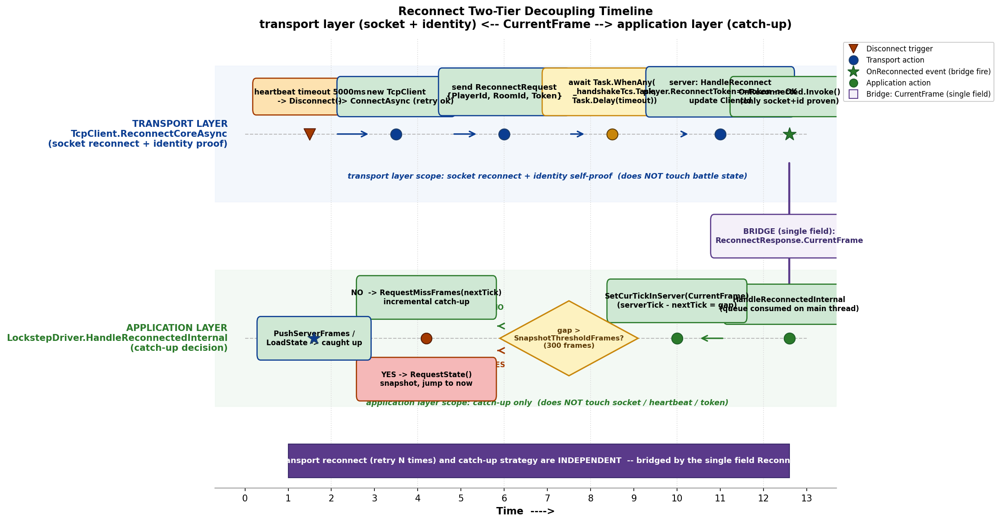
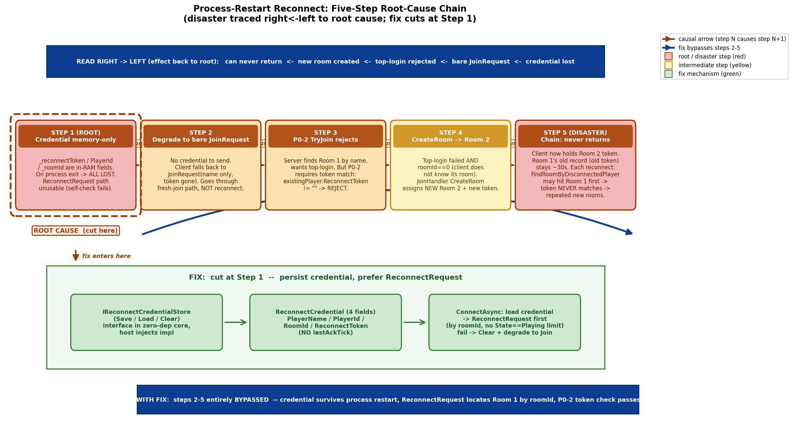
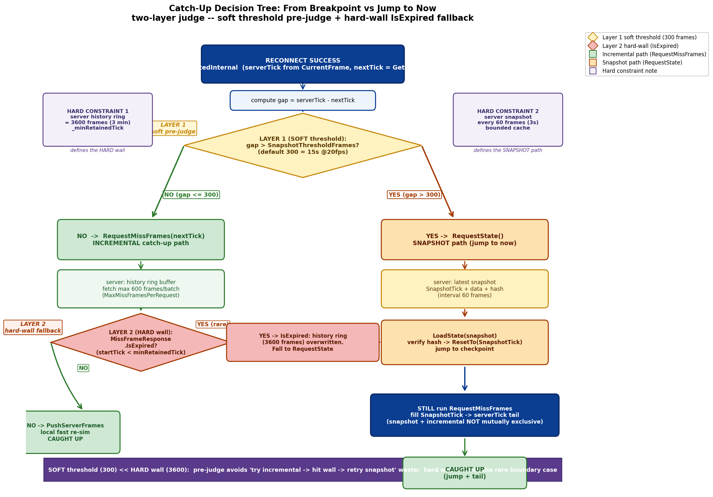

# 第 19 章 · 断线重连:快照 + 增量帧 + ReconnectToken

> **核心问题**:前面 17 章我们造了一台"单机就确定"的机器,又把它接到了不可靠的网络上,做出了预测回滚、网络时钟、冗余抗丢包、双模式服务器。可还有一个最朴素的需求没解决:一个玩家打着打着,**手机突然断网几十秒**,网络回来后,他怎么追上这几十秒里别人已经打完的战局?更糟的情况是:**玩家直接把 App 杀掉重启**——进程都死了,内存里什么都丢了,他怎么回到原来那间房、原来那个座位?这一章就把这两件事讲透。

> **读完本章你会明白**:
> 1. 重连为什么是**双级解耦**的——传输层只管"把断了的 socket 重新接上并自证身份",应用层只管"把缺的几十秒战局追回来",两层职责清晰、互不纠缠。
> 2. 进程重启后重连的**五步根因链**:为什么 P0-2 安全加固(token 顶号校验)会跟"进程级重连"需求正面冲突,以及怎么用"IReconnectCredentialStore 接口 + ReconnectRequest 优先"漂亮地化解——既不开安全的倒车,又能让重启后回到原房间。
> 3. 凭证为什么是**4 个字段、刻意不含 lastAckTick**,以及为什么"默认 NullStore"而不是直接内置文件存储。
> 4. "从断点续"还是"跳到现在"——这个决策为什么不是拍脑袋,而是服务器帧历史窗口(3600 帧)和 SnapshotThresholdFrames(默认 300 帧)两个硬约束共同逼出来的。
> 5. 两条重连协议路径(顶号 TryJoin vs 显式 ReconnectHandler)为什么都用 token,但载体和语义截然不同。
> 6. 观战模式为什么是"重连的一个特例"。

> **如果一读觉得太难**:先只记住三件事——① 重连分两层,传输层重接连 socket,应用层追帧补战局;② 进程重启靠把凭证(PlayerId/RoomId/Token)落盘,下次启动读出来发 ReconnectRequest 回原房间,失败就清掉凭证降级全新加入;③ 落后太多(超过服务器帧历史窗口 3600 帧)就拉快照跳到现在,落后不多就走增量帧从断点续。

---

## 〇、一句话点破

> **重连的本质是"重新建立一条已断的 socket,然后在不破坏确定性的前提下,把这条 socket 错过的几十秒输入序列补回来"。LockstepSdk 把它拆成两级:传输层只做"重连 + 身份自证"(发 ReconnectRequest{PlayerId,RoomId,Token},服务器校验 token 后更新 ClientId),它不关心战局;应用层只做"追帧"(重连成功后立刻 RequestMissFrames,把缺的帧从服务器环形历史缓冲里拉回来,在本地飞速重演)。进程重启场景下,凭证(4 字段,无 lastAckTick)落盘由宿主注入的 IReconnectCredentialStore 负责,核心零依赖层只定接口不写实现。**

这是结论。本章倒过来拆:先讲重连到底分几级、每级各管什么;再讲进程重启那个最棘手的场景,以及它的五步根因链;然后讲追帧时"从断点续 vs 跳到现在"的决策树;最后讲两条重连协议路径的差异和观战模式。

---

## 一、重连的两层职责:为什么必须解耦

这是本章最重要的一节。很多人对重连的理解是"一个大流程",但 LockstepSdk 的重连是**严格双级解耦**的——理解了这个解耦,后面所有细节都顺理成章;不理解它,代码读起来就是一团乱麻。

### 先提一个问题:朴素做法撞什么墙

最朴素的"重连"设计会是怎样?大概是这样:网络断了 → 客户端自动重新连 socket → 连上之后告诉服务器"我是 Room X 的 Player Y,我断线前在第 N 帧,请把 N 到现在的帧发给我" → 服务器查历史帧缓冲,把 N 帧之后的全部打包发来 → 客户端收到后飞速重演追上 → 继续正常对战。

听上去挺顺。但这种"一锅端"的设计有三个要命的问题:

**问题一:socket 重连和追帧混在一起,任何一个失败都会污染另一个。** socket 重连可能因为网络还没真的通而失败好几次(要重试),追帧可能因为落后太多要走快照而非增量帧。两件事揉在一起,状态机会爆炸——"我在重试 socket 呢,要不要同时准备追帧?""socket 连上但追帧失败,要不要断开重连?"

**问题二:谁来保存"我断线前在第 N 帧"这个 lastAckTick?** 如果是客户端自己存,那客户端进程一退出,这个信息就丢了;如果是服务器存,那服务器怎么知道这个 ClientId 对应的是之前那个玩家(玩家的 ClientId 在重连时会变,因为 socket 是新的)?

**问题三:进程重启怎么办?** 上面这套流程假设"客户端进程一直活着,只是网络断了"。但玩家可能直接杀掉 App、重启手机、重装游戏——进程都死了,内存里的 token、PlayerId、RoomId、lastAckTick 全没了。这时候客户端怎么"自证"自己是谁?

> **不这样会怎样**:把重连做成一个"大流程",会让状态机爆炸(socket 重试 × 追帧策略 × 进程生死三个维度纠缠),任何一个子流程失败都会牵连其他。更致命的是,它没法处理进程重启——而进程重启在手游里极其常见(玩家杀 App、清后台、手机重启、闪退)。

### 所以这样设计:传输层重连 + 应用层追帧,职责分离

LockstepSdk 的答案是:**把重连拆成两个完全独立的层级,各管各的,用 ReconnectResponse.CurrentFrame 这个唯一字段做衔接**。

```
   传输层(Transports/TcpClient.cs 等)        应用层(LockstepDriver.cs)
   ──────────────────────────────────         ─────────────────────────────
   心跳超时 5000ms → Disconnect               OnDisconnected 事件 → 入命令队列
   ↓                                          ↓
   ReconnectCoreAsync:                        HandleDisconnectedInternal:
   new TcpClient → Connect                    IsReconnecting = true, 立即重连
   ↓                                          ↓
   发 ReconnectRequestMessage                 UpdateReconnect 倒计时
   {PlayerId, RoomId, Token}                  ↓ (传输层成功)
   ↓                                          OnReconnected 事件 → 入命令队列
   等 ReconnectResponseMessage                ↓
   (TaskCompletionSource+Delay)              HandleReconnectedInternal:
   ↓                                          读 ReconnectResponse.CurrentFrame
   成功 → OnReconnected?.Invoke() ─────────→  决策:RequestState 还是 RequestMissFrames
                                              ↓
                                              收到 StateResponse / MissFrameResponse
                                              ↓
                                              LoadState 跳到快照点 / PushServerFrames 追帧
```

左边的传输层**只干一件事**:把断了的 socket 重新接上,并自证身份。它发的是 `ReconnectRequestMessage{PlayerId, RoomId, ReconnectToken}`,服务器回 `ReconnectResponseMessage{Success, CurrentFrame}`,期间用 `TaskCompletionSource` + `Task.Delay` 等响应(超时即失败)。它**完全不碰战局**——不知道当前是第几帧、不知道缺了多少帧、不知道该拉快照还是增量帧。它只关心一件事:socket 接通了、服务器认了我的身份。

右边的应用层**也只干一件事**:在重连成功的回调里,根据 `ReconnectResponse.CurrentFrame`(服务器当前帧号)和自己 `ConfirmedTick`(本地已确认到的帧号)的差距,决定怎么追。它**完全不碰 socket**——不负责重连、不负责心跳、不负责 token。它只关心一件事:把缺的帧补回来。

衔接这两层的就是 `ReconnectResponse.CurrentFrame` 这一个字段。传输层从服务器把它拿回来,通过 `OnReconnected` 事件触发应用层的 `HandleReconnectedInternal`,后者读 `SetCurTickInServer(reconnectMsg.CurrentFrame)` 把服务器帧号灌进控制器,然后做"追多少、怎么追"的决策。

> **钉死这件事**:重连是双级解耦的。传输层只管 socket 重连 + 身份自证(发 ReconnectRequest,等 ReconnectResponse),不碰战局;应用层只管追帧(重连成功后根据 CurrentFrame 决策 RequestState 还是 RequestMissFrames),不碰 socket。两层用 ReconnectResponse.CurrentFrame 这一个字段衔接。这个解耦让"socket 重试 N 次"和"追帧策略选择"两个复杂问题互不污染。

### 传输层重连:ReconnectCoreAsync 到底干了什么

我们看 TCP 传输层的重连核心,以 `TcpNetworkClient` 为例(UDP/WebSocket/KCP 四个传输层结构一致,都抽了同一个 `ReconnectCoreAsync`):

```csharp
// TcpClient.cs:200-260 (简化示意, 非源码原文)
private async Task<bool> ReconnectCoreAsync(int playerId, int roomId, string token, int timeout)
{
    try
    {
        Disconnect();                          // 1. 先彻底断开旧连接(关 stream/client, 触发 OnDisconnected)

        _client = new TcpClient();             // 2. 造一个全新的 TcpClient (旧 socket 已废)
        _cts?.Dispose();                       //    P1 生命周期:重连前释放上一轮 CTS (原仅 Cancel, 句柄累积)
        _cts = new CancellationTokenSource();

        var connectTask = _client.ConnectAsync(_serverAddress, _serverPort);
        if (await Task.WhenAny(connectTask, Task.Delay(timeout)) != connectTask)
        {
            _client.Close();
            return false;                      // 3. 连接超时直接 false, 应用层会按 ReconnectIntervalSec 再试
        }
        await connectTask;

        _stream = _client.GetStream();
        _ = ReceiveLoopAsync(_cts.Token);      // 4. 启动新的接收循环

        _handshakeTcs = new TaskCompletionSource<bool>();
        var reconnectRequest = new ReconnectRequestMessage   // 5. 发重连请求, 三字段自证身份
        {
            PlayerId = playerId,
            RoomId = roomId,
            ReconnectToken = token
        };
        await SendAsync(reconnectRequest);

        var completedTask = await Task.WhenAny(_handshakeTcs.Task, Task.Delay(timeout));
        if (completedTask == Task.Delay(timeout))  // 6. 等响应, 超时即失败
        {
            Disconnect();
            return false;
        }

        bool success = await _handshakeTcs.Task;
        if (success)
        {
            PlayerId = playerId;               // 7. 把传入参数固化到字段(进程重启场景字段是空的)
            _roomId = roomId;
            _reconnectToken = token;
            _lastPongTime = DateTimeOffset.UtcNow.ToUnixTimeMilliseconds();
            StartHeartbeat();                  // 8. 重新启动心跳
            OnReconnected?.Invoke();           // 9. 触发应用层追帧
        }
        return success;
    }
    catch (Exception ex) { OnError?.Invoke(ex); return false; }
    finally { _handshakeTcs = null; }
}
```

这里有三个细节值得展开:

**细节一:为什么先 `Disconnect()` 再 `new TcpClient()`?** 因为旧的 socket 已经废了(网络断了/心跳超时)。直接复用旧的 `TcpClient` 对象是不行的——它内部的 socket 已经处于不可用状态。必须彻底断开(关 stream、关 client、触发 OnDisconnected),然后造一个全新的 `TcpClient`。注释里"P1 生命周期:重连前释放上一轮 CTS"还点出一个曾经踩过的坑:原来只 `_cts.Cancel()` 不 `Dispose()`,每次重连都泄漏一个 CancellationTokenSource 句柄,一晚上重连几百次句柄就爆了。现在改成先 Dispose 旧的再 new 新的。

**细节二:`TaskCompletionSource` + `Task.Delay` 的"等响应"模式。** 重连请求发出去之后,不能阻塞等响应(那会让网络线程卡死),而是用一个 `TaskCompletionSource<bool> _handshakeTcs`,发完请求就 `await Task.WhenAny(_handshakeTcs.Task, Task.Delay(timeout))`。响应回来时,接收循环里的 `HandleInternalMessage` 会调 `_handshakeTcs.TrySetResult(reconnectResp.Success)` 唤醒它;超时则 `Task.Delay` 先完成,判定失败。这是异步网络编程里"请求-响应"配对的标准套路,不用回调链,代码线性可读。

**细节三:第 7 步"把传入参数固化到字段"。** 注意 `ReconnectCoreAsync` 的参数 `(playerId, roomId, token)` 是从外部传进来的,**不依赖字段**。这点极其重要——同进程重连时(`ReconnectAsync` 调用),字段里还有值;但**进程重启后**(`ConnectAsync` 自动重连调用),字段全是空的(PlayerId=-1, _roomId=0, _reconnectToken="")。同一个方法要服务两个场景,就必须参数化。成功之后才把传入参数写回字段。这就是为什么注释特意说"参数化凭证(不依赖字段),同进程 ReconnectAsync 与进程重启后 ConnectAsync 自动重连共用"。

> **承接 P4-15**:GameRoom 的顶号重连 `TryJoin` 也用 token(那里是 JoinRequest 路径),本章的 ReconnectHandler 是另一条独立的重连路径。两条路径都用 token 做身份校验,但**载体和语义不同**——这个差异我们留到本章第五节详讲。

### 应用层追帧:HandleReconnectedInternal 的决策

传输层 `OnReconnected` 触发后,应用层(LockstepDriver)把它入命令队列(跨线程纪律,P4-12 讲过),下一帧 Update 顶部主线程消费,调 `HandleReconnectedInternal`:

```csharp
// LockstepDriver.cs:972-1012 (简化示意)
private void HandleReconnectedInternal()
{
    if (!IsRunning || !IsReconnecting) return;   // 幂等守卫

    IsReconnecting = false;
    _lastMissFrameReqTick = -1;
    _frameAccumulator = 0;
    _consecutiveSyncFailures = 0;
    _stateRequestInFlight = false;               // C-7:清掉上一会话的在途 StateRequest
    _stateRequestLimiter.Reset();
    _missFrameRequestLimiter.Reset();
    _clock?.Reset();                             // 重置网络时钟(保留 RTT 历史)

    // 关键:不要重置 _inputTick!
    int oldInputTick = _inputTick;
    int nextTick = _controller?.GetNextNeededTick() ?? 0;
    int serverTick = _controller?.CurTickInServer ?? 0;

    // 阈值检查 —— 这是"从断点续 vs 跳到现在"的第一道决策
    if (serverTick - nextTick > _config.SnapshotThresholdFrames)
    {
         RequestState();                          // 落后太多 → 拉快照, 跳到现在
    }
    else
    {
         RequestMissFrames(nextTick);             // 落后不多 → 从断点续
    }
}
```

注意那条注释"**关键:不要重置 _inputTick**"。这是一个反直觉但正确的决策。朴素做法是"重连后把 inputTick 也清零,从头开始",但那样会让本地时钟估算和实际 inputTick 错位——`_inputTick` 是本地"已经发送过输入的帧号",清零会导致 `SendInput` 从第 0 帧重新发,而服务器早就过了第 0 帧,这些过时输入会被服务器丢弃(GameRoom.OnPlayerInput 有 `tick < _currentTick` 弃包逻辑)。正确做法是**保留 inputTick**,让 Update 里的时钟逻辑(基于 SRTT/PreSendCount)自然驱动它往前走。

应用层在重连成功后做的核心决策就一个:**落后多少帧?** 算法是 `serverTick - nextTick`(服务器当前帧 - 本地下一个需要的帧)。如果这个差值超过 `SnapshotThresholdFrames`(默认 300 帧 = 15 秒 @20fps),说明落后太多,走快照(RequestState);否则走增量帧(RequestMissFrames)。这个决策的完整逻辑(含 isExpired 兜底)我们在第四节详讲。

> **钉死这件事**:应用层追帧的核心是"决策:从断点续还是跳到现在"。判断依据是 serverTick - nextTick 跟 SnapshotThresholdFrames 的比较。重连成功后绝不能重置 _inputTick(否则时钟估算和实际错位)。



---

## 二、进程重启重连:最棘手的场景与五步根因链

上一节讲的是"同进程重连"——客户端进程一直活着,只是网络断了。这一节讲更棘手的:**进程重启重连**。这是 LockstepSdk 在加固期踩过的一个经典 bug(项目里记为 E15 / 进程级重连),它的根因链是一个绝佳的"安全需求与可用性需求冲突"案例。

### 先讲场景:朴素做法撞什么墙

考虑这个场景:玩家 A 在 Room 1 打得正欢,突然手机没电自动关机。他充上电,重启手机,重新打开游戏。这时候他期望什么?——**回到 Room 1,接着打**。

但用前面那套"同进程重连"机制能做到吗?做不到。因为同进程重连依赖传输层内存里的三个字段:`_reconnectToken`、`PlayerId`、`_roomId`(收到 JoinResponse 时存进内存)。进程一死,这三个字段全没了。重启后客户端只能发一个裸的 `JoinRequest`(不带 token),走全新加入流程。

那走全新加入会怎样?这就撞上了 P0-2 安全加固(GameRoom.TryJoin 的 token 顶号校验,第 15 章讲过)。服务器发现"Room 1 里已经有一个叫 Player A 的玩家",走顶号分支,但因为客户端没带 token → `existingPlayer.ReconnectToken != reconnectToken` → **顶号被拒**。顶号失败 + roomId==0 → 服务器给 A 新建一个 Room 2 → A 进了新房间。

更糟的是**连锁反应**:A 此后持有的是 Room 2 的 token,而 Room 1 里 A 的旧记录(旧 token)一直还在(直到 30 秒空置回收)。每次 A 重连,`FindRoomByDisconnectedPlayer` 的 FirstOrDefault 可能先命中 Room 1(旧 token 永远对不上)→ 反复新建房间。**A 再也回不去 Room 1。**

> **作者复盘 · P0-2 安全加固与进程级重连的冲突**:这是一个典型的"安全 vs 可用性"冲突。P0-2 修的是"攻击者仅凭玩家名就能顶号劫持身份"(不带 token 就拒绝顶号,安全上完全正确);但客户端没有持久化 token 的能力,进程一重启就变成"不带 token 的裸 JoinRequest",被 P0-2 无情拒绝,降级进新房间。两边的逻辑各自都对,组合起来却产生了"再也回不去原房间"的灾难。这种冲突在工程里极其常见——单个模块的"正确"不等于组合后的"正确"。

### 五步根因链:把灾难拆成因果

这个 bug 的根因不是单点,而是一条五步因果链。把它拆清楚,才知道该在哪一步下刀:



**第一步:凭证只在内存,不落盘。** 传输层的 `_reconnectToken` / `PlayerId` / `_roomId` 全是内存字段(收到 JoinResponse 时只存内存)。进程一退,全没。`ReconnectAsync` 开头自检 `if (string.IsNullOrEmpty(_reconnectToken) || PlayerId < 0 || _roomId <= 0) return false`——凭证空了,ReconnectRequest 路径直接走不通。

**第二步:只能退化成裸 JoinRequest。** 凭证丢了,客户端只能发 `JoinRequest`(name + 可选 token,但 token 也没了)。这走的是全新加入路径,不是重连路径。

**第三步:JoinHandler 找到 Room 1,走顶号分支 TryJoin。** 服务器按玩家名找到 Room 1(里面有断线的 Player A),想顶号——但 P0-2 要求 token 匹配。客户端没带 token → 不匹配。

**第四步:TryJoin 失败 + roomId==0 → CreateRoom。** 顶号被拒,客户端又没指定 roomId(它根本不知道自己在哪个房间),JoinHandler 第 89 行 `CreateRoom` 给它新建 Room 2。A 拿到新 token。

**第五步:连锁——再也回不去。** A 持有 Room 2 的新 token,Room 1 里 A 的旧记录(旧 token)还在。每次重连,FindRoomByDisconnectedPlayer 可能先命中 Room 1(旧 token 永远对不上)→ 反复新建房间,直到 Room 1 被 CheckEmptyRoom 30 秒空置回收。

这条链告诉我们:**在第一步下刀最划算**——让凭证落盘,进程重启后能取回来,就能优先走 ReconnectRequest(而不是退化成裸 JoinRequest),后面四步灾难全部绕开。如果到第二、三步才下刀(比如放开 P0-2 允许空 token 顶号),那是在开安全的倒车;如果在第四步下刀(CreateRoom 时先查有没有同玩家的旧房间),那是治标不治本,第五步的连锁还在。

### 修复方案:凭证持久化 + 依赖注入(核心零依赖不破)

修复的核心思路是:**让客户端把重连凭证落盘,进程重启后取回,优先走 ReconnectRequest 回原房间**。但这里有个硬约束——`Lockstep.Network` 是核心零依赖层(不能引用任何特定引擎,这是为了能在 Unity、Godot、Raylib、控制台等各种宿主里用),所以**持久化机制不能写死在 Network 层**。

怎么做?答案承袭第 18 章的 SDK 化哲学:**Network 层只定接口,宿主层注入实现**。

```csharp
// ReconnectCredentialStore.cs:12-47 (简化示意)
public sealed class ReconnectCredential
{
    public string PlayerName = "";        // 降级全新 JoinRequest 时需要
    public int PlayerId = -1;             // ReconnectRequest 定位槽位
    public int RoomId = 0;                // ReconnectRequest 定位房间
    public string ReconnectToken = "";    // P0-2 身份校验

    public bool IsValid =>
        !string.IsNullOrEmpty(ReconnectToken) && PlayerId >= 0 && RoomId > 0;
}

public interface IReconnectCredentialStore
{
    void Save(ReconnectCredential credential);
    ReconnectCredential? Load();
    void Clear();
}
```

**ReconnectCredential 只有 4 个字段,刻意不含 lastAckTick**。这个设计是有意为之,值得单独拎出来说(见下一节的"为什么不含 lastAckTick")。

`IReconnectCredentialStore` 是个三方法接口:Save(持久化)、Load(读取,无凭证或不可用返回 null)、Clear(清除)。这个接口的设计和第 18 章的 `ILockstepLogger` 一脉相承——核心层定接口,宿主按需注入具体实现。

### NullReconnectCredentialStore:默认空实现,不是文件实现

这里有个极其重要的设计决策:**默认实现是 NullReconnectCredentialStore(空实现),不是 FileReconnectCredentialStore(文件实现)**。

```csharp
// ReconnectCredentialStore.cs:53-62
public sealed class NullReconnectCredentialStore : IReconnectCredentialStore
{
    public static readonly NullReconnectCredentialStore Instance = new();
    private NullReconnectCredentialStore() { }
    public void Save(ReconnectCredential credential) { }
    public ReconnectCredential? Load() => null;   // 恒返回 null = 进程重启无法重连
    public void Clear() { }
}
```

为什么不直接把文件存储当默认?三个理由:

**理由一:零依赖核心不能假设存储介质。** Lockstep.Network 的核心零依赖原则意味着它不能假设"宿主有文件系统"。WebGL 宿主没有传统文件系统(只有 localStorage),Unity 宿主习惯用 PlayerPrefs,某些沙箱环境连磁盘访问都没有。把文件存储当默认,等于把"有文件系统"这个假设塞进核心层——破坏零依赖。

**理由二:保持改造前行为(向后兼容)。** 在这个修复之前,进程重启就是无法重连的(凭证内存态)。默认 NullStore = Load 恒返回 null = 改造前的行为。现有所有不注入 store 的代码、测试、demo 行为零变化。这是一个"修复不能引入新 bug"的硬纪律——你修了进程级重连,但不能因此把"不需要进程级重连"的用户也卷进去。

**理由三:显式优于隐式。** 进程级重连是有代价的(凭证落盘到本地,有安全考量——虽然 token 不在网络上裸传,但本地落盘意味着攻破客户端本机就能拿到 token)。宿主应该**显式知情**地启用它,而不是被默认行为裹挟。宿主想要进程级重连,就显式 `WithCredentialStore(new FileReconnectCredentialStore(...))`;不想要,就什么都不做(默认 Null)。这种"能力默认关、显式开"的设计,和 Rust 的 `unsafe`、第 5 章的 `[AllowUnsafeField]` 是一个思路——把危险/有副作用的能力做成显式 opt-in。

> **钉死这件事**:进程级重连的修复是在五步根因链的"第一步"(凭证落盘)下刀,用 IReconnectCredentialStore 接口 + 宿主注入实现,既不开 P0-2 安全的倒车,又不破坏核心零依赖。默认 NullReconnectCredentialStore(空实现)= 改造前行为,宿主显式注入 FileStore 才启用进程级重连。这是"能力默认关、显式开"的安全设计哲学。

### FileReconnectCredentialStore:5 行纯文本 + 全程吞异常

虽然核心层不内置文件存储,但提供了一个参考实现 `FileReconnectCredentialStore` 供桌面/控制台宿主(Raylib demo 等)直接用。它的设计有两个值得拆透的点。

**文件格式:5 行纯文本,字符串字段 Base64。**

```
1                # 格式版本 (FormatVersion=1)
<playerId>       # 整数
<roomId>         # 整数
<base64 playerName>   # 字符串字段 Base64 编码 (容纳任意字符)
<base64 token>        # 字符串字段 Base64 编码
```

为什么是纯文本而不是 JSON/binary?因为纯文本最简单、最可调试(出问题肉眼看一眼就知道)、不依赖任何序列化库(零依赖)。Base64 编码字符串字段是为了容纳玩家名里的任意字符(中文、特殊符号、换行),避免分隔符冲突。5 行这个数量是固定的,Load 时可以校验 `lines.Length < 5 → return null`。

**全程 try-catch 吞异常 + lock,损坏返回 null 降级。**

```csharp
// FileReconnectCredentialStore.cs:60-88 (简化示意)
public ReconnectCredential? Load()
{
    lock (_lock)
    {
        try
        {
            if (!File.Exists(_path)) return null;          // 文件不存在
            var lines = File.ReadAllLines(_path);
            if (lines.Length < 5) return null;             // 行数不对 (损坏/截断)
            if (!int.TryParse(lines[0], out int version) || version != FormatVersion) return null;  // 版本不符
            if (!int.TryParse(lines[1], out int playerId)) return null;
            if (!int.TryParse(lines[2], out int roomId)) return null;

            var cred = new ReconnectCredential { /* ... */ };
            return cred.IsValid ? cred : null;             // 最后再校验一次 IsValid
        }
        catch { return null; }                             // 任何异常都降级
    }
}
```

这个"全程吞异常返回 null"的策略极其重要。凭证文件可能因为各种原因损坏:磁盘满、并发写覆盖(两个客户端实例同时写)、用户手动编辑搞坏、跨版本格式变更、文件被杀毒软件锁定……任何一种损坏都不能让游戏崩溃。Load 返回 null 的语义是"没有可用凭证",调用方(传输层 ConnectAsync)会自然降级成全新 JoinRequest。**凭证是"锦上添花"的优化,不是必需品——丢了就降级,绝不阻断主流程。** 这个原则也体现在 Save 的注释里:"持久化失败不阻断连接流程(凭证仅用于进程级重连优化,非必需)"。

`lock(_lock)` 是因为 Save/Load/Clear 可能在不同线程调用(心跳 Timer 线程触发 Save、主线程触发 Load),需要保护文件读写不并发。

> **承接 P5-18**:这个"核心定接口、宿主注入实现"的模式,正是第 18 章 SDK 化讲的"核心零依赖 + 宿主注入依赖"哲学。IReconnectCredentialStore 和 ILockstepLogger 是同一套设计。Unity 宿主可以基于 PlayerPrefs 另写一个实现(JSON 序列化 ReconnectCredential,按 accountId 分键)。

### 进程级重连的触发:ConnectAsync 里的优先级

现在看凭证持久化怎么接入主流程。传输层的 `ConnectAsync` 在"未显式传 token"时,会优先尝试从凭证存储读取并重连:

```csharp
// TcpClient.cs:95-113 (简化示意)
public async Task<bool> ConnectAsync(string playerName, int roomId = 0, int requiredPlayers = 2,
                                     int timeoutMs = 0, string reconnectToken = "")
{
    int timeout = timeoutMs > 0 ? timeoutMs : _connectTimeoutMs;

    // 进程级重连:未显式传 token 且本地持久化了有效凭证 → 优先 ReconnectRequest
    if (string.IsNullOrEmpty(reconnectToken))
    {
        var cred = _credStore.Load();
        if (cred != null && cred.IsValid)
        {
            if (!string.IsNullOrEmpty(cred.PlayerName)) _playerName = cred.PlayerName;
            _logger.Debug($"[TcpClient] Found persisted credential, attempting reconnect to Room {cred.RoomId} as Player {cred.PlayerId}");
            if (await ReconnectCoreAsync(cred.PlayerId, cred.RoomId, cred.ReconnectToken, timeout))
                return true;                       // 重连成功, 直接返回
            _logger.Info("[TcpClient] Persisted reconnect failed, falling back to fresh join");
            _credStore.Clear();                    // 凭证过期(房间销毁/token失效), 清掉
        }
    }

    // 降级:全新 JoinRequest (原来的逻辑)
    try { /* ... Connect + JoinRequest + 等 JoinResponse ... */ }
}
```

这段代码的设计有三个精妙处:

**精妙处一:对调用方完全透明。** 宿主调 `client.ConnectAsync("Player1")`——它不知道也不需要知道"内部可能走了重连"。返回 true 就是连上了(可能是重连回原房间,也可能是全新加入),返回 false 就是没连上。宿主代码完全不用改,只要在构造时注入了 FileStore,就自动获得了进程级重连能力。这就是"对调用方透明"的接口设计——把复杂度吃在内部,对外只暴露简单的契约。

**精妙处二:失败必 Clear + 降级,不撞南墙。** 持久化凭证可能过期(房间已被销毁、token 已失效、服务器重启过)。如果 ReconnectCoreAsync 失败,立刻 `_credStore.Clear()` 清掉过期凭证,然后继续往下走全新 JoinRequest。**这一步是保证不引入新 bug 的关键**——如果没有 Clear,下次启动又会读到同一个失效凭证,又失败,又降级……陷入死循环。Clear 掉,下次就是干净的全新加入,拿到新凭证重新 Save。

**精妙处三:只在"未显式传 token"时触发。** 注意 `if (string.IsNullOrEmpty(reconnectToken))` 这个条件。如果宿主显式传了 token(那是顶号场景,第 15 章讲过),就不走凭证存储的重连分支,走原来的 JoinRequest 顶号逻辑。这保证了两条重连路径(顶号 vs 显式 ReconnectHandler)互不干扰——顶号归顶号,进程级重连归进程级重连,各走各的协议。

> **钉死这件事**:进程级重连对调用方完全透明——宿主只要构造时注入 FileStore,ConnectAsync 内部会自动"先试凭证重连,失败就 Clear + 降级全新加入"。失败必 Clear 是防死循环的关键。只在"未显式传 token"时触发,保证不干扰顶号路径。

---

## 三、凭证为什么是 4 个字段,刻意不含 lastAckTick

上一节提到了 ReconnectCredential 只有 4 个字段(PlayerName/PlayerId/RoomId/ReconnectToken),**刻意不含 lastAckTick**(客户端最后确认到的帧号)。这是个反直觉的设计——很多人第一反应是"重连得告诉服务器我断在哪一帧,服务器才知道从哪开始补帧"。为什么不存 lastAckTick?

### 朴素做法:凭证里存 lastAckTick

朴素设计会让 ReconnectCredential 多一个字段 `LastAckTick`,重连时发 `ReconnectRequest{PlayerId, RoomId, Token, LastAckTick}`,服务器从 LastAckTick 开始补帧。

听起来合理,但有两个问题:

**问题一:lastAckTick 不可信。** 客户端"最后确认到的帧"是客户端自己说的。但在帧同步的威胁模型里,客户端是不可信的(可能有外挂篡改)。如果服务器无脑相信客户端报的 LastAckTick,攻击者可以故意报一个很小的值(比如 0),让服务器从第 0 帧开始重发——这既浪费服务器带宽(重发几千帧),又可能被用来探测服务器的历史帧缓冲(信息泄露)。所以服务器不会"信任"客户端报的断点。

**问题二:lastAckTick 没必要。** 服务器其实不需要客户端告诉它"你断在哪"。服务器自己有记录——它知道每个玩家的 ClientId 什么时候断的(心跳超时),它知道房间当前第几帧。重连的核心是"身份自证"(我是这个房间的这个玩家),身份确认后,服务器只要告诉客户端"现在第 N 帧",客户端自己知道自己 ConfirmedTick 是几,差距自己算。这个差距决定追帧策略,是客户端的决策,不是服务器的。

### 所以这样设计:凭证只管身份,追帧靠客户端发 MissFrameRequest

LockstepSdk 的设计是**把"身份校验"和"断点续传"彻底分开**:

- **凭证(4 字段)只管身份校验**:PlayerId/RoomId/Token 三件套让服务器确认"你确实是这个房间的这个玩家"(HandleReconnect 里 `player.ReconnectToken != token → 拒绝")。PlayerName 是降级全新 JoinRequest 时用的(凭证失效,至少还能用原名重新加入)。
- **追帧断点靠客户端发 MissFrameRequest**:重连成功后,客户端自己知道 ConfirmedTick(本地已确认到的帧),它发 `MissFrameRequestMessage{StartFrame = nextTick}`,服务器从历史帧缓冲里取对应帧返回。**断点是客户端的本地状态,不需要也不应该持久化到凭证里**——因为客户端本地一直记着 ConfirmedTick(它在内存里,只要进程活着就有;进程重启的话,客户端反正要重新 InitializeSimulation,从第 0 帧开始追,断点就是 0)。

这个分离还有一个好处:**凭证是"身份快照"(JoinResponse 成功那一刻固化),不会随帧推进而变化**;而 lastAckTick 是"动态状态"(每帧都在变)。把动态状态塞进静态凭证会导致"什么时候更新凭证"的复杂度——每帧 Save 一次?太贵;周期 Save?万一断在两次 Save 之间,凭证里的 lastAckTick 就过时。索性不存,客户端内存里自己记,简单可靠。

> **钉死这件事**:ReconnectCredential 刻意不含 lastAckTick,因为① 服务器不信任客户端报的断点(防篡改/防探测);② 服务器不需要知道断点,客户端自己知道 ConfirmedTick,重连后自己发 MissFrameRequest 拉帧;③ 凭证是静态身份快照,lastAckTick 是动态状态,混在一起会引入"何时更新凭证"的复杂度。这个设计把"身份校验"和"断点续传"彻底分开。

### 凭证何时持久化:JoinResponse 成功那一刻

凭证什么时候 Save?答案是**首次 JoinResponse 成功的那一刻**(以及重连成功后)。看 TCP 传输层的 HandleInternalMessage:

```csharp
// TcpClient.cs:375-387 (简化示意)
case JoinResponseMessage joinResp:
    if (joinResp.Success)
    {
        PlayerId = joinResp.PlayerId;          // 服务器分配的 PlayerId
        _roomId = joinResp.RoomId;             // 服务器分配的 RoomId
        _reconnectToken = joinResp.ReconnectToken;  // 服务器发的 token
        _handshakeTcs?.TrySetResult(true);
    }
    // ...
```

然后 ConnectAsync 在 handshake 成功后:

```csharp
// TcpClient.cs:154-166 (简化示意)
bool success = await _handshakeTcs.Task;
if (success)
{
    _lastPongTime = DateTimeOffset.UtcNow.ToUnixTimeMilliseconds();
    StartHeartbeat();
    _credStore.Save(new ReconnectCredential   // ← 凭证在此刻持久化
    {
        PlayerName = playerName,
        PlayerId = PlayerId,                  // 字段已在 HandleInternalMessage 设好
        RoomId = _roomId,
        ReconnectToken = _reconnectToken
    });
}
return success;
```

注释特意说"HandleInternalMessage 已设好 PlayerId/_roomId/_reconnectToken 字段"。这三个值都是服务器在 JoinResponse 里下发的(客户端自己不知道自己会被分到哪个 Room、哪个 PlayerId、什么 token)。客户端只是个"搬运工"——服务器给什么,它存什么。这也是为什么 token 是安全的:它不是客户端生成猜的,是服务器随机生成下发的,攻击者不联网拿不到。

---

## 四、从断点续 vs 跳到现在:追帧的决策树

重连成功 + 身份确认后,接下来就是"怎么追帧"。前面第一节提过,应用层在 `HandleReconnectedInternal` 里做第一道决策:`serverTick - nextTick > SnapshotThresholdFrames ? RequestState : RequestMissFrames`。但完整的故事比这复杂——还有 MissFrameResponse 过期(isExpired)的兜底分支。这一节把整个决策树讲透。

### 两个硬约束:服务器帧历史窗口 + 快照缓存

在讲决策树之前,得先知道服务器侧的两个硬约束(它们决定了决策树的边界):

**约束一:服务器帧历史是环形缓冲,容量 3600 帧(3 分钟 @20fps)。** GameRoom 用 `_historyBuffer[tick % 3600]` 存每一帧的 FrameData。这是个环形缓冲——第 3601 帧会覆盖第 1 帧。所以服务器只能补发"最近 3600 帧"以内的帧。`_minRetainedTick` 记录当前缓冲里最老的帧号,客户端请求的 startTick 小于它,就 `isExpired`(过期),没法补了。这个容量选 3600(3 分钟)是权衡:太短(比如 600 帧=30 秒)的话,稍微断久一点就追不回来;太长(比如 36000 帧=30 分钟)的话,服务器内存吃太多(每帧 FrameData 几百字节,36000 帧=几 MB/房间)。

**约束二:服务器快照是周期存的,缓存上限有限。** Authoritative 模式下,服务器每 SnapshotInterval(默认 60 帧=3 秒)存一份全量状态快照(`World.SaveState()`,几 KB)。快照缓存有上限(不是无限存所有历史快照,只保留最近若干份)。客户端可以发 `StateRequestMessage` 拉最近一份快照。

这两个约束决定了:客户端追帧只能走两条路——

- **从断点续(增量帧)**:如果断的时间不长(落后在 3600 帧窗口内),发 MissFrameRequest,服务器从历史缓冲批量补发缺失的帧(每次最多 MaxMissFramesPerRequest=600 帧),客户端收到后 PushServerFrames 在本地飞速重演追上。
- **跳到现在(快照 + 后续增量)**:如果断得太久(落后超过 3600 帧窗口,历史帧被覆盖了),发 StateRequest,服务器回最近一份快照,客户端 LoadState 跳到快照点,然后再发 MissFrameRequest 补快照之后到当前的增量帧。

### 决策树:两层判断

决策不是单点的,而是两层——第一层在重连成功时基于"落后多少"预判,第二层在收到 MissFrameResponse 时基于"是否过期"兜底。



**第一层:重连成功时的预判(LockstepDriver.cs:1002-1012)。**

```csharp
int nextTick = _controller?.GetNextNeededTick() ?? 0;   // 本地下一个需要的帧
int serverTick = _controller?.CurTickInServer ?? 0;      // 服务器当前帧 (来自 ReconnectResponse)

if (serverTick - nextTick > _config.SnapshotThresholdFrames)   // 默认 300 帧 = 15 秒
{
     RequestState();           // 落后太多 → 直接拉快照, 跳到现在
}
else
{
     RequestMissFrames(nextTick);   // 落后不多 → 从断点续
}
```

`SnapshotThresholdFrames` 默认 300(15 秒 @20fps),LowLatency 预设是 200(10 秒)。这个阈值不是拍脑袋——它是一个"经验阈值":落后 15 秒以内,走增量帧重演很快(600 帧/批,几批就追完,CPU 几十毫秒);落后超过 15 秒,重演代价开始上升(几千帧要重演,而且越久越可能撞上 3600 帧窗口边界),不如直接拉快照跳过去。注意这个阈值远小于 3600 帧——它是个"提前转向"的阈值,不等真的撞墙(isExpired)才转。

**为什么是 300 而不是 3600?** 因为 3600 是"硬墙"(历史帧被覆盖,物理上补不了),300 是"软阈值"(还能补,但补的代价开始不划算)。软阈值提前转向,避免"先试增量→发现过期→再转快照"的浪费。这也是为什么 isExpired 兜底(第二层)是"罕见路径"——大多数情况第一层就正确预判了,只有网络极不稳定(重连过程中又落后了一截)才会撞上 isExpired。

**第二层:MissFrameResponse 过期的兜底(LockstepDriver.cs:855-886)。**

```csharp
private void HandleMissFrameResponse(MissFrameResponseMessage msg)
{
    if (msg.IsExpired)   // 服务器历史帧已被覆盖
    {
        _consecutiveSyncFailures++;
        _logger.Warning($"[Driver] MissFrameRequest expired (StartFrame={msg.StartFrame}), requesting snapshot instead...");
        RequestState();   // 兜底:转快照
        return;
    }

    _consecutiveSyncFailures = 0;
    _controller.PushServerFrames(msg.Frames);   // 补帧成功, 推入控制器追帧
    Metrics.RecordMissFrameResponse();

    if (msg.Frames.Length > 0)
    {
        int lastTick = msg.StartFrame + msg.Frames.Length - 1;
        SendAsync(new MissFrameAckMessage { AckTick = lastTick });   // ACK 收到哪一帧
        int nextNeeded = _controller.GetNextNeededTick();
        if (nextNeeded <= _controller.CurTickInServer)
        {
            _lastMissFrameReqTick = -1;
            _missFrameRequestLimiter.Reset();   // 允许立即请求下一批
        }
    }
}
```

`isExpired` 是服务器在 `GetMissFrames`(GameRoom.cs:803-839)里设的:客户端请求的 startTick < `_minRetainedTick`(缓冲里最老的帧),说明那帧已经被环形覆盖了,设 `IsExpired = true` 返回。客户端收到后,知道"增量帧这条路走不通了",立刻转 RequestState 拉快照。这是个兜底——正常情况下第一层预判就该走快照,只有边界情况(重连过程中又落后了、或 SnapshotThresholdFrames 设得过大)才会走到这里。

### 增量帧路径:从断点续的细节

走增量帧(RequestMissFrames)时,客户端发 `MissFrameRequestMessage{StartFrame = nextTick}`,服务器从 `_historyBuffer` 取一批帧返回(最多 MaxMissFramesPerRequest=600 帧/批)。客户端收到后:

1. `_controller.PushServerFrames(msg.Frames)`:把帧推入控制器的 RingBuffer,控制器在后续 DoUpdate 里逐帧重演(`_simulation.Tick(frame)`)。
2. 发 `MissFrameAckMessage{AckTick = lastTick}`:告诉服务器"我收到哪一帧了"(服务器目前没强制用这个 ACK,是预留的可靠性增强)。
3. 如果还没追上(`nextNeeded <= CurTickInServer`),重置限流器继续请求下一批(因为 MissFrameRequest 有频率限制,默认 2 次/秒,追帧时重置允许立即请求)。

这里有个限流的小细节:`MissFrameRequestRatePerSec=2`。为什么要限流?因为网络波动时,客户端可能疯狂发 MissFrameRequest(每帧都发现缺帧就请求),压垮服务器。限流成 2 次/秒,既保证追帧能进行,又防 DoS。追帧场景下 `_missFrameRequestLimiter.Reset()` 是显式放宽——追帧是预期内的大批量请求,不该被常规限流卡住。

重演的速度受 `MaxSimulationMsPerFrame=50ms`(LockstepController 的防卡死阈值)约束——每帧最多模拟 50ms 的逻辑帧,避免追帧时一次性重演几千帧把主线程卡死几秒。这就是追帧时 UI 会显示"正在同步... 进度 X%"的原因(OnPursueProgress 事件),它让玩家知道"我在追,别急"。

### 快照路径:跳到现在的细节

走快照(RequestState)时,客户端发 `StateRequestMessage`,服务器回 `StateResponseMessage{SnapshotTick, SnapshotData, SnapshotHash}`。客户端收到后(LockstepDriver.cs:782-853):

1. `_simulation.LoadState(msg.SnapshotData)`:把快照字节流灌进 World(恢复所有组件、随机状态、实体代数)。
2. 完整性校验:`if (msg.SnapshotHash != 0) { actualHash = _simulation.ComputeHash(); if (actualHash != msg.SnapshotHash) → 损坏, 重试 }`。这防止快照在传输中被损坏(UDP 丢包/TCP 字节翻转)导致客户端加载了一个坏状态静默 desync。
3. `_controller.ResetTo(msg.SnapshotTick)`:把控制器的 ConfirmedTick/PredictedTick 重置到快照点。
4. 更新 `_inputTick`(如果本地 inputTick 落后于快照 tick,跳过去)。
5. `_missFrameRequestLimiter.Reset(); RequestMissFrames(_controller.GetNextNeededTick())`:快照点之后到当前之间还有缺口,继续走增量帧补。

注意第 5 步——**快照路径最终也要走增量帧续追**。快照只是"跳到一个就近的检查点",跳过去之后,从检查点到当前服务器帧之间的帧还是要增量补。所以两条路径不是互斥的,而是"快照 + 增量"的组合:快照负责跳大段,增量负责补尾巴。

> **钉死这件事**:追帧决策树两层——第一层重连成功时按 SnapshotThresholdFrames(默认 300 帧)预判,落后≤300 走增量(从断点续),>300 走快照(跳到现在);第二层收到 MissFrameResponse.IsExpired 时兜底转快照(罕见路径,服务器历史帧已被环形覆盖)。两条路径不是互斥:快照路径 LoadState 跳到检查点后,还要继续走增量帧补到当前。增量帧每批最多 600 帧(MaxMissFramesPerRequest),快照每 60 帧存一份(SnapshotInterval)。

---

## 五、两条重连协议路径:顶号 TryJoin vs 显式 ReconnectHandler

前面反复提到"两条重连路径",这一节把它们摆在一起对照。这是容易混淆的地方——都叫"重连",都用 token,但载体和语义截然不同。

| 维度 | 顶号重连(TryJoin 路径) | 显式重连(ReconnectHandler 路径) |
|---|---|---|
| **协议消息** | JoinRequest(带 token) | ReconnectRequest(PlayerId+RoomId+Token) |
| **服务器入口** | JoinHandler → FindRoomByDisconnectedPlayer → TryJoin | ReconnectHandler → GetRoom(roomId) → HandleReconnect |
| **定位房间方式** | 按玩家名找(FindRoomByDisconnectedPlayer) | 按 roomId 精确定位(GetRoom) |
| **房间状态限制** | 只找 State==Playing 的房间 | 不限状态(Playing/Waiting 都能回) |
| **典型场景** | 同名登录踢掉旧连接(主动顶号) | 断线重连、进程重启重连 |
| **承自章节** | 第 15 章 GameRoom(顶号 token) | 本章(重连全流程) |

**关键差异:JoinRequest 顶号受 `State==Playing` 限制,ReconnectRequest 不限。** 这是 `RECONNECT_PROCESS_RESTART_FIX.md` 文档里特意点出的——选 ReconnectRequest 顺手覆盖了"匹配中(Waiting)断线"场景:玩家在匹配阶段(房间还在 Waiting)断线,JoinRequest 顶号找不到(FindRoomByDisconnectedPlayer 只找 Playing),但 ReconnectRequest 用 roomId 精确定位,Waiting 房间也能回。所以进程级重连优先走 ReconnectRequest,鲁棒性更好。

**两条路径都用 token,但校验逻辑在不同地方。** 顶号路径的 token 校验在 `GameRoom.TryJoin`(第 15 章讲过):`existingPlayer.ReconnectToken != reconnectToken → 拒绝`。显式重连路径的 token 校验在 `GameRoom.HandleReconnect`:

```csharp
// GameRoom.cs:552-575 (简化示意)
public (bool success, string error) HandleReconnect(int playerId, string token, string clientId)
{
    if (playerId < 0 || playerId >= _players.Count)
        return (false, "Invalid player ID");

    var player = _players[playerId];
    if (player.ReconnectToken != token)         // ← token 校验 (和 TryJoin 一样的 P0-2 逻辑)
        return (false, "Invalid token");

    _clientIdToPlayer.Remove(player.ClientId);  // 解绑旧 ClientId
    player.ClientId = clientId;                 // 绑新 ClientId (重连后 socket 变了, ClientId 变)
    player.State = PlayerConnectionState.Connected;
    player.LastActiveTime = DateTimeOffset.UtcNow.ToUnixTimeMilliseconds();
    _clientIdToPlayer[clientId] = playerId;

    return (true, "");
}
```

注意"更新 ClientId"这一步——这是重连的核心动作。玩家的 socket 断了重连,新的 socket 对应一个新的 ClientId(传输层分配的连接标识)。服务器必须把玩家记录里的 ClientId 更新成新的,否则后续广播帧的时候,还是往旧的(已断的)ClientId 发,玩家收不到。这个"换 ClientId"是重连区别于"全新加入"的关键——全新加入是新建一个 Player 记录,重连是复用原 Player 记录只换 ClientId。

> **钉死这件事**:两条重连路径都用 token 做 P0-2 身份校验,但载体不同——顶号走 JoinRequest(按玩家名找房间,受 State==Playing 限制),显式重连走 ReconnectRequest(按 roomId 精确定位,不限房间状态)。重连的核心动作是"更新 ClientId"(复用原 Player 记录,只换 socket 标识),区别于全新加入(新建 Player 记录)。

### ReconnectHandler:服务器侧不发快照不发增量帧

最后看服务器侧的 ReconnectHandler 完整流程(`ReconnectHandler.cs:14-63`),它有个容易被误解的点:

```csharp
// ReconnectHandler.cs (简化示意)
public async Task HandleAsync(MessageContext context)
{
    var request = context.GetMessage<ReconnectRequestMessage>();
    var room = server.GetRoom(request.RoomId);
    if (room == null) { /* 回 Success=false, "Room not found" */ return; }

    var (success, error) = room.HandleReconnect(request.PlayerId, request.ReconnectToken, context.ClientId);
    if (!success) { /* 回 Success=false, error */ return; }

    // 更新服务器的 logicalId 绑定
    server.BindLogicalId(clientId, logicalId, room.RoomId);
    room.UpdatePlayerClientId(request.PlayerId, logicalId);

    await server.SendAsync(new ReconnectResponseMessage
    {
        Success = true,
        CurrentFrame = room.CurrentTick        // ← 只发当前帧号
    }, logicalId);

    await server.SendAsync(new GameStartMessage { /* PlayerCount/Seed/Timestamp/FrameRate */ }, logicalId);
}
```

**容易被误解的点:服务器在 ReconnectHandler 里不发快照、不发增量帧。** 它只发两样东西:ReconnectResponse{Success, CurrentFrame}(身份确认 + 当前帧号)和 GameStartMessage(对局元信息:玩家数/随机种子/开始时间戳/帧率)。

快照和增量帧由谁发?由客户端重连成功后**主动拉取**(RequestState / RequestMissFrames),走的是 StateHandler / MissFrameHandler,不是 ReconnectHandler。这个"重连确认和追帧数据分离"的设计,和第一节的"传输层重连 + 应用层追帧解耦"一脉相承——ReconnectHandler 只管身份和当前帧号,追帧数据走专门的 Handler。好处是职责清晰:ReconnectHandler 不需要知道客户端落后多少、要不要走快照,那些是客户端的决策。

补发 GameStartMessage 是因为客户端进程重启后,内存里的 GameStartMessage(对局元信息)丢了,需要重新拿一份才能 InitializeSimulation(初始化需要 RandomSeed/PlayerCount)。同进程重连其实内存里还有 GameStartMessage,但服务器无脑补发一份也无害(客户端 Start 有 `if (IsRunning) return` 守卫,重复 GameStart 不会重复初始化——重连场景走的是 HandleGameStartForReconnect 只同步时间戳)。

---

## 六、观战模式:重连的一个特例

本章最后讲一个看似不相关、实则同源的东西:观战模式(Spectator)。

观战模式的诉求是:一个玩家中途加入一个已经在进行的对局,只看别人打,自己不参与(不发送输入)。这个需求拆解开来,会发现它和重连惊人地相似:

- **不需要发送输入**(观战者不操作)——和重连后追帧时一样(追帧阶段客户端只重演服务器帧,不发新输入)。
- **需要追上当前战局**(观战者加入时,对局可能已经进行几千帧)——和重连后追帧完全一样。
- **可能需要快照**(对局太久,增量帧追不动)——和重连的"跳到现在"路径一样。

所以观战模式的实现,本质上就是**"只收帧不发的重连"**:

1. 观战者用 JoinRequest 加入房间(服务器标记为 Spectator,不参与输入聚合)。
2. 服务器发 GameStartMessage + CurrentTick(和重连一样的元信息)。
3. 观战者客户端走重连的追帧决策树:落后≤SnapshotThresholdFrames 走增量帧,>阈值走快照。
4. 追上之后,持续接收服务器广播的帧,重演,但不发 ClientInputMessage。

换句话说,**重连机制天然支持了观战模式**——只要把"观战者"当成"一个 ConfirmedTick=0、永不发输入的重连客户端"就行。这就是为什么 LockstepSdk 没有单独的 Spectator 模块:重连的追帧基础设施(RequestState/RequestMissFrames/PushServerFrames/LoadState)已经覆盖了观战的需求。这是一个"机制复用"的好例子——好的抽象会让多个需求自然落到同一个实现上。

> **承接 P4-14**:Relay 模式(中继服务器)没有权威 sim,不存快照,所以重连只能走增量帧(RequestMissFrames),走不了快照路径(RequestState 在 Relay 模式下服务器返回 SnapshotTick=-1,客户端 HandleStateResponse 会降级回 MissFrame)。Authoritative 模式才有完整快照重连。这是两种服务器模式在重连能力上的核心差异。

---

## 七、技巧精解:重连设计的两个第一性技巧

这一节把本章最硬的两个技巧单独拆透。

### 技巧一:凭证持久化的"接口注入 + 默认空实现"——零依赖核心如何获得可配置的存储能力

这个技巧解决的是一个看似无解的矛盾:**核心层(Network)需要存储能力(凭证持久化),但核心层不能引用任何具体存储实现(零依赖原则)**。

朴素解法有三个,都不行:
- **核心层直接写文件存储**——破坏零依赖(假设了文件系统,WebGL 没有传统文件系统)。
- **把存储塞进宿主层,核心层不存**——那核心层就丧失了进程级重连能力(它不知道凭证该存哪)。
- **核心层依赖一个外部序列化库(比如 JSON.NET)**——破坏零依赖。

LockstepSdk 的解法是经典的**依赖倒置**:核心层定义 `IReconnectCredentialStore` 接口(Save/Load/Clear 三方法),提供两个实现——`NullReconnectCredentialStore`(默认空实现,Load 恒返回 null)和 `FileReconnectCredentialStore`(参考实现,基于 System.IO)。传输层构造时接受一个可选的 `IReconnectCredentialStore?`,默认 null 就用 NullStore。宿主通过 Builder 的 `WithCredentialStore(...)` 注入具体实现。

这个设计的精妙处:
1. **核心层零依赖不破**——它只依赖自己定义的接口,不依赖任何具体存储。
2. **默认行为 = 改造前行为**——NullStore 的 Load 恒返回 null,进程重启无法重连,和不实现这个功能时一模一样,现有代码零影响。
3. **宿主按需注入**——Unity 宿主写 PlayerPrefs 实现,WebGL 宿主写 localStorage 实现,桌面宿主直接用 FileStore。每个宿主用最适合自己存储介质的实现。
4. **能力显式 opt-in**——进程级重连有安全考量(token 落盘),宿主显式注入才启用,不会被默认行为裹挟。

> **反面对比**:如果核心层直接内置文件存储,WebGL 宿主(无文件系统)就跑不起来;如果核心层依赖 JSON.NET,Unity 宿主的包体积会被无谓增大。依赖倒置是唯一能同时满足"核心零依赖"+"可配置存储"+"默认安全"的解法。这个模式和第 18 章的 `ILockstepLogger` 完全同构——核心层定接口,宿主注入实现。

### 技巧二:追帧决策的"软阈值预判 + 硬墙兜底"——避免浪费的两层判断

这个技巧解决的是"什么时候从增量帧转向快照"的决策问题。

朴素解法是"试一下增量帧,过期了(isExpired)再转快照"。但这样有浪费:如果断得太久(明显超过 3600 帧窗口),先发 MissFrameRequest、等服务器回 isExpired、再转 RequestState——一来一回多耗一个 RTT,而且白白让服务器查一次历史缓冲。

LockstepSdk 的解法是**两层判断**:
- **第一层(软阈值预判)**:重连成功时,基于 `serverTick - nextTick` 跟 `SnapshotThresholdFrames`(300 帧)比较,提前选好路径。这是"经验阈值"——落后 15 秒以内增量帧很划算,超过就转快照。
- **第二层(硬墙兜底)**:走增量帧路径后,如果收到 `MissFrameResponse.IsExpired`(服务器历史帧被环形覆盖),立刻转 RequestState。这是"罕见兜底"——只有重连过程中又落后了一截、或阈值设得不对,才会撞上。

软阈值(300)远小于硬墙(3600),这是个有意的设计:软阈值是"代价权衡的提前转向",硬墙是"物理约束的最后防线"。两者配合,既避免了"无脑试增量→撞墙再转"的浪费,又覆盖了边界情况(万一预判错了,兜底接得住)。

> **反面对比**:如果只靠硬墙兜底(没有软阈值预判),每次重连都先试增量,断久了的场景白白浪费一个 RTT 和一次服务器查询;如果只靠软阈值预判(没有硬墙兜底),万一预判不准(网络在重连过程中又恶化),客户端会收到 isExpired 却不知道怎么办。两层配合是最稳的。

> **钉死这件事**:重连设计的两个第一性技巧——① 凭证持久化用"依赖倒置 + 默认空实现",核心层定 IReconnectCredentialStore 接口,宿主注入实现,既不破零依赖又获得可配置存储,且默认安全(opt-in);② 追帧决策用"软阈值预判(SnapshotThresholdFrames=300) + 硬墙兜底(isExpired)",既避免浪费又覆盖边界。这两个技巧分别解决了"存储能力与零依赖的矛盾"和"决策准确性与鲁棒性的矛盾"。

---

## 八、两个真实 bug:进程级重连根因链 + SnapshotThresholdFrames 调参

讲两个和重连相关的真实 bug,既是"确定性调试"的预习,也是"为什么这些细节重要"的活教材。

### Bug 一:进程级重连回不到原房间(E15 / RECONNECT_PROCESS_RESTART_FIX)

这个 bug 本章第二节详讲过了,这里只做总结。**现象**:玩家直接关闭客户端(进程退出),重启后回不到原房间,被放进新房间,反复如此。**根因**:五步因果链(凭证内存态 → ReconnectRequest 走不通 → 裸 JoinRequest → P0-2 顶号被拒 → 新建房间 → 连锁)。**修复**:在第一步下刀——凭证落盘(IReconnectCredentialStore 接口 + 宿主注入),优先走 ReconnectRequest。**当前状态**:**已修**(RECONNECT_PROCESS_RESTART_FIX 文档记录,266 测试全过,含新增的 `ProcessRestart_ReconnectReturnsToSameRoom_ViaPersistedCredential` 确定性复现测试)。

> **教训**:这个 bug 的精髓在于"安全需求(P0-2)与可用性需求(进程级重连)的冲突"。两边各自逻辑都对,组合起来却产生灾难。修复不是放开安全(P0-2 保持原样),而是在客户端侧补齐"凭证持久化"这个缺失的能力。这种"不在冲突双方任何一方开倒车,而是引入第三方机制化解"的思路,是工程里处理冲突的正道。

### Bug 二:StateResponse 丢失导致客户端卡死(C-7)

这个 bug 体现在 `LockstepDriver.cs:508-526` 的那段 C-7 修复。**现象**:重连后走快照路径(RequestState),但 StateResponse 在 UDP 丢包,客户端永远收不到响应,卡在"已重连但没追上帧"的半挂状态——`_stateRequestInFlight=true` 永远不清,Update 里的帧推进逻辑因为等快照而暂停,游戏僵死。

**根因**:UDP 无可靠性,StateResponse 可能丢;原来的代码发完 RequestState 就不管了(没有超时重发),丢了就永远等不到。

**修复**:加超时重发——`_stateRequestInFlight=true` 时记录截止时间 `_stateRequestDeadlineMs`,Update 里检测超时就重置限流器重发 RequestState,给丢包网络一次自愈机会。连续 3 次超时(默认 6 秒无响应)判定同步不可恢复,结束游戏(而不是无限等下去)。

**当前状态**:**已修**(LockstepDriver.cs:508-526 的 C-7 逻辑,以及 HandleStateResponse 收到响应时清 `_stateRequestInFlight`)。

> **教训**:任何"请求-响应"模式在网络编程里都必须考虑响应丢失。UDP 场景下不能"发完就忘",要有超时重发 + 最大重试次数兜底。这个 bug 和 P1-ROB-8(冗余帧 AsMemory 被池回收读脏)一样,都是"UDP 不可靠性渗透到应用层"的典型案例。

---

## 九、章末小结

### 回扣主线

本章服务全书主线"确定性",属于**同步机制**(下篇)。我们回答了"玩家断线几十秒后怎么追上战局、进程重启怎么回原房间"这两个问题。核心是**重连双级解耦**:传输层只管 socket 重连 + 身份自证(发 ReconnectRequest{PlayerId,RoomId,Token},服务器校验 token 更新 ClientId),应用层只管追帧(重连成功后按 SnapshotThresholdFrames 决策 RequestState 还是 RequestMissFrames)。进程级重连靠凭证持久化(ReconnectCredential 4 字段,IReconnectCredentialStore 接口 + 宿主注入 FileStore)。追帧决策两层:软阈值预判(300 帧)+ 硬墙兜底(isExpired)。两条重连路径(顶号 TryJoin vs 显式 ReconnectHandler)都用 token 但载体不同。观战模式是"只收帧不发的重连"。

本章讲的所有机制,都是在解决"多机最终一致"——断线的机器重新加入后,通过快照/增量帧追上其他机器,恢复一致性。这正是"同步机制"的本职。

### 五个为什么

1. **重连为什么必须双级解耦(传输层 + 应用层)?**——socket 重连(可能重试多次、可能因网络不通失败)和追帧(策略选择、可能走快照或增量)是两个独立的复杂问题。揉在一起会让状态机爆炸(重试 × 策略 × 进程生死三维纠缠)。解耦后,传输层只管"socket 通了 + 身份确认",应用层只管"追多少、怎么追",用 ReconnectResponse.CurrentFrame 这一个字段衔接,职责清晰。

2. **进程重启后为什么回不到原房间(五步根因链)?**——凭证(PlayerId/RoomId/Token)只在内存,进程一死全没;只能发裸 JoinRequest;服务器按玩家名找到原房间走顶号,但 P0-2 要求 token 匹配,客户端没带 token 被拒;顶号失败 + roomId==0 → 新建房间;此后持有新 token,旧房间记录还在,反复命中旧房间(旧 token 永远对不上)→ 反复新建。修复在第一步:凭证落盘,优先走 ReconnectRequest(按 roomId 精确定位,不受 State==Playing 限制)。

3. **凭证为什么刻意不含 lastAckTick?**——① 服务器不信任客户端报的断点(防篡改/防探测历史帧缓冲);② 服务器不需要知道断点,客户端自己知道 ConfirmedTick,重连后自己发 MissFrameRequest;③ 凭证是静态身份快照,lastAckTick 是动态状态,混在一起会引入"何时更新凭证"的复杂度。凭证只管身份(4 字段),追帧断点靠客户端内存里的 ConfirmedTick。

4. **从断点续还是跳到现在,怎么决策?**——两层判断。第一层(软阈值预判):重连成功时按 serverTick - nextTick 跟 SnapshotThresholdFrames(默认 300 帧=15 秒)比较,≤300 走增量帧(从断点续),>300 走快照(跳到现在)。第二层(硬墙兜底):走增量后收到 MissFrameResponse.IsExpired(服务器 3600 帧历史窗口已覆盖)立刻转快照。两条路径不互斥:快照 LoadState 跳到检查点后,还要走增量帧补到当前。

5. **默认 NullReconnectCredentialStore 而不是直接内置文件存储,为什么?**——① 核心零依赖不能假设存储介质(WebGL 无文件系统);② 保持改造前行为(向后兼容,现有代码零影响);③ 能力显式 opt-in(进程级重连有安全考量——token 落盘,宿主应显式知情启用)。这是"核心定接口、宿主注入实现"的依赖倒置,和 ILockstepLogger 同构。

### 想继续深入往哪钻

- 想搞懂快照的字节级格式(LoadState 灌进去的是什么):第 6 章(组件池与回滚安全,SaveState 格式)。
- 想搞懂追帧时控制器的重演机制(PushServerFrames 后怎么逐帧 Tick):第 10 章(LockstepController)。
- 想搞懂顶号重连的 token 校验(TryJoin 路径):第 15 章(GameRoom 与多房间,P0-2)。
- 想搞懂 Relays vs Authoritative 两种模式在重连能力上的差异(Relay 无快照):第 14 章。
- 想搞懂 UDP 丢包对重连的影响(StateResponse 丢失的 C-7 修复):本章第八节 + 第 17 章(传输层)。

### 引出下一章

我们讲完了断线重连——玩家掉线几十秒、甚至杀进程重启,都能追上战局或回到原房间。但重连的追帧过程(飞速重演几百几千帧)会产生大量临时对象,如果每次都 new,GC 停顿会让所有客户端的节奏错乱(帧同步最怕 GC)。下一章第 20 章,**零 GC 与对象池:BufferPool 双倍归还检测**,我们讲帧同步怎么用五池体系(BufferPool/BitWriterPool/BitReaderPool/ObjectPool/FrameDataPool)消除分配,以及一个最阴险的 bug——同一块 BufferPool 数组被双倍归还(同一数组分发两方并发写)导致的静默损坏。

> **下一章**:[第 20 章 · 零 GC 与对象池:BufferPool 双倍归还检测](P5-20-零GC与对象池-BufferPool双倍归还检测.md)
