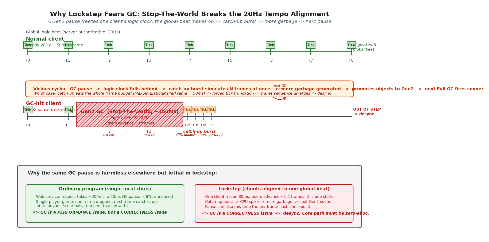
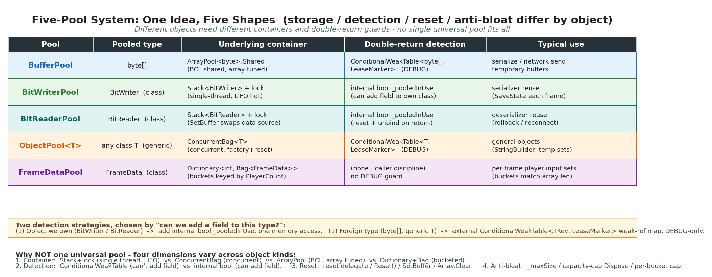

# 第 20 章 · 零 GC 与对象池:BufferPool 双倍归还检测

> **核心问题**:前面所有章节都在谈"确定性"——同样的输入必须算出同样的结果。但还有一种东西会悄悄打破确定性,它和算法无关,却比任何 bug 都致命:**GC 停顿**。GC 一停,这一台客户端的逻辑帧节奏就乱了,几十毫秒里多算或少算了若干帧,和别的客户端对不齐——这就是 desync。本章回答:为什么帧同步比普通程序更怕 GC、怎么消灭核心路径上的堆分配、对象池这个看似万能的工具最容易踩什么坑(双倍归还),以及 LockstepSdk 的 GC 克制哲学:为什么不追绝对零 GC。

> **读完本章你会明白**:
> 1. 为什么帧同步特别怕 GC——GC 的 Stop-The-World 停顿怎么让本客户端逻辑帧节奏错乱,进而和其他客户端 desync(普通程序卡一下无所谓,帧同步卡一下可能 desync)。
> 2. 五池体系怎么把核心路径的堆分配消掉:`BufferPool`(byte[] 池)、`BitWriterPool`/`BitReaderPool`(序列化器池)、`ObjectPool<T>`(通用对象池)、`FrameDataPool`(按 PlayerCount 分桶的帧数据池)。
> 3. 对象池最阴险的坑——**双倍归还**:同一数组(或对象)被 Return 两次,池会把同一实例分发给两个调用方,两方并发写同一 buffer,数据静默损坏——这是帧同步最难抓的 desync 源。
> 4. ★BufferPool 怎么用 `ConditionalWeakTable` 按引用追踪每个租出的 byte[],把"双倍归还"这个静默损坏源变成 DEBUG 可抓的异常。
> 5. `RentedBuffer` 的 `using` 模式:把池化归还做成确定性资源管理,防忘归还。
> 6. GC 克制哲学:为什么不追绝对零——消除大块/低风险分配继续做,但为个位数字节破坏可读性则放弃。

> **如果一读觉得太多**:先只记住三件事——① 帧同步怕 GC 不是怕慢,是怕停顿造成的节奏错乱 desync;② 池化的天敌是"双倍归还"(同一实例分发两方并发写 = 静默损坏),BufferPool 用 `ConditionalWeakTable` 在 DEBUG 抓它,Release 零开销;③ 高频组件(`[HighFrequencyComponent]`)反而关缓存(承 P2-06),因为每帧必变缓存无意义。

---

## 〇、一句话点破

> **帧同步对 GC 的恐惧,不是"GC 慢",而是"GC 会随机停顿,让本客户端的逻辑帧节奏和别的不一致"——节奏一乱,desync 就来了。所以核心路径(每帧都走的代码)必须消灭堆分配,武器就是对象池。但对象池有个最阴险的坑:同一实例被归还两次,池会把它同时发给两个调用方,两方并发写同一块内存,数据悄悄错掉——这种 desync 不报错、不崩溃、只在几千帧后让局面分叉。LockstepSdk 用 `ConditionalWeakTable` 按引用追踪每个租出的 byte[],在 DEBUG 把这个幽灵变成一抛即死的异常,Release 零开销。这就是"防呆设计"的力量。**

这是结论。本章倒过来拆:先讲为什么帧同步怕 GC,再讲五池体系怎么消灭分配,然后拆透双倍归还检测这个招牌技巧,最后讲 GC 克制哲学——为什么不追绝对零。

---

## 一、为什么帧同步特别怕 GC

对象池这个工具,普通 .NET 程序也用,游戏也用,Web 服务也用。但帧同步对它的依赖程度,远超这些场景。要理解为什么,得先理解 GC 对帧同步到底意味着什么。

### 先回顾:.NET 的 GC 是什么

.NET 是托管运行时,你 `new` 出来的对象(引用类型,即 class 的实例)都分配在**托管堆**上。堆会越来越大,运行时定期启动 **GC(Garbage Collector,垃圾回收器)**,找出没人再引用的对象,回收它们占的内存。

GC 分代(Generation 0/1/2),代的提升取决于对象存活时间。第 0 代回收(Gen0)比较便宜,但**第 2 代回收(Gen2,也叫 Full GC)很贵**——它要扫整个堆。

关键是:.NET 的 GC 是 **Stop-The-World(全局停顿)** 的。回收期间,所有托管线程都暂停,等它扫完、压缩完堆再继续。一次 Gen2 回收,停顿可以到几十毫秒甚至上百毫秒。

> **承接网络系列**:这和《Tokio》里讲的"阻塞会传染"是同一类问题——任何让运行线程停下来等的事,在高实时场景都是大敌。Tokio 用异步消灭阻塞,帧同步这里要消灭的是 GC 停顿。

### 普通程序为什么不怕

- **Web 服务**:一个请求处理几百毫秒,中间 GC 停个 20ms,占比 4%,用户感知不到。而且 Web 服务通常是 IO 密集,GC 停顿时 CPU 本来就闲着。
- **单机游戏(非联机)**:GC 停顿会让画面卡一下(掉帧),玩家骂一句"又卡了"就过去了。下一帧补回来,游戏状态照常推进——因为是**本机单一时钟**,卡了就慢一点,没有"和别人对齐"的需求。
- **后台任务/批处理**:GC 停顿只影响吞吐量,不影响正确性。

对普通程序,GC 是个**性能问题**,不是**正确性问题**。

### 帧同步为什么怕 GC:停顿破坏节奏对齐

帧同步的关键在第 13 章(网络时钟)和第 14 章(Relay/Authoritative 服务器)讲过:**所有客户端靠一个共同的逻辑帧节拍(默认 20Hz,每帧 50ms)对齐**。服务器按固定节拍广播权威帧,客户端根据本地时钟和服务器时钟的偏差(ClockOffset)推算"我现在该推进到第几帧"。

GC 停顿打破这个对齐,有两种方式:

**方式一:GC 停顿让本客户端少算几帧,逻辑时钟落后。**

假设 GC 在某帧中间触发,停了 80ms。这 80ms 里:

- 别的客户端正常推进了 1~2 帧(80ms / 50ms ≈ 1.6 帧)。
- 本客户端的 `Update` 没执行,逻辑帧累加器没累积,本客户端逻辑时钟原地不动 80ms。

GC 结束后,本客户端发现自己的逻辑时钟比服务器要求的慢了 1~2 帧。这时第 13 章的**追帧机制**启动:本客户端加速(动态限速调高),一帧里多模拟几帧,追上全局节拍。

追帧本身没问题(它就是为这种场景设计的)。但问题在**追帧期间**:为了追上,本客户端要在很短时间内连续模拟好几帧,CPU 压力陡增,如果此时又触发了一次 GC(因为连续模拟产生了更多垃圾),就形成**GC→落后→追帧→更多分配→GC**的恶性循环。最坏情况是连续追帧把整帧预算(MaxSimulationMsPerFrame = 50ms,LockstepController.cs:27)吃满,触发"模拟超时保护",逻辑帧被强制截断——这就不是卡顿了,是**逻辑帧序列和别的不一致**,desync。

要把这件事的危害看透,我们得算一笔"停顿预算"的账。一帧逻辑帧的预算是 50ms(20Hz)。但"50ms"不是全部都留给业务逻辑的:渲染、网络收发、输入采集都要分一杯羹,真正留给 Tick(模拟一帧逻辑)的稳态预算通常只有 15~25ms。这意味着**任何超过 25ms 的停顿,都会让本帧的 Tick 挤占下一帧的预算**,产生连锁延迟。

而 .NET 的 GC 停顿,典型量级是多少?

- **Gen0 回收**:通常 < 1ms,基本无害。
- **Gen1 回收**:1~5ms,偶尔触发,影响有限。
- **Gen2 回回收(Full GC)**:这是大头。在堆比较大(几百 MB)、对象引用链复杂时,Gen2 可以停 **20~100ms**,极端情况(并发 GC 的 STAB 阶段、大对象 LOH 压缩)能到几百毫秒。

也就是说,**只有 Gen2 停顿才真正威胁帧同步节拍**。而 Gen2 的触发,恰恰和"堆上的对象总量 + 存活时间"强相关——每帧 new 出来的临时对象,如果在两次 GC 之间没被回收,就会晋升到 Gen1,再活一次就到 Gen2,这时回收它们就要做 Full GC。**核心路径每帧少分配几百字节,长期看就是少触发几次 Gen2**——这正是"零 GC"目标的实质:不是消灭所有 GC,而是消灭"会诱发 Gen2 的持续性堆膨胀"。

> **作者复盘 · 一次"莫名 desync"的真凶**:开发早期有一次线上偶发 desync,表现是某客户端每隔几分钟哈希就漂一次,重连后好转,过几分钟又漂。定位了很久——算法没错、输入没错、快照没错。最后靠 GC 日志才发现:那个客户端的堆上有大量 Snapshot 缓存对象(每帧 new 一个,没池化),累积到 Gen2 后触发 Full GC,停顿 90ms,正好卡在追帧窗口里。把 Snapshot 池化(本章第 6.2 节那个"做"的点)后,Gen2 频率从几分钟一次降到几十分钟一次,desync 消失。这件事让我确立了"GC 不是性能问题、是 desync 问题"的认知——也是这章存在的理由。

**方式二(更阴险):GC 停顿的时机不可预测,造成哈希校验时点错位。**

第 23 章会讲,帧同步每帧算一个状态哈希,和服务器(或别的客户端)对账,抓 desync。哈希必须在"每一逻辑帧结束时"这个**确定时点**算。如果 GC 停顿发生在"逻辑帧已推进、但哈希还没算"的窗口里,本客户端这一帧的哈希报告可能晚发,别的客户端已经比过下一帧了——哈希对账的**时序错位**,会让真正的 desync 被掩盖(基准漂移),或者让无关的瞬态差异被误报。



> **钉死这件事**:帧同步怕 GC,不是怕"GC 慢",是怕"GC 停顿不可预测地破坏逻辑帧节拍对齐"。普通程序 GC 卡一下无所谓(本机单一时钟),帧同步 GC 卡一下,本客户端就和全局节拍错位,要么触发追帧恶性循环,要么造成哈希校验时点错位——这两种都会演化成 desync。所以帧同步核心路径必须消灭堆分配。

### 这意味着什么:核心路径零分配

"核心路径"指**每帧都执行的代码**:LockstepController.DoUpdate、World.Tick、系统遍历、序列化/反序列化、快照保存/恢复。这些代码里的每一次 `new`(引用类型),都是一次堆分配,积累下来触发 GC。

我们要做的,就是把这些代码里的 `new` 消灭掉。武器是**对象池**:预先分配一批对象,用的时候"借"出去,用完"还"回来,反复复用,堆就不再增长,GC 就不再因为业务代码而触发。

> **作者复盘 · 为什么不直接禁用 GC**:有人问 .NET 有 `GC.TryStartNoGCRegion`,能不能直接进入"无 GC 区"?可以,但限制大——你得预先分配好一大块预算,且这段区域内任何超出预算的分配都会立即失败。帧同步一局几十分钟,整局都进 NoGCRegion 不现实(预算会撑爆)。更务实的做法是:**让核心路径本身不分配**,GC 自然就很少触发。NoGCRegion 这种"硬开关"留给"已知会产生少量分配的短时关键段"(比如一次回滚重演),不是常规手段。

---

## 二、五池体系:不同对象,不同池策略

LockstepSdk 没有用一个万能对象池,而是按对象的特性分了**五个池**,每个池的策略不同。先看全貌,再逐个拆。



| 池 | 池化对象 | 底层容器 | 双归还检测机制 | 典型用途 |
|---|---|---|---|---|
| `BufferPool` | `byte[]` | `ArrayPool<byte>.Shared` | `ConditionalWeakTable<byte[], LeaseMarker>` | 序列化临时缓冲、网络发送缓冲 |
| `BitWriterPool` | `BitWriter`(class) | `Stack<BitWriter>` | BitWriter 内部 `_pooledInUse` 布尔 | 序列化器复用(快照保存) |
| `BitReaderPool` | `BitReader`(class) | `Stack<BitReader>` | BitReader 内部 `_pooledInUse` 布尔 | 反序列化器复用(回滚/重连) |
| `ObjectPool<T>` | 任意 class T | `ConcurrentBag<T>` | `ConditionalWeakTable<T, LeaseMarker>` | 通用对象(StringBuilder、临时集合) |
| `FrameDataPool` | `FrameData`(class) | `ConcurrentDictionary<int, ConcurrentBag<FrameData>>` | (无,靠调用方纪律) | 每帧的玩家输入集合 |

为什么不一刀切用一个池?因为这几类对象的**生命周期、并发需求、归还校验手段**都不一样。下面逐个看。

### 2.1 BufferPool:byte[] 的安全封装

序列化、网络发送、临时数据处理都需要 `byte[]` 缓冲区。最朴素的做法是每次 `new byte[size]`——这是堆分配。.NET BCL 提供了 `ArrayPool<byte>.Shared`,一个进程级共享数组池,租用(Rent)和归还(Return)都是 O(1) 且零分配。

BufferPool 就是它的一个**静态封装**(`Pooling/BufferPool.cs:18`):

```csharp
// BufferPool.cs:18-21 (简化示意)
public static class BufferPool
{
    private static readonly ArrayPool<byte> _pool = ArrayPool<byte>.Shared;
    // ...
    [MethodImpl(MethodImplOptions.AggressiveInlining)]
    public static byte[] Rent(int minimumLength)
    {
        // ... 统计 + DEBUG 检测 ...
        var buffer = _pool.Rent(minimumLength);
        // ... DEBUG 检测 ...
        return buffer;
    }

    [MethodImpl(MethodImplOptions.AggressiveInlining)]
    public static void Return(byte[] buffer, bool clearArray = false)
    {
        if (buffer == null) return;
        // ... DEBUG 检测 ...
        _pool.Return(buffer, clearArray);
    }
}
```

为什么不直接用 `ArrayPool<byte>.Shared`,要包一层?两个理由:

1. **加统计**:`_rentCount`/`_returnCount`/`LeakCount`(泄漏数 = Rent - Return),DEBUG 和测试用,确认"借了就还"。还有 `[ThreadStatic]` 的线程局部统计(`_threadRentCount`),给单元测试用,避免并发干扰(`BufferPool.cs:27-31`)。
2. **★加双归还检测**:这是核心,下一节单拆。直接用 `ArrayPool` 是没有这个检测的。

> **钉死这件事**:BufferPool 是 `ArrayPool<byte>.Shared` 的静态封装,零分配租借 byte[]。包一层的核心收益是**双归还检测**(下一节)和统计,不是性能——`ArrayPool` 本身已经够快。

### 2.2 BitWriterPool / BitReaderPool:序列化器复用

第 7 章讲过,序列化用 `BitWriter`,反序列化用 `BitReader`,它们都是 **class**(引用类型)。SaveState(快照保存)每帧都创建一个 BitWriter,用完丢——这是堆分配。回滚/重连每次 `new BitReader` 也是分配。

BitWriterPool 把 BitWriter 池化(`Pooling/BitWriterPool.cs:13`):

```csharp
// BitWriterPool.cs:13-15 (简化示意)
public static class BitWriterPool
{
    private static readonly Stack<BitWriter> _pool = new Stack<BitWriter>(32);
    private const int DefaultCapacity = 4096;

    [MethodImpl(MethodImplOptions.AggressiveInlining)]
    public static BitWriter Get()
    {
        lock (_pool)
        {
            if (_pool.Count > 0)
            {
                _reused++;
                var writer = _pool.Pop();
                writer.Reset();   // 出借前清零位置指针
                return writer;
            }
            _created++;
        }
        return new BitWriter(DefaultCapacity);
    }

    public static void Return(BitWriter writer)
    {
        // ... 双归还检测 + 容量过大则 Dispose ...
        lock (_pool)
        {
            if (_pool.Count < 64) _pool.Push(writer);
            else writer.Dispose();
        }
    }
}
```

几个细节值得注意:

- **`Stack<BitWriter>` + `lock`**:不是 `ConcurrentBag`。因为 BitWriterPool 是单线程用的(World 单线程,第 22 章详述),`lock` 开销极小(无竞争),且 Stack 的 LIFO 语义让"刚还的最热"先被借出(cache 友好)。
- **容量过大则 Dispose**(`Return` 里 `if (writer.Capacity > DefaultCapacity * 16)`):如果一个 BitWriter 因为某次写超大快照而扩容到 64KB 以上,还回来就直接 Dispose 掉,不让它占着大块内存。这是"防内存膨胀"的纪律。
- **`Reset()` 出借前清零**:BitWriter 内部有个 `_position` 写指针,出借前必须清零,否则下一个调用方会在"上一个调用方写剩的位置"继续写,数据错乱。这是池化的标准动作——归还时/reset 时把对象恢复到"全新状态"。
- **`SetBuffer` 复用**:BitReaderPool 更进一步(`Pooling/BitReaderPool.cs:19-34`),借出的 BitReader 调 `SetBuffer(data)` 绑定新数据源——Reader 本身(指针、状态机)复用,只换它操作的数据。归还时 `SetBuffer(Empty)` 解除对原数据的引用,防内存泄漏。

> **钉死这件事**:BitWriterPool/BitReaderPool 把序列化器 class 池化,出借前 Reset/SetBuffer 恢复到全新状态。容量过大则丢弃防膨胀。这是"序列化路径零分配"的关键——SaveState 每帧不再 `new BitWriter`。

### 2.3 ObjectPool<T>:通用对象池

有些对象不是 byte[] 也不是序列化器,比如 StringBuilder、临时集合。ObjectPool<T> 是通用版本(`Pooling/ObjectPool.cs:19`):

```csharp
// ObjectPool.cs:19-24 (简化示意)
public sealed class ObjectPool<T> where T : class
{
    private readonly ConcurrentBag<T> _pool = new();
    private readonly Func<T> _factory;
    private readonly Action<T>? _reset;
    private readonly int _maxSize;
    // ...

    public T Get()
    {
        if (_pool.TryTake(out var item)) { _reused++; /* DEBUG 检测 */ return item; }
        _created++;
        var created = _factory();
        /* DEBUG 检测 */
        return created;
    }

    public void Return(T item)
    {
        if (item == null) return;
        /* DEBUG 双归还检测 */
        _reset?.Invoke(item);          // 归还时调 reset 委托,恢复对象状态
        if (_pool.Count < _maxSize) _pool.Add(item);
    }
}
```

和 BitWriterPool 的区别:

- **`ConcurrentBag<T>`**:ObjectPool 设计成可并发(可能多个系统共享一个池),用 `ConcurrentBag`。代价是比 `Stack + lock` 略慢(线程局部存储 + 偶尔合并),但换来了线程安全。
- **工厂 + reset 委托**:调用方传入 `_factory`(怎么 new 一个)和 `_reset`(怎么清零一个),池不关心 T 的具体类型。这是"通用"的代价——多一次委托调用。
- **`_maxSize` 防膨胀**:默认 64,超过就丢弃(让 GC 回收)。

**重要约束**(注释里写明):ObjectPool **只用于无状态/可重置的对象,不用于游戏逻辑对象(Component、Entity)**,也**不用于参与回滚的对象**。为什么?因为游戏逻辑对象(Entity、Component)的生命周期由 ECS 的 World 严格管理(代数、序列化、回滚恢复),如果再被对象池"借来借去",两套生命周期会打架——池借出去的对象,World 不知道它"从哪来";World 销毁的对象,池可能还以为它"在池里"。所以游戏逻辑对象走 ECS 自己的组件池(第 6 章),不走这个 ObjectPool。

> **钉死这件事**:ObjectPool<T> 是通用对象池(ConcurrentBag + 工厂 + reset),只用于无状态/可重置对象(StringBuilder、临时集合)。游戏逻辑对象(Entity/Component)严禁走它——生命周期归 ECS 管,池化会和 ECS 代数/回滚机制打架。

### 2.4 FrameDataPool:按 PlayerCount 分桶

`FrameData` 是每帧的玩家输入集合(第 16 章)。它有个特点:`PlayerInputs` 是个 `byte[][]`,长度等于玩家数。如果直接用一个池,4 人局借出的 FrameData 里有 4 槽数组,8 人局借出 8 槽——如果池把"8 人局的 FrameData"借给"4 人局的调用方",要么越界,要么得重新分配数组,池化就没意义了。

FrameDataPool 的解法是**按 PlayerCount 分桶**(`Pooling/FrameDataPool.cs:18-23`):

```csharp
// FrameDataPool.cs:20-23 (简化示意)
private static readonly ConcurrentDictionary<int, ConcurrentBag<FrameData>> _pools = new();
private const int MaxPoolSizePerBucket = 128;
```

key 是 playerCount,value 是该玩家数对应的池。借的时候 `GetOrCreatePool(playerCount).TryTake()`,还的时候 `GetOrCreatePool(data.PlayerCount)`——同玩家数的 FrameData 进同桶。这样借出的 FrameData 的 `PlayerInputs` 数组长度天然匹配,只需 `Array.Clear` 清内容,不用重新分配:

```csharp
// FrameDataPool.cs:33-48 (简化示意)
public static FrameData Get(int frame, int playerCount)
{
    var pool = GetOrCreatePool(playerCount);
    if (pool.TryTake(out var data))
    {
        _reused++;
        data.Frame = frame;
        Array.Clear(data.PlayerInputs, 0, playerCount);  // 数组已存在且大小对, 只清内容
        return data;
    }
    _created++;
    return new FrameData(frame, playerCount);
}
```

> **不这样会怎样**:如果用一个不分桶的池,要么每次 Get 都检查 `PlayerInputs.Length` 是否够,不够就 `Array.Resize`(这是分配!),要么强制每个调用方自己管数组——都破坏了"池化零分配"的初衷。分桶是"用一点字典查找开销换零分配数组"的漂亮权衡。

> **钉死这件事**:FrameDataPool 按 PlayerCount 分桶(`Dictionary<int, Bag<FrameData>>`),保证借出的 FrameData 的 PlayerInputs 数组长度匹配,只需清内容不重新分配。这是"对象内含定长集合时池化"的标准技巧。

### 2.5 五池对比:为什么不一刀切

回头看那张表,五个池的差异其实对应了**对象的四个维度**:

1. **存储容器**:`Stack+lock`(单线程、LIFO 热数据)vs `ConcurrentBag`(并发)vs `ArrayPool`(BCL 共享,数组专用)vs `Dictionary<,>+Bag`(分桶)——选哪个看并发模型和数据形状。
2. **双归还检测手段**:`ConditionalWeakTable`(对象不能携带标志,如 byte[])vs 内部布尔(对象能携带标志,如 BitWriter)——下一节详述为什么有这个差别。
3. **状态恢复**:reset 委托(ObjectPool)/ Reset 方法(BitWriter)/ SetBuffer(BitReader)/ Array.Clear(FrameData)——归还或出借时怎么把对象恢复到全新。
4. **防膨胀**:`_maxSize`(ObjectPool 默认 64)/ 容量过大 Dispose(BitWriter)/ 桶上限(FrameDataPool 128)——池不能无限大,否则内存撑爆。

这五个池是"对象池"这一个思想,在五种对象特性下的五种具体形态。理解了这四个维度的取舍,你自己设计池就不会一刀切。

---

## 三、★招牌技巧:双倍归还检测

这是本章最硬核、也最能体现"防呆设计"精神的技巧。把它拆透。

### 3.1 双倍归还是什么,为什么是帧同步的噩梦

对象池的工作原理是:借出去 → 用完 → 还回来 → 下次借给另一个人。正常情况下,一个实例在任一时刻要么"在外面被使用",要么"在池里待命",二选一。

**双倍归还(Double-return)** 打破这个不变量:**同一个实例被 Return 了两次**。

怎么发生?最常见的是"调用方忘了自己已经还过,在另一个分支又还一次":

```csharp
var buf = BufferPool.Rent(256);
try
{
    DoSomething(buf);
    BufferPool.Return(buf);     // 第一次归还(正常)
}
finally
{
    BufferPool.Return(buf);     // 第二次归还(重复!finally 兜底又还一次)
}
```

或者两个方法都"负责"归还,互相不知道:

```csharp
void Process(byte[] buf)
{
    BufferPool.Return(buf);     // Process 觉得自己用完了, 还了
}
void Caller()
{
    var buf = BufferPool.Rent(256);
    Process(buf);
    // ... 调用方不知道 Process 已经还了, 自己又还一次
    BufferPool.Return(buf);     // 双倍归还!
}
```

这看着像低级错误,但在复杂控制流(异常、finally、早返回、异步)里极其容易发生,而且**编译器不会报错,运行时也不会报错**——因为它"看起来"是合法的池操作。

### 3.2 双倍归还的后果:静默数据损坏

一个实例被还了两次,它就在池里出现了两次。接下来两次 `Get()`,会返回**同一个实例**给两个不同的调用方:

```
时间线:
  t1: 调用方 A 调 Rent → 拿到 buf#7
  t2: 调用方 A 调 Return(buf#7)  → buf#7 进池
  t3: 调用方 A (bug) 又调 Return(buf#7) → buf#7 又进池(池里现在有两份 buf#7)
  t4: 调用方 B 调 Rent → 拿到 buf#7
  t5: 调用方 C 调 Rent → 也拿到 buf#7   ← 灾难!
  t6: B 和 C 并发写 buf#7  → 数据互相覆盖, 谁都不知道
```

t6 是灾难:两个调用方以为自己在写各自的缓冲区,实际写的是**同一块内存**。A 写的数据被 B 覆盖,B 写的被 A 覆盖,序列化出来的字节流是两份写入的诡异混合。

**这在普通程序里就够糟了**(数据错乱、崩溃)。但在帧同步里,它是**最阴险的 desync 源**,原因有三:

1. **不报错**:没有异常,没有崩溃,程序继续跑。两方都"成功"完成了序列化,只是序列化出来的字节是错的。
2. **不立即暴露**:这一帧的 byte[] 错了,但要等到这个 byte[] 被用来反序列化、被算进状态、被哈希校验——可能几十、几百帧后,哈希才发现对不上。
3. **不可复现**:双倍归还的触发往往依赖特定的时序(两个调用方同时 Rent),这种时序在线上偶发,本地测试跑一万次都遇不到,一上线就出。传统的"加断点调试"完全抓不到。

这就是为什么本章标题把"双倍归还检测"单列——它是**帧同步静默损坏的代表性来源**,抓它的工具必须像抓幽灵一样精准。

![双倍归还导致静默数据损坏:同一 byte[] 被 Return 两次→池中两份→两次 Rent 返回同实例→两调用方并发写→字节流错乱→desync](images/fig-20-03-double-return.png)

> **钉死这件事**:双倍归还 = 同一实例被 Return 两次 → 池中两份 → 两次 Get 返回同实例 → 两调用方并发写同一内存 → 数据静默损坏。不报错、不崩溃、时序相关、不可复现——帧同步最阴险的 desync 源。

### 3.3 BufferPool 的解法:ConditionalWeakTable 按引用追踪

现在看 BufferPool 怎么抓这个幽灵。核心是 .NET 的 `ConditionalWeakTable<TKey, TValue>`——一个**以引用相等为键、且不阻止键被 GC 回收**的特殊字典。

```csharp
// BufferPool.cs:33-43 (DEBUG 段)
#if DEBUG
    // 双倍归还检测(P1-ROB-1):byte[] 无法携带标志,
    // 用 ConditionalWeakTable 按引用追踪"当前已租出且未归还"的缓冲区。
    // ConditionalWeakTable 以引用相等为键, 且不会阻止 GC 回收数组。
    private static readonly ConditionalWeakTable<byte[], LeaseMarker> _leasedBuffers = new();

    private sealed class LeaseMarker
    {
        public static readonly LeaseMarker Instance = new();
        private LeaseMarker() { }
    }
#endif
```

`_leasedBuffers` 是一张"byte[] 引用 → LeaseMarker"的表。语义是:**当前在外面(已 Rent 未 Return)的 byte[],在表里有一个条目;Return 时把它删掉**。LeaseMarker 是个空类(只当占位符),因为我们只关心"在不在表里",不关心附加什么数据。

Rent 的时候(`BufferPool.cs:51-64`):

```csharp
// BufferPool.cs:51-64 (简化)
public static byte[] Rent(int minimumLength)
{
    Interlocked.Increment(ref _rentCount);
    _threadRentCount++;
    var buffer = _pool.Rent(minimumLength);
#if DEBUG
    // 双倍租出检测:正常情况下 ArrayPool 只会吐出已归还的缓冲区,
    // 触发说明缓冲区在仍被持有期间被重新分发。
    if (_leasedBuffers.TryGetValue(buffer, out _))
        throw new InvalidOperationException(
            "[BufferPool] Double-rent detected: 缓冲区在被持有期间被重新分发(数组池状态损坏)。");
    _leasedBuffers.Add(buffer, LeaseMarker.Instance);
#endif
    return buffer;
}
```

借出去之前,检查这个 byte[] 是不是已经在"已借出"表里。如果在,说明上一次借出去还没还(ArrayPool 不该把它再吐出来)——这是更底层的池状态损坏,抛异常。检查通过,就把这个 byte[] 登记进表。

Return 的时候(`BufferPool.cs:72-86`):

```csharp
// BufferPool.cs:72-86 (简化)
public static void Return(byte[] buffer, bool clearArray = false)
{
    if (buffer == null) return;
#if DEBUG
    // 双倍归还检测(P1-ROB-1):同一 byte[] 被归还两次会让 ArrayPool 把同一数组分发给两个调用方,
    // 导致并发写同一 buffer(帧同步静默损坏的最阴险来源)。
    if (!_leasedBuffers.Remove(buffer))
        throw new InvalidOperationException(
            "[BufferPool] Double-return detected: 同一缓冲区被归还两次(或从未经 Rent 租出)," +
            "这会让 ArrayPool 把同一数组分发给两个调用方,导致并发写同一 buffer。");
#endif
    Interlocked.Increment(ref _returnCount);
    _threadReturnCount++;
    _pool.Return(buffer, clearArray);
}
```

Return 时,尝试从表里**删除**这个 byte[]。`ConditionalWeakTable.Remove` 返回 bool:删除成功说明它确实在表里(正常归还);删除失败说明它**不在表里**——要么是双倍归还(第一次 Return 已经删了),要么是从未 Rent 过(直接 Return 一个 `new byte[]`,绕过了池)。两种都是 bug,抛异常。

这样,双倍归还这个幽灵,在 DEBUG 下变成**一抛即死的异常**,带清晰的调用上下文,一抓一个准。Release 编译时 `#if DEBUG` 整段消失,零开销。

> **钉死这件事**:BufferPool 在 DEBUG 用 `ConditionalWeakTable<byte[], LeaseMarker>` 登记每个已租出的 byte[],Return 时删除,删除失败=双倍归还=抛异常。Release 零开销。这是把"帧同步最阴险的静默损坏源"变成"一抓一个准"的防呆典范。

### 3.4 为什么用 ConditionalWeakTable,而不是 HashSet 或 Dictionary

这是个值得深究的设计选择。为什么不用 `HashSet<byte[]>` 或 `Dictionary<byte[], byte>`?

核心原因有两个,都和 **GC** 有关:

**原因一:byte[] 不能携带标志,只能外挂追踪。**

如果是 BitWriterPool(下一小节),BitWriter 是个 class,可以在它内部加个 `_pooledInUse` 布尔字段,归还时置 true,出借时置 false,双归还就是"还的时候发现已经是 true"——这是内部标志法。BitWriter/BitReader 实际就是这么做的(`BitWriter.cs:25` 的 `internal bool _pooledInUse`,配合 `BitWriterPool.cs:62-66`)。

但 **byte[] 是 BCL 类型,我们不能给它加字段**。只能用一个外部数据结构(byte[] → 标志)来追踪。所以候选是 `Dictionary<byte[], X>` 或 `ConditionalWeakTable<byte[], X>`。

**原因二:Dictionary 会"强引用"键,阻止 byte[] 被 GC 回收。**

普通的 `Dictionary<byte[], X>`,键是 byte[] 的强引用。只要键在字典里,这个 byte[] 就永远不会被 GC 回收——即使代码里已经没人用它了。结果:字典里堆积大量"曾经 Rent 过、后来忘了 Return"的 byte[](是的,泄漏也会发生),内存无限增长,最终 OOM。

而 **`ConditionalWeakTable` 是"弱引用键"**——它持有一个**弱引用(weak reference)**指向键。当外部没有任何强引用指向这个 byte[] 时,GC 可以回收它,ConditionalWeakTable 会在下次访问时自动清理对应的条目。这样,即使有泄漏(借了不还),byte[] 也不会被字典永远拽住,内存不会爆炸。

> **承接 P1-02**:还记得 LFloat 为什么是 `readonly struct` 吗?一个理由是"值类型栈上分配,无 GC"。这里的 byte[] 是引用类型,逃不掉 GC,但我们至少要让它**能**被 GC 回收——用弱引用键,不让追踪表本身变成内存泄漏源。这是同一个"和 GC 和谐共处"思想的两面。

> **钉死这件事**:用 `ConditionalWeakTable` 而非 `Dictionary`,因为 ① byte[] 不能加内部标志,只能外挂追踪;② 弱引用键不阻止 byte[] 被 GC 回收,避免追踪表本身泄漏。弱引用 + GC 自动清理,是追踪"借出但可能忘还"资源的正确姿势。

### 3.5 ObjectPool 的同款检测:泛型版

ObjectPool<T> 也面临同样的问题(双倍归还),解法完全一样——但因为 T 是泛型,`ConditionalWeakTable<T, LeaseMarker>` 直接用 T 当键(`ObjectPool.cs:26-35`):

```csharp
// ObjectPool.cs:26-35 (DEBUG 段)
#if DEBUG
    private readonly ConditionalWeakTable<T, LeaseMarker> _leased = new();

    private sealed class LeaseMarker
    {
        public static readonly LeaseMarker Instance = new();
        private LeaseMarker() { }
    }
#endif
```

Get 时登记(`ObjectPool.cs:63-72`),Return 时删除并检测(`ObjectPool.cs:84-90`)。逻辑和 BufferPool 一模一样,只是把 `byte[]` 换成了泛型 `T`。

> **为什么 BitWriterPool 用内部布尔,不用 ConditionalWeakTable?** 因为 BitWriter 是框架自己的 class,可以自由加字段——加个布尔比维护一张弱引用表更轻量(布尔是一次内存访问,弱引用表是一次哈希查找 + 可能的 GC 扫描)。所以:**能加内部标志的就加布尔(BitWriter/BitReader),不能加的(byte[]、外部类型)才用 ConditionalWeakTable 外挂**。这是"用最轻量的手段达到目的"的体现。

### 3.6 这套检测抓不到什么(诚实标注)

防呆设计再强,也有边界。要诚实说明这套检测的局限:

1. **Release 不检测**:`#if DEBUG` 整段在 Release 编译时消失。线上(Release)发生双倍归还,依然静默损坏。这是性能换安全的有意权衡——DEBUG 阶段抓干净,Release 信任代码已无此 bug。
2. **抓不到"跨线程并发双归还"的精确时序**:Return 的检测是"删除失败就抛",但如果是两个线程真的并发 Return 同一实例,`ConditionalWeakTable.Remove` 不是原子的(它没有锁),理论上可能两个都返回 true(都"删除成功"),然后双方都进入 `_pool.Return`——这又是双归还。实际中 ConditionalWeakTable 内部有锁保护,且 DEBUG 场景并发不密集,极少触发。要彻底解决需要给 Return 加锁,但那会拖慢热路径。
3. **抓不到"语义上的误用"**:比如调用方 Rent 了 byte[],写了一半就 Return(没写完),然后被别人 Rent 去读——这不是双归还,是"归还了不该归还的(还在用的)buffer"。检测只能抓"还了两次",抓不了"还早了"。后者要靠调用方纪律(用 `RentedBuffer` + `using`,下一节)。

这些局限不否定这套检测的价值——它把"最容易发生、最难抓"的那一类(双倍归还)变成了 DEBUG 一抓一个准,已经消除了绝大多数隐患。剩下的边角靠纪律和 review。

---

## 四、RentedBuffer:用 using 模式防忘归还

双倍归还是"还多了",还有一类相反的坑:**忘还(泄漏)**——借出去用完,忘了 Return。泄漏不会立刻出问题,但池会慢慢被借空,之后每次 Rent 都得 new 新的,池化形同虚设;更糟的是,泄漏的 byte[] 持有的内存不被回收,堆持续增长,GC 压力反而更大。

防忘归还最有效的武器是 **`using` 模式**——C# 的确定性资源管理。BufferPool 提供了 `RentedBuffer` 来支持它(`BufferPool.cs:121-168`):

```csharp
// BufferPool.cs:121-168 (简化示意)
public readonly struct RentedBuffer : IDisposable
{
    private readonly byte[] _buffer;
    private readonly int _length;
    private readonly bool _clearOnReturn;

    public int Length => _length;
    public byte[] Buffer => _buffer;
    public Span<byte> Span => _buffer.AsSpan(0, _length);
    public ReadOnlySpan<byte> ReadOnlySpan => _buffer.AsSpan(0, _length);

    public RentedBuffer(int minimumLength, bool clearOnReturn = false)
    {
        _buffer = BufferPool.Rent(minimumLength);
        _length = minimumLength;
        _clearOnReturn = clearOnReturn;
    }

    public byte[] ToArray()
    {
        var result = new byte[_length];
        Array.Copy(_buffer, 0, result, 0, _length);
        return result;
    }

    public void Dispose()
    {
        BufferPool.Return(_buffer, _clearOnReturn);
    }
}
```

用法:

```csharp
using var buf = BufferPool.RentAsRented(256);   // 借
DoSomething(buf.Span);                            // 用
// 离开作用域时, Dispose 自动调 BufferPool.Return, 归还
```

(注:RentAsRented 是示意,实际通过 `new RentedBuffer(length)` 或封装方法获得。)

`RentedBuffer` 是 `readonly struct` + `IDisposable`。`using var` 保证离开作用域时调 `Dispose`,Dispose 里调 `BufferPool.Return`。这样**归还和作用域绑定**,不会忘。

> **承接 P1-02 / 数学线**:LFloat 用 `readonly struct` 是为了"零 GC + 不可变"。RentedBuffer 用 `readonly struct` 是另一个理由:**确定性清理**。值类型的 using 模式不会有额外的堆分配(struct 本身在栈上),Dispose 是普通方法调用。这是 C# 里"用值类型 + IDisposable 实现零开销 RAII"的标准技巧(RAII = Resource Acquisition Is Initialization,资源获取即初始化,C++ 的核心思想)。

### 为什么不直接 try/finally

你当然可以手写:

```csharp
var buf = BufferPool.Rent(256);
try { DoSomething(buf); }
finally { BufferPool.Return(buf); }
```

效果和 `using` 一样。但 `using` 有三个优势:

1. **不会忘写 finally**:`using var` 是声明的一部分,编译器强制生成 Dispose 调用。手写 try/finally 容易漏(尤其早返回、异常路径)。
2. **不会双归还**:手写 try/finally 时,常犯的错是 finally 里 Return,然后又在外面"保险起见"Return 一次——双归还。`using` 只在离开作用域时 Dispose 一次,天然避免。
3. **可读性**:`using var buf = ...` 一眼看出"这是个要归还的资源",比 try/finally 更紧凑。

所以框架鼓励:临时 buffer 用 `RentedBuffer` + `using`;需要长期持有的 byte[](比如快照数据)用 `BufferPool.Rent` + 手动管理,因为它的生命周期超出单个作用域(典型:Snapshot 的 `_data` 字段)。

> **钉死这件事**:RentedBuffer 是 `readonly struct + IDisposable`,配合 `using var` 把归还绑定到作用域,防忘归还、防双归还(编译器只 Dispose 一次)。这是 C# "值类型 + using" 实现零开销 RAII 的标准技巧。长期持有的资源(如 Snapshot._data)不适合 using,走手动管理。

---

## 五、高频组件跳缓存:反直觉的取舍

这一节承接第 6 章(P2-06),只点一下它在"零 GC"语境下的意义。

第 6 章讲过,ComponentPool 的序列化有"脏标记缓存"机制:组件没变(IsDirty=false)时,序列化直接吐缓存,零字段遍历。但有个反直觉的配置:`[HighFrequencyComponent]` 标记的组件,会被 World 在注册时设为 `EnableCaching = false`——**关掉缓存,每次序列化都直写**(`ECS/HighFrequencyComponentAttribute.cs` + `ComponentPool.cs:71-73`):

```csharp
// ECS/HighFrequencyComponentAttribute.cs (简化)
[AttributeUsage(AttributeTargets.Struct, Inherited = false, AllowMultiple = false)]
public sealed class HighFrequencyComponentAttribute : Attribute { }

// World.cs 注册组件池时 (P2-06 引用):
if (Attribute.IsDefined(typeof(T), typeof(HighFrequencyComponentAttribute)))
    wrapper.Pool.EnableCaching = false;   // 高频组件关缓存

// ComponentPool.cs:71-73
/// 对于每帧都会变化的组件(如 Transform),建议设为 false 以减少内存拷贝开销。
public bool EnableCaching { get; set; } = true;
```

为什么不缓存?详尽的 why 在 P2-06 的"技巧精解"里讲透了,这里一句话回顾:**缓存的价值在"复用",高频变化的东西复用率趋近于零(每帧都脏,每次都要重建),缓存不仅没用,反而多一次"写 tempWriter → 拷给 _cachedData → 拷给 writer"的三段拷贝**。所以高频组件关缓存走直写,反而更快、更省内存。

在"零 GC"语境下,这点的额外意义是:**关掉缓存,也关掉了 `_cachedData` 这个 byte[] 字段**——它不再持有缓存的字节副本。对于 Transform 这种每实体都有一个的组件,省下的 `_cachedData` 数组(可能几 KB)累加起来可观。这是"用'不缓存'换'少分配'"的连带收益。

> **承接 P2-06**:高频组件跳缓存的完整 why(复用率趋零、三段拷贝反而更慢)在 P2-06 技巧精解讲透,本章只点它在零 GC 语境下的意义——同时省下 _cachedData 数组。不重复展开。

---

## 六、GC 克制哲学:不追绝对零

前面五节都在讲"怎么消灭分配"。但 LockstepSdk 在这件事上有个**明确的态度**:不追绝对零。这个态度写在 `docs/OPTIMIZATION_PLAN.md` 的开头,是整个性能优化的总纲:

> **GC 克制(不追绝对零)**:不为消除个位数字节把清晰代码改成晦涩实现。消除大块/低风险分配(对象池化、明显装箱、复用已有池)继续做;为追零而引入复杂 struct/ref 体操、破坏可读性的委托缓存、线程局部可变状态则放弃。GC 尽量小,但正确性和可维护性永远优先。

这是个看似"消极"实则极其成熟的态度。为什么这么定?

### 6.1 绝对零 GC 的代价:可读性崩溃

要把每帧分配从 466 B(当前)降到 0,剩下的 466 B 是什么?是各种"边角分配":系统遍历的 foreach 装箱、个别 lambda 闭包、几个小对象。消灭它们意味着:

- 把所有 `foreach (var e in ActiveEntities)` 改成自定义 struct 枚举器(因为 `IReadOnlyList<int>` 的 foreach 会装箱 `List.Enumerator`)——波及所有系统签名。
- 把所有 lambda 改成缓存的实例方法委托 + 状态字段——闭包状态散落各处,可读性骤降。
- 把所有 class 改成 ref struct + ref 传递——API 变形,调用方负担加重。

每一项单独看"能做",合起来就是**把一个清晰的代码库改成满地 ref/struct/缓存委托的迷宫**。之后每改一行都得小心翼翼别破坏这些"零分配纪律"。维护成本爆炸,bug 概率反而上升(复杂代码更容易写错)。

而收益呢?每帧少 466 字节,假设一局 10 分钟(600 秒,12000 帧),少分配 5.6 MB——这 5.6 MB 不是同时存活,而是分摊在 12000 帧里,GC 早就边分配边回收了,实际驻留内存几乎不变。**为了消灭这 5.6 MB 的"流量",付出代码可读性崩塌的代价,不值得。**

### 6.2 做与不做:一张取舍表

`OPTIMIZATION_PLAN.md` 阶段 3 把改动点按"做/跳"分级,这里整理成表,体现这套哲学:

| 改动点 | 决策 | 理由 |
|---|---|---|
| Snapshot 对象池化(LockstepController.cs:430) | ✅ 做 | 模式清晰、改动局部,消除 Snapshot 对象头(~40B)+ 闭包 |
| 消除 SaveStateZeroAlloc 闭包委托 | ✅ 做(部分) | lambda 改缓存实例方法委托,闭包状态存字段;**放弃** ref struct 上下文重构(破坏可读性) |
| BitReaderPool 接入反序列化路径 | ✅ 做 | 已有池,接入是局部改动,降低回滚毛刺 |
| 系统 foreach 装箱消除 | ⚠️ 谨慎/可能跳 | 若只需 ComponentPool 加个 GetEnumerator 做;若要散布替换 IReadOnlyList 波及所有系统则**跳过**——475 B/帧可接受,不值得破坏 API |
| Snapshot SOA 扁平化(把 Snapshot 字段拆成多个数组) | ❌ 跳过 | "GC 哲学:边际不抵复杂度" |
| Collider/QuadTree SOA 扁平化 | ❌ 跳过(先做对象池) | 先做保守方案(对象池),验证收益后再评估激进 SOA |

注意中间那条"foreach 装箱"的决策——它最能体现哲学:同一件事(消除装箱),如果改动局部就做,如果波及面广就跳。**不是看"能消灭多少字节",而是看"为这些字节付出多大可读性代价"**。

### 6.3 实测数据:做与不做的实际收益

阶段 3 的实测结果(`OPTIMIZATION_PLAN.md` 附录):

| 指标 | 阶段 0 基线 | 阶段 3 达成 | 备注 |
|---|---|---|---|
| 纯 Tick 每帧 GC | 475 B | **306 B(-36%)** | foreach 装箱已消除,剩余边际跳过 |
| 生产路径每帧 GC | 635 B | **466 B(-27%)** | +Controller 闭包内联;Snapshot 池化跳过 |
| 碰撞 GC(500 实体) | — | **289 B/帧(线性,~0.58B/实体)** | SOA 扁平化跳过(GC 哲学:边际不抵复杂度) |

纯 Tick 降了 36%,生产路径降了 27%——这是"做了大块、低风险、改动局部"的那些点(Snapshot 池化、闭包内联、BitReader 接入)的收益。剩下的 466 B,就是"边际不抵复杂度"而主动放弃的那部分。

> **作者复盘 · 为什么公开承认"没做到零 GC"**:很多性能优化文章只讲"我做到了零 GC",营造一种"只要你够努力就能零"的错觉。实情是:**绝对零 GC 在复杂业务系统里几乎总是得不偿失**。LockstepSdk 选择公开数据(466 B/帧),并明确标注"跳过的部分及理由",是希望读者建立正确的工程判断——优化是"边际收益 vs 边际成本"的权衡,不是"追到零才算赢"的执念。一个 466 B/帧、代码清晰的系统,远好过一个 0 B/帧、代码没人敢改的系统。

### 6.4 这套哲学的边界:什么时候必须追零

"不追绝对零"不等于"可以不管 GC"。有三类场景必须较真:

1. **核心热路径的"大头"分配**:Snapshot 每帧 new(对象头 + 闭包)、回滚每次 new BitReader——这些是"大块、高频、改动局部"的,必须消灭(阶段 3 的前三个点)。
2. **会触发 Gen2 的分配**:Gen0/Gen1 回收便宜,Gen2(Full GC)停顿大。如果一个分配模式会让对象活过两次 GC(晋升到 Gen2),必须警惕——比如快照缓存 `_cachedData` 这种长生命周期对象。
3. **回滚/重连路径**:虽然不是每帧都走,但一次回滚连续重演 N 帧,每帧的分配会乘以 N,集中爆发。所以回滚路径(BitReader/BitWriter/FrameData 池化)更要压干净,防回滚毛刺。

> **钉死这件事**:GC 克制哲学 = 消除大块/低风险/改动局部的分配(继续做),放弃为个位数字节破坏可读性的改造(跳过)。实测纯 Tick 475→306 B(-36%)、生产路径 635→466 B(-27%)。正确性/可维护性永远优先于消灭最后几个字节——但核心热路径的大头、会触发 Gen2 的、回滚路径的,必须较真。

> **承接 P5-22**:这套"做与不做"的取舍,怎么量化、怎么测量、怎么建立可信的性能标尺(避免被 Benchmark 伪影误导,比如"2251 B/帧"其实是 ToArray 伪影),是下一章第 22 章"性能基准与可观测性"的主题。GC 克制哲学要靠可信测量支撑,否则"跳过"就成了偷懒的借口。

---

## 七、技巧精解:双倍归还检测的两个第一性技巧

把本章最硬的技巧单独拆透。双倍归还检测看似简单(一张表 + 两次检查),但里面有两个第一性技巧值得提炼,它们可以推广到所有"防呆设计"。

### 技巧一:外挂弱引用追踪——追踪"不能改的类型"的正确姿势

第一个技巧是"怎么追踪一个你不能加字段的类型(byte[])的状态"。

**问题**:byte[] 是 BCL 类型,我们不能给它加 `_pooledInUse` 字段。要追踪"这个 byte[] 现在是不是已借出",只能用外部数据结构。

**朴素做法**:用 `HashSet<byte[]>` 或 `Dictionary<byte[], X>`,键是 byte[] 引用。

**朴素做法撞什么墙**:这些容器的键是**强引用**。一旦 byte[] 进了集合,GC 永远收不走它——即使外部代码早就不引用它了。如果调用方 Rent 了不还(泄漏),这个 byte[] 会永远留在集合里,集合无限膨胀,最终 OOM。**追踪表本身成了内存泄漏源**,比要抓的 bug 还致命。

**精妙做法**:用 `ConditionalWeakTable<byte[], LeaseMarker>`。它的键是**弱引用**——外部没强引用时,GC 照常回收 byte[],追踪表自动清理对应条目。追踪不再阻止被追踪对象的自然生命周期。

**为什么妙**:它同时满足两个看似矛盾的需求——① 能按引用查到"这个 byte[] 现在的状态";② 不因为这个"查"的动作就拽住 byte[] 不放。强引用做不到②,完全不追踪做不到①,只有弱引用(具体说 ConditionalWeakTable)两者兼顾。

**推广**:任何"需要追踪外部对象生命周期、又不想干预它被 GC 回收"的场景,都该用 ConditionalWeakTable。典型例子:缓存依赖某个对象(对象死了缓存自动失效)、事件订阅的弱事件模式(WPF 的 WeakEventManager)、关联附加数据(给别人的对象挂自己的元数据)。.NET 还有一个更简洁的场景:`ConcurrentDictionary<TKey, TValue>` 想要"弱引用键"语义时,ConditionalWeakTable 是首选(它从 .NET 4.0 起就是为此设计的)。

> **反面对比**:如果用强引用 HashSet,泄漏一个 byte[] 就永远占着内存;用 ConditionalWeakTable,泄漏的 byte[] 在外部没人用后被 GC 自然回收,追踪表自愈。代价是弱引用查找略慢(要走 GC 元数据),但池操作本来就不在最热路径上(序列化、网络这种),完全可接受。

### 技巧二:DEBUG 拦截 + Release 零开销——用条件编译做防呆

第二个技巧是"怎么让防呆检测不拖慢生产"。

**问题**:双归还检测要在每次 Rent/Return 做一次表查找——这是额外开销。生产环境(线上对战)每秒成千上万次池操作,这开销虽小但不能忽略,尤其帧同步对性能敏感。

**朴素做法**:直接写检测代码,不区分 DEBUG/Release。结果生产也付出开销。

**朴素做法撞什么墙**:防呆变成了性能税。要么留着(慢),要么删掉(失去防呆)。

**精妙做法**:把检测包在 `#if DEBUG ... #endif` 里。DEBUG 编译时检测在,抓幽灵;Release 编译时整段消失,连方法签名都不变(检测是内联在 Rent/Return 里的),零开销。

**为什么妙**:它利用了 C# 条件编译的特性——`#if DEBUG` 是**编译期**剔除,不是运行时判断。Release 的 IL 里根本不存在这段代码,JIT 不会看到它,分支预测、内联都不受影响。检测代码"写了等于没写"(在 Release 里),但 DEBUG 里它全在。

**关键细节**:配合 `[MethodImpl(MethodImplOptions.AggressiveInlining)]`(Rent/Return 都标了)。DEBUG 里检测代码可能让方法变长、阻碍内联,但 DEBUG 不在乎性能;Release 里检测没了,方法体很短,AggressiveInlining 让它内联到调用方,连方法调用开销都省了。**两个开关配合,DEBUG 拿到全部安全,Release 拿到全部性能。**

**推广**:这套"DEBUG 拦截 + Release 零开销"是所有"开发期该抓、生产期该快"的防呆检测的标准范式。本书到处用:第 5 章 SystemStateValidator 的反射体检(`[Conditional("DEBUG")]`)、第 2 章 LFloat.FromFloat 的范围校验(`#if DEBUG`)、BufferPool 的双归还检测——都是这个套路。本质是"用编译期条件,把'安全'和'性能'解耦到两个产物里"。

> **钉死这件事**:双倍归还检测的两个第一性技巧——① ConditionalWeakTable 外挂弱引用追踪(追踪不能改类型的正确姿势,不阻止 GC),可推广到所有弱引用关联场景;② `#if DEBUG` + AggressiveInlining(DEBUG 拦截 + Release 零开销),可推广到所有开发期防呆检测。这两个技巧合起来,就是把"帧同步最阴险的静默损坏源"变成"DEBUG 一抓一个准、Release 一点不慢"的防呆典范。

---

## 八、章末小结

### 回扣主线

本章服务全书主线"确定性",但角度特别——它不是讲某个确定性算法,而是讲**怎么保护确定性不被 GC 停顿破坏**。GC 停顿本身不改变算法正确性(算法照样算对),但它打乱逻辑帧节拍,让本客户端和全局时钟错位,进而 desync。所以本章属于"横切"——横跨确定性内核和同步机制,服务于"让确定性机器稳定运转"这个共同目标。

我们讲清了:① 为什么帧同步怕 GC(停顿破坏节拍对齐,不是怕慢);② 五池体系怎么消灭核心路径分配(BufferPool/BitWriterPool/BitReaderPool/ObjectPool/FrameDataPool,不同对象不同策略);③ ★双倍归还这个帧同步最阴险的静默损坏源,BufferPool 用 ConditionalWeakTable 按引用追踪,DEBUG 一抓一个准;④ RentedBuffer 的 using 模式防忘归还;⑤ 高频组件跳缓存(承 P2-06);⑥ GC 克制哲学——不追绝对零,实测 475→306、635→466 B/帧。

### 五个为什么

1. **为什么帧同步比普通程序更怕 GC?**——普通程序 GC 卡一下是性能问题(本机单一时钟,慢一点无所谓);帧同步 GC 卡一下是正确性问题——停顿让本客户端逻辑帧节拍和全局错位,触发追帧恶性循环或哈希校验时点错位,演化成 desync。所以核心路径必须零分配。

2. **为什么对象池要分五个,不用一个万能池?**——不同对象的并发模型(单线程 Stack+lock vs ConcurrentBag)、数据形状(byte[] vs 定长集合 vs 任意 class)、归还校验手段(byte[] 不能加字段只能外挂 ConditionalWeakTable,BitWriter 能加内部布尔)都不同。一刀切会要么丢检测、要么丢性能。五池是"对象池"思想在五种特性下的五种形态。

3. **双倍归还为什么是帧同步的噩梦?**——同一实例 Return 两次→池中两份→两次 Get 返回同实例→两调用方并发写同一内存→数据静默损坏。不报错、不崩溃、时序相关、不可复现,等哈希校验几千帧后发现 desync,根本定位不到根因。这是帧同步最难抓的幽灵。

4. **BufferPool 怎么抓双倍归还,为什么用 ConditionalWeakTable?**——DEBUG 用 `ConditionalWeakTable<byte[], LeaseMarker>` 登记每个已租出的 byte[],Return 时删除,删除失败=双倍归还=抛异常。用 ConditionalWeakTable 而非 Dictionary,因为 ① byte[] 不能加内部标志只能外挂;② 弱引用键不阻止 byte[] 被 GC 回收,避免追踪表本身泄漏。Release 用 `#if DEBUG` 整段剔除,零开销。

5. **为什么不追绝对零 GC?**——剩下的分配是边角(foreach 装箱、lambda 闭包),消灭它们要波及所有系统签名、引入 ref struct 体操、缓存委托,可读性崩塌。实测纯 Tick 475→306(-36%)、生产 635→466(-27%)已是"做局部、低风险"的收益,剩下的 466 B "边际不抵复杂度",主动放弃。正确性/可维护性永远优先于消灭最后几个字节。

### 想继续深入往哪钻

- 想看 BufferPool 在真实序列化路径怎么用(零分配快照保存):第 7 章(字节级序列化)+ 第 10 章(LockstepController 的 SaveStateZeroAlloc)。
- 想看高频组件跳缓存的完整 why:第 6 章(P2-06,组件池与回滚安全)技巧精解。
- 想搞懂"GC 克制哲学"怎么靠可信测量支撑(避免被 Benchmark 伪影误导):第 22 章(性能基准与可观测性)。
- 想看 LFloat 的 `readonly struct` 怎么从源头避免 GC(值类型栈上分配):第 2 章(P1-02)。

### 引出下一章

我们消灭了核心路径的堆分配,也讲清了池化的天敌(双倍归还)和防呆手段。但帧同步还有个"免费"的能力,它和对象池看似无关,实则同源——**确定性机器 + 录输入 = 完美复现**。一旦每帧零分配、逻辑完全确定,把每帧的输入录下来,任何时候重放都能一字不差地还原整局。这就是回放系统,它几乎是零成本的副产品。下一章第 21 章,**回放系统:确定性输入流录制**,讲录制/播放/快进/暂停,回放文件格式(魔数 + 版本范围 + CRC32 铁三角),以及一个真实的接线 bug(Deserialize 无 CRC 校验,LoadWithValidation 才校验,主路径走错入口)。

> **下一章**:[第 21 章 · 回放系统:确定性输入流录制](P5-21-回放系统-确定性输入流录制.md)
