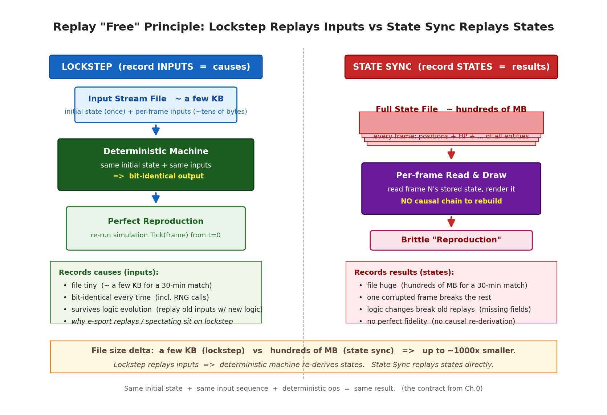
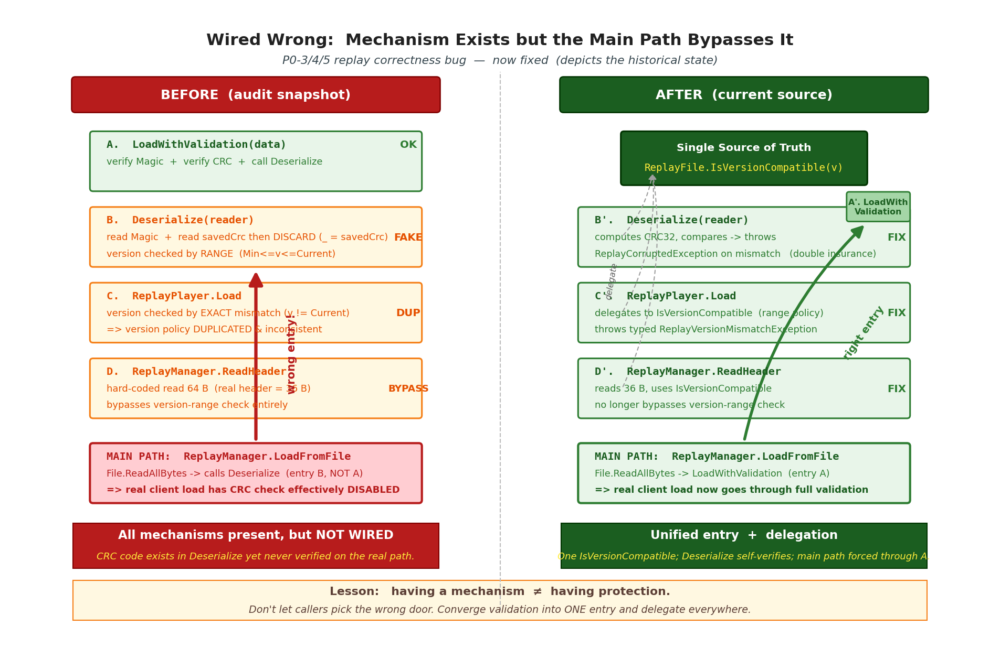

# 第 21 章 · 回放系统:确定性输入流录制

> **核心问题**:上一章我们讲完"零 GC 与对象池",帧同步的运行时性能地基已经齐了。这一章换个角度:既然帧同步的根基是"相同初始状态 + 相同输入序列 + 确定性运算 = 相同结果",那么**只要把每帧的输入录下来,事后从头再跑一遍,就一定能得到一模一样的局面**。这就是回放。问题是:录制要录什么、不录什么?回放文件怎么设计才防损坏(几 KB 的文件传一下坏了怎么办)?以及,锁步 SDK 在这块踩过的一个最值得讲的坑——**校验机制全实现了,但主加载路径走错入口,导致形同虚设**。

> **读完本章你会明白**:
> 1. 为什么帧同步的回放是"免费"的——确定性机器 + 录输入流 = 完美复现,而状态同步回放要录完整状态,文件巨大。这是帧同步 vs 状态同步对比里最直观的一项优势,也是电竞复盘 / 观战几乎都建立在帧同步上的原因。
> 2. 回放系统的三件套(`ReplayRecorder` / `ReplayPlayer` / `ReplayFile`)各干什么:录制录"已确认的帧"而不是预测帧,播放靠 `OnStep` 事件驱动渲染,快进 / 暂停怎么实现。
> 3. 回放文件的"铁三角格式":魔数 `0x5052534C`("LSRP")识别格式 + 版本范围 `[MinCompatible, Current]` 管兼容 + CRC32 末尾校验防损坏。三个缺一不可。
> 4. 一个反面教材 bug——"设计有但接线错":CRC 校验、版本校验都实现了,但调用方走错入口,让保护形同虚设。讲清"有机制 ≠ 有保护",这是防御性编程落地的典型坑。
> 5. 回放和重连的同源关系——它们本质都是"输入流重放",只是触发时机不同。

> **如果一读觉得太难**:先只记住三件事——① 帧同步回放只录输入(几 KB)就能完美还原整场,因为确定性机器给同样的输入必然给同样的结果;② 回放文件靠魔数 + 版本范围 + CRC32 三件套防损坏和管兼容;③ 校验机制写好了不算数,得保证"主加载路径"真的走带校验的入口——这是工程落地最容易翻车的地方。

---

## 〇、一句话点破

> **帧同步的回放之所以"免费",是因为它录的是"输入"(原因)而不是"状态"(结果)——确定性机器保证了相同输入必然相同输出,所以一份几 KB 的输入流,就能把一整场战斗原样还原。回放文件要防损坏,靠的是铁三角:开头一个魔数识别"这是不是回放文件",一个版本范围管"新版本能不能播旧录像",末尾一个 CRC32 验"文件有没有被传坏"。而锁步 SDK 踩过的最大的坑,是这三个校验都写好了,但主加载路径却走了不带校验的入口——机制在,但没接上。**

这是结论。本章倒过来拆:先讲为什么录输入就能复现,再讲录制 / 播放怎么做,然后拆透文件格式的铁三角,最后用那个"接线错"的 bug 当反面教材,讲清防御性编程落地的真相。

---

## 一、为什么录输入就能复现:回放的"免费"原理

这是本章最重要的一节,也是回放系统存在的根本理由。理解了它,后面所有的实现细节都是在为它服务。

### 帧同步的契约:确定性机器

全书从序章就在反复回扣一句话:**相同初始状态 + 相同输入序列 + 确定性运算 = 相同结果**。这是帧同步的契约。前 20 章造的所有地基——定点数 LFloat(第 2、3 章,消灭浮点跨平台不一致)、确定性随机 LRandom(第 4 章,Xorshift128+ 状态就是两个 ulong)、有序遍历 ECS(第 5、6 章,杜绝 Dictionary 遍历顺序的不确定性)、字节级序列化(第 7 章,相同状态产生相同字节流)——全是为了让"一台机器"成为一台**确定性机器**:`Tick(frame)` 这个函数,只要传入的初始状态相同、传入的输入帧相同,跑出来的下一帧状态就一定位级相同,和 CPU 架构、运行时版本、内存布局全无关。

这台确定性机器,是回放"免费"的前提。

### 录"原因"还是录"结果":两条路线的分水岭

现在,你想把一场战斗的过程存下来,事后回看。有两种录法:

```
   方案 A(状态同步的录法):录"结果"
     第 0 帧:  坦克 A 在 (0,0),坦克 B 在 (10,10),血量各 100, ...
     第 1 帧:  坦克 A 在 (0,5),坦克 B 在 (10,10),血量各 100, ...
     第 2 帧:  坦克 A 在 (0,10),坦克 B 在 (9,10),血量各 100, ...
     ...
     每一帧都把"完整局面"记下来,回放时逐帧读出来画。

   方案 B(帧同步的录法):录"原因"
     初始状态:  坦克 A 在 (0,0),坦克 B 在 (10,10)        ← 只录一次
     第 0 帧输入: 玩家 A 按"上", 玩家 B 没按
     第 1 帧输入: 玩家 A 按"上", 玩家 B 按"左"
     第 2 帧输入: 玩家 A 按"上+开火", 玩家 B 按"左"
     ...
     回放时,拿初始状态 + 这串输入,从头再跑一遍逻辑。
```

方案 A 录的是"每一帧的局面"(结果),方案 B 录的是"每一帧的输入"(原因)。差别巨大:

- **文件大小**:方案 A 每一帧要存完整局面。一帧局面有多少东西?假设 100 个实体,每个实体有位置 / 朝向 / 速度 / 血量等几十字节的组件数据,一帧就要几 KB 甚至几十 KB。一场 30 分钟的对局(20fps × 1800s = 36000 帧),文件能到几百 MB。方案 B 每一帧只存输入——几个玩家,每人几个字节的按键,一帧也就几十字节。同样 30 分钟对局,输入流可能只有几百 KB。**差几百到上千倍**。
- **回放保真度**:方案 A 录的是"画面",但中间任何一帧的状态如果录错了或坏了,后面就接不上(因为状态之间没有因果关系可重建)。方案 B 录的是"原因",而确定性机器保证了"给同样的因,必然同样的果"——只要初始状态和输入流完整正确,回放出来的局面和当时一模一样,连每一次随机数调用都一样。**这是"完美复现"**。
- **演进成本**:方案 A 的录像格式和游戏逻辑强绑定——逻辑改了(加了个组件 / 改了字段),旧录像就播不了了(因为旧录像里没有新字段)。方案 B 的录像格式只和输入协议绑定——只要输入的字节布局没变,游戏逻辑怎么改,旧录像照样能播(逻辑层改了,回放就用新逻辑跑旧输入)。

> **承接序章**:序章那张"帧同步 vs 状态同步对比表"里,有一行专门是"回放实现":帧同步"天然支持(重放输入即可)",状态同步"要录制完整状态"。这一节就是把那一行展开讲透。市面上的电竞复盘(星际 2、Dota 2、英雄联盟的录像)、观战系统,几乎全建立在帧同步上,根因就是这里——**录输入最省、最准、最耐演进**。



> **图说(`fig-21-replay-free.png`)**:左右两栏对比。左栏 Lockstep:顶部一个"输入流文件(几 KB)"小方块,箭头向下指向"确定性机器(Same Inputs → Same Output)",再指向"完美复现的局面";标注"录原因、文件小、耐演进"。右栏 State Sync:顶部一个"完整状态文件(几百 MB)"大方块,逐帧堆叠,箭头指向"逐帧读画",标注"录结果、文件大、逻辑改了旧录像就废"。底部一行英文标注:"Lockstep replays inputs; State Sync replays states."

> **钉死这件事**:帧同步的回放之所以"免费",是因为它录"原因"(输入流)而不是"结果"(状态)。确定性机器保证相同输入必然相同输出,所以一份几 KB 的输入流就能完美还原整场。状态同步只能录结果,文件巨大且不耐演进。这就是电竞复盘 / 观战建立在帧同步上的根本原因。

> **作者复盘 · 回放和重连的同源**:讲到这里忍不住插一句——第 19 章讲断线重连时,重连的本质是"服务器给客户端一份快照 + 快照之后的增量输入帧,客户端从快照点重演追上"。你看,这和回放"拿初始状态 + 输入流重演"是同一件事!区别只是触发时机:重连是"中途断了接回来",回放是"事后整场重看"。它们底层共用同一套"输入流重放"机制(都调 `simulation.Tick(frame)`、都用 `IsReplaying=true` 门控副作用)。理解了这一点,你就明白为什么 `ReplayPlayer.Step()` 和 `LockstepController.RollbackTo()` 的重演循环长得几乎一样——它们本来就是同源的。

---

## 二、录制:录"已确认的帧",而不是预测帧

理解了原理,来看实现。录制这件事,看似简单——"每帧把输入存下来"。但帧同步里有个微妙的问题:**该录哪一份输入?**

### 预测帧 vs 确认帧:录错了就是"假回放"

第 8、9 章讲过,帧同步客户端不等服务器,会本地"预测"着往前算。本地玩家按了一个键,客户端先按这个键算下去(预测帧),等服务器把"权威输入"广播回来再确认 / 回滚。这就意味着,任何一帧,客户端本地手里可能有两份输入:

```
   第 1000 帧:
     本地预测的输入:玩家 A 按"上"(我猜的)
     服务器确认的输入:玩家 A 按"上" + 玩家 B 按"左"(权威)

   如果我录的是"预测帧",那这份输入可能和当时真实发生的不一样(我猜错了的部分)。
   回放时,用这份"猜错"的输入重演,得到的局面就不是当时真实的样子——假回放。
```

所以,录制**必须录服务器确认过的帧**(`confirmed frame`),而不是本地预测帧。只有确认帧的输入,才是当时真实发生、全局一致的输入。

源码里,录制点是 `LockstepDriver.OnFrameConfirmed`:

```csharp
// LockstepDriver.cs:888-892(简化示意)
private void OnFrameConfirmed(int tick, FrameData frame, string? stateText)
{
    // P2修复:先录制帧,再检查IsRunning
    // 确保游戏结束时在途的确认帧也能被完整录制
    _recorder?.RecordFrame(frame);
    ...
}
```

注意这个录制点是挂在 `OnFrameConfirmed` 事件上的——这是"一帧被服务器确认"时才触发的事件。也就是说,只有确认过的帧才会进录像。预测帧根本不录。这是录制的第一条纪律。

> **不这样会怎样**:如果挂在"本地 `Tick` 一次"的钩子上录,会把本地预测的输入也录进去。回放时,这些预测输入可能和服务器权威输入不一致(预测错了的部分),回放出来的局面就和当时真实对局分叉了——录像成了"虚构的平行宇宙",完全失去复盘意义。挂在 `OnFrameConfirmed` 上,保证了录像里每一帧都是真实发生过的权威输入。

### 录制要克隆:防"后续修改污染录像"

录制点还有一个细节:`ReplayRecorder.RecordFrame` 会把传入的帧**克隆一份**再存:

```csharp
// ReplayRecorder.cs:43-48(简化示意)
public void RecordFrame(FrameData frame)
{
    if (!_isRecording) return;
    // 记录已确认的帧,必须克隆一份防止被后续修改
    _replay.Frames.Add(frame.Clone());
}
```

为什么要克隆?因为 `FrameData` 里的输入是 `byte[][]`(每玩家一个字节数组,引用类型)。如果不克隆,录像里存的就是"指向同一个数组对象的引用",后续这个 `FrameData` 被复用 / 改写时(比如进下一帧时这个对象被池回收复用、或者输入数组被覆盖),录像里存的数据就跟着变了——录像被悄悄篡改。克隆一份独立拷贝,让录像和运行时完全解耦。

> **承接第 20 章**:第 20 章讲零 GC 时强调过,帧同步里对象复用很普遍(`FrameDataPool` / `BufferPool`)。池化对象的生命周期由池管理,你"存一份引用"进去,池随时可能把它回收复用给下一帧——引用还指着,内容已经变了。这是池化世界的隐形地雷。录制这里克隆一份,就是把录像从池的生命周期里摘出来,做成独立快照。同理,`FrameData.Clone()` 在 `LockstepController` 入队帧时也调用(每个入队的帧都克隆),都是防"对象被复用后内容漂移"。

### 录制的生命周期:Start / RecordFrame / Stop

`ReplayRecorder` 的完整生命周期由三个方法控制。配合 `LockstepDriver` 暴露成 `StartRecording` / `StopRecording`:

```csharp
// ReplayRecorder.cs:31-38(简化示意)
public void Start(int playerCount, uint randomSeed, byte[]? initialState = null)
{
    _replay.PlayerCount = playerCount;
    _replay.RandomSeed = randomSeed;          // 随机种子必须录!
    _replay.InitialState = initialState;       // 初始状态必须录!
    _replay.Frames.Clear();
    _isRecording = true;
}

// LockstepDriver.cs:370-376(简化示意)
public void StartRecording()
{
    if (!IsRunning || _recorder != null) return;
    _recorder = new ReplayRecorder();
    // 录制从当前状态开始。游戏刚开始时调用,InitialState 就是游戏初始状态
    _recorder.Start(PlayerCount, _gameSeed, _simulation.SaveState());
}
```

这里有几个关键点必须讲清:

1. **随机种子(`RandomSeed`)必须录**。这是最容易忘的。第 4 章讲过,LRandom 的状态是两个 ulong,游戏的随机数调用顺序在所有客户端必须一致。回放时,如果随机种子和当时不一样,后续每一次 `LRandom.Next` 都会偏离,局面必然分叉。所以录像里必须存下"这场对局用的随机种子",回放时用这个种子重新初始化。

2. **初始状态(`InitialState`)必须录**。这是"相同初始状态 + 相同输入 = 相同结果"那个等式的前半部分。`StartRecording` 时调 `simulation.SaveState()` 把当前完整状态序列化存下来。回放时,先 `LoadState` 恢复到这个初始状态,再开始喂数入帧。如果忘录初始状态,回放时模拟器是"空"的,喂数入帧也跑不出当时的局面。

3. **`Stop` 时算时长**。录制结束时,根据帧数和帧率算出录像时长(比如 36000 帧 ÷ 20fps = 1800 秒 = 30 分钟),存进录像元数据。这个时长给播放器算进度条用。

> **作者复盘 · 录随机种子这个坑**:早期版本有个 bug,录制时忘了录随机种子——回放时种子用默认值,前几帧还好(还没调到随机),一调到随机(比如开火散布、暴击判定)就分叉,而且分叉得很隐蔽(不是立刻错乱,是慢慢地坦克的位置因为"随机偏移"漂开)。这种 bug 极难定位——录像看起来能播,播着播着不对了。后来把随机种子和初始状态一起塞进录像头,才彻底解决。这其实是"确定性契约"的第一课:**等式的左边(初始状态)和中间(输入序列)一个都不能少**。

> **钉死这件事**:录制有三条纪律——① 录"已确认的帧",不录预测帧(否则回放是虚构的);② 录入时克隆一份,防池化对象被复用污染录像;③ 录像头必须存随机种子和初始状态,否则确定性等式不成立,回放必分叉。

---

## 三、播放:OnStep 事件驱动渲染,快进 / 暂停 / 跳转

录制是"喂数据进录像",播放是"从录像喂数据回模拟器"。播放的核心难点不在播放本身(就是循环 `simulation.Tick(frame)`),而在**怎么和渲染层配合**——回放也是个"逻辑帧 20fps / 渲染帧可变"的场景,要平滑。

### 播放的三件事:步进、事件、快进

`ReplayPlayer` 的核心 API:

```csharp
// ReplayPlayer.cs:75-102(简化示意)
public bool Step()
{
    if (_replay == null || _currentFrameIndex >= _replay.Frames.Count)
    {
        _isPlaying = false;
        return false;
    }

    var frame = _replay.Frames[_currentFrameIndex];

    // 回放时标记为重演模式,避免触发副作用(音效、粒子等)
    _simulation.IsReplaying = true;
    try
    {
        _simulation.Tick(frame);
    }
    finally
    {
        _simulation.IsReplaying = false;
    }

    int tick = frame.Frame;
    _currentFrameIndex++;
    OnStep?.Invoke(_simulation, tick);
    return _currentFrameIndex < _replay.Frames.Count;
}
```

三个关键点:

1. **`IsReplaying = true` 门控副作用**。第 9 章讲回滚时强调过这条纪律:重演时,逻辑层会重新执行——开火会重新触发、爆炸会重新触发、音效会重新播放。如果不管制,一场 30 分钟的录像播到第 10 分钟的开火点,会把过去 10 分钟所有的音效粒子一股脑重新放一遍。`IsReplaying` 标志告诉业务层"现在是在重演,音效粒子别真放,最多放个视觉占位"。回放和回滚共用这个机制——它们都是重演。

   > **承接 C-6**:第 25 章会专门讲一个 bug(`C-6`):`IsReplaying` 标志在追帧 `break` 时没复位,残留成 `true`,导致后续预测帧被误当回放帧、副作用被静音。修复是 `try/finally` 保证任意出口都复位。回放这里 `Step()` 用的是同样的 `try/finally` 套法,道理一样——标志位必须有"无论怎么退出都会复位"的保证。

2. **`OnStep` 事件驱动渲染**。每执行完一帧,触发 `OnStep(simulation, tick)`。渲染层订阅这个事件,在回调里采样一帧逻辑状态。这是逻辑 / 表现分离的标准接法(第 11 章讲过)。看实际用法(`ReplayPlaybackScene.cs:50-53`):

```csharp
// 回放场景订阅步进事件
_player.OnStep += (sim, tick) => {
    if (sim is TankGameSimulation tankSim)
        _renderer?.Update(tankSim, tick);   // 每步进一帧,采样一帧逻辑状态
};
```

3. **返回"还有没有下一帧"**。`Step()` 返回 `bool`,告诉调用方"录像到头没"。到头了就停播。调用方在渲染循环里按帧率节拍调 `Step()`:

```csharp
// ReplayPlaybackScene.cs:88-100(简化示意)
if (_player.IsPlaying)
{
    _frameAccumulator += deltaTime * _playbackSpeed;   // 倍速控制
    while (_frameAccumulator >= FrameInterval)         // FrameInterval = 1/20
    {
        _frameAccumulator -= FrameInterval;
        if (!_player.Step()) { break; }                // 到头了跳出
    }
}
```

这套接法把"按帧率推进逻辑"和"渲染插值"解耦:`Step()` 只管推逻辑,渲染层用 `_frameAccumulator / FrameInterval` 算插值比例(第 11 章那套),各自独立。

### 暂停 / 倍速:只是控制节拍

理解了上面的接法,暂停和倍速就很简单:

- **暂停**:`_isPlaying = false`,渲染循环里就不进 `while` 推逻辑了,逻辑状态冻结,渲染层继续画(画面静止)。一行代码 `_player.Pause()`。
- **倍速**:把 `deltaTime` 乘以倍速(`_playbackSpeed = 2 / 4 / 8`)。同样一段时间累积更多"帧时间",`while` 循环里多调几次 `Step()`,逻辑推进更快,画面就快进了。回放场景支持 1x / 2x / 4x / 8x(`ReplayPlaybackScene.cs:83-86`)。

这套倍速有个前提:**回放推进不受网络约束**。在线对战时,客户端要等服务器广播权威帧才能推进,快不了。回放是本地喂数据,想多快就多快(只要 CPU 跟得上),8x 就是每个渲染帧推 8 个逻辑帧。这是回放相对在线的额外自由度。

### 快进 JumpTo:从头重演到目标帧

还有个高级功能——拖进度条跳到任意帧。这个稍微复杂,因为不能"凭空跳到第 N 帧的状态"(没存那个状态),只能"从初始状态重演到第 N 帧"。看 `JumpTo`:

```csharp
// ReplayPlayer.cs:112-142(简化示意)
public void JumpTo(int targetFrameIndex)
{
    if (_replay == null) return;

    // 重置模拟器到初始状态
    _simulation.Reset();
    _simulation.Initialize(_replay.PlayerCount, _replay.RandomSeed);
    if (_replay.InitialState != null)
    {
        _simulation.LoadState(_replay.InitialState.AsSpan());
    }
    _currentFrameIndex = 0;

    // 跳转过程中标记为重演模式
    _simulation.IsReplaying = true;
    try
    {
        // 在紧凑循环中纯逻辑步进,不触发外部状态更新(不调 OnStep)
        while (_currentFrameIndex < targetFrameIndex && _currentFrameIndex < _replay.Frames.Count)
        {
            var frame = _replay.Frames[_currentFrameIndex];
            _simulation.Tick(frame);
            _currentFrameIndex++;
        }
    }
    finally
    {
        _simulation.IsReplaying = false;
    }
}
```

注意两点:

1. **`JumpTo` 重置回初始状态,从头重演**。它先 `Reset` + `Initialize` + `LoadState`(用录像里存的随机种子和初始状态),把模拟器拉回到录像开始那一刻,然后紧凑循环 `Tick` 到目标帧。这就是"确定性机器"的用法——任意时刻的状态,都可以"从初始状态 + 重演"复现出来,不需要每帧都存。

   > **承接 REPLAY_GUIDE**:`docs/REPLAY_GUIDE.md` 提了一个进阶优化:"回放跳转实现需定期(如每 150 帧)保存关键快照,跳转时加载最近的旧快照并静默重演至目标帧"。当前 `JumpTo` 是朴素实现(从初始状态重演),长录像跳到很后面会卡一下(要重演几千帧)。加定期快照后,跳转最多重演 150 帧,瞬间完成。这和第 19 章重连"快照 + 增量帧"是同一招——拿空间换时间。

2. **`JumpTo` 不触发 `OnStep`**。它注释写明"在紧凑循环中纯逻辑步进,不触发外部状态更新"。为什么?因为跳转中间的帧,渲染层不需要画(用户拖进度条,中间帧没人看),只关心跳到目标帧后的画面。如果每帧都触发 `OnStep`,渲染层会傻乎乎地把跳转过程几千帧都画一遍,拖个进度条画面要卡几秒。所以 `JumpTo` 跳完才让渲染层采样一次目标帧的状态。这是"快进"和"倍速播放"的本质区别——倍速播放是"加速但每帧都画",快进是"跳过中间帧不画"。

> **钉死这件事**:播放有三件事——① `Step()` 是核心,每步推一帧逻辑、触发一次 `OnStep`、用 `IsReplaying` 门控副作用;② 暂停 / 倍速只是控制"渲染循环里调 `Step()` 的频率",本地喂数据不受网络约束;③ 快进 `JumpTo` 是"重置回初始状态 + 紧凑重演到目标帧",中途不触发 `OnStep`(中间帧不画),确定性机器保证能复现任意时刻状态。

---

## 四、回放文件格式:铁三角防损坏

讲完录制和播放,来看文件格式。这是这一章的硬核点——回放文件要面对"传输损坏 / 恶意伪造 / 版本演进"三重威胁,锁步 SDK 用一套"铁三角"格式来挡。

### 三重威胁:格式识别、版本演进、数据损坏

一个回放文件,从录制到播放,要经历:存到磁盘 → (可能)网络传输 → 下载到另一台机器 → 加载。每一步都可能出问题:

- **格式识别**:用户可能把一个 `.lrp` 文件改成了别的扩展名,或者拿了个 `.txt` 文件硬塞给播放器。播放器怎么知道"这真不是回放文件"?如果硬解析,可能把文本当二进制读,读出莫名其妙的数据不报错(静默错误)。
- **版本演进**:游戏从 v1.0 升到 v1.1,输入协议加了字段。旧版本录的录像,新版本能不能播?新版本录的,旧版本能不能播(至少得拒绝得优雅)?如果不管版本,新版本拿旧格式录像硬播,读到字段错位,行为未定义。
- **数据损坏**:文件存磁盘坏了几个字节(磁盘故障),或者网络传输丢了一段。播放器加载这种文件,如果不校验,会把损坏的数据当真,回放出莫名其妙的局面,甚至崩溃。

这三重威胁,各需要一个机制挡。

### 铁三角:魔数 + 版本范围 + CRC32

`ReplayFile` 的格式设计,就是为这三重威胁量身定做的。文件布局如下:

```
   回放文件布局(.lrp):
   ┌─────────────────────────────────────────────────────────────────┐
   │ Magic: 4 bytes     "LSRP" (0x5052534C)                          │  ← 铁三角之一:识别格式
   ├─────────────────────────────────────────────────────────────────┤
   │ Version: 4 bytes   当前 = 2                                     │  ← 铁三角之二:管兼容
   │ RecordTime: 8 bytes                                             │
   │ TotalFrames: 4 bytes                                            │
   │ Duration: 8 bytes                                               │
   │ PlayerCount: 4 bytes                                            │
   │ RandomSeed: 4 bytes                                             │
   │ InitialState: [len:int32][bytes]                                │
   │ FrameCount: 4 bytes                                             │
   │ Frames: 逐帧 FrameData                                          │
   ├─────────────────────────────────────────────────────────────────┤
   │ CRC32: 4 bytes     (覆盖 Version 到 Frames 末尾,不含 Magic 自身)│  ← 铁三角之三:防损坏
   └─────────────────────────────────────────────────────────────────┘
```

![回放文件铁三角格式:魔数 LSRP + 版本范围 [Min, Current] + 末尾 CRC32,三者各挡一重威胁(格式识别 / 版本演进 / 数据损坏)](images/fig-21-iron-triangle.png)

> **图说(`fig-21-iron-triangle.png`)**:横向画一个 `.lrp` 文件的字节布局条带,从左到右分四段——① Magic(4B) 标 "LSRP = 0x5052534C",下方红框注"挡格式识别";② Header + Frames(变长) 包含 Version / RecordTime / TotalFrames / RandomSeed / InitialState / Frames,其中 Version 标 "[MinCompatible=2, Current=2]",下方红框注"挡版本演进";③ 末尾 CRC32(4B),标"覆盖 Version→Frames,IEEE 802.3",下方红框注"挡数据损坏"。三段用三色(蓝/绿/橙)区分。底部一行英文:"Magic identifies format; Version range gates compatibility; CRC32 guards integrity."

三个机制各挡一个威胁:

#### 铁三角之一:魔数(Magic)——识别"这是不是回放文件"

文件开头 4 字节,固定写一个魔数 `0x5052534C`(ASCII 就是 "LSRP",Lockstep Replay 的缩写)。加载时先读这 4 字节,对不上就立刻拒绝:

```csharp
// ReplayFile.cs:127-134(简化示意)
uint magic = reader.ReadUInt32();
if (magic != FileMagic)   // FileMagic = 0x5052534C
{
    throw new InvalidOperationException(
        $"[ReplayFile] Invalid file format! Expected magic 0x{FileMagic:X8} ('LSRP'), got 0x{magic:X8}. " +
        "This is not a valid replay file.");
}
```

这就像 ZIP 文件开头是 `PK`(0x504B)、PNG 是 `\x89PNG`、class 文件是 `0xCAFEBABE`——**用一个独一无二的字节序列当"身份证"**,加载器一看开头就知道"这是不是我认识的格式"。魔数挡住的就是"格式识别"威胁:用户塞个 `.txt` 进来,开头几个字节几乎不可能是 "LSRP",立刻被拒,不会硬解析出垃圾数据。

> **不这样会怎样**:如果不校验魔数,一个文本文件开头可能是任意字节。播放器会把它当回放文件解析——版本号读成某个随机值、帧数读成几百万、InitialState 读成一大段乱码……要么解析时越界崩溃,要么解析出一堆垃圾数据、回放时跑出莫名其妙的局面。加了魔数,这种"格式根本不对"的情况在第一道关卡就被挡住,错误信息清晰("这不是回放文件")。

#### 铁三角之二:版本范围——管"新旧版本能不能互播"

魔数后面紧跟 4 字节版本号。锁步 SDK 当前版本是 2(V2 加了 CRC32 校验),最低兼容版本也是 2。版本检查用一个**范围**判断:

```csharp
// ReplayFile.cs:62-70(简化示意)
public const uint CurrentVersion = 2;            // 当前版本
public const uint MinCompatibleVersion = 2;       // 最低兼容版本

// 判断版本是否兼容(在 [MinCompatibleVersion, CurrentVersion] 范围内)
public static bool IsVersionCompatible(uint version)
    => version >= MinCompatibleVersion && version <= CurrentVersion;
```

为什么是范围而不是精确匹配?这是版本演进的常见策略:

- 录像版本 `< MinCompatibleVersion`:太老了,当前播放器播不了(格式已经改了不兼容),拒绝。
- 录像版本 `> CurrentVersion`:太新了(可能是用更新的播放器录的),当前播放器也不该播(可能有它不认识的字段),拒绝。
- 录像版本在 `[Min, Current]` 范围内:兼容,可以播。

这种"范围兼容"让版本演进有弹性——`Min` 和 `Current` 可以随版本推进调整(比如未来 `Current=3` 时,可以把 `Min` 设成 2,让 v3 播放器既能播 v3 也能播 v2,只是不播 v1)。

> **承接双轨版本号**:这里讲的是**回放文件的版本号**(`ReplayFile.CurrentVersion = 2`),它和第 16 章讲的两个版本号(`ProtocolVersion = 1.1` 线协议版本、`SerializationVersion = 2` 快照格式版本)是**三轨独立**的。三者管三个不同的兼容性边界:线协议管"客户端和服务器能不能握手",快照格式管"存档 / 重连快照能不能加载",回放文件版本管"录像能不能播"。三者各自演进,互不绑死。这是"每个兼容性边界独立版本化"的设计哲学。

#### 铁三角之三:CRC32——防"数据被传坏"

文件末尾 4 字节,存一个 CRC32 校验码(覆盖从 Version 到 Frames 末尾的所有数据,不含 Magic 自身、也不含 CRC 这 4 字节)。加载时重算一遍 CRC,和文件里存的比对,不一致就说明数据被改过(传输损坏 / 磁盘故障 / 恶意篡改),拒绝加载:

```csharp
// ReplayFile.cs:248-260(CRC32 计算,IEEE 802.3 多项式)
private static uint ComputeCrc32(ReadOnlySpan<byte> data)
{
    uint crc = 0xFFFFFFFF;
    foreach (byte b in data)
    {
        crc ^= b;
        for (int i = 0; i < 8; i++)
        {
            crc = (crc >> 1) ^ (0xEDB88320 * (crc & 1));
        }
    }
    return crc ^ 0xFFFFFFFF;
}
```

CRC32 是经典的循环冗余校验——用 `0xEDB88320`(IEEE 802.3 标准多项式的反码)对每个字节做 8 轮位运算,最后异或 `0xFFFFFFFF`。它能把任意长数据"压缩"成一个 32 位指纹,数据改一个字节,指纹就完全变。32 位 CRC 检测突发错误的概率极高(漏检概率约 2⁻³²),对传输损坏足够。

> **承接第 7 章 FNV-1a**:第 7 章讲序列化时用过 FNV-1a 哈希(用于状态哈希对账抓 desync)。CRC32 和 FNV-1a 都是"把数据压成指纹"的算法,但用途不同:FNV-1a 强调"对不同数据给不同指纹,做等价性比对",CRC32 强调"检测传输错误"(对突发错误有数学保证)。两者都是确定性运算,跨平台一致。

### 三个机制缺一不可

为什么是铁三角,而不是只靠其中一个?因为它们挡的威胁不同:

- 只有魔数,没有版本 / CRC:能识别格式,但新旧版本硬播会错位,坏了的数据不校验。
- 只有版本,没有魔数 / CRC:能管兼容,但格式根本不对的文件会被硬解析,坏了的数据不校验。
- 只有 CRC,没有魔数 / 版本:能防损坏,但识别不了"根本不是回放文件",管不了版本兼容。

三者协同,才能把"格式识别 + 版本兼容 + 数据完整"三道关卡都守住。

> **钉死这件事**:回放文件的铁三角格式——开头魔数 `0x5052534C`("LSRP")识别格式,版本范围 `[MinCompatible, Current]` 管兼容(范围而非精确匹配,给演进留弹性),末尾 CRC32(IEEE 802.3)防损坏。三者挡的威胁不同(格式识别 / 版本演进 / 数据损坏),缺一不可。

---

## 五、技巧精解:那个"设计有但接线错"的反面教材

这一节是本章最值得讲的部分。前面铁三角看着无懈可击——魔数、版本、CRC 都实现了。但工业级审计在回放这块发现了一组 P0 级 bug(`P0-3 / P0-4 / P0-5`,合称"回放正确性铁三角"):**校验机制全都写好了,但调用方走错入口,让保护形同虚设**。这是防御性编程落地最典型的坑,值得单独拆透。

### 发现:同一个 `ReplayFile`,两条加载路径行为不一致

回放文件有两个加载入口:

1. **`LoadWithValidation(byte[] data)`**:静态方法。先校验魔数、读末尾 CRC、重算 CRC 比对(完整校验),再调 `Deserialize` 反序列化。**带完整 CRC 校验**。
2. **`Deserialize(BitReader reader)`**:实例方法。读魔数、读版本、读数据,自带 CRC 校验逻辑。**也带 CRC 校验**(当前源码)。

看起来都带校验,没问题啊?问题在于**审计快照时**的状态。审计文档(`FRAMEWORK_QUALITY_AUDIT.md`)记录的当时的代码状态是:

- `Deserialize` **读取并丢弃 `savedCrc` 但完全不验证**(`_ = savedCrc`),只有 `LoadWithValidation` 才校验。
- `ReplayPlayer.Load` 用**精确不等**校验版本(`SimulationVersion != CurrentVersion`),而 `Deserialize` 用**范围**校验——版本判断双标。
- `ReplayManager.ReadHeader` 硬编码读 64 字节、绕过版本范围校验。
- **主加载路径** `ReplayManager.LoadFromFile` 走的是**无校验的 `Deserialize`**。

合起来就是:**校验机制都在,但主路径走错入口,导致保护形同虚设**。这是"设计有但接线错"的典型——代码层面看,你写了 CRC 校验、写了版本校验,但因为调用方走的是另一条路径,这些校验根本没生效。

> **作者复盘 · 为什么这是"接线错"而不是"没写校验"**:这个 bug 之所以隐蔽,是因为代码审查时一眼看到 `Deserialize` 里有 CRC 读取代码、有版本判断逻辑,会下意识认为"校验做了"。但仔细读才发现——读取了 `savedCrc` 却没比对、版本判断两套口径不一致、`ReadHeader` 硬编码绕过。**机制的"存在"和机制的"生效"是两回事**。这就像你给家门装了三把锁,但出门时只锁了一把,另两把挂着没用——锁都有,但没锁上。防御性编程最怕的就是这种"以为有保护其实没有"。

### 根因:三条路径,各走各的

当时回放加载有三条路径,各走各的逻辑,没有统一:

```
   路径 A(完整校验):ReplayFile.LoadWithValidation(data)
     → 校验魔数 + 校验 CRC + 调 Deserialize
     → 这条路径最完整

   路径 B(无校验):ReplayFile.Deserialize(reader)
     → 校验魔数 + 读 savedCrc 但不比对 + 读数据
     → 这条路径"假装校验"

   路径 C(主路径,本该用 A 却用了 B):
     ReplayManager.LoadFromFile(path)
       → File.ReadAllBytes → 调 Deserialize(走的是 B,不是 A!)
     → 实际播放时,客户端走的就是这条主路径
     → 所以实际加载的回放,CRC 校验形同虚设
```

版本校验也是同样问题,两个口径不一致:`Deserialize` 用范围(`< Min` 或 `> Current` 拒),`ReplayPlayer.Load` 用精确不等(`!= Current` 拒)。一个录像版本号是 2,在 `Deserialize` 那是兼容的(在 [2,2] 范围内),在 `ReplayPlayer.Load` 那也兼容(== 2),但万一未来 `Current` 升到 3、`Min` 还是 2,这个录像在 `Deserialize` 那还兼容(2 在 [2,3]),在 `ReplayPlayer.Load` 那就被拒(!= 3)——同一份录像,两个加载点判断不一致,行为分裂。



> **图说(`fig-21-wiring-bug.png`)**:左右对比两条加载路径。**左栏(修复前)**:三个入口并排——`LoadWithValidation`(✅ 绿色,标"校验 CRC + 版本范围");`Deserialize`(⚠️ 黄色,标"读 savedCrc 但丢弃,不验证");`ReplayPlayer.Load`(⚠️ 黄色,标"精确不等 != Current")。`ReplayManager.LoadFromFile`(主路径,红色)用粗箭头**指向 `Deserialize`**(走错入口),标"主路径 → 无 CRC 校验,形同虚设"。底部红字:"机制都在,但没接上"。**右栏(修复后)**:`IsVersionCompatible`(单一事实源,绿色)被三个入口同时委托(虚线箭头);`Deserialize` 自带 CRC 校验(双保险);`LoadFromFile` 改指 `LoadWithValidation`(绿色箭头)。底部绿字:"统一入口 + 委托"。

### 修复:统一入口 + 统一版本判断

修复方案是把三条路径收敛到一套统一的逻辑。逐项看:

**修复 1:`Deserialize` 实算 CRC 并比对(不再跳过)**

```csharp
// ReplayFile.cs:188-207(当前已修,简化示意)
if (SimulationVersion >= 2)   // V2+ 版本才有 CRC
{
    int crcEndPosition = reader.Position;
    uint savedCrc = reader.ReadUInt32();

    // 注(阶段2.2a 更新):已实算 CRC 并比对,见下方;不再跳过验证
    var dataSpan = reader.AsSpan().Slice(crcStartPosition, crcEndPosition - crcStartPosition);
    uint actualCrc = ComputeCrc32(dataSpan);
    if (savedCrc != actualCrc)
    {
        throw new ReplayCorruptedException(savedCrc, actualCrc);
    }
}
```

注释里那句"阶段2.2a 更新:已实算 CRC 并比对,不再跳过验证"就是修复痕迹。现在 `Deserialize` 真的算 CRC、真的比对、不一致真的抛 `ReplayCorruptedException`。

**修复 2:统一版本判断入口**

抽出统一的 `IsVersionCompatible` 静态方法,所有版本判断都委托给它:

```csharp
// ReplayFile.cs:65-70
public static bool IsVersionCompatible(uint version)
    => version >= MinCompatibleVersion && version <= CurrentVersion;
```

`Deserialize` 用它、`ReplayPlayer.Load` 用它、`ReplayManager.ReadHeader` 也用它——**版本判断逻辑只有一处,三条路径口径完全一致**:

```csharp
// ReplayPlayer.cs:37-40(当前已修)
if (!ReplayFile.IsVersionCompatible(_replay.SimulationVersion))
{
    throw new ReplayVersionMismatchException(_replay.SimulationVersion, ReplayFile.CurrentVersion);
}

// ReplayManager.cs:62-66(当前已修)
// 阶段2.2c: 版本范围校验(与 Deserialize / Load 一致,不再绕过)
if (!ReplayFile.IsVersionCompatible(replay.SimulationVersion))
{
    throw new ReplayVersionMismatchException(replay.SimulationVersion, ReplayFile.CurrentVersion);
}
```

**修复 3:主路径走带校验的入口**

```csharp
// ReplayManager.cs:25-32(当前已修)
public static ReplayFile LoadFromFile(string path)
{
    if (!File.Exists(path))
        throw new FileNotFoundException("Replay file not found", path);
    var data = File.ReadAllBytes(path);
    return ReplayFile.LoadWithValidation(data);   // ← 走 LoadWithValidation,不再走裸 Deserialize
}
```

主加载路径 `LoadFromFile` 改为调 `LoadWithValidation`(带完整 CRC 校验的入口),不再调裸 `Deserialize`。这下"主路径走错入口"的问题彻底消除。

**修复 4:`ReadHeader` 不再硬编码 / 绕过校验**

原来 `ReadHeader` 硬编码读 64 字节(实际 header 是 36 字节)、绕过版本范围校验。现在改成读 36 字节、用 `IsVersionCompatible` 校验版本、用带类型异常(`ReplayVersionMismatchException`)拒绝。

### 现状:已全部修复,校验真正生效

逐条核实当前源码状态(2026-07 据源码核对):

| 审计当时的问题 | 当前源码状态 | 核实依据 |
|---|---|---|
| `Deserialize` 读 `savedCrc` 不验证 | ✅ **已修**:实算 CRC 并比对,不一致抛 `ReplayCorruptedException` | `ReplayFile.cs:201-206`,注释"阶段2.2a 更新" |
| `ReplayPlayer.Load` 用精确不等校验版本 | ✅ **已修**:委托 `ReplayFile.IsVersionCompatible`,抛带类型异常 | `ReplayPlayer.cs:37-40` |
| `ReplayManager.ReadHeader` 硬编码 64 字节 / 绕过版本校验 | ✅ **已修**:读 36 字节、用 `IsVersionCompatible`、抛带类型异常 | `ReplayManager.cs:43,63-66` |
| 主路径 `LoadFromFile` 走无校验的 `Deserialize` | ✅ **已修**:改调 `LoadWithValidation` | `ReplayManager.cs:31` |
| `D-9` frameCount OOM | ✅ **已修**(轮次8):`frameCount*8 > remaining` 守卫 | `ReplayFile.cs:171-177` |

**结论**:这组 P0 / P1 bug 当前**已全部修复**。校验机制不仅都实现了,而且三条加载路径(完整加载 / 播放器加载 / 只读 header)口径完全一致、主路径走带校验入口。这是一个"发现→根因→修复→现状已修"的完整闭环,不是现存的债。

### 这个 bug 教会我们什么

这个 bug 之所以值得专门讲,不是因为它多复杂,而是因为它揭示了一个工程上的普遍真理:

> **有机制 ≠ 有保护。**

防御性编程最容易翻车的地方,不是"忘了写校验",而是"校验写了,但调用方没走带校验的路径"。这种 bug 在代码审查时极难发现——你看到 `Deserialize` 里有 CRC 读取代码,会下意识认为"校验做了";看到 `LoadWithValidation` 有完整校验,会认为"加载都校验了"。只有当你把"调用图"画出来,才会发现主路径其实绕开了校验。

> **技巧精解的位置**:这个 bug 的根因是"加载入口不统一"。修复的核心技巧是——**把校验逻辑收敛到唯一入口,所有加载路径都委托给它**。具体地:① 抽出 `IsVersionCompatible` 统一版本判断(单一事实源);② 让 `Deserialize` 自己也做 CRC 校验(双保险,即使有人误调裸 `Deserialize` 也有保护);③ 主路径 `LoadFromFile` 强制走 `LoadWithValidation`。这套"统一入口 + 委托"的模式,是防御性编程落地的标准范式——别让调用方有"走错路"的机会。

> **承接第 25 章**:这个"接线错"案例会在第 25 章(bug 定位实战)里作为"从代码审查发现的问题"的典型详讲。第 25 章还会讲一组"假问题教学集"——那些看着像 bug 其实不是的(比如"LFloat 构造溢出"其实从未被调用)。鉴别真假 bug 的能力,和发现"接线错"的能力,是同一种工程成熟度——**不只看代码写了什么,更看代码实际怎么跑**。

> **钉死这件事**:"设计有但接线错"是防御性编程的头号坑——校验机制写了不算数,得保证主加载路径真的走带校验的入口。锁步 SDK 的修复范式是"统一入口 + 委托":抽出 `IsVersionCompatible` 做版本判断单一事实源、让 `Deserialize` 自带 CRC 校验做双保险、主路径强制走 `LoadWithValidation`。这个 bug 当前已全部修复,不是现存的债。

---

## 六、回放与重连的同源关系

前面几节零散提过几次,这一节系统讲清。回放和第 19 章的重连,底层是**同一套机制**,只是触发时机不同。理解这个同源关系,能帮你把前后知识串起来。

### 都是"输入流重放"

回放:事后拿一份完整录像(初始状态 + 全部输入帧),从头重演,看整场过程。

重连:中途断线,服务器给客户端一份最近快照 + 快照之后的增量输入帧,客户端从快照点重演,追上当前战局。

两者的核心动作都是——**拿一份初始(或快照)状态 + 一串输入帧,调 `simulation.Tick(frame)` 循环重演**。区别只在:

| 维度 | 回放 | 重连 |
|---|---|---|
| 触发 | 用户事后主动 | 网络断了被动 |
| 起点 | 录像的初始状态(`InitialState`) | 服务器发的最近快照 |
| 输入流 | 录像里的全部帧 | 快照之后的增量帧(`MissFrame`) |
| 终点 | 录像最后一帧 | 追上当前服务器帧 |
| 副作用门控 | `IsReplaying = true`(全程静音) | `IsReplaying = true`(追帧段静音) |
| 复用的 API | `simulation.Tick(frame)` / `LoadState` | 同左 |

它们甚至复用同一套基础设施——`ISimulation.Tick(frame)`、`ISimulation.LoadState`、`IsReplaying` 副作用门控、`OnStep` 事件(回放用来驱动渲染,重连追帧时不触发)。

### 为什么能同源:确定性机器

能同源,根因还是那句——确定性机器。任意时刻的状态,都可以"从某个起点状态 + 重演输入流"复现出来。所以无论起点是"录像的初始状态"(回放)还是"服务器的最近快照"(重连),只要后续输入流正确,重演出来的状态就一定对。

这也是为什么第 19 章讲重连时强调"快照 + 增量帧"而不是"每帧存完整状态"——和回放录输入而不是录状态,是同一个设计哲学:**录 / 传原因,不录 / 传结果,靠确定性机器重建结果**。

> **钉死这件事**:回放和重连同源——都是"起点状态 + 输入流重演",都复用 `simulation.Tick / LoadState / IsReplaying`。区别只在触发时机(主动 vs 被动)、起点(初始状态 vs 快照)、终点(录像末帧 vs 当前服务器帧)。能同源的根因还是确定性机器:任意状态都可从起点 + 输入流复现。

---

## 七、章末小结

### 回扣主线

本章服务全书主线,属于**横切**(SDK 化与工程化的一部分)。我们回答了"回放系统怎么设计"这个问题:① 回放之所以"免费",是因为帧同步录"原因"(输入流)而不是"结果"(状态),确定性机器保证相同输入必然相同输出,一份几 KB 的输入流就能完美还原整场——这是帧同步 vs 状态同步对比里最直观的一项优势,也是电竞复盘 / 观战建立在帧同步上的根因;② 录制录"已确认的帧"(不录预测帧)、录入时克隆防污染、录像头存随机种子和初始状态(确定性等式两边都不能少);③ 播放靠 `OnStep` 事件驱动渲染、暂停 / 倍速只控制节拍、快进是"重置 + 紧凑重演"(中途不触发 `OnStep`);④ 文件格式铁三角(魔数 + 版本范围 + CRC32)各挡一重威胁(格式识别 / 版本演进 / 数据损坏),缺一不可;⑤ 那个"设计有但接线错"的反面教材(P0-3/4/5,当前已全部修复),讲清"有机制 ≠ 有保护",修复范式是"统一入口 + 委托";⑥ 回放和重连同源,都是输入流重放,根因是确定性机器。

### 五个为什么

1. **为什么帧同步的回放是"免费"的?**——因为帧同步录"原因"(输入流,几 KB)而不是"结果"(状态,几百 MB),确定性机器保证相同输入必然相同输出。状态同步只能录结果,文件巨大且不耐演进。这就是电竞复盘 / 观战建立在帧同步上的根因。
2. **录制为什么必须录"已确认的帧"而不是预测帧?**——预测帧是本地猜的,可能和服务器权威输入不一致(猜错的部分)。录了预测帧,回放就是"虚构的平行宇宙"。挂在 `OnFrameConfirmed` 事件上录,保证录像里每一帧都是真实发生过的权威输入。
3. **回放文件为什么要"铁三角"(魔数 + 版本 + CRC)?**——三者挡的威胁不同:魔数识别"这是不是回放文件"(防格式不对硬解析),版本范围管"新旧版本能不能互播"(防字段错位),CRC32 防"数据被传坏"(防静默错误)。三者缺一不可,只靠其中一个挡不全。
4. **"设计有但接线错"这个 bug 教会我们什么?**——有机制 ≠ 有保护。校验机制写了不算数,得保证主加载路径真的走带校验的入口。这是防御性编程落地最典型的坑——代码审查时一眼看到校验代码会下意识认为"做了",但只有把调用图画出来,才会发现主路径绕开了校验。修复范式是"统一入口 + 委托"(抽 `IsVersionCompatible` 单一事实源、`Deserialize` 自带 CRC 双保险、主路径强制走 `LoadWithValidation`)。
5. **回放和重连为什么是同源的?**——都是"起点状态 + 输入流重演",都复用 `simulation.Tick / LoadState / IsReplaying`。区别只在触发时机(主动 vs 被动)、起点(初始状态 vs 快照)、终点(录像末帧 vs 当前服务器帧)。能同源的根因是确定性机器——任意状态都可从起点 + 输入流复现。

### 想继续深入往哪钻

- 想搞懂重连的"快照 + 增量帧"细节:第 19 章(断线重连)。
- 想搞懂 `IsReplaying` 副作用门控的 bug(C-6,标志位没复位):第 25 章(bug 定位实战)。
- 想看更多"设计有但接线错"类的 bug:第 25 章(双轨哈希漂移即覆盖,也是机制对但工程落地错)。
- 想搞懂状态哈希对账(回放追帧时也能用来验证追对了):第 23 章(哈希校验双轨)。

### 引出下一章

我们讲完了回放系统。下一章第 22 章,**性能基准与可观测性:测量驱动优化**,是第 5 篇最后一章,也是招牌章。它会讲怎么测量帧同步的性能(Benchmark 方法论——区分"基准伪影"和"生产路径",2251 bytes/帧 是 `SaveState().ToArray()` 伪影,真实生产路径 635 B/帧)、Int128 软件运算税(.NET 8 无 128 位硬件指令,但游戏值高 32 位几乎总为 0,long 快速路径命中率 >99%,LVector2 乘法 62x 提速)、以及可观测性地基(desync 被静默吞掉怎么办、字段级定位三件套:分桶增量哈希 + World.Diff + 触发时全量落盘)。性能好 ≠ 工程好,这一章会把"怎么把帧同步做成可测量、可观测、可定位"的工程方法讲透。

> **下一章**:[第 22 章 · 性能基准与可观测性:测量驱动优化](P5-22-性能基准与可观测性-测量驱动优化.md)
