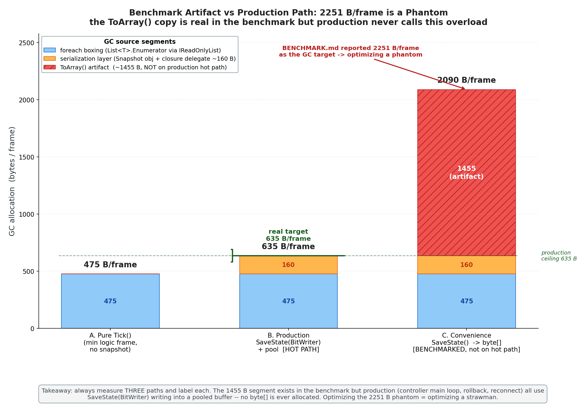
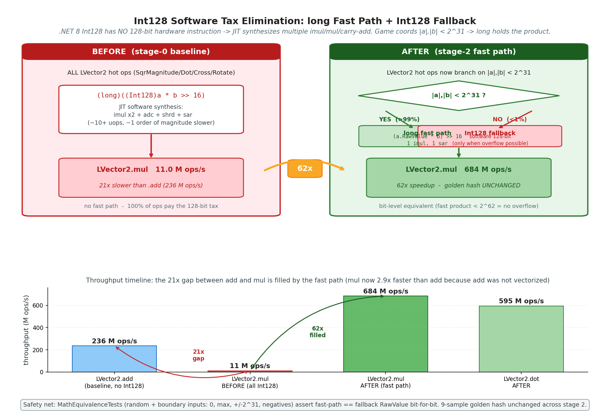
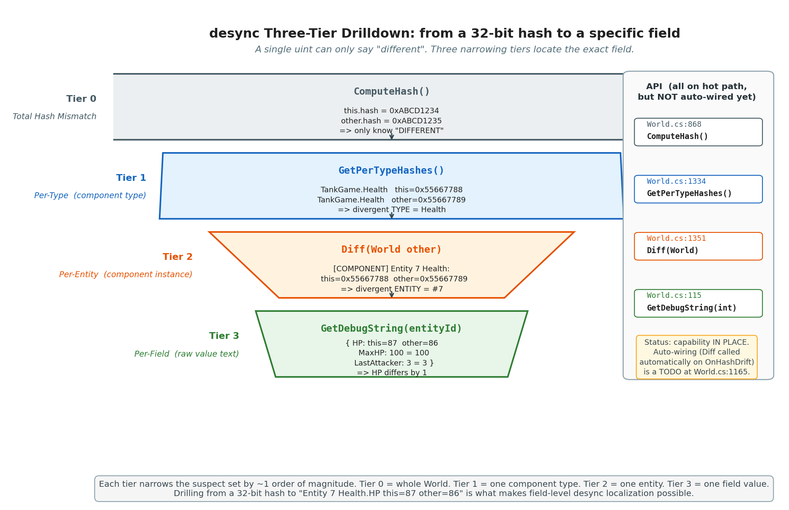
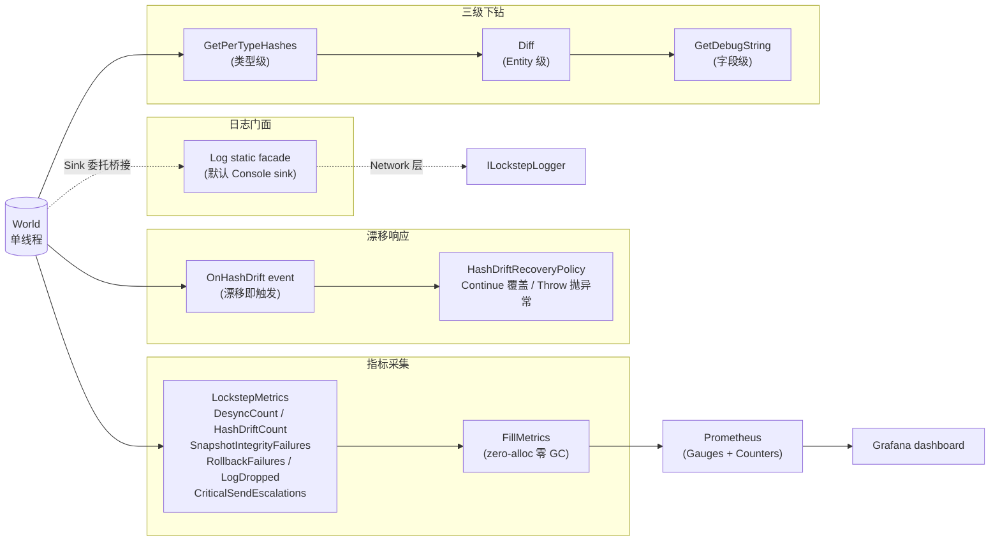

# 第 22 章 · 性能基准与可观测性:测量驱动优化

> **核心问题**:前面四章我们把 SDK 做到了可集成(第 18 章)、能断线重连(第 19 章)、对象池化克制 GC(第 20 章)、能录回放(第 21 章)。这一章要回答两个看似无关、其实同根的问题:① **这台确定性机器到底跑得多快,怎么量才不骗自己?** ② **线上 desync 了,凭一个 32 位哈希能定位到是哪个字段吗?** 这两个问题合起来叫"性能基准与可观测性"。它们同根,是因为帧同步有一个别的领域没有的怪脾气——**性能优化和确定性校验必须共享同一套测量地基**:你优化得越激进,越要看得见每一次位级变化;你越想抓 desync,越需要先把"分项 GC""分项耗时"测准。本章是第 5 篇的收尾,也是把"工程化"这层讲透的招牌章。

> **读完本章你会明白**:
> 1. 为什么 Benchmark 报的"2251 bytes/帧 GC"是个**基准伪影**——它是 `SaveState().ToArray()` 重载的 `ToArray()` 拷贝造成的,不是生产路径的真实分配。优化错对象,是性能工程里最贵的错误。
> 2. .NET 8 的 `Int128` 是**软件实现**(没有 128 位硬件指令),比原生 `long` 慢一个量级。游戏坐标/速度的高 32 位几乎总为 0,所以可以用一条"`|a|,|b|<2^31` 走 long 快速路径"把 LVector2 乘法从 11M 提速到 684M ops/s(62 倍),而且**bit 级等价**靠双路径 golden 测试兜底。
> 3. desync 字段级定位**三级下钻**长什么样:`GetPerTypeHashes()`(类型级)→ `Diff(World)`(Entity 级)→ `GetDebugString(entityId)`(字段级)。从 32 位哈希下钻到具体某个 Entity 的某个组件的哪个字段值不一样。
> 4. 可观测性地基的当前真实状态——日志抽象、`OnHashDrift` 事件、`HashDriftRecoveryPolicy`、三级下钻、World 单线程化、`LockstepMetrics` 全套 desync 指标 + Prometheus 导出——**这些当前已就位**,不是"地基缺失"。
> 5. 优化七阶段方法论(测量基线 → 正确性 bug → 数学快速路径 → GC 压低 → 物理 3D → 寻路 → 碰撞 → 商业化)和它的三道安全门(确定性 golden 测试 / 537 单元测试 / Benchmark 前后对比)。

> **如果一读觉得太难**:这章信息量大但逻辑直,先只记住四件事——① 看到"每帧分配多少 bytes"先问一句"测的是不是生产路径",`ToArray()` 这种拷贝经常制造伪影;② `Int128` 在 .NET 8 是软件实现,游戏值高 32 位几乎总为 0,所以一条 long 快速路径能省掉 99% 的 128 位税;③ desync 定位靠"类型哈希 → Entity 哈希 → 字段值"三级下钻,纯靠一个 32 位总哈希永远定位不到字段;④ 优化必须先有 golden 测试当安全网,否则"更快"和"算错"分不清。

---

## 〇、一句话点破

> **性能工程的第一原则是"测准了再动手"——而帧同步的性能工程多一层:你的每一处优化,都必须在"位级等价"这个铁律下进行,所以它和"可观测性地基"是一枚硬币的两面。本章把四件事讲透:① 2251 bytes/帧是个基准伪影,真实生产路径 635 B/帧,把它当靶子优化就是打稻草人;② Int128 软件运算是渗透全引擎的税,用 long 快速路径消除后 LVector2 乘法 62 倍提速,且 bit 级等价由 golden 测试兜底;③ desync 定位靠三级下钻,当前已就位,把"32 位哈希报红"变成"Entity 7 的 Transform.Position.X this=0x1234 other=0x1235";④ 优化方法论本身是产品——七阶段 + 三道安全门,任何"凭感觉优化"都会被这套流程挡回去。**

这是结论,本章倒过来拆。

---

## 一、为什么"测准"在帧同步里比普通领域更难

普通游戏做性能优化,套路很标准:跑个 Benchmark,看哪里慢,改,再跑,数字降了就是改对了。帧同步里这套流程基本成立,但多了两个陷阱。

### 陷阱一:基准伪影(benchmark artifact)

Benchmark 测的代码路径,可能根本不是线上跑的代码路径。这种情况在普通项目里也有,但帧同步 SDK 特别容易出现,因为它通常有多套序列化接口:一个"零分配生产版"(往外部传入的 `BitWriter` 里写),一个"易用版"(自己 `new byte[]` 返回)。如果 Benchmark 调的是易用版,你测出来的"每帧 GC"其实是易用版内部的 `ToArray()` 拷贝造成的,**和生产路径一点关系都没有**。

LockstepSdk 的 `docs/BENCHMARK.md` 就踩了这个坑。文档写:

> GC 分配: **2,251 bytes/帧** ... 主要来自 `SaveState()` 返回的 `byte[]`。

这句话字面上没错——`SaveState()` 那个返回 `byte[]` 的重载,确实分配 2251 bytes/帧。但问题是,生产路径(控制器主循环里每帧存快照)走的不是这个重载,而是 `SaveState(BitWriter)`,它往复用的 `BitWriter` 池里写,**根本不 new `byte[]`**。所以这个 2251 bytes 在生产中是不存在的——它是一个基准伪影。

`docs/OPTIMIZATION_PLAN.md` 的阶段 0 第一件事就是戳穿这个伪影,建立"可信、分项"的标尺。重新测量后,真实分配是:

| 路径 | 每帧 GC | 说明 |
|------|---------|------|
| 纯 `Tick()`(不含快照) | **475 B/帧** | 系统 foreach 装箱(`IReadOnlyList<int>` 的 `List.Enumerator`)等 |
| 生产路径 `SaveState(BitWriter)` + 池 | **635 B/帧** | 在纯 Tick 基础上 + 序列化层 160 B |
| `SaveState()` byte[] 重载 | **2090 B/帧** | 其中约 1455 B 是 `ToArray()` 伪影,**非运行时**分配 |

> **钉死这件事**:看到"每帧分配 X bytes"的数字,第一反应必须是问"测的是哪条路径"。`SaveState().ToArray()` 这种易用重载,经常为了 API 便利自己 new 一个数组返回,这个分配在 Benchmark 里真实存在,但生产代码从不走这条路。**把它当靶子去优化,是性能工程里最贵的错误——你花一周把一个不存在的瓶颈"优化"到 0,真实瓶颈纹丝不动。**

### 陷阱二:位级等价的安全网必须在优化前就位

帧同步的优化比普通项目多一道铁律:**任何"更快"的改法,都必须保证结果 bit 级一致**。一个"更快但结果差一个最低位"的优化,就是一起新的 desync bug(第 3 章 P0-1 跨 TFM 舍入分叉就是这么来的)。

这意味着优化前必须先有两道安全网:

1. **确定性 golden 测试**——用固定种子 + 固定输入跑 N 帧,把每一帧的 `ComputeHash()` 固化成 golden 值,提交进仓库。任何让 golden 值变化的改动,要么是预期变化(修了正确性 bug,要在提交说明里声明),要么是优化错了(数值不该变却变了),测试立刻失败。
2. **双路径等价性测试**——对数学运算(乘法、Sqrt、除法),保留一个只走最权威实现的 `Fallback`,海量输入下逐位比对"快速路径"和"Fallback"。这套机制第 3 章拆透了。

这两道网必须在动手优化前就铺好,不是事后补。否则你改完发现 golden 值变了,根本分不清是"我优化错了"还是"我顺带修了个 bug"——这种模糊状态在帧同步里是灾难。

> **作者复盘 · 优化顺序**:我接手过别的项目,常见的失败模式是"先冲性能,跑起来再说"。在普通项目里这样或许能跑通,在帧同步里几乎一定翻车——因为 desync 的反馈周期太长,你今天改了乘法,可能两周后线上才有人报"两台机器分叉了",那时候你已经改了几十个地方,根本定位不回去。所以这个项目的 `OPTIMIZATION_PLAN.md` 阶段 0 强制做"测量基线 + 回归安全网",阶段 1 强制修已知正确性 bug,**然后才允许动性能**。这个顺序不能反。

---

## 二、2251 bytes 拆解:基准伪影 vs 生产路径

我们把第一节的伪影彻底拆开,这是本章招牌案例之一。

### 2.1 三个数字的来历

`OPTIMIZATION_PLAN.md` 附录的基线表给出了三个数字,它们对应三条不同的代码路径。我们要看清楚每条路径里 GC 是怎么产生的。

**路径 A:纯 `Tick()`(475 B/帧)**

这是不包含快照保存的最小逻辑帧路径。一个 `Tick(frame)` 调用,跑完所有 System(InputSystem / FireSystem / CollisionSystem / BoundarySystem 等),不存快照。475 B/帧 的分配,主要嫌疑是系统层遍历 `ActiveEntities` 时的 foreach 装箱:

```csharp
// 系统侧典型代码(简化示意,非源码原文)
foreach (int entityId in componentPool.ActiveEntities)   // ActiveEntities 是 IReadOnlyList<int>
{
    // ... 处理每个 entity
}
```

`ActiveEntities` 返回 `IReadOnlyList<int>`,foreach 对它迭代时,C# 编译器会调用 `IEnumerable<int>.GetEnumerator()`,而 `List<int>.GetEnumerator()` 是个 `ref struct`,通过 `IReadOnlyList` 接口访问时会装箱成一个堆上的 `IEnumerator<int>` 对象。每次 foreach 都装一次,这就是纯 Tick 路径的主要 GC 来源。

阶段 3 的优化评估很克制:如果只是在 `ComponentPool` 上额外暴露一个不装箱的 `GetEnumerator()`,系统侧改一处 foreach 目标就做;如果要把 `IReadOnlyList` 替换成自定义 struct 枚举器、波及所有系统签名,就**跳过**——475 B/帧可接受,不值得破坏 API 一致性。最后实测通过暴露原生枚举器降到 306 B/帧(-36%)。

**路径 B:生产路径 `SaveState(BitWriter)` + 池(635 B/帧)**

这是控制器主循环每帧存快照的真实路径。它在纯 Tick(475 B)基础上,加了一段快照序列化。序列化本身走 `BitWriter`(从 `BitWriterPool` 租借的复用对象),所以大头不是序列化字节数据,而是:

- `Snapshot` 是个 `sealed class`,每帧 `new` 一个对象(对象头约 40 B + 内部闭包 display class)。
- `SaveStateZeroAlloc` 接收两个 lambda(捕获 `_simulation` / `tick` / `hash`),每帧 2 个委托对象 + 一个闭包 display class。

加起来约 160 B/帧。阶段 3 的优化是:`Snapshot` 池化(`Acquire`/`Dispose` 复用实例),lambda 改为缓存的实例方法委托(闭包状态存为 controller 字段,单线程安全)。把这两块干掉,生产路径从 635 B/帧 降到 466 B/帧。

**路径 C:`SaveState()` byte[] 重载(2090 B/帧,含伪影)**

这是 BENCHMARK.md 测的那条路径。它的实现大概是:内部调一次路径 B 的 `SaveStateZeroAlloc` 写到 `BitWriter`,然后 `bitWriter.ToArray()` 把内部缓冲**拷贝**出一个独立 `byte[]` 返回。

这个 `ToArray()` 拷贝,在 Benchmark 里真实分配了约 1455 B/帧(`byte[]` 对象头 + 内容拷贝 + BitWriter 内部 `OverwriteInt32` 回填可能触发的扩容),但**生产代码从不调用这个重载**——控制器主循环、回滚快照、重连状态拉取,全都走 `SaveStateZeroAlloc(BitWriter)` 直接往复用缓冲里写。所以这 1455 B 是纯伪影。

### 2.2 一张图看清三条路径



> **图说**:横轴是三条代码路径(纯 Tick / 生产 SaveState(BitWriter) / 易用 SaveState(byte[])),纵轴是每帧 GC bytes。每根柱子按 GC 来源分段堆叠:foreach 装箱 / 序列化层 / Snapshot 对象 / 闭包委托 / `ToArray()` 伪影。重点标出 2090 B 柱子顶端那段约 1455 B 的 `ToArray()` 伪影——它在 Benchmark 里真实存在,但生产代码不经过,所以是最容易被误当靶子的部分。纯 Tick 的 475 B 和生产路径的 635 B 才是优化真实目标。图内英文标注:Pure Tick / Production SaveState(BitWriter) / Convenience SaveState(byte[]);foreach boxing / serialization layer / Snapshot object / closure delegate / ToArray() artifact (not on hot path)。

### 2.3 怎么建"可信、分项"的标尺

阶段 0 改了 `GCAllocation` 测试,让它**同时测三条路径**,并明确标注哪条是基准伪影:

```text
# 实测分项报告(简化示意)
gcdetail 三层对比:
  纯 Tick 路径:        475 bytes/帧  (foreach 装箱 + ...)
  生产路径:            635 bytes/帧  (+ 序列化层 160)
  byte[] 重载:         2090 bytes/帧 (含 ~1455 ToArray() 伪影)
```

这样任何后续优化都能在**正确的靶子**上量化收益:阶段 3 优化后,纯 Tick 475 → 306 B(-36%),生产路径 635 → 466 B(-27%)。如果拿 2090 B 当起点报"优化到 466 B,降了 78%",数字好看但骗自己——因为其中 1455 B 一开始就不存在。

> **钉死这件事**:测量驱动优化的第一条纪律——**分项测量,标注每项属于哪条路径**。帧同步 SDK 的教训是,把"快照载荷大小"(快照序列化后多少字节,是个数据量概念)和"运行时分配"(这一帧 GC 实际产生多少,是个性能概念)用同一个数字报出来,是制造伪影的温床。`SaveState().ToArray()` 报的 2251 B 里,大部分是"载荷大小",小部分才是"运行时分配",混为一谈就会优化错对象。

---

## 三、Int128 软件运算税:渗透全引擎的隐藏成本

上一节讲的是"测准",这一节讲的是"测准之后发现的最大的一个真靶子"——Int128 软件运算税。这是本章第二个招牌案例。

### 3.1 现象:加法和乘法差 21 倍

阶段 0 建好可信基线后,跑了一组定点数运算吞吐测试,出现了一个让人意外的差距:

| 运算 | 吞吐量 |
|------|--------|
| LVector2 加法 | **236M ops/s** |
| LVector2 乘法 | **11.0M ops/s** |
| LVector2 点积 | 11.2M ops/s |
| LVector2 归一化 | 4.95M ops/s |

加法和乘法差 **21 倍**。这个差距太大了,大到不可能是"乘法本身比加法慢"——原生 `long` 乘法和加法在现代 CPU 上都是 1 个时钟周期级别。一定有别的东西在拖后腿。

### 3.2 根因:`Int128` 在 .NET 8 是软件实现

回到第 3 章讲过的定点乘法核心难题:两个 64 位 `RawValue` 相乘会 128 位溢出,必须用 128 位中间类型接住乘积,右移后再转回 `long`。.NET 8 提供了 `Int128` 类型,LFloat/LVector2 的乘法实现大致是:

```csharp
// 简化示意,非源码原文
return (long)(((Int128)a.RawValue * b.RawValue) >> 16);
```

关键问题:**.NET 8 的 `Int128` 没有 128 位硬件指令支持**。x86-64 CPU 没有原生的 128 位乘法指令,`Int128 * Int128` 是 JIT 编译器用多条 32/64 位指令合成出来的(软件实现)。每次 `Int128` 乘法,实际执行的是若干条 `imul` / `mul` / 进位累加指令,比原生 `long * long` 慢一个量级。

而 LVector2 的加法(`RawValue` 直接相加,不涉及 128 位)走的是原生 `long +`,所以快 21 倍。**这个 21 倍的差距,就是"软件 128 位"和"硬件 64 位"的差**。

### 3.3 洞察:游戏值高 32 位几乎总为 0

那能不能像第 3 章乘法三路径那样,"大多数情况走 long 快路,只有大值才走 Int128"?可以,而且 LFloat 在 `MulShiftFast` 里已经这么做了(第 3 章拆过)。但阶段 2 发现,LVector2 的热点运算(SqrMagnitude / Dot / Cross / Rotate)当时**没有**走这个快速路径,全部无脑用 Int128。补上快速路径就是阶段 2 的核心工作。

补快速路径的依据是一个关键洞察:**游戏里的坐标、速度、方向,虽然 `RawValue` 是 64 位 long,但它们的实际数值通常很小,高 32 位几乎总为 0**。

来算一笔账。Q48.16 定点数(第 2 章),地图坐标 ±1000 对应 `RawValue ≈ 1000 × 65536 ≈ 6.5×10⁷`,约 2²⁶。速度、方向向量分量更小。也就是说:

```
   |a| < 2^31  (坐标 ±1000 → RawValue ~2^26, 远小于 2^31)
   |b| < 2^31
   → |a × b| < 2^62 < 2^63  ← 不溢出 long!
```

如果两个操作数都小于 2³¹,它们的乘积小于 2⁶²,装得下 long,**根本不需要 Int128**。可以直接用原生 `long * long`,再 `>> 16` 修正。这个判断很便宜(几个比较),而且分支预测命中率 **>99%**(因为游戏值几乎总小于 2³¹)。

### 3.4 改法:long 快速路径 + Int128 fallback + 等价性测试

LVector2 的热点运算改成和 `MulShiftFast` 同构的模式:

```csharp
// 简化示意,非源码原文(LVector2 各热点运算的模式)
const long FastLimit = 1L << 31;
if (a.RawValue < FastLimit && a.RawValue > -FastLimit &&
    b.RawValue < FastLimit && b.RawValue > -FastLimit)
{
    return (long)(a.RawValue * b.RawValue) >> 16;   // 路径一: long 快速(99%)
}
return (long)(((Int128)a.RawValue * b.RawValue) >> 16); // 路径二: Int128 慢速(1%)
```

Sqrt 类似——`a.RawValue < 2^47`(`long.MaxValue >> 16`)时走 64 位牛顿迭代,否则 fallback Int128。第 3 章讲过,这里不重复。

### 3.5 成果:62 倍提速,而且 bit 级等价

这套快速路径上线后,基线对照表的数字是:

| 指标 | 阶段 0 基线 | 阶段 2 达成 | 倍数 |
|------|------------|------------|------|
| LVector2 乘法 | 11.0M ops/s | **~684M ops/s** | **62x** |
| LVector2 点积 | 11.2M ops/s | **~595M ops/s** | **53x** |
| LVector2 长度 | 8.3M ops/s | ~20M ops/s | 2.4x(顺带修了 Sqrt 初始猜测 bug) |
| LVector2 归一化 | 4.95M ops/s | ~9.7M ops/s | 2x(Sqrt + 除法固有成本,未达 20M) |
| 帧执行(2 实体,TankGame 数学密集) | 110,820 FPS | **152,490 FPS** | **+38%** |
| 5000 实体帧耗时 | 0.37 ms | 0.35 ms | +6%(瓶颈在 ECS 遍历非数学) |

LVector2 乘法从 11M 提到 684M ops/s,**62 倍**,逼近加法的水平(184M ops/s,加法本身没改,数字波动)。整个帧执行(数学密集的 TankGame 场景)提速 38%。

最关键的是:**这一切的提速,golden 哈希值一个都没变**。因为:

1. **快速路径只在 `|a|,|b|<2^31` 时触发**,乘积 `<2^62`,long 装得下,环绕结果 = 真值,和 Int128 路径**完全相同**。
2. 双路径等价性测试(第 3 章的 `MathEquivalenceTests`)对随机 + 边界输入(0、最大值、刚好溢出阈值 ±2³¹、负数),断言快速路径 == fallback 路径 RawValue 逐位相等。
3. 确定性 golden 测试(9 个采样点的整局哈希)在阶段 2 前后**完全一致**——这是"bit 级等价"的最终证据。



> **图说**:左半部分是"消除前",用一个分支结构表示所有 LVector2 运算无脑走 `Int128` 路径(.NET 8 软件实现,多条 imul/mul/进位累加指令),吞吐 11M ops/s。右半部分是"消除后",加一层 `|a|,|b|<2^31` 判断(命中率 >99%),命中走原生 `long` 路径(1 条 imul),miss 才 fallback 到 Int128,吞吐 684M ops/s(62x)。下方一条时间线对比:加法(236M,无 Int128)→ 乘法消除前(11M)→ 乘法消除后(684M),直观看到 21 倍鸿沟被填平。图内英文:long fast path (hit rate >99%) / Int128 software fallback / 62x speedup / bit-level equivalent (golden test)。

> **作者复盘 · 为什么不在一开始就上快速路径**:有人会问,既然 long 快速路径这么快,为什么 LFloat 当初不直接这么写,非要在阶段 2 才补?答案是**顺序问题**。第 3 章讲过,正确性(跨 TFM 舍入一致,P0-1)比性能优先。一开始大家对"两条路径是否 bit 级等价"心里没底,所以 LFloat 保守地只让 `MulShiftFast` 一处走快速路径,LVector2 全走 Int128——先把正确性焊死,性能留到阶段 2 等 golden 测试铺好后再动。这是"先对再快"的纪律:**宁可一开始慢一个量级,也不要在没安全网的时候冲性能**。

---

## 四、desync 字段级定位:三级下钻

前面两节讲性能,这一节讲可观测性。性能和可观测性为什么放一章?因为帧同步优化一旦动了数学层(比如上一节 Int128 快速路径),立刻需要一套"位级变化看得见"的地基来兜底——你改完乘法,golden 测试还过,这只是"整局哈希没变";但如果某个边界值真有差异,你需要能下钻到具体字段。这一节讲的就是这套下钻工具。

### 4.1 一个 32 位哈希能告诉你什么

第 23 章会系统讲哈希双轨(增量 O(1) vs 全量重算),这里只说一件事:**每帧的 `ComputeHash()` 把整个 World 状态压成一个 32 位 uint**。它的用途是对账——两端哈希相同,大概率状态相同;哈希不同,一定 desync。

但 32 位哈希有个天然局限:**它只能告诉你"不一样",不能告诉你"哪里不一样"**。一个 `0xABCD1234 != 0xABCD1235` 的报红,可能是坦克 A 的 Position.X 差了一个最低位,也可能是坦克 B 的 Rotation 差了一度,也可能是随机数状态 `_state0` 多跳了一次——32 位哈希把这些信息全部压扁了,你什么都看不出来。

线上 desync 排查的现实场景是:运维收到 `HashMismatch` 告警,只知道"某帧两端哈希不一样",然后呢?如果没有下钻工具,只能让玩家退出,导出两份完整状态 dump,人工 BeyondCompare 比对几千个字段——这在生产里几乎不可行。

### 4.2 三级下钻:类型 → Entity → 字段

LockstepSdk 当前已就位的 desync 定位工具,是一套三级下钻。三级各有用途,从粗到细。

**第一级:`GetPerTypeHashes()`——类型级**

```csharp
// ECS/World.cs:1334
public IReadOnlyList<(string TypeName, uint Hash)> GetPerTypeHashes()
{
    UpdateSortedPoolCache();
    var result = new List<(string, uint)>(_sortedPoolCache.Count);
    foreach (var pool in _sortedPoolCache)
        result.Add((pool.ComponentType.FullName ?? pool.ComponentType.Name, pool.ComputeHash()));
    result.Sort((a, b) => string.Compare(a.Item1, b.Item1, StringComparison.Ordinal));
    return result;
}
```

它返回"每个组件类型 → 该类型所有实例聚合的哈希"的列表,按类型名字典序 Ordinal 排序保证确定性输出。两端各调一次,逐类型比对,**第一个哈希不同的类型,就是分歧所在的组件类型**。

比如输出可能是:

```text
Lockstep.Games.TankGame.Transform   0x1A2B3C4D   ← 两端一致
Lockstep.Games.TankGame.Health      0x55667788   ← this
Lockstep.Games.TankGame.Health      0x55667789   ← other  ← 这里不一样!
Lockstep.Games.TankGame.Turret      0x99AABBCC   ← 两端一致
```

这就把范围从"整个 World"缩小到了"Health 组件"。注意 `GetPerTypeHashes` 是**纯诊断字段**,不进入 `ComputeHash()` 输出,所以加它不影响对账哈希本身。

**第二级:`Diff(World other)`——Entity 级**

知道了是 Health 类型出问题,还要知道是哪个 Entity 的 Health。`Diff` 方法做这件事:

```csharp
// ECS/World.cs:1351(简化示意)
public string Diff(World other)
{
    var sb = new StringBuilder();
    // 1. 基础状态:帧号 / 随机状态
    if (CurrentFrame != other.CurrentFrame) sb.AppendLine($"[FRAME] ...");
    var (s0a, s1a) = Random.State;  var (s0b, s1b) = other.Random.State;
    if (s0a != s0b || s1a != s1b) sb.AppendLine($"[RANDOM] ...");

    // 2. 实体集差异:只在 this / 只在 other 的 Entity
    // 3. 共有实体逐组件比对:哪个 Entity 的哪个组件哈希不同
    foreach (var pool in _sortedPoolCache)
    {
        foreach (var entityId in _activeEntities)
        {
            uint thisHash = pool.ComputeEntityHash(entityId);
            uint otherHash = otherPool.ComputeEntityHash(entityId);
            if (thisHash != otherHash)
                sb.AppendLine($"[COMPONENT] Entity {entityId} {pool.ComponentType.Name}: this=0x{thisHash:X8} other=0x{otherHash:X8}");
        }
    }
    return sb.ToString();
}
```

它先比对帧号、随机状态(这两个错了就是另一类 bug),再比对实体集差异(某个 Entity 只在一端存在,通常是创建/销毁时序问题),最后**逐 Entity 逐组件**比对哈希,输出结构化差异。输出可能长这样:

```text
=== World Diff (this vs other) ===
  [COMPONENT] Entity 7 Lockstep.Games.TankGame.Health: this=0x55667788 other=0x55667789
    this:  { HP: 87, MaxHP: 100, LastAttacker: 3 }
    other: { HP: 86, MaxHP: 100, LastAttacker: 3 }
```

这就定位到了 **Entity 7 的 Health 组件**,而且因为 `Diff` 内部对每个分歧组件还调了 `GetDebugString`(下一级),顺带把字段值都打出来了。

**第三级:`GetDebugString(entityId)`——字段级**

```csharp
// ECS/World.cs:115(各 ComponentPool 实现自己的 GetDebugString)
public string GetDebugString(int entityId)
{
    // 输出该 Entity 该组件的完整字段值文本
    // 例如: { HP: 87, MaxHP: 100, LastAttacker: 3 }
}
```

它输出某个 Entity 某个组件的**完整字段值文本**。这是最细粒度——直接告诉你"HP this=87, other=86"。结合上面 `Diff` 的输出,运维一眼就能看到分歧在哪。

### 4.3 三级怎么串起来用

线上 desync 排查的典型流程:

```text
1. 服务器收到 HashReport,两端哈希不一致 → 广播 HashMismatch
2. 两端各自导出 World 状态(ToDebugString 全量 dump,或序列化快照)
3. 拿到两份状态,跑 Diff(World) → 输出"Entity 7 Health this=0x...88 other=0x...89"
4. 看 Diff 输出里附带的 GetDebugString → "HP this=87 other=86"
5. 人工定位:为什么 Entity 7 的 HP 差 1?→ 查那一帧的输入 / 查伤害计算公式
```

从 32 位总哈希,到具体某个 Entity 的某个字段值,这就是三级下钻的价值。



> **图说**:三层漏斗结构,从上到下逐级收窄。最上层"总哈希不一致"(一个 32 位 uint 对比,只知道"不一样"),箭头向下到 `GetPerTypeHashes()`(类型级,缩小到"Health 类型不一样"),再向下到 `Diff(World)`(Entity 级,缩小到"Entity 7 的 Health 不一样"),最底层 `GetDebugString`(字段级,精确定位"HP this=87 other=86")。每层标注 API 名 + 缩小后的范围。图内英文:Total Hash Mismatch / GetPerTypeHashes() (per-type) / Diff(World) (per-entity) / GetDebugString(entityId) (per-field)。

### 4.4 当前真实状态:能力已就位,自动接线是未来工作

这里必须诚实标注当前状态,因为审计报告(`FRAMEWORK_QUALITY_AUDIT.md`)和源码现状有出入。

`GetPerTypeHashes`、`Diff`、`GetDebugString` 这三个方法**当前都已实现并可用**(World.cs:1334 / 1351 / 115)。但它们和"哈希漂移检测点"的**自动接线**还没完成——World.cs:1165 有一行 TODO:

```csharp
// World.cs:1165(简化)
// TODO(framework-quality 阶段1.5): 在此插入按 ComponentType 分桶的字段级 diff,
// 定位首个分歧组件(当前此处为空,留待阶段1.5 实现 World.Diff)
```

这行 TODO 的意思是:当 `OnHashDrift` 事件触发时(增量哈希与全量哈希漂移),**当前还没有自动调用 `Diff` 落盘到文件**。也就是说,能力本身是完整的(你手动调 `Diff` 能用),但"漂移发生瞬间自动 dump 差异"这个自动化步骤还是个未来工作项。

> **钉死这件事(诚实标注)**:desync 字段级定位的**能力已就位**——`GetPerTypeHashes`(类型级)+ `Diff`(Entity 级)+ `GetDebugString`(字段级)三个方法都已实现,手动调用即可下钻。**未完成的是自动接线**——`OnHashDrift` 触发时自动调 `Diff` 落盘(World.cs:1165 的 TODO)。这属于 DG-1~8(确定性护栏完善项)里的未来工作,**不是"地基缺失"**。写书 / 写文档时不能把审计报告的旧快照当成现状,审计是"发现时"的记录,项目加固期大多数 P0/P1 已修但文档没更新。

---

## 五、可观测性地基:当前已就位的全貌

上一节讲了 desync 下钻这一项,这一节把整个可观测性地基的全貌摆出来。`_源码事实-anchor.md` 5.5 节核实过,这套地基**当前已基本就位**,不是审计报告早期版本说的"地基缺失"。我们逐项看。

### 5.1 日志抽象:Core 静态门面 + Network 接口桥接

帧同步 SDK 分层严格:Core 层零依赖(不引用任何引擎库、不引用 Network 层接口),所以 Core 的日志不能直接用 Network 层的 `ILockstepLogger` 接口。怎么解决?Core 提供一个静态门面 `Log`,Network 层提供接口 `ILockstepLogger`,两者通过 `Log.Sink` 委托桥接:

```csharp
// Diagnostics/Log.cs:30(简化)
public static class Log
{
    private static volatile Action<LogLevel, string>? _sink;
    static Log() { _sink = DefaultConsoleSink; }   // 默认 Console sink

    public static Action<LogLevel, string>? Sink
    {
        get => _sink;
        set => _sink = value;   // 网络层可注入: 把消息转给 ILockstepLogger
    }

    public static void Error(string message)
    {
        _sink?.Invoke(LogLevel.Error, message);
        OnError?.Invoke(message);   // 向后兼容的委托
    }
}
```

设计要点:

- **默认 sink 是 Console**(DefaultConsoleSink),带级别前缀(`[ERR]` / `[WRN]` / `[INF]`),受 `MinLevel`(默认 Info)过滤。**错误默认可见,不再静默丢失**。
- 网络层注入时,把 `Log.Sink` 设成一个转发到 `ILockstepLogger` 的委托即可。签名 `(LogLevel, string)` 专为桥接设计。
- 保留 `OnInfo` / `OnWarning` / `OnError` 三个向后兼容委托,旧订阅者(`Log.OnError += handler`)继续工作。

这套设计**有意保留两套**(Core 静态 + Network 接口),不是债——是零依赖分层的必然结果。审计报告曾把它列为问题,核实后确认是合理设计。

> **钉死这件事**:Core 的 `Log`(静态门面,默认 Console,错误可见)和 Network 的 `ILockstepLogger`(接口,宿主注入实现)是**两套,有意保留**。零依赖要求 Core 不能引用 Network 接口,所以 Core 用静态 `Log` + `Sink` 委托,Network 用 `ILockstepLogger` 接口,两者用 `Sink` 委托桥接。客户端默认 ConsoleLogger(错误默认可见,非静默),服务器仍 NullLogger(合理——服务器日志走自己的设施)。

### 5.2 OnHashDrift 事件 + HashDriftRecoveryPolicy

增量哈希(组件变更时 XOR,O(1))和全量哈希(每帧或每 N 帧重算)漂移时,World 做两件事:

```csharp
// ECS/World.cs:189-198(简化)
public HashDriftRecovery HashDriftRecoveryPolicy { get; set; } = HashDriftRecovery.Continue;

/// 增量哈希与全量哈希漂移时触发(无论 RecoveryPolicy)。
public event Action<int, uint, uint>? OnHashDrift;   // (frame, incremental, full)

// 触发点(World.cs:868 / 1102 / 1169,三处)
OnHashDrift?.Invoke(CurrentFrame, _incrementalHash, fullHash);
if (HashDriftRecoveryPolicy == HashDriftRecovery.Throw)
    throw new HashDriftException(CurrentFrame, _incrementalHash, fullHash);
// 默认 Continue: 用全量覆盖增量, 防止错误累积
_incrementalHash = fullHash;
```

两个关键设计:

1. **`OnHashDrift` 事件无论什么策略都会触发**——即使策略是 `Continue`(向后兼容,覆盖继续),事件也照发。宿主可以订阅这个事件做遥测(比如把漂移次数报到 Prometheus)、做告警、做落盘。这保证了"漂移不会被静默吞掉"。
2. **`Throw` 策略立即抛 `HashDriftException`**——暴露根因,而不是让游戏继续跑在一个损坏的状态上。开发 / 测试环境用 `Throw`,生产用 `Continue`(降级而非崩溃)。

这套机制把审计报告早期版本指出的"双轨哈希漂移即覆盖,desync 被静默吞掉"的问题修掉了——**漂移现在一定会被看见**(事件 + 详细日志,打印 Incremental / Full / Delta XOR 三个值)。

### 5.3 World 单线程化:移除假线程安全

审计报告曾指出 World 用 `lock` 和 `[ThreadStatic]` 制造"假线程安全"——`lock` 在单线程逻辑更新下是无用开销,`[ThreadStatic]` 在单线程 World 里是误导(暗示有多线程访问)。当前源码已清理:移除 `lock`,移除 `[ThreadStatic]`,改纯单线程模型。World.cs:1208 注释明说"原 `[ThreadStatic]` 在单线程 World 里是误导"。

帧同步的 World 天然单线程——所有逻辑更新都在控制器主循环的同一线程上(`CheckThreadAffinity` DEBUG 断言保证)。多线程访问 World 是错误的用法,不应该用锁去"支持"它,而应该用断言去"禁止"它。这是把"假安全"换成"真纪律"。

### 5.4 LockstepMetrics:全套 desync 指标 + Prometheus 导出

`LockstepMetrics`(`Diagnostics/LockstepMetrics.cs`)是个零分配采集的指标容器,它收集网络 / 同步 / 丢帧 / 完整性 / 追帧 / 时间六大类指标。其中和可观测性最相关的是**完整性与诊断指标**:

```csharp
// Diagnostics/LockstepMetrics.cs:80-103(简化)
public long DesyncCount => _desyncCount;                 // 两端哈希不一致次数
public long HashDriftCount => _hashDriftCount;           // 增量 vs 全量漂移次数
public long SnapshotIntegrityFailures => _snapshotIntegrityFailures;  // 快照完整性失败
public long RollbackFailures => _rollbackFailures;       // 回滚失败(找不到快照/状态损坏)
public long LogDropped => _logDropped;                   // 被丢弃的日志条数
public long CriticalSendEscalations => _criticalSendEscalations;      // 关键消息发送降级

public void RecordDesync() => Interlocked.Increment(ref _desyncCount);
public void RecordHashDrift() => Interlocked.Increment(ref _hashDriftCount);
// ... 每个 RecordXxx 方法
```

每个指标都有对应的 `RecordXxx` 方法(用 `Interlocked` 保证采集本身线程安全,虽然逻辑单线程,但采集可能从监控线程读)。这些指标的意义:

- **DesyncCount**:两台客户端哈希对账失败。这是最严重的指标,>0 说明已经 desync。
- **HashDriftCount**:本机增量哈希和全量哈希不一致。说明本机状态在某个地方被静默修改了(没经过正常的组件变更接口),通常是 bug。
- **SnapshotIntegrityFailures**:快照加载后重算哈希和保存时不一致。说明快照在序列化 / 反序列化 / 存储 / 传输某环节损坏。
- **RollbackFailures**:回滚时找不到快照或状态损坏。
- **LogDropped**:SyncLogger 队列满等导致日志丢失。
- **CriticalSendEscalations**:关键消息(HashReport / ClientInput)因发送队列满而降级直发(P1-ROB-7)。

这些指标全都有 Prometheus 导出:

```csharp
// Diagnostics/LockstepMetrics.cs:294-388(简化)
public IReadOnlyDictionary<string, double> GetGauges()   // 瞬时值(Gauge)
{
    return new Dictionary<string, double>
    {
        ["lockstep_rtt_ms"] = Rtt,
        ["lockstep_prediction_frames"] = PredictionFrames,
        ["lockstep_rollbacks_per_second"] = RollbacksPerSecond,
        // ...
    };
}

public IReadOnlyDictionary<string, long> GetCounters()  // 累计值(Counter)
{
    return new Dictionary<string, long>
    {
        ["lockstep_desync_total"] = DesyncCount,
        ["lockstep_hash_drift_total"] = HashDriftCount,
        ["lockstep_snapshot_integrity_failures_total"] = SnapshotIntegrityFailures,
        ["lockstep_rollback_failures_total"] = RollbackFailures,
        // ...
    };
}

// FillMetrics:填充到已有字典,避免分配(零 GC 采集)
public void FillMetrics(IDictionary<string, double> gauges, IDictionary<string, long> counters) { ... }
```

Gauges(瞬时值:RTT、预测帧数、回滚率)和 Counters(累计值:desync 次数、漂移次数、快照失败次数)分类导出,命名带 `lockstep_` 前缀,符合 Prometheus 命名规范。`FillMetrics` 接受外部字典填充,避免每次导出产生新 `Dictionary` 分配(零 GC 采集)。

宿主接一个 Prometheus client(比如 `prometheus-net`),定期调 `FillMetrics`,这些指标就能进 Grafana 看板。线上运维一眼就能看到"某房间 desync 次数飙升""某客户端哈希漂移频繁"——这就是可观测性的价值。

### 5.5 地基组成一图



> **图说**:可观测性地基五件套围绕 World(单线程)展开。① Log 静态门面(默认 Console sink,错误可见)经 Sink 委托桥接 Network 层 ILockstepLogger。② OnHashDrift 事件(漂移即触发,无论策略)+ HashDriftRecoveryPolicy(Continue 覆盖 / Throw 抛异常)。③ 三级下钻:GetPerTypeHashes(类型)→ Diff(Entity)→ GetDebugString(字段)。④ LockstepMetrics 六项计数 → FillMetrics(零 GC 填充)→ Prometheus(Gauges + Counters)→ Grafana。

---

## 六、优化七阶段方法论

前面五节讲的是"测什么"和"看什么",这一节讲"怎么系统地做"。这是 `OPTIMIZATION_PLAN.md` 的精华,也是本章把它当招牌章的理由——**优化方法论本身是产品**。

### 6.1 七阶段总览

| 阶段 | 内容 | 主轴 | 关键产出 |
|------|------|------|----------|
| 0 | 测量基线 + 回归安全网 | 基建 | 可信标尺(戳穿 2251 伪影)+ golden 测试 |
| 1 | 正确性 bug 修复 | 正确性 | 物理 LContactSolver 世界逆惯性修复 |
| 2 | 数学层快速路径 | 性能 | Int128 税消除,LVector2 乘法 62x |
| 3 | 每帧 GC 压低 | 零 GC(克制) | 生产路径 635 → 466 B/帧 |
| 4 | 物理 3D 热点 | 性能 + 零 GC | EPA/GJK 零分配,求解器缓存 |
| 5 | 寻路优化 | 性能 | 堆去委托化,H 缓存,路径 LRU |
| 6 | 碰撞 2D 结构 | 性能 | Collider/QuadTree 扁平化 |
| 7 | 商业化能力 | 商业化 | 压缩 / 观战 / Unity / Desync 工具 |

七阶段的**顺序是定死的**,不能乱排:

- **阶段 0 必须最先**——没有可信标尺和 golden 安全网,后面所有优化都是盲飞。
- **阶段 1 必须在阶段 2 之前**——已知正确性 bug(比如物理世界逆惯性)必须先修,否则你在错误的基准上优化性能,修 bug 时 golden 值会变,前面做的性能对比全失效。
- **阶段 2 在阶段 4/5/6 之前**——数学层是渗透全引擎的(Int128 税影响物理、寻路、碰撞所有运算),先干掉它,后面每个阶段的收益都更大。
- **阶段 7 与性能解耦**——商业化能力(压缩、观战、Unity 适配)可以穿插进行,不依赖性能阶段完成。

### 6.2 三道安全门

每个阶段的合并,都必须过三道安全门:

1. **确定性 golden 测试**——数值未变的阶段(2/3/4/5/6),golden 值**必须不变**;数值预期变化的阶段(1,修了正确性 bug),必须显式声明并更新 golden 值。这条门挡住所有"更快但算错"的优化。
2. **537 单元测试全绿**(当前基线)——现有测试不能因为优化挂掉。这条门挡住所有"破坏既有行为"的改动。
3. **Benchmark 前后对比**——每个优化点都要有"前 / 后"数字,写入文档附录。这条门挡住所有"凭感觉说更快"的虚报。

三道门缺一不可。golden 测试管确定性,单元测试管功能,Benchmark 管性能收益。任何一道门失败,阶段不合并,整体 revert。

### 6.3 GC 克制哲学(承第 20 章)

阶段 3 的标题是"每帧 GC 压低",不是"零 GC"。这是有意为之,承第 20 章的 GC 克制哲学:

> **GC 克制(不追绝对零)**:不为消除个位数字节把清晰代码改成晦涩实现。消除大块 / 低风险分配(对象池化、明显装箱、复用已有池)继续做;为追零而引入复杂 struct/ref 体操、破坏可读性的委托缓存、线程局部可变状态则放弃。GC 尽量小,但正确性与可维护性永远优先。

阶段 3 的实际决策体现了这条哲学:

- **做**:Snapshot 对象池化(改动局部,收益清晰)、消除闭包委托(改 controller 主循环,中等风险但收益明确)、BitReaderPool 接入反序列化(已有池,接入是局部改动)。
- **评估后再定**:系统 foreach 装箱——如果只需在 ComponentPool 上暴露一个不装箱的 `GetEnumerator()`,系统侧改一处 foreach 目标,就做;如果要把 `IReadOnlyList` 替换成自定义 struct 枚举器、波及所有系统签名,就**跳过**。
- **放弃**:"ref struct 上下文"重构——它破坏可读性,收益不值得。

阶段 3 最终结果:纯 Tick 475 → 306 B/帧(-36%),生产路径 635 → 466 B/帧(-27%)。**没追到 0**,因为剩余边际(SOA 扁平化碰撞、struct 枚举器波及所有系统)的复杂度不抵收益。这是克制的体现——知道在哪里停手,和知道从哪里开始一样重要。

> **承接第 20 章**:第 20 章讲 BufferPool 双倍归还检测时,已经埋下"GC 克制"的基调——不为个位数字节破坏可读性。本章阶段 3 把这条哲学在优化流程里固化下来:每个优化点都要评估"收益 vs 复杂度",边际不抵的跳过。这是把第 20 章的零散决策,升级成一套可复用的优化决策框架。

---

## 七、技巧精解:两个最值得学的工程模式

这一节把本章最值得带走的两个工程模式单独拆透。

### 技巧一:基准伪影识别——三层对比法

怎么判断一个 Benchmark 数字是不是伪影?LockstepSdk 用的方法是**三层对比**:

```text
路径 A: 纯 Tick()           → 最小逻辑帧,不含快照
路径 B: 生产路径             → 控制器主循环每帧真实走的路
路径 C: 易用重载(byte[])    → Benchmark 历史上测的路
```

如果 A 和 C 差很多(比如 475 vs 2090),而且差的那部分(1455)在 B 里不存在(B = 635,介于 A 和 C 之间),那 C 多出来的部分就是**伪影**——它在 Benchmark 里真实分配,但生产不经过。

这个方法的本质是:**永远测三条路径,永远标注每条路径是什么**。这样任何"每帧分配 X bytes"的数字,都能立刻回答"这是哪条路径的 X"。它不只用于帧同步,任何有多套 API(易用版 / 生产版 / 测试版)的项目都适用。

反面对比——如果只测一条路径(C),你会看到 2251 B/帧,然后花一周去优化 `SaveState().ToArray()` 的内部实现,把它从 2251 优化到 1500,沾沾自喜"降了 33%"。但生产路径一直是 635 B,你的优化对生产**零影响**。这就是"优化错对象"——性能工程里最贵、最隐蔽的错误,因为你以为自己在进步,实际在原地踏步。

### 技巧二:软件税消除——快速路径命中率 + 等价性测试

Int128 税消除这个案例,提炼成一个可复用的模式:

**模式**:当一个运算有两种实现(硬件原生 A,软件模拟 B),且 B 比 A 慢一个量级,但大多数输入其实用 A 就够了——加一层"快速路径判断",命中走 A,miss 才走 B。判断条件要满足:① 便宜(几个比较);② 命中率高(>99%,保证分支预测友好);③ 命中时 A 和 B 结果 bit 级等价。

Int128 税的命中条件是 `|a|,|b|<2^31`(游戏值高 32 位为 0,命中率 >99%),命中时 `long * long` 乘积 `<2^62` 不溢出,环绕结果 = Int128 真值,bit 级等价。

这个模式的**安全网**是双路径等价性测试(第 3 章):保留只走 B(Int128)的 `Fallback`,海量输入下逐位比对快速路径(A)和 Fallback(B)。任何"快速路径优化错了"立刻被测试抓住。

反面对比——如果不加快速路径,所有运算无脑走 Int128,LVector2 乘法 11M ops/s,看起来"也不慢"(>10M 阈值达标)。但这是在白白交 21 倍的税,整个帧执行比本可以慢 38%。性能工程的另一个极端是"不优化"——达标就算了,不去挖隐藏成本。Int128 税就是那种"达标但藏着一个量级提升空间"的成本,只有测准了(加法 vs 乘法 21 倍差距)才会被发现。

> **钉死这件事**:本章两个最值得带走的模式——① **三层对比法**识别基准伪影(纯逻辑 / 生产 / 易用重载三条路径同时测,标注每条是什么,差的部分如果在生产不存在就是伪影);② **软件税消除**(硬件原生 + 软件模拟双实现,加快速路径判断命中走原生,双路径等价性测试兜底)。这两个模式合起来,就是"测量驱动优化"的全部精髓——测准了,找对靶子,安全地优化。

---

## 八、章末小结

### 回扣主线

本章服务"横切",是第 5 篇的收尾。性能基准与可观测性横切全书——它不是某一个机制(不像预测回滚、网络时钟),而是所有机制的**测量地基**。帧同步有个别的领域没有的怪脾气:**性能优化和确定性校验共享同一套测量地基**。你优化数学层,立刻需要 golden 测试验证 bit 级等价;你抓 desync,立刻需要分项 GC / 分项耗时测准才能定位是哪个子系统出问题。所以这两个看似无关的主题,合在一起讲才讲得透。

本章的四块内容——① 基准伪影识别(2251 bytes 拆解,真实生产路径 635 B);② Int128 软件运算税消除(long 快速路径,LVector2 乘法 62x,golden 测试兜底);③ desync 字段级定位三级下钻(GetPerTypeHashes / Diff / GetDebugString,当前已就位,自动接线是未来工作);④ 可观测性地基全貌(Log 抽象 / OnHashDrift / 单线程化 / LockstepMetrics + Prometheus)——合起来回答了开篇的两个问题:怎么测才不骗自己,desync 了怎么定位到字段。

### 五个为什么

1. **为什么 BENCHMARK.md 报的"2251 bytes/帧 GC"是个基准伪影?**——它测的是 `SaveState().ToArray()` 易用重载,内部 `ToArray()` 把复用缓冲拷贝成独立 `byte[]`,这个拷贝(约 1455 B/帧)在 Benchmark 里真实分配,但生产代码(控制器主循环)走的是 `SaveState(BitWriter)`,直接往复用缓冲里写,根本不 new `byte[]`。把它当靶子优化就是打稻草人,真实生产路径只有 635 B/帧。

2. **为什么 .NET 8 的 Int128 比原生 long 慢一个量级?**——x86-64 CPU 没有 128 位乘法硬件指令,`Int128 * Int128` 是 JIT 用多条 32/64 位指令软件合成的。而游戏坐标/速度的 RawValue 高 32 位几乎总为 0(`|a|,|b|<2^31`),乘积 `<2^62` 装得下 long,加一层"快速路径判断"命中率 >99% 走原生 `long * long`,就能省掉 99% 的 128 位税。LVector2 乘法 11M → 684M ops/s(62x),且 bit 级等价由双路径 golden 测试兜底。

3. **desync 字段级定位三级下钻是什么?**——`GetPerTypeHashes()`(类型级,每个组件类型一个聚合哈希,两端逐类型比对定位分歧类型)→ `Diff(World)`(Entity 级,逐 Entity 逐组件比对哈希,定位分歧 Entity)→ `GetDebugString(entityId)`(字段级,输出该 Entity 该组件的完整字段值文本)。从 32 位总哈希,下钻到"Entity 7 的 Health.HP this=87 other=86"。这三个方法当前都已实现可用,未完成的是 `OnHashDrift` 触发时自动调 Diff 落盘(World.cs:1165 TODO)。

4. **可观测性地基当前真实状态是什么?**——**已基本就位**(非缺失)。日志抽象(Core Log 静态 + Network ILockstepLogger 桥接,默认 Console 错误可见)、OnHashDrift 事件 + HashDriftRecoveryPolicy(Throw 暴露根因)、三级下钻(类型 / Entity / 字段)、World 单线程化(移除 lock/[ThreadStatic])、LockstepMetrics 全套 desync 指标(DesyncCount / HashDriftCount / SnapshotIntegrityFailures / RollbackFailures / LogDropped / CriticalSendEscalations)+ FillMetrics 零分配采集 + Prometheus Gauges/Counters 导出——这些当前都已实现。审计报告早期版本说的"地基缺失"是旧快照,项目加固期已修但文档没更新。DG-1~8 是未来完善项。

5. **优化七阶段为什么阶段 0 和阶段 1 必须最先?**——阶段 0(测量基线 + golden 安全网)是后续所有优化的标尺和安全网,没有它就是盲飞(优化了对不对、有没有破坏确定性都不知道)。阶段 1(正确性 bug)必须在性能优化之前,否则在错误基准上优化性能,修 bug 时 golden 值变,前面性能对比全失效。顺序定死:0 → 1 → 2(数学快速路径,Int128 税消除)→ 3(GC 压低)→ 4/5/6(物理/寻路/碰撞)→ 7(商业化)。三道安全门:确定性 golden 测试 / 537 单元测试 / Benchmark 前后对比,缺一不可。

### 想继续深入往哪钻

- 想看哈希双轨(增量 O(1) vs 全量重算)的完整设计,以及"漂移即覆盖"那个反面教材 bug:第 23 章(哈希校验双轨)。
- 想看 desync 字段级定位在真实 bug 排查里的完整流程(从告警到根因):第 25 章(bug 定位实战,含 P0-1 跨 TFM 舍入分叉的完整复盘)。
- 想看 GC 克制哲学在对象池设计上的具体落地(BufferPool 双倍归还检测):第 20 章。
- 想看 Int128 快速路径的数学细节(乘法三路径、跨 TFM 舍入、双路径等价性测试):第 3 章(定点数学库,招牌)。

### 引出下一章

至此,第 5 篇"工程化与健壮性"全部讲完。我们有了 SDK 化的框架(第 18 章)、断线重连(第 19 章)、零 GC 对象池(第 20 章)、回放系统(第 21 章)、性能基准与可观测性(本章)。但有一件事我们一直在铺垫却没正面讲——**线上跑着跑着两台客户端不同步了,到底怎么定位?** 32 位哈希报红之后,从告警到根因的完整流程是什么?哪些是真 bug,哪些是假问题?下一章第 23 章,**哈希校验双轨:增量 O(1) vs 全量重算**,我们正式进入第 6 篇"确定性调试",先讲清楚对账哈希本身的双轨设计和它踩过的"漂移即覆盖"大坑。

> **下一章**:[第 23 章 · 哈希校验双轨:增量 O(1) vs 全量重算](P6-23-哈希校验双轨-增量与全量.md)
