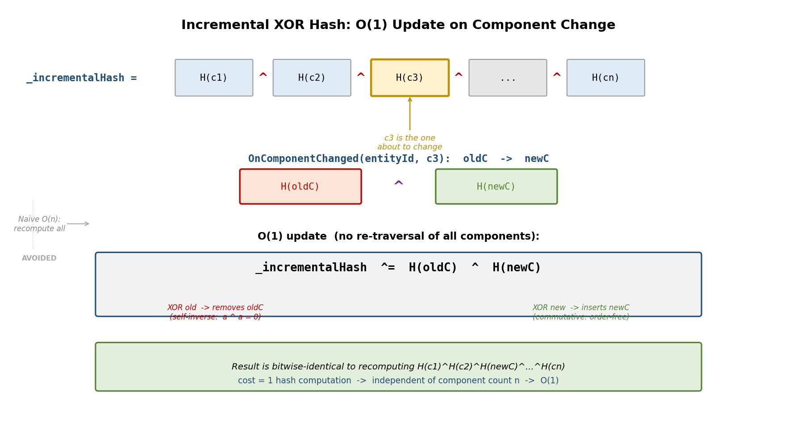
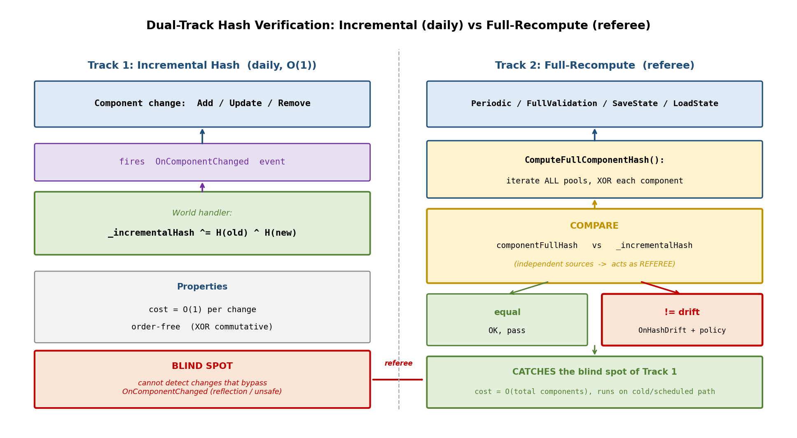
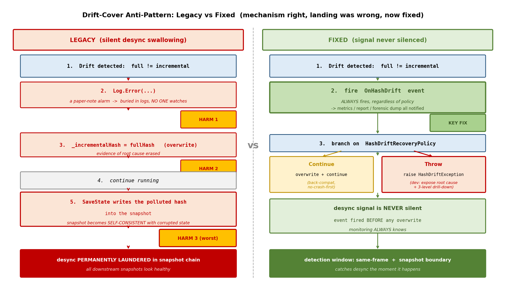
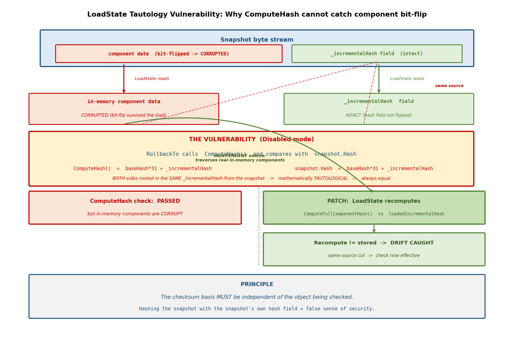

# 第 23 章 · 哈希校验双轨:增量 O(1) vs 全量重算

> **核心问题**:前五篇我们把一台"单机就确定"的机器造了出来,又把它接到了网络上,还做了回放、性能可观测、对象池。可一旦线上跑起来,两台客户端**悄悄分叉**了——它们都在正常出帧、都在画坦克、都不报错,但局面已经慢慢不一样了。这种 desync 不像崩溃那样会被玩家立刻发现,等到玩家看到"对面的坦克瞬移了一下"时,可能已经过去了几千帧,根本找不到是哪一行代码算错的。**怎么在 desync 发生的当帧就抓住它,而不是等它演变成几千帧后的不可逆分叉?**这就是第 6 篇"确定性调试"要回答的核心问题,而本章是这个问题的入口:状态哈希对账。

> **读完本章你会明白**:
> 1. 为什么哈希对账是抓 desync 的**唯一手段**(desync 不崩溃、不报错,只有"指纹比对"能发现),以及一个 32 位哈希是怎么把整个 World 状态压缩成"指纹"的。
> 2. 增量哈希为什么能做到 O(1)(组件一变就 XOR 更新),它和每帧遍历全量重算的哈希各自挡什么威胁。
> 3. 双轨模式三档(Disabled/Periodic/FullValidation)分别用在哪,生产为什么默认 Disabled。
> 4. ★为什么"漂移即覆盖"曾经是个工程灾难(desync 信号被静默吞掉 + 快照链永久洗白),以及现在的 OnHashDrift 事件 + Throw 策略怎么把这个洞补上的——这是全书最深刻的"机制对但落地错,现已修"案例。
> 5. ★为什么 LoadState 要在 Disabled 模式下额外重算一次全量哈希,补上"校验恒真"的漏洞。

> **如果一读觉得太难**:先只记住三件事——① 状态哈希 = 把整个 World 压成一个 32 位指纹,两端指纹不一样就是 desync;② 增量哈希靠组件变更时 XOR,生产几乎零开销,全量哈希靠遍历重算,慢但能抓住"绕过事件钩子的非法修改";③ 两者不一致叫"漂移",旧代码漂移了就静默覆盖,现在会触发 OnHashDrift 事件,还能配成 Throw 直接抛异常暴露根因。

---

## 〇、一句话点破

> **desync 是帧同步最阴险的 bug:它不崩溃、不抛异常、不卡顿,只是两台机器的状态在最低位上悄悄分叉,几千帧后才演变成肉眼可见的诡异画面。唯一能在当帧抓住它的办法,是给整个 World 状态算一个"指纹"(状态哈希),两端每帧互相核对,指纹一不一致就是 desync。这个指纹的难点不在"算出来"(那只是个哈希函数),而在"怎么每帧都算得起"——一个有几万个组件的 World,每帧全量遍历重算哈希代价不小。所以工程上用"双轨":日常靠增量哈希 O(1) 维护,定期或开发期再全量重算一次比对,抓住"绕过正常修改路径"的损坏。双轨本身是对的,但它曾经有个致命的工程落地错误——发现两端不一致(漂移)时直接覆盖增量哈希然后继续,把唯一的 desync 信号静默吞掉,还把被污染的哈希写进快照使坏快照自洽。现已修复(OnHashDrift 事件 + Throw 策略 + LoadState 重算补丁)。**

这是结论。本章倒过来拆:先讲为什么 desync 必须靠哈希抓,再讲增量哈希怎么做到 O(1),再讲双轨怎么配合,再讲那个反面教材,最后讲 LoadState 的恒真漏洞。

---

## 一、为什么 desync 必须靠哈希抓,而且必须每帧抓

这是整章的地基,得先想透。

### 1.1 desync 不像别的 bug——它"看起来正常"

回想一下你修过的普通 bug。一个空指针,程序崩了,堆栈告诉你哪一行。一个死锁,程序卡住,jstack 一打线程全在 `wait`。一个逻辑错,测试用例红了,你照着断言改。这些 bug 都有一个共同点:**它们会"显形"**,要么崩、要么卡、要么断言失败。

desync 不是这样。两台客户端各跑各的,都在按 20Hz 正常出帧,画面都在动,操作都响应,**没有任何一处代码会抛异常,没有任何一个断言会失败**。因为对每台机器自己来说,它的运算都是"合法"的——`Position.X` 从 `100` 变成 `100.00001`,这一步运算在这台机器上完全正确,没有任何规则说"X 不能是 100.00001"。只有当你把两台机器的 `Position.X` **放在一起比**的时候,才发现它们不一样。

> **承接第 2 章**:这就是为什么浮点不能用。浮点的 desync 是**逐位累积**的——这一帧差一个最低位,下一帧再差一个,几千帧后整数部分都不同了。但每一步差的那一个最低位,在任何单台机器上都"看起来正常"。

所以 desync 的本质是:**它只在"跨机器比对"这个维度上才显形,单机视角永远看不到**。这意味着抓 desync 的手段,必须主动去做"比对"这件事——不能等 bug 自己暴露。

### 1.2 朴素做法撞什么墙:为什么不直接比状态

你可能想:那简单啊,每帧把两台机器的整个 World 状态序列化成字节流,发到服务器或互发,字节流一比不就完了?

> **不这样会怎样**:先算代价。一个 5000 实体、每实体 5 个组件的 World,`SaveState()` 序列化出来是几千字节(第 22 章测过,生产路径约 635 B/帧,全量 `SaveState().ToArray()` 伪影 2251 B/帧)。每帧每客户端都把这个发到服务器再广播给所有客户端比对,带宽爆炸(20fps × 2KB × N 玩家)。更要命的是**比对本身**——两个几千字节的流逐字节比,你得先保证它们**按相同顺序序列化**(否则同一个状态序列化出来字节顺序不同,永远误报 desync),这又倒逼出"确定性序列化"的整套要求(承第 7 章 BitWriter 强制排序)。

所以"每帧发完整状态比"在带宽和 CPU 上都不可行。需要一种**把整个状态压缩成一个短指纹**的手段,只比这个指纹。这就是哈希。

### 1.3 所以这么设计:状态哈希——整个 World 的指纹

哈希大家都会:把任意长度的输入压成一个定长的输出,输入差一个字节,输出就面目全非。帧同步用哈希干一件具体的事:

> **状态哈希 = 把当前 World 的全部逻辑状态(帧号 + 随机数状态 + 所有实体所有组件),喂给一个确定性哈希函数,得到一个 32 位整数。两台机器在同一帧算出的这个整数一样,状态就(极大概率)一样;不一样,就一定 desync 了。**

这个 32 位整数就是 World 在这一帧的"指纹"。来看 `World.ComputeHash()` 真实怎么算(`World.cs:1134`):

```csharp
public uint ComputeHash()
{
    unchecked
    {
        // 基础部分:帧号 + 随机数 + 实体数 (O(1))
        uint baseHash = 17;
        baseHash = baseHash * 31 + (uint)CurrentFrame;
        var (s0, s1) = Random.State;
        baseHash = baseHash * 31 + (uint)(s0 ^ (s0 >> 32));
        baseHash = baseHash * 31 + (uint)(s1 ^ (s1 >> 32));
        baseHash = baseHash * 31 + (uint)_activeEntities.Count;

        // 增量哈希已经包含了所有组件状态 (O(1))
        uint finalHash = baseHash * 31 + _incrementalHash;
        // ... 双轨校验逻辑稍后讲 ...
        return finalHash;
    }
}
```
> `[World.cs:1134-1147]`(简化展示,双轨分支略)

注意三件事:

1. **基础部分是 O(1) 的**——帧号、随机数两个 ulong、实体计数,加乘 `31`(经典 djb2 风格 hash combine)。
2. **组件状态是通过 `_incrementalHash` 这个字段一次性并进来的**,不是这里遍历所有组件。这就是"增量哈希"——它把"遍历所有组件算哈希"这件事摊到了每次组件变更上,使得 `ComputeHash()` 主体几乎零开销。
3. **`unchecked`**——帧同步不关心哈希溢出,溢出就让它溢,uint 算术溢出是确定性的(不像浮点舍入跨平台不一致),所以这里 unchecked 反而保证跨平台一致。

这一节回答了"为什么哈希、哈希算什么"。下一节拆增量哈希这个 O(1) 是怎么做到的——这是本章第一个招牌技巧。

---

## 二、增量哈希:组件一变就更新,O(1) 维护

### 2.1 朴素做法撞什么墙:每帧遍历所有组件

如果 `ComputeHash()` 每次调用都要遍历所有组件池的所有活跃组件算哈希,那它就是 O(组件总数)。一个 5000 实体 × 5 组件的 World,每帧算一次哈希就是 25000 次组件序列化 + 哈希。这还只是"算哈希"本身的代价,别忘了它还要把组件 `Serialize` 到一个 BitWriter 里再逐字节 fold 进哈希(见 `ComputeSingleComponentHash`,`World.cs:1211`)——序列化是有开销的。

> **不这样会怎样**:生产环境每帧多花几毫秒在"算哈希"上,20fps 的预算(50ms/帧)就被吃掉一大块,留给游戏逻辑的余量骤减。第 22 章讲过,5000 实体的模拟本身才 0.37ms,如果哈希校验比模拟本身还贵,那这个"保护机制"就成了性能包袱。

所以工程上的第一个想法是:**能不能让哈希跟着状态变,而不是每次重算?**

### 2.2 所以这么设计:XOR 增量哈希

这里有一个数学性质被巧妙利用了。如果用 **XOR(异或 `^`)** 来组合各组件的哈希,那么:

```
   全体组件哈希的 XOR = H(comp_1) ^ H(comp_2) ^ ... ^ H(comp_n)
```

当某个组件从 `oldC` 变成 `newC` 时,新的全体 XOR 是:

```
   newTotal = oldTotal ^ H(oldC) ^ H(newC)
```

为什么?因为 XOR 满足**交换律、结合律、自反性(`a ^ a = 0`)**。把 `H(oldC)` 从总 XOR 里"摘掉",再"加上"`H(newC)`,等价于把总 XOR 再 XOR 一次 `H(oldC) ^ H(newC)`(摘掉是因为 `total ^ H(oldC) ^ H(oldC) = total`,但这里我们要的是把 oldC 这一项替换成 newC,所以是 `total ^ H(oldC) ^ H(newC)`)。

这意味着:**组件变更时,只要知道 oldC 和 newC 各自的哈希,就能在 O(1) 时间内更新总哈希,完全不用遍历其他组件。**

来看真实的代码(`World.cs:1193-1206`):

```csharp
internal void OnComponentChanged<T>(int entityId, Type type,
    T oldComponent, bool hasOld, T newComponent, bool hasNew) where T : struct, IComponent
{
    // ... (预测/回放时的策略稍后讲) ...

    uint oldHash = hasOld ? ComputeSingleComponentHash(entityId, oldComponent) : 0;
    uint newHash = hasNew ? ComputeSingleComponentHash(entityId, newComponent) : 0;
    
    _incrementalHash ^= oldHash;
    _incrementalHash ^= newHash;
}
```
> `[World.cs:1193-1206]`

`_incrementalHash` 就是那个"总 XOR"。每次组件变更(增、删、改),组件池都会触发 `OnComponentChanged` 事件(World 在池初始化时订阅,见 `ComponentPoolWrapper.Attach`,`World.cs:85-91`),World 收到事件就把 oldHash 摘掉、newHash 加进去。



> **图说**:上方一行是"全体组件哈希的 XOR"(`_incrementalHash`),由 H(c1)^H(c2)^...^H(cn) 组成。中部展示一次组件变更:c3 从 oldC 变成 newC。下方展示 O(1) 更新:不重算全体,只对总 XOR 再异或一次 `H(oldC) ^ H(newC)`——`H(oldC)` 把旧的摘掉(自反性 `a^a=0`),`H(newC)` 把新的加上。结果与"重算全体"逐位一致,但只花一次哈希计算的时间,和组件总数 n 无关。

> **钉死这件事**:`_incrementalHash` 始终等于"当前所有活跃组件哈希的 XOR",但它不是每次需要时重算的,而是**每次组件变更时增量维护**的。这就是 O(1) 的来历——单次组件变更只花"算一个组件的哈希"的时间,和 World 里有多少组件无关。

### 2.3 单个组件的哈希怎么算

`ComputeSingleComponentHash`(`World.cs:1211-1229`)是"算一个组件的指纹":

```csharp
private uint ComputeSingleComponentHash<T>(int entityId, in T component) where T : struct, IComponent
{
    unchecked
    {
        uint hash = ComponentType<T>.DeterministicHash;   // 类型指纹
        hash = hash * 31 + (uint)entityId;                // 实体 id
        
        _hashWriter ??= new BitWriter(128);
        _hashWriter.Reset();
        component.Serialize(_hashWriter);                 // 组件序列化成字节
        
        var span = _hashWriter.AsSpan();
        foreach (var b in span)
        {
            hash = hash * 31 + b;                         // 逐字节 fold
        }
        return hash;
    }
}
```
> `[World.cs:1211-1229]`

三个要点:

1. **类型指纹 + entityId** 进哈希。这样同一个组件类型在不同实体上不会因值相同而哈希碰撞被 XOR 掉。`ComponentType<T>.DeterministicHash` 是类型 FullName 的哈希(`ComponentTypeRegistry.cs:133`),在静态构造时算一次缓存。
2. **组件序列化成字节流再逐字节 fold**,而不是用 `GetHashCode()`。这一点极重要,见下一小节的"哈希不变量"。
3. **`_hashWriter` 是复用的字段(单线程)**,不是每次 `new`。注释(`World.cs:1208`)明确说"原 `[ThreadStatic] static` 在单线程 World 里是误导,已改实例字段"——这呼应第 22 章讲的 World 单线程化重构。

### 2.4 哈希不变量:XOR 的交换无关 + 排序遍历

XOR 增量哈希有一个数学上的好性质,也有一个工程上的坑:

**好性质:XOR 交换无关**。`a ^ b ^ c == c ^ a ^ b`。这意味着组件变更的**先后顺序**不影响最终 `_incrementalHash` 的值,只要变更完之后"活跃组件的集合"一样,哈希就一样。这在帧同步里极其重要——两个客户端可能由于网络抖动导致组件变更的事件顺序不同(比如同一帧里先删 A 再加 B vs 先加 B 再删 A),但只要最终状态一样,XOR 哈希就一样,**不会因为事件顺序误报 desync**。

**工程坑:全量重算必须按确定性顺序遍历**。虽然 XOR 的结果和顺序无关,但"全量重算"那一路径(`ComputeFullComponentHash`,`World.cs:1120`)是 `foreach (var pool in _sortedPoolCache)`,这个 `_sortedPoolCache` 必须是**按类型名 Ordinal 排序**的(`World.cs:163-164`)。为什么?严格说对 XOR 不是必须的,但全量重算还可能被 `GetPerTypeHashes()`(`World.cs:1334`)用来做"按类型分桶的诊断输出",那个输出必须是确定性的(两端按相同顺序列出类型才能逐个比),所以排序是给诊断路径用的。**哈希值本身靠 XOR 交换无关保证顺序无关,诊断输出靠强制排序保证两端可比**——两件事,别混。

### 2.5 作者复盘:为什么用 32 位而不是 64 位

> **作者复盘 · 32 位哈希的取舍**:你可能注意到了哈希是 `uint`(32 位),不是 `ulong`。32 位哈希的理论碰撞概率是 1/2³² ≈ 2.3×10⁻¹⁰。一个 World 几万个组件,每帧比对,长期跑碰撞概率会有,但极低。用 64 位能把碰撞概率再降 40 亿倍,代价是:① 哈希值占两个带宽字节(`HashReport` 消息会变胖);② 所有 fold 运算从 32 位变 64 位,XOR 倒无所谓,但 `*31` 那一路径 64 位乘法在某些旧运行时不如 32 位快。权衡下来,32 位"碰撞概率足够低 + 带宽/运算友好"被采纳。**但 32 位哈希有一个真问题:它压缩得太狠,定位不到是哪个字段漂了**——这就是为什么后来加了 `GetPerTypeHashes()` / `Diff()` / `GetDebugString()` 三级下钻(第 25 章详讲),哈希只负责"报警",定位靠另外的工具链。

---

## 三、全量重算:抓住"绕过正常修改路径"的损坏

增量哈希 O(1) 这么好,为什么还要全量重算?这是本章第二个招牌点。

### 3.1 增量哈希的盲区:绕过 OnComponentChanged 的修改

增量哈希维护正确的前提是:**所有组件变更都必须经过 `OnComponentChanged` 事件**。也就是说,改一个组件,必须走 `world.UpdateComponent<T>(entity, ...)` 这条受控路径,组件池内部触发事件,World 收到事件更新 `_incrementalHash`。

> **不这样会怎样**:如果有人绕过这条路径直接改了组件——比如用反射、`unsafe` 指针、或者拿到了组件的可变引用直接写字段——`OnComponentChanged` 不触发,`_incrementalHash` 不更新,但它**不代表状态没变**。状态实打实变了,只是哈希没跟上。这时 `_incrementalHash` 和"真实状态的哈希"就脱钩了,这种脱钩**增量哈希自己永远发现不了**——它没有外部基准可比。



> **图说**:左半图画增量哈希的日常维护——组件变更(Add/Update/Remove)触发 `OnComponentChanged`,`_incrementalHash ^= H(old) ^ H(new)`,O(1) 更新。右半画画全量重算裁判——`ComputeFullComponentHash()` 独立遍历所有组件池算 XOR,和 `_incrementalHash` 比,一致就过,不一致(灰色虚线箭头)触发 `OnHashDrift` 事件 + 按策略(Continue 覆盖 / Throw 抛异常)处理。两个轨道来源独立,全量是增量的裁判。

这就是为什么 World 的类注释(`World.cs:29-52`)反复强调"禁止直接修改 `GetComponent` 返回值",并且把 `GetComponent` 设计成 `ref readonly`,让直接写字段变成编译错误。这是用类型系统把"绕过事件钩子"的非法修改挡在编译期。

但编译期防线不是绝对的:`unsafe`、反射、序列化钩子里改字段,都能绕过去。所以需要**一个独立的、不依赖事件钩子的基准**来定期核对增量哈希有没有脱钩。这就是全量重算。

### 3.2 全量重算:遍历所有组件池,和增量哈希比

全量重算的实现是 `ComputeFullComponentHash`(`World.cs:1120-1129`):

```csharp
private uint ComputeFullComponentHash()
{
    uint componentFullHash = 0;
    UpdateSortedPoolCache();
    foreach (var pool in _sortedPoolCache)
    {
        componentFullHash ^= pool.ComputeHash();   // 每个池内部遍历活跃组件 XOR
    }
    return componentFullHash;
}
```
> `[World.cs:1120-1129]`

它**完全独立于 `_incrementalHash`**——直接遍历所有组件池,把当前真实状态的组件逐个算哈希 XOR 起来。`pool.ComputeHash()` 的实现见 `ComponentPoolWrapper.ComputeHash`(`World.cs:98-107`):遍历 `Pool.ActiveEntities`,对每个活跃组件调 `ComputeSingleComponentHash`。

关键来了:**如果全量重算的结果 ≠ `_incrementalHash`,只可能是两种情况之一**:

1. 有组件变更绕过了 `OnComponentChanged`(增量哈希漏更新了);
2. 增量哈希的 XOR 维护逻辑本身有 bug(比如删组件时没摘掉 oldHash)。

不管哪种,都是 desync 的征兆——因为两台机器如果都有这种漏更新,它们的 `_incrementalHash` 可能都对,但和真实状态都对不上;或者一台对一台不对,那两端 `_incrementalHash` 本身就不同。**全量重算是增量哈希的"裁判"**。

### 3.3 所以这么设计:双轨——增量日常 + 全量定期

把两者结合起来就是"双轨":

- **日常**:`ComputeHash()` 走增量路径(O(1),返回 `baseHash*31 + _incrementalHash`),生产零开销。
- **定期或开发期**:在 `ComputeHash()` 内部额外调一次 `ComputeFullComponentHash()`,和 `_incrementalHash` 比,漂移就报警。

这就是 `DualTrackMode` 三档的来历(`World.cs:13-21`):

```csharp
public enum DualTrackMode
{
    /// <summary> 生产环境:关闭校验,最高性能 </summary>
    Disabled,
    /// <summary> 均衡模式:每隔 N 帧进行一次周期性全量校验 </summary>
    Periodic,
    /// <summary> 开发模式:每帧进行全量校验,发现不一致立即使其暴露 </summary>
    FullValidation
}
```
> `[World.cs:13-21]`

`ComputeHash()` 内部的双轨分支(`World.cs:1149-1190`):

```csharp
// 双轨校验逻辑
bool needCheck = _dualTrackMode == DualTrackMode.FullValidation ||
                 (_dualTrackMode == DualTrackMode.Periodic && CurrentFrame % _dualTrackCheckInterval == 0);

if (needCheck)
{
    uint componentFullHash = ComputeFullComponentHash();
    if (componentFullHash != _incrementalHash)
    {
        // 发现漂移,进入诊断/恢复流程(下一节详讲)
        ...
    }
    // 返回基于全量哈希的指纹
    return fullHash * 31 + componentFullHash;
}
return finalHash;   // 增量路径
```
> `[World.cs:1149-1190]`(简化展示)

三档权衡:

| 模式 | 每帧代价 | 抓什么 | 适用场景 |
|---|---|---|---|
| **Disabled** | O(1),几乎零开销 | 仅靠 `_incrementalHash` 维护,抓不了"绕过钩子的损坏" | 生产上线,逻辑已稳定 |
| **Periodic** | 每 N 帧(N 默认 30,`_dualTrackCheckInterval`)一次 O(组件总数) | 定期核对增量 vs 全量,抓绕过钩子的损坏(有至多 N 帧延迟) | 灰度/验收测试 |
| **FullValidation** | 每帧 O(组件总数) | 漂移当帧就暴露 | 开发调试、CI 回归、首发上线观察期 |

> **钉死这件事**:生产默认 Disabled 不是"放弃校验",而是"把校验的成本从热路径挪走"。Disabled 模式下 `_incrementalHash` 仍在维护(`OnComponentChanged` 照常触发,见 `World.cs:1195` 那段注释),只是不再每帧全量比对。一旦线上怀疑有 desync,把模式切到 Periodic 或 FullValidation(灰度开关),全量比对立刻上线。**双轨的意义就是让"严格校验"成为一个可旋钮的开关,而不是非此即彼。**

---

## 四、漂移了怎么办:HashDrift 检测与恢复策略(含反面教材)

这一节是整章最深刻的部分。我们来看双轨校验发现漂移之后,代码该怎么处理——以及它**曾经处理错**的那个工程灾难。

### 4.1 漂移检测:发现了什么

当 `needCheck` 为真且 `componentFullHash != _incrementalHash` 时,代码进入漂移分支(`World.cs:1157-1178`):

```csharp
if (componentFullHash != _incrementalHash)
{
    // 发现不一致,进入诊断模式
    Log.Error($"[World] Hash drift detected at Frame {CurrentFrame}!");
    Log.Error($"  Incremental: 0x{_incrementalHash:X8}");
    Log.Error($"  Full:        0x{componentFullHash:X8}");
    Log.Error($"  Delta (XOR): 0x{(_incrementalHash ^ componentFullHash):X8}");

    // 阶段2.1: 触发事件 + 按恢复策略处理
    OnHashDrift?.Invoke(CurrentFrame, _incrementalHash, componentFullHash);
    if (HashDriftRecoveryPolicy == HashDriftRecovery.Throw)
    {
        throw new HashDriftException(CurrentFrame, _incrementalHash, componentFullHash);
    }

    // 自动修复:用全量哈希覆盖增量哈希,防止错误累积
    _incrementalHash = componentFullHash;
    Log.Warning($"  [Auto-fixed] Incremental hash corrected to full hash.");
}
```
> `[World.cs:1157-1178]`

注意三个动作:

1. **详细日志**:打印 Incremental / Full / Delta(两者的 XOR)。Delta 不为 0 直观说明"哪些位漂了",虽然 32 位 XOR 定位不到字段(那是 `Diff()` 的活),但能看出"是大面积漂移还是个别位"。
2. **触发 `OnHashDrift` 事件**(`World.cs:198` 声明):这是个 `Action<int, uint, uint>`(帧号, 增量哈希, 全量哈希),**无论用哪种恢复策略都会触发**。订阅方可以拿它做:① `LockstepMetrics.RecordHashDrift` 上报指标;② 落盘一份对照快照(把当前 World 的 `SaveState` + 全量哈希 dump 到文件,供事后 `Diff`);③ 上报到监控平台。
3. **按 `HashDriftRecoveryPolicy` 处理**:`Continue`(默认,向后兼容)→ 用全量哈希覆盖增量哈希然后继续;`Throw` → 立即抛 `HashDriftException`。

### 4.2 两种恢复策略的取舍

`HashDriftRecovery` 枚举(`HashDriftException.cs:8-15`):

```csharp
public enum HashDriftRecovery
{
    /// <summary>覆盖增量哈希并继续运行(默认,向后兼容旧行为)。</summary>
    Continue,
    /// <summary>抛出 HashDriftException 快速失败(开发期推荐,立即暴露 desync 根因)。</summary>
    Throw
}
```
> `[HashDriftException.cs:8-15]`

`Throw` 抛出的 `HashDriftException`(`HashDriftException.cs:21-41`)携带帧号、增量哈希、全量哈希,异常信息里直接点名"This indicates a desync (e.g. direct component mutation, non-deterministic traversal, or float leak)"——把最常见的三种漂移根因(直接改组件、非确定遍历、浮点泄露)列出来给开发者排查方向。

> **所以这样设计**:开发期 `Throw` 让 desync 在第一次发生时就中断,你能拿到精确的帧号和当时的哈希,配合 `GetPerTypeHashes()` / `Diff()` 当场定位。生产期 `Continue` 是"不崩溃优先"——线上不能因为一个怀疑的 desync 就把整局踢掉,记录 + 上报 + 继续跑,事后离线分析。**关键改进**:`Continue` 现在不是"静默"——它仍然触发 `OnHashDrift` 事件,订阅方(默认的 metrics 收集器)一定会知道。这就是和旧实现的分水岭。

### 4.3 ★反面教材:旧实现"漂移即覆盖 + Log.Error + 继续",把 desync 静默吞掉

现在来看本章最深刻的一节。`Continue` 策略现在长这样:`OnHashDrift` 事件 + 覆盖 + 继续。看起来挺合理——记了日志,也允许订阅事件。但**旧实现没有 `OnHashDrift` 事件,只有 `Log.Error` + 覆盖 + 继续**。就差这一个事件,引发了一连串工程灾难。

> **作者复盘 · "漂移即覆盖"为什么是灾难**:这是项目加固期审计(FRAMEWORK_QUALITY_AUDIT)列出的最大 P0 之一,现已修。让我把旧实现的祸害拆透。

**祸害一:desync 信号被静默吞掉。** 旧代码漂移时打一条 `Log.Error`,然后用全量哈希覆盖增量哈希,继续跑。问题是:**`Log.Error` 在生产环境几乎没人看**。服务器的日志滚滚向前,一条 Error 夹在几万条 Info 里,运维不告警就等于没发生。而 desync 是帧同步最严重的 bug,它本该触发最响亮的警报(指标上报、熔断、自动取证),结果被降格成一条日志。**desync 发生了,但监控系统一无所知,直到玩家投诉"画面乱了"才后知后觉——可能已经过了几千帧,取证窗口早关了。** 这就是把"信号"变"静默"的恶果。

**祸害二:覆盖之后,后续每帧的哈希都基于"被矫正过"的 `_incrementalHash`,真实的 desync 根因被擦掉。** 假设第 1000 帧某个组件被绕过钩子改坏了,增量哈希和全量哈希漂移。旧代码覆盖后,`_incrementalHash` 变成"反映已损坏状态"的全量哈希。从第 1001 帧起,只要不再发生新的绕过钩子的修改,增量哈希和全量哈希又会一致——**漂移消失了,但损坏还在**。你在第 2000 帧想回头看"什么时候开始坏的",哈希曲线平滑如初,毫无线索。

**祸害三(最致命):SaveState 路径二次出现,被覆盖的哈希写进快照,坏快照变自洽。** 这是审计点名的核心威胁。`SaveState`(`World.cs:856-878`)在保存前**也做了一次双轨校验**——因为如果增量哈希已经漂移,直接保存会导致"快照里的哈希字段"和"快照里的组件数据"不一致。但旧实现的"修复"方式是:**用全量哈希覆盖增量哈希,然后写进快照**。这等于把"已经损坏的状态"用一个"和它自洽的哈希"封装起来。后果:

- 这个快照被存到磁盘 / 发给重连客户端 / 写进回放起点;
- 任何加载这个快照的机器,加载后用 `ComputeHash()` 比对快照哈希——**完全一致**(因为哈希就是按这个损坏状态算的);
- **desync 在快照链里被永久洗白**。每一份从这个坏快照派生出的新快照,都带着"自洽的假哈希",事后取证时,所有快照看起来都健康,但游戏其实早就坏了。

> **钉死这件事**:这不是"机制设计错",双轨校验这个**机制**完全正确(增量 O(1) + 全量比对,是行业标准做法)。错的是**工程落地**——发现漂移后的处理策略选错了。把"发现 desync"这个帧同步里最重要的信号,降格成一条日志 + 静默覆盖,等同于把火灾报警器换成"在墙角贴了张纸条写着'着火了'"。更糟的是覆盖 + 写快照让"火"连灰烬都擦干净了。

### 4.4 ★现已修复:OnHashDrift 事件 + Throw 策略

当前源码(`World.cs:189-198`)是这个样子:

```csharp
/// 默认 HashDriftRecovery.Continue:覆盖增量哈希并继续(向后兼容)。
/// 开发期建议设为 Throw:立即抛 HashDriftException 暴露 desync 根因。
public HashDriftRecovery HashDriftRecoveryPolicy { get; set; } = HashDriftRecovery.Continue;

/// 增量哈希与全量哈希漂移时触发(无论 HashDriftRecoveryPolicy)。
/// 订阅方可接 LockstepMetrics.RecordHashDrift / 上报 / 落盘对照快照。
public event Action<int, uint, uint>? OnHashDrift;
```
> `[World.cs:189-198]`

修复的三件套:

1. **`OnHashDrift` 事件无论哪种策略都触发**(`World.cs:868, 1102, 1169` 三处漂移点都先 Invoke 事件再分策略)。这是关键——即使 `Continue` 覆盖了哈希,事件已经发出去了,订阅方(metrics 收集器、上报器、取证落盘器)一定收到。desync 信号不再被静默。
2. **`Throw` 策略让开发期 desync 第一次发生就中断**。配合 `GetPerTypeHashes()` / `Diff()` / `GetDebugString()` 三级下钻,你能在中断点当场定位是哪个实体的哪个组件的哪个字段漂了。这把"几千帧后才发现"压缩到"当帧当场定位"。
3. **`Continue` 仍然覆盖**——这是有意的"向后兼容 + 不崩溃优先"。但覆盖之前事件已经触发,监控已经知道;覆盖之后 `_incrementalHash` 和真实状态自洽,后续哈希曲线不再误报。**生产线的取舍是:宁可让 desync "发生一次然后被记录 + 上报",也不能让整局崩溃**——事后靠上报的对照快照做离线 Diff 定位。

> **承接第 22 章**:第 22 章讲过"可观测性地基"的三件套——desync 被静默吞掉、32 位哈希无法定位到字段、日志抽象混乱——并说"当前已基本就位"。本章拆的就是其中第一件套(漂移即覆盖)的具体修复。`OnHashDrift` 事件就是那个"让 desync 不再静默"的钉子,`GetPerTypeHashes()` + `Diff()` 就是那个"让 32 位哈希能定位到字段"的下钻工具链(第 25 章详讲怎么用)。这不是"地基缺失",是"地基已铺好,本章讲它怎么铺的"。



> **图说**:左右两栏对比。**左栏(旧实现)**:漂移 → Log.Error(纸条级警报,无人看)→ 覆盖 `_incrementalHash` → 继续 → SaveState 把被污染的哈希写进快照 → 快照自洽 → desync 在快照链永久洗白(三个祸害用红色标注)。**右栏(现实现)**:漂移 → 先触发 `OnHashDrift` 事件(无论策略,监控必知情)→ 分策略:Continue 仍覆盖(向后兼容)但事件已发出 + metrics 上报;Throw 立即抛 `HashDriftException` 中断 + 当场定位。关键差异:desync 信号不再静默,事件是无论哪种策略都先发的"钉子"。

### 4.5 双轨校验三处触发点

顺便梳理一下双轨校验在源码里一共三处触发 `OnHashDrift` 的地方,避免写书时混淆:

1. **`ComputeHash()` 内部**(`World.cs:1169`)——`Periodic` / `FullValidation` 模式下,每帧或每 N 帧比对。这是热路径上的常规校验。
2. **`SaveState()` 内部**(`World.cs:868`)——保存快照前先比对,漂移则在上报后用全量哈希覆盖,保证写进快照的哈希和组件数据自洽(避免"祸害三"的快照污染,虽然覆盖本身仍在,但前置的事件让监控知情)。
3. **`LoadState()` 尾部**(`World.cs:1102`)——加载完快照后重算全量哈希,和快照里读出来的增量哈希比对。这是下一节的主角,修的是另一个洞。

三处合起来,把 desync 的"检测窗口"从"事后发现"压到"当帧发现 + 快照边界再校验 + 加载时三校验"。

---

## 五、★LoadState 重算补丁:修"校验恒真"漏洞

这是本章第三个招牌点,也是一个极其隐蔽的 bug。

### 5.1 朴素认知:有 ComputeHash 校验就够了

回滚和重连都要加载快照。加载快照后,`LockstepController.RollbackTo`(`LockstepController.cs:659-664`)会立刻调一次 `simulation.ComputeHash()` 和快照里存的哈希比:

```csharp
var actualHash = _simulation.ComputeHash();
if (actualHash != snapshot.Hash)
{
    Log.Error($"Snapshot integrity failed at tick {snapshot.Frame}: " +
              $"expected 0x{snapshot.Hash:X8}, got 0x{actualHash:X8}.");
}
```
> `[LockstepController.cs:659-664]`(简化示意)

看起来天衣无缝:加载完状态,算个哈希,和快照哈希比,不一样就是快照坏了。**但这里有个致命的隐含假设:`ComputeHash()` 真的反映了"当前组件状态"。**

### 5.2 漏洞:Disabled 模式下 ComputeHash 是 O(1) 返回,而 _incrementalHash 本身从快照恢复

回忆第二节:`ComputeHash()` 在 `Disabled` 模式下走增量路径,返回的是 `baseHash*31 + _incrementalHash`(`World.cs:1147`)。这里的 `_incrementalHash` 是哪来的?**它是 `LoadState` 从快照字节里读出来的**(`World.cs:1013`,`uint loadedIncrementalHash = reader.ReadUInt32()`)。

把这个链条捋一遍:

```
   快照字节流 ──LoadState 读取──> _incrementalHash(快照里存的值)
                                   │
   ComputeHash() [Disabled] ───────┘──> baseHash*31 + _incrementalHash
                                   │
   RollbackTo 校验 ── 比对 ── snapshot.Hash(保存时也是 baseHash*31 + _incrementalHash)
```

看出来了吗?**校验的左边和右边,根源都是快照里那同一个 `_incrementalHash`**。它们必然相等——不是"状态健康"才相等,是"数学上恒等"。

> **不这样会怎样**:假设快照在网络传输中发生了位翻转(单字节翻转),刚好翻到了组件数据区(没翻哈希字段)。`LoadState` 把损坏的组件数据读进内存,把完好的 `_incrementalHash` 读进字段。然后 `ComputeHash()`(Disabled 路径)返回 `baseHash*31 + _incrementalHash`——用的是那个**没翻坏的** `_incrementalHash`。`snapshot.Hash` 也是用同一个 `_incrementalHash` 算的。**两边相等,校验通过,但内存里的组件数据已经是坏的**。desync 就这样悄悄从快照边界溜进来了,而你以为"加载后校验过了,安全"。

这就是源码注释(`World.cs:1089-1095`)说的"校验恒真"漏洞:

```csharp
// 关键修复(P1 完整性):在 DualTrackMode.Disabled(生产默认)下,ComputeHash() 是 O(1) 的,
// 直接返回 baseHash*31 + _incrementalHash。而 LockstepController.RollbackTo / LockstepDriver
// 的"加载后校验快照"恰恰调用 ComputeHash() 与快照保存时的 hash 比对 —— 由于 _incrementalHash
// 本身就是从快照字节里恢复的,该校验恒为真,无法发现"组件数据损坏但 hash 字段完好"的快照
// (网络传输位翻转 / 磁盘损坏 / 版本错位)。
```
> `[World.cs:1089-1095]`



> **图说**:推演 Disabled 模式下"校验恒真"的同源性。上方虚线框是快照字节流,内含组件数据 + `_incrementalHash` 字段。中间两条箭头:① LoadState 把组件数据读进内存(假设发生位翻转,组件数据损坏);② LoadState 把 `_incrementalHash` 读进字段(完好)。下方校验链:`ComputeHash()`(Disabled) 返回 `baseHash*31 + _incrementalHash`,而 `_incrementalHash` 来自快照;`snapshot.Hash` 也来自同一个快照的 `_incrementalHash` —— 左右两边根源同源(都用红色虚线连回快照里的同一字段),数学恒等,挡不住"组件坏但哈希字段没坏"。右侧补丁箭头:`LoadState` 重算 `ComputeFullComponentHash()`(遍历内存真实组件)切断了同源性,基准独立,校验才有效。

### 5.3 所以这么设计:LoadState 重算全量,和快照里的增量哈希比

补丁在 `LoadState` 末尾(`World.cs:1096-1114`):

```csharp
// LoadState 是冷路径(回滚/重连),此处重算全量组件哈希与快照内嵌的增量哈希比对
uint recomputedFullHash = ComputeFullComponentHash();
if (recomputedFullHash != loadedIncrementalHash)
{
    Log.Error($"[World.LoadState] Snapshot integrity drift at Frame {CurrentFrame}: " +
              $"stored incremental hash 0x{loadedIncrementalHash:X8} != recomputed full hash 0x{recomputedFullHash:X8}. " +
              "Snapshot component data may be corrupted ...");
    OnHashDrift?.Invoke(CurrentFrame, loadedIncrementalHash, recomputedFullHash);
    if (HashDriftRecoveryPolicy == HashDriftRecovery.Throw)
    {
        throw new HashDriftException(CurrentFrame, loadedIncrementalHash, recomputedFullHash);
    }
    // Continue 策略:采用重算值,使后续 ComputeHash() 与真实组件状态一致
    _incrementalHash = recomputedFullHash;
}
else
{
    _incrementalHash = loadedIncrementalHash;
}
```
> `[World.cs:1096-1114]`

补丁的精髓:

1. **重算用的是 `ComputeFullComponentHash()`**——遍历刚加载进内存的所有组件池,算它们真实状态的哈希。这和增量哈希完全独立。
2. **比对的一方是快照里读出来的 `loadedIncrementalHash`**(保存时写进去的),另一方是刚重算的全量哈希。如果组件数据被翻坏了,重算的全量哈希必然和快照里存的对不上——**因为快照里的 `_incrementalHash` 是按"未损坏的原始状态"算的,而内存里的组件已经坏了**。
3. **漂移处理复用同一套**(`OnHashDrift` 事件 + 策略)。`Continue` 用重算值覆盖 `_incrementalHash`,使得后续 `ComputeHash()` 和真实(虽已损坏)状态自洽——至少不会再误报;`Throw` 直接抛,开发期立刻暴露。
4. **注释强调"LoadState 是冷路径"**——回滚 / 重连不是每帧都发生,在这里花一次 O(组件总数) 重算完全可接受,不影响热路径性能。

> **钉死这件事**:`ComputeHash()` 的"加载后校验"和 `LoadState` 的"重算校验"挡的是**不同的威胁**。前者挡"加载过程本身把状态搞坏了"(比如部分加载失败、字段错位),它依赖 `_incrementalHash` 作为外部基准——但这个基准在 Disabled 模式下也来自快照,所以挡不了"组件数据翻坏但哈希字段没翻"。后者(`LoadState` 重算)才是挡"组件数据翻坏但哈希字段没翻"的那一层,它用全量重算作为完全独立于快照哈希字段的基准。**两层校验缺一不可**,这就是为什么源码里两处都在。

---

## 六、技巧精解

本章最硬核的两个技巧单独拆透。

### 技巧一:XOR 增量哈希 O(1) 维护

**问题**:状态哈希要每帧算,但每帧遍历几万个组件太贵。

**朴素做法撞什么墙**:朴素做法是每次 `ComputeHash()` 都遍历,O(组件总数)。5000 实体 × 5 组件 = 25000 次,每次还要序列化组件到 BitWriter,贵。

**技巧**:利用 XOR 的自反性(`a ^ a = 0`)和交换律,把"算全体哈希"摊到"每次组件变更"上。组件从 oldC 变 newC 时,`total ^= H(oldC) ^ H(newC)`——摘掉旧的,加上新的,O(1)。

**为什么对**:严格证明。设变更前全体 `T = H(c_1) ^ ... ^ H(c_n)`,其中某项 `c_k = oldC`。变更后 `c_k = newC`,新全体 `T' = H(c_1) ^ ... ^ H(c_{k-1}) ^ H(newC) ^ H(c_{k+1}) ^ ... ^ H(c_n)`。两边 XOR:`T ^ T' = H(oldC) ^ H(newC)`。所以 `T' = T ^ H(oldC) ^ H(newC)`。证毕。增量更新等价于全体重算,逐位一致。

**反面对比**:如果用"求和"而不是 XOR 组合(`total = sum of H(c_i)`),组件变更时要 `total -= H(oldC); total += H(newC)`——也能 O(1)。但求和有一个坏处:**它对顺序敏感的程度和 XOR 不同,而且容易溢出**(虽然 `unchecked` 溢出是确定的)。更关键的是求和的组合不如 XOR"充分混合",碰撞概率略高。XOR 是哈希组合的行业标准。

**真实代码**:`World.cs:1193-1206`(`OnComponentChanged`),`World.cs:1211-1229`(`ComputeSingleComponentHash`)。

**注意一个工程细节**:`OnComponentChanged` 的注释(`World.cs:1195-1199`)提到,在 `Disabled` 且非预测非回放时,有一段空 if 体——意思是"理论上极端优化时可以完全停掉增量哈希更新(返回固定值)",但当前实现**仍然维护** `_incrementalHash`,只是不做全量比对。这是一个预留的进一步优化口子,生产默认没开。

### 技巧二:LoadState 重算补丁——为什么"有校验"不等于"校验有效"

**问题**:加载快照后明明调了 `ComputeHash()` 比对,为什么还挡不住组件数据损坏?

**根因**:`ComputeHash()` 在生产默认的 Disabled 模式下走增量路径,返回值里起决定作用的 `_incrementalHash` 字段,**它本身就是从快照字节里读出来的**。校验的左边和右边用了同一个来源,数学上恒等,不是"健康才相等"。

**技巧**:在 `LoadState`(冷路径)末尾,用完全独立的 `ComputeFullComponentHash()`(遍历刚加载的组件)和快照里读出的 `loadedIncrementalHash` 比。两者来源不同(一个来自内存真实组件,一个来自快照字节流),只有组件数据真没坏才一致。

**为什么对**:这其实是"校验有效性"的一般原则——**校验的基准必须独立于被校验的对象**。如果你用"快照里存的哈希"校验"快照里存的状态",两者同源,损坏如果同源发生(比如整个快照被某种方式整体污染),校验就失效。`LoadState` 重算把基准换成了"对内存中组件数据的独立重算",切断同源性,校验才真正有效。

**反面对比**:"有校验"和"校验有效"是两件事。很多代码看起来"我加载完校验了哈希",但仔细看校验的基准来源,会发现它和被校验对象同源——这种校验给的是**虚假的安全感**。审计这个 bug 的过程就是经典:看代码以为"加载后校验"挡得住,画出来源依赖图才发现"基准也是从快照读的",挡不住。**这是防御性编程最典型的反直觉陷阱:代码存在不等于代码起作用。**

**真实代码**:`World.cs:1089-1114`(补丁本体 + 注释),`World.cs:1120-1129`(`ComputeFullComponentHash`),`LockstepController.cs:659-664`(`ComputeHash` 校验,挡另一类威胁)。

---

## 七、章末小结

### 回扣主线

本章服务全书主线,属于**调试**(第 6 篇"确定性调试"的开篇)。我们回答了"怎么在 desync 发生的当帧抓住它"这个第 6 篇的核心问题:① desync 不崩溃不报错,只有"跨机器比对状态指纹"能发现,所以**状态哈希对账是抓 desync 的唯一手段**;② 状态哈希把整个 World 压成一个 32 位指纹(帧号 + 随机状态 + 实体数 + 全体组件哈希的 XOR);③ 直接每帧遍历算太贵,所以用**增量哈希**——组件变更时靠 XOR 自反性 O(1) 维护 `_incrementalHash`,生产几乎零开销;④ 增量哈希有盲区(绕过 `OnComponentChanged` 的修改),所以用**全量重算**做裁判,双轨模式三档(Disabled 生产零开销 / Periodic 定期核对 / FullValidation 每帧强校验)让"严格校验"成为可旋钮的开关;⑤ 漂移检测的三处触发点(ComputeHash 热路径 / SaveState 保存前 / LoadState 加载后),无论哪种策略都先触发 `OnHashDrift` 事件——这是"desync 不再静默"的钉子;⑥ ★"漂移即覆盖"反面教材(机制对但落地错,旧实现把 desync 信号降格成日志 + 覆盖,还通过 SaveState 二次覆盖把坏快照洗成自洽,desync 在快照链永久洗白;现已修:OnHashDrift 事件 + Throw 策略);⑦ ★LoadState 重算补丁(Disabled 模式下 `ComputeHash` 校验"恒真",因为基准 `_incrementalHash` 也来自快照,补丁用独立的 `ComputeFullComponentHash` 切断同源性)。整章贯穿一个思想:**有机制 ≠ 有保护,校验的基准必须独立于被校验对象**——这个思想会在第 25 章 bug 实战里反复出现。

### 五个为什么

1. **为什么 desync 必须靠哈希抓,不能等它自己暴露?**——desync 不崩溃、不抛异常、不卡顿,单机视角永远"看起来正常",只有"跨机器比对状态指纹"这个维度才能发现。等玩家看到"画面乱了",已经过了几千帧,取证窗口早关了。哈希对账是把 desync 的发现窗口从"事后几千帧"压到"当帧"的唯一手段。
2. **增量哈希为什么能 O(1)?它和全量重算各挡什么威胁?**——增量哈希靠 XOR 自反性:组件从 oldC 变 newC 时 `total ^= H(oldC) ^ H(newC)`,O(1) 维护。它挡的是"正常经过 OnComponentChanged 路径的修改被正确反映到指纹里"。全量重算是它的裁判:独立遍历所有组件算哈希,和增量哈希比,挡的是"绕过 OnComponentChanged 钩子的非法修改"(反射 / unsafe / 钩子里改字段)。两者缺一不可。
3. **双轨模式三档为什么这么分?生产为什么默认 Disabled?**——Disabled(O(1),仅靠增量维护,不比对)用于逻辑已稳定的生产;Periodic(每 30 帧全量比对一次)用于灰度验收,抓绕过钩子的损坏,至多 30 帧延迟;FullValidation(每帧全量)用于开发调试 / CI 回归 / 首发观察期,漂移当帧暴露。生产默认 Disabled 不是"放弃校验",而是"把校验成本从热路径挪走",`_incrementalHash` 仍在维护,一旦怀疑 desync 切到 Periodic / FullValidation 立刻上线严格校验。**双轨的意义是让严格校验成为可旋钮开关,而非非此即彼。**
4. **"漂移即覆盖"为什么是工程灾难,现已怎么修?**——旧实现漂移时只打 Log.Error + 用全量哈希覆盖增量哈希 + 继续,把 desync 这个最严重的信号降格成一条没人看的日志(祸害一);覆盖后后续哈希曲线平滑如初,根因被擦掉(祸害二);更致命的是 SaveState 保存前也覆盖,被污染的哈希写进快照,坏快照自洽,desync 在快照链永久洗白(祸害三)。这不是机制错(双轨校验机制完全正确),是落地错。现修:① `OnHashDrift` 事件无论哪种策略都触发,监控必然知情,desync 不再静默;② `Throw` 策略让开发期 desync 第一次发生就中断,配合三级下钻当场定位;③ `Continue` 仍覆盖(向后兼容 + 不崩溃优先),但事件已先发出。
5. **LoadState 为什么要额外重算一次全量哈希,ComputeHash 的校验不够吗?**——因为 Disabled 模式下 `ComputeHash()` 返回 `baseHash*31 + _incrementalHash`,而起决定作用的 `_incrementalHash` 本身就是从快照字节读出来的。校验的左边(RollbackTo 调 ComputeHash)和右边(snapshot.Hash)根源都是快照里同一个 `_incrementalHash`,数学上恒等,挡不了"组件数据翻坏但哈希字段完好"。补丁在 LoadState(冷路径)末尾用独立的 `ComputeFullComponentHash`(遍历刚加载的真实组件)和快照里的 `loadedIncrementalHash` 比,切断同源性,校验才真正有效。这印证一般原则:**校验的基准必须独立于被校验对象,否则是虚假的安全感**。

### 想继续深入往哪钻

- 想搞懂 32 位哈希定位不到字段时,怎么用 `GetPerTypeHashes()` / `Diff()` / `GetDebugString()` 三级下钻到具体字段:第 25 章(bug 定位实战)。
- 想看更多"机制对但落地错"类的 bug(回放 CRC 接线错、BufferPool 双倍归还):第 25 章。
- 想系统了解所有"会导致 desync 的确定性红线"(浮点泄露、Dictionary 遍历、swap-pop 删除、随机种子、系统时间……):第 24 章(确定性红线清单)。
- 想搞懂回滚 / 重连加载快照的完整流程(LoadState 只是其中一步):第 9 章(回滚)、第 19 章(断线重连)。
- 想搞懂 SaveState 字节级格式(VersionMagic / SerializationVersion / 组件池按类型排序):第 5 章(有序 ECS 与 World)。

### 引出下一章

本章建立了"哈希对账抓 desync"的地基,但 desync 的根因千千万——浮点泄露、非确定遍历、随机种子不一致、系统时间混入、swap-pop 删除破坏回滚顺序……光靠哈希报警只能告诉你"漂了",告诉你"为什么漂"需要另一套工具。下一章第 24 章,**确定性红线清单:回滚强加的编程纪律**,系统总结所有会导致 desync 的确定性陷阱,讲清它们多数是预测回滚反向强加的编程纪律(回滚要倒带重演,所以逻辑代码必须写成"纯函数式 + 可快照"的风格),以及框架的防呆体系(SystemStateValidator 反射体检)怎么把这些红线做成编译/加载期硬约束。

> **下一章**:[第 24 章 · 确定性红线清单:回滚强加的编程纪律](P6-24-确定性红线清单-回滚强加的编程纪律.md)
