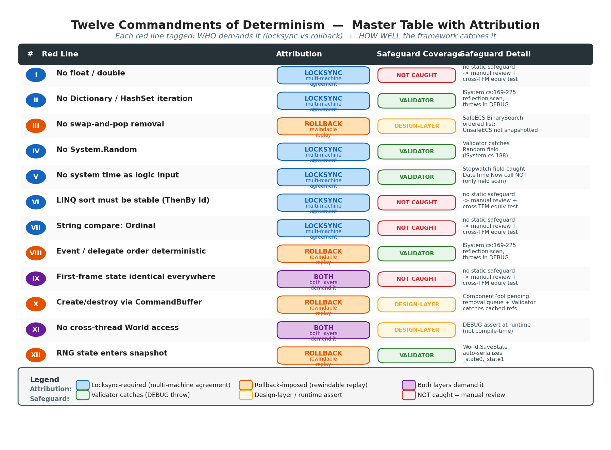
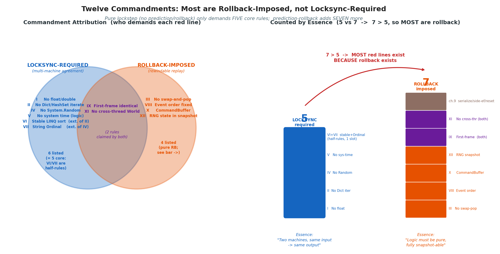
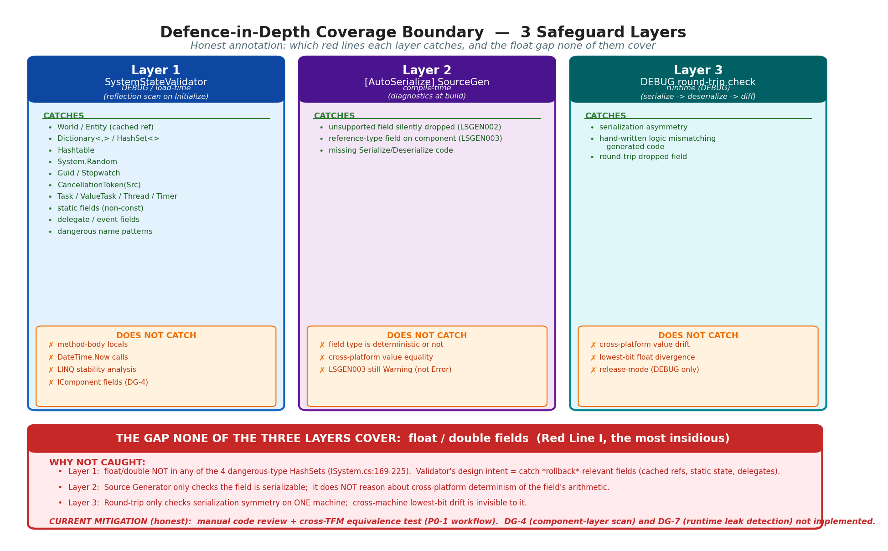
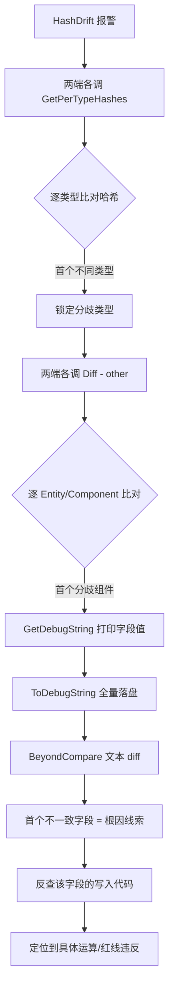

# 第 24 章 · 确定性红线清单:回滚强加的编程纪律

> **核心问题**:前面二十几章我们反复遇到"这个不能写、那个不能写"——不能用 `float`、不能遍历 `Dictionary`、不能 `swap-and-pop` 删除、不能用 `System.Random`……这些禁令散落在定点数、随机数、ECS、回滚各章。这一章把它们**系统化成一份清单**:帧同步到底有多少条红线?每条为什么是红线?以及最关键的——**为什么这些红线多数根本不是"帧同步的要求",而是"预测回滚反向强加的要求"**?以及,框架怎么把这些口头纪律做成**防呆体检**,把"靠人自觉"变成"编译/加载期硬约束"——同时诚实说明这套防呆的**覆盖边界**。

> **读完本章你会明白**:
> 1. 帧同步的"十二诫":每条配"为什么禁止 + 违反会怎样 + 正确做法",一张总表带走。
> 2. 一个反直觉的结论:**十二诫里大多数不是"为了帧同步"(为了多机一致),而是"为了预测回滚"(为了能倒带重演)**——这是第 9 章七条纪律的系统化扩展,本章会把"帧同步要求"和"回滚要求"两类红线分清楚。
> 3. 框架的防呆体系:`SystemStateValidator` 反射体检在 DEBUG 下拦截哪些危险字段、`[AllowUnsafeField]` 怎么做 Rust `unsafe` 式免责声明、`[AutoSerialize]` Source Generator 怎么编译期兜底。
> 4. **防呆的覆盖边界(诚实标注)**:`SystemStateValidator` 实际**不拦 `float`/`double` 字段**——它拦的是容器/异步/Random/World·Entity 引用/Guid/Stopwatch/委托/静态字段/危险命名。浮点泄露当前**无自动体检**(DG-4:组件层 float 体检也未做),靠人工 review。这是框架的诚实边界,不是缺陷藏匿。
> 5. desync 定位工具链:状态 `ToDebugString` 全量 Dump + `Diff` 字段级比对 + BeyondCompare 工作流,以及一个精度陷阱(DG-2:默认 `ToString` 只显示 4 位小数,最低位分歧会被掩盖)。

> **如果一读觉得太难**:先只记住三件事——① 帧同步有十几条"不能写"的红线,但它们分两类,一类是"多机要一致"(禁浮点/禁系统 Random/禁系统时间),一类是"要能倒带重演"(可序列化/保序删除/随机状态进快照),**后者是回滚强加的,单机不联网也得守**;② 框架有反射体检把一部分红线做成 DEBUG 硬拦截(容器/异步/Random),但**浮点不拦**,靠人;③ desync 了先 `ToDebugString` 两端各 Dump 一份,BeyondCompare 比文本,首个不一致字段就是根因线索。

---

## 〇、一句话点破

> **帧同步的确定性红线,绝大多数不是"帧同步"本身的要求,而是"预测回滚"反向强加的要求。"两台机器算出同一个结果"只需要五条(禁浮点/禁系统随机/禁系统时间/遍历序确定/首帧一致);"能倒带重演"却额外要求七条(状态全可序列化/无不可逆副作用/命令缓冲/保序删除/随机状态进快照/临时态重置/不缓存失效引用)。回滚机制的存在,把"写游戏逻辑"从随意的命令式风格,强制改造成一种"纯函数式 + 可快照"的纪律化风格。框架用反射体检(SourceStateValidator)、Source Generator、DEBUG 往返校验把一部分纪律做成硬约束,但诚实地说——浮点泄露这条最阴险的红线,体检当前拦不住,靠人工 review。**

这是结论。本章倒过来拆:先把十二诫一张表过完,再深挖"为什么多数是回滚强加的",再讲防呆体系(含覆盖边界),最后落到 desync 定位工具链。

---

## 一、前置衔接:从"抓 desync"到"怎么写代码才不 desync"

第 23 章讲的是**哈希校验双轨**——每帧给整个 World 算个"指纹",两端(或多端)互相比对,指纹对不上就报 desync。那章回答的是"**怎么发现**不同步"。但发现只是第一步,真正的工程价值在于"**怎么写代码才不不同步**"——也就是这一章。

打个比方(只此一处点睛,不做主线):第 23 章是"装烟雾报警器",这一章是"写消防安全规范"。报警器告诉你"着火了",但你得先有规范,知道"哪些东西不能堆在走廊""哪个插头不能超载",才能从根上不着火。这份"消防安全规范"就是本章的**确定性红线清单**。

这份清单不是凭空来的。它散落在前面二十几章里:

- 第 2 章(P1-02)讲过**禁浮点**(float 跨平台不一致)。
- 第 3 章(P1-03)讲过**跨 TFM 舍入要统一**(P0-1 血泪)。
- 第 4 章(P2-04)讲过**禁 `System.Random`**(用 LRandom,且状态要进快照)。
- 第 5 章(P2-05)讲过**禁遍历 Dictionary/HashSet** + **防呆体检体系**(SystemStateValidator)。
- 第 6 章(P2-06)讲过**组件池删除禁 swap-and-pop**。
- 第 9 章(P3-09)讲过**回滚反向施加的七条纪律**(本章精髓的雏形)。
- 第 12 章(P4-12)讲过**跨线程禁访问 World**。
- 第 22 章(P5-22)讲过**desync 字段级定位三件套**(分桶哈希 + Diff + 触发时全量落盘)。

这些散点,第 9 章已经做了一次"回滚视角的收束"(七条纪律),但那是**从回滚一个角度**收的。本章做的是**全书视角的系统化收束**——从确定性内核、回滚、网络、调试四个角度,把所有"不能写"的规则汇总、去重、归类,讲清每条的归属(是帧同步的要求,还是回滚的要求),以及框架把它们做成硬约束到什么程度。

> **钉死这件事(本章定位)**:第 23 章是"怎么发现 desync"(哈希双轨),本章是"怎么写代码才不 desync"(红线清单 + 防呆体检)。两章合起来,是第六篇"确定性调试"的完整闭环——发现 + 预防。

---

## 二、帧同步十二诫:总表

先把所有红线一次性列出来。下表是十二诫的总表,每条标了**归属**(帧同步要求 / 回滚要求 / 两者都要求)、**违反会怎样**、**正确做法**、**防呆体检覆盖情况**(诚实标注)。后面各节会挑重点逐条展开。

| # | 红线 | 归属 | 违反会怎样 | 正确做法 | 防呆体检 |
|---|------|------|-----------|---------|---------|
| 一 | 禁浮点 `float`/`double` | 帧同步 | 跨 CPU 舍入/FMA/扩展精度差最低位,逐位累积 desync | 用 `LFloat`(Q48.16 定点数) | **❌ 不拦**(靠人 review,DG-4 未做) |
| 二 | 禁遍历 `Dictionary`/`HashSet` | 帧同步 | 遍历顺序跨端/跨版本不一致,逻辑分叉 | 用 `List`/`SortedSet`/`SortedDictionary` | ✅ Validator 拦 |
| 三 | 禁 swap-and-pop 删除组件 | 回滚 | 回滚后重演的遍历顺序和原始执行不一致 | SafeECS 用 BinarySearch 保序标记删除 | 设计层(组件池实现) |
| 四 | 禁 `System.Random` | 帧同步 | 跨平台/跨版本算法不一,随机序列分叉 | 用 `LRandom`(Xorshift128+) | ✅ Validator 拦 |
| 五 | 禁系统时间 `DateTime.Now`/`Stopwatch` 当逻辑输入 | 帧同步 | 两端时间不同,逻辑结果不同 | 用 `Tick`/`frame` 驱动 | ✅ Validator 拦 Stopwatch |
| 六 | LINQ 排序可能非稳定 | 帧同步 | `OrderBy` 不保证稳定,相同 key 的元素顺序不定 | 加第二排序键(`ThenBy(Id)`)或自写稳定排序 | ❌ 不拦 |
| 七 | 字符串比较指定 `Ordinal` | 帧同步 | 默认比较规则跨平台可能不同 | `string.Compare(a, b, StringComparison.Ordinal)` | ❌ 不拦 |
| 八 | 事件/委托订阅顺序要确定 | 回滚 | 多播委托调用顺序未文档化保证 | 用 `List<Action>` 管理,显式顺序触发 | ✅ Validator 拦委托字段 |
| 九 | 首帧状态全端一致 | 两者 | 起始就 desync,后续每帧都错,哈希第一时间报 | 固定种子 + 固定初始实体 + 禁时间初始化 | ❌ 不拦(靠规范) |
| 十 | 实体创建/销毁走命令缓冲 | 回滚 | 遍历中增删破坏遍历顺序,回滚后重演顺序不一致 | 帧末按固定优先级执行 CommandBuffer | 设计层 + Validator 拦缓存引用 |
| 十一 | 跨线程禁访问 World | 两者 | World 单线程模型,跨线程并发改状态破坏确定性 | 网络回调先入跨线程命令队列,主线程消费 | DEBUG `CheckThreadAffinity` 断言 |
| 十二 | 随机数状态进快照 | 回滚 | 回滚恢复后随机序列错位,暴击/散射/AI 全错 | `World.SaveState` 含 `_state0, _state1` | 框架内置(World 序列化含) |



这张表先扫一眼建立印象。下面三件事值得专门拎出来说,因为它们最容易让人**记错归属**或**误以为有防呆**:

1. **"禁浮点"是帧同步要求,不是回滚要求**。一台机器上,浮点运算自己跟自己是一致的;浮点的问题纯粹是"跨 CPU/运行时不一致"。所以浮点红线服务的是"多机一致"。但正因为它是帧同步要求,**它的防呆覆盖最弱**——SystemStateValidator 当前不拦 `float` 字段(后面详述原因)。这是最值得警惕的 gap。

2. **"禁 swap-and-pop""随机状态进快照""命令缓冲""副作用门控"这几条,是回滚强加的,不是帧同步强加的**。哪怕你做的是一个**纯 Relay 模式、不做预测回滚**的帧同步游戏(每个客户端严格只算服务器广播的权威帧,本地不预测),这几条依然要守吗?——`swap-and-pop` 和随机状态进快照可以松(因为没有快照没有重演),但**遍历顺序确定**(它根上是帧同步要求)依然要守。这个区分极其重要,第三节会专门讲。

3. **"系统时间"这条最微妙**。系统时间当逻辑输入(比如"血量随真实时间恢复")是帧同步红线;但系统时间当**同步机制**(网络时钟、RTT 测量、心跳)是完全合法的——第 13 章 Jacobson 算法就是基于真实时间。读者要分清"时间用在逻辑层(禁)"和"时间用在同步层(可)"。

---

## 三、★核心洞察:红线多数是回滚强加的,不是帧同步强加的

这是本章最重要的认知,也是读者最容易记反的地方。我们把十二诫按"归属"重新切一刀。

### 3.1 真正的"帧同步要求":只有五条

如果把"预测回滚"整个拿掉——做一个**纯 Relay 模式**的帧同步游戏(服务器收集输入广播,客户端收到权威帧才算,本地绝不预测),那么需要守的红线只有五条:

- **一、禁浮点**(跨机算出不同结果)
- **二、禁遍历 Dictionary/HashSet**(跨机遍历顺序不同)
- **四、禁 System.Random**(跨机随机序列不同)
- **五、禁系统时间当逻辑输入**(跨机时间不同)
- **九、首帧状态全端一致**(起点就得分叉)
- (六、七是二、四的延伸,算半条)

这五条的本质都是一句话:**"两台机器对同一份输入,必须算出同一个输出。"** 这是"多机一致性"的纯粹要求,和回滚无关。哪怕你做最朴素的 lockstep(没有预测、没有回滚、网络一抖就卡),这五条也是底线。

> **钉死这件事(帧同步五条)**:纯帧同步(无预测回滚)只要求五条——禁浮点、禁无序容器遍历、禁系统随机、禁系统时间、首帧一致。本质是"两台机器算同一个题,必须算出同一个答案"。这五条是**多机一致性**的纯粹要求。

### 3.2 回滚额外强加的:七条

一旦你加上"预测回滚"(本地不等服务器先猜着算,猜错了倒带重演),就额外多出七条:

- **三、禁 swap-and-pop 删除**(回滚后重演的遍历顺序必须和原始执行一致)
- **八、事件/委托订阅顺序确定**(回滚重演时副作用触发顺序要一致)
- **十、实体创建/销毁走命令缓冲**(遍历中增删破坏重演一致性)
- **十二、随机数状态进快照**(回滚恢复后随机序列要对得上)
- (来自第 9 章的)逻辑状态全可序列化(不存 Transform 引用)
- (来自第 9 章的)副作用用 IsReplaying/IsPredicting 门控
- (来自第 9 章的)每帧临时状态重置

这七条的本质是另一句话:**"为了能倒带重演,游戏逻辑必须写成'状态全可快照、逻辑无不可逆副作用、遍历顺序确定'的纯函数式风格。"**

这个洞察来自第 9 章(P3-09)的"回滚七条纪律",那章已经讲透了。本章做的是把它**扩展并归并**进全书红线清单——P3-09 的七条纪律,加上散在各章的浮点/容器/随机/时间五条帧同步要求,合并去重,就是本章的十二诫。

> **承接第 9 章**:第 9 章是"回滚反向施加给代码库的七条纪律"的诞生地,讲了为什么回滚机制的存在会强制业务代码写成纯函数式 + 可快照风格。本章把这七条纪律**系统化扩展**——加上五条纯帧同步要求(浮点/容器/随机/时间/首帧),去重合并成十二诫,并讲清每条的归属和防呆覆盖。如果第 9 章是"为什么有这套纪律",本章是"纪律的完整清单 + 怎么用框架强制它"。



### 3.3 为什么这个区分重要

读者可能问:分这么清有什么用?反正都要守。

有用,而且极其有用,有三个理由:

**理由一:理解 why,而不是死记 what。** 如果你把十二诫当成一张要背的清单,迟早会记混。但如果你知道"哦,这五条是为了多机一致(所以浮点要禁,因为跨机算不一样),那七条是为了能倒带(所以随机状态要进快照,因为回滚要恢复到过去某一刻的随机状态)",每条红线的**为什么**就清楚了,记不住清单也能推出来。

**理由二:决定哪些可以松绑。** 如果你做的游戏**不需要预测回滚**(比如回合制棋类,纯权威模式,等服务器帧才动),那七条回滚纪律就可以大幅放松——你不需要严格的快照/重演、不需要副作用门控、不需要命令缓冲。但五条帧同步要求一条都不能松。反过来,如果你做的是格斗游戏(强预测回滚),那十二诫全要守,而且要守得极严。这个判断能力,是把帧同步"用对地方"的前提。

**理由三:解释框架的设计取舍。** 为什么 LockstepSdk 的 `SystemStateValidator` 拦 `Dictionary`/`Task`/`Random` 却**不拦 `float`**?一个深层原因是:Validator 的设计初衷是抓"回滚相关的危险字段"(缓存引用、静态状态、委托),而 `float` 是"帧同步要求"里的一条——它跨机不一致,但**在一台机器上回滚是自洽的**(回滚后重演,同一台机器上 `float` 算两次结果一样)。所以从"回滚视角"看,`float` 不是最优先要拦的;但从"帧同步视角"看,`float` 是头号杀手。这个视角错位,是 Validator 没拦 `float` 的一个历史原因(后面防呆体系节详述)。

> **钉死这件事(核心洞察)**:十二诫分两类——五条帧同步要求(多机一致,服务"两台机器算同一个答案"),七条回滚要求(能倒带重演,服务"游戏逻辑写成纯函数式 + 可快照")。这个区分让你理解每条的 why、决定哪些能松绑、解释框架为什么这么设计防呆。第 9 章的七条纪律是"回滚要求"那七条的雏形,本章是全书系统化收束。

---

## 四、十二诫逐条深讲(挑重点)

总表给了全貌,这一节挑最容易踩坑、最值得深讲的几条展开。已经在前面章节详讲过的(如浮点第 2 章、随机第 4 章、容器第 5 章),这里只做"红线视角"的收束和回扣,不重复技术原理。

### 4.1 第一诫:禁浮点——最阴险,且防呆最弱

**为什么是红线**:第 2 章详讲过。IEEE 754 浮点的中间精度(80 位扩展寄存器)、FMA 指令、舍入模式、溢出处理,跨 CPU/编译器/运行时会不同,导致两台机器算同一个算式差一个最低位。这个最低位逐帧累积,几千帧后坦克漂到完全不同的地方。

**违反会怎样**:`0.1 + 0.2` 在机器 A 上算出 `0.30000000000000004`,机器 B 上(不同 FPU/JIT)算出 `0.30000000000000002`(假设),第 N 帧判断"血量 > 0.3"时,一边触发一边不触发,从此 desync。而且这种 desync **极难定位**——两端的代码完全一样,只是"算出来"不一样。

**正确做法**:所有逻辑数值用 `LFloat`(Q48.16 定点数,64 位 long)。定点数本质是整数运算,跨平台位级一致。第 2、3 章详讲过 LFloat 的实现。

**★防呆覆盖(诚实标注)**:`SystemStateValidator` **不拦 `float`/`double` 字段**。这是本章必须诚实说明的覆盖边界——

我亲读了 `ISystem.cs` 里 `SystemStateValidator.Validate` 的源码(`ISystem.cs:230-318`),它检查的危险类型清单是:

- `DangerousTypes`:`World`、`Entity`(缓存引用回滚后失效)
- `NonDeterministicContainerDefinitions`:`Dictionary<,>`、`HashSet<>`、`Hashtable`(遍历序不确定)
- `NonDeterministicTypes`:`System.Random`、`Guid`、`Stopwatch`、`CancellationTokenSource`、`CancellationToken`
- `AsyncDangerousTypes`/`AsyncDangerousTypeDefinitions`:`Task`、`ValueTask`、`Thread`、`Timer`(异步/并行)
- 静态字段(除 `const` 和 `static readonly` 委托)
- 委托/事件字段(除 `static readonly` 委托)
- 危险命名模式(`lastframe`/`cachedEntity` 等)

**这份清单里没有 `float`/`double`**。也就是说,你在 System 里写 `private float _speed;`,Validator 不会报错。这是 P2-05 写作 agent 核实源码后确认的事实——锚点旧述"Validator 禁 float"是**任务预期**,不是源码实际。

为什么会这样?审计报告 `INDUSTRIAL_AUDIT_REMAINING.md` 的 **DG-4** 明确登记了这个 gap:

> DG-4【确定性护栏】体检未覆盖 IComponent 字段(只扫 System)。SystemStateValidator 在 DEBUG 下拦截 System 里的 `float`/`Dictionary`/`Task`/`Random`/静态字段。但 `IComponent` struct 字段被人误加 `float`/`double` **同样 desync 且更常见**(组件是装数据的),体检不覆盖组件。

(注:DG-4 描述里写"禁 float",但如上所述,源码实际连 System 层的 float 都没拦——这是文档与源码的细微出入,以源码为准。)

**所以现状是**:`float` 泄露这条**最阴险的红线**(因为它静默 desync 且跨平台),恰恰是防呆体检**覆盖最弱**的一条。System 层不拦,Component 层也不拦,完全靠人工 code review 和第 3 章那种"跨 TFM 等价性测试"在测试侧兜底。这是框架的诚实边界,写在这里不是藏缺陷,是让读者知道:**浮点这条红线,你必须自己守,框架帮不了你太多**。

DG-4 提议的改进是:把体检扩展到 `IComponent`(DEBUG 扫组件字段,禁 `float`/`double`/`Dictionary`/`HashSet`),或者用 Source Generator 在编译期对 `[AutoSerialize]` 组件发诊断(和已修复的 E-3 同机制)。这是个低风险增强,目前未做。

> **钉死这件事(第一诫 + 诚实边界)**:禁浮点是帧同步头号红线,但 `SystemStateValidator` **当前不拦 `float`/`double` 字段**(源码核实,ISystem.cs:230-318 的危险类型清单里没有浮点)。System 层不拦,Component 层也不拦(DG-4 未做)。浮点泄露靠人工 review + 跨 TFM 等价性测试兜底。这是框架的诚实边界——你写代码时,看到 `float`/`double` 在逻辑层,必须条件反射地警觉,框架不会替你抓。

### 4.2 第二诫:禁遍历 Dictionary/HashSet——帧同步要求,防呆强

**为什么是红线**:`Dictionary`/`HashSet` 的遍历顺序在 .NET 里**不保证确定**。它依赖哈希桶布局,而哈希桶布局受:① 哈希函数实现(.NET Core 和 .NET Framework 的 string.GetHashCode 算法不同);② 插入顺序(冲突链);③ 容量扩容时机;④ even 运行时版本(.NET 5 起字符串哈希有随机化 seed 防哈希碰撞攻击)。两台机器上,同一个 Dictionary 的遍历顺序可能不同。

**违反会怎样**:逻辑代码遍历 Dictionary 决定"先处理谁",两端处理顺序不同,累加顺序不同,浮点(如果混入了)或随机消耗顺序不同 → desync。即使没用浮点,遍历顺序不同也会让"谁先开炮""谁先被结算"分叉。

**正确做法**:
- Dictionary 只用于 `TryGetValue`/`ContainsKey` 查找(O(1)),**不遍历**。
- 要遍历的集合用 `List<T>`(按下标顺序)或 `SortedSet<T>`/`SortedDictionary<K,V>`(按 Key 排序)。
- 如果一定要"先收集再排序处理",收集用 Dictionary,处理前转成 `OrderBy` 排序后的 List。

`docs/ARCHITECTURE.md` 第 850-868 行明确写了这条规范,并给了正反例。

**防呆覆盖**:✅ `SystemStateValidator` 的 `NonDeterministicContainerDefinitions` 拦 `Dictionary<,>`/`HashSet<>`/`Hashtable`(ISystem.cs:178-183)。你在 System 里写 `private Dictionary<int, Entity> _cache;`,DEBUG 下 Initialize 时直接抛异常。这条防呆是覆盖得最好的红线之一。

但有边界:Validator 只扫 System 的字段,**不扫 System 方法体内的局部变量**。如果你在 Update 里写 `var dict = new Dictionary<int,int>(); foreach(...)`,Validator 抓不住——这是 DG-7 登记的"运行时泄露检测"(高标准项,业界少见,框架暂不做)。所以这条防呆是"字段级拦截",方法体内的临时 Dictionary 还得靠人。

> **钉死这件事(第二诫)**:Dictionary/HashSet 遍历序不确定是帧同步红线。正确做法是 Dictionary 只查找不遍历,要遍历用 List/SortedSet。防呆:Validator 拦 System 字段级的 Dictionary/HashSet/Hashtable,但不拦方法体内的临时局部变量(DG-7 未做)。

### 4.3 第三诫:禁 swap-and-pop 删除——回滚强加的

**为什么是红线**:这条是第 6 章(P2-06)的招牌内容,第 9 章(P3-09)从回滚角度又强调过。`swap-and-pop`(把最后一个元素搬到被删位置,缩短长度)是普通 ECS 性能优化的标准手法(Sparse Set 就靠它 O(1) 删除),但它会**改变剩余元素的遍历顺序**。

**违反会怎样**:假设原始执行时,组件池顺序是 [A, B, C, D],删除 B 后 swap-and-pop 变成 [A, D, C]。这一帧后续遍历顺序就是 A, D, C。但如果这一帧被回滚重演,重演时如果删除发生在遍历的不同时机(或者重演前的快照点不同),顺序可能又是 [A, C, D]——遍历顺序不一致,逻辑结果不一致,desync。

**正确做法**:SafeECS 的 `ComponentPool<T>` 用"**标记 + 延迟回收 + BinarySearch 保序插入**":Remove 立即 `_active[entityId] = false` + Reset(标记),真正的从 `_activeEntities` 列表移除,要等遍历结束后 `FlushPendingRemovals`,而且 `_activeEntities` 用 BinarySearch 维护**有序**(按 entityId),保证遍历顺序稳定。

**归属**:这条是**回滚强加的**,不是帧同步强加的。为什么?因为 swap-and-pop 破坏的是"**回滚后重演的遍历顺序一致性**"——它要求"重演某一帧时,那一帧开始时的组件池顺序,必须和原始执行那一帧开始时的顺序一模一样"。如果是纯 Relay 模式(无回滚),每帧都从服务器权威帧开始算,不存在"重演",swap-and-pop 的影响小得多(虽然遍历序仍要确定,但那是第二诫的范畴)。

**防呆覆盖**:这条防呆不在 Validator(Validator 不看组件池实现),而在**组件池本身的设计**——SafeECS 天生保序,UnsafeECS 才 swap-and-pop。框架默认用 SafeECS(`World` 只接 SafeECS),所以默认就是守规矩的。UnsafeECS 是"高级逃生舱",`World.SaveState` 都没接它(第 6 章诚实标注)。

> **承接第 6 章**:组件池删除保序(BinarySearch 维护有序)vs swap-and-pop 的取舍,第 6 章招牌章详讲。这里只点破归属——它是**回滚强加的**(为了保证重演时遍历顺序一致),不是纯帧同步要求。SafeECS 默认守这条,UnsafeECS 不守但未接入快照。

### 4.4 第四诫:禁 System.Random——帧同步要求,防呆强

**为什么是红线**:第 4 章(P2-04)详讲。`System.Random` 的算法在 .NET 不同版本之间**不一样**(.NET Framework 用 Knuth 减法生成器,.NET Core 2.0+ 用 xshiftpulsemixed),而且即便算法相同,种子的展开方式也可能不同。两台机器上一个用 `new Random(123)` 一个用 `new Random(123)`,**序列可能完全不同**。

**违反会怎样**:暴击判定、散射角度、AI 抖动、道具掉落……所有用随机的逻辑,两端算出不同的随机数,局面立刻分叉。这是 desync 最直接的来源之一。

**正确做法**:用 `LRandom`(Xorshift128+,Vigna 算法),纯整数运算,跨平台位级一致。第 4 章详讲过实现。

**防呆覆盖**:✅ Validator 的 `NonDeterministicTypes` 拦 `System.Random`(ISystem.cs:188-195)。写 `private Random _rng;` 直接报错。

**但有个延伸红线(第十二诫)**:`LRandom` 的状态(两个 ulong `_state0, _state1`)**必须进快照**。这条是回滚强加的——回滚恢复到过去某一刻,随机状态也要恢复到那一刻,否则后续随机序列错位。`World.SaveState` 格式里第 4 段就是 `_state0 + _state1`(World.cs:829-1115),框架内置,不用业务操心。但如果你**自己 new 了一个 LRandom 实例**(不是用全局的),那个实例的状态不会自动进 World 快照,你得自己序列化——这是新手坑。第 4 章讲过这个坑。

> **钉死这件事(第四诫 + 第十二诫)**:禁 System.Random,用 LRandom。防呆:Validator 拦 System.Random 字段。延伸:随机状态进快照(World 内置 LRandom 状态,但自建实例要自己序列化)——这条是回滚强加的。

### 4.5 第五诫:禁系统时间当逻辑输入——帧同步要求(但有微妙边界)

**为什么是红线**:`DateTime.Now`/`Stopwatch.ElapsedMilliseconds` 读的是本机真实时间。两台机器时间不同(就算都同步了 NTP,也有毫秒级误差;何况 NTP 还会回跳)。"血量每秒恢复 1 点"这种逻辑,如果用 `DateTime.Now` 算"过了几秒",两端算出来不一样 → desync。

**违反会怎样**:任何依赖真实时间的逻辑(血量恢复、技能冷却、buff 持续时间)两端不一致。

**正确做法**:所有逻辑时间用 **Tick**(逻辑帧号)。帧同步固定 20Hz,一个 tick = 50ms 逻辑时间。"血量每 20 tick 恢复 1 点"这样写,两端 tick 同步推进,结果一致。逻辑时间是**离散的、由帧号驱动的**,和真实时间无关。

**★微妙边界(必须讲清)**:系统时间在**同步层**是完全合法的!第 13 章(P4-13)的网络时钟 Jacobson 算法,就是基于真实 RTT 测量(用 `Stopwatch` 测往返延迟);第 14 章(P4-14)的服务器节拍器用 `Stopwatch` 驱动固定 20Hz 推进;第 19 章(P5-19)的心跳超时用真实时间。这些都不是 desync 源——因为它们用在"**怎么把帧同步起来**",不用在"**算游戏逻辑**"。

读者一定要分清:
- **逻辑层用时间(禁)**:游戏规则依赖真实时间 → desync。
- **同步层用时间(可)**:网络对账、节拍、RTT、重连超时 → 合法,本来就该用真实时间。

**防呆覆盖**:Validator 拦 `Stopwatch`(`NonDeterministicTypes`,ISystem.cs:188-195)。但**不拦 `DateTime.Now` 的方法调用**(那不是字段,Validator 只扫字段)。所以如果你在 Update 里写 `var sec = DateTime.Now.Second;`,Validator 抓不住——这又回到 DG-7(运行时泄露检测,未做)。这条防呆是半覆盖:拦 Stopwatch 字段,不拦 DateTime 调用。

> **钉死这件事(第五诫 + 边界)**:系统时间当逻辑输入(血量恢复/冷却)是 desync 源,逻辑时间用 Tick 驱动。但系统时间在同步层(网络时钟/节拍器/心跳)完全合法——第 13、14 章就是基于真实时间。防呆:Validator 拦 Stopwatch 字段,但不拦 DateTime.Now 调用(方法体内调用靠人,DG-7 未做)。

### 4.6 第六诫:LINQ 排序可能非稳定——容易忽略的暗坑

**为什么是红线**:`OrderBy` 不保证**稳定排序**。稳定排序指"相同 key 的元素,保持它们在原序列里的相对顺序"。如果两个实体 Priority 都是 5,OrderBy 之后它们的相对顺序可能是 [A, B] 也可能是 [B, A]——.NET 的 OrderBy 实现是稳定的(从 .NET 4.0 起),但这**不是 C# 语言规范保证的**,而且其他运行时(Mono、Unity 的 .NET 子集)可能不同。跨运行时分叉风险。

**违反会怎样**:相同优先级的实体处理顺序跨端不一致,逻辑结果分叉。

**正确做法**:加第二排序键,保证全序(`ThenBy(e => e.Id)`,Id 唯一)。或者自写稳定排序。`docs/ARCHITECTURE.md:927-936` 给了正反例。

**归属**:这条是帧同步要求(跨端顺序一致)。**防呆覆盖**:❌ 不拦。Validator 不分析 LINQ 表达式。这条纯靠规范。

**回扣第 5 章**:第 5 章(P2-05)讲过 `World.SortSystemsStable`——System 执行顺序用**手写插入排序**(稳定),注释明说"List.Sort 非稳定会破坏确定性"。这就是第六诫在框架内部的落地:框架自己不用 LINQ OrderBy 排 System,而是手写稳定排序。业务代码如果用 LINQ 排序实体,也要守这条。

### 4.7 第七诫:字符串比较指定 Ordinal——跨平台一致

**为什么是红线**:`string.Compare(a, b)` 不指定 `StringComparison` 时,用**当前文化**(culture-sensitive)规则比较。不同平台/区域设置的 culture 规则不同(比如土耳其语里 'i' 和 'I' 的大小写关系和英语不同),可能导致排序/比较结果跨端不一致。

**违反会怎样**:如果逻辑里有"按玩家名排序"或"字符串相等判断",跨 culture 可能结果不同 → desync。

**正确做法**:所有逻辑层的字符串比较显式指定 `StringComparison.Ordinal`(按 Unicode 码点逐字节比,跨平台完全一致)。`docs/ARCHITECTURE.md:1001-1008` 给了正反例。

**归属**:帧同步要求。**防呆覆盖**:❌ 不拦。这条纯靠规范。框架内部 `GetPerTypeHashes` 排序就用了 `StringComparison.Ordinal`(World.cs:1342),是正面示范。

### 4.8 第八诫:事件/委托订阅顺序要确定——回滚强加的

**为什么是红线**:C# 的 `event`/多播委托(`Action`/`Func`)的调用顺序,**C# 语言规范没有保证**(虽然实际上通常是订阅顺序,但这是实现细节,未文档化保证)。如果你的逻辑依赖"先触发 OnDamage 再触发 OnDeath"这种顺序,而订阅顺序跨端或跨运行时不同,逻辑结果可能分叉。

回滚视角更尖锐:回滚重演某一帧时,如果那一帧的事件触发顺序和原始执行不一致,重演结果就错。

**违反会怎样**:事件触发的副作用(逻辑副作用,不是音效那种)顺序不一致,状态变更顺序不一致 → desync。

**正确做法**:不要用 `event`/多播委托做**逻辑层**的事件总线。改用 `List<Action>` 显式管理订阅,按 List 顺序触发。`docs/ARCHITECTURE.md:938-950` 给了正反例。

**归属**:这条主要服务**回滚一致性**(重演时事件顺序要和原始一致)。纯帧同步视角,事件顺序只要跨端一致就行(而 .NET 多播实际就是订阅序),但回滚要求"严格确定",所以用 List 显式管理更稳。

**防呆覆盖**:✅ Validator 拦委托/事件字段(`Delegate.IsAssignableFrom`,ISystem.cs:265-268)。例外:`static readonly` 委托是安全的(避免闭包分配的优化模式,指向静态方法),不拦。

### 4.9 第九诫:首帧状态全端一致——最底层,且哈希第一时间报

**为什么是红线**:游戏开始时(第一帧之前),所有客户端的状态必须**完全一致**。这是第 9 章七条纪律的最后一条,也是本章的第九诫。看似 trivial(大家加载同一张地图、同样的初始配置,状态当然一样),但实测是最常见的 desync 来源之一,而且**起起点就错的话,后续每帧都错**,哈希对账第一时间就报。

**常见违反**:
- 浮点初始化:`position = new LFloat(0.1f)`,0.1f 跨平台不一致。
- 容器初始顺序:某个 List 的初始填充顺序依赖 Dictionary 遍历(第二诫)。
- 时间初始化:`DateTime.Now` 算初始 buff 持续时间(第五诫)。
- 随机初始化:`new Random()` 算初始位置(第四诫)。

**正确做法**:初始化用固定种子 + 固定参数,严禁任何"本机相关"输入。`docs/ARCHITECTURE.md:952-963` 给了示范——`CreateTank(playerId: 0, position: new LVector2(-8, 0))` 这种全常量初始化。

**归属**:这条两者都要求(起点一致是多机一致的前提;也是回滚到 tick=-1 的基准)。**防呆覆盖**:❌ 不拦(初始化代码太业务,框架没法静态分析)。

**框架兜底**:`LockstepController.SaveInitialState`(LockstepController.cs:295-299)在第一帧执行前存初始状态 + 初始哈希。首帧哈希进哈希对账,如果首帧就对不上,第一时间报,且问题指向初始化代码(不在同步逻辑)。

### 4.10 第十诫:实体创建/销毁走命令缓冲——回滚强加的

**为什么是红线**:第 9 章纪律三详讲。遍历中直接 `world.DestroyEntity(entity)` 会破坏遍历(集合被修改异常,或跳过元素)。更严重的是,在帧同步 + 回滚里,它破坏**重演时的遍历顺序一致性**。

**违反会怎样**:遍历到销毁那一步的时机跨端不同(尤其 swap-and-pop 删除会移动元素),后续遍历顺序不一致 → desync;回滚重演时顺序和原始执行不一致 → desync。

**正确做法**:用 CommandBuffer,遍历中只"记录要创建/销毁什么",帧末按固定优先级顺序执行。`docs/ARCHITECTURE.md:977-999` 给了 CommandBuffer 示范。SafeECS 的 `ComponentPool` 用 `_pendingRemovals` 队列实现延迟回收,就是这个思路的框架级落地。

**归属**:回滚强加的(重演顺序一致)。**防呆覆盖**:设计层(ComponentPool 延迟回收)+ Validator 拦缓存 World/Entity 引用(防止你绕过 World 直接操作)。

### 4.11 第十一诫:跨线程禁访问 World——两者都要求

**为什么是红线**:第 12 章(P4-12)详讲。World 是单线程模型(第 22 章移除了 `lock` 和 `[ThreadStatic]`,改纯单线程)。跨线程并发改 World 状态,会破坏确定性(执行顺序不可预测)。

**违反会怎样**:网络回调线程直接改 World,和主线程的 Tick 逻辑交错,执行顺序混乱 → desync;而且这种 desync 是**非确定性**的(每次跑都不一样),极难复现。

**正确做法**:网络回调先入**跨线程命令队列**(`ConcurrentQueue`),主线程 Update 顶部消费(`LockstepDriver.cs:495`)。所有对 World 的修改都在主线程单线程发生。DEBUG 下 `CheckThreadAffinity` 断言(`Controller`)兜底。

**归属**:这条两者都要求——单机确定性(执行序确定)和多机一致性(跨端执行序一致)都要。**防呆覆盖**:DEBUG 断言(运行时,非编译期)。

### 4.12 第十二诫:随机数状态进快照——回滚强加的

已在第四诫延伸讲过。一句话:回滚恢复到过去某一刻,随机状态也要恢复。`World.SaveState` 内置(第 4 段就是 `_state0, _state1`),全局 LRandom 自动覆盖;自建 LRandom 实例要自己序列化(新手坑)。

---

## 五、防呆体系:把口头纪律变成硬约束(含诚实边界)

前一节讲了"十二条红线 + 防呆覆盖情况"。这一节系统讲**防呆体系本身**——框架用什么手段把"靠人自觉的纪律"变成"编译/加载期的硬约束",以及这套体系的**覆盖边界**(诚实标注哪些拦、哪些不拦)。

防呆体系有三层,从硬到软:

### 5.1 第一层:SystemStateValidator 反射体检(DEBUG 加载期)

这是最重的一层。`SystemStateValidator`(ISystem.cs:164-318)在 DEBUG 模式下,每个 System 的 `Initialize` 时(`SystemBase.ValidateSystemState`,ISystem.cs:142-158)反射扫描该 System 类的所有字段,发现危险字段直接抛 `InvalidOperationException`(不只是警告,是 throw,防止开发者忽略)。

**它实际拦什么(源码核实,ISystem.cs:169-225)**:

| 类别 | 拦截清单 | 源码位置 |
|------|---------|---------|
| 危险类型(缓存引用) | `World`、`Entity` | DangerousTypes, :169-173 |
| 非确定性容器 | `Dictionary<,>`、`HashSet<>`、`Hashtable` | NonDeterministicContainerDefinitions, :178-183 |
| 非确定性类型 | `System.Random`、`Guid`、`Stopwatch`、`CancellationTokenSource`、`CancellationToken` | NonDeterministicTypes, :188-195 |
| 异步/并行(非泛型) | `Task`、`ValueTask`、`Thread`、`Timer` | AsyncDangerousTypes, :209-215 |
| 异步/并行(泛型定义) | `Task<>`、`ValueTask<>` | AsyncDangerousTypeDefinitions, :200-204 |
| 静态字段 | 所有 static 非 const 非(static readonly 委托) | :257-261 |
| 委托/事件 | 所有 `Delegate` 子类(除 static readonly 委托) | :265-268 |
| 危险命名 | `lastframe`/`previousframe`/`cachedframe`/`lastEntity`/`cachedEntity` 等 | DangerousNamePatterns, :220-225 |

**它不拦什么(诚实标注)**:

- **❌ `float`/`double` 字段**:不在任何危险清单里。这是最大的覆盖盲区(第一诫详述)。
- **❌ 方法体内的局部变量/调用**:Validator 只扫字段,不分析方法体。`Update` 里写 `var r = new Random().Next();` 或 `DateTime.Now.Second`,Validator 抓不到(DG-7 登记的运行时泄露检测,未做)。
- **❌ LINQ 表达式**:不分析 `OrderBy` 是否稳定(第六诫)。
- **❌ IComponent 字段**:Validator 只扫 System,不扫组件。组件层 float/Dictionary 泄露是 DG-4 登记的 gap。

**`[AllowUnsafeField]`——Rust `unsafe` 式免责声明**(ISystem.cs:6-35):

有些场景,你确实需要在 System 里持有一个 Dictionary(比如"收集去重,最终排序后处理")。这时用 `[AllowUnsafeField("reason")]` 标注该字段,Validator 跳过它:

```csharp
// ISystem.cs:6-35 文档示例
public class MySystem : SystemBase {
    [AllowUnsafeField("用于去重, 最终会排序后销毁")]
    private readonly HashSet<int> _entitiesToRemove = new();
}
```

这个设计借鉴 Rust 的 `unsafe`——不禁止你做危险的事,但**强迫你显式声明"我知道这危险,我保证安全"**。声明留下了 reason 字符串,code review 时一眼能扫到所有"已知危险点"。这是个成熟的工程哲学:把危险集中到显式声明处,而不是撒手不管。

> **钉死这件事(防呆第一层)**:`SystemStateValidator` DEBUG 反射体检,拦截 World/Entity 引用、Dictionary/HashSet/Hashtable、Random/Guid/Stopwatch/CancellationToken、Task/Thread/Timer、静态字段、委托事件、危险命名——抛异常(非警告)。**诚实边界:不拦 float/double,不扫方法体,不扫 IComponent**。`[AllowUnsafeField]` 做 Rust unsafe 式显式免责。

### 5.2 第二层:`[AutoSerialize]` Source Generator(编译期)

这是编译期的防呆,比 DEBUG 反射更早(编译时而非运行时)。第 5 章(P2-05)讲过。

给组件 struct 标 `[AutoSerialize]`,Source Generator 自动生成 `Serialize`/`Deserialize` 代码(免手写)。但早期版本有个阴险 bug:**生成器对不支持的字段(如 `List<int>`、引用类型)静默丢弃,不报错**——组件"成功"往返但该字段丢失,回滚恢复默认值,两端无声漂移(审计 E-3,轮次 8 已修)。

修复后(E-3,轮次 8):生成器对不支持字段调 `context.ReportDiagnostic(LSGEN002)`(字段名+类型),编译期警告。引用类型字段(除已特例的 string/byte[])发 LSGEN003。

这层防呆服务的是**序列化正确性**(纪律一:状态全可序列化)——如果生成器静默丢字段,你以为序列化了实际没存,回滚就错。E-3 修复让"忘序列化某个字段"从静默 desync 变成编译警告。

**但仍有 gap**:LSGEN003(引用类型)目前降级为 Warning 而非 Error(遵循"默认=现状、不把原本能跑变崩溃"原则),待确认所有业务组件无引用类型字段后再单独启用为 Error。这是渐进式收紧的工程智慧。

### 5.3 第三层:DEBUG 往返校验(运行时)

第 5 章(P2-05)讲过。`[AutoSerialize]` 组件在 DEBUG 下,做"序列化 → 反序列化 → 比对"往返测试,如果生成的代码和你手写的逻辑不一致(或字段漏了),往返校验失败。这层防呆服务的是"序列化代码和实际状态一致"。

三层防呆叠加,覆盖了相当一部分红线——但**浮点这条最阴险的,三层都拦不住**(Validator 不拦字段,Generator 不管字段类型是否确定,往返校验只校序列化对称性不校跨平台一致)。这是必须诚实告诉读者的。



> **钉死这件事(防呆三层 + 诚实边界)**:三层防呆——Validator 反射体检(加载期)、Source Generator 编译期诊断、DEBUG 往返校验。覆盖了容器/异步/Random/引用/静态/委托/序列化对称性。**诚实边界:三层都不拦 float/double**(DG-4 组件层体检未做)。浮点泄露是防呆覆盖最弱的红线,必须靠人工 review + 跨 TFM 等价性测试。

---

## 六、调试工具链:desync 了怎么定位首个不一致字段

红线清单是"预防",但预防不可能 100%——desync 总会发生(尤其浮点这种防呆拦不住的)。这一节讲**定位工具链**:desync 报警后,怎么找到"是哪一行代码、哪一个字段的最低位不一样"。

这个工具链是第 22 章(P5-22)讲的"desync 字段级定位三件套"的实操工作流,这里从"红线视角"再过一遍。

### 6.1 三件套:分桶哈希 + Diff + 全量落盘

**第一件:分桶增量哈希(`GetPerTypeHashes`)**
第 23 章讲哈希双轨时提过。哈希不只是"整个 World 一个指纹",还能**按组件类型分桶**——`World.GetPerTypeHashes()`(World.cs:1334)返回 `[(TypeName, Hash)]` 列表,每个组件类型一个哈希。desync 报警后,两端各调一次,逐类型比对,**首个不同的类型**就是分歧所在类型。这把"World 级 desync"缩小到"类型级 desync"。

**第二件:实体级 + 字段级 Diff(`Diff` + `GetDebugString`)**
锁定类型后,`World.Diff(other)`(World.cs:1351)逐 Entity 逐 Component 比对哈希,输出结构化差异:

```
=== World Diff (this vs other) ===
[COMPONENT] Entity 7 TankComponent: this=0xA1B2C3D4 other=0xE5F6A7B8
    this:  TankComponent { Position=(...), HP=..., ... }
    other: TankComponent { Position=(...), HP=..., ... }
```

(World.cs:1399-1403,分歧组件打印两端 `GetDebugString`,即组件的 `ToString()`。)

**首个分歧字段**就是根因线索。

**第三件:触发时全量落盘**
desync 是偶发的(可能跑几千帧才出现一次),不能靠实时调试。`OnHashDrift` 事件触发时(第 23 章,World.cs:189-198),自动把两端当时的完整 World 状态(`ToDebugString()`)落盘,事后比对。

### 6.2 BeyondCompare 工作流

把两端的 `ToDebugString()` 输出各存一个文本文件,用 BeyondCompare(或任何文本 diff 工具)比对。首个不同的行,就是首个不一致的字段。这个工作流极其朴素,但有效——因为 `ToDebugString()` 是**按确定性顺序输出的**(`UpdateSortedPoolCache` 保证池排序,World.cs:1302-1303),所以两端的文本结构完全对齐,diff 工具能精确指出哪一行不同。



### 6.3 ★精度陷阱(DG-2):F4 可能掩盖最低位分歧

这里必须诚实讲一个精度陷阱,它是审计 DG-2 登记的 gap。

`LFloat.ToString()` 默认格式是 `$"{ToFloat():F4}"`(LFloat.cs:251)——只显示 4 位小数。但 LFloat 精度是 1/65536 ≈ 5 位小数。**只差一个最低位的 desync(最常见的那种,比如跨 TFM 舍入分叉),在 F4 文本里看起来完全一样**!

我在写本章时核了源码:`World.GetDebugString` 调 `component.ToString()`(World.cs:119),而组件的 `ToString()`(如果是自动生成或默认 struct ToString)很可能内部用 `LFloat.ToString()` = F4。这意味着 BeyondCompare 工作流**可能漏检最低位分歧**——你看到两端文本一模一样,但哈希就是不一样,百思不得其解。

框架有 `LFloat.ToStringRaw()`(LFloat.cs:252)输出完整 RawValue(精确),`LVector2.ToStringRaw()` 也有。DG-2 提议:所有诊断输出统一改用 `ToStringRaw()` 或直接输出 RawValue,不用 F4。这是个极低风险修复(仅诊断格式,不影响逻辑/哈希),但目前**未做**(审计 DG-2 标注"未最终核实诊断走 F4 还是 Raw,若走 F4 是缺陷")。

**实操建议**:如果你在做 desync 定位,怀疑是最低位分歧(浮点/跨 TFM),**别依赖默认 ToString 输出**,手动让两端打印 `RawValue`(整数值,精确),再比对。或者在组件 ToString 里临时改成用 `ToStringRaw()`。这个坑不知道的话,能让你在"文本一样为啥还 desync"上卡几个小时。

> **钉死这件事(调试工具链 + DG-2 陷阱)**:desync 定位三件套——GetPerTypeHashes(类型级)+ Diff(字段级)+ ToDebugString 落盘 BeyondCompare(全量)。**精度陷阱(DG-2)**:LFloat.ToString 默认 F4 只显示 4 位小数,可能掩盖最低位分歧。怀疑最低位 desync 时,手动打印 RawValue 或用 ToStringRaw()。这个陷阱是框架未完善的 gap(诚实标注)。

---

## 七、技巧精解:防呆体检的设计哲学与覆盖边界

这一节把本章最值得带走的两个"设计技巧"单独拆透。

### 7.1 技巧一:把"危险类型清单"做成可演化数据结构,而非硬编码 if-else

`SystemStateValidator` 的危险类型不是一串 `if (fieldType == typeof(Dictionary<...>))` 硬编码,而是**四个 `HashSet<Type>` 数据结构**(DangerousTypes / NonDeterministicContainerDefinitions / NonDeterministicTypes / AsyncDangerousTypeDefinitions)+ **一个 `string[]` 命名模式数组**(DangerousNamePatterns)。要加一条新红线,往对应集合加一个 Type 就行,核心扫描循环(`Validate` 方法,ISystem.cs:230-318)不动。

这个设计的好处是**可演化**——框架升级时,发现新的危险类型(比如未来 .NET 引入某个非确定性 API),加一行 `typeof(NewBadType)` 就生效,不用改扫描逻辑。而且四个集合**按语义分类**(容器/异步/随机/引用),每条违规的报错信息能精准说"你是 Dictionary 遍历序问题"还是"你是异步并发问题",帮开发者快速定位是违反了哪条红线。

> **反面对比**:如果用一长串 `if-else` 硬编码,每加一条红线就要改扫描方法体,而且报错信息难分类。数据结构驱动的危险清单是体检系统的成熟范式(类比 Clippy/TSLint 的 rule 配置)。

### 7.2 技巧二:`[AllowUnsafeField]`——危险显式化,而非一刀切禁止

第二个技巧是 `[AllowUnsafeField]`(ISystem.cs:6-35)。Validator 发现危险字段默认抛异常,但有些场景你确实需要持有一个 Dictionary(收集去重,最终排序处理)。一刀切禁止会让你绕过体检(比如把 Dictionary 藏到方法体局部变量里,反而更难抓)。

`[AllowUnsafeField("reason")]` 的设计是:**允许你做危险的事,但强迫你显式声明"我知道这危险,我保证安全",并留下 reason 字符串**。这样:
- 体检不误杀合理用例。
- 所有"已知危险点"集中在一处(code review 扫 `[AllowUnsafeField]` 一搜一个准)。
- reason 字符串让 reviewer 知道"为什么开发者认为这安全",便于审计。

这个哲学借鉴 Rust 的 `unsafe` 块——Rust 不禁止你写不安全代码,但要求你用 `unsafe { }` 显式框起来,把危险集中到可见处。这是处理"规则有例外"的成熟工程范式,比"一刀切禁止导致绕过"或"完全放任"都好。

> **钉死这件事(技巧)**:① 危险类型清单做成可演化数据结构(四个 HashSet + 一个 string 数组),加红线只改数据不改逻辑,且报错按语义分类;② `[AllowUnsafeField]` 借鉴 Rust unsafe,把危险显式化而非一刀切禁止,让合理用例不被误杀、危险点集中可见。

---

## 八、章末小结

### 回扣主线

本章服务全书主线"确定性",属于**调试**篇(第六篇)。承接第 23 章(哈希校验抓 desync),本章讲"**怎么写代码才不 desync**"——把散在全书二十几章的"不能写"系统化成**十二诫总表**,讲清每条的归属(帧同步要求 vs 回滚要求)、违反会怎样、正确做法、防呆覆盖。

本章的核心洞察是:**十二诫里,只有五条是纯帧同步要求(多机一致),七条是预测回滚反向强加的(能倒带重演)**。这个区分让你理解每条的 why(而不是死记 what)、决定哪些能松绑(不做预测回滚可放松七条)、解释框架为什么这么设计防呆。第 9 章的"回滚七条纪律"是这七条回滚要求的雏形,本章是全书视角的系统化收束。

本章还系统讲了**防呆体系三层**(Validator 反射体检 + Source Generator 编译期 + DEBUG 往返校验),并**诚实标注覆盖边界**:三层都不拦 `float`/`double`(DG-4 组件层体检未做),方法体内调用不拦(DG-7 运行时泄露未做),LINQ 稳定性不拦。最后讲了 **desync 定位工具链**(分桶哈希 + Diff + BeyondCompare),以及一个精度陷阱(DG-2:F4 格式可能掩盖最低位分歧)。

### 五个为什么

1. **为什么帧同步有这么多"不能写"的红线?**——因为帧同步要求"两台机器对同一份输入算出同一个输出",任何跨平台不一致的运算(浮点舍入/容器遍历序/随机算法/系统时间)都会让两端分叉;加上预测回滚要求"能倒带重演",又额外强制逻辑写成纯函数式 + 可快照风格。两类要求叠加,就是十二诫。

2. **为什么说"红线多数是回滚强加的,不是帧同步强加的"?**——纯帧同步(无预测回滚)只要求五条(禁浮点/禁无序容器/禁系统随机/禁系统时间/首帧一致),本质是"多机一致"。预测回滚额外要求七条(禁 swap-and-pop/事件序确定/命令缓冲/随机状态进快照/状态全可序列化/副作用门控/临时态重置),本质是"能倒带重演"。七条 > 五条,所以说"多数是回滚强加的"。

3. **为什么 `SystemStateValidator` 不拦 `float`/`double`?**——源码核实(ISystem.cs:169-225 的四个危险类型清单里没有浮点)。深层原因:Validator 设计初衷是抓"回滚相关危险字段"(缓存引用/静态状态/委托),而 float 跨机不一致但在单机上回滚自洽,从回滚视角看不是最优先;从帧同步视角看 float 是头号杀手,但 Validator 的视角错位导致没拦。这是框架的诚实边界(DG-4 登记),浮点靠人工 review + 跨 TFM 等价性测试兜底。

4. **为什么 desync 定位要用文本 diff(BeyondCompare)而不是只看哈希?**——哈希只告诉你"不一致",不告诉你"哪里不一致"。文本 diff(两端 ToDebugString 比对)能精确到"哪个 Entity 的哪个 Component 的哪个字段不同",首个不一致字段就是根因线索。而且 ToDebugString 按确定性顺序输出,文本结构对齐,diff 工具能精准指行。

5. **为什么 `[AllowUnsafeField]` 设计成"显式声明"而不是"一刀切禁止"?**——一刀切禁止会导致开发者绕过(把危险藏到方法体局部变量,更难抓)。显式声明(借鉴 Rust unsafe)允许合理用例,但强迫开发者留下 reason 字符串,把危险集中到可见处,code review 一搜一个准。这是处理"规则有例外"的成熟工程哲学。

### 想继续深入往哪钻

- 想搞懂浮点为什么跨平台不一致(第一诫的技术原理):第 2 章(P1-02 定点数 LFloat)。
- 想搞懂跨 TFM 舍入分叉(P0-1,第一诫的实战案例):第 3 章(P1-03 定点数学库)。
- 想搞懂回滚为什么反向施加七条纪律(第三、八、十、十二诫的源头):第 9 章(P3-09 回滚)。
- 想搞懂哈希双轨怎么抓 desync(定位工具链的上游):第 23 章(P6-23 哈希校验双轨)。
- 想看真实 bug 怎么从现象定位到根因(工具链的实战):第 25 章(P6-25 bug 定位实战,含假问题教学)。

### 引出下一章

本章把"红线清单 + 防呆体检 + 定位工具链"系统化了,但这些都是**方法论**。下一章第 25 章,**bug 定位实战:从现象到根因(含假问题教学)**,用项目里的真实 bug(P0-1 跨 TFM 舍入分叉、P0-2 重连身份劫持、双轨哈希漂移即覆盖、C-5 环形缓冲陈旧槽、C-6 IsReplaying 不复位、BufferPool 双倍归还、LFloat.One 类型陷阱……)做案例复盘,每个讲清"现象 → 怎么定位 → 根因 → 修复 → 回归测试"。而且专设**假问题教学集**——四轮审查被排除的 8 个"假 bug",教你鉴别真假 bug 的能力(靠对语言规范、确定性边界、设计意图的深度理解)。这是第六篇的收束,也是全书"bug 定位贯穿"命脉的总收官。

> **下一章**:[第 25 章 · bug 定位实战:从现象到根因(含假问题教学)](P6-25-bug定位实战-从现象到根因.md)
