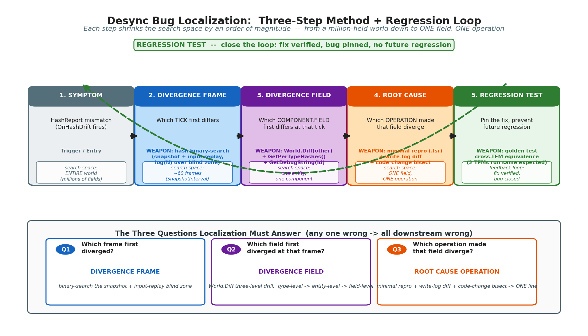
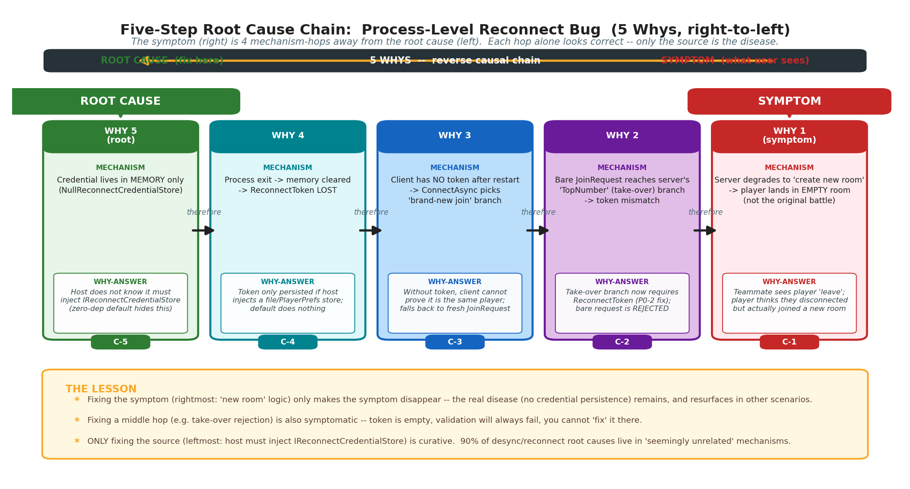
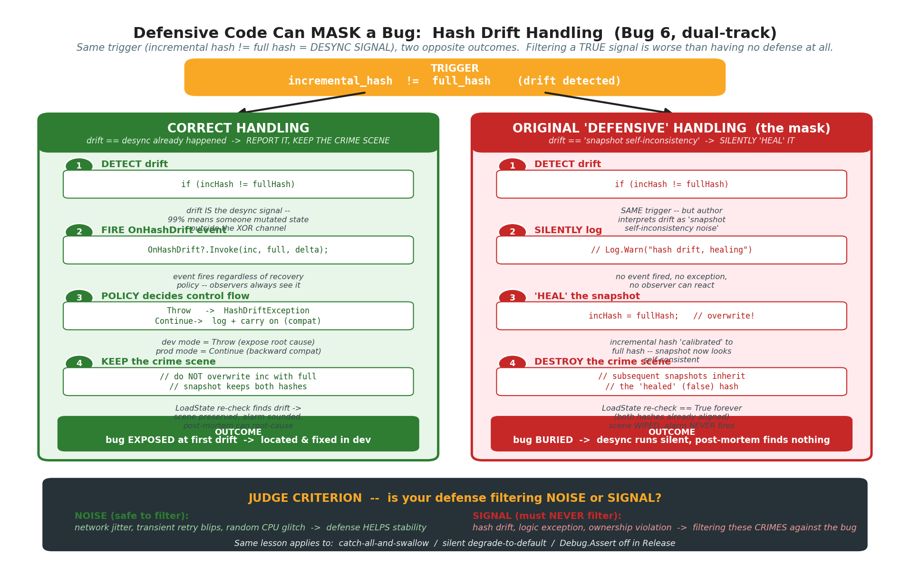
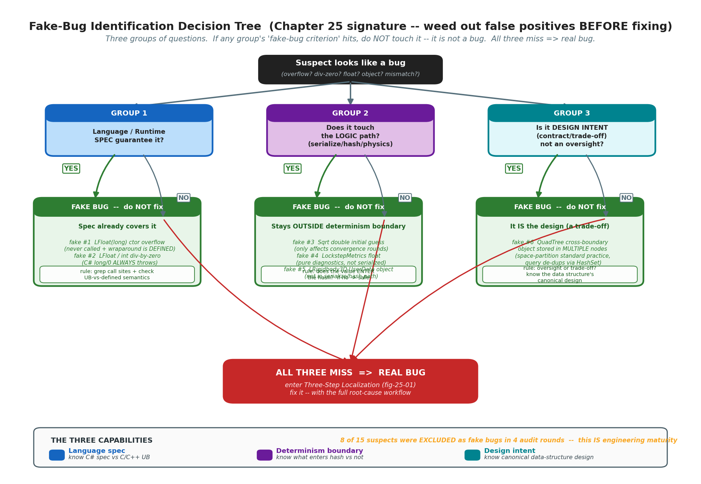

# 第 6 篇 · 第 25 章 · bug 定位实战:从现象到根因(含假问题教学)

> **核心问题**:前两章讲了"哈希怎么对账"和"红线清单怎么不踩"。可一旦真线上 desync 了,你拿到的是两份都"看起来正常"的快照——坦克在同一帧的坐标差了最后一个最低位,或者一个客户端把另一客户端的输入认成了自己的。这种 bug 不会在断点里跳出来喊"我错了",它藏在"两个数都像对的"之间。这一章就回答:怎么从"现象"一步步定位到"根因",以及——更要命的——怎么判断你以为是 bug 的那个东西,根本不是 bug。

> **读完本章你会明白**:
> 1. desync bug 的定位方法论:从"哈希对不上"出发,怎么用二分定位、状态 diff、回归测试,一步步收敛到"哪一行代码、哪一次运算"出错。
> 2. 11 个真实 bug 的完整复盘(发现 → 根因 → 修复 → 现状),覆盖确定性数值、安全身份、同步契约、回滚标志、池化所有权、跨运行时舍入 6 大类。
> 3. ★**假问题鉴别**:`issues_found.md` 四轮审查被排除的"假 bug",教你怎么靠对语言规范、确定性边界、设计意图的深度理解,把"看起来像 bug"的东西判成"不是 bug"——这本身就是工程成熟度。
> 4. 一个反直觉的教训:"防御性代码"有时反而会**掩盖** bug(双轨哈希漂移即覆盖的教训)。

> **如果一读觉得太难**:先只记住三件事——① desync 定位靠"哈希二分 + 状态 diff"两件武器,先锁分歧帧,再锁分歧字段;② bug 的根因往往不在"出 bug 的地方",而在"看起来八竿子打不着的另一个机制"(进程级重连 5 步根因链是典型);③ "看起来像 bug 的不一定真 bug",动手修之前先确认它是不是真问题,改一个假 bug 会把真 bug 一起盖住。

---

## 〇、一句话点破

> **desync bug 的可怕不在于"它发生了",而在于"它发生了你却不知道",或者更糟——"你以为它发生了,其实它没有"。这一章不教你"怎么写代码不出 bug"(那是前一章红线清单的事),而是教你两件事:第一,bug 真来了,怎么像侦探一样从一地碎片里拼出因果链;第二,怎么培养一种嗅觉,把"误报"挡在动手修之前——因为改一个假 bug,往往会把真 bug 一起埋掉。**

这是结论。本章倒过来拆:先讲定位方法论,再用 11 个真实 bug 演练,最后用 6 个"假问题"教鉴别。

---

## 一、为什么 desync 定位是一门独立的工程能力

普通程序出 bug,你打个断点,单步几下,看哪个变量不对,基本就定位了。帧同步不是这样。它的 bug 有三个让人崩溃的特征:

**特征一:两份都"看起来正常"。** desync 的本质是"两个客户端算出了不一样的结果"。可你拿到两份快照一看,坦克坐标、血量、朝向……每一项都"看起来正常"。问题藏在最后一个最低位,或者藏在"一个客户端多走了一帧"这种时间错位里。断点打不下来,因为每一行代码"单独看都对"。

**特征二:bug 不在"出 bug 的地方"。** 这是 desync 最反直觉的一点。你看到的现象是"哈希对不上",可根因可能在几百行之外——一个回滚标志没复位,一个池里的数组被重复归还,一个跨运行时的移位舍入差了 1。从现象到根因,中间隔着好几道因果。本书最经典的一个 bug(后面会详讲),根因链有 5 步长:进程退出丢凭证 → 裸 JoinRequest → 顶号被拒 → 新建房间 → 玩家以为掉线。你盯着最后那一步改,永远改不好。

**特征三:确定性 bug 会"逐帧放大"。** 一帧差一个最低位,几千帧后坦克漂到地图另一头。你看到 desync 报警的时候,真正的"第一犯罪现场"可能已经在一万帧之前。如果你只盯着报警那一刻的快照看,永远找不到凶手。

所以,desync 定位需要一套**独立的方法论**。它不是"打几个断点"就能解决的,而是要像刑侦破案一样:**先固定证据,再倒推因果,最后验证假设**。

> **钉死这件事**:desync 定位不是"调试",是"侦查"。它要回答三个问题——是哪一帧开始分歧的(分歧帧)?是哪一个字段第一个出错的(分歧字段)?是哪一次运算让这个字段出错的(根因运算)?这三步,任何一步答错,后面全错。

---

## 二、bug 定位方法论:三步定位法 + 一个心法

我把这套方法论凝练成**三步定位法**,它是后面所有 bug 复盘都会用到的骨架:

```
现象(Symptom) → 分歧帧(DivergenceFrame) → 分歧字段(DivergenceField) → 根因运算(RootCause)
     ↑                                                                          |
     └──────────────────────── 回归测试(RegressionTest)←──────────────────────┘
```



> **图说**:横轴是从"现象"到"根因"的收敛过程。每一步都把搜索空间缩小一个量级。第 1 步用哈希校验把"哪几帧"压到一帧;第 2 步用字段级 diff 把"哪个组件"压到一个字段;第 3 步用最小复现把"哪次运算"压到一行代码。最后一步回归测试,把修复钉死,防止回归。

### 第 1 步:锁分歧帧(哈希二分)

第 23 章讲过,每帧结束算一个状态哈希,客户端互相(或与服务器)对账。哈希不一样就是 desync。但"哈希不一样"只告诉你"在某个时刻,两边的局面分叉了",不告诉你**什么时候**分叉的。

如果快照间隔 `SnapshotInterval=1`(每帧存快照,本书默认值),那分歧帧立刻就知道——哈希第一次不一致的那一帧。但生产环境为了省内存,常常把 `SnapshotInterval` 调到 60(每 60 帧存一次),这时你只知道"哈希在第 1060 帧开始不一样",可真正出错的可能是第 1000 帧的某次运算。中间这 60 帧,是个盲区。

> **承接 P6-23**:第 23 章讲过哈希双轨(增量 O(1) vs 全量重算)。生产默认 `DualTrackMode=Disabled`(性能优先),开发期切 `Periodic`(每 N 帧全量校验一次)。`OnHashDrift` 事件无论哪种策略都会触发,这是定位的入口。

**怎么从盲区里捞出分歧帧?** 办法是**二分**。利用快照 + 输入流,在 `[leftTick, rightTick]` 区间上二分:取中点快照,两边各自用同一份输入流重演到中点,比哈希。一致就把左边界推到中点;不一致就把右边界推到中点。log(区间长度) 次就能锁到第一个分歧帧。

> **现状诚实标注**:本书框架目前**没有内置**这个二分定位工具(`BinarySearchDivergenceFrame`),它在 desync 定位工具链专题里被登记为 **DG-3**(待完善)。当前定位靠 `SnapshotInterval=1` 硬扛内存(开发期),或者人工翻日志。这是个已知的"最后一公里"缺口,不影响方法论本身。

### 第 2 步:锁分歧字段(World.Diff)

锁到分歧帧后,下一步是"在这一帧的状态里,是哪个字段第一个出错的"。一个游戏局面有成百上千个组件,每个组件好几个字段。盲找是不可能的。

框架提供的武器是 `World.Diff(World other)`(第 22 章可观测性地基已讲过)。它把两个 World 的所有组件按类型名 Ordinal 排序,逐组件逐字段比对,输出**第一个不一致的字段**及它的值。配套还有 `GetPerTypeHashes()`(类型级哈希,先粗筛到哪个组件类型)、`GetDebugString(entityId)`(字段级文本 dump)。三级下钻:**类型级 → 实体级 → 字段级**。

```
World.Diff(other) 输出示例:
  [Tick 1000] Divergence found:
    Component: Transform (entity 7)
      Field: Position.X
        Left:  RawValue=12345678  (≈188.1404)
        Right: RawValue=12345679  (≈188.1404)   ← 差一个最低位!
```

看到这个输出,你就知道:是 7 号实体的 `Transform.Position.X` 在第 1000 帧差了一个 RawValue。搜索空间从"整个局面"压到了"一个字段一次运算"。

> **★ 一个会被忽视的精度陷阱(轮次 10 审计登记 DG-2)**:`LFloat.ToString()` 默认只输出 4 位小数(F4),但 LFloat 精度是 1/65536 ≈ 5 位小数。**只差一个最低位的 desync(最常见的那种),在 F4 文本里看起来完全一样**。诊断输出必须走 `ToStringRaw()`(输出完整 RawValue),不能用 F4 的 `ToString`。这一条没踩过坑的人意识不到——"两端文本一样为啥还 desync"。框架有 `ToStringRaw()`,但诊断路径(`Diff`/`GetDebugString`)是否统一走 RawValue 还需最终核实,这是 DG-2 待完善项。

### 第 3 步:锁根因运算(最小复现)

锁到"7 号实体 Position.X 在第 1000 帧差 1"后,最后一步是问:**是什么运算让 Position.X 多了 1?**

这一步没有银弹。办法是**造最小复现**:把分歧帧之前几帧的输入抽出来,做成一个回放文件(`.lsr`),在开发机上重演。然后用"状态 dump + 二分代码改动"的办法,逐步逼近根因。常见套路:

- 在分歧帧附近,对 `Position.X` 的每一次写入都打日志(谁写的、写的什么值)。
- 对比两端的写入序列,找出第一次分叉的那次写入。
- 那次写入调用的函数,就是嫌疑代码。
- 在嫌疑代码里再二分(注释掉一半,看 desync 还在不在),最终定位到具体那行。

本书后面的 P0-1(跨 TFM 舍入分叉)就是这么定位的:发现 `Position.X` 的更新链路里,有一次 `LFloat * LFloat` 乘法,在两台机器上算出来差 1,一路追到 `LInt128` 的移位实现。

### 一个心法:bug 的根因往往"看起来八竿子打不着"

三步定位法是骨架,但真正难的是**第 3 步到根因的"最后一跳"**。因为 desync bug 的根因,经常不在"出 bug 的代码"里,而在一个看起来毫不相关的机制里。这是初学者最容易栽的地方——盯着现象改现象,永远改不好。

举一个本项目的真实例子(后面详讲):现象是"玩家重连后掉进了一个新房间,而不是回到原来的战局"。直觉会去查重连流程,但重连流程的每一步都对。真正的根因链是这样的:

```
进程退出(崩溃) → 内存里的重连凭证丢失 → 客户端发的是裸 JoinRequest
→ 服务器走"顶号"分支但 token 不匹配 → 顶号被拒
→ 服务器退化成"新建房间" → 玩家进了新房间
```

根因在**第一步**:凭证没持久化到磁盘。你盯着最后一步(新建房间)改,或者盯着中间(顶号被拒)改,都治标不治本。必须沿着因果链一路倒推到源头。

> **作者复盘 · 怎么练"倒推因果链"**:我自己的经验是——**遇到 bug,先不要打开编辑器,先拿一张纸画因果链**。从现象出发,问"为什么会这样",得到一个答案,再问"那这个又为什么会这样",一路问下去,直到问到一个"我改它就能根治"的点为止。这个点常常离现象有 4-5 步远。中间每一步都"成立",但只有最源头那步是"病根"。这个方法叫"五个为什么(5 Whys)",丰田生产体系发明的,我用它定位 desync 屡试不爽。本章后面会专门用一个 bug(进程级重连)演练完整的五步根因链。

---

## 三、★五步根因链案例:进程级重连(最佳根因链分析)

这是本书"从现象到根因"最精彩的一个 bug,我把它单独拎出来当第一个详讲案例,因为它完美演示了"bug 根因不在出 bug 的地方"。

> **承接 P5-19**:第 19 章讲过断线重连的机制——传输层重连 + 应用层追帧双级解耦,凭证 4 字段(PlayerName/PlayerId/RoomId/ReconnectToken),持久化靠 `IReconnectCredentialStore`。这个 bug 就出在"持久化"这一环。

### 现象:重连后进了新房间

线上玩家反馈:打着打着游戏闪退(进程崩溃),重新打开游戏,没回到原来的战局,而是被扔进了一个全新的空房间。同伴说"你怎么跑了,还以为你投降了"。

这是典型的"现象看起来是重连流程的 bug"。直觉会去查 `HandleReconnect`、查 `ReconnectHandler`、查 `ReconnectResponseMessage`……但每一个查下来都对。

### 五步倒推

我拿"五个为什么"一步步倒推(参见图 25-02):



> **图说**:从右(现象)往左(根因)倒推。每一格是一个"为什么"的答案,也是下一个"为什么"的起点。注意根因在第 1 步(凭证只在内存),而现象发生在第 5 步(进新房间)。两者隔了 4 个机制环节,任何一个环节单看都对,只有从源头修才根治。

**为什么 1:为什么玩家进了新房间?**
因为客户端发的是 `JoinRequest`(加入请求),不是 `ReconnectRequest`(重连请求)。`JoinRequest` 在没房间可匹配时,服务器会新建一个房间。

**为什么 2:为什么客户端发的是 `JoinRequest` 而不是 `ReconnectRequest`?**
因为重连需要 `ReconnectToken`,而进程重启后客户端**没有 token**。没有 token,客户端的 `ConnectAsync` 走"全新加入"分支,发 `JoinRequest`。

**为什么 3:为什么进程重启后没有 token?**
因为 token 存在 `ReconnectCredential` 里,而这个凭证**只存在内存中**——默认用的是 `NullReconnectCredentialStore`(空实现)。进程一退出,内存全清,token 就没了。

**为什么 4:为什么用空实现?是设计错了还是故意的?**
故意的(零依赖原则,第 18 章讲过)。`LockstepSdk` 核心库零依赖,不能替宿主决定"凭证存哪"——存文件?存 PlayerPrefs?存 Redis?每个游戏不一样。所以框架只定义接口 `IReconnectCredentialStore`,宿主注入实现。默认给个空实现(不持久化),是为了"不引入文件系统依赖"。**设计没错,错在默认空实现没把"进程级重连"这个能力暴露给宿主**——宿主不知道"想支持进程级重连,必须自己注入一个文件/PlayerPrefs 实现"。

**为什么 5(根因):为什么宿主不知道要注入?**
因为接口存在但没被"前置"——凭证恢复逻辑在传输层(`TcpClient.ConnectAsync` 等),宿主如果只看 SDK 的入口层(`LockstepClientBuilder`),看不到这一层。**根因:进程级重连的"激活开关"(注入 `IReconnectCredentialStore`)藏得太深,默认不激活,宿主容易漏配。**

### 修复

修复分两层,对应根因和症状:

1. **根因层**:明确 `IReconnectCredentialStore` 接口的语义,提供 `FileReconnectCredentialStore`(5 行纯文本,字符串字段 Base64 编码)作为参考实现,并在 `LockstepClientBuilder` 文档里醒目标注"进程级重连需注入凭证存储"。修复后,宿主只要 `.WithCredentialStore(new FileReconnectCredentialStore("creds.txt"))` 一行,进程退出也能回来。

2. **症状层(防御)**:`ConnectAsync` 的重连决策逻辑前置——优先尝试从凭证存储加载 token,`IsValid` 就发 `ReconnectRequest`(覆盖服务器 `Playing`/`Waiting` 全状态,绕开 `JoinRequest` 顶号受限的坑),失败再降级为全新 `JoinRequest`。对调用方透明(不用关心是重连还是新加入)。

### 现状:已修

源码当前状态(`TcpClient.cs:99` 等 4 个传输):每个客户端传输都持有 `IReconnectCredentialStore _credStore`(默认 `NullReconnectCredentialStore.Instance`),`ConnectAsync` 在未显式传 token 时先 `Load` 凭证,`IsValid` 走 `ReconnectRequestMessage`,失败 `Clear` 后降级全新加入。注释(`TcpClient.cs:99`)明确写"进程级重连:未显式传 token 且本地持久化了有效凭证 → 优先 ReconnectRequest"。

> **钉死这件事**:这个 bug 的修复,如果不倒推到根因(凭证持久化),只改末端的"新建房间"行为,要么治标不治本(还是回不到原战局),要么把症状盖住(让新建房间也带上 token,但 token 是空的根本校验不过)。**desync/重连类 bug,90% 的根因都在"看起来无关"的机制里。** 这是本章最想让你带走的一个心法。

---

## 四、11 个真实 bug 的完整复盘

剩下的 10 个 bug,我按"确定性数值 / 安全身份 / 同步契约 / 回滚标志 / 池化所有权 / 跨运行时"分成 6 类,每个用统一的四段式复盘:**发现 → 根因 → 修复 → 现状**。每个案例末尾标"承第 X 章",告诉你这个 bug 在前文哪里埋过伏笔。

### 4.1 确定性数值类

#### Bug 1(P0-1):跨 TFM 舍入分叉——全书最深的 bug ★承 P1-03

这是本书被翻来覆去讲的一个 bug,这里从"定位复盘"的角度再过一遍,补上 P1-03 没讲的"怎么定位的"。

> **发现**:开发期跑跨运行时联机测试(net8.0 服务端 + netstandard2.1 客户端,模拟 Unity host),发现 `HashReport` 时不时对不上,但 `World.Diff` 显示"只是某些字段的 RawValue 差 1"。差 1 这种,教科书般的"舍入分叉"特征。

> **根因**:非 .NET 8 的 `LInt128.ToShiftedLong` 用"绝对值移位再取负"(truncate toward zero,向零取整),而 .NET 8 的 `Int128 >> n` 是有符号算术右移(floor toward -inf,向负无穷取整)。对负数非整除的乘积,两者差 1。比如 `(-1 * 65537) >> 16`:truncate 得 -1,floor 得 -2。这个 1 的差异,经 `MulShift` 影响所有 `LFloat` 乘法,经 `Mul2/3/4SumShift` 影响矩阵/四元数,而这些都进序列化状态(`LQuaternion.Rotation` 等),最终哈希分叉。详见第 3 章 P1-03 的完整数学推导。

> **定位过程**:第一犯罪现场是 `LQuaternion` 的 `Slerp`——发现四元数权重合成后,net8 和 netstandard2.1 算出来不一样。但根因不在四元数,在底层的 `MulShift`(单乘积各自右移)与"累加后统一右移"(`((Int128)p0+p1+p2)>>Shift`)对负数低 16 位非零时的差 1。一路追到 `LInt128` 的两个移位方法:`ToShiftedLong`(truncate)和缺失的"有符号算术移位"(floor)。

> **修复**:`LInt128` 新增 `ArithmeticShiftToLong`(有符号移位,逐位等价 `(long)(int128>>shift)`);`MulShift` 改 floor(安全:net8.0 从不调用它,只有 `#else` 调);矩阵/四元数 `#else` 全改走 `Mul2/3/4SumShift`(128 位累加后统一右移);`Slerp.dot`/`Lerp.magSq` 的 `#else` 从 `ToShiftedLong` 换 `ArithmeticShiftToLong`。net8.0 golden 逐位不变(NET8 路径零改动)。

> **现状:已修 + 守卫测试**。`CrossPlatformDeterminismTests`(17 个测试用例,`tests/Lockstep.Core.Tests/Math/`)用手工验证的 golden 常量断言(负数非整除/正数非整除/整除/零),两 TFM 独立运行同一预期。**局限**:本机仅 net8.0 SDK,无法跑 netstandard2.1 执行测试;golden 断言已去 `#if NET8` 包裹(两 TFM 都编译都跑),但真跨 TFM 执行回归待 CI 装 net6.0 运行时后落地(E-4 / E-2 待办)。

> **教训**:① 跨运行时的"舍入语义差异"是确定性 bug 的重灾区,任何"我假设它跨平台一致"的判断都必须用 golden 测试钉死。② "双路径等价性测试"(NET8 Int128 路径 vs `#else` 软件路径)是这类 bug 的唯一抓法——单跑一个 TFM 永远抓不到。

#### Bug 2:LFloat.One 类型陷阱 ★承 P1-02

> **发现**:早期版本 `LFloat.One` 声明成 `const int`(不是 `const long`)。于是 `LFloat.One / 2` 走的是 int 除法,结果是 `int` 类型的 32768,而不是 `LFloat` 类型的 0.5。调用方拿到一个"数字"误以为是 LFloat,实际是 int,后续运算全错位。

> **根因**:命名误导。`One` 这个名字暗示"1.0 这个 LFloat 值",但早期它是个**标量常量**(表示精度值 65536),类型还是 int。两个字面意思打架:语义上像 LFloat,类型上是 int 标量。`int / 2` 和 `LFloat / 2` 是完全不同的运算。

> **修复**:① `One` 改成 `const long`(类型修正,避免 int 隐式提升的坑);② 新增 `OneVal`(`static readonly LFloat`)才是真正的"1.0 这个 LFloat 值";③ 文档明确"`One` 是标量(用于位运算),`OneVal` 才是 LFloat"。

> **现状:已修**。`LFloat.cs:19` `public const long One = Precision;`(65536);`LFloat.cs:27` `public static readonly LFloat OneVal = new LFloat(true, One);`。**注意**:issues/README 里说的"One 是 int"是**历史 bug**,早修了;但"One 不是 LFloat 类型"的语义陷阱(拿 `One` 当 LFloat 用仍会出错)仍在,靠文档和命名约束。

> **教训**:命名要诚实。一个叫 `One` 的常量,如果它不是"1 这个 LFloat",就必须有非常显眼的文档,或者干脆改名。本书框架选择了"`One`=标量 + `OneVal`=LFloat"的折中(性能考虑:`const` 编译期内联),代价是要靠文档防混用。

#### Bug 3:Sin 弧度转角度精度(整数除法截断)

> **发现**:发现 `Cos(PI/2)` 不等于 0(应该是 0),炮管朝向和子弹飞行方向对不上。`Sin(PI)` 也不是 0,而是约 0.017。

> **根因**:`ARCHITECTURE.md` 10.2 节记录的早期实现,弧度转角度用了**整数除法截断**:`int degrees = (int)(radians.RawValue * 360L / TwoPi.RawValue)`。整数除法是 truncate(向零),`PI`(205887)转成度数本应是 180°,但 `205887 * 360 / 411775` 截断后得 179(差 1)。于是 `Sin(PI)` 实际算的是 `Sin(179°) ≈ 0.017`,不是 0。

> **修复**:改成**四舍五入**——`(radians.RawValue * 360L + TwoPi.RawValue / 2) / TwoPi.RawValue`,加半个除数再除,等价于 round。`PI` 转出来正确得 180°,`Sin(PI) = 0`。后来整个三角函数改成了基于 LUT(查找表)的实现(`LUTSinCos.getIndex`),索引计算 `(radians.RawValue * 4096L) / 411775L & MASK`——也是整数除法,但 LUT 是 4096 点查表,边界值精度由表本身保证。

> **现状:已修**。`LUTSinCos.cs:8218` 现行实现是 LUT 查表,关键角度(0°/90°/180°/270°/360°)有 `TrigFunctions_AtKeyAngles_ShouldBeCorrect` 单元测试守卫。

> **教训**:定点数里凡是"整数除法",都要问一句"这里该 truncate 还是 round"。定点数没有浮点的"自动最近舍入",截断是默认行为,而截断在边界值(整除附近)会丢精度。本书第 3 章讲 LUT 时强调过:"索引计算的精度,直接决定三角函数的精度"。

#### Bug 4:大数乘法溢出(远距离误判碰撞)

> **发现**:线上出现"远距离的子弹莫名掉血"——两个坦克隔老远,子弹明明没碰到,却判定碰撞。Debug 发现:距离平方(`X*X + Y*Y`)算出来变成了 0 甚至负数。

> **根因**:`ARCHITECTURE.md` 10.4 节记录,业务层的碰撞检测代码直接写 `diff.X * diff.X + diff.Y * diff.Y`。这里 `diff.X` 是 `LFloat`,乘法走 `LFloat.operator*` → `LMath.MulShiftFast`。当坐标值较大时(如 `diff.X = 182.55`,RawValue=11965235),`11965235 * 11965235` 是个 54 位的数,虽然 `MulShiftFast` 内部走 Int128 路径不会溢出,但**业务层有些地方没用 `MulShiftFast`**,而是手写了 `X.RawValue * X.RawValue` 之类的裸运算,或者把中间结果存进 int——这种就会溢出。溢出后 RawValue 变成 0 或负数,`SqrDistance` 看起来是 0,距离也是 0,"距离=0"被判定为"重叠=碰撞"。

> **修复**:`ARCHITECTURE.md` 10.4 节给的修复是**快速边界检查**:碰撞检测前先做 AABB 风格的粗筛——`if (LFloat.Abs(diff.X) > maxDiff || LFloat.Abs(diff.Y) > maxDiff) continue;`(差距大于 2 就肯定不碰),跳过明显不碰撞的情况,既避免大数运算又省 CPU。业务层的子弹碰撞走这个快速边界。

> **现状:已修(业务层缓解)**。核心数学库 `LVector2.SqrMagnitude`(`LVector2.cs:50-53`)用的是 `LMath.MulShiftFast`,大数走 Int128 不溢出。业务层(`TankGame` 子弹碰撞等)靠 AABB 快速边界跳过远距离对,既不溢出也快。**注意**:这个 bug 的"修复"在业务层而非核心层——核心数学库本来就不会溢出(`MulShiftFast` 设计就是为大数准备的),溢出只发生在"业务代码绕过核心库手写运算"时。教训是:别绕过核心数学库。

> **教训**:① 定点数的"大数乘法"必须走库提供的 128 位路径,别手写裸运算。② 性能与正确性可以兼得——AABB 粗筛既防溢出又省 CPU,是 collision 检测的标准套路(承《物理引擎》宽相/窄相分离)。

### 4.2 安全身份类

#### Bug 5(P0-2):重连身份劫持 ★承 P4-15

> **发现**:渗透测试发现,攻击者只要知道某个在线玩家的名字,就能从新连接发 `JoinRequest`,把原玩家踢下线,继承他的 playerId,注入任意输入。这是身份劫持 + 确定性破坏的双重灾难。

> **根因**:`GameRoom.TryJoin` 的"顶号"分支(`GameRoom.cs:496` 附近),原本只校验"同名 + 不同 ClientId"就重分配槽位——只看"客户端物理地址变了"(UDP 真空期正常场景),**完全不校验 ReconnectToken**。合法的 `HandleReconnect`(走 ReconnectHandler,校验 token)被完全绕过。攻击者不需要 token,只要知道玩家名。

> **修复**:`TryJoin` 顶号分支强制校验 `ReconnectToken`——`existingPlayer.ReconnectToken != reconnectToken`(空 ≠ 非空 → 拒)即拒绝顶号。拒绝后 `JoinHandler` 退化为"新建房间"(安全降级,不崩溃)。合法客户端首次 `JoinResponse` 会下发 token,客户端持久化,重连时带上,校验通过、继承原 playerId。

> **现状:已修**。`GameRoom.cs:503-505` `if (existingPlayer.ReconnectToken != reconnectToken) { 拒绝 + 日志 }`。线协议:`JoinRequestMessage` 末尾追加 `ReconnectToken` 字段(向后兼容,服务端按客户端 `ProtocolVersion` 门控读取,≥1.1 才读);`ProtocolVersion` Minor 1.0→1.1。4 个客户端传输 `ConnectAsync` 增可选 `reconnectToken` 参数。

> **教训**:信任边界必须显式。凡是"自动匹配 + 重分配"的路径,都要问"这个动作的发起者,有没有证明他是原主体"。本书第 15 章讲顶号重连机制时强调过:UDP 真空期需求让"顶号"必须存在(玩家 IP 变了不能让他重新匹配),但顶号必须自证身份(token),不能凭名字。

### 4.3 同步契约类

#### Bug 6:双轨哈希漂移即覆盖——★"防御性代码反而掩盖 bug" ★承 P6-23

这是本章最重要的一个"反面教材",它演示了一个反直觉的教训:**为了让系统"更稳定"而加的防御性代码,有时反而把 bug 藏得更深**。

> **发现**:开发期发现 desync 报警有时被静默吞掉——明明两端局面已经分叉,但 `OnDesync` 没触发,系统继续跑。更糟的是,事后看快照链,发现分叉的那一刻的快照被"洗白"了——后续所有快照的哈希都"自洽",像什么都没发生过。

> **根因**:`World.SaveState` 在写快照前,会比对"增量哈希"(组件变更时 XOR 维护,O(1))和"全量哈希"(重算)。原版的"防御性"逻辑是:**两者不一致(漂移)时,自动用全量哈希覆盖增量哈希**——意图是"让快照保持自洽,避免下游校验误报"。

这个意图是好的,但效果是灾难性的。因为"漂移"本身就意味着 desync 已经发生(增量哈希和全量不一致 = 有人偷偷改了状态没经过 XOR 通道)。原版逻辑不仅不上报,还**用全量哈希把增量哈希"校准"了**——于是:① 下游的 `LoadState` 校验(比快照内嵌的增量哈希和重算的全量哈希)永远恒真,因为两者已经被"对齐"过;② 快照链里所有后续快照都"自洽",desync 的现场被永久销毁,事后查无对证。

```
  正常逻辑(应该这么做):                  原版"防御性"逻辑(实际在做的):
  
  增量哈希 ≠ 全量哈希                     增量哈希 ≠ 全量哈希
      ↓                                       ↓
  漂移 = desync 已发生!                  "让快照自洽"(用全量覆盖增量)
      ↓                                       ↓
  触发 OnHashDrift / 抛异常               静默,继续跑
      ↓                                       ↓
  现场 + 报警 保留                        现场 被销毁,报警 永不触发
```

> **修复**:① 漂移触发 `OnHashDrift` 事件(**无论哪种恢复策略都触发**,事件是观察用,不影响控制流);② 新增 `HashDriftRecoveryPolicy`(`Continue` 默认向后兼容 / `Throw` 立即抛 `HashDriftException`),开发期建议设 `Throw` 暴露根因;③ 漂移时打印详细日志(增量哈希/全量哈希/Delta XOR),不静默吞;④ **取消"用全量覆盖增量"的自愈逻辑**——漂移就是漂移,要让现场留着,别洗白。

> **现状:已修**。`World.cs:189-198` 定义 `OnHashDrift` 事件 + `HashDriftRecoveryPolicy`;`:868` 增量 vs 全量漂移时触发事件 + 按策略处理;`:1102` LoadState 时快照内嵌哈希与重算哈希不一致也触发;`:1160-1177` 周期校验(DualTrackMode=Periodic/FullValidation)漂移同样触发。

> **教训(本章核心心法之一)**:**防御性代码要小心,它可能把 bug 当噪音过滤掉**。原作者加"漂移即覆盖"的意图是"别让快照校验误报",但它把真正的 desync 信号当成"噪音"静默了。判断一段防御性代码好不好,标准是:它过滤的是"真噪音"还是"真信号"。哈希漂移是真信号(99% 意味着 desync),过滤它就是犯罪。这条教训同样适用于:吞异常(catch 所有 Exception 不记录)、降级静默(网络失败返回默认值)、断言关闭(Release 下 Debug.Assert 失效)——这些"防御"都会掩盖 bug。第 24 章红线清单也强调了"逻辑层严禁吞异常"。



> **图说**:左半是"正确"——漂移是 desync 的信号,必须报警 + 留现场;右半是"原版错误"——把漂移当噪音,用全量覆盖增量,快照自洽了但现场没了。一句话:**过滤真信号的防御代码,比没有防御代码更糟**。

#### Bug 7(C-5):环形缓冲陈旧槽 ★承 P3-10

> **发现**:第 6 轮审计发现,`RingBuffer<T>` 是纯槽数组(无 Count/占用元数据/头尾指针),按 tick 直接寻址 `Get(index) = _buffer[index & _mask]`。环绕算术对任意 index 都返回某槽:**越界(过旧)index 会环绕到陈旧槽**(`tick - Capacity` 之后的旧数据)。负 index(如 -1)环绕到 `Capacity-1`。`_frameHashes: uint` 尤其危险——无内嵌有效性标记,读到一个陈旧的哈希值,看起来"像个合法哈希",校验时可能误判"一致"或"不一致"。

> **根因**:设计契约。`RingBuffer` 为了性能(无分支、无元数据维护),把"时效校验"的责任推给了调用方——调用方必须用 `payload.Frame == tick` 自行校验槽内数据是不是当前 tick 的。这不是 bug,是**契约**。但契约是脆弱的:未来谁重构时删了那个 `== tick` 校验,或者 `_confirmedTick` 与槽内容漂移,就会静默读陈旧槽 → 错误回滚基 / desync。

> **修复**:不改环回算术(性能要紧),而是① **契约文档化**——`RingBuffer` 类/`Get`/`Set` 的 XML doc 醒目标注"⚠️ 时效性契约(C-5):调用方必须自行校验槽内 payload 的时效";② 加 characterization 测试固化环绕行为(让"读陈旧槽"这个行为有测试约束);③ DEBUG 下对负索引告警(定位 tick 计算错误)。

> **现状:已修(契约层,非功能层)**。`RingBuffer.cs:8-24` 类头 remarks 完整文档化了 C-5 契约(纯槽数组/环绕语义/陈旧槽风险/调用方必须校验)。**审计标 P1 是"契约脆弱性提醒",不是"功能 bug"**——当前 6 个调用方都做了 `.Frame == tick` 校验,功能没坏;P1 标的是"未来重构容易破"的设计脆弱性。

> **教训**:有些"bug"其实是"设计契约",改了反而破坏性能或语义。这种时候,正确的"修复"是**把契约文档化 + 测试固化**,而不是改成"全自动校验"(那会让热路径变慢)。本书第 10 章讲 RingBuffer 时埋过这个伏笔:`RingBuffer` 的简洁(无元数据)是用"调用方纪律"换的。

### 4.4 回滚标志类

#### Bug 8(C-6):IsReplaying 不复位 ★承 P3-09

> **发现**:第 6 轮审计发现,`LockstepController.ConfirmServerFrames` 在回滚段会把 `_simulation.IsReplaying = true`(进入重演模式)。但如果随后在"追帧上限 break"(`:369`)或"deadline break"(`:455`)处退出循环,**跳过了复位**,标志残留 `true` 到下次 `DoUpdate`。

> **根因**:`IsReplaying` 是个生命周期标志,被 `ISystem` 用来门控副作用(回放帧不播音效/不撒粒子,因为重演会重复触发——第 9 章讲过这个纪律)。如果标志残留 `true`,**预测帧会被误当回放帧**——视觉上"正确"(预测帧和回放帧的副作用都不该播),但语义错误:预测帧本来应该播"操作的即时反馈",被静默了,手感会变肉。更危险的是 `oldPredictedTick`/`_predictedTick`/`IsReplaying` 的派生算术在"单次 DoUpdate 多次回滚"时会彻底乱套。

> **修复**:用 `try/finally` 包裹整个确认循环,**在任意循环出口(包括 break)复位 `IsReplaying = false`**。`finally` 块兜底,彻底消除残留。

```csharp
// LockstepController.cs:356(简化示意,非源码原文)
try {
    _simulation.IsReplaying = true;  // 进入重演
    // ... 确认循环,可能在 pursue 上限或 deadline 处 break ...
} finally {
    _simulation.IsReplaying = false;  // C-6: 任意出口复位
}
```

> **现状:已修**。`LockstepController.cs:356` `try` + `:464-467` `finally { _simulation.IsReplaying = false; }`,注释明确"C-6:任意循环出口复位 IsReplaying=false"。

> **教训**:生命周期标志(进入/退出成对的标志)必须用 `try/finally` 包,保证任意出口(包括异常、break、continue、return)都能复位。这是 RAII 的精神,只是 C# 用 `try/finally` 或 `using` 表达。本书第 9 章讲回滚纪律时强调过"所有 IsReplaying/IsPredicting 门控的副作用,标志位必须可靠复位",这个 bug 就是那条纪律的反面教材。

### 4.5 池化所有权类

#### Bug 9:BufferPool 双倍归还 ★承 P5-20

> **发现**:开发期偶发"状态莫名其妙损坏"——某个 `byte[]` 缓冲区的数据被另一段代码改了,但代码逻辑里谁也没改它。这种"幽灵修改"极难定位,因为修改者根本不和你共享这个数组(至少看起来不共享)。

> **根因**:`BufferPool` 封装 `ArrayPool<byte>.Shared`。`ArrayPool` 的契约是:**同一个 `byte[]` 可能被重复租出**。如果某段代码"租了又租"(同一引用归还两次,或者归还后还继续用着引用又被别人租走),就会出现"A 归还 → B 租到同一个数组 → A 还在写 → B 读到 A 写的脏数据"。这是帧同步**最阴险的静默损坏来源**——没有异常,没有日志,就是数据慢慢变错,desync。

```
  时间线:
  T1: A 租到 byte[] X (ArrayPool 给了 X)
  T2: A 归还 X        (X 回池)
  T3: B 租到 byte[] Y (ArrayPool 又把 X 给了 B! Y 就是 X)
  T4: A 还在写 X      (A 不知道 X 已经被回收, 继续写)
  T5: B 读 Y          (读到 A 在 T4 写的脏数据!)
```

> **修复**:DEBUG 模式下用 `ConditionalWeakTable<byte[], LeaseMarker>` 追踪"当前已租出未归还"的缓冲区。归还时检查这个表:如果该 `byte[]` 不在"已租出"集合里,说明它要么没被租过、要么已经被归还过——抛 `InvalidOperationException` 报"双倍归还"。`BitWriter` 也加了 `_pooledInUse` 标志防自身重复归还。

> **现状:已修**。`BufferPool.cs:34-41` `ConditionalWeakTable<byte[], LeaseMarker> _leasedBuffers` + `LeaseMarker`(private sealed);`:61` Rent 时 `Add`;Return 时检查并清理。`BitWriter.cs:25` `internal bool _pooledInUse;`。

> **教训**:① 池化的本质是"共享",共享就一定有"用错"的风险。任何池化 API,DEBUG 模式必须能检测"双倍归还"和"归还后继续用"。② `ConditionalWeakTable` 是 .NET 提供的"按引用追踪且不阻止 GC"的利器,专门干这个。第 20 章讲零 GC 时详讲过这套机制。

### 4.6 跨运行时与序列化类

#### Bug 10:回放 CRC 接线错 ★承 P5-21

> **发现**:第 21 章讲过回放系统的设计——回放文件有"魔数 + 版本范围 + CRC32"铁三角做完整性校验。但审计发现,虽然设计齐全,主加载路径根本没走 CRC 校验。

> **根因**:`ReplayFile` 有两个加载入口:`Deserialize(reader)`(只解析,不校验 CRC)和 `LoadWithValidation(byte[])`(完整 CRC 校验)。设计意图是 `Deserialize` 给"信任数据源"的场景(比如自己刚写的),`LoadWithValidation` 给"不信任数据源"的场景(比如从磁盘读用户提供的回放)。**但客户端主加载路径 `ReplayManager.LoadFromFile` 直接调了 `Deserialize`**,绕过了 `LoadWithValidation`。也就是说,从磁盘加载回放时根本没校验 CRC——文件损坏或被篡改都不会被发现。

更细的发现(轮次 8 复核):问题不在 `Deserialize` 跳过 CRC(那是设计意图,留给"信任源"),而在 `LoadFromFile`(不信任源的入口)直接调 `Deserialize` 不走 `LoadWithValidation`。客户端 `RaylibClient/ReplayManager.cs:83` 调的正是 `LoadFromFile`。

> **修复**:① `Deserialize` 内部补上 CRC 实算与比对(从版本号到帧数据结束算 CRC,与文件末尾保存值比,不一致抛 `ReplayCorruptedException`)——这样不管哪个入口都校验;② `LoadFromFile` 改调 `LoadWithValidation`(完整流程);③ 配套加 `D-9` 守卫(`ReplayFile.Deserialize` 读 frameCount 后,`new List<FrameData>(frameCount)` 前加 `frameCount*8 > remaining` 守卫,防恶意巨型 frameCount 触发 OOM,发生在 CRC 校验之前)。

> **现状:已修**。`ReplayFile.cs:202` `Deserialize` 内 `uint actualCrc = ComputeCrc32(dataSpan);` 实算并比对;`ReplayFile.cs:213` `LoadWithValidation` 入口;`ReplayManager.cs:31` `LoadFromFile` → `LoadWithValidation`。`ReplayFile.cs:166-168` D-9 守卫(frameCount 上限,防 OOM)。

> **教训**:① "设计有但接线错"是最隐蔽的一类 bug——审计报告/文档/接口签名都对,但实际调用链绕过了保护。**判断一段保护是否生效,不能看接口存不存在,要看主路径走没走进去**。② 防御要"前置"也要"内建"——把校验放在最外层入口(`LoadFromFile`)是对的,但同时让内层(`Deserialize`)也自带校验(纵深防御),双保险。

---

## 五、★技巧精解:三级哈希下钻 + 五个为什么

本章挑两个最硬核的"定位技巧"单独拆透。

### 技巧一:三级哈希下钻(类型级 → 实体级 → 字段级)

desync 报警只给你一个 32 位哈希不一致。从一个 32 位数定位到"7 号实体的 Position.X 差 1",中间要缩小三个量级的搜索空间。框架的三级下钻是这样设计的:

```
第 1 级:GetPerTypeHashes()  ——每个组件类型一个哈希,粗筛到"哪个组件类型出错"
第 2 级:World.Diff(other)   ——逐实体比对,定位到"哪个实体的哪个组件"
第 3 级:GetDebugString(id) ——字段级文本 dump,看到"哪个字段的值是多少"
```

> **承接 P6-23**:第 23 章讲过,32 位哈希够抓 desync(碰撞概率极低),但不够定位字段。这套三级下钻就是为了"从 32 位哈希不一致,一路钻到字段值"。`World.cs:1334` `GetPerTypeHashes`、`:1351` `Diff`、`:1402` `GetDebugString`。

**第 1 级**:`GetPerTypeHashes()` 返回 `Dictionary<string, uint>`(类型 FullName → 该类型所有组件的聚合哈希)。两端各算一份,比哪个类型的哈希不一样。游戏可能有几十种组件类型,这一步把范围从"几十种"压到"一种"。

**第 2 级**:`Diff(World other)` 把两个 World 里"哈希不一致的那个类型"的所有实体逐个比对(`World.cs:1351`)。它返回**第一个不一致的实体 + 组件**。范围从"一种类型 N 个实体"压到"一个实体一个组件"。

**第 3 级**:`GetDebugString(entityId)`(`World.cs:1402`)输出该实体该组件的**所有字段值**(LFloat 走 `ToStringRaw` 输出完整 RawValue)。两端各 dump 一份,BeyondCompare 一比,第一个不一致的字段就跳出来了。范围从"一个组件几个字段"压到"一个字段一次运算"。

**为什么妙**:① 每一级都把搜索空间缩小一到两个量级,三级下来从"百万级状态"压到"一个字段",这是对数级的收敛。② 哈希的"分桶"特性——类型级哈希是"该类型所有实体聚合",等于"按类型分桶";实体级是"按实体分桶";字段级是直接看值。分桶是定位的标准武器。③ 三级都用同一套确定性序列化基础设施(组件按类型 Ordinal 排序、按 entityId 排序),保证两端的 dump 文本对齐可比。

> **反面对比(没有三级下钻会怎样)**:如果只有"全量哈希不一致"这一个信号,你只能 `ToDebugString()` 把整个 World dump 成文本,人肉 BeyondCompare。一个游戏局面几千个实体几万个字段,人肉比文本会死人。三级下钻让机器替你做粗筛,你只看最后那一个字段。

### 技巧二:五个为什么(根因链倒推)

bug 定位最难的"最后一跳",是从"锁到根因运算"到"真正理解为什么这个运算出错"。这一步没有自动化工具,靠的是**五个为什么**——从现象出发,连问 5 个"为什么",每个答案都是下一个"为什么"的起点,直到问到一个"改它就能根治"的点。

本章第 3 节的进程级重连 bug,就是五个为什么的完整演练(参见图 25-02)。它的精髓是:**中间每一个"为什么"的答案,单看都成立、都"对",只有一路问到底,才能发现根因藏在最源头**。

**怎么练这个技巧**:我的经验是——
- **遇 bug 先别开编辑器,先画因果链**(纸笔或白板)。
- 从现象出发,画一条因果箭头链,每格问"为什么"。
- 每一格的答案,要经得起"那这个又为什么"的追问——如果答不上来,说明因果链断了,得继续挖。
- 链条到"我改它就能根治"(而不是"我改它症状消失")为止。注意"根治"和"症状消失"的区别:进程级重连 bug,改"新建房间"只是症状消失(还是回不到原战局),改"凭证持久化"才是根治。
- 链条长度 3-5 步是常态。如果只有 1-2 步,要么 bug 很简单,要么你挖得不够深。

> **反面对比(不倒推会怎样)**:盯现象改现象,是 desync/重连类 bug 最常见的"改了又改"死循环。进程级重连 bug 如果只改末端(新建房间逻辑),改完测试"玩家不再进新房间了"(症状消失),但真因(凭证没持久化)还在,换个场景(比如非崩溃的正常退出)又犯。倒推到根因一次改对,省下后面无穷的返工。

---

## 六、★假问题教学集(本章精髓之二)

前面 10 个 bug 都是真的——它们确实会出错,确实需要修。但本书的独门卖点,不止教你"怎么修真 bug",更要教你**怎么鉴别假 bug**。因为:`issues_found.md` 四轮审查里,光是被**排除**的"假 bug"就有 8 个——审查者一开始以为是 bug,深挖后发现根本不是。如果你不鉴别就动手,不仅浪费时间,还可能"修"出一个新 bug(改了一个本来正确的设计)。

这一节就拿 6 个典型的"假 bug"做教学,每个讲清"为什么它看起来像 bug,但实际不是"。教你的不是"这 6 个具体案例",而是**鉴别真假 bug 的三种能力**:靠语言规范、靠确定性边界、靠设计意图。



> **图说**:遇到"疑似 bug",按这棵决策树走一遍。三个分支任一命中"假 bug 判据",就别动手——它不是 bug。三个分支都不命中,才是真 bug,进入第 2 节的三步定位法。

### 假 bug 判别能力之一:靠语言规范(C# / 运行时保证)

#### 假 bug ①:LFloat(long) 构造函数溢出

**疑似症状**:`LFloat` 有个构造函数 `LFloat(bool isRaw, long rawValue)`,如果传一个超大的 `rawValue`,里面做位移可能溢出。"溢出"听起来就是 bug。

**为什么不是 bug**:① **全代码库从未调用**这个构造函数——审查者 `grep "new LFloat(\d"` 零命中。它是 `private` 约定的内部构造(虽然 C# 没强制),只有 `FromRaw`/`FromInt` 等工厂方法间接调用,而工厂方法都有边界校验。② C# 的 `<<` 是**明确定义的环绕行为**(defined behavior,不是 UB),就算被调用,结果也是确定的(只是可能不是调用方想要的)。所以这是"纯理论风险",不是"现存 bug"。

**鉴别能力**:遇到"某处可能溢出"的疑虑,先问两件事——① 这处代码**实际会被调用吗**(grep 调用点)?② 即便溢出,语言规范**保证行为确定吗**(环绕 vs UB)?C# 整数运算是 checked/unchecked(默认 unchecked 环绕),跨平台确定;C/C++ 有符号溢出才是 UB。两个问题都"安全",就不是 bug。

#### 假 bug ②:LFloat / int 除零检查缺失

**疑似症状**:`LFloat.operator/(LFloat, int)` 没有显式的 `if (b == 0) throw` 除零检查。"除零"听起来就是 bug。

**为什么不是 bug**:C# 语言规范保证 `long / 0` **必定抛 `DivideByZeroException`**,跨平台行为一致(运行时保证,不是 UB)。`LFloat / LFloat` 那个显式检查只是**防御性风格**(更早抛 + 自定义消息),两者运行时行为完全等价。所以"没显式检查"≠"会出错",C# 已经替你检查了。

**鉴别能力**:遇到"缺少检查"的疑虑,先问——语言/运行时**已经保证**了吗?C# 整数除零必抛、数组越界必抛、空引用(引用类型)必抛 NullReferenceException。这些"检查"语言已经做了,业务代码再写一遍是冗余,不是"补 bug"。对比:C/C++ 的整数除零是 UB,那时"缺少检查"才是真风险。**真假 bug 的判断,依赖你对所用语言规范的熟悉程度**——这是"工程成熟度"的一部分。

### 假 bug 判别能力之二:靠确定性边界(影响逻辑吗?)

#### 假 bug ③:LMath.Sqrt 非 NET8 用 double 初始猜测

**疑似症状**:`LMath.Sqrt(LFloat)` 在非 NET8 路径,用一个 `double` 算的初始猜测(走 `System.Math.Sqrt`)。第 2 章不是说"绝对不能用浮点"吗?这里用了 double,会不会跨平台不一致?

**为什么不是 bug**:double **只用于初始猜测**,后面跟**3 轮定点牛顿迭代**修正。牛顿迭代每轮都把精度翻倍,3 轮后定点结果收敛到 floor(sqrt) 的精确值(整数运算,确定)。初始猜测哪怕差几个数量级,3 轮迭代后结果一样——牛顿迭代的"自校正"特性。所以"最终结果"是纯定点运算确定的,double 只影响"几轮收敛",不影响"收敛到什么"。

**鉴别能力**:遇到"某处用了浮点"的疑虑,先问——这个浮点**参与最终逻辑结果**吗(进序列化/哈希/物理积分)?还是只用于**诊断/初始猜测/显示**(不影响逻辑)?前者才是 desync 风险,后者只是性能/美观问题。本书第 2 章强调的"绝对不能用浮点",指的是**参与逻辑的运算**;诊断、显示、初始猜测这些"非逻辑路径"用浮点是安全的。**判断的关键是"这条浮点运算的结果,最终会不会进哈希"**。

#### 假 bug ④:LockstepMetrics 用 float

**疑似症状**:`LockstepMetrics` 类里 `AvgRtt`、`RttJitter`、`PursueProgress` 都是 `float`。又见浮点!

**为什么不是 bug**:这些是**纯诊断指标**,不参与任何逻辑计算。它们用于 Prometheus 导出、UI 显示、性能分析——不进序列化、不进哈希、不影响物理/游戏逻辑。诊断指标用 float 完全合理(浮点表达力强、与 Prometheus/可视化的原生类型对齐)。

**鉴别能力**:同上——看"进不进逻辑"。`LockstepMetrics` 整个类就是诊断设施,它的所有字段都不参与逻辑。判断一个 float 该不该存在,问一句"如果把这个 float 换成随机值,游戏局面会变吗"——不会变,它就是诊断;会变,它就是逻辑泄露,得换掉。

#### 假 bug ⑤:LRigidbody3D.UserData 是 object

**疑似症状**:`LRigidbody3D` 有个 `public object? UserData` 字段。`object` 是引用类型,可能持有任何东西,包括非确定性的状态。这不是破坏确定性吗?

**为什么不是 bug**:`UserData` 是**用户自定义数据挂载点**(业务层往刚体上贴自己的数据,比如"这个刚体是哪个玩家的")。它**不参与序列化、不参与哈希、不参与物理计算**——`World.SaveState` 遍历组件时根本不碰它,`ComputeHash` 也不算它。物理引擎内部从不读 `UserData`。所以它爱装什么装什么,不影响确定性。

**鉴别能力**:`object`/引用类型本身不是罪,关键是**它参不参与确定性边界**(序列化/哈希/逻辑运算)。`UserData` 在边界之外,就是安全的"逃生舱"(给业务层留的灵活挂钩)。如果某个组件的**逻辑字段**是 `object`,那才是 bug(承第 24 章红线清单:组件逻辑字段禁止引用类型)。

### 假 bug 判别能力之三:靠设计意图(这是 bug 还是契约?)

#### 假 bug ⑥:QuadTree 跨边界物体存多子节点

**疑似症状**:`QuadTree.GetStatistics` 报告的物体总数,比实际物体数多——因为一个跨子节点边界的物体,会被存进**多个**子节点(每个与之重叠的子节点都存一份)。这看起来是"重复计数 bug"。

**为什么不是 bug**:这是**设计意图**。`QuadTree` 是空间划分数据结构,一个物体跨边界时,必须存进所有与之重叠的子节点,否则查询时漏检(承《物理引擎》QuadTree 详解)。碰撞检测时用 `HashSet<long>` 去重(同一个物体 ID 只处理一次)。`GetStatistics` 的"总数偏大"只是统计视角的副作用,不是 bug——它统计的是"节点引用数",不是"唯一物体数"。

**鉴别能力**:遇到"看起来不一致"的疑虑,先问——这是**实现疏漏**,还是**设计权衡**?QuadTree 的"跨边界存多份"是空间划分的标准做法(AABB 树、BVH、八叉树都类似),代价是"统计偏大 + 需要去重",收益是"查询不漏检"。这是用 `HashSet` 去重的代价,不是 bug。**判断设计意图,要熟悉该数据结构/算法的标准做法**——这也是为什么本书强调"承《物理引擎》碰撞检测一句带过",那些基础设计不该当 bug 重复讲。

### 假问题教学的总结:三种能力 + 一个心法

把 6 个假 bug 归纳成三种鉴别能力:

| 能力 | 问的问题 | 对应假 bug |
|---|---|---|
| 语言规范 | 语言/运行时**已经保证**了吗? | ① LFloat(long)构造(从未调用 + 环绕 defined) / ② 除零(C# long/0 必抛) |
| 确定性边界 | 这个运算**进逻辑**吗(进哈希/序列化)? | ③ Sqrt double 初始猜测(只影响收敛轮数) / ④ Metrics float(纯诊断) / ⑤ UserData object(不参与序列化) |
| 设计意图 | 这是**疏漏**还是**权衡**? | ⑥ QuadTree 跨边界(空间划分标准做法) |

**一个心法**:**鉴别真假 bug 的能力,本身就是工程成熟度**。新手见 bug 就慌,见疑似 bug 就改;老手见疑似 bug 先停手,问三个问题(语言保证吗?进逻辑吗?是设计吗?),三个都"不是 bug"才放心。"看起来像 bug 的不一定真 bug"——这句话要刻进肌肉记忆。因为改一个假 bug,轻则浪费时间,重则把一个正确的设计"修"坏,埋下真 bug。

> **作者复盘 · 四轮自我推翻的审计文化**:`issues_found.md` 记录了项目四轮代码审查的过程:原始审查报了 15 个问题,一次验证排除 5 个,二次深度验证再排除 3 个(修正 4 个的严重性),最终确认 7 个真问题。**8 个假 bug 被排除,这是个值得骄傲的数字**——它意味着审查者没有"宁可信其有",而是较真地去验证每一个怀疑,该排除就排除。这种"自我推翻"的审计文化,比"报一堆疑似 bug 吓唬人"有价值得多。本书把这套假问题教学当独门卖点,就是想传递:好的工程师不仅能找 bug,还能**鉴别 bug**——后者更难,也更重要。

---

## 七、本章的定位:调试(招牌)

本章服务本书二分法的**调试**这一面。前两章(第 23 章哈希双轨、第 24 章红线清单)是调试的"预防 + 检测",本章是"事后定位"——bug 真来了怎么找。三步定位法(锁分歧帧 → 锁分歧字段 → 锁根因运算)是骨架,11 个真实 bug 是演练,假问题教学是鉴别能力的训练。

承接处理:本章的 11 个 bug 案例贯穿全书——P0-1 承 P1-03(跨 TFM 舍入,第 3 章详讲数学,本章补定位视角)、LFloat.One 承 P1-02、Sin 精度承 P1-03(LUT)、C-5 承 P3-10(RingBuffer)、C-6 承 P3-09(回滚纪律)、P0-2 承 P4-15(顶号重连)、双轨哈希承 P6-23、BufferPool 承 P5-20、回放 CRC 承 P5-21、进程级重连承 P5-19。每个案例都用"承第 X 章"标了伏笔,前文讲透的数学/机制不重复,篇幅留给"定位复盘"特有的(发现/根因/修复/现状)。假问题教学承 `issues_found.md` 四轮自我推翻的审计文化。下一章(第 26 章)回到确定性物理(碰撞与寻路),把前面所有机制在一个具体子系统里串起来。

---

## 八、章末小结

回到全书主线:**确定性内核 vs 同步机制**。本章的 bug 案例横跨两面——P0-1 跨 TFM 舍入、LFloat.One、Sin 精度、大数溢出是"确定性内核"的 bug(单机就分叉);P0-2 身份劫持、双轨哈希漂移、进程级重连、CRC 接线错是"同步机制"的 bug(联网才暴露);C-5/C-6/BufferPool 双归还横跨两面(既是内核契约,也是同步路径的高频触发点)。但不管哪一面,**定位方法论是统一的**——三步定位法 + 五个为什么。

### 五个为什么清单

1. **为什么 desync bug 的根因往往"不在出 bug 的地方"?** 因为 desync 是"两份结果分叉",而分叉的源头常常是一个被多处依赖的基础设施 bug(舍入语义/池化所有权/凭证存储)。基础设施工具被广泛复用,工具错了,所有用它的人都会"看起来各自出错",但根因在工具。

2. **为什么"防御性代码"有时反而掩盖 bug?** 因为防御代码的目的是"过滤噪音让系统稳定",但什么是噪音、什么是信号,判断错了就把真信号(如哈希漂移=desync)当噪音过滤了。判断标准:这段防御过滤的,是真噪音(网络抖动/随机毛刺)还是真信号(逻辑错误)?过滤真信号的防御代码,比没有防御代码更糟。

3. **为什么跨运行时的舍入分叉(P0-1)单跑一个 TFM 抓不到?** 因为 bug 只在"两个 TFM 算同一个数学题,各自按自己的舍入语义"时才暴露。单跑 net8.0 永远一致,单跑 netstandard2.1 也永远一致,只有两者联机或 golden 对比才暴露。这类 bug 唯一的抓法是"双路径等价性测试"。

4. **为什么"假问题教学"比"真 bug 案例"更难写?** 因为真 bug 有明确的"错了→改对",假 bug 要讲清"为什么它看起来像 bug 但其实不是",这要求讲者对语言规范/确定性边界/设计意图有深度理解。一个能把假 bug 讲透的工程师,比一个只会修真 bug 的工程师,成熟度高一个层级。

5. **为什么三步定位法(锁帧→锁字段→锁运算)有效?** 因为它每一步都把搜索空间缩小一到两个量级,三级对数级收敛。从"百万级状态"压到"一个字段一次运算",这是任何复杂系统调试的通用武器——不只是帧同步。

### 想继续深入往哪钻

- **自动化二分定位工具**:本章提到框架目前没有内置 `BinarySearchDivergenceFrame`(DG-3)。如果你想深入,可以实现一个——利用快照 + 输入流,在区间上二分找首个分歧帧。这是个独立的项目,能极大提升 desync 定位效率。
- **跨机器自动取证(DG-1)**:`OnHashDrift` 触发时自动收集客户端诊断包(`ToDebugString` + `GetPerTypeHashes` + 触发点附近 N 帧输入流 + 回放片段)上报服务器。外部确认"实现简单、价值最高",是个值得做的功能。
- **运行时确定性泄露检测(DG-7)**:静态体检(第 24 章 SystemStateValidator)抓不住运行时行为(偷偷调 `DateTime.Now`/遍历临时 Dictionary)。开发期提供 IL 织入/Harmony 拦截做运行时 hook,是高标准项,业界少见。
- **更深的 bug 案例**:本书的 `issues_found.md` 和 `INDUSTRIAL_AUDIT_REMAINING.md` 还有几十个 bug/待办的完整记录,每个都带 file:line + 现象 + 根因 + 修复 + 验收。把它们当练习题,自己先"倒推根因",再看答案,是练定位能力的好办法。

---

> **一句话引出下一章**:bug 定位讲完了,全书的核心机制(定点数/随机/ECS/序列化/预测回滚/网络/时钟/重连/调试)也都讲透了。最后两章(第 26-27 章)把它们串起来——第 26 章看确定性物理(碰撞与寻路)怎么建在这些机制上,第 27 章用一个完整的 TankGame 把全书串成一条线。
