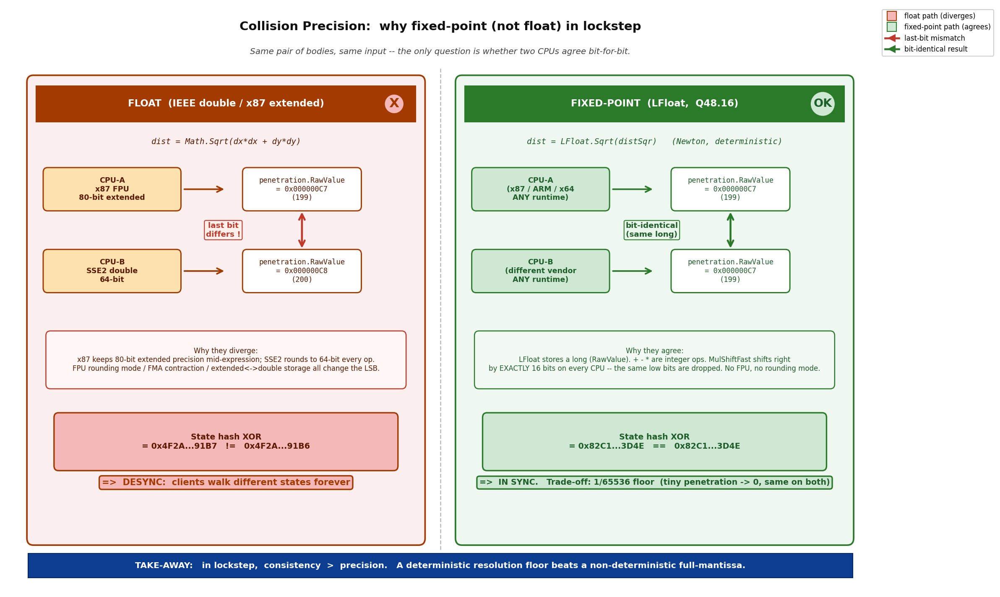

# 第 26 章 · 碰撞与寻路(轻量):QuadTree + NavMesh

> **核心问题**:前面二十五章我们造的"确定性机器"——定点数、有序 ECS、序列化、预测回滚、网络时钟——管的是"游戏逻辑"那一层。但还有两块特别吃"数值精度"和"算法顺序"的东西没碰:**碰撞检测**和**寻路**。它们和普通游戏里的碰撞寻路有什么根本不同?一句话:**普通游戏算错一点点没人发现,帧同步游戏算错最低一位,两台机器从此分叉**。所以这章不讲 QuadTree 怎么四分空间、SAT 怎么投影(那是《物理引擎》那本讲透的),而是讲帧同步给碰撞和寻路强加的那条铁律——**所有运算必须跨端位级一致**,以及踩过的一个真实的物理正确性 bug(世界逆惯性)。

> **读完本章你会明白**:
> 1. 为什么帧同步的碰撞检测和寻路,**整条计算链路必须用定点数**(LFloat/LVector2),不能在任何一环引入 IEEE 浮点——哪怕是一个 `Math.Sqrt` 都能让两台机器分叉。
> 2. 物理求解器(LContactSolver)的结果为什么会进游戏状态、进状态哈希,所以"物理也必须确定性"不是一个口号,而是哈希校验硬绑定的契约。
> 3. 一个真实的物理正确性 bug——接触约束在世界空间却读了局部逆惯性(`LocalInverseInertia`),旋转刚体角响应算错;以及为什么它"必须在性能优化之前修",修完还会让哈希值变化(必须显式声明)。
> 4. 确定性寻路的两道关:A* 的二叉堆出队顺序必须确定(F 值相等时用次键破并列),启发式函数必须用定点数——这两条任意一条不满足,寻路结果就跨端不一致。

> **如果一读觉得太难**:这章是轻量横切章。先只记住三件事——① 碰撞寻路所有计算用 LFloat,不能用 float;② 物理结果进状态进哈希,所以物理也必须确定性;③ A* 的堆在 F 值相等时要用次键(节点索引)破并列,否则出队顺序不确定就 desync。碰撞检测的几何原理(QuadTree/SAT/接触流形)本书不重复讲,指路《物理引擎》那本。

---

## 〇、一句话点破

> **碰撞和寻路,本身是普通的算法问题——QuadTree 四分空间、SAT 投影分离轴、A* 堆搜最短路,《物理引擎》和任何算法书都讲透了。但搬到帧同步里,它们就多了一层铁律:整条计算链路的每一个乘法、每一次比较、每一次堆的出队,都必须跨端位级一致。于是 LFloat 取代 float,LBinaryHeap 在 F 值相等时用次键破并列,启发式函数退回定点查表。这些不是为了"算得更准",而是为了"两台机器算出同一个结果"。**

这是结论。本章倒过来拆:先讲为什么碰撞寻路必须确定性,再讲定点数物理的精度权衡,再讲那个世界逆惯性的真实 bug,最后讲确定性寻路的两道关。

---

## 一、先交接:碰撞检测原理本书不重讲

开章第一件事,把范围讲清楚。

碰撞检测,无论是不是帧同步,核心都是同一套几何:**宽相位(broad phase)用空间划分结构快速筛出"可能相交"的物体对,窄相位(narrow phase)对每一对候选做精确的几何相交测试**。本书 LockstepSdk 的 `Lockstep.Collision` 用的就是最经典的组合——

- **宽相位**:`QuadTree`(四叉树)。把世界递归四分,每个叶子节点存少量物体,查询时只遍历与查询区域相交的子树。MaxItems=8, MaxDepth=8([QuadTree.cs:39-40](C:/Users/86133/Desktop/Program/LockstepSdk/src/Lockstep.Collision/QuadTree.cs#L39))。
- **窄相位**:三种形状 `Circle` / `AABB` / `OBB`([Shapes/](C:/Users/86133/Desktop/Program/LockstepSdk/src/Lockstep.Collision/Shapes/)),两两组合走专门的相交函数(`CircleVsCircle` / `CircleVsAABB` / `OBBVsOBB` 等),OBB 用 SAT(分离轴)投影。

> **承接书讲过**:这一整套——QuadTree 怎么 Subdivide/Insert/Query、AABB 怎么算世界包围盒、OBB 的 SAT 怎么选分离轴、接触流形(ContactManifold)怎么生成——和《物理引擎》那本讲的 Box2D 的做法**在几何原理上完全一样**。本书不重复讲,需要几何直觉请翻 [[physics-engine-source-facts]](那本把宽相三棵动态树、SAT 无独立函数融在 `b2CollideXxx`、接触约束 9 阶段求解器、约束图 24 色着色并行化都讲透了)。

本章只讲帧同步给这套东西强加的、普通碰撞库不需要操心的事。

---

## 二、为什么碰撞寻路必须确定性:它们的结果进哈希

这是整章的"为什么"。先把这个根本问题钉死。

普通游戏里,碰撞检测算出来"两个物体这一帧有没有相撞、撞了多深、法线朝哪",结果交给游戏逻辑(扣血、推开、播放音效)。算得准不准、甚至这一帧算错了一下,通常无所谓——下一帧自己又算对了,玩家看不出来。

帧同步里不行。回忆第 23 章讲的状态哈希:每一帧结束,所有客户端要把自己算出来的**完整游戏状态**哈希一遍,互相核对。这个"完整游戏状态"包括什么?——包括每个实体的位置、速度、朝向,**还包括物理引擎算出来的碰撞响应(冲量、位置修正后物体停在哪)、寻路算出来的路径节点**。

```
碰撞检测的结果 ──→ 物体的新位置/速度(进 Transform/Velocity 组件)
                          │
                          ↓
                   World.SaveState 序列化
                          │
                          ↓
                   增量哈希 XOR / 全量哈希重算
                          │
                          ↓
                   HashReport 广播, 全员比对
```

**只要任何一台机器在碰撞的任何一步算出不一样的值——哪怕位置只差最低一位 RawValue——哈希就对不上,就是 desync**。寻路同理:A* 算出来的路径节点序列,会驱动单位移动,移动结果进位置组件,进哈希。

> **钉死这件事**:碰撞和寻路不是"表现层"的东西(表现层算错了最多画面抖一下),它们是"逻辑层"的东西——它们的输出**直接进游戏状态**,而游戏状态**直接进哈希**。所以它们和定点数、随机数、ECS 遍历顺序一样,必须跨端位级一致。这是哈希校验硬绑定的契约,不是"最好一致"的建议。

这就引出了第一个具体要求:整条计算链路必须用定点数。

---

## 三、定点数碰撞:整条链路不能有一个 float

碰撞检测涉及大量几何运算:距离、点积、叉积、平方根、三角函数。普通碰撞库(比如 Box2D 的 C++ 原版)这些全用 `float`/`double`。帧同步里,这些**每一个**都得换成定点数版本。

### 3.1 形状参数全用 LFloat

先看最基础的——形状定义本身。`Lockstep.Collision` 的所有形状,参数清一色定点数:

```csharp
// Shapes/Circle.cs(简化示意)
public struct Circle : IShape
{
    public LVector2 Center;
    public LFloat  Radius;          // 定点数半径, 不是 float
}

// Shapes/OBB.cs(简化示意)
public struct OBB : IShape
{
    public readonly LVector2 HalfExtent;   // 定点数半长
    public readonly LFloat   Rotation;     // 定点数旋转角
}
```

> **承 P1-02/03**:`LFloat` 是 Q48.16 定点数——用 `long` 存,低 16 位是小数。它的全部意义(第 2 章)就是"跨平台位级一致":同一份 RawValue,在任何 CPU、任何运行时上,加法就是 long 加法、乘法走 `LMath.MulShiftFast` 的确定路径,**绝不会像 IEEE 浮点那样因为 FPU 舍入模式、扩展精度、FMA 而分叉**。

### 3.2 距离和相交:连 Sqrt 都要换

碰撞检测里最频繁的一个运算是"两点距离"。Circle vs Circle 的核心就是:圆心距 ≤ 半径和,则相交。朴素写法:

```csharp
// 朴素(有 desync 风险):
var dx = a.Center.X - b.Center.X;
var dy = a.Center.Y - b.Center.Y;
var dist = Math.Sqrt(dx*dx + dy*dy);   // ← 浮点 Sqrt!
if (dist <= a.Radius + b.Radius) ...
```

这一行 `Math.Sqrt` 就是 desync 源——它是硬件浮点,跨 CPU 的最后一位可能不一致(回忆第 2 章讲的 FPU 扩展精度问题)。`Lockstep.Collision` 里它被换成 `LFloat.Sqrt`(定点牛顿迭代,第 3 章讲过),而且**还多做了一步优化**:先用平方距离比较,只在必须算精确距离时才开方:

```csharp
// CollisionDetection.cs:40-49(CircleVsCircleResult 核心, 简化)
var diff = a.Center - b.Center;
var distSqr = diff.SqrMagnitude;              // 平方距离, 不开方
var radiusSum = a.Radius + b.Radius;
if (distSqr > radiusSum * radiusSum)
    return CollisionResult.None;              // 平方距离比较, 省一次 Sqrt
var dist = LFloat.Sqrt(distSqr);              // 确定性开方(牛顿迭代)
var depth = radiusSum - dist;
var normal = diff / dist;                      // 法线归一化
```

> **技巧小注**:先用 `distSqr > radiusSum*radiusSum` 排除不相交的情况,只在相交时才算 `Sqrt`。这既省性能(大多数物体对不相交,Sqrt 是最贵的运算之一),又是确定性写法——少算一次定点 Sqrt,就少一次牛顿迭代的位级运算。一举两得。

### 3.3 旋转和投影:三角函数走查表

OBB(有向包围盒)和任何带旋转的碰撞,都涉及三角函数(`cos`/`sin` 算旋转矩阵,或 SAT 投影时的轴向)。这些**绝对不能用 `Math.Cos`/`Math.Sin`**(硬件浮点,跨平台不一致),必须用 `LFloat.Cos`/`LFloat.Sin`——也就是第 3 章讲的查表(LUT):

```csharp
// Shapes/OBB.cs:37-38(构造时算旋转轴)
var cos = LFloat.Cos(rotation);   // 查 LUTSinCos 表, 不是 Math.Cos
var sin = LFloat.Sin(rotation);
```

> **承 P1-03**:三角函数查表的精度——sin/cos 用 4096 点表,精度约 12 位;atan2 用 64×64 二维表,精度 6-10 位。这个精度对碰撞检测够不够?够——碰撞关心的角度分辨率远粗于 12 位。但要注意,查表本身就是"以精度换确定性"的权衡,这也是为什么碰撞参数(半径、半长)别取得太小(进不了小数位的量会被截掉)。

### 3.4 定点 vs 浮点碰撞:精度权衡

这是本节要讲清的"精度权衡"。定点数碰撞相比浮点碰撞,有三个要注意的地方:

1. **分辨率下限**。LFloat 精度是 1/65536 ≈ 0.000015。两个物体的穿透深度(`penetration`)如果小于这个值,会被截成 0,等于"没穿透"。普通游戏无所谓,帧同步里这反而**保证了两台机器一致**——大家都截成 0,不会一个算 0.000001 一个算 0.000002。这是特性不是 bug。

2. **大数吃精度**。坐标越大(LFloat 高位被整数部分占满),小数部分的有效位数越少。一个在地图边缘(坐标 ±10000)的物体,它的小数运算精度比在原点附近的物体低。游戏设计上要把地图尺寸控制在合理范围(本书坐标系一般在 ±1000 量级,RawValue 约 2^26,小数位充裕)。

3. **乘法链的累积误差**。一次定点乘法 `MulShiftFast` 右移 16 位会丢掉低 16 位(这是定点数的本质,第 2 章讲过)。碰撞里一次距离计算可能涉及好几次乘法(平方、点积),每次丢一点低位,**但只要两台机器丢的是同样的低位,结果就一致**。这正是定点数相对浮点的优势:浮点是"每次运算各自舍入且舍入模式可能不同",定点是"每次运算确定地丢同样的位"。


*图 26-1:定点数碰撞 vs 浮点碰撞的精度行为。左:浮点碰撞,两台机器(CPU-A 用扩展精度 80bit、CPU-B 用 64bit)对同一对物体的穿透深度算出不同最低位,哈希分叉。右:定点数碰撞,LFloat 的 RawValue 在两台机器上都是同一个 long,乘法走 MulShiftFast 的确定路径,丢掉同样的低 16 位,结果位级一致,哈希相同。代价是定点数有 1/65536 的分辨率下限,极小穿透被截成 0——但这恰恰保证了一致性。*

> **小结**:定点数碰撞的核心不是"更准",而是"更一致"。它用一个确定的精度下限(1/65536),换来了"两台机器算出同一个 RawValue"。在帧同步里,一致性永远比精度优先级高。

---

## 四、为什么物理也必须确定性:求解器结果进哈希

碰撞检测只回答"有没有撞、撞多深"。但游戏里还要回答"撞了之后怎么办"——这就是物理求解器(Physics Solver)的活:算冲量、修正位置、让物体弹开或滑过。`LockstepSdk` 的 3D 物理在 `Lockstep.Core/Physics3D/` 下,核心是 `LContactSolver`。

这一节要回答的问题:**物理求解器为什么也必须确定性?**

答案其实第二节已经埋下了:物理求解器的输出——物体碰撞后的新速度(`LinearVelocity`/`AngularVelocity`)和位置修正后的新位置(`Position`)——**会写回到刚体组件里,进游戏状态,进哈希**。所以物理求解器和碰撞检测一样,是"逻辑层"的东西,它的每一步运算必须跨端一致。

`LContactSolver` 用的是**顺序冲量法(Sequential Impulse)**,核心循环(简化自 [LContactSolver.cs:30-61](C:/Users/86133/Desktop/Program/LockstepSdk/src/Lockstep.Core/Physics3D/LContactSolver.cs#L30)):

```csharp
public void Solve(IReadOnlyList<ContactManifold> contacts, int iterations)
{
    InitializeConstraints(contacts);                 // 1. 把接触点转成约束
    for (int i = 0; i < _constraints.Count; i++) {   // 2. 预计算有效质量等
        var c = _constraints[i];
        PrepareConstraint(ref c);
        _constraints[i] = c;
    }
    for (int iter = 0; iter < iterations; iter++)    // 3. 迭代求解冲量
        for (int i = 0; i < _constraints.Count; i++) { ... SolveConstraint(ref c); ... }
    for (int i = 0; i < _constraints.Count; i++) {   // 4. 位置修正(Baumgarte)
        ... ApplyPositionCorrection(ref c); ...
    }
}
```

这里要讲的帧同步要点是:

1. **整个求解器全用 LFloat/LVector3**。有效质量、冲量、累积冲量、恢复系数、摩擦系数,全是定点数。一次 `SolveConstraint` 里几十次乘加,每一次都走 `MulShiftFast` 的确定路径。

2. **迭代次数固定**。`iterations` 是传入参数,不是"收敛了就停"。两台机器必须跑完全相同次数的迭代——因为顺序冲量法是**迭代逼近**,迭代次数不同,结果就不同。这也是为什么求解器不会写"误差小于阈值就提前退出"——那种写法在浮点物理里是优化,在帧同步里是 desync 源(两台机器浮点误差不同,一个提前退出一个继续迭代,结果分叉)。

3. **约束遍历顺序固定**。`_constraints` 是 `List<ContactConstraint>`,按插入顺序遍历(接触流形生成的顺序)。不能用 `Dictionary` 或 `HashSet`(遍历顺序不定,第 24 章红线清单),不能排序时用非稳定排序(第 5 章讲过 List.Sort 非稳定会破坏确定性)。

> **钉死这件事**:物理求解器不是"表现层物理"(那种算个大概让物体别穿模就行),它是"逻辑层物理"——它的输出进哈希。所以它和碰撞检测、和定点数数学库、和 ECS 遍历一样,必须每一步确定。任何"自适应迭代""误差提前退出""用 Dictionary 存约束"的写法,都是帧同步的毒药。

这一节自然引出下一个话题:这个物理求解器,踩过一个真实的正确性 bug——世界逆惯性。

---

## 五、真实 bug:接触约束在世界空间却读了局部逆惯性

这是本章的重点案例,也是 `OPTIMIZATION_PLAN.md` 阶段 1 的第一条(P0 正确性)。它正好说明"物理必须正确,而且正确性优先于性能"。

### 5.1 背景:世界空间 vs 局部空间的逆惯性张量

物理求解器算冲量时,要把"角冲量"转换成"角速度变化"。这个转换用的是刚体的**逆惯性张量(Inverse Inertia Tensor)**。惯性张量描述"刚体绕某轴转动的难易程度",逆张量就是"给定力矩,产生多大角加速度"。

关键在于:惯性张量有两个空间——

- **局部空间(`LocalInverseInertia`)**:刚体自身的坐标系,惯性张量是对角的(刚体的主轴方向)。
- **世界空间(`WorldInverseInertia`)**:把局部张量用刚体的旋转矩阵变换到世界空间(`I_world^-1 = R · I_local^-1 · R^T`)。

碰撞约束(接触法线、接触点、相对位置)都是在**世界空间**表达的。所以算"世界空间的法线方向上的有效逆惯性",必须用**世界空间逆惯性张量**。

### 5.2 bug:读错了空间

`LContactSolver` 的 `PrepareConstraint` 原本这么写(简化示意,bug 版):

```csharp
// bug 版(简化示意, 非源码原文):
var invIA = bodyA.LocalInverseInertia;   // ← 读的是局部空间!
var invIB = bodyB.LocalInverseInertia;   // ← 同上
var angularA = new LVector3(raCrossN.x * invIA.x, ...);   // 但 raCrossN 是世界空间!
```

接触约束的 `RA`/`RB`(接触点相对刚体质心的位置向量)、`Normal`(接触法线)都是世界空间的,却乘上了**局部空间**的逆惯性张量。只有当刚体**没有旋转**(旋转角度为 0,局部轴 = 世界轴)时,两者才相等;一旦刚体转了,局部张量在世界空间里就是错的——**算出来的角响应(角速度变化)方向错了,大小也错了**。

讽刺的是,同一个 `LRigidbody3D` 里的 `IntegrateVelocity`([LRigidbody3D.cs:317](C:/Users/86133/Desktop/Program/LockstepSdk/src/Lockstep.Core/Physics3D/LRigidbody3D.cs#L317))用的是正确的 `GetWorldInverseInertia()`,只有求解器读错了。

> **作者复盘 · 为什么这种 bug 最阴险**:这种 bug 不会让游戏崩溃,也不会让物理"看起来完全错"。旋转刚体碰撞时,角速度变化只是"有点偏",视觉上可能就是物体弹开时的旋转姿态和"真实物理"差一点。在单人游戏里完全可玩。但在帧同步里,这个"差一点"会累积进位置/速度组件,进哈希,**两台机器的旋转刚体很快分叉**。而且因为 `LocalInverseInertia` 和 `GetWorldInverseInertia()` 在无旋转时相等,只测"平放方块碰撞"的单元测试根本测不出来——必须专门测"旋转刚体受冲量"才会暴露。

### 5.3 修复:缓存世界逆惯性到约束

修复见 [LContactSolver.cs:111-115](C:/Users/86133/Desktop/Program/LockstepSdk/src/Lockstep.Core/Physics3D/LContactSolver.cs#L111)(当前源码,已修):

```csharp
// PrepareConstraint(LContactSolver.cs:111-115, 当前源码)
// 修复:接触约束在世界空间, 须用【世界空间】逆惯性(LocalInverseInertia 仅在刚体无旋转时才正确)。
// 缓存到约束:求解迭代期间刚体旋转不变(rotation 在 IntegrateVelocity 之后才更新),
// 可复用, 避免每迭代重复 GetWorldInverseInertia 的 50+ 次乘法。
var invIA = c.InvIA = bodyA.GetWorldInverseInertia();
var invIB = c.InvIB = bodyB.GetWorldInverseInertia();
```

修复有两层巧妙:

1. **正确性**:`GetWorldInverseInertia()` 把局部逆惯性张量用刚体的旋转轴投影到世界空间,见 [LRigidbody3D.cs:447-468](C:/Users/86133/Desktop/Program/LockstepSdk/src/Lockstep.Core/Physics3D/LRigidbody3D.cs#L447)(`I_world^-1 = R · I_local^-1 · R^T` 的对角近似)。这才是世界空间约束应该用的值。

2. **性能(一举两得)**:把世界逆惯性**缓存到约束结构体**(`c.InvIA`/`c.InvIB`,见 [ContactConstraint 结构体:385-387](C:/Users/86133/Desktop/Program/LockstepSdk/src/Lockstep.Core/Physics3D/LContactSolver.cs#L385)),后续 `SolveConstraint` 和 `ApplyImpulse` 直接读缓存,不再每迭代重算。`GetWorldInverseInertia()` 一次要 50+ 次乘法(三轴投影),迭代求解器通常跑 4-10 次迭代,每次迭代对每个约束都要用逆惯性——缓存下来省掉的就是 `(迭代次数 - 1) × 50+` 次乘法。

> **为什么缓存是合法的**:注释里写得很清楚——"求解迭代期间刚体旋转不变"。求解器的循环里只改 `LinearVelocity`/`AngularVelocity` 和累积冲量,**不改 `Rotation`**(旋转在后面的 `IntegrateVelocity` 阶段才更新)。所以一次 `Solve()` 调用期间,世界逆惯性是常量,缓存安全。这是一个典型的"不变量分析指导缓存"的优化。

### 5.4 这个 bug 修复的特殊性:它会让哈希值变化

这是本案例最值得讲的一点,也是 `OPTIMIZATION_PLAN.md` 特别强调的([:83-87](C:/Users/86133/Desktop/Program/LockstepSdk/docs/OPTIMIZATION_PLAN.md#L83))。

大多数 bug 修复(比如第 25 章讲的那些)不会让哈希值变化——因为它们修的是"会崩溃""会 desync"的问题,修完之后游戏状态变得更一致了,哈希反而更稳定。

但世界逆惯性这个 bug 不一样:**它修完之后,物理求解器算出来的角速度/位置会变**(因为现在用的是正确的世界空间逆惯性,角响应方向和大小都变了)。如果物理参与了确定性 golden 测试序列,**golden 哈希值会变化**。

这意味着两件事:

1. **必须更新 golden 值**,并在提交说明里**显式声明**"因修复世界逆惯性而变更物理行为"。否则 CI 会报"哈希不匹配",看起来像新引入的 bug,其实是修了老 bug。

2. **断线重连的快照兼容性**:如果对局中途更新了这个修复,旧快照和新代码算出来的状态会不一致。所以这种修复必须在版本号(`SerializationVersion`)或协议层面有交代,不能悄悄上线。

> **钉死这件事**:这是帧同步工程里一个反直觉的规则——**不是所有 bug 修复都让哈希"更稳定",有些修复本身就会改变哈希**。这类"改变物理行为"的修复,必须配套:更新 golden 测试 + 显式声明 + 提供修复前后的可复现回放(`.lsr`)对比。`OPTIMIZATION_PLAN.md` 把它列为"少数会让 HashReport 变化的改动",正是这个原因。

**当前状态**:已修。`LContactSolver.cs` 当前源码用的是 `GetWorldInverseInertia()` 并缓存到 `ContactConstraint.InvIA/InvIB`,所有引用点(`PrepareConstraint`、`ComputeTangentMass`、`ApplyImpulse`)都读缓存值。这是写书时 Grep/Read 核实的真实状态,不是"计划要修"。

---

## 六、确定性寻路:堆的出队顺序和定点启发式

碰撞讲完,讲寻路。寻路(尤其 A*)的几何/算法原理,任何一本算法书或游戏 AI 书都讲透了——开放列表用最小堆、G 是已走代价、H 是启发式估计、F=G+H、每次弹 F 最小的节点扩展。本书的 `Lockstep.Pathfinding`(`LAStar` / `LNavMeshAStar`)也是这个套路。

本章只讲帧同步给 A* 强加的两道关。

### 6.1 第一关:堆的出队顺序必须确定——次键破并列

A* 的核心数据结构是**最小堆(优先队列)**,存待扩展的节点,按 F 值排序。标准 A* 实现,堆里比较的就是 F 值。

问题来了:**两个节点的 F 值相等怎么办?**

普通游戏里无所谓——堆的实现(`.NET` 的 `PriorityQueue` 或手写堆)随便挑一个先出,路径长度一样,最终结果(最短路径)也一样。A* 的正确性保证的是"找到一条最短路径",不保证"找到唯一一条最短路径"——多条等长最短路径时,出哪个先无所谓。

但帧同步里**绝对有所谓**。两个 F 值相等的节点,堆可能先弹 A 也可能先弹 B(取决于插入顺序和堆的内部分支),**而先弹哪个决定了后续扩展的顺序,决定了路径节点序列**。两条等长路径,节点序列不同,单位按不同路径走,每帧位置就不同,进哈希的值就不同——desync。

> **不这样会怎样**:假设地图上有个对称障碍,起点到终点有两条镜像等长路径。客户端 1 的堆先弹左路节点,算出走左路;客户端 2 的堆先弹右路节点,算出走右路。两个单位从同一帧开始,一个往左一个往右,第二帧位置就不同,哈希分叉。整局游戏从此 desync。

`Lockstep.Pathfinding` 的解法是 `LBinaryHeap<T>`——**在 F 值相等时,用一个"次键(secondary key)"来打破并列**,保证出队顺序确定。见 [LBinaryHeap.cs:14-19](C:/Users/86133/Desktop/Program/LockstepSdk/src/Lockstep.Pathfinding/Algorithms/LBinaryHeap.cs#L14):

```csharp
// LBinaryHeap.cs:14-19(简化示意)
internal class LBinaryHeap<T> where T : struct
{
    private T[]       _items;
    private LFloat[]  _priorities;                  // 主键(F 值), 平行数组
    private readonly Func<T, int>? _getSecondaryKey; // 次键(节点索引), F 相等时定序
    ...
}
```

比较逻辑([:124-140](C:/Users/86133/Desktop/Program/LockstepSdk/src/Lockstep.Pathfinding/Algorithms/LBinaryHeap.cs#L124)):

```csharp
private int Compare(T a, LFloat priorityA, T b, LFloat priorityB)
{
    if (priorityA < priorityB) return -1;        // 先比 F(主键)
    if (priorityA > priorityB) return 1;
    // F 相等时, 用次键保证确定性
    if (_getSecondaryKey != null) {
        int keyA = _getSecondaryKey(a);          // 次键 = 节点索引
        int keyB = _getSecondaryKey(b);
        return keyA.CompareTo(keyB);             // 索引小的先出
    }
    return 0;
}
```

A* 用的次键是**节点在网格里的索引**(`idx => idx`,见 [LAStar.cs:62](C:/Users/86133/Desktop/Program/LockstepSdk/src/Lockstep.Pathfinding/Algorithms/LAStar.cs#L62))。节点索引由网格坐标唯一确定(`GridToIndex`),两台机器网格相同,索引相同,F 相等时谁先出就完全确定。

> **技巧小注**:这里有个性能细节值得一提。主键(F 值)存在**平行数组** `_priorities[]` 里,而不是用一个 `Func<T, LFloat>` 委托每次比较时去算 F=G+H。原注释([:11-12](C:/Users/86133/Desktop/Program/LockstepSdk/src/Lockstep.Pathfinding/Algorithms/LBinaryHeap.cs#L11))说得很清楚:"优先级(主键)通过平行 `_priorities` 数组直接索引,消除每次比较的 `Func` 委托调用与 F=G+H 重算;次键(仅优先级相等时触发)仍用委托,因其调用频率低"。这是"确定性设计"和"性能优化"碰巧同向的例子——平行数组既消除了委托调用(性能),又让主键比较确定(确定性),而次键只在并列时才查,频率低,委托开销可接受。

### 6.2 第二关:启发式函数必须定点——以及 H 值缓存

A* 的 H(启发式)是"当前节点到终点的估计距离"。常用三种:曼哈顿距离(4 方向)、对角距离(8 方向)、欧几里得距离(任意方向)。

普通游戏里 H 用浮点算(`Math.Abs`、`Math.Sqrt`)。帧同步里,**H 必须用定点数算**——因为 H 进 F,F 决定堆的出队顺序,出队顺序决定路径,路径进哈希。`LAStar.CalculateHeuristic`([:225-261](C:/Users/86133/Desktop/Program/LockstepSdk/src/Lockstep.Pathfinding/Algorithms/LAStar.cs#L225))三种启发式全是 LFloat 运算:

```csharp
// LAStar.cs:225-261(简化)
private LFloat CalculateHeuristic(LVector2Int from, LVector2Int to)
{
    int dx = Math.Abs(from.X - to.X);    // 整数 Abs, 确定
    int dy = Math.Abs(from.Y - to.Y);
    switch (Heuristic) {
        case Manhattan:  h = LFloat.FromInt(dx + dy); break;
        case Diagonal:   // 对角距离: max(dx,dy) + (√2-1)*min(dx,dy)
                          h = LFloat.FromInt(maxD) + (DiagonalCost - One) * FromInt(minD); break;
        case Euclidean:  h = LFloat.Sqrt(FromInt(dx)*FromInt(dx) + FromInt(dy)*FromInt(dy)); break;
    }
    return h * HeuristicWeight;
}
```

注意几个确定性细节:

1. **对角代价 `DiagonalCost` 是预计算的定点常量** `LFloat.FromRaw(92682)`(约 1.414,见 [LGrid2D.cs:107](C:/Users/86133/Desktop/Program/LockstepSdk/src/Lockstep.Pathfinding/Data/LGrid2D.cs#L107))——不在线算 √2(那样每次牛顿迭代有开销且要保证一致),直接烤进常量。

2. **欧几里得距离用 `LFloat.Sqrt`**(定点牛顿迭代),不是 `Math.Sqrt`。

3. **H 值缓存**:一个节点首次被访问时算一次 H,之后即使找到更短 G 也不重算 H。注释([:186-189](C:/Users/86133/Desktop/Program/LockstepSdk/src/Lockstep.Pathfinding/Algorithms/LAStar.cs#L186))解释:"H 只依赖位置与终点(本轮不变),仅首次访问时计算;已开放节点找到更短 G 时无需重算 H(避免重复 `CalculateHeuristic`,尤其 Euclidean 含 Sqrt)"。这又是性能与确定性的双赢——少算 Sqrt 既快又少一次位级运算。

### 6.3 NavMesh 与 FlowField:同样的确定性纪律

`LAStar` 是网格 A*。`Lockstep.Pathfinding` 还提供 NavMesh 版(`LNavMeshAStar`,在多边形图上搜)和 FlowField(`LFlowField`,从终点反向扩散方向场,适合大量单位)。它们的确定性纪律和网格版一样:

- **NavMesh A***:同样用 `LBinaryHeap<int>`(次键=多边形索引),同样定点启发式(`CalculateHeuristic` 用 `LFloat`),同样 searchId 机制避免重置数组(确定性 + 性能)。
- **FlowField**:用 Dijkstra(或 BFS)从终点反向扩散,每格存一个到终点的距离和指向下一格的方向向量。方向的归一化是个坑——朴素写法每格算一次 `dir.Normalized`(定点 Sqrt + 除法)。`LGrid2D` 把 8 方向的归一化向量**预计算成静态查表** `NormalizedDirections8`([:89-104](C:/Users/86133/Desktop/Program/LockstepSdk/src/Lockstep.Pathfinding/Data/LGrid2D.cs#L89)),FlowField 生成时直接查表([LFlowField.cs:334-336](C:/Users/86133/Desktop/Program/LockstepSdk/src/Lockstep.Pathfinding/Algorithms/LFlowField.cs#L334)):"预计算查表(`NormalizedDirections8`),替代每格 `Normalized` 的 Sqrt+除法;数值与原实现对角 `(DiagonalCost/StraightCost).Normalized`、直方向自身完全一致"。少算几万次 Sqrt,且查表天然确定。

> **寻路请求队列**:`PathRequestQueue`(`Query/PathRequestQueue.cs`)管理寻路请求的批处理,请求带优先级枚举(`Low/Normal/High/Critical`)。它本身是个调度结构,只要按确定顺序处理请求(同优先级内按 RequestId 排序),就不破坏确定性。注意它**目前是同步处理**(状态枚举里 `Processing` 是"预留给未来的异步/分帧 A*",见 [:34](C:/Users/86133/Desktop/Program/LockstepSdk/src/Lockstep.Pathfinding/Query/PathRequestQueue.cs#L34))——帧同步里 A* 不能真异步(异步意味着不确定何时完成,跨端不一致),只能同步在一帧内算完。

---

## 七、技巧精解

挑两个最值得拆的技巧讲透。

### 技巧一:QuadTree 宽相位的确定性去重

碰撞检测的宽相位,QuadTree 的 `GetPotentialCollisions` 会把"可能相交的物体对"枚举出来。但 QuadTree 有个特性:**一个物体如果横跨多个子节点的边界,会被插入到所有相交的子节点里**([QuadTree.cs:447-460](C:/Users/86133/Desktop/Program/LockstepSdk/src/Lockstep.Collision/QuadTree.cs#L447),`InsertIntoChildren` 允许一物多插,解决边缘堆积问题)。

这导致一个后果:同一对物体可能被 QuadTree 枚举多次(物体 A 在子节点 1,物体 B 也在子节点 1,但它们也可能都在子节点 2)。如果不去重,精细检测(`DetectCollision`)会被重复调用,既浪费性能,又——更重要的是——**如果精细检测有任何副作用或累加,重复调用会破坏确定性**。

`CollisionWorld` 的去重用一个 `HashSet<long> _checkedPairs`([:120](C:/Users/86133/Desktop/Program/LockstepSdk/src/Lockstep.Collision/CollisionWorld.cs#L120)),key 是 `(MinId << 32) | MaxId`([:296-299](C:/Users/86133/Desktop/Program/LockstepSdk/src/Lockstep.Collision/CollisionWorld.cs#L296)):

```csharp
// CollisionWorld.cs:296-302(去重核心)
int idA = itemA.Id, idB = itemB.Id;
long key = idA < idB 
    ? ((long)idA << 32) | (uint)idB 
    : ((long)idB << 32) | (uint)idA;
if (!World._checkedPairs.Add(key))   // HashSet.Add 返回 false = 已存在, 跳过
    return;
```

技巧在于:**把两个 int 的 Id 编码成一个 long 的唯一 key**(小的放高位,大的放低位,保证 (A,B) 和 (B,A) 生成同一个 key)。这样去重既快(HashSet O(1) 查找),又确定(同一对物体无论被枚举几次,只过一次精细检测)。

> **反面对比**:如果不去重,会发生什么?假设 `DetectCollision` 里有任何浮点/定点运算的累积误差,重复调用会让误差叠加——客户端 1 枚举了 3 次,客户端 2 枚举了 2 次(因为 QuadTree 结构因插入顺序略有不同),算出来的穿透深度就不同。去重从根上消除了这种风险。这是"确定性优先"思想的又一个体现:不只保证算法本身确定,还保证它**不被调用不确定次数**。

### 技巧二:searchId 机制——避免每轮搜索重置数组

A* 每次寻路都要把节点数组(`_nodes`)的状态重置成"未访问"。朴素做法是每次寻路前遍历整个数组清零——对一个 1000×1000 的网格就是 100 万次赋值,且这 100 万次要发生(确定性要求每次都做)。

`LAStar` 用了一个聪明的办法:**searchId 机制**([:46](C:/Users/86133/Desktop/Program/LockstepSdk/src/Lockstep.Pathfinding/Algorithms/LAStar.cs#L46), [:109-111](C:/Users/86133/Desktop/Program/LockstepSdk/src/Lockstep.Pathfinding/Algorithms/LAStar.cs#L109))。每个节点带一个 `SearchId` 字段,记录"它是被第几轮搜索访问的"。每次新寻路,全局 `_searchId++`,只把这次搜索碰到的节点打上新的 searchId 标记。判断一个节点"本轮是否访问过",只要比 `node.SearchId == _searchId`。

```csharp
// LAStar.cs:109-111 + :139-143(简化)
_searchId++;
if (_searchId <= 0) _searchId = 1;    // int 溢出回绕保护
...
// 判断节点是否本轮已关闭:
if (currentNode.SearchId == _searchId && currentNode.State == NodeState.Closed)
    continue;
currentNode.SearchId = _searchId;     // 标记本轮访问
```

这样**只有真正被 A* 访问的节点才被"重置"**(打上新 searchId),其余节点保持旧状态不动。一次寻路可能只访问几千个节点,远少于 100 万。

> **为什么这也是确定性优化**:重置数组本身是确定的(每次都做同样的事),但它浪费 CPU。searchId 机制把"全量重置"变成"增量标记",既快,又**不改变 A* 的结果**(被访问的节点状态一样正确,没被访问的节点本轮根本不会用到)。确定性 + 性能再次同向。

---

## 八、本章小结

回到全书主线"确定性内核 vs 同步机制"。本章服务的是**确定性内核**这一面——碰撞和寻路是确定性内核在"几何/算法"领域的延伸。它们和定点数、随机数、ECS 遍历顺序一样,是"游戏状态"的一部分,所以必须跨端位级一致。

本章的核心要点:

1. **碰撞寻路的结果进游戏状态、进哈希**,所以它们不是表现层,是逻辑层,必须确定性。这是哈希校验硬绑定的契约。

2. **整条计算链路必须用 LFloat**:距离用 `LFloat.Sqrt`(牛顿迭代),旋转用 `LFloat.Cos/Sin`(查表),启发式用定点常量。任何一环引入 IEEE 浮点,就是 desync 源。

3. **物理求解器(顺序冲量法)**必须:迭代次数固定、约束遍历顺序固定、全定点运算。世界逆惯性 bug 是典型案例——接触约束在世界空间却读局部逆惯性,旋转刚体角响应错误;修复用 `GetWorldInverseInertia()` 并缓存到约束,一举两得(正确性 + 性能);但这种修复会让哈希值变化,必须显式声明。

4. **确定性寻路两道关**:堆的出队顺序(F 相等用次键=节点索引破并列)、启发式必须定点。两者任一不满足,寻路结果跨端不一致。

5. **承接处理**:碰撞检测的几何原理(QuadTree/SAT/接触流形/9 阶段求解器/约束图着色并行)本书不重讲,指路 [[physics-engine-source-facts]]。本章篇幅留给帧同步特有的——定点数物理、物理必须确定性的根本原因、世界逆惯性 bug、确定性堆和启发式。

### 五个为什么

1. **为什么碰撞和寻路必须确定性,而普通游戏的碰撞寻路不用管这些?**
   因为帧同步里它们的结果进游戏状态、进状态哈希;算错最低一位,两台机器哈希分叉就 desync。普通游戏算错一点没人发现,帧同步不行。

2. **为什么定点数碰撞的"精度下限"(1/65536)反而是优势?**
   因为它保证两台机器都把小于这个值的穿透截成 0——一致性。浮点碰撞两台机器可能算出不同的最低位,那才是 desync。帧同步里一致性永远优先于精度。

3. **为什么物理求解器不能用"迭代收敛就提前退出"的优化?**
   因为两台机器的浮点(定点)误差不同,可能一台在第 3 次迭代"收敛"、另一台在第 4 次,迭代次数不同结果就不同。帧同步要求迭代次数固定,哪怕多算几次。

4. **为什么世界逆惯性的 bug 修复会让哈希值变化?**
   因为修复后物理求解器用的是正确的世界空间逆惯性,算出的角速度/位置和修复前不同。如果物理参与了 golden 测试,哈希必然变。这种"修 bug 改变行为"的修复必须配套更新 golden 值 + 显式声明 + 提供回放对比。

5. **为什么 A* 的堆在 F 值相等时要用次键破并列?**
   因为 F 相等的两个节点,堆可能先弹任意一个;先弹哪个决定了路径节点序列,路径进哈希。两台机器堆的内部状态若不同(由插入顺序/分支决定),就走出不同等长路径,desync。次键(节点索引)让出队顺序唯一确定。

### 想继续深入往哪钻

- **物理引擎的完整求解器内部**:Box2D 的 9 阶段求解器、约束图 24 色着色并行化、辛欧拉积分、有效质量——指路《物理引擎深入浅出》[[physics-engine-source-facts]],那里把每一个为什么讲透了。本章只讲了帧同步给它加的那层铁律。

- **NavMesh 的生成与漏斗算法(Funnel)**:`LFunnel.cs` 做路径平滑(把多边形中心的折线收缩成贴墙的最短路径)。这是寻路"后处理"的几何精华,但和确定性无关(纯定点几何运算),本章没展开。

- **ORCA 避障**:`Lockstep.Pathfinding/Avoidance/` 提供了 ORCA(Optimal Reciprocal Collision Avoidance)避障,适合 RTS/MOBA 大量单位互相不撞。它是几何(线性规划求速度可行域),同样全定点实现。本章聚焦寻路,避障留给感兴趣读者读源码。

---

> **下一章**:把全书串起来。第 27 章用一个完整的帧同步游戏(TankGame)演示怎么把前面二十六章的东西——定点数、有序 ECS、序列化、预测回滚、网络时钟、碰撞寻路——拼成一个能联机对战、能断线重连、能回放的真实游戏。从一行 `ISimulation` 实现到一个能跑的坦克大战,这是全书的收束。
