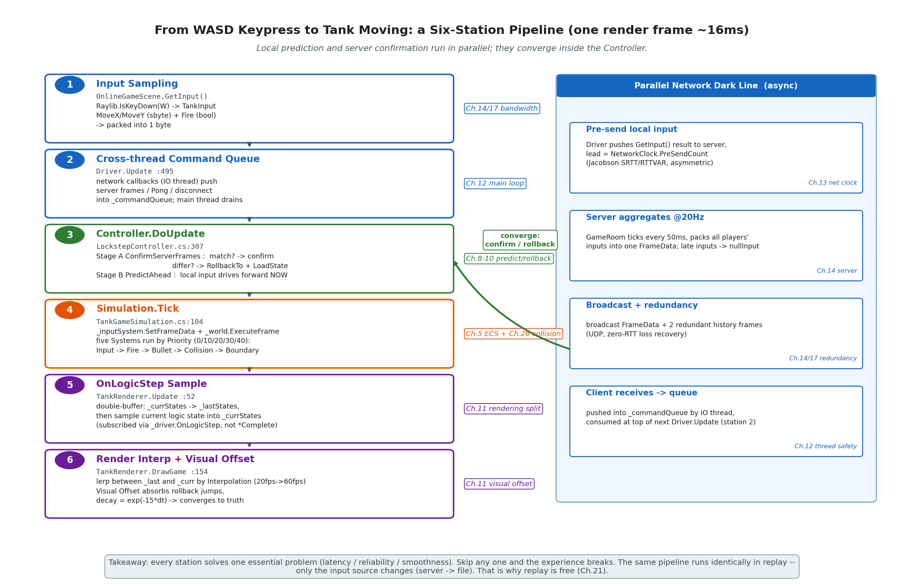
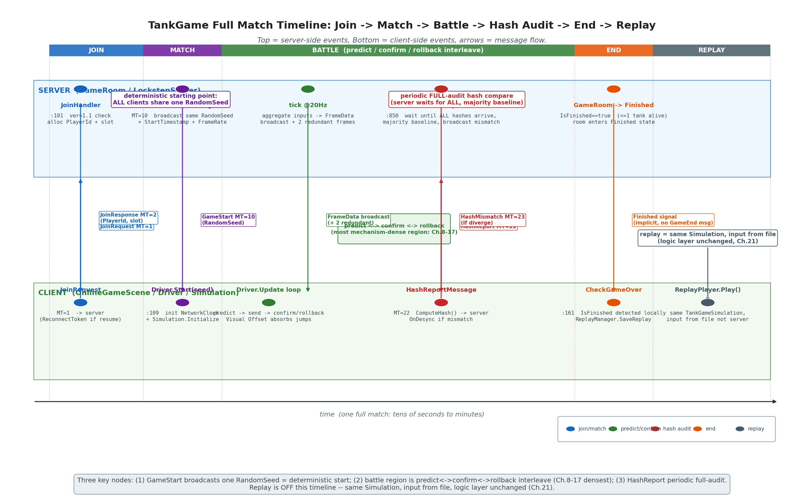

# 第 27 章 · TankGame 实战:把全书串起来

> **核心问题**:前 26 章我们把帧同步拆成了一块块零件——定点数、确定性随机、有序 ECS、字节级序列化、预测回滚、网络时钟、Relay/Authoritative 服务器、冗余帧抗丢包、断线重连、回放、哈希双轨……可这些零件组装起来到底长什么样?一个真实的、能联机的帧同步游戏,从玩家按下 WASD 到屏幕上的坦克动起来,中间到底走了哪条链路?这一章就用 LockstepSdk 自带的 `TankGame` 把全书串起来,让你亲眼看到所有机制在一个游戏里怎么协作。

> **读完本章你会明白**:
> 1. 怎么用 `ISimulation` 这 6 个核心方法把一个普通游戏"接"进帧同步框架——这是接入 SDK 的唯一契约(承第 18 章 SDK 化)。
> 2. TankGame 的 ECS 组件/系统怎么组织(Input/Fire/Bullet/Collision/Boundary 五系统按 Priority 稳定排序),以及"逻辑层只读 ISimulation 状态属性"这条边界的工程意义(承第 5、9 章)。
> 3. 从"按 WASD"到"坦克动起来"的完整链路:输入采集 → 跨线程命令队列 → Driver.Update → Controller.DoUpdate(预测/确认/回滚) → Simulation.Tick → 五系统执行 → OnLogicStep 采样 → 渲染插值 + Visual Offset。
> 4. 一个完整对局的时间线:玩家加入 → 匹配 → GameStart → 对战(预测/确认/回滚交织)→ HashReport 对账 → 结束 → 回放;以及 Relay 与 Authoritative 两种模式在这条时间线上差在哪、反作弊差在哪。
> 5. 逻辑层、表现层、网络层这三层在一个真实游戏里怎么解耦又怎么咬合。

> **如果一读觉得太难**:先只记住三件事——① 任何游戏要接进 LockstepSdk,实现 `ISimulation` 的 6 个方法(`Initialize/Tick/SaveState/LoadState/ComputeHash/Reset`)就够了,框架不关心你游戏具体长啥样;② TankGame 的五个 System 按 `Priority`(0/10/20/30/40)稳定排序逐帧执行,这是确定性内核的纪律,承第 5 章;③ 玩家按一次 WASD,这信号要过"输入采集→预测执行→网络发送→服务器聚合广播→确认/回滚→渲染插值"六站才变成屏幕上的像素移动,全书 26 章的机制全在这条链路上。

---

## 〇、一句话点破

> **一个帧同步游戏就是一台"确定性机器"被"同步机制"驱动着跑:逻辑层(`ISimulation` + ECS + 定点数)负责"相同输入算出相同结果",同步层(Driver + Controller + 时钟 + 网络)负责"把输入按时送到、错了能倒带",表现层(RaylibClient + 插值 + Visual Offset)负责"把 20fps 的逻辑跳变画成 60fps 的平滑画面"。TankGame 把这三层用一个能跑起来的坦克大战串成了一条完整链路——你按 WASD,这条链路上的每一站,都对应前面某一章讲的机制。**

这是结论。本章倒过来拆:先看 TankGame 怎么接入 SDK(ISimulation 契约),再看逻辑层五系统怎么协作,再走一遍"按 WASD 到坦克动起来"的完整链路,最后拉出一条完整对局的时间线,把全书 26 章的机制在一张图上汇合。

---

## 一、TankGame 是什么:一个最小但完整的帧同步游戏

### 1.1 它小,但五脏俱全

`TankGame` 是 LockstepSdk 自带的示例游戏,源码在 `C:/Users/86133/Desktop/Program/LockstepSdk/src/Games/TankGame/`。它的玩法极其朴素:2~4 辆坦克在一个矩形地图上,用 WASD 移动、空格开炮,子弹打中扣血,打到只剩一辆坦克为止。就这么个东西,市面教程能写五十行 demo 讲完。

但这个 TankGame 不是教程 demo。它**完整地**接进了 LockstepSdk 的全部机制:

- 单机模式(本地自驱动,无需服务器)——`run_standalone.bat`;
- 在线对战(UDP + Relay/Authoritative 双模式 + 冗余帧抗丢包)——`run_server.bat` + `run_client.bat`;
- 断线重连(快照 + 增量帧 + ReconnectToken);
- 回放录制与复现(`ReplayRecorder` / `ReplayPlayer`,录输入不录状态);
- AI 对战(观战 = 只收帧不发的重连);
- 哈希对账与反作弊(HashReport 全员到齐才比对);
- 表现平滑(逻辑/渲染帧分离 + 双缓冲插值 + Visual Offset 吸收回滚瞬跳)。

也就是说,前面 26 章讲过的每一个机制,都能在 TankGame 里找到一个具体的调用点。这正是本章的价值:不是教你写坦克大战,是让你**在一个能跑起来的游戏里,看见全书机制怎么组装**。

> **承接第 18 章**:第 18 章讲"怎么把帧同步做成 SDK",核心是 `ISimulation` 这条最小接口——"任何游戏只要实现这 6 个方法就能接入"。本章就是兑现这句话:`TankGameSimulation` 实现了 `ISimulation`,于是它白捡了预测回滚、网络同步、断线重连、回放、反作弊这一整套基础设施。它自己只写了"坦克怎么移动、子弹怎么飞、撞了扣多少血"这些**纯游戏逻辑**。

### 1.2 跑起来三种姿势

主菜单(`MainMenuScene.cs`)给你三个入口,对应三种运行模式:

| 模式 | 启动方式 | Driver 怎么驱动 | 用到了哪些机制 |
|---|---|---|---|
| **单机 / vs AI** | `run_standalone.bat`,菜单选 "Single Player" | `Driver.StartLocal`(自驱动,本地轮询所有玩家输入) | 确定性内核 + 回放录制(单机也能录,因为确定性机器录输入即可复现) |
| **在线对战** | 先 `run_server.bat`,再多个客户端 `run_client.bat` 选 "Online Battle" | `Driver.Start`(连服务器,网络时钟驱动) | 全套:预测回滚 + 网络时钟 + 冗余帧 + HashReport + 重连 |
| **回放** | 主菜单选 "Tank Replays" | `ReplayPlayer` 喂录好的输入流 | 确定性内核 + 表现平滑(回放本质就是"换个输入源,逻辑层完全不变") |

> **钉死这件事**:回放和在线对战在**逻辑层完全没区别**——都是"喂一串输入给 `Simulation.Tick`"。区别只在输入从哪来:在线时输入从服务器来,回放时输入从文件来。这就是第 21 章说的"回放为什么免费":确定性机器 + 录输入 = 完美复现,逻辑层一行都不用改。

---

## 二、接入 SDK 的唯一契约:`ISimulation` 的 6 个核心方法

### 2.1 为什么是这 6 个方法

第 18 章讲 SDK 化时说过:框架要能接纳"任意游戏",就必须找到一条**最小但充分**的接口。`ISimulation`(源码 `src/Lockstep.Core/Simulation/ISimulation.cs`)就是这条接口。它把"游戏模拟"抽象成 6 个核心方法加几个状态属性,框架(LockstepController / LockstepDriver / ReplayPlayer / 服务端 GameRoom)只通过这 6 个方法和你的游戏打交道,绝不直接碰你的组件、你的系统、你的坦克血量。

这 6 个核心方法是:

```
Initialize(playerCount, randomSeed)   // 开局初始化:建玩家、播随机种子
Tick(FrameData frame)                  // 推进一帧:吃进所有玩家这帧的输入,推进世界
SaveState() / SaveState(BitWriter)     // 存快照:回滚/重连/哈希都靠它
LoadState(ReadOnlySpan<byte>)          // 读快照:回滚时恢复到某一帧
ComputeHash()                          // 算状态指纹:对账抓 desync
Reset()                                // 重置到未开始状态
```

> **不这样会怎样**:如果没有这条统一接口,每个游戏都得自己写一套预测回滚、自己写一套网络同步、自己写一套回放——这就是市面大多数帧同步教程 demo 的下场:能跑,但换个游戏就得推倒重来。`ISimulation` 把"游戏长什么样"和"帧同步怎么跑"彻底解耦,这正是 SDK 化的核心(承第 18 章)。

### 2.2 TankGameSimulation 怎么实现这 6 个方法

`TankGameSimulation.cs` 是 `ISimulation` 的实现。它自己只持有 `World`(确定性 ECS 世界)、几个 System 的引用、配置 `TankGameConfig`。6 个方法全是"薄委托":

```csharp
// TankGameSimulation.cs:79
public void Initialize(int playerCount, uint randomSeed)
{
    PlayerCount = playerCount;
    _world.Reset(randomSeed);           // 播随机种子(LRandom 状态由此确定)

    _world.GetPool<TransformComponent>();
    _world.GetPool<TransformComponent>().EnableCaching = false;  // P2 优化:高频组件跳缓存
    _world.GetPool<TankComponent>();
    _world.GetPool<BulletComponent>();

    _world.DualTrackHashMode = DualTrackMode.Periodic;            // P3 优化:周期性双轨哈希
    _world.DualTrackCheckInterval = 100;

    var startPositions = GetStartPositions(playerCount);
    for (int i = 0; i < playerCount; i++)
        CreateTank(i, startPositions[i]);   // 4 个角落出生
}
```

`Initialize` 干的事:① 重置 World 并播下随机种子(从此 `LRandom` 的两个 ulong 状态确定,承第 4 章);② 预注册三个组件池;③ 给每个玩家在地图四角造一辆坦克。注意**没有任何网络、没有任何预测回滚的代码**——这些全由框架接管。

`Tick` 是推进一帧的入口,它做的事更简单:

```csharp
// TankGameSimulation.cs:104
public void Tick(FrameData frame)
{
    // 核心校验:重演期间严禁产生视图副作用(音效/粒子)
    Debug.Assert(!IsReplaying || !HasVisualSideEffect,
        $"Visual side effect detected during replay at frame {frame.Frame}! " +
        "Ensure explosion/audio logic is wrapped in 'if (!IsReplaying)'.");

    HasVisualSideEffect = false;          // 每帧重置(承第 9 章第⑥条纪律)
    _inputSystem.SetFrameData(frame);     // 把这帧输入喂给输入系统
    _fireSystem.SetFrameData(frame);      // 和射击系统
    _world.ExecuteFrame(frame.Frame);     // World 按 Priority 依次跑所有 System
}
```

注意两件事:

1. **`Tick` 入口的 `Debug.Assert`** 是第 9 章回滚纪律的兜底——逻辑层在重演期间(`IsReplaying==true`)绝不能触发音效/粒子这类不可逆副作用,否则重演一遍就炸一遍烟花。这个断言由 `HasVisualSideEffect` 标志配合(表现层触发副作用时要置位),是 C-6 bug(IsReplaying 不复位)的回归防线。
2. **`HasVisualSideEffect = false` 每帧重置**——这正是第 9 章列的第⑥条纪律"每帧临时状态必须重置"。漏了这行,上一帧的副作用标志会泄漏到下一帧,断言乱报。

剩下的 `SaveState/LoadState/ComputeHash/Reset` 全是**一行委托**给 `World`:

```csharp
// TankGameSimulation.cs:151
public byte[] SaveState() => _world.SaveState();
public void SaveState(BitWriter writer) => _world.SaveState(writer);
public void LoadState(ReadOnlySpan<byte> data) => _world.LoadState(data);
public uint ComputeHash() => _world.ComputeHash();
public void Reset() => _world.Reset();
```

这就是第 5、6 章讲 `World` 时埋的伏笔的兑现:`World` 自己负责字节级序列化(VersionMagic + SerializationVersion=2 + 随机状态 + 实体代数 + 组件池按类型名排序),`TankGameSimulation` 不用操心任何序列化细节。你换一个游戏,只要你的组件也挂进 `World`,这 4 个方法照样是一行委托。

> **承接第 5、6 章**:World 的 `SaveState` 字节布局(组件池按类型 FullName 字典序排序、随机状态 `_state0/_state1` 两个 ulong 必存)和 `ComputeHash` 的双轨(增量 XOR O(1) + 周期性全量重算),这两章已讲透。本章只看它们怎么被 `TankGameSimulation` 当黑盒用。

### 2.3 状态属性的归属边界:谁写、谁读

`ISimulation` 还有一组状态属性(`LocalPlayerId` / `IsReplaying` / `IsPredicting` / `HasVisualSideEffect` / `IsFinished`),它们的"读写归属"是个**容易踩坑的契约**。源码注释(`ISimulation.cs:42-51`)讲得很直白:

> 写入权属于**同步基础设施层**(`LockstepDriver` / `LockstepController` / `ReplayPlayer` / 服务端 `GameRoom`);`ISystem`(游戏逻辑)与表现层**只读**。System 不得在 `Tick`/`Update` 中写这些属性,否则会破坏回滚/预测状态机或污染重演判定。

`TankGameSimulation` 里能看到这条边界怎么落地:`IsReplaying` 和 `IsPredicting` 都是委托给 `_world`(逻辑层只读),`HasVisualSideEffect` 是个 auto-property(表现层写、逻辑层 Tick 入口读)。`IsFinished` 是个只读计算属性——数场上活着的坦克:

```csharp
// TankGameSimulation.cs:163
public bool IsFinished
{
    get
    {
        var tanks = _world.GetPool<TankComponent>();
        int aliveCount = 0;
        foreach (var id in tanks)
            if (tanks.Get(id).Health > 0) aliveCount++;
        return PlayerCount >= 2 ? aliveCount <= 1 : aliveCount == 0;
    }
}
```

这个 `IsFinished` 由服务端 `GameRoom` 用来判定房间要不要进入 `Finished` 态(承第 15 章房间四态机)。注意它是**纯函数**——只读组件状态,不修改任何东西,所以无论是谁、什么时机调,结果都一致。这是确定性纪律的一个具体体现。

> **作者复盘 · 为什么不在 ISimulation 里加运行时断言**:你可能会问,既然"System 不能写 IsReplaying",为什么不在 setter 里加个断言?源码注释解释了:实现类各自持有这些属性(多为 auto-property 或委托给 World),没有共享基类可以统一插桩;而合法写入方又分散在 Driver/Controller/ReplayPlayer/GameRoom 四五处,没法用调用方白名单干净区分。所以这条边界靠**契约 + 编译期约束(System 不引用 Driver/Controller)**维系,运行时只靠 `Tick` 入口那个 `Debug.Assert` 兜底捕获"重演期间产生副作用"这个最危险的违反场景。这是个工程权衡——把强约束放在最可能出事的地方,而不是 everywhere。

---

## 三、逻辑层:五个 System 怎么按 Priority 协作

接入 SDK 之后,TankGame 真正自己写的"游戏逻辑"就是 3 个组件 + 5 个系统。这一节看它们怎么组织、怎么保证确定性。

### 3.1 三个组件:纯数据,不挂行为

ECS 的纪律是"数据和行为分离"(承第 5 章)。TankGame 的三个组件是纯数据 struct:

```csharp
// Components/TransformComponent.cs
[AutoSerialize]
[HighFrequencyComponent]
public partial struct TransformComponent : IComponent
{
    public LVector2 Position;
    public LFloat Rotation;   // 弧度
}

// Components/TankComponent.cs
[AutoSerialize]
public partial struct TankComponent : IComponent
{
    public int PlayerId;
    public LFloat Speed;
    public int FireCooldown;
    public int MaxFireCooldown;
    public int Health;
    public int MaxHealth;
}

// Components/BulletComponent.cs
[AutoSerialize]
public partial struct BulletComponent : IComponent
{
    public int OwnerId;       // 发射者
    public LVector2 Velocity;
    public int LifeTime;
    public int Damage;
}
```

注意几个确定性细节:

- **所有数值用定点数**(`LFloat` / `LVector2`)——位置、速度、旋转全是不带浮点的(承第 2、3 章)。`Health`/`FireCooldown`/`LifeTime` 用 `int` 是因为它们本来就是整数计数,定点数对它们没意义。
- **`[AutoSerialize]`** 是第 5 章讲的 Source Generator 特性,编译期自动生成 `Serialize/Deserialize`,DEBUG 还会往返校验。组件标了这个特性,序列化就不用手写。
- **`TransformComponent` 标了 `[HighFrequencyComponent]`**——这是第 6 章讲的"序列化脏标记缓存"机制:标了这个特性的组件 `EnableCaching = false`,跳过快照缓存,因为 Transform 每帧必变,缓存它反而浪费内存拷贝。`TankGameSimulation.Initialize` 里那行 `_world.GetPool<TransformComponent>().EnableCaching = false` 和这个特性是同一件事的两面(一个代码设、一个特性设)。
- **组件不持有任何表现层对象的引用**——没有 `Texture2D`、没有 `Sound`、没有 `ParticleEmitter`。这是第 9 章回滚纪律的第①条:"所有逻辑状态必须可序列化可恢复,组件严禁持有表现层对象引用"。子弹只存 `OwnerId` 和 `Velocity`,不存"长什么样";渲染时由 `TankRenderer` 根据 `PlayerId` 去查颜色。

### 3.2 五个 System:按 Priority 稳定排序,逐帧执行

五个系统按 `SystemPriorities`(`SystemPriorities.cs`)定义的优先级注册:

```csharp
public static class SystemPriorities
{
    public const int Input = 0;       // 应用输入,移动坦克
    public const int Fire = 10;       // 处理开炮,生成子弹
    public const int Bullet = 20;     // 移动子弹,过期销毁
    public const int Collision = 30;  // 子弹撞坦克,扣血销毁
    public const int Boundary = 40;   // 边界限制,越界销毁
}
```

`World` 按 Priority **稳定插入排序**(`SortSystemsStable`)逐帧执行这五个系统(承第 5 章,稳定排序而非 `List.Sort` 是为了确定性)。每帧的执行顺序固定是:**输入 → 开炮 → 子弹移动 → 碰撞 → 边界**。这个顺序不是随便定的,有它的道理:

- **输入先于开炮**:先移动坦克,再用更新后的位置决定能不能开炮(虽然这里开炮只看冷却,但顺序固定就对了)。
- **开炮先于子弹移动**:这一帧新生成的子弹,这一帧不动(下一帧才动),避免"出生即位移"的歧义。
- **碰撞在子弹移动之后**:先用这一帧移动后的子弹位置去撞坦克。
- **边界最后**:所有移动和碰撞处理完,再做最终的边界钳制和越界销毁,作为"清理"。

> **承接第 5 章**:System 执行顺序的确定性,靠的是"稳定插入排序 + Priority 数字"。第 5 章讲过为什么不能用 `List.Sort`(非稳定,相等 Priority 的系统顺序不确定,会导致 desync)。TankGame 这五个 Priority 数字两两不等(0/10/20/30/40),所以这里其实用稳定还是非稳定都一样——但框架默认走稳定,是给"未来有人加两个相同 Priority 的系统"留的安全垫。

### 3.3 一个 System 长什么样:InputSystem

以 `InputSystem` 为例,看一个系统怎么写:

```csharp
// Systems/InputSystem.cs
public override int Priority => SystemPriorities.Input;

public override void Update(World world, int frame)
{
    if (_currentFrame == null) return;

    var transforms = world.GetPool<TransformComponent>();
    var tanks = world.GetPool<TankComponent>();

    foreach (var entityId in tanks)
    {
        var tank = tanks.Get(entityId);
        if (tank.PlayerId < 0 || tank.PlayerId >= _currentFrame.PlayerCount)
            continue;

        var input = _currentFrame.GetInput<TankInput>(tank.PlayerId);
        if (!transforms.Has(entityId)) continue;

        if (input.MoveX != 0 || input.MoveY != 0)
        {
            var moveDir = new LVector2(
                LFloat.FromInt(input.MoveX),
                LFloat.FromInt(input.MoveY)
            ).Normalized;
            var velocity = moveDir * tank.Speed;     // 定点数乘法(承第 3 章 MulShiftFast)
            world.UpdateComponent(entity, velocity, MoveTankHandler);  // 静态委托,零 GC
        }

        if (tank.FireCooldown > 0)
            world.UpdateComponent<TankComponent>(world.GetEntity(entityId),
                (ref TankComponent t) => t.FireCooldown--);
    }
}

private static void MoveTank(ref TransformComponent transform, LVector2 velocity)
{
    transform.Position = transform.Position + velocity;       // 定点数加法
    if (velocity.SqrMagnitude > LFloat.Epsilon)
        transform.Rotation = LFloat.Atan2(velocity.Y, velocity.X);  // 查表(承第 3 章 LUTAtan2)
}
```

这里能看到几条前几章的纪律**同时**在起作用:

1. **遍历组件池用 `foreach (var entityId in tanks)`**——这是 ComponentPool 的保序遍历(承第 6 章,内部 `_activeEntities` 用 BinarySearch 保序,不是 swap-and-pop)。
2. **`Normalized` 和 `* tank.Speed`** 都是定点数运算,走 `MulShiftFast`(承第 3 章,99% 命中 long 快速路径)。
3. **`LFloat.Atan2` 查表**(承第 3 章 `LUTAtan2`,64×64 二维表),零 IEEE 浮点。
4. **`UpdateComponent` + 静态委托 `MoveTankHandler`**——这是第 20 章零 GC 的纪律:委托是 `static readonly`,不捕获外部变量,编译器缓存委托实例,不产生闭包分配。
5. **`FireCooldown--` 用 lambda**——这个 lambda 没捕获外部变量(参数是 `ref TankComponent t`),编译器同样缓存,零 GC。

> **不这样会怎样**:如果 `MoveTank` 写成捕获 `velocity` 的闭包,每帧每辆坦克都会 new 一个委托对象 → GC → 帧时间抖动 → 所有客户端节奏错乱。第 20 章讲过"帧同步怕 GC",这里就是具体落地。

### 3.4 命令缓冲:遍历中创建/销毁实体

`FireSystem` 和 `CollisionSystem` 都涉及"遍历中创建/销毁实体"。第 9 章第③条纪律说过:"实体创建/销毁不能在遍历中直接做,要命令缓冲"。TankGame 的做法是**复用列表暂存,遍历结束后统一处理**:

```csharp
// Systems/FireSystem.cs
private readonly List<(int playerId, LVector2 pos, LFloat rot)> _toFire = new();

public override void Update(World world, int frame)
{
    _toFire.Clear();
    foreach (var entityId in tanks)              // 先遍历收集
    {
        // ... 检测开炮条件
        if (input.Fire && tank.FireCooldown <= 0 ...)
            _toFire.Add((tank.PlayerId, transform.Position, transform.Rotation));
    }
    foreach (var (playerId, pos, rot) in _toFire)  // 再统一创建子弹
    {
        var bulletEntity = world.CreateEntity();
        world.AddComponent(bulletEntity, new TransformComponent { ... });
        world.AddComponent(bulletEntity, new BulletComponent { ... });
    }
}
```

`CollisionSystem` 的销毁也用同样的模式(`_bulletsToRemove` 暂存),而且销毁前还**排序**(`_bulletsToRemoveSorted.Sort()`)保证销毁顺序确定。这是第 6 章讲"组件池保序删除"的配套纪律:删除顺序不确定会导致 `_activeEntities` 顺序分叉 → 遍历顺序分叉 → desync。

> **钉死这件事**:TankGame 这五个系统,没一个用到浮点、没一个用 `Dictionary` 遍历(确定性的 `foreach` 只用在 ComponentPool 这种保序容器上)、没一个在遍历中直接改集合、所有委托都是 static。这不是巧合,是第 24 章"确定性红线清单"在真实代码里的逐条兑现。

---

## 四、从"按 WASD"到"坦克动起来":一条完整链路

这一节是本章的重头戏。我们把"玩家按下 W 键,屏幕上的坦克往前挪一格"这件事,**逐站拆开**,看全书 26 章的机制在这条链路上各司什么职。



> **图说**:横轴是时间(一个渲染帧 ~16ms)。最上面是玩家按 W 键的瞬间。信号自上而下流经六站:输入采集、跨线程队列、Driver 主循环、Controller 预测/确认/回滚、Simulation 逻辑推进、渲染层采样插值。每一站右边标注了它对应全书的哪一章。注意"本地预测执行"和"服务器确认"是两条平行的线,最后在 Controller 里汇合——预测对了就确认,错了就回滚重演。

### 4.1 第一站:输入采集(表现层 → TankInput)

玩家按 W 键,这一信号首先被 `OnlineGameScene.GetInput()` 读到(`OnlineGameScene.cs:120`):

```csharp
private TankInput GetInput()
{
    var input = new TankInput();
    if (Raylib.IsKeyDown(KeyboardKey.W) || Raylib.IsKeyDown(KeyboardKey.Up))
        input.MoveY = 1;
    // ... A/S/D 同理
    input.Fire = Raylib.IsKeyDown(KeyboardKey.Space);
    return input;
}
```

注意 `TankInput` 是个极简 struct(`TankInput.cs`):两个 `sbyte`(`MoveX`/`MoveY`,取值 -1/0/1)+ 一个 `bool Fire`。它序列化后**只有 1 个字节**(`Serialize` 把三个字段打包进一个 byte)。这个"输入越小越好"是帧同步的带宽纪律——服务器要广播给所有客户端,输入越小,冗余帧抗丢包越便宜(承第 14、17 章)。

这个 `GetInput()` 是个委托,被 `LockstepDriver` 持有(`new LockstepDriver<TankInput>(_client, _simulation, GetInput)`)。Driver 在每个渲染帧都会调它一次,采样本地玩家当前按了什么键。

### 4.2 第二站:Driver.Update 主循环(承第 12 章)

每渲染帧,`OnlineGameScene.Update` 调一次 `_driver.Update(deltaTime)`。这是第 12 章讲的主循环。它的真实流程(`LockstepDriver.cs:492-565`)是这样:

1. **消费跨线程命令队列**(`:495`)——网络回调(IO 线程)先把收到的服务器帧、Pong、断线事件塞进 `_commandQueue`,这里主线程统一消费。这是帧同步线程安全的核心纪律:World 有线程亲和,网络回调绝不能直接碰 World。
2. **重连分支**(`:499-503`)。
3. **在途 StateRequest 超时检测**(`:508-526`)——重连时拉快照超时会重试。
4. **帧累加器钳制爆发**(`:529-533`)——防止追帧时一次模拟太多帧卡死。
5. **模式分支**(`:535-545`)——本地/联机走不同路径。
6. **`_controller.DoUpdate(_inputTick)`**(`:549`)——这是预测回滚的核心,下一站详述。
7. **`OnLogicStepComplete`**(`:553`)。
8. **渲染插值**(`:557-563`)——算 `Interpolation`(0~1),给表现层用。

> **承接第 12 章**:这套"消费队列 → 时钟 → Controller → 渲染插值"的结构,第 12 章已逐行讲过。这里只看它在 TankGame 里怎么被 `OnlineGameScene` 调起——就是那句 `_driver.Update(deltaTime)`。

### 4.3 第三站:Controller.DoUpdate——预测与确认的汇合点(承第 8-10 章)

`Controller.DoUpdate` 是第 10 章的主角,它分两阶段(`LockstepController.cs:307-340`):

**阶段一:ConfirmServerFrames**(`:348-469`)——确认服务器帧,不一致就回滚。

Driver 把从队列消费出来的服务器权威帧喂给 Controller,Controller 拿它和本地之前预测时用的输入比对:

- 如果本地预测的输入和服务器权威输入**一致**——太好了,之前预测算的状态直接确认,什么都不用做(命中的预测)。
- 如果**不一致**——本地之前用错误输入预测的那段全作废,触发 `RollbackTo(tick-1)`:找最近快照 → `LoadState` 恢复 → 用正确输入重演到当前帧。这就是第 9 章的回滚。

回滚期间 `IsReplaying = true`,逻辑层的 `Tick` 在这个标志下绝不触发副作用(就是第 2.2 节那个 `Debug.Assert` 守的边界)。C-6 bug(IsReplaying 不复位)修复后,这里用 `try/finally` 包裹,保证任何出口都复位为 false。

**阶段二:PredictAhead**(`:498-525`)——本地向前预测。

确认完服务器帧,Controller 用本地玩家刚采样的输入(`GetInput()` 委托)和预测器(默认 `LastInputPredictor`,承第 8 章)给非本地玩家编造的输入,继续往前推几帧。这一阶段**绝对不限速**,目的是让本地玩家的操作即时生效——你按 W,本地坦克立刻动,不等服务器。

> **不这样会怎样**:如果等服务器确认了再算,你按 W 之后要等一个 RTT(几十到几百毫秒)坦克才动,这就是"操作粘手",手感极差。预测回滚的全部意义就是消除这个延迟:本地先按猜测算下去,猜对了白赚零延迟,猜错了倒带重演(代价是一次回滚的 CPU)。承第 8、9 章。

### 4.4 第四站:Simulation.Tick——五系统推进(本章第三节)

无论确认阶段还是预测阶段,每推进一帧,Controller 都回调 `_simulation.Tick(frame)`(`LockstepDriver.cs:430`)。这就是第三节讲的五系统按 Priority 执行。`Tick` 结束后,`OnLogicStep` 事件触发(`:432`),表现层订阅这个事件来采样状态。

注意:`Tick` 完全不知道自己是被"确认"调用的还是被"预测"调用的,也不知道自己是被"回滚重演"调用的还是被"正常推进"调用的。它只管"吃进输入、推进世界"。这种**无状态性**正是回滚能工作的前提——同一帧用不同输入重跑一遍,逻辑层代码一行都不用改。

### 4.5 第五站:OnLogicStep 采样 + 双缓冲(承第 11 章)

`OnlineGameScene` 在 `Enter` 里订阅了 Driver 的 `OnLogicStep` 事件(`OnlineGameScene.cs:103`):

```csharp
_driver.OnLogicStep += (sim, tick) => {
    if (sim is TankGameSimulation tankSim)
        _renderer?.Update(tankSim, tick);
};
```

`TankRenderer.Update`(`TankRenderer.cs:52`)做的事是**双缓冲采样**:把上一帧的 `_currStates` 挪到 `_lastStates`,再采样当前逻辑状态填进 `_currStates`。这样渲染时就能在"上一帧"和"当前帧"两个状态之间用 `Interpolation`(0~1)做线性插值。

> **承接第 11 章**:为什么用 `OnLogicStep` 而不是 `OnLogicStepComplete`?第 11 章讲过那个 bug:`OnLogicStepComplete` 在追帧时只触发一次,导致 `_lastStates` 可能是 T-3 而不是 T-1,插值会断层。`OnLogicStep` 每个逻辑帧都触发,渲染器内部用 `tick == _lastTick` 判重,保证采样正确。源码注释(`LockstepSceneBase.cs:150-156`)留了这个修复的记录。

### 4.6 第六站:渲染插值 + Visual Offset(承第 11 章)

最后,`OnlineGameScene.Draw` 调 `_renderer.DrawGame(_simulation, _driver.Interpolation, _playerId)`。`TankRenderer.DrawGame`(`TankRenderer.cs:154`)做两件事:

**插值**:对每辆坦克,在 `_lastStates[playerId]` 和 `_currStates[playerId]` 之间用 `Interpolation` 插值位置和朝向。逻辑帧 20fps,渲染帧 60fps,插值把 20fps 的跳变抹平成 60fps 的平滑移动。

**Visual Offset**(回滚视觉补偿):回滚时逻辑位置会瞬跳,直接插值会闪。`TankRenderer` 维护 `_posOffsets` / `_rotOffsets`,在回滚瞬间把"预测位置和真实位置的差"累加进 offset,渲染时叠加在插值位置上,然后每帧按 `decay = Exp(-SmoothTime * dt)`(`:158`,SmoothTime=15)指数衰减。这样:常态 offset=0,手感零延迟;回滚瞬间 offset 吸收跳变,玩家看不到闪;几百毫秒后 offset 衰减归零,视觉收敛到真实位置。

> **承接第 11 章**:Visual Offset 的完整动机(为什么不能直接插值——常态操作会有延迟感"手感肉")、衰减公式、为什么只在"重新模拟回到最高帧"时计算 offset(`TankRenderer.cs:57` 那个 `currentTick == _maxTickProcessed` 判定),第 11 章已讲透。本章只看它在 TankGame 里怎么落地——就是 `TankRenderer` 这两个 Dictionary 和那行 `decay`。

### 4.7 并行的暗线:输入发往服务器 + 服务器广播

上面六站讲的是"本地侧"的链路。同时还有一条**网络暗线**在并行跑:

- Driver 每个 `Update` 还会**预发送**本地输入给服务器。发多少帧提前量?由 `NetworkClock.PreSendCount` 决定(承第 13 章,基于 SRTT/RTTVAR 动态调整,变差立即增深、变好缓慢衰减)。
- 服务器(`GameRoom`)按固定 20Hz 物理节拍推进,每个 tick 把所有玩家这帧的输入聚合成一个 `FrameData`,连同冗余历史帧(默认 2 帧,承第 14 章)广播给所有客户端。迟到没采集到的玩家输入,用 `nullInput` 填(承序章"发疯的坦克"复盘 + 第 14 章物理时钟节拍器)。
- 客户端收到广播帧,塞进 `_commandQueue`,下一个 `Driver.Update` 顶部消费——又回到了 4.2 的第一站,形成闭环。

这条暗线和本地的预测/确认/回滚是**异步**的:本地预测不等服务器,服务器也不等客户端。两者在 Controller 的 `ConfirmServerFrames` 阶段汇合,比对一致就确认,不一致就回滚。这就是帧同步"预测回滚"四个字的全部含义。

---

## 五、完整对局时间线:加入 → 匹配 → 对战 → 对账 → 结束 → 回放

把第四节那条"按 WASD 到坦克动"的微观链路放大到一整局游戏,就是一条宏观时间线。这一节拉出这条时间线,把全书机制在它上面标注。



> **图说**:横轴是时间(一整局,几十秒到几分钟)。上方是服务器侧事件,下方是客户端侧事件,中间用箭头标消息流向。注意三个关键节点:① GameStart 广播同一个 randomSeed(确定性起点);② 对战中客户端预测与服务器确认交替(预测回滚的主场);③ HashReport 周期性全员对账(抓 desync/反作弊)。回放是时间线之外的"重放",用同一份输入流跑出同一局面。

### 5.1 加入与匹配(承第 14、15、16 章)

玩家启动客户端,主菜单选 "Online Battle",进入 `OnlineMatchScene`,输入服务器地址端口(默认 9999),点连接。客户端发 `JoinRequestMessage`(MessageType=1)。服务器 `JoinHandler`(`LockstepServer.cs:101`)收到,校验协议版本(`ProtocolVersion` 1.1,Major 必须相等,承第 16 章),分配 PlayerId 和槽位,回 `JoinResponseMessage`(MessageType=2)。

> **承第 15 章(P0-2)**:顶号重连必须自证 `ReconnectToken`。原版只凭"同名+不同 ClientId"就重分配槽位 → 攻击者知道玩家名就能踢人。修复后 token 不匹配必拒,JoinHandler 退化为新建房间。这条防作弊纪律在第 15 章讲过,TankGame 在线模式天然继承。

人到齐了(`GameRoom._requiredPlayers` 达到配置人数),服务器进入 `Playing` 态,广播 `GameStartMessage`(MessageType=10),里面带:① `PlayerCount`;② **同一个 `RandomSeed`**(所有客户端用这个种子初始化 `LRandom`,这是确定性起点的契约);③ `StartTimestamp`(网络时钟校准用,承第 13 章);④ `FrameRate`(默认 20)。

客户端收到 `GameStartMessage`,`OnlineGameScene.Enter` 调 `_driver.Start(startMsg)`(`OnlineGameScene.cs:109`),Driver 内部(`LockstepDriver.cs:388`)初始化网络时钟、启动 IO 线程、调 `_simulation.Initialize(PlayerCount, seed)`(就是第 2.2 节那个 Initialize——播种子、造坦克)。从此所有客户端的 `LRandom` 状态相同、坦克出生点相同、`World` 初始状态位级一致——确定性的起点立住了。

### 5.2 对战:预测、确认、回滚交织(承第 8-13 章)

进入对战,就是第四节那条"按 WASD 到坦克动"的链路在反复跑。从时间线看,它是这样的:

- 每个渲染帧(~16ms),客户端采样本地输入 → 预测执行 → 预发送给服务器。
- 服务器每 50ms(20Hz)聚合一帧,广播给所有客户端(带 2 帧冗余)。
- 客户端收到,下一帧 `Driver.Update` 顶部消费,Controller 比对预测和权威:
  - 猜对了——确认,无感。
  - 猜错了——回滚重演,Visual Offset 吸收瞬跳,玩家几乎无感(除非网络极差,回滚频繁)。
- 网络抖动时,`NetworkClock` 动态调整 `PreSendCount`(变差立即增深,承第 13 章),尽量让"预测深度"盖住 RTT,减少回滚频率。
- 丢包时,冗余历史帧补上(承第 14 章,零往返恢复);连续丢包超阈值,客户端发 `MissFrameRequest`,服务器从环形历史缓冲(`_historyBuffer[tick%3600]`)补发(承第 15 章)。

这一段是全书机制最密集的区段——第 8 到 17 章几乎全在这里汇聚。

### 5.3 HashReport 对账(承第 14、15、16、23 章)

对战进行中,每个客户端周期性地(默认每帧或每几帧)算一个状态哈希(`Simulation.ComputeHash()`,即 `World.ComputeHash()`),发 `HashReportMessage`(MessageType=22)给服务器。服务器(`GameRoom.OnHashReport`,`:850-921`)**等这一帧所有玩家的哈希都到齐**才比对,取众数为基准,不一致就广播 `HashMismatchMessage`(MessageType=23),客户端收到触发 `OnDesync` 事件(`OnlineGameScene` 里那个 `_desyncDetected = true`)。

> **承第 15 章**:为什么"全员到齐才比对"?因为取 `player[0]` 的哈希当基准本身可能是错的(player[0] 可能就是 desync 的那个)。众数基准是更稳的做法。这个细节第 15 章讲过。

> **承第 23 章**:`ComputeHash` 是双轨的——增量 XOR(O(1),组件变更时异或到 `_incrementalHash`)和周期性全量重算。`TankGameSimulation.Initialize` 那行 `_world.DualTrackHashMode = DualTrackMode.Periodic; _world.DualTrackCheckInterval = 100;` 就是开启每 100 帧用全量哈希校验一次增量哈希有没有漂移。这是第 23 章双轨哈希"漂移即覆盖"反面教材修复后的工程落地。

**反作弊(承第 14、16 章)**:这是 Relay 和 Authoritative 两种服务器模式的最大分水岭。

- **Relay 模式**:服务器只转发输入,不跑逻辑。HashReport 对账是**客户端互相对账**——能发现 desync,但没法定位是谁错了,也没法防客户端篡改本地状态(因为服务器自己不知道正确答案)。
- **Authoritative 模式**:服务器注入 `ISimulation` 自己也跑一份完整逻辑(就是 `TankGameSimulation`),自己算哈希当基准。客户端发的哈希和服务器算的对不上,服务器立刻知道这个客户端要么 desync 了、要么在作弊。这就是"服务器权威反作弊"。

加速挂(把客户端时钟调快多跑几帧占便宜)在 Authoritative 模式下天然防御——服务器控帧率,客户端预测深度被 `maxPredictionFrames` 钳死(承第 13 章硬边界 `hardMax`),超了直接拒绝。

### 5.4 结束(承第 15 章房间四态机)

`TankGameSimulation.IsFinished` 返回 true(场上 ≤1 辆活坦克),服务器 `GameRoom` 进入 `Finished` 态。客户端这边,`OnlineGameScene.CheckGameOver`(`:161`)检测到同样的条件,`_gameOver = true`,停止录制回放并保存(`ReplayManager.SaveReplay`)。

> **诚实标注**:`MessageType.GameEnd`(枚举值 11)有定义但**无 Message 类、无 Parser case**(承锚点),是个占位。当前结束流程靠 `IsFinished` 轮询 + 客户端本地判定,没有专门的 GameEnd 广播消息。这是项目加固期的已知占位,不是 bug。

### 5.5 回放(承第 21 章)

对局结束后,主菜单选 "Tank Replays",进 `ReplayListScene` 选一个录像,进 `ReplayPlaybackScene`。回放的核心(`ReplayPlaybackScene.cs:32`)是这样:

```csharp
_simulation = new TankGameSimulation(replay.PlayerCount);
_renderer = new TankRenderer(...);
_player = new ReplayPlayer(_simulation);
_player.OnStep += (sim, tick) => _renderer?.Update((TankGameSimulation)sim, tick);
_player.Load(replay);
_player.Play();
```

注意:**回放用的 `TankGameSimulation` 和在线对战用的是同一个类**,连 `TankRenderer` 都是同一个。区别只在"输入从哪来"——在线时输入从服务器来,回放时输入从 `ReplayPlayer` 喂(`_player.Step()` 每次从录像里取一帧输入,调 `_simulation.Tick`)。

这就是第 21 章说的"回放为什么免费":确定性机器 + 录输入 = 完美复现。你录的时候只存了输入流(每帧每个玩家的 `TankInput`,1 字节),重放时从同一个 `randomSeed` 出发,喂同样的输入,逻辑层算出来的局面位级相同——子弹飞同一条轨迹、爆炸同一个位置、胜负同一个结果。

> **承第 21 章**:回放文件格式(魔数 + 版本范围 + CRC32)、`ReplayRecorder` 录制主路径、`LoadWithValidation` 才校验 CRC(主路径 `Deserialize` 不校验,这是已知的接线问题)——这些第 21 章已讲。本章只看回放在 TankGame 里怎么落地:就是 `ReplayPlayer` 换了个输入源,其他一切不变。

---

## 六、全书机制在 TankGame 的组装图

把前 26 章的机制和 TankGame 的模块画成一张对应关系,你会看到"每一章讲的那个零件,装在 TankGame 的哪里"。

```mermaid
flowchart TD
    CORE(["TankGameSimulation<br/>(ISimulation 实现,~200 行)"])

    P1["P1 定点数(2/3 章)<br/>TransformComponent.Position<br/>TankComponent.Speed<br/>LFloat.Atan2 查表"]
    P2["P1 随机(4 章)<br/>World.Reset(randomSeed) 播种"]
    P3["P2 ECS(5/6 章)<br/>三组件池 + 五系统稳定排序<br/>HighFrequencyComponent 跳缓存"]
    P4["P2 序列化(7 章)<br/>World.SaveState/LoadState 字节级<br/>TankInput 1 字节打包"]
    P5["P3 预测回滚(8-10 章)<br/>LockstepController.DoUpdate 两阶段<br/>LastInputPredictor"]
    P6["P3 表现平滑(11 章)<br/>TankRenderer 双缓冲 + Visual Offset"]
    P7["P4 Driver(12 章)<br/>LockstepDriver&lt;TankInput&gt; 主循环 + 跨线程队列"]
    P8["P4 时钟(13 章)<br/>NetworkClock PreSendCount 动态"]
    P9["P4 服务器(14 章)<br/>GameRoom 物理节拍 + 冗余帧 + nullInput"]
    P10["P4 房间(15 章)<br/>顶号重连 token + 中毒快照熔断"]
    P11["P4 协议反作弊(16 章)<br/>ProtocolVersion 1.1 + HashReport"]
    P12["P4 传输(17 章)<br/>UDP + 冗余帧(KCP 是 stub)"]
    P13["P4 SDK 化(18 章)<br/>ISimulation 6 方法契约"]
    P14["P5 重连(19 章)<br/>ReconnectToken + 快照/增量帧"]
    P15["P5 零 GC(20 章)<br/>静态委托 + EnableCaching=false"]
    P16["P5 回放(21 章)<br/>ReplayRecorder / ReplayPlayer"]
    P17["P5 可观测(22 章)<br/>DualTrackMode.Periodic + LockstepMetrics"]
    P18["P6 哈希双轨(23 章)<br/>ComputeHash 增量 + 全量"]
    P19["P6 红线清单(24 章)<br/>无浮点/无 Dict 遍历/保序删除/static 委托"]
    P20["P6 bug 实战(25 章)<br/>Tick 入口 Debug.Assert<br/>HasVisualSideEffect 复位"]
    P21["P6 碰撞(26 章)<br/>CollisionSystem 用 CollisionWorld(QuadTree)"]

    P1 --> CORE
    P2 --> CORE
    P3 --> CORE
    P4 --> CORE
    P5 --> CORE
    P6 --> CORE
    P7 --> CORE
    P8 --> CORE
    P9 --> CORE
    P10 --> CORE
    P11 --> CORE
    P12 --> CORE
    P13 --> CORE
    P14 --> CORE
    P15 --> CORE
    P16 --> CORE
    P17 --> CORE
    P18 --> CORE
    P19 --> CORE
    P20 --> CORE
    P21 --> CORE

    CORE --> S1["5 个 System<br/>(Move/Fire/Collision/...)"]
    CORE --> S2["TankRenderer<br/>(表现层)"]
```



> **图说**:中间是 `TankGameSimulation`(ISimulation 实现),四周环绕全书各篇的机制,用箭头标出"装在哪里":
>
> - 第 2、3 章(定点数):`TransformComponent.Position` / `TankComponent.Speed` / `LFloat.Atan2` 查表。
> - 第 4 章(确定性随机):`World.Reset(randomSeed)` 播种。
> - 第 5、6 章(ECS/组件池):三个组件池 + 五系统稳定排序 + `[HighFrequencyComponent]` 跳缓存。
> - 第 7 章(序列化):`World.SaveState/LoadState` 字节级,`TankInput` 1 字节打包。
> - 第 8-10 章(预测回滚):`LockstepController.DoUpdate` 两阶段,`LastInputPredictor`。
> - 第 11 章(表现平滑):`TankRenderer` 双缓冲 + Visual Offset。
> - 第 12 章(Driver):`LockstepDriver<TankInput>` 主循环 + 跨线程队列。
> - 第 13 章(时钟):`NetworkClock` PreSendCount 动态。
> - 第 14 章(服务器):`GameRoom` 物理节拍 + 冗余帧 + nullInput 填充。
> - 第 15 章(房间):顶号重连 token + 中毒快照熔断。
> - 第 16 章(协议反作弊):ProtocolVersion 1.1 + HashReport。
> - 第 17 章(传输):UDP + 冗余帧(KCP 是 stub)。
> - 第 18 章(SDK 化):`ISimulation` 6 方法契约。
> - 第 19 章(重连):ReconnectToken + 快照/增量帧。
> - 第 20 章(零 GC):静态委托 + `EnableCaching=false`。
> - 第 21 章(回放):`ReplayRecorder`/`ReplayPlayer`。
> - 第 22 章(可观测):`DualTrackMode.Periodic` + LockstepMetrics。
> - 第 23 章(哈希双轨):`ComputeHash` 增量 + 全量。
> - 第 24 章(红线清单):无浮点/无 Dict 遍历/保序删除/static 委托。
> - 第 25 章(bug 实战):`Tick` 入口 `Debug.Assert` + `HasVisualSideEffect` 复位。
> - 第 26 章(碰撞):`CollisionSystem` 用 `CollisionWorld`(QuadTree)。
>
> 这张图就是"全书收束"的视觉化:26 章的机制,在一个 200 行的 `TankGameSimulation` + 5 个 System + 1 个 Renderer 里全部有了落脚点。

---

## 七、技巧精解:把全书最硬的两个技巧在 TankGame 里再看一遍

这一节挑两个最硬核的技巧,在 TankGame 的真实代码里再拆一遍,配反面对比。

### 技巧一:Tick 入口的 `Debug.Assert`——回滚纪律的运行时兜底

前面反复提到 `TankGameSimulation.Tick` 入口那个断言:

```csharp
// TankGameSimulation.cs:108
Debug.Assert(!IsReplaying || !HasVisualSideEffect,
    $"Visual side effect detected during replay at frame {frame.Frame}! " +
    "Ensure explosion/audio logic is wrapped in 'if (!IsReplaying)'.");
```

**为什么这个断言这么重要?** 它守的是第 9 章回滚纪律的第②条:"逻辑层严禁不可逆副作用,音效/粒子/UI 必须用 `IsReplaying`/`IsPredicting` 门控"。

回滚的机制是:检测到预测错误 → 加载快照 → 用正确输入**重演**到当前帧。重演时 `IsReplaying=true`。如果逻辑层在"子弹撞坦克"时不加判断地播放爆炸音效,那么回滚重演一遍就会**再播一次**爆炸音效——上一帧的爆炸已经响过了,重演又响一次,而且如果回滚跨了好几帧,中间每一帧的爆炸都会重播。这就是 C-6 bug 的根源(标志位没复位导致重演时副作用重播)。

**最朴素的笨办法撞什么墙**:不做任何门控,直接在逻辑层 `if (bullet hits tank) PlaySound("explosion")`。结果:每次回滚都炸一遍烟花、响一遍音效,玩家体验崩坏,而且音效是非确定性的(系统音频调度),理论上还可能影响逻辑层节奏。

**所以这样设计**:① 逻辑层用 `ShouldTriggerSideEffects`(默认实现 `!IsReplaying && !IsPredicting`)门控副作用——只在"非重演、非预测"时才真正触发;② 表现层触发副作用后置位 `HasVisualSideEffect = true`;③ `Tick` 入口断言"如果正在重演,那就不该有副作用发生";④ `Tick` 结束(其实是在开头)复位 `HasVisualSideEffect = false`。

这套机制把"回滚期间逻辑纯净"这条纪律,从"靠程序员自觉"提升到"运行时断言兜底"。即便有人忘了门控,断言也会在 DEBUG 下立刻爆出来。

**反面对比**:如果不加这个断言,C-6 那类 bug 会沉默地存在——回滚时多播了音效,玩家可能只觉得"音效怪怪的",但不会崩,很难定位。加了断言,第一次回滚触发副作用时就在开发机上报错,当场抓出来。这就是第 25 章讲的"可观测性地基"的一个微观体现。

### 技巧二:`CollisionSystem` 的 `_bulletsToRemove` 保序销毁

`CollisionSystem`(`CollisionSystem.cs:68`)在处理"子弹撞坦克"时,要把命中的子弹销毁。它没有直接在遍历中销毁,而是先收集到 `_bulletsToRemove`(HashSet 去重),再拷到 `_bulletsToRemoveSorted` 排序,最后按排序顺序销毁:

```csharp
// CollisionSystem.cs:168
_bulletsToRemoveSorted.Clear();
_bulletsToRemoveSorted.AddRange(_bulletsToRemove);
_bulletsToRemoveSorted.Sort();          // 确定性销毁顺序

foreach (var entityId in _bulletsToRemoveSorted)
{
    var entity = world.GetEntity(entityId);
    world.DestroyEntity(entity);
}
```

注意那个 `[AllowUnsafeField]` 标注(`:32`):

```csharp
[AllowUnsafeField("HashSet 仅用于去重,最终会排序后销毁,顺序确定性已保证")]
private readonly HashSet<int> _bulletsToRemove = new();
```

**为什么用 HashSet 又排序?** 这是个看似矛盾实则精妙的设计:

- 第 24 章红线清单说"逻辑层禁用 HashSet/Dictionary 遍历"(因为遍历顺序不确定会导致 desync)。但这里 HashSet **不参与遍历影响逻辑**——它只用来"去重"(一颗子弹可能同时和多个坦克相交,但只销毁一次),最终取出元素后**排序**再销毁。
- `SystemStateValidator`(第 5 章防呆体检)会拦 HashSet 字段。但这里用 `[AllowUnsafeField("...")]` 显式声明"我知道这不安全,但我保证了最终顺序确定"——就像 Rust 的 `unsafe`:你声明在先,出了问题别赖框架。

**最朴素的笨办法撞什么墙**:

- 方案 A:直接 `foreach (bullet) { if (hit) Destroy(bullet); }`——在遍历组件池时销毁实体,破坏遍历。第 9 章第③条纪律明确禁止。
- 方案 B:用 `List` 收集不排序直接销毁——List 的添加顺序取决于子弹检测顺序,而检测顺序取决于 `QueryRegion` 返回的碰撞体顺序,这个顺序在 QuadTree 里**不保证确定**(承第 26 章,QuadTree 的内部结构受插入顺序影响)。两台机器如果碰撞体注册顺序不同,销毁顺序就不同,`_activeEntities` 顺序分叉 → desync。
- 方案 C(当前):HashSet 去重 + 排序销毁——销毁顺序由 entityId 数值大小唯一决定,跨机器一致。

**为什么妙**:它把"去重"(需要 HashSet 的语义)和"确定顺序"(需要排序)这两件看似冲突的事,用"HashSet 收集 + List 排序"两步解耦了。HashSet 的不确定遍历顺序被排序这一步"洗"掉了,最终销毁顺序确定。`[AllowUnsafeField]` 则诚实地标注"这里突破了默认安全边界,但我有正当理由"。

> **承第 5、6 章**:`[AllowUnsafeField]` 是防呆体系的免责声明(承第 5 章),`AllowUnsafeField` + 排序销毁是组件池保序删除纪律(承第 6 章)在碰撞系统里的具体兑现。第 26 章讲碰撞检测时一句带过了"碰撞结果的应用也要保序",这里就是它的落地。

---

## 八、三层协作:逻辑层、表现层、网络层怎么解耦又怎么咬合

最后拉高一个视角,看 TankGame 的三层架构。这是全书"确定性内核 vs 同步机制"二分法在一个真实游戏里的具象化。

### 8.1 逻辑层(确定性内核)

`TankGameSimulation` + `World` + 五系统 + 三组件。这一层的纪律是:**相同输入算出相同结果,位级一致**。它不知道网络、不知道渲染、不知道音效。它的所有状态(`World` 里的组件)都可序列化、可恢复、可哈希。

这一层对应全书的**确定性内核**(第 1-2 篇 + 第 26 章):定点数、确定性随机、有序 ECS、字节级序列化、确定性碰撞。

### 8.2 同步层(同步机制)

`LockstepDriver` + `LockstepController` + `NetworkClock` + `LockstepServer`/`GameRoom` + 传输层。这一层的纪律是:**在不可靠的网络上,让所有客户端最终一致**。它驱动逻辑层(调 `Tick`),管理预测回滚(调 `SaveState`/`LoadState`),校验状态(调 `ComputeHash`),但**绝不直接碰组件**。

这一层对应全书的**同步机制**(第 3-4 篇 + 第 5 篇):预测回滚、网络时钟、Relay/Authoritative、冗余帧、断线重连、回放、零 GC。

### 8.3 表现层(平滑呈现)

`TankRenderer` + `OnlineGameScene` + Raylib。这一层的纪律是:**只读逻辑状态,把 20fps 的跳变画成 60fps 的平滑画面,回滚时不闪**。它订阅 `OnLogicStep` 采样,用 `Interpolation` 插值,用 Visual Offset 吸收回滚瞬跳。

这一层对应全书的**表现平滑**(第 11 章)+ 客户端工程(RaylibClient)。

### 8.4 三层怎么咬合

三层之间只有三个接口咬合点:

1. **`ISimulation.Tick(FrameData)`**——同步层调逻辑层,推进一帧。
2. **`ISimulation.SaveState/LoadState/ComputeHash`**——同步层调逻辑层,存/恢复/校验状态。
3. **`Driver.OnLogicStep` 事件**——同步层通知表现层"一帧逻辑跑完了,来采样"。

除此之外,三层互不干涉。这意味着:

- 你可以把 `TankGameSimulation` 换成 `BombermanSimulation`(仓库里真有 Bomberman demo),同步层和表现层几乎不用改——只要新 Simulation 也实现 `ISimulation`。
- 你可以把 Raylib 换成 Unity 渲染层,逻辑层和同步层一行不改——这就是第 18 章说的"多引擎适配"。
- 你可以把 UDP 换成 WebSocket(WebGL 必须),逻辑层和表现层一行不改——传输层是 INetworkClient 抽象,承第 17 章。

> **钉死这件事**:这种"三层只通过窄接口咬合"的架构,正是 SDK 化(第 18 章)的工程价值。市面那些"帧同步和游戏逻辑搅在一起"的教程 demo,换个引擎就得推倒重来;而 LockstepSdk + TankGame 这套,逻辑层是纯 C# 库,表现层是 Raylib(可换 Unity),同步层是框架核心——三者解耦,各自演进。

---

## 九、章末小结

### 回扣主线

本章是全书收束。我们用 TankGame 把全书 26 章的机制在一个能跑起来的游戏里汇合:

- **确定性内核**(第 1-2 篇 + 第 26 章)→ TankGame 的三个组件(全定点数)、`World.Reset(randomSeed)` 播种、五系统稳定排序、`[HighFrequencyComponent]` 跳缓存、保序销毁、`Tick` 入口断言守回滚纪律——这些是"单机就能同步"的地基。
- **预测回滚 + 表现平滑**(第 3 篇)→ `LockstepController.DoUpdate` 两阶段(确认/预测)、`LastInputPredictor`、`TankRenderer` 双缓冲插值 + Visual Offset 吸收瞬跳——这是"时间机器 + 平滑呈现"。
- **同步机制**(第 4 篇)→ `LockstepDriver` 主循环 + 跨线程队列、`NetworkClock` 动态 PreSendCount、`GameRoom` 物理节拍 + 冗余帧 + nullInput、顶号重连 token、中毒快照熔断、HashReport 对账、UDP 抗丢包(KCP 是 stub)。
- **工程化**(第 5 篇)→ `ISimulation` 6 方法契约、ReconnectToken 重连、静态委托零 GC、`ReplayPlayer` 回放、`DualTrackMode.Periodic` 可观测。
- **确定性调试**(第 6 篇)→ 双轨哈希校验、`Tick` 入口 `Debug.Assert` 兜底、`[AllowUnsafeField]` 诚实标注。

全书的主线是"确定性契约":**相同初始状态 + 相同输入序列 + 确定性运算 = 相同结果**。TankGame 把这句话落成了一行行能跑的代码:同一个 `randomSeed` 出发(GameStart 广播),喂同样的 `TankInput` 流(每帧 1 字节),经过相同的五系统(Priority 稳定排序),用相同的定点数运算(`MulShiftFast` 99% 走 long 快速路径),在所有客户端算出位级相同的坦克位置和血量——这就是帧同步。当其中一个环节坏了(浮点泄漏、Dict 遍历、swap-pop 删除、随机种子没存、IsReplaying 没复位),契约就破了,desync 就来了,哈希对账就会抓住它。

二分法在这一章的兑现:**逻辑层 = 确定性内核,同步层 + 表现层 = 同步机制(含表现平滑)**。TankGame 这三层的窄接口咬合,就是二分法在工程上的具象化。

### 五个为什么

1. **为什么 TankGame 自己只写了 5 个 System + 3 个 Component,就白捡了预测回滚、网络同步、重连、回放、反作弊?**——因为它实现了 `ISimulation` 这条最小契约(6 个核心方法),框架通过这条接口接管了所有同步机制。这就是 SDK 化的价值(承第 18 章)。
2. **为什么"按 WASD 到坦克动"要过六站(输入→队列→Driver→Controller→Tick→渲染)?**——因为帧同步是"各算各的":本地要先预测(不等服务器),服务器要聚合广播,客户端收到要确认/回滚,逻辑帧 20fps 还要插值成 60fps。每一站都在解决一个本质问题(延迟/可靠性/平滑),少任何一站体验就崩。
3. **为什么 TankGame 的组件全用定点数、委托全是 static、销毁前要排序?**——这是第 24 章确定性红线清单的逐条兑现。任何一个破坏确定性的写法(浮点/闭包/无序销毁),都会让两台机器算出不一样的结果,哈希对账就会抓到。
4. **回放和在线对战在逻辑层有区别吗?**——没有。都是"喂一串输入给 `Simulation.Tick`"。区别只在输入源:在线时从服务器,回放时从文件。这就是第 21 章说的"回放免费":确定性机器 + 录输入 = 完美复现。
5. **Relay 和 Authoritative 两种服务器模式,在 TankGame 时间线上差在哪?**——差在 HashReport 对账那一段。Relay 只转发,客户端互相对账,能发现 desync 但不防作弊;Authoritative 服务器自己跑一份 `TankGameSimulation`,自己算哈希当基准,客户端对不上立刻知道是 desync 还是作弊。这是第 14 章核心二分在反作弊上的兑现。

### 想继续深入往哪钻

- **想亲手跑起来 TankGame**:附录 A(环境搭建),`run_standalone.bat` / `run_server.bat` / `run_client.bat` 三种模式。
- **想搞懂 desync 了怎么调试**:附录 B(调试工具链),`ToDebugString` 状态 Dump + BeyondCompare diff + `DesyncAnalyzer` 怎么造 desync 复现回放。
- **想把 TankGame 换成自己的游戏**:照着 `TankGameSimulation` 实现一遍 `ISimulation`(6 个方法),组件挂 `[AutoSerialize]`,系统继承 `SystemBase` 设 `Priority`,剩下的同步/回滚/网络/回放全白捡。
- **想搞懂某个机制的更深层**:回到对应章节(定点数→第 2、3 章;预测回滚→第 8-10 章;网络时钟→第 13 章;服务器双模式→第 14 章;哈希双轨→第 23 章;bug 定位→第 25 章)。

---

## 十、全书总收束:你现在能从零做一个帧同步游戏了

> 27 章走完,我们回到序章开头那句契约:**帧同步 = 相同初始状态 + 相同输入序列 + 确定性运算 = 相同结果。**

序章里我们说,这句话是全书的主线,前 26 章都在围绕"确定性"展开——上篇造一台单机就确定的机器,下篇把它接到不可靠的网络上。现在你看到了这台机器的全貌:

- **确定性内核**:你学会了为什么不能用浮点(第 2 章)、怎么用 Q48.16 定点数 `LFloat` 替代它(第 2、3 章)、怎么用 `Xorshift128+` 造确定性随机(第 4 章)、怎么用有序 ECS 保证遍历顺序确定(第 5、6 章)、怎么用字节级序列化让状态可快照可恢复(第 7 章)、为什么碰撞检测也必须确定性(第 26 章)。这是"单机就能同步"的地基——即使不联网,一台机器上跑两遍也位级相同。

- **同步机制**:你学会了预测回滚这套招牌机制(第 8-10 章,本地先猜着算、错了倒带重演),表现平滑怎么把 20fps 逻辑画成 60fps 平滑画面(第 11 章),怎么用 Driver 主循环和跨线程纪律把所有组件串起来(第 12 章),网络时钟怎么用 Jacobson 算法平滑 RTT 并用硬边界防回滚风暴(第 13 章),服务器怎么用物理时钟节拍器保证所有客户端节奏一致(第 14 章,序章那个"发疯的坦克"复盘的正解),房间怎么管理玩家生命周期和顶号重连(第 15 章),协议怎么双轨版本号、反作弊怎么拦截(第 16 章),传输层为什么 KCP 是 stub 而冗余帧够用(第 17 章)。

- **工程化**:你学会了怎么把这套东西做成独立 SDK(第 18 章,市面罕见的定位),断线重连怎么用快照+增量帧(第 19 章),怎么做到零 GC(第 20 章),回放为什么免费(第 21 章),性能怎么测量和优化(第 22 章,Int128 税/GC 哲学/Benchmark 伪影)。

- **确定性调试**:你学会了哈希双轨校验(第 23 章),回滚反向强加的编程纪律红线清单(第 24 章),以及最重要的——线上 desync 了怎么从现象定位到根因,还能鉴别真假 bug(第 25 章)。这是帧同步工程化真正的难点,也是本书区别于市面其他教程的独门主题。

而这一章(TankGame 实战)告诉你:**这些零件组装起来,就是一个能跑的帧同步游戏**。你按 WASD,信号过六站变成屏幕上坦克的移动;你断线重连,快照+增量帧让你追上战局;你对局结束,同一份输入流能完美重放整局;你线上 desync,哈希双轨和三级下钻能定位到是哪个组件哪个字段错了。

**你现在能从零做一个帧同步游戏了。** 不是写五十行 demo 那种"能跑",是接进一个 SDK 级框架、有预测回滚有网络同步有断线重连有回放有反作弊的那种"能跑"。路径很清楚:

1. 定义你的输入 struct(像 `TankInput`,越小越好);
2. 定义你的组件(像 `TransformComponent`/`TankComponent`,全定点数,挂 `[AutoSerialize]`);
3. 写你的系统(继承 `SystemBase`,设 `Priority`,遵守第 24 章红线清单);
4. 实现 `ISimulation` 的 6 个方法(Initialize/Tick/SaveState/LoadState/ComputeHash/Reset,多数是一行委托给 World);
5. 接表现层(订阅 `OnLogicStep` 采样,用 `Interpolation` 插值,回滚用 Visual Offset);
6. 配服务器(Relay 起步,要反作弊升 Authoritative)。

剩下的——预测回滚、网络时钟、冗余帧、断线重连、回放、哈希对账、零 GC——框架全给你了。

> **钉死这件事**:全书二分法——确定性内核(单机就能同步)vs 同步机制(多机才算同步),中间一座桥是预测回滚 + 表现平滑。这 27 章里,你每读一个机制,都能回到这句话问"这是在保证确定性,还是在解决同步?"。TankGame 就是这句话的完整具象:逻辑层是确定性内核,同步层+表现层是同步机制,Controller 的预测回滚是那座桥。这就是全书。

---

### 引出附录

正文 27 章到此结束。但读完不等于跑通——你还需要两样东西:

- **怎么把它跑起来**:附录 A《环境搭建与运行》。`dotnet build` 怎么编,`run_server.bat`/`run_client.bat`/`run_standalone.bat` 三种模式怎么跑,单机/联机/回放分别怎么启动,WebGL 怎么用 WebSocket。
- **跑出问题了怎么调试**:附录 B《调试工具链与工业级审计》。`ToDebugString` 怎么 Dump 状态,BeyondCompare 怎么 diff 两份状态定位第一个不一致的字段,`DesyncAnalyzer` 怎么用,怎么造一个 desync 的复现回放 `.lsr`,以及 `review_plan.md` 的 15-Phase 审查方法论——"如何审一个帧同步框架"的完整 checklist。

附录是工具,正文是知识。带着这 27 章建立的确定性直觉去用这些工具,你会发现帧同步不再是黑盒——你能看见每一次预测、每一次回滚、每一次哈希对账在代码里怎么发生,desync 不再是幽灵,而是可以被定位、被修复、被回归测试的具体 bug。

> **全书完。** 下一站:附录 A《环境搭建与运行》。
