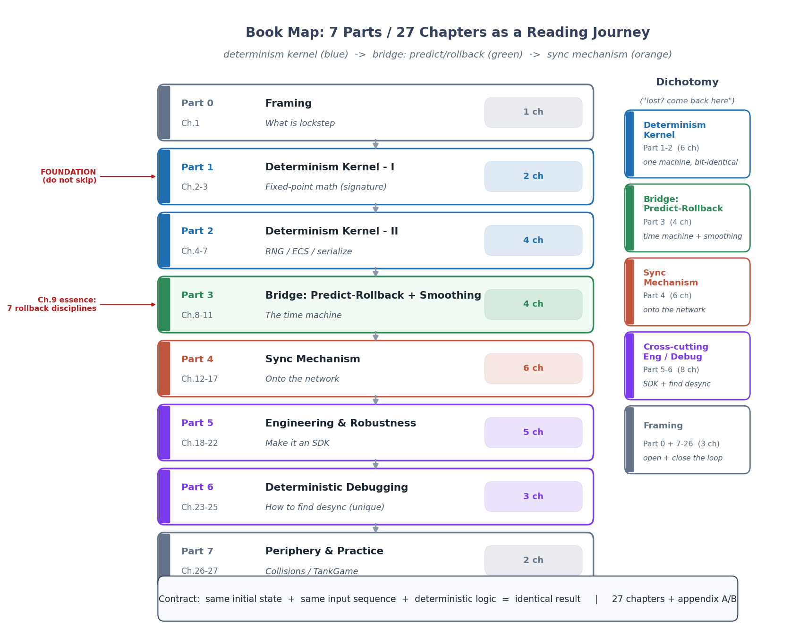
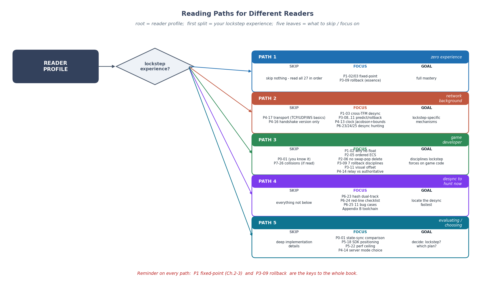

# 《帧同步设计与实现深入浅出:怎么让千万台机器算出同一个结果》—— 目录与导读

> 一本写给"会写代码、懂数学(微积分、线性代数、概率)、懂系统(网络/内核/数据库读过或写过),**但完全没做过帧同步联机游戏**"的工程师的书。
>
> **一句话主旨**:帧同步的本质是一句契约——**相同初始状态 + 相同输入序列 + 确定性运算 = 相同结果**。全书围绕"确定性"展开:先讲怎么造一台单机就确定的机器(定点数 / 确定性随机 / 有序 ECS / 字节级序列化),再讲怎么把它接到不可靠的网络上(预测回滚 / 网络时钟 / 丢帧补偿 / 断线重连),最后讲怎么把它做成独立 SDK、以及不同步了怎么定位。
>
> **二分法**(迷路时回到它):**确定性内核**(单机就能同步:定点数 / 随机 / 遍历 / 序列化) vs **同步机制**(多机才算同步:预测回滚 / 时钟 / 丢帧 / 重连)。中间一座桥:**预测回滚 + 表现平滑**。
>
> **承接**:★承《物理引擎》(碰撞检测原理一样,一句带过,篇幅留"确定性物理");★承数学线(定点数 = 精确 vs 逼近、三角查表 = 数值逼近、Xorshift128+ = 伪随机序列、Jacobson = EWMA 平滑);承《Lua》《LuaJIT》(帧同步本质是一台"确定性虚拟机");承网络系列(TCP/UDP/WebSocket 通用概念一句带过)。
>
> **主比喻**:直球为主、比喻点睛。乐谱(确定性) / 指挥(服务器) / 时间机器(预测回滚) / 对账(哈希校验)——只在序章点睛一次,其他章节第一性原理 + 数学 + 源码直给。

每章一行:**章号 + 标题 + 一句话核心问题** —— 二分法归属(`确定性内核` / `同步机制` / `预测回滚` / `表现平滑` / `调试` / `横切` / `总览`)。

> **新手向提醒**:第 1 篇(P1-02、P1-03 两章定点数)是全书最硬的地基,**强烈建议顺序读、不要跳**——后面所有数学运算都建立在定点数之上。第 9 章(回滚)是全书最深的精髓之一,它讲的不是"回滚怎么实现",而是"回滚反向强加给整个代码库的七条编程纪律",读懂它你才真正理解"帧同步的代码为什么必须写成这样"。第 6 篇(确定性调试)是本书独门卖点,前 5 篇造机器,第 6 篇教你怎么抓它出的 bug。

---

## 全书结构总览




> **图说**:`fig-dir-01-structure.png` 一张图同时表达两层信息。左半边是 7 篇 27 章的纵向旅程(序章 → 确定性内核上下 → 预测回滚+表现平滑 → 同步机制 → 工程化 → 调试 → 实战);右半边用色块标出二分法归属——蓝色确定性内核(P1+P2)、绿色同步机制(P4)、紫色横切(P5+P6)。中间一座桥(P3 预测回滚+表现平滑)用第三种颜色,既不纯内核也不纯同步——它依赖确定性内核(回滚后重演必须确定),又是同步机制的核心手段。读者任何时候迷路,回到这张图问"我在哪、这一章服务确定性还是同步"。

旅程:从一个朴素问题——"两台不同的手机凭什么在同一时刻算出一样的坦克位置",一路走到"帧同步怎么用定点数 + 确定性随机 + 有序 ECS + 预测回滚 + 网络时钟 + 冗余抗丢包,让千万台机器算出同一个结果"。前两篇浇透确定性地基(尤其第 1 篇定点数,把数学线"精确 vs 逼近"在帧同步场景兑现),第 3 篇架起"时间机器"并把它平滑地画出来,第 4 篇把这台机器接到网络上,第 5 篇讲怎么把它工程化成独立 SDK,第 6 篇教你怎么抓 desync bug(本书独门),第 7 篇用一个完整 TankGame 把全书串起来。读完你能在脑子里放映出帧同步的完整发生过程:采集输入 → 本地预测执行 → 输入发往服务器 → 服务器按固定节拍聚合广播权威帧 → 客户端比对,猜对了确认 / 猜错了回滚重演 → 渲染层读逻辑状态插值平滑 → 全程每帧用哈希对账抓 desync——以及每一步**为什么必须存在、原理是什么、源码怎么实现、出问题了怎么找**。

---

## 全书目录

### 第 0 篇 · 开篇:帧同步是什么(定调,1 章)

- [P0-01 · 序章 · 为什么"相同输入"能算出"相同结果"——帧同步第一性原理与本书读法](P0-01-序章-为什么相同输入能算出相同结果.md) —— 帧同步是什么(服务器只广播玩家输入,局面由每台机器各自算),凭什么成立(确定性契约),帧同步 vs 状态同步逐项对比(谁算局面 / 流量 / 反作弊 / 回放 / 适用规模),适合什么游戏不适合什么游戏,建立"确定性内核 vs 同步机制"二分,"发疯的坦克"作者复盘作引子,LockstepSdk 的独立 SDK 级定位。 —— `总览`

### 第 1 篇 · 确定性内核·上:定点数与确定性数学(招牌,2 章)

> 帧同步地基的地基。这两章是全书最硬的招牌——用户原话"定点数必须讲哈"。

- [P1-02 · 定点数 LFloat:为什么不能用浮点](P1-02-定点数LFloat-为什么不能用浮点.md) —— IEEE 浮点为什么跨平台不一致(舍入 / 扩展精度 / FMA / 溢出 / subnormal),定点数怎么用整数模拟小数,Q48.16 用 long 的精度范围权衡(±1.4×10¹⁴ 范围 / 1/65536 精度),RawValue 位结构,加减直接乘除移位,`LFloat.One` 类型陷阱(bug:早期 const int → 现 const long),FromFloat 边界溢出静默截断(bug 案例 P0)。 —— `确定性内核`
- [P1-03 · 定点数学库:乘法三路径、三角函数查表、确定性 Sqrt](P1-03-定点数学库-乘法三路径与三角LUT.md) —— ★招牌章。乘法为什么不能直接 `(a*b)>>16`(128 位溢出),三路径设计(快速 long + Int128 慢路径 + 双路径等价性测试),★跨 TFM 舍入分叉(P0-1 血泪:truncate vs floor 差 1,有符号算术移位解决),矩阵多乘积"累加后右移",三角函数全查表零浮点(LUT 精度 / sin·cos 4096 点),Sqrt 牛顿迭代初始猜测修复,Div128By64(Knuth Algorithm D),手写 LInt128(64×64→128 分块乘法)。 —— `确定性内核(招牌)`

### 第 2 篇 · 确定性内核·下:随机、ECS、序列化(4 章)

> 确定性不只指数,还有随机数、容器遍历、序列化——任何一个不确定都会 desync。本篇还讲框架的**防呆体系**(把确定性纪律做成编译 / 加载期硬约束)。

- [P2-04 · 确定性随机 LRandom:Xorshift128+ 与状态序列化](P2-04-确定性随机LRandom-Xorshift128与状态序列化.md) —— 为什么 `System.Random`(及 `UnityEngine.Random`、`DateTime.Now.Ticks` 做 seed)全是 desync 源(跨版本 / 跨平台算法不一),LRandom 用 Xorshift128+(Vigna 算法,长周期高质量),splitmix64 播种,状态就是两个 ulong(回滚零成本),随机状态为什么必须进快照,RestoreState 对称性 bug(ISSUE-P0-02)。 —— `确定性内核`
- [P2-05 · 有序 ECS 与 World:逻辑数据分离、防呆体检](P2-05-有序ECS与World-逻辑数据分离与防呆体检.md) —— ECS 逻辑 / 数据分离为什么在帧同步里是生死线(它是"能倒带重演"的前提),System 执行顺序怎么保证确定(稳定插入排序而非 `List.Sort`,bug 案例:非稳定排序破坏确定性),实体代数(Generation)防 Id 复用错配,`World.SaveState`/`LoadState` 字节级格式(VersionMagic "LSEP" / SerializationVersion=2 / 组件池按类型 Ordinal 排序),★防呆体系(`SystemStateValidator` 反射体检 DEBUG 拦截 Dictionary/HashSet/Task/Random/静态字段、`[AllowUnsafeField]` Rust unsafe 式免责、`[AutoSerialize]` Source Generator),Smart Query 最小集遍历。 —— `确定性内核`
- [P2-06 · 组件池与回滚安全:双引擎的取舍](P2-06-组件池与回滚安全-双引擎的取舍.md) —— ★招牌章。为什么组件池删除不能 swap-and-pop(破坏回滚后遍历顺序 → desync),SafeECS(ComponentPool 保序标记删除 + BinarySearch 维护有序,回滚友好,删除 O(n))vs UnsafeECS(UnsafeComponentPool Sparse Set + swap-and-pop + 裸内存 fixed 指针拷贝序列化,快照快 200 倍),★序列化脏标记缓存(IsDirty + `[HighFrequencyComponent]` 跳缓存,把快照成本和组件变化频率解耦),诚实标注:UnsafeECS 未接入 World.SaveState(高级逃生舱)。 —— `确定性内核(招牌)`
- [P2-07 · 字节级序列化:BitWriter、强制排序、FNV-1a](P2-07-字节级序列化-BitWriter强制排序FNV1a.md) —— 序列化为什么必须确定性(相同状态产生相同字节流,否则哈希永远误报 desync),BitWriter 所有整数写死小端序(`BinaryPrimitives.WriteXxxLittleEndian`,跨平台一致),`WriteDictionarySorted` 强制 Key 排序(字典遍历顺序不定,不排序两端字节流就不同),状态哈希用 FNV-1a(快 / 对字节流敏感 / 确定性),反序列化是安全敏感面(count 来自不可信流,`count * 4` 在 `count > int.MaxValue/4` 时整数回绕让边界检查失效 → OOM DoS),`FrameData.Deserialize` PlayerCount 无边界检查的安全修复(MaxPlayerCount=256)。 —— `确定性内核`

### 第 3 篇 · 预测回滚与表现平滑:时间机器与平滑呈现(4 章)

> 把确定性机器变成"可以倒带"的机器,再把它平滑地画出来。本篇还不涉及网络,是纯客户端侧。

- [P3-08 · 预测:本地不等服务器先算下去](P3-08-预测-本地不等服务器先算下去.md) —— 为什么要预测(等服务器确认再算会"操作粘手",粘手比卡顿更恶心),预测的前提是确定性内核,预测为什么绝对不限速(本地操作即时响应是手感命门,限速就退回"等服务器"的卡顿),本地与非本地玩家的输入掩码隔离(防本地输入混入非本地预测污染历史帧),三种可插拔预测策略(LastInput 惯性 / Neutral 空输入 / Trend 趋势外推)各自适合什么游戏,预测错了的代价预告(引出下一章回滚)。 —— `预测回滚·预测侧`
- [P3-09 · 回滚:猜错了怎么倒带重演](P3-09-回滚-猜错了怎么倒带重演.md) —— ★招牌章。回滚完整五步(检测预测错误 → 找最近快照 → 恢复状态 → 用正确输入重演到当前帧 → 继续预测),为什么用"快照 + 重演"而非"每帧存完整状态"(空间代价量级对比),SnapshotInterval 旋钮在"内存"和"回滚速度"两头权衡,回滚风暴,加载快照后必须立即重算哈希校验(防坏快照静默 desync),★**回滚反向施加给整个代码库的七条编程纪律**(本章精髓 / 全书独门:组件严禁持有 Transform 引用、音效粒子用 IsReplaying 门控、实体销毁走命令缓冲、组件池删除不能 swap-pop、随机状态进快照、每帧临时状态重置、首帧全端一致)——为能倒带重演,游戏逻辑必须写成"纯函数式 + 可快照"的风格。 —— `预测回滚·回滚侧(招牌)`
- [P3-10 · LockstepController:预测回滚的实现主控](P3-10-LockstepController-预测回滚的实现主控.md) —— DoUpdate 两阶段编排(ConfirmServerFrames 确认循环逐帧比对按需回滚 + PredictAhead 预测循环),追帧动态限速三档(差距 >100 用 100 / >20 用 50 / 否则 20)+ MaxSimulationMsPerFrame=50 防单帧 DoS,四个 tick 字段(`_confirmedTick`/`_predictedTick`/`_curTickInServer`/`_maxContinueServerTick`)共描"本地进度 vs 服务器进度",RingBuffer 强制容量 2 的幂用位与取模(`index & _mask`)无分支 O(1),★时效性契约 C-5(纯槽数组越界静默环绕到陈旧槽,靠调用方 `payload.Frame == tick` 纪律维系),Snapshot 池化(Frame/Hash/`byte[]?` 从 BufferPool.Rent 借,Dispose 幂等防双倍归还),事件契约(确认 / 回滚 / desync / 缺帧 / 追帧进度全部做成事件,Controller 不耦合具体处理)。 —— `预测回滚·实现`
- [P3-11 · 表现平滑:逻辑帧 / 渲染帧分离与回滚视觉补偿](P3-11-表现平滑-逻辑帧渲染帧分离与回滚视觉补偿.md) —— ★用户点名章。逻辑帧固定 20fps / 渲染帧可变 30-144fps,渲染层只读逻辑状态(纪律是第 9 章回滚纪律的延伸),为什么直接画逻辑状态会顿(20fps 跳变),`Interpolation`(0~1)线性插值补中间画面(从帧累加器 `_frameAccumulator` 算),★采样为什么用 `OnLogicStep` 而非 `OnLogicStepComplete`(追帧 / 回滚一帧内多个 tick,OnLogicStep 每个都触发保证双缓冲 `_lastStates=T-1/_currStates=T`,OnLogicStepComplete 只看最终帧会让插值基准从 T-n 直接跳 T 产生视觉微顿),★**视觉偏移补偿 Visual Offset**(表现层最巧设计:平时逻辑与视觉 1:1 同步零延迟手感,只在回滚瞬间记"预测位置与正确位置的偏差"叠加到渲染坐标并指数衰减归零——常态牺牲为零 / 回滚吸收跳变的非对称策略,同时满足"常态零延迟"和"回滚不闪屏"),追帧进度 `OnPursueProgress`。 —— `表现平滑`

### 第 4 篇 · 同步机制:把确定的机器接到网络(6 章)

> 网络有延迟、抖动、丢包。在这些干扰下还让所有客户端最终一致。

- [P4-12 · LockstepDriver:SDK 主循环与跨线程纪律](P4-12-LockstepDriver-SDK主循环与跨线程纪律.md) —— Driver 封装了什么(模拟器 + 网络 + 控制器 + 时钟 + 回放 + 限流器 + 重连状态),为什么是 Driver 拥有 Controller 而非反过来,`Update(dt)` 主循环十步流程(消费跨线程命令队列永远排第一),★**跨线程命令队列**(网络线程回调先 Enqueue 命令,主线程 Update 顶部 TryDequeue 消费,从根上保证 World 线程亲和,DEBUG `CheckThreadAffinity` 把这条纪律变硬断言),帧累加器钳制爆发,丢帧双层限流(Controller 检测 + Driver 限流),停止 = Dispose 全清理(Driver 接管传输层生命周期),三个 `_consecutiveSyncFailures >= 3` 终止分支。 —— `同步机制`
- [P4-13 · 网络时钟 NetworkClock:Jacobson 算法与硬边界防回滚风暴](P4-13-网络时钟NetworkClock-Jacobson与硬边界防回滚风暴.md) —— ★招牌章。客户端怎么在没服务器时钟前提下估"服务器现在第几帧"(`elapsedMs = localNow - gameStartTimestampMs + clockOffsetMs`,clockOffsetMs 靠 Pong 包校准),RTT 抖动 Jacobson 平滑(SRTT 87.5% 历史 + 12.5% 当前,RTTVAR 75% 历史 + 25% 当前,RFC6298 系数,RTTVAR beta=0.25 文档只说 0.875/0.125 是出入),★硬边界防回滚风暴(`smoothedTarget` 物理估算在 `[hardMin, hardMax]` 区间自由滑动,触界即放弃平滑:hardMin 防本地跑太慢触发无谓回滚,hardMax 防无限制预测爆炸——平滑与硬约束分层),★不对称迟滞 PreSendCount(网络变差立即增深 / 变好按 0.98/0.02 缓慢衰减,防预测深度随抖动反复横跳),ClockOffset 三档 EWMA(冷启动 0.5 / 常规 0.1 / 大偏差 0.3),Pong 主源 + ServerFrame 安全网双向校准。 —— `同步机制(招牌)`
- [P4-14 · Relay vs Authoritative:两种服务器模式 + 固定节拍](P4-14-Relay与Authoritative-两种服务器模式与固定节拍.md) —— ★招牌章(核心二分)。Relay(中继)只收集输入 + 广播不跑逻辑 / 无 desync 校验 / 无快照重连 / 反作弊弱 vs Authoritative(权威)注入 ISimulation 跑完整逻辑 / 有 desync 校验 / 有快照重连 / 反作弊强,两种模式的配置(UseInput vs UseSimulation)与适用场景权衡,★**物理时钟节拍器**(承序章"发疯的坦克"复盘:服务器按固定 20Hz 推进 / 输入聚合不等人 / 迟到用 nullInput 填——这个分水岭认知是真金白银 bug 换来的),100Hz 调度 + 每 tick 512 消息预算(防单房洪泛 vs 全局公平),★单调钟 Stopwatch 替墙钟防 NTP 回跳(P1 血泪:UtcNow 算 tick 会让房间永久冻结且超时检测同时失效),冗余历史帧抗 UDP 丢包(零往返恢复),单线程泵保证 World 线程亲和。 —— `同步机制(招牌)`
- [P4-15 · GameRoom 与多房间:顶号重连、哈希防作弊、中毒快照熔断](P4-15-GameRoom与多房间-顶号重连哈希防作弊中毒快照熔断.md) —— 玩家生命周期与房间四态机(Waiting → Playing → Finished → Recyclable,FinishGame 必须业务层显式调用否则玩家"再次匹配"被误塞旧房间),帧聚合"只填缓存不广播"(OnPlayerInput 收输入只往 `_tickInputs` 塞,真广播由 DoUpdate 固定节拍驱动),历史帧补帧 MissFrame(重连追帧主路径,超 600 帧分批 / 超 3600 帧降级拉快照),★顶号重连必须自证 ReconnectToken(P0-2 身份劫持防御:同名 + 不同 ClientId 这个朴素判据不够,攻击者能踢掉在线玩家接管其输入),★哈希校验必须全员到齐才比对(来一个比一个会误报,基准取 player[0] 在"基准本身错"时仍有意义),★中毒快照熔断(权威 sim 抛异常后 World 已半修改,继续 Tick 持续生成中毒快照污染重连——置位停用 + 清空旧快照 + 继续转发帧是最优降级)。 —— `同步机制`
- [P4-16 · 消息处理、协议与反作弊](P4-16-消息处理协议与反作弊.md) —— 9 个 Handler 策略模式(文档说 7,真实 9,`MissFrameHandler.cs` 一文件塞 Request + Ack 两类),`Dictionary<MessageType, IMessageHandler>` 查表路由(为什么策略模式而非 switch-case / 为什么手动 new 注册而非反射),MessageType 17 个枚举值,★**双轨版本号**(握手线协议 `ProtocolVersion`=1.1 真实/文档说 1.0,Major 相等即兼容 Minor 不查=向前兼容 vs 快照格式 `SerializationVersion`=2 精确等值不容版本差,两个独立兼容性边界各守什么),★反作弊四道底座(IMessageInterceptor 拦截器 Priority 排序可插拔链 + HashReport 状态篡改检测 + 加速挂天然防御服务器控 20Hz 节拍 + InputHandler 用服务端权威 playerId 不信客户端报的),为什么 SDK 不内置具体校验逻辑(每个游戏输入语义不同——SDK 提供**机制**业务层实现**策略**,SDK 边界哲学)。 —— `同步机制`
- [P4-17 · 传输层抽象:TCP/UDP/WebSocket,以及 KCP 为什么是 stub](P4-17-传输层抽象-TCP-UDP-WebSocket-KCP为何是stub.md) —— 传输层为什么抽象成两个接口(`INetworkClient` 6 属性 4 方法 5 事件 / `IServerTransport` 5 方法 2 事件)让上层完全不知道底下跑 TCP 还是 UDP(SDK 跨平台 Web/Unity/原生命脉),TCP 是流式协议无消息边界必须自做分帧(大端序 4 字节长度前缀 + 1MB 上限防 slowloris + per-read 超时 30s),UDP 无可靠性无顺序帧同步为什么敢用(可靠性靠协议层冗余历史帧上移零往返恢复 / 顺序靠帧号自校验),WebSocket 借原生消息边界分帧免费(`endOfMessage:true` 单帧 + do-while 合并分片,默认明文 `ws://` 要 `wss://` 得服务器侧配 TLS),★**KCP 是 stub**(`KcpNetworkClient` 类注释"需引入 KCP 库",`SimpleKcpCore.Update`/`SetConfig` 是空方法体,Send 只做"4 字节 conv 头 + 数据"拼包送 UDP,默认行为 = UDP + 4 字节 conv 会话过滤——不是 bug 是"抽象槽位 vs 默认降级"设计,今天 `UseKcp()` 能跑通明天接 kcp2k 只需替换 `CreateKcpCore` 一个方法,冗余帧已让 UDP 够用所以 KCP 不是必需品)。 —— `同步机制`

### 第 5 篇 · 工程化与健壮性:怎么做成 SDK 级产品(5 章)

- [P5-18 · SDK 化:把帧同步做成可集成的框架](P5-18-SDK化-把帧同步做成可集成的框架.md) —— ★市面罕见定位。竞品对比(Photon Fusion / Mirror / Fish-Net 清一色状态同步 + 预测无确定性保证)坐实"市面无同类确定性帧同步 SDK",SDK 化核心约束 = **核心零依赖 + 宿主注入依赖**(`Lockstep.Core`/`Lockstep.Network` 不引用任何游戏引擎,存 PlayerPrefs / 写文件 / 打日志 / 时间戳全靠接口让宿主注入),Builder API(`LockstepServerBuilder`/`LockstepClientBuilder` 链式配置 + 三预设 Default / LowLatency / HighTolerance),ISimulation 最小接口 6 方法(Initialize / Tick / SaveState / LoadState / ComputeHash / Reset)让任意游戏可接入,双 TFM(net8.0 + netstandard2.1)跨运行时确定性代价(呼应第 3 章 P0-1),Open Core 商业模式反定义模块边界。 —— `横切(招牌)`
- [P5-19 · 断线重连:快照 + 增量帧 + ReconnectToken](P5-19-断线重连-快照增量帧ReconnectToken.md) —— 重连双级解耦(传输层只管"把断 socket 重接上并自证身份" / 应用层只管"把缺的几十秒战局追回"),★进程重启重连五步根因链(P0-2 安全加固 token 顶号校验与"进程级重连"需求正面冲突,用 IReconnectCredentialStore 接口 + ReconnectRequest 优先漂亮化解——既不开安全倒车又能重启回原房间),凭证 4 字段刻意不含 lastAckTick,默认 NullStore 而非内置文件存储,"从断点续 vs 跳到现在"决策(服务器帧历史窗口 3600 帧 + SnapshotThresholdFrames=300 帧两硬约束共同逼出),两条重连协议路径(顶号 TryJoin vs 显式 ReconnectHandler),观战模式 = 重连特例。 —— `同步机制`
- [P5-20 · 零 GC 与对象池:BufferPool 双倍归还检测](P5-20-零GC与对象池-BufferPool双倍归还检测.md) —— 为什么帧同步比普通程序更怕 GC(Stop-The-World 停顿让本客户端逻辑帧节奏错乱 → desync),五池体系(BufferPool byte[] 池 / BitWriterPool·BitReaderPool 序列化器池 / ObjectPool<T> 通用对象池 / FrameDataPool 按 PlayerCount 分桶帧数据池)消掉核心路径堆分配,★**双倍归还**(同一数组被 Return 两次,池把同实例分发两调用方并发写同 buffer 数据静默损坏——帧同步最难抓 desync 源),BufferPool 用 `ConditionalWeakTable` 按引用追踪每个租出 byte[] 把静默损坏变 DEBUG 可抓异常,RentedBuffer using 模式确定性资源管理,★GC 克制哲学(不追绝对零:消除大块 / 低风险分配继续做,但为个位数字节破坏可读性则放弃)。 —— `横切`
- [P5-21 · 回放系统:确定性输入流录制](P5-21-回放系统-确定性输入流录制.md) —— 回放为什么"免费"(确定性机器 + 录输入 = 完美复现,状态同步回放要录完整状态文件巨大——这是电竞复盘 / 观战几乎都建立在帧同步上的原因),三件套(`ReplayRecorder`/`ReplayPlayer`/`ReplayFile`)各干什么(录制录"已确认帧"而非预测帧 / 播放靠 OnStep 事件驱动渲染 / 快进暂停实现),回放文件铁三角格式(魔数 `0x5052534C`"LSRP" 识别格式 + 版本范围 `[MinCompatible, Current]` 管兼容 + CRC32 末尾校验防损坏),bug 反面教材("设计有但接线错":CRC 校验版本校验都实现了但调用方走错入口 Deserialize 无 CRC 校验,LoadWithValidation 才校验,主路径走错让保护形同虚设——"有机制 ≠ 有保护"),回放和重连同源(本质都是输入流重放只是触发时机不同)。 —— `横切`
- [P5-22 · 性能基准与可观测性:测量驱动优化](P5-22-性能基准与可观测性-测量驱动优化.md) —— ★招牌章。为什么 Benchmark 报的"2251 bytes/帧 GC"是**基准伪影**(`SaveState().ToArray()` 重载的 `ToArray()` 拷贝造成,真实生产路径 635 B/帧——优化错对象是性能工程最贵的错误),★Int128 软件运算税(.NET 8 无 128 位硬件指令,游戏坐标 / 速度高 32 位几乎总为 0,一条"`|a|,|b|<2^31` 走 long 快速路径"把 LVector2 乘法从 11M 提速到 684M ops/s 即 62 倍,bit 级等价靠双路径 golden 测试兜底),desync 字段级定位**三级下钻**(`GetPerTypeHashes()` 类型级 → `Diff(World)` Entity 级 → `GetDebugString(entityId)` 字段级,从 32 位哈希下钻到具体某 Entity 某组件的哪字段值不一样),可观测性地基当前已就位(日志抽象 / OnHashDrift 事件 / HashDriftRecoveryPolicy / 三级下钻 / World 单线程化 / LockstepMetrics 全套 desync 指标 + Prometheus 导出),优化七阶段方法论 + 三道安全门(确定性 golden 测试 / 537 单元测试 / Benchmark 前后对比)。 —— `横切(招牌)`

### 第 6 篇 · 确定性调试:不同步了怎么定位(★本书独门卖点,3 章)

> 帧同步工程化真正的难点。用户特别强调"怎么定位 bug 也很关键"——前 5 篇造机器,第 6 篇教你怎么抓它出的 bug。

- [P6-23 · 哈希校验双轨:增量 O(1) vs 全量重算](P6-23-哈希校验双轨-增量O1与全量重算.md) —— ★招牌章。为什么哈希对账是抓 desync 的**唯一手段**(desync 不崩溃不报错只有"指纹比对"能发现),一个 32 位哈希怎么把整个 World 压成"指纹",增量哈希为什么 O(1)(组件变更时 XOR 更新)vs 全量重算各挡什么威胁,双轨模式三档(Disabled / Periodic / FullValidation)分别用在哪(生产默认 Disabled),★**双轨哈希"漂移即覆盖"反面教材**(design 对但工程落地错:desync 信号被静默吞掉 + 快照链永久洗白——全书最深刻的"机制对但落地错,现已修"案例,现 OnHashDrift 事件 + Throw 策略补上),★LoadState 重算补丁(修 ComputeHash 在 Disabled 模式下 O(1) 返回导致校验恒真的漏洞)。 —— `调试(招牌)`
- [P6-24 · 确定性红线清单:回滚强加的编程纪律](P6-24-确定性红线清单-回滚强加的编程纪律.md) —— 帧同步"十二诫"系统化(每条配"为什么禁止 + 违反会怎样 + 正确做法"一张总表带走:禁浮点 / 禁 Dictionary 遍历 / 禁 swap-pop 删除 / 禁系统 Random / 禁系统时间 / LINQ 稳定排序 / 字符串 Ordinal 比较 / 事件订阅顺序 / 首帧一致 / 命令缓冲 / 跨线程 / 随机状态进快照),★反直觉结论(十二诫多数不是"为了帧同步"多机一致,而是"为了预测回滚"能倒带重演——第 9 章七条纪律的系统化扩展,本章分清"帧同步要求"和"回滚要求"两类红线),框架防呆体系(`SystemStateValidator` 反射体检 DEBUG 拦截危险字段 / `[AllowUnsafeField]` Rust unsafe 式免责 / `[AutoSerialize]` Source Generator 编译期兜底),★**防呆覆盖边界诚实标注**(`SystemStateValidator` 实际不拦 `float`/`double` 字段——它拦容器 / 异步 / Random / World·Entity 引用 / Guid / Stopwatch / 委托 / 静态字段 / 危险命名,浮点泄露当前无自动体检 DG-4 靠人工 review,这是诚实边界不是缺陷藏匿),desync 定位工具链(`ToDebugString` 全量 Dump + `Diff` 字段级比对 + BeyondCompare 工作流,精度陷阱 DG-2:默认 ToString 只 4 位小数最低位分歧被掩盖)。 —— `调试`
- [P6-25 · bug 定位实战:从现象到根因(含假问题教学)](P6-25-bug定位实战-从现象到根因含假问题教学.md) —— ★招牌章。desync bug 定位方法论(哈希二分 + 状态 diff + 回归测试一步步收敛到"哪一行代码、哪一次运算"出错),11 个真实 bug 完整复盘(发现 → 根因 → 修复 → 现状,覆盖确定性数值 / 安全身份 / 同步契约 / 回滚标志 / 池化所有权 / 跨运行时舍入 6 大类:P0-1 跨 TFM 舍入分叉 / P0-2 重连身份劫持 / 双轨哈希漂移即覆盖 / 进程级重连 5 步根因链 / C-5 环形缓冲陈旧槽 / C-6 IsReplaying 不复位 / BufferPool 双倍归还 / LFloat.One 类型错误 / Sin 弧度转角度精度 / 大数乘法溢出 / 回放 CRC 接线错),★**假问题教学集**(`issues_found.md` 四轮审查被排除的 8 个"假 bug":LFloat 构造溢出从未调用 / long 除零 C# 必抛跨平台一致 / 诊断指标不影响逻辑等——教读者靠对语言规范、确定性边界、设计意图的深度理解鉴别真假 bug,这本身就是工程成熟度),反直觉教训("防御性代码"有时反而掩盖 bug——双轨哈希漂移即覆盖)。 —— `调试(招牌)`

### 第 7 篇 · 周边与实战(2 章)

- [P7-26 · 碰撞与寻路(轻量):QuadTree + NavMesh](P7-26-碰撞与寻路轻量-QuadTree与NavMesh.md) —— ★承《物理引擎》碰撞检测一句带过(QuadTree / AABB / OBB / SAT 原理一样),篇幅留"确定性物理"特有的(整条计算链路必须用 LFloat/LVector2 不能在任何一环引入 IEEE 浮点,物理求解器 LContactSolver 结果进游戏状态进状态哈希——"物理也必须确定性"是哈希校验硬绑定的契约不是口号),一个真实物理正确性 bug(接触约束在世界空间却读了局部逆惯性 LocalInverseInertia,旋转刚体角响应算错,修完哈希值会变必须显式声明),确定性寻路两道关(A* 二叉堆出队顺序必须确定 F 值相等时用次键破并列 / 启发式函数必须用定点数)。 —— `横切`
- [P7-27 · TankGame 实战:把全书串起来](P7-27-TankGame实战-把全书串起来.md) —— 怎么用 `ISimulation` 6 个核心方法把一个普通游戏"接"进帧同步框架(接入 SDK 的唯一契约承第 18 章),TankGame 的 ECS 组件 / 系统怎么组织(Input / Fire / Bullet / Collision / Boundary 五系统按 Priority 0/10/20/30/40 稳定排序,承第 5 章),从"按 WASD"到"坦克动起来"的完整链路(输入采集 → 跨线程命令队列 → Driver.Update → Controller.DoUpdate 预测/确认/回滚 → Simulation.Tick → 五系统执行 → OnLogicStep 采样 → 渲染插值 + Visual Offset),一个完整对局时间线(玩家加入 → 匹配 → GameStart → 对战预测/确认/回滚交织 → HashReport 对账 → 结束 → 回放;Relay 与 Authoritative 两种模式在这条时间线上差在哪 / 反作弊差在哪),逻辑层 / 表现层 / 网络层三层在一个真实游戏里怎么解耦又怎么咬合。 —— `总览`

### 附录

- **附录 A · 环境搭建与运行** —— `dotnet build`、`run_server.bat` / `run_client.bat`、单机 / 联机 / 回放三种模式怎么跑。
- **附录 B · 调试工具链与工业级审计** —— 状态 Dump、BeyondCompare 级分歧定位、DesyncAnalyzer 怎么用,怎么造 desync 复现回放 `.lsr`;以及 `review_plan.md` 的 15-Phase 审查方法论——"如何审一个帧同步框架"的完整 checklist。

---

## 每篇导读

### 第 0 篇 · 开篇:帧同步是什么(定调)

这是全书的入口,只有一章(序章 P0-01),但它干三件最关键的事:① 用最直白的话把帧同步讲清楚——服务器不算坦克在哪,只广播玩家按键,每台机器各自算,凭什么两台手机算出一样的结果靠的是"确定性契约";② 把帧同步和状态同步逐项对比(谁算局面 / 流量 / 延迟 / 反作弊 / 回放 / 适用规模),坐实"市面竞品 Photon Fusion / Mirror / Fish-Net 清一色状态同步 + 预测、无确定性保证",也讲清帧同步适合什么游戏(格斗 / RTS / MOBA / 街机 / 体育 / 快节奏竞技)、不适合什么游戏(MMO / 大世界 / FPS 竞技);③ 建立"确定性内核 vs 同步机制"二分骨架,并用一个真实的工程教训("发疯的坦克")作引子点出"服务器节奏该不该被玩家输入绑架"这个帧同步服务端的分水岭认知。这一篇定调全书,读完你就知道这本书讲什么、不讲什么、为什么用"确定性内核 vs 同步机制"当骨架而非按模块平铺。

### 第 1 篇 · 确定性内核·上:定点数与确定性数学(招牌)

帧同步地基的地基,只有两章,却是全书最硬的招牌——用户原话"定点数必须讲哈"。第 2 章(P1-02)讲 IEEE 浮点为什么跨平台不一致(舍入 / 扩展精度 / FMA / 溢出 / subnormal),以及定点数 LFloat 怎么用 64 位 long 把小数点"钉"在固定位置,选 Q48.16 而非 Q32.16 的精度范围权衡。第 3 章(P1-03)是全书最深的招牌章之一:乘法为什么不能直接 `(a*b)>>16`(两个 64 位 long 相乘 128 位溢出),三路径设计(快速 long + Int128 慢路径 + 双路径等价性测试),以及全书最深的 bug 之一(P0-1)——同一个乘法在 .NET 8 和 netstandard2.1 上对负数差一个最低位,根因是"截断取整 vs 向下取整"的对立。这两章是双 TFM 跨平台确定性这个"确定性的确定性"问题的集中爆发地,也是 LockstepSdk 作为同时编译两个运行时的活教材最有戏的地方。读完这两章,你就理解了"为什么浮点不行"和"定点数学库的全部精华"。

### 第 2 篇 · 确定性内核·下:随机、ECS、序列化(4 章)

确定性不只指数,还有随机数、容器遍历、序列化——任何一个不确定都会 desync。第 4 章(P2-04)讲为什么 `System.Random`(及 `UnityEngine.Random`、用时间做 seed)全是 desync 源,LRandom 怎么用 Xorshift128+ 保证种子相同则序列相同,状态只有两个 ulong 回滚零成本。第 5 章(P2-05)讲有序 ECS——System 执行顺序怎么用稳定插入排序保证确定、`World.SaveState` 字节级格式怎么逐位一致,以及框架的★防呆体系(`SystemStateValidator` 反射体检在 DEBUG 下拦截 System 里的 Dictionary/HashSet/Task/Random/静态字段,`[AllowUnsafeField]` 做 Rust unsafe 式免责)。第 6 章(P2-06)是招牌章——组件池删除为什么不能 swap-and-pop(破坏回滚后遍历顺序 → desync),SafeECS 保序标记删除 vs UnsafeECS Sparse Set + 裸内存拷贝的双引擎取舍。第 7 章(P2-07)讲字节级序列化——为什么必须确定性、为什么强制小端序、为什么字典要先排序、为什么哈希用 FNV-1a、为什么连"读取一个数组"都要防溢出攻击。这四章合起来回答一个问题:**怎么把一整台游戏世界,变成可以字节级存下来再原样恢复、且跨平台逐位一致的东西。**

### 第 3 篇 · 预测回滚与表现平滑:时间机器与平滑呈现

这是全书最精彩的一篇,纯客户端侧、还不涉及网络。第 8 章(P3-08)讲预测——为什么要预测(等服务器确认再算会"操作粘手",粘手比卡顿更恶心),预测为什么绝对不限速(本地操作即时响应是手感命门),三种可插拔预测策略各自适合什么游戏。第 9 章(P3-09)是全书最深的精髓之一,招牌章——它讲的不是"回滚怎么实现",而是★**回滚反向施加给整个代码库的七条编程纪律**(组件严禁持有 Transform 引用、音效粒子用 IsReplaying 门控、实体销毁走命令缓冲、随机状态进快照……),本质是"为能倒带重演,游戏逻辑必须写成纯函数式 + 可快照的风格"。读懂这一章,你才真正理解"帧同步的代码为什么必须写成这样"。第 10 章(P3-10)把前两章落地成 LockstepController,讲 DoUpdate 两阶段编排、RingBuffer 位与取模、时效性契约 C-5。第 11 章(P3-11)是用户点名章——表现平滑:逻辑帧 / 渲染帧分离、为什么采样要用 OnLogicStep 而非 OnLogicStepComplete、★视觉偏移补偿 Visual Offset(平时零延迟手感 / 回滚吸收跳变的非对称策略)。这一篇是"时间机器"两个动作(预测 + 回滚)加它在屏幕上的平滑呈现,读懂它你就理解了帧同步客户端的全部魔法。

### 第 4 篇 · 同步机制:把确定的机器接到网络(6 章)

前三篇造好了一台"单机就确定、还能倒带"的机器,这一篇把它接到不可靠的网络上。第 12 章(P4-12)讲 LockstepDriver SDK 主循环——它怎么用★跨线程命令队列(网络回调先入队、主线程消费)从根上消灭"网络多线程 vs 逻辑单线程"的竞态。第 13 章(P4-13)是招牌章——网络时钟 NetworkClock 怎么用 Jacobson 算法平滑 RTT 抖动,以及★硬边界防回滚风暴(smoothedTarget 物理估算在 `[hardMin, hardMax]` 区间自由滑动,触界即放弃平滑)。第 14 章(P4-14)是核心二分招牌章——Relay(中继)只转发不算局面 vs Authoritative(权威)跑完整逻辑抓 desync,以及★物理时钟节拍器(承序章"发疯的坦克":服务器按固定 20Hz 推进、输入不齐强制填空输入、用单调钟 Stopwatch 防墙钟 NTP 回跳)。第 15 章(P4-15)讲 GameRoom 房间内部——顶号重连身份劫持防御、哈希校验全员到齐才比对、中毒快照熔断。第 16 章(P4-16)讲消息分发策略模式、双轨版本号、反作弊四道底座。第 17 章(P4-17)讲传输层抽象 TCP/UDP/WebSocket/KCP,以及★KCP 为什么是"接口齐全算法空实现"的 stub。这一篇是"怎么让千万台机器在延迟、抖动、丢包的网络下,最终算出同一个结果"。

### 第 5 篇 · 工程化与健壮性:怎么做成 SDK 级产品(5 章)

前 4 篇把帧同步的全部零件造出来了,这一篇讲怎么把它们工程化成独立、可集成、跨引擎的 SDK。第 18 章(P5-18)是市面罕见招牌内容——为什么市面没有"独立的、确定性的、跨引擎的帧同步 SDK",SDK 化的核心约束是"核心零依赖 + 宿主注入依赖",Builder API + 三预设把接入门槛降到几十行起一个确定性服务器。第 19 章(P5-19)讲断线重连的双级解耦、进程重启重连五步根因链、"从断点续 vs 跳到现在"的决策。第 20 章(P5-20)讲零 GC 与对象池——为什么帧同步比普通程序更怕 GC、双倍归还这个最难抓的 desync 源、BufferPool 用 ConditionalWeakTable 怎么把它变 DEBUG 可抓、GC 克制哲学。第 21 章(P5-21)讲回放为什么"免费"、文件铁三角格式、"设计有但接线错"让保护形同虚设的反面教材。第 22 章(P5-22)是招牌章——性能基准的基准伪影、Int128 软件运算税与 long 快速路径 62 倍提速、desync 字段级定位三级下钻、可观测性地基。这一篇是"性能好 ≠ 工程好"的集中体现,也是本书 SDK 化独特定位的兑现。

### 第 6 篇 · 确定性调试:不同步了怎么定位(★本书独门卖点)

这是本书在市面上几乎找不到同类的独门卖点——帧同步工程化真正的难点不是"写出来",是"线上 desync 了怎么找"。第 23 章(P6-23)招牌章讲哈希校验双轨——增量 O(1) vs 全量重算各挡什么威胁、★"漂移即覆盖"反面教材(design 对但工程落地错,desync 被静默吞掉 + 快照链永久洗白,现已修)。第 24 章(P6-24)把散落全书的禁令系统化成"十二诫"红线清单,点明多数红线根本不是"为了帧同步"而是"为了预测回滚",以及框架防呆体系的覆盖边界(诚实标注:浮点不拦靠人 review)。第 25 章(P6-25)招牌章用 11 个真实 bug 做案例复盘,每个讲清"现象 → 怎么定位 → 根因 → 修复 → 现状",外加★假问题教学集——教读者鉴别"看起来像 bug 但不是 bug"的能力。这一篇是"防御性代码有时反而掩盖 bug"的集中警示,也是工程成熟度的试金石。

### 第 7 篇 · 周边与实战(2 章)

收束篇。第 26 章(P7-26)轻量讲碰撞与寻路——★承《物理引擎》碰撞检测原理一句带过,篇幅留"确定性物理"特有的(整条计算链路必须用定点数、物理结果进哈希所以物理也必须确定性、LContactSolver 世界逆惯性 bug)。第 27 章(P7-27)用 TankGame 把全书串起来:怎么用 ISimulation 6 个方法把一个普通游戏接进帧同步框架、五系统按 Priority 稳定排序逐帧执行、从"按 WASD"到"坦克动起来"的完整六站链路(输入采集 → 预测执行 → 网络发送 → 服务器聚合广播 → 确认 / 回滚 → 渲染插值)、一个完整对局时间线。读完这两章,你就看到了所有零件在一个真实游戏里怎么协作——全书 26 章的机制全在这条链路上。

---

## 不同读者的阅读路径

本书读者画像很明确:会写代码、懂数学、懂系统,但完全没做过帧同步联机游戏。不同背景的读者,推荐的阅读路径不同。下面给出五条实用路径。

### 路径一:零基础帧同步读者(推荐主线,地基不可跳)

你是本书的目标读者——会写代码懂系统,但帧同步是零经验。**从头顺着读最省力**,因为全书层层递进:序章定调 → 第 1 篇造定点数地基 → 第 2 篇造确定性容器 → 第 3 篇架时间机器 → 第 4 篇接网络 → 第 5 篇工程化 → 第 6 篇调试 → 第 7 篇实战。**第 1 篇(定点数)和第 9 章(回滚)是地基,务必顺序读、不要跳**——后面所有章节都建立在"定点数运算确定"和"回滚编程纪律"之上。第 1 篇两章数学密度高,如果第一遍读得吃力,先用每章章首的"逃生阀"(先只记住三件事)抓住主干,细节需要时再回来看。

**推荐顺序**:P0-01 → P1-02 → P1-03 → P2-04 → P2-05 → P2-06 → P2-07 → P3-08 → P3-09(精髓)→ P3-10 → P3-11 → P4-12 → P4-13 → P4-14 → P4-15 → P4-16 → P4-17 → P5-18 → P5-19 → P5-20 → P5-21 → P5-22 → P6-23 → P6-24 → P6-25(独门)→ P7-26 → P7-27 → 附录。

### 路径二:有网络编程经验(读过 Tokio / gRPC)

你懂 TCP/UDP、RTT、EWMA、握手协议这些通用概念,网络相关的底层可以快速过。**重点看帧同步特有的部分**:跨 TFM desync(这是别处讲不到的硬核)、预测回滚机制、网络时钟的硬边界设计、调试方法论。

- 快速过:P4-17(传输层抽象,TCP/UDP/WebSocket 通用概念一句带过,只看★KCP 为什么是 stub)、P4-16 双轨版本号里的握手线协议部分。
- 重点看:**P1-03**(跨 TFM 舍入分叉 P0-1,全书最深的 bug 之一)、**P3-08/09/10/11**(预测回滚 + 表现平滑,帧同步招牌机制)、**P4-13**(网络时钟的 Jacobson + 硬边界,看帧同步怎么在网络时钟上做"平滑与硬约束分层")、**P4-14**(Relay vs Authoritative 核心二分)、**P6-23/24/25**(desync 怎么定位,本书独门)。

### 路径三:有游戏开发经验(做过单机游戏)

你写过游戏,懂游戏循环、ECS、渲染,但没做过联机。**重点看帧同步强加给"游戏代码"的纪律**:为什么不能用 float、回滚反向施加的七条编程纪律、表现平滑的视觉补偿。

- 重点看:**P1-02**(为什么不能用 float,IEEE 浮点跨平台不一致)、**P2-05**(有序 ECS,为什么 System 执行顺序必须确定 + 防呆体检)、**P2-06**(组件池删除为什么不能 swap-and-pop)、**P3-09**(★回滚反向施加的七条编程纪律——读懂它你才知道为什么帧同步的代码必须写成纯函数式 + 可快照)、**P3-11**(表现平滑的视觉偏移补偿)、**P4-14**(联机服务器两种模式)。
- 可快速过:P0-01(帧同步 vs 状态同步,你可能已经知道)、P7-26(碰撞寻路,承《物理引擎》你可能读过)。

### 路径四:只关心 bug 定位(线上 desync 了要查)

你的诉求最直接——线上两台客户端不同步了,怎么找原因。**直奔第 6 篇**,然后用附录 B 的工具链上手。

- 第一步:**P6-23**(哈希双轨,理解抓 desync 的唯一手段 + "漂移即覆盖"反面教材为什么是灾难)、**P6-24**(确定性红线清单,对着总表查你的代码踩了哪条)、**P6-25**(11 个真实 bug 复盘 + 假问题教学集,看哪个像你的现象)。
- 第二步:**附录 B**(DesyncAnalyzer 怎么用、怎么造 desync 复现回放、BeyondCompare 级分歧定位)。
- 如果你的 desync 跨平台(Unity vs 服务端):回头读 **P1-03**(P0-1 跨 TFM 舍入分叉)。
- 如果你的 desync 和重连 / 断线有关:回头读 **P5-19**(进程级重连五步根因链)。

### 路径五:想评估 / 选型帧同步方案

你不一定要自己写,但要在"帧同步 vs 状态同步""用哪个帧同步方案"之间做技术选型。

- 先读 **P0-01 序章**(帧同步 vs 状态同步逐项对比 + 帧同步适合什么游戏不适合什么游戏)。
- 读 **P5-18 SDK 化**(竞品对比:Photon Fusion / Mirror / Fish-Net 清一色状态同步 + 预测无确定性保证,坐实"市面无同类确定性帧同步 SDK")。
- 读 **P5-22 性能基准**(性能数据:5000 实体 0.37ms、60fps 余量 45 倍;Int128 软件运算税与 long 快速路径 62 倍提速——评估这套方案的天花板)。
- 读 **P4-14**(Relay vs Authoritative 两种服务器模式——评估你的项目该用哪种)。

```mermaid
flowchart LR
    START([读者画像]) --> Q1{帧同步经验?}
    Q1|零经验| PATH1[路径一·从头读<br/>P0→P1→P2→...→P7<br/>地基不可跳]
    Q1|有网络编程经验| PATH2[路径二·快过 P4 传输层<br/>重点 P1-03/P3/P4-13/P4-14/P6]
    Q1|有游戏开发经验| PATH3[路径三·重点 P1-02/P3-09<br/>回滚强加的七条纪律]
    Q1|线上 desync 要查| PATH4[路径四·直奔第 6 篇<br/>P6-23→P6-24→P6-25→附录B]
    Q1|评估选型| PATH5[路径五·P0-01→P5-18→P5-22→P4-14]
    classDef path fill:#fef3c7,stroke:#d97706
    class PATH1,PATH2,PATH3,PATH4,PATH5 path
```



> **图说**:`fig-dir-02-paths.png` 是一张决策树。根节点是"读者画像",第一个分叉是"你的帧同步经验是什么",按五种背景分流到五条路径。每条路径用一张小卡片标出"快速过哪几章 / 重点读哪几章 / 目标是什么"。零基础路径卡片最满(27 章全读 + 顺序不可跳);bug 定位路径卡片最聚焦(直奔第 6 篇 + 附录 B);选型路径卡片最短(4 章)。读者一眼能找到自己的入口。

> 一个提醒:不管走哪条路径,**第 1 篇(定点数 P1-02/P1-03)和第 9 章(回滚 P3-09)是理解全书的钥匙**——前者是确定性地基的地基,后者是"帧同步代码为什么必须写成这样"的根因。即便走 bug 定位路径,如果 desync 是数值或回滚相关的,这两章也要回头读。

---

## 全书主线与二分法回顾(呼应序章)

读到这里,你可能已经翻过序章(P0-01),也可能没有。这里把全书的主线和二分法再讲一遍,作为导航的锚——任何时候迷路,回到这里。

### 主线:确定性契约

> **帧同步 = 相同初始状态 + 相同输入序列 + 确定性运算 = 相同结果。**

全书围绕"确定性"展开。任何一处看不懂某个机制,回到这句问:"这是在保证'确定性'(单机位级一致:定点数 / 随机 / 遍历 / 序列化),还是在解决'同步'(多机最终一致:预测回滚 / 时钟 / 丢帧 / 重连)?它和最朴素的笨办法比,妙在哪?"

### 二分法:确定性内核 vs 同步机制,中间一座桥

本书的二分法对应帧同步两大主题:

- **确定性内核**(第 1-2 篇,共 6 章):即使不联网,一台机器上相同输入跑两遍也必须位级相同。包括定点数 LFloat、定点数学库(乘法三路径 / 三角查表 / Sqrt)、确定性随机 LRandom、有序 ECS、组件池(双引擎取舍)、字节级序列化。
- **桥:预测回滚 + 表现平滑**(第 3 篇,共 4 章):单机的"时间机器"(预测 + 回滚)+ 它在屏幕上的平滑呈现。它既依赖确定性内核(回滚后重演必须确定),又是同步机制的核心手段。
- **同步机制**(第 4 篇,共 6 章):把确定的机器接到网络上。包括 LockstepDriver 主循环、网络时钟(Jacobson + 硬边界)、Relay vs Authoritative 双服务器模式、GameRoom 多房间、消息处理协议反作弊、传输层抽象。
- **横切**(第 5-6 篇 + 第 7 篇第 26 章,共 8 章):SDK 化与工程化(第 5 篇)、确定性调试(第 6 篇)、碰撞寻路(第 7 篇 P7-26)。
- **总览**(序章 + 第 7 篇 P7-27,共 2 章):定调 + 收束。

读者永远知道**我在哪、为什么需要下一步**:为什么需要定点数(因为浮点跨平台不一致)→ 为什么需要确定性随机(因为 System.Random 跨版本不一致)→ 为什么需要有序 ECS(因为遍历顺序必须确定)→ 为什么需要序列化(因为状态要存快照发网络哈希对账)→ 为什么需要预测回滚(因为等服务器会粘手)→ 为什么需要表现平滑(因为 20fps 逻辑直接画会顿)→ 为什么需要网络时钟(因为客户端要估服务器第几帧)→ 为什么需要双服务器模式(因为 Relay 和 Authoritative 各管一摊)→ 为什么需要调试独门主题(因为 desync 不崩溃不报错,只有哈希对账能发现)。每一步都是上一步逼出来的。

### 主比喻:直球为主,比喻点睛

基调是直球为主(第一性原理 + 数学推导直给),比喻点睛。乐谱(确定性) / 指挥(服务器) / 时间机器(预测回滚) / 对账(哈希校验)这组比喻**只在序章 P0-01 点睛一次**,其他章节不沿用做主线——新概念用第一性原理 + 数学 + 真实源码讲。这是本书的写作纪律。

---

## 怎么用这本书

### 每章的标准结构

全书每一章严格遵循同一个六段结构,你熟悉了这个结构,读起来就顺手:

1. **章首·核心问题 + 读完你会明白**:开头先用一句话点出本章的核心问题(那个"凭什么"的问题),然后给 3~6 条"读完本章你会明白"。这是你判断"这章值不值得读、读不读得懂"的入口。难度高的章节还会加**逃生阀**——"如果一读觉得太难:先只记住三件事……",给你一个抓住主干再回头读细节的退路。
2. **章首·一句话点破**:在核心问题之后,用一句话把本章的核心结论 / 金句甩出来,然后说"这是结论不是理由,本章倒过来拆"。先给答案再拆过程,避免读者读到一半还不知道要去哪。
3. **正文·若干小节(招牌四段式)**:每节遵循"**提出问题 → 朴素做法撞什么墙 → 所以这么设计 → 源码 / 数学佐证**"四段式。招牌句式:`> **不这样会怎样**`、`> **所以这样设计**`、`> **钉死这件事**`、`> **承接书讲过**`。每个机制先讲它解决什么本质问题、不这样会撞什么墙,再讲实现。
4. **技巧精解**(正文后、小结前):挑本章最硬核的 1~2 个技巧,配源码 / 数学推导 + 行号 + 反面对比,单独拆透。这是本书深度对标 LuaJIT / SQLite / RocksDB 级的关键。
5. **章末小结**:回扣"确定性内核 vs 同步机制"主线,说明本章服务哪一面;**五个"为什么"清单**(五个最值得反刍的问题);"想继续深入往哪钻";一句话引出下一章。

穿插在正文里的还有两个本书独有的小框:

- **作者复盘**(本书独有):LockstepSdk 是作者自研的,关键决策处插"**作者复盘 · xxx**"小框,亲述当时为什么这么选、踩过什么坑、考虑过什么替代。最有戏的素材来自 `RECONSTRUCTION_LOG.md`(发疯的坦克 → 节拍器)、`OPTIMIZATION_PLAN.md`(Int128 税 / GC 哲学)。节制使用——只在真正有"为什么这么定"的非显然决策处出现。
- **bug 定位贯穿**(本书独有):每个机制讲完,顺带讲"这块出过什么 bug、表现是什么、怎么定位的"。第六篇再系统总结。让读者从第一章就建立"这段代码错了会怎样、怎么发现"的嗅觉。

### 配图说明

本系列铁律:技术图用 matplotlib 生成 PNG(不用 ASCII),图内**英文标注**(避中文字体方块),正文中文解释。本书的图大多是四类:

- **时间线**(预测回滚、逻辑帧 / 渲染帧分离、追帧、回滚五步):PNG。
- **数值**(定点精度范围、EWMA 平滑、Visual Offset 衰减、desync 逐位累积):PNG。
- **结构**(环形缓冲 RingBuffer、组件池、Sparse Set、网络时钟硬边界区间):PNG。
- **流程**(一个时间步、DoUpdate 两阶段、跨线程命令队列):mermaid。

每章至少 2~3 张图。本书用占位 `` + 详细图说(图内画什么、英文标注什么),由主控批量生成。读者看图说就能理解图要表达什么。

### 源码引用说明

本书源码是作者自研的 **LockstepSdk**(C#,.NET 8.0 + netstandard2.1 双目标),位于 `C:/Users/Program/LockstepSdk/`(约 6.8 万行,去掉查表后约 3-4 万行逻辑代码)。引用规范:

- 绝对路径:`C:/Users/86133/Desktop/Program/LockstepSdk/src/...路径#L起-L止`,或简写 `[文件.cs:行号]`。
- 区间 `#La-Lb`,单行 `#L`。
- **★文档与代码有出入时,一律以源码为准**。已知出入(写前必读 `_源码事实-anchor.md`):Handler 真实 9 个(文档说 7)、ProtocolVersion 真实 1.1(文档说 1.0)、RTTVAR beta=0.25(文档只说 0.875/0.125)、KCP 是 stub、`LFloat.One` 现是 `const long`(早期 bug 是 int 已修)、GameEnd 占位、BENCHMARK 的"2251 bytes/帧"是 SaveState().ToArray() 伪影真实 635 B/帧。引用时认准源码,不照抄文档。
- **★审计报告(`FRAMEWORK_QUALITY_AUDIT.md`)和 `issues_found.md` 是"发现→修复"的过程记录,不是"现存缺陷清单"**。写 bug 案例时,每条按"现象 → 根因 → 怎么修 → 现状(已修 / 部分修 / 未管)"写,绝不写成"现在还有这 bug"。可观测性地基(日志抽象 / OnHashDrift / RecoveryPolicy / 三级下钻 / World 单线程化 / Metrics 全套)**当前已就位**,别写成"地基缺失"。
- 版本策略:跟最新不锁快照(当前 HEAD 漂移,引用前必 Grep/Read 重核实)。

---

## 配套文件

- [全书规划-总纲](全书规划-总纲.md) —— 主线、二分法、写作方法(动机 + 技巧双线 / 作者复盘 / bug 贯穿)、承接(物理引擎 / 数学线 / Lua / 网络系列)、比喻决策、分篇分章、源码策略、写作约定。
- [_章节写作提示词](_章节写作提示词.md) —— 写作执行手册(每章六段结构 / 四段式 / 技巧精解 / matplotlib 配图 / 自检清单 / 承接铁律 / 源码铁律 / 标点规范)。
- [_源码事实-anchor.md](_源码事实-anchor.md) —— 已核实的文档与代码出入清单(防编造锚点),写每章引用前必读。
- 源码:`C:/Users/86133/Desktop/Program/LockstepSdk/`(作者自研,.NET 8.0 + netstandard2.1 双目标)。本书所有源码引用均经 Grep / Read 核实行号。
- 承接:[[physics-engine-source-facts]](碰撞检测原理)、数学线(定点数 = 精确 vs 逼近、三角查表 = 数值逼近、Xorshift128+ = 伪随机、Jacobson = EWMA)、《Lua》《LuaJIT》(确定性虚拟机)、网络系列(TCP/UDP/WebSocket 通用概念)是横连。

---

> 这本书讲的不是"某个帧同步引擎的 API 怎么调",而是"一台确定性机器凭什么让千万台手机算出同一个结果——定点数怎么用整数钉死小数点、跨运行时怎么保证舍入一致、预测回滚怎么掩盖网络延迟、网络时钟怎么在抖动里平滑、冗余帧怎么零往返抗丢包、断线重连怎么追上几十秒战局、以及最难的——线上 desync 了怎么从两个看起来都对的快照里揪出最低位的那点分歧"。读完,你该能在脑子里放映出帧同步的完整发生过程,以及为什么"帧同步的本质是一句契约:相同输入,必须算出相同结果"。
