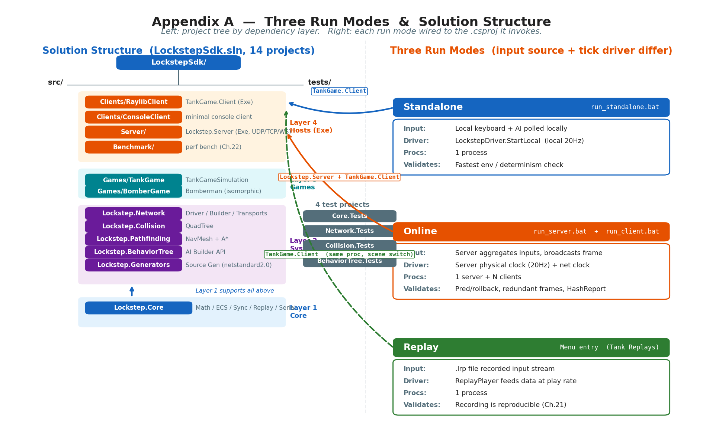
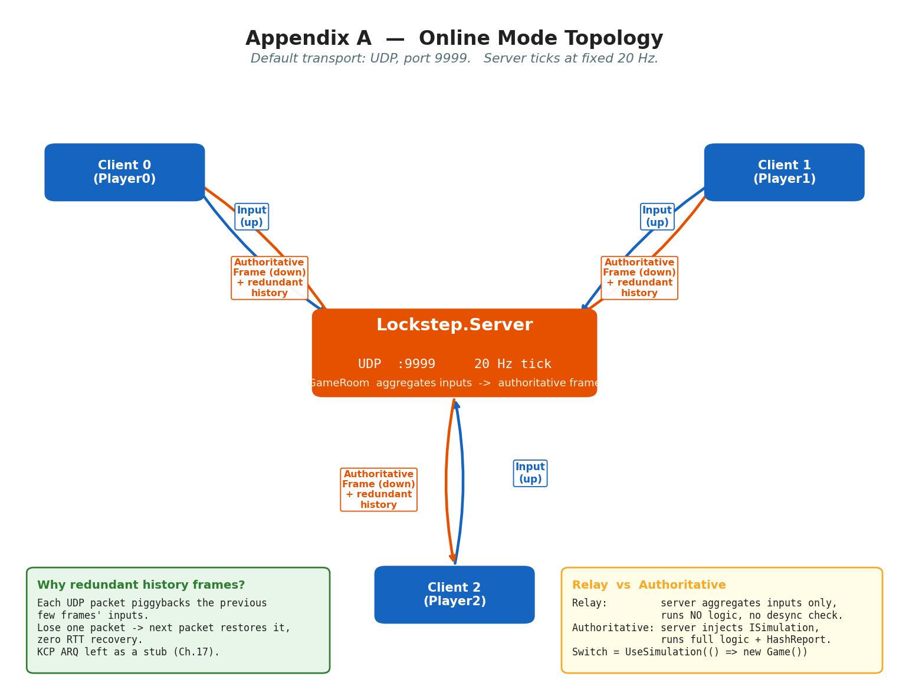

# 附录 A · 环境搭建与运行

> **这不是一章正文,是一份"照着做就能跑起来"的实用指南。** 前 27 章我们把帧同步的每一个机制拆开讲透了,但读者手上可能还没把 LockstepSdk 真正跑起来过——这一份附录就是补上最后这一公里。本章目标是:让一个**会装 .NET SDK、会敲命令行、但没接触过本项目的工程师,从克隆仓库到看见坦克在屏幕上跑起来、再到跑通回归测试,全程不卡壳**。

> **读完本附录你会**:
> 1. 装好依赖(.NET 8.0 SDK),用 `dotnet build` 一次编译整个 solution,看懂 LockstepSdk 的项目结构(Core / Network / Collision / Pathfinding / BehaviorTree / Games / Clients / Server / Benchmark / Generators 各管什么)。
> 2. 用 `run_standalone.bat` / `run_server.bat` + `run_client.bat` / 回放这**三种运行模式**把 TankGame 跑起来,知道每种模式在验证什么、操作键是什么。
> 3. 把编译产物(DLL)接到自己工程里——引用 `Lockstep.Core.dll` + `Lockstep.Network.dll`,写一个最小 `ISimulation`,用 `LockstepClientBuilder` / `LockstepServerBuilder` 链式配置客户端和服务器(承第 18 章 SDK 化)。
> 4. 把 SDK 接进 Unity:UPM 包结构、netstandard2.1 DLL 导入、WebGL 必须 WebSocket、`ToFloat()` 只许在表现层用(承第 11 章)。
> 5. 跑 `run_regression.bat` / `run_test.bat` 跑全套单元测试和确定性 golden 测试,以及排查端口占用、防火墙、netstandard2.1 vs net8.0、KCP stub 这几个最常见的坑。

> **前置衔接**:本附录是第 27 章 TankGame 实战的延伸。第 27 章讲的是"TankGame 这台机器内部怎么转",本附录讲的是"这台机器怎么在你机器上启动起来"。第 18 章讲的 SDK 化(Builder API、`ISimulation` 契约、可注入依赖)在本附录第 3、4 节落地成具体命令和代码。

---

## 〇、一张图先建立全貌

LockstepSdk 的三种运行模式,差别只在**输入从哪来、谁驱动节拍**。先看这张对比表,后面每一节都会回扣到它:

| 维度 | 单机模式 (`run_standalone.bat`) | 联机模式 (`run_server.bat` + `run_client.bat`) | 回放模式 |
|---|---|---|---|
| 输入从哪来 | 本地键盘,AI/第二玩家也本地轮询 | 服务器聚合各客户端输入,广播权威帧 | `.lrp` 文件里录好的输入流 |
| 谁驱动节拍 | `LockstepDriver.StartLocal`(本地 20Hz) | 服务器物理时钟节拍器(固定 20Hz)+ 网络时钟校准 | `ReplayPlayer` 按播放速率喂数据 |
| 用到网络吗 | 不用 | 用(默认 UDP 9999) | 不用 |
| 验证什么 | 最快验证"SDK 能跑、确定性内核在转" | 真帧同步:预测回滚、冗余帧抗丢包、HashReport 对账 | 验证录制可复现(承第 21 章) |
| 需要起几个进程 | 1 个(客户端自驱动) | 1 个服务器 + N 个客户端 | 1 个(回放播放器) |

> **承接第 27 章**:第 27 章的 1.2 节有一张类似的表,讲的是"TankGame 跑起来三种姿势"。本附录是把它落成**具体的命令和操作**,你照着敲就能看见那张表里的每一种姿势。


*(图说:左半画一张项目结构树——根 LockstepSdk/ 下分 src/ 与 tests/,src/ 下十个 .csproj 按依赖分层(Lockstep.Core 最底,Network/Collision/Pathfinding/BehaviorTree 之上,Games 之上,Clients 与 Server 最顶,Benchmark/Generators 独立);右半画三个方框代表三种运行模式,用箭头连到各自调用的 .csproj:单机→TankGame.Client,联机→Lockstep.Server + TankGame.Client,回放→TankGame.Client(同进程,切场景)。英文标注:Solution Structure / Standalone / Online (Server + Clients) / Replay。)*

---

## 一、源码版搭建:开发者克隆仓库后做什么

### 1.1 装什么

LockstepSdk 是 C# / .NET 项目,唯一的环境依赖是 .NET SDK。**装 .NET 8.0 SDK**(或更高版本)。项目核心库(Lockstep.Core / Lockstep.Network / Lockstep.Collision / Lockstep.Pathfinding / Lockstep.BehaviorTree / TankGame / BomberGame)在 `.csproj` 里同时声明了两个目标框架,即所谓**双 TFM**:

```xml
<!-- src/Lockstep.Core/Lockstep.Core.csproj -->
<TargetFrameworks>netstandard2.1;net8.0</TargetFrameworks>
```

- `net8.0`——给原生 .NET 8 主机用(服务器、Raylib 客户端、Benchmark,这些是**可执行项目**,只编这一个目标);
- `netstandard2.1`——给 Unity 等旧运行时用(Unity 2021.3+ 默认 API 兼容级别就是 .NET Standard 2.1),让同一个核心库既能编成 net8.0 DLL 跑在服务器上,又能编成 netstandard2.1 DLL 拖进 Unity。

> **承接第 2、3 章**:同一个定点数乘法在 `net8.0` 和 `netstandard2.1` 上**会因为舍入语义不同而差一个最低位**,这是全书反复强调的 P0-1 血泪——双 TFM 不是"多编一遍应付 Unity",而是**跨运行时确定性的活教材**。所以编译时两个目标都会编,跨平台 golden 测试两个目标都会跑(见第 5 节)。这是 LockstepSdk 区别于市面多数帧同步 demo 的工程硬度。

可执行项目(只编 net8.0):

| 项目 | 输出 | 说明 |
|---|---|---|
| `src/Server/Lockstep.Server.csproj` | `Exe` | 独立服务器,UDP/TCP/WebSocket 三选一 |
| `src/Clients/RaylibClient/TankGame.Client.csproj` | `Exe` | Raylib 图形客户端,内置 TankGame/BomberGame 菜单 |
| `src/Benchmark/Benchmark.csproj` | `Exe`(独立) | 性能基准(承第 22 章) |

`src/Lockstep.Generators/` 比较特殊:它是 Source Generator(用 `netstandard2.0`,因为 Roslyn 分析器约定),编译期跑、产出 `[AutoSerialize]` 的序列化代码(承第 5、6 章)。你不需要单独跑它,`dotnet build` 会自动驱动它给组件生成代码。

### 1.2 一条命令编译整个 solution

仓库根目录有 `LockstepSdk.sln`。在仓库根目录敲:

```bash
dotnet build LockstepSdk.sln -c Debug
```

第一次编译会拉取 NuGet 依赖(Raylib-cs 等),通常几十秒到一两分钟。编译成功后你会看到所有 14 个项目(Core/Network/Collision/Pathfinding/BehaviorTree/Generators/TankGame/BomberGame/Server/RaylibClient/Benchmark 加上 Core.Tests/Network.Tests/BehaviorTree.Tests/Collision.Tests)都绿。需要 Release 产物(给 Unity 用)就 `-c Release`。

> **作者复盘 · 编译产物的位置**:很多读者第一次找不到编出来的 DLL。每个项目的产物落在**自己的** `bin/<Config>/<TFM>/` 下,不是统一输出目录。也就是说:
> - `Lockstep.Core.dll` 在 `src/Lockstep.Core/bin/Release/netstandard2.1/Lockstep.Core.dll`(Unity 用)和 `.../net8.0/...`(服务器用);
> - `Lockstep.Network.dll` 在 `src/Lockstep.Network/bin/Release/netstandard2.1/...`;
> - `TankGame.dll`(游戏逻辑库)在 `src/Games/TankGame/bin/Release/netstandard2.1/...`。
>
> 项目根 `Publish/Release_SDK/` 下还预备了两份**已经分好类**的产物:`Net80/`(给 .NET 8 主机)和 `Unity/`(给 Unity,netstandard2.1 + 额外的 `System.Threading.Channels.dll`)。如果你不想自己编译,直接从这两个目录拿就行。

### 1.3 项目结构速览:十个 .csproj 各管什么

`LockstepSdk.sln` 里有 14 个项目(10 个源码 + 4 个测试),按依赖分四层。理解这一层关系,你以后改代码就知道改哪个项目:

```
LockstepSdk/
├── src/
│   ├── Lockstep.Core/          # 第 1-3 篇全部住这里
│   │   ├── Math/               #   LFloat/LVector2/LRandom/定点数学库(P1-02/03, P2-04)
│   │   ├── ECS/                #   World/ComponentPool/SystemStateValidator(P2-05/06)
│   │   ├── Sync/               #   LockstepController/RingBuffer(P3-10)
│   │   ├── Simulation/         #   ISimulation 契约 + LockstepGame 高层包装
│   │   ├── Replay/             #   ReplayRecorder/ReplayPlayer(P5-21)
│   │   ├── Serialization/      #   BitWriter/BitReader/FNV-1a(P2-07)
│   │   ├── Pooling/            #   BufferPool 等(P5-20)
│   │   ├── Diagnostics/        #   LockstepMetrics/状态 Dump(P5-22)
│   │   └── ProtocolVersion.cs  #   协议版本号(双轨,P4-16)
│   │
│   ├── Lockstep.Network/       # 第 4 篇 + Driver 住这里
│   │   ├── Client/             #   LockstepDriver / LockstepClientBuilder / 各 Transport
│   │   ├── Server/             #   LockstepServer / LockstepServerBuilder / GameRoom(P4-14/15)
│   │   ├── Messaging/          #   9 个 Handler / IMessageInterceptor / 双轨版本(P4-16)
│   │   └── Utils/              #   网络时钟 Jacobson(P4-13)等
│   │
│   ├── Lockstep.Collision/     # QuadTree + Circle/AABB/OBB(P7-26,承《物理引擎》)
│   ├── Lockstep.Pathfinding/   # NavMesh + A*(P7-26)
│   ├── Lockstep.BehaviorTree/  # AI 行为树 Builder API
│   ├── Lockstep.Generators/    # Source Generator:[AutoSerialize] 编译期代码生成
│   │
│   ├── Games/
│   │   ├── TankGame/           # TankGameSimulation:ISimulation 实现(P7-27)
│   │   └── BomberGame/         # Bomberman 同构示例
│   │
│   ├── Clients/
│   │   ├── RaylibClient/       # TankGame.Client:Raylib 图形客户端(单机/联机/回放入口)
│   │   └── ConsoleClient/      # 控制台最小客户端(无图形,验证用)
│   │
│   ├── Server/                 # Lockstep.Server:独立服务器可执行
│   └── Benchmark/              # 性能基准(承第 22 章)
│
└── tests/
    ├── Lockstep.Core.Tests/        # 定点数/ECS/序列化 + 跨 TFM golden
    ├── Lockstep.Network.Tests/     # Driver/时钟/房间/重连
    ├── Lockstep.Collision.Tests/
    ├── Lockstep.Pathfinding.Tests/
    └── Lockstep.BehaviorTree.Tests/
```

记住一个原则:**改确定性逻辑去 Lockstep.Core,改网络/Driver 去 Lockstep.Network,加新游戏写一个新的 Games/xxx 就行**。客户端(RaylibClient)和服务器(Server)只是宿主,游戏逻辑不写在这两个项目里——这正是第 18 章讲的"逻辑与渲染完全解耦"在目录结构上的体现。

---

## 二、三种运行模式:照着敲就能看见坦克动起来

### 2.1 模式一:单机(`run_standalone.bat`)——最快验证 SDK 能跑

仓库根目录:

```bat
run_standalone.bat
```

`run_standalone.bat` 干的事只有一行(去掉了 echo / pause 等装饰):

```bat
dotnet run --project src/Clients/RaylibClient/TankGame.Client.csproj
```

它直接启动 Raylib 客户端,**不连服务器**。客户端主菜单会出现,你可以选 "Single Player vs AI"(打 AI)、"Bomberman vs AI" 等。这种模式下 `LockstepDriver` 走的是 `StartLocal` 分支——本地按 20Hz 自驱动节拍,本地轮询所有玩家(玩家 0 是你,玩家 1+ 是 AI)的输入,然后整局逻辑在本地一气跑下去。

> **为什么先跑这个**:单机模式不联网、不需要服务器、不卡防火墙,是**验证你环境装对了**的最快方式。如果你看到坦克能用 WASD 动、空格能开炮,说明 .NET 8、Raylib 依赖、Lockstep.Core 全都正常。如果这步都跑不起来,先回头查 .NET SDK 版本和 Raylib 依赖(见第 6 节常见问题),别急着搞联机。

操作键(三种模式通用):

| 按键 | 功能 |
|---|---|
| `W`/`A`/`S`/`D` 或方向键 | 移动坦克 |
| `Space` | 开炮 / 放炸弹(Bomberman) |
| `ESC` | 退出 / 暂停(看菜单上下文) |

### 2.2 模式二:联机(`run_server.bat` + `run_client.bat`)——真帧同步

联机模式要起**一个服务器 + 多个客户端**。先起服务器:

```bat
run_server.bat
```

`run_server.bat` 会问你两个参数(默认值已给):

```bat
set /p PORT="Enter port (default: 9999): "
set /p PLAYERS="Enter player count (default: 2): "
dotnet run --project src/Server/Lockstep.Server.csproj -- --port %PORT% --players %PLAYERS%
```

服务器源码 `src/Server/Program.cs:9-30` 解析的命令行参数有五个:`--port`(默认 9999)、`--players`(默认 2)、`--fps`(默认 20)、`--max-rooms`(默认 100)、`--game`(tank 或 bomber,默认 tank)。bat 脚本只暴露了前两个,想调其他的直接在命令行加 `--` 参数即可,例如:

```bash
dotnet run --project src/Server/Lockstep.Server.csproj -- --port 9999 --players 2 --game bomber --fps 20
```

> **承接第 14 章**:`--game bomber` 这个参数会触发服务器 `Program.cs` 里走 `BomberGameSimulation` 而非 `TankGameSimulation`,并把默认人数从 2 改成 4(炸弹人默认 4 人,见 `Program.cs:42`)。这就是第 14 章讲的"服务器通过 `UseSimulation(() => new XxxSimulation())` 注入不同游戏"——同一份服务器二进制,靠参数切游戏。

服务器起来后,**另开 N 个命令行窗口**(N = 你要的对战人数),每个窗口跑一个客户端:

```bat
run_client.bat
```

`run_client.bat` 同样问你两个参数(玩家名 / 是否自动加入),底层是:

```bat
dotnet run --project src/Clients/RaylibClient/TankGame.Client.csproj -- --name %NAME% %AUTO_JOIN_ARG%
```

第一个客户端窗口输入 `Player0`、自动加入;第二个窗口输入 `Player1`、自动加入。当加入人数达到服务器要求的 `--players`,服务器自动开房、广播 `GameStart`,所有客户端同时进入战场。

> **钉死这件事**:服务器默认走 **UDP**(端口 9999)。如果你在云服务器上跑,务必在云厂商的安全组/防火墙里放行 **UDP 9999**(不是 TCP——TCP 是另一种 Transport,默认不开)。本地两台机调试一般没问题,云主机十有八九是这一步被防火墙挡了,客户端表现为"一直转圈连不上"。

联机模式验证的是全套同步机制:预测回滚(第 8-10 章)、网络时钟 Jacobson(第 13 章)、冗余帧抗丢包(第 14 章)、HashReport 对账(第 15 章)、断线重连(第 19 章)。你可以在一个客户端上故意制造延迟/丢包(用 Clumsy 之类工具),观察另一个客户端的预测与回滚行为。

> **不想敲两次的读者**:仓库还提供了 `run_test.bat`,这是一个**菜单式启动器**(源码见 `run_test.bat:1-147`),提供六种预设组合:① 坦克 2 人在线(自动起服 + 两客户端)、② 炸弹人 2 人在线、③ 炸弹人单人 vs AI、④ 炸弹人 4 AI 观战、⑤ 坦克单人 vs AI、⑥ 退出。它会先 `taskkill` 清理上次残留进程,再 `dotnet build` 编译,再 `start` 多窗口起服务端和客户端。一键联机调试首选这个。

### 2.3 模式三:回放——验证"录输入即可复现"

回放模式不需要单独的 bat 脚本——**回放是客户端主菜单的一个入口**。跑 `run_standalone.bat` 进菜单后选 "Tank Replays"(或对应游戏的回放菜单),会列出 `replays/` 目录下的 `.lrp`(Lockstep Replay)文件,选一个就能播放。

`.lrp` 文件是 `ReplayRecorder` 录制的输入流:魔数 + 版本范围 + CRC32(承第 21 章回放文件格式的"铁三角")。回放播放器(`ReplayPlayer`)把录好的输入一帧帧喂给 `Simulation.Tick`,逻辑层一行代码都不用改——这就是第 21 章说的"回放为什么免费":确定性机器 + 录输入 = 完美复现。

> **`.lrp` 还是 `.dat`**:你在不同文档/章节可能看到两种扩展名。早期文档和 README 的示例用 `.dat`(`recorder.SaveToFile("replay.dat")`),实际 `ReplayRecorder` 默认导出的扩展名是 `.lrp`。两者是同一种格式,差异只是命名约定。回放目录 `replays/` 默认被 `.gitignore` 忽略(避免把对局录像提交进仓库)。

> **bug 定位 · 回放校验"接线错"**:回放文件格式里设计了 CRC32 校验,但早期版本有一条"接线错"——`Deserialize` 不做 CRC 校验,只有 `LoadWithValidation` 才校验,而主路径(菜单进回放)走的是前者,导致设计有但没生效(承第 21、25 章)。这是典型的"design 对但工程落地错"。当前版本的入口已对齐到校验路径,但读者若自己改回放加载代码,务必走 `LoadWithValidation`。

### 2.4 关掉一切:`kill_all.bat`

联机调试经常一次起五六个进程(服务器 + 多客户端 + 偶尔的 console client),手动关很烦。仓库提供了:

```bat
kill_all.bat
```

它 `taskkill /F /IM` 杀掉 `Lockstep.Server.exe` 和 `TankGame.Client.exe`,再用 `findstr /i "Tank"` 关掉所有标题含 "Tank" 的 cmd 窗口(`run_test.bat` 起的那种)。每次联机重测前先跑一次它,避免上次残留进程占着 9999 端口。


*(图说:中央一个方框 "Lockstep.Server (UDP :9999, 20Hz tick)",四周三个方框 "Client 0 / Client 1 / Client 2" 各自双向箭头连到服务器,箭头标注 "Input (上行) / Authoritative Frame (下行, 带冗余历史帧)"。右下角小注:"Relay 模式服务器不跑逻辑只聚合输入;Authoritative 模式服务器注入 ISimulation 跑完整逻辑 + HashReport 对账"。英文标注:Lockstep Server / Clients / Input Upstream / Authoritative Frame Downstream (with redundant history)。)*

---

## 三、DLL 版接入:使用者拿到编译产物怎么集成

如果你不是克隆仓库,而是拿到一份编译好的 DLL(就是 `Publish/Release_SDK/` 里的东西),集成路径如下。

### 3.1 引用哪些 DLL

最小可运行集成只需要两个:

1. **`Lockstep.Core.dll`**——核心引擎(定点数学库 / ECS / 同步核心 / 序列化 / 回放)。它是所有其他模块的依赖,缺它一切报错。
2. **`Lockstep.Network.dll`**——网络通信层(Driver / Builder / 各 Transport / 服务器 / 房间 / 网络时钟)。

可选:

- `Lockstep.Collision.dll`——碰撞检测(QuadTree),如果游戏需要碰撞才引用;
- `TankGame.dll` / `BomberGame.dll`——示例游戏逻辑,只在你直接用示例游戏时引用,自己写游戏不需要。

> **DLL 选哪个 TFM**:Unity 拖 `netstandard2.1` 版本(见第 4 节);原生 .NET 8 工程(比如自己写个控制台服务器)引用 `net8.0` 版本。两个版本的 API 表面完全一致,差别在底层运行时——而**正因为底层运行时不同,定点数在两者上的最低位行为才需要 golden 测试兜底**(P0-1,承第 3 章)。

### 3.2 三步接入:输入 / 逻辑 / 驱动

承第 18 章讲的"接入 SDK 只需三件事",最小集成模板如下(源自我对 `docs/SDK_QUICKSTART_ZH.md` 的整理,字段名以 `ISimulation` 真实契约为准):

```csharp
using Lockstep.Core.Simulation;
using Lockstep.Core.Serialization;
using Lockstep.Network;

// 1. 定义输入(必须可序列化、可哈希)
public struct MyInput : IInput {
    public int Commands;
    public void Serialize(BitWriter w) => w.WriteInt(Commands);
    public void Deserialize(BitReader r) => Commands = r.ReadInt();
    public uint GetHash() => (uint)Commands;          // 对账要用,务必实现
}

// 2. 实现游戏逻辑(6 个核心方法 + 状态属性)
public class MyGame : ISimulation {
    public int PlayerCount { get; private set; }
    public int LocalPlayerId { get; set; }
    public bool IsReplaying { get; set; }
    public bool IsPredicting { get; set; }
    public bool HasVisualSideEffect { get; set; }
    public bool IsFinished => false;

    private int _score;
    public void Initialize(int playerCount, uint seed) { PlayerCount = playerCount; _score = 0; }
    public void Tick(FrameData frame) { _score++; }                // 推进一帧
    public byte[] SaveState() => throw new NotImplementedException("用 SaveState(BitWriter) 零分配版");
    public void SaveState(BitWriter w) => w.WriteInt(_score);
    public void LoadState(ReadOnlySpan<byte> d) => _score = BitConverter.ToInt32(d);
    public uint ComputeHash() => (uint)_score;
    public void Reset() => _score = 0;
    public IInputProvider? GetInputProvider(int playerId) => null;
    public byte[] GetNullInput() => new byte[4];
    public string ToDebugString() => $"Score={_score}";
}

// 3. 单机驱动(本地轮询所有玩家输入)
var sim = new MyGame();
var driver = new LockstepDriver<MyInput>(sim, playerId => new MyInput());
driver.StartLocal(playerCount: 1, seed: 12345);
while (true) {
    driver.Update(0.02f);                 // 模拟每帧 20ms
    Console.WriteLine($"Score={sim.ToDebugString()}");
}
```

> **承接第 18 章**:第 18 章讲 SDK 化时,核心论点是"`ISimulation` 这 6 个方法就是接入 SDK 的唯一契约"。这一段代码就是兑现这句话——你只写了"分数每帧 +1",框架白送给你预测回滚、网络同步、回放录制、断线重连。这就是 SDK 化的价值,承第 27 章 TankGame 的接入方式完全一样,只是 `Tick` 里干的事更多。

### 3.3 连服务器:`LockstepClientBuilder`

DLL 版接服务器,**不要手搓 socket**,用 `LockstepClientBuilder`(源码 `src/Lockstep.Network/Client/LockstepClientBuilder.cs`)。承第 18 章的 Builder API,真实方法签名(以源码 `LockstepClientBuilder.cs` 实际暴露为准):

```csharp
var client = new LockstepClientBuilder()
    .WithServer("127.0.0.1", 9999)            // 服务器地址 + 端口
    .UseUdp()                                 // 或 UseTcp() / UseWebSocket() / UseKcp()
    .WithHeartbeat(1000, 5000)                // 心跳间隔 / 超时
    .WithConnectTimeout(5000)                 // 连接超时
    .WithLogger(myLogger)                     // 注入日志(ILockstepLogger)
    .WithCredentialStore(myStore)             // 注入重连凭证持久化(IReconnectCredentialStore)
    .Build();

await client.ConnectAsync("Player1", roomId: 0, requiredPlayers: 2);
var driver = new LockstepDriver<MyInput>(client, simulation, () => PollInput());
driver.Start(startMsg);                       // startMsg 来自服务器广播的 GameStart
```

Builder 上还能挂 `.UsePreset(NetworkClientConfig.Default)`(或 `LowLatency` / `HighTolerance` 三预设,承第 18 章三预设),`.EnableLogging()`,这些链式方法都返回 `this`,链起来即可。

> **可注入依赖是关键**:第 18 章反复强调"核心零依赖 + 宿主注入依赖"。这里 `WithLogger` 让你把 Unity 的 `Debug.Log` / 文件 logger / 控制台 logger 注进去;`WithCredentialStore` 让你把 Unity PlayerPrefs / 文件 / 内存字典注入——SDK 自己不知道这些宿主设施,但通过接口注入就能用上。这是 SDK 化区别于"教程 demo"的工程硬度。

### 3.4 起服务器:`LockstepServerBuilder`

服务器端同样用 Builder,跟 `run_server.bat` 背后的 `src/Server/Program.cs` 走的是同一条路:

```csharp
var server = new LockstepServerBuilder()
    .WithPort(9999)
    .WithFrameRate(20)                         // 物理时钟节拍器频率
    .WithMaxRooms(100)
    .WithDefaultPlayers(2)
    .UseInput<MyInput>()                       // 注册输入类型
    .UseSimulation(() => new MyGame())         // 注入 ISimulation(Authoritative 模式才需要)
    .Build();

await server.StartAsync();
```

`UseSimulation` 这一行是**Relay vs Authoritative 的开关**(承第 14 章核心二分):

- 调了 `UseSimulation` → **Authoritative 模式**:服务器跑完整逻辑、做 desync 校验、支持快照重连、反作弊强;
- 不调 `UseSimulation` → **Relay 模式**:服务器只收集输入+广播,不跑逻辑,无 desync 校验,适合内测或可信客户端场景。

`run_server.bat` / `Program.cs` 走的是 Authoritative(它调了 `UseSimulation(() => new TankGameSimulation(...))`)。你想跑 Relay,把这一行注释掉就行。

---

## 四、Unity 集成

Unity 集成的完整文档在 `docs/UNITY_INTEGRATION.md`,这里只讲"最容易翻车的四件事"。

### 4.1 DLL 怎么拖、API 兼容级别设几

把 `Publish/Release_SDK/Unity/` 下的 DLL(`Lockstep.Core.dll`、`Lockstep.Network.dll`、可选 `Lockstep.Collision.dll`、`TankGame.dll`)**连同 `System.Threading.Channels.dll`** 一起拖进 Unity 的 `Assets/Plugins/`。注意 Unity 目录里多了一个 `System.Threading.Channels.dll`——这是 netstandard2.1 在 Unity 旧运行时上缺的依赖,不拖会报类型找不到。

Unity 设置路径:`Edit → Project Settings → Player → Other Settings → Api Compatibility Level`,设为 **.NET Standard 2.1**(Unity 2021.3+)或 .NET 6(Unity 2022.2+)。设错会出现"`Lockstep.Core` 找不到类型"或"assembly not found"这种报错。

> **UPM 包结构**:`docs/UNITY_INTEGRATION.md` 推荐的工程结构是 `Plugins/`(放 SDK DLL)+ `Scripts/`(Bootstrap / Input / Network / Rendering / Scenes)+ `Prefabs/` + `Scenes/`。SDK 不提供 UPM 包(没有 `package.json`),集成方式是 DLL + 自己写适配层。如果你想要 UPM,可以把上面四个 DLL 装进一个本地 package,但这是你的工程决定,SDK 不强加。

### 4.2 WebGL 必须 WebSocket——这一条最容易卡

Unity WebGL 平台**不支持 raw UDP/TCP Socket**(浏览器沙箱限制),LockstepSdk 默认的 `UdpNetworkClient` 在 WebGL 上根本起不来。WebGL 必须:

1. 服务器端启用 WebSocket Transport(`LockstepServerBuilder` 上配,或服务器参数);
2. 客户端实现 `UnityWebSocketClient`(`docs/UNITY_INTEGRATION.md` 第 4 节给了完整模板),用 `INetworkClient` 接口适配,通常配合 NativeWebSocket 之类的库。

如果你在 Unity Editor 里跑得好好的,build 成 WebGL 后连不上服务器,**第一个怀疑对象就是 Transport 没换**。

### 4.3 `ToFloat()` 只许在表现层用

这条是第 11 章反复强调的"逻辑/表现分离"在 Unity 集成里的具体纪律:

```csharp
// ✅ 正确:渲染层把定点数转成 float 喂给 Unity
transform.position = new Vector3(
    logicPos.X.ToFloat() * _worldScale,
    0,
    logicPos.Y.ToFloat() * _worldScale
);

// ❌ 错误:逻辑层沾 float
simulation.Position = transform.position;        // 禁止!破坏确定性
```

**逻辑层(`TankGameSimulation` / 各 System / 各 Component)全程只用 `LFloat` / `LVector2`,绝不出现 `float`**;只在**渲染层(ViewManager / TankView)调 `ToFloat()` 把定点数转成 Unity 能吃的 `float`/`Vector3`**。一旦逻辑层沾了 `float`,跨平台 desync 就在等你(P0-1,承第 2、3 章)。

> **框架帮你盯这条**:第 5 章讲的 `SystemStateValidator` 在 DEBUG 模式下反射扫组件,发现 `float`/`double` 字段直接抛异常拦启动。Unity Editor 下默认是 DEBUG,这个防呆体检会自动跑;真机 Release 包才不跑。所以"在 Editor 里能跑过"="逻辑层大概率没沾 float",但不是 100%,自己写组件时还是要自觉用 `LFloat`。

### 4.4 帧率分离:逻辑 20fps 固定,渲染跟随 Unity

第 11 章讲的"逻辑帧 20fps 固定 / 渲染帧 30-144fps 可变"在 Unity 里这么落地:

```csharp
void Update() {
    _driver.Update(Time.deltaTime);                 // 内部按累加器决定要不要步进一帧逻辑
}
void LateUpdate() {
    _viewManager.RenderInterpolation(_driver.Interpolation);   // 用 0~1 的插值因子平滑
}
```

`driver.Interpolation` 是 `[0, 1]` 的浮点,表示"距离下一次逻辑步进还差多少比例",渲染层拿它在上一帧状态和当前帧状态间 `Lerp`。这一条不写好,画面会顿(20fps 跳变)——是 Unity 集成里第二个最容易卡的地方(第一个是 WebGL Transport)。

> **承接第 11 章**:第 11 章讲的 `OnLogicStep` 采样 + 双缓冲(`_lastStates` / `_currStates`)在 Unity 适配里的对应是:订阅 `driver.OnLogicStep += (sim, tick) => _viewManager.UpdateStates(sim, tick)`,在 `LateUpdate` 里调 `RenderInterpolation(driver.Interpolation)`。回滚时这套双缓冲保证插值不断层,Visual Offset 吸收回滚瞬跳——这些机制在 Unity 里完全照搬 Raylib 客户端的写法,因为它们都是"只读逻辑状态做插值",引擎无关。

---

## 五、回归测试:跑全套单元测试 + golden

### 5.1 `run_regression.bat`——一键全套

```bat
run_regression.bat
```

`run_regression.bat`(`run_regression.bat:1-92`)做三件事:

1. `taskkill` 清理残留进程(避免锁文件导致 build 失败);
2. `dotnet build LockstepSdk.sln -c Debug --nologo -v q` 编译整个 solution;
3. 依次跑四个测试项目:`Lockstep.Core.Tests` / `Lockstep.Network.Tests` / `Lockstep.BehaviorTree.Tests` / `Lockstep.Collision.Tests`,每个用 `dotnet test --no-build`,汇总失败数。

跑完输出 `ALL TESTS PASSED!` 或 `FAILED: N test project(s)`。改了代码之后跑这个,是回归验证的最小动作。

> **为什么 `--no-build`**:第 2 步已经 build 了整个 solution,第 3 步每个测试项目都加 `--no-build`,避免重复编译浪费时间。如果你只改了一个项目想单独跑,可以直接 `dotnet test tests/Lockstep.Core.Tests/...`,但记得先 `dotnet build` 那一个项目。

### 5.2 golden 测试是确定性的看门狗

四个测试项目里,`Lockstep.Core.Tests` 最关键——它包含**跨 TFM golden 测试**:同一组定点数运算,在 `net8.0` 和 `netstandard2.1` 两个目标上跑,逐位比对结果。这是 P0-1(跨 TFM 舍入分叉)的回归防线(承第 3 章)。如果你改了 `LFloat` / `LInt128` / 定点数学库的任何一行,这个测试套必须全绿,否则就是引入了跨平台 desync。

> **承接第 22、23 章**:golden 测试是"位级等价靠 golden 保证"那句承诺的工程实现——LVector2 乘法的 `long` 快速路径命中率 >99%,但剩下不到 1% 走 `Int128` 慢路径,两条路径必须在两个 TFM 上 bit-for-bit 一致,golden 测试就是查这件事。读者改数学库时,把 golden 当回归红线。

### 5.3 `run_test.bat`——菜单式联机测试

第 2.2 节已经介绍过 `run_test.bat`。它不是单元测试,是**端到端联机场景启动器**(六种预设)。如果你改了网络层/Driver/服务器,想快速看"实际联机还通不通",跑 `run_test.bat` 选 1(坦克 2 人在线),自动起服 + 两客户端,你手动操作看表现。它和 `run_regression.bat` 是互补的:前者验单元正确性,后者验端到端联机能跑。

---

## 六、常见问题(FAQ)

### Q1. 端口被占:"Only one usage of each socket address"

最常见。默认 UDP 9999,如果你上次服务器没正常退出(比如直接关窗口没 `kill_all`),端口可能还被占用。

- 本机:先 `kill_all.bat`,再起;
- 还被占:换端口,`run_server.bat` 输入 `9998`,客户端连同样端口;
- 查谁在占(Windows):`netstat -ano | findstr :9999`,记下 PID,`taskkill /F /PID <pid>`。

### Q2. 防火墙/安全组:客户端一直转圈连不上

本地两台机一般没事,**云主机十有八九是这步**。LockstepSdk 默认 UDP,云厂商安全组要放行:

- **UDP 9999**(或你换的端口),入站方向;
- 协议选 **UDP** 不是 TCP——很多人这里选错;
- Windows 防火墙首次起服务器会弹窗,选"允许";

客户端那边表现为"输入名字自动加入后一直转圈,服务器控制台看不到 `[+] Player joined`",基本就是包被挡了。

### Q3. Unity 报 "Assembly not found" / 找不到类型

按第 4.1 节检查三件事:① API Compatibility Level 是 .NET Standard 2.1 或 .NET 6;② `Lockstep.Core.dll` 拖进去了(它是其他 DLL 的依赖,缺它全报错);③ Unity 目录多拖了 `System.Threading.Channels.dll`(netstandard2.1 在 Unity 上需要)。

### Q4. `netstandard2.1` vs `net8.0` 该选哪个

- **Unity / 移动端 / 旧运行时** → 引用 `netstandard2.1` 版本(Unity 2021.3+ 默认就这级);
- **原生 .NET 8 工程**(自己写控制台服务器、Benchmark、Raylib 客户端) → 引用 `net8.0` 版本;
- **不确定** → 选 `netstandard2.1`,它兼容性最广(.NET 8 也能跑 netstandard2.1 DLL,只是放弃了 net8.0 专有的优化)。

> **承接第 2、3 章**:两个 TFM 的 API 表面一致,但底层运行时不同——`net8.0` 有硬件加速和更激进的优化,`netstandard2.1` 跑在 Unity Mono 上行为更保守。这正是双 TFM 的意义:同一份确定性逻辑,在两种运行时上 bit-for-bit 一致(靠 golden 测试兜底,P0-1)。**不要以为"反正编出来一样"**——P0-1 就是因为两个 TFM 舍入语义差一个最低位导致的 desync。

### Q5. KCP 是 stub,我能不能用

这是本书反复强调的诚实标注(承第 17 章)。`src/Lockstep.Network/Client/Transports/KcpClient.cs` 里的 `SimpleKcpCore`(`KcpClient.cs:557-620`)是**接口齐全、算法空实现**的 stub:

- `Send()` 只在数据前加 4 字节 conv(会话 ID)然后透传——没有 ARQ,没有重传,没有拥塞控制;
- `Update(uint currentMs)` 和 `SetConfig(KcpConfig)` 是**空方法体**(`KcpClient.cs:605-613`,注释写"简化版无需实现");
- `Input()` 只做 conv 过滤(只收 conv 匹配的包)。

也就是说,**当前版本用 KCP = 用 UDP + 4 字节 conv 会话过滤**,可靠性等于裸 UDP。`KcpConfig` 上的 `NoDelay` / `Interval` / `Resend` / `NoCongestion` 等字段**目前都不生效**。

> **作者复盘 · 为什么 KCP 是 stub**:第 17 章讲过——LockstepSdk 在应用层做了**冗余历史帧**抗丢包(每个 UDP 包捎带前几帧输入,丢一包靠下一包补,零往返恢复)。10% 丢包率下连续丢 4 包的概率约 0.01%,冗余帧已经够用,所以 KCP 那套应用层 ARQ 就没必要重复造。KCP 的接口留全是为了"将来真要上 KCP 时,业务代码不用改一行"——这是"接口先行、实现后补"的工程取舍。如果你要的是真 ARQ,要么自己实现 `IKcpCore`,要么把传输层换成有可靠性保证的 TCP(代价是延迟变高)。

### Q6. 编译警告 / 首次拉依赖慢

第一次 `dotnet build` 会拉 Raylib-cs 等 NuGet 包,慢是正常的。如果卡在 NuGet 源,配国内镜像(nuget.cdn.azure.cn 之类)。CI 环境建议先 `dotnet restore` 单独跑一次缓存。

### Q7. 改了 SDK 源码,Unity 那边不生效

Unity 引用的是 DLL,你改了 `src/Lockstep.Core` 的源码,Unity 不会自动重编。流程是:① `dotnet build src/Lockstep.Core/Lockstep.Core.csproj -c Release`(编 netstandard2.1 版本);② 把新 DLL 复制到 Unity `Assets/Plugins/` 覆盖;③ Unity 里如果没自动刷新,在 Project 窗口右键 `Reimport`。建议写个脚本一键完成,避免忘。

### Q8. 跑起来两台客户端 desync 了

如果你改了 SDK 源码后出现 desync(控制台 `[!] DESYNC in Room ... at frame ...`),按第 23-25 章的方法定位:

1. 先看是不是改了定点数运算 / 随机数 / ECS 遍历顺序(最常见的三大来源);
2. 用 `ToDebugString()` 把两边的状态 Dump 成文件,BeyondCompare 级 diff 找第一个不一致的字段(承第 24 章);
3. 跑跨 TFM golden 测试,看是不是又引入了 P0-1 那种舍入分叉;
4. 如果是间歇性 desync,看 `LockstepMetrics` 的 desync 指标,定位到具体帧和字段。

> **承接第 25 章**:desync 定位是帧同步工程化真正的难点。本书第 25 章有一组"假问题教学集"——`issues_found.md` 四轮审查里被排除的 8 个"假 bug"(比如"LFloat 构造溢出"其实全代码库从未调用、"long 除零"其实 C# 必抛跨平台一致),教你鉴别"看起来像 desync 但其实不是"的能力。定位 desync 之前,先确认你追的是真 bug 不是假问题。

---

## 七、最小动作清单(照这个顺序做就不会漏)

第一次接触本项目的读者,按这个顺序跑一遍,每一步都验证一件事:

1. **装 .NET 8.0 SDK**(`dotnet --version` 能输出版本号)。
2. **`dotnet build LockstepSdk.sln -c Debug`**——验证编译链通(14 个项目全绿)。
3. **`run_standalone.bat`**,菜单选 "Single Player vs AI",WASD 动、Space 开炮——验证环境(Raylib 依赖 + Core)全 OK。
4. **`run_regression.bat`**——验证四个测试项目全绿,跨 TFM golden 通过。
5. **`run_server.bat`**(端口 9999,玩家 2)+ 两个 **`run_client.bat`**(Player0 / Player1 自动加入)——验证联机模式通,两台坦克能对打。
6. (可选)在 Unity 里拖 DLL、写 `UnityInputProvider` + `ViewManager`——验证 Unity 集成(承第 4 节)。
7. (可选)`run_test.bat` 选 2(炸弹人 4 人在线)——验证你理解了 `--game bomber` 切游戏的机制。

每一步卡住,回第 6 节对应 FAQ 查。

---

## 八、附录小结

本附录服务的是**SDK 化**这一横切主题(承第 18 章),把"怎么把 LockstepSdk 跑起来"落成了具体命令和代码:

- **源码版**——装 .NET 8 SDK、`dotnet build`、十个 .csproj 各管什么(第 1 节);
- **三种运行模式**——单机(`run_standalone.bat`)/联机(`run_server.bat` + `run_client.bat`)/回放,各有验证目标(第 2 节);
- **DLL 版接入**——两个核心 DLL + 最小 `ISimulation` + `LockstepClientBuilder` / `LockstepServerBuilder`,Relay/Authoritative 由 `UseSimulation` 开关(第 3 节,承第 14、18 章);
- **Unity 集成**——DLL + API 级别 + WebGL WebSocket + `ToFloat()` 只许表现层(第 4 节,承第 11 章);
- **回归测试**——`run_regression.bat` 跑全套,跨 TFM golden 是确定性看门狗(第 5 节,承第 22 章);
- **常见问题**——端口 / 防火墙 / netstandard2.1 vs net8.0 / KCP stub,每条都对应前面某章的机制(第 6 节)。

**五个为什么清单**(回扣全书):

1. **为什么核心库编双 TFM,服务器和客户端只编 net8.0?**——核心库要同时给 .NET 8 主机和 Unity 旧运行时用(承第 18 章),所以编 `netstandard2.1;net8.0` 双目标;服务器和 Raylib 客户端是可执行项目,只跑在 .NET 8 上,编 net8.0 即可。
2. **为什么单机模式也要录回放?**——确定性机器 + 录输入 = 完美复现(承第 21 章)。单机录的回放可以拿到联机模式重放,反之亦然,因为逻辑层完全一样。
3. **为什么 KCP 是 stub 还要留在 Builder API 里?**——接口先行实现后补(承第 17 章)。当前用 KCP 等于 UDP + 4 字节 conv 会话过滤,但业务代码一行不改就能在将来接真 ARQ。
4. **为什么 Unity 要额外拖 `System.Threading.Channels.dll`?**——netstandard2.1 在 Unity Mono 上缺这个依赖,SDK 用到了 Channels 做跨线程命令队列(承第 12 章),不补这个 DLL 会报类型找不到。
5. **为什么 `ToFloat()` 只许表现层用?**——`float` 跨平台不一致,逻辑层沾 float 必 desync(P0-1,承第 2、3 章)。表现层转 float 是为了喂 Unity 的渲染 API,渲染不在确定性约束内,所以允许。

**想继续深入往哪钻**:

- 接 SDK 的契约细节(`ISimulation` 6 方法)→ 第 18 章 SDK 化 / 第 27 章 TankGame 实战;
- 联机模式背后的同步机制(预测回滚/时钟/冗余帧)→ 第 3-4 篇;
- 双 TFM 跨运行时确定性的细节 → 第 3 章 P1-03(招牌章);
- desync 怎么定位 → 第 6 篇确定性调试;
- KCP 为什么是 stub、冗余帧为什么够用 → 第 17 章;
- 下一份附录(B 附录)讲调试工具链:状态 Dump、BeyondCompare 级分歧定位、DesyncAnalyzer、15-Phase 审查方法论——本附录让你跑起来,B 附录让你跑得稳。
