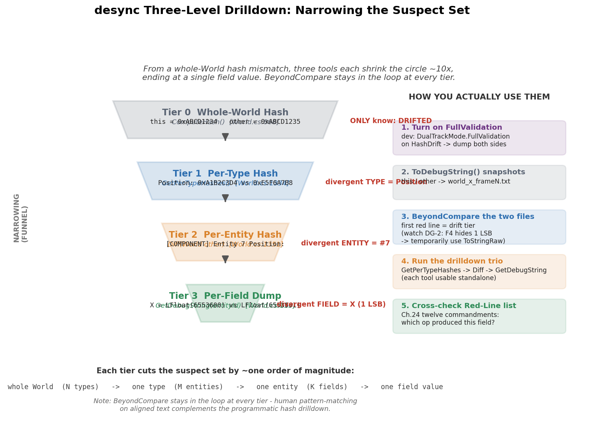
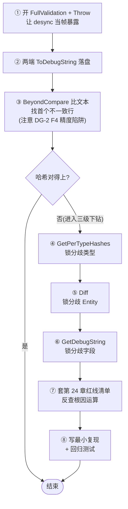
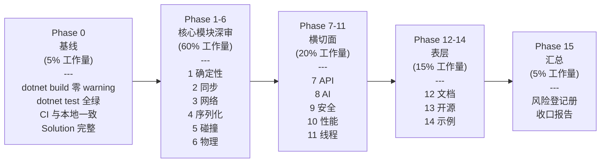

# 附录 B · 调试工具链与工业级审计

> **核心问题**:第 6 篇三章(哈希校验双轨 / 确定性红线清单 / bug 定位实战)把"desync 怎么发现、怎么预防、怎么定位"的方法论讲透了。但方法论落地需要**工具**——读者真把 LockstepSdk 跑起来,desync 了,具体要敲哪几行代码、按哪个开关、看哪个文件?以及更进一步:如果你拿到的是**一个陌生的帧同步框架**(自研的、同事留下的、开源来的),怎么系统地审它一遍,知道它的确定性地基牢不牢?这个附录就把第 6 篇的方法论翻译成**可操作的工程手册**:一份 desync 定位工具链 + 一个亲手造 desync 的练习 + 一套 15-Phase 工业级审计方法论 + 一份双轨验证文化的复盘 + 一套可观测性运维配方。

> **本附录与第 6 篇的关系**:第 6 篇是"为什么"(为什么哈希、为什么红线、为什么漂移即覆盖是灾难),本附录是"怎么动手"(开哪个开关、导哪个文件、审哪个 Phase)。读完第 6 篇再读本附录,工具才有用武之地;读本附录前没读过第 6 篇,会知其然不知其所以然。

---

## 〇、一句话点破

> **desync 定位的全部工程,就是"先让信号显形,再缩小包围圈"。让信号显形靠双轨哈希开关——开发期开 FullValidation,漂移当帧暴露;缩小包围圈靠三级下钻——GetPerTypeHashes 锁类型、Diff 锁实体、GetDebugString 锁字段。审一个帧同步框架的全部工程,就是"按确定性/同步/网络/序列化/碰撞/物理分模块深审,再按 API/安全/性能/线程横切面扫一遍,最后表层看文档/示例"。而严肃代码审查的全部工程,就是"多轮验证、不惧自我推翻、把'理论风险'和'实际触发'分开"——15 个疑似问题最终可能只剩 7 个真的。**

这是结论。本附录倒过来拆:先给 desync 定位工具链的完整操作流程,再带你亲手造一个 desync 复现回放,再展开 15-Phase 审计方法论,复盘四轮审查的收敛文化,最后落到可观测性运维。

---

## 一、desync 定位工具链:五步操作流程

第 23 章讲了哈希对账是"抓 desync 的唯一手段",第 25 章讲了三步定位法(分歧帧 → 分歧字段 → 根因运算)。这两章讲的是**方法论**。本节把方法论翻译成**可敲的代码、可看的文件**——你 desync 了,照着这五步走,80% 的 desync 能定位到字段。

### 1.0 先决条件:把校验开到最严

desync 定位的第一个动作,不是去找 bug,是**把校验开到最严,让 desync 的信号以最大音量暴露出来**。生产环境默认 `DualTrackMode.Disabled`(`World.cs:185`)——零开销但只在内存里维护增量哈希,不做全量比对,所以 desync 信号是"哑"的。开发期必须把它打开:

```csharp
// 开发期配置(任意一处初始化阶段)
world.DualTrackHashMode = DualTrackMode.FullValidation;     // 每帧全量比对
world.HashDriftRecoveryPolicy = HashDriftRecovery.Throw;     // 漂移立即抛 HashDriftException
world.OnHashDrift += (frame, incremental, full) => {
    // 漂移当帧把诊断包落盘(后面 DG-1 会详讲自动取证)
    File.WriteAllText($"drift_{frame}.txt", world.ToDebugString());
    File.WriteAllText($"perType_{frame}.txt",
        string.Join("\n", world.GetPerTypeHashes().Select(t => $"{t.TypeName}=0x{t.Hash:X8}")));
};
```

> `[World.cs:204]`(`DualTrackHashMode` 属性)、`[World.cs:192]`(`HashDriftRecoveryPolicy`)、`[World.cs:198]`(`OnHashDrift` 事件)。

> **不这样会怎样**:如果你开发期还用生产默认的 Disabled,desync 的第一现场会被增量哈希的"自动覆盖"擦掉(承第 23 章"漂移即覆盖"反面教材),你只能等到几千帧后玩家看到"坦克瞬移"才发现,那时第一犯罪现场早没了。**开发期的纪律是:宁可被异常打断,也不要被静默继续欺骗。**

### 1.1 第一步:导出两端状态快照

哈希报警后(或者你想主动排查"两台机器算得一样不一样"),第一件事是把两端状态各 Dump 一份文本:

```csharp
// 在每一端的逻辑帧末尾(或回滚完成后)
string snapshot = simulation.ToDebugString();
File.WriteAllText($"world_{machineId}_frame{frame}.txt", snapshot);
```

`ToDebugString()`(`World.cs:1300`)的输出是确定性的——它用 `UpdateSortedPoolCache()`(`World.cs:925`)保证组件池按类型名 Ordinal 排序,实体按 `_activeEntities`(SortedSet)升序遍历。**所以两端的文本如果状态一致,逐行字面相同;第一个不同的行就是分歧线索**。

> **钉死这件事**:`ToDebugString` 输出顺序的确定性,是它作为诊断工具的前提。这背后是第 5 章讲的"组件池按类型 Ordinal 排序 + 实体 SortedSet"两件确定性基础设施。如果哪天有人把 `_activeEntities` 改成 `HashSet<int>`,这个工具立刻失效——两端遍历顺序不同,文本永远"不同",反而把真分歧淹没。**诊断工具本身依赖确定性,这是帧同步工程的层层套娃**。

### 1.2 第二步:BeyondCompare / diff 文本对比

把两端的 `world_x_frameN.txt` 用 BeyondCompare(或 `diff`、VS Code Compare)打开。文本对齐后,**第一个标红(不同)的行就是分歧所在层级的线索**。这一步朴素但有效——人眼对"上下文相同、中间一行不同"的模式识别极强,BeyondCompare 的差异高亮让分歧一目了然。

但这里有一个**精度陷阱(DG-2)**:`ToDebugString` 经 `GetDebugString`(`World.cs:115`)调到组件的 `ToString()`。对 `LFloat` 字段,`ToString()` 默认只输出 4 位小数(`LFloat.cs:251`: `public override string ToString() => $"{ToFloat():F4}"`),而 LFloat 精度是 1/65536 ≈ 5 位小数。**只差一个最低位的 desync——也就是最常见的那种——在 F4 文本里看起来完全一样**。你会陷入"两端文本一模一样为啥还 desync"的困惑。

> **所以这样设计(DG-2 当前是未修完善项)**:诊断输出统一改用 `ToStringRaw()`(`LFloat.cs:252`: `public string ToStringRaw() => $"LFloat({RawValue})"`),输出完整 RawValue(整数),精确到每一位。在 DG-2 修复落地前,如果 BeyondCompare 两端文本"看起来一样但哈希对不上",**手动把组件的 `ToString` 临时改成调 `ToStringRaw`**,再比一次——这就是最低位分歧显形的方法。这是一个"工具精度不够掩盖信号"的典型,也是诚实标注框架当前边界的实例。

### 1.3 第三步:三级下钻——类型级 → 实体级 → 字段级

第 23 章讲过,32 位哈希只能告诉你"漂了",定位不到字段。LockstepSdk 提供了**三级下钻**来缩小包围圈,这是 desync 定位的核心武器:

**类型级**——两端各调 `GetPerTypeHashes()`(`World.cs:1334`),逐 ComponentType 比对哈希,首个不同的类型就是分歧所在:

```csharp
var thisHashes = thisWorld.GetPerTypeHashes();
var otherHashes = otherWorld.GetPerTypeHashes();
// 逐类型比:首个 hash 不同的类型即分歧所在
// 例如发现 Position 类型两端哈希不同 → 分歧在 Position 组件
```

`GetPerTypeHashes` 返回 `IReadOnlyList<(string TypeName, uint Hash)>`,已按类型名 Ordinal 排序(`World.cs:1342`),所以两端列表逐项对齐,比 `TypeName` 相同时的 `Hash` 即可。一个典型的输出:

```
Lockstep.Core.Game.Position=0xA1B2C3D4   (this)
Lockstep.Core.Game.Position=0xE5F6A7B8   (other)  ← 分歧!
Lockstep.Core.Game.Velocity=0x11223344   (this == other, 一致)
Lockstep.Core.Game.Health=0x55667788     (this == other, 一致)
```

定位到 Position 类型分歧后,包围圈从"整个 World"缩到"Position 组件"。

**实体级**——知道是 Position 类型分歧了,但哪个实体的 Position 错了?调 `Diff(other)`(`World.cs:1351`),它会逐 Entity 逐 Component 比对哈希,输出结构化差异:

```csharp
string diff = thisWorld.Diff(otherWorld);
File.WriteAllText("diff.txt", diff);
```

`Diff` 的输出长这样(`World.cs:1398-1405`):

```
=== World Diff (this vs other) ===
  [FRAME] this=1060 other=1060
  [COMPONENT] Entity 7 Position: this=0x12345678 other=0x87654321
    this:  Position{X=LFloat(6553600), Y=LFloat(3276800)}
    other: Position{X=LFloat(6553601), Y=LFloat(3276800)}
```

这一行 `[COMPONENT] Entity 7 Position` 就告诉你:**实体 7 的 Position 组件分歧了**,还把两端完整字段值打出来(注意这里如果走的是 `ToString` 仍受 DG-2 F4 限制,字段值要确认是否需要 `ToStringRaw` 级精度)。包围圈从"Position 类型"再缩到"实体 7 的 Position.X 字段"。

> **技巧(Diff 为什么对)**:`Diff` 不是简单文本比,而是**逐 Entity 逐 Component 算哈希比**(`pool.ComputeEntityHash(entityId)`,`World.cs:109`)。它的好处是:即使两端实体集合有差异(only in this / only in other),它也能分别报告"实体集差异"和"共有实体字段差异",不会把"少了一个实体"误报成"另一个实体的字段错了"。这是工程化 diff 比朴素文本比更稳的地方。

**字段级**——如果 `Diff` 输出的字段值文本不够精确(被 F4 截断),或者你想看某个特定实体的完整状态,直接调 `GetDebugString(entityId)`(`World.cs:115`,经 `ComponentPoolWrapper<T>.GetDebugString`)拿到该实体所有组件的字段级文本:

```csharp
string detail = world.GetEntityDebugString(7);   // 单实体全字段
```

三级下钻的完整漏斗见图 B-1。



> **图 B-1 说明**:四级漏斗。最宽:整个 World 的 32 位哈希(只知"漂了");第二级:GetPerTypeHashes 按 ComponentType 分桶,定位"哪个类型分歧"(N 个类型 → 1 个);第三级:Diff 逐实体逐组件比对,定位"哪个实体的哪个组件分歧"(M 个实体 → 1 个);最窄:GetDebugString 输出该组件全字段,定位"哪个字段差了多少"。每一步把候选范围缩小约一个数量级。图内英文标注:Level 1 Type Hash / Level 2 Entity Hash / Level 3 Field Dump。

### 1.4 第四步:套用确定性红线清单

锁到分歧字段后,第四步是**回到第 24 章的十二诫红线清单**,问:"这个字段是怎么被算出来的?它经过的运算链里,有没有踩任何一条红线?"比如:

- 分歧字段是 Position,而 Position 的更新链路里有个 `LFloat * (float)0.5f` → 浮点泄露(红线一)。
- 分歧字段是某个组件的列表,而列表是 `Dictionary` 遍历填充的 → 非确定遍历(红线四)。
- 分歧字段是血量,而血量更新时调了 `DateTime.Now` → 系统时间混入(红线七)。

红线清单是"怀疑名单",三级下钻是"锁定嫌疑人",两者配合,根因运算基本能浮出水面。

### 1.5 第五步:最小复现 + 回归测试

锁到根因运算后,第五步是写一个**最小复现**——把分歧运算单独抽出来,两端各跑一遍,确认确实能复现最低位分歧;然后把它写成**回归测试**(参照第 25 章的 `CrossPlatformDeterminismTests` 模式),作为日后防回归的守卫。这一步是"侦查闭环",没写回归测试的 desync 定位,等于没定位——下次重构它还会回来。

### 1.6 完整流程图

把上面五步串起来,就是一份 desync 定位的标准操作手册(图 B-2)。



> **图 B-2 说明**:desync 定位标准操作手册。八步闭环——开 FullValidation 让信号显形 → 两端落盘 → BeyondCompare 找首个不一致 → 三级下钻(GetPerTypeHashes / Diff / GetDebugString)→ 套红线清单反查根因运算 → 最小复现回归测试守卫。

这套五步流程是"工具链",但工具链要熟练,光看不行,得**亲手造一次 desync 再定位它**。下一节就带你做这个练习。

---

## 二、亲手造一个 desync 复现回放(最佳练习)

学 desync 定位最好的办法,是**故意引入一个确定性错误,看它怎么演变成 desync,再用上面的工具链定位它**。这一节是实操练习:我们给一个组件加个 `float` 字段,录一段回放,两端跑出不同结果,然后走一遍五步流程把它揪出来。

### 2.1 为什么这个练习值得做

你可能觉得"故意造 bug"是多此一举——真 desync 了再练不就行了?不行。真 desync 是**偶发**的,你不知道它什么时候来,来的时候可能在你没准备的开发环境(Disabled 模式)下,信号被静默吞掉,现场早没了。而**亲手造一个 desync**,你能控制它的每一个变量:知道根因是什么(你埋的)、知道它在哪一帧爆发(哈希会告诉你)、知道用哪个工具能看到什么现象。这是一次"在安全环境里演练侦查流程"的机会,等真 desync 来了,你的肌肉记忆已经形成。

> **作者复盘 · 为什么要练造 desync**:我见过太多团队,平时从不演练 desync 定位,等线上真 desync 了,工程师对着两份快照发呆,不知道先开 FullValidation 还是先导 Diff,半小时还在摸索工具,真正的侦查根本没开始。desync 定位是**时间敏感**的——第一现场稍纵即逝,哈希被覆盖一次就擦掉一次。所以我的建议是:**每个新加入帧同步项目的工程师,第一周就做一次"造 desync + 定位"练习**,把工具链敲熟。这比读十遍文档都管用。

### 2.2 练习设计:埋一个 float 字段

拿 TankGame(第 27 章)或者任何一个用 LockstepSdk 的最小 ISimulation 实现。挑一个会被每帧更新的组件,比如 `Position` 或自定义的 `Mover`,给它**加一个 `float` 字段**:

```csharp
// 故意引入的确定性错误(练习用,真实代码严禁!)
public struct Mover : IComponent
{
    public LFloat Speed;        // 正确:定点数
    public float CachedSpeed;   // 错误:浮点!两端 FPU 舍入可能不同
    // ...
}
```

然后在某个 System 的 Update 里,让这个 `CachedSpeed` 参与一次影响局面的运算——比如把它加到 Speed 上,或者用它决定移动距离:

```csharp
// 故意写的非确定运算
world.UpdateComponent<Mover>(entity, (ref Mover m) => {
    m.CachedSpeed = (float)m.Speed.RawValue * 0.0001f;  // 浮点运算
    var distance = m.Speed + LFloat.FromFloat(m.CachedSpeed * 1.0f);  // 浮点回灌
    // ... 用 distance 更新 Position
});
```

这个错误有代表性:`float` 运算在不同 CPU/FPU/运行时上,舍入模式可能不同(承第 2 章为什么不能用浮点)。两端跑同样的输入,Position 会逐位分叉——几千帧后坦克坐标天差地别,但单帧只差一个最低位,正是 desync 最典型的形态。

> **钉死这件事(练习的代表性)**:这个埋的错是"组件层 float 泄露"——也就是第 24 章红线清单的第一条,以及 DG-4(体检未覆盖 IComponent 字段)指向的最常见 desync 元凶。练会了这个,你就掌握了定位"80% 的 desync"的能力。

### 2.3 录一段回放

错误埋好后,启动两端(或两台机器),开一局对战,让坦克动起来几百帧。用 ReplayRecorder 录下输入流(承第 21 章回放系统):

```csharp
// 录制
recorder.Start(playerCount, randomSeed, initialState);
// 每帧
recorder.RecordFrame(currentFrameData);
// 结束存盘成 .lsr(Lockstep Replay)
```

> `[ReplayRecorder.cs:31]`(`Start`)、`[ReplayRecorder.cs:43]`(`RecordFrame`)。

录完后你手上有一份 `.lsr` 回放文件——它只含初始状态 + 每帧输入,不含任何中间状态(承第 21 章:回放为什么"免费",因为确定性机器 + 录输入 = 完美复现)。

### 2.4 两端跑回放,触发 desync

现在关键一步:**让两端用同一份 `.lsr` 回放,但用各自机器的运行时跑**。如果一端是 net8.0、另一端是 netstandard2.1(模拟 Unity 客户端 vs 服务端),浮点舍入差异最可能显形。两端都开 FullValidation:

```csharp
world.DualTrackHashMode = DualTrackMode.FullValidation;
world.HashDriftRecoveryPolicy = HashDriftRecovery.Throw;
```

跑回放到某帧,两端哈希对不上,`OnHashDrift` 触发,`HashDriftException` 抛出(因为设了 Throw),诊断包落盘。**这就是你的"第一现场"**——desync 被当帧抓住,现场完好。

> **不这样会怎样**:如果你忘了开 FullValidation,desync 信号会被增量哈希的自动覆盖擦掉(承第 23 章反面教材),回放跑完两端"看起来都正常",你以为没问题。这是练习要建立的第一直觉:**开发期永远开 FullValidation,否则你连 desync 发生过都不知道**。

### 2.5 走一遍五步流程

现在按第 1 节的五步流程走:

1. **导快照**:两端在抛异常那帧各 `ToDebugString` 落盘。
2. **BeyondCompare**:比文本,找首个不一致行。注意 DG-2 陷阱——如果 Position 的 X 显示成 `100.0000` 两端一样,但你确信哈希对不上,把组件 ToString 临时改成 ToStringRaw,会看到 `LFloat(6553600)` vs `LFloat(6553601)`,差一个最低位。
3. **三级下钻**:`GetPerTypeHashes` 发现 Mover 类型分歧 → `Diff` 定位到实体 N 的 Mover → `GetDebugString` 看到 `CachedSpeed` 字段值两端不同(浮点舍入差异显形)。
4. **套红线清单**:字段是 `float` 类型 → 直接命中红线一(禁浮点)。
5. **回归测试**:写一个最小复现——两端各跑 `(float)6553600 * 0.0001f`,断言结果位级相同,失败即复现。

五步走完,你从"哈希对不上"定位到了"某行代码用了 float",根因清晰。**这就是一次完整的 desync 侦查**。多练几次,换不同的错误类型(埋 Dictionary 遍历、埋 System.Random、埋 swap-pop 删除),你的嗅觉就建立起来了。

---

## 三、★工业级审计方法论:15-Phase 审查框架

前两节是"desync 了怎么定位",适合**使用者**。这一节换个视角:如果你拿到一个**陌生的帧同步框架**(自研的、同事留下的、开源来的),怎么系统地审它一遍,判断它的确定性地基牢不牢、能不能上生产?

LockstepSdk 自己经历了一次完整的开源前深度审计,方法论沉淀在 `review_plan.md` 里——一套 **15 个 Phase** 的审查框架。这不是 LockstepSdk 专属的,它适用于任何帧同步框架(甚至任何实时一致性系统)。本节把它展开成一份可复用的 checklist。

### 3.1 15-Phase 的结构:纵深推进

15 个 Phase 不是平铺的,而是**纵深推进**——先建基线,再按模块深审,再横切面扫,最后表层收口:



> **图 B-3 说明**:15-Phase 审计方法论纵深推进——先决条件(Phase 0 基线)→ 核心模块深审(Phase 1-6,占 60% 工作量)→ 横切面扫(Phase 7-11,占 20%)→ 表层收口(Phase 12-14,占 15%)→ 汇总(Phase 15,占 5%)。工作量分布:5%/60%/20%/15%/5%。

### 3.2 Phase 0:构建与测试基线(先决条件)

**这一步不审代码,只确认"能审"**。一个编不过、测试不过的代码库,审了也没意义。Phase 0 检查四件事:

| # | 检查项 | 通过标准 |
|---|--------|----------|
| 0.1 | 全量编译 | Release 配置零 warning(或仅预期 warning) |
| 0.2 | 全量测试 | 全部通过,记录覆盖率基线 |
| 0.3 | CI 流水线 | 与本地构建一致(同样 SDK、同样配置) |
| 0.4 | Solution 完整性 | 所有项目纳入,无幽灵引用 |

> **承接第 22 章**:Phase 0.2 的"测试通过"有个隐藏陷阱——测试套件本身可能只跑某一个 TFM(比如 net8.0),另一个 TFM(netstandard2.1)编译但从不被测。LockstepSdk 的 P0-1 跨 TFM 舍入分叉就是栽在这——netstandard2.1 分支编译过但从未执行,跨平台等价性零回归保障(E-2/E-4)。**审一个帧同步框架,必须确认所有声明的 TFM 都有执行测试覆盖,否则 `#else` 分支是死代码**。

### 3.3 Phase 1-6:按模块深审(核心,占 60% 工作量)

帧同步框架的生命线分布在六个模块,逐个深审:

**Phase 1 · 确定性保证(最高优先级)**——这是帧同步的命脉,任何非确定性都是致命 bug。十个子项:

- 1.1 定点数运算正确性(溢出保护、除法精度、类型转换边界)
- 1.2 定点三角函数精度(LUT 表生成、插值、边界值)
- 1.3 确定性随机数(种子传播、状态序列化/恢复一致性)
- 1.4 ECS 遍历确定性(确认用 SortedSet/有序结构,无 Dictionary/HashSet 遍历)
- 1.5 组件池回滚安全(快照/恢复逻辑,无浅拷贝)
- 1.6 **float/double 污染扫描**(Grep 扫核心库的浮点使用)
- 1.7 LINQ/OrderBy 扫描(隐式非确定性排序)
- 1.8 DateTime/Environment 扫描(逻辑层无系统时间依赖)
- 1.9 物理确定性(刚体模拟、约束求解器)
- 1.10 Raycast 确定性(三角形/Mesh 碰撞精度)

> **钉死这件事**:Phase 1 是最该花时间的——LockstepSdk 的审计里,Phase 1 单独做了三轮深审(见 `issues_found.md`),每轮都发现新东西。第一轮确认十项通过,第二轮发现 P0-1 跨 TFM 舍入分叉(矩阵/四元数),第三轮确认 P0-1 修复正确但又发现 E-4(守卫测试被 #if NET8 包裹,非 NET8 路径零覆盖)。**确定性审查没有"审一遍就完了",它是收敛的,但收敛需要多轮**。

**Phase 2 · 预测回滚核心**——LockstepController 主循环、快照存储/恢复对称性、RingBuffer 正确性、哈希校验机制。重点查"回滚后状态是否真自洽"(承第 23 章 LoadState 重算补丁的教训)。

**Phase 3 · 网络层**——状态机转换完整性、重连竞态、GameRoom 生命周期、输入冗余机制、消息处理策略、传输层接口一致性、RateLimiter、握手版本、服务端多房间并发。

**Phase 4 · 序列化系统**——BitWriter/BitReader 对称性(每个 Write 有对称 Read)、magic number/version 头、Source Generator 生成代码正确性(承 E-3 静默丢字段教训)、边界值处理、回放文件完整性、BufferPool 归还安全。

**Phase 5 · 2D 碰撞系统**——QuadTree 正确性、碰撞检测算法、定点数精度(SAT 在定点下)、确定性遍历(碰撞对生成顺序)。

**Phase 6 · 3D 物理系统**——刚体模拟、约束求解器、接触求解器、广相复杂度、定点数下数值稳定性。

> **承接《物理引擎》**:Phase 5/6 的碰撞/物理算法原理(SAT、GJK、EPA、接触求解),《物理引擎》那本讲透了,这里只审"确定性"特有的——定点数精度下算法是否稳定、遍历顺序是否确定。不要重复审算法正确性,篇幅留给确定性视角。

### 3.4 Phase 7-11:横切面审查(占 20% 工作量)

模块深审后,换四个横切视角再扫一遍,抓住模块审查容易漏的跨模块问题:

- **Phase 7 · AI 模块**:行为树核心、行为树确定性(LRandom 集成)、A* 寻路(开放列表排序确定性)、NavMesh、ORCA 避障。
- **Phase 8 · API 设计**:public API 表面积、命名一致性、ISimulation 接口设计、Builder API 易用性、事件/回调设计、Dispose/IDisposable、Obsolete/Breaking、泛型约束。
- **Phase 9 · 安全性**:输入验证(恶意包)、缓冲区溢出、DoS 防护(RateLimiter、大包/快速重连)、内存耗尽(无界集合)、ReconnectToken 安全、异常处理、日志敏感信息。
- **Phase 10 · 性能**:GC 分配热路径、装箱扫描、LINQ 扫描、字符串拼接、池化有效性、大 O 复杂度、Benchmark 覆盖度。
- **Phase 11 · 线程安全**:服务端多房间并发、网络收发线程、WebSocket 线程安全、共享状态(static/单例)、Metrics 采集跨线程读写。

> **钉死一件事(横切面的价值)**:模块审查容易陷入"这个模块内部逻辑对不对",横切面逼你跳出模块看跨模块。比如 Phase 9 安全审查,审到序列化模块时你可能觉得"ReadBytes 有越界检查够了",但横切到"网络层消息大小有没有上限"才发现在没上限的网络层下,序列化层的检查形同虚设(D-2/D-8 的教训)。**模块审查是纵切,横切面是横切,两者互补才能织成网**。

### 3.5 Phase 12-14:表层审查(占 15% 工作量)

代码审透了,最后看"交付物"——文档、开源准备、示例代码:

- **Phase 12 · 文档**:README 能否走通、架构描述与代码一致性、API 文档覆盖率、文档间交叉引用无死链、中英文同步。
- **Phase 13 · 开源发布**:LICENSE、CONTRIBUTING、.gitignore、敏感信息扫描、NuGet 元数据、CHANGELOG、版本号策略、示例可运行性、批处理脚本跨平台、git 历史清洁度。
- **Phase 14 · 游戏示例**:TankGame、BomberGame、RaylibClient、Server 启动器、Benchmark 的代码质量与可复现性。

### 3.6 Phase 15:汇总与行动项

最后把所有发现按优先级(P0 命脉 / P1 高 / P2 中 / P3 低)归类,标注"发布阻断项"和"改进建议项",输出结构化报告。**这一步的关键是诚实**——不要为了让报告好看而降级问题,也不要为了显示严格而夸大问题(下一节详讲)。

### 3.7 每个 Phase 输出什么

review_plan.md 的执行策略明确:"每个 Phase 完成后输出发现摘要,最终合并为完整 review 报告"。一个 Phase 的输出应该是:

```
Phase X · [模块名] 审查
范围:[本 Phase 覆盖的文件/检查项]
方法:[怎么审的——读码/Grep/构造测试/运行验证]
发现:
  - [问题编号] [优先级] [现象] [文件:行] [建议]
  - [确认 OK 项] [为什么 OK]
新发现(本 Phase 独有):[...]
```

这个格式的好处是**可追溯**——三个月后回看,你能知道当时审了什么、怎么审的、发现了什么、为什么这么判定。这对"审计报告不是一次性快照,而是活档案"至关重要(承第 23 章铁律:审计报告是"发现→修复"的过程记录,不是"现存缺陷清单")。

---

## 四、★双轨验证文化:四轮审查的收敛复盘

15-Phase 给了"怎么审"的框架,但审计的灵魂不在框架,在**态度**——具体说,在"怎么对待你发现的每一个问题"。这一节复盘 LockstepSdk 审计里最深刻的工程文化:**多轮验证、不惧自我推翻、区分"理论风险"与"实际触发"**。

### 4.1 四轮审查的收敛曲线

LockstepSdk 的代码审查(`issues_found.md`)经历了四轮,数字很有戏剧性:

```
初始审查:上报 15 个问题
  ↓ 一次验证(排除假问题)
一次验证后:10 个问题(排除 5 个)
  ↓ 二次深度验证(再排除 + 修正)
二次验证后:7 个真问题(再排除 3 个,修正 4 个的严重性)
  ↓ 第三次深审(发现新问题)
第三次后:又登记 8 个新候选(P0-1/P0-2/Sqrt 等)
  ↓ 第三次验证(大部分排除,2 个确认真问题)
第三次验证后:P0-2 真问题降级 P1,其余排除
  ↓ 第四次深审(又发现新问题)
第四次后:又登记 FrameData OOM/BitReader/GetInput GC 等
  ↓ 最终
最终:7 个真问题(全部已修),其余确认为假问题/非问题
```

这条收敛曲线见图 B-4。


> **图 B-4 说明**:折线图。X 轴:审查轮次(Initial / R1 Verify / R2 Deep / R3 New / R3 Verify / R4 New / Final)。Y 轴:候选问题数。两条线:Candidate(候选,锯齿:15→10→7→15→8→12→7)和 Confirmed-true(确认真问题,单调下降至 7)。关键标注:R2 排除 3 个(P1-001/002/003 全是假问题)、R3 新增 P0-1/P0-2、R3 验证把 P0-2 降级 P1、Final 7 个全修复。图内英文标注:Initial report / Round 1 verify / Round 2 deep / Round 3 new findings / Round 4 / Converged。

### 4.2 为什么需要多轮——单轮审查的三个盲区

你可能问:审一遍不够吗,为什么要四轮?因为单轮审查有三个绕不过的盲区:

**盲区一:假问题占大头**。初始 15 个里,有 8 个最后被证明是假问题——超过一半!比如:

- **P1-001 "LFloat(long) 构造溢出"**:理论上有溢出风险,但全代码库 `grep "new LFloat(\d"` 零命中——**这个构造函数从未被调用**,纯理论风险。排除。
- **P1-002/P1-003 "LFloat/int 除零检查缺失"**:C# 语言规范保证 `long / 0` 必抛 `DivideByZeroException`,跨平台行为一致。所谓"缺失检查"只是防御性风格差异,**运行时行为完全等价**。排除。
- **P2-001 "QuadTree GetStatistics 重复计数"**:跨边界物体存入多个子节点是设计意图,碰撞检测用 `HashSet<long>` 去重。**设计正确,非 bug**。排除。

这些假问题有个共同特征:**看起来像 bug,但要么从未被触发(死代码路径),要么被语言规范/设计意图兜底**。单轮审查分不清"看起来像"和"真的是",多轮验证才能把"理论风险"和"实际触发"分开。

**盲区二:严重性误判**。二次深度验证修正了 4 个问题的严重性,最典型的是 ISSUE-01 "重连卡死":

- 初始描述:"StateRequest 无超时 → **永久卡死**"(P0)
- 验证修正:"实际 `MaxReconnectAttempts`(默认 10 次 × 2 秒 = ~20 秒)会终止重连循环"——**不是永久卡死,是 20 秒无响应卡顿**。从 P0 降到 P1。

严重性误判的方向是双向的——有时夸大(永久卡死其实 20 秒),有时低估(P0-3 "LoadState 后 _incrementalHash 不一致"初审认为是问题,二次验证发现代码已正确处理,排除)。**单轮审查的严重性判断不可信,必须二次验证**。

**盲区三:新问题需要"换视角"才能发现**。第三轮和第四轮深审,各发现了初审完全没有的新问题:

- 第三轮发现 P0-1 跨 TFM 舍入分叉(矩阵/四元数,LQuaternion 进序列化状态)和 P0-2 顶号绕过(身份劫持)——这两个是**真 P0**,潜伏在"双目标库未测分支"和"重连信任边界"盲区,推翻了轮次 1-4"累计 0 硬 P0"的结论。
- 第四轮发现 FrameData.Deserialize 无边界检查(OOM 风险)、GetInput/SetInput 每次新建 BitReader/BitWriter(GC 压力)、FrameDataPool 统计非原子(仅统计不影响功能)。

> **钉死这件事**:新问题不是"审得不细",是**视角不够**。第三轮发现 P0-1/P0-2 是因为换了"跨 TFM + 信任边界"的视角;第四轮发现 OOM 是因为换了"恶意输入"的视角。**每轮深审应该带一个新视角**,否则只是在旧视角下重复扫描,发现不了新东西。这呼应第 25 章假问题教学——侦查和鉴别都需要"换视角"的能力。

### 4.3 双轨验证的具体做法

怎么把"多轮验证"做成可操作的工作流?LockstepSdk 的经验是**双轨**:

1. **第一轨:发现轨**。大胆怀疑,宁滥勿缺。看到一个"看起来像 bug"的就登记,不管能不能马上确认。初始 15 个就是这么来的——先广撒网。
2. **第二轨:验证轨**。谨慎求证,逐条排除。对每个登记的问题,做三件事:
   - **Grep 验证**:这个问题真的会被触发吗?调用方在哪里?(P1-001 就是 Grep 零命中排除的)
   - **语言规范验证**:语言/运行时保证的行为是什么?(P1-002 就是查 C# 规范排除的)
   - **设计意图验证**:这是 bug 还是设计?(P2-001 就是查设计文档排除的)

3. **第三轨(关键):换视角重审**。每一轮用一个新视角(跨 TFM / 信任边界 / 恶意输入 / 并发 / 极端输入)重新扫一遍代码,找新问题。第三轮和第四轮的新发现都来自这一轨。

> **承接第 23 章**:这个"双轨验证"和第 23 章的"哈希双轨"是同一个思想的不同应用——**两条独立路径互相校验,比单条路径可靠得多**。哈希双轨是"增量哈希 + 全量重算"两条路径校验状态一致性;审查双轨是"发现轨 + 验证轨"两条路径校验问题真实性。前者校验的是"代码对不对",后者校验的是"我们对代码的判断对不对"。**两者都体现了"独立路径交叉验证"的工程哲学**。

### 4.4 不惧自我推翻

四轮审查最反直觉的一点,是**轮次 5 推翻了轮次 1-4 的"0 硬 P0"结论**。前四轮都自信地说"累计 0 个硬 P0",第五轮独立重审(含 4 个并行子 agent + 对全部 P0 声明读码核验),发现 2 个真 P0(P0-1 跨 TFM 数学分叉、P0-2 顶号身份伪造),都潜伏在前四轮的盲区。

这不是"前四轮审错了",是**审计的本质是收敛,但收敛不等于单调下降**。新视角能挖出新问题,新问题可能比已发现的问题更严重。一个成熟的审计文化,必须**接受"我之前的结论可能被推翻"**,而不是死守"已经审过了,没问题"。

> **作者复盘 · 审计的最大敌人是自负**:我做 LockstepSdk 审计最大的教训,是前四轮"0 硬 P0"的结论让我一度很自得,觉得框架已经很稳。是第五轮的独立重审打醒了我——潜伏的 P0 就在我"已经审过了"的盲区里(跨 TFM 分支、重连信任边界)。从那以后我定了个规矩:**每轮审计结尾必须问一句"我这轮没看的地方,可能藏着什么?"**,并强制下一轮换一个新视角。这个习惯后来在 desync 定位工具链专题(DG-1~8)里又挖出 8 个完善项。审计没有终点,只有收敛。

---

## 五、可观测性运维:LockstepMetrics 与 Prometheus

工具链和审计方法论讲完了,最后落到**生产运维**——线上跑起来后,怎么持续监控 desync / 漂移 / 快照完整性 / 回滚这些指标,在玩家投诉之前就发现问题?这承第 22 章的可观测性地基,这里讲怎么把它接到 Prometheus 等监控系统。

### 5.1 当前已就位的可观测性地基(诚实标注)

先说清楚:LockstepMetrics 的**核心指标采集已经就位**,不是"未来项"。`LockstepMetrics.cs` 已经提供了完整的指标体系:

**网络指标**:`Rtt`、`AvgRtt`、`RttJitter`、`MaxRtt`、`MinRtt`(`LockstepMetrics.cs:18-30`)——RTT 滑动窗口(20 样本)+ 平均/标准差实时计算(`RecordRtt`,`:152`)。

**同步指标**:`RollbackCount`、`RollbackFrames`、`LastRollbackFrames`、`PredictionFrames`、`MaxPredictionFrames`、`ConfirmedTick`、`ServerTick`(`:42-63`)。

**完整性诊断指标(本节重点)**:
- `DesyncCount`(`:81`)——检测到的两端哈希不一致次数
- `HashDriftCount`(`:85`)——增量哈希与全量哈希漂移次数(双轨校验发现)
- `SnapshotIntegrityFailures`(`:89`)——快照完整性校验失败次数(加载后哈希与保存时不一致)
- `RollbackFailures`(`:93`)——回滚失败次数(找不到快照或状态损坏)
- `LogDropped`(`:97`)——被丢弃的日志条数(SyncLogger 队列满等)
- `CriticalSendEscalations`(`:101`)——关键消息(HashReport/ClientInput)因发送队列满而降级直发的次数

这些指标通过 `RecordDesync()` / `RecordHashDrift()` / `RecordSnapshotIntegrityFailure()` / `RecordRollbackFailure()`(`:105-114`)采集,用 `Interlocked` 保证跨线程安全。

> **钉死这件事(已就位 vs 未来项)**:日志抽象(Log.cs Sink/MinLevel,`:30-127`)、OnHashDrift 事件(`World.cs:198`)、HashDriftRecoveryPolicy(`:192`)、GetPerTypeHashes + Diff 三级下钻(`:1334,1351`)、World 单线程化(CheckThreadAffinity,`:254`)、Metrics 全套 desync 指标——**这些当前都已就位**,是"可观测性地基"。下一节的 DG-1~8 是"最后一公里"的完善项,**不是地基缺失**。区分这两者是诚实标注的关键,也是第 23 章铁律("别把已修的写成现存缺陷")的延续。

### 5.2 接 Prometheus:Gauges 与 Counters

`LockstepMetrics` 提供了结构化导出,直接喂给 Prometheus:

```csharp
// Gauge(瞬时值)——适合 RTT、预测帧数、追帧进度等
IReadOnlyDictionary<string, double> gauges = metrics.GetGauges();
// 输出示例:
// lockstep_rtt_ms = 45
// lockstep_prediction_frames = 3
// lockstep_rollbacks_per_second = 0.5

// Counter(累计值)——适合回滚次数、desync 次数等
IReadOnlyDictionary<string, long> counters = metrics.GetCounters();
// 输出示例:
// lockstep_rollback_total = 142
// lockstep_desync_total = 0
// lockstep_hash_drift_total = 0
// lockstep_snapshot_integrity_failures_total = 0
```

> `[LockstepMetrics.cs:294]`(`GetGauges`)、`[LockstepMetrics.cs:330]`(`GetCounters`)、`[LockstepMetrics.cs:353]`(`FillMetrics`,避免分配的版本)。

接 Prometheus 的典型做法是用 prometheus-net 这类库,在一个 ASP.NET 端点把 Gauges/Counters 导出成 Prometheus 文本格式,Prometheus 抓取后存进时序库,Grafana 画图告警。

### 5.3 生产环境监控怎么配

线上跑帧同步,有几条**红线告警**必须配:

| 指标 | 阈值 | 含义 | 告警动作 |
|------|------|------|----------|
| `lockstep_desync_total` | 任意增长 | 两端哈希不一致 | **P0 立即告警**——desync 是帧同步最严重的事 |
| `lockstep_hash_drift_total` | 任意增长 | 增量与全量哈希漂移 | P0 告警——可能 desync 被自动覆盖了(承第 23 章) |
| `lockstep_snapshot_integrity_failures_total` | 任意增长 | 快照损坏 | P1 告警——回滚/重连可能基于坏快照 |
| `lockstep_rollback_failures_total` | 速率异常 | 找不到快照 | P1 告警——回滚机制可能失效 |
| `lockstep_rollbacks_per_second` | > 2/s | 回滚风暴 | P2 告警——网络抖动或预测策略问题 |
| `lockstep_prediction_frames` | > 持续高值 | 预测过深 | P2 告警——网络延迟恶化 |
| `lockstep_rtt_ms` / `lockstep_rtt_jitter_ms` | 突增 | 网络恶化 | P3 通知 |

> **钉死这件事(desync 告警的语义)**:`lockstep_desync_total` 增长**不等于"框架坏了"**——它增长说明哈希比对机制**正常工作**(抓住了 desync)。真正坏的是"`desync_total` 恒为 0 但玩家在投诉不同步"——那意味着校验被静默吞掉了(承第 23 章"漂移即覆盖"反面教材)。**监控的价值不在"指标低",在"指标可信"**。

### 5.4 最后一公里:DG-1~8 完善项(诚实标注未来工作)

可观测性地基已就位,但"desync 定位工具链的最后一公里"还有 8 个完善项,登记在 `INDUSTRIAL_AUDIT_REMAINING.md` 的 Desync 定位工具链专题(DG = Desync Gap)。本附录任务要求诚实标注它们是**未来完善项**,不是现存缺陷:

- **DG-1 跨机器 desync 自动取证**:当前 `Diff(World)` 只能同进程比对(`World.cs:1351`),线上 desync 发生在不同机器,客户端拿不到对端 World。完善方向:`OnHashDrift` 触发时自动收集客户端诊断包(ToDebugString + GetPerTypeHashes + 触发点附近 N 帧输入流 + 回放片段)上报服务器。**外部确认"实现简单"**,价值最高。
- **DG-2 Diff 文本输出 F4 精度掩盖最低位分歧**:LFloat.ToString() 默认 F4(`LFloat.cs:251`),只显示 4 位小数,但精度是 5 位。差一个最低位的 desync 在 F4 文本里"看起来一样"。框架有 ToStringRaw()(`:252`)精确,但诊断输出走哪个未最终核实。完善方向:所有诊断输出统一改用 ToStringRaw 或直接输出 RawValue。**极低风险修复**。
- **DG-3 漂移发现点 → 真正分歧帧的"盲区"**:哈希校验发现漂移时距真正分歧帧已 N 帧,中间状态未必存。完善方向:提供 `BinarySearchDivergenceFrame(leftTick, rightTick)`——利用快照+输入流二分定位首个分歧帧。
- **DG-4 体检未覆盖 IComponent 字段**:SystemStateValidator 反射体检只扫 System 类字段,组件层 float/double 泄露无自动拦截(承第 24 章覆盖边界)。完善方向:体检扩展到 IComponent,或 SourceGenerator 编译期对 [AutoSerialize] 组件发诊断。
- **DG-5 哈希基准取 player[0] 而非众数**:3+ 客户端时,player[0] 本身可能是错方,以它为基准会把多数派判错。完善方向:基准取众数(majority),HashMismatch 携带权威哈希 + 少数派 playerId。
- **DG-6 desync 触发时未自动 dump 输入回放**:发现 desync 后最有效的定位是"录这段输入在开发机复现",但框架无自动 dump 机制。完善方向:OnHashDrift 回调里自动 ReplayRecorder 录制 [driftFrame-N, driftFrame] 输入流落盘。
- **DG-7 运行时时间/遍历泄露检测(高标准项)**:静态体检扫字段抓不住运行时行为(逻辑层偷偷调 DateTime.Now、对临时 Dictionary 遍历)。完善方向:开发期提供运行时 hook(DateTime.Now 调用检测、Dictionary 遍历顺序跨端双轨校验)。**高标准项,业界少见,没有也正常**。
- **DG-8 随机数调用追踪**:desync 常是随机序列分叉,框架无"记录每次 LRandom.Next 调用栈与返回值"的开发期追踪。完善方向:DEBUG 下 LRandom 维护环形调用日志(tick, stacktrace, consumed value),desync 时两端比对调用序列。

> **钉死这件事(诚实标注)**:DG-1~8 是"desync 定位工具链的最后一公里"完善项,**不是可观测性地基的缺口**。地基(日志抽象/OnHashDrift/RecoveryPolicy/三级下钻/World 单线程化/Metrics 全套指标)当前已就位。把 DG 写成"地基缺失"是误导,把 DG 藏起来不写也是误导——诚实标注就是"地基已牢,最后一公里有这些已知完善项,优先级建议见下"。**专题优先级建议**:DG-1(跨机器取证,价值最高)+ DG-2(F4 精度,极低风险)优先;DG-3/DG-5(二分定位 + 众数裁决)次之;DG-4/DG-6 补全护栏;DG-7/DG-8 为高标准可选。

---

## 六、技巧精解:15-Phase 审计的两个硬核技巧

本附录挑两个最硬核的审计技巧单独拆透。

### 技巧一:同源性检验——校验的基准必须独立于被校验对象

**问题**:审计序列化/快照/哈希模块时,怎么判断"有校验"和"校验有效"?

**朴素做法撞什么墙**:看到 `LoadState` 后调 `ComputeHash()` 比对快照哈希,直觉判断"有校验,挡得住组件损坏"。但第 23 章的 LoadState 恒真漏洞证明这个判断错了——校验的左边(ComputeHash 返回值)和右边(快照存的哈希)根源都是快照里同一个 `_incrementalHash`,数学上恒等,挡不住"组件翻坏但哈希字段完好"。

**技巧**:**画来源依赖图**。把校验表达式 `LHS == RHS` 的 LHS 和 RHS 各自追溯到最终的数据源,如果两者同源,校验是虚假的。LoadState 的例子:LHS = ComputeHash() = baseHash*31 + _incrementalHash,RHS = snapshot.Hash;而 _incrementalHash 是从快照字节读出来的,snapshot.Hash 也是——**同源,恒真**。

**审计动作**:对每个"有校验"的代码点,问三个问题:① 校验的基准(LHS)最终来自哪个数据源?② 被校验对象(RHS)最终来自哪个数据源?③ 两者同源吗?同源即虚假校验。

**反面对比**:第 23 章的修复(LoadState 末尾用独立的 `ComputeFullComponentHash` 遍历刚加载的真实组件)就是把基准换成"独立来源"(内存真实组件 vs 快照字节流),切断同源性,校验才有效。**这是审计序列化/快照模块最该带的视角**。

### 技巧二:视角矩阵——横切面审查的系统性覆盖

**问题**:Phase 1-6 模块深审后,Phase 7-11 横切面怎么保证不遗漏?

**朴素做法撞什么墙**:横切面审查容易变成"想到哪审到哪",漏掉某些视角。比如审了安全忘了审线程,审了性能忘了审 GC,审了 API 忘了审 Dispose。

**技巧**:**建视角矩阵**。把"模块"(Phase 1-6 的六个:确定性/同步/网络/序列化/碰撞/物理)和"视角"(Phase 7-11 的五个:API/安全/性能/线程/AI)做成二维矩阵,每个格子填"这个模块在这个视角下有没有问题"。比如:

| 模块 \ 视角 | 安全 | 性能 | 线程 |
|------------|------|------|------|
| 确定性 | 跨 TFM 未测分支(E-2) | Int128 软件运算税 | World 单线程 CheckThreadAffinity |
| 网络 | KCP conv OOM(D-5)/顶号绕过(P0-2) | GetHistoryHashes GC(F-2) | receive loop 重连竞态(A-6) |
| 序列化 | ReadList OOM(D-8)/回放 frameCount(D-9) | GetInput 新建 BitReader | 池 Count 加锁(F-5) |

矩阵的每个格子都是一个"模块 × 视角"的交叉点,强迫你系统地覆盖所有组合。LockstepSdk 审计里发现的 P0-2(网络 × 安全 = 顶号绕过)、D-8(序列化 × 安全 = OOM)、A-6(网络 × 线程 = 重连竞态)都是横切面交叉点问题——**模块审查看不到,横切面才看到**。

**为什么对**:模块审查是"纵切"(深入一个模块),横切面是"横切"(一个视角扫所有模块),两者正交才能织成完整的网。矩阵化保证不遗漏任何一个交叉点。

**反面对比**:不做矩阵,只靠"经验"横扫,典型的遗漏是"我没想到这个模块还有这个视角的问题"。矩阵把"想到"变成"看到",把直觉变成流程。

---

## 七、附录小结

### 回扣主线

本附录是第 6 篇"确定性调试"的**工具落地**——把第 23 章(哈希双轨)、第 24 章(红线清单)、第 25 章(bug 实战)的方法论翻译成可操作的工程手册。它服务全书主线,属于**调试**(第 6 篇的工程收尾)。我们回答了五个问题:① desync 了怎么用工具定位(五步流程:开 FullValidation → 导快照 → BeyondCompare → 三级下钻 → 套红线清单 + 回归测试);② 怎么造一个 desync 复现回放练手(埋 float 字段 + 录 .lsr + 两端跑回放触发 + 走五步流程);③ 怎么审一个帧同步框架(15-Phase:Phase 0 基线 → 1-6 模块深审 → 7-11 横切面 → 12-14 表层 → 15 汇总);④ 怎么做严肃的代码审查(四轮收敛:发现轨 + 验证轨 + 换视角重审,不惧自我推翻);⑤ 生产环境怎么配监控(LockstepMetrics 的 Gauges/Counters + Prometheus + 红线告警)。

> **诚实标注**:可观测性地基(日志抽象/OnHashDrift/RecoveryPolicy/三级下钻/World 单线程化/Metrics 全套 desync 指标)**当前已就位**——这是"地基已牢"。DG-1~8 是 desync 定位工具链的**最后一公里完善项**,优先级建议 DG-1+DG-2 优先,这是"最后一公里有这些已知项,不是地基缺失"。两者必须分清,否则要么误导读者以为地基不稳,要么误导读者以为没有改进空间。

### 五个为什么

1. **desync 定位的第一步为什么是"开 FullValidation"而不是"找 bug"?**——因为生产默认 Disabled 是哑的,desync 信号被增量哈希自动覆盖擦掉,你不打开 FullValidation,第一现场永远看不到,找 bug 无从谈起。**让信号以最大音量显形,是定位的前提**。
2. **三级下钻为什么是"类型 → 实体 → 字段"这个顺序?**——因为每一步把包围圈缩小约一个数量级,且每一步的工具独立可用(可以只跑到类型级就停)。类型级(GetPerTypeHashes)告诉你"哪类组件错了",实体级(Diff)告诉你"哪个实体的这类组件错了",字段级(GetDebugString)告诉你"这个实体的这个字段差了多少"。**漏斗式缩小,每一步都是上一步的细化**。
3. **15-Phase 审计为什么要分"模块深审 + 横切面"两层?**——因为模块深审是纵切(深入一个模块内部逻辑),横切面是横切(一个视角扫所有模块),两者正交。模块审查看不到跨模块问题(如网络×安全的顶号绕过),横切面审查看不到模块内部细节(如确定性模块的跨 TFM 分支)。**两层正交才能织成完整的网**。
4. **四轮审查为什么能从 15 个收敛到 7 个,中间还新增了 P0?**——因为单轮审查有三个盲区(假问题占大头 / 严重性误判 / 新问题需换视角)。多轮验证靠"发现轨大胆怀疑 + 验证轨谨慎排除 + 换视角重审"双轨推进,把"理论风险"和"实际触发"分开。轮次 5 推翻前四轮"0 硬 P0"不是审错,是新视角(跨 TFM + 信任边界)挖出了潜伏盲区的真问题——**审计的本质是收敛,但收敛不等于单调下降**。
5. **DG-1~8 为什么诚实标注为"完善项"而不是"缺陷"?**——因为可观测性地基已就位,DG 是"最后一公里"的工具链完善(跨机器取证/F4 精度/二分定位等),不影响框架核心确定性。把 DG 写成"地基缺失"会误导读者以为框架不稳,把 DG 藏起来会误导读者以为没有改进空间。**诚实标注 = 地基已牢 + 最后一公里有这些已知项**,这是工程成熟度的标志,也是第 23 章铁律("审计报告是发现→修复的过程记录,不是现存缺陷清单")的延续。

### 想继续深入往哪钻

- 想搞懂哈希双轨、漂移即覆盖反面教材、LoadState 恒真漏洞的完整推演:第 23 章。
- 想搞懂所有会导致 desync 的确定性红线(十二诫)和防呆体系(SystemStateValidator)的覆盖边界:第 24 章。
- 想看 11 个真实 bug 的完整复盘和假问题鉴别决策树:第 25 章。
- 想搞懂可观测性地基(Int128 税、GC 哲学、Benchmark 伪影、desync 字段级定位三件套):第 22 章。
- 想看回放系统怎么"免费"复现 desync(.lsr 格式、CRC32 校验):第 21 章。
- 想审一个陌生的帧同步框架,直接抄 15-Phase:本附录第 3 节 + `C:/Users/86133/Desktop/Program/LockstepSdk/review_plan.md`。
- 想看 LockstepSdk 四轮审查的完整收敛过程和每个问题的"二次验证修正":`C:/Users/86133/Desktop/Program/LockstepSdk/issues_found.md`。
- 想看工业级审计的完整活档案(轮次索引 + DG-1~8 + 已修复/已排除分类):`C:/Users/86133/Desktop/Program/LockstepSdk/docs/INDUSTRIAL_AUDIT_REMAINING.md`。

### 引出下一步

本附录是附录,没有"下一章"。但如果你是帧同步框架的使用者,读完本附录后,下一步是**动手做第 2 节的"造 desync"练习**——把工具链敲熟;如果你是帧同步框架的审计者,下一步是**拿 15-Phase 审一遍你手上的框架**——你会发现每个 Phase 都能挖出点东西。无论哪种,记住一句话:**desync 定位是一门需要练的工程能力,不是读完就会的;审计是一门需要多轮收敛的判断力,不是审一遍就完的**。

> **全书至此,从"为什么相同输入能算出相同结果"(序章)到"造一台单机就确定的机器"(第 1-2 篇)到"架时间机器 + 画平滑"(第 3 篇)到"接网络"(第 4 篇)到"做成 SDK"(第 5 篇)到"抓 bug"(第 6 篇)到"周边与实战"(第 7 篇),再到本附录的"工具链 + 审计方法论",一条完整的线已经走完。希望你现在不仅知道帧同步"怎么实现",更知道"desync 了怎么定位、拿到陌生框架怎么审、生产环境怎么监控"——这些才是把帧同步做成产品的真正硬功夫。**
