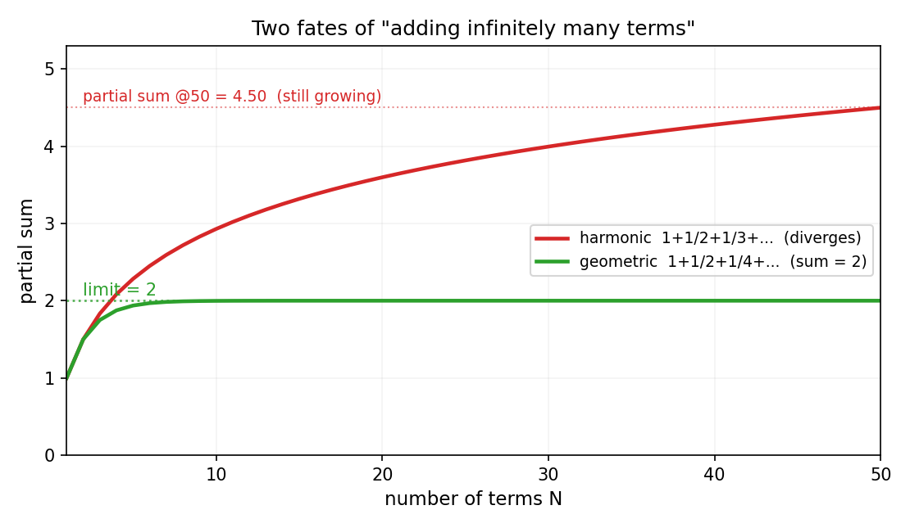
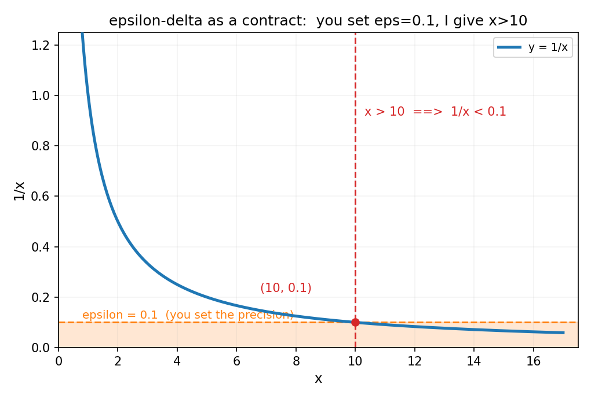

# 第 1 章 · 第一性原理:分析就是驯服无穷

> **核心问题**:数学分析到底在干什么?为什么有了微积分,人类还要再造出"傅里叶""函数论""泛函"这些吓人的东西?
>
> **读完本章你会明白**:
> 1. 无穷是"危险"的——无穷小不是 0、无穷项相加可能算出任何结局,分析数学的全部严密,都是为了驯服这种危险;
> 2. "精确"和"逼近"其实是一回事:**精确,就是一串有限近似的极限**;
> 3. 那个把人劝退的 ε-δ 定义,不是数学家刁难你,而是**一份"你定精度、我给范围"的契约**;
> 4. 傅里叶、函数论、泛函,全都是**被前一个工具的窟窿逼出来的**——理解了这条"被逼出来"的接力,你就懂了它们各自"有什么用".

---

很多人对数学分析的印象是:一门"把微积分重新讲一遍、但每句话都要加证明"的折磨课.ε、δ、∀、∃ 满天飞,定义套定义,定理证定理,背到头秃,却始终不知道——**这堆严密的玩意儿,到底是在防什么?又到底能拿来干嘛?**

这一章不证任何定理.它只做一件事:**把分析数学"想干什么"这件事讲清楚**.一旦你看清了这件事,后面二十章的每一个概念,你都会知道它在做什么、为什么非这么定义不可.

## 章首 · 一句话点破

> **分析数学的全部本事,就是让你能用无穷,又不被无穷坑.**

这句话是结论,不是理由.本章倒过来拆:先让你见识无穷有多坑,再看人类发明了什么招式驯服它,最后看这套驯服术怎么一步步逼出了后面那些吓人的名字.

---

## 零、先分清两副脑子:分析 vs 代数

在见识无穷之前,先把一件更基本的事说清楚——**"分析"这门学科,到底和"代数"有什么不同?** 很多人学了一辈子数学,却从没意识到这两者是两副完全不同的脑子.分清它,你就一眼看清了"分析在研究什么".

### 0.1 代数:精确、有限、一步到位

你从小学到高中学的那套数学,大部分是**代数**.它的特点是:**处理精确的、有限的、封闭的东西**.

- 解方程 `2x + 3 = 7`,一步算出 `x = 2`,精确无误,没有"差一点".
- 因式分解 `x² - 1 = (x+1)(x-1)`,左右恒等,是就是、不是就不是.
- 求根公式 `x = (-b ± √(b²-4ac)) / 2a`,一个公式把所有答案一网打尽.

代数的招式是**恒等变形**:把一个式子变成另一个等价的式子,信息一点不丢.每一步都是"精确等于精确",没有"大概"、没有"差不多"、没有"够不着".它的世界是干净的、有限的、可穷尽的.

### 0.2 分析:逼近、无穷、够不着只能绕

**分析**完全是另一副脑子.它处理的是**逼近的、无穷的、藏身极限里的东西**——你想要的那个值,往往根本拿不到手里,只能用一串你能算的近似去够它.

举三个最经典的"够不着":

- **瞬时变化率(导数)**:你想知道曲线在某一点的精确斜率.代数的做法是取两点算 `(y₂-y₁)/(x₂-x₁)`.可你要的是"这一瞬"的变化率,得让两点重合成一点——这时分母变成 0,分子也变成 0,得到的是 `0/0`,代数的工具(直接除)**当场失效**.
- **曲边面积(积分)**:你想算一段曲线下方的面积.矩形面积你会算(底×高),可曲线是不规则的,没有现成公式.只能把面积切成无数个无穷窄的小条——而"无穷窄"的条,代数同样处理不了.
- **超越函数的值**:你想知道 `sin(1)` 到底等于多少.它没有精确的根式表达,代数给你不了答案.只能用一串多项式去**逼近**,项数越多越准.

> **画面**:代数像一把锋利的手术刀——切下去就是精确的、一刀两断的.分析像一架永远在靠近却永远悬停的直升机——你想要的那个落点它够不着,只能一圈圈地绕,绕得越来越紧,最后把那个落点"夹"在中间.

### 0.3 为什么微积分非要用"极限"不可?

把上面这件事看穿,你就明白了一个根本问题:**为什么微积分必须建立在极限之上?**

因为瞬时变化率本质上是 `0/0`.拿导数说,它的定义是:

```text
f'(x) = lim (f(x+h) - f(x)) / h    当 h → 0
        └──────────────────────┘
              这是一个 0/0
```

分子 `f(x+h) - f(x)`,当 `h=0` 时是 0;分母 `h`,当 `h=0` 时也是 0.**代数告诉你:0 不能做除数,0/0 没有意义.** 所以代数在这条路上,直接撞墙.

但极限给了你一条绕过去的路:**别让 h 真的等于 0,让 h 无限趋近于 0**.在趋近的过程中,这个差商 `(f(x+h)-f(x))/h` 会稳定地逼近一个值——**这个被逼近到的值,就是导数**.它不是"算出来的",是"被一串近似夹出来的".

我们用 `f(x) = x²` 亲手验证一下这个 `0/0` 怎么被极限救活:

```python
import sympy as sp
x, h = sp.symbols('x h', positive=True)
f = x**2
diffq = sp.simplify((f.subs(x, x+h) - f) / h)   # 差商:化简前是 0/0 形式
print('差商 =', diffq)                # h + 2*x
print('h → 0 的极限 =', sp.limit(diffq, h, 0))   # 2*x   ← 这就是导数
```

你看:差商化简出来是 `h + 2x`,直接代 `h=0` 就是 `2x`——也就是 `x²` 的导数.**`0/0` 这个代数上的禁区,被极限语言干净利落地绕了过去.** 这正是微积分不能没有极限的原因:没有极限,瞬时变化率就是一个无解的 `0/0`,整个微分学不存在.

> **不这样理解会怎样**:你会以为"导数就是套公式求出来的一个数",却始终不明白:那个公式 `lim (f(x+h)-f(x))/h` 里的 `lim` 凭什么能把 `0/0` 变成一个确定的数?答案是——`lim` 不是"算"出来的,是"逼近"出来的.代数在这里失语,只有分析这门"逼近的学问"才说得出话.

> **钉死这件事**:**代数处理"够得着的精确",分析处理"够不着的精确".凡是出现 `0/0`、出现无穷、出现"越来越接近却到不了"的地方,都是分析的战场.** 微积分之所以是"分析"而不是"代数",正因为它整个建立在"用逼近够到那个代数够不到的值"之上.全书后面每一个概念——导数、积分、级数、傅里叶、泛函——都是这副"逼近脑子"的延伸.

分清了这两副脑子,现在我们正式走进分析的战场,先去认识它要驯服的那个敌人:无穷.

---

## 一、先认识敌人:无穷是"危险"的

### 1.1 一个会让你愣一下的事实:`0.999… = 1`

问你一个问题:`0.9999…`(小数点后无穷个 9)等于 1 吗?

直觉上,大多数人会觉得"差一点点,不到 1".它是 0.9、0.99、0.999、…… 这串数,似乎永远在逼近 1,但永远够不着.

但数学告诉你:**它就等于 1,不多不少.** 怎么回事?

注意那个省略号——它代表**无穷**个 9.`0.999…` 不是一个"差一点的数",它是这串逼近数列的**极限**,而极限已经到了 1.

> **画面**:想象一堵墙在 1 米外.你先走一半(到 0.5),再走剩下的一半(到 0.75),再走剩下的一半(到 0.875)……每次都走"剩下距离的一半".你永远在逼近墙,但你走的是**无穷步**,而这无穷步的终点,就是墙本身.`0.999…` 是同一件事的另一种写法——它不是"差一点",它是"已经走完了那无穷步后的位置".

> **不这样理解会怎样**:你会以为 `0.999…` 是一个比 1 小、但又说不清小多少的"神秘数".于是你陷入无穷小到底是不是 0 的纠结——而这个纠结,正是两百年前最聪明的数学家都吵翻天的那个问题.`0.999… = 1` 之所以成立,正是因为分析数学把"无穷小"这件事定义清楚了:**没有"最后一步差的那一点点",极限就是终点.**

> **钉死这件事**:**无穷个越来越接近某个值的数,它们的极限就是那个值本身——不是"接近",是"等于".** 这是分析数学最反直觉、也最根本的一条.

### 1.2 无穷小不是 0,但它"逼到"了 0

和 `0.999…` 一脉相承的,是另一个让初学者抓狂的概念:**无穷小**.

一个量"无限趋近于 0",它到底是不是 0?

- 在**过程的任何一步**,它都不是 0:0.1 不是 0、0.01 不是 0、0.0001 也不是 0.
- 但在**极限的意义下**,它就是 0:1/n 当 n→∞ 时,就是 0.

矛盾吗?不矛盾——你只是混淆了"过程中的某一步"和"极限".**无穷小是逼近过程中那些"越来越小但还没到"的量,而它们的归宿(极限)是 0.** 分析数学的精确之处,就在于它把"过程"和"归宿"分得清清楚楚.

这就是后面一切的基础:导数是"差商的极限"(那个趋于 0 的 `h` 是无穷小),积分是"无穷窄矩形的和的极限"(那个趋于 0 的宽度是无穷小).**如果你没把无穷小想清楚,后面整座微积分大厦你都只能背、不能懂.**

### 1.3 无穷相加,会骗人

真正让你体会"无穷有多危险"的,是这一条:**同样是无穷个越来越小的数相加,结局可以天差地别.**

看两个无穷级数:

- **调和级数**:`1 + 1/2 + 1/3 + 1/4 + …`
- **等比级数**:`1 + 1/2 + 1/4 + 1/8 + …`

它们看起来很像——都是无穷项、每一项都在变小.凭直觉,你可能觉得"项越来越小,加起来应该是个有限的数吧".

错.一个是发散的(加到无穷大),一个是收敛的(加到一个有限的数).我们把它们的"部分和"(前 N 项加起来)画出来:



红线是调和级数,绿线是等比级数.看清楚了吗:

- 调和级数前 50 项已经加到 **4.50**,而且**还在涨**——它会一路涨到无穷大,永不回头.哪怕每一项都小得可怜(第 50 项才 0.02),无穷个它们加起来,照样是无穷.
- 等比级数却稳稳地贴在 **2** 这条线上,项数再多也不越界.

> **不这样理解会怎样**:你会以为"无穷个小的东西加起来,要么收敛、要么发散,随便它去吧".但问题在于——**你没法用肉眼判断哪个是哪个**.1/n 和 (1/2)^n 长得那么像,凭什么一个发散一个收敛?这种"看不出来"的危险,就是后面整整一篇"级数收敛判别"要解决的(第 9 章):人类造出一整套判别法,就是为了在无穷相加之前,先搞清楚它到底会怎样.

> **钉死这件事**:**无穷不是"很大的有限".有限世界的常识(越加越大、加到头为止)在无穷世界全部失效.** 无穷有自己的规矩,而这些规矩必须被一条条证明——这正是分析数学存在的理由.

### 1.4 芝诺悖论:两千年前就被无穷坑过的人

这种"无穷的诡异"不是现代人的烦恼.两千多年前,古希腊的芝诺就提出过一个悖论:

> 阿基里斯(希腊第一勇士)和一只乌龟赛跑.乌龟先跑一段.阿基里斯要追上乌龟,得先跑到乌龟此刻的位置;可等他跑到了,乌龟又往前挪了一点;他再追到那个新位置,乌龟又挪了一点……如此无穷反复.结论:**阿基里斯永远追不上乌龟.**

这听起来荒谬——谁都知道阿基里斯一眨眼就超过去了.但芝诺的论证错在哪?错在他把"无穷步"等同于"无穷时间".**阿基里斯确实要走无穷步才能"恰好追上",但这无穷步的时间总和,是一个有限的数.** 无穷步,有限时间——这正是分析数学要驯服的那种"无穷".

你猜怎么着?**第 8 章那个"数学最美的桥"——微积分基本定理,本质上就是在干净利落地回答芝诺**:`1/2 + 1/4 + 1/8 + … = 1`,无穷步的路程加起来,就等于有限的 1.分析数学,就是给芝诺悖论这类"无穷的诡异"一个不会出错的说法.

---

## 二、分析的招式:用"逼近"去够"精确"

见识了无穷的危险,现在看人类发明了什么招式对付它.这招式只有四个字:**逼近**.

### 2.1 你想要的"精确",藏在无穷里,够不着

在数学和现实里,你最想要的那个"精确值",往往不是直接能算出来的,它藏在无穷里:

- 一条曲线在某点的**精确斜率**(变化率),需要让"取两点的间隔"无穷小才能得到——但间隔是 0 时公式又除以 0 了,够不着.
- 一个曲边图形的**精确面积**,需要把它切成无穷窄的小条——但无穷窄的条没法直接算,够不着.
- 一个函数的**精确值**(比如 `sin(1)` 到底是多少),没有现成公式,只能用一串越来越好的多项式去逼近.

### 2.2 招式:用一串"有限的"去够"无穷的"

够不着怎么办?**退一步,用一串你能算的、有限的近似,去逼近那个够不着的精确值,然后证明这串近似确实够到了.**

这就是分析的全部招式.我们用两个最经典的例子预览(细节留到后面章节):

**例子一:导数 = 变化率(第 5 章详讲)**
你想知道曲线在某点的斜率.你先在曲线上取两点、连一条割线,算它的斜率(这你肯定会).然后把两点往一起靠、再靠、再靠……割线的斜率会逼近一个值.**这个极限,就是该点的斜率,也就是导数.**

> **画面**:**放大镜下,任何光滑曲线都变成直线.** 导数,就是你在某点把曲线"放大到足够大"后,看到的那条直线的斜率.它是最简单的函数(直线)去逼近最一般的函数(曲线)时,那个"最好的逼近".这就是"逼近"在微分里的样子.

**例子二:积分 = 面积(第 7 章详讲)**
你想知道一个曲边图形的面积.你先用几个矩形去近似(这你也会),再把矩形切得越来越细、越来越多,矩形面积之和会逼近一个值.**这个极限,就是面积,也就是积分.**

> **画面**:**把面积切成无数个小矩形,它们的面积之和的极限,就是真实面积.** 这是最简单的图形(矩形)去逼近复杂图形的面积.这就是"逼近"在积分里的样子.

### 2.3 核心句:精确是逼近的极限

把上面两个例子,以及全书后面所有的概念,浓缩成一句:

> **精确,是逼近的极限;逼近,是精确的施工图.**

定义、定理、公式,不是要你背的咒语,而是这股"逼近"在某处的**收口**.只要你看清了那股逼近是怎么走的,公式你自己就能推出来,定理的"为什么"你也自然明白——**这是全书最高的原则,没有之一.** 后面二十章,我们做的都是同一件事:把一个个吓人的概念,还原成"它在逼近什么、用什么逼近、逼近到了哪".

---

## 三、缰绳:ε-δ 是"你定精度、我给范围"的契约

逼近这招虽好,但它有个致命的漏洞:**"无限靠近"是个感觉,而数学不能用感觉.**

你说"1/x 当 x 越来越大时趋近于 0".朋友问:"多叫'越来越'大?多大的时候才算够近?"你如果只会说"反正很大就对了",那你就输了——因为"很大"是多大有歧义,没法证明,也没法用来推导别的结论.

分析数学需要一个**把"感觉"变成"可以验证的事实"**的工具.这个工具,就是那个劝退了无数人的 ε-δ.

### 3.1 把 ε-δ 当成一份契约

别去看教材上那串 ∀ε>0, ∃δ>0 的符号.先听我讲一个对话:

> 你:"1/x 当 x 很大时,会变成 0."
> 朋友:"我不信.多大算大?"
> 你:"这样,你随便给我一个**精度要求**——比方说你要求 `1/x` 小于 0.01."
> 朋友:"好,我要它小于 0.01."
> 你:"那我保证,只要 `x > 100`,`1/x` 就一定小于 0.01.不信你算:1/100 = 0.01,再大就更小."
> 朋友:"那我要它小于 0.0001 呢?"
> 你:"那我保证 `x > 10000` 就行."
> 朋友:"……那不管我要多小(不管你给多大的精度),你总能找到一个范围满足我?"
> 你:"对.**你定精度,我给范围.** 只要你能提出精度要求,我就能给出满足它的范围,一个不落."

**这就是 ε-δ.** 不是天书,是这份契约的精确写法:

- **ε**(epsilon)= 朋友提的**精度要求**(要多接近).
- **δ**(delta)或 N = 你给的**范围**(在什么条件下满足).
- **契约的内容**:任你给一个 ε(无论多小),我都能找到一个范围,使得在这个范围内,函数值和目标的差距**小于你给的 ε**.

10 时 1/x<0.1">

图里画的就是这份契约:你定 ε = 0.1(橙色横带),我给 x > 10(红色竖线)——只要 x 在 10 右边,1/x 就一定落在你定的精度带里.而且这套保证对**任意** ε 都成立(你要 0.01 我给 100,要 0.0001 我给 10000……),所以 1/x 的极限是 0,**被证明了**,不是感觉了.

### 3.2 为什么非要这么"啰嗦"?

你会问:这不就是把"趋近于 0"绕了一大圈说出来吗,有这必要?

> **不这样理解会怎样**:没有 ε-δ,微积分大厦就是沙地上的楼.历史上,微积分刚发明时(牛顿、莱布尼茨时代),没有这套严密语言,于是"无穷小到底是不是 0"引发了长达两百年的混乱和攻击(贝克莱主教讥讽无穷小是"已死量的幽灵").直到 19 世纪柯西、魏尔斯特拉斯等人把 ε-δ 这套语言立起来,微积分才从"好用的玄学"变成"严密的科学".**ε-δ 不是啰嗦,它是微积分能站住脚的地基.**

> **钉死这件事**:**ε-δ 的本质是"把'无限靠近'这种感觉,翻译成一句可以机械验证的话".** 你不必爱上那串符号,但你必须看懂这份契约——因为后面每一个"极限""连续""收敛",底层都是同一份契约.看懂了契约,符号只是它的速记.

### 3.3 第二次数学危机:无穷小如何被驯服

3.2 里提到贝克莱主教的讥讽,这不是一句闲笔——它背后是一段长达两百年的、险些动摇整个微积分根基的真实危机.把这件事讲完,你就明白 ε-δ 这套严密语言**到底是被什么逼出来的**:它是被"无穷的危险"逼出来的.

**危机是怎么起的:微积分一出生就带着一个自相矛盾.**

17 世纪末,牛顿(Isaac Newton)和莱布尼茨(Gottfried Wilhelm Leibniz)各自发明了微积分.他们的核心招式都是**无穷小量**(牛顿叫它 fluxion 的"瞬",莱布尼茨叫它 differential).这套工具好用到惊人——能算行星轨道、能算光学、能算任何变化率和面积,而且**算出来的结果全对**.人类第一次拥有了处理"连续变化"的数学武器.

但有一个致命的问题:**无穷小量到底是什么,它俩谁也说不清.** 它在计算里扮演着自相矛盾的角色:

- 在**做除法**的时候,它被当成**非零**的数——因为分母要除以它,如果是 0 就没法除.
- 在**最后一步扔掉**的时候,它又被当成**零**——那些"高阶无穷小"项直接被舍弃,理由是"它太小了,可以忽略".

**同一个量,一会儿是 0,一会儿又不是 0**——这在逻辑上是说不通的.可奇怪的是,这么"说不通"的一套操作,算出来的结果却个个正确.这就好比一把刻度自相矛盾的尺子,量出来的尺寸却分毫不差.数学家们一边用它,一边心里发虚.

**贝克莱的致命一击:"已死量的幽灵".**

这种"好用但说不清"的状态,在 1734 年被一个人公开戳破.爱尔兰主教乔治·贝克莱(George Berkeley)出版了一本小册子《分析学家》(The Analyst),矛头直指微积分的逻辑基础.他抓住了无穷小量自相矛盾这件事,留下了一句让数学界两百年抬不起头的话——他讥讽无穷小量是:

> **"已死量的幽灵"(the ghost of a departed quantity).**

意思很毒:它既不是活着的(不是真正的数),又不是死透的(做除法时它非零),是个不上不下的"幽灵".贝克莱的潜台词更狠:**你们科学家成天用这套逻辑都不自洽的工具,却好意思嘲笑宗教信仰不讲理性?** 这一句话,把微积分从"科学的骄傲"打成了"逻辑的破房子".

**百年的不安:好用,但不踏实.**

贝克莱之后的一百多年,欧洲最聪明的数学家们都活在一种微妙的不安里.微积分**照样在用**——因为它太好用了,工程、物理、天文都离不开它;但它的地基是软的.达朗贝尔(Jean le Rond d'Alembert)说"往前走,信心会随之而来";拉格朗日(Joseph-Louis Lagrange)试图完全绕开无穷小、纯用代数(幂级数)来重建微积分;但谁也没真正解决"无穷小到底是不是 0"这个根本矛盾.**这是一门"好用的玄学"——它能算出正确答案,却没人能说清它为什么正确.**

**柯西和魏尔斯特拉斯:用极限驯服无穷小.**

转机在 19 世纪.法国数学家**柯西(Augustin-Louis Cauchy)**迈出了关键一步:他不再把"无穷小"当成一个**神秘的量**,而是把它重新定义成**一个趋于 0 的变量**——也就是说,无穷小不是一个"东西",而是一个**过程**(一个极限为 0 的序列或函数).这一步,把"无穷小是不是 0"这个伪问题,转化成了"一个序列的极限是不是 0"这个可以正儿八经讨论的真问题.

但柯西的语言还不够"机械"——他说的"无限趋近"仍然带着感觉的成分.真正给微积分装上铁地基的,是德国数学家**魏尔斯特拉斯(Karl Weierstrass)**.他发明了我们今天看到的那套 ε-δ 语言:**把"无限趋近"翻译成"任给 ε,存在 δ"这种可以逐字逐句验证的逻辑命题**.从此,"极限"不再是感觉,而是定理;"连续"不再是画图,而是定义;"无穷小"不再是幽灵,而是一个被 ε-δ 牢牢锁住的、可证明的过程.

> **画面**:想象无穷小是一头在原野上乱跑的野兽——牛顿和莱布尼茨抓住了它,却没给它套上笼头,只能靠它"碰巧听话".贝克莱指着这头没笼头的野兽,嘲笑它的主人"驾驭不了自己的坐骑".柯西给它编了根绳子(极限),魏尔斯特拉斯把绳子换成了铁链(ε-δ),从此这头野兽只许在笼子里按规矩动——**它依然有无穷的力量,但再也伤不了任何人**.

> **不这样理解会怎样**:你会以为 ε-δ 是数学家吃饱了撑的、故意发明一堆符号来折磨学生.恰恰相反——**它是被两百年的逻辑危机逼出来的保命工具**.没有它,微积分就还是那座"好用的破房子",随时可能因为"无穷小自相矛盾"而塌掉.你今天看到的每一行严密的极限定义,都是柯西和魏尔斯特拉斯给牛顿莱布尼茨那座漂亮却摇摇欲坠的房子,重新浇灌的混凝土.

> **钉死这件事**:**ε-δ 不是凭空发明的奢侈品,而是"无穷的危险"逼出来的必需品.** 第二次数学危机教会人类一件事:凡是用到无穷的地方,都必须有一套能把"感觉"翻译成"可验证事实"的语言,否则就随时可能重演"幽灵无穷小"的尴尬.本书后面所有的严密定义——连续、收敛、一致收敛、可积——都是这条教训的一次次重演:**先承认无穷危险,再用缰绳把它锁死.**

这件事也回扣了本章标题:**分析就是驯服无穷**.柯西和魏尔斯特拉斯驯服的,正是牛顿莱布尼茨当年没驯服的那头无穷小.而你接下来要学的每一个概念,都是站在他们已经搭好的这座严密地基之上.

---

## 四、为什么会有傅里叶、函数论、泛函?(全书地图)

现在,终于可以回答本章标题里的第二个问题了:为什么有了微积分,还要造出后面那些吓人的东西?

答案藏在一张**"痛点接力链"**里.这是本书区别于一切教材的灵魂——**每一个工具,都是被前一个工具的窟窿逼出来的.**

| 工具 | 它能干什么 | 它的痛点(逼出下一个) |
|------|-----------|----------------------|
| **微积分** | 算变化率、算累积(导数、积分) | 只能处理**光滑、乖巧**的函数;碰到复杂函数(如热传导方程)就解不动 |
| **傅里叶分析** | 把任意信号**拆成正弦波**,每个都好处理 | 一个函数到底能不能拆?拆了收敛吗?病态函数怎么办? |
| **函数论(实变)** | 用"测度 + 勒贝格积分"重做积分,**兼容病态函数**、让极限交换合法 | 黎曼积分撑不起现代概率论和方程 |
| **函数论(复变)** | 把分析搬到**复数域**,可微条件强到惊人,反过来秒杀实域难题 | 实轴上很多算不动的积分,换个复域战场反而有捷径 |
| **泛函分析** | 把研究对象从"数"升级到"函数",在**无穷维空间**里做几何 | 前面积攒的"函数空间"需要统一语言;量子力学、机器学习都在这 |

一句话串起来:

> **微积分能算光滑的东西,可世界不光滑——于是人类造出傅里叶去分解复杂信号;分解逼出了收敛危机,于是造出函数论去兜底;这一路积攒的函数空间各自为政,于是造出泛函把它们统一成"无穷维空间的几何".**

再浓缩成一句最猛的:**微积分是"测量一个量",泛函是"测量一类量".中间三步,是人类怎么把"处理光滑曲线"的本事,一步步放大到能处理任意信号、任意函数空间的过程.**

这张表,请你记在心里.后面每开一篇,我都会先把"上一篇的工具碰到了什么痛点"亮出来——你会清清楚楚看到,这一篇的工具是怎么被逼出来的、它解决了什么"没它就解决不了"的真实问题.**这就是"到底有什么用"的总答案.**

---

## 符号 + 数值佐证

数学没有源码可引,但有同样解渴的东西:**你亲手在屏幕上看到那些数字真的在收敛、真的在发散.** 本章的两个关键事实,我们都来验一下.

### sympy:精确证明 0.999… = 1、调和级数发散、等比级数收敛

```python
import sympy as sp

n = sp.symbols('n', positive=True, integer=True)

# (1) 0.999... = 极限 of (1 - 10^-n),n→∞
print('0.999... =', sp.limit(1 - 10**(-n), n, sp.oo))        # 1

# (2) 调和级数的部分和 H_n,n→∞
print('harmonic sum =', sp.limit(sp.harmonic(n), n, sp.oo))  # oo  (发散)

# (3) 等比级数 1 + 1/2 + 1/4 + ... = Σ (1/2)^n,n=0..∞
print('geometric sum =', sp.summation(sp.Rational(1,2)**n, (n, 0, sp.oo)))  # 2
```

运行结果:`0.999... = 1`、`harmonic sum = oo`、`geometric sum = 2`.和我们在图 1.1 看到的一模一样——sympy 用符号算,告诉你这是**数学事实**,不是"大概".

### numpy:亲眼看见调和级数慢慢发散、等比级数稳收敛

```python
import numpy as np

N = np.arange(1, 100001)                 # 前 10 万项
harm = np.cumsum(1.0 / N)                 # 调和级数部分和
geom = np.cumsum(0.5 ** (N - 1))          # 等比级数部分和

print('调和级数前 10 万项之和 = %.4f   (还在涨,永无止境)' % harm[-1])   # 约 12.09
print('等比级数前 10 万项之和 = %.4f   (早就贴在 2 上了)' % geom[-1])   # 2.0000
```

跑一下你会看到:调和级数前 10 万项才加到约 **12.09**——它涨得极慢,但**永不停歇**(再往后到 10 亿项也不过 21 左右,可它就是不收敛);等比级数则**早早地**就贴在 2 上,纹丝不动.

> **这就是"无穷的危险"在你屏幕上的具象化**:两个长得那么像的级数,一个永不回头地涨向无穷,一个几项之内就锁死.**你没法用眼看出来谁是谁——所以才需要后面第 9 章那一整套判别法.**

---

## 章末小结

**用三个母题回顾本章**:
- **无穷是危险的**(无穷小≠0、无穷相加可能任何结局)——这是敌人;
- **逼近**(用一串有限的去够那个藏身无穷里的精确值)——这是招式;
- **缰绳**(ε-δ:你定精度,我给范围)——这是保证逼近不出错的契约.

**回扣全书主线**:本章把"精确 vs 逼近"这条主线立了起来——**精确,是逼近的极限**;并亮出了"痛点接力链"这张全书地图.后面二十章的每一个概念,都生活在这条主线和这张地图上.

**五个"为什么"(若只记五件事)**:
1. **为什么分析数学这么严密?** 因为无穷是危险的,不严密就会被坑(无穷小是不是 0、级数收敛不收敛,全靠证明说了算).
2. **精确和逼近什么关系?** 精确是逼近的极限,逼近是精确的施工图.公式只是这股逼近的收口.
3. **ε-δ 到底是什么?** 一份"你定精度(ε)、我给范围(δ)"的契约,把"无限靠近"从感觉变成可证明的事实.
4. **为什么会有傅里叶/函数论/泛函?** 它们是痛点接力逼出来的——后一个永远在补前一个的窟窿.
5. **微积分和泛函差在哪?** 微积分测量"一个量",泛函测量"一类量"(把整个函数当成无穷维空间里的一个点).

**想继续深入该往哪钻**:
- **3Blue1Brown《Essence of Calculus》第 1 集**——讲"无穷小和极限"的直觉动画,和本章同源;
- **自己跑 numpy**:改大 N,看调和级数前 100 万项、1 亿项的和,体会"发散得有多慢";
- **彩蛋预告**:第 9 章我们会用一套判别法,几秒钟判定一个级数收敛还是发散——而判定它的逻辑,正是本章 ε-δ 契约的延伸.

**下一章**:本章讲清了"无穷"和"逼近",但还没给"极限"一个正式的、能动手算的样子.下一章《极限:无穷靠近到底什么意思》,我们就把 ε-δ 这份契约,真正用来计算——从数列极限 ε-N,一路到函数极限 ε-δ,让你能亲手"定精度、给范围".
