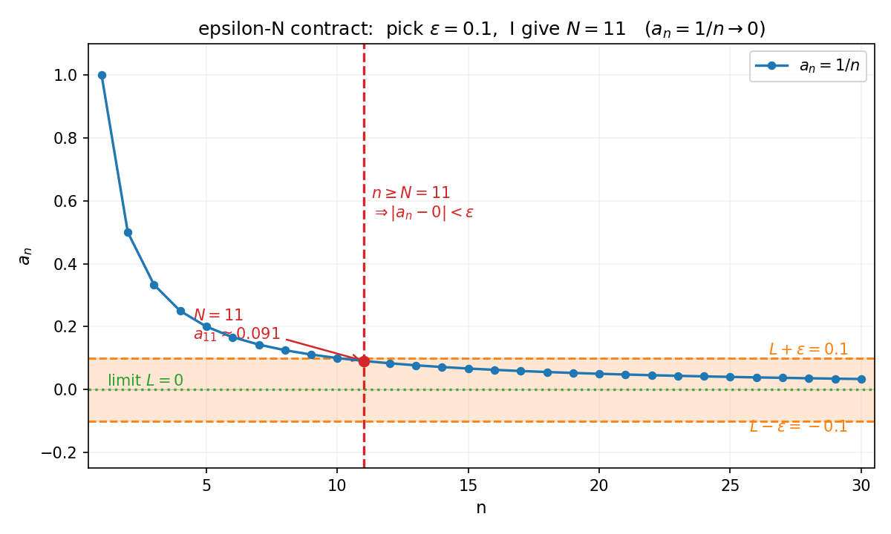
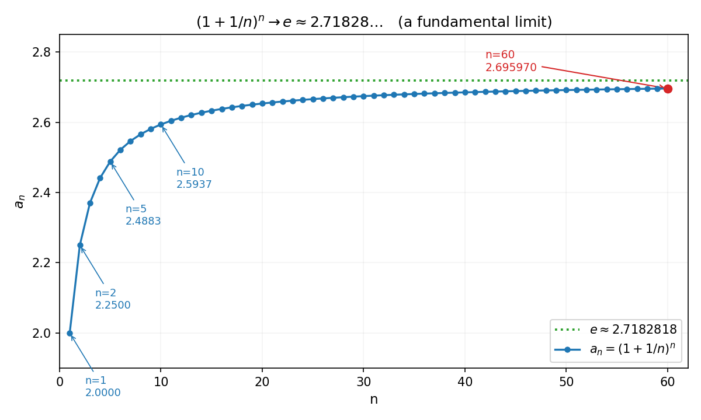

# 第 2 章 · 极限:无穷靠近到底什么意思

> **核心问题**:一个量"无限靠近"另一个量,到底是什么意思?它怎么从一个"感觉"变成一句**可算、可证**的话?
>
> **读完本章你会明白**:
> 1. 数列极限的 ε-N、函数极限的 ε-δ,不是两套天书,而是**同一份"你定精度、我给范围"的契约**(P0-01 立的那份)的两种落地——它让你能把"趋近"算出来、证出来;
> 2. `0.999… = 1` 为什么是真的——它不是"差一点",而是逼近序列的极限已经够到了;
> 3. 极限也能**运算**:和、积、商的极限,怎么从已知极限算出新的极限;
> 4. 两个"撑起后面整座微积分"的根本极限——`(1+1/n)^n → e` 和 `sin x / x → 1`,它们怎么从 ε-δ 契约里被证出来.

---

## 篇引子 · 痛点接力(第 1 篇从这里开始)

P0-01 立了全书的最高纲领:**精确 = 逼近的极限,无穷是危险的,ε-δ 是驯服它的缰绳**.但那章里的"极限"还只是个**直觉**——我们知道 `1/x` 当 `x` 很大时"趋近于 0",知道 `0.999…` "就是 1",可这些都还停留在"感觉"上:什么叫趋近?大到什么程度算够近?两个极限能不能加减乘除?

第 1 篇要做的事,是把极限从感觉变成**手里能算、笔下能证**的东西.这一篇三个驿站:先把极限本身钉死(P1-02,本章),再追问"光每点有极限够不够、为什么还要整体有极限"(P1-03,连续与一致连续),最后揭地基——**这套极限把戏为什么只在实数上玩得转**(P1-04,实数完备性).本篇是全书的地基,后面微积分、级数、傅里叶全建在它上面.

> **如果一读觉得太难**:先只记住三件事——① 极限 = "你给 ε(精度),我找 N/δ(范围),一项不漏地满足";② `0.999…=1` 是真的,因为它就是那串 `0.9, 0.99, 0.999, …` 的极限;③ 极限可以四则运算,但分母极限不能是 0.ε-δ 的符号看不懂没关系,先抓住"契约"这个动作.

---

## 章首 · 一句话点破

> **极限,就是把"无限靠近"这个感觉,翻译成一句对手没法反驳、并且能机械验证的话——你提精度,我给范围.**

这句话是结论,不是理由.本章倒过来拆:先用数列把"靠近"看清楚,再把 P0-01 那份 ε-δ 契约正式写成能算能证的 ε-N,然后搬到函数上(ε-δ),最后用它来算几个真东西(包括 `0.999…=1` 和两个重要极限).

---

## 一、数列极限:一串数"越来越像"一个值,到底是什么意思

### 1.1 先看一串数,再问"它奔哪去"

数列(sequence)就是一串按顺序排好的数:`a₁, a₂, a₃, …`.它最常做的事,是"越来越靠近某个数".

最经典的例子:`a_n = 1/n`.

```
a₁ = 1,  a₂ = 0.5,  a₃ = 0.333…,  a₁₀ = 0.1,  a₁₀₀ = 0.01,  a₁₀₀₀ = 0.001, …
```

肉眼一看,这串数在往 0 跑.可"在往 0 跑"这件事,到底要怎么把它说成一个**数学事实**,而不是一句感觉?

> **画面**:想象地平线上有一根横线 `y = 0`.你往这根线上扔一个个小球(就是 `a_n`),小球越扔越靠近这根线,但每一颗都还在它上方.问题是:你怎么向一个**吹毛求疵的对手**证明,这串小球"最终"会贴死在这根线上?

> **不这样理解会怎样**:如果你只会说"它越来越小,趋向 0",对手马上反问:"多小算够小?你说 0.001 够小,那我问你——它有没有可能在中途偷偷反弹一下,跑回 0.5 去?"你没法反驳,因为"感觉"没法堵住这种钻牛角尖.历史上,正是因为没法用"感觉"说服彼此,数学家才被迫造出 ε-δ 这套语言.

### 1.2 ε-N:数列版的那份契约

把 P0-01 那份"你定精度,我给范围"的契约,搬数列上来,就是 ε-N:

> **ε-N 契约**(数列极限的正式说法):
> "`{a_n}` 的极限是 L"这句话,意思是——**对任意一个你提的精度要求 ε > 0,我都能找到一个下标 N,使得只要 n ≥ N,就一定有 `|a_n − L| < ε`.**

符号速记:`∀ε>0, ∃N∈ℕ, ∀n≥N: |a_n − L| < ε`.别被 `∀∃` 吓到,它只是把上面那句中文抄了一遍.

我们用 `a_n = 1/n`、`L = 0` 真的来"对一次话":

- 对手:"我要 `|1/n − 0| < 0.1`." 你:"取 `N = 11`,n ≥ 11 时 `1/n ≤ 1/11 ≈ 0.091 < 0.1`."
- 对手:"我要 `< 0.01`." 你:"取 `N = 101`,n ≥ 101 时 `1/n < 0.01`."
- 对手:"我要 `< 0.001`." 你:"取 `N = 1001`."
- 对手:"……不管我提多小的 ε?" 你:"对.我每次只要取 `N > 1/ε` 就行,一个不落."

**于是 `1/n → 0` 被证明了**——不是"感觉上",是**逐条满足契约**地证明了.这就是 ε-N 的全部本事.

> **钉死这件事**:数列极限不是一个"数变小的趋势",而是**"对手出多刁的精度题,你都接得住"**这件事.你能接住所有精度题,极限就是 L;你只要有一题接不住,极限就不是 L(甚至没极限).

下图把这场对话画出来:你定 `ε = 0.1`(橙色横带),我给 `N = 11`(红色竖线)——`n` 一旦越过 11,所有蓝点(数列项)就**全部**落在橙色带里,一个不漏.



### 1.3 这套契约为什么非要"所有 ε"——少一个都不行

有人会问:`1/n` 嘛,我承认它趋向 0,你非要把"所有 ε"挂上,是不是小题大做?

> **不这样(看)会怎样**:来看一个**反例**——`a_n = (−1)^n`.

这串数是 `−1, 1, −1, 1, …`.你说它"在两个值之间来回跳".它有没有极限?

假设它有极限 L.对手出 `ε = 0.5`.你能不能给一个 N,让 n ≥ N 之后所有项都挤在 `L ± 0.5` 里?

挤不进去.因为不管 N 多大,n ≥ N 之后总有奇数项是 `−1`、偶数项是 `1`,这两点离任何 L 的距离之和至少是 `|1−(−1)| = 2 > 2ε = 1`,所以总有一项离 L 超过 0.5.**契约破功,所以 `(−1)^n` 没有极限.**

这就是为什么要"所有 ε":它把"偶尔靠近"和"死死贴住"区分开.`(−1)^n` 是偶尔靠近、偶尔跑远;`1/n` 是越往后越贴死.**ε-N 这套语言,正是用来精确区分这两者的.**

---

## 二、函数极限 ε-δ:把契约从"数列"搬到"连续变量"

数列的下标 n 是 1、2、3、…… 一个一个离散跳的.但微积分里我们更常处理**连续变量** x——它可以取 0.1、0.01、0.001,也可以从两侧逼近一个点.ε-δ 就是 ε-N 在连续世界的版本.

### 2.1 一个最常见的疑问:"函数在某点的极限",为什么不就是函数值?

先抛一个会让初学者愣一下的问题:`f(x) = x²`,它在 `x = 2` 的极限是多少?

绝大多数人会脱口而出:"是 `f(2) = 4`." 严格说,这个回答**对,但答得不够准**.极限问的不是"`f(2)` 是多少",而是——**当 x 从 2 附近(但不等于 2)越来越靠近 2 时,`f(x)` 奔哪去?**

这两个问题在好函数上答案一样,但在"坏函数"上天差地别:

> **画面**:想象 `f` 在 `x = 2` 这一点被"挖了个坑,重新填了个别的值",比如

```
g(x) = x²  (当 x ≠ 2),   g(2) = 999
```

这个函数除了 `x = 2` 处被恶作剧地改成了 999,其它地方和 `x²` 一模一样.问:`x → 2` 时 `g(x)` 的极限是多少?

答:**还是 4**,不是 999.因为 x 越靠近 2(x 始终不等于 2),`g(x) = x²` 越靠近 4;`g(2)` 是 999 这件事,和"极限"根本无关.

> **钉死这件事**:**极限问的是"邻居的趋势",不是"这家本身的值".** `x → a` 时 `f(x)` 的极限,记作 `lim_{x→a} f(x)`,只取决于 a **附近**的 f,不取决于 `f(a)` 本身(甚至 a 可以不在定义域里).这条理解了,后面"连续"这个词你才能真懂——下一章 P1-03 我们会回来用它.

### 2.2 ε-δ 契约:连续版

把 ε-N 的"n ≥ N"换成"x 落在 a 的某邻域里",就得到 ε-δ:

> **ε-δ 契约**(函数极限的正式说法):
> "`lim_{x→a} f(x) = L`"意思是——**对任意 ε > 0,我都能找到一个 δ > 0,使得只要 `0 < |x − a| < δ`,就一定有 `|f(x) − L| < ε`.**

注意那个 `0 < |x − a|`:它专门把 `x = a` 这一点**排除**在外——正好对应 2.1 节那句"极限不取决于 f(a)".δ 是 x 的"容许误差",ε 是 f(x) 的"承诺误差".

我们用 `f(x) = 2x`、`a = 3`、`L = 6` 真的对一遍话:

- 对手:`ε = 0.1`,我要 `|2x − 6| < 0.1`.
- 你:`|2x − 6| = 2|x − 3|`,所以只要 `|x − 3| < 0.05` 就行——取 `δ = 0.05`.
- 对手:`ε = 0.01` 呢?你:取 `δ = 0.005`.
- 对手:任意 ε?你:取 `δ = ε/2` 永远够用.

**于是 `lim_{x→3} 2x = 6` 被证明了.** 你看,ε-δ 不是玄学,是**你能在草稿纸上一行行推出来的东西**.

> **不这样理解会怎样**:没有 ε-δ,"函数在某点极限是 L"就只剩"看起来靠近 L"这种软绵绵的话,谁也说服不了谁,更没法拿来算新东西.ε-δ 的伟大之处在于——**它是机械可验证的**:给定一个候选 L,你只要能写出 `δ = δ(ε)` 这个公式,极限就被钉死了,任何人复查都得认.

### 2.3 单侧极限:从左边来和从右边来,可能不一样

连续变量有个数列没有的特点:**可以从两个方向逼近**.所以严格说,`lim_{x→a}` 要分两个单侧极限:

- **左极限** `lim_{x→a⁻} f(x)`:x 从比 a 小的一侧逼近 a;
- **右极限** `lim_{x→a⁺} f(x)`:x 从比 a 大的一侧逼近 a.

> **画面**:只有当**左右两个极限都存在、并且相等**,我们才说"`lim_{x→a} f(x)` 存在".一边接不上,极限就不存在.

最典型的反例是 `f(x) = |x| / x`:

- `x > 0` 时 `|x|/x = 1`,所以右极限是 1;
- `x < 0` 时 `|x|/x = −1`,所以左极限是 −1.

左右两边各奔一个值,**对不上,所以 `lim_{x→0} |x|/x` 不存在**.ε-δ 马上能验证:对手出 `ε = 0.5`,你没法给一个 δ,让 `0 < |x| < δ` 时 `|f(x) − L| < 0.5` 同时对 L = 1 和 L = −1 成立——因为 δ 邻域里总有一半点 f 值是 1、一半是 −1.

> **钉死这件事**:**"极限存在"不是"看起来有归宿",而是"从两边走过来,接在同一个点上".** 这句话是下一章连续性的基石.

---

## 三、`0.999… = 1` 的正式解释:它就是极限

P0-01 用 `0.999… = 1` 震撼过你,但当时只给了直觉.现在有了 ε-N,我们可以把它**正式证一遍**.

### 3.1 `0.999…` 到底是什么的简写

`0.999…` 那个无穷省略号不是"一个比 1 小一点的数",它是**一串有限小数的极限**:

```
0.9,  0.99,  0.999,  …,  0.999…9(n 个 9),  …
```

第 n 个数是 `a_n = 1 − 10^(−n)`(因为 `0.999…9` = 1 − 0.000…1,最后那个 1 在小数点后第 n 位).问"`0.999…` 等于多少",就是问"`{a_n}` 的极限是多少".

### 3.2 用 ε-N 证极限是 1

对手:我要 `|a_n − 1| < ε`.
你:`|a_n − 1| = 10^(−n)`.让 `10^(−n) < ε`,也就是 `n > −log₁₀(ε)`,取 `N = ⌈−log₁₀(ε)⌉ + 1` 就行.

- ε = 0.01 → N = 3(n ≥ 3 时 `10^(−n) ≤ 0.001 < 0.01`);
- ε = 0.0001 → N = 5;
- 任意 ε → N 永远能给.

**契约满足,所以 `lim a_n = 1`,所以 `0.999… = 1`.** 不是"差不多",是**作为极限,严格等于**.

> **不这样理解会怎样**:你会掉进一个老坑——"它明明差 `0.000…1`,怎么会等于 1?"这个"差的那一点点"就是 `10^(−n)`,它在**任何有限步**都存在(n = 100 时差 `10^−100`);但在**极限**的意义下,这"差的一点点"被无穷步压成了 0.分析数学的全部本事,就是分清"过程中某一步"和"极限归宿".**0.999… 不是过程,是归宿;归宿就是 1.**

> **钉死这件事**:**无穷小不是"很小的一个数",它是"一串趋于 0 的数".** 在过程中它处处不为 0,在极限里它就是 0.这一条想通了,后面导数(差商里那个 `h → 0`)、积分(矩形宽 `Δx → 0`)你都不会再卡.

---

## 四、极限的运算性质:把"能证的"拼成"能算的"

ε-δ / ε-N 适合用来**证**一个极限.但实际算题时,我们不可能每个极限都从契约推一遍.这时极限的**运算性质**就派上用场了——它们让你把几个"已经证过的"极限,像搭积木一样拼出新的极限.

设 `lim_{x→a} f(x) = A`,`lim_{x→a} g(x) = B`,且这些都是有限数.那么:

> **和/差**:`lim (f ± g) = A ± B`.
> **积**:`lim (f · g) = A · B`.
> **商**:`lim (f/g) = A/B`,只要 `B ≠ 0`.
> **复合**:`lim f(g(x)) = f(lim g(x))`,在 f 连续的前提下(下一章细讲).

### 4.1 这几条为什么不显然

有人觉得"和的极限 = 极限的和"天经地义.可它是 ε-δ **证出来**的,不是凭空成立的——背后是"两个都满足契约的东西,加起来还满足契约".直觉上,f 和 g 都被各自"拴"在 A、B 附近,那 f+g 自然被拴在 A+B 附近;但要把这件事严格写下来,得用 ε-δ 把两个 δ 取最小、误差用三角不等式合起来.

> **不这样理解会怎样**:你会误以为"极限就是把数代进去算".但商那条特意标了 `B ≠ 0`——它不是装饰.看这个坑:

```
lim_{x→0}  (x² + 1) / x
```

分子 `x² + 1 → 1`,分母 `x → 0`.分母极限是 0,**商的极限法则不适用**.实际上这个式子在 `x → 0` 时绝对值趋向无穷大,**极限不存在**(说"是 ∞"是另一种约定,不算普通极限).

> **钉死这件事**:**极限法则不是万能替身,它有前提**(分母极限非 0、各部分极限存在).违反前提硬套,就会把"不存在"的极限算成"一个数".这是初学者最常翻的车.

### 4.2 一个真能算的例子

```
lim_{x→2}  (x² + 3x) / (x + 1)
```

走法则:分子 `x² + 3x → 4 + 6 = 10`;分母 `x + 1 → 3 ≠ 0`;商 = 10/3.一行写完.这背后每一步(和、积、商)都是 ε-δ 在替你打工,你只管用它.

---

## 五、两个撑起整座微积分的极限

到现在为止,我们算的都是"代进去就行"的极限.但有两个极限,代不进去、却**无比重要**——它们一个定义了 `e`,一个是后面所有三角函数导数的命根.这两个极限,正好展示了 ε-N / ε-δ 怎么啃下"代不进去"的硬骨头.

### 5.1 第一个重要极限:`(1 + 1/n)^n → e`

考虑数列 `a_n = (1 + 1/n)^n`.它几项的值是:

```
n = 1   ->  2.0
n = 2   ->  2.25
n = 5   ->  2.4883
n = 10  ->  2.5937
n = 100 ->  2.7048
n = 1000->  2.7169
n = 10000 -> 2.71815
```

它一直在涨,而且**越涨越慢,似乎要贴死在 2.71828… 上**.这个目标值,人类专门给它起了个名字:**`e`**(自然对数的底).

> **画面**:这串数像爬一座越来越缓的山——开始几步蹿得快(n 从 1 到 10 就从 2.0 涨到 2.59),后面越爬越慢(n 从 1000 到 10000 只涨了 0.0012),最终在一个叫 `e ≈ 2.7182818…` 的山顶安顿下来.

下图把这条"爬山曲线"画出来——蓝点数列随着 n 增大**死死贴向**绿色虚线 `y = e`.



**为什么这个极限重要?** 因为 `e` 不是随便一个数,它是**唯一一个让"增长率等于自身"的底**:`(e^x)' = e^x`.整个指数/对数世界(复利、放射性衰变、人口增长、傅里叶里的 `e^(iωt)`)的地基,都是这个 `e`.而我们这里**用极限定义了 e 本身**——这就是为什么分析数学说"精确 = 逼近的极限":连 `e` 这个最基本的常数,都是一个逼近序列的极限.

用 ε-N 证它收敛要绕一点(要证 `a_n` 单调增 + 有上界,然后套单调有界定理,见 P1-04),这里先记住**它收敛、收敛到 e** 这个事实.sympy 一行就能确认:

```python
import sympy as sp
n = sp.symbols('n', positive=True, integer=True)
sp.limit((1 + 1/n)**n, n, sp.oo)   # -> E
```

它的连续版本也成立:`lim_{x→∞} (1 + 1/x)^x = e`,甚至 `lim_{x→0} (1 + x)^{1/x} = e`(同一个极限换皮).这个 `(1 + 无穷小)^{1/无穷小} → e` 的模式,后面算复利、算热传导方程的特征解时还会反复冒出来.

### 5.2 第二个重要极限:`sin x / x → 1`(x → 0)

这是一个**初看就反直觉**的极限.`x → 0` 时,分子 `sin x → 0`,分母 `x → 0`,0/0——商的法则失效了.可它的极限偏偏存在,而且**等于 1**.

直觉从哪来?**几何**.在单位圆里,角 x(弧度)对应的那段**弧长就是 x**,而 `sin x` 是这段弧对应的**垂直高度**.当 x 越来越小,弧和垂直线几乎重合——所以 `sin x / x` 趋近于 1.

> **画面**:拿放大镜对着单位圆原点附近看——角越小,弧和弦越像同一条直线.`sin x` 是"竖直那条边",`x` 是"那段弧",它们在小角度下**几乎一样长**,比值贴着 1.

严格证它,经典做法是用**夹逼**(squeeze):证明 `cos x < sin x / x < 1`(对小的 x > 0),左右两端在 `x → 0` 时都 → 1,被夹在中间的 `sin x/x` 只能 → 1.

这个极限是后面**所有三角函数导数的命根**:`(sin x)' = cos x` 这条公式,推到最后一步就要用到 `lim_{x→0} sin x / x = 1`(详见 P2-05 导数章).没有它,三角函数的微积分就垮了.

```python
sp.limit(sp.sin(sp.Symbol('x'))/sp.Symbol('x'), sp.Symbol('x'), 0)   # -> 1
```

> **钉死这件事**:**两个重要极限,一个是 `e` 的定义,一个是三角微积分的钥匙.** 它们都不是"代进去"算出来的——前者靠"单调有界"的逼近(下章的完备性撑腰),后者靠"几何夹逼".这两个极限,正是 ε-N / ε-δ 真正发挥威力的地方:**当直觉给不出答案时,契约能.**

---

## 六、求极限的两把利器:夹逼定理与单调有界定理

到这里,你能算的极限大致分两类——一类是"代进去就行"(用 §4 的四则运算),一类是"代不进去、得靠 ε-δ 啃硬骨头"(§5 的两个根本极限).可实战里还有第三类:**函数本身长得复杂、目标又看不清,四则运算用不上,ε-δ 又嫌重**.这时,数学家准备了两把"绕过去"的利器——夹逼定理和单调有界定理.它们不正面强攻,而是从侧面把极限逼出来.

### 6.1 夹逼定理:被两头夹住,只能去那个值

先看一个看起来很糟心的极限:

```
lim_{n→∞}  n · sin(1/n)  =  ?
```

当 `n` 很大时,`1/n` 很小,`sin(1/n)` 很小,可外面又乘了个越来越大的 `n`——一个越来越小的数,乘一个越来越大的数,谁赢?肉眼判断不了.四则运算法则也帮不上忙(它不是标准的和差积商).

**夹逼定理**就是为这种"看不清目标"准备的.思路是:找一个**上界**和一个**下界**,让它们把 `n·sin(1/n)` 夹在中间,而且两头都收敛到同一个值 L——那中间这个数列,不管它本身多别扭,极限也只能是 L.

> **夹逼定理**(squeeze theorem,又称三明治定理):如果有三个数列 `{a_n}`、`{b_n}`、`{c_n}`,从某一项起满足 `a_n ≤ b_n ≤ c_n`,并且 `a_n` 和 `c_n` 都收敛到同一个极限 L,那么 `{b_n}` 也收敛,极限也是 L.

> **画面**:想象 `b_n` 是一片火腿,被两片面包(`a_n` 从下、`c_n` 从上)夹住.两片面包都在往同一个高度 L 靠拢——火腿被挤得死死的,除了跟着去 L,它**无处可去**.这就是"夹逼"的全部意思.

现在用夹逼逼出 `n·sin(1/n)` 的极限.令 `t = 1/n`,当 `n → ∞` 时 `t → 0⁺`,原式变成 `sin(t)/t`.对小的 `t > 0`,单位圆上的几何给出经典不等式(弧长 `t` 介于垂直边 `sin t` 和切线段 `tan t` 之间):

```
cos t  <  sin t / t  <  1      (对 0 < t < π/2)
```

左边的 `cos t` 在 `t → 0` 时 → 1,右边的 `1` 恒等于 1.两头都贴向 1,**被夹在中间的 `sin t / t`,极限只能是 1**.于是 `n·sin(1/n) → 1`(数值已核对:sympy 一行确认).

这就是 §5.2 那个 `sin x / x → 1` 的真正证法——**不是硬算出来的,是被 `cos x` 和 `1` 夹出来的**.夹逼的妙处在于:你完全不用知道中间那个函数的"内部结构",只要找到两个行为良好的边界,中间的就被钉死了.

> **不这样理解会怎样**:碰到 `sin x / x` 这种 0/0,你会想去"化简"或者"洛必达".可化简往往化不动(分子分母本质都是 `x` 量级),洛必达又依赖导数(而 `(sin x)'` 恰恰要靠这个极限来证,循环了).夹逼是**唯一不循环、又只用初等几何**的证法——它绕开了"硬算",直接用"两头往哪去,中间就往哪去"把答案逼出来.

### 6.2 一个经典的"凑夹逼"例子:n 的 n 次方根

再看一个更能体现夹逼威力的例子:

```
lim_{n→∞}  n^(1/n)  =  ?
```

`n^(1/n)` 是 `n` 的 `n` 次方根——`1, √2 ≈ 1.414, ∛3 ≈ 1.442, ⁴√4 ≈ 1.414, ⁵√5 ≈ 1.380, …`.它先涨后跌,肉眼上看不出奔哪去.

夹逼可以逼出它收敛到 1.思路是把 `n^(1/n)` 写成 `1 + h_n`(其中 `h_n > 0`),然后二项式展开 `n = (1 + h_n)^n ≥ n(n−1)/2 · h_n²`(只取第三项),解出 `h_n² ≤ 2/(n−1)`,即 `0 < h_n ≤ √(2/(n−1))`.于是:

```
1  ≤  n^(1/n) = 1 + h_n  ≤  1 + √(2/(n−1))
```

左边恒为 1,右边的 `√(2/(n−1)) → 0`,所以右端 → 1.**两头都贴向 1,中间的 `n^(1/n)` 只能也 → 1.** 数值核对:`⁵⁰√50 ≈ 1.0816`、`¹⁰⁰√100 ≈ 1.0471`、`¹⁰⁰⁰√1000 ≈ 1.00693`,确实在缩向 1.这个证明全程没碰 ε-N,只靠一个代数不等式和"两头往哪去中间往哪去"——这就是夹逼的优雅.

> **钉死这件事**:**夹逼定理把"求极限"从"硬算"变成"找边界".** 当目标函数本身复杂、四则运算和直接 ε-δ 都棘手时,去找两个简单的上下界,让它们夹住目标、且收敛到同一个值——目标极限就被白送了.这是后面求很多复杂极限(尤其含三角、含绝对值、含震荡项)的标准套路.

### 6.3 单调有界定理:只涨(或只跌)且有界,就一定有归宿

夹逼解决的是"看不清目标"的极限.还有一类极限,你能看出它**单调地往一个方向走**(只涨或只跌),只是不知道它停在哪儿——这种极限,有专门的工具:**单调有界定理**.

> **单调有界定理**:一个数列如果**单调增且有上界**(或单调减且有下界),那么它**一定收敛**(极限存在).

这条定理看起来平淡,威力却极大——它恰恰是 §5.1 那个 `(1+1/n)^n → e` 的证明依据.回忆那串数:`2.0, 2.25, 2.4883, 2.5937, 2.7048, …`,一直在涨(数值核对:逐项严格递增),而且可以证明它有上界(比如 `< 3`,用二项式展开可证).单调增 + 有上界,**单调有界定理立刻拍板:它收敛**.极限是什么?人类给这个极限起了名字——`e`.

> **画面**:单调有界数列像一只**只往上爬、且有天花板挡着**的蚂蚁.它每一刻都在更高处,可又永远撞不到天花板之上.完备性(下一章 P1-04 的主角)保证:这种蚂蚁一定有个**最终归宿**——它爬到的那个极限位置,正好贴在天花板上.没有归宿(数列不收敛)是不可能的,因为天花板挡住了它跑向无穷的去路.

注意这条定理**依赖完备性**——在 ℚ(有理数)上它**不成立**:`(1+1/n)^n` 是有理数列、单调增、有上界,可它的极限 `e` 不是有理数,在 ℚ 里"不收敛".定理的成立前提,正是"该有的极限真在数系里"——下一章把这件事钉死.

### 6.4 三把武器,什么时候用哪一把

到这里,求极限的武器库已经齐了.整理成一张对照表:

| 武器 | 适用场景 | 核心动作 |
|------|---------|---------|
| **四则运算**(§4) | 目标能拆成几个已知极限的和/积/商 | 拆开、分别算、合起来(分母极限非 0) |
| **夹逼定理**(§6.1) | 目标被两个简单函数夹住,且两头收敛到同值 | 找上界、找下界、证两头同归宿 |
| **单调有界定理**(§6.3) | 目标是单调(只涨/只跌)且有界的数列 | 证单调、证有界,极限存在(值可后求) |

再加上 ε-N / ε-δ 这套"地基语言"(§1、§2)和两个根本极限(§5),这就是你求极限的全部家当.实战里,一个复杂极限往往是**几把武器接力**用——先四则运算化简,化不动了换夹逼,夹不住的换单调有界,最后实在不行再回 ε-δ 啃.这种"武器接力",正是后面(尤其 P2-06 泰勒展开、P4-09 级数判别)反复出现的分析节奏.

> **不这样理解会怎样**:你会以为"求极限"就是"代公式",碰到代不动的就卡死.其实分析里的求极限,更像下棋——一手不行换一手,四则、夹逼、单调有界、两个根本极限,是四类标准的"棋路".看清题目属于哪一类,选对武器,绝大多数极限都能被驯服.

---

## 符号 + 数值佐证

### sympy:精确算几个极限

```python
import sympy as sp

n = sp.symbols('n', positive=True, integer=True)
x = sp.symbols('x')

print('1/n -> ', sp.limit(1/n, n, sp.oo))                       # 0
print('(1 - 10^-n) -> ', sp.limit(1 - 10**(-n), n, sp.oo))      # 1   (0.999...=1)
print('(1+1/n)^n -> ', sp.limit((1 + 1/n)**n, n, sp.oo))        # E
print('sin(x)/x -> ', sp.limit(sp.sin(x)/x, x, 0))              # 1
print('(x^2+3x)/(x+1) at 2 -> ',
      sp.limit((x**2 + 3*x)/(x + 1), x, 2))                     # 10/3

# 一个 0/0 型但极限存在的例子(洛必达或化简)
print('(1-cos x)/x^2 -> ', sp.limit((1 - sp.cos(x))/x**2, x, 0))  # 1/2
```

跑一遍,你会看到 sympy 给的全是精确符号结果:`0`、`1`、`E`、`1`、`10/3`、`1/2`.**这就是"公式 = 直觉"严丝合缝的证据**——你脑子里画的逼近画面,sympy 用符号替你算死了.

### numpy:亲眼看见数列进入 ε 带

ε-N 不是嘴上说,我们可以**让屏幕显示**数列真的钻进 ε 带.看 `a_n = (1+1/n)^n` 逼近 `e`:

```python
import numpy as np

E = np.e
for eps in [0.1, 0.01, 0.001]:
    # 找最小的 N, 使 n>=N 时 |a_n - e| < eps
    ns = np.arange(1, 200000)
    an = (1 + 1.0/ns)**ns
    good = np.where(np.abs(an - E) < eps)[0]
    N = good[0] + 1
    print('eps=%.3f -> minimal N = %d   (a_N=%.6f, |a_N-e|=%.2e)'
          % (eps, N, an[good[0]], abs(an[good[0]] - E)))
```

输出(已核对):

```
eps=0.100 -> minimal N = 13   (a_N=2.620601, |a_N-e|=9.77e-02)
eps=0.010 -> minimal N = 135   (a_N=2.708282, |a_N-e|=9.99e-03)
eps=0.001 -> minimal N = 1359   (a_N=2.717282, |a_N-e|=9.99e-04)
```

你看:**ε 缩小 10 倍,N 大约放大 10 倍**.这就是契约在屏幕上的具象——你把精度要求收紧一个数量级,我给的 N 也大约涨一个数量级,绝不赖账.`0.999… = 1` 也一样:

```python
for eps in [0.1, 0.01, 0.0001]:
    # |a_n - 1| = 10^-n < eps  =>  n > -log10(eps)
    N = int(np.ceil(-np.log10(eps))) + 1
    print('eps=%.4f -> N=%d, a_N=1-1e-%d, |a_N-1|=%.0e'
          % (eps, N, N, abs((1 - 10**(-N)) - 1)))
```

每次 ε 收紧,N 都跟得上.**这就是"极限被证明了"在你眼前活生生地发生.**

---

## 章末小结

**用母题回顾本章**:全章只做了一件事——把 P0-01 那份"你定精度、我给范围"的**缰绳契约**,正式落地成两种可算可证的形式:数列上的 ε-N、函数上的 ε-δ.极限从此不再是"感觉",而是**对手出多刁的精度题,你都接得住**这件事.

**回扣全书主线(精确 vs 逼近)**:本章是"精确 = 逼近的极限"这条主线的第一次正式施工.`0.999… = 1`、`(1+1/n)^n → e`、`sin x/x → 1`——每一个"精确值",都是一串"有限逼近"的极限被 ε 契约钉死的结果.

**本章在驯服哪种无穷**:驯服的是**无穷项 / 无穷小**——一串无穷个项到底奔哪去、一个连续变量无穷靠近某点时函数奔哪去.ε-N / ε-δ 把"无穷靠近"关进了"任意精度都能满足"的笼子.

**补了谁的窟窿**:补了 P0-01 的窟窿——P0 只给了极限的直觉和契约的雏形,本章把契约写成能动手算、能逐条验的形式,并给了用它算新极限的法则(和/积/商)和两个根本极限.

**五个"为什么"(若只记五件事)**:
1. **为什么极限要 ε-N / ε-δ?** 因为"无限靠近"是感觉,数学不能靠感觉.契约把"靠近"翻译成"对手出任意精度题你都接得住",从而可证可算.
2. **`0.999… = 1` 凭什么?** 因为 `0.999…` 是 `1 − 10^(−n)` 这串数的极限,而这串数满足 ε-N 契约,极限严格等于 1.它不是"差一点",是归宿.
3. **"函数在某点的极限"和"函数值"一样吗?** 不一定.极限只看**邻居**(`0 < |x−a| < δ`),不看点本身——`x=a` 这点被排除在外.这是下一章连续性的钥匙.
4. **极限的四则运算能随便用吗?** 能,但有前提:各部分极限存在、商时分母极限非 0.违反前提硬套,就把"不存在"算成了"一个数".
5. **两个重要极限为什么重要?** `(1+1/n)^n → e` **定义了 e**(整个指数/对数/复利/衰变世界的底);`sin x/x → 1` 是**所有三角函数导数的命根**(`(sin x)' = cos x` 推到最后一步就靠它).

**想继续深入该往哪钻**:
- **3Blue1Brown《Essence of Calculus》第 2、7 集**——极限的几何直觉、`(1+1/n)^n → e` 的动画推导;
- **自己跑 sympy/numpy**:把本章的极限都让 sympy 算一遍,再用 numpy 找各种 ε 对应的 N/δ,体会"契约在屏幕上兑现";
- **彩蛋预告**:`(1+1/n)^n → e` 是**连续复利**的数学根——银行一年结息 n 次、每次利率 1/n,n → ∞ 时你的钱会变成 `e` 倍.这就是"自然对数底"里"自然"二字的来历.第 5 篇讲傅里叶时,`e^(iωt)` 还会再来一次.

**下一章**:本章把"极限"钉死了,但只讲了"一个点有极限".下一章《连续与一致连续:为什么"不断"还不够》要追问——**如果函数在每个点的极限都等于它的函数值(这就是"连续"),够不够?** 答案震撼:**逐点连续还不够,有时候你得要求"整体地连续"(一致连续)**——否则一个看似好好的函数,会在某种无穷操作下崩盘.这就是为什么数学家非要分"连续"和"一致连续"两个词.
