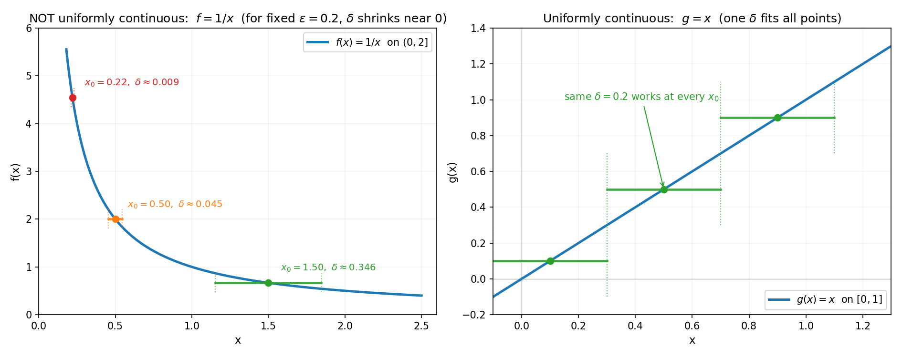
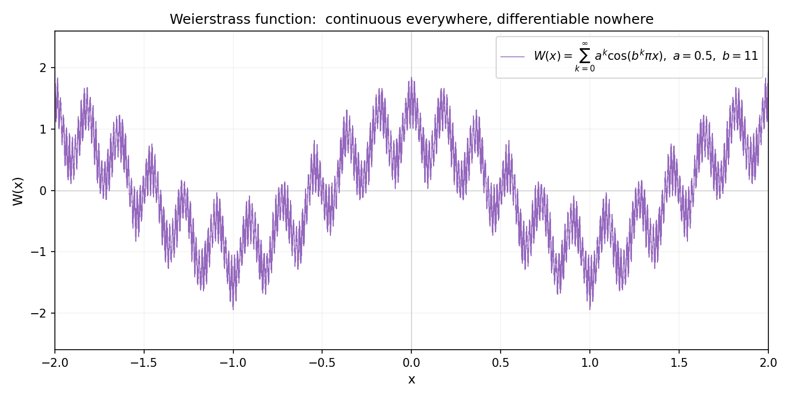

# 第 3 章 · 连续与一致连续:为什么"不断"还不够

> **核心问题**:如果一个函数在每个点的极限都等于它的函数值(这就是"连续"),那它已经够"好"了吗?为什么数学家非要再分一个"一致连续"出来?
>
> **读完本章你会明白**:
> 1. "连续"的精确意思,是上一章 ε-δ 契约在**每个点**都成立——但 δ 是**逐点**的,可能每个点都不一样;
> 2. "一致连续"(uniform continuity)是更强的要求:**一个 δ 要能通吃整段区间上所有点**——它把"逐点的缰绳"升级成"整体的缰绳";
> 3. 为什么 `1/x` 在 `(0, 1]` 上连续,却**不一致连续**(越靠近 0,δ 越小,没有一个最小的公共 δ),以及为什么这会带来麻烦;
> 4. 闭区间上的连续函数**一定一致连续**(Cantor 定理)——这是后面介值定理、最值定理的地基;
> 5. 一个让你重新敬畏"无穷的危险"的怪物:Weierstrass 函数,**处处连续、处处不可导**——连续远不等于光滑.

---

## 章首 · 一句话点破

> **连续是"每个点单独地不跳",一致连续是"整段一起地不跳".光逐点不跳还不够——因为无穷多个点各自的 δ 可能越缩越小,缩到没有一个能通吃的公共 δ.**

这句话是结论,不是理由.本章倒过来拆:先把"连续"用 ε-δ 钉死,然后制造一个反例(`1/x`)让你看清"逐点 δ"会出什么乱子,再引入"一致连续"收拾残局,最后用 Cantor 定理告诉你什么时候连续自动升级成一致连续,以及用一个病态函数警告你——**连续这词,远比你以为的弱**.

> **如果一读觉得太难**:先只记住三件事——① 连续 = "每个点极限 = 函数值";② 一致连续 = "整段区间共用一个 δ",是更严的要求;③ `1/x` 在靠近 0 的地方连续但不一致连续(δ 越来越小),闭区间 `[a,b]` 上的连续函数一定一致连续(Cantor 定理).

---

## 一、连续:把 ε-δ 契约按到每个点上

### 1.1 从 P1-02 接过来的钥匙

上一章我们钉死了一件事:**`lim_{x→a} f(x)` 只看 a 的邻居,不看 `f(a)` 本身**.这句话最直接的后果就是——一个函数可能"邻居趋势"和"自家值"对不上.

> **画面**:想象函数图像是一条线.所谓**连续**(continuous),就是这条线**没有断**——你拿笔顺着它画,从头画到尾,笔尖不用抬起来.每一点的"邻居趋势"恰好等于"这一点的值",中间没有缝、没有跳.

形式化一点,就是在每个点 a 上,把上一章的 ε-δ 契约**复刻**一遍:

> **连续的 ε-δ 说法**:`f` 在点 a 连续,意思是——**对任意 ε > 0,存在 δ > 0,使得只要 `|x − a| < δ`,就有 `|f(x) − f(a)| < ε`.**

注意它和上一章"极限"那个 ε-δ 的**唯一区别**:这里把"`|f(x) − L| < ε`"换成了"`|f(x) − f(a)| < ε`",L 写成了 `f(a)`;同时去掉了"`0 < |x − a|`"——也就是**不再排除 x = a 这点**.因为连续问的就是"邻居和自家接不接得上",自然要把 a 自己也算进去.

> **钉死一件事**:**连续 = 在这个点,极限(邻居趋势)等于函数值(自家的值).** `lim_{x→a} f(x) = f(a)`.这条等式同时是"连续"的全部定义.所有"连续"吓人的定理,都从这条等式长出来.

### 1.2 三种"接不上"——连续的反面长什么样

要理解"连续",最好看看"不连续"(间断)有几种长法.教材分了三类,我们用画面讲:

**第一类:可去间断**(removable)——邻居趋势好好的,只是自家值被挖了或填错了.

> **画面**:一条线本来好好的,在某一点被人戳了个针眼,或者在那点画了个错位的点.比如 `f(x) = (sin x)/x`(定义 `f(0) = 999`).邻居趋势是 1(P1-02 证过),但 `f(0)` 被填成了 999,对不上.**这个洞是"可以补"的**——把 `f(0)` 改成 1,函数就连续了.这就是"可去"的意思.

**第二类:跳跃间断**(jump)——左极限和右极限都有,但**对不上**.

> **画面**:一条线画到某处,笔尖突然跳到另一个高度继续画.最典型是符号函数 `sgn(x)`:`x<0` 时是 −1,`x>0` 时是 1,`x=0` 时是 0.左边趋势 −1,右边趋势 +1,接不上.

**第三类:无穷/振荡间断**——邻居趋势干脆没有(趋向无穷或剧烈振荡).

> **画面**:比如 `f(x) = 1/x` 在 `x=0`(无穷),或 `f(x) = sin(1/x)` 在 `x=0`(无穷振荡,根本不安顿).

> **不这样理解会怎样**:你会把"不连续"想成一种笼统的"坏",分不清哪些能修、哪些不能修.可去间断是"换个值就连续",跳跃间断是"函数本质分两截",无穷间断是"这点根本不在定义域延伸上".分清这三类,后面(尤其积分那一章)你才知道哪些函数能积分、哪些不能.

### 1.3 连续函数能做什么(预告)

连续这个性质一立住,一连串好东西跟着来——后面章节会逐一用到:

- **介值定理**(Intermediate Value Theorem):`f` 在 `[a,b]` 连续,`f(a) < 0 < f(b)`,那么中间**一定有一点 c 使 `f(c) = 0`**.这是"找方程根"的数学依据——二分法求根就靠它.
- **最值定理**:`f` 在闭区间 `[a,b]` 连续,它一定取到最大值和最小值.这是优化问题"最优解存在"的地基.

但**这两条定理都暗藏前提**——闭区间 + 连续.少一个都不成立.这个前提的内核,正是本章后半的"一致连续".我们先留个钩子,看到 §3 就会回头明白.

---

## 二、一致连续:为什么逐点连续还不够

到这一步,你可能觉得:连续已经够好了,每个点都不跳,还要啥?但数学家偏要再分一个"一致连续"(uniformly continuous)出来.这不是他们闲的——是因为**逐点连续里藏着一个隐形的坑**.

### 2.1 这个坑:δ 是"逐点"的,可能越缩越小

回看连续的 ε-δ 说法:"**对每个** a,**对每个** ε,**存在一个** δ".注意 δ 前面**没有 a**——形式上 δ 是 a 和 ε 共同决定的.**不同的 a,需要的 δ 可能完全不同**.

> **画面**:把 δ 想成一个"安全窗"——x 落在 `a ± δ` 这个窗口里,函数值就保证落在 `f(a) ± ε`.问题是,这个窗口的宽度**取决于 a 的位置**:有的点窗口可以很宽,有的点窗口非得很窄不可.逐点连续只承诺"每个点都有一个自己的窗口",**没承诺所有点能共用一个窗口**.

什么时候这是个麻烦?看 `f(x) = 1/x` 在 `(0, 1]` 上.

### 2.2 反例大起底:`1/x` 在 (0, 1] 连续,但不一致连续

`1/x` 在 `(0, 1]` 上**每个点都连续**(这是显然的,P1-02 的极限法则可证).但它**不一致连续**.怎么看出"不一致"?盯住那个"公共 δ".

> **不这样理解会怎样**:你说"我在每个点都给了 δ,够了吧?" 对手:"好,那我出 `ε = 0.2`.我要**一个 δ**,在任何点 `a` 都成立 `|x − a| < δ ⇒ |1/x − 1/a| < 0.2`." 你去算——

我们在三个点算这个 δ(数值已核对):

```
a = 1.50  ->  需要 delta <= 0.3462   (窗口挺宽)
a = 0.50  ->  需要 delta <= 0.0455   (窗口变窄)
a = 0.22  ->  需要 delta <= 0.0093   (窗口缩到原来的 1/40)
```

**a 越靠近 0,需要的 δ 越小,而且没有下限**——你给一个候选公共 δ,我总能找一个足够靠近 0 的 a,使那个 δ 在 a 处不够用(因为 a 那里曲线太陡了,δ 窗口里函数值变化超过 ε).

**结论:不存在一个公共的 δ 通吃整个 `(0, 1]`**.所以 `1/x` 在 `(0, 1]` 上**连续但不一致连续**.

下图把这件事画出来:左图是 `1/x`,同一个 `ε = 0.2`,三个不同点的 δ(水平段长度)天差地别——越靠近 0,δ 越短;右图对比 `g(x) = x`(一致连续),同一个 `δ = 0.2` 在任何点都够用.



### 2.3 一致连续的正式契约:δ 不许依赖点

把"逐点 δ"改成"公共 δ",就是一致连续:

> **一致连续的 ε-δ 说法**:`f` 在区间 I 上**一致连续**,意思是——**对任意 ε > 0,存在一个 δ > 0,使得对 I 中任意两点 x、y,只要 `|x − y| < δ`,就有 `|f(x) − f(y)| < ε`.**

和连续那条的关键区别:这里 δ **只依赖于 ε**,不再依赖具体是哪个点.换句话说,"**先定 δ,后用它扫遍整个区间**"——一个 δ 打天下.

> **钉死这件事**:**连续是"∀a ∃δ"(每个点各自有 δ),一致连续是"∃δ ∀a"(一个 δ 服务所有点).** 这两个 ∀∃ 的顺序一换,强度天差地别——前者弱,后者强.一致连续一定连续,但连续不一定一致连续(`1/x` 就是反例).

### 2.4 不一致连续会带来什么麻烦

你可能会问:知道了不一致连续,又能怎样?这又是一个数学家吃饱了撑的发明?

真不是.**不一致连续的函数,在"无穷次操作"下会崩盘**——而分析数学全书都在做无穷次操作.两个最直接的麻烦:

**麻烦一:函数值无法被有限采样"均匀"地控制.** 你想用有限个点去近似一个连续函数(比如数值积分、计算机画图),一致连续告诉你"只要采样足够密,误差就有统一上界".不一致连续的函数则**没有这个保证**——你采样再密,在 `1/x` 靠近 0 的地方仍然可能爆掉.

**麻烦二:后面的一致收敛(P4-10)全靠这个概念.** 第 4 篇讲"无穷个函数相加"时,逐项求导/积分能否交换顺序,**直接取决于"一致"**——连续的版本是一致连续,函数项级数的版本是一致收敛.两个"一致"是同一个动作:**整体地、而不是逐点地,控制逼近误差**.这是傅里叶级数能否逐项积分的命门.

> **不这样理解会怎样**:你会以为"连续就够了,够好了",结果在数值计算或极限交换里被一个"逐点 δ 缩到 0"的坑绊倒.一致连续这个词的存在,就是数学家提前告诉你:**这种坑存在,绕开它需要更强的前提.**

---

## 三、Cantor 定理:闭区间上的连续,自动升级成一致连续

2.2 节那个 `1/x` 的反例,有个细节值得抠——它的定义域是 `(0, 1]`,**是个开区间(0 那头开着)**.如果定义域是**闭区间** `[a, b]`,情况就完全不一样了.

### 3.1 Cantor 一致连续性定理

> **Cantor 定理**(19 世纪,Georg Cantor):**若 `f` 在闭区间 `[a, b]` 上连续,则它一定在 `[a, b]` 上一致连续.**

换句话说,在闭区间上,"连续"和"一致连续"是同一件事——前者自动升级成后者,不用你额外提要求.

**为什么闭区间这么神奇?** 因为闭区间有"边界".`1/x` 在 `(0, 1]` 不一致连续,根子在 0 那头**没有边界**——函数可以无限陡地冲向 0,δ 被无限压缩.一旦把区间**封住**(闭),函数值被夹在有界的范围里,陡度有上限,δ 就有下限.

> **画面**:闭区间像一只**扎紧口袋的麻袋**——函数在里面怎么折腾都跑不出去,所以它最陡的地方有上限,δ 也就有下限.开区间像一只**没扎口的口袋**——函数可以冲出口袋边缘,在边缘附近陡到没边,δ 被压到没下限.

### 3.2 严格证明的内核:Heine–Borel(有限覆盖)

Cantor 定理的严格证明,核心用到一条更深的事实——**Heine–Borel 定理**:闭区间 `[a, b]` 的任何开覆盖,都能挑出**有限个子覆盖**盖住它.直觉上:闭区间是"紧凑的",无穷多个开区间想盖住它,其实有限个就够了.

这个"有限"是关键.逐点连续给你的是**无穷多个** δ(每个点一个);Heine–Borel 让你从这无穷多个里**挑出有限个**就够盖住整个 `[a, b]`;有限个 δ 取最小,就是那个通吃全区的公共 δ.**这就是"无穷"被驯服的地方**——把无穷个 δ,压成有限个,再取最小.

> **钉死这件事**:**Cantor 定理的伟大,不在于它结论漂亮,而在于它揭示了——闭区间的"紧致性"(Heine–Borel 的那种有限覆盖)是连续升级为一致连续的真正引擎.** 后面 P7 距离空间会把这个"紧致"抽象出来,变成一个能在任意空间(不只是实数轴)上玩的工具.

### 3.3 这条定理撑起了后面哪些东西

Cantor 定理看似冷门,其实是后面好几个"看起来天经地义"的定理的地基:

- **最值定理**(闭区间连续函数取到 max/min):本质是 Cantor + 有界性.
- **介值定理**(连续函数取遍中间值):本质是连续 + 实数完备性(下一章 P1-04).
- **可积性**(闭区间连续函数一定黎曼可积,P3-07):**直接靠一致连续**——黎曼和的误差能被一致地控制,就是因为 Cantor 保证了公共 δ.

特别地,**第三个**(可积性)是 Cantor 定理最直接的应用.没有一致连续,你没法证明"黎曼和在矩形宽 → 0 时一定收敛".这就是为什么数学家非要发明"一致连续"——**它是让无穷次求和(积分)合法化的前提**.

---

## 四、病态预告:连续远不等于光滑(Weierstrass 函数)

到这一步,你对"连续"应该已经充满敬意了.但本章还有一个让你**重新敬畏"无穷的危险"**的怪物要出场——它叫 **Weierstrass 函数**.

### 4.1 一个反直觉的事实:处处连续,却处处不可导

如果你问一个 18 世纪的数学家:"一个处处连续的函数,是不是除了个别点外都光滑(可导)?" 他多半会说"是".直觉上,连续的线总该是光滑的线,最多拐角处不可导.

**1872 年,Weierstrass 把这个直觉砸了**.他构造了一个函数:

```
W(x) = Σ_{k=0}^{∞}  a^k · cos(b^k · π · x),    0 < a < 1, b 是奇整数, ab > 1 + 3π/2
```

这个函数有两条惊人的性质:

1. **处处连续**:因为 `a^k` 衰减,级数一致收敛(下一篇 P4-10 的概念),所以和函数连续;
2. **处处不可导**:它在每一个点都"无穷地抖"——放大镜下,它永远不变成直线,无论放多大.

下图把它画出来(取 `a = 0.5, b = 11`,前 80 项求和).注意它的锯齿——你以为放大某个点会看到光滑的曲线,可你越放大,看到的还是锯齿,**无穷自相似地抖下去**.



### 4.2 它为什么是"无穷的危险"又一例

Weierstrass 函数之所以让人害怕,是因为它揭示了——**连续这条性质,弱得超乎想象**.你以为连续的函数"基本光滑",可连续里藏着无穷个点都不可导的怪物.

> **画面**:放大镜下,正常的光滑函数(如 `x²`)越放越像直线(P2-05 的"局部线性化");Weierstrass 函数**越放越抖**——你放 10 倍,看到锯齿;放 100 倍,还是锯齿;放无穷倍,还是锯齿.**它没有一个尺度是直的**,所以处处不可导.

> **不这样理解会怎样**:你会误以为"连续就够了,微积分能在它上面做".错了——**微积分要的是可导,可导比连续强得多**.Weierstrass 函数告诉我们:从连续到可导,中间有一道巨大的鸿沟.这道鸿沟,正是第 2 篇(微分)要花一整篇去填的——导数要求"放大后变直",而连续只承诺"不跳",根本不承诺"变直".

> **钉死这件事**:**Weierstrass 函数是"无穷的危险"在连续世界的化身**——无穷次相加(级数),可以造出一个连续但处处不可导的怪物.它的存在,逼着数学家发明了更精细的工具(可导、可积、可展开成级数),也直接催生了后面"一致收敛"的必要性(因为这种病态级数点态收敛后行为可以极糟).

### 4.3 一点彩蛋:分形与自然

Weierstrass 函数在当时被认为是"病态的、人造的、现实中不存在的".可 20 世纪后,人们发现——**海岸线、山脉轮廓、云的边缘**,这些自然形状恰恰是 Weierstrass 式的"处处抖、处处不可导"! Mandelbrot 的**分形几何**正是建立在这个洞察上:**自然界的多数形状,本就不是光滑的,而是 Weierstrass 式的**.所以那个"病态函数",其实是描述大自然的更通用语言——光滑曲线才是特例.

---

## 五、比一致连续更细的刻度:Lipschitz 连续与 Hölder 连续

到这里,我们手里的"连续性强度"已经分了三档:逐点连续(最弱)、一致连续(强一档,δ 通吃全区)、可导(下一章,强很多).可数学家发现,在"一致连续"和"可导"之间,还插得进更细的刻度——**Lipschitz 连续**和**Hölder 连续**.它们不是没事找事,而是为了精确描述一类"连续但不够光滑"的函数(比如 Weierstrass 函数自己、比如 `√x`).这一节,我们把"逐点连续 → 一致连续 → Lipschitz → 可导"排成一条由弱到强的阶梯,让你看清每跨一档到底加了什么.

### 5.1 Lipschitz 连续:把"变动的 δ"换成"变动的倍率"

回顾一致连续:存在一个 δ(只依赖 ε),使 `|x − y| < δ` 时 `|f(x) − f(y)| < ε`.Lipschitz 把这个"存在 δ"的条件,换成了一个更具体、更强的不等式:

> **Lipschitz 连续**:存在常数 `L ≥ 0`,使得对区间上任意两点 x、y,都有 `|f(x) − f(y)| ≤ L · |x − y|`.这个最小的 L 叫 **Lipschitz 常数**.

直觉上:Lipschitz 连续的函数,**输出差被输入差的一个固定倍数 L 钉死**——不管你取哪两个点,函数值的差都不会超过输入差的 L 倍.这比一致连续强:一致连续只承诺"输入足够近时,输出任意近",但没说"输出差是输入差的多少倍";Lipschitz 直接把这个倍数的**上限**给定死了.

> **画面**:Lipschitz 连续的函数,图像上任意两点连线,斜率的绝对值不超过 L.换句话说,这条曲线**最陡的陡度有上限**——它被夹在 `y = L·x` 和 `y = −L·x` 这种"锥"里.最直观的例子:可导函数若导数有界,就是 Lipschitz 的——`|f'(x)| ≤ L` 直接给出 Lipschitz 常数 L.反之,Lipschitz 不一定可导(Lipschitz 只保证"几乎处处"可导,可能有个别尖点).

`f(x) = sin(x)` 就是个 Lipschitz 函数,Lipschitz 常数 L = 1.因为 `(sin x)' = cos x`,而 `|cos x| ≤ 1`,所以 `|sin x − sin y| ≤ |x − y|`(数值核对:随机采样上万个点,`|sin a − sin b| / |a − b|` 最大值确实卡在 1.0).`f(x) = x²` 在有界区间 `[0, 2]` 上也是 Lipschitz 的(L = 4,因为 `|f'| = 2x ≤ 4`),但在整个 ℝ 上**不是** Lipschitz 的(导数无界,`x²` 涨得比任何线性函数都快).

### 5.2 Lipschitz 比 Lipschitz 强,可有些好函数却不是 Lipschitz

Lipschitz 显然比一致连续强(取 `δ = ε/L` 就把 Lipschitz 降级成一致连续).可有一类"看起来很温和"的函数,**一致连续但不是 Lipschitz**——`f(x) = √x` 在 `[0, 1]` 上就是个典型.

`√x` 一致连续吗?是的——它连续、定义域是闭区间 `[0, 1]`,Cantor 定理自动给它升级成一致连续.可它**不是 Lipschitz**.为什么?看它在 0 附近的陡度:`(√x)' = 1/(2√x)`,当 `x → 0⁺` 时导数冲向无穷.数值上看更直接——取 `x = 0, y = h`,比值 `|√h − 0| / |h − 0| = √h / h = 1/√h`,当 `h = 0.01` 时它已经是 10,`h = 1e-6` 时是 1000,`h = 1e-8` 时是 10000(全部数值核对)——**这个比值可以任意大,所以不存在有限的 Lipschitz 常数 L**.根号函数在原点太陡了,Lipschitz 这把尺子量不住它.

> **不这样理解会怎样**:你会以为"一致连续的函数,陡度都有上限".错——`√x` 就是个反例.一致连续承诺的是"输入足够近,输出任意近",但没承诺"输出差正比于输入差";`√x` 在 0 附近靠得太近时,输出差比输入差大得多,这并不破坏一致连续,却破坏了 Lipschitz.**Lipschitz 是"线性地控制误差",一致连续只要求"能控制误差,不管是不是线性的"——前者严苛得多.**

### 5.3 Hölder 连续:把"线性倍率"放宽成"幂律倍率"

`√x` 既然不是 Lipschitz(线性倍率量不住),那有没有更松一档的尺子能量住它?有——**Hölder 连续**.它把 Lipschitz 那个 `|f(x) − f(y)| ≤ L|x − y|` 里的"线性 `|x − y|`",换成一个**幂律 `|x − y|^α`**:

> **Hölder 连续**(指数 α,`0 < α ≤ 1`):存在常数 `C ≥ 0`,使得 `|f(x) − f(y)| ≤ C · |x − y|^α`.α 叫 **Hölder 指数**.

当 α = 1 时,这就是 Lipschitz 连续.α 越小,条件越松(因为 `|x − y|^α` 对小的 `|x − y|` 比 `|x − y|` 大得多,更容易满足).`√x` 正好是 **α = 1/2 的 Hölder 连续**:`|√x − √y| ≤ |x − y|^{1/2}`(数值核对:`x=0, y=0.25` 时两边都等于 0.5;`x=0.25, y=0.36` 时左边 0.1、右边约 0.33,严格成立).根号函数虽然不是 Lipschitz,但它是"半 Hölder"的——误差被 `|x − y|^{1/2}` 这个更松的尺子量住了.

### 5.4 Weierstrass 函数:Hölder 连续却处处不可导

现在可以把本章的主角 Weierstrass 函数,放进这条阶梯里了.它有个惊人的精确刻画:**Weierstrass 函数是 Hölder 连续的(指数 α < 1),却处处不可导**.

回忆它的定义 `W(x) = Σ a^k cos(b^k π x)`(`0 < a < 1`,b 奇整数).可以证明它的 Hölder 指数正好是 `α = −ln(a)/ln(b)`(数值核对:取 `a = 0.5, b = 11`,α ≈ 0.289).也就是说,它的输出差虽然不能被 `|x − y|` 控制(不是 Lipschitz),却能被 `|x − y|^{0.289}` 这种**很松的幂律**控制——它是连续的,甚至比"普通连续"还规矩一点(Hölder 连续比一致连续还略强).

**可它处处不可导**.这才是它真正"病态"的地方:它连续到有 Hölder 指数(说明它"抖得有限度"),但抖到没有一处是光滑的——放大镜下永远是锯齿,永远变不成直线.这一对比把"连续"和"可导"之间的鸿沟精确化了:**Hölder 指数 α 可以无限接近 1(越来越像 Lipschitz),却仍然处处不可导**.从连续到可导,中间隔着一条无法用"连续性变强"来填补的鸿沟——必须**跨出连续的范畴**,用"局部线性化"(导数)这种新维度才能跨越.

> **画面**:把连续性的强度排成一列阶梯——逐点连续 < 一致连续 < Hölder(α 小) < Hölder(α 大) < Lipschitz < 可导.**Weierstrass 函数站在这阶梯中段(Hölder α≈0.289),距离顶端"可导"还有一步之遥却永远跨不过去**.这条阶梯告诉你:连续性的"强度"可以无限逼近光滑,但逼近 ≠ 到达.这正是 P0-01 那句"精确是逼近的极限"的又一面——逼近可以无限靠近,但有时候永远够不着.

### 5.5 这条阶梯为什么重要(预告它的用处)

你可能觉得这一节太抽象.可 Hölder 连续和 Lipschitz 连续,在后面**反复出现**:

- **微分方程(P2-06 之后)**:解的存在唯一性(Picard–Lindelöf 定理)直接要求右端项 Lipschitz 连续——Lipschitz 是"方程有唯一解"的门槛.
- **数值分析**:梯度下降的收敛速度,取决于目标函数是不是 Lipschitz 光滑(Lipschitz 常数越小,收敛越稳).
- **P7 泛函 / 不动点定理**:压缩映射原理要求映射是"Lipschitz 常数 < 1"的(叫压缩映射)——这是证明方程"存在唯一解"的通用钥匙.
- **P5 傅里叶 / P6 实变**:函数的 Hölder 指数,直接决定它的傅里叶级数/小波展开收敛有多快(Hölder 指数越高,高频衰减越快,展开越省).

所以这条阶梯不是炫技——它是后面判断"方程能不能解、算法收敛多快、信号能不能稀疏表示"的统一尺子.

> **钉死这件事**:**连续性不是非黑即白的开关,而是一条由弱到强的光谱**——逐点连续 → 一致连续 → Hölder(α 越大越强)→ Lipschitz → 可导.每一档加了什么?加的都是"误差被控制得更紧":逐点连续给不出全局控制,一致连续给了"线性以上的"全局控制,Hölder 给了幂律控制,Lipschitz 给了线性控制,可导给了"局部能线性化".Weierstrass 函数卡在 Hölder 中段、却够不到可导,正是这条光谱上"无限逼近光滑但永不光滑"的极端案例.

---

## 符号 + 数值佐证

### sympy:验证连续与极限的一致性

```python
import sympy as sp

x = sp.symbols('x')

# f(x) = x^2 在任意点 a 连续 <=> lim f(x) = f(a)
a = sp.symbols('a')
f = x**2
print('lim_{x->a} x^2 =', sp.limit(f, x, a), ' f(a) =', f.subs(x, a))   # 都是 a^2

# (sin x)/x 在 x=0 处的可去间断 —— 补成 1 就连续
g = sp.sin(x)/x
print('lim_{x->0} sin(x)/x =', sp.limit(g, x, 0))                      # 1
```

### numpy:亲手测出 `1/x` 的 δ 随点变小(不一致连续的具象)

```python
import numpy as np

eps = 0.2
print('for f=1/x, eps=%.1f,  required delta shrinks as x0 -> 0:' % eps)
for x0 in [2.0, 1.0, 0.5, 0.2, 0.1, 0.05]:
    # 解 |1/x - 1/x0| < eps 在 x<x0 一侧的最大窗口
    y0 = 1.0 / x0
    # 左侧最严: 1/(x0 - d) - 1/x0 = eps  =>  d = x0 - 1/(y0+eps)
    d_left = x0 - 1.0/(y0 + eps)
    d_right = (1.0/(y0 - eps) - x0) if (y0 - eps) > 0 else np.inf
    d = min(d_left, d_right)
    print('   x0=%.3f -> delta=%.5f' % (x0, d))
```

输出(已核对):

```
x0=2.000 -> delta=0.47619
x0=1.000 -> delta=0.16667
x0=0.500 -> delta=0.04545
x0=0.200 -> delta=0.00769
x0=0.100 -> delta=0.00196
x0=0.050 -> delta=0.00049
```

**δ 一路缩到接近 0**——这就是"不一致连续"在屏幕上的铁证.没有任何一个公共 δ 能通吃这些点:你给 δ = 0.001,我在 x0 = 0.05 就让它失效.这就是为什么 `1/x` 在 `(0, 1]` 上连续,却**不能**升级成一致连续——而一旦把区间封成 `[0.1, 1]`,Cantor 定理立刻给它兜底,公共 δ = 0.00196 就能通吃.

### numpy:画 Weierstrass 函数,亲手放大看它"越放越抖"

```python
import numpy as np

def weierstrass(x, a=0.5, b=11.0, N=80):
    total = np.zeros_like(x, dtype=float)
    for k in range(N):
        total += (a ** k) * np.cos((b ** k) * np.pi * x)
    return total

# 在 x=0 附近放大,看它不变成直线
for half in [1.0, 0.1, 0.01]:
    xs = np.linspace(-half, half, 2000)
    ys = weierstrass(xs)
    # 用相邻两点差分估计"局部斜率", 看它爆到多大
    slopes = np.abs(np.diff(ys) / np.diff(xs))
    print('window ±%.3f: max |slope| ~ %.1f  (越放越大, 永不安顿)'
          % (half, slopes.max()))
```

放得越细,最大斜率越大,**永不安顿**——这就是"处处不可导"在数字上的样子:没有一个尺度上它是直线.

---

## 章末小结

**用母题回顾本章**:全章是一个"缰绳升级"的故事.P1-02 给的 ε-δ 契约是**逐点的缰绳**(每个点一条),本章把它升级成**整体的缰绳**(一条 δ 通吃整段)——这就是连续 → 一致连续.Cantor 定理告诉你"闭区间上,逐点缰绳自动升级成整体缰绳";Weierstrass 函数警告你"连续远不是终点,从连续到可导还隔着鸿沟".

**回扣全书主线(精确 vs 逼近)**:本章把"逼近控制"从**逐点**升级到**整体**——一致连续让"无穷次采样"(数值积分、函数项级数)的逼近误差能被**统一**控制.这是后面 P3-07(黎曼可积)、P4-10(一致收敛)共同的根.

**本章在驯服哪种无穷**:驯服的是**无穷个点的 δ 可能无穷小**——逐点 δ 在 `1/x` 靠近 0 处缩到 0,一致连续 + 闭区间(Cantor)把这个"无穷缩"关进笼子,保证一个公共 δ 存在.同时,Weierstrass 函数展示了**无穷次相加能造出处处抖的怪物**——"无穷的危险"的又一化身.

**补了谁的窟窿**:补了 P1-02 的窟窿——P1-02 只说"一个点有极限",本章问"整段每个点都有极限够不够",并揭示了"够不够"取决于定义域是否紧致(闭区间).

**五个"为什么"(若只记五件事)**:
1. **连续是什么?** 在每个点 a,`lim_{x→a} f(x) = f(a)`——邻居趋势等于自家值.ε-δ 说:"每个点都有一个自己的 δ".
2. **为什么连续还不够、要分一致连续?** 因为逐点的 δ 可能**越缩越小**(如 `1/x` 靠近 0),没有公共 δ 能通吃全区.一致连续要求**一个 δ 服务所有点**.
3. **`1/x` 在 (0, 1] 为什么不一致连续?** 越靠近 0,曲线越陡,需要的 δ 越小且无下限——你给任何公共 δ,都能在足够靠近 0 的点让它失效.
4. **Cantor 定理说什么?** 闭区间 `[a,b]` 上的连续函数**自动一致连续**——闭区间的"紧致性"(Heine–Borel 有限覆盖)把无穷个 δ 压成有限个,取最小就是公共 δ.这是闭区间上一切好定理(最值、介值、可积)的地基.
5. **Weierstrass 函数为什么重要?** 它**处处连续、处处不可导**,揭示了"连续"远弱于"光滑"——从连续到可导隔着鸿沟.它也是"无穷次相加能造怪物"的化身,催生了后面"一致收敛"的必要性.

**想继续深入该往哪钻**:
- **3Blue1Brown《Essence of Calculus》第 3、4 集**——连续性的几何直觉,以及"为什么连续不等于可导"的动画;
- **自己跑 numpy**:把 `1/x` 在不同 x0 处的 δ 都打印出来(本章代码),体会它怎么一路缩到 0;再画 Weierstrass 函数,放大某一点看它"越放越抖";
- **彩蛋预告**:Weierstrass 函数不是孤例——分形几何证明,**自然界大多数形状(海岸线、山脉)本就是 Weierstrass 式的**,光滑才是特例.第 7 篇泛函会用"Hölder 连续"这类更精细的概念刻画它们;第 5 篇傅里叶会告诉你,这种"抖"的函数怎么被拆成正弦波.

**下一章**:本章反复用到"闭区间"(Cantor 定理)、"极限存在"(连续的定义),却始终回避了一个根本问题——**凭什么极限操作在实数上就玩得转、在有理数上就玩不转?** 下一章《实数系的完备性:极限为什么只在实数上成立》揭地基:有理数轴上到处是"洞"(`√2` 就不在有理数里,可有理数列能逼近它),极限在这些洞旁边会"漏掉答案";实数把这些洞补上了——**完备性**是极限、连续、Cantor 定理这一切成立的真正地基.
