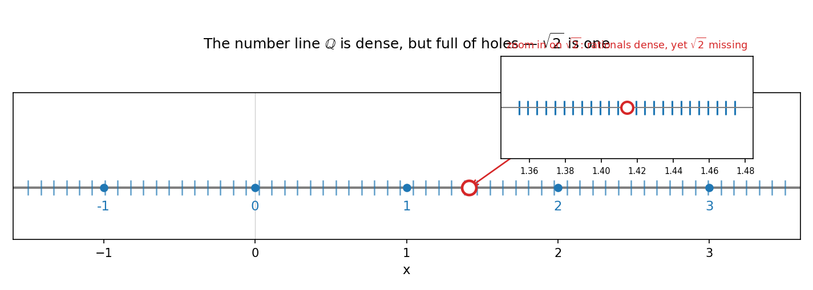
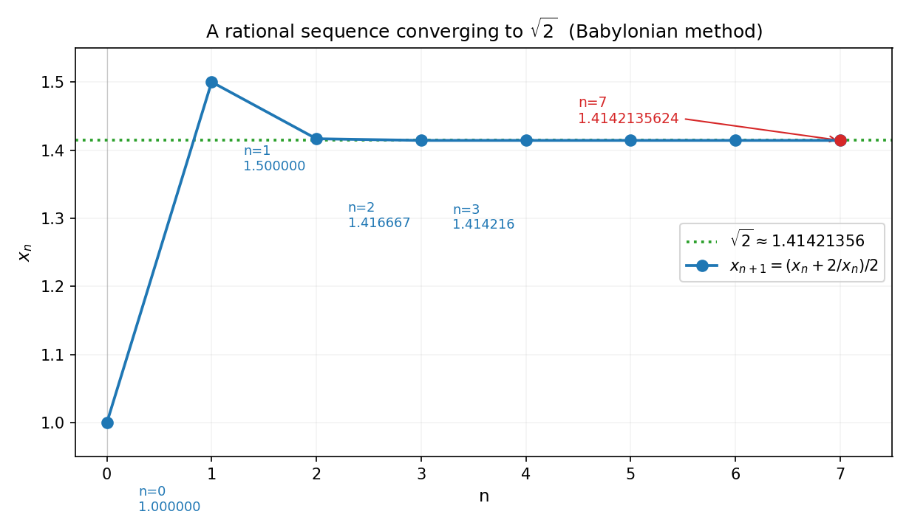
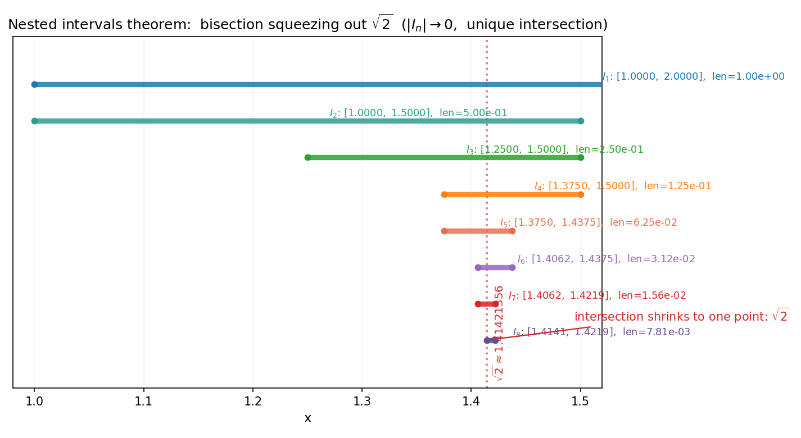

# 第 4 章 · 实数系的完备性:极限为什么只在实数上成立

> **核心问题**:为什么极限操作在实数上有意义、在有理数上会"漏掉答案"?
>
> **读完本章你会明白**:
> 1. 有理数轴看起来密密麻麻,实际上**到处是洞**——`√2` 不在有理数里,可一个有理数列 `1, 1.4, 1.41, 1.414, …` 却在逼近它.在有理数里,这个极限"不存在"(漏了);
> 2. **戴德金分割**(Dedekind cut)是怎么把每一个洞补上的——实数 = 有理数 + 所有"洞";
> 3. 完备性的几个等价面孔:确界存在定理、单调有界收敛定理、柯西列收敛——它们是同一件事的不同说法;
> 4. 为什么**前面三章**(P1-02 极限、P1-03 连续)的每一条定理,底层都站在完备性上——没有完备性,介值定理、Cantor 定理、甚至"`(1+1/n)^n → e`"都立不住.

---

## 章首 · 一句话点破

> **实数没有洞,所以极限有地方落;有理数有洞,极限会扑空.完备性,就是"该有极限的数列,真有极限"这件事的保证.**

这句话是结论,不是理由.本章倒过来拆:先用 `√2` 让你看见有理数的洞,再用戴德金分割演示怎么补洞,然后把完备性翻成几个等价定理(确界、单调有界、柯西列),最后揭示——**第 1 篇前两章那些"天经地义"的定理,全是站在这个地基上**.

> **如果一读觉得太难**:先只记住三件事——① 有理数轴有洞(`√2` 是一个),极限会漏掉这些洞;② 实数 = 有理数 + 把所有洞补上(完备);③ 完备性有三种等价说法——确界存在、单调有界收敛、柯西列收敛,它们是后面介值定理、Cantor 定理的根.

---

## 一、有理数的洞:`√2` 的故事

### 1.1 一个两千年前的发现:有理数不够用

古希腊的毕达哥拉斯学派信奉"万物皆数"——更准确地说,"万物皆**有理数**(整数之比)".他们以为数轴上每一个点都能写成 `p/q`.直到有人(传说是希帕索斯)发现了一个致命的事实:

> **单位正方形的对角线长度,不是有理数.**

证一下(经典反证):假设 `√2 = p/q`,p、q 互质.那么 `p² = 2q²`,所以 p² 是偶数,p 也是偶数,设 `p = 2k`.代回去 `4k² = 2q²`,即 `q² = 2k²`,所以 q 也是偶数.但 p、q 互质,**矛盾**.所以 `√2` 不是有理数.

这个发现据说让毕达哥拉斯学派恐慌到把希帕索斯扔进海里——因为它戳破了"有理数够用"的世界观.**单位正方形的对角线,这么朴素的一个长度,有理数竟然表达不了.**

### 1.2 数轴上密密麻麻,却处处是洞

你可能会反驳:有理数已经很密了啊,任何两个有理数之间还有无穷多个有理数,密得不得了——为什么说有洞?

**密**和**没有洞**是两件事:

> **画面**:想象数轴是一根绳子,有理数是绳子上密密麻麻的刻度(任何两个刻度之间还有刻度).但绳子上有一些**没有刻度的位置**——`√2`、`√3`、`π`、`e`……这些位置的长度真实存在(单位正方形的对角线就是 `√2`),可它们不是任何整数之比.绳子上这些"没刻度的位置",就是有理数的**洞**.

形式上,有理数 ℚ 有一个性质叫**稠密性**(density):任意两个有理数之间还有有理数.但稠密不等于**完备**(completeness)——完备要求"该在的都在",而 `√2` 这个"该在的"就不在 ℚ 里.

下图把这件事画出来:蓝点是密密麻麻的有理数,可 `√2 ≈ 1.4142` 那个位置(红圈)是**空心的**——它在数轴上,但不在有理数集里.右侧放大的小图更刺眼:你越靠近 `√2`,周围有理数越密,可 `√2` 这个点本身**永远缺席**.



### 1.3 致命后果:有理数列的极限会"扑空"

这个"洞"不只是哲学问题,它会让极限操作**当场失效**.看这个数列:

```
x₀ = 1,  x₁ = 1.4,  x₂ = 1.41,  x₃ = 1.414,  x₄ = 1.4142,  …
```

每一项都是有理数(有限小数),而且它们在**逼近 `√2`**:

```
1.4142²  = 1.99996…   (离 2 还差 0.00004)
1.41421² = 1.999989…  (更近)
```

按 P1-02 的 ε-N 契约,这是一个**柯西列**(后面 §3 细讲)——它"该"收敛.问题是:**它收敛到哪?**

- 在**实数系** ℝ 里,它收敛到 `√2`,一切正常;
- 在**有理数系** ℚ 里,它**不收敛**——因为它的"目标" `√2` 不在 ℚ 里,而 ℚ 里没有任何一个数能当它的极限(任何候选有理数 `p/q`,这串数最终都会越过它或绕过它).

> **不这样理解会怎样**:你会在 ℚ 上做分析,然后发现"`(1+1/n)^n → e`"这句话在 ℚ 里**说不通**——因为 `e` 不是有理数,数列"该收敛",却没有一个有理数能接住它.整个微积分就崩了:导数(`(f(x+h)−f(x))/h` 的极限)、积分(黎曼和的极限)的极限值,经常不是有理数.**没有完备性,极限是一句没着落的话.**

> **钉死这件事**:**有理数稠密但不完备——稠密保证"中间有数",完备保证"极限有处可落".** 极限操作只在完备的数系(实数)上才有意义.这就是为什么数学分析从一开始就声明:我们只在 ℝ 上玩.

---

## 二、戴德金分割:怎么把每一个洞补上

知道了有洞,下一个问题是:**怎么把这些洞补上?** 19 世纪德国数学家戴德金(Richard Dedekind)给出了一个极其优雅的答案——**戴德金分割**(Dedekind cut).

### 2.1 一个洞,可以用"分界"来描述

`√2` 不在有理数里,但我们能用有理数**把它"夹"出来**.把所有有理数按"`q² < 2` 还是 `q² > 2`"分成两堆:

- **下集** A = `{q ∈ ℚ : q² < 2 或 q < 0}`(小于 `√2` 的所有有理数);
- **上集** B = `{q ∈ ℚ : q² > 2 且 q > 0}`(大于 `√2` 的所有有理数).

每一对有理数要么进 A 要么进 B,A 里每个数 < B 里每个数.**这个"分割"本身,就唯一确定了 `√2`**——A 没有 最大元,B 没有 最小元(因为 `√2` 既不在 A 也不在 B),这个"两堆之间的缝",就是 `√2` 这个洞.

> **画面**:想象拿一把刀切有理数集.所有有理数要么在刀左边(A),要么在刀右边(B).如果切在有理数 q 处,刀刃就插在 q 上(A 有最大元或 B 有最小元);但如果切在 `√2` 处,刀刃**切在空气里**——左右两堆都有,中间没东西.**这把"切在空气里的刀",就定义了洞的位置.**

### 2.2 实数的定义:每一刀都是一个实数

戴德金的天才在于,他把上面这个想法反过来用——**与其去补洞,不如把"每一刀"都定义为一个实数**:

> **实数**(用戴德金分割的定义) = **有理数集 ℚ 的每一个分割**(A, B),其中 A 没有最大元、A 中每个数 < B 中每个数、`A ∪ B = ℚ`.

这样定义出来的"实数"有两类:

1. **切在有理数处的刀**——比如"q < 1 在 A,q ≥ 1 在 B",这把刀对应的实数就是有理数 1;
2. **切在洞处的刀**——比如"`q² < 2` 在 A,否则在 B",这把刀对应的实数就是 `√2`.

**实数系 ℝ = 所有有理数 + 所有"切在洞处的刀"**.每一个洞都被一把刀补上了.这就是"补洞"的精确含义.

> **钉死这件事**:**戴德金分割不直接造 `√2`,它造的是"描述 `√2` 的那把刀".** 实数的每一个元素,都是有理数集的一把分割刀.这种"用一个集合/分割去定义一个数"的思路,是现代数学"用集合构造一切"的开端——后面 P7 距离空间的"完备化",就是同一招在更一般空间里的复刻.

### 2.3 补完之后:极限有处可落了

补完洞(从 ℚ 扩到 ℝ),会发生什么?**§1.3 那个扑空的数列 `1, 1.4, 1.41, …`,现在收敛到 `√2`,而 `√2` 就在 ℝ 里**.极限操作重新有了意义.

下图把"补洞"后的效果画出来:那个有理数列,在 ℝ 里稳稳地贴向 `√2`(绿虚线).这里用的是**巴比伦法**(`x_{n+1} = (x_n + 2/x_n)/2`)——它比"截断小数"收敛快得多,4 步就精确到 10 位有效数字.



数值核对(巴比伦法):

```
n=0: x=1.0           |x²-2| = 1.0
n=1: x=1.5           |x²-2| = 0.25
n=2: x=1.41666…      |x²-2| = 6.9e-3
n=3: x=1.4142156…    |x²-2| = 6.0e-6
n=4: x=1.4142135624  |x²-2| = 4.5e-12
```

这个数列每一项都是有理数(`x_{n+1} = (x_n + 2/x_n)/2`,有理数四则运算保持有理),可它的极限是 `√2`(无理数).**这就是完备性的威力:有理数列能逼近到无理数,而 ℝ 把这些"目标"都收编了.**

---

## 三、完备性的三副面孔:同一个事实的三种说法

补完洞得到的 ℝ 有一个核心性质,叫**完备性**(completeness).这个性质有几种等价的说法,它们看起来不同,其实是同一件事:

### 3.1 面孔一:确界存在定理(supremum principle)

> **确界存在定理**:任何**非空、有上界**的实数集,**在 ℝ 里一定有最小上界**(叫**上确界**,supremum,记 sup).

直觉上:一个实数集如果上面被挡住(有上界),那它一定有一个"最紧的挡板"——上确界.`{q ∈ ℚ : q² < 2}` 在 ℚ 里没有上确界(它的上确界是 `√2`,不在 ℚ),但在 ℝ 里有.**完备性 = "上确界总在自家院子里".**

> **钉死这件事**:**确界存在定理是完备性最常用的形式**——后面几乎所有定理的证明(介值、连续、Cantor)都从"取某集合的上确界"开始.它是分析证明的起手式.

### 3.2 面孔二:单调有界收敛定理

> **单调有界收敛定理**:**单调增(或减)且有界**的实数列,**一定收敛**.

这就是 P1-02 §5.1 那个 `(1+1/n)^n → e` 的证明依据——`a_n = (1+1/n)^n` 单调增、有上界(可证 `< 3`),所以它收敛,极限叫 `e`.**注意这件事在 ℚ 里不成立**:`(1+1/n)^n` 是有理数列、单调增、有界,可它的极限 `e` 不在 ℚ——在 ℚ 里它"不收敛".

> **画面**:单调有界数列像一只爬山的蚂蚁——只往上爬、有山顶挡着.完备性保证它一定能爬到山顶(收敛);不完备的空间里,山顶可能是个洞,蚂蚁爬不到(数列不收敛).

### 3.3 面孔三:柯西列收敛(Cauchy completeness)

这是最深刻、也最"分析"的一副面孔.

> **柯西列**(Cauchy sequence):一个数列 `{x_n}`,如果**它自己的项之间越挨越近**(形式上:对任意 ε > 0,存在 N,n, m ≥ N 时 `|x_n − x_m| < ε`),就叫柯西列.
>
> **柯西完备性**:在 ℝ 里,**每一个柯西列都收敛**(都有一个极限).

柯西列的妙处在于:**它判断"该不该收敛"时,不需要预先知道极限是谁**——只看数列自己内部项之间的距离.这个"不知道目标也能判断收敛"的特性,让柯西列成为分析里最强大的工具(尤其是 P7 距离空间).

**三个等价**(在 ℝ 上):确界存在 ⟺ 单调有界收敛 ⟺ 柯西列收敛.它们都是"实数没有洞"的不同说法.在 ℚ 上三个都不成立——`√2` 那个例子同时攻破三条.

> **不这样理解会怎样**:你会以为这三条定理是三个独立的事实.其实它们是**同一件事(完备性)的三种等价表述**——就像"水在 100℃ 沸腾"和"水在 1 atm 下 100℃ 沸腾"是同一件事.理解了这一点,后面看到任何一条,你就知道它背后站着"实数无洞"这个地基.

### 3.4 第四副面孔:区间套定理(nested intervals)

完备性还有一副非常直观的面孔,叫**区间套定理**.它是"实数无洞"最直白的画面版,也是 P1-03 Cantor 定理证明中"有限覆盖"思想的近亲.

> **区间套定理**:如果有一串闭区间 `I₁ ⊇ I₂ ⊇ I₃ ⊇ …`(一个套一个,像俄罗斯套娃),并且区间长度 `|I_n| → 0`(越套越短),那么**这些区间的交集恰好是一个点**——存在唯一的实数 c,属于所有 `I_n`.

这条定理的几何画面最朴素:一串越来越短的线段,层层套住、长度缩到 0,它们共同套住的,一定是一个确定的点.

> **画面**:想象你用两根不断靠近的夹板去夹一个东西.左夹板 `a_n` 一直往右挪,右夹板 `b_n` 一直往左挪,两块夹板之间的缝 `b_n − a_n` 越来越窄,最后窄到 0.实数无洞,保证了夹板中间**一定有一个点**被永远夹着——它就是这串区间的唯一交点.如果数轴有洞(像 ℚ 那样),夹板可能正好夹在一个洞上,那个"点"就不存在了,定理垮掉.

**举个最直接的例子**:用区间套把 `√2` 夹出来.从 `I₀ = [1, 2]` 出发(因为 `1² < 2 < 2²`),每次取中点 `m = (a+b)/2`——若 `m² < 2`,把左端点挪到 m(`I_{n+1} = [m, b]`);否则把右端点挪到 m(`I_{n+1} = [a, m]`).这就是**二分法**(数值核对):

```
n=1: [1.0000, 1.5000]   长 0.5      √2 在内? 是
n=2: [1.2500, 1.5000]   长 0.25     √2 在内? 是
n=3: [1.3750, 1.5000]   长 0.125    √2 在内? 是
n=4: [1.3750, 1.4375]   长 0.0625   √2 在内? 是
n=5: [1.4063, 1.4375]   长 0.0312   √2 在内? 是
...
n=8: [1.4141, 1.4180]   长 0.0039   √2 在内? 是
```

区间长度每次砍半(`|I_n| = 1/2^n → 0`),而 `√2` 始终被套在每一个区间里.区间套定理拍板:**这串区间的交集是唯一一个点,它就是 `√2`**.二分法求根的全部数学依据,就是这条定理.

下图把这串"套娃区间"画出来——从下往上看,`I₁` 最宽,`I₂` 套在里面,`I₃` 再套进去……每条水平粗线是一个闭区间,长度迅速缩到 0.红色虚线是 `√2`,它**始终被每一层区间套住**;八层之后,所有区间共同夹住的,就只剩 `√2` 这一个点.这就是"区间套定理"在屏幕上的样子.



### 3.5 四副面孔,同一个地基

现在完备性有了**四副等价的面孔**——确界存在、单调有界收敛、柯西列收敛、区间套.它们看起来在讲不同的事(一个讲集合的边界、一个讲数列的归宿、一个讲"该收敛的真的收敛"、一个讲区间套交出一个点),但在 ℝ 上,**它们严格等价**:你能从任何一条推出另外三条.

为什么会有这么多副面孔?因为完备性这件事,从不同的角度去看,会露出不同的样子.确界存在是"集合视角"——每个有界集合都有最小上界;单调有界是"序列视角"——单调有界的序列有归宿;柯西列是"内部视角"——不看目标、只看项之间相互靠近,就能判断收敛;区间套是"几何视角"——夹板夹出一个点.它们**从四个不同的侧面,描述了同一件事:实数没有洞**.

> **不这样理解会怎样**:你会以为这是四条独立的定理,各管一摊.其实记住**任意一条**,其余三条就自动成立——因为它们等价.这也是为什么不同教材"完备性公理"的写法不一样:有的教材把"确界存在"当公理,有的把"柯西列收敛"当公理,有的把"区间套"当公理——选哪条当出发点都行,其余都能推出来.**它们是完备性的四个等价入口,殊途同归.**

> **钉死这件事**:**区间套定理是完备性最直观的化身**——一串越缩越窄的闭区间,长度趋于 0,交集唯一.它把"实数无洞"翻译成了一句你能在纸上画出来的话:夹板夹到底,中间一定有东西.二分法求根、Cantor 定理的证明、甚至后面 P7 压缩映射原理(不动点定理)的证明,底层都是这套"区间套"动作的变体.

### 3.6 等价链怎么打通:用区间套证确界存在

光说"四副面孔等价"可能还嫌空.这里用一个具体的推导,让你看一眼等价是怎么打通的——**用区间套定理证明确界存在定理**.

设 S 是一个非空、有上界的实数集,我们要证它有上确界.做法是构造一串"夹板"区间 `I_n = [a_n, b_n]`,让夹板不断逼近 S 的最小上界:

- 先取 `b₁` 是 S 的任意一个上界(存在,因 S 有上界),`a₁` 是 S 中某个数(S 非空);
- 每一步取中点 `m = (a_n + b_n)/2`.若 `m` 还是 S 的上界,把右夹板挪过来(`b_{n+1} = m, a_{n+1} = a_n`);若 `m` 不是上界(说明 S 里有数比 m 大),把左夹板挪过来(`a_{n+1} = m, b_{n+1} = b_n`);
- 这样 `I₁ ⊇ I₂ ⊇ …`,长度每次砍半 → 0,且每个 `b_n` 都是上界、每个 `a_n` 都不是上界.

区间套定理保证这串区间交出唯一一点 c.然后由连续性(夹板左右极限都贴向 c)可以验证:**c 既是上界(因为它 ≤ 所有 `b_n`,而每个 `b_n` 都是上界),又是最小的上界(任何比 c 小的数都不是上界,因为某个 `a_n` 会越过它)**.c 就是上确界.

> **不这样理解会怎样**:你会觉得"确界存在"是天经地义的——有界集合当然有最小上界嘛.可这个"当然"恰恰依赖区间套能夹出一个点;在有洞的 ℚ 里,夹板可能正好夹在一个洞上,c 不存在,确界也就不存在(`{q : q² < 2}` 在 ℚ 里没有上确界,正是这个原因).**等价链的打通,让你看清:确界存在不是天上掉的,它是"区间套夹出点"的直接后果,而后者又是"实数无洞"的几何说法.**

### 3.7 紧致性:完备性的"邻居"(预告 P7)

到这里,你已经看到完备性有四副等价的面孔.但 P1-03 的 Cantor 定理里,还提到一个更狠的家伙——**Heine–Borel 定理**(闭区间的任何开覆盖都有有限子覆盖).它和完备性是什么关系?

严格说,Heine–Borel 描述的性质叫**紧致性**(compactness),它比完备性略强一点(完备 + 闭 + 有界 = 紧致).在 ℝ 上,`[a, b]` 是紧致的,而 `(a, b)` 不是——这正好对应 Cantor 定理"闭区间连续 ⟹ 一致连续,开区间不一定".所以 Cantor 定理的真正引擎,与其说是完备性,不如说是紧致性;而紧致性,是完备性加上"有界且闭"之后的升级版.

> **画面**:完备性说"每个该收敛的数列都有归宿"——它管的是**序列**.紧致性说"任何开覆盖都能挑出有限子覆盖"——它管的是**覆盖**.在 ℝ 的闭区间上,这两件事(加上有界性)是等价的;但在更一般的空间(P7 的距离空间)里,它们会分家——完备不紧致、紧致必完备.这就是为什么 P7 要把"完备"和"紧致"分成两个概念来讲:它们在 ℝ 上重合,在无穷维空间里却各管一摊.

这条线索现在记个钩子就行——P7 会回来把它讲透.本章只记住:**完备性是 ℝ 的地基,紧致性是闭区间特有的更强性质,Cantor 定理靠的是后者**.

---

## 四、完备性撑起了什么(回头看前两章)

到这里,完备性这个概念本身讲清了.但本章最重要的收获,是**回头看**——发现前两章(P1-02、P1-03)那些定理,**底层全站在完备性上**.我们把几条最重要的挂钩列出来:

### 4.1 介值定理 = 完备性

P1-03 提过:闭区间上连续函数取遍中间值.这条定理的证明,**本质上就是用确界存在定理**:设 `f(a) < 0 < f(b)`,考虑集合 `S = {x ∈ [a,b] : f(x) < 0}`,取它的上确界 c,然后用连续性证明 `f(c) = 0`.**没有完备性,这个 c 不一定在 ℝ 里,介值定理直接垮**.

### 4.2 `(1+1/n)^n → e` = 单调有界收敛 = 完备性

P1-02 §5.1 的那个根本极限,严格证明就是单调有界收敛定理——而那条定理就是完备性.**没有完备性,连 `e` 这个数的存在都立不住**(`e` 是无理数,在 ℚ 里不存在).

### 4.3 Cantor 一致连续定理 = 紧致性 = 完备性

P1-03 §3 的 Cantor 定理(闭区间连续 ⟹ 一致连续),严格证明要用 Heine–Borel(有限覆盖)——而 Heine–Borel 在 ℝ 上成立,**根本原因还是完备性**(`[a,b]` 的紧致性来自实数无洞).不完备的空间(如 ℚ)里,Heine–Borel 都不成立,更别说 Cantor.

### 4.4 黎曼可积、级数收敛……

再往后:黎曼积分(P3-07)的"矩形和的极限存在"、级数(P4)的"部分和收敛"——所有这些极限操作能给出实数值,**都默认站在 ℝ 完备**这个地基上.这就是为什么数学分析教科书第一页几乎都声明"本书在 ℝ 上讨论"——**没有完备性,分析整本书都没法开张**.

> **钉死这件事**:**完备性是分析的地基,不是某个高级定理.** 前三章你以为是"显然成立"的极限、连续、Cantor,其实是站在完备性这个隐形地基上.本章把地基掀开给你看——这就是为什么它放在第 1 篇最后:地基不掀,后面盖的所有楼你都觉得"理所当然";地基一掀,你才知道每一层都靠它撑着.

---

## 五、彩蛋:不完备的空间也能补(完备化)

我们花了一整章补 ℝ 的洞.但数学不止 ℝ——后面 P7 会遇到很多"有洞"的空间(比如多项式空间、连续函数空间).这些空间不完备,极限操作会扑空.怎么办?

**复刻戴德金那招**——给空间补洞,这个操作叫**完备化**(completion).具体做法:

1. 拿到所有"柯西列"(该收敛的序列);
2. 把"收敛到同一目标"的柯西列看成一类;
3. 每一类就是一个"新点"(可能是原空间的点,也可能是补的洞);
4. 新空间 = 原空间 + 所有补的洞,它就完备了.

ℝ 就是 ℚ 的完备化.ℝ → ℝ 的"无穷维推广" `L²` 空间(傅里叶的家,P7-20)就是某个函数空间的完备化.**完备化是分析里反复出现的动作**——只要有洞,就补;补完,极限就有处可落.

> **不这样理解会怎样**:你会以为"完备性是 ℝ 的特殊性质".其实它是**任何想做分析的空间都需要的东西**——ℝ 是第一个被完备化的空间,后面每一个函数空间都要重新完备化一次.这就是为什么 P7 泛函分析会用大半篇幅讲"完备化"——它是把分析从 ℝ 推广到任意空间的钥匙.

---

## 符号 + 数值佐证

### sympy:验证 `√2` 不是有理数、完备性的精确性

```python
import sympy as sp

# sqrt(2) 是 sympy 的无理数对象, 平方严格等于 2
s2 = sp.sqrt(2)
print('sqrt(2) =', s2, ' type:', type(s2).__name__)   # sqrt(2), Pow
print('sqrt(2)^2 =', sp.simplify(s2**2))              # 2 (精确, 不是 1.9999)

# 有理数 vs 无理数
print('Rational(141421,100000)^2 =', sp.Rational(141421, 100000)**2)
# = 199999899241/10000000000 != 2  —— 任何有限位有理逼近都不等于 2
```

### numpy:用三种方法逼近 `√2`,体会"极限扑空"的反例

```python
import numpy as np

# 方法 1: 小数截断 —— 有理数列逼近 sqrt(2)
s2 = np.sqrt(2)
print('decimal truncation of sqrt(2):')
for k in range(1, 9):
    trunc = np.floor(s2 * 10**k) / 10**k     # 截到 k 位小数
    print('   k=%d: %.8f, squared=%.10f, |x^2-2|=%.2e' %
          (k, trunc, trunc**2, trunc**2 - 2))

# 方法 2: 巴比伦法 —— 二阶收敛, 快得多
print('\nBabylonian method:')
x = 1.0
for k in range(6):
    err = x**2 - 2
    print('   n=%d: x=%.12f, |x^2-2|=%.2e' % (k, x, err))
    x = (x + 2.0/x) / 2.0

# 方法 3: 柯西性 —— 检查相邻两项的距离 -> 0
print('\nCauchy check (|x_{n+1} - x_n| -> 0):')
x = 1.0
prev = None
for k in range(6):
    if prev is not None:
        print('   |x_%d - x_%d| = %.2e' % (k, k-1, abs(x - prev)))
    prev = x
    x = (x + 2.0/x) / 2.0
```

输出会清楚显示:**小数截断线性收敛**(每多一位,误差缩 10 倍)、**巴比伦法二阶收敛**(误差平方地缩,4 步到 1e-12)、**柯西性成立**(相邻项距离 → 0).这就是完备性在数字上的样子——一个"该收敛"的序列,真有一个目标可以收敛过去,这个目标就是 `√2`,在 ℝ 里.

---

## 章末小结(兼本篇收束)

**用母题回顾本章**:全章是"补洞"的故事.有理数轴密密麻麻却处处是洞(`√2` 是一个),极限扑空;戴德金用"分割刀"把每个洞补上,得到 ℝ;完备性因此有三副等价面孔(确界、单调有界、柯西列),它们是"实数无洞"的不同说法.

**回扣全书主线(精确 vs 逼近)**:本章揭示——**"精确 = 逼近的极限"这条主线,要成立,前提是极限有处可落**.完备性就是那个"处".没有完备性,逼近做得再好,极限也扑空;有了完备性,任何柯西列都能落到一个实数上,整座分析大厦才站得住.

**本章在驯服哪种无穷**:驯服的是**无穷次逼近可能"漏目标"的危险**——一个该收敛的数列,在不完备的空间里找不到目标.完备性给所有"该收敛的数列"都配了一个目标,这是分析能开张的根本前提.

**补了谁的窟窿**:补了第 1 篇前两章(P1-02 极限、P1-03 连续)的**地基窟窿**——前两章默认"极限有处可落",本章揭示这个默认背后是实数无洞.一句话:**第 1 篇三章合起来,才把"极限"这件事从地基到上层全部钉死**.

**五个"为什么"(若只记五件事)**:
1. **有理数为什么不够用?** 它稠密但有洞——`√2` 不在任何整数之比里,可它是一个真实长度(单位正方形对角线).极限在有洞的空间里会扑空.
2. **戴德金分割怎么补洞?** 把每一把"切有理数集的刀"定义为一个实数——切在洞处的刀,就补上了那个洞.实数 = 有理数 + 所有补的洞.
3. **完备性是什么?** "该收敛的数列真收敛"——三种等价说法:确界存在、单调有界收敛、柯西列收敛.它们都是"实数无洞"的不同表述.
4. **完备性撑起了什么?** 几乎一切——介值定理、`(1+1/n)^n → e`、Cantor 一致连续定理、黎曼可积,底层都站在完备性上.没有完备性,分析整本书开不了张.
5. **`√2` 那个有理数列为什么"收敛"?** 在 ℝ 里它收敛到 `√2`;在 ℚ 里它不收敛(扑空).**收敛与否,取决于所在空间完不完备**——这是分析只能在 ℝ 上玩的根本原因.

**想继续深入该往哪钻**:
- **3Blue1Brown《Essence of Calculus》第 8 集(极限的悖论)与配套视频**——实数完备性的直觉;
- **自己跑 sympy/numpy**:用巴比伦法逼近 `√2`、`√3`、`∛2`,看柯西性;尝试用 sympy 证 `√2` 不是有理数(反证法);
- **彩蛋预告**:**完备化**这招会在 P7 距离空间里复刻——把任何"有洞"的空间(多项式空间、连续函数空间)补成完备的(`L²`、`L^p`),让极限有处可落.傅里叶分析的家 `L²`,就是某个函数空间的完备化.这是分析从 ℝ 走向无穷维的钥匙.

---

## 第 1 篇收束 · 地基完成

到此,第 1 篇三章连成一条完整的链条:

- **P1-02**:把"极限"从感觉变成可算可证的 ε-N / ε-δ 契约;
- **P1-03**:把"逐点连续"升级成"一致连续",揭示"无穷个点的 δ 可能无穷小"的危险;
- **P1-04**:揭地基——这一切成立的前提是实数无洞(完备性).

**第 1 篇回答了"极限这件事怎么定义、有什么保证、为什么只在实数上".地基打好了,第 2 篇就开始盖楼.** 下一篇《微分:变化率与局部线性化》(P2-05 导数、P2-06 中值定理与泰勒展开)把"极限"用在**变化率**上——核心母题是**放大镜下曲线变直**:导数,就是用最简单的函数(直线)去逼近最一般的函数(曲线)时,那个最好的逼近的斜率.

你将看到,第 1 章立的"精确 = 逼近的极限",在导数身上第一次大规模发挥威力:导数是差商(割线斜率)的极限,泰勒展开是无穷阶多项式逼近的极限.**而这一切能成立,都因为本章把实数这个地基补完了.**
