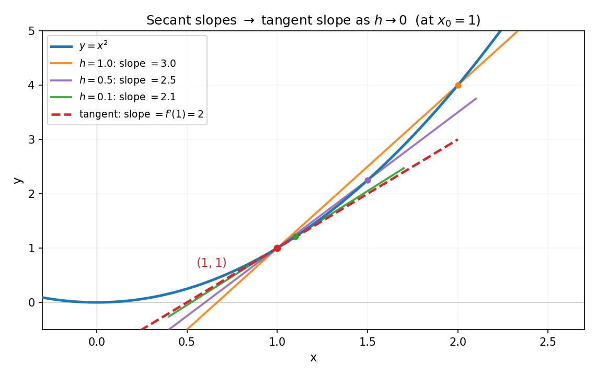
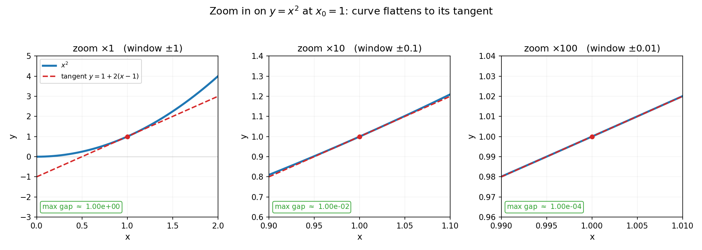
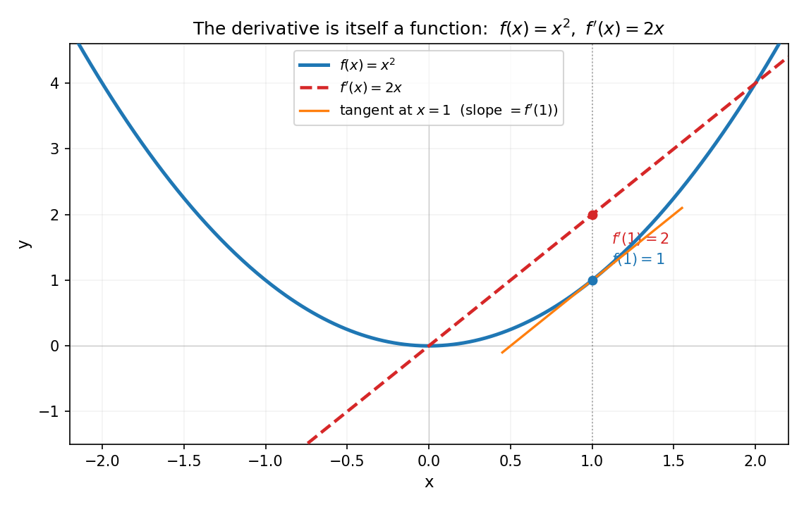

# 第 5 章 · 导数:放大后曲线就变直了

> **核心问题**:导数到底在逼近什么?为什么"瞬时变化率"明明是个悖论,数学却能把它算出来?
>
> **读完本章你会明白**:
> 1. "瞬时变化率"是个自相矛盾的说法——要算变化就得取两点,可取了两点就不"瞬时"了;导数用极限漂亮地化解了这个悖论;
> 2. 导数的几何本质不是"`lim (f(x+h)-f(x))/h`"那串符号,而是**放大镜下曲线变成的那条直线的斜率**——它是函数在该点"最好的线性逼近";
> 3. 微分 `dy=f'(x)dx` 和导数是同一件事的两个面孔,几何上就是切线纵坐标的增量;
> 4. 链式法则、乘法法则这些你背过的公式,背后都有一幅几何画面,看懂了画面,公式你能自己推出来.

---

## 篇引子 · 第 2 篇要干什么(痛点接力)

第 1 篇把"极限"这个地基打牢了:我们学会了用一串有限近似去逼近一个够不着的精确值,并用 ε-δ 这份"你定精度、我给范围"的契约保证逼近不出错.但极限本身只是工具——它最大的用武之地,是**测量变化**.

世界是动的:汽车在加速、人口在增长、温度在升降、股票在涨跌.要描述一个变化着的量,你天然会问:**它此刻变化得多快?**——这就是"变化率".可"瞬时变化率"是个悖论:

> **画面**:汽车在下午两点整这一瞬的速度是多少?要算速度,你得取两个时刻、量出这段时间走过的路程,再除以时间——可一旦取了两个时刻,就不"瞬时"了;而若只取一个时刻,时间差为 0,路程也为 0,`0/0` 根本算不出来.

这就是第 1 篇那条主线——"精确值藏在无穷里,够不着"——在变化率问题上的具象:**瞬时的精确斜率,藏在"间隔趋于 0"这个无穷小里,你用有限的间隔永远够不着它.** 微积分的解法,正是第 1 篇那招"逼近"在微分里的样子:**让两点无限靠近,割线斜率的极限,就是切线斜率——这就是导数.**

> **钉死这件事**:**导数是分析的第一件实战武器,是"逼近"这招从地基(极限)长出来的第一个果实.** 它把"瞬时变化率"这个看似无解的悖论,变成了一个能算、能证明、能机器执行的精确概念.第 2 篇这两章(导数、中值定理与泰勒),讲的都是这件事的不同侧面.

---

## 章首 · 一句话点破

> **导数,就是你在某点把曲线"放大到足够大"后,看到的那条直线的斜率.**

这句话是结论,不是理由.本章倒过来拆:先让你看清"瞬时变化率"为什么是个悖论,再看割线怎么逼近切线,最后发现——导数不只是"算斜率",它是**函数在该点最好的线性逼近**,这个视角会一路通向泰勒展开(下一章)和梯度下降(本章彩蛋).

> **如果一读觉得太难**:先只记住三件事——① 导数 = 放大镜下曲线变直后的斜率;② 它是差商 `(f(x+h)-f(x))/h` 当 `h→0` 的极限;③ 微分 `dy=f'(x)dx` 就是切线的纵坐标增量,和导数是一回事.

---

## 一、瞬时变化率:一个看似无解的悖论

### 1.1 从平均速度到"这一刻的速度"

先从一个最朴素的问题起步.一辆车在公路上跑,它走过的路程随时间是 `s(t)=t²`(单位先不纠结).问:`t=1` 这一瞬间,车的速度是多少?

如果你只会算"平均速度",你会这样做:取一段时间,比如从 `t=1` 到 `t=2`,走了 `2²-1²=3`,用时 `1`,平均速度 `3/1=3`.可这是"从 1 到 2 这段的平均",不是"在 1 这一刻的".

你换个窗口,从 `t=1` 到 `t=1.5`:走了 `1.5²-1²=1.25`,用时 `0.5`,平均速度 `2.5`.再换,到 `t=1.1`:走了 `0.21`,用时 `0.1`,平均速度 `2.1`.窗口越小,这个平均速度越接近一个数——`2`.

可问题来了:**窗口能缩到 0 吗?** 缩到 0,你就回到了 `0/0`,什么都算不出来.这恰恰是第 1 章那个"无穷小"的幽灵再现:你想够的那个精确值,藏在"间隔趋于 0"的无穷小里,你用任何有限的间隔都只能逼近、够不着.

> **画面**:曲线上两点连一条直线(割线 secant),这条割线的斜率就是"这两点间的平均变化率".你把两点往一起靠、再靠、再靠……割线会越转越接近某个方向.**当两点无限靠近时,割线极限位置上的那条线,叫切线(tangent);它的斜率,就是导数.**

> **不这样理解会怎样**:你会以为"瞬时速度"是某种神秘的、和平均速度完全不同的东西,只能靠背公式 `s'(t)=2t` 来算,却不知道它从哪来.于是导数对你只是一串符号操作,而不是"放大镜下曲线变直后的斜率".一旦题目换个花样(复合函数、隐函数),你就只能硬套法则,看不出背后在干什么.

### 1.2 把悖论变成公式:差商的极限

把上面那串"窗口越缩越小"的过程写成符号.固定一个点 `x₀`,让另一点取在 `x₀+h`(h 可正可负),割线的斜率是:

```
(f(x₀+h) - f(x₀)) / h
```

这个式子叫**差商**(difference quotient).它就是两点间的平均变化率.现在让 `h→0`——这就是第 1 篇那招"逼近":

```
f'(x₀) = lim (h→0)  (f(x₀+h) - f(x₀)) / h
```

这个极限值,就是 `x₀` 处的导数(derivative).

> **所以这样看**:**导数 = 差商的极限.** 瞬时变化率的悖论,被极限干净利落地化解了:你不必真的把间隔取到 0(那会 `0/0`),你只要让间隔**趋于 0**,看差商**逼近**到哪个数.这个数,就是那个"够不着的精确斜率"——精确,是逼近的极限.

> **钉死这件事**:那个 `h→0` 里的 `h` 就是第 1 章讲的无穷小.它**在过程的每一步都不是 0**(0.1、0.01、0.001……),但它的**归宿(极限)是 0**.差商的极限存在,导数就存在;差商的极限不存在(比如振荡、或左右极限不相等),导数就不存在.这一切都建立在第 1 篇的极限地基上.

---

## 二、核心母题:放大镜下,曲线变直了

差商的极限是导数的"算法定义",但真正让你"看见"导数的,是下面这个母题.它是本章的灵魂,也是第 2 篇的篇眼.

### 2.1 割线逼近切线:在图上看

先看导数是怎么从割线逼出来的.还是 `y=x²`,我们盯着 `x₀=1` 这个点,画三条割线(分别取 `h=1`、`0.5`、`0.1`)再加一条切线:



蓝色是曲线 `y=x²`.三条彩色直线是不同窗口的割线——`h=1` 时割线斜率是 `3.0`,`h=0.5` 时是 `2.5`,`h=0.1` 时是 `2.1`.红色虚线是切线,斜率正好是 `2`(就是 `x²` 在 `x=1` 处的导数值,`f'(1)=2`).

> **画面**:你看那条割线,随着 `h` 从 1 缩到 0.1,它在一点点"转",越转越贴近那条红色切线.割线斜率 `3.0 → 2.5 → 2.1 → 2`,**正朝着切线斜率 2 收敛**.这就是"逼近"在你眼前发生:差的不是一点点运气,而是一个**确定**的极限.

> **所以这样看**:**切线不是"和曲线只交于一点的线"**(那是中学的粗糙说法,对很多曲线都不准),切线是**割线在两点无限靠近时的极限位置**.导数,就是这个极限位置的斜率.

### 2.2 放大镜:曲线真的"变直了"

现在换一个视角,这是本章最关键的画面.与其盯着一堆割线转,不如直接把曲线**放大**——像拿着显微镜看 `x₀=1` 这一点的局部.我们分别放大 1 倍、10 倍、100 倍:



蓝色是 `x²` 的真实曲线,红色虚线是它在 `x=1` 处的切线 `y=1+2(x-1)`.看三幅子图右下角标的"max gap"(曲线和切线的最大偏差):

- 放大 1 倍(窗口 ±1):偏差约 `1.0`,一眼就能看出曲线是弯的;
- 放大 10 倍(窗口 ±0.1):偏差约 `0.01`,曲线和切线几乎重合,得眯着眼才分得开;
- 放大 100 倍(窗口 ±0.01):偏差约 `0.0001`,曲线和直线**肉眼完全分不出**.

偏差随放大倍数的平方往下掉(放大 10 倍,偏差缩到百分之一;放大 100 倍,缩到万分之一).这就是"`x²` 在小范围内像直线"的量化证据.

> **画面**:**放大到足够大,任何光滑曲线都变成直线.** 这条直线的斜率,就是该点的导数.导数不是什么"额外的量",它就是曲线在无穷小尺度下"长成的那条直线"的斜率.

> **钉死这件事**:**导数 = 函数在该点最好的线性逼近(best linear approximation)的斜率.** 这句话比"`lim (f(x+h)-f(x))/h`"重要一百倍——因为它告诉你导数的**本质**:用最简单的函数(直线)去逼近最一般的函数(曲线),那个"最好的逼近"的斜率,就是导数.差商的极限只是"算出这个最好斜率"的方法,而"放大后变直"才是它**是什么**.

### 2.3 为什么"放大变直"这件事值得大惊小怪

你可能会想:曲线放大看着像直线,这不是废话吗?恰恰不是——这是一个**深刻**的事实,它是后面一切(微分、泰勒展开、数值计算、机器学习)的地基:

- 因为曲线局部像直线,而直线是最容易处理的函数,所以**在局部,你可以把复杂的函数当成简单的线性函数来算**——这就是"局部线性化",是微分方程数值解、牛顿法、梯度下降全部的出发点;
- 如果一阶逼近(直线)不够好,你还可以多放几阶,用二次、三次……多项式贴得更紧——这就是下一章的泰勒展开.**导数是泰勒级数的第一阶,是"逼近"这招在最低阶的样子.**

> **不这样理解会怎样**:你背了 `(x²)'=2x`、`(sin x)'=cos x`,却不知道这些公式为什么"对"、它们在描述曲线的什么.于是当有人问你"`sin(1)` 计算器怎么算出来"(下一章彩蛋),或者"神经网络怎么用导数找最低点"(本章彩蛋),你完全接不上——因为你只学了导数的"算法面孔",没学它的"逼近面孔".

---

## 三、微分:导数的孪生兄弟

讲到这里,可以澄清一个让很多人糊涂的概念:**微分(differential)**.教材通常把它和导数分开讲,搞得像两个东西.其实它们是同一件事的两副面孔.

### 3.1 切线的纵坐标增量

回到那条"放大后变直"的切线.在 `x₀` 处,切线方程是 `y = f(x₀) + f'(x₀)(x - x₀)`.现在让自变量从 `x₀` 变到 `x₀+dx`(用 `dx` 强调这是个微小的增量),切线上的纵坐标会变化多少?

```
dy = f'(x₀) · dx
```

这个 `dy` 就叫**微分**.几何上,它是**切线纵坐标的增量**(不是曲线纵坐标的真实增量).而曲线纵坐标的真实增量是 `Δy = f(x₀+dx) - f(x₀)`.

关键在于:`dx` 越小,`dy` 和 `Δy` 越接近——因为切线就是"最好的线性逼近".我们用 `f=x²`、`x₀=3`、`dx=0.1` 实算(下一节符号佐证里会跑代码确认):

- 微分:`dy = f'(3)·0.1 = 2·3·0.1 = 0.6`;
- 真实增量:`Δy = 3.1² - 3² = 0.61`;
- 误差:`Δy - dy = 0.01`,正好等于 `dx² = 0.01`.

> **画面**:想象曲线上一点和过该点的切线.自变量往右挪一小格 `dx`,曲线上点的真实位移是 `Δy`(带那么一点弯曲),切线上点的位移是 `dy`(笔直的).`dx` 越小,这"一点弯曲"越可忽略,`Δy ≈ dy`.**微分就是把"曲线的增量"近似成"切线的增量",忽略掉那个高阶小量.**

> **所以这样看**:**微分 `dy=f'(x)dx` 是导数的另一种写法,它强调的是"增量"而不是"斜率".** 把导数 `f'(x)` 写成 `dy/dx`,你就能读出"微分之比"——斜率,本来就是纵增量除以横增量.导数和微分,一个看斜率、一个看增量,是同一枚硬币的两面.

### 3.2 线性主部:为什么用直线逼近是"最好"的

这里藏着一个"最好"的精确含义.任何形如 `A·dx` 的线性函数都能近似 `Δy`,为什么偏偏 `A=f'(x₀)` 是"最好"的?因为只有它能让误差 `Δy - A·dx` 是 `dx` 的高阶无穷小(o(dx),也就是比 `dx` 更快地趋于 0).我们刚刚的例子里,误差正好是 `dx²`,当 `dx→0` 时 `dx²/dx = dx → 0`——这就是高阶无穷小.

> **钉死这件事**:**导数是那个让"线性逼近误差变成高阶小量"的唯一系数.** 这就是"最好的线性逼近"的数学含义——不是感觉上的"最好",是误差衰减最快意义上的"最好".这个"线性主部"的视角,是微分方程、数值分析、多元微分的通用语言.

---

## 四、求导法则的几何:先看画面,公式是副产品

教材把链式法则、乘法法则当公式让你背.但这些法则背后都有清晰的几何画面,看懂了画面,公式你能自己推.本节**先给几何,再落公式**.

### 4.1 链式法则:复合 = 两次线性逼近的接龙

链式法则(chain rule)处理的是**复合函数**,比如 `f(g(x))`.一个最自然的例子:`sin(x²)`,它把 `x` 先平方、再取 sin.

> **画面**:想象两个放大镜串起来用.第一个放大镜把 `x` 看成 `g(x)`(这里 `g(x)=x²`),第二个放大镜把 `g(x)` 看成 `f(g(x))`(这里 `f=sin`).**复合函数的导数,就是这两次线性逼近的"接龙"**——第一段的输出 `dg`,正好是第二段的输入,两个斜率乘起来就是总斜率.

写成公式:

```
(f(g(x)))' = f'(g(x)) · g'(x)
```

这个"乘"不是凭空来的,它是"两次缩放接龙"的结果:第一段把 `dx` 放大成 `g'(x)·dx`,第二段再按 `f'` 放大一次,总共放大 `f'(g(x))·g'(x)` 倍.我们用 `sin(x²)` 在 `x=1` 处实算(下一节符号佐证会跑代码):`f'(u)=cos(u)`,`g'(x)=2x`,所以 `(sin(x²))' = cos(x²)·2x`,在 `x=1` 处等于 `2·cos(1) ≈ 1.0806`.数值差商验证(下一节):`h=0.001` 时差商约 `1.0795`,`h=1e-6` 时约 `1.0806`,精确趋近.

> **不这样理解会怎样**:你会把链式法则当成"外面求导乘里面求导"的口诀,套得快却不懂为什么是"乘".一旦遇到多元复合(偏导数的链式法则是一串求和),或者反向传播(神经网络的核心算法,本质就是链式法则的反复应用),你就抓瞎了.**链式法则 = 线性逼近的接龙**,记住这个画面,无论几层复合你都能想清楚.

### 4.2 乘法法则:两个函数乘积的变化

乘法法则(product rule)处理 `f(x)·g(x)`.它的几何没那么戏剧化,但有一个干净的直觉:两个量都在变,它们乘积的变化 = 第一个变(第二个当常数)+ 第二个变(第一个当常数).像长方形的面积:长宽都在变,面积的变化 = 长变化贡献 + 宽变化贡献.

```
(fg)' = f'g + fg'
```

我们用 `x·sin(x)` 验证:`(x·sin x)' = 1·sin x + x·cos x = sin x + x·cos x`.这个"加"反映了"两个变化来源各算一份,再相加"——和链式法则的"乘"形成对照:**链式是串联(接龙),乘法是并联(叠加).**

### 4.3 其他法则,一句话带过

- **商法则**:`(f/g)' = (f'g - fg')/g²`.几何上类似乘法法则,只是除法引入一个分母平方的修正(因为分母在变,斜率要按相对量调整).
- **反函数法则**:`(f⁻¹)'(y) = 1/f'(x)`,其中 `y=f(x)`.几何上绝美——反函数把图沿 `y=x` 翻转,斜率取倒数.导数是 `2`(陡),反函数在该点就平(斜率 `1/2`).

> **钉死这件事**:**求导法则不是死记的口诀,而是"线性逼近如何组合"的几何规律.** 链式 = 串联接龙(乘),乘法 = 并联叠加(加),反函数 = 翻转取倒.把这三幅画面钉在脑子里,任何复杂函数的求导你都能"推"出来,而不是"背"出来.

---

## 五、导数本身也是函数

最后一个容易被忽略的点:导数 `f'(x)` 不是一个数,而是一个**函数**——对每一个 `x`,都有一个导数值.我们刚才一直在某个点(如 `x=1`)算导数,但 `x²` 在每个点的导数是 `2x`,它本身就是一条直线.



蓝色是 `f=x²`,红色虚线是 `f'=2x`.在 `x=1` 处,蓝点 `f(1)=1`,红点 `f'(1)=2`——蓝色曲线在该点的切线斜率(橙色),正好等于红色曲线在该点的高度.**导数函数的图,记录的是原函数在每个点的"陡峭程度".**

这件事的意义在于:导数把你从"函数的值"带到了"函数的变化",而后者往往比前者更有信息量.物理里,位置函数的导数是速度,速度的导数是加速度;经济学里,成本的导数是边际成本;机器学习里,损失函数的导数(梯度)告诉你"往哪个方向调参数,损失降得最快".

### 5.1 高阶导数:放大再放大

既然导数是函数,你就能对它再求导,得到**二阶导数** `f''`.几何上,一阶导数告诉你"曲线在升还是在降、升得多快",二阶导数告诉你"曲线在向上弯还是向下弯"(凹凸性).

- `f=x²`,`f'=2x`,`f''=2`.二阶导数是正的常数——说明它处处向上凸,而且"弯的程度"到处一样(这正是抛物线的特征).
- `f=sin x`,`f'=cos x`,`f''=-sin x`,`f'''=-cos x`,`f''''=sin x`.求四阶导回到自己——这种周期性,是正弦波能解一大堆微分方程的原因(第 5 篇傅里叶的伏笔).

> **所以这样看**:**高阶导数 = 放大镜多放几阶后看到的细节.** 一阶看斜率,二阶看弯曲,三阶看弯曲的变化……每多求一阶,你就对函数的局部行为多把握一个"细节层次".下一章的泰勒展开,正是把这种"逐阶把握"做到无穷——用一阶、二阶、三阶……直到无穷阶的导数,把一个函数**完整地**重构成多项式.

---

## 六、彩蛋:导数是两件大事的发动机

导数不只是数学课本里的概念,它是两个读者熟悉领域的核心发动机.

### 彩蛋一:计算器怎么算 `sin(1)`、`e`?(预告下一章)

你按一下计算器,它给你 `sin(1)=0.84147…`.可计算器不会"查表",它怎么算出来一个超越函数的值?

答案正是导数.因为导数告诉你函数在每个点的"斜率",你就能从 `sin(0)=0` 出发,沿着斜率走一小步,估出 `sin(0.01)`,再从那里出发走一小步……这就是**用直线(切线)一步步逼近曲线**.走无穷多步(或等价地,用一阶、二阶、三阶……导数拼出一个多项式),你就重建了 `sin`.这个"用多项式重建函数"的东西,叫**泰勒级数**,是下一章 P2-06 的主角.

> **一句话**:计算器算 `sin`、`e^x`、`ln`,用的全是导数推出来的多项式.**导数最实际的用处之一,就是把"算不出来的超越函数"变成"算得出来的加减乘除".**

### 彩蛋二:梯度下降——神经网络怎么用导数找最低点

如果你碰过机器学习,你一定听过**梯度下降(gradient descent)**和**反向传播(backpropagation)**.它们的数学核心,就是导数.

> **画面**:想象你蒙着眼站在一座山上,想走到谷底(损失函数的最小值).你看不见全貌,但你能用脚探一下"哪个方向是下坡的"——这个"下坡方向",就是负梯度(多元函数的导数).你往下坡方向迈一小步,再探、再迈,一步步走到谷底.

- 一元函数里,"下坡方向"就是看导数的正负:`f'(x)<0` 就往右走(函数在降),`f'(x)>0` 就往左走;
- 多元函数里,导数升级成**梯度**(各偏导数组成的向量),它指向"上升最快"的方向,所以负梯度就是"下降最快"的方向;
- **反向传播**呢?它就是链式法则在多层神经网络上的高效实现——前面说链式法则是"线性逼近的接龙",反向传播就是把这串接龙从输出层一路算回输入层,算出每个参数该怎么调.**没有链式法则,就没有深度学习.**

> **钉死这件事**:**导数不只算斜率,它还是"告诉优化算法往哪走"的指南针.** 从神经网络的训练,到物理里的最小作用量原理,到经济学里的边际分析,导数都是"在变化中找最优"的通用工具.这是分析数学"有什么用"最鲜活的答案之一.

---

## 符号 + 数值佐证

数学没有源码可引,但有同样解渴的东西:**你亲手在屏幕上看见差商真的在收敛到精确导数.** 本章的所有数字,我们一一验.

### sympy:精确算导数,证明公式 = 直觉

```python
import sympy as sp

x = sp.symbols('x')

# (1) 基本函数的精确导数
for f in [x**2, sp.sin(x), sp.exp(x), sp.sqrt(x), sp.ln(x)]:
    print("d/dx %s = %s" % (f, sp.diff(f, x)))
# 输出:
#   d/dx x**2 = 2*x
#   d/dx sin(x) = cos(x)
#   d/dx exp(x) = exp(x)
#   d/dx sqrt(x) = 1/(2*sqrt(x))
#   d/dx log(x) = 1/x

# (2) 链式法则:sin(x^2) 的导数
g = sp.sin(x**2)
print("(sin(x^2))' =", sp.diff(g, x))           # 2*x*cos(x**2)
print("at x=1:", sp.diff(g, x).subs(x, 1).evalf())   # 1.0806046...

# (3) 乘法法则:x*sin(x) 的导数
print("(x*sin(x))' =", sp.diff(x*sp.sin(x), x))  # sin(x) + x*cos(x)
```

sympy 用符号算,告诉你这些导数是**数学事实**,不是"大概".链式法则给出 `2x·cos(x²)`,在 `x=1` 处精确值 `1.0806`,和下面 numpy 的数值逼近严丝合缝.

### numpy:差商真的在趋近精确导数

```python
import numpy as np

def f(x):  return x**2
def s(x):  return np.sin(x)

# (1) x^2 在 x=1,差商 -> 精确导数 2
x0 = 1.0
print("=== x^2 at x=1 -> f'(1)=2 ===")
for h in [1, 0.5, 0.1, 0.01, 1e-3, 1e-6]:
    q = (f(x0+h) - f(x0)) / h
    print("h=%-11g  diff-quotient=%.10f  err=%.2e" % (h, q, q-2))

# (2) sin(x) 在 x=1,差商 -> cos(1) = 0.5403023...
exact = np.cos(1.0)
print("\n=== sin(x) at x=1 -> f'(1)=cos(1)=%.10f ===" % exact)
for h in [0.1, 0.01, 1e-3, 1e-6]:
    q = (s(x0+h) - s(x0)) / h
    print("h=%-11g  diff-quotient=%.10f  err=%.2e" % (h, q, q-exact))

# (3) 链式法则数值验证:sin(x^2) at x=1 -> 2*cos(1) = 1.0806046...
def g(x): return np.sin(x**2)
g_exact = 2*np.cos(1.0)
print("\n=== sin(x^2) at x=1 -> 2*cos(1)=%.10f ===" % g_exact)
for h in [0.1, 1e-3, 1e-6]:
    q = (g(x0+h) - g(x0)) / h
    print("h=%-11g  diff-quotient=%.10f  err=%.2e" % (h, q, q-g_exact))
```

实跑结果(关键几行,你跑出来会一模一样):

```
=== x^2 at x=1 -> f'(1)=2 ===
h=1           diff-quotient=3.0000000000  err=1.00e+00
h=0.5         diff-quotient=2.5000000000  err=5.00e-01
h=0.1         diff-quotient=2.1000000000  err=1.00e-01
h=0.01        diff-quotient=2.0100000000  err=1.00e-02
h=0.001       diff-quotient=2.0010000000  err=1.00e-03
h=1e-06       diff-quotient=2.0000010000  err=1.00e-06

=== sin(x) at x=1 -> f'(1)=cos(1)=0.5403023059 ===
h=0.1         diff-quotient=0.4973637525  err=-4.29e-02
h=0.01        diff-quotient=0.5360859810  err=-4.22e-03
h=0.001       diff-quotient=0.5398814804  err=-4.21e-04
h=1e-06       diff-quotient=0.5403018851  err=-4.21e-07

=== sin(x^2) at x=1 -> 2*cos(1)=1.0806046117 ===
h=0.1         diff-quotient=0.9414501675  err=-1.39e-01
h=0.001       diff-quotient=1.0794595678  err=-1.14e-03
h=1e-06       diff-quotient=1.0806034690  err=-1.14e-06
```

> **这就是"逼近"在你屏幕上的具象化**:差商随着 `h` 一阶阶缩小,**误差也按 `h` 的同阶缩小**(线性收敛),精确地朝 sympy 给的导数值逼近.三个函数、链式法则,无一例外.**你看的不是"大概趋近",是"误差严格按 `h` 一阶衰减"——这就是导数定义里那个极限真的存在、且等于这个值的铁证.**

### 一个值得注意的陷阱:太小反而算不准

跑上面那段时,你若把 `h` 一直推到 `1e-15`,会发现差商**反而开始偏离**精确值——不是因为数学错了,而是浮点数的"舍入误差"在 `h` 极小时压过了"截断误差".分子 `f(x₀+h)-f(x₀)` 变成两个极接近的数相减,有效数字大量丢失.这是数值分析的经典课题:**数值微分有个"最优步长",不是越小越好**.这个现象,是"无穷小在计算机里也会骗人"的一个缩影,我们在泰勒展开(下一章)和数值级数(第 9 章)里还会反复撞见它.

---

## 章末小结

**用母题回顾本章**:本章的全部画面,浓缩成一句——**放大镜下,曲线变直;导数,就是那条直线的斜率.** 瞬时变化率的悖论,被差商的极限化解;割线逼近切线;微分 `dy=f'(x)dx` 是切线的纵坐标增量;求导法则是线性逼近的组合(链式接龙、乘法叠加);高阶导数是放大镜多放几阶.导数是"逼近"这招在微分里的第一副面孔.

**回扣全书主线**:本章再一次兑现了第一性原理——**精确,是逼近的极限**.那个够不着的"瞬时斜率",藏身于"间隔趋于 0"的无穷小里;我们用一串有限的差商去逼近它,并(靠第 1 篇的极限理论)证明这串逼近确实够到了.导数在驯服的是**无穷小尺度上的线性化**——它补的窟窿是:"瞬时变化率"这个悖论,没有极限工具根本无从下手.导数,是极限地基上长出来的第一棵大树.

**五个"为什么"(若只记五件事)**:
1. **为什么瞬时速度能算出来?** 因为它不是"取一点算 0/0",而是"差商在 `h→0` 时的极限".极限让悖论变成了一个确定的数.
2. **导数的几何本质是什么?** 不是那串符号,而是**放大镜下曲线变直后的斜率**——函数在该点最好的线性逼近.
3. **微分和导数什么关系?** 同一枚硬币的两面:导数看斜率(`dy/dx`),微分看增量(`dy=f'(x)dx`).微分是切线纵坐标的增量,是"线性主部".
4. **链式法则为什么是"乘"?** 因为复合 = 两次线性逼近的接龙,第一段的输出是第二段的输入,两个斜率乘起来是总斜率.反向传播就是它在神经网络上的反复应用.
5. **导数在驯服哪种无穷?** 无穷小尺度上的线性化——用最简单的直线去够最一般的曲线.这是"逼近"在微分里的样子,也是泰勒(下一章)和梯度下降(彩蛋)的共同地基.

**想继续深入该往哪钻**:
- **3Blue1Brown《Essence of Calculus》第 1~3 集**——讲"导数的几何直觉"和"链式法则、乘法法则的画面",和本章同源,强烈推荐对照看;
- **自己跑 numpy**:改 `h`,看差商的误差是不是真的按 `h` 一阶衰减;试试把 `h` 推到 `1e-15`,观察浮点舍入怎么让结果反而变差——体会"无穷小在计算机里也会骗人";
- **进阶彩蛋**:动手实现一个一维的梯度下降(用 `f(x)=x²` 这种简单函数),看负导数怎么一步步把你带到最小值;再想想反向传播怎么把链式法则铺到几十层的网络上.

**下一章**:本章讲清了导数是"一阶的线性逼近",但一阶直线只能贴住函数的"斜率",贴不住"弯曲".如果想让多项式把函数贴得更紧——贴住斜率、再贴住弯曲、再贴住弯曲的变化……一直贴到无穷阶——会发生什么?下一章《中值定理与泰勒展开:用多项式吃下任意函数》,我们就把"放大镜"从一阶升到无穷阶,看一个函数怎么被它自己的各阶导数**完整地**重构成多项式.那里还藏着计算器算 `sin`、`e^x` 的全部秘密.
