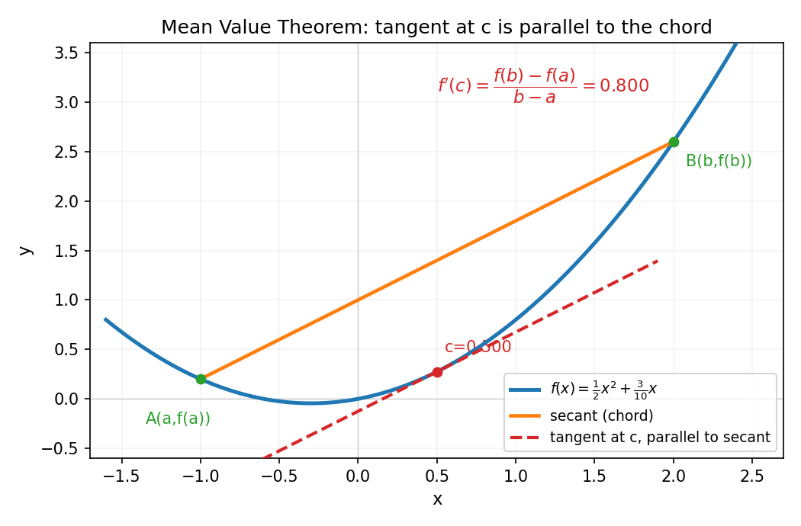
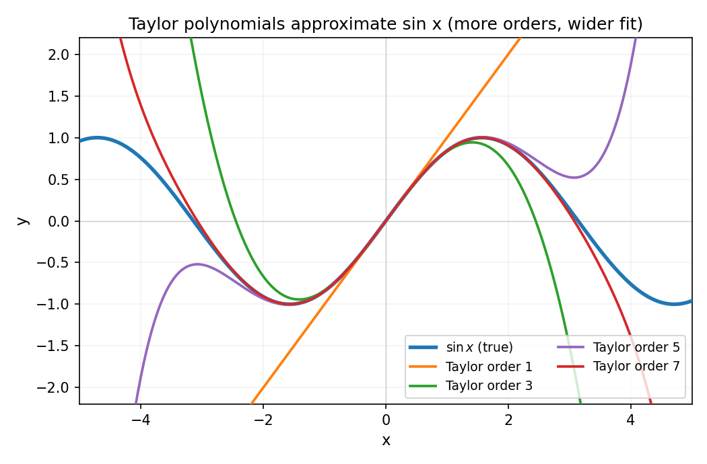
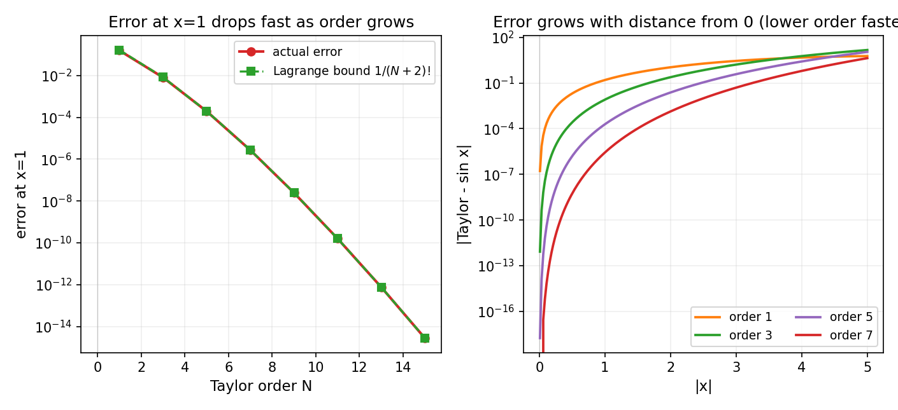

# 第 6 章 · 中值定理与泰勒展开:用多项式吃下任意函数

> **核心问题**:导数除了算某点斜率,怎么用来"吃下"整个函数?——为什么 `sin x`、`e^x` 这些没有闭式公式、看似"算不出来"的超越函数,计算器却能瞬间给出任意精度的值?
>
> **读完本章你会明白**:
> 1. 三大中值定理(Rolle / Lagrange / Cauchy)不是三条要背的定理,而是同一幅画面——**"曲线上某点的切线,平行于端点的割线"**——它的本质是把"导数这种局部信息"搭成桥,推出"整段函数的全局结论";
> 2. 泰勒公式不是又一条要背的公式,而是上一章那台"放大镜"从一阶升到多阶的自然结果——**用 0 阶(常数)、1 阶(切线)、2 阶(加曲率)、…、n 阶导数信息,拼一个多项式,在局部把函数贴合到任意精度**;
> 3. 余项(误差)是逼近的"刹车":**拉格朗日余项告诉你截断到 n 阶时误差被 `|f^(n+1)(c)|·|x-a|^(n+1)/(n+1)!` 死死卡住**——这正是全书主线"逼近必须有误差控制"在微分里的兑现;
> 4. 计算器算 `sin(1)`、`e^1`,既不查表也不靠魔法——它就是把泰勒级数截断前几项算出来,**误差被余项锁在一个极小的范围里**.

---

第 5 章我们把"放大镜"立起来了:**放大到足够大,任何光滑曲线都变成直线;导数,就是那条直线的斜率**.但一阶直线只能贴住"斜率",贴不住"弯曲"——把 `x²` 在 `x=1` 处用切线 `y=1+2(x-1)` 近似,离开 `x=1` 一点点,误差就出来了(上一章我们量过:窗口 ±0.1 时偏差约 `0.01`).

那能不能贴得更紧?贴住斜率、再贴住弯曲、再贴住弯曲的变化……一直贴到无穷阶?这就引出本章两件事:

- **中值定理**——它先把"导数"从一个局部性质,变成一个能推出"整段函数行为"的桥梁(没有它,泰勒公式的余项根本证不出来);
- **泰勒公式**——把上一章那台放大镜从"1 阶线性逼近"升到"n 阶多项式逼近",用一个多项式把任意光滑函数在局部贴合到任意精度.

> **一句话串起来**:导数是放大镜下看到的"一阶直线";泰勒是把放大镜多放几阶,用多项式把函数一层层贴住;中值定理是支撑"贴住这件事能成立、且误差可控"的数学地基.

---

## 章首 · 一句话点破

> **任意光滑函数,在局部都能被一个多项式贴合到任意精度——这个多项式,由函数自己的各阶导数唯一决定,叫泰勒多项式.**

这句话是结论,不是理由.本章倒过来拆:先看"导数怎么从局部搭桥到全局"(中值定理),再看"一阶线性逼近怎么升到多阶多项式逼近"(泰勒),最后看"误差怎么被控制"(余项),以及——这套东西最实际的用处:**计算器怎么算 `sin`、`e^x`**.

> **如果一读觉得太难**:先只记住三件事——① 中值定理说"切线总在某处平行于割线",是把局部导数连成全局结论的桥;② 泰勒多项式 `f(a)+f'(a)(x-a)+f''(a)(x-a)²/2!+…` 是"用导数一层层贴住函数",阶数越高贴得越紧;③ 误差被余项 `f^(n+1)(c)/(n+1)!·(x-a)^(n+1)` 锁死,所以截断前几项就能精确算 `sin`、`e^x`.

---

## 一、中值定理:把局部导数,搭成全局的桥

### 1.1 先看一幅画:切线平行于割线

想象一条光滑曲线,你在两端各取一个点 A、B,把这两点用直线连起来——这条直线叫**割线(secant / chord)**,它的斜率是 `(f(b)-f(a))/(b-a)`,代表"从 a 到 b 这整段的平均变化率".

现在问你:**在这段曲线上,会不会存在一个点 c,使得该点的切线斜率,正好等于这条割线的斜率?**

直觉上:你从 A 到 B 沿着曲线走,起点处曲线"陡不陡"和终点处"陡不陡"未必相等,但既然你从 A 走到了 B,中间**总得有那么一个瞬间,你的瞬时斜率正好等于整段的平均斜率**——就像开车从 0 加速到 100,中间总有一刻的瞬时速度,正好等于这段的平均速度.

这就是**拉格朗日中值定理(Lagrange mean value theorem / MVT)**.先看图,再给公式:



蓝色曲线 `f(x)=½x²+0.3x`.橙色直线是 A、B 两端点的割线.红色虚线是 `c≈0.483` 处的切线——它和橙色割线**平行**(斜率相同).这不是巧合,而是定理保证的:只要 `f` 在 `[a,b]` 上连续、在 `(a,b)` 内可导,就**一定**存在这样一个 `c`.

> **画面**:**曲线上必有一点,其切线平行于端点割线.** 这就是中值定理的全部画面——不是符号,不是 ∀∃,就是这么一幅朴素的图.

### 1.2 公式是这幅画的速记

把"切线斜率 = 割线斜率"写成符号:

```
存在 c ∈ (a,b),使得   f'(c) = (f(b) - f(a)) / (b - a)
```

或者等价地:

```
f(b) - f(a) = f'(c) · (b - a)
```

注意右边:它是"某一点的瞬时导数 `f'(c)`" 乘以"整段时间 `(b-a)`".所以这个公式说了一件很有分量的事——**整段函数值的总变化 `f(b)-f(a)`,可以表示成"内部某一点的瞬时变化率"乘以"区间长度"**.

> **所以这样看**:中值定理把"导数(局部、瞬时)"和"函数值变化(全局、整段)"**焊在了一起**.没有它,导数只是一个"某点斜率"的局部性质,推不出任何关于"整段函数怎么样"的结论;有了它,你能从导数的信息,反推出函数在一段区间上的行为.

### 1.3 三大中值定理:同一幅画,三种粒度

教材把 Rolle、Lagrange、Cauchy 列成三条定理,让人觉得要背三条.其实它们是**同一幅画的三种特例**,粒度从粗到细:

**① Rolle 定理(最朴素的版本)**.如果 `f(a)=f(b)`(两端一般高),那割线是水平的(斜率 0).中值定理告诉你:中间必有一点切线也水平(`f'(c)=0`).画面:两端一样高的曲线,中间总有个"山顶"或"谷底",那里的切线是水平的.这是最直观、也最容易先证的一条.

> **画面**:从 A 走到和 A 同样高的 B,中间**至少要经历一次"水平的瞬间"**(上坡完总得下坡,转折处切线水平).Rolle 定理就是这句话的数学版.

**② Lagrange 定理(标准版)**.去掉 `f(a)=f(b)` 的限制,割线可以斜,但结论依旧成立——中间必有点 `c`,切线斜率等于割线斜率(就是上面图 6.1 那幅).

**③ Cauchy 定理(参数化版 / 两个函数版)**.把"一条曲线 `y=f(x)`"换成"参数曲线 `(g(t), h(t))`",结论变成:中间必有某参数值 `c`,使 `h'(c)/g'(c) = (h(b)-h(a))/(g(b)-g(a))`.它本质上是把 Lagrange 定理用在参数曲线上——割线和切线,只是换成了"两函数之比".Cauchy 定理最经典的应用是证明 **L'Hôpital 法则**(求 `0/0` 型极限),本章不展开,但你要知道:**它还是"切线平行割线"这幅画,只不过曲线是参数化的**.

> **钉死这件事**:**三大中值定理是一幅画——"切线在某处平行于割线"——的三种粒度.** Rolle 是"水平割线"的特例,Lagrange 是"斜割线"的一般版,Cauchy 是"参数化曲线"的推广.别把它们当三条背,当一幅画的三次放大.

### 1.4 为什么这件事值得大惊小怪

你可能会问:切线平行割线,这不直观吗,值得搞这么大阵仗?——值得,因为它是**后面一切微分理论的发动机**.几个最直接的用处:

- **导数恒为 0 ⇒ 函数是常数**.如果 `f'(x)=0` 处处成立,那对任意 `a<b`,`f(b)-f(a)=f'(c)(b-a)=0`,即 `f(b)=f(a)`.这个看似平凡的结论,**没有中值定理根本证不出来**(它是后面"原函数差一个常数"的根据,直接通向第 8 章微积分基本定理).
- **导数恒正 ⇒ 函数单调增**.对任意 `a<b`,`f(b)-f(a)=f'(c)(b-a)>0`,所以 `f(b)>f(a)`.**单调性,是从导数的正负反推出来的——靠的就是中值定理这座桥**.
- **泰勒公式的余项(误差估计),证明用的就是中值定理的推广**.下一节你会看到,余项是"某个中间点 c 处的高阶导数",这个"中间点 c"正是中值定理那种"切线平行割线"思想在高阶情形的再现.

> **不这样理解会怎样**:你会把中值定理当成一条"考试要证一遍就忘"的定理,看不出它为什么重要.可一旦你想证"导数符号决定单调性"、"两函数导数相等则差一个常数"、"泰勒余项有界"——全都绕不开它.**中值定理是把"导数这个局部工具"变成"全局结论"的唯一桥梁,这是它在分析里的地位**.

---

## 二、泰勒公式:放大镜从一阶升到多阶

现在主角登场.上一章我们说了:**导数 = 函数在该点最好的线性逼近**.线性逼近长这样:

```
f(x) ≈ f(a) + f'(a) · (x - a)
```

这就是 `a` 处的切线方程.它用 **0 阶信息 `f(a)`** 和 **1 阶信息 `f'(a)`**,拼出一条直线,贴住函数的"位置"和"斜率".可直线贴不住"弯曲"——`x²` 用切线近似,离开 `a` 一点就有误差(上一章量过,窗口 ±0.1 时偏差约 `0.01`,正好是 `dx²`).

### 2.1 多加一阶:贴住曲率

那能不能在切线基础上,再加一项,把"弯曲"也贴住?能——加一个二次项.要它"贴住曲率",就用 **2 阶信息 `f''(a)`**:

```
f(x) ≈ f(a) + f'(a)(x-a) + f''(a)/2 · (x-a)²
```

这个 `f''(a)/2` 不是乱写的.它的来历是"让这个二次多项式在 `a` 处的 0 阶、1 阶、2 阶导数,分别等于 `f(a)`、`f'(a)`、`f''(a)`"——求两次导数时,二次项 `(x-a)²` 的系数 `f''(a)/2` 会被链式求导"放出来",正好变成 `f''(a)`.这个 `2 = 2!`(2 的阶乘).

> **画面**:**1 阶(切线)贴住位置和斜率,2 阶再加一项,把"向上弯还是向下弯、弯得多厉害"也贴住**.上一章说二阶导数告诉你"凹凸性",现在这个信息被直接编码进多项式,所以 2 阶多项式比切线更能"抱住"曲线.

继续这个思路:3 阶加一项 `f'''(a)/3!·(x-a)³`(贴住"弯曲的变化"),4 阶再加 `f⁽⁴⁾(a)/4!·(x-a)⁴`,……,n 阶就是:

```
T_n(x) = f(a) + f'(a)(x-a) + f''(a)/2!·(x-a)² + … + f⁽ⁿ⁾(a)/n!·(x-a)ⁿ
```

这就是**泰勒多项式(Taylor polynomial)**.它用 `f` 在 `a` 处的 **0、1、2、…、n 阶导数**(共 n+1 个信息),拼出一个 n 次多项式,让它在 `a` 处的 0~n 阶导数和 `f` 完全一致.

> **所以这样看**:**泰勒多项式 = 用函数自己的各阶导数,拼一个多项式去贴合函数本身.** 它是上一章那台放大镜"从 1 阶升到 n 阶"的产物——一阶看斜率,二阶看弯曲,三阶看弯曲的变化……每多放一阶,多项式就在更大的范围内贴合函数.系数里的 `n!`(阶乘)不是装饰,它是"让第 n 阶导数对得上"自然推出来的.

### 2.2 在图上看:sin 的 1/3/5/7 阶泰勒多项式

我们用 `sin x` 在 `x=0` 处的泰勒多项式来直观感受"阶数越高,贴得越紧".先看 `sin x` 在 0 处的各阶导数:`sin 0 = 0`,`(sin)' = cos`,`cos 0 = 1`,`(sin)'' = -sin`,`-sin 0 = 0`,`(sin)''' = -cos`,`-cos 0 = -1`……所以:

```
sin x ≈ x                                (1 阶:就是切线 y=x)
sin x ≈ x - x³/6                         (3 阶:加上曲率修正)
sin x ≈ x - x³/6 + x⁵/120                (5 阶)
sin x ≈ x - x³/6 + x⁵/120 - x⁷/5040      (7 阶)
```

把它们和真实的 `sin x` 画在一起:



看清楚了:**阶数越高,多项式贴合 `sin x` 的范围越大**.1 阶 `y=x` 只在原点附近一小段像 sin;3 阶贴合范围扩到大约 ±1;5 阶扩到 ±2;7 阶扩到 ±3 左右——越往高阶,多项式就越久地"黏住"那条蓝色的真实曲线.

> **画面**:**每加一阶,多项式就更"倔强"地多贴合一段.** 这是泰勒展开最直观的画面:1 阶直线只贴住斜率,一离开原点就偏离;不断加阶,多项式像一层层"叠衣服",把原点附近越贴越满.如果加到无穷阶(收敛半径内),多项式就和 `sin x` **完全重合**——这就是"用多项式吃下整个函数".

> **不这样理解会怎样**:你会把泰勒公式当成一串要背的系数,套在 `sin`、`cos`、`e^x` 上算,却不知道它为什么"对"、为什么阶数越高越好.于是当你遇到一个新函数(自己造的、从工程问题来的),你不知道它能不能泰勒展开、展开到几阶合适、误差多大——而这些,恰恰是"泰勒有什么用"的关键.

---

## 三、余项:逼近的刹车,误差的控制

到这里有个尖锐的问题:**泰勒多项式毕竟只是个多项式,它和真实函数到底差多少?** 不回答这个问题,泰勒就是空中楼阁——你不知道截断到第几项才"够用",也不知道在离 `a` 多远的地方就不再可信.

这恰恰呼应全书那条铁律:**逼近,必须有误差控制**.ε-δ 控制极限的逼近,余项控制泰勒的逼近.

### 3.1 拉格朗日余项:误差被一个界死死卡住

泰勒多项式 `T_n(x)` 和真实函数 `f(x)` 的差,叫**余项(remainder)**:`R_n(x) = f(x) - T_n(x)`.它就是"截断误差".

最常用的形式叫**拉格朗日余项(Lagrange remainder)**,它长这样:

```
R_n(x) = f⁽ⁿ⁺¹⁾(c) / (n+1)! · (x - a)ⁿ⁺¹
```

其中 `c` 是 `a` 和 `x` 之间的某个(一般不知道具体在哪的)点.这个 `c` 正是中值定理那种"中间某点"思想的推广——误差的大小,由"区间内某点的高一阶导数"决定.

**怎么用这个公式控制误差?** 你不知道 `c` 具体在哪,但你知道它在 `a` 和 `x` 之间.所以如果你能估计 `f⁽ⁿ⁺¹⁾` 在这段区间上的**最大值**(记作 `M`),那:

```
|R_n(x)| ≤ M · |x - a|ⁿ⁺¹ / (n+1)!
```

这就是误差的上界——**截断到 n 阶,误差不会超过这个数**.

> **画面**:**余项 = "高一阶导数的最大幅度"乘以"(距离)的 n+1 次方再除以 (n+1)!"**.这个式子里有两个"杀手锏":一是阶乘 `(n+1)!`,它增长极快(10! 已经是三百多万),让误差随阶数飙升而急速衰减;二是 `|x-a|ⁿ⁺¹`,它让误差随"离展开点的距离"急速增大.**所以泰勒展开是"近处准、远处飘"——离展开点越远,误差涨得越快;阶数越高,误差压得越低**.

### 3.2 在图上看:误差怎么随阶数和距离衰减

我们把误差画出来.左图:固定 `x=1`(算 `sin 1`),看误差随泰勒阶数怎么掉;右图:固定阶数 1/3/5/7,看误差随 `|x|`(离原点距离)怎么涨:



左图:红色实线是 `sin x` 在 0 处展开、`x=1` 处的真实误差,绿色虚线是拉格朗日余项界 `1/(n+2)!`(因为 `sin` 的任意阶导数幅度都不超过 1,所以 `M=1`).**注意两点**:① 真实误差始终在界之下(余项界是"上界",不撒谎);② 误差随阶数几乎垂直下降——3 阶误差约 `8e-3`,5 阶约 `2e-4`,7 阶约 `3e-6`,9 阶约 `2e-8`.阶数每加 2,误差掉两个数量级,**这就是阶乘的威力**.

右图:固定阶数,看误差随 `|x|` 怎么变.**阶数越低,误差随距离涨得越快**——1 阶(就是切线 `y=x`)离原点稍远就飘,7 阶能撑很远才失真.这正解释了图 6.2 里"高阶多项式贴合范围更大"的现象.

> **钉死这件事**:**余项把"逼近"变成了"有保证的逼近"——你不但能用多项式逼近函数,还明确知道误差不超过多少.** 这是全书"逼近必须有缰绳"主线在微分里的完美兑现:没有余项,泰勒只是"大概贴住了";有余项,你能精确地说"截断到第 7 项,误差不到 `3e-6`".

---

## 四、经典例子:`e^x`、`sin x`、`cos x` 的泰勒展开

三个最经典的函数,在 `x=0` 处的泰勒展开(展开到无穷阶,就成了**泰勒级数 Taylor series**):

**`e^x`**(它的各阶导数都是 `e^x`,在 0 处都是 1):

```
e^x = 1 + x + x²/2! + x³/3! + x⁴/4! + …   (对一切 x 成立)
```

**`sin x`**(刚才算过):

```
sin x = x - x³/3! + x⁵/5! - x⁷/7! + …      (对一切 x 成立)
```

**`cos x`**(各阶导数在 0 处是 1, 0, -1, 0, 1, …,只出现偶次项):

```
cos x = 1 - x²/2! + x⁴/4! - x⁶/6! + …      (对一切 x 成立)
```

注意一个绝美的细节:**这三个函数的泰勒级数,全部由"系数 + 阶乘分母"构成**.系数是各阶导数在展开点的值(对 `e^x` 永远是 1,对 `sin/cos` 是 ±1 或 0),分母永远是对应的阶乘.**阶乘不是凑出来的,是"让第 n 阶导数对得上"自然推出来的**——这是泰勒公式最优雅的地方.

这三个级数还有一个迷人的性质:**它们对一切实数 `x` 都收敛**(收敛半径无穷).这意味着 `e^x`、`sin x`、`cos x` 是"整函数"(在复平面上处处解析),整个实轴都能被一个多项式级数"吃下".收敛半径和解析性这些,第 11 章(幂级数)会细讲,这里先记住:**不是所有函数都能这样无限展开**(比如 `ln x` 只能在 `0 < x < 2` 展开,`1/(1-x)` 只能在 `|x|<1` 展开),而 `e^x`、`sin`、`cos` 是"最好展开"的那一类.

> **钉死这件事**:**`e^x`、`sin x`、`cos x` 的泰勒级数,把三个看似"算不出值"的超越函数,还原成了无穷多项"系数/阶乘"的多项式之和.** 截断前几项,就是一个能算出具体数值的多项式.这就是下一节彩蛋的全部秘密.

---

## 五、彩蛋:计算器怎么算 `sin(1)`、`e^1`?

终于到这一章最实际的用处了.你按计算器,它给你 `sin(1)=0.8414709848…`.可计算器既不会"查表"(无穷多个值没法存),也不会"凭感觉".它怎么算?

**答案:它用泰勒级数截断前几项算.** 我们用 `sin(1)` 实算给你看.真实值 `sin(1)≈0.8414709848`.我们用不同阶数的泰勒多项式算 `sin 1`(就是把 `x=1` 代进刚才那个级数):

| 泰勒阶数 | 多项式值 | 误差 |
|----------|----------|------|
| 1 阶 `x` | `1.0` | `+1.6e-1` |
| 3 阶 `x-x³/6` | `0.8333333…` | `-8.1e-3` |
| 5 阶 `x-x³/6+x⁵/120` | `0.8416666…` | `+2.0e-4` |
| 7 阶 | `0.8414682…` | `-2.7e-6` |
| 9 阶 | `0.8414710…` | `+2.5e-8` |
| 11 阶 | `0.8414709846…` | `-1.6e-10` |

(这些数字下面符号佐证里用 numpy 跑过,你跑会得到一模一样的结果.)

看清楚了吗:**到 9 阶,误差就只剩 `2.5e-8`——也就是小数点后 7 位都对**.11 阶误差掉到 `1.6e-10`,小数点后 9 位都对.对绝大多数应用(包括计算器的显示位数),**截断到 9~11 阶就绰绰有余**.

而误差被拉格朗日余项死死卡住:对 `sin`,任意阶导数幅度 ≤ 1,所以 `|R_n(1)| ≤ 1/(n+2)!`.9 阶余项界是 `1/11! ≈ 2.5e-8`,正好对应上表的真实误差量级——**余项界告诉你"最多错多少",实际误差绝不会超过它**.

`e^1` 同理:用 `1+1+1/2!+1/3!+…+1/8!` 算,得 `2.7182787698`,误差 `3e-6`,已经够大多数场合.再多加几项,精度想多高就多高.

> **画面**:**计算器算 `sin`,就是算一串分数之和——`1 - 1/6 + 1/120 - 1/5040 + …`.** 它本质上只会做加减乘除(硬件层面),而泰勒级数把"超越函数的值"翻译成了"加减乘除能算出的多项式之和".**这是导数/泰勒最实际的用处:把"算不出来的函数"变成"算得出来的多项式"**——上一章 P2-05 彩蛋里预告的那件事,这里完整兑现了.

> **钉死这件事**:**计算器、电子表格、编程语言的 `sin`/`exp`/`log` 函数,底层全是泰勒级数(或它的数值优化变种,如 Chebyshev 多项式、CORDIC 算法).** 泰勒不只是数学课本里的公式,它是**数字世界算超越函数的通用地基**.这是全书"逼近"这招,在微分篇留下的最实际的果实——也是 P0-01 那句"用一串有限的近似去够那个够不着的精确值"的完美收尾案例.

---

## 符号 + 数值佐证

数学没有源码可引,但屏幕上数字真的在收敛,同样解渴.本章所有数字,一一验.

### sympy:精确给出泰勒级数、验证各阶导数

```python
import sympy as sp
x = sp.symbols('x')

# (1) 三个经典函数在 0 处的泰勒级数(展开到 9 次项)
print('sin:', sp.series(sp.sin(x), x, 0, 9))
#   x - x**3/6 + x**5/120 - x**7/5040 + O(x**9)
print('cos:', sp.series(sp.cos(x), x, 0, 9))
#   1 - x**2/2 + x**4/24 - x**6/720 + x**8/40320 + O(x**9)
print('exp:', sp.series(sp.exp(x), x, 0, 9))
#   1 + x + x**2/2 + x**3/6 + x**4/24 + ... + x**8/40320 + O(x**9)

# (2) 验证 sin 的各阶导数在 0 处的值,与级数系数一致
for k in range(8):
    dk = sp.diff(sp.sin(x), x, k).subs(x, 0)
    print(f'd^{k} sin / d x^{k} at 0 = {dk}    -> coefficient {dk}/{sp.factorial(k)}')
# d^0..d^7: 0, 1, 0, -1, 0, 1, 0, -1   正好对应级数里的系数

# (3) sin(1) 的精确值
print('sin(1) =', sp.sin(1).evalf())    # 0.841470984807897
```

sympy 用符号算,告诉你:**级数里的每一个系数 `±1/n!`,都来自"第 n 阶导数在 0 处的值除以 n!"** ——公式不是凑出来的,是"让各阶导数对得上"的唯一选择.

### numpy:阶数越高,误差越小;余项界不撒谎

```python
import numpy as np, math

# (1) 用 1/3/5/7/9/11 阶泰勒多项式算 sin(1),看误差怎么掉
true = np.sin(1.0)
print('true sin(1) =', true)
def taylor_sin(x, N):
    s = 0.0; k = 1; sign = 1.0
    while k <= N:
        s += sign * x**k / math.factorial(k)
        sign *= -1; k += 2
    return s
print(f'{"order":>6} {"approx":>16} {"error":>12} {"bound 1/(N+2)!":>16}')
for N in [1, 3, 5, 7, 9, 11]:
    v = taylor_sin(1.0, N)
    print(f'{N:>6} {v:>16.10f} {v-true:>+12.3e} {1/math.factorial(N+2):>16.3e}')
```

实跑结果(你跑会得到一模一样的数字):

```
true sin(1) = 0.8414709848078965
 order          approx        error   bound 1/(N+2)!
     1     1.0000000000   +1.585e-01        1.667e-01
     3     0.8333333333   -8.138e-03        8.333e-03
     5     0.8416666667   +1.957e-04        1.984e-04
     7     0.8414682540   -2.731e-06        2.756e-06
     9     0.8414710097   +2.489e-08        2.505e-08
    11     0.8414709846   -1.598e-10        1.606e-10
```

> **请盯着这张表看十秒**.三件事一目了然:① **真实误差(第三列)始终在余项界(第四列)之下**——余项界从不撒谎,它是"误差绝不会超过"的保证;② **误差的符号交替正负**——因为 `sin` 的级数是交错级数,真实值总在相邻两次近似之间(这是交错级数的一个优美性质,第 9 章会详讲);③ **阶数每加 2,误差掉约 100 倍**——因为 `1/(n+2)!` 比 `1/n!` 小约 `1/((n+1)(n+2))`,n 越大掉得越快.到 11 阶,误差已经 `1.6e-10`,**小数点后 9 位都对**——这就是计算器算 `sin` 的全部秘密.

```python
# (2) e^1 同样的把戏
def taylor_exp(x, N):
    return sum(x**k / math.factorial(k) for k in range(N+1))
true_e = np.e
print('\ntrue e^1 =', true_e)
for N in [1, 2, 3, 5, 8]:
    v = taylor_exp(1.0, N)
    print(f'order {N}: {v:.10f}  err={v-true_e:+.3e}  bound=1/(N+1)!={1/math.factorial(N+1):.3e}')
# order 5: 2.7166666667  err=+1.615e-03
# order 8: 2.7182787698  err=-3.059e-06   余项界 1/9! = 2.756e-6
```

`e^1` 同样漂亮:8 阶误差 `3e-6`,被余项界 `1/9!=2.8e-6` 卡住——又一次,"逼近有缰绳"在你屏幕上具象化.

> **这就是第 2 篇微分的高潮**:上一章我们把导数立成了"放大镜下曲线变直",这一章我们把那台放大镜升到多阶——用多项式把任意光滑函数贴合到任意精度,而误差被阶乘死死压住.**超越函数 `sin`、`e^x` 不再神秘:它们就是一串"系数/阶乘"的多项式之和,而计算器正是这么算它们的.**

---

## 章末小结

**用母题回顾本章**:本章的全部画面,浓缩成一句——**多放几阶,多项式就把函数贴得越紧;中值定理是支撑"贴得住、且误差可控"的桥.** 中值定理(Rolle/Lagrange/Cauchy)是同一幅画"切线平行割线"的三种粒度,它把局部导数搭成了全局结论的桥;泰勒多项式用 0~n 阶导数拼出一个多项式,在局部贴合函数到任意精度;余项(拉格朗日)是逼近的刹车,把误差用阶乘压死;`e^x`、`sin x`、`cos x` 的级数,让计算器能用加减乘除算出超越函数.**泰勒,是"逼近"这招在微分里的终极形态**.

**回扣全书主线**:本章再一次兑现第一性原理——**精确,是逼近的极限**.那个够不着的"超越函数在任意点的值",藏身于"无穷项多项式之和"里;我们用截断的前几项(有限)去逼近它,并用余项(误差界)证明这串逼近确实够到了想要的精度.泰勒在驯服的是**无穷阶的多项式逼近**——它补的窟窿是:"超越函数(`sin`、`e^x`、`ln`)没有闭式公式,怎么算?" 答案是:**把它们还原成加减乘除能算的多项式**.导数(上一章)是泰勒的第一阶,中值定理是泰勒余项的地基——第 2 篇微分的三件事(导数、中值定理、泰勒),在此刻汇流成一条完整的河.

**五个"为什么"(若只记五件事)**:
1. **中值定理为什么重要?** 它是"把局部导数连成全局结论"的唯一桥梁——导数恒 0 推出函数常数、导数恒正推出单调增、泰勒余项有界,全靠它.
2. **三大中值定理是什么关系?** 一幅画的三种粒度:Rolle(水平割线)、Lagrange(斜割线)、Cauchy(参数化曲线),本质都是"切线在某处平行于割线".
3. **泰勒多项式的系数为什么有阶乘?** 因为要让第 n 阶导数对得上——`(x-a)ⁿ` 求导 n 次会"放出" `n!`,所以系数必须是 `f⁽ⁿ⁾(a)/n!`.阶乘不是装饰,是几何的必然.
4. **余项为什么是"逼近的刹车"?** 它给出截断误差的上界 `|f⁽ⁿ⁺¹⁾(c)|·|x-a|ⁿ⁺¹/(n+1)!`,让你知道截断到第几项才够用.没有它,泰勒只是"大概贴住了";有了它,你能精确地说"误差不超过多少".
5. **计算器怎么算 `sin`、`e^x`?** 用泰勒级数截断前几项算——`sin(1)≈1-1/6+1/120-1/5040=0.8414682…`,9 阶就够小数点后 7 位对.**泰勒把超越函数翻译成了加减乘除能算的多项式**,这是数字世界算 `sin`/`exp`/`log` 的地基.

**想继续深入该往哪钻**:
- **3Blue1Brown《Essence of Calculus》第 10~11 集**——讲"泰勒展开的几何直觉"和"为什么阶乘系数自然出现",和本章同源,强烈推荐对照看;
- **自己跑 numpy**:把 `sin(1)` 的泰勒阶数从 1 推到 21,看误差是不是真的按阶乘急速衰减;再试试算 `sin(3)`、`sin(5)`,体会"离展开点越远,需要更高阶才够准"——这正是图 6.3 右图的现象;
- **进阶彩蛋**:研究一下 CORDIC 算法(只靠移位和加法算 `sin`/`cos`,嵌入式芯片常用)和 Chebyshev 多项式逼近(比泰勒在整段区间上误差更均匀)——它们是泰勒思想的工程优化版本,是"逼近"在真实硬件里的样子;
- **埋个伏笔**:本章说 `e^x`、`sin x`、`cos x` 的泰勒级数"对一切 x 收敛",但 `ln x`、`1/(1-x)` 只在有限范围内收敛——为什么?收敛半径是什么?这要等到第 11 章(幂级数)细讲,而那里还会埋一颗复变函数论的雷(收敛半径和复平面上"奇点"的距离有关).

**下一篇·积分**:第 2 篇微分到此收束.我们把"变化率"变成了可算的导数,把"函数"变成了可逼近的多项式.下一篇要解决的是另一件事——**累积**:一个变化着的量,它累积起来的总量是多少?汽车开了一路,总路程怎么算?曲线下的面积怎么求?下章《黎曼积分:无限拼矩形就拼出了面积》,我们换一台机器——不再是"放大镜",而是"切薄片、拼面积"——用无数个小矩形的和的极限,去够那个"曲线下的精确面积".而那座"数学最美的桥"(微积分基本定理:微分和积分互逆),正是用本章的中值定理搭起来的.
