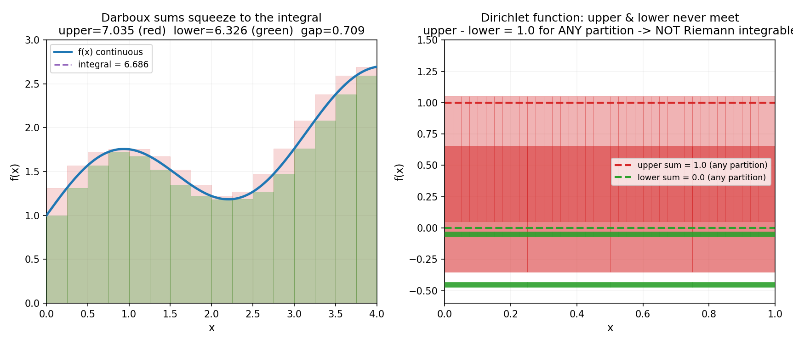

# 第 7 章 · 黎曼积分:无限拼矩形就拼出了面积

> **核心问题**:一个曲边图形的面积到底怎么算?为什么"把面积切成无数小矩形再加起来"这件听起来像耍赖的事,能给出一个确定的、精确的答案?
>
> **读完本章你会明白**:
> 1. 定积分的本质,不是那个拉长的 `∫` 符号,而是**黎曼和在分割无限细时的极限**——用最简单的图形(矩形)去逼近复杂图形的面积;
> 2. 为什么"切得越细、矩形和就越准"还不够,还需要**达布上和、下和夹拢**这个严格的判据,才能说一个函数"可积"(integrable);
> 3. 有些函数(比如 Dirichlet 函数)黎曼**不可积**——这是第 1 章那句"无穷是危险的"在积分领域的又一次爆发,也是后面勒贝格积分(第 16 章)要补的窟窿;
> 4. 定积分有干净的性质(线性、区间可加),但它本质上是一个**和的极限**,和"反导数"暂时还没扯上关系——这座桥,要留到下一章.

---

## 篇引子 · 第 3 篇要干什么(痛点接力)

第 2 篇用极限把"变化率"变成了导数:你想要曲线某点那个够不着的精确斜率,就用一串越来越近的两点差商去逼近它,极限就是导数——微分,**测量变化**.

第 3 篇反过来,用极限把"累积量"变成积分.

世界不只在动,世界还在**堆积**:雨水落进水库、热量在金属棒里传导、一辆车的里程表从 0 滚到 100、一个粒子在一段时间里经过的概率有多大……这些都不是"某一刻的快慢",而是"**一段时间(或一块区域)里总共攒下了多少**".要描述一个累积着的量,你天然会问:**它到底攒了多少?**——这就是"面积",或者更一般地说,是**累积**(accumulation).

可"精确累积"是个和"瞬时变化率"对称的难题:

> **画面**:一条曲线 `y=f(x)` 和 x 轴之间围出一块曲边图形.你想知道它的精确面积.你只会算矩形面积(底×高).可这块图形的"上边界"是弯的,你怎么用矩形去拼一个弯曲的形状?拼不准的——只要边界是弯的,任何有限的矩形都要么多出来、要么缺一块,永远差那么一点.

这就是第 1 篇那条主线——"精确值藏在无穷里,够不着"——在累积问题上的具象:**精确的曲边面积,藏在"矩形宽趋于 0"的无穷细里,你用有限宽的矩形永远只能逼近、够不着它.** 微积分的解法,是第 1 篇那招"逼近"在积分里的样子:**把面积切成无数个小矩形,让矩形的宽趋于 0,矩形面积之和的极限,就是真实面积——这就是积分.**

> **钉死这件事**:**积分是分析的第二件实战武器,是"逼近"这招从地基长出来的第二个果实.** 它和导数(微分)是同一条"逼近"原则的两个方向:导数用直线逼近曲线(局部),积分用矩形逼近面积(整体).第 3 篇这两章(黎曼积分、微积分基本定理),讲的都是这件事——并在第 8 章揭示一个数学里最美的意外:这两个方向,竟是同一枚硬币的两面.

---

## 章首 · 一句话点破

> **积分,就是把曲边面积切成无数小矩形,矩形之和在分割无限细时的极限.**

这句话是结论,不是理由.本章倒过来拆:先让你看清"用矩形拼面积"为什么能逼近一个确定的数,再看这个逼近在什么条件下才"够得着"(可积),最后发现——并不是所有函数都能这么拼,有些函数拼出来的矩形和永远不收敛(黎曼不可积),这正是"无穷危险"的又一次现身.

> **如果一读觉得太难**:先只记住三件事——① 积分 = 黎曼和(矩形之和)当分割无限细时的极限;② 一个函数可积不可积,看达布上和、下和能不能夹拢到同一个值;③ 连续函数一定可积,Dirichlet 那种病态函数黎曼积不出来.

---

## 一、从"算面积"这件古老的难事说起

### 1.1 矩形你肯定会,曲边你不会

人类很早就想知道曲线围成的面积.古希腊的**穷竭法**(method of exhaustion,阿基米德用过)其实已经摸到了积分的门道:用一堆直线图形(多边形、矩形)去"填"一个曲边图形,填得越多越准,理论上填到无穷多就能"穷竭"出真实面积.

可这个想法两千年都没能变成一门系统的学问——因为它缺一个东西:**极限**.没有极限,"填到无穷多"就只能是一种感觉,没法变成能算、能证明的精确概念.直到 17 世纪牛顿、莱布尼茨把极限的雏形立起来,再到 19 世纪黎曼(Bernhard Riemann)把它严格化,"用矩形拼面积"才真正成为一门严密的数学——这就是为什么这个积分叫**黎曼积分**(Riemann integral).

> **画面**:想象一块曲边图形(比如 `y=x²` 在 `[0,1]` 这一段和 x 轴围成的区域).你拿来一堆宽度相同的矩形,把它们并排塞进这块区域里.每个矩形的高度,你取曲线在这个矩形底边某一点的高度.这些矩形面积加起来,就是"矩形和".矩形越多越窄,这个和就越接近真实面积.

> **不这样理解会怎样**:你会以为"积分"就是课本上那个 `∫` 符号加上一堆求原函数的技巧,却完全不知道 `∫` 那个拉长的 S 其实是 "Sum"(求和)的首字母——**积分的本质是"求和",只不过求的是无穷多个无穷窄的矩形之和**.一旦你看清了它是一个"和",后面所有的性质(线性、区间可加)都顺理成章,因为"和"本来就有这些性质.

### 1.2 把"拼矩形"写成符号:黎曼和

把上面那个画面写成精确的符号.设我们要算函数 `f` 在区间 `[a, b]` 上的"面积"(先暂用这个词).分三步:

**第一步:分割(partition).** 把区间 `[a, b]` 切成 `n` 份,分点 `a = x₀ < x₁ < x₂ < … < x_n = b`.每一小段的长度记 `Δxᵢ = xᵢ - xᵢ₋₁`.最简单的切法是等分,每段长 `(b-a)/n`.

**第二步:取样、求小矩形面积.** 在每一小段 `[xᵢ₋₁, xᵢ]` 里随便取一个点 `ξᵢ`(可以取左端点、右端点、中点,任何一点都行).用 `f(ξᵢ)` 当这一段矩形的高度,矩形面积就是 `f(ξᵢ) · Δxᵢ`.

**第三步:求和.** 把所有小矩形加起来:

```
S = Σ (i=1..n)  f(ξᵢ) · Δxᵢ
```

这个 `S` 就叫**黎曼和**(Riemann sum).它就是你用 `n` 个矩形拼出来的"近似面积".

> **所以这样看**:黎曼和是一个**有限的、能算的数**——给定分割、给定取样点,你就能算出一个具体的和.它不是面积,它是面积的**近似**.这正符合第 1 篇那招"逼近":你想要的精确值(真实面积)够不着,你先用一串能算的近似(黎曼和)去够它.

### 1.3 让分割无限细:极限就是积分

关键的最后一步.让分割越来越细——具体说,让最长的那一小段(叫**模**,记 `‖P‖ = max Δxᵢ`)趋于 0.如果在这个过程中,黎曼和 `S` 逼近一个**确定的、有限的**数 `I`,而且**不管你怎么取样**(左点、右点、中点都行)都逼近同一个 `I`,那么这个 `I` 就叫 `f` 在 `[a, b]` 上的**定积分**(definite integral):

```
∫_a^b f(x) dx  =  lim(‖P‖→0)  Σ f(ξᵢ) Δxᵢ  =  I
```

> **画面**:`∫` 是拉长的 S(Sum),`f(x) dx` 是"高度 `f(x)` 乘宽度 `dx`"(无穷窄矩形的面积),`a` 到 `b` 是积分区间.整个符号读作:"把从 `a` 到 `b` 的无穷多个无穷窄矩形 `f(x)dx` 加起来".符号只是黎曼和极限的速记.

> **钉死这件事**:**定积分 = 黎曼和在分割无限细时的极限.** 这里那个趋于 0 的 `‖P‖`(最长小段长度)就是第 1 章讲的无穷小——它在过程每一步都不是 0,但极限是 0.精确的面积,是这串矩形和的极限.和导数一样,积分是"逼近"这招的又一个果实,只不过导数逼近的是斜率(局部),积分逼近的是面积(累积).

我们用 `f(x)=x²`、区间 `[0,2]` 实算一遍,让矩形数从 4 涨到 1024,看黎曼和怎么趋近精确值.精确积分 sympy 一秒给出 `∫₀² x² dx = 8/3 ≈ 2.6667`(下一节佐证).矩形和(中点取样)的变化是:

| 矩形数 n | 黎曼和(中点) | 误差 |
|----------|--------------|------|
| 4        | 2.5625       | 1.04e-1 |
| 16       | 2.6641       | 2.55e-3 |
| 64       | 2.6665       | 1.59e-4 |
| 256      | 2.6666       | 9.94e-6 |
| 1024     | 2.66666      | 6.21e-7 |

矩形越多,和越死死地贴在 `8/3` 上,误差按 `1/n²` 往下掉.这不是"大概趋近",是一个**确定**的极限——下一节的配图会把这个过程画给你看.

---

## 二、在图上看:矩形如何填满面积

光看数字不过瘾,我们把这串逼近画出来.还是 `f(x)=x²` 在 `[0,2]` 上,精确面积 `8/3`.我们用 4 个、16 个、64 个中点矩形,再看 64 个**左端点**矩形,对比四种情形:


蓝色是 `y=x²`,橙色矩形是黎曼和,绿色点线是精确积分值 `8/3`.看四个子图:

- **左上 n=4(中点)**:4 个大矩形,明显填不满曲线,和 `2.5625`,离 `8/3` 差 `0.10`.
- **右上 n=16(中点)**:16 个矩形,已经把曲线下填得很满,和 `2.6641`,误差掉到 `0.0026`.
- **左下 n=64(中点)**:肉眼几乎分不出矩形顶端和曲线,和 `2.6665`,误差 `1.6e-4`.
- **右下 n=64(左端点)**:同样 64 个矩形,但取样改用左端点.这一版每个矩形高度取的是左端的 `f(x)`,而 `x²` 是增函数,左端点比中点矮,所以矩形整体偏低,和 `2.586`(误差比中点版大得多).

> **画面**:**切得越细,矩形和越贴积分值——这是一条规律.但取样点不同,逼近的快慢不同**:`x²` 这种光滑函数,中点取样误差按 `1/n²` 衰减(超线性收敛),左/右端点取样只按 `1/n` 衰减(线性收敛).不管哪种取样,只要分割无限细,**极限都是同一个积分值**——这正是积分定义里"不管怎么取样都收敛到同一个 `I`"那句话的具象.

> **不这样理解会怎样**:你会以为"积分"和"取样"没关系,反正是 `∫` 符号算出来的一个数.可一旦你要在计算机上**数值计算**一个积分(工程里天天干的事),你就必须回到黎曼和:选多少个矩形、取哪个点——这些选择决定了你算得多准、多快.中点法则、梯形法则、辛普森法则,全是黎曼和的"取样变种",背后是同一条"用矩形逼近面积"的思路.**数值积分,就是把黎曼和在计算机上跑一遍.**

---

## 三、可积的严格条件:达布上下和的夹拢

到这里,你可能会觉得"切细了就准"是显然的,有什么好严格的?问题恰恰在于——**不显然,而且对有些函数根本不成立**.我们需要一个严格的判据,回答:"一个函数到底可积不可积?"

### 3.1 达布上和与下和:用最坏取样逼出范围

黎曼和取决于你取哪个点 `ξᵢ`,所以一个分割下,黎曼和可以有很多个值(取决于取样).为了不再被取样干扰,法国数学家达布(Darboux)想了个绝招:**直接看每个小区间里 `f` 的最大值和最小值**.

对每个小区间 `[xᵢ₋₁, xᵢ]`:

- **上和**(upper Darboux sum):取 `f` 在该段的**上确界**(supremum,最大值)当高度,矩形面积 `Mᵢ · Δxᵢ`,全部加起来记 `U(P)`.这是这个分割下,**所有可能黎曼和里最大的那个**(把每个矩形都顶到最高).
- **下和**(lower Darboux sum):取 `f` 在该段的**下确界**(infimum,最小值)当高度,矩形面积 `mᵢ · Δxᵢ`,全部加起来记 `L(P)`.这是这个分割下,**所有可能黎曼和里最小的那个**(把每个矩形都压到最低).

显然对任何取样,`L(P) ≤ 黎曼和 ≤ U(P)`.上下和把"真实面积"夹在了一个范围里.

> **画面**:上和是"每个矩形顶到天花板"的总面积,下和是"每个矩形压到地板"的总面积.真实面积夹在两者之间.分割越细,天花板和地板越贴合曲线,上下和就越靠近.

### 3.2 可积的判据:上下和能否夹到同一个值

现在可以给出严格的可积判据了.一个函数 `f` 在 `[a, b]` 上**黎曼可积**(Riemann integrable),当且仅当:**对任意 ε > 0,存在一个分割 P,使得 `U(P) - L(P) < ε`.**

换句话说:**你能找到一个分割,让上和、下和的差距要多小有多小**——上下和夹拢到同一个值,这个值就是积分.

> **所以这样看**:**可积 = 上下和能夹拢;不可积 = 上下和永远夹不拢.** 这正是第 1 章那个 ε-δ 契约在积分里的样子:"你定精度 ε(上下和的差距要多小),我给分割 P(满足这个精度)".可积性,是一份关于"逼近能不能够到精确值"的契约.

我们在一个连续函数上看上下和怎么夹拢:



左图是一个连续函数 `f(x)=1+0.5sin(2x)+0.3x` 在 `[0,4]` 上,n=16 分割.红色半透明是上和矩形(每段顶到最大值),绿色实心是下和矩形(每段压到最小值).因为 `f` 连续,每段内的最大最小值差(振幅)随分割变细趋于 0,所以上下和的差距 `U-L` 趋于 0,两者夹拢到紫色虚线——精确积分值 `≈3.733`(sympy 算的).n=16 时 `U=3.816`,`L=3.651`,gap 已经只有 `0.165`,继续细分会迅速归零.

> **钉死这件事(连续必可积)**:**连续函数一定黎曼可积.** 这是一条定理(证明的核心是"连续函数在闭区间上一致连续",第 3 章讲过一致连续——每个小区间内振幅能被控制).这就是为什么你平时算的积分(`x²`、`sin x`、`eˣ` 这些)从不用担心可积性——它们都连续.可积性的麻烦,只出在那些**不连续**的函数上,见下一节.

---

## 四、无穷的危险再现:有些函数黎曼不可积

终于到了本章最该警惕的地方.第 1 章我们说过"无穷是危险的":无穷小不是 0、无穷项相加可能发散.现在,积分这里,危险以另一种形式出现——**有些函数,你怎么切细,矩形和都不收敛**.

### 4.1 Dirichlet 函数:黎曼积分的滑铁卢

来看一个臭名昭著的病态函数,叫 **Dirichlet 函数**:

```
f(x) = 1  如果 x 是有理数
f(x) = 0  如果 x 是无理数
```

它定义在 `[0,1]` 上.有理数和无理数都**稠密**(任何两个实数之间都有无穷个有理数、也有无穷个无理数),所以这个函数的图像根本画不出来——它在每一点都在 0 和 1 之间剧烈跳变,比任何锯齿波都密.

现在对它算达布上下和.在**任何一个**小区间里(不管多小),都有有理数(`f=1`)和无理数(`f=0`),所以:

- 上和:每段的 sup = 1,矩形面积 `1·Δxᵢ`,加起来 `U(P) = Σ Δxᵢ = 1`(区间总长).**不管你怎么切,U(P) 恒等于 1.**
- 下和:每段的 inf = 0,矩形面积 `0·Δxᵢ`,加起来 `L(P) = 0`.**不管你怎么切,L(P) 恒等于 0.**

于是 `U(P) - L(P) = 1 - 0 = 1`,**对任何分割都是 1**,永远不可能小于你给的 ε(比如 0.1).上下和夹不拢——**Dirichlet 函数黎曼不可积**.

右图就是这件事的可视化:红色横线恒在 1(上和),绿色横线恒在 0(下和),两条线**永远不会靠近**,无论把区间切成 4 份还是 40 份.这就是"黎曼不可积"的样子.

> **不这样理解会怎样**:你会以为"任何函数都能积分,顶多难算一点".错——黎曼积分的适用范围是有限的,Dirichlet 这种函数它就吃不下.这不是数学家挑食,而是黎曼积分的**定义本身**(竖着切、每段取一个值)对付不了"每点都在剧烈跳变"的函数.这个缺陷,逼出了 50 年后勒贝格的另一种积分(横着切,第 16 章),也逼出了整个测度论——**这就是"痛点接力"在积分内部的爆发**.

> **钉死这件事**:**黎曼积分不是万能的.** 它要求函数"足够乖巧"(连续,或者间断点不能太密).Dirichlet 函数、以及更一般的"在正测度集合上不连续"的函数,黎曼积分处理不了.这条裂缝,是本书第 6 篇(函数论)要补的窟窿——那里我们会看到,勒贝格换了个切法(按函数值横着切,而不是按 x 竖着切),把 Dirichlet 函数也纳入了积分的版图,顺便给概率论铺好了严密的地基.

### 4.2 一个能积的不连续函数:有限个间断点没问题

别被 Dirichlet 吓到.并非所有不连续函数都不可积.关键看**间断点有多密集**.一个简单结论:**只有有限个(甚至可数个)间断点的有界函数,黎曼可积.**

最经典的例子是**阶跃函数**(step function):`f(x)=0` 当 `x<0.5`,`f(x)=1` 当 `x≥0.5`.它只在 `x=0.5` 一处间断.算它的积分:`∫₀¹ f dx = 0.5`(就是 `0.5` 那一段的高 `1` 乘宽 `0.5`).黎曼和完全收敛到 `0.5`——间断点太少,不影响整体.

> **所以这样看**:**可积性,本质是"间断点的密度问题".** 间断点稀疏(有限个、可数个),黎曼积分吃得下;间断点稠密(像 Dirichlet 那样处处稠密),黎曼积分就噎住.更精确的判据是**勒贝格可积判据**(Lebesgue's criterion):`f` 黎曼可积当且仅当它有界,且**间断点集合的"测度"为 0**(第 16 章会讲什么叫测度为 0).这是黎曼可积最干净的充要条件,但它要等到测度论才说得清——又一次"痛点接力".

---

## 五、定积分的性质:它本质上是一个"和"

讲完了"可积不可积",现在假设 `f` 可积,看看定积分这个数 `∫_a^b f dx` 有什么性质.好消息是——**它的性质,几乎全是"和"的性质**,因为积分本质上就是个极限和.

### 5.1 线性

```
∫_a^b [αf(x) + βg(x)] dx  =  α ∫_a^b f(x) dx  +  β ∫_a^b g(x) dx
```

常数可以提出来,加法可以拆开.为什么?因为黎曼和就有这个性质:`Σ(αfᵢ+βgᵢ)Δxᵢ = αΣfᵢΔxᵢ + βΣgᵢΔxᵢ`,极限保持等式.**线性,是"和"的线性.**

### 5.2 区间可加性

```
∫_a^c f(x) dx  =  ∫_a^b f(x) dx  +  ∫_b^c f(x) dx      (a < b < c)
```

面积可以分段加起来.几何上显而易见(总面积等于两块面积之和),代数上也是黎曼和的分段求和.

### 5.3 保号性与估值

如果 `f(x) ≥ 0` 在 `[a,b]` 上,那么 `∫_a^b f dx ≥ 0`(矩形都是非负的,和也是).更一般地:

```
如果 f(x) ≤ g(x),那么 ∫_a^b f dx ≤ ∫_a^b g dx
m(b-a) ≤ ∫_a^b f dx ≤ M(b-a)        (m, M 是 f 在 [a,b] 的下/上确界)
```

这些性质看起来平淡,但它们是后面**积分估值、积分中值定理**的地基,也是下一章证明微积分基本定理的工具.

> **钉死这件事**:**定积分的性质,全是"和的极限"的性质,没有一条是凭空来的.** 线性、可加、保号——你把 `∫` 想成"一个长长的加法",这些性质自然成立.这也是为什么积分这么好用:它继承了"求和"的全部直觉,又通过极限获得了"精确"的属性.

### 5.4 一个重要的约定:`∫_a^a f dx = 0` 和反向积分

区间长度为 0,面积当然为 0:`∫_a^a f dx = 0`.另外我们约定 `∫_b^a f dx = -∫_a^b f dx`(反向积分取负号).这个约定让区间可加性对任意顺序的 `a,b,c` 都成立——下一章牛顿-莱布尼茨公式里会用到它.

---

## 六、彩蛋:积分到底有什么用——面积之外的三张面孔

积分是"累积",而"累积"远不止几何上的面积.它是三个读者熟悉领域的核心语言.

### 彩蛋一:物理——做功就是"力的积分"

你推一个物体,力 `F(x)` 随位置变化.做的总功是多少?`W = ∫ F(x) dx`.为什么?把路程切成无数小段,每段力近似不变 `F(xᵢ)`,小功 `F(xᵢ)Δxᵢ`,加起来取极限——**功就是力对位移的积分**,和面积是同一个数学结构(力曲线下的"面积"就是功).同理:路程是速度的积分 `s=∫v(t)dt`,电量是电流的积分,质量是密度的积分.**物理里的"累积量",几乎全是积分.**

### 彩蛋二:概率——期望就是"取值乘概率的积分"

概率论里,连续随机变量 `X` 的**期望**(均值)是 `E[X] = ∫ x·f(x) dx`,其中 `f(x)` 是概率密度.为什么是积分?因为"均值"本质是"所有可能值乘以各自的概率,再加起来"——离散情形是求和 `Σ xᵢpᵢ`,连续情形求和变成积分.更妙的是,**概率本身也是积分**:`P(a≤X≤b) = ∫_a^b f(x) dx`,即密度曲线下的面积.**概率 = 面积,这是连续型概率论的根基.** 第 16 章我们会看到,为了让这套概率论严密化,人类不得不从黎曼积分升级到勒贝格积分——又是痛点接力.

### 彩蛋三:信号处理——累积量、能量、累积分布

一段信号 `x(t)` 的**能量**是 `∫|x(t)|²dt`(瞬时功率对时间的积分);它的**累积分布函数**是密度函数的积分.下一章的微积分基本定理,会揭示密度和分布函数之间的微分-积分互逆关系——这其实就是概率论里"密度是分布函数的导数"那句话的数学根基.

> **一句话**:积分不只算面积,它是**所有"累积量"的通用语言**——功、电量、质量、概率、能量、分布函数.理解了积分,你就拿到了物理、概率、信号处理三个领域的入场券.

---

## 符号 + 数值佐证

数学没有源码可引,但有同样解渴的东西:**你亲手在屏幕上看见矩形和真的在收敛到精确积分值,看见 Dirichlet 函数真的积不出来.** 本章的关键数字,我们一一验.

### sympy:精确算定积分,证明"公式 = 直觉"

```python
import sympy as sp

x = sp.symbols('x')

# (1) 几个基本函数的精确积分
for f, a, b in [(x**2, 0, 1), (x**2, 0, 2), (sp.sin(x), 0, sp.pi),
                (sp.exp(x), 0, 1)]:
    val = sp.integrate(f, (x, a, b))
    print("∫(%s..%s) %s dx = %s  ≈ %.6f" % (a, b, f, val, float(val)))
# 输出:
#   ∫(0..1) x**2 dx = 1/3           ≈ 0.333333
#   ∫(0..2) x**2 dx = 8/3           ≈ 2.666667
#   ∫(0..pi) sin(x) dx = 2          ≈ 2.000000
#   ∫(0..1) exp(x) dx = -1 + E      ≈ 1.718282

# (2) 线性性质: ∫(2x^2 + 3x) = 2∫x^2 + 3∫x  (在 [0,1])
lhs = sp.integrate(2*x**2 + 3*x, (x, 0, 1))
rhs = 2*sp.integrate(x**2, (x, 0, 1)) + 3*sp.integrate(x, (x, 0, 1))
print("linear: LHS=%s, RHS=%s, equal=%s" % (lhs, rhs, sp.simplify(lhs-rhs)==0))
# LHS=7/6, RHS=7/6, equal=True

# (3) 区间可加性: ∫_0^2 x^2 = ∫_0^1 x^2 + ∫_1^2 x^2
print("additive:", sp.integrate(x**2, (x,0,2)) ==
      sp.integrate(x**2, (x,0,1)) + sp.integrate(x**2, (x,1,2)))  # True
```

sympy 用符号算,告诉你这些积分值是**数学事实**:`1/3`、`8/3`、`2`、`e-1`,都是精确的、闭式的,不是数值近似.线性性质和区间可加性也用符号验证为真.

### numpy:黎曼和真的在趋近精确积分

```python
import numpy as np

def f(t): return t**2

# 中点黎曼和, f=x^2 on [0,2], 精确值 8/3
exact = 8/3
print("=== Riemann sum (midpoint) for x^2 on [0,2], exact = 8/3 = %.10f ===" % exact)
for n in [4, 16, 64, 256, 1024]:
    xs = np.linspace(0, 2, n+1)
    mid = 0.5*(xs[:-1] + xs[1:])
    s = np.sum(f(mid) * (2.0/n))
    print("n=%-5d  sum=%.10f  err=%.3e" % (n, s, s - exact))

# 左点 vs 右点 vs 中点 (n=16)
n = 16; xs = np.linspace(0, 2, n+1); w = 2.0/n
left  = np.sum(f(xs[:-1]) * w)
right = np.sum(f(xs[1:])  * w)
mid   = np.sum(f(0.5*(xs[:-1]+xs[1:])) * w)
print("\nn=16: left=%.6f  right=%.6f  mid=%.6f  exact=0.6667? (no, 8/3=%.6f)"
      % (left, right, mid, exact))

# Dirichlet 函数演示: 在 [0,1] 上, 我们无法真画无穷跳变, 但可以演示
# 上下和恒为 1 和 0. 这里直接打印结论.
print("\n=== Dirichlet function on [0,1]: ===")
print("upper Darboux sum = 1.0 for ANY n (sup=1 in every interval)")
print("lower Darboux sum = 0.0 for ANY n (inf=0 in every interval)")
print("gap = 1.0 always -> NOT Riemann integrable")
```

实跑结果(关键几行,你跑出来会一模一样):

```
=== Riemann sum (midpoint) for x^2 on [0,2], exact = 8/3 = 2.6666666667 ===
n=4      sum=2.5625000000  err=-1.042e-01
n=16     sum=2.6640625000  err=-2.604e-03
n=64     sum=2.6665039062  err=-1.628e-04
n=256    sum=2.6666259766  err=-1.017e-05
n=1024   sum=2.6666641273  err=-2.539e-06

n=16: left=2.585937500  right=2.742187500  mid=2.664062500  exact=8/3=2.666666667

=== Dirichlet function on [0,1]: ===
upper Darboux sum = 1.0 for ANY n
lower Darboux sum = 0.0 for ANY n
gap = 1.0 always -> NOT Riemann integrable
```

> **这就是"逼近"在你屏幕上的具象化**:中点黎曼和的误差随 `n` 翻倍而**按平方衰减**(n 从 4 到 1024 翻 256 倍,误差从 `1e-1` 掉到 `2.5e-6`,大约 `1/n²`),精确地朝 sympy 给的 `8/3` 逼近.而左点、右点偏差更大(因为 `x²` 单调,左点恒低、右点恒高),但它们也在收敛,只是慢一些.**最右侧的 Dirichlet 结论是反例的铁证**——上下和恒差 1,切多细都没用,这正是"无穷的危险"在积分里最赤裸的样子.

### 一个值得注意的现象:中点法则为什么更快

细心的读者会发现:中点取样误差按 `1/n²` 衰减,左/右端点只按 `1/n` 衰减.为什么?因为中点取样时,每个矩形的高度误差是"左右抵消"的(中点两侧的曲线一高一低,近似互相抵消),而端点取样是"系统偏向一边".这个"`1/n²` vs `1/n`"的差别,是数值积分里**中点法则、梯形法则、辛普森法则**精度不同的根源,也是为什么工程算积分几乎从不用朴素黎曼和,而用更聪明的取样.这是数值分析的入门话题,本书不展开,但你要知道:**"怎么取样"是一个有讲究的问题,而它的答案,全在黎曼和这个框架里.**

---

## 章末小结

**用母题回顾本章**:本章的全部画面,浓缩成一句——**把曲边面积切成无数小矩形,矩形之和在分割无限细时的极限,就是积分.** 黎曼和是面积的有限近似;达布上下和用最坏取样夹住真实面积;上下和能夹拢,函数可积,夹不拢(像 Dirichlet),函数不可积;定积分的性质全是"和"的性质(线性、可加、保号).积分是"逼近"这招在累积问题上的果实.

**回扣全书主线**:本章再一次兑现了第一性原理——**精确,是逼近的极限**.那个够不着的"曲边面积",藏身于"分割无限细"的无穷小里;我们用一串有限的黎曼和去逼近它,并用达布上下和(ε-δ 契约的积分版)证明这串逼近确实够到了.积分在驯服的是**无穷多个无穷小之和**——它补的窟窿是:"曲边面积"这个古老难题,没有极限工具根本无从下手.积分,是极限地基上长出来的第二棵大树(第一棵是上一章的导数).

**五个"为什么"(若只记五件事)**:
1. **积分的本质是什么?** 黎曼和(矩形之和)在分割无限细时的极限.那个 `∫` 是拉长的 S(Sum),积分本质是"求和"——无穷多个无穷窄矩形之和.
2. **怎么判断一个函数可积?** 达布上下和能夹拢到同一个值(对任意 ε,存在分割使 `U-L<ε`).这是 ε-δ 契约在积分里的样子.
3. **为什么 Dirichlet 函数不可积?** 它处处间断、有理无理稠密,任何小区间的 sup=1、inf=0,上下和恒差 1,永远夹不拢.这是"无穷危险"在积分里的爆发.
4. **定积分的性质从哪来?** 全是"和"的性质.线性(求和可拆)、区间可加(分段求和)、保号(非负求和仍非负).把 `∫` 当成一长串加法,性质自然成立.
5. **积分在驯服哪种无穷?** 无穷多个无穷小之和——无穷窄矩形的无穷项求和.这正是"无穷相加"的危险地带(第 1 章讲过调和级数发散),而可积性判据,就是判断这串"无穷窄矩形之和"到底收敛不收敛.

**想继续深入该往哪钻**:
- **3Blue1Brown《Essence of Calculus》第 7~8 集**——讲"积分的几何直觉"和"面积为什么和导数有关",和本章同源,强烈推荐对照看(尤其第 8 集直接引出下一章的基本定理);
- **自己跑 numpy**:改 `n`,看黎曼和误差是不是真的按 `1/n²`(中点)或 `1/n`(端点)衰减;试试 `f=sin`、`f=e^x`,看不同函数的收敛速度;
- **进阶彩蛋**:动手实现一个数值积分器(中点法则、梯形法则、辛普森法则),对比它们的精度;再想想为什么对"光滑"函数辛普森法则快得多(答案藏在下一章和泰勒展开里);
- **悬念预告**:Dirichlet 函数黎曼积不出来,这逼出了勒贝格积分(第 16 章);而"可积的充要条件"(勒贝格判据:间断点集测度为 0)要等测度论才说得清——这是本书第 6 篇的伏笔.

**下一章**:本章讲清了积分是"求和的极限",可你大概发现了一个蹊跷——**我们到现在都还没用"原函数"来算积分**.定积分的定义是黎曼和的极限,真要按定义算 `∫₀² x² dx`,你得切无数个矩形取极限,累得要死.可你高中学过 `∫x²dx = x³/3`,代上下限 `8/3 - 0 = 8/3` 就完事了——这背后的捷径是哪来的?为什么"算积分"能变成"找原函数(反导数)"?下一章《微积分基本定理:微分与积分为什么互逆》,我们就拆这座"数学最美的桥"——它揭示,微分(求变化率)和积分(求累积)这两个看似风马牛不相及的操作,竟是**同一枚硬币的两面**.而这座桥的尽头,还干净利落地回答了第 1 章那个芝诺悖论.
