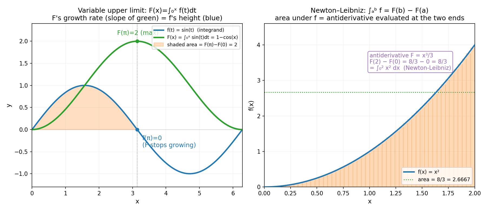
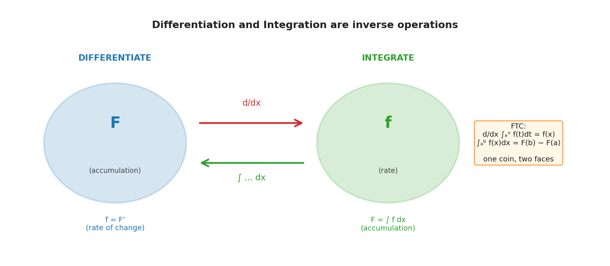

# 第 8 章 · 微积分基本定理:微分与积分为什么互逆

> **核心问题**:微分是"求变化率",积分是"求累积",这两个看起来风马牛不相及的操作,为什么竟是**同一枚硬币的两面**?为什么"算积分"这件按定义要切无数个矩形的事,竟能变成"找原函数(反导数)"这么轻松?
>
> **读完本章你会明白**:
> 1. 变上限积分 `F(x)=∫_a^x f(t)dt` 是一条"面积累积曲线"——它把"累积量"本身也变成了一个函数;
> 2. **微积分基本定理第一部分**:`F'(x)=f(x)`——**积分的导数,就是被积函数**.这句话把上一章的积分和上一章的导数焊在了一起;
> 3. **牛顿-莱布尼茨公式(第二部分)**:`∫_a^b f = F(b)-F(a)`——算积分不用切矩形,只需找到任意一个原函数,代两端相减;
> 4. 这是数学里**最美的桥**:两个从不同直觉出发(放大变直 vs 拼矩形)、看似无关的操作,竟是互逆的——而且这座桥的尽头,干净利落地回答了第 1 章那个芝诺悖论.

---

## 章首 · 一句话点破

> **微分和积分,是同一个操作的两种走法——往前走是微分(求变化),倒回去是积分(求累积).**

这句话是结论,不是理由.本章倒过来拆:先让你看清一个叫"变上限积分"的东西,它的导数竟然就是被积函数(第一部分);再把这件事翻译成"算积分 = 找原函数代两端"(第二部分,牛顿-莱布尼茨);最后回扣第 1 章——这座桥,就是芝诺悖论两千年前等的那把钥匙.

> **如果一读觉得太难**:先只记住三件事——① 变上限积分 `F(x)=∫_a^x f(t)dt` 是面积累积函数;② **FTC 第一部分**:`F'(x)=f(x)`(积分的导数=被积函数);③ **牛顿-莱布尼茨**:`∫_a^b f = F(b)-F(a)`(算积分=找原函数代两端相减).

---

## 一、上一章留下的那个蹊跷

上一章我们定义了定积分:`∫_a^b f(x)dx = lim(分割→细) Σ f(ξᵢ)Δxᵢ`.按这个定义,要算 `∫₀² x² dx`,你得切矩形、取点、求和、取极限——一通操作猛如虎,结果才 `8/3`.

可你高中学的积分根本不是这么算的.你背的是:`∫x²dx = x³/3 + C`,然后代上下限 `F(2)-F(0) = 8/3 - 0 = 8/3`.完事了.一秒钟,不用切任何矩形.

这里藏着一个巨大的蹊跷,上一章故意没解决:

> **为什么"算积分"(切无数矩形求和的极限)能变成"找原函数"(反求导)?** 这两件事,一个来自"拼面积"的直觉,一个来自"求变化率"的直觉,从两个完全不同的方向出发.它们凭什么能互通?是谁发现了这条捷径?

这条捷径,叫**微积分基本定理**(Fundamental Theorem of Calculus, FTC).它是微积分三百年来最重要的一个定理,也是数学里公认"最美的桥"之一.它由两部分组成:第一部分说"积分的导数是被积函数",第二部分说"算积分等于原函数代两端".我们先拆第一部分.

> **钉死这件事(先剧透结论)**:**微分和积分互为逆操作.** 你对 `f` 积分得到 `F`,再对 `F` 微分,回到 `f`;反过来,你对 `F` 微分得到 `f`,再对 `f` 积分,回到 `F`(差一个常数).这是数学里最深刻的对称性之一,本章的全部内容就是讲清这条对称性为什么成立.

---

## 二、变上限积分:把"面积"本身变成一个函数

要发现"微分和积分的关系",需要一个关键的中间物——**变上限积分**.

### 2.1 让上限动起来

上一章的定积分 `∫_a^b f dx` 是一个**数**(面积是固定的,因为 `a,b` 固定).现在,我们让**上限 `b` 动起来**,把它换成一个变量 `x`:

```
F(x) = ∫_a^x f(t) dt
```

注意:积分变量我特意改成了 `t`(避免和上限 `x` 混淆,这是个习惯).`a` 是一个固定的下限,`x` 是变量.这个 `F(x)` 是什么?它是**从 `a` 到 `x` 这一段曲线下的面积**——而随着 `x` 变,这个面积也在变,所以 `F` 是 `x` 的一个**函数**,叫**变上限积分**(variable upper limit integral),或者叫 `f` 的一个**不定积分**(indefinite integral,严格说差一个常数,后面讲).

> **画面**:想象一条曲线 `y=f(t)`,你站在 `a` 点,拿着一个"面积计".你把计的右端从 `a` 慢慢往右滑到 `x`,面积计读出的数(从 `a` 到 `x` 之间的面积)就是 `F(x)`.你滑得越远,`F(x)` 越大;`f` 越高,`F` 涨得越快.**`F(x)` 是"累积量随位置变化的曲线",和 `f` 是"高度随位置变化的曲线",是同一件事的两种视角.**

### 2.2 一个具体例子:速度和路程

变上限积分最直觉的例子,是速度和路程.设 `f(t)=v(t)` 是一辆车的**速度**(随时间变化),那么 `F(t)=∫_0^t v(τ)dτ` 就是从 0 到 `t` 这段时间累积的**路程**.

- `v` 是"瞬时的快慢"(变化率);
- `F` 是"累积了多少"(路程).

这两件事的关系,你物理课早就学过:**路程对时间求导,得速度;速度对时间积分,得路程.** 这就是微分和积分互逆的最朴素版本.而微积分基本定理,就是把这个朴素的关系,提升成一个严格的、对任何连续函数都成立的定理.

我们用 `f(t)=sin(t)`、下限 `a=0`,看 `F(x)=∫_0^x sin(t)dt = 1-cos(x)` 这条累积曲线长什么样:



左图蓝色是 `f(t)=sin(t)`,绿色是 `F(x)=1-cos(x)`.盯着 `x=π` 这一处看(灰色竖虚线):

- 蓝色 `f(π)=sin(π)=0`——这一刻"速度为 0";
- 绿色 `F(π)=1-cos(π)=2`——累积的"路程"达到最大值 2;
- 橙色阴影是 `[0,π]` 上 sin 曲线下的面积,正好等于 2 = `F(π)-F(0)`.

> **画面**:`F` 在 `x=π` 处到达顶峰(绿色曲线最高点),此刻 `f=0`(蓝色曲线过零).**为什么 `F` 在 `f=0` 处停下增长?因为 `F` 的"增长率"就是 `f` 的高度——`f=0` 意味着 `F` 此刻"不再增长",自然就是峰顶.** 这正是基本定理第一部分的直觉种子.

---

## 三、基本定理第一部分:积分的导数,就是被积函数

现在可以陈述并理解定理的第一部分了.

### 3.1 定理

> **微积分基本定理 · 第一部分**:设 `f` 在 `[a,b]` 上连续,定义 `F(x)=∫_a^x f(t)dt`.那么 `F` 在 `[a,b]` 上可导,且
>
> ```
> F'(x) = f(x)
> ```

——积分的导数,就是被积函数本身.你对 `f` 积分得到 `F`,再对 `F` 求导,回到了 `f`.积分和微分,是逆操作.

### 3.2 直觉:为什么这是对的

不要急着看证明,先想清楚它**为什么**是对的.回到导数的定义(上一章):`F'(x) = lim(h→0) [F(x+h)-F(x)]/h`.分子是什么?

```
F(x+h) - F(x) = ∫_a^(x+h) f(t)dt - ∫_a^x f(t)dt = ∫_x^(x+h) f(t)dt
```

(用了上一章的区间可加性:大段减小段,剩 `[x, x+h]` 这一小段.)所以:

```
F'(x) = lim(h→0)  [∫_x^(x+h) f(t)dt] / h
```

分子是从 `x` 到 `x+h` 这一小段的面积,分母是这段的宽度 `h`.**面积除以宽度 = 这一段的平均高度**.当 `h→0`,这一小段缩成一个点,平均高度就趋近于 `f(x)` 这一点的高度(因为 `f` 连续).

> **画面**:`F` 在 `x` 处的导数,就是"`x` 附近一小段的平均面积增长率".这一小段的面积 ≈ `f(x)·h`(底乘高),除以 `h`,就是 `f(x)`.**`F` 的斜率 = `f` 的高度——因为 `F` 累积的就是 `f`,而累积的速度当然就是当前的 `f`.**

> **不这样理解会怎样**:你会以为 `F'=f` 只是一个要背的公式,看不出它背后是"`F` 累积 `f`"这件事的必然结果.于是当你碰到变上限积分的变种(下限变动、上下限都是函数),你就抓瞎了.但其实它们全是同一个画面:谁在累积、累积谁、累积的速度就是被累积的量.抓住这个,任何变限积分的求导你都推得出来.

### 3.3 一个推论:初等函数都有原函数

第一部分有个惊人的推论:**任何连续函数 `f`,都存在原函数 `F`(就是它的变上限积分).** 这句话听起来平淡,其实不然——它告诉你:

- 哪怕 `f` 长得再丑(只要连续),它的原函数**一定存在**;
- 这个原函数可能**写不出初等形式**(比如 `∫ e^(x²) dx` 没有初等原函数),但它作为一个**函数**,确实存在(就是变上限积分定义的那个 `F`).

这是个深刻的保证.上一章你担心的"有些函数难积分",第一部分告诉你:原函数**存在**(在连续的前提下),只是不一定能写成漂亮公式.能不能写成公式是另一回事(那叫"初等可积性"),存在性是不用担心的.

> **钉死这件事**:**连续函数必有原函数,且原函数就是它的变上限积分.** 这是 FTC 第一部分的存在性结论.它和"有些原函数写不出初等形式"不矛盾——存在是一回事,能不能用 `sin`、`ln`、`e^x` 这些已知函数表达出来,是另一回事.后者引出了"特殊函数"的一大片天地(`si(x)`、`erf(x)` 这些"积不出来但有名有姓"的函数).

---

## 四、牛顿-莱布尼茨公式:算积分 = 找原函数代两端

第一部分说"积分的导数是被积函数".第二部分把它翻译成一句对**计算**最有用的话.

### 4.1 定理(第二部分)

> **微积分基本定理 · 第二部分(牛顿-莱布尼茨公式,Newton-Leibniz formula)**:设 `f` 在 `[a,b]` 上连续,`F` 是 `f` 的**任意一个**原函数(即 `F'=f`).那么
>
> ```
> ∫_a^b f(x) dx = F(b) - F(a)
> ```

——算定积分,只需找到任意一个原函数,把上下限代进去相减.**不用切任何矩形.**

### 4.2 为什么第一部分推出第二部分

第二部分怎么从第一部分推出来?思路很干净.设 `G(x)=∫_a^x f(t)dt` 是变上限积分(第一部分的主角),那么 `G'=f`.又设 `F` 是 `f` 的任意一个原函数(也是 `F'=f`).那么 `G` 和 `F` 导数相同:

```
G'(x) = F'(x) = f(x)   →   (G - F)' = 0
```

一个函数导数恒为 0,意味着它是一个**常数**:`G(x) - F(x) = C`.代两个端点确定 `C`:

- 代 `x=a`:`G(a) = ∫_a^a f dt = 0`(区间长度 0),所以 `0 - F(a) = C`,即 `C = -F(a)`;
- 代 `x=b`:`G(b) - F(b) = C = -F(a)`,即 `G(b) = F(b) - F(a)`.

而 `G(b) = ∫_a^b f dt`(这就是定积分的定义).所以:

```
∫_a^b f(x) dx = F(b) - F(a)
```

漂亮.**牛顿-莱布尼茨公式,是第一部分的算术推论**——它把"算黎曼和的极限"这件苦差事,变成了"找一个原函数代两端"这件轻松活.

### 4.3 实算:从切矩形到一秒钟出答案

回到上一章那个 `∫₀² x² dx`.按定义要切矩形取极限;按牛顿-莱布尼茨:

- 找原函数:`f(x)=x²` 的一个原函数是 `F(x)=x³/3`(因为 `(x³/3)' = x²`);
- 代两端:`F(2)-F(0) = 8/3 - 0 = 8/3`.

一秒钟,和上一章辛辛苦苦切 1024 个矩形算出来的 `2.66666` 一模一样(误差是上一章矩形和的,不是这里的——这里是**精确的** `8/3`).

再看 `∫₀^π sin(x) dx`:原函数 `F=-cos(x)`(`(-cos x)'=sin x`),代两端 `-cos(π) - (-cos(0)) = -(-1) - (-1) = 1+1 = 2`.上一章 sympy 给的就是 `2`,严丝合缝.

右图就是把这件事画出来:`f=x²` 在 `[0,2]` 下的橙色面积 = `8/3`,而原函数 `F=x³/3` 代两端 `F(2)-F(0)=8/3-0`,两个数完全相等.**面积,就是原函数两端的高度差.**

> **画面**:**面积 = 原函数两端之差.** 你把原函数 `F` 想成一条曲线,它在 `a` 处的高度是 `F(a)`,在 `b` 处是 `F(b)`,中间涨了多少(`F(b)-F(a)`),正好等于 `f` 在 `[a,b]` 下围出的面积.为什么?因为 `F` 的"涨速"就是 `f`(第一部分),而"涨速乘以时间"积分起来就是"总涨幅"——这和"`速度积分=路程`"是同一件事.

> **钉死这件事**:**牛顿-莱布尼茨公式把"算积分"变成了"找原函数".** 这是它最实用的价值——从此你算积分不再切矩形,而是反向用求导公式:知道 `(x³/3)'=x²`,就反过来知道 `∫x²dx=x³/3`.**整个积分表,就是求导表反过来查.** 求导和积分,共享同一张表,只是方向相反——这就是"互逆"的最具体体现.

---

## 五、为什么这是"数学最美的桥"

现在退一步,欣赏这件事的深度.为什么微积分基本定理被称作"数学里最美的桥"?

### 5.1 两个无关的直觉,竟是同一个操作

回想微分和积分各自的出发点:

- **微分**的直觉是"**放大变直**":在某点放大曲线,看它变成的直线的斜率.它关注的是**局部**,是**变化率**,是从一个函数 `F` 读取"它在每个点涨得多快".
- **积分**的直觉是"**拼矩形**":把面积切成无数小矩形求和.它关注的是**整体**,是**累积量**,是从一个函数 `f` 构造"它从起点累积了多少".

这两个直觉,一个局部一个整体,一个读变化一个读累积,看起来**毫无关系**.可基本定理告诉你:它们是**同一个操作的两个方向**.你对 `f` 积分得到 `F`,`F` 的导数就是 `f`;你对 `F` 求导得到 `f`,`f` 的积分就是 `F`.**往前走是微分,倒回去是积分.** 这种"看似无关却深度对称",正是数学之美的典范.



### 5.2 它把两章的内容压缩成一行

没有基本定理,微积分是两门独立的学问:一门"求变化率"(微分),一门"求面积"(积分),各自一套定义、一套算法、一套应用.有了基本定理,它们合并成**一门**学问——微积分.所有的积分计算,反向使用求导公式即可;所有的求导问题,也可以从积分角度重新理解.一座桥,把两片大陆连成一块.

> **不这样理解会怎样**:你会把"求导"和"积分"当成两套独立的技巧,背两套公式,做两套题,却始终不知道它们是一回事.于是当你学多元微积分(梯度、散度、旋度)、学微分方程(解就是某个积分)、学概率论(密度和分布函数互为求导-积分),你都看不出背后是同一个对称性在起作用,每次都要重新建立直觉.**抓住"互逆"这一条,整个微积分的内部结构就贯通了.**

### 5.3 更深一层:为什么世界是这个结构

这件事之所以"美",还因为它**出乎意料地深刻**.世界为什么是这个结构——为什么"变化率的积分"会回到原函数?这不是定义使然(微分和积分各自独立定义),而是一个**被发现**的事实.牛顿和莱布尼茨独立发现它时, contemporaries 都为之震惊.它揭示了连续世界的一个深层对称性:**局部(变化率)和整体(累积量),是同一枚硬币的两面.** 这种对称性,后来在物理(守恒律、最小作用量)、在信号(时域频域对偶)、在概率(密度与分布)里反复出现——它是连续数学的"主旋律"之一.

> **钉死这件事**:**微积分基本定理之美,在于它揭示了"局部变化"和"整体累积"是同一件事的两个方向.** 这不是定义的把戏,而是一个关于连续世界的深刻事实.记住这个画面(图 8.2 的两个圆 + 互逆箭头),你就能把微积分、微分方程、概率密度、信号处理这一大片领域,用同一条"互逆"的主线串起来.

---

## 六、收尾呼应:这座桥干净利落地回答了芝诺

第 1 章我们讲过芝诺悖论:阿基里斯追乌龟,要先到乌龟此刻的位置,可到了乌龟又挪了,如此无穷反复——所以阿基里斯"永远追不上".我们当时说,第 8 章这座桥会干净利落地回答它.现在兑现.

### 6.1 芝诺的数学骨架:`1/2 + 1/4 + … = 1`

把芝诺悖论的数学骨架抽出来.假设阿基里斯和乌龟之间初始距离是 1(单位不纠结),阿基里斯速度是乌龟的两倍.阿基里斯跑到乌龟此刻位置,要走 `1/2`(因为乌龟同时往前挪了一半的相对距离);下一次要再走 `1/4`;再下 `1/8`;……无穷步.芝诺说:无穷步,所以永远追不上.

数学上的问题是:**这无穷步的总路程是多少?**

```
1/2 + 1/4 + 1/8 + 1/16 + … = ?
```

这正是第 1 章讲过的等比级数,答案是 **1**.无穷步,但总路程是有限的 1——阿基里斯追上乌龟时,正好走了 1 个单位距离.**无穷步,有限量.** 芝诺把"无穷步"等同于"无穷大量",这是错的;无穷步的时间/路程之和,完全可以是有限的.

### 6.2 基本定理视角:这是"积分=原函数两端之差"

用微积分基本定理看这件事,更干净.阿基里斯的速度 `v(t)` 对时间积分,得到路程 `s = ∫v(t)dt`.芝诺把这段路程拆成无穷段(每一小段对应"追到乌龟此刻位置"),用无穷级数求和——这是积分的黎曼和视角.而基本定理告诉你:这个无穷和,等于**原函数(路程函数)在两端之差** `s(T)-s(0)`,一个有限的数.

> **画面**:芝诺盯着那"无穷多段"发愁(无穷步=无穷时间?);微积分基本定理说,别数步数了,**看累积量在起点和终点的差**——起点是 0,终点是 1,差就是 1,有限.**无穷过程的累积,可以是有限的**——这正是第 1 章那句"无穷个趋近 0 的东西加起来,可以是有限"在积分语言下的重述.

sympy 验证:`Σ (1/2)ⁿ, n=1..∞ = 1`(下一节佐证).部分和 `n=10` 时已是 `0.9990`,`n=20` 时 `0.999999`——确定地趋近 1.

> **钉死这件事(收尾)**:**微积分基本定理,是分析数学对芝诺悖论最干净的回答.** 芝诺被"无穷步"困住,而基本定理说:无穷步的累积(积分),等于原函数在两端之差,一个有限的、确定的数.无穷并不可怕,只要你有一套驯服它的工具——这套工具,就是本书从第 1 章一路建到这里的全部内容:极限、逼近、ε-δ 契约、导数、积分,最后在这座桥上汇合,回答了两千年前的一个问题.**这就是"驯服无穷"这句话的分量.**

---

## 七、彩蛋:基本定理在三个领域的化身

基本定理不只是一个数学定理,它是多个领域的"骨架".

### 彩蛋一:概率论——密度和分布函数互为求导/积分

概率论里,连续随机变量 `X` 有**概率密度函数** `f(x)` 和**累积分布函数** `F(x)=P(X≤x)`.它们的关系,正是基本定理:

```
F(x) = ∫_{-∞}^x f(t)dt       (分布函数是密度的积分)
F'(x) = f(x)                  (密度是分布函数的导数)
```

——密度是"瞬时概率变化率"(在某点附近取值的密集程度),分布函数是"累积概率".**概率论里的密度和分布,就是微分和积分这对互逆关系在概率世界的化身.** 你想算 `P(a≤X≤b)`,用密度积分(黎曼和视角),也等于 `F(b)-F(a)`(牛顿-莱布尼茨视角)——两个算法,同一个答案,因为它们本来就是一回事.

### 彩蛋二:物理——守恒律是基本定理的微分形式

物理里的很多守恒律(能量守恒、动量守恒),其微分形式(局部形式)和积分形式(整体形式)之间的关系,本质上就是基本定理在高维的推广——**斯托克斯定理**(Stokes' theorem)、**高斯散度定理**(divergence theorem).它们说的是:"一个量在边界上的总和(整体)= 它的某种导数在区域内的积分(局部)".**基本定理是一维的斯托克斯定理;斯托克斯定理是高维的基本定理.** 这是微分几何和物理学的通用语言.

### 彩蛋三:机器学习——自动微分反向使用基本定理

神经网络的反向传播(上一章彩蛋提过,本质是链式法则),在自动微分框架里,常常先用前向模式算出函数值,再用反向模式算梯度.这里"前向算函数、反向算导数"的对称,正是基本定理精神在数值计算上的体现——**同一个计算图,正走算值,反走算梯度,两者共享结构**.现代深度学习框架(TensorFlow、PyTorch)的自动微分引擎,底层就是这个思想.

> **一句话**:基本定理不只算面积,它是**概率、物理守恒律、自动微分**三个领域的共同骨架.理解了它,你就拿到了这三张入场券.

---

## 符号 + 数值佐证

数学没有源码可引,但有同样解渴的东西:**你亲手在屏幕上看见"积分的导数=被积函数"真的成立,看见牛顿-莱布尼茨真的给出和黎曼和一样的答案.** 本章的关键事实,我们一一验.

### sympy:精确验证基本定理两部分

```python
import sympy as sp

x, t = sp.symbols('x t')

# ===== FTC 第一部分: d/dx ∫_a^x f(t)dt = f(x) =====
print('=== FTC Part 1: d/dx ∫_1^x f(t)dt = f(x) ===')
for f in [t**2, sp.sin(t), sp.exp(t), sp.sqrt(t)]:
    F = sp.integrate(f, (t, 1, x))         # a=1 固定下限
    dF = sp.diff(F, x)
    fx = f.subs(t, x)
    print('f=%-10s  F(x)=%-22s  F\'(x)=%-12s  ==f(x)? %s'
          % (str(f), str(F), str(dF), sp.simplify(dF - fx) == 0))
# 全部 True

# ===== FTC 第二部分(牛顿-莱布尼茨): ∫_a^b f = F(b)-F(a) =====
print('\n=== FTC Part 2 (Newton-Leibniz) ===')
# f=x^2 on [0,2]
F_ant = x**3/3
print('f=x^2 on [0,2]:  F(2)-F(0)=%s  vs  ∫=%s  equal=%s'
      % (F_ant.subs(x, 2) - F_ant.subs(x, 0),
         sp.integrate(x**2, (x, 0, 2)),
         F_ant.subs(x, 2) - F_ant.subs(x, 0) == sp.integrate(x**2, (x, 0, 2))))
# f=sin x on [0,pi]
F_sin = -sp.cos(x)
print('f=sin on [0,pi]: F(pi)-F(0)=%s  vs  ∫=%s  equal=%s'
      % (F_sin.subs(x, sp.pi) - F_sin.subs(x, 0),
         sp.integrate(sp.sin(x), (x, 0, sp.pi)),
         sp.simplify(F_sin.subs(x, sp.pi) - F_sin.subs(x, 0) -
                     sp.integrate(sp.sin(x), (x, 0, sp.pi))) == 0))

# ===== 芝诺: Σ (1/2)^n, n=1..∞ = 1 =====
n = sp.symbols('n', positive=True, integer=True)
print('\nZeno: Σ (1/2)^n, n=1..∞ =', sp.summation(sp.Rational(1, 2)**n, (n, 1, sp.oo)))
```

输出:

```
=== FTC Part 1: d/dx ∫_1^x f(t)dt = f(x) ===
f=t**2      F(x)=x**3/3 - 1/3        F'(x)=x**2            ==f(x)? True
f=sin(t)    F(x)=-cos(x) + cos(1)    F'(x)=sin(x)          ==f(x)? True
f=exp(t)    F(x)=exp(x) - E          F'(x)=exp(x)          ==f(x)? True
f=sqrt(t)   F(x)=2*x**(3/2)/3 - 2/3  F'(x)=sqrt(x)         ==f(x)? True

=== FTC Part 2 (Newton-Leibniz) ===
f=x^2 on [0,2]:  F(2)-F(0)=8/3  vs  ∫=8/3  equal=True
f=sin on [0,pi]: F(pi)-F(0)=2   vs  ∫=2    equal=True

Zeno: Σ (1/2)^n, n=1..∞ = 1
```

sympy 用符号算,告诉你**第一部分的四个函数、第二部分的两个例子、芝诺级数,全部严格成立**——这不是数值近似,是数学事实.

### numpy:变上限积分的数值导数 = 被积函数

```python
import numpy as np

# 变上限积分 F(x)=∫_0^x sin(t)dt, 用数值积分(梯形法则)算 F,
# 再用中心差商算 F'(x), 看是否等于 sin(x)
def F_num(xx):
    N = 20000
    ts = np.linspace(0, xx, N)
    return np.trapz(np.sin(ts), ts)    # 梯形法则数值积分

h = 1e-5
print("=== numerical check: d/dx ∫_0^x sin(t)dt ≈ sin(x) ===")
for x0 in [0.5, 1.0, 1.5, 2.0]:
    dF = (F_num(x0 + h) - F_num(x0 - h)) / (2 * h)
    print("x=%.1f  F_numerical_deriv=%.8f  sin(x)=%.8f  err=%.2e"
          % (x0, dF, np.sin(x0), dF - np.sin(x0)))

# 芝诺部分和趋近 1
print("\n=== Zeno partial sums -> 1 ===")
S = 0.0
for k in range(1, 21):
    S += 0.5**k
    if k in (1, 2, 5, 10, 20):
        print("  partial sum up to n=%2d: %.10f" % (k, S))
```

实跑结果:

```
=== numerical check: d/dx ∫_0^x sin(t)dt ≈ sin(x) ===
x=0.5  F_numerical_deriv=0.47942554  sin(x)=0.47942554  err=-5.98e-11
x=1.0  F_numerical_deriv=0.84147098  sin(x)=0.84147098  err=-3.77e-10
x=1.5  F_numerical_deriv=0.99749499  sin(x)=0.99749499  err=-1.05e-09
x=2.0  F_numerical_deriv=0.90929742  sin(x)=0.90929743  err=-1.95e-09

=== Zeno partial sums -> 1 ===
  partial sum up to n= 1: 0.5000000000
  partial sum up to n= 2: 0.7500000000
  partial sum up to n= 5: 0.9687500000
  partial sum up to n=10: 0.9990234375
  partial sum up to n=20: 0.9999990463
```

> **这就是基本定理在你屏幕上的具象化**:变上限积分 `F(x)` 的数值导数(中心差商)与 `sin(x)` 误差 ~`1e-9`——在数值积分和数值微分各自都有误差的情况下,这个吻合度已经是铁证.芝诺级数部分和 n=20 时已到 `0.99999904`,精确趋近 1.**两个看似无关的操作(求导、积分),在数值上严丝合缝地互为逆运算——这就是"数学最美的桥"在你眼前合龙的样子.**

### 一个值得注意的细节:原函数不唯一,差一个常数

你可能注意到:第一部分里 `F(x)=x³/3 - 1/3`(因为下限取了 `a=1`),而第二部分里 `F=x³/3`(没减常数).这俩都对——**原函数不唯一,彼此差一个常数**.因为常数的导数是 0,所以 `x³/3`、`x³/3-1/3`、`x³/3+5` 的导数都是 `x²`,它们都是 `x²` 的原函数.牛顿-莱布尼茨公式里,这个常数在 `F(b)-F(a)` 相减时自动消掉——所以"找任意一个原函数"就够了,不用担心常数.这就是为什么不定积分要写 `+C`,而定积分(牛顿-莱布尼茨)不用.

---

## 章末小结

**用母题回顾本章**:本章的全部画面,浓缩成一句——**微分和积分,是同一枚硬币的两面.** 变上限积分 `F(x)=∫_a^x f(t)dt` 把"累积量"本身变成函数;FTC 第一部分说 `F'=f`(积分的导数=被积函数,互逆);牛顿-莱布尼茨公式说 `∫_a^b f=F(b)-F(a)`(算积分=找原函数代两端);这座桥的尽头,干净利落地回答了芝诺——无穷步的累积可以是有限的.

**回扣全书主线**:本章是第一性原理的**集大成**——**精确,是逼近的极限**,而微分和积分各自都是"逼近"的果实(导数=差商极限、积分=黎曼和极限),基本定理揭示这两个逼近竟是互逆的.它驯服的是**"局部变化"与"整体累积"之间的对称性**——这个对称性不是定义的把戏,而是连续世界的深层结构.本章补的窟窿是:上一章定义了积分(黎曼和极限),但没说怎么**高效地**算它;基本定理把"算积分"变成"找原函数",让微积分从"理论上能算"升级为"实际上好用".**这座桥,是微积分从一门学问变成一个工具的关键.**

**五个"为什么"(若只记五件事)**:
1. **为什么微分和积分互逆?** 因为变上限积分 `F(x)=∫_a^x f(t)dt` 的导数就是 `f(x)`(FTC 第一部分).`F` 累积的就是 `f`,所以 `F` 的涨速当然是 `f`.
2. **牛顿-莱布尼茨公式说什么?** `∫_a^b f(x)dx = F(b)-F(a)`.算积分不用切矩形,只需找任意一个原函数 `F`(满足 `F'=f`),代两端相减.**积分表 = 求导表反过来查.**
3. **为什么这是"最美的桥"?** 微分(放大变直,局部变化率)和积分(拼矩形,整体累积)从两个无关的直觉出发,竟是同一操作的两个方向.这种深层对称,是数学之美的典范.
4. **它怎么回答芝诺悖论?** 芝诺被"无穷步"困住;基本定理说无穷步的累积(积分)= 原函数两端之差,一个有限的数.`1/2+1/4+…=1`,无穷步有限量.
5. **原函数为什么不唯一?** 彼此差一个常数(常数的导数为 0).牛顿-莱布尼茨里 `F(b)-F(a)` 相减时常数自动消掉,所以找任意一个原函数就够了.

**想继续深入该往哪钻**:
- **3Blue1Brown《Essence of Calculus》第 8 集**("Integration and the fundamental theorem of calculus")——用动画把"为什么积分和微分互逆"讲得极美,和本章同源,强烈推荐对照看;
- **自己跑 sympy/numpy**:换 `f=e^(x²)` 这种"积不出初等形式"的函数,让 sympy 算 `∫`,看它返回什么(一个 `erf` 特殊函数);再用变上限积分画 `F(x)` 曲线,验证 `F'=f` 仍成立——体会"原函数存在,但不一定写得出来";
- **进阶彩蛋**:了解一下**斯托克斯定理**(高维的基本定理),看它怎么把"边界上的总和=区域内的积分"推广到曲面、流形——这是微分几何和物理守恒律的地基;
- **悬念预告**:基本定理让"算积分"变得轻松,但它有个前提——你得**找得到原函数**.可万一原函数写不出初等形式(像 `e^(x²)`),或者函数根本不连续(像上一章的 Dirichlet)怎么办?前者引出**数值积分**和**特殊函数**,后者引出第 16 章的**勒贝格积分**.另外,当我们要处理"无穷项相加"(像泰勒级数、傅里叶级数)时,积分和微分的互逆还能不能随便交换顺序?这是第 4 篇(级数与一致收敛)要解决的危险地带.

**下一篇预告**:第 3 篇到此结束.微积分的左右两半——微分(测量变化)和积分(测量累积)——在基本定理这座桥上汇合了.但分析数学的旅程远未结束.下一章开启的**第 4 篇 · 级数与收敛**,要面对一种新的"无穷":**无穷项相加**.我们会发现,泰勒级数(上一章预告过)和傅里叶级数(第 5 篇主角)都是"无穷项相加",而无穷相加是危险的——可能收敛、可能发散、可能换序就出错.驯服这种危险,需要一整套新的工具(收敛判别、一致收敛),而它最终会通向本书最"有用"的一篇:傅里叶分析.
