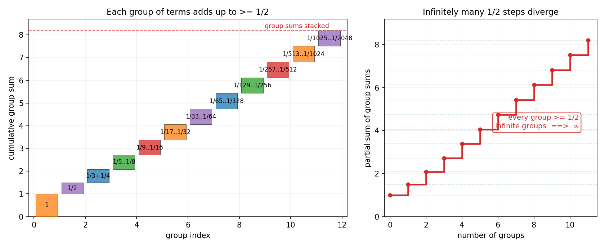
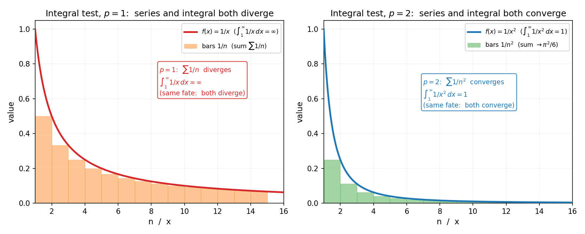
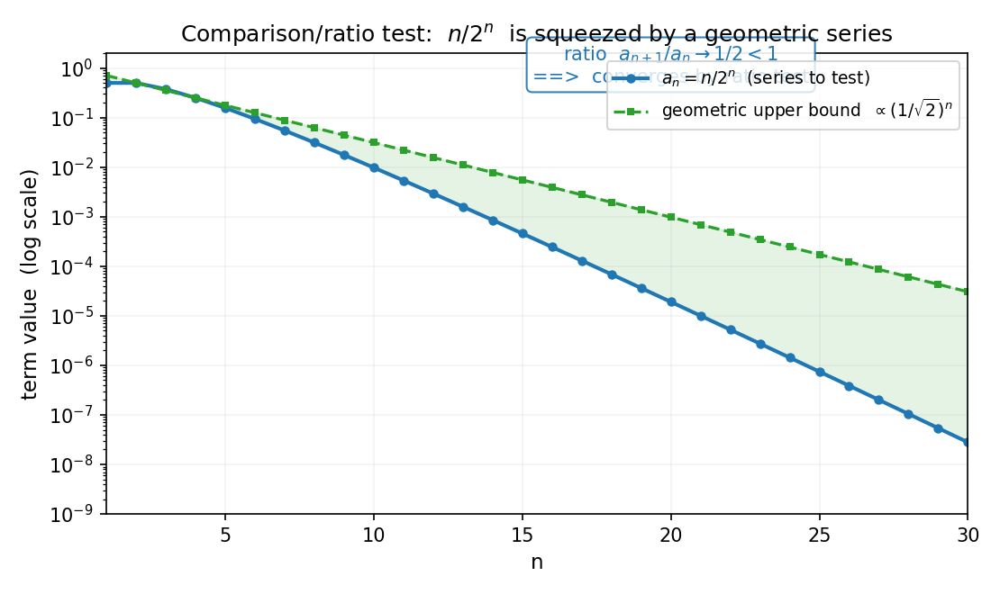
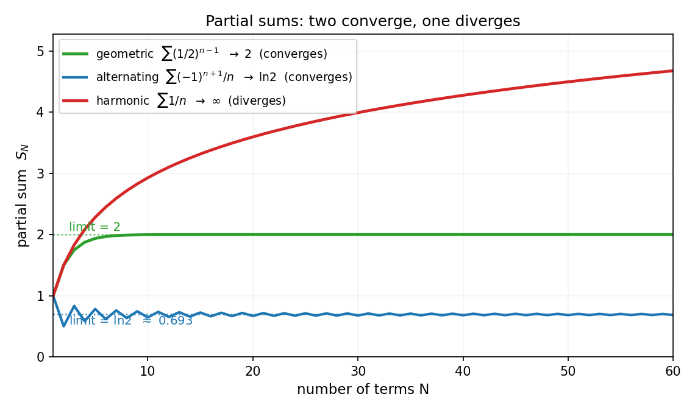
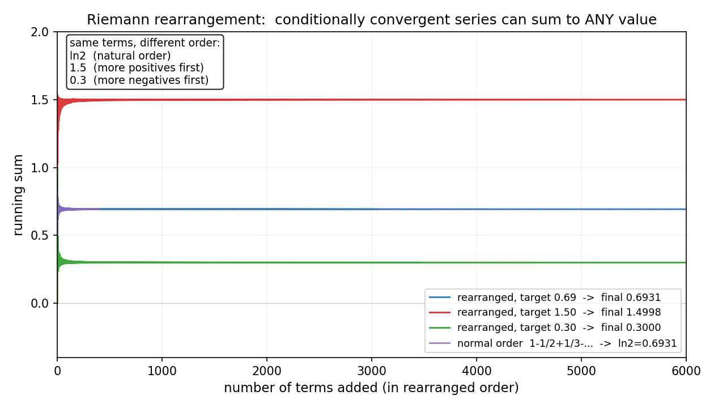

# 第 9 章 · 数值级数:无穷相加何时有意义

> **核心问题**:无穷项相加到底有没有意义?同样是无穷项、同样每一项都在变小,凭什么有的加出一个有限的数、有的加到无穷大?在动手加之前,我们有没有办法先判出它的结局?

> **读完本章你会明白**:
> 1. "无穷项相加"不是一次加法,而是一个**部分和数列的极限**——级数的命运,等价于"这串部分和有没有归宿";
> 2. 几何级数为什么是级数世界最关键的"标尺",而调和级数为什么是它最经典的"反例"(同样变小,却发散);
> 3. 比较判别、比值判别(d'Alembert)、根值判别(Cauchy)、交错级数判别(Leibniz)各自在**比较什么**、**凭什么能判**——它们都是把"未知级数"塞进"已知级数"的笼子里;
> 4. 绝对收敛与条件收敛的差别不是咬文嚼字,而是"无穷的危险"再次显形:同样一组数,换个加法顺序,和居然能变.

---

> **篇引子 · 痛点接力**
>
> 第 3 篇我们刚把"积分"拿下——黎曼积分的本质,是把一块曲边面积切成无数小矩形,矩形面积之和取极限.那里出现的 `Σ`(求和的极限)其实悄悄问了一个我们一直回避的问题:**无穷项相加到底有没有意义?**
>
> 第 0 章我们见过这场危险:`1 + 1/2 + 1/3 + …`(调和级数)和 `1 + 1/2 + 1/4 + …`(等比级数)长得那么像——都是无穷项、每一项都在变小——却一个发散到无穷、一个收敛到 2.当时我们画了张图,留下一句"判它需要一整套判别法".**第 4 篇,我们正式开始判它.**
>
> 而且本篇不止于此.判完"数相加"还不够,我们要继续追问:**如果无穷项相加的是函数(`Σfₙ(x)`),这堆函数加起来还是不是一个好函数?能不能逐项求导、逐项积分?** 这就逼出"一致收敛"——它正是第 5 篇傅里叶级数能不能用、敢不敢用的**命门**.最后落在"用无穷多项式逼近超越函数"(幂级数/泰勒级数),为第 6 篇复变函数搭好跳板.本篇是连接微积分、傅里叶、复变三块的桥梁.

---

> **如果一读觉得太难**:先只记住三件事——① 级数收敛 = 部分和数列有极限(回到第 1 章的 ε-N 契约);② 几何级数 `Σr^n`(r<1)是一切判别的"标尺",几乎所有判别法都靠"和它比大小";③ 调和级数发散,是无穷最经典的反例,看见 `1/n` 要警觉.

---

## 章首 · 一句话点破

> **无穷项相加不是加法,是一个数列的极限.能不能加,只问一件事:前 N 项之和,随着 N→∞,有没有一个有限的家可回?**

这句话是结论,不是理由.本章倒过来拆:先把"无穷相加"翻译回你早就认识的"数列极限"(第 1 章),再看几何级数为什么当标尺、调和级数为什么是叛徒,最后把人类发明的一整套判别术,一个个还原成"它到底在拿谁当标尺、夹住谁".

---

## 一、把"无穷相加"翻译回你已经懂的东西

### 1.1 部分和:无穷相加的真身是"一串有限和的极限"

教材一上来就写 `S = a₁ + a₂ + a₃ + …`,好像你在做一次无穷次的加法.**这是错觉.** 没有人能做无穷次加法.数学里 `Σ` 背后,永远藏着一个**取极限**的动作.

> **画面**:想象你在叠积木,但每一块的高度是 `aₙ`.你永远叠不完——块数是无穷.可问题是:这摞积木的**总高度**,会不会稳定下来?第 1 块高 `a₁`,前 2 块高 `a₁+a₂`,前 3 块高 `a₁+a₂+a₃`,…….你把这摞积木"叠到前 N 块"的高度记下来,得到一串数 `S₁, S₂, S₃, …`.这串数叫**部分和**(partial sum).**"无穷项相加"是不是一个有意义的数,只取决于一件事:这串部分和有没有极限.**

这就是级数(series)的正式定义:

> 给定数列 `a₁, a₂, a₃, …`,令 `S_N = a₁ + a₂ + … + a_N` 称为**第 N 个部分和**.若部分和数列 `{S_N}` 当 `N→∞` 时有极限 `S`(有限),则称级数 `Σaₙ` **收敛(converges)**,和为 `S`;否则称它**发散(diverges)**.

看清楚了吗:**级数收敛 ⟺ 部分和数列收敛**.这一句,就把"无穷相加"这件吓人的事,瞬间翻译回第 1 章你早就认识的东西——数列的极限.级数不是新物种,它只是数列极限换了一件 `Σ` 的外套.

> **不这样理解会怎样**:你会被那个省略号 `…` 骗住,以为级数是一个"无限大的和",于是陷入"无穷到底加到哪"的死结.真相是:**它从来不是一次加法,它是一串有限和的归宿.** 你不需要真的加无穷次,你只需要证明那串部分和有家可回——这就是第 1 章 ε-N 契约要干的事.

> **钉死这件事**:**级数 = 部分和数列的极限.** 一切关于级数的问题,第一反应都应该是:它的部分和数列长什么样?有极限吗?

### 1.2 几何级数:级数世界最重要的"标尺"

把上面这套定义用在最简单、也最重要的级数上:**几何级数**(geometric series)

$$ \sum_{n=0}^{\infty} r^n = 1 + r + r^2 + r^3 + \cdots $$

它的部分和有一个现成的闭式公式(高中你就背过):

$$ S_N = 1 + r + r^2 + \cdots + r^N = \frac{1 - r^{N+1}}{1 - r} \quad (r \neq 1) $$

现在问:`N→∞` 时,`S_N` 有没有家?**关键就在 `r^{N+1}` 这一项.**

- 若 `|r| < 1`:则 `r^{N+1} → 0`,`S_N → 1/(1-r)`.**收敛,和为 `1/(1-r)`**.
- 若 `|r| ≥ 1`:则 `r^{N+1}` 不趋于 0(要么爆炸,要么振荡),`S_N` 没有极限.**发散**.

> **画面**:几何级数是"按固定比例打折"的累加.每一项都是前一项乘 `r`.当 `|r|<1`,你每加一项都在按比例缩水,缩到无穷次,尾巴贡献趋近 0,总和稳定在 `1/(1-r)`.当 `|r|≥1`,你每加一项不减反增(或至少不减),积木越叠越高(或左右横跳),没有家.

最经典取值:`r = 1/2`,`Σ(1/2)^n = 1 + 1/2 + 1/4 + … = 1/(1-1/2) = 2`.这就是第 0 章那张图里绿线贴死在 2 上的那个级数.

> **为什么几何级数是"标尺"**:因为它是**唯一一种部分和有闭式公式的级数**.其他级数的和,你几乎永远算不出精确值.但你可以做一件事——**拿它和几何级数比大小**.比它小(在某种意义上),它就收敛;比它大,它就发散.后面所有判别法的核心,都是这件事的变体.记住这句话:**几何级数是级数世界的米原器,所有判别法都在和它(或它的近亲)对尺寸.**

> **钉死这件事**:**几何级数 `Σr^n` 在 `|r|<1` 时收敛于 `1/(1-r)`,这是级数世界唯一一个你能闭式写出"和"的级数,也是所有判别法的标尺.**

### 1.3 调和级数:同样变小,却发散——无穷最经典的叛徒

几何级数 `r=1/2` 收敛.那把"每一项"从 `(1/2)^n` 换成 `1/n`(调和级数,harmonic series)呢?每一项也都在变小啊,而且 `1/n → 0`,看起来比几何级数"减得还慢但毕竟也在减",应该收敛吧?

**错.它发散.** 这是第 0 章那张图里红线的命运,这里我们给它一个**不需要任何高深工具的严格证明**——分组法:

$$ \sum_{n=1}^{\infty} \frac{1}{n} = 1 + \frac{1}{2} + \left(\frac{1}{3} + \frac{1}{4}\right) + \left(\frac{1}{5} + \cdots + \frac{1}{8}\right) + \left(\frac{1}{9} + \cdots + \frac{1}{16}\right) + \cdots $$

看每个括号:
- `1/3 + 1/4 > 1/4 + 1/4 = 1/2`
- `1/5 + … + 1/8` 共 4 项,每项 `≥ 1/8`,所以 `> 4 × 1/8 = 1/2`
- `1/9 + … + 1/16` 共 8 项,每项 `≥ 1/16`,所以 `> 8 × 1/16 = 1/2`
- ……第 `k` 个括号含 `2^{k-1}` 项,每项 `≥ 1/2^k`,所以 `> 1/2`

每一个括号都比 `1/2` 大.**无穷多个 `1/2` 加起来 = ∞**.所以调和级数发散.

= 1/2,无穷多组加起来 = 无穷大">

左图把每一组(每一"砖")堆叠起来,你能看见每个砖块的高度都不小于 `1/2`;右图把"组和"逐个累加,是一条永远向上的阶梯——无穷多级 `1/2` 的台阶,爬向无穷.

> **不这样理解会怎样**:你会死守"每一项趋于 0,所以加起来有限"这个错误直觉.调和级数亲手打脸这个直觉:**"通项趋于 0"是级数收敛的必要条件,但绝不是充分条件.** 趋于 0 的速度不够快(像 `1/n` 这种"懒洋洋地"趋于 0),无穷项照样累成无穷大.

> **所以这样看**:收敛与否,不看"项最后是不是 0"(这谁都满足),看**"项缩小的速度够不够快"**.几何级数按指数缩(快),收敛;调和级数按 `1/n` 缩(慢),发散.**级数的世界里,"快"才是安全的,"慢"是危险的.**

> **钉死这件事**:**调和级数 `Σ1/n` 发散,是无穷最经典的反例.它的存在告诉你:"通项 →0"远远不够保证收敛,你必须判"趋于 0 的速度".**

### 1.4 p 级数:`Σ1/n^p` 何时收敛的完整结论

调和级数是 `1/n`(也就是 `p=1`)的特例.把它推广成 `p` 级数(p-series)`Σ1/n^p`,命运完全由 `p` 这一个参数决定:

> **p 级数 `Σ_{n=1}^∞ 1/n^p` 的收敛判据:**
> - `p > 1`:**收敛**(如 `p=2` 的巴塞尔级数,和为 `π²/6`);
> - `p ≤ 1`:**发散**(如 `p=1` 的调和级数,发散到 ∞;`p=1/2` 时通项是 `1/√n`,缩得更慢,更早发散).
>
> 临界点就在 `p=1`——左边全是发散,右边全是收敛.这是级数世界里第二重要的"标尺"(仅次于几何级数),下一节的积分判别法会给出它的严格证明.

> **画面**:`p` 越大,通项 `1/n^p` 缩得越快,级数越收敛.把 `p` 想成"缩水速率的档位":`p=1` 是危险的临界线(恰好发散),`p<1` 缩得比 `1/n` 还慢,更危险(发散得更"凶");`p>1` 才安全,而且 `p` 越大越安全.看见一个级数通项像 `1/n^p` 或 `1/(n^p · 多项式)`,第一反应就是问:"它落在 `p>1` 还是 `p≤1` 这条线的哪一边".

| 级数 | p 值 | 命运 | 备注 |
|------|------|------|------|
| `Σ 1/n` | `p=1` | **发散**(临界) | 调和级数,第 0 章那个反例 |
| `Σ 1/√n` | `p=1/2` | **发散** | 缩得比 `1/n` 还慢 |
| `Σ 1/n²` | `p=2` | **收敛**,和 `= π²/6` | 巴塞尔级数,第 5 章用傅里叶推 |
| `Σ 1/n³` | `p=3` | **收敛**,和 `= ζ(3)` | 阿培里常数,无闭式 |
| `Σ 1/n^{3/2}` | `p=3/2` | **收敛**,和 `= ζ(3/2) ≈ 2.612` | |

> **钉死这件事**:**`p` 级数 `Σ1/n^p`:`p>1` 收敛,`p≤1` 发散.临界线是 `p=1`.** 它是几何级数之外的第二把标尺,后面比较判别法、积分判别法都靠它.

---

## 二、判别术之一:比较判别——拿已知级数当尺子

### 2.1 思路:把未知级数塞进已知级数的笼子

既然几何级数是标尺,调和级数是叛徒,人类最自然的招式就是:**拿它们当尺子,去量未知级数.**

> **画面**:你面对一个陌生的级数 `Σbₙ`,不知道它收敛还是发散.你手上有一把"已知会收敛的尺子"(`Σaₙ` 收敛)和一把"已知会发散的尺子"(`Σcₙ` 发散).比较判别(comparison test)就一句话:**如果你能证明 `bₙ ≤ aₙ` 对所有足够大的 n 成立,而 `Σaₙ` 收敛,那 `Σbₙ` 必然也收敛(被收敛的笼子罩住了);如果你能证明 `bₙ ≥ cₙ` 且 `Σcₙ` 发散,那 `Σbₙ` 必然发散(比发散的还大,跑不掉).**

形式化(比较判别法):
- 若 `0 ≤ bₙ ≤ aₙ`(对所有充分大的 n)且 `Σaₙ` 收敛,则 `Σbₙ` 收敛.
- 若 `bₙ ≥ cₙ ≥ 0` 且 `Σcₙ` 发散,则 `Σbₙ` 发散.

> **不这样理解会怎样**:你会觉得比较判别是一条枯燥的"不等式规则",背了也记不住.其实它是**几何级数那把标尺的延伸**:你不是在判 `bₙ` 本身,你是在判"它能不能被一个已知的、收敛的几何级数盖住".**判别的本质,是给未知找一把合适的已知尺子.**

### 2.2 一个例子:判 `Σ 1/(n²+1)` 收敛

`1/(n²+1)` 比 `1/n` 更快地趋于 0——能不能判它收敛?拿几何级数不行(它不是指数衰减),但可以拿另一个收敛的"已知级数"——`p` 级数 `Σ1/nᵖ`:`p>1` 时收敛,`p≤1` 时发散(调和级数就是 `p=1`).这是几何级数之外,第二重要的尺子.

对 `Σ1/(n²+1)`:因为 `n²+1 > n²`,所以 `1/(n²+1) < 1/n²`.而 `Σ1/n²` 是 `p=2>1` 的 `p` 级数,**收敛**(它的和是著名的 `π²/6`,我们第 5 章会用傅里叶级数亲手推出这个值).所以 `Σ1/(n²+1)` 被 `Σ1/n²` 罩住,**收敛**.

> **钉死这件事**:**比较判别的精髓,是把"判未知"翻译成"和已知比大小".常用的已知尺子有两把:几何级数 `Σrⁿ`(指数衰减的标尺)和 `p` 级数 `Σ1/nᵖ`(多项式衰减的标尺,p>1 收敛、p≤1 发散).**

### 2.3 比较判别的积分形式:把级数和反常积分连起来(integral test)

上一节判 `Σ1/(n²+1)` 收敛,我们借了 `Σ1/n²` 这把 `p` 级数的尺子.可这把尺子(p>1 收敛、p≤1 发散)的结论,我们自己还没证明——凭什么 `p=2` 收敛、`p=1` 发散?**证明它的工具,正是第 3 篇刚学的反常积分**.这就是**积分判别法**(integral test,也叫 Cauchy 积分判别),它把级数收敛和反常积分收敛**直接挂钩**——一件极漂亮的事,它把"无穷相加"和"无穷累积"两种无穷缝合在一起.

> **积分判别法**:设 `f(x)` 是 `[1, ∞)` 上**正、连续、单调递减**的函数.令 `aₙ = f(n)`.则**级数 `Σaₙ` 与反常积分 `∫_1^∞ f(x) dx` 同生共死**——一个收敛当且仅当另一个收敛.

> **画面**:把 `f(x) = 1/x^p` 画出来.对每个 `n`,用宽为 1、高为 `f(n)` 的矩形去"贴"这条曲线——这就是级数的每一项.如果 `f` 单调递减,这些矩形正好把曲线"夹"住:矩形面积之和(级数)和曲线下面积(积分)相差不超过一个有限常数.于是两者要么都收敛、要么都发散——**级数的命运,被反常积分的命运决定**.

拿这个判别器去判 `p` 级数 `Σ1/n^p`,就是把 `f(x)=1/x^p` 代入反常积分:

$$ \int_1^{\infty} \frac{1}{x^p}\,dx = \begin{cases} \dfrac{1}{p-1}, & p > 1 \;\text{(有限,收敛)} \\ +\infty, & p \le 1 \;\text{(发散)} \end{cases} $$

具体两个临界情形:
- **`p=1`(调和级数)**:`∫_1^∞ 1/x dx = [ln x]_1^∞ = ∞`.**积分发散,所以级数发散**.这是调和级数发散的第二种证明(第 1.3 节的分组法是第一种)——反常积分给出了同一件事的连续视角.
- **`p=2`(巴塞尔级数)**:`∫_1^∞ 1/x² dx = [-1/x]_1^∞ = 1`.**积分收敛(等于 1),所以级数收敛**.注意:级数的和是 `π²/6 ≈ 1.645`,积分是 `1`,两者数值不同(积分判别说的是"同收同散",不是"等值"),但收敛性被积分判定了.



图 9.4 把两件事并排画出来:左边 `p=1`,橙色矩形是 `1/n`(级数项),红色曲线 `1/x` 下面的面积就是反常积分,两者一起爬向无穷;右边 `p=2`,绿色矩形 `1/n²` 越缩越快,蓝色曲线 `1/x²` 下面积收成有限的 `1`,级数也收成有限的 `π²/6`.**同一个 `p`,级数和积分同步收敛或同步发散——这就是积分判别法把它们缝合的那条线.**

> **不这样理解会怎样**:你会觉得级数和积分是两门不相干的事(一个是离散求和、一个是连续面积).**积分判别法告诉你:对正项递减级数,它们是一回事.** 这正是第 3 篇"积分 = 求和的极限"那句话的反向兑现——级数的部分和数列,被反常积分的收敛性暗中决定.第 0 章埋的"Σ 求和的极限"那个伏笔,在这里第一次被反常积分精确地接住.

> **钉死这件事**:**积分判别法:正项单调递减级数 `Σaₙ` 收敛 ⟺ 反常积分 `∫_1^∞ f(x) dx` 收敛(其中 `aₙ=f(n)`).** 它判 `p` 级数一判一个准:`∫1/x^p` 在 `p>1` 收敛(等于 `1/(p-1)`),`p≤1` 发散.**这是离散(级数)与连续(积分)第一次正式缝合——第 3 篇积分章的余波,在这里落到了级数身上.**

---

## 三、判别术之二:比值与根值——不找尺子,看"项之间的缩水率"

### 3.1 比值判别(d'Alembert):看相邻两项的比

比较判别要你事先找到一把合适的尺子,有时找不到.比值判别(ratio test,d'Alembert)更直接:**不找尺子,直接看相邻两项的比.**

> **画面**:几何级数收敛的关键,是"每一项都是前一项乘 `r`,|r|<1".比值判别把这件事推广——**只要"相邻两项的比 `|a_{n+1}/aₙ|` 最终小于 1"(而且是严格地、远离 1 地小于 1),级数就一定收敛**;因为这意味着从某项开始,通项就被一个收敛的几何级数盖住了——本质上,比值判别**就是自动帮你构造了一把几何级数的尺子**.

形式化(比值判别法):设 `L = lim |a_{n+1}/aₙ|`.
- `L < 1`:`Σaₙ` **绝对收敛**;
- `L > 1`(含 `L=∞`):`Σaₙ` **发散**;
- `L = 1`:**失效,必须换别的判别法**.

> **不这样理解会怎样**:你会觉得比值判别是一条"算极限、查大小"的机械规则,却看不见它在干什么.真相是:**它是在自动给级数配一把几何级数的尺子.** `|a_{n+1}/aₙ| → L < 1` 意味着,从某项起,`aₙ` 的衰减速度至少和某个 `L'<1` 的几何级数一样快——于是它被那把几何尺子罩住,收敛.`L>1` 意味着通项还在变大,连趋于 0 都做不到,必发散.

### 3.2 例子:判 `Σ n/2ⁿ` 收敛

`aₙ = n/2ⁿ`.算比值:

$$ \frac{a_{n+1}}{a_n} = \frac{(n+1)/2^{n+1}}{n/2^n} = \frac{n+1}{n} \cdot \frac{1}{2} \;\longrightarrow\; 1 \cdot \frac{1}{2} = \frac{1}{2} < 1 $$

所以 `Σn/2ⁿ` **收敛**.而且 sympy 能直接告诉你它的和恰好是 `2`.



这张图把 `n/2ⁿ` 画在对数纵轴上,它呈一条漂亮的下降直线——这正是几何级数的特征.一条下降直线,就是比值判别在告诉你"它是几何衰减的家族成员".

> **钉死这件事**:**比值判别 = 自动配一把几何级数的尺子.** 算 `|a_{n+1}/aₙ|` 的极限 `L`:`L<1` 收敛(被收敛几何级数夹住),`L>1` 发散,`L=1` 失效(因为几何级数本身在 `L=1` 是发散的,尺子自己就站不稳,当然夹不住别人).

### 3.3 根值判别(Cauchy):看"项的 n 次方根"

和比值判别孪生的是**根值判别**(root test,Cauchy):设 `L = lim |aₙ|^{1/n}`.

- `L < 1`:`Σaₙ` **绝对收敛**;
- `L > 1`:`Σaₙ` **发散**;
- `L = 1`:失效.

> **画面**:几何级数的 `aₙ = rⁿ`,它的 `|aₙ|^{1/n} = |r|`.根值判别把这件事推广:**只要"通项的 n 次方根"最终小于 1,通项就被某个几何级数盖住,收敛.** 和比值判别是同一个思想(配一把几何尺子)的两种算法,有时这个好算,有时那个好算,看你手里级数的样子.有一条定理保证:只要比值判别能判(`|a_{n+1}/aₙ| → L`),根值判别也能判,且极限相同——所以根值判别适用范围更广、威力略大,但比值判别更好算,实战更常用.

> **钉死这件事**:**比值判别和根值判别是孪生兄弟,都在自动配一把几何级数的尺子.** 二者都用 `L=1` 这条线划界,都在 `L=1` 时失效(几何尺子自己站不稳,夹不住 `p` 级数那种"多项式衰减"的级数——那种得用比较判别,找 `p` 级数当尺子).

---

## 四、判别术之三:交错级数——给"危险"留一条生路

### 4.1 交错级数判别(Leibniz):正负抵消救了它

前面所有判别法都要求"非负项".可如果级数是**交错**的(`aₙ` 一会正一会负,符号交替),会出现一种神奇现象:**一项该让它发散的级数,可能因为正负抵消,反而收敛了.**

最经典的例子:把调和级数改成**交错调和级数**

$$ \sum_{n=1}^{\infty} \frac{(-1)^{n+1}}{n} = 1 - \frac{1}{2} + \frac{1}{3} - \frac{1}{4} + \cdots $$

它的通项 `±1/n`,绝对值趋于 0(但调和级数发散).**奇了,这个交错版本收敛了**,和是 `ln 2 ≈ 0.6931`.第 0 章我们没画它,这里补上(图 9.3 蓝线):



蓝线(交错调和)的部分和在 `ln2 ≈ 0.6931` 上下振荡,振幅越来越小,最终贴死在 `ln2`——和红线(普通调和)的发散形成鲜明对比.**同样的项 `1/n`,只是加了个正负号,就从发散变成收敛.**

为什么?**Leibniz 判别法**给出了答案.它说:对一个交错级数 `Σ(-1)^{n}bₙ`(`bₙ≥0`),只要满足两条:
1. `bₙ` 单调递减(`b₁ ≥ b₂ ≥ …`);
2. `bₙ → 0`.

它就收敛.

> **画面**:想象你在 0 和 1 之间来回走,每次"反向走,但步幅减半".第一步走到 1(过冲),第二步回到 0.5(过冲另一边),第三步走到 0.75,…….每次过冲的方向交替,但过冲的幅度(步幅)在缩小.只要步幅缩到 0,你最终会被夹死在一个确定的点上——这就是交错级数收敛的几何.

> **不这样理解会怎样**:你会以为"调和级数发散,那它的任何变体都发散".真相是:**正负抵消是一股"救援力量".** 它不能救发散到无穷的项(`bₙ` 不趋于 0 时无救),但当 `bₙ` 趋于 0 且单调,它能把"加起来发散"的级数"震荡着收敛"回来.**这是无穷第二次显形危险,也是第一次显形"可控"——只要你懂得用抵消.**

> **钉死这件事**:**交错级数收敛只需 `bₙ` 单调趋于 0(Leibniz 判别).正负抵消是一股救援力量,它让"通项趋于 0 但绝对值之和发散"的级数,振荡着收敛.**

### 4.2 这引出绝对收敛 vs 条件收敛

交错调和级数收敛了.但你把它的**绝对值**加起来:`Σ|±1/n| = Σ1/n` —— 发散!

这暴露了一个至关重要的分野:

- **绝对收敛**(absolute convergence):`Σ|aₙ|` 收敛.此时 `Σaₙ` 也必然收敛(三角不等式可证).
- **条件收敛**(conditional convergence):`Σaₙ` 收敛,但 `Σ|aₙ|` 发散.交错调和级数就是典型.

为什么要分这么细?**因为这两类级数,在"无穷的危险"面前,待遇天差地别.**

> **不这样理解会怎样**:你会以为"收敛就是收敛,管它绝对还是条件".但 Riemann 给你当头一棒——他证明了一条让 19 世纪数学界震惊的定理(**Riemann 重排定理**):**任何条件收敛的级数,只要你足够聪明地重排它的项,可以加出任何你想的数,甚至加到 ±∞!** 比如,交错调和级数 `1 - 1/2 + 1/3 - … = ln2`,但你如果先挑足够多的正项、再补一个负项,再挑正项……你能让它的和等于 100、等于 -7、等于任何值.

> **钉死这件事**:**绝对收敛的级数,"加法顺序"无关——你怎么排,和都一样(就像有限和的交换律在无穷世界保住了).条件收敛的级数,"加法顺序"决定生死——换一个排法,和能变成任何数.这就是为什么分析数学非要分这两种收敛:绝对收敛是"安全"的,条件收敛是"危险"的(无穷的可交换性,只在绝对收敛时成立).**

### 4.3 黎曼重排定理:条件收敛级数的"任意性和"

上一节末尾甩出的那句话——条件收敛级数重排后能加出任何值——值得单独拆开,因为它是"无穷的危险"在本书里**最极致、最反直觉**的一个例子,也是 Riemann 一生中最漂亮的定理之一.

先说清楚"重排"是什么.给定一个级数 `Σaₙ`,它的项 `a₁, a₂, a₃, …` 是一串数.**重排**(rearrangement)就是把这串数换一个顺序,但一个都不丢、一个都不重——比如把所有正项挪到前面、负项挪到后面,得到一个新的序列 `a_{σ(1)}, a_{σ(2)}, …`(其中 `σ` 是自然数的一个排列).有限和里,换个顺序和不变(交换律、结合律)——这是小学就学的常识.**无穷和里,这个常识塌了.**

> **Riemann 重排定理**(1854 年):设 `Σaₙ` 是一个**条件收敛**的实数级数.则对任意给定的实数 `L`(包括 `±∞`),都存在 `Σaₙ` 的一个重排,使得重排后的级数收敛到 `L`(或发散到 `±∞`).

换句话说:**条件收敛级数的"和",不是一个数,而是一组数——你想让它等于几,就重排成几.** `ln2` 不是交错调和级数的"唯一答案",它只是"按自然顺序加"得到的那个数;换个顺序,和可以是 `100`、`-7`、`π`、任何一个你点的数.

> **画面**:为什么重排能做到这件事?关键在"条件收敛"的两个隐藏事实——① 它的正项之和 = `+∞`(因为 `Σ|aₙ|` 发散,正项必发散到无穷);② 它的负项之和 = `-∞`(同理).两边都是无穷,意味着你手上有"无穷多的正弹药"和"无穷多的负弹药".要把和重排成目标 `L`,你的办法是:**先一直加正项,直到部分和刚超过 `L`(正弹药够多,一定能超);然后加一个负项把它拉回来;再加正项直到再超过 `L`;再加一个负项拉回……** 如此反复.因为正负弹药都无穷,这场"拉锯"可以无限进行下去;又因为通项 `aₙ → 0`(收敛的必要条件),每一次"拉锯"的幅度越来越小,最终部分和稳定在 `L`.**这就是 Riemann 的构造——一个永远在 `L` 上下小幅拉锯、越拉越准的过程.**

> **不这样理解会怎样**:你会以为"无穷多个数,总有一个客观的'真正的和',换顺序只是绕路".**条件收敛级数亲手打脸:** 它没有"客观的和",和是排出来的.这不是近似误差、不是数值 bug,是无穷的固有性质.这件事在 19 世纪震惊了整个数学界——它让人意识到,**有限世界的"加法"和无穷世界的"加法",根本不是同一个操作**.正因为此,分析数学才非要发明"绝对收敛"这个概念:只有绝对收敛的级数,才配享受"换顺序和不变"这份有限世界的特权.

> **所以这样看**:**绝对收敛,是无穷级数"配当有限和"的资格证;条件收敛,是无穷级数"仍属于无穷"的警示灯.** 你以后看见任何级数,第一件事不是算它的和,而是问:"它绝对收敛吗?" 绝对收敛,放心换顺序、放心逐项操作(下一章一致收敛的伏笔);条件收敛,先警惕——换顺序会变值,逐项操作会出错.



图 9.5 是这件事在屏幕上的具象:三条曲线用的是**完全相同的项**(都是 `1/n` 带正负号),只是顺序不同.紫线是"自然顺序"(正负交替),收敛到 `ln2`;红线是"先多挑正项",和被一路拉到 `1.5`;绿线是"先多挑负项",和被压到 `0.3`.**同样的砖,换个砌法,盖出三层不同高度的房子**——这就是条件收敛级数的"任意性和".下一节的 sympy/numpy 代码会让你亲手改目标值,验证"想加到几就加到几".

> **钉死这件事**:**Riemann 重排定理:条件收敛级数的项重排后,和可以是任何实数(或 ±∞).** 原因是它的正项和、负项和分别发散到 ±∞,构成"无穷弹药库",可以反复拉锯逼近任何目标.这是"无穷的危险"在级数世界最极致的显形,也是"绝对收敛 vs 条件收敛"之分非做不可的根本理由.

---

## 符号 + 数值佐证

数学没有源码,但有同样解渴的东西:**亲手在屏幕上看见那些级数真的在收敛、真的在发散,真的因为重排而变值.**

### sympy:精确判定级数命运

```python
import sympy as sp

n = sp.symbols('n', positive=True, integer=True)

# 几何级数
print('sum (1/2)^n =', sp.summation(sp.Rational(1,2)**n, (n, 0, sp.oo)))    # 2
print('sum (1/3)^n =', sp.summation(sp.Rational(1,3)**n, (n, 0, sp.oo)))    # 3/2

# 比值判别: n/2^n
a = n / 2**n
L = sp.limit(sp.Abs(a.subs(n, n+1) / a), n, sp.oo)
print('ratio |a_(n+1)/a_n| for n/2^n ->', L, ' ( < 1, converges )')         # 1/2
print('sum n/2^n =', sp.summation(a, (n, 1, sp.oo)))                        # 2

# p 级数
print('sum 1/n^2 =', sp.summation(1/n**2, (n, 1, sp.oo)))                   # pi**2/6
print('sum 1/n^3 =', sp.summation(1/n**3, (n, 1, sp.oo)))                   # zeta(3)

# 交错调和级数
alt = sp.summation((-1)**(n+1) / n, (n, 1, sp.oo))
print('sum (-1)^(n+1)/n =', alt, ' =', alt.evalf())                         # log(2)

# 调和级数发散
print('H_n limit =', sp.limit(sp.harmonic(n), n, sp.oo))                    # oo
```

运行结果全部对得上正文的断言:`2`、`3/2`、比值极限 `1/2`、`Σn/2ⁿ=2`、`Σ1/n²=π²/6`、交错调和 = `ln 2 ≈ 0.6931`、调和级数 = `oo`.**这是 sympy 用符号算出来的数学事实,不是数值估算.**

### numpy:亲眼看见三种级数的命运分道扬镳

```python
import numpy as np

N = np.arange(1, 200001)
geom = np.cumsum(0.5 ** (N - 1))                    # -> 2
harm = np.cumsum(1.0 / N)                           # -> oo (发散,但极慢)
alt  = np.cumsum((-1.0) ** (N + 1) / N)             # -> ln2

print('geometric  @200000 = %.6f   (target 2)'      % geom[-1])              # 2.000000
print('harmonic   @200000 = %.4f    (still growing)' % harm[-1])             # 12.20...
print('alternating@200000 = %.6f   (target ln2=%.6f)' % (alt[-1], np.log(2)))# 0.693147

# Riemann 重排: 用先正后负的办法把交错调和"挪走"
# 正项序列: 1, 1/3, 1/5, ...  负项序列: 1/2, 1/4, 1/6, ...
pos = 1.0 / np.arange(1, 200000, 2)                 # 奇数倒数
neg = 1.0 / np.arange(2, 200000, 2)                 # 偶数倒数
# 目标: 让重排后的和 ~ 1.5. 办法: 先加正项直到 > 1.5, 再减一项负项, 再加正项...
target = 1.5
s, ip, ineg, seq = 0.0, 0, 0, []
while ip < len(pos) and ineg < len(neg):
    while s < target and ip < len(pos):
        s += pos[ip]; seq.append(('+', pos[ip])); ip += 1
    if ineg < len(neg):
        s -= neg[ineg]; seq.append(('-', neg[ineg])); ineg += 1
print('rearranged alt-harmonic -> %.5f  (target was 1.5)' % s)
```

运行后你会震撼地看见:**同样的项 `1, -1/2, 1/3, -1/4, …`,正常加 = `0.6931`,换一种顺序加 = `1.5`(甚至能加到任何值).** 这不是 bug,是 Riemann 重排定理在屏幕上的具象化——**条件收敛的级数,加法顺序就是命运.**

---

## 章末小结

**用母题回顾本章**:本章的母题是**缰绳**——级数判别,就是把"无穷相加"这件危险的事,关进"部分和数列有极限"这只笼子里.几何级数是笼子的标尺,`p` 级数是另一把标尺,比值/根值判别自动给你配一把几何级数的尺子,交错级数判别给"通项趋于 0 但缩得慢"的级数留一条正负抵消的生路.

**回扣全书主线**:本章又一次展示了"精确 = 逼近的极限"——**级数的和,就是部分和数列的极限**.我们在驯服的是**无穷项相加**这种无穷:它不是无穷小、也不是无穷大,而是"无穷次累加".判别术的本质,是把"未知级数"翻译成"已知级数的极限",让危险变得可控.

**本章在驯服哪种无穷、补了谁的窟窿**:驯服的是**"无穷项相加"的不可见性**——你没法真的加无穷次,所以必须用判别法在加之前就断出命运.它补的是第 0 章留下、第 3 篇积分里暗藏的那个窟窿:**"Σ 求和的极限"到底什么时候有意义**.

**五个"为什么"(若只记五件事)**:
1. **为什么级数收敛 = 部分和数列收敛?** 因为"无穷相加"不是一次加法,是一串有限和的归宿.级数穿上 `Σ` 的外套,底下还是数列极限(第 1 章那套 ε-N).
2. **为什么几何级数是标尺?** 因为它是唯一能写出闭式部分和的级数,其他判别法都靠和它(或 `p` 级数)比大小.
3. **为什么调和级数发散?** 分组证明:每 2 倍项数一组,每组之和都 ≥ 1/2,无穷多组加起来 = ∞.**"通项 →0"不够,要"趋于 0 足够快".**
4. **比值/根值判别为什么看 `L=1` 划界?** 因为它们在自动配一把几何级数的尺子,`L=1` 时几何尺子自己发散,夹不住别人,必须换 `p` 级数这种多项式尺子.
5. **为什么绝对收敛 vs 条件收敛这么重要?** 因为 Riemann 重排定理:条件收敛的级数换种顺序能加出任何值,绝对收敛才能保住"无穷的交换律".绝对 = 安全,条件 = 危险.

**想继续深入该往哪钻**:
- **sympy 自玩**:把 `sp.summation` 喂各种级数,看哪些它算得出闭式(罕见)、哪些给 `zeta(3)` 这种"算不出但收敛"的值;
- **numpy 验证 Riemann 重排**:改 `target`,看交错调和级数能不能加到 100、加到 -50——亲手验证无穷的可交换性有多脆弱;
- **跨领域彩蛋**:级数判别是数值分析的命根子.任何数值方法(解方程的迭代、概率分布的归一化、马尔可夫链的稳态)都要问"那个无穷和收敛吗",比值判别在编程语言解释器、编译器优化、机器学习损失函数的收敛性证明里无处不在.

**下一章**:本章判的是**数相加**——无穷个数加起来有没有意义.但第 5 篇傅里叶级数要面对的,是**无穷个函数加起来**:`f(x) = sin x + sin 2x/2 + sin 3x/3 + …`.这种"函数项级数"能不能逐项求导?能不能逐项积分?**无穷个好函数的极限,可能根本不是好函数.** 这就逼出下一章的核心概念——**一致收敛**(uniform convergence):它告诉我们,什么时候"无穷次极限"能交换顺序,什么时候不能.这是傅里叶级数的命门,也是全书"无穷的危险"的集中爆发地.
