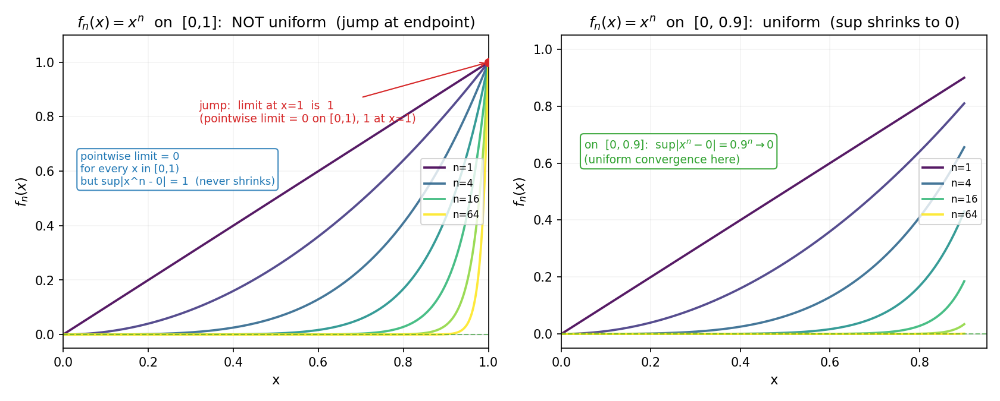
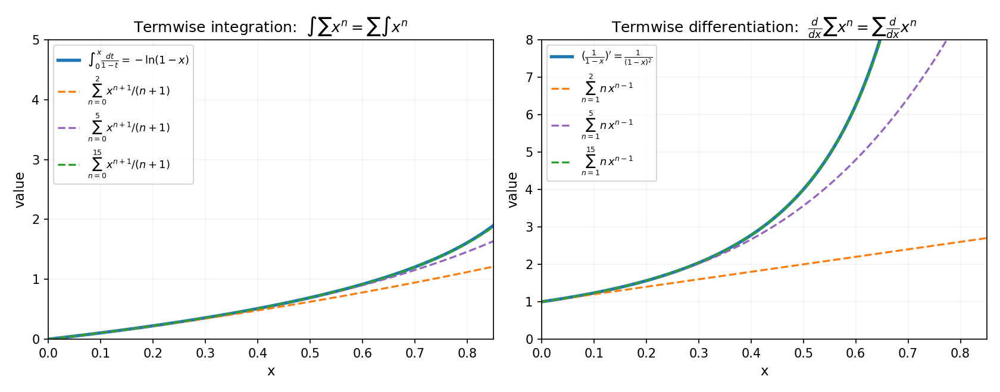
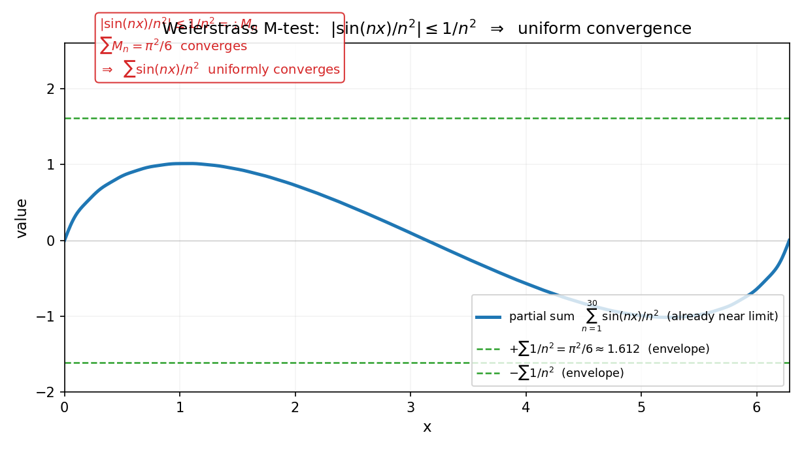
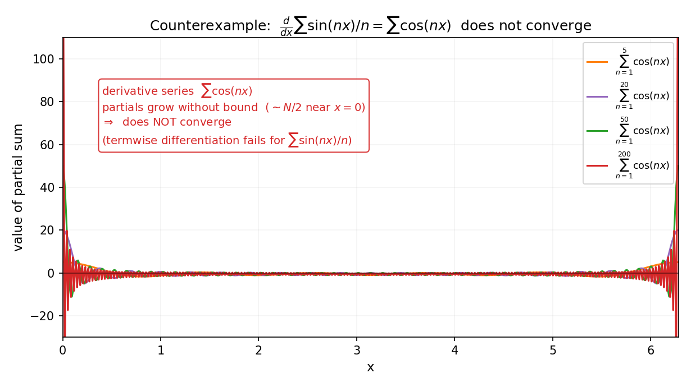

# 第 10 章 · 一致收敛:什么时候能交换极限的顺序

> **核心问题**:如果无穷项相加的是函数(`Σfₙ(x)`),这堆函数加起来还是一个好函数吗?什么时候能"先加再求导"换成"先求导再加"——也就是,什么时候两个极限(无穷次累加的极限、和求导/积分的极限)可以交换顺序?

> **读完本章你会明白**:
> 1. 函数项级数的收敛分两种——**点态收敛**(每个点单独看够近)和**一致收敛**(整体地、不挑点地够近),它们的差别正是第 3 章"连续 vs 一致连续"的复刻;
> 2. 为什么"点态收敛"不够用:无穷个连续函数的极限可能不连续、无穷个好积分的极限可能积不出来——"无穷的危险"在函数项级数这里集中爆发;
> 3. 一致收敛是**傅里叶级数能不能逐项积分/求导的命门**(下一章预告),也是全书"无穷的危险"最经典的爆发地;
> 4. `xⁿ` 在 `[0,1]` 上是最经典的反例:点态收敛到一个**不连续**的极限,正因为不一致.

---

> **如果一读觉得太难**:先只记住三件事——① 点态收敛 = 逐点逼近(每个点单独达标),一致收敛 = 整体逼近(全区间一起达标,δ 不挑点);② 一致收敛才允许极限交换顺序(逐项求导/积分);③ `xⁿ` 在 `[0,1]` 是反例:点态极限不连续,因为端点跳了一下.

---

## 章首 · 一句话点破

> **点态收敛是"每个点都到了家",一致收敛是"全家一起到、一个不落、而且是用同一张地图到的".前者是无数份单独的契约,后者是一份覆盖全家的总契约.**

这句话是结论,不是理由.本章倒过来拆:先把"点态"和"一致"的差别用最经典的反例 `xⁿ` 看穿,再看"点态不够用"会带来什么灾难(极限不连续、积分积不出),最后看"一致收敛"这份总契约为什么能救场.

---

## 一、把"级数"从"数相加"升级到"函数相加"

### 1.1 函数项级数:每个点都是一个数值级数

上一章我们判的是数相加:`Σaₙ`,`aₙ` 是一个数.但傅里叶级数长这样:

$$ f(x) = \sin x + \frac{\sin 2x}{2} + \frac{\sin 3x}{3} + \cdots $$

每一项都是一个**函数** `fₙ(x)`.这种"无穷个函数相加"叫**函数项级数**(series of functions)`Σfₙ(x)`.

> **画面**:对每一个固定的 `x`,函数项级数退化成一个普通的数值级数(上一章那套).比如 `x=1` 时,上面的级数变成 `sin1 + sin2/2 + sin3/3 + …`,它收不收敛,上一章的判别术就能判.**函数项级数,本质是"每个点都有一个数值级数"——而每个点的级数,可能各有各的命运.**

形式化:对每个 `x`,令 `S_N(x) = f₁(x) + … + f_N(x)`(部分和函数).如果对每个 `x`,数列 `{S_N(x)}` 收敛(每个点都有自己的家),记极限为 `S(x)`,则称 `Σfₙ(x)` 在该点**点态收敛**(pointwise convergence)到 `S(x)`.

到这里没有新东西——把上一章的数换成函数而已.**真正的麻烦在下一段.**

### 1.2 点态收敛的"灾难":无穷个连续函数的极限可能不连续

看一个最经典、也最让人心寒的反例:`fₙ(x) = xⁿ`,定义在 `[0, 1]` 上.

- 对每个 `x ∈ [0, 1)`:`xⁿ → 0`(因为 `|x| < 1`,幂次越高越接近 0);
- 对 `x = 1`:`1ⁿ = 1`,永远等于 1.

所以 `{fₙ}` 的点态极限是

$$ S(x) = \begin{cases} 0, & 0 \le x < 1 \\ 1, & x = 1 \end{cases} $$

看清楚了吗:**每一个 `fₙ(x) = xⁿ` 都是连续函数(多项式),可它们的无穷极限 `S(x)` 在 `x=1` 处不连续——有个跳变.**



左图:把 `x, x², x⁴, x⁸, x¹⁶, x³², x⁶⁴` 画在一起.随着 `n` 增大,曲线在 `[0,1)` 内越来越贴近 x 轴(极限 0),**但每一条曲线在 `x=1` 处都顶到 1**.所以极限函数 `S(x)` 在 `x=1` 处有一个"突然的跳"——从 0 跳到 1.这就是"无穷个连续函数的极限不连续"的具象.

> **不这样理解会怎样**:你会以为"连续函数加连续函数、加到无穷,还是连续".这是有限世界的常识,**在无穷世界它失效了**.原因藏在下一段:**点态收敛是一份"逐点"的契约,每个点单独满足,但点的"满足速度"可以差很远——在 `x=1` 附近,`xⁿ` 离 0 还差得远(因为 `0.99ⁿ` 衰减极慢),它根本没来得及收敛,极限函数就在那里"漏了".**

> **钉死这件事**:**点态收敛不够保住连续性.** `xⁿ` 是铁证:每个 `fₙ` 连续,点态极限却不连续.这就是"无穷的危险"在函数项级数上的第一次显形.

---

## 二、一致收敛:给逼近装一份"总契约"

### 2.1 点态 vs 一致:差别在"δ 挑不挑点"

要理解一致收敛(uniform convergence),先回想第 3 章的"连续 vs 一致连续".那里讲过:连续是每个点各有各的 δ(δ 依赖点),一致连续是整个区间共用一个 δ(δ 不挑点).**一致收敛,是同一个故事搬到"函数列收敛"上.**

> **画面**:点态收敛说"对每个固定的 `x`,只要 `N` 够大,`|S_N(x) - S(x)| < ε` 就成立".但"够大"是多大,**取决于你挑的 `x`**——在 `x=0.5` 处,`xⁿ` 几步就贴近 0;在 `x=0.999` 处,`xⁿ` 要天文数字的 `N` 才贴近 0.每个点有自己的 `N(ε, x)`.**一致收敛要求更强:存在一个 `N(ε)`,它**只看 ε、不挑点**,使得只要 `N > N(ε)`,对**区间内所有的 `x`** 同时有 `|S_N(x) - S(x)| < ε`.**

形式化(点态收敛 vs 一致收敛):
- **点态**:`∀x, ∀ε>0, ∃N(ε, x), ∀n>N: |S_n(x) - S(x)| < ε`.(N 依赖 `x`.)
- **一致**:`∀ε>0, ∃N(ε), ∀n>N, ∀x: |S_n(x) - S(x)| < ε`.(N 不依赖 `x`,一份总契约.)

> **不这样理解会怎样**:你会觉得这两种收敛"差不多,只是表述啰嗦点".**差远了.** 差别就在"δ(N)挑不挑点".点态是无数份单独的小契约(每个点一份),一致是一份覆盖全区间的大契约.**正是这份"不挑点"的大契约,才能保证极限函数保住连续性、才能让极限交换顺序.**

### 2.2 用"上确界范数"一句话判别一致收敛

判别一致收敛,有一个特别清爽的等价说法:**看"最坏的那个点"够不够近.**

令 `M_N = sup_{x∈区间} |S_N(x) - S(x)|`(部分和与极限函数的"最大距离",也叫上确界范数).则:

> **`S_N` 一致收敛到 `S` ⟺ `M_N → 0` 当 `N→∞`.**

> **画面**:`M_N` 是"整条曲线 `S_N` 和极限曲线 `S` 之间的最大缝隙".如果这个最大缝隙(不论它在哪个点取到)随着 `N→∞` 缩到 0,那就是一致收敛——因为"最坏的那个点"都被治住了,别的点更不用说.如果最大缝隙不缩(像 `xⁿ` 在 `[0,1]` 上,`M_N = 1` 恒等于 1,因为端点附近总留着 1 的差),那就**不是**一致收敛.

回到 `xⁿ`:
- 在 `[0, 1]`:`sup|xⁿ - S(x)| = 1`(在 `x=1` 处,`S(1)=1` 但 `xⁿ→0` 之外的距离是 1;更严格地说在 `[0,1)` 内 `sup xⁿ = 1`).`M_N = 1` 不趋于 0 → **不一致收敛**.
- 在 `[0, 0.9]`:`sup|xⁿ - 0| = 0.9ⁿ → 0`.`M_N → 0` → **一致收敛**.

这就是图 10.1 右图显示的:在紧致子区间 `[0, 0.9]` 上,曲线族越挤越紧,最大缝隙 `0.9ⁿ` 趋于 0,**一致收敛**.一致收敛和点态收敛的差别,就这一个数:`M_N → 0` 还是 `M_N ↛ 0`.

> **钉死这件事**:**一致收敛 = 上确界范数 `sup|S_N - S| → 0`.** 一句话判别:看"最坏点的距离"是否随 `N→∞` 缩到 0.缩,就一致;不缩(哪怕只有一个点不缩),就不一致.

### 2.3 一致收敛的力量:保连续、保积分、保求导

为什么人类非要把"一致收敛"挑出来?因为**只有它,才能保住三件大事**:

1. **保连续性**(连续函数的一致极限仍连续):若每个 `fₙ` 连续,且 `Σfₙ` 一致收敛到 `S`,则 `S` 连续.——这就是 `xⁿ` 在 `[0,1]` 反例的"反面":那里不一致,所以极限不连续;若一致,极限必连续.

2. **可逐项积分**(极限与积分可交换):若 `Σfₙ` 一致收敛,则

   $$ \int \sum f_n = \sum \int f_n $$

   也就是"先加再积"等于"先积再加".左图 10.2 的左半展示了这件事:把幂级数 `1/(1-x) = Σxⁿ` 逐项积分,得到的 `Σ xⁿ⁺¹/(n+1)` 恰好就是 `-ln(1-x)`——和直接积分 `1/(1-x)` 的结果一致.

3. **可逐项求导**(更严格,需导函数级数一致收敛):若 `Σfₙ` 收敛,且 `Σfₙ'` 一致收敛,则可逐项求导:

   $$ \left(\sum f_n\right)' = \sum f_n' $$

   图 10.2 右半展示了 `1/(1-x) = Σxⁿ` 逐项求导得到 `Σn xⁿ⁻¹ = 1/(1-x)²`——和直接对 `1/(1-x)` 求导的结果一致.



> **不这样理解会怎样**:你会以为"加法、积分、求导,顺序随便换".**在有限世界,确实随便换**——有限和的积分 = 积分的有限和,这是积分线性性.**但在无穷世界,这种交换需要"一致收敛"做担保.** 点态收敛下,你可以构造出"`Σ∫fₙ ≠ ∫Σfₙ`"的反例(极限和积分交换出错).一致收敛是那份"担保合同",它让无穷次的极限交换合法化.

> **钉死这件事**:**一致收敛是极限交换的通行证.** 保连续、可逐项积分、可逐项求导(后者要求导函数级数也一致收敛)——这三件事,点态收敛都做不到,一致收敛才能做到.

### 2.4 判别一致收敛的最实用工具:Weierstrass M 判别(M-test)

知道了"一致收敛才能逐项操作",下一个问题自然冒出来:**怎么判一个函数项级数是不是一致收敛?** 上一节的"`sup|S_N - S| → 0`"是判别标准,但用起来要先知道极限函数 `S(x)` 长什么样——而大多数时候 `S(x)` 正是你想求的未知数.我们需要一个**不需要先知道极限函数**、只看每一项的判别法.这就是分析里用得最多的工具——**Weierstrass 判别法**,也叫 **M 判别**(M-test).

> **Weierstrass M 判别法**:对函数项级数 `Σfₙ(x)`,如果能把每一项的绝对值"封顶"成一串与 `x` 无关的常数 `Mₙ`,即
> $$ |f_n(x)| \le M_n \quad \text{对所有 } x \text{ 成立}, $$
> 而且这串"顶"`ΣMₙ` 是一个**收敛的数值级数**,那么 `Σfₙ(x)` **一致收敛**(而且是绝对一致收敛).

> **画面**:M 判别的思路,是把"判函数项级数"翻译回上一章的"判数值级数"——**给每一项函数戴一顶不挑 `x` 的"帽子" `Mₙ`,只要这些帽子加起来收敛(上一章那套),原来的函数项级数就被一致地夹住了.** 它本质是比较判别法的函数版:你不是拿一个已知收敛级数去比大小,而是拿一串"与 `x` 无关的上界"去比大小,这一比,顺便就把"不挑点"的一致性也拿到了.

看一个最经典的例子:判 `Σ sin(nx)/n²` 在整个实轴上是否一致收敛.

解:对任何 `x`,`|sin(nx)| ≤ 1`,所以 `|sin(nx)/n²| ≤ 1/n²`.令 `Mₙ = 1/n²`.而 `Σ1/n²` 是上一章的巴塞尔级数(`p=2` 的 `p` 级数),**收敛**(和为 `π²/6`).于是由 M 判别,`Σsin(nx)/n²` 在整个实轴上**一致收敛**.注意:我们从头到尾没算过它的极限函数 `S(x)` 长什么样——M 判别的威力就在于此,**只看每一项的"封顶",就把一致性判定了**.



图 10.3 把这件事画出来:蓝色部分和曲线始终被两条绿色虚线 `±Σ1/n² = ±π²/6` 夹住——这两条线就是"封顶" `Mₙ` 累出来的包络.包络是有限的(`±1.645`),而且加再多项也不会越界(因为 `Σ1/n²` 收敛),所以整条曲线被一致地关在笼子里.

> **不这样理解会怎样**:你会觉得一致收敛"判起来好麻烦,要先猜极限函数".**M 判别告诉你:不用猜.** 只需把每一项的绝对值换成"最坏情形"(对所有 `x` 取上界),得到一串常数 `Mₙ`,然后用上一章的数值级数判别术去判这串 `Mₙ`——`ΣMₙ` 收敛,原函数项级数一致收敛.**这是把函数项级数的收敛问题,降维成数值级数的收敛问题**——上一章那套判别术,在这里全部复用.

> **钉死这件事**:**M 判别 = 函数项级数的"封顶比较法".** 找一串不依赖 `x` 的上界 `Mₙ` 使 `|fₙ(x)| ≤ Mₙ`,`ΣMₙ` 收敛 ⟹ `Σfₙ(x)` 一致收敛.它让你**无需知道极限函数**就能判一致性,是实战中用得最多的一招.

### 2.5 一个反例:条件不够时,逐项求导会出错

M 判别和"逐项求导需导函数级数一致收敛"这条铁律放在一起,正好讲一个**反例**——看清"条件不满足时会出什么事",你才知道那些条件不是摆设.考虑函数项级数

$$ \sum_{n=1}^{\infty} \frac{\sin(nx)}{n} $$

它在每个 `x` 都收敛(由上一章的交错级数/Dirichlet 判别可证),和函数是一个**锯齿波**(sawtooth wave)——正是下一章傅里叶级数的主力选手之一.现在问:**能不能对它逐项求导?** 即 `d/dx Σsin(nx)/n` 是否等于 `Σ d/dx sin(nx)/n = Σ cos(nx)`?

**算一下逐项求导后的级数 `Σcos(nx)`:它的通项 `cos(nx)` 根本不趋于 0**(在 x 不为 2π 整数倍时,`cos(nx)` 来回振荡,极限不存在).通项不趋于 0,级数必然**发散**.所以逐项求导在这里彻底失败——求导后的级数不收敛,更别提等于原函数的导数.

根子在哪儿?**导函数级数 `Σcos(nx)` 不一致收敛(甚至不收敛),所以"逐项求导"的通行证没拿到.** 这正是 2.3 节那条铁律的反面教材:逐项求导要求**导函数级数**一致收敛,而不是原级数一致收敛——`Σsin(nx)/n` 本身收敛得还行,但它的"导数版本" `Σcos(nx)` 一塌糊涂,于是求导操作不合法.



图 10.4 把这个失败画得清清楚楚:对 `Σcos(nx)` 取部分和,N 从 5 增到 200,部分和的峰值越来越大(约 `N/2`),根本不收敛到一个函数.**多项式加得越多,炸得越厉害**——这就是"导函数级数不一致收敛、逐项求导出错"的具象.

> **不这样理解会怎样**:你会以为"只要原级数收敛,就能放心逐项求导".**错.** 逐项求导是两个无穷操作(求导的极限、求和的极限)的交换,这个交换需要**导函数级数**一致收敛来担保.条件不满足,你就得到了一个发散的垃圾级数.这件事在傅里叶分析里是日常——锯齿波、方波这些"有跳变"的信号,它们的傅里叶级数本身收敛,但**逐项求导后会发散**.下一章我们会看到,正是这种"导不动"的麻烦,逼出了傅里叶级数一大套收敛性理论.

> **钉死这件事**:**逐项求导 = 交换求导与求和两个极限,需要导函数级数一致收敛.** `Σsin(nx)/n`(锯齿波)是个反例:原级数收敛,但逐项求导得 `Σcos(nx)` 发散——条件不满足,操作不合法.这预告了傅里叶级数"导不动"的根本麻烦.

---

## 三、这是傅里叶级数的命门(下一章预告)

### 3.1 傅里叶级数为什么特别需要一致收敛

第 5 篇要讲的傅里叶级数,核心是把一个周期函数 `f(x)` 拆成正弦波的叠加:

$$ f(x) = \sum_{n=1}^{\infty} b_n \sin(nx) $$

这是典型的函数项级数.**人类用傅里叶级数时,无时无刻不在做三件需要"极限交换"的事**:
- 解微分方程:把解写成 `f = Σbₙsin(nx)`,代入方程时要逐项求导.**求导合法吗?需要导函数级数一致收敛.**
- 算能量:`∫f² = Σ bₙ²`(Parseval 等式),要把"函数平方的积分"换成"系数平方的和".**积分能换到求和里面吗?需要一致收敛(或更强的 `L²` 收敛,第 7 篇会讲).**
- 重构信号:用前 N 项谐波叠加逼近 `f`,问"N→∞ 时是否真的逼近 `f`"?**这就是收敛性问题,而且最好是一致收敛(这样逼近误差整体可控).**

> **不这样理解会怎样**:你会觉得"傅里叶级数就是把函数写成 sin 的和,写出来不就完了".**没那么简单**.一个函数能不能拆、拆出来的级数收不收敛、收敛到的东西是不是原来的函数——这三个问题(存在性、收敛性、回到自身),每一个都得过一致收敛(或它的近亲 `L²` 收敛)这一关.傅里叶级数发展史上,Dirichlet、Gibbs、Lebesgue 一路在跟收敛性搏斗,正是这个原因.

### 3.2 一个"不一致"的代价:Gibbs 现象(预告)

傅里叶级数对**不连续函数**(比如方波)的逼近,会出现一个让人不安的现象:**在不连续点附近,部分和会"过冲"——超过函数的真值约 9%,而且 `N→∞` 时这个过冲不消失!** 这叫 **Gibbs 现象**.它的根源,正是"不一致收敛":方波的傅里叶级数在连续区间上一致收敛(好),但在跳变点附近**不一致**——这就是过冲赖着不走的数学原因.我们第 13 章会亲手画出来.**Gibbs 现象,就是"点态够近、整体不够近"在信号处理里的具象化.**

> **钉死这件事**:**一致收敛是傅里叶级数能放心逐项操作的通行证,Gibbs 现象是"不一致收敛"的具体代价.** 第 5 篇每一步操作,背后都有本章这套一致收敛的语言在担保.

### 3.3 为什么一致收敛是傅里叶的命门:三个逐项操作,三道关

把上一节那个"傅里叶处处需要极限交换"的说法再拆细一点,你会看清**一致收敛为什么是傅里叶分析整栋大楼的地基**.傅里叶级数 `f(x) = Σ(bₙ sin nx + aₙ cos nx)` 落地时,至少要过三道关,每一道都卡在"能不能交换极限顺序"这件事上:

**第一道关:级数到底收不收敛、收敛到什么?** 这是最基本的存在性问题.19 世纪傅里叶刚提出这套级数时,没有人能证明"一个任意的周期函数,它的傅里叶级数真的收敛到自己".Dirichlet 在 1829 年给出了第一个收敛定理(后来叫 Dirichlet 条件:分段单调、有限个间断点),但这个收敛在间断点处**不一致**——这正是 Gibbs 现象的数学根源.也就是说,**傅里叶级数的收敛性本身,就是一个一致收敛问题**:连续段上一致收敛(好),间断段上不一致(过冲).

**第二道关:能不能逐项积分(算能量、算系数)?** 傅里叶系数 `bₙ = (2/π)∫f(x) sin(nx) dx` 的推导,以及 Parseval 等式 `∫f² = Σ(aₙ² + bₙ²)` 的证明,都要把"积分"和"无穷求和"交换顺序——`∫Σ = Σ∫`.**这个交换合法吗?** 对一致收敛的级数,合法(本章 2.3 节的通行证).傅里叶级数虽不一定一致收敛,但它有一份额外的福利:**对任何分段连续的 `f`,傅里叶级数可以逐项积分**,哪怕它不一致收敛——这是傅里叶级数特有的"温柔"(背后是 `L²` 收敛,第 7 篇 Hilbert 空间会讲清).所以**傅里叶算能量、算系数能成,靠的正是"积分这个极限操作可以被换进去"**——一致性是它的命门,`L²` 理论是它的兜底.

**第三道关:能不能逐项求导(解微分方程)?** 这是最危险的一道.把 `f = Σbₙ sin(nx)` 代入热传导方程 `∂f/∂t = ∂²f/∂x²`,要逐项对 `sin(nx)` 求导,得到 `Σ n bₙ cos(nx)`、再求导得 `Σ n² bₙ sin(nx)`.**注意那个 `n²`——求导会让系数放大 `n` 倍,求二阶导放大 `n²` 倍.** 这意味着**只有当系数 `bₙ` 衰减得足够快(快到 `n² bₙ → 0`),导函数级数才收敛**.对光滑函数,`bₙ` 衰减快(如 `1/n³`),逐项求导合法;对有跳变的函数(方波,`bₙ ~ 1/n`),逐项求导直接发散——正是 2.5 节那个锯齿波反例的复刻.**傅里叶级数"能不能解微分方程",卡死在"导函数级数一致收敛"这一条上.**

> **画面**:把这三道关想成傅里叶大楼的三根承重柱.第一柱(收敛性)决定楼盖不盖得起来,第二柱(逐项积分)决定能不能算能量和系数,第三柱(逐项求导)决定能不能解方程.**三根柱子的材料,都是"一致收敛"这种"不挑点的总契约"**——少一根,楼就塌.这就是为什么整个第 5 篇傅里叶分析,从第 12 章到第 15 章,每一步都要回头查"这一步的极限交换,有的一致收敛担保吗".**本章这套一致收敛的语言,是傅里叶的语法,不是修辞.**

> **钉死这件事**:**傅里叶级数的三道命门——收敛性、逐项积分、逐项求导——每一道都是极限交换,每一道都靠一致收敛(或 `L²` 收敛)担保.** 一致收敛是连续段的好消息(逐项操作合法),不一致收敛是间断段的坏消息(Gibbs 过冲、求导发散).**第 5 篇傅里叶的每一章,都在和这把"一致 vs 不一致"的尺子打交道.**

---

## 符号 + 数值佐证

### sympy:验证一致收敛下的逐项操作

```python
import sympy as sp

x, n = sp.symbols('x n', positive=True)

# 幂级数 sum x^n = 1/(1-x) on |x|<1
f = 1 / (1 - x)

# 逐项积分: sum_{n=0}^inf x^n dx = sum x^(n+1)/(n+1) = -ln(1-x)
exact_integ = sp.integrate(f, x)              # sympy may print -log(x-1); for x<1 this equals -log(1-x)
print('integral of 1/(1-x) =', exact_integ)   # -log(1 - x)  (up to the sign inside the log)
termwise = sp.summation(x**(n+1) / (n+1), (n, 0, sp.oo))
print('termwise integration =', sp.simplify(termwise))   # -log(1 - x)  一致!

# 逐项求导: d/dx sum x^n = sum n x^(n-1) = 1/(1-x)^2
exact_deriv = sp.diff(f, x)                   # 1/(1-x)^2
print('derivative of 1/(1-x) =', exact_deriv)
termwise_d = sp.summation(n * x**(n-1), (n, 1, sp.oo))
print('termwise differentiation =', sp.simplify(termwise_d))  # 1/(1-x)^2  一致!
```

sympy 用符号算出:逐项积分的 `Σxⁿ⁺¹/(n+1)` = `-log(1-x)`,与直接积分 `1/(1-x)` 一致;逐项求导的 `Σn xⁿ⁻¹` = `1/(1-x)²`,与直接求导一致.**幂级数在收敛半径内一致收敛,所以极限顺序怎么换都对.**

### numpy:亲手看见 x^n 何时一致、何时不一致

```python
import numpy as np

x = np.linspace(0, 1, 1000)
x_left = x[x < 1]                            # [0, 1)

for k in [2, 10, 50, 200]:
    sup_full = np.max(x**k)                  # 在 [0,1] 上,sup = 1(端点)
    sup_in   = np.max(x_left**k)             # 在 [0,1) 上,sup 仍 = 1(逼近端点)
    print('n=%3d   sup|x^n| on [0,1] = %.3f   on [0,1) = %.3f   (NOT uniform)'
          % (k, sup_full, sup_in))

# 但在紧致子区间 [0, 0.9]
x9 = np.linspace(0, 0.9, 500)
for k in [2, 10, 50, 200]:
    print('n=%3d   sup|x^n| on [0,0.9] = %.6f   (->0, uniform)' % (k, np.max(x9**k)))
```

运行你会震撼地看到:**在 `[0,1)` 上,`xⁿ` 的 sup 永远是 1(因为总有接近 1 的点让 `xⁿ` 接近 1),`N` 再大都不缩;但在 `[0, 0.9]` 上,sup = `0.9ⁿ` 指数缩到 0.** 这就是"端点附近收敛太慢"导致不一致的数值具象——一致收敛与否,只在 `sup` 这一个数上见分晓.

---

## 章末小结

**用母题回顾本章**:本章母题是**缰绳**(呼应 P1-03 一致连续).点态收敛是无数份小缰绳(每个点一根),一致收敛是一根总缰绳(覆盖全区间、δ 不挑点).**只有总缰绳,才能把"极限交换"这件无穷次操作的危险事关进笼子——保连续、可逐项积分、可逐项求导.**

**回扣全书主线**:本章又一次展示了"精确 = 逼近的极限"——**一致收敛,就是部分和函数到极限函数的整体逼近误差(上确界范数)缩到 0**.我们在驯服的是**"无穷次极限的交换"**这种无穷:加法的极限、求导的极限、积分的极限,本来各自一次无穷,交换顺序就是把两个无穷"叠"起来——只有一致收敛这种"总契约",才能保证叠出来的结果不变形.

**本章在驯服哪种无穷、补了谁的窟窿**:驯服的是**"无穷个函数相加、还能不能保住好性质"**这种无穷.补的是上一章(P4-09)的窟窿——上一章判的是数相加,但傅里叶、泰勒这些真正有用的工具,全是函数相加,**必须有一套"函数项级数"的收敛语言,才能放心逐项操作**.

**五个"为什么"(若只记五件事)**:
1. **为什么点态收敛不够用?** 因为它是"逐点"契约,每个点的收敛速度可以差很远(`xⁿ` 在 `x=0.999` 处收敛极慢),极限函数可能在"收敛慢的点"漏掉连续性.
2. **一致收敛和点态收敛差在哪?** 差在 δ(N)挑不挑点.点态 = 无数份单独契约,一致 = 一份不挑点的总契约.**用 `sup|S_N - S|→0` 一句话判别**.
3. **为什么 `xⁿ` 在 `[0,1]` 不一致收敛?** 因为 `sup|xⁿ - 0| = 1` 永不缩(端点附近 `xⁿ` 接近 1),极限函数在 `x=1` 处从 0 跳到 1,不连续.
4. **一致收敛能保住什么?** 保连续性、允许逐项积分、允许逐项求导(后者需导函数级数也一致收敛).**它是极限交换的通行证.**
5. **为什么这是傅里叶级数的命门?** 傅里叶级数逐项求导(解方程)、逐项积分(算能量 Parseval)、逼近原函数,每一步都要交换极限顺序,**全靠一致收敛担保**.Gibbs 现象就是"不一致"的具体代价.

**想继续深入该往哪钻**:
- **3Blue1Brown《Essence of Calculus》/ Taylor series 那一集**:动画展示"函数列如何整体逼近",和本章同源;
- **numpy 自玩**:改 `xⁿ` 的底数,看 `0.99ⁿ`、`0.999ⁿ` 的 sup 缩得多慢——体会"端点附近收敛慢"有多顽固;
- **跨领域彩蛋**:**机器学习里,神经网络的"万能逼近定理"(一个足够宽的网络能逼近任何连续函数)本质就是一致收敛**——网络是一堆函数(`σ(wᵀx+b)`)的无穷(或足够多)叠加,逼近误差整体可控才敢说"万能".第 7 篇 Hilbert 空间会把这套语言推到极致(傅里叶 = `L²` 正交分解).

**下一章**:本章说清了"函数项级数何时能逐项操作".**有一类最特殊、也最重要的函数项级数——幂级数 `Σaₙxⁿ`(无穷多项式)**,它天然在收敛半径内一致收敛,所以可以放心逐项求导/积分.更惊人的是,`eˣ`、`sin x`、`cos x` 这些"超越函数",居然都能写成幂级数——**超越函数,本质就是无穷阶的多项式**.下一章我们就揭开这件事,并预告第 6 篇复变函数:幂级数天然定义在复数上,它是通往复分析的跳板.
