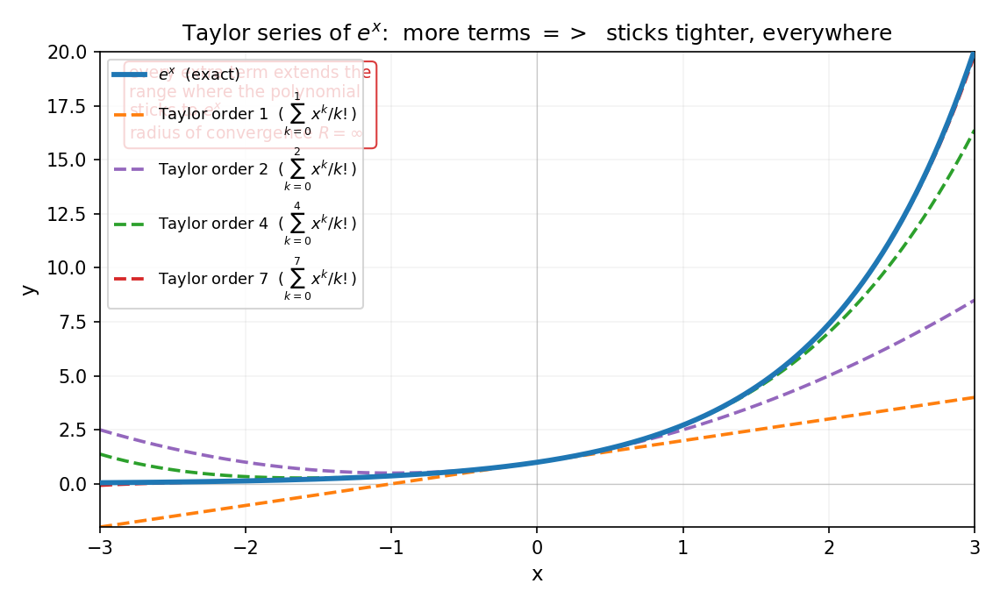
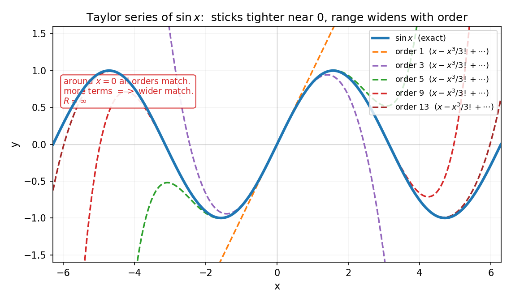
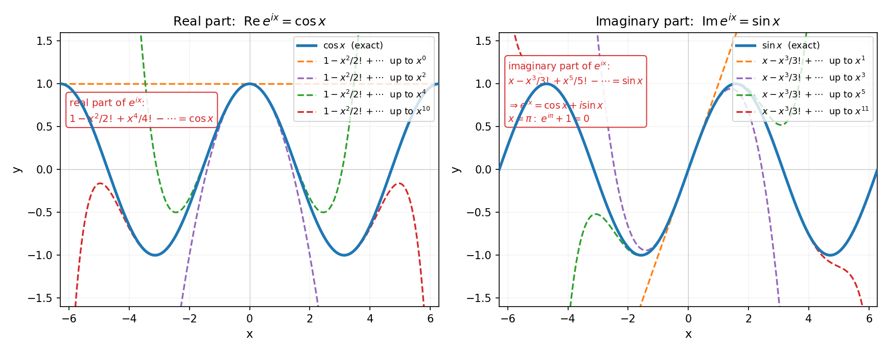
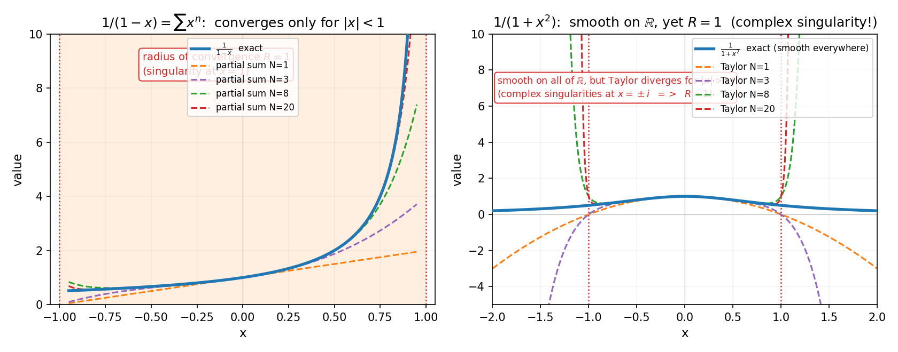
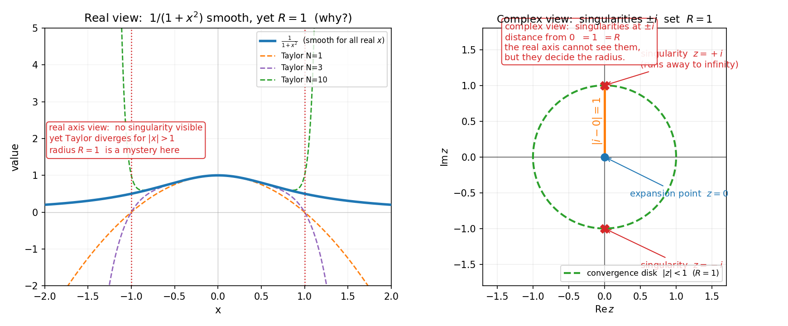

# 第 11 章 · 幂级数与泰勒级数:超越函数为何能写成多项式

> **核心问题**:`eˣ`、`sin x`、`cos x` 这些"超越函数",凭什么能写成无穷多项式?这种写法在什么范围内有效?为什么这件事的有效范围,有时候得跑到**复数域**才能解释清楚?

> **读完本章你会明白**:
> 1. 幂级数(power series)`Σaₙxⁿ` 是最特殊、最重要的函数项级数——它在收敛半径内**天然一致收敛**,所以可以放心逐项求导/积分(上一章的通行证,这里自动发放);
> 2. 泰勒级数(Taylor series)= 泰勒公式(P2-06)的无穷版,它把"超越函数"还原成"无穷阶的多项式"——`eˣ`、`sin x`、`cos x` 的全级数都全场收敛(`R=∞`);
> 3. "解析函数"(analytic function)= 泰勒级数收敛到自身的函数——它是实分析里最乖、复分析里最猛的一类函数;
> 4. 一个反直觉的伏笔:`1/(1+x²)` 在实轴上处处光滑,但它的泰勒级数却只在 `|x|<1` 收敛——**原因藏在复数域**(`x=±i` 是奇点),这是第 6 篇复变函数的跳板.

---

> **如果一读觉得太难**:先只记住三件事——① 幂级数 `Σaₙxⁿ` 的"收敛半径 R"用比值法求(`R = 1/lim|a_{n+1}/aₙ|`),在 `|x|<R` 内一致收敛、可逐项操作;② `eˣ = Σxⁿ/n!`、`sin x = Σ(-1)ⁿx²ⁿ⁺¹/(2n+1)!`、`cos x = Σ(-1)ⁿx²ⁿ/(2n)!`,这仨全场收敛(`R=∞`);③ 泰勒级数只在收敛半径内等于原函数,半径由"离展开点最近的奇点"决定——哪怕奇点在复数里看不见.

---

## 章首 · 一句话点破

> **超越函数不是另一个世界的怪物,它就是无穷阶的多项式.只要这个多项式收敛到它自己,它就是"解析函数"——可以放心地当成多项式来求导、积分、求值.**

这句话是结论,不是理由.本章倒过来拆:先看幂级数为什么是最"乖"的函数项级数(收敛半径内自动一致收敛),再把泰勒级数从第 6 章(P2-06)那个"有限阶多项式"的无穷版本推出,最后用一个反例告诉你——**收敛半径有时得让复数来决定,这是通往第 6 篇复变的伏笔**.

---

## 一、幂级数:最特殊的函数项级数

### 1.1 为什么幂级数这么"乖"

上一章我们见识了函数项级数的麻烦:`xⁿ` 在 `[0,1]` 上不一致收敛,极限不连续,逐项操作会出问题.但有一类函数项级数特别乖:**幂级数**(power series)

$$ \sum_{n=0}^{\infty} a_n x^n = a_0 + a_1 x + a_2 x^2 + a_3 x^3 + \cdots $$

每一项都是 `x` 的幂(常数系数 `aₙ` 乘 `xⁿ`).它乖在哪里?**只要 `x` 在收敛半径内,它就一致收敛,而且可以放心逐项求导、逐项积分.**

> **画面**:幂级数的"乖",来自它的项长得太规整——每一项都是前一项乘 `x` 再调系数.这种"按 `x` 的幂排列"的规整结构,使得它在一个对称的区间 `(-R, R)` 内收敛,而且在这个区间的任何紧致子区间上都一致收敛(下一节细说).上一章 `xⁿ` 那种"端点附近收敛太慢"的麻烦,在幂级数这里被收敛半径这个"安全圈"圈住了.

### 1.2 收敛半径:幂级数的"安全圈"

幂级数在哪里收敛、在哪里发散,有一个惊人的简洁规律——**它总是在一个以 0 为中心、半径为 `R` 的对称区间 `(-R, R)` 内收敛,在 `|x|>R` 处发散**.这个 `R` 叫**收敛半径**(radius of convergence).端点 `x=±R` 要单独判.

`R` 怎么求?**用比值判别(上一章那套)**:

$$ R = \frac{1}{\lim_{n\to\infty} \left| \frac{a_{n+1}}{a_n} \right|} $$

(若极限为 0,则 `R=∞` 全场收敛;若极限为 `∞`,则 `R=0` 只在 `x=0` 收敛.)

> **不这样理解会怎样**:你会把收敛半径当成一个要背的公式.其实它就是上一章比值判别的直接产物——比值判别说 `|a_{n+1}xⁿ⁺¹ / aₙxⁿ| → L < 1` 收敛,即 `|x| · lim|a_{n+1}/aₙ| < 1`,即 `|x| < 1/lim|a_{n+1}/aₙ| = R`.**收敛半径,就是比值判别在幂级数上的"自动读数".**

### 1.3 收敛半径内的"全场一致收敛"

更惊人的是幂级数的一条性质(本节的灵魂):

> **幂级数在收敛半径内的任何紧致子区间 `[-r, r]`(`r<R`)上都一致收敛.**(这叫"内闭一致收敛".)

> **画面**:上一章我们费尽心机证明"逐项操作需要一致收敛".幂级数几乎免费拿到了这份通行证——**只要在收敛半径内(而且留个安全距离,不到端点),它就一致收敛,就可以放心逐项求导、逐项积分.** 这是幂级数成为分析"最趁手工具"的根本原因.端点 `±R` 要单独小心(那里可能收敛也可能发散,而且不一定一致),但内部的紧致子区间,永远安全.

> **钉死这件事**:**幂级数 `Σaₙxⁿ` 在收敛半径 `R = 1/lim|a_{n+1}/aₙ|` 内的内闭子区间上一致收敛,所以可逐项求导、逐项积分.** 上一章那套"极限交换的通行证",对幂级数几乎免费发放.

---

## 二、泰勒级数:把泰勒公式推到无穷阶

### 2.1 从有限阶多项式到无穷阶多项式

第 6 章(P2-06)讲过泰勒公式:一个光滑函数 `f`,在 `x=0` 附近可以用一个**有限阶多项式**逼近

$$ f(x) \approx f(0) + f'(0)\,x + \frac{f''(0)}{2!}\,x^2 + \cdots + \frac{f^{(N)}(0)}{N!}\,x^N + R_N(x) $$

那个 `R_N(x)` 是余项(误差).**现在问一个大胆的问题:如果 `f` 无穷阶可导,而且余项 `R_N(x)` 当 `N→∞` 时趋于 0,那这个多项式就可以无限写下去——**

$$ f(x) = \sum_{n=0}^{\infty} \frac{f^{(n)}(0)}{n!}\,x^n $$

这就是**泰勒级数**(Taylor series).它是泰勒公式的无穷版——**把一个超越函数,完整地写成无穷阶的多项式**.

> **画面**:第 6 章是"显微镜放大几阶,曲线就贴几阶多项式",但放大有限阶总有误差.泰勒级数是"放大到无穷阶"——如果误差随阶数增加缩到 0,那么这个无穷阶多项式就**完全等于原函数**(在收敛半径内).超越函数和多项式的界限,在这一刻被打破:**超越函数,本质就是无穷阶的多项式.**

> **钉死这件事**:**泰勒级数 = 泰勒公式的无穷版.** 系数 `aₙ = f⁽ⁿ⁾(0)/n!` 由函数在 0 点的各阶导数决定.只要余项 `R_N → 0`(在收敛半径内),泰勒级数就等于原函数.

### 2.2 三个经典:eˣ、sin x、cos x——全场收敛

把泰勒级数用在 `eˣ`、`sin x`、`cos x` 上,得到三个最美的公式:

$$ e^x = 1 + x + \frac{x^2}{2!} + \frac{x^3}{3!} + \frac{x^4}{4!} + \cdots = \sum_{n=0}^{\infty} \frac{x^n}{n!} $$

$$ \sin x = x - \frac{x^3}{3!} + \frac{x^5}{5!} - \frac{x^7}{7!} + \cdots = \sum_{n=0}^{\infty} \frac{(-1)^n x^{2n+1}}{(2n+1)!} $$

$$ \cos x = 1 - \frac{x^2}{2!} + \frac{x^4}{4!} - \frac{x^6}{6!} + \cdots = \sum_{n=0}^{\infty} \frac{(-1)^n x^{2n}}{(2n)!} $$

这三个级数都有一个惊人的性质:**收敛半径 `R = ∞`**——在整个实数轴上都收敛.为什么?用比值判别算 `eˣ` 的级数:`aₙ = 1/n!`,`|a_{n+1}/aₙ| = 1/(n+1) → 0`,所以 `R = 1/0 = ∞`.阶乘 `n!` 增长得比任何指数都快,把 `xⁿ` 压死,所以 `eˣ` 的级数全场收敛.`sin x`、`cos x` 同理(只看奇数/偶数项,但每一项的分母仍是阶乘).





看图 11.1:阶数从 1 增到 7,多项式(虚线)在越来越大的范围内贴住 `eˣ`(蓝实线).阶数足够大时,全场贴合.图 11.2 同理:`sin x` 的奇数次多项式逼近,阶数越高,在 0 附近越紧、贴合范围越宽.

> **不这样理解会怎样**:你会以为"`eˣ` 写成多项式"是个花哨但没用的等式.**错,这是计算器算 `eˣ`、`sin x` 的根本算法.** 计算器里没有"`eˣ` 按钮"的硬件实现——它就是用泰勒级数前若干项(根据精度要求取够多项)算出来的.**整个数值计算领域,都建立在"超越函数 = 收敛幂级数"这件事上**——级数收敛,才能用有限项逼近到任意精度.

> **钉死这件事**:**`eˣ`、`sin x`、`cos x` 的泰勒级数全场收敛(`R=∞`),它们就是无穷阶多项式.** 这是计算器、数值软件、科学计算能算超越函数的数学根基.

### 2.3 一个彩蛋:用泰勒级数秒证欧拉公式

把 `eˣ` 的泰勒级数里的 `x` 换成 `ix`(`i` 是虚数单位,`i²=-1`),整理奇偶项:

$$ e^{ix} = 1 + ix + \frac{(ix)^2}{2!} + \frac{(ix)^3}{3!} + \cdots = \left(1 - \frac{x^2}{2!} + \frac{x^4}{4!} - \cdots\right) + i\left(x - \frac{x^3}{3!} + \frac{x^5}{5!} - \cdots\right) $$

括号里正是 `cos x` 和 `sin x`!所以

$$ e^{ix} = \cos x + i\sin x $$

这就是**欧拉公式**(Euler's formula),数学里最美的等式之一(取 `x=π` 得 `e^{iπ}+1=0`).**整个证明只用了一件事:幂级数可以逐项代入、逐项整理——而这正是幂级数"在内闭区间一致收敛、可逐项操作"的免费特权.** 这是幂级数通往复变函数的第一扇门.

### 2.4 彩蛋深挖:用泰勒级数理解"数学最美等式"`e^{iπ}+1=0`

上一节短短几行推出 `e^{ix} = cos x + i sin x`,值得单独停下来,把它讲到骨子里——因为这是**整本数学分析里最美的等式**之一,也是第 6 篇复变函数最完美的伏笔.先把推导拆细,再讲它的几何,最后落到那个"五大常数齐聚"的神来之笔.

**第一步:为什么 `e^{ix}` 的级数能拆成 cos 和 sin?** 这不是巧合,是奇偶性的必然.把 `e^{ix}` 的级数按"含 `i` 的次数"分组——`i²=-1, i³=-i, i⁴=1, i⁵=i, …`,`i` 的幂每四步一循环.于是级数

$$ e^{ix} = 1 + ix + \frac{i^2 x^2}{2!} + \frac{i^3 x^3}{3!} + \frac{i^4 x^4}{4!} + \cdots = \underbrace{\left(1 - \frac{x^2}{2!} + \frac{x^4}{4!} - \cdots\right)}_{\text{偶次项,实部}} + i\underbrace{\left(x - \frac{x^3}{3!} + \frac{x^5}{5!} - \cdots\right)}_{\text{奇次项,虚部}} $$

偶次项那串(不含 `i`)正是 `cos x` 的级数,奇次项那串(提出 `i` 后)正是 `sin x` 的级数.**所以 `e^{ix} = cos x + i sin x` 不是天上掉下来的,是"幂级数 + `i` 的周期性"的必然产物.** 关键前提是:`e^{ix}` 的级数全场收敛(`R=∞`),所以可以放心分组、整理——这又回到幂级数"在内闭区间一致收敛、可逐项操作"的免费特权.



图 11.4 左右并排画出了这两串级数:左边偶次项级数 `1 - x²/2! + x⁴/4! - …` 阶数增加,越来越贴合 `cos x`;右边奇次项级数 `x - x³/3! + x⁵/5! - …` 越来越贴合 `sin x`.**两个实级数拼起来,就是 `e^{ix}` 这个复级数的全部**——欧拉公式,在屏幕上活过来了.

**第二步:几何意义——`e^{ix}` 是单位圆上的旋转.** `cos x + i sin x` 是复平面上一个点,它的实部 `cos x`、虚部 `sin x`,模长 `√(cos²x + sin²x) = 1`——所以它**永远在单位圆上**.当 `x` 从 0 变到 `2π`,这个点绕单位圆转一整圈.**`e^{ix}` 不是"指数",是"旋转"**——这是复分析最颠覆直觉的一个事实:实轴上的"指数增长"`e^x`,搬到复轴上变成了"旋转"`e^{ix}`.指数与三角函数,本是同根生(都来自同一个幂级数),只是在实数世界走了两条不同的路.

**第三步:让 `x=π`,得到 `e^{iπ} + 1 = 0`.** 把 `x=π` 代入:`cos π = -1, sin π = 0`,所以 `e^{iπ} = -1 + 0·i = -1`,即 `e^{iπ} + 1 = 0`.这个等式之所以被称为"数学最美等式",是因为它**用一次相加,把数学最重要的五个常数串在一起**:
- `e`(自然对数底,微积分的常数,约 2.718);
- `i`(虚数单位,代数的基本常数);
- `π`(圆周率,几何的基本常数);
- `1`(乘法单位元);
- `0`(加法单位元).

五个常数,来自代数(`i, 1, 0`)、几何(`π`)、分析(`e`),被幂级数这一根线一举串起.**而这五个常数的相聚,只靠一件事:幂级数可以逐项操作,把 `e^x` 的级数代入 `ix`,整理出 cos 和 sin.** 这是幂级数力量的极致展示,也是第 6 篇复变函数的完美入口——在那里你会发现,整个复分析的"刚性"(一个点的值决定全局),根基正是幂级数.

> **不这样理解会怎样**:你会以为欧拉公式是个"碰巧成立的花哨恒等式",背下来就完了.**它不是巧合,是必然.** `e^x`、`cos x`、`sin x` 三个级数的长相早有血缘关系(都是阶乘分母),`i` 的周期性只是把这种血缘显形.**幂级数,是这三兄弟的同一个母亲**——这就是为什么它们能被一个等式串起来.理解了这层,你就明白了为什么复分析把"全纯函数"(复可微)和"解析函数"(等于自己的幂级数)画上等号:在复数世界,可微就够了,幂级数是白送的.

> **钉死这件事**:**`e^{ix} = cos x + i sin x` 来自幂级数的奇偶分组 + `i` 的周期性,不是巧合.** `e^{ix}` 在复平面是单位圆上的旋转,`x=π` 时转到 `-1`,得 `e^{iπ}+1=0`.这个等式把 `e, i, π, 1, 0` 五大常数串起,是幂级数力量的极致,也是第 6 篇复变的完美伏笔.

---

## 三、解析函数:最乖也是最猛的函数

### 3.1 什么是解析函数

如果一个函数在某个区间内**等于它自己的泰勒级数**(泰勒级数收敛、且收敛到自身),就称它在该区间内是**解析函数**(analytic function).

> **画面**:解析函数是"完全能被泰勒级数抓住"的函数——你在任一点展开,泰勒级数都在一个收敛半径内精确等于它.它是最"乖"的函数(可被多项式精确表达),也是实分析里研究得最透彻的一类.上面 `eˣ`、`sin x`、`cos x` 都是解析函数(全场解析).`1/(1-x)` 在 `(-1, 1)` 内解析.绝大多数"好函数"都是解析的.

### 3.2 一个让人不安的反例:收敛半径有时要看复数

现在看一个反例,它是本章的"伏笔炸弹".考虑函数

$$ f(x) = \frac{1}{1+x^2} $$

它在**整个实数轴上处处光滑**(没有奇点,分母恒正).所以凭直觉,它的泰勒级数应该全场收敛吧?**错.** 算它的泰勒级数(在 `x=0` 展开):

$$ \frac{1}{1+x^2} = 1 - x^2 + x^4 - x^6 + x^8 - \cdots = \sum_{n=0}^{\infty} (-1)^n x^{2n} $$

用比值判别:`|a_{n+1}/aₙ| = |x²|`,收敛条件 `|x²|<1`,即 `|x|<1`.**收敛半径 `R=1`,不是 `∞`!**

明明在实轴上处处光滑,泰勒级数却只在 `|x|<1` 内收敛——这怎么可能?



看图 11.3 右图:蓝线是 `1/(1+x²)`,处处光滑;但它的泰勒级数部分和(虚线)在 `|x|>1` 时爆炸(取 `x=1.5`、N=20,部分和算到 800 多万,而真值才 0.31!).**多项式再怎么加,也救不回 `|x|>1` 处的发散.**

为什么?**答案藏在复数里.** `1/(1+x²)` 在复数域有奇点:`1+x²=0` 在 `x=±i` 处(虚数!).泰勒级数在 `x=0` 展开,离 `±i` 的距离正好是 1——所以**收敛半径由"离展开点最近的复数奇点"决定,等于 1**.实轴上看不见 `±i`,但收敛半径已经被它们暗中决定了.

> **不这样理解会怎样**:你会以为"实轴光滑,泰勒级数就该全场收敛".**这是实分析的盲点.** 收敛半径的真正决定者是**复数域上的奇点位置**——这件事在实分析里没法解释清楚,必须等第 6 篇复变函数.复分析会给出一个惊人的定理:**幂级数天然定义在复数上,它的收敛圆由复平面上最近的奇点决定;一个复可微(全纯)的函数,自动是解析函数(等于自己的泰勒级数)——这是复分析"刚性"的来源.**

> **钉死这件事**:**收敛半径由复平面上离展开点最近的奇点决定——哪怕那个奇点是虚数、在实轴上完全看不见.** 这是实分析的盲点,也是第 6 篇复变函数的入口.幂级数天然属于复数世界.

### 3.3 收敛半径与复奇点:实分析的盲点,复分析的入口

`1/(1+x²)` 这个反例值得再深挖一层,因为它藏着整个复变函数论的种子.我们刚才说"收敛半径由复平面最近的奇点决定",但这话在实分析里**没法严格证明**——实分析只看得见实轴,而奇点 `±i` 在虚轴上,实分析的工具(实数、实函数)够不着它们.**实分析能告诉你"`1/(1+x²)` 的泰勒级数只在 `|x|<1` 收敛",却说不清为什么是 1 而不是别的数**——它只能算出比值 `|a_{n+1}/aₙ| → 1`,所以 `R=1`,但"为什么极限恰好是 1"这件事,要等复分析才能看透.

复分析的视角截然不同:它把 `x` 换成复数 `z`,把 `1/(1+x²)` 看成复变函数 `1/(1+z²)`.这个函数在复平面上有**两个奇点**:`z=i` 和 `z=-i`(因为 `1+z²=0` 的解是 `z=±i`).泰勒级数在展开点 `z=0` 处的收敛半径,等于**展开点到最近奇点的距离**:`|i - 0| = 1`.所以 `R=1`,不多不少.**这个"距离"的几何,在复平面上看得一清二楚**——展开点是原点,奇点在虚轴上下各一个,距离都是 1,收敛圆恰好是以原点为心、半径 1 的圆,实轴上的 `(-1, 1)` 只是这个圆与实轴的交集.



图 11.5 把两个视角并排,你会立刻明白为什么实分析说不清、复分析一秒看透.左图是实轴视角:`1/(1+x²)` 在整条实轴上光滑,`x=1` 处没有任何异常(函数值才 `1/2`),`R=1` 这条线像凭空划下——实分析只会算比值,解释不了.右图切到复平面视角:原点是展开点,虚轴上下两个红叉是奇点 `±i`,绿色虚线圆是收敛圆 `|z|<1`,半径正好是展开点到奇点的距离.**实轴上的"谜",在复平面上是几何上明摆着的事.**

> **画面**:把实轴想成一张照片的"底边",复平面是整张照片.实分析只能看底边,所以它看不见照片上下两端的"裂缝"(奇点 `±i`),自然不知道为什么收敛半径恰好是 1.复分析看整张照片,一眼看到裂缝在哪儿,收敛圆就是"以展开点为心、刚好碰到最近裂缝的那个圆".**实分析的盲点,正是复分析的视点.**

这条规律——**幂级数收敛半径 = 展开点到复平面最近奇点的距离**——是复分析最基础也最重要的定理之一(它的严格形式涉及"圆盘内的全纯性",第 17 章细讲).它带来一个惊人的推论:**如果一个复函数在整个复平面都没有奇点(叫"整函数",entire function),它的泰勒级数收敛半径就是 ∞**——全场收敛.`e^z`、`sin z`、`cos z` 都是整函数(在复平面处处可微、无奇点),所以它们的级数 `R=∞`.这解释了上一节"`e^x`、`sin x`、`cos x` 全场收敛"的**深层原因**:不是阶乘 `n!` 增长快(那是表面),是它们在复平面没有奇点(那是根源).

> **不这样理解会怎样**:你会满足于"阶乘增长快所以 `R=∞`"这种表层解释,却看不见底下的几何.**阶乘增长快是现象,复平面无奇点是本质.** 一个反例就戳穿表层解释:`sin x` 的级数系数分母也是阶乘,但它的奇点在哪?复平面上 `sin z` 处处可微(无奇点),所以 `R=∞`.而 `1/(1+x²)` 呢?它的系数 `(-1)^n` 根本不衰减(分母没有阶乘),收敛半径必然有限——有限的原因是复平面有 `±i` 两个奇点.**收敛半径的真正"裁判",是复平面的奇点,不是系数长什么样.** 系数的样子,只是奇点位置的"投影".

> **钉死这件事**:**幂级数收敛半径 = 展开点到复平面最近奇点的距离.** 这是实分析的盲点(实轴看不见虚轴的奇点)、复分析的入口(几何一目了然).`e^z`、`sin z`、`cos z` 复平面无奇点(整函数),所以 `R=∞`;`1/(1+z²)` 有 `±i` 奇点,距 0 为 1,所以 `R=1`.**第 6 篇复变函数,就是从这扇门走进去的.**

### 3.4 解析函数的"刚性":乖在实轴,猛在复平面

把本章三件事——幂级数全场一致收敛、泰勒级数等于原函数、收敛半径由复奇点决定——合起来,你会看清"解析函数"为什么是分析数学里**最特殊**的一类.它在实轴上乖得让人放心(可逐项求导积分、可用多项式精确表达),在复平面上却猛得让人惊讶——这正是第 6 篇的主题,这里先埋一颗种子.

**实轴上的乖**:解析函数等于自己的泰勒级数,意味着**你在原点的各阶导数,决定了函数在收敛半径内的一切**.这是"局部决定整体"的雏形——原点一个小邻域的信息(各阶导数),重建了整个收敛圆里的函数值.对 `e^x`、`sin x`、`cos x` 这种 `R=∞` 的整函数,原点的各阶导数甚至重建了整条实轴上的函数.

**复平面上的猛**:一旦切到复平面,这种"局部决定全局"会变得**极端到不可思议**.复分析有一条定理:**如果两个全纯(复可微)函数在一个有小内积的开集上相等,那它们在整个连通区域上必然相等.** 换句话说,复可微函数的值被它在任意一小块上的行为**完全钉死**——你只要知道它在一条小线段(甚至一个有极限点的点列)上的值,就能推出它全区域的值.这叫**解析延拓**(analytic continuation),是复分析"刚性"的来源.实函数没这种刚性(两个实函数可以在 `[0,1]` 上相等、在 `[1,2]` 上完全不同),但复函数有——`e^z` 在原点附近等于某个幂级数,这件事就把 `e^z` 在整个复平面的值全定了.

> **画面**:解析函数像一块**刚性金属板**——你在任何一小角按一下(给定一个小邻域的值),整块板的形状就被唯一确定.实函数像一块**软橡皮**——你在角落按一下,别处可以自由变形.这种刚性,是复分析比实分析"猛"的根本原因:正因为刚性,复分析能用一个点的信息秒杀全局问题(留数定理、解析延拓、黎曼猜想的 ζ 函数).第 6 篇我们会看到,这种刚性让"算实轴上算不动的积分"变成"换个复域战场就秒解"——本书"痛点接力链"里复变那一步,根基就是解析函数的刚性.

> **钉死这件事**:**解析函数实轴上乖(等于泰勒级数、可逐项操作),复平面上猛(局部决定全局、解析延拓).** 这种"乖"和"猛"是同一枚硬币的两面,都来自幂级数:乖,是幂级数在收敛圆内精确等于函数;猛,是幂级数的收敛圆由复奇点划定,而复可微函数天然等于自己的幂级数.**本章是通往第 6 篇复变函数的最后一阶台阶.**

---

## 符号 + 数值佐证

### sympy:精确给出泰勒级数与收敛半径

```python
import sympy as sp

x = sp.symbols('x')

# 三个经典超越函数的泰勒级数
print('e^x   =', sp.series(sp.exp(x), x, 0, 8).removeO())
print('sin x =', sp.series(sp.sin(x), x, 0, 9).removeO())
print('cos x =', sp.series(sp.cos(x), x, 0, 8).removeO())

# 比值判别算收敛半径
n = sp.symbols('n', positive=True, integer=True)

# e^x: a_n = 1/n!
a = 1 / sp.factorial(n)
R_exp = 1 / sp.limit(sp.Abs(a.subs(n, n+1) / a), n, sp.oo)
print('R(e^x)   =', R_exp)                    # oo  (全场收敛)

# 1/(1-x): a_n = 1
R_geom = sp.oo                                # |a_{n+1}/a_n| = 1, R = 1/1 = 1
print('R(1/(1-x)) = 1')

# 1/(1+x^2): a_{2n} = (-1)^n, 用 |x^2| < 1  ==>  R = 1
# 用 sympy.formal power series 看
f = sp.fps(1/(1+x**2), x)
print('1/(1+x^2) fps =', f.truncate(8))       # 1 - x^2 + x^4 - x^6 + ...

# 欧拉公式:把 ix 代入 e^x 的级数,分奇偶项
ix = sp.I * x
e_ix = sp.series(sp.exp(ix), x, 0, 8).removeO()
print('e^(ix) =', e_ix)
print('  real part =', sp.re(e_ix), ' cos x =', sp.series(sp.cos(x),0,8).removeO())
print('  imag part =', sp.im(e_ix), ' sin x =', sp.series(sp.sin(x),0,8).removeO())
```

sympy 用符号算出三个级数的系数全部对(分母是阶乘),`eˣ` 的 `R=∞`,`1/(1+x²)` 的级数系数是 `(-1)ⁿ`——收敛半径由 `|x²|<1` 决定等于 1.欧拉公式代入验证:`e^{ix}` 的实部 = `cos x` 级数,虚部 = `sin x` 级数.**全是符号事实,不是数值估算.**

### numpy:亲眼看见泰勒级数越加越多越贴合、看见收敛半径的边界

```python
import numpy as np
from math import factorial

# e^x 的泰勒级数,阶数增加,看精度提升
xv = 2.0
for N in [1, 2, 4, 7, 10, 15]:
    s = sum(xv**k / factorial(k) for k in range(N + 1))
    print('e^2  Taylor N=%2d  = %.6f   (exact e^2=%.6f,  err=%.2e)'
          % (N, s, np.exp(2), abs(s - np.exp(2))))

# 1/(1+x^2) 在 |x|>1 处发散(尽管函数处处光滑)
xb = 1.5
print('\n1/(1+x^2) at x=1.5  (exact = %.5f):' % (1/(1+xb**2)))
for N in [5, 10, 20, 40]:
    s = sum((-1)**k * xb**(2*k) for k in range(N + 1))
    print('  Taylor N=%2d  = %15.2f   (diverging!)' % (N, s))
```

运行你会震撼地看到:`e²` 的泰勒级数,N=10 就准到 6 位小数(`R=∞` 全场收敛);而 `1/(1+x²)` 在 `x=1.5` 的泰勒级数,N=40 时已经算到 `10^12` 量级,**完全发散**——尽管函数本身在那里取值才 0.31.**收敛半径 `R=1` 这条线,在实轴上由看不见的复奇点 `±i` 默默划下.**

---

## 章末小结

**用母题回顾本章**:本章母题是**显微镜**(呼应 P2-06 泰勒).泰勒公式是放大有限阶,泰勒级数是**放大到无穷阶**——只要余项趋于 0,无穷阶多项式就完全等于原函数.幂级数是最乖的函数项级数:收敛半径内自动一致收敛,逐项操作免费放行.

**回扣全书主线**:本章又一次展示了"精确 = 逼近的极限"——**超越函数的精确值,就是它泰勒级数(无穷多项式)的极限**.我们在驯服的是**"无穷阶多项式逼近"**这种无穷:每一项是更高次的幂,阶数趋于无穷,多项式终于吃下整个函数.收敛半径是这个逼近的"安全圈",圈外逼近失效.

**本章在驯服哪种无穷、补了谁的窟窿**:驯服的是**"超越函数怎么算"**这种无穷——超越函数没有闭式,但能用无穷幂级数逼近到任意精度.补的是上一章(P4-10)的窟窿:一致收敛保证了函数项级数能逐项操作,**幂级数把这份保证几乎免费拿到,从而成为分析最趁手的工具**.本章也补了 P2-06 泰勒公式的窟窿:那里只给有限阶逼近带余项,这里把阶数推到无穷,把"逼近"升级为"相等".

**五个"为什么"(若只记五件事)**:
1. **为什么幂级数这么乖?** 因为它在收敛半径内的紧致子区间上**自动一致收敛**,所以可逐项求导/积分——上一章的通行证几乎免费发放.
2. **收敛半径怎么求?** `R = 1/lim|a_{n+1}/aₙ|`(比值判别的直接读数).`R=∞` 全场收敛(如 `eˣ`),`R=0` 只在一点收敛,`R` 有限时在 `|x|<R` 内收敛.
3. **泰勒级数和泰勒公式什么关系?** 泰勒级数是泰勒公式的无穷版.系数 `aₙ = f⁽ⁿ⁾(0)/n!`.只要余项 `R_N→0`,级数就等于原函数.
4. **`eˣ`、`sin x`、`cos x` 为什么全场收敛?** 因为系数分母是阶乘 `n!`,增长比任何指数都快,把 `xⁿ` 压死,`R=∞`.这是计算器算超越函数的根基.
5. **为什么 `1/(1+x²)` 实轴光滑、泰勒级数却只 `|x|<1` 收敛?** 因为收敛半径由**复平面最近奇点**决定——奇点在 `±i`(虚数!),离展开点 0 的距离正好 1.这是复变函数的入口.

**想继续深入该往哪钻**:
- **3Blue1Brown《Taylor series》那一集**:动画展示"阶数增加、多项式越贴越紧",和本章同源;
- **sympy 自玩**:`sp.series` 各种函数,看哪些 `R=∞`(超越函数)、哪些 `R` 有限(有理函数),体会"奇点决定半径";
- **跨领域彩蛋**:① **计算器/数值库**:科学计算库(`numpy.exp`、`libm`)底层就是泰勒级数(或其变体如 Chebyshev 多项式)的前若干项;② **机器学习**:神经网络的激活函数(`tanh`、`sigmoid`)在硬件实现时也用级数或分段多项式逼近;③ **欧拉公式**:`e^{iπ}+1=0`,把五大常数 `e, i, π, 1, 0` 用幂级数一举串起,是数学美的极致.

**下一篇衔接**:本章把"用多项式逼近函数"做到了极致(泰勒级数).但还有一种完全不同的"分解"——**用正弦波逼近函数**(傅里叶级数).泰勒的"基本积木"是多项式(局部、放大镜视角),傅里叶的"基本积木"是正弦波(全局、振动视角).**两种逼近,两条路线,各自驯服不同的问题**——泰勒擅长局部插值与计算,傅里叶擅长信号分解与频率分析.下一篇我们就走进傅里叶的世界:为什么把函数拆成正弦波?为什么这是 JPEG、MP3、5G 的数学根基?**而傅里叶级数能不能逐项操作(算能量、解方程),靠的正是本章上一节(P4-10)那套一致收敛.**
