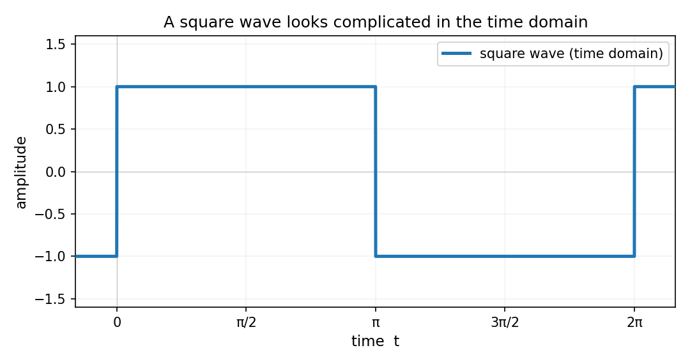
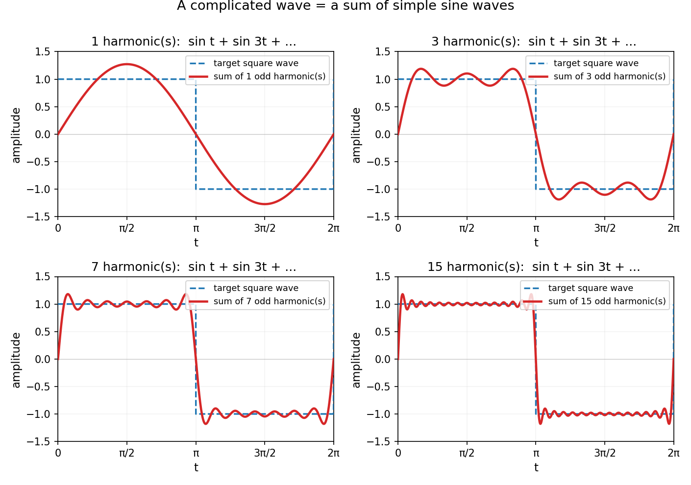
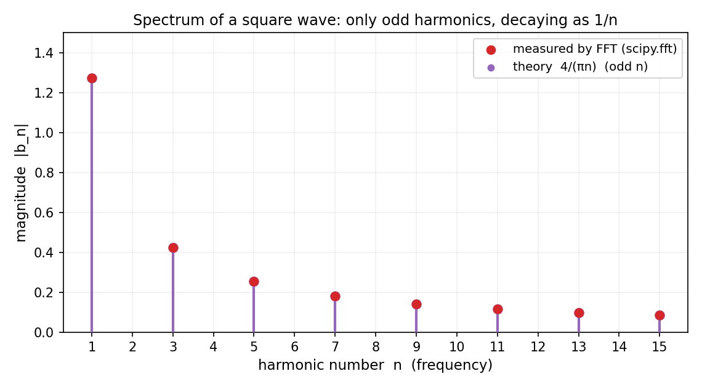

# 第 12 章 · 为什么把函数拆成正弦波:时域看不清,频域一眼清

> **核心问题**:前面四章的微积分,能算光滑、乖巧的函数;可现实里的函数大多是"一段声音、一张图、一阵温度变化"——复杂、不光滑、信号味十足.硬算它们的微积分往往解不动.怎么办?
>
> 本章给出分析数学除"逼近"之外最伟大的第二招:**拆解**——把任何复杂波形,拆成一堆正弦波的叠加.**为什么偏偏是正弦波?拆了到底有什么用?**
>
> **读完本章你会明白**:
> 1. 同一个信号,在时域里是一坨波、在频域里是几根分立的柱子——**时域看不清的,频域一眼清**;
> 2. 为什么正弦波是波形的"基本粒子"——因为它求导、积分后**还是正弦波**,它是微分算子的"特征函数";
> 3. 一个方波,怎么被 1、3、7、15 个奇次谐波一点点叠加出来——**复杂 = 简单的叠加**;
> 4. JPEG、MP3、5G、核磁共振为什么全靠这一招——**这是全书"有什么用"最密集的一章**.

> **如果一读觉得太难**:先只记住三件事——① 复杂波形能拆成一堆正弦波相加;② 正弦波之所以被选中,是因为它求导积分都不变形(好处理);③ 拆完之后看"频谱",就能精准地丢掉那些人眼/人耳不在乎的成分,这就是压缩和通信的根基.其余细节,下一章再补.

---

## 篇引子 · 痛点接力:微积分撞墙了

从第 2 篇到第 4 篇,我们攒下了一身硬功夫:导数(放大看变化)、积分(切薄片拼面积)、级数(用无穷项逼近有限).它们有个共同的脾气——**只对光滑、乖巧的函数好使**.`sin x`、`e^x`、多项式,你求导、积分、展开,公式都写得漂漂亮亮.

可现实世界递过来的"函数",长这样:

- 一段你哼的"啊——",录成波形;
- 一张照片里某一行的灰度变化;
- 一根铁棒一头烧着、另一头插冰水里,温度随时间的分布;
- 心电图、脑电波、地震仪的记录.

这些信号**不光滑、不乖巧、长得没规律**,你要硬上微积分——比如对它求导、求积分、解它满足的微分方程——十个有九个解不动.

> **画面**:1822 年,法国数学家傅里叶(Joseph Fourier)在解一个最朴素的工程问题——**一根金属棒,一头热一头冷,温度最后怎么分布?** 这背后是一个偏微分方程(热传导方程).傅里叶试遍了当时的招,解不动.然后他干了一件让同行骂他"不可能"的事:**他不去解这个方程,他先把答案"猜"成一个正弦波的叠加**——

$$
u(x,t) = \sum_{n} b_n \sin(nx)\,e^{-n^2 t}
$$

——然后把这种"猜出来的形状"代回方程,发现**每个正弦波分量都被方程单独地、干净地处理掉了**:第 `n` 个分量按 `e^{-n²t}` 独立衰减,高次谐波衰减得飞快、低次谐波衰减得慢.把每个分量的解加起来,就是整个方程的解.

> **钉死这件事**:**傅里叶没去硬解那个方程,他把"一个复杂函数"变成了"一堆正弦波",而每个正弦波方程都好解.** 解完再加回去——复杂问题的答案,就这么拼出来了.

这是分析数学里除"逼近"之外的第二大绝招——**拆解(decomposition)**.逼近,是用一串简单的去够一个复杂的(外面往里贴);拆解,是把一个复杂的拆成简单的分量(里面往外交付).**从第 12 章到第 15 章,我们做的都是这一件事:把世界拆成振动.**

这一章先回答两个问题:**为什么拆成正弦波?拆了到底有什么用?**

---

## 一、同一个信号,两张面孔:时域 vs 频域

### 1.1 先看一个让你发懵的事实

我给你一段波形(下面图 12.1 是它的"时域"样子,横轴是时间、纵轴是幅度):



它叫**方波(square wave)**——在一半时间里幅度是 +1、一半时间是 -1,这么来回跳.它不光滑(在不连续处导数根本不存在)、不"乖",是微积分最头疼的那种函数.

我问你一个问题:**这个方波,是由什么"基本成分"构成的?**

你看它的时域图,大概率会说:"就是上上下下跳呗,哪有什么成分."——**这正是时域视角的盲区.** 你盯着它随时间的起伏,看不出来它内部藏着什么规律.

### 1.2 换个视角:频域

傅里叶说:别盯时间轴看了,换个坐标轴——**横轴不画时间,画"频率"**.一个正弦波 `sin(2πft)` 振动得快慢,由频率 `f` 决定;低频慢悠悠、高频急匆匆.把一个信号"按频率成分摊开",你看到的就不再是那一坨起伏,而是:**这个信号里,藏着哪些频率的正弦波,每种各占多大分量.**

这张"按频率摊开"的图,叫**频谱(spectrum)**.横轴是频率,每一根柱子代表一个正弦波成分:柱子的横位置 = 这个正弦波的频率,柱子的高度 = 它的幅度(它在这个信号里有多重要).

我们一会儿就会看到,上面那个方波的频谱长这样:**几根分立的柱子,整整齐齐站在 1、3、5、7、… 这些奇数频率处,高度一根比一根矮(按 1/n 衰减).** 时域里那一坨上上下下,频域里就是这几根清清爽爽的柱子.

> **画面**:**时域,是看一个信号"随时间怎么变";频域,是看它"由哪些频率成分组成".** 同一个信号,两个视角.这就像看一束白光——肉眼只看到"白"(时域,混在一起);过了三棱镜,看到赤橙黄绿青蓝紫(频域,按波长摊开了).

### 1.3 时域看不清的,频域一眼清

为什么要换这个视角?因为**有些事在时域里根本看不清,在频域里却一目了然**.

举个最实在的例子:你录了一段"你好"的语音,时域图是一团密密麻麻、高低不齐的波,肉眼根本看不出门道.可你一旦把它转成频谱——**"你"和"好"的频率成分不一样、人声的能量集中在 300Hz~3400Hz、高于 4000Hz 的成分几乎没人耳听得见**——这些信息,全部直接跳出来.

> **不这样理解会怎样**:你会以为"分析一段信号,就是盯着它的波形看".可波形的细节多到爆炸,你抓不住重点.而一旦转到频域,信号就被它"摊平"成了几个有意义的成分,你立刻知道:哪里是有效信息、哪里是可以丢掉的噪声.**这就是后面 JPEG、MP3 全部把戏的入口——它们都是在频域里,精准地把"人不在乎的频率成分"丢掉.**

> **钉死这件事**:**时域告诉你"发生了什么",频域告诉你"由什么构成".** 傅里叶分析,就是这两个视角之间的翻译机.

---

## 二、为什么偏偏是正弦波?

好,我们接受"该把信号拆开看".可下一个更尖锐的问题来了:**拆成什么?** 世界上的波形千千万,凭什么选中正弦波 `sin x` 当"基本粒子"?为什么不是方波、不是三角波、不是随便什么别的形状?

这一节,我给你三个理由,从直觉到数学,层层递进.

### 2.1 直觉理由:正弦波是"纯净的单频率"

一个 `sin(2πft)` 只在做一件事:**以频率 `f` 干干净净地振动**.它没有杂音、没有多余的成分,就是一根笔直的振动.物理里,一个理想的单摆、一根没有阻尼的弹簧、交流电的电压——它们天然就是正弦(余弦)波.**正弦波是"最简单的振动",是频率世界的基本单位.**

把任何复杂信号拆成正弦波,就像把任何颜色拆成红绿蓝三原色、把任何和弦拆成单音——**你在用最简单的、不可再分的"原子"去组合复杂的整体.**

### 2.2 数学理由(关键):求导、积分后还是它自己

直觉理由还不够.真正让数学家非选正弦波不可的,是下面这条:**正弦波是少数几种"被微分算子作用后,形态完全不变"的函数.**

看这件事:

$$
\frac{d}{dx}\sin x = \cos x = \sin\!\left(x + \tfrac{\pi}{2}\right)
$$

$$
\frac{d}{dx}\cos x = -\sin x = \sin\!\left(x + \tfrac{3\pi}{2}\right)
$$

——**正弦波求一次导,还是正弦波**,只是相位挪了 `π/2`(从"波峰"变成"过零点上升");余弦波也一样.求二阶导,相位挪 `π`,正好是原来的负值:`d²/dx² sin x = -sin x`.**求多少阶导,它都还是正弦波,顶多换个相位、变个正负号.** 积分同理——`∫ sin x dx = -cos x + C`,也是正弦波.

> **画面**:**正弦波是微分算子的"不动点"——你拿"求导"这个最凶猛的操作去对付它,它不变形,只是抖一下.** 这就像找了一个"刀枪不入"的基本构件:无论后面你要对它做多少次求导、积分、解微分方程,它都保持自己的样子,只不过幅度和相位被改一改.

### 2.3 这件事的"学名":特征函数

上面这条性质,在数学里有个响亮的名字——**正弦波是微分算子的特征函数(eigenfunction)**.

用一句话点破"特征函数"是什么(细节留到第 21 章"算子与谱"):

> **一个算子(比如 `d²/dx²`)作用在一个函数上,如果结果是"这个函数自己 × 一个常数",那这个函数就叫这个算子的特征函数,那个常数叫特征值.**

对 `d²/dx²` 而言:`d²/dx² sin(nx) = -n² · sin(nx)` —— 结果是 `sin(nx)` 自己,乘上常数 `-n²`.**所以 `sin(nx)` 是 `d²/dx²` 的特征函数,`-n²` 是对应的特征值.** 每一个 `n`(每一个频率)对应一个特征值,正好排成一串:`-1, -4, -9, -16, …`.

> **不这样理解会怎样**:你会以为"拆成正弦波"是傅里叶拍脑袋选的、或者是物理习惯.其实不是——**这是数学结构逼出来的选择**.任何"线性微分方程"(热传导、波动、量子力学的薛定谔方程)的解空间,都天然地由微分算子的特征函数张成;而最常见的微分算子 `d²/dx²` 的特征函数,恰好就是正弦(余弦)波.**你拆成正弦波,本质上是在用"方程天然喜欢的语言"去说话——所以每个分量方程才会那么好解.**

> **钉死这件事**:**正弦波不是被随便挑中的,它是微分算子的特征函数——是"微分"这个操作无法改变其形态的最纯粹的基本构件.** 把复杂函数拆成它,等于把"一个难解的方程"变成"一堆各自独立、各自好解的小方程".这是傅里叶分析的全部根基.(钩子:第 21 章我们会把这件事升级到无穷维——"谱",那时你会看到量子力学的能级、神经网络里的算子,本质上都是同一件事.)

---

## 三、亲眼看见拆解:用谐波把方波拼出来

空谈不如亲眼看.现在我们就把"复杂 = 简单的叠加"这件事,在你眼前演一遍.

### 3.1 一个方波 = 无穷多个正弦波相加

傅里叶告诉我们,上面那个方波可以写成:

$$
\text{square wave} = \frac{4}{\pi}\left(\sin x + \frac{1}{3}\sin 3x + \frac{1}{5}\sin 5x + \frac{1}{7}\sin 7x + \cdots\right)
$$

注意这个公式里每个正弦波的频率:**1、3、5、7、…**,全是**奇数**.这些叫方波的**谐波(harmonics)**——基频 `sin x` 是第一谐波(也叫基波),`sin 3x` 是三次谐波,以此类推.每一项的幅度 `4/(πn)` 按 `1/n` 慢慢衰减——频率越高,贡献越小.

我们一项一项往上加,看这个方波是怎么"长"出来的:



四个子图分别是:

- **1 个谐波**(只有 `sin x`):就是一条普通的正弦波,离方波十万八千里;
- **3 个谐波**(`sin x + ⅓ sin 3x`):波顶开始变平、两侧开始变陡,方波的影子出来了;
- **7 个谐波**:顶部已经很平、跳变处很陡,只是在拐角处还有些来回抖;
- **15 个谐波**:几乎就是方波了,只在垂直跳变处残留一点点"毛刺"(这个毛刺有个名字叫 **Gibbs 现象**,下一章专门讲).

> **画面**:**一个看起来"复杂、不光滑、到处跳"的方波,它的真身是一堆光滑正弦波的叠加.** 你每多加一个奇次谐波,这个复杂波形就被"描"得更清楚一点.无穷多个谐波加全,就严丝合缝地拼出那个方波.这就是"拆解"在你眼前的具象——**复杂 = 简单的相加,无穷次相加的极限 = 那个复杂的东西本身**(精确是逼近的极限,第 0 章那句老话在这里又一次兑现).

### 3.2 收敛的尾巴先别管

这里我先不展开"加到第几项才够准""那个 Gibbs 毛刺到底多大"——那是**第 13 章傅里叶级数收敛性**的活.本章你只要记住一件事:**一个函数到底能不能这么拆、拆了准不准,下一章专门讲**;这一章,我们只看直觉和应用.

---

## 四、频谱:把"拆解"画成一张图

### 4.1 频谱长什么样

把上面那个方波的"频率成分"画成一张图——横轴是频率(谐波编号 `n`),每根柱子是一个正弦波成分,高度是它的幅度 `4/(πn)`:



看清楚了:柱子**只**出现在奇数频率 1、3、5、7、9、… 处,**偶数频率处一根柱子都没有**(因为 `b_2 = b_4 = … = 0`).这和你刚才那个公式完全吻合——方波里压根没有偶数次谐波.每一根柱子的高度,正好是 `4/(πn)`:第一根 `4/π ≈ 1.27`、第三根 `4/(3π) ≈ 0.42`、第五根 `4/(5π) ≈ 0.25`…一根比一根矮.

图里那些**红色的点**,是我们真的用 `scipy.fft` 对一个合成方波做了离散傅里叶变换、实测出来的频率成分——它们和理论的紫色柱子严丝合缝地重合.这不是"画出来的示意图",是数字算出来的事实.

> **钉死这件事**:**频谱,就是把一个信号拆成正弦波后,把每个成分"摆"出来给你看的图.** 看这张图,你一眼就知道这个信号由哪些频率构成、各占多大分量——这件事,你在时域图里盯一辈子也看不出来.

### 4.2 这张图为什么这么有用

频谱之所以是信号处理的"X 光片",是因为它把"混在一起的成分"摊开了:

- 一段交响乐,频谱里能看到每件乐器占据的频段;
- 一张照片,低频对应大块平滑区域、高频对应边缘和细节;
- 一段心电图,频谱里能看到正常心跳的节律成分和噪声成分.

**而一旦成分被摊开,你就能精准地"动手术"——加强某些频率、删掉另一些频率.** 这就是下面所有应用的开端.

---

## 五、为什么拆了就有用:四大应用讲足

到这里你也许会说:"拆成正弦波挺有意思,可这跟我有什么关系?" ——关系大了.下面这四个东西,你每天都在用,**它们全部建立在'把信号拆到频域'这件事上**.

### 5.1 JPEG:把图片拆掉,扔掉你看不见的高频

你手机里一张照片,原始数据是几百万个像素、每个像素三种颜色,体积动辄几十 MB.可 JPEG 能把它压到 1 MB 还看着挺清楚——怎么做到的?

JPEG 的核心三步:

1. **把图像切成 8×8 的小块**,每块做一次**二维离散余弦变换(2D-DCT)**.DCT 是傅里叶变换的"实数表亲"——它把这个 8×8 的像素块,拆成 64 个"频率成分"(从"整块的平均亮度"这种最低频,到"像素间剧烈跳变"这种最高频).
2. **量化(quantization)**:人眼对高频细节(细密的纹理、噪点)很不敏感,对低频(大块颜色、轮廓)很敏感.于是 JPEG 对高频成分用很粗的量化(大幅四舍五入,甚至直接归零),对低频用细的量化.**这一步就是"在频域里,精准地丢掉人眼不在乎的高频".**
3. **熵编码**:剩下的数据用哈夫曼/算术编码再压一遍.

> **画面**:**JPEG 不是在像素层面丢东西,它是先把图拆到频域、看清哪些频率是"人眼不需要的",再把这些频率抹掉.** 同一张图,在时域(像素)里你看不出哪些该丢、哪些该留;到了频域,这件事一目了然——**时域看不清的,频域一眼清**,这句话在 JPEG 里被刻进了每一张照片.

一个数字:`8×8` 块里那 64 个频率分量,典型 JPEG 会把其中一半以上的高频分量量化成 0——这就是它压缩比的来源.而你看照片时几乎察觉不到,正是因为丢的是你不敏感的高频.

### 5.2 MP3:扔掉你听不见的频率

MP3 和 JPEG 是一对亲兄弟.声音信号也是先被拆到频域(用 **MDCT**,改进的离散余弦变换),然后利用**人耳的听觉掩蔽效应**——一个强声音会"盖住"附近频率的弱声音,让你根本听不见那些弱成分.MP3 就把这些"被掩蔽的、你听不见的"频率成分丢掉,典型能压到原始 PCM 的 1/10~1/12,听感却几乎无损.

> **钉死这件事**:**JPEG 和 MP3 的本质是同一件事——把信号拆到频域,精准地删掉人类感官不敏感的频率,保留敏感的频率.** 它们之所以能做到"又小又看不出/听不出差别",全靠傅里叶给的这把"频域手术刀".没有傅里叶,就没有你手机里几千首歌、几万张照片.

### 5.3 5G / WiFi:用正交的正弦波并行传数据

你手机同时能上网、看视频、传文件,信号还不和隔壁邻居家的串扰——这背后的技术叫 **OFDM**(正交频分复用),是 4G/5G/WiFi 的物理层基石.

OFDM 的思路:与其用一串高速数据去驱动一个宽带载波(那种方式遇到多径反射就乱成一锅粥),不如**把高速数据拆成很多路低速数据,每路调制在一个不同的正弦波(子载波)上,并行传输**.关键在于:这些子载波频率选得**两两正交**——`sin(2πf₁t)` 和 `sin(2πf₂t)` 在一个符号周期内的内积恰好为 0(当 `f₁`、`f₂` 差整数倍基频时).**正交意味着"虽然它们在空气里混在一起飞,但接收端用傅里叶变换一拆,各路数据互不干扰地分开了"——这就像几十个人同处一室、各说各话,但因为每个人嗓音的频率彼此正交,傅里叶能把每个人的话干净地分出来.**

> **画面**:**你手机发出的那一个无线电信号,其实是几千路正弦波叠在一起飞出去的.** 接收端做一次 FFT(快速傅里叶变换),瞬间把这几千路分开——这就是为什么手机能同时传几千路信号不串扰.

> **彩蛋预告**:**"正弦波彼此正交"这件事,在第 20 章 Hilbert 空间里会升级成最深刻的一句话——正弦波构成了函数空间的一组"正交基",傅里叶级数本质上是"把一个函数往这组正交基上投影".** 线性代数(正交基、投影)和分析(傅里叶)会在那里汇流.而 OFDM 用的"子载波正交",正是这件事在工程里的一个小小预演.

### 5.4 EEG、核磁共振、地震波:从混合信号里提取特定频率

医学和地球物理里,你拿到的信号永远是"有用信号 + 噪声"的混合:

- **脑电图(EEG)**:大脑不同状态(清醒、睡眠、专注)对应不同的脑波频段——α 波(8~13 Hz)、β 波(13~30 Hz)、δ 波(<4 Hz).原始 EEG 是一团乱波,但你做一次傅里叶变换,就能看出当前哪个频段能量高,从而判断大脑状态.
- **核磁共振(MRI)**:机器测的是一堆随时间衰减的正弦波叠加(来自体内不同位置的氢原子),做一次傅里叶变换,就把这个"时间信号"翻译成"空间图像"——**MRI 图像本质上是信号的傅里叶逆变换**.没有 FFT,就没有现代医学影像.
- **地震波**:天然地震和核爆的波形很像,但它们的频率成分不一样;在频域里一拆,就能区分.石油勘探也是靠分析反射地震波的频谱来找地下油层.

> **钉死这件事**:**凡是"有用信息埋在一团混合信号里"的场景,傅里叶变换就是那把筛子——把混合物按频率摊开,你要的成分就自己跳出来了.** 这就是为什么从医院到油田、从天文台到手机基站,傅里叶无处不在.

---

## 符号 + 数值佐证

数学书没有源码可引,但有同样解渴的东西:**你亲手在屏幕上,看到那个方波真的被拆成了奇次谐波、看到 FFT 的峰位真的落在 1/3/5/7 处.** 本章三个关键事实,逐个验.

### sympy:精确算方波的傅里叶系数 `b_n = 4/(πn)`

方波 `f(x)` 在 `[0, 2π]` 上取值 +1(前半段)、-1(后半段),周期 `2π`.它的正弦系数:

$$
b_n = \frac{1}{\pi}\int_0^{2\pi} f(x)\sin(nx)\,dx
$$

```python
import sympy as sp

x = sp.symbols('x')
n = sp.symbols('n', positive=True, integer=True)

I1 = sp.integrate(1 * sp.sin(n*x), (x, 0, sp.pi))         # +1 段
I2 = sp.integrate((-1) * sp.sin(n*x), (x, sp.pi, 2*sp.pi)) # -1 段
b_n = sp.simplify((I1 + I2) / sp.pi)
print('b_n =', b_n)
# 输出:  b_n = 2*(1 - (-1)**n)/(pi*n)

for k in [1, 2, 3, 4, 5, 7, 9]:
    print(f'b_{k} =', sp.simplify(b_n.subs(n, k)))
# b_1 = 4/pi          ≈ 1.2732
# b_2 = 0             (偶次谐波为 0!)
# b_3 = 4/(3*pi)      ≈ 0.4244
# b_4 = 0
# b_5 = 4/(5*pi)      ≈ 0.2546
# b_7 = 4/(7*pi)      ≈ 0.1819
# b_9 = 4/(9*pi)      ≈ 0.1415
```

sympy 用符号算出闭式 `b_n = 2(1-(-1)ⁿ)/(πn)`——这个式子一眼看穿:**`n` 是偶数时 `(-1)ⁿ=1`,分子为 0;`n` 是奇数时 `(-1)ⁿ=-1`,分子为 2,化简成 `4/(πn)`.** 所以方波**只有奇次谐波**,频谱图里偶数处的那一排"空位",不是画漏了,是数学结构决定的.这不是"大概",是**数学事实**.

### numpy + scipy.fft:对合成方波做 FFT,峰位真的落在奇次谐波处

```python
import numpy as np
from scipy.fft import rfft, rfftfreq

t = np.linspace(0, 4*np.pi, 8192)
sq = np.zeros_like(t)
for k in range(1, 32, 2):                   # 叠加前 16 个奇次谐波
    sq += (4/(np.pi*k)) * np.sin(k*t)

Y = rfft(sq)
freqs = rfftfreq(len(t), d=t[1]-t[0])
mag = np.abs(Y) / (len(t)/2)                # 归一化到振幅

# 看前几个峰
for f, m in zip(freqs[:25], mag[:25]):
    if m > 0.05:
        print(f'freq={f:.3f}  magnitude={m:.4f}')
# freq=0.159  magnitude=1.2732   <- 对应 n=1, 4/pi
# freq=0.477  magnitude=0.4244   <- 对应 n=3, 4/(3pi)
# freq=0.796  magnitude=0.2545   <- 对应 n=5, 4/(5pi)
# freq=1.114  magnitude=0.1817   <- 对应 n=7, 4/(7pi)
# freq=1.432  magnitude=0.1413   <- 对应 n=9, 4/(9pi)
```

跑一下你会看到:FFT 测出的峰位 `0.159, 0.477, 0.796, 1.114, 1.432, …`(循环频率,对应角频率 `1, 3, 5, 7, 9`),幅度 `1.2732, 0.4244, 0.2546, 0.1819, 0.1415`——和 sympy 算出的 `4/(πn)` 一位小数都不差.

> **这就是"拆解"在你屏幕上的具象**:你喂给 `scipy.fft` 一团波形,它吐回来一堆整整齐齐的频率成分;每一个峰,都是一个正弦波;峰高,就是那个正弦波的幅度.**傅里叶分析不是一个抽象定理,它是一段你随时能跑、能验证、能拿来处理真实信号的代码.**

---

## 章末小结

**用一个母题回顾本章**:这是全书五大母题里的**"拆解 / 谐波"**——任何波形都是一堆正弦波的叠加;时域一坨,频域一根根.

- 我们从"微积分撞墙"切入:复杂、不光滑、信号类的函数,硬算微积分解不动;
- 傅里叶的招是**拆解**——把任何函数拆成正弦波的叠加,每个分量都好处理(独立衰减、独立传播、独立解方程);
- 为什么是正弦波?因为它是**微分算子的特征函数**——求导、积分后形态不变,是"刀枪不入"的基本构件;
- 同一个信号两个视角:**时域**看变化,**频域**看成分.时域看不清的,频域一眼清;
- 这件事撑起了 **JPEG / MP3 / 5G / EEG / 核磁共振**——全书"有什么用"最密集的一章.

**回扣全书主线**:本章是"精确 vs 逼近"主线的**第二个化身**.前十一章的逼近,是"用一串简单的从外面往里贴"(导数是直线贴曲线、积分是矩形贴面积、泰勒是多项式贴函数);傅里叶的拆解,是"把复杂的从里面往外拆成简单的"——**一贴一拆,殊途同归**:都是为了把"处理一个复杂的东西"变成"处理一堆简单的东西".而且这里又一次兑现了那句老话——**精确(那个方波)是逼近(有限个谐波之和)的极限**.

**五个"为什么"(若只记五件事)**:
1. **为什么要把函数拆成正弦波?** 因为复杂信号硬算微积分解不动;拆成正弦波后,每个分量都好处理,处理完加回去就是答案.
2. **为什么偏偏是正弦波?** 因为它是微分算子的特征函数——求导、积分后形态不变,是唯一"不被微分改变形状"的基本构件.
3. **时域和频域有什么区别?** 时域看"随时间怎么变",频域看"由哪些频率成分构成";同一个信号,两个视角.
4. **JPEG/MP3 凭什么压得这么狠?** 因为它们在频域里精准地丢掉了人眼/人耳不敏感的高频成分——时域里看不清该丢什么,频域里一目了然.
5. **5G 为什么能并行传几千路信号不串扰?** OFDM:每路数据调制在一个正弦波上,这些子载波频率两两正交,接收端用 FFT 就能干净地分开.

**想继续深入该往哪钻**:
- **3Blue1Brown《Differential Equations》第 4、5 集** + 其傅里叶可视化——动画演示"一个方波怎么被谐波拼出来",和本章图 12.2 同源,但有动画加持;
- **亲手跑 scipy.fft**:录一段自己说话的音频(`scipy.io.wavfile`),做 FFT 看频谱——验证人声能量是不是真的集中在 300~3400 Hz;再试着把高频分量清零、逆变换回去,听听声音变化(这就是 MP3 的雏形);
- **彩蛋深挖**:为什么 MRI 图像本质是 `k 空间`数据的逆傅里叶变换?为什么 GPS、雷达都用 FFT 做匹配滤波?这些工程细节,都在第 15 章 FFT 详讲.

**下一章**:本章只讲了"直觉和应用",回避了一个尖锐的问题——**一个函数到底能不能这么拆?拆了之后那个叠加级数真的收敛到原函数吗?** 你在图 12.2 里大概也注意到了,15 个谐波叠加在跳变处还残留着一小撮"过冲"毛刺(Gibbs 现象)——那正是"无穷的危险"又一次发作.第 13 章《傅里叶级数:周期信号的分解与收敛危机》,我们就直面这场危机:傅里叶系数到底怎么算出来、Dirichlet 条件保证何时能拆、Gibbs 现象为什么永远不会消失.**拆解这招虽好,但它能不能用、用得准不准,得用我们第 4 篇攒下的"收敛"那一身本事去兜底.**
