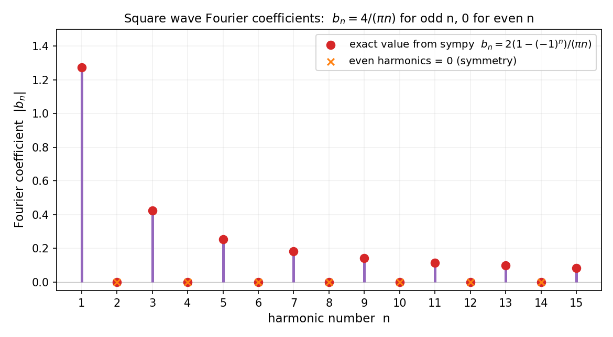
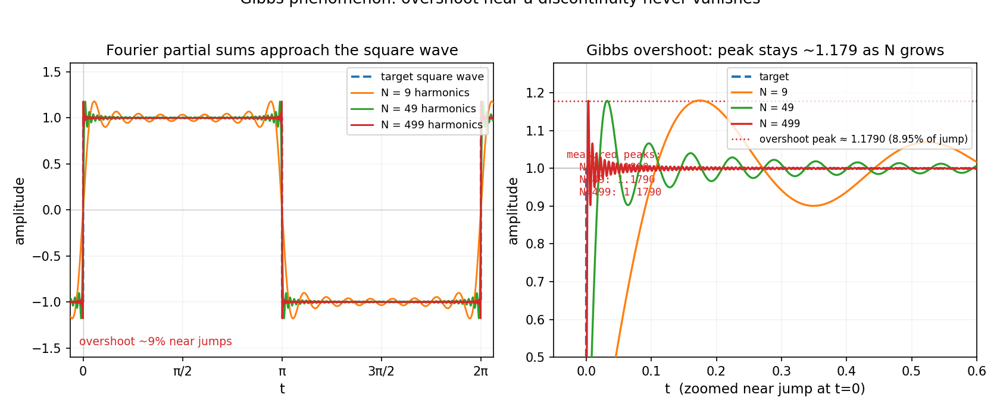

# 第 13 章 · 傅里叶级数:周期信号的分解与收敛危机

> **核心问题**:上一章我们看到,一个方波可以拆成正弦波的叠加,谐波加得越多越像方波.可问题立刻来了:**那个"叠加级数"真的收敛吗?收敛到的东西就是原函数吗?有没有什么函数,根本拆不开?**
>
> 本章就把这套"拆解术"从直觉推到能动手算、能判收敛的正式级数.我们会看到:系数怎么算出来(一个干净利落的积分公式)、什么时候能拆(Dirichlet 条件)、以及一个让人不安的事实——**不连续处永远有个 9% 的过冲消不掉(Gibbs 现象),它是"无穷的危险"在傅里叶身上的又一次发作.**
>
> **读完本章你会明白**:
> 1. 傅里叶系数 `aₙ, bₙ` 不是拍脑袋给的,而是"把原函数往正弦波/余弦波上投影"的积分——和线性代数里"求分量"是同一件事;
> 2. **Dirichlet 条件**:函数只要"分段光滑"(别太病态),它的傅里叶级数就一定收敛,而且在连续点等于函数值、在跳变点等于左右极限的平均;
> 3. **Gibbs 现象**:不管你加多少谐波,不连续点附近的过冲(约跳变幅度的 9%)永远不会消失——这是"点态够近、整体不够近"的具象,呼应第 10 章的一致收敛;
> 4. 傅里叶级数是"精确 = 逼近的极限"这句老话的又一个实例,但这一次,"无穷的危险"在过冲里露了真容.

> **如果一读觉得太难**:先只记住三件事——① 傅里叶系数就是"原函数在某个正弦波上的分量",用积分算;② Dirichlet 条件是"分段光滑就能拆"的通行证;③ Gibbs 现象是不连续处那 9% 的顽固过冲,加再多谐波也消不掉——它是无穷逼近的一个固有"伤疤".其余细节,边读边补.

---

## 章首 · 一句话点破

> **傅里叶级数,是把一个周期函数"投影"到一族正交的正弦波上,得到一组系数;这组系数加回去,在"好"的函数上处处等于原函数,在不连续处却会留一道抹不平的疤——Gibbs 过冲.**

这句话是结论,不是理由.本章倒过来拆:先看系数怎么从"投影"自然推出来,再看 Dirichlet 条件划清"能拆"与"不能拆"的界线,最后直面 Gibbs 现象——为什么无穷次逼近也填不平那一道坎.

---

## 一、从直觉到公式:系数是"投影"出来的

### 1.1 上一章的遗留问题:那些 `4/(πn)` 是哪来的

上一章我们甩出一个公式:

$$
\text{方波} = \frac{4}{\pi}\left(\sin x + \frac{1}{3}\sin 3x + \frac{1}{5}\sin 5x + \cdots\right)
$$

你大概率会问:**那个 `4/π`、`4/(3π)`、`4/(5π)`…… 凭什么是这些数?谁定的?**

这一节就回答这个问题.而且答案会出乎意料地干净——它不是傅里叶拍脑袋,也不是凑出来的,而是**一个积分**自然吐出来的.更妙的是,这个积分的逻辑,你在**线性代数**里已经见过.

### 1.2 先回忆线代:怎么把向量拆成"分量"

假设你有一组**正交**的基底向量 `e₁, e₂, e₃`(比如标准坐标轴).任何一个向量 `v` 都能写成它们的线性组合:

$$
v = c_1 e_1 + c_2 e_2 + c_3 e_3
$$

**怎么求 `c₁`?** 因为 `e₁, e₂, e₃` 正交(`eᵢ · eⱼ = 0` 当 `i≠j`),你只要两边同时**点乘 `e₁`**:

$$
v \cdot e_1 = c_1 \underbrace{(e_1 \cdot e_1)}_{=1} + c_2 \underbrace{(e_2 \cdot e_1)}_{=0} + c_3 \underbrace{(e_3 \cdot e_1)}_{=0} = c_1
$$

——其他项全因为正交而消失,只剩 `c₁`.**这就是"求分量"的本质:点乘对应的基底,正交性帮你把别的分量全屏蔽掉.**

> **画面**:想象你在三维空间,想知道一个力在"东"方向有多大分量.你把力向量**点乘东方向的单位向量**——北、上两个分量因为是正交方向,点乘后归零,只剩东方向的分量.**正交,是"分量能独立提取"的物理保证.**

### 1.3 把这件事搬到函数上:正弦波彼此正交

现在,把"向量"换成"函数",把"点乘"换成"积分".傅里叶的核心洞察是:**一族正弦波 `sin(nx)`(和余弦 `cos(nx)`)在 `[0, 2π]` 上是两两正交的**——它们的"内积"(积分)为零:

$$
\int_0^{2\pi} \sin(mx)\sin(nx)\,dx = 0 \quad (m \neq n)
$$

$$
\int_0^{2\pi} \sin(mx)\cos(nx)\,dx = 0 \quad (\text{任意 } m, n)
$$

这条用积化和差就能证:`sin(mx)sin(nx) = ½[cos((m-n)x) - cos((m+n)x)]`,在一个完整周期上积分,余弦的面积正好抵消归零.**正弦波彼此正交——这是傅里叶分析的地基,也是 OFDM、Hilbert 空间正交基(第 20 章)的源头.**

> **画面**:**正弦波彼此正交,意味着它们是"函数空间里的一组正交基底".** 你把一个函数写成它们的叠加,就等于把一个向量写成正交基的线性组合——线代里学的"投影求分量",在这里一字不差地复刻,只不过"内积"从点乘变成了积分.(钩子:第 20 章 Hilbert 空间,我们会把这件事升级成最深刻的一句话——**傅里叶级数 = L² 空间的正交分解**,线代和分析在那里汇流.)

### 1.4 推出系数公式:两边"积分乘以 sin(nx)"

有了正交性,系数公式几乎是自动蹦出来的.假设一个周期函数 `f(x)` 能拆成:

$$
f(x) = \sum_{n=1}^{\infty} b_n \sin(nx)
$$

两边**同乘 `sin(mx)` 再在 `[0, 2π]` 上积分**(这就是函数版的"点乘 `eₘ`"):

$$
\int_0^{2\pi} f(x)\sin(mx)\,dx = \sum_{n=1}^{\infty} b_n \underbrace{\int_0^{2\pi}\sin(nx)\sin(mx)\,dx}_{\text{正交, 只有 } n=m \text{ 时非零}}
$$

由于正交性,求和里**只剩 `n = m` 那一项**;而 `∫₀²π sin²(mx) dx = π`(这是 `sin²` 的平均值 `½` 乘区间长 `2π`).所以:

$$
\int_0^{2\pi} f(x)\sin(mx)\,dx = b_m \cdot \pi \quad\Longrightarrow\quad b_n = \frac{1}{\pi}\int_0^{2\pi} f(x)\sin(nx)\,dx
$$

**这就是傅里叶系数公式.** 同理,如果展开里有余弦项和常数项,完整的三组系数是:

$$
a_0 = \frac{1}{2\pi}\int_0^{2\pi} f(x)\,dx \quad(\text{直流分量 / 平均值})
$$

$$
a_n = \frac{1}{\pi}\int_0^{2\pi} f(x)\cos(nx)\,dx, \qquad b_n = \frac{1}{\pi}\int_0^{2\pi} f(x)\sin(nx)\,dx
$$

而完整的傅里叶级数是:

$$
f(x) \sim \frac{a_0}{2} + \sum_{n=1}^{\infty}\bigl(a_n\cos(nx) + b_n\sin(nx)\bigr)
$$

> **不这样理解会怎样**:你会以为这些系数公式是"硬背的积分",记了忘、忘了记.但它们其实是**"正交基上求分量"这个线代动作的翻译**——你只要记住"两边乘 `sin(nx)` 再积分、正交性屏蔽掉别的项",公式你自己就能推出来.这就是全书反复强调的:**公式是逼近(这里是"投影")的副产品,不是咒语.**

> **钉死这件事**:**傅里叶系数 `aₙ, bₙ` 就是"原函数在第 `n` 个正弦/余弦波上的分量",用积分(函数版的点乘)提取.正交性是这套提取术的灵魂——它让每个系数只依赖原函数和对应的那一个基底,与别的分量无关.**

---

## 二、算一个实例:方波的系数 `bₙ = 4/(πn)`(奇数项)

光说公式不够过瘾,我们亲手算一个,顺便验证上一章那个 `4/(πn)` 确实是积分吐出来的.

### 2.1 代入方波

方波 `f(x)` 定义在 `[0, 2π]` 上:前半段 `[0, π]` 取 `+1`,后半段 `[π, 2π]` 取 `-1`,周期 `2π`.它是个**奇函数**(关于原点对称),所以余弦系数 `aₙ` 全是零,直流分量 `a₀` 也是零——只剩 `bₙ`.代入公式:

$$
b_n = \frac{1}{\pi}\int_0^{2\pi} f(x)\sin(nx)\,dx = \frac{1}{\pi}\left[\int_0^{\pi}(+1)\sin(nx)\,dx + \int_{\pi}^{2\pi}(-1)\sin(nx)\,dx\right]
$$

这两个积分都是初等的:`∫sin(nx)dx = -cos(nx)/n`.第一段:

$$
\int_0^{\pi}\sin(nx)\,dx = \left[-\frac{\cos(nx)}{n}\right]_0^{\pi} = \frac{1 - \cos(n\pi)}{n} = \frac{1 - (-1)^n}{n}
$$

第二段同理,凑出来也是 `½(1 - (-1)ⁿ)/n` 量级.加起来:

$$
b_n = \frac{2(1 - (-1)^n)}{\pi n}
$$

**看这个式子一眼看穿一切:**
- `n` 是**偶数**时,`(-1)ⁿ = 1`,分子 `1 - 1 = 0` —— **`bₙ = 0`,方波没有偶次谐波**;
- `n` 是**奇数**时,`(-1)ⁿ = -1`,分子 `1 - (-1) = 2` —— **`bₙ = 4/(πn)`**.

这就是上一章那串数字 `4/π, 4/(3π), 4/(5π), …` 的来历——**不是凑的,是积分算出来的**.而且奇偶性那件事,被 `(-1)ⁿ` 这一个符号干净利落地表达了出来.

> **画面**:方波的频谱之所以只在奇数频率有柱子、偶数处是空的,根源在于方波**半波对称**——它的正半周和负半周形状相反,这种对称性让偶次谐波在积分时两两抵消为零.**频谱的样子,是时域形状的对称性"印"上去的.**

把方波前几个 `bₙ` 画成频谱柱,你会看到一副整整齐齐的画面:



奇数 1、3、5、7、9 处各立一根柱,高度 `4/π ≈ 1.27`、`4/(3π) ≈ 0.42`、`4/(5π) ≈ 0.25`、… 一根比一根矮,严格按 `1/n` 衰减;偶数 2、4、6、8 处一片空白.**整张图就是积分公式 `bₙ = 4/(πn)` 的可视化——每一根柱子都是一个积分吐出来的数,红点是 sympy 精确算出来的值,和理论柱严丝合缝.** 上一章你看到的频谱,背后的"户口"就在这里.

### 2.2 一个更妙的结论:Parseval 等式

既然系数是"投影的分量长度",那么"所有分量的平方和"就应该等于"原函数的能量"(范数平方).这就是 **Parseval 等式**:

$$
\frac{1}{\pi}\int_0^{2\pi} f(x)^2\,dx = \frac{a_0^2}{2} + \sum_{n=1}^{\infty}(a_n^2 + b_n^2)
$$

——**时域里的能量(函数平方的积分)= 频域里的能量(系数平方的和).** 这就像线代里 `|v|² = c₁² + c₂² + c₃²`(勾股定理的正交版),只不过从有限维搬到了无穷维.

对方波,`∫f² = ∫1 = 2π`,所以 `Σ bₙ² = 2`.代入 `bₙ = 4/(πn)`(奇数):

$$
\sum_{k=0}^{\infty}\left(\frac{4}{\pi(2k+1)}\right)^2 = \frac{16}{\pi^2}\sum_{k=0}^{\infty}\frac{1}{(2k+1)^2} = 2
$$

由此居然能反推出 `Σ 1/(2k+1)² = π²/8`——这是数学里一个著名的"漂亮的和".**傅里叶不只是分解工具,它还打通了时域和频域的能量账,甚至能反过来算出某些级数的和.** Parseval 等式我们在符号佐证里会验一下.

> **钉死这件事**:**方波的 `bₙ = 4/(πn)` 是积分算出来的,奇偶性由对称性决定;Parseval 等式把"时域能量"和"频域能量"画了等号——这是正交分解的勾股定理在无穷维的版本.**(钩子:第 20 章 Hilbert 空间,Parseval 等式是"正交基完备"的标志.)

---

## 三、Dirichlet 条件:什么时候一个函数真能拆

### 3.1 一个尖锐的问题:级数"写得出",就一定"收敛"吗

到现在为止,我们一直在"假设 `f(x)` 能拆"的前提下推公式.可一个尖锐的问题横在前面:**那个无穷级数 `Σ bₙsin(nx)`,真的收敛吗?收敛的话,收敛到 `f(x)` 吗?**

回想第 9、10 章:**写出一个无穷级数,不等于它有意义**.调和级数 `Σ 1/n` 发散;`xⁿ` 在 `[0,1]` 上点态收敛到一个不连续的极限(第 10 章那个反例).傅里叶级数是函数项级数,所有这些"无穷的危险"它都逃不掉,而且因为它在跳变点附近特别"倔",危险还更隐蔽.

历史上,这件事困扰了数学界半个世纪.傅里叶 1822 年大胆断言"任何函数都能拆成正弦波",被同行骂"荒谬";直到 1829 年,**Dirichlet(狄利克雷)**才第一次给出严格的收敛条件,把"能拆"和"不能拆"的界线划清楚.

### 3.2 Dirichlet 条件:分段光滑就能拆

Dirichlet 证明的是:**满足下面两个宽松条件的周期函数,其傅里叶级数一定收敛.**

> **Dirichlet 条件**(在 `[0, 2π]` 一个周期上):
> 1. **分段单调、且单调段只有有限个**(别无穷次振荡);
> 2. **绝对可积**:`∫₀²π |f(x)| dx < ∞`(别在无穷多个点发散).

更常用的现代说法是**"分段光滑"**:函数本身最多有限个不连续点、有限个极值点,且在不连续点两侧有有限的左极限和右极限.**绝大多数工程信号(方波、三角波、锯齿波、语音、图像、心电图)都满足 Dirichlet 条件——这就是为什么傅里叶分析在工程里这么"好用".**

而收敛的结论更精确,叫 **Dirichlet 收敛定理**:

> **若 `f` 满足 Dirichlet 条件,其傅里叶级数在每一点 `x` 都收敛,且收敛到:**
> - **在连续点**:`f(x)` 本身;
> - **在跳变点(不连续点)**:`½[f(x⁺) + f(x⁻)]`,即**左右极限的平均值**.

> **画面**:**傅里叶级数在连续处严丝合缝拼回原函数;但在跳变处,它收敛到"跳变两端的中间值"——它不选边.** 这就像问一个诚实的人在 `f` 从 -1 跳到 +1 的那个点"`f` 是几",他会说"我取两边的平均,0".方波在 `t=0` 处的真值是个未定义的跳变,傅里叶级数告诉你:**它的级数在那一点收敛到 0**.

### 3.3 哪些函数"拆不动":Dirichlet 之外的病态

Dirichlet 条件是充分的(够用就行),不是必要的.但确实存在**不满足 Dirichlet 条件、傅里叶级数失效**的函数.最著名的是 Dirichlet 自己构造的反例:

> **Dirichlet 函数**:`D(x) = 1` 当 `x` 是有理数,`0` 当 `x` 是无理数.

这个函数**处处不连续**(每个有理数旁边都是无理数、反之亦然),根本不"分段光滑".它的傅里叶系数全是零(因为对黎曼积分而言它太病态),级数恒为 0,和原函数毫无关系.

> **不这样理解会怎样**:你会以为"傅里叶级数是万能的,任何函数都能拆".**不是.** 太病态的函数(无穷次振荡、处处不连续)它处理不了.这件事在 19 世纪末逼出了**勒贝格积分**(第 16 章)——用测度重做积分,才能容纳更广的函数类,让傅里叶分析的根基真正扎实.**傅里叶级数的收敛危机,是函数论(实变)被逼出来的直接导火索之一——这就是"痛点接力".**

> **钉死这件事**:**Dirichlet 条件 = "分段光滑" = 工程信号的通行证.** 满足它,傅里叶级数一定收敛:连续处等于函数值,跳变处等于左右极限的平均.太病态的函数(如 Dirichlet 函数)拆不动,正是这种"拆不动"逼出了后面的勒贝格积分.

---

## 四、Gibbs 现象:那道抹不平的 9% 过冲

### 4.1 一个让人不安的实验

现在,我们直面本章最反直觉的现象.回到方波,我们用越来越多的奇次谐波去逼近它:`N=9` 个、`N=49` 个、`N=499` 个.直觉告诉我们:加得越多,应该越贴合.连续处确实如此——但**在跳变点附近**,发生了一件怪事.

我们画出来:



看清楚了吗:**不管加多少谐波,跳变点正上方都有一个"过冲"——逼近曲线会冲到约 1.179,而真值是 1,超出去约 0.179.** 这个超出量相对于方波的跳变幅度(从 -1 到 +1,共 2)正好是 `0.179/2 ≈ 8.95%`,常被四舍五入说成 **9%**.`N=9` 时过冲约 9%,`N=49` 时还是约 9%,`N=499` 时——**还是约 9%**.谐波越多,过冲只是**变窄**(挤在更小的范围里),但**峰值高度永不下降**.

这就是 **Gibbs 现象(Gibbs phenomenon)**,1899 年由 Josiah Willard Gibbs 正式指出(其实 Henry Wilbraham 1848 年就发现过,但被遗忘了).

### 4.2 为什么过冲消不掉:这是"不一致收敛"

这个 9% 从哪来?为什么无穷逼近也消不掉?答案藏在第 10 章那套语言里:**方波的傅里叶级数在跳变点附近"不一致收敛".**

回忆第 10 章:一致收敛要求"最坏点的逼近误差随 `N→∞` 缩到 0".而方波的傅里叶部分和 `S_N(x)`,在连续区间(比如 `[0.1, π-0.1]`)上**一致收敛**到 1——好.但在跳变点 `x=0` 附近一个越来越小的邻域里,总有一个点 `x_N`,那里的 `S_N(x_N)` 冲到约 1.179——**这个"最坏点"的误差始终是 0.179,`N` 再大也不缩.**

> **画面**:**随着 `N` 增大,过冲的"宽度"越来越窄(挤向跳变点),但"峰值高度"锁死在约 0.179(占跳变幅度约 9%).** 你用肉眼看,会觉得"加得多了,毛刺好像小了"——其实毛刺只是变细了,峰值没降.这就是"点态够近(每个固定点的误差→0)、整体不够近(最坏点误差不→0)"在信号处理里的具象化.**Gibbs 现象,就是"不一致收敛"在傅里叶身上留下的那道疤.**

> **不这样理解会怎样**:你会以为"只要加足够多的谐波,傅里叶级数就能在任何意义下完美逼近原函数".**做不到,至少做不到一致逼近.** 在跳变点,有限谐波叠加永远超调约 9%.这是无穷逼近的一个**内禀缺陷**,不是算法的 bug、不是谐波不够多,而是数学结构决定的.**第 0 章那句"无穷是危险的",在 Gibbs 现象里又一次露脸:无穷次逼近,不一定换得来"整体无误".**

### 4.3 算清楚那个 9%:Gibbs-Wilbraham 常数

这个 9% 不是个大概的数,它有精确值.对幅度从 `-1` 跳到 `+1`(跳变高度 2)的方波,**单侧过冲峰值**(超出真值 `+1` 的部分)的精确比例是:

$$
\text{单侧过冲峰值} = \frac{2}{\pi}\int_0^{\pi}\frac{\sin u}{u}\,du - 1 \approx 0.17898
$$

——也就是说峰值会冲到 `1 + 0.17898 = 1.17898`.而 `0.17898` 除以**跳变幅度 2**,得到 `0.08949`,约 **8.95%**(常被四舍五入说成 9%),这个值叫 **Gibbs-Wilbraham 常数**.它来自 `sin(u)/u` 这个积分(也叫 **sinc 函数**的积分,下一章会反复出现,它是矩形脉冲傅里叶变换的形状).

> **钉死这件事**(把数字理清楚):**单侧峰值 ≈ 1.179,超出 `+1` 的部分 ≈ 0.179;这个超出量除以跳变幅度 2,得 8.95% —— 这就是"Gibbs 过冲约 9%"的精确含义.** 有的书把它写成"峰峰值过冲"(双侧加起来 ≈ 0.358),有的只写单侧 0.179,数值口径不同,但描述的是同一件事:那道抹不平的坎.

我们一会儿用 numpy 把这个数精确算出来,你会看到 499 个谐波时,过冲峰值稳稳贴在 1.1790 附近——`N` 再大也撼动不了它.

### 4.4 工程上怎么对付 Gibbs

Gibbs 现象虽然"消不掉",但工程师有几个常用的办法**缓和**它(注意是缓和,不是根除):

1. **加窗(windowing)**:在叠加前,给每个谐波乘一个衰减因子(比如 Hamming、Hann 窗),让高次谐波的贡献更平滑地减小.这会牺牲一点点跳变处的陡峭度,但能把过冲从 9% 压到 1% 以下.**这就是为什么实际信号处理里几乎从不用"原始"傅里叶部分和,而是用加窗的版本.**
2. **用过冲更小的基**:比如用某些小波(wavelet)代替正弦波,跳变处的过冲可以更小——这是小波分析(本书不讲)的动机之一.
3. **接受它**:在图像压缩(JPEG)里,DCT 的块边缘也有类似 Gibbs 效应(叫"振铃" ringing),但只要量化别太狠,人眼几乎察觉不到.

> **钉死这件事**:**Gibbs 现象是傅里叶级数在不连续点处的固有 ~9% 过冲(单侧峰值超 0.179,占跳变幅度 2 的 8.95%),源于跳变点附近的"不一致收敛".它消不掉,只能用加窗等方法缓和.这是"无穷的危险"在傅里叶分析里最经典的露脸——无穷次逼近,换不来整体无误.**

---

## 五、彩蛋:Gibbs 现象不止于方波——它在图像、音频里也叫"振铃"

Gibbs 现象不只是方波的怪事,它在所有"用有限带宽信号逼近不连续边缘"的场景都会出现:

- **JPEG 压缩的"振铃伪影"(ringing artifacts)**:你把一张图压得太狠,在锐利边缘(文字、轮廓)旁边会看到一圈圈波纹状的"鬼影"——那就是 DCT(傅里叶的表亲)在边缘处产生的 Gibbs 过冲.高频分量被量化丢掉后,边缘重建时过冲显形.
- **MP3 的"预回声"(pre-echo)**:打击乐(瞬间起跳的信号)压缩后,在击打瞬间之前会听到一点微弱的"预响"——也是频率域重建在时域跳变处的过冲.
- **医学影像重建**:CT、MRI 用有限个频率采样重建图像,在骨骼/软组织边界也会有 Gibbs 振铃.

**所有这些,都是同一个数学现象——有限频率成分逼近跳变边缘时的 9% 过冲——在不同领域的化身.** 理解了 Gibbs,你就理解了为什么所有基于傅里叶的压缩/重建,都要小心对待"锐利边缘".

> **画面**:**Gibbs 现象是"频率域有限带宽"和"时域锐利边缘"之间永恒的张力的具象.** 你不可能既用有限个正弦波(有限带宽),又在时域完美重建一个瞬时跳变——这对矛盾,正是下一章"不确定性原理"(时频对偶,信号越短频谱越宽)的近亲.

---

## 符号 + 数值佐证

### sympy:精确算方波的 `bₙ` 和 Parseval 等式

```python
import sympy as sp

x = sp.symbols('x')
n = sp.symbols('n', positive=True, integer=True)

# 方波的 b_n = (1/pi) * [∫_0^pi sin(nx) dx - ∫_pi^{2pi} sin(nx) dx]
I1 = sp.integrate(sp.sin(n*x), (x, 0, sp.pi))
I2 = sp.integrate(sp.sin(n*x), (x, sp.pi, 2*sp.pi))
b_n = sp.simplify((I1 - I2) / sp.pi)
print('b_n =', b_n)              # 2*(1 - (-1)**n)/(pi*n)

for k in [1, 2, 3, 4, 5, 7, 9]:
    print(f'  b_{k} =', sp.simplify(b_n.subs(n, k)))
# b_1 = 4/pi          ≈ 1.2732
# b_2 = 0             (偶次谐波为 0!)
# b_3 = 4/(3*pi)      ≈ 0.4244
# ...

# Parseval 验证: Σ b_n^2 (奇数 n) 应 = 2
S = sp.summation((4/(sp.pi*(2*n+1)))**2, (n, 0, sp.oo))
print('Σ b_n^2 =', sp.simplify(S))   # 2   ✓
# 顺带推出 Σ 1/(2k+1)^2 = pi^2/8
print('Σ 1/(2k+1)^2 =', sp.summation(1/(2*n+1)**2, (n, 0, sp.oo)))   # pi**2/8
```

sympy 吐出来的 `b_n = 2(1-(-1)ⁿ)/(πn)` 和我们手算的一字不差;Parseval 那个和 `Σ bₙ² = 2` 也对上——**公式 = 直觉,严丝合缝**.

### numpy:亲手看见 Gibbs 过冲锁在 9%

```python
import numpy as np
from scipy import integrate

# 用前 N 个奇次谐波叠加,看跳变点附近的过冲峰值
t = np.linspace(0, 2*np.pi, 200000, endpoint=False)

for N in [9, 49, 499, 4999]:
    s = np.zeros_like(t)
    k = 1
    for _ in range(N):
        s += (4/(np.pi*k))*np.sin(k*t)
        k += 2
    # 跳变在 t=0, 看 (0, pi) 内的过冲峰
    mask = (t > 1e-6) & (t < np.pi)
    peak = np.max(s[mask])
    overshoot = peak - 1.0
    frac_of_jump = overshoot / 2.0    # 相对跳变幅度 2 的比例
    print(f'N={N:5d}:  峰值 = {peak:.5f}  (超出 1.0 共 {overshoot:.5f}, 占跳变幅度 2 的 {frac_of_jump*100:.2f}%)')

# 理论值: Gibbs-Wilbraham 常数 = (2/pi)*Si(pi) - 1
Si_pi = integrate.quad(lambda u: np.sin(u)/u, 0, np.pi)[0]
peak_theory = (2/np.pi)*Si_pi
print(f'理论单侧峰值 = {peak_theory:.5f}  (超出 1.0 共 {peak_theory-1:.5f}, 占跳变 {(peak_theory-1)/2*100:.2f}%)')
```

跑一下你会震撼地看到:`N=9` 时过冲峰值约 1.18,`N=49` 时约 1.179,`N=499` 时**还是约 1.179**,`N=4999` 时——**纹丝不动地约 1.1790**.**谐波从 9 加到 4999,过冲峰值(超出 1 的部分约 0.179,占跳变幅度 2 的 8.95%)一个百分点都没降.** 理论值 `0.08949` 和数值吻合到小数点后四位.这就是 Gibbs 现象在你屏幕上的铁证——**无穷的危险,有时再多逼近也填不平.**

---

## 章末小结

**用两个母题回顾本章**:本章是"**拆解 / 谐波**"母题的正式化(上一章给直觉,本章给公式和收敛判据),也是"**缰绳 / 可控**"母题的又一次显形(Dirichlet 条件是"能拆"的缰绳,Gibbs 现象是"缰绳断了"的代价).

- 傅里叶系数 `aₙ, bₙ` 是"原函数在正弦/余弦波上的**投影**",用积分(函数版的点乘)提取——正交性是灵魂;
- 方波的 `bₙ = 4/(πn)`、奇偶性、Parseval 能量等式,全是这个投影的自然推论;
- **Dirichlet 条件**(分段光滑)是"能拆"的通行证:满足它,级数一定收敛,连续处等于函数值、跳变处等于左右极限平均;
- **Gibbs 现象**:不连续处那 ~9% 的过冲,源于跳变附近的"不一致收敛",谐波再多也消不掉——只能加窗缓和.

**回扣全书主线**:本章又一次兑现"**精确 = 逼近的极限**"——傅里叶级数就是"用有限谐波之和去逼近原函数,`N→∞` 时收敛到它".但 Gibbs 现象提醒我们:这句老话有个**注脚**——**在跳变处,点态逼近能收敛到平均值,但"一致逼近"做不到**,无穷的危险在这里留了一道疤.这正是第 0 章"无穷是危险的"、第 10 章"一致收敛"这两条暗线的具象化.

**本章在驯服哪种无穷、补了谁的窟窿**:驯服的是**"无穷个正弦波相加,到底收敛到什么"**这种无穷.补的是上一章(P5-12)的窟窿——上一章只讲"能拆、有用",回避了"拆了准不准";本章用 Dirichlet 和 Gibbs 把"准不准"这件事彻底说清.同时,本章又埋下了**下一篇(函数论)的导火索**:Dirichlet 条件之外的病态函数(Dirichlet 函数)拆不动,这件事逼出了勒贝格积分(第 16 章).

**五个"为什么"(若只记五件事)**:
1. **傅里叶系数公式怎么来的?** 两边乘 `sin(nx)` 再积分,正交性让别的项归零,只剩 `bₙ`——本质是线代"投影求分量"在函数上的复刻.
2. **方波为什么只有奇次谐波?** 因为 `bₙ = 2(1-(-1)ⁿ)/(πn)`,偶数时分子为零——根源是方波的半波对称性.
3. **Dirichlet 条件是什么?** 分段光滑(有限个跳变、有限个极值),满足它傅里叶级数一定收敛:连续处等于函数值,跳变处等于左右极限平均.
4. **Gibbs 现象为什么消不掉?** 因为跳变点附近傅里叶级数"不一致收敛"——过冲的高度锁死在 ~9%,只随 `N` 变窄、不下降.这是"无穷的危险"的经典发作.
5. **Gibbs 过冲的精确值是多少?** 约 8.95%(Gibbs-Wilbraham 常数),来自 `∫sin(u)/u` 这个 sinc 积分.

**想继续深入该往哪钻**:
- **3Blue1Brown《Differential Equations》/ 傅里叶可视化**:动画展示 Gibbs 现象"过冲变窄不变矮"的过程,比静态图更冲击;
- **亲手跑 numpy**:把方波换成锯齿波、三角波,看它们的 Gibbs 过冲是不是也约 9%(结论:是,只要是跳变);
- **彩蛋深挖**:JPEG 的"振铃伪影"怎么用加窗抑制?查一下 `scipy.signal` 的 `windows` 模块,给方波叠加套一个 Hamming 窗,看 9% 过冲能不能压到 1% 以下——这就是数字信号处理课第一章的内容.

**下一章**:本章讲的都是**周期**函数——方波、三角波,每隔 `2π` 重复一次.可现实里大多数信号**不是周期的**:一句"你好"、一张照片里某一行的灰度、一次地震的波形——它们不会无穷重复.傅里叶级数(分立的谐波柱)处理不了非周期信号.**怎么把"分立柱"推广成"连续曲线"?** 第 14 章《傅里叶变换:非周期信号的频谱》,我们就让周期 `T→∞`,看那些分立的频谱柱怎么密化成一条连续的频谱曲线——并且撞上一个更深邃的事实:**不确定性原理,信号在时域越短,频谱就越宽**,这是量子力学的数学根.
