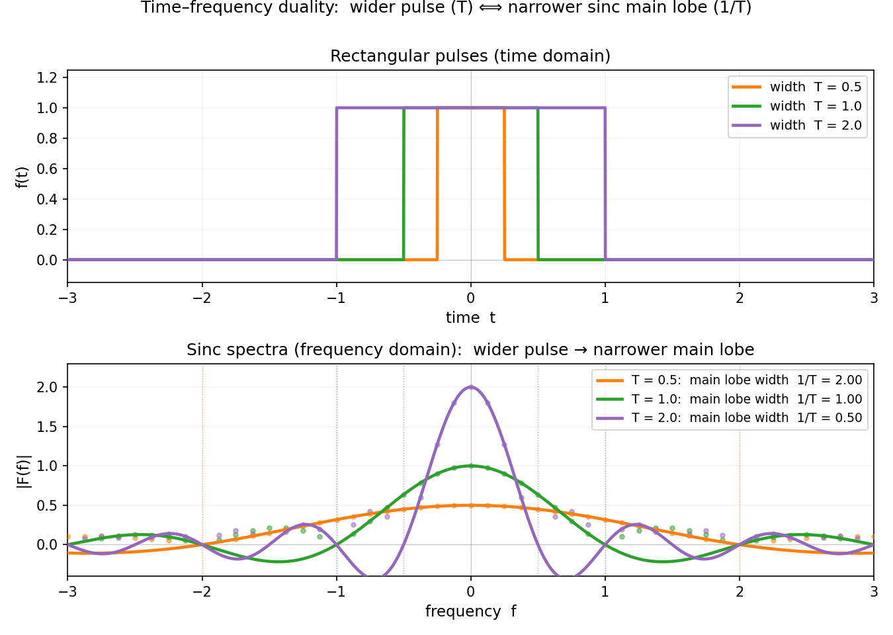
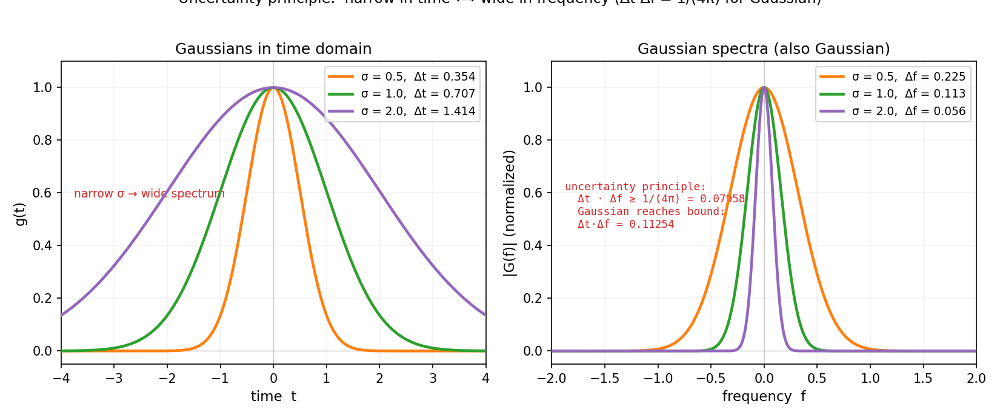

# 第 14 章 · 傅里叶变换:非周期信号的频谱

> **核心问题**:上一章我们把周期函数拆成了分立的谐波柱(`b₁, b₃, b₅, …`).可现实里大多数信号不是周期的——一句"你好"、一张照片某一行的灰度、一次地震的波形,它们不会无穷重复.周期信号的傅里叶级数,处理不了这种"一次性"的信号.怎么办?
>
> 本章就让周期 `T→∞`,看那些分立的谐波柱怎么密化成一条连续的频谱曲线,顺便撞上一个更深邃的事实:**不确定性原理——信号在时域越短(越像瞬间脉冲),它在频域就越宽(充满所有频率);反之亦然.** 这和量子力学里"测不准粒子位置和动量"是同一个数学.
>
> **读完本章你会明白**:
> 1. 傅里叶变换是怎么从级数"取 `T→∞` 极限"自然推出来的——分立柱变连续曲线,求和变积分;
> 2. 一个矩形脉冲的频谱是 `sinc` 函数(`sin(πf)/(πf)`),脉冲越宽,主瓣越窄——这就是时频对偶的具象;
> 3. **不确定性原理**:`Δt · Δf ≥ 1/(4π)`,时域和频域不能同时"收紧",高斯信号刚好达到下界——这是量子力学位置-动量测不准的数学根;
> 4. 傅里叶变换把"时域的微分"变成"频域的乘法",把"时域的卷积"变成"频域的乘积——它是滤波、解微分方程、概率论(特征函数)的通用引擎.

> **如果一读觉得太难**:先只记住三件事——① 非周期信号没有分立谐波,它的频谱是一条连续曲线;② 时频对偶:时域窄(脉冲短)则频域宽(频率散开),反之亦然;③ 不确定性原理:Δt·Δf 有下界,鱼和熊掌不可兼得——这就是量子力学测不准的数学根.其余细节,边读边补.

---

## 章首 · 一句话点破

> **傅里叶变换,是傅里叶级数在"周期无穷大"时的极限:分立的谐波柱密化成连续的频谱曲线.而一旦频谱变连续,时域和频域就长出了对偶性——一个收紧,另一个必然散开,这就是不确定性原理的源头.**

这句话是结论,不是理由.本章倒过来拆:先看级数怎么取 `T→∞` 极限变成变换,再用矩形脉冲的 `sinc` 频谱看时频对偶,最后撞破不确定性原理——为什么你没法同时把信号"在时域和频域都收紧".

---

## 一、从级数到变换:让周期 `T→∞`

### 1.1 上一章的遗产:周期信号的分立频谱

上一章我们学会了:一个周期 `2π` 的函数 `f(x)`,能拆成分立的正弦波:

$$
f(x) = \sum_{n=1}^{\infty} b_n \sin(nx), \qquad b_n = \frac{1}{\pi}\int_0^{2\pi} f(x)\sin(nx)\,dx
$$

频谱是一根根**分立的柱子**,站在 `n = 1, 2, 3, …` 这些**离散的频率点**上.这是因为周期信号每过 `2π` 就重复一次,它的"基本振动单元"只有基频 `1/(2π)` 的整数倍——所以频率是离散的.

可现实递过来的信号,大多**没有周期**:

- 一句"你好"——说完就完了,不会无穷重复;
- 一次地震的波形——震完就平了;
- 一张照片某一行的灰度——它是空间上的一个片段,不是周期图形.

这些信号**没有基频**,自然也没有"基频整数倍"那些分立的谐波.周期信号的傅里叶级数,对它们失效.

> **不这样理解会怎样**:你会硬套傅里叶级数,把一个非周期信号当成"周期无穷大"的极限——可周期一旦无穷大,基频 `1/T` 就趋近 0,相邻谐波频率的间距 `1/T` 也趋近 0,**分立的柱子挤成了一条连续的曲线**.这正是下一节要做的事:不是抛弃傅里叶,而是把它推广到极限.

### 1.2 让周期 `T→∞`:柱子密化成曲线

我们直接做这个极限.把周期从 `2π` 推广到任意 `T`,基频 `ω₁ = 2π/T`.一个周期信号 `f(t)` 的傅里叶级数(复数形式更清爽):

$$
f(t) = \sum_{n=-\infty}^{\infty} c_n\, e^{i n \omega_1 t}, \qquad c_n = \frac{1}{T}\int_{-T/2}^{T/2} f(t)\, e^{-i n \omega_1 t}\, dt
$$

现在让 `T→∞`.三件事同时发生:

1. **基频 `ω₁ = 2π/T → 0`**:相邻谐波的频率间距 `ω₁` 趋近 0,分立的 `nω₁` 这些点,密化成连续的频率轴 `ω`;
2. **求和变积分**:`Σ` 沿着 `ω` 轴的步长 `ω₁` 趋近 0,求和 `Σ ω₁` 变成积分 `∫ dω`;
3. **系数变密度**:`cₙ` 乘上 `T`(因为 `1/T` 趋近 0,得把它"救"出来),变成一个关于 `ω` 的连续函数 `F(ω)`.

代数上,定义 **傅里叶变换(Fourier transform)**:

$$
F(\omega) = \int_{-\infty}^{\infty} f(t)\, e^{-i\omega t}\, dt
$$

和**逆变换**:

$$
f(t) = \frac{1}{2\pi}\int_{-\infty}^{\infty} F(\omega)\, e^{i\omega t}\, d\omega
$$

> **画面**:**周期信号的频谱是一排分立的柱子(像琴键,每个键一个音);非周期信号的频谱是一条连续的曲线(像长笛的滑音,频率连续地扫过).** 从级数到变换,本质上就是"让柱子无限密集,最后连成曲线"——又是一次"精确 = 逼近的极限"(这里极限对象是周期 `T`).`F(ω)` 不再是某个离散频率上的"分量大小",而是"频率 `ω` 处的频谱**密度**"——`|F(ω)|² dω` 才是 `ω` 附近一小段频率里包含的能量.

> **钉死这件事**:**傅里叶变换 = 傅里叶级数在 `T→∞` 时的极限.** 周期信号对应分立频谱(级数),非周期信号对应连续频谱(变换).`F(ω)` 是频谱密度,`|F(ω)|² dω` 是频率 `ω` 附近的能量.

### 1.3 为什么用复指数 `e^{iωt}` 而不是 `sin, cos`

你可能注意到:傅里叶变换里用的是复指数 `e^{iωt}`,不是上一章的 `sin, cos`.这是为了简洁——**欧拉公式 `e^{iωt} = cos(ωt) + i sin(ωt)` 把正弦和余弦打包成一个复指数**.用复指数,正弦和余弦分量自动一起算出来(`F(ω)` 是个复数,它的模 `|F(ω)|` 是幅度,辐角是相位),公式也更对称、更好算.工程里我们通常只关心 `|F(ω)|`(幅度谱),它告诉你"每个频率占多大分量"——这就是频谱图的纵轴.

---

## 二、第一个例子:矩形脉冲和它的 `sinc` 频谱

### 2.1 一个最朴素的非周期信号:矩形脉冲

来看最简单的非周期信号——一个**矩形脉冲(rectangular pulse)**:`f(t) = 1` 当 `|t| < T/2`,`0` 其他.它就是一段时间内为 1、其余时间为 0 的"方块",像按了一下门铃、像闪光灯闪了一下.它**不周期**(只闪一次,不会无穷重复).

代入傅里叶变换的定义,算它的频谱:

$$
F(\omega) = \int_{-T/2}^{T/2} 1 \cdot e^{-i\omega t}\, dt = \left[\frac{e^{-i\omega t}}{-i\omega}\right]_{-T/2}^{T/2} = \frac{2\sin(\omega T/2)}{\omega}
$$

化成更标准的形式,定义归一化 `sinc` 函数 `sinc(x) = sin(πx)/(πx)`:

$$
F(\omega) = T \cdot \mathrm{sinc}\!\left(\frac{\omega T}{2\pi}\right)
$$

**这就是矩形脉冲的频谱——一个 `sinc` 函数.** 它的形状是:中心 `ω=0` 处达到峰值 `T`,然后向两侧振荡衰减,每隔 `2π/T` 过一次零点.

> **画面**:**一个方方正正的矩形脉冲(时域里棱角分明),它的频谱居然是这样一个"中间一个鼓包、两侧一圈圈涟漪"的 `sinc` 函数.** 时域越"方",频域越"圆"——这是时频对偶的第一个征兆.`sinc` 那一圈圈涟漪(叫"旁瓣 sidelobes"),就是上一章 Gibbs 过冲的"频域影子"——你截断信号(矩形窗),必然在频域引入 `sinc` 涟漪,边缘处产生过冲.

### 2.2 时频对偶:脉冲越宽,主瓣越窄

现在玩一个游戏:**改变脉冲宽度 `T`,看频谱怎么变.**

- `T` 大(脉冲很宽):`sinc` 的主瓣(中心那个鼓包)宽度 `2π/T` **小**——频谱集中在低频;
- `T` 小(脉冲很窄,像瞬间闪一下):`sinc` 的主瓣宽度 `2π/T` **大**——频谱铺得很开,高频成分很多.

我们画出来:



看清楚了吗:**时域和频域像跷跷板,一头压下去,另一头翘起来.** 脉冲宽(时域"宽"),频谱窄(频域"窄");脉冲窄(时域"窄"),频谱宽(频域"宽").**这就是时频对偶(time-frequency duality)**——信号在时域和频域的"展宽程度",此消彼长.

> **不这样理解会怎样**:你会以为"我可以造一个信号,它在时域很窄(瞬间发生)、同时在频域也很窄(只有一个频率)".**做不到.** 瞬间发生的信号(窄脉冲),必然包含所有频率(`sinc` 主瓣很宽,频谱铺开);单一频率的信号(正弦波),必然在时域无穷长(一直振下去).**时域和频域的"宽度",是绑在一起的,你松不开.**

> **钉死这件事**:**时频对偶:时域窄 ⟹ 频域宽,时域宽 ⟹ 频域窄.** 矩形脉冲的 `sinc` 频谱是最直观的例子——脉冲宽 `T`,主瓣宽 `1/T`,成反比.这条对偶性,是下一节"不确定性原理"的物理直觉.

---

## 三、不确定性原理:为什么时域频域不能同时收紧

### 3.1 把时频对偶说精确:Δt · Δf 有下界

时频对偶不只是"此消彼长"的定性说法,它有个精确的数学形式,叫 **不确定性原理(uncertainty principle)**.用信号在时域的"展宽" `Δt`(标准差)和在频域的"展宽" `Δf`,有:

$$
\Delta t \cdot \Delta f \geq \frac{1}{4\pi}
$$

——**信号在时域和频域的展宽程度,乘积有一个下界,谁也不能让两边同时任意小.**

> **画面**:**你想要一个信号"既瞬间发生(Δt 小)、又只有单一频率(Δf 小)",不确定性原理说:不行,两者的乘积至少是 `1/(4π)`.** 把时域收紧,频域必然散开;把频域收紧,时域必然拉长.这是一条**数学铁律**,不是工程限制、不是测量精度问题.

### 3.2 哪个信号刚好达到下界:高斯

有趣的是,有一个信号**刚好**达到下界 `1/(4π)`——**高斯信号** `f(t) = e^{-t²/(2σ²)}`.它的傅里叶变换也是高斯.用 `|f|²` 归一化算标准差(RMS 宽度):时域 `Δt = σ/√2`,频域 `Δf = 1/(2√2 π σ)`(因为高斯的傅里叶变换还是高斯,频率域方差反比于时域方差),所以:

$$
\Delta t \cdot \Delta f = \frac{\sigma}{\sqrt{2}} \cdot \frac{1}{2\sqrt{2}\,\pi\sigma} = \frac{1}{4\pi}
$$

——刚好踩在下界上.**高斯信号是"时频联合最紧"的信号,任何其他信号,乘积都比 `1/(4π)` 大.**(注:`Δt, Δf` 这里取的是 `|f|²`、`|F|²` 归一化后的 RMS 标准差,这是信号处理里不确定性原理的标准定义.)

我们画出来,看高斯在时域和频域都是"钟形",它的"紧"长什么样:



### 3.3 这和量子力学的测不准,是同一件事

你可能觉得"不确定性原理"这名字耳熟——**它就是量子力学里"位置和动量不能同时精确测量"的数学根.** 在量子力学里,粒子的状态是一个波函数 `ψ(x)`(位置空间的概率幅),它的傅里叶变换 `Ψ(p)` 是动量空间的波函数.**位置和动量,正好是一对傅里叶对偶**——所以 `Δx · Δp ≥ ℏ/2`,本质就是 `Δt · Δf ≥ 1/(4π)` 这条信号处理里的铁律,搬到量子力学加了普朗克常数 `ℏ`.

> **画面**:**量子力学之所以"测不准",不是因为仪器不够好、不是因为观察扰动——而是因为"位置"和"动量"在数学上是傅里叶对偶,而傅里叶对偶天然受不确定性原理约束.** 一个粒子如果在位置上很确定(波函数是个尖峰,Δx 小),它的动量波函数必然很散(Δp 大)——这是数学结构决定的,任何实验都绕不过去.**傅里叶分析,是量子力学的数学骨架.**

> **不这样理解会怎样**:你会以为"测不准原理是物理学的一个怪现象,只对微观粒子成立".**不是.** 它是傅里叶对偶的普遍性质,对任何信号(声波、电波、图像)都成立.你处理音频时,如果想精确知道"某个频率在什么时刻出现"(短时傅里叶变换 STFT),就会撞上这条墙——时间窗越短,频率分辨越差;频率分辨越细,时间定位越糊.**这就是为什么音频可视化(频谱仪)永远是"时间分辨率 vs 频率分辨率"的妥协.**

> **钉死这件事**:**不确定性原理 `Δt·Δf ≥ 1/(4π)` 是时频对偶的精确化,高斯信号达到下界.它和量子力学的位置-动量测不准 `Δx·Δp ≥ ℏ/2` 是同一个数学——都是傅里叶对偶的内禀约束.** 任何"同时精确知道时间位置和频率"的企图,都会撞上这堵墙.

### 3.4 两个极端:正弦波 vs 冲激函数

把不确定性原理推到两个极端,你会更看清它的本质:

- **时域最宽的信号是正弦波 `sin(2πft)`——它在时域无穷长(一直振下去),对应频域最窄的信号:一根位于 `f` 的"谱线"(理想的单频率).** `Δt = ∞`,`Δf = 0`,乘积是个不定式,但极限意义下满足约束.**这就是为什么"纯正弦波"在频谱图上是完美的一根针——它把所有能量集中在一个频率.**
- **时域最窄的信号是冲激函数(Dirac delta) `δ(t)`——它"瞬间发生"(宽度为零,面积为一),对应频域最宽的信号:一条**平直的直线**,所有频率含量相等.** `Δt = 0`,`Δf = ∞`.**这就是为什么"瞬间打击"(雷击、拍手)听起来包含所有频率——它的能量均匀洒满整个频谱.**

> **画面**:**正弦波和冲激函数,是时频对偶跷跷板的两端.** 正弦波"时域无穷长、频域一根针";冲激函数"时域一根针、频域无穷宽".它们互为傅里叶变换对(正弦波的变换是两根位于 `±f` 的谱线;冲激函数的变换是常数).**你不可能造一个信号,既像正弦波那样单一频率、又像冲激那样瞬间发生——这就是不确定性原理最极端的具象.**

> **彩蛋**(呼应上一章):还记得 P5-13 的 Gibbs 现象吗?那里说"有限频率带宽无法完美重建时域跳变".现在你能从对偶的角度看清为什么了:**一个理想的跳变(时域极窄、接近冲激),它的频谱必然极宽(铺满所有频率);你只用有限个谐波(截断频谱),就等于丢掉了高频成分,重建出的跳变必然有"毛刺"——过冲.** Gibbs 现象和不确定性原理,是同一件事的两面:**时频对偶下,"窄"和"宽"的张力是逃不掉的.** 上一章的疤,这一章找到了它的根源.

---

## 四、傅里叶变换的威力:把难题"翻译"成简单题

傅里叶变换不只是"换一种视角看信号",它有一个杀手级的实用性质:**它把时域里的难题,翻译成频域里的简单题.** 两条最关键:

### 4.1 微分变乘法

在时域,对 `f(t)` 求导.在频域,这件事变成:

$$
\mathcal{F}\{f'(t)\} = i\omega \cdot F(\omega)
$$

——**求导,在频域里就是乘一个 `iω`.** 这意味着:**微分方程,在频域里变成代数方程**.比如一个常系数线性微分方程 `af'' + bf' + cf = g(t)`,两边做傅里叶变换,变成 `(a(iω)² + b(iω) + c)F(ω) = G(ω)`——一个**代数方程**,解出来 `F(ω) = G(ω)/(−aω² + biω + c)`,再做逆变换就得到 `f(t)`.**这就是上一章篇引子里,傅里叶解热传导方程的真正机制——正弦波是特征函数,求导变乘法,方程从微分变代数.**

### 4.2 卷积变乘积

时域里的**卷积(convolution)** `(f * g)(t) = ∫ f(τ)g(t-τ) dτ`,是一个相当麻烦的积分运算.但在频域:

$$
\mathcal{F}\{f * g\} = F(\omega) \cdot G(\omega)
$$

——**卷积变成逐点相乘**.这意味着:**滤波、系统响应、概率论里独立随机变量之和的分布,全都能用"频域相乘"秒杀.** 比如:

- 一个线性系统(滤波器)对输入信号 `f` 的响应 = `f * h`(`h` 是系统的冲激响应),在频域就是 `F·H`——**滤波器设计,本质是在频域里塑造 `H(ω)` 的形状**;
- 概率论里,两个独立随机变量之和的概率密度,是各自密度的卷积;在"特征函数"(概率密度的傅里叶变换)域里,变成相乘——**这就是中心极限定理(为什么独立同分布之和趋向高斯)最优雅的证明所在**.

### 4.3 一个具体例子:低通滤波器怎么"删频率"

"卷积变乘积"听起来抽象,我们举个最实在的例子——**低通滤波器(low-pass filter)**,它的任务是"保留低频、删掉高频".比如你的录音里有高频嘶嘶噪声(电源嗡嗡声、麦克风底噪),你想把它去掉.

时域做法:设计一个冲激响应 `h(t)`,让输出 `y = x * h`.但"什么样的 `h` 能删高频"很难凭直觉设计——你得在时域里摆弄一个波形,看它卷积后能不能压低高频,试错成本高.

频域做法:在频域里,**低通滤波器就是一个"门函数"** `H(ω) = 1` 当 `|ω| < ω_c`(截止频率),`0` 其他.**你直接在频域里"画"出想要保留的频率范围(`|ω| < ω_c` 内 `H=1`,之外 `H=0`),然后 `Y(ω) = X(ω)·H(ω)`——乘一下,高频就被"门"切掉了.** 最后做逆变换得到去噪后的 `y(t)`.

> **画面**:**频域里,滤波就是"切频率"——你想留哪段频率,就在那段画个 `1`,其余画 `0`,乘上去就完事.** 这比时域里设计 `h(t)` 直观一万倍.这就是为什么所有专业音频/图像处理软件(Equalizer、Photoshop 的频率滤波)都在频域里操作——**它们让你像用橡皮擦一样,精准地擦掉某个频段**.这一切的根基,就是"卷积变乘积"这条傅里叶性质.

(当然,实际工程里理想的"门函数"会产生 Gibbs 振铃——上一章的疤又来了——所以真实的滤波器 `H(ω)` 边缘是平滑过渡的,不是硬切.**又是时频对偶:你想要频域的"硬边",时域就要付出代价(无穷长的 sinc 冲激响应);想要时域的"有限",频域边缘就得平滑.**)

> **画面**:**傅里叶变换是一个"翻译机":时域里难缠的操作(微分、卷积),翻译到频域,都变成简单的乘法.** 翻译完在频域算,算完再翻译回来.这就是为什么从解微分方程到设计滤波器到证明概率论定理,傅里叶变换无处不在——它把"难"和"易"两个世界连了起来.

> **钉死这件事**:**傅里叶变换把"微分"翻译成"乘 `iω`",把"卷积"翻译成"乘积".** 微分方程变代数方程,卷积变逐点相乘——这是傅里叶变换的杀手锏,也是它在物理、工程、概率论里无所不在的根源.

---

## 五、彩蛋:从傅里叶变换到现代信号处理的工具箱

傅里叶变换是"连续、无穷长、非周期"信号的理想工具.可现实里的信号往往是**有限长、采样、非平稳**的,于是人类在傅里叶变换的基础上造了一整套工具箱:

- **短时傅里叶变换(STFT)**:信号非平稳(频率随时间变,比如音乐、语音),全局傅里叶变换会丢失"哪个频率在哪个时刻"的信息.STFT 用一个滑动窗口,对每一段做傅里叶变换,得到**时频谱图(spectrogram)**——就是音乐播放器里那种"横轴时间、纵轴频率、颜色表能量"的可视化.但它受不确定性原理约束:**窗口短则时间分辨率好但频率分辨率差,窗口长则反之**——你永远在妥协.
- **小波变换(wavelet)**:为了突破 STFT"窗口固定"的限制,小波用"尺度可变"的基函数——高频用窄窗(时间定位好)、低频用宽窗(频率定位好),自动适配.这就是 JPEG2000、指纹识别、地震信号分析的工具.
- **拉普拉斯变换、Z 变换**:傅里叶变换要求信号"绝对可积",很多实际信号(指数增长、不稳定系统)不满足.拉普拉斯变换(连续)和 Z 变换(离散)是傅里叶变换的推广,能处理更广的信号——**控制工程、电路分析的核心工具**.

**所有这些工具,根都在傅里叶变换.** 理解了傅里叶变换(以及它的对偶性、不确定性),你就拿到了现代信号处理的通行证.

> **画面**:**傅里叶变换是"地基",STFT、小波、拉普拉斯、Z 变换是它上面长出的"楼".** 下一章(第 15 章)我们会把傅里叶变换搬到**数字世界**——DFT(离散傅里叶变换)和它的快速算法 FFT,这是你手机里 JPEG、MP3、5G 真正跑的东西.

---

## 符号 + 数值佐证

### sympy:精确算矩形脉冲的傅里叶变换(sinc)

```python
import sympy as sp

t, w, T = sp.symbols('t w T', real=True, positive=True)

# 矩形脉冲 rect(t/T) 的傅里叶变换 = ∫_{-T/2}^{T/2} exp(-i w t) dt
F = sp.integrate(sp.exp(-sp.I*w*t), (t, -T/2, T/2))
F = sp.simplify(sp.expand_complex(F))
print('rect FT =', F)             # 2*sin(T*w/2)/w

# 在 w=0 处的值(极限)应 = T
print('|F(0)| =', sp.limit(F, w, 0))   # T

# 第一个零点: sin(wT/2)=0 => w = 2*pi/T  =>  f = 1/T
w0 = sp.solve(sp.sin(w*T/2), w)
print('zeros at w =', w0[:3])     # 0, 2*pi/T, 4*pi/T, ...
print('=> first zero at f = 1/T  (主瓣宽 ∝ 1/T)')

# 验证 Parseval / 能量: ∫|rect|^2 dt = T, ∫|F|^2/(2pi) dw 也应 = T (Plancherel)
energy_time = sp.integrate(1, (t, -T/2, T/2))
print('time-domain energy =', energy_time)   # T
```

sympy 算出 `F(ω) = 2sin(ωT/2)/ω`,即 `T·sinc(ωT/(2π))`;零点在 `ω = 2π/T`(即 `f = 1/T`);峰值在 `ω=0` 处为 `T`.**脉冲越宽(`T` 大),零点 `1/T` 越靠近原点,主瓣越窄——时频对偶,在符号算里清清楚楚.**

### numpy + scipy.fft:数值验证时频对偶和不确定性原理

```python
import numpy as np
from scipy.fft import fft, fftfreq

# 1) 对不同宽度的矩形脉冲做 FFT,看主瓣宽度 ∝ 1/T
dt = 0.001
t = np.arange(-5, 5, dt)
for T in [0.5, 1.0, 2.0]:
    rect = np.where(np.abs(t) < T/2, 1.0, 0.0)
    Y = fft(rect)
    freqs = fftfreq(len(t), d=dt)
    Y = np.fft.fftshift(Y)
    freqs = np.fft.fftshift(freqs)
    mag = np.abs(Y) * dt
    # 找第一个零点(主瓣宽度的一半)
    pos = freqs > 0.01
    crossings = freqs[pos][np.where(np.diff(np.sign(mag[pos])))[:1]]
    if len(crossings) > 0:
        print(f'T={T}: rect first zero at f ≈ {crossings[0]:.3f}  (理论 1/T={1/T:.3f})')

# 2) 不确定性原理: 高斯信号的 Δt·Δf (用 |g|^2 归一化的 RMS 标准差)
from scipy.integrate import quad
for sigma in [0.5, 1.0, 2.0]:
    g2 = lambda tt: np.exp(-tt**2 / sigma**2)                # |g|^2, g=exp(-t^2/(2s^2))
    norm, _ = quad(g2, -50, 50)
    t2m, _ = quad(lambda tt: tt**2 * g2(tt), -50, 50)
    dt_std = np.sqrt(t2m / norm)                             # σ/√2
    df_std = 1.0 / (2*np.sqrt(2)*np.pi*sigma)                # 1/(2√2 π σ)
    product = dt_std * df_std
    print(f'σ={sigma}: Δt={dt_std:.4f}, Δf={df_std:.4f}, Δt·Δf={product:.6f}  (下界 1/(4π)={1/(4*np.pi):.6f})')
```

跑一下你会看到:矩形脉冲的第一个零点严格落在 `f = 1/T`(`T=0.5` 时 `f=2`,`T=2` 时 `f=0.5`)——**脉冲翻倍宽,主瓣翻倍窄**;高斯信号的 `Δt·Δf` 恒等于 `1/(4π) ≈ 0.0796`,不论 `σ` 多大——**高斯刚好踩在不确定性原理的下界上**,任何其他信号都比它大.**这两件事,在你屏幕上是铁铮铮的数字.**

---

## 章末小结

**用两个母题回顾本章**:本章是"**拆解 / 谐波**"母题的连续版(上一章拆周期信号成分立柱,本章拆非周期信号成连续曲线),也是"**显微镜 / 放大**"母题的近亲(让周期 `T→∞` 是一种"放大周期到无穷",看分立结构密化成连续).

- 傅里叶变换 = 傅里叶级数在 `T→∞` 时的极限:分立谐波柱密化成连续频谱曲线,求和变积分;
- 矩形脉冲的频谱是 `sinc` 函数,脉冲宽 `T` 则主瓣宽 `1/T`——**时频对偶**的具象;
- **不确定性原理** `Δt·Δf ≥ 1/(4π)`:时域频域展宽此消彼长,高斯达到下界——**这是量子力学测不准的数学根**;
- 傅里叶变换把微分变乘法、卷积变乘积,是解方程、滤波、概率论的通用引擎.

**回扣全书主线**:本章又一次兑现"**精确 = 逼近的极限**"——傅里叶变换就是"傅里叶级数在周期 `T→∞` 时的极限",精确的非周期信号频谱,是周期信号分立频谱在"柱子无限密集"下的极限形态.而不确定性原理,给"逼近"加了一个**内禀约束**:你没法让时域逼近和频域逼近同时无限收紧——**无穷的危险,在这里表现为"两个无穷(时域展宽、频域展宽)的乘积有下界"**.

**本章在驯服哪种无穷、补了谁的窟窿**:驯服的是**"周期无穷大的信号的频率结构"**这种无穷.补的是上一章(P5-13)的窟窿——上一章只能处理周期信号,现实里大多数信号不周期;本章把"分立级数"推广成"连续变换",覆盖了非周期信号.同时,不确定性原理把上一章 Gibbs 现象背后的"时频张力"精确化了:Gibbs 过冲,本质就是"有限频率带宽"无法完美重建"时域跳变"——你截断频谱(有限带宽),时域必然有过冲;你截断时域(有限窗口),频谱必然有 `sinc` 涟漪.**一回事,两面看.**

**五个"为什么"(若只记五件事)**:
1. **傅里叶变换怎么从级数推出来?** 让周期 `T→∞`,基频 `2π/T → 0`,分立的谐波频率密化成连续轴,求和变积分——分立柱变连续曲线.
2. **矩形脉冲的频谱是什么?** `sinc` 函数 `sin(πf)/(πf)`,中心峰值 `T`,第一零点 `f = 1/T`.脉冲越宽,主瓣越窄.
3. **什么是时频对偶?** 时域和频域的展宽程度成反比——时域窄(瞬间脉冲)则频域宽(铺满所有频率),反之亦然.
4. **不确定性原理说了什么?** `Δt·Δf ≥ 1/(4π)`,时域频域展宽的乘积有下界,高斯刚好达到下界.它和量子力学的 `Δx·Δp ≥ ℏ/2` 是同一个数学.
5. **傅里叶变换为什么这么有用?** 它把微分变乘法、卷积变乘积——微分方程变代数方程,滤波变频域塑形.这是它在物理、工程、概率论里无所不在的根源.

**想继续深入该往哪钻**:
- **3Blue1Brown《Differential Equations》/ 傅里叶变换可视化**:动画展示"脉冲变窄,频谱变宽"的对偶过程,比静态图更冲击;
- **亲手跑 scipy.fft**:录一段自己说话的音频,做 FFT 看频谱;再截取其中 10 毫秒做 FFT,看频谱是不是比整段"宽"得多——亲手验证不确定性原理;
- **彩蛋深挖**:查"短时傅里叶变换(STFT)"和"小波变换",理解它们怎么在不确定性原理的约束下做"时间分辨率 vs 频率分辨率"的妥协.量子力学的 `Δx·Δp`,可以读一下 Griffiths《量子力学概论》前两章——你会发现"波包"和"频谱"是同一件事.

**下一章**:本章讲的傅里叶变换是**连续、无穷长**的——可电脑里没有无穷长、没有连续的信号,只有**有限个、离散的**采样点.怎么把连续傅里叶变换搬到数字世界?第 15 章《DFT 与 FFT:数字世界的傅里叶》,我们就讲**离散傅里叶变换(DFT)**,以及让它跑得飞快的算法 **FFT(快速傅里叶变换,O(n log n))**——这是 20 世纪最重要的算法之一,JPEG、MP3、5G OFDM 全靠它在你手机里实时跑.**从连续到离散,又是一次"精确 = 逼近的极限",而 FFT 的速度奇迹,则是算法驯服"计算量无穷"的典范.**
