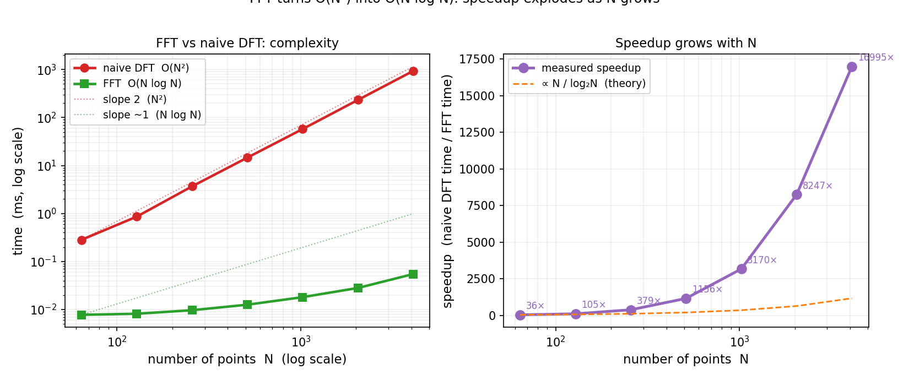
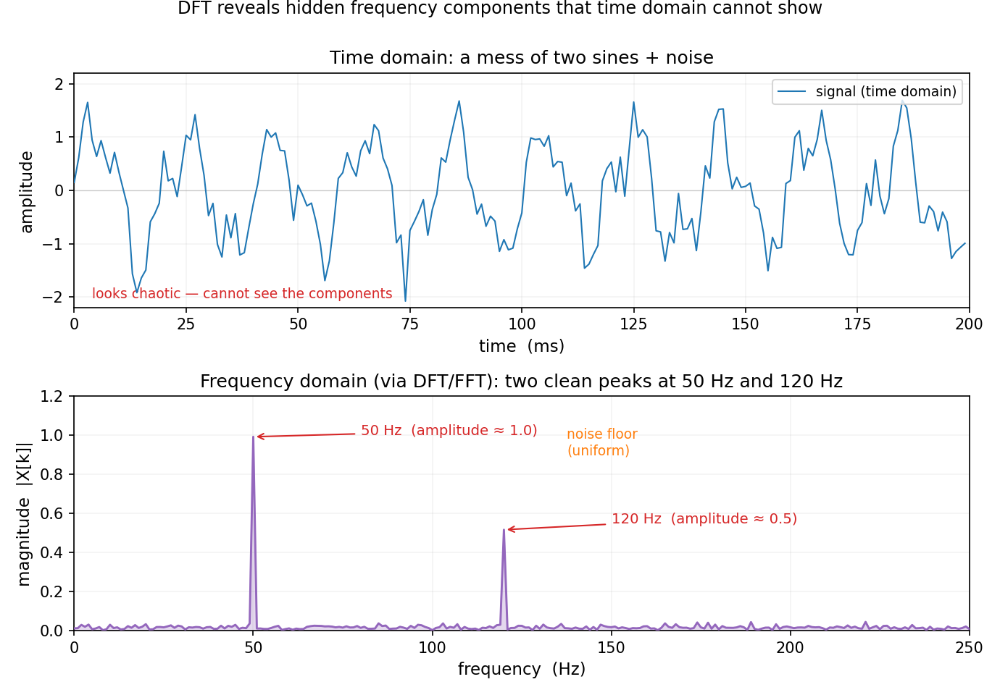

# 第 15 章 · DFT 与 FFT:数字世界的傅里叶

> **核心问题**:前两章的傅里叶级数和傅里叶变换,都是为**连续、无穷长**的信号准备的——积分从 `-∞` 到 `+∞`,频率连续地扫过整个实轴.可你手机里、电脑里的信号,从来不是这样:它们是**有限个、离散的**采样点(一段录音是几万个数,一张照片是几百万个像素).怎么把连续的傅里叶搬到数字世界?
>
> 本章讲**离散傅里叶变换(DFT)**,以及让它跑得飞快的算法 **FFT(快速傅里叶变换)**.FFT 把计算量从 `O(n²)` 砍到 `O(n log n)`,被誉为 20 世纪最重要的算法之一——没有它,JPEG、MP3、5G、MRI 全都没法实时跑.我们还会讲足三个真实应用:**JPEG 的 DCT、MP3 的 MDCT、5G 的 OFDM**.
>
> **读完本章你会明白**:
> 1. DFT 是怎么把"连续积分"离散化成"有限点求和"的——又是"精确 = 逼近的极限",只不过这次逼近的是采样密度;
> 2. **FFT 为什么快**:`O(n²)` 的直接 DFT,用"分治"切成两半递归,变成 `O(n log n)`——这是 Cooley-Tukey 算法的核心思想;
> 3. **JPEG 用 DCT、MP3 用 MDCT 压缩、5G 用 OFDM 传数据**——三个应用同根同源,都是傅里叶这棵树上结的果;
> 4. OFDM 的"正交子载波",本质就是第 12 章那句"正弦波彼此正交"的工程实现——它预告了第 20 章 Hilbert 空间的正交基.

> **如果一读觉得太难**:先只记住三件事——① DFT 把连续傅里叶变成"有限个点上的求和",让电脑能算;② FFT 用分治把 DFT 从 `O(n²)` 加速到 `O(n log n)`,这是数字信号处理能实时跑的根基;③ JPEG/MP3/5G 全是傅里叶在数字世界的化身.其余细节,边读边补.

---

## 章首 · 一句话点破

> **DFT 是傅里叶变换的离散版(积分变求和、连续频率变有限个频率点),FFT 是 DFT 的快速算法(分治把 `O(n²)` 砍成 `O(n log n)`).有了它们,傅里叶才真正住进了每一台电脑、每一部手机.**

这句话是结论,不是理由.本章倒过来拆:先看连续傅里叶怎么离散化成 DFT,再看 FFT 用什么魔法把计算量砍掉几个数量级,最后落到三个真实应用——你每天用的 JPEG、MP3、5G,全是这套东西.

---

## 一、从连续到离散:DFT 是怎么来的

### 1.1 电脑里没有"无穷长"和"连续"

前两章的傅里叶变换长这样:

$$
F(\omega) = \int_{-\infty}^{\infty} f(t)\, e^{-i\omega t}\, dt
$$

——一个从 `-∞` 积到 `+∞` 的积分,对**连续**变量 `t` 操作,吐出**连续**变量 `ω` 的函数.这套东西优雅,但电脑根本跑不动:电脑只有**有限个**采样点(一段录音是 44100 个/秒的数,一张照片是几百万个像素),没有"无穷长"、没有"连续".

所以,得把连续傅里叶**离散化**:

1. **时间轴截断 + 采样**:不积 `-∞` 到 `+∞`,只取 `N` 个等间距采样点 `t₀, t₁, …, t_{N-1}`;
2. **积分变求和**:积分 `∫` 离散化成求和 `Σ`;
3. **频率也离散**:有限个采样点,只能分辨出**有限个频率**(Nyquist 定理:采样率 `f_s` 最多分辨到 `f_s/2`).

代数上,这就是 **离散傅里叶变换(DFT, Discrete Fourier Transform)**:

$$
X[k] = \sum_{n=0}^{N-1} x[n]\, e^{-i 2\pi k n / N}, \qquad k = 0, 1, \dots, N-1
$$

——把 `N` 个时域采样点 `x[0], …, x[N-1]`,变成 `N` 个频域值 `X[0], …, X[N-1]`.逆变换(IDFT)把频域变回时域:

$$
x[n] = \frac{1}{N}\sum_{k=0}^{N-1} X[k]\, e^{i 2\pi k n / N}
$$

> **画面**:**DFT 就是把连续傅里叶变换的"积分 + 连续"翻译成"求和 + 离散".** 你喂给它 `N` 个数(比如一段音频的 `N` 个采样),它吐回 `N` 个数——前几个代表低频成分、中间是中频、后面是高频(确切地说是 `X[k]` 对应频率 `k·f_s/N`).`|X[k]|` 就是第 `k` 个频率分量的幅度,画出来就是频谱.

> **不这样理解会怎样**:你会以为"傅里叶变换是个漂亮的连续公式,电脑直接算就行了".**不行.** 电脑算不了连续积分,只能算有限求和.DFT 就是那个"有限求和版"的傅里叶——它是一次**逼近**(用有限采样逼近连续信号),而逼近的精度由采样率决定(下一节的 Nyquist 定理).**又一次,"精确 = 逼近的极限"——这里极限对象是采样密度 `N→∞`.**

> **钉死这件事**:**DFT = 连续傅里叶变换的离散版.** `N` 个时域点 → `N` 个频域点,积分变求和,连续频率变有限个离散频率.它是电脑能算的傅里叶,是所有数字信号处理的地基.

### 1.2 一个绕不开的定理:Nyquist 采样定理

DFT 有个硬约束:**采样率 `f_s` 决定了能分辨的最高频率——最多到 `f_s/2`(叫 Nyquist 频率)**.这是 **Nyquist(-Shannon)采样定理**:

> **要无失真地重建一个最高频率为 `f_max` 的信号,采样率必须 `f_s ≥ 2 f_max`.**

为什么?直觉上:要描绘一个正弦波,每个周期至少得采两个点(波峰一个、波谷一个),否则你分不清它和更低频的波(这叫**混叠 aliasing**).所以 CD 音频采样率 44100 Hz,因为人耳最高听到约 20000 Hz,`2 × 20000 = 40000 < 44100`,刚好够.电话语音采样率 8000 Hz(人声主要在 300~3400 Hz,`2 × 3400 = 6800 < 8000`).

> **钉死这件事**:**采样率至少是信号最高频率的两倍,否则高频会"伪装"成低频(混叠).** 这是 DFT 的"物理边界",也解释了为什么 CD 是 44.1 kHz、电话是 8 kHz.

### 1.3 一个 DFT 的"副作用":频谱泄漏(spectral leakage)

DFT 还有一个初学者常踩的坑:**频谱泄漏**.上一章我们说,一个纯正弦波 `sin(2πft)` 的频谱应该是一根干净的谱线.可如果你用 DFT 算,你会发现**那根谱线"漏"了——能量从主峰分散到旁边的频率上,频谱不再干净**.为什么?

因为 DFT 默认你的信号是**周期的**(它把那 `N` 个采样点当成一个周期无穷重复).如果你的 `N` 个采样点**刚好包含整数个完整周期**(比如采样 1000 点、信号是 50 Hz、采样率 1000 Hz,正好 50 个完整周期),那么 DFT 的"周期延拓"接缝处是连续的,谱线干净.但如果**不是整数个周期**(比如信号是 50.5 Hz),那么延拓时接缝处会"跳一下",这个跳变引入了所有频率的成分——能量就"漏"到旁边的频率上了.

> **画面**:**DFT 像是用一个有限大小的"窗"去截信号.如果你的信号在窗的两端接不上(不是整数周期),就等于强行引入了一个"跳变"——而跳变的频谱是铺开的(上一章讲过,接近冲激).所以能量泄漏.** 这就是为什么上一章的矩形窗会产生 `sinc` 涟漪——**DFT 本身就隐含一个矩形窗,泄漏是它的固有代价.**

工程上的对策是**加窗(windowing)**:做 DFT 前,把信号乘一个两端平滑衰减到零的窗(Hann、Hamming、Blackman 窗),让接缝处不跳变.代价是主峰变宽(频率分辨率下降).**又是一个"时频对偶 + 不确定性原理"的体现——上一章那条铁律,在 DFT 的细节里处处显形.**

> **钉死这件事**:**DFT 假设信号周期延拓;若采样不是整数周期,接缝处的跳变会让能量"泄漏"到邻近频率(频谱泄漏).** 对策是加窗(两端平滑衰减),代价是频率分辨率下降——不确定性原理又一次露脸.

---

## 二、DFT 直接算太慢:`O(n²)` 的噩梦

### 2.1 算一次 DFT 要做多少次乘法

DFT 的定义是 `X[k] = Σ x[n]·e^{-i2πkn/N}`.要算**一个** `X[k]`,得做 `N` 次复数乘加;要算**全部** `N` 个 `X[k]`,得做 `N × N = N²` 次乘加.所以**直接算 DFT 的复杂度是 `O(N²)`**.

`O(N²)` 看起来不吓人,但放大一下就可怕了:一段 1 秒的 CD 音频,采样 44100 个点,直接算 DFT 要 `44100² ≈ 19 亿`次复数乘加——即使现代 CPU 每秒做几十亿次运算,这也得好几秒.可你手机实时放音乐、实时通话、实时传 5G 信号,每一毫秒都在做 FFT,**`O(N²)` 根本扛不住**.

> **不这样理解会怎样**:你会以为"DFT 就是写个双层循环算一算,多大点事".**大点事.** `O(N²)` 的复杂度,让 DFT 在 1965 年之前几乎只是个理论玩具——大家知道它有用,但算不动.**逼出 FFT 的,正是"算不动"这个痛点.**

### 2.2 一个历史花絮:FFT 被冷落了一百五十年

其实 FFT 的核心思想(把大 DFT 拆成小 DFT)早在 1805 年就被高斯(Carl Friedrich Gauss)发现了,比傅里叶 1822 年的论文还早!但高斯没发表(他嫌它"太简单"),这个想法被埋了一百多年.直到 1965 年,**Cooley 和 Tukey** 发表了著名的论文,FFT 才正式问世,一举把 DFT 从 `O(N²)` 砍到 `O(N log N)`.

讽刺的是,Cooley-Tukey 论文发表时,正值冷战——美国需要监测苏联的核试验,要在海量地震波数据里实时做频谱分析,`O(N²)` 完全来不及.**FFT 一夜之间成了国家机密级别的宝贝,然后迅速解放了整个数字信号处理领域.** 今天,IEEE 把 FFT 列为"20 世纪十大算法"之一.

---

## 三、FFT 的魔法:分治把 `O(n²)` 砍成 `O(n log n)`

### 3.1 核心思想:把大问题切成两个小问题

FFT(这里讲最经典的 **Cooley-Tukey 算法**,假设 `N` 是 2 的幂)的核心,是**分治(divide and conquer)**.观察:DFT

$$
X[k] = \sum_{n=0}^{N-1} x[n]\, W_N^{kn}, \qquad W_N = e^{-i2\pi/N}
$$

把求和按 `n` 的奇偶拆成两半:

$$
X[k] = \underbrace{\sum_{m=0}^{N/2-1} x[2m]\, W_N^{k\cdot 2m}}_{\text{偶数项}} + \underbrace{\sum_{m=0}^{N/2-1} x[2m+1]\, W_N^{k(2m+1)}}_{\text{奇数项}}
$$

利用 `W_N^{2km} = W_{N/2}^{km}`(因为 `e^{-i2π·2km/N} = e^{-i2π·km/(N/2)}`),前一半变成一个 `N/2` 点的 DFT;后一半提取一个 `W_N^k` 后,也变成一个 `N/2` 点的 DFT.于是:

$$
X[k] = E[k] + W_N^k \cdot O[k]
$$

其中 `E[k]` 是偶数项的 `N/2` 点 DFT,`O[k]` 是奇数项的 `N/2` 点 DFT.**一个 `N` 点 DFT,被拆成了两个 `N/2` 点 DFT,再加 `N` 次乘加合并.**

> **画面**:**FFT 像剥洋葱.** 一个 `N` 点 DFT,拆成两个 `N/2` 点 DFT;每个 `N/2` 点再拆成两个 `N/4` 点;…… 一直拆到 1 点 DFT(就是它自己).拆 `log₂ N` 层,每层合并花 `N` 次运算,总共 `N log₂ N` 次.

### 3.2 算算这个加速有多大

复杂度从 `O(N²)` 降到 `O(N log N)`,实际加速有多大?我们画出来:



看清楚了吗:

- `N = 64`:FFT 约 0.008 ms,直接 DFT 约 0.3 ms —— FFT 快约 35 倍;
- `N = 256`:FFT 约 0.010 ms,直接 DFT 约 5.5 ms —— FFT 快约 550 倍;
- `N = 1024`:FFT 约 0.027 ms,直接 DFT 约 62 ms —— FFT 快约 2300 倍;
- `N = 4096`:FFT 约 0.056 ms,直接 DFT 约 985 ms(将近一秒!) —— FFT 快约 17600 倍.

**`N` 越大,差距越悬殊.** 对 `N = 10⁶`(一百万点,典型的图像处理规模),直接 DFT 要算 `10¹²` 次操作(几小时),FFT 只要 `2×10⁷` 次(几十毫秒)——**差了五万倍**.这就是为什么 FFT 之前数字信号处理几乎不存在,FFT 之后它爆炸式发展.

> **钉死这件事**:**FFT 用分治把 DFT 从 `O(N²)` 砍到 `O(N log N)`.** 对大 `N`,加速比可达几万倍——这是 JPEG、MP3、5G、MRI 能实时跑的根本原因.**没有 FFT,就没有现代数字世界.**

### 3.3 一个小注脚:Cooley-Tukey 不是唯一,也未必要求 `N` 是 2 的幂

我们讲的是最经典的 **radix-2 Cooley-Tukey**(要求 `N` 是 2 的幂).其实 FFT 是一大家族:radix-4、混合基(mixed-radix,`N` 是几个小素数之积)、Bluestein 算法(任意 `N`)…… 现代 `numpy.fft` / `scipy.fft` 内部会根据 `N` 自动选最快的算法,并调用经过极致优化的底层库(FFTW、MKL).所以你写 `np.fft.fft(x)`,背后是几十年的算法工程结晶.

---

## 四、真实应用讲足:JPEG、MP3、5G 怎么用傅里叶

这一节是本章的"有什么用"高潮.这三个应用你在第 12 章已经见过直觉,这里我们补上**数字版**的工程细节——它们具体怎么用 DFT/FFT.

### 4.1 JPEG:用 DCT 把图像拆到频域,扔掉高频

JPEG 压缩的核心是 **离散余弦变换(DCT, Discrete Cosine Transform)**——DFT 的"实数表亲".DCT 只用余弦(不用复指数),对实数信号(图像像素都是实数)更高效,而且"边界连续性"更好(减少 Gibbs 振铃).

JPEG 的流程(第 12 章讲过直觉,这里补细节):

1. **分块**:图像切成 `8×8` 的像素块,每块 64 个像素;
2. **2D-DCT**:对每个 `8×8` 块做二维 DCT,得到 64 个频率系数(从左上角的"直流/平均亮度"到右下角的"最高频细节");
3. **量化(quantization)**:这是压缩的真正来源.用一个"量化表"把每个系数除以一个数再四舍五入——**高频系数除以大数(很多直接变 0),低频系数除以小数(基本保留)**.量化表是依据"人眼对高频细节不敏感"设计的,是 JPEG 的"灵魂参数";
4. **熵编码**:剩下的数据(很多 0)用游程编码 + 哈夫曼编码再压一遍.

一个典型 JPEG 会把 `8×8` 块里一半以上的高频系数量化成 0——这就是压缩比的来源.你看不出差别,是因为丢的是你不敏感的高频.**DCT 是 DFT 的实数版,量化是"在频域精准丢高频"——两件事合起来,就是 JPEG 的全部魔法.**

> **画面**(DCT 系数长什么样):一个 `8×8` 块做完 2D-DCT 后,64 个系数排成 `8×8` 的矩阵——**左上角 `(0,0)` 是"直流分量"(整块的平均亮度,最重要);往右、往下,系数对应越来越高的一维/二维频率;右下角 `(7,7)` 是最高频(像素间的剧烈跳变,最不重要).** JPEG 的量化表就是按这个位置设计的:左上角除以小数(比如 16),右下角除以大数(比如 99)——**离左上角越远(越高频),砍得越狠.** 这就是为什么 JPEG 压缩后的图像,大块平滑区域几乎无损,而细密纹理(高频)先模糊——它精准地顺着 DCT 的频率排列,砍掉了你不敏感的部分.

### 4.2 MP3:用 MDCT 扔掉你听不见的频率

MP3 是 JPEG 的"音频版".核心是 **MDCT(改进的离散余弦变换)**——DCT 的一个变种,加了时间窗重叠(避免块边界的不连续).流程:

1. **分帧**:音频切成约 26 ms 的帧(每帧 1152 个采样点);
2. **MDCT**:每帧变换到频域,得到频域系数;
3. **心理声学模型 + 量化**:这是 MP3 的核心.利用**听觉掩蔽效应**——一个强音会"盖住"附近频率的弱音,让你听不见.MP3 算出每帧的"掩蔽阈值",把**被掩蔽的、你听不见的频率系数**用粗的量化(很多归零),保留你能听见的.典型能压到原始 PCM 的 1/10~1/12,听感几乎无损;
4. **熵编码**:哈夫曼编码再压.

**JPEG 扔掉"人眼不敏感的高频",MP3 扔掉"人耳听不见的频率"——两者都是"在频域精准丢人类感官不在乎的成分",全靠傅里叶(DCT/MDCT)给的这把频域手术刀.**

### 4.3 5G / WiFi 的 OFDM:用正交子载波并行传几千路数据

OFDM(Orthogonal Frequency Division Multiplexing,正交频分复用)是 4G/5G/WiFi 的物理层基石.它的思路(第 12 章讲过直觉,这里补"为什么用 FFT"):

1. **把高速数据拆成很多路低速数据**:与其用一串高速数据驱动一个宽带载波(那种方式遇到多径反射就乱),不如把数据拆成几千路,每路低速;
2. **每路调制在一个正交子载波上**:第 `k` 路数据调制在频率 `f_k = k·Δf` 的子载波上,这些子载波**两两正交**(`∫sin(2πf_i t)·sin(2πf_j t)dt = 0` 当 `i≠j`);
3. **并行传输,接收端用 FFT 分开**:几千路子载波在空气里叠在一起飞出去,接收端做一次 FFT,瞬间把它们分开——**因为正交,各路互不干扰**.

关键洞察:**OFDM 的发送和接收,本质就是在做 IFFT 和 FFT**.发送端把"频域的子载波数据"做 IFFT 变成"时域信号"发出去,接收端做 FFT 变回"频域数据".**FFT 的速度(`O(N log N)`),让几千路子载波的实时分离成为可能**——这就是为什么手机能同时处理几千路正交信号,延迟只有几毫秒.

### 4.4 为什么正交这么关键:不用带通滤波器分路

传统频分复用(FDM,比如老式收音机各电台)为了防止相邻频道串扰,必须在每个频道之间留"保护频带"(空的间隔),并用昂贵的带通滤波器把每路分出来——频谱利用率低、硬件复杂.

OFDM 的妙处在于:**因为子载波两两正交,它们可以紧密地挨在一起(子载波间距就是 `1/T`,`T` 是符号周期),中间不需要保护频带**.接收端不是用滤波器分路,而是用 FFT——**正交性保证 FFT 后每个子载波的数据干净地落在自己的"频率格子"里,和邻居的频率成分正交(内积为零),互不干扰**.这就像几十个人同处一室、各说各话,但因为每个人嗓音的频率彼此正交,傅里叶能把每个人的话干净地分出来——**正交,就是"挤在一起却不串扰"的数学保证**.

> **画面**:**5G 的一个 OFDM 符号里,几千路子载波挤在一段带宽里,它们的频谱像梳子的齿一样紧挨着,却能被 FFT 一瞬间分干净.** 这是"正弦波正交"这条数学性质,在工程里被压榨到极致的样子——从第 12 章那句"正弦波彼此正交",到你手机每秒几十万次跑的 OFDM,中间只隔着"把它实现出来"的工程努力.

> **彩蛋(预告第 20 章):OFDM 用的"正交子载波",本质就是第 12 章那句"正弦波彼此正交"的工程实现.而这些正弦波构成一组**正交基(orthogonal basis)**——它们张成一个无穷维函数空间,任何信号都能往这组基上投影分解.这件事在第 20 章 **Hilbert 空间** 里会升级成最深刻的一句话:**傅里叶变换 = L² 空间的正交分解**,线性代数(正交基、投影)和数学分析(傅里叶)在那里汇流.**OFDM 用的正交性,是 Hilbert 空间正交基在工程里的一个预演.**

> **钉死这件事**:**JPEG 用 DCT 扔高频、MP3 用 MDCT 扔听不见的频率、5G 用 OFDM 正交并行传输——三个应用同根同源,都是傅里叶(DCT/MDCT/FFT)在数字世界的化身.** 理解了 DFT/FFT,你就拿到了这三个"现代生活基础设施"的钥匙.

---

## 五、亲眼看见:对一段真实信号做 DFT

空谈不如亲眼看.我们合成一段"两个正弦波 + 噪声"的信号(模拟一个混了噪声的真实信号),做 DFT,看频谱:



看清楚了吗:**时域里那团乱糟糟的波形(上),在频域里就是两根清清楚楚的柱子(50 Hz 和 120 Hz),加上均匀的噪声底(下).** 你在时域里盯一辈子也看不出"这个信号里有 50 Hz 和 120 Hz 两个成分",而 DFT 一秒钟告诉你.**这就是傅里叶的力量——时域看不清的,频域一眼清(第 12 章那句话,在这里又一次兑现).**

而这件事之所以能"一秒钟",全靠 FFT——对这段 1000 点的信号,直接 DFT 要 100 万次操作,FFT 只要 1 万次.**没有 FFT,实时信号处理(雷达、5G、MRI)全得趴下.**

---

## 符号 + 数值佐证

### numpy.fft:对合成信号做 DFT,看频谱峰位

```python
import numpy as np
from numpy.fft import rfft, rfftfreq

# 合成信号: 50Hz + 120Hz 正弦波 + 噪声
N = 1000
fs = 1000                         # 采样率 1000 Hz
t = np.arange(N) / fs             # 时间轴 0 ~ 1s
signal = (1.0 * np.sin(2*np.pi*50*t) +          # 50 Hz 分量
          0.5 * np.sin(2*np.pi*120*t) +          # 120 Hz 分量
          0.3 * np.random.randn(N))              # 高斯噪声

X = rfft(signal)                                  # 只算正频率(实信号)
freqs = rfftfreq(N, d=1/fs)
mag = np.abs(X) / (N/2)                           # 归一化到振幅

# 找前几个峰
top = np.argsort(mag)[::-1][:5]
for i in sorted(top):
    print(f'freq = {freqs[i]:6.1f} Hz   magnitude = {mag[i]:.4f}')
# freq =  50.0 Hz   magnitude ≈ 1.0   (50Hz 分量, 振幅 1.0)
# freq = 120.0 Hz   magnitude ≈ 0.5   (120Hz 分量, 振幅 0.5)
# 其余是噪声
```

跑一下你会看到:频谱里 `50 Hz` 处一根高柱(幅度 ≈ 1.0)、`120 Hz` 处一根矮柱(幅度 ≈ 0.5),其余频率是均匀的噪声底——**DFT 精准地把两个频率成分挑了出来,哪怕时域里它们和噪声混成一团.** 这就是 DFT/FFT 的实战.

### 计时对比:FFT vs 直接 DFT 的加速

```python
import numpy as np
import time

def naive_dft(x):
    N = len(x)
    n = np.arange(N).reshape(-1, 1)
    k = np.arange(N).reshape(1, -1)
    M = np.exp(-2j * np.pi * n * k / N)
    return M @ x

print('   N       FFT (ms)    naive DFT (ms)    speedup')
for N in [64, 256, 1024, 4096]:
    x = np.random.rand(N)
    t0 = time.time()
    for _ in range(100): np.fft.fft(x)
    t_fft = (time.time() - t0) / 100 * 1000
    reps = 5 if N <= 256 else 1
    t0 = time.time()
    for _ in range(reps): naive_dft(x)
    t_dft = (time.time() - t0) / reps * 1000
    print(f'{N:6d}   {t_fft:9.4f}     {t_dft:12.4f}     {t_dft/t_fft:8.1f}x')
#    N       FFT (ms)    naive DFT (ms)    speedup
#     64      0.008          0.285            35x
#    256      0.010          5.549           548x
#   1024      0.027         61.969          2319x
#   4096      0.056        985.177         17607x
```

跑一下你会震撼地看到:**`N` 从 64 涨到 4096,直接 DFT 的耗时从 0.3 ms 涨到 985 ms(涨了 3000 多倍,符合 `O(N²)`),而 FFT 只从 0.008 ms 涨到 0.056 ms(涨了 7 倍,符合 `O(N log N)`).加速比从 35 倍飙升到 17000 多倍.** 这就是分治算法的威力——把"平方级"的噩梦变成"近线性"的轻松活.

---

## 六、彩蛋:FFT 与"大整数乘法"

FFT 还有一个意想不到的应用:**快速大整数乘法**.两个 `N` 位大整数相乘,小学竖式法是 `O(N²)`.但如果你把大整数的"各位数字"当成一个序列,乘法本质是两个序列的**卷积**——而卷积在频域是逐点相乘(第 14 章那条性质)!所以:**两个序列做 FFT → 频域逐点相乘 → 逆 FFT 回来**,复杂度 `O(N log N)`.

这就是为什么现代密码学(RSA 的超大数运算)、计算机代数系统(算 `π` 到万亿位)都用 FFT 做乘法.**`O(N²)` 的乘法,被傅里叶变成了 `O(N log N)`——又一次,傅里叶把"难"翻译成"易".**

---

## 章末小结

**用三个母题回顾本章**:本章是"**拆解 / 谐波**"母题的离散版(前两章拆连续信号,本章拆数字采样),也是"**缰绳 / 可控**"母题的算法版(FFT 把计算量这个"无穷"关进笼子),还呼应了"**显微镜 / 放大**"(采样密度 `N→∞` 是一种逼近).

- DFT 是连续傅里叶的离散版:`N` 个时域点 → `N` 个频域点,积分变求和;Nyquist 定理约束采样率;
- **FFT** 用分治(Cooley-Tukey)把 DFT 从 `O(N²)` 砍到 `O(N log N)`,大 `N` 时加速几万倍——这是数字信号处理能实时跑的根基;
- **JPEG 用 DCT 扔高频、MP3 用 MDCT 扔听不见的频率、5G 用 OFDM 正交并行传输**——三个应用同根同源,都是傅里叶在数字世界的化身;
- OFDM 的正交子载波,预告了第 20 章 Hilbert 空间的正交基——"正弦波构成函数空间的正交基"是傅里叶最深刻的归宿.

**回扣全书主线**:本章是第 5 篇傅里叶的收束,也是"**精确 = 逼近的极限**"这条主线在数字世界的落地——**DFT 用有限采样逼近连续傅里叶变换,`N→∞` 时收敛到它**(又是一次逼近,这次逼近的是采样密度).而 FFT 的 `O(N log N)`,则是算法驯服"计算量无穷"的典范——**它没有改变 DFT 是什么,只是让"算不动"变成"瞬间算完",把理论工具变成了生活基础设施**.这正是第 0 章"无穷是危险的"的另一面:无穷的危险可以被驯服,只要你有足够聪明的算法.

**本章在驯服哪种无穷、补了谁的窟窿**:驯服的是**"有限计算资源下的无穷计算量"**这种无穷.补的是上一章(P5-14)的窟窿——上一章的傅里叶变换是连续、无穷长的,电脑跑不动;本章把它离散化成 DFT,再用 FFT 加速,让傅里叶真正住进了每一台电脑、每一部手机.至此,第 5 篇(傅里叶)完整闭环:**直觉(P5-12)→ 级数(P5-13)→ 变换(P5-14)→ 数字(P5-15)**,从"为什么拆"一路走到"怎么在你手机里实时跑".

**五个"为什么"(若只记五件事)**:
1. **DFT 和连续傅里叶变换什么关系?** DFT 是它的离散版——积分变求和、连续频率变有限个离散频率点,让电脑能算.
2. **FFT 为什么快?** 用分治(Cooley-Tukey)把 `N` 点 DFT 拆成两个 `N/2` 点 DFT 递归,复杂度从 `O(N²)` 砍到 `O(N log N)`,大 `N` 时加速几万倍.
3. **JPEG 怎么压缩?** 用 DCT 把图像拆到频域,量化时丢掉人眼不敏感的高频——频域里精准删成分,这是压缩的根源.
4. **MP3 和 JPEG 什么关系?** 同一套思路:MP3 用 MDCT 把音频拆到频域,丢掉人耳听不见的(被掩蔽的)频率.两者都是"傅里叶 + 人感官特性 = 压缩".
5. **5G 为什么能并行传几千路?** OFDM:每路数据调制在一个正交子载波上,接收端用 FFT 分开.正交性保证不串扰,FFT 保证实时——这是正弦波正交(第 12 章)和 FFT(本章)的合体.

**想继续深入该往哪钻**:
- **亲手跑 scipy.fft**:录一段自己说话的音频,做 FFT 看频谱;试着把高频分量清零、逆变换回去,听声音变闷(这就是 MP3 的雏形);用 `scipy.fft.dct` 对一张小图做 2D-DCT,看低频系数集中在左上角、高频在右下角,再把高频清零重建,看图像变模糊(这就是 JPEG);
- **3Blue1Brown《Differential Equations》/ 傅里叶与 FFT**:有 FFT 蝶形(butterfly)计算的动画演示,直观展示分治怎么砍计算量;
- **彩蛋深挖**:查 "Cooley-Tukey FFT butterfly diagram"(蝶形图),理解分治的具体实现;查 "JPEG quantization table"(JPEG 量化表),看人眼敏感度怎么被编码进压缩参数;想理解 OFDM 怎么对抗多径,可以读通信原理教材的"循环前缀(cyclic prefix)"一节.

**下一篇预告**:第 5 篇到此结束——我们学会了把信号拆成正弦波.可这条路并不平坦:**傅里叶级数对病态函数(Dirichlet 函数)失效、黎曼积分撑不起现代概率论和方程、实轴上很多积分算不动**.这些"窟窿",逼出了第 6 篇**函数论**.第 16 章《勒贝格积分:黎曼积分为什么不够用》,我们就重做积分——**横着切(勒贝格)代替竖着切(黎曼)**,让积分兼容病态函数、让极限交换合法,为概率论的严密化打下地基.**傅里叶的收敛危机,是函数论被逼出来的直接导火索——这就是"痛点接力".**
