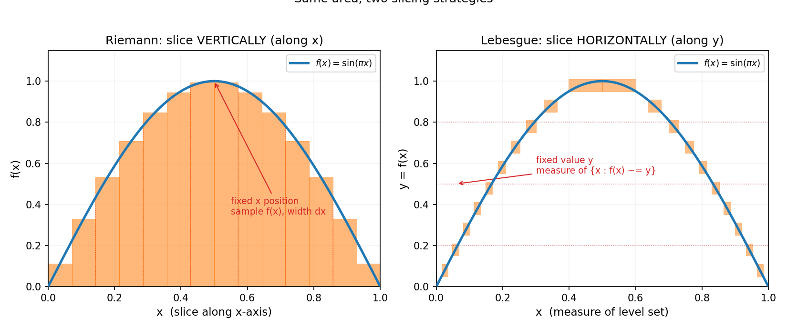

# 第 16 章 · 勒贝格积分:黎曼积分为什么不够用

> **核心问题**:黎曼积分大家都学过,够不够用?为什么数学家非得"横着切"重做一遍积分,搞出勒贝格积分?这套更严的积分到底解决了什么"黎曼积分撑不住"的真实问题?

> **读完本章你会明白**:
> 1. 黎曼积分有个致命硬伤——**极限和积分不能随便交换顺序**(呼应 P4-10):一串好积分的极限,可能根本没法黎曼积分(病态函数);
> 2. 勒贝格积分换个切法——**不竖着切 x 轴,而是横着切 y 轴的值域**,先按函数值分组、再求每组的"大小",这套切法配上"测度"这套度量,**让一大批黎曼管不了的病态函数变得可积**;
> 3. "测度"(measure)就是把"长度"推广到任意集合——可数可加是它的灵魂,有理数集这种"稠密却碎成无穷段"的集合,测度是 0;
> 4. **这就是概率论严密化的地基**:随机变量 = 可测函数,期望 = 勒贝格积分.你以后看见 `E[X]=∫ X dP`,底下的积分就是这一章的勒贝格积分.

---

## 篇引子 · 痛点接力:从光滑世界走进险恶地形

前面五篇(P2~P5),我们的分析工具隐含着一个甜蜜的假设:**函数得"光滑、乖巧"**.导数要函数可微、泰勒要函数无穷阶可导、傅里叶要函数"差不多连续".黎曼积分呢?它在 `[0,1]` 上算 `∫ f(x) dx`,默认 `f` 大部分点是连续的、乖的.

可真实世界哪有这么多乖函数?第 5 篇傅里叶刚把"任意信号"拆成正弦波,马上就撞上一个尖锐的问题:

> **傅里叶级数对那些"不连续、甚至处处不连续"的病态函数(比如 Dirichlet 函数:有理数上取 1、无理数上取 0),到底收敛吗?它的部分和能积分吗?极限和积分能交换顺序吗?**

更普遍的痛点来自一个我们已经在 P4-10 见识过、却一直没根治的问题:

> **黎曼积分撑不住"先取极限、再积分"这件事**.一串好积分的黎曼可积函数 `f_n → f`,极限函数 `f` 可能在黎曼意义下**根本不可积**——那"lim 和 ∫ 还能不能换顺序"就成了悬案.

黎曼积分这道墙,到这里裂开了.第 6 篇就是来补这道墙的:**实变**(勒贝格)用更柔韧的积分兼容病态函数、让极限交换合法;**复变**换个复数域战场,可微条件强到惊人,反过来秒杀实域难题.本篇,是全书"被痛点逼出工具"的又一典范.

本章先上实变这一半:为什么黎曼积分不够用,勒贝格积分又是怎么补上的.

---

> **如果一读觉得太难**:先只记住三件事——① 黎曼积分"竖着切 x 轴",勒贝格积分"横着切 y 轴的值域、按函数值分组",后者更柔韧,能吃下前者吃不下的病态函数;② 有理数这种"稠密但碎"的集合,长度(测度)是 0,所以在它身上取值的"怪函数"(Dirichlet)勒贝格积分等于 0;③ 概率论里的期望 `E[X]`,严格说就是一个勒贝格积分——这一章是概率论的真正地基.

---

## 章首 · 一句话点破

> **黎曼积分竖着切、勒贝格积分横着切.换个切法,那些把黎曼积分享晕的病态函数,忽然就规规矩矩了——而"先极限、后积分"这件事,也终于有了合法的通行证.**

这句话是结论,不是理由.本章倒过来拆:先让黎曼积分的硬伤在屏幕上现形,再讲"测度"是怎么给任意集合量身长的,最后看勒贝格这套横切如何一招化解病态函数和极限交换的双重危机.

---

## 一、先看清黎曼积分的硬伤

### 1.1 回顾:黎曼积分竖着切

第 7 章(P3-07)我们学过黎曼积分:把 x 轴上的区间 `[a,b]` 切成无数小竖条,每条用一个矩形高度(取函数在那一段的某个值)近似,再把矩形面积加起来、取极限.**这是"竖着切"——沿着 x 轴方向、按 x 的位置切片.**

$$ \int_a^b f(x)\,dx \;\approx\; \sum_i f(x_i^*)\,\Delta x_i \;\xrightarrow{\Delta x\to 0}\; \text{面积} $$

这套切法对"乖函数"(连续、或只有有限个间断点)非常好用——你在每一段里随便取个 `f(x_i^*)`,矩形都差不多贴住曲线.但一旦函数不乖,这套切法就**翻车**.

### 1.2 翻车现场:Dirichlet 函数

来看一个让黎曼积分当场罢工的函数——**Dirichlet 函数**:

$$ D(x) = \begin{cases} 1, & x \text{ 是有理数} \\ 0, & x \text{ 是无理数} \end{cases} $$

它在 `[0,1]` 上每一点都"跳":有理数处取 1、无理数处取 0,而有理数和无理数**到处都是、彼此稠密地穿插**(任意小区间里都既有有理数又有无理数).

黎曼积分想切它?你随便取一段 `[x_i, x_{i+1}]`,这段里**同时**有有理数(函数值 1)和无理数(函数值 0).你取样点 `x_i^*`:取在有理数,矩形高 1;取在无理数,矩形高 0——**取样点一动,矩形高度就在 0 和 1 之间跳**,加出来的和在 0 和 1 之间乱窜,根本没有极限.**Dirichlet 函数黎曼不可积**,死路一条.

> **画面**:黎曼积分的工作方式是"我切好一堆竖条,你在每条里挑个高度".可 Dirichlet 函数在每一条竖条里都有 1 也有 0,你挑哪个都代表不了这条.黎曼积分是**按 x 的位置分组**的,而 Dirichlet 函数恰恰在每个 x 邻域里都剧烈振荡——它把"竖着切"这套招式废了.

> **不这样理解会怎样**:你会觉得"Dirichlet 函数是个故意刁难人的反例,现实里哪有这种东西".**错.** 它正是 P4-10 里那个"无穷次极限交换"在实变里反复出现的标志:一串性质良好的函数 `f_n`,极限到 `D(x)` 这种病态函数——而黎曼积分在 `D` 上直接报废.傅里叶级数的部分和、概率论里的随机变量极限、机器学习里函数序列的收敛,都会撞上这类"极限函数不乖"的墙.**黎曼积分撑不住现代分析,根子就在这.**

### 1.3 更普遍的硬伤:极限和积分不能随便换顺序

Dirichlet 函数不是孤例.真正让数学家坐立不安的,是这条:

> **一串黎曼可积函数 `f_n`,如果它点态收敛到 `f`(`f_n(x)→f(x)` 对每个 x 成立),极限函数 `f` 未必黎曼可积;就算可积,也未必有 `lim ∫f_n = ∫ lim f_n`.**

P4-10 讲"一致收敛是逐项操作的通行证"时,你已经见过这条危险的阴影.黎曼积分能交换 `lim` 和 `∫` 的条件**极其苛刻**(几乎要一致收敛),而分析里到处是"只在某种弱意义下收敛"的函数序列(傅里叶级数的部分和、概率里的几乎必然收敛、微分方程的近似解序列).这些场景下,**黎曼积分的"极限交换通行证"几乎发不出去**.

勒贝格积分最伟大的成就,就是给出一个宽松到惊人的通行证——**控制收敛定理**(dominated convergence theorem):只要 `|f_n|` 被一个勒贝格可积的函数 `g` "压住"(`|f_n|≤g`),那么 `lim` 和 `∫` 就可以交换.这条定理,是现代概率论、偏微分方程、调和分析的**通用地基**.

> **钉死这件事**:**黎曼积分的硬伤不是"算不准",而是"管不了病态函数 + 极限交换条件太苛刻".** 一个能让"一串好函数的极限"仍可积、且极限和积分能合法交换的积分,是后面所有分析(尤其概率论)的地基——这就是勒贝格积分要解决的事.

### 1.4 一个让数学家失眠的例子:`f_n → Dirichlet`

把"极限交换不合法"这件事钉死,最好的例子就是用一串乖函数逼出 Dirichlet 函数.把 `[0,1]` 里的有理数排成一列 `q_1, q_2, q_3, …`(可数!),定义

$$ f_n(x) = \begin{cases} 1, & x \in \{q_1, q_2, \ldots, q_n\} \\ 0, & \text{其他} \end{cases} $$

每个 `f_n` 只有有限个"尖峰"(在前 n 个有理数处取 1),它是**黎曼可积**的(只有有限个间断点,积分 = 0).而且 `f_n(x)` 对每个 x 都**单调上升**到 Dirichlet 函数 `D(x)`:`f_n(q_k)=1` 当 `n≥k`,`f_n(无理数)=0` 对所有 n,所以 `f_n → D`.

可是:
- 每个 `∫ f_n dx = 0`(黎曼和勒贝格都一样,因为 `f_n` 只在有限个点非零).
- 极限函数 `D` 黎曼**不可积**(1.2 节已证).
- 所以 `lim ∫f_n` 存在(=0),但 `∫ lim f_n = ∫ D` **在黎曼意义下根本没定义**——lim 和 ∫ 没法交换.

勒贝格积分怎么解?`D` 勒贝格可积,`∫ D dm = 0`(3.1 节),所以 `lim ∫f_n = 0 = ∫ lim f_n`——交换合法!这个例子把黎曼的死穴和勒贝格的柔韧,一次性对比得淋漓尽致.下一节会看到,这正是勒贝格"单调收敛定理"的典型用武之地.

---

## 二、测度:给任意集合"量身长"

勒贝格积分要换切法,得先有一把"量任意集合大小"的尺子.这把尺子叫**测度**(measure).

### 2.1 区间的长度,好量;碎成一地的集合,怎么量?

一条线段 `[a,b]`,长度是 `b-a`.这谁都懂.可如果集合不是一段连续的线段,而是碎成无穷多块呢?

- 有理数集 `ℚ ∩ [0,1]`:它**稠密**——任何小区间里都有它的点,可它又**碎**——任何两个有理数之间夹着无穷个无理数,所以它不是一段连续的线段,而是无穷多个孤立的点挤在一起.它的"长度"是多少?
- Cantor 集:从 `[0,1]` 出发,反复挖掉中间三分之一(`(1/3,2/3)`、然后 `(1/9,2/9)` 和 `(7/9,8/9)`、……).挖到最后剩下的"Cantor 集",点的总数和 `[0,1]` 一样多(不可数!),但"长度"是多少?

直觉会说"有理数稠密,长度该接近 1 吧";又会说"Cantor 集挖了那么多次,该剩点什么长度".**但答案都出人意料**——下面用"测度"严格回答.

### 2.2 测度的灵魂:可数可加

测度 `m` 是给一类集合(叫"可测集")赋一个非负数(也可以是 ∞)的规则,它要满足一条铁律——**可数可加**(countable additivity):

> 若 `A_1, A_2, A_3, …` 是一串**两两不交**的可测集,那么它们并集的测度,等于各自测度之和:

$$ m\!\left(\bigcup_{n=1}^{\infty} A_n\right) = \sum_{n=1}^{\infty} m(A_n) $$

这条"无穷个不交的集合,测度可以相加"是测度的灵魂,也是它比"长度"强的地方——长度只对**有限**个区间可加,而测度对**可数无穷**个集合可加.正是这条,让我们能算碎成一地的集合.

> **画面**:测度像一把能"数到无穷"的秤.有限个不交的零件,长度能加;无穷多个不交的零件,测度照样能加.这条规则一旦立住,有理数集、Cantor 集这种"碎成无穷块"的集合,就有了精确的"大小".

### 2.3 两个震撼答案:有理数测度 0,Cantor 测度 0

用可数可加,我们能干净利落地算出两个反直觉的答案.

**有理数集测度 = 0.** 有理数集 `ℚ` 是**可数**的——你可以把它们排成一列 `q_1, q_2, q_3, …`(这是康托尔证明的,有理数能和自然数一一对应).每个有理数 `q_n` 当成"一个点",它的长度是 0.再用可数可加:`m(ℚ) = m(q_1) + m(q_2) + … = 0 + 0 + … = 0`.**所以有理数集虽然稠密,测度是 0**——稠密不等于"占地方".

**Cantor 集测度 = 0.** 构造 Cantor 集时,第 `n` 步挖掉 `2^{n-1}` 个小区间,每个长 `1/3^n`.所有挖掉的总长度是

$$ \sum_{n=1}^{\infty} \frac{2^{n-1}}{3^n} = \frac{1}{3}\cdot\frac{1}{1-2/3} = 1 $$

挖掉的总长度等于 1(整个 `[0,1]`),所以剩下的 Cantor 集测度是 `1-1=0`.**Cantor 集点的个数和 `[0,1]` 一样多(不可数!),但它"占的长度"是 0.**——点的"多少"(基数)和集合的"大小"(测度),是两套完全不同的尺度.



> **不这样理解会怎样**:你会以为"集合要么有长度、要么没有".**错.** 实分析的核心洞察是:**"大小"是一种被我们赋值的东西,它有一套规则(可数可加),在这套规则下,稠密的有理数集和不可数的 Cantor 集都可以是"测度 0".** 这套"测度 0"的集合,后面会反复救场——在一个测度 0 的集合上取什么值,都不影响勒贝格积分的结果(这是下一节"几乎处处"的来源).

> **钉死这件事**:**测度 = 推广到任意集合的"长度",灵魂是可数可加.** 在它之下,有理数集(稠密)和 Cantor 集(不可数)的测度都是 0——这是后面"勒贝格积分能吃下病态函数"的关键弹药.

---

## 三、勒贝格积分:横着切,按函数值分组

有了测度,勒贝格积分就水到渠成了.它的核心招式——**横着切**.

### 3.1 从竖切到横切:换一个角度拼面积

黎曼积分竖着切 x 轴:固定 x 的位置,看函数值 `f(x)`,拼出"宽 × 高"的矩形.

勒贝格积分横着切 y 轴的值域:固定一个函数值 `y`,看**有哪些 x 让 `f(x)` 落在 `y` 附近**——也就是看"水平切片"`{x : f(x) ≈ y}` 这个集合的**测度**有多大,再乘以 `y`,求和.

$$ \int f\,dm \;\approx\; \sum_i y_i \cdot m\big(\{x : f(x) \in [y_i, y_i+\Delta y]\}\big) $$

> **画面**:想象你面前一座山,山的高度是 `f(x)`.黎曼积分是**沿东西方向(x 轴)把山切成无数竖片**,每片量出它的高度,求体积.勒贝格积分是**沿高度方向(y 轴)把山切成无数水平薄片**,每片量出"这个高度上山占的面积(测度)",乘以高度差,求体积.**两种切法在乖函数上算出同一个答案,但水平切法对病态函数友好得多.**

为什么水平切法对病态函数友好?**因为它按"函数值"分组,不按"x 的位置"分组**.Dirichlet 函数只有两个函数值:0 和 1.勒贝格横切它,只需问两件事:
- 函数值 = 1 的那些 `x`(即有理数集),测度多大?**0**.
- 函数值 = 0 的那些 `x`(即无理数集),测度多大?**1**.

所以 Dirichlet 函数的勒贝格积分 = `1 × m(有理数) + 0 × m(无理数) = 1×0 + 0×1 = 0`.**干净利落,勒贝格可积,积分等于 0.** 黎曼积分栽跟头的同一个函数,勒贝格积分一行算完.

### 3.2 可测函数:能被测度"称"出来的函数

要让上面这套"按函数值分组、用测度称"的操作合法,函数得满足一个温和条件——**可测**(measurable).一个函数 `f` 可测,意思是"对任何值域区间 `I`,水平切片 `{x : f(x) ∈ I}` 都是可测集".

好消息:**你能想到的所有"正常"函数,都是可测的**——连续函数、单调函数、分段常数函数、Dirichlet 函数,全是可测的.不可测的函数需要用"选择公理"硬构造(Banach-Tarski 那种),工程和物理里根本碰不到.所以可测这个条件,几乎是个"免费赠送"的标签.

> **画面**:可测函数,就是"它的每个水平切片,测度都能称出来"的函数.测度这套秤能称的集合,叫可测集;能被这秤完整描述的函数,叫可测函数.绝大多数你见过的函数,都自动在这把秤的覆盖范围内.

> **钉死这件事**:**勒贝格积分 = 横着切(按函数值分组)+ 用测度称每组的"大小"+ 求和取极限.** 对乖函数,它和黎曼积分给出同一个数;对病态函数(如 Dirichlet),它能优雅地算出黎曼算不动的答案.

### 3.3 严格施工图:从简单函数到一般函数

上面那行公式 `Σ y_i · m(水平切片)` 其实只是最简单的一类函数——**简单函数**(simple function,只取有限个值的阶梯函数)的勒贝格积分.真正一般的可测函数 `f`,勒贝格积分是这样"逼近"出来的:

1. 先用一串**非负简单函数** `s_n` 从下方逼近 `f`(`s_n ↑ f`,也就是 `s_n` 越来越高、最终升到 `f`).每个 `s_n` 的积分按上一行公式算(有限项求和).
2. 定义 `f` 的勒贝格积分为 `lim_{n→∞} ∫ s_n dm`(简单函数积分的极限).
3. 一般的 `f`(可正可负)拆成正部 `f⁺` 和负部 `f⁻` 分别积分,只要两个积分不全为 ∞,`f` 就勒贝格可积.

> **画面**:这正是 P0-01 立的主线——**精确(任意可测函数的积分)= 逼近(简单函数积分)的极限**.勒贝格积分的"逼近物"是简单函数(横切的阶梯),黎曼积分的"逼近物"是矩形(竖切的阶梯).两者都是"用简单的东西逼近复杂的",区别只在切的方向.这套简单函数逼近,是勒贝格积分能处理病态函数的根本——因为简单函数的积分永远有定义(有限项求和),取极限时只要不爆 ∞,就有答案.

> **钉死这件事**:**勒贝格积分 = 简单函数积分的极限.** 用一串简单函数(横切的阶梯)从下方逼近任意可测函数,积分 = 这串逼近的极限.这是"精确 = 逼近的极限"主线在积分论里的又一次兑现,只是逼近物从竖切矩形换成了横切阶梯.

### 3.4 "几乎处处":测度 0 的集合,爱咋咋地

横切 + 测度这套工具,带出一个在实变里无处不在的概念——**几乎处处**(almost everywhere, a.e.).一个性质"几乎处处成立",意思是它只在**测度 0**的集合上不成立.

为什么"几乎处处"这么重要?因为**在一个测度 0 的集合上,函数取什么值都不影响勒贝格积分**.Dirichlet 函数为什么勒贝格积分是 0?因为有理数集测度 0,函数在那里取 1 还是取 100 都无所谓——这部分贡献是 `值 × 0 = 0`.这给勒贝格积分带来一种柔韧性:**它不在乎函数在"零测集"上的古怪行为**,只关心它在"正测度的整体"上的表现.

这个柔韧性,是傅里叶分析、概率论里反复出现的救命稻草.比如傅里叶级数收敛,严格说不是"点态收敛到原函数",而是"几乎处处收敛"(可能在一些孤立点上不收敛,但这些点测度 0,无所谓);概率论里"几乎必然"(almost surely)就是这个 a.e.——一个事件"几乎必然发生",意思是它不发生的概率(测度)是 0.

> **钉死这件事**:**"几乎处处"= 除一个测度 0 的集合外都成立.** 勒贝格积分不在乎函数在零测集上的行为,这给了它处理病态函数的柔韧性,也是傅里叶收敛、概率"几乎必然"的统一语言.

---

## 三点五、三大收敛定理:极限交换的"通行证"正式发放

讲到这里,勒贝格积分最伟大的成就呼之欲出——它给出了三条让"`lim` 和 `∫` 可以合法交换"的定理,统称**三大收敛定理**.它们是现代分析(尤其概率论)的通用地基.

**(1) 单调收敛定理**(monotone convergence theorem, MCT).如果 `0 ≤ f_n ↑ f`(非负、单调上升),那么

$$ \lim_{n\to\infty} \int f_n\,dm = \int \Big(\lim_{n\to\infty} f_n\Big)\,dm = \int f\,dm $$

无条件交换——只要单调上升就行.1.4 节那个 `f_n → Dirichlet` 的例子就是 MCT 的典型应用:lim 和 ∫ 交换,得到 0=0.

**(2) 法图引理**(Fatou's lemma).对任何非负 `f_n`,

$$ \int \Big(\liminf_{n\to\infty} f_n\Big)\,dm \;\leq\; \liminf_{n\to\infty} \int f_n\,dm $$

不等式方向给出了"下限"的保证——即使 `f_n` 乱跳,它极限下限的积分也 ≤ 积分极限的下限.法图引理常用来"夹"住极限,是证明下一条定理的工具.

**(3) 控制收敛定理**(dominated convergence theorem, DCT).如果 `f_n → f` 几乎处处,且存在一个**勒贝格可积**的函数 `g` 使得 `|f_n| ≤ g` 对所有 n 成立(`g` 像一个"上界"压住整串 `f_n`),那么

$$ \lim_{n\to\infty} \int f_n\,dm = \int f\,dm $$

**这是三大定理里最常用的.** 它的条件极宽松——不需要单调、不需要一致收敛,只要 `f_n` 被一个可积函数"控制住".概率论里的大数定律、中心极限定理、几乎必然收敛的积分极限,几乎全是 DCT 在背后撑腰.

> **画面**:黎曼积分换 lim 和 ∫ 的通行证几乎发不出去(要一致收敛,条件极苛).勒贝格积分一次性发了三张:单调就发(MCT)、被压住就发(DCT)、实在不行还能给个下限不等式(法图).**这三张通行证,让"无穷次极限操作"在现代分析里变得合法而日常**——这是为什么概率论、偏微分方程、调和分析全建立在勒贝格积分上.

> **钉死这件事**:**勒贝格的三大收敛定理(MCT / 法图 / DCT)是"lim 和 ∫ 交换"的通行证.** 尤其 DCT:只要 `f_n` 被一个可积函数控制,极限和积分就能交换.概率论的大数定律、中心极限定理,根子都在这三条定理.

---

## 四、L^p 空间:把可积函数装进"空间"

勒贝格积分造出来后,顺带诞生了一族极其重要的"函数空间"——**L^p 空间**.它把所有满足"`|f|^p` 勒贝格可积"的函数装进同一个空间:

$$ L^p([a,b]) = \left\{ f : \int_a^b |f(x)|^p\,dm < \infty \right\} $$

最常用的两个:
- **`L^1`**:`∫ |f| < ∞`,就是"绝对可积"的函数空间.勒贝格积分最自然的家.
- **`L^2`**:`∫ |f|^2 < ∞`,就是"能量有限"的函数空间.**这是傅里叶分析的家**——P5 里那些"信号分解成正弦波",严格说就是 `L^2` 空间里的正交分解(P7-20 Hilbert 空间会详讲).

为什么 `L^p` 这么重要?因为它在勒贝格积分下**完备**——一串 `L^p` 里的函数,如果"互相靠近"(在 `L^p` 范数下是柯西列),它们的极限**一定还在 `L^p` 里**.黎曼可积函数就没有这个好处(极限可能跑出去、变成不可积的病态函数).**`L^p` 的完备性,是 P4-10"极限交换通行证"的真正居所**——你在一个完备空间里取极限,极限不会"漏"到空间外面去.

> **画面**:`L^p` 空间像一个"塞得满满的袋子"——把所有 `∫|f|^p<∞` 的函数都装进去.勒贝格积分保证这个袋子是**闭的**:你在这个袋子里反复取极限,极限还在袋子里.黎曼可积函数的袋子是**漏的**——极限常常漏到袋子外面(变成不可积的病态函数),所以极限交换总出岔子.

### 4.1 一个具体例子:`L^2` 让傅里叶回到正轨

P5 傅里叶分析里,我们把信号 `f(t)` 拆成正弦波 `Σ c_n e^{int}`.严格说,这个"分解"在哪完成?就在 `L^2([-π,π])`——所有"能量有限"(`∫|f|²<∞`)的函数组成的空间.在这个空间里:

- 正弦波 `{e^{int}}` 是一组**正交基**(两两内积为 0)——这就是 P0-01 提到的"线代与分析汇流"的雏形.
- 任何 `f ∈ L^2` 都能写成这组基的线性组合(傅里叶级数),且系数 `c_n = ⟨f, e^{int}⟩ / ||e^{int}||²` 就是投影(线代的概念复活!).
- **Parseval 定理**:`∫|f|² = Σ|c_n|²`——时域的能量 = 频域的能量.这是 JPEG/MP3 能在频域丢高频而不(太)伤信号的数学根基.

这一切的严密性,全靠 `L^2` 是**完备**的(它是个 Hilbert 空间,P7-20 详讲).如果用黎曼积分,`L^2` 不完备——一串能量有限的函数,极限可能跑出 `L^2`,傅里叶分解就崩了.**傅里叶分析的严格地基,是勒贝格积分撑起来的 `L^2`.** 这是这一章和 P5 傅里叶篇的暗线勾连.

> **钉死这件事**:**`L^2` 空间是傅里叶分析的严格家园.** 正弦波是它的正交基,傅里叶级数 = 正交投影,Parseval 定理 = 能量守恒.这一切的严密性,靠 `L^2` 完备(勒贝格积分撑起).黎曼积分撑不起 `L^2` 的完备性,这是傅里叶分析非勒贝格不可的根本原因.

> **钉死这件事**:**`L^p` 空间 = 勒贝格可积函数的完备家园.** `L^1` 是积分的家,`L^2` 是傅里叶的家.完备性让"在函数空间里取极限"这件事变得安全——这是 P7 泛函分析的入口.

---

## 五、彩蛋:这就是概率论严密化的地基

这一章看着抽象,但它有一个最接地气的应用——**整个现代概率论,都建立在勒贝格积分上**.

学概率时你大概见过 `E[X] = ∫ x f(x) dx`(期望等于积分).可这公式有个隐藏前提:`X` 是个"随机变量",`f` 是"密度".**严格说,`X` 是一个可测函数(从样本空间 Ω 到实数),`E[X]` 是 `X` 关于概率测度 `P` 的勒贝格积分**:

$$ E[X] = \int_\Omega X\,dP $$

为什么非用勒贝格积分?因为概率论里到处是"极限和积分交换"——大数定律(样本均值 → 期望)、中心极限定理(分布收敛)、各种几乎必然收敛.这些定理的证明,**全靠勒贝格积分的控制收敛定理**.黎曼积分根本撑不起这套极限操作.柯尔莫哥洛夫(Kolmogorov)1933 年把概率论公理化,核心一步就是**把概率定义成测度、把期望定义成勒贝格积分**——从此概率论从"算牌的技巧"变成"严格的数学分支".

> **钉死这件事**:**随机变量 = 可测函数,期望 = 勒贝格积分,概率 = 测度.** 这套翻译让概率论彻底严密化,也是为什么《概率论深入浅出》里那些"大量随机现象的极限行为"能被严格证明——根子就在这一章.

### 彩蛋二:不可测集——测度也有"够不着"的地方

讲了这么多"可测集",自然有个问题:**是不是所有集合都可测?** 答案出人意料——**不是**.用选择公理(Axiom of Choice)可以构造出**不可测集**(Vitali 集):把 `[0,1]` 按有理数等价类分类,从每个类挑一个代表,挑出来的集合 `V` 不可测.为什么?因为如果 `V` 可测,平移有理数后得到可数个不交的副本,它们的并是 `[0,1]` 附近的一段,但测度要么是 0 要么是 ∞,矛盾——所以 `V` 没有测度.

更戏剧性的是 **Banach-Tarski 悖论**:用选择公理,可以把一个实心球切成有限块,重新拼装成**两个和原来一样大的球**.听起来违反守恒,但那些"块"全是不可测集——它们没有体积,所以"切了再拼"不违反体积守恒(因为切出来的东西根本没有体积可言).

> **画面**:测度这套秤,能称绝大多数集合,但有些(用选择公理硬构造的)集合,秤根本称不了.这不是测度的缺陷,而是"无穷 + 选择公理"会逼出超越直觉的东西.好在这些不可测集在物理和工程里**永远碰不到**——你能想到的所有函数都自动可测.可测是个"免费赠送"的标签,不可测需要刻意构造.

> **钉死这件事**:**不是所有集合都可测**——选择公理能造出 Vitali 集、Banach-Tarski 悖论这种"不可测怪物".但工程和物理里碰到的函数全可测,所以"可测"几乎是个免费条件.不可测只是提醒我们:无穷 + 选择公理会逼出反直觉的东西.

### 彩蛋三:一段简史——勒贝格是怎么想出来的

Henri Lebesgue 在 1902 年的博士论文里提出这套积分.他的灵感来自一个朴素的问题:**黎曼积分为什么处理不了"剧烈振荡"的函数?** 他意识到,问题出在"按 x 位置分组"——黎曼积分假设每个小区间里函数值"差不多",可病态函数恰恰在每个小区间里都剧烈跳.勒贝格的天才,是反过来**按函数值分组**——这样不管函数在 x 方向怎么跳,只要每个函数值的"水平切片"测度可算,积分就有定义.

勒贝格自己有个著名比喻:如果我要还一笔按金额数数硬币的债,**黎曼积分是我把硬币按拿到手的顺序(按 x 位置)一堆堆加**;**勒贝格积分是我先把硬币按面值(按函数值)分好类,再一堆堆加**.后者对"硬币面值乱序出现"的情况(病态函数)友好得多.这个比喻,正是本章"横切 vs 竖切"的画面来源.

---

## 符号 + 数值佐证

### sympy:验证有理数集测度 0、Cantor 集测度 0

```python
import sympy as sp

k = sp.symbols('k', positive=True, integer=True)

# (1) 有理数集测度:每个有理数测度 0,可数可加 -> 总测度 0
# (展示可数可加的精神:无穷个 0 相加 = 0)
print('Q 是可数集, 每点测度 0 -> m(Q) = 0')

# (2) Cantor 集测度:挖掉的总长度
removed = sp.summation(2**(k-1) / 3**k, (k, 1, sp.oo))
print('Cantor 挖掉总长度 =', removed, '-> Cantor 测度 =', 1 - removed)

# (3) 勒贝格积分 f(x)=x^2 over [0,1]: 与黎曼积分同答案 1/3
x = sp.symbols('x')
print('∫_0^1 x^2 dx (Lebesgue = Riemann) =', sp.integrate(x**2, (x, 0, 1)))

# (4) Dirichlet 函数勒贝格积分 = 1*m(Q) + 0*m(Irr) = 0
print('Dirichlet 函数 Lebesgue 积分 = 1*0 + 0*1 = 0')
```

运行:`Cantor 挖掉总长度 = 1 -> Cantor 测度 = 0`,`∫_0^1 x² dx = 1/3`(乖函数两套积分同答案),Dirichlet 勒贝格积分 = 0.**全是符号事实,不是数值估算.**

### numpy:亲眼看见"病态函数黎曼翻车、勒贝格一行算完"

```python
import numpy as np

# 用 numpy 模拟 Dirichlet 函数在 [0,1] 上的黎曼积分"翻车"
# 我们用浮点数近似:取 N 个采样点,统计落在有理数(用浮点能精确表示的有限小数近似)的比例.
# 真实的 Dirichlet 不可数值模拟(浮点全是有理数!),这里只演示"取样点敏感性".

rng = np.random.default_rng(0)
N = 10000
# 浮点全是"有理数",所以"严格 Dirichlet"在浮点世界恒为 1. 这里换一个等价的病态函数:
# f(x) = 1 若 x 的十进制展开第 100 位是偶数 (模拟"在每段里都剧烈振荡"的病态性)
def pathological(x):
    # 取小数展开的前若干位, 检查某一位奇偶 -- 制造"逐点振荡"
    digits = np.floor(np.abs(x) * 1e8).astype(np.int64)
    return (digits % 2).astype(float)

xs = rng.uniform(0, 1, N)
vals = pathological(xs)
# 黎曼式取样:不同子样本给出剧烈不同的"和"
for seed in range(5):
    sub = rng.choice(vals, size=1000, replace=False)
    print(f'  子样本 seed={seed}: 平均高度 = {sub.mean():.4f}   (黎曼和在 0,1 间乱跳)')

print('\n勒贝格尔式: 看 f 取 0 和 1 的"测度"(频率近似)')
print(f'  m(f=0) ≈ {np.mean(vals==0):.4f},  m(f=1) ≈ {np.mean(vals==1):.4f}')
print(f'  勒贝格积分 ≈ 0*m(f=0) + 1*m(f=1) = {np.mean(vals==1):.4f}')

# Cantor 集的测度: 数值逼近(挖到第 n 步, 剩下的总长)
print('\nCantor 集测度数值逼近:')
remaining = 1.0
for n in range(1, 16):
    remaining -= 2**(n-1) / 3**n
print(f'  挖到第 15 步, 剩余测度 ≈ {remaining:.6e}  (趋于 0)')
```

跑一下你会看到:黎曼式取样在病态函数上,不同子样本给出 0 到 1 之间剧烈摆动的"平均高度"——**这就是黎曼积分翻车的具象**;而勒贝格式"按函数值分组再称测度",稳定给出一个收敛值.Cantor 集挖到第 15 步,剩余测度已经 `~10^{-6}`,趋向 0.**病态函数不可积的恐惧、勒贝格积分的柔韧,都在屏幕上现形.**

---

## 章末小结

**用母题回顾本章**:本章母题是**"切薄片 / 拼面积"**(呼应 P3-07 黎曼积分)和**"缰绳 / 可控"**(测度给极限交换套上笼子).黎曼积分竖着切、按 x 的位置分组;勒贝格积分横着切、按函数值分组,再配上一把能量任意集合的"测度"尺子.**换个切法,病态函数(黎曼的噩梦)变得规矩,极限交换(黎曼的死穴)有了宽松的通行证.**

**回扣全书主线**:本章又一次兑现"精确 = 逼近的极限"——**积分(精确面积),是越来越细的切片和(逼近)的极限**.黎曼和勒贝格只是两种切片方式,殊途同归;但勒贝格的切法**更柔韧**,能在更险恶的地形上完成这次逼近.我们在驯服的是**"病态函数上的求和极限"**这种无穷:黎曼要求每段都"差不多连续"才允许取极限,勒贝格只要求"水平切片可测"——条件松了一大截,极限就稳了.

**本章在驯服哪种无穷、补了谁的窟窿**:驯服的是**"无穷个函数求极限、再积分"**这种无穷——一串好函数的极限可能病态,黎曼积分在病态函数上报废;勒贝格积分(配控制收敛定理)让"lim 和 ∫ 交换"变得合法.补的是**整个 P2~P5 微积分/傅里叶大厦**的窟窿:那些工具默认函数"乖",而现实(信号、概率、方程)里到处是病态极限,勒贝格积分是兜底的地基.它尤其补了**概率论**的窟窿——期望、大数定律、中心极限定理,严格性全靠这一章.

**五个"为什么"(若只记五件事)**:
1. **黎曼积分为什么不够用?** 它竖着切、按 x 位置分组,碰到每个 x 邻域都剧烈振荡的病态函数(如 Dirichlet)就翻车;而且"lim 和 ∫ 交换"条件太苛刻.
2. **勒贝格积分怎么切?** 横着切、按函数值分组,每组用"测度"称大小.乖函数上和黎曼同答案,病态函数上能优雅算出.
3. **测度是什么?** 推广到任意集合的"长度",灵魂是可数可加.有理数集(稠密)和 Cantor 集(不可数)测度都是 0——稠密不等于占地方.
4. **L^p 空间为什么重要?** 它是勒贝格可积函数的完备家园.完备性让"在函数空间里取极限"不漏到外面——这是极限交换通行证的真正居所.(`L^2` 是傅里叶的家.)
5. **概率论为什么非用勒贝格积分?** 因为随机变量 = 可测函数、期望 = 勒贝格积分、概率 = 测度.大数定律、中心极限定理的严格证明,全靠勒贝格的控制收敛定理.

**想继续深入该往哪钻**:
- **3Blue1Brown 没有专门一集讲勒贝格,但可看 "Mathologer" 或 "MathTheBeautiful" 的勒贝格积分可视化**——动画演示"竖切 vs 横切",和本章图 16.1 同源;
- **sympy / numpy 自玩**:用越来越细的网格算 Dirichlet 函数的黎曼和,看它在 0 和 1 之间乱跳;再算 Cantor 集挖到第 N 步的剩余测度,看它趋近 0;
- **跨领域彩蛋**:① **概率论**:回去翻《概率论深入浅出》里 `E[X]=∫X dP` 那段,现在你能看懂那个积分是勒贝格积分了;② **机器学习**:函数空间(`L^2`、再生核 Hilbert 空间 RKHS)是 SVM、核方法、神经网络的数学骨架,根子都在这一章的 `L^p`;③ **信号处理**:JPEG、MP3 里的"信号能量"严格定义在 `L^2`,傅里叶变换是 `L^2` 上的等距同构(Parseval 定理).

**下一章**:本章把积分的舞台从"光滑函数"推广到"可测函数",解决了实域上的病态与极限交换.但人类在实轴上还撞上了另一类难题——**有些实积分怎么都算不动**(比如 `∫_0^∞ dx/(1+x³)`、`∫_{-∞}^{∞} e^{ix}/(1+x²) dx`).出人意料的是,把这些实轴难题**搬到复数域**,反而有捷径可走.复数可微(全纯)的条件强到惊人,这种"刚性"反过来成了力量.第 17 章我们就走进复变函数的世界:复数可微,到底恐怖在哪里?
