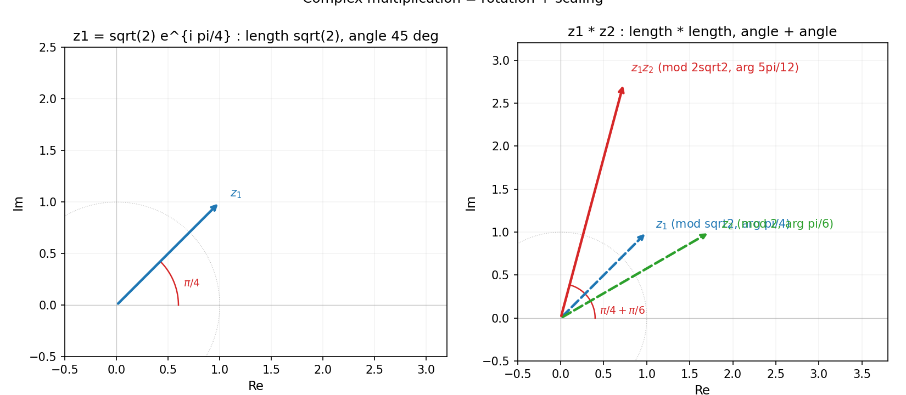
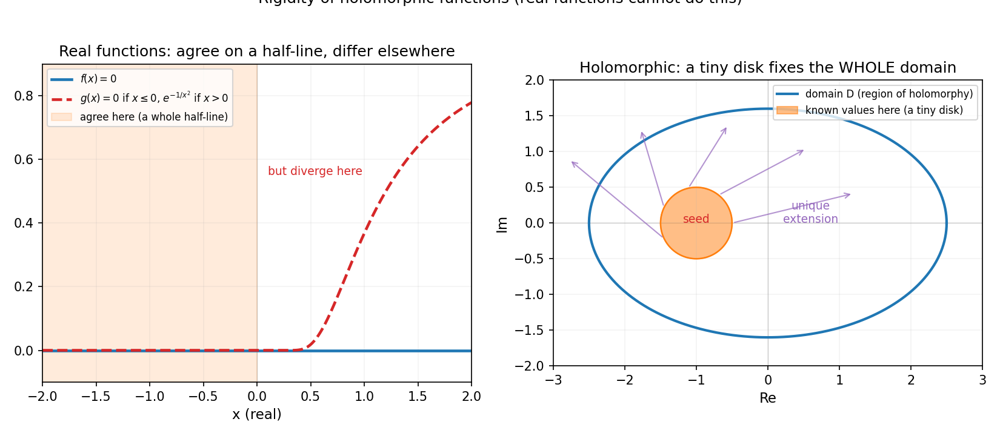

# 第 17 章 · 复变函数:复数可微的恐怖力量

> **核心问题**:把分析从实数轴搬到复平面,凭什么"复数可微"这件事会强到恐怖?为什么复分析比实分析"刚"得多,而这种刚性反而成了一种力量?

> **读完本章你会明白**:
> 1. 复数乘法的几何意义是**旋转 + 缩放**——把复平面当成一个"自带旋转的二维空间",这是复分析一切直觉的起点;
> 2. 复可微(叫**全纯** holomorphic)的要求远比实可微苛刻:它必须满足 **Cauchy-Riemann 方程**,而这等价于"可微一次就自动无穷次可微、还能写成收敛的幂级数";
> 3. 全纯函数有一种恐怖的**刚性**:它在一个点上(或一小段弧上)的值,能**唯一决定**它在整个区域上的取值(唯一性定理 / 解析开拓)——实函数绝无此性质;
> 4. **柯西积分定理**:全纯函数沿任何闭曲线的积分等于 0——这是复分析的大厦基石,也是下一章留数定理的跳板.

---

> **如果一读觉得太难**:先只记住三件事——① 复数 `z=x+iy` 的乘法 = 旋转 + 缩放,`e^{iθ}=cosθ+i sinθ`(欧拉公式);② 复可微(全纯)要求满足 Cauchy-Riemann 方程(`u_x=v_y, u_y=-v_x`),条件苛刻到"可微一次就自动无穷次可微";③ 全纯函数刚性极强——局部一点/一段的值,决定整个区域(局部决定全局).实函数做不到,这是复分析的力量所在.

---

## 章首 · 一句话点破

> **复可微,是一个比实可微严苛得多的条件——严苛到,一个点上的值就能决定整个函数.这种"刚性"看似束缚,却让复分析拥有实分析做梦都想不到的力量:实轴上算不动的难题,搬到复平面上往往有捷径.**

这句话是结论,不是理由.本章倒过来拆:先把复平面和复数乘法的几何讲清(为什么复数 = 旋转 + 缩放),再看复可微为何苛刻到"可微一次就无穷次可微",最后见证全纯函数那恐怖的刚性——以及它如何为下一章"换战场秒杀实积分"铺路.

---

## 一、复数:自带旋转的二维空间

### 1.1 复平面:把复数画成点

复数 `z = x + iy`(`i²=-1`),你可以把它当成一个二维点 `(x, y)`.把所有复数画在一个平面上——`x` 轴是实部、`y` 轴是虚部——这就是**复平面**(complex plane).

复数有两种写法,对应两种几何视角:
- **直角坐标**:`z = x + iy`,看它在平面上的位置.
- **极坐标(指数形式)**:`z = r e^{iθ} = r(cosθ + i sinθ)`,这里 `r = |z|` 是到原点的距离(模),`θ` 是和正实轴的夹角(辐角).`e^{iθ}=cosθ+i sinθ` 就是第 11 章(P4-11)那个欧拉公式.

> **画面**:每个复数,既是平面上的一个点,也是"一段长度 + 一个方向"(像一根从原点出发的箭头).直角坐标告诉你它在哪,极坐标告诉你"多远、朝哪个方向".两种写法随时互换,是复分析的基本功.

### 1.2 乘法 = 旋转 + 缩放

复数最妙的性质,是它的乘法有清晰的几何意义:**两个复数相乘,模相乘、辐角相加**——也就是"缩放 + 旋转".

$$ z_1 z_2 = (r_1 e^{i\theta_1})(r_2 e^{i\theta_2}) = (r_1 r_2)\, e^{i(\theta_1+\theta_2)} $$

- 模 `|z_1 z_2| = |z_1|·|z_2|` —— 长度相乘(缩放).
- 辐角 `arg(z_1 z_2) = arg(z_1) + arg(z_2)` —— 角度相加(旋转).

特例:乘以 `i = e^{iπ/2}`(模 1、角度 π/2),就是把一个复数**逆时针旋转 90°** 而不改变长度.乘以 `e^{iθ}` 就是旋转 θ 角度.乘以一个正实数 `r`,就是纯缩放、不旋转.

> **画面**:复数乘法 = 一手转、一手拉.你拿一根箭头,先按 `z_1` 转 θ₁ 角、拉到 r₁ 倍长,再按 `z_2` 转 θ₂ 角、拉到 r₂ 倍长——两步合起来,就是乘以 `z_1 z_2`.这和实数乘法(只拉不转)完全不同,也和二维向量的内积(投影)完全不同.**旋转 + 缩放,是复数特有的"乘法几何".**



> **不这样理解会怎样**:你会觉得"复数就是个有两个分量的实数对,跟二维向量差不多".**关键区别在乘法.** 二维向量的乘法(内积/外积)都没有"旋转 + 缩放"这么干净的几何;正是这套几何,让复可微的"导数"自然包含了旋转和缩放两种信息(下一节),从而强得离谱.

> **钉死这件事**:**复数乘法 = 模相乘 + 辐角相加 = 缩放 + 旋转.** `e^{iθ}` 是纯旋转单位算子,`i` 是旋转 90°.这套几何是复分析所有直觉的起点.

---

## 二、复可微:苛刻到"一次可微就无穷次可微"

### 2.1 复可微的定义:和实可微长一样,但暗藏杀机

把实函数的导数定义搬过来,把 `x` 换成复数 `z`:

$$ f'(z_0) = \lim_{h\to 0} \frac{f(z_0+h) - f(z_0)}{h}, \quad h \in \mathbb{C} $$

定义看着和实导数一模一样.**但杀机藏在 `h` 是复数这件事上**:实导数里 `h` 只能沿实轴趋近 0(一个方向),复导数里 `h` 可以沿复平面上**任何方向**趋近 0(无穷多个方向).**复可微要求:不管 h 从哪个方向来,差商都收敛到同一个极限.**

这是复可微苛刻的根源.实可微只要求"沿 x 方向的逼近有极限",复可微要求"沿所有方向的逼近都给同一个极限"——条件严了无数倍.

### 2.2 杀机现形:Cauchy-Riemann 方程

把苛刻性写出来.设 `f(z) = u(x,y) + i v(x,y)`(`u` 是实部、`v` 是虚部,都是二元实函数).要求"h 从实轴方向(令 h→实数)和虚轴方向(令 h→纯虚数)逼近,差商极限相同",会逼出两个方程——**Cauchy-Riemann 方程**:

$$ \frac{\partial u}{\partial x} = \frac{\partial v}{\partial y}, \qquad \frac{\partial u}{\partial y} = -\frac{\partial v}{\partial x} $$

满足 C-R 方程(且偏导连续)的函数,叫**全纯函数**(holomorphic,也叫解析函数 analytic).全纯 = 复可微,这是复分析的研究对象.

看几个例子:
- `f(z) = z² = (x²-y²) + i(2xy)`,`u=x²-y², v=2xy`.`u_x=2x=v_y`、`u_y=-2y=-v_x`.**满足 C-R,全纯.**
- `f(z) = \bar{z} = x - iy`(共轭),`u=x, v=-y`.`u_x=1`、`v_y=-1`,不相等.**不满足 C-R,除了 z=0 外处处不可微.** 一个处处"看着光滑"的函数,在复意义下却几乎处处不可微——这就是苛刻性的具象.

> **画面**:实可微像"我只会从正前方(实轴)看一个东西".复可微像"我得从所有方向看,看到的都得是同一个东西".能扛住这种全方位考验的函数,自然是稀缺而强韧的.**复可微 = 全方位一致地可微.**

> **钉死这件事**:**复可微(全纯) ⟺ 满足 Cauchy-Riemann 方程.** 条件苛刻到:满足它的函数,自动无穷次可微,还能局部写成收敛的幂级数(也就是 P4-11 的解析函数)——一次可微,就白送你无穷次可微 + 幂级数表示.

### 2.3 几何意义:全纯 = 保角映射(共形)

C-R 方程不只是代数条件,它有深刻的几何意义——**全纯函数是"保角映射"(共形映射,conformal map)**.意思是:在导数不为零的点,全纯函数 `f` 保持**两条曲线的夹角**和**方向**不变.

> **画面**:你在复平面上画两条相交的曲线(比如一个十字),用全纯函数 `f` 把它们"变形"映射过去.虽然形状会被拉伸、扭曲,但**那两条曲线在新位置上的夹角,和原来一模一样**(连旋转方向都保).这就是"共形"——保持形状的角度结构.这来自复导数的几何:`f'(z₀) = re^{iθ}`,它把无穷小向量**旋转 θ、缩放 r**,所有方向一致地旋转 + 缩放,所以夹角被保住.

这条几何性质是复分析在工程里大显身手的原因——流体力学里,共形映射把绕复杂边界的流场,变成绕简单边界(如圆柱)的流场再变换回去;电磁学里,二维电场的等势线和力线在共形映射下保持正交.

### 2.4 恐怖的连锁赠礼:可微一次 = 无穷次可微 = 解析

复可微最反直觉的一条:**只要 `f` 在一个区域里复可微一次,它就自动在该区域里无穷次可微,而且每一点都能展开成收敛的泰勒级数**(即它是解析的,见 P4-11).

对比实分析:`f(x)=|x|` 在 0 处不可导;`f(x)=x²·(有理取 1、无理取 x²)` 这种构造可以"一次可微但二次不可微";更有人造出"光滑但非解析"的函数(在某点各阶导数都是 0、但函数不恒为 0,比如 `e^{-1/x²}`).实函数可微一次,什么也不白送.**复函数可微一次,白送一切.**

这条"白送"是复分析区别于实分析的根本特征,也是下一节"刚性"的来源.

### 2.5 为什么复可微这么"慷慨"?直觉来源

你可能会问:明明复可微条件更严苛,为什么反而白送更多?这看似矛盾,其实正是"严苛"换"慷慨"的对偶.

直觉是这样的:实可微只要求"沿一个方向(实轴)的逼近有极限",这个要求太弱,弱到函数可以在其他方向(比如虚轴方向,虽然实函数没这个方向)有任意古怪行为,所以"可微一次"保证不了"可微两次".而复可微要求"沿所有方向的逼近都给同一个极限",这个要求**严到把函数在所有方向的行为都钉死了**——一旦全方位一致地可微,它就必然光滑到无穷阶,必然能展开成幂级数(因为幂级数正是"全方位一致逼近"的自然产物,见 P4-11).

换句话说:**实可微是"一个方向的一致",太松,留有古怪空间;复可微是"所有方向的一致",太严,严到不留古怪空间,于是只能乖乖光滑到底.** 严苛和慷慨,是同一枚硬币的两面.

> **钉死这件事**:**复可微"严苛换慷慨"**——要求所有方向一致(严),换来无穷次可微 + 解析(慷慨).实可微只要求一个方向(松),所以古怪空间大,什么也不白送.这是复分析与实分析的根本分水岭.

> **不这样理解会怎样**:你会以为"复分析不过是把实分析的 x 换成 z,无聊的搬运".**完全错.** 复可微的条件严苛到自带无穷阶光滑和幂级数表示——这是实分析做梦都得不到的福利.这种"苛刻 + 福利"的对偶,是复分析的力量之源.

---

## 三、全纯的刚性:一个点决定全局

### 3.1 局部决定全局:实函数做不到,复函数免费

现在见证全纯函数最恐怖的性质——**刚性**(rigidity).

> **唯一性定理**:如果两个全纯函数 `f` 和 `g` 在一个区域 `D` 上全纯,且它们在一个**含有聚点**的子集上取值相同(比如在一段弧上、或一串收敛到 `D` 内某点的数列上取值相同),那么 `f ≡ g` 在整个 `D` 上恒等.

翻译成人话:**两个全纯函数,只要在一小段弧(甚至一串收敛的点)上重合,它们就在整个区域上完全相同.** 一个点(或一小段)的值,唯一决定了整个区域上的函数.

实函数有这本事吗?**没有.** 两个实函数 `f(x)=0` 和 `g(x)=\begin{cases}0 & x≤0\\ e^{-1/x²} & x>0\end{cases}`,它们在 `x≤0` 上完全重合(整整半条直线!),却在 `x>0` 上分道扬镳——实函数可以在一大段上重合、另一段上完全不同.复函数做不到这种"分家",它们太刚了.

> **画面**:实函数像一根软绳子,你拽住一段,另一段还可以随便摆;全纯函数像一块刚性板,你按住一个角(哪怕一个点),整块板的位置就钉死了,动弹不得.这种刚性,看似是束缚,却是力量——它让你能从"局部一点点信息"推出"全局全部信息".

### 3.2 解析开拓:把定义域外的值"唯一补出来"

刚性的一个直接后果是**解析开拓**(analytic continuation):如果一个全纯函数在某个小区域上的值确定了,那么它在任何"与小区域相连的更大区域"上的值,**也被唯一确定了**(只要那个更大区域上还存在全纯的延拓).

> **画面**:你手里有一块全纯函数的"拼图碎片"(它在某个小圆盘上的值).解析开拓告诉你:这块碎片能拼到哪、拼上去之后长什么样,**全由这块碎片决定**——不存在"两种都合理的拼法".你沿着复平面一片片拼,函数的值就被唯一地"长"出去.**这是下一章 ζ 函数和黎曼猜想的入口.**

### 3.3 一个直观例子:从一小段"长"出整个函数

举个具体例子感受刚性.假设你知道一个全纯函数 `f` 在原点附近一小段实轴上等于 `e^x`(比如 `x ∈ (-0.1, 0.1)`).问:它在整个复平面上的值是什么?

答案是:**只能是 `e^z`**.为什么?因为 `e^z` 是全纯函数,它在那一小段上确实等于 `e^x`;而唯一性定理说,任何两个全纯函数在一个含聚点的子集(那一小段实轴)上重合,就在整个相连区域上恒等.所以 `f` 必然就是 `e^z`,**没有别的可能**.

这就是"局部决定全局"的威力:你给我 `e^x` 在 0 附近一小段的行为,我就能唯一确定它在复平面任何地方(比如 `z=iπ`,得 `e^{iπ}=-1`)的行为.实函数做不到——实函数 `f(x)` 你知道它在 `(-0.1,0.1)` 等于 `e^x`,在 `x=10` 处它可以是任何值,实函数没说必须怎样.复函数不一样,它被刚性钉死了.

> **钉死这件事**:**全纯函数刚性极强——一个点(含聚点的子集)的值,唯一决定整个区域.** 解析开拓是这条刚性的直接应用:从一片小区域,唯一地把函数"长"到更大的区域.实函数绝无此性质.



---

## 四、柯西积分定理:复分析的大厦基石

刚性的极致体现,是一条堪称复分析"地基"的定理——**柯西积分定理**(Cauchy's integral theorem):

> 若 `f` 在单连通区域 `D` 上全纯,`γ` 是 `D` 内任意一条闭曲线,则

$$ \oint_\gamma f(z)\,dz = 0 $$

**沿任何闭曲线的积分等于 0.** 这件事在实积分里是不可想象的——实函数沿一个来回的积分可不一定是 0.复分析里它就是 0,因为全纯太刚、太光滑,绕一圈"赚的"和"赔的"刚好抵消.

柯西积分定理是复分析一切深刻结论的源头:
- 从它推出**柯西积分公式**:`f(z_0) = (1/2πi) ∮ f(z)/(z-z_0) dz`——一个全纯函数在某点的值,被它沿围绕该点的闭曲线的积分**完全决定**(又一次"局部 ↔ 全局"的对偶).
- 从柯西积分公式推出"全纯 ⟺ 无穷次可微 ⟺ 解析"(第二节那条赠礼).
- 下一章的**留数定理**(用复积分算实积分的杀手锏),就是柯西积分定理的升级版.

### 4.1 柯西积分公式:边界决定内部

柯西积分公式值得单看一眼,因为它把"刚性"表达到了极致:

$$ f(z_0) = \frac{1}{2\pi i} \oint_\gamma \frac{f(z)}{z - z_0}\,dz $$

`γ` 是绕 `z_0` 的任何闭曲线.这条公式说:**`f` 在 `z_0` 这一点的值,完全由 `f` 在边界 γ 上的取值决定.** 你在边界上知道 `f` 的每一个值,内部任意一点的 `f` 就被积分算出来——不需要内部任何信息.

这是"局部 ↔ 全局"对偶的另一面:上一节的唯一性定理说"一小段弧的值决定整个区域";柯西积分公式说"整个边界的值决定内部每一点".两者都来自全纯的刚性.实函数完全没有这种"边界定内部"的好事——实函数你可以在边界随便定值,内部随便填.

### 4.2 全纯 ⟺ 调和:复分析的二维物理

把全纯函数 `f = u + iv` 拆开,实部 `u` 和虚部 `v` 都是**调和函数**(harmonic function)——满足拉普拉斯方程 `Δu = u_xx + u_yy = 0`、`Δv = 0`(这从 C-R 方程直接推出:对 `u_x = v_y` 再求 x 导、对 `u_y = -v_x` 再求 y 导,相加得 `u_xx + u_yy = v_yx - v_xy = 0`).

调和函数是物理的常客:**稳态温度分布、静电势、不可压无旋流的速度势,全都满足拉普拉斯方程.** 所以复分析直接是二维物理的语言——一个全纯函数 = 一对调和的"势函数 + 流函数",描述一个二维物理场.这就是为什么飞机机翼的升力、二维电场的等势线,都能用复变函数算(彩蛋详述).

> **画面**:全纯函数 `f = u + iv` 像一对"双胞胎物理场"——`u` 是温度/电势,`v` 是热流/电场流线.它们由 C-R 方程牢牢绑在一起,知道一个就推出另一个(柯西-黎曼方程本身就能从 `u` 解出 `v`,差一个常数).复分析因此不只是纯数学,它是**二维物理的母语**.

> **钉死这件事**:**柯西积分定理:全纯函数沿任何闭曲线积分 = 0.** 它是复分析的地基,推出柯西积分公式("边界定内部")、无穷次可微、解析性,也是下一章留数定理的母定理.全纯函数的实虚部都是调和函数(满足拉普拉斯方程),这是复分析成为二维物理语言的根.

### 4.3 最大模原理:全纯函数的"边界峰值"

刚性的另一个戏剧性表现是**最大模原理**(maximum modulus principle):一个非常数的全纯函数,其模 `|f(z)|` **不可能在区域内部达到最大值**——最大值一定在边界上.

这又是一条实函数没有的性质.实函数 `f(x)` 可以在区间内部取最大(比如 `f(x)=-x²` 在 x=0 处最大);复全纯函数不行,它的"峰值"被赶到边界去了.直觉上,这是因为全纯函数太刚——如果它在内部某点 `|f|` 最大,柯西积分公式会强迫它"被周围的值平均",而平均值不可能大于最大值,除非函数是常数.

> **画面**:全纯函数像一张绷紧的鼓面——你没法在鼓面中间顶出一个峰,因为膜太紧,任何"凸起"都会被周围的张力拉平,峰值只能出现在鼓的边框(边界)上.这就是最大模原理.它也是调和函数(温度、电势)"不存在内部局部最大"这条物理事实的数学根——稳态温度场不会在内部出现"最热点",热一定从边界流过来.

> **钉死这件事**:**最大模原理:全纯函数的模不在内部取最大,只在边界取.** 这是刚性的又一表现,也是调和函数"无内部峰值"物理性质的数学根.

---

## 五、彩蛋:复分析在工程里——滤波器、流体、量子

复分析看似抽象,工程里却无处不在:

- **滤波器设计**:电子工程里的模拟滤波器(巴特沃斯、切比雪夫),设计核心是把 `s` 平面(复频率)上的极点摆到合适位置.极点在左半平面 → 系统稳定;极点位置 → 决定截止频率和纹波.**整个控制论和信号系统,都在复平面上算极点.** 拉普拉斯变换把微分方程变成 `s` 域上的代数方程,稳定性、瞬态、稳态全在极点和留数里(下一章详述).
- **流体力学**:二维不可压无旋流,其复速度势 `F(z) = φ(x,y) + iψ(x,y)` 是一个全纯函数——实部 `φ` 是速度势、虚部 `ψ` 是流函数,两者都是调和函数(4.2 节).绕机翼的升力、绕圆柱的流场,用**茹科夫斯基变换** `ζ = z + a²/z` 把圆柱外的流场映射成机翼外的流场,**一行复变函数算出升力**.**飞机为什么能飞,数学根子在复分析.**
- **量子力学**:波函数是复值函数 `Ψ(x,t)`,薛定谔方程 `iℏ ∂Ψ/∂t = ĤΨ` 里的 `i` 不是装饰,是物理——它保证了概率守恒.量子态的相位,就是复数的辐角;量子干涉(双缝实验的明暗条纹),就是复数相位的相加相消(1.2 节的"辐角相加"在量子世界复活).

> **画面**:复分析不是数学家的玩具,它是工程师和物理学家的日常工具.你手机里的滤波器(决定 5G 信号怎么解调)、你坐的飞机(机翼升力)、你读到的量子计算新闻——背后都有复可微、共形映射、柯西积分这套刚性结构在默默工作.**这是本书"有什么用"的又一座富矿.**

> **钉死这件事**:**复分析是"数学 + 物理 + 工程"三界的通用语言.** 滤波器的极点、机翼的升力、量子的相位,根子都在复数可微这套刚性结构里.

---

## 符号 + 数值佐证

### sympy:验证 Cauchy-Riemann、复数乘法几何

```python
import sympy as sp

x, y = sp.symbols('x y', real=True)

# (1) f(z)=z^2 = (x^2-y^2) + i(2xy), 验证 Cauchy-Riemann
u, v = x**2 - y**2, 2*x*y
CR1 = sp.simplify(sp.diff(u, x) - sp.diff(v, y))   # 应为 0
CR2 = sp.simplify(sp.diff(u, y) + sp.diff(v, x))   # 应为 0
print('f=z^2:  u_x - v_y =', CR1, '  u_y + v_x =', CR2, '  -> holomorphic:', CR1==0 and CR2==0)

# (2) f(z)=conj(z) = x - iy, 不满足 C-R
u2, v2 = x, -y
print('f=conj(z):  u_x - v_y =', sp.simplify(sp.diff(u2,x)-sp.diff(v2,y)), '  -> NOT holomorphic')

# (3) 复数乘法几何: |z1 z2|=|z1||z2|, arg 相加
z1, z2 = 1 + sp.I, sp.sqrt(3) + sp.I     # |z1|=sqrt2 arg=pi/4; |z2|=2 arg=pi/6
prod = sp.expand(z1 * z2)
print('z1*z2 =', prod, '  |z1*z2| =', sp.Abs(prod).simplify(),
      ' (expect 2*sqrt2 =', (sp.sqrt(2)*2).simplify(), ')')
print('arg(z1)+arg(z2) =', sp.arg(z1)+sp.arg(z2), ' = 5*pi/12 ?', sp.simplify(sp.arg(z1)+sp.arg(z2)-5*sp.pi/12)==0)

# (4) e^{i pi} + 1 = 0  (欧拉恒等式)
print('e^{i pi} + 1 =', sp.simplify(sp.exp(sp.I*sp.pi) + 1))
```

运行:`f=z²` 满足 C-R(全纯),`f=conj(z)` 不满足(不可微);`|z₁z₂| = 2√2`(模相乘),辐角和 `= 5π/12`(角度相加);`e^{iπ}+1=0`.**全都是符号事实,印证了"乘法 = 旋转 + 缩放"和"C-R 是全纯的判据".**

### numpy:数值验证 C-R 与"导数与方向无关"

```python
import numpy as np

# 验证 f(z)=z^2 在 z0=1+2i 处复可微: 差商从 4 个方向逼近, 给同一个值
z0 = 1 + 2j
f = lambda z: z**2
exact = 2*z0    # 解析导数 f'(z)=2z

for direction, h_unit in [('east', 1+0j), ('north', 0+1j),
                          ('NE', (1+1j)/np.sqrt(2)), ('NW', (-1+1j)/np.sqrt(2))]:
    h = 1e-8 * h_unit
    d = (f(z0+h) - f(z0)) / h
    print(f'  从 {direction} 方向逼近: f\'(z0) ≈ {d:.10f}   (exact = {exact})')

# 对比 f(z)=conj(z): 不同方向给不同"导数" -> 不可微
g = lambda z: np.conj(z)
print('\nf(z)=conj(z) 复可微性检验:')
for direction, h_unit in [('east', 1+0j), ('north', 0+1j)]:
    h = 1e-8 * h_unit
    d = (g(z0+h) - g(z0)) / h
    print(f'  从 {direction} 方向: 差商 ≈ {d:.6f}   (两个方向不一致 -> 不可微)')
```

跑一下你会震撼地看到:`f(z)=z²` 从四个方向逼近,差商**全部等于** `f'(z0)=2+4i`,一字不差(这就是"全方位一致");而 `f(z)=conj(z)` 从东、北两个方向逼近,差商一个给 1、一个给 -1,**不一致,故不可微**.**复可微的苛刻性,在屏幕上一目了然.**

---

## 章末小结

**用母题回顾本章**:本章母题是**"升维成空间"**(把实轴升维成复平面)和**"缰绳 / 可控"**(C-R 方程把可微条件收紧).复平面是一个自带"旋转 + 缩放"乘法的二维空间;在这个空间上定义可微,条件苛刻到全方位一致(C-R),苛刻到白送无穷次可微和解析性;全纯函数因此刚性极强——一个点的值决定整个区域.**这种刚性,看似束缚,却是复分析的力量之源.**

**回扣全书主线**:本章又一次兑现"精确 = 逼近的极限"——**复导数(精确变化率),是从所有方向逼近的差商(逼近)的共同极限**.我们在驯服的是**"多方向逼近的一致性"**这种无穷:实可微只要一个方向收敛,复可微要求所有方向收敛到同一个值——条件严了无数倍,但严得有回报(无穷次可微 + 解析 + 刚性).

**本章在驯服哪种无穷、补了谁的窟窿**:驯服的是**"全方位逼近一致"**这种无穷.补的,表面看不是某个具体窟窿,而是**给实分析打开一个新战场**:实轴上很多算不动的积分、解不出的方程,搬到复平面上反而有捷径.复分析不是实分析的修补,是实分析的**升级版战场**——下一章我们就看,这个新战场如何秒杀实轴上的难题.

**五个"为什么"(若只记五件事)**:
1. **复数乘法的几何意义?** 模相乘 + 辐角相加 = 缩放 + 旋转.乘 `i` = 旋转 90°,乘 `e^{iθ}` = 旋转 θ.这是复分析一切直觉的起点.
2. **复可微为什么苛刻?** `h` 是复数,可以从任何方向逼近 0;复可微要求所有方向的差商给同一个极限.苛刻性凝结在 **Cauchy-Riemann 方程**(`u_x=v_y, u_y=-v_x`)上.
3. **"可微一次就无穷次可微"为什么?** 因为 C-R 方程 + 解析性是连锁赠礼:满足 C-R ⟺ 全纯 ⟺ 无穷次可微 ⟺ 局部等于收敛幂级数(解析).实函数完全没这福利.
4. **全纯的"刚性"指什么?** 一个点(或一段含聚点的弧)的值,唯一决定整个区域(唯一性定理);定义域外的值可被唯一补出(解析开拓).实函数做不到.
5. **柯西积分定理为什么是基石?** 全纯函数沿任何闭曲线积分 = 0.它推出柯西积分公式、无穷次可微、解析性,也是下一章留数定理的母定理.

**想继续深入该往哪钻**:
- **3Blue1Brown《Essence of Calculus》+ 其复变可视化短贴**——动画演示"复乘法 = 旋转 + 缩放"和"复导数的全方位一致",和本章图 17.1 同源;
- **sympy / numpy 自玩**:对各种 `f(z)`(z³、e^z、1/z)验证 C-R;对 `conj(z)`、`|z|²` 验证不可微;尝试构造一个"在某点各阶导数都为 0"的复全纯函数,发现它必恒为 0(刚性的另一面);
- **跨领域彩蛋**:① **滤波器/控制论**:`s` 平面极点位置决定系统稳定性,根子在本章;② **流体力学**:茹科夫斯基变换用复变函数算机翼升力;③ **量子力学**:波函数是复值函数,量子相位就是复辐角.

**下一章**:本章建立了复分析的地基——全纯、刚性、柯西积分定理.下一章《留数与解析延拓:换个战场秒杀实积分》,就把这套武器用起来:**留数定理**把实轴上算不动的积分,变成算复平面上奇点处的"留数"再求和(秒杀);**解析延拓**把定义域外的函数值唯一补出来——它的最著名应用是 ζ 函数和黎曼猜想.**实轴上无解的难题,复域里有捷径——这就是"换战场"的力量.**
