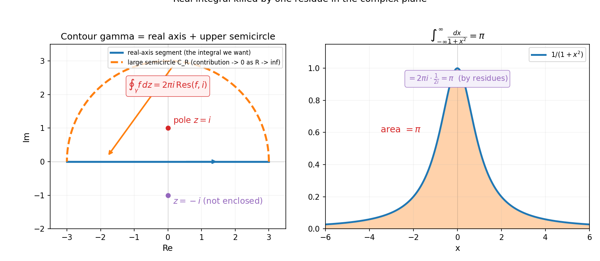
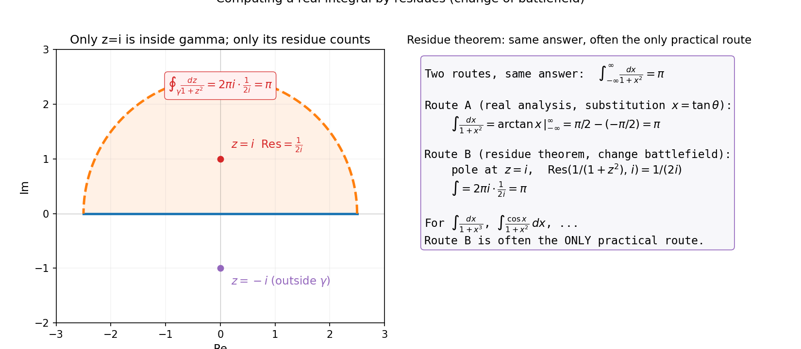

# 第 18 章 · 留数与解析延拓:换个战场秒杀实积分

> **核心问题**:实轴上有一堆积分,无论你怎么换元、分部积分都算不动(比如 `∫_0^∞ dx/(1+x³)`、`∫_{-∞}^∞ cos x/(1+x²) dx`).出人意料的是,把这些实轴难题搬到复数域,反而能秒杀——凭什么?这套"换战场"的本事,又是怎么通向 ζ 函数和黎曼猜想的?

> **读完本章你会明白**:
> 1. **留数定理**(residue theorem):把实轴上难算的积分,变成算复平面上奇点处的"留数"再求和——一个实积分,可能只需算一两个复数(留数)就秒出答案;
> 2. 留数到底是什么:它是全纯函数在奇点附近"洛朗展开"里 `1/(z-z₀)` 那一项的系数,代表函数绕奇点"转一圈"积累的"净环绕量";
> 3. **解析延拓**(analytic continuation):把定义域外的函数值**唯一地**补出来(呼应 P6-17 全纯的刚性)——这是"局部决定全局"的极致应用;
> 4. **ζ 函数与黎曼猜想**:解析延拓最著名的应用——`ζ(s)=Σ1/nˢ` 本来只在 `Re(s)>1` 收敛,延拓到全平面后,它的**零点分布**藏着素数的秘密(黎曼猜想).

---

> **如果一读觉得太难**:先只记住三件事——① 留数定理:实轴上难算的积分,改成算复平面上几个奇点处的"留数",求和乘 `2πi` 就出答案(`∫ = 2πi · Σ 留数`);② 留数 = 函数在奇点处"绕一圈"积累的环绕量,几何上是"转了多少圈"的度量;③ 解析延拓 = 用局部信息唯一补出全局(全纯刚性的应用),`1+2+3+…=-1/12` 就是这样"算出来"的,是 ζ 函数延拓后的值.

---

## 章首 · 一句话点破

> **实轴上算不动的积分,搬到复平面反而能秒杀——因为复平面上有"留数"这种几何量,把一个全局的积分,压缩成奇点处的几个数.这套"换战场"的本事,根子在上一章全纯函数的刚性.**

这句话是结论,不是理由.本章倒过来拆:先看一个实积分怎么"换到复平面"被秒杀,再讲留数是什么、为什么能这么用,最后看解析延拓如何用"局部补全局",通向 ζ 函数和黎曼猜想.

---

## 一、换战场:实积分搬到复平面

### 1.1 一个实轴上算得动、却想换个算法的例子

考虑这个积分:

$$ \int_{-\infty}^{\infty} \frac{dx}{1+x^2} $$

用实分析的招式(换元 `x=tan θ`),你能算出答案是 π.这条路走得通,但有点费劲.现在我们换一条路:**把这个实积分,看成复平面上沿实轴的一段路径积分**,然后用复分析的工具(下一节的留数)秒杀.

怎么搬?把实轴上的 `x` 当成复平面上的实轴那条线,被积函数 `1/(1+x²)` 自然推广到复平面:`f(z)=1/(1+z²)`.实积分 `∫_{-∞}^{∞} 1/(1+x²) dx` 就是 `f(z)` 沿复平面实轴(从 `-∞` 到 `+∞`)的路径积分.**函数没变,只是把舞台从一维实轴,升到了二维复平面.**

### 1.2 关键招式:用一条闭曲线把实轴"圈进来"

复分析最有用的招式之一是**围道积分**(contour integration):在复平面上画一条**闭曲线 γ**,让 `f` 沿 γ 走一圈的积分,等于它"圈住的奇点"的留数之和(留数定理,下一节).这条闭曲线怎么设计?

对于 `∫_{-∞}^{∞}`,经典做法是:**实轴段 `[-R, R]` + 上半平面的大半圆 `C_R`(从 R 绕回 -R)**,合成一条闭曲线 γ.当 R→∞ 时:
- 大半圆 `C_R` 上的积分 → 0(因为 `f(z)=1/(1+z²)` 在大圆上 `|f|~1/R²`、半圆长 `~πR`,乘起来 `~π/R → 0`).
- 所以 γ 的总积分 = 实轴段积分(就是我们想要的 `∫_{-∞}^{∞}`)+ 大半圆积分(→0) = 想要的实积分.

**而 γ 的总积分,用留数定理一行算出**(下一节).于是实积分被秒杀.

> **画面**:你想要的实积分,是复平面实轴上的一条线段.你给它"加一个盖"——上半平面的大半圆,把这条线段封成一条闭曲线.闭曲线的积分,留数定理一秒算出;而那个"盖"(大半圆)在 R→∞ 时贡献趋零,可以扔掉.**实积分,就这样被一个复平面的"闭圈 + 留数"替代.** 这是"换战场"的精髓:把一维难题,升级成二维上有捷径的题.



> **不这样理解会怎样**:你会觉得"这绕一大圈,不还是算同一个积分吗".**关键在于:实轴上你只有换元、分部这点招;复平面上你有留数定理.** 同一个积分,在复平面上能用"圈奇点、算留数"这条路,常常**几行**算出实轴上**几十行甚至算不动**的结果.这正是复分析"换战场秒杀"的力量.

---

## 二、留数:奇点处的"环绕量"

### 2.1 留数定理:积分 = 2πi × 留数之和

**留数定理**(residue theorem):若 `f` 在闭曲线 γ 内部除有限个孤立奇点 `z_1, z_2, …, z_k` 外全纯,则

$$ \oint_\gamma f(z)\,dz = 2\pi i \sum_{j=1}^{k} \mathrm{Res}(f, z_j) $$

**沿闭曲线的积分,等于圈内所有奇点的留数之和,乘以 `2πi`.** 一个看似复杂的环路积分,被压缩成"圈内几个奇点的留数相加".这就是秒杀的来源.

### 2.2 留数是什么:洛朗展开里 `1/(z-z₀)` 那项的系数

留数 `Res(f, z₀)` 到底是什么?把 `f` 在奇点 `z₀` 附近做**洛朗展开**(Laurent expansion,泰勒展开的推广,允许负幂项):

$$ f(z) = \cdots + \frac{a_{-2}}{(z-z_0)^2} + \frac{a_{-1}}{z-z_0} + a_0 + a_1(z-z_0) + \cdots $$

**留数,就是 `1/(z-z₀)` 那一项的系数 `a_{-1}`**.

为什么偏偏是这一项?因为绕 `z₀` 转一圈时,**只有 `1/(z-z₀)` 这一项的环路积分不为 0**(它等于 `2πi`),其他项的环路积分都是 0(整数次幂的原函数是单值的,转一圈回到原值;`1/(z-z₀)^n`(`n≥2`)的原函数转一圈也是 0).所以"绕一圈的积分"全部由 `a_{-1}` 贡献——**留数 = 奇点处"转一圈积累的净环绕量"**.

> **画面**:留数是一个奇点的"旋转指纹".函数在一个点附近怎么"打转",全浓缩在 `a_{-1}` 这一个数里.其他高阶负幂(`1/(z-z₀)²` 等)虽然也发散,但它们转一圈的积分是 0——只有 `1/(z-z₀)` 这个一阶负幂,转一圈贡献 `2πi`.**留数,是奇点处唯一"积得动"的那部分.**

### 2.3 算留数:一阶极点最简单

最常见的奇点是**一阶极点**(simple pole)——函数形如 `g(z)/(z-z₀)`,`g` 在 `z₀` 处非零全纯.这时留数有一个漂亮公式:

$$ \mathrm{Res}\!\left(\frac{g(z)}{z-z_0},\, z_0\right) = g(z_0) $$

**把分母的 `(z-z₀)` 消掉,剩下的函数在 `z₀` 处取值,就是留数.**

回到我们的例子 `f(z)=1/(1+z²)`.它有两个一阶极点:`z=i` 和 `z=-i`(因为 `1+z²=(z-i)(z+i)`).在上半平面的闭曲线里,只圈住了 `z=i`.把 `f` 写成 `1/((z-i)(z+i))`,视 `g(z)=1/(z+i)`,则

$$ \mathrm{Res}(f,\, i) = g(i) = \frac{1}{i+i} = \frac{1}{2i} $$

留数定理给出 `∫_{-∞}^{∞} 1/(1+x²) dx = 2πi · Res(f, i) = 2πi · (1/(2i)) = π`.**和实分析换元算出的答案一模一样,但只用了两行.**

> **不这样理解会怎样**:你会把留数定理当成"又一个要背的公式".其实它是一条**几何事实**:环路积分由圈内奇点的"旋转指纹"(留数)决定.把这条想清楚,留数定理自己就能推出来——`∮ = 2πi · Σ 留数`,因为每圈贡献 `2πi`,而只有 `1/(z-z₀)` 项转一圈不为零.

### 2.4 三类奇点:可去、极点、本性

留数都和奇点打交道,有必要分清复分析里奇点的三种类型.设 `f` 在 `z₀` 附近(去心邻域)全纯,看它的洛朗展开:

- **可去奇点**(removable):洛朗展开没有负幂项(比如 `sin z / z` 在 `z=0`,展开是 `1 - z²/6 + …`,没有负幂).这种奇点"假装"是奇点,其实补个值就全纯了,留数 = 0.
- **极点**(pole):洛朗展开只有有限个负幂项,最高负幂是 `1/(z-z₀)^m`(`m` 阶极点).一阶极点(`m=1`)最常见,留数 = `g(z₀)`;`m` 阶极点留数有个求导公式 `Res = 1/(m-1)! · d^{m-1}/dz^{m-1} [(z-z₀)^m f] |_{z₀}`.上面 `1/(1+z²)` 的 `±i` 都是一阶极点.
- **本性奇点**(essential):洛朗展开有无穷多个负幂项(比如 `e^{1/z}` 在 `z=0`,展开 `1 + 1/z + 1/(2!z²) + …`).本性奇点附近函数行为极其诡异——魏尔斯特拉斯-卡索拉蒂定理说,本性奇点附近函数值**稠密地填满整个复平面**(取到任何值,无穷接近).留数是 `1/z` 项的系数.

绝大多数工程和物理里遇到的奇点是**极点**(留数好算);本性奇点比较少见,但留数照样定义(洛朗展开读 `1/(z-z₀)` 系数).留数定理对三类奇点都适用,只是计算难度不同.

### 2.5 围道不止半圆:三种常用 contour

上半平面大半圆只是留数定理众多"围道设计"中的一种.根据被积函数的特点,常用的还有:

- **上半平面半圆**:适合 `∫_{-∞}^{∞} R(x) dx`(R 是有理函数,分母次数比分子高 2 以上),圈住上半平面的极点.
- **矩形围道**(keyhole / rectangle):适合带 `e^{ix}` 的振荡积分(如 `∫_{-∞}^{∞} cos x/(1+x²) dx`),用矩形的两条竖边让 `e^{ix}` 的虚部贡献相消.
- **锁眼围道**(绕分支割痕):适合带根号、对号的多值函数积分(如 `∫_0^∞ x^{a-1}/(1+x) dx`),绕着正实轴的"割痕"走一圈.
- **扇形围道**:适合 `∫_0^∞ f(x) dx` 配合某些角度的旋转对称.

设计围道是一门手艺——核心思想都是:**找一条闭曲线,让其中一段对应你要算的实积分,其他段的贡献要么为 0、要么能解析算出,然后整圈用留数定理一锤定音.** 这就是"换战场"的工程化:不是盲目搬,而是精心设计复平面的路径,让难事实积分变成留数的算术.

### 2.6 一个更能体现威力的例子:振荡积分

来看一个实轴上极难、留数法几行解决的积分:

$$ \int_{-\infty}^{\infty} \frac{\cos x}{1+x^2}\,dx = \frac{\pi}{e} $$

实分析里这个积分噩梦般难算(分部、换元都不灵).留数法怎么破?把 `cos x` 拆成 `(e^{ix}+e^{-ix})/2`,只要算 `∫ e^{ix}/(1+x²) dx`(另一半对称).用上半平面半圆围道:
- `f(z) = e^{iz}/(1+z²)`,圈住 `z=i`.
- 留数 `Res = e^{i·i}/(i+i) = e^{-1}/(2i) = 1/(2ie)`.
- 积分 = `2πi · 1/(2ie) = π/e`.

`cos x` 那部分取实部(因为 `cos x = Re e^{ix}`),所以 `∫ cos x/(1+x²) dx = Re(π/e) = π/e`.**一行半算完,答案 `π/e`.** 实分析里这个积分要用傅里叶变换或参数微分才能磨出来,留数法把它压成两个数的乘法.这就是"换战场"的威力——`e^{ix}` 在上半平面衰减(因为 `|e^{i(x+iy)}|=e^{-y}→0`),让大半圆贡献归零,留数一锤定音.

> **钉死这件事**:**留数法对"振荡 + 有理"型积分(`∫ e^{ix} R(x) dx`)尤其致命——`e^{ix}` 的衰减性让大半圆贡献归零,留数一行算出.** 这是实分析几乎算不动、复分析几行解决的最戏剧性对比.



> **钉死这件事**:**留数定理:∮ f dz = 2πi · Σ 留数.** 留数 = 洛朗展开中 `1/(z-z₀)` 项的系数,几何上是奇点处的"环绕指纹".一阶极点 `g(z)/(z-z₀)` 的留数 = `g(z₀)`.这套工具把实积分压缩成"圈几个奇点、算几个留数".

---

## 三、解析延拓:用局部信息补全局

### 3.1 从一小片,唯一地"长"出整片

上一章(P6-17)我们见过全纯函数的**刚性**——一个含聚点的子集上的值,唯一决定整个区域.这条刚性的极致应用,就是**解析延拓**(analytic continuation):

> 如果 `f` 在某个小区域 `D_1` 上全纯,而 `D_1` 可以"连"到一个更大的区域 `D_2`(存在一条从 `D_1` 延伸到 `D_2` 的路径,沿途每一步都能找到全纯的延拓),那么 `f` 在 `D_2` 上的值**被唯一决定**——任何两种延拓方式,结果都相同(只要它们都是全纯的).

翻译成人话:**你手里有一小片全纯函数,它能"长"到哪里、长成什么样,全由这一小片决定——不存在"两种都合理的长法".** 这和实函数形成鲜明对比:实函数可以随意拼接(一段多项式、另一段指数),复全纯函数不行,它太刚,只能长成唯一的样子.

> **画面**:解析延拓像"猜数字游戏",但规则极严:你给一个开头(一小片全纯函数),答案(整个延拓)就唯一确定了.你不需要"猜"——你只需要"算".这条唯一性,是复分析刚性的极致体现,也是下一节 ζ 函数的根基.

### 3.2 ζ 函数:从一个收敛级数延拓到全平面

**解析延拓最著名的应用,是黎曼 ζ 函数**(Riemann zeta function).

原始定义是一个级数:

$$ \zeta(s) = \sum_{n=1}^{\infty} \frac{1}{n^s} = 1 + \frac{1}{2^s} + \frac{1}{3^s} + \cdots $$

这个级数**只在 `Re(s)>1` 时收敛**(Re(s) 是 s 的实部).当 `s≤1` 时(比如 `s=0, -1, -2`),级数发散,ζ 看起来"没有定义".

但 ζ 在 `Re(s)>1` 上是全纯的(P4-11 讲过,这种级数在收敛域内解析).于是可以**解析延拓**——把 ζ 的定义,从 `Re(s)>1` 这一小片,唯一地"长"到整个复平面(除 `s=1` 是一阶极点外).延拓后的 ζ,在 `s=0` 取 `-1/2`、在 `s=-1` 取 `-1/12`、…….

最反直觉的一个:`ζ(-1) = -1/12`.把这个值代回原始级数,你会得到

$$ 1 + 2 + 3 + 4 + \cdots = -\frac{1}{12} $$

这听起来荒谬(正数相加怎么会是负数?)——但注意,**等号左边那个发散级数根本不收敛**,原始级数定义的 ζ 在 `s=-1` 处没有意义.**`-1/12` 不是"无穷项相加的和",而是 ζ 函数解析延拓后在 `s=-1` 处的值.** 物理学家(弦论、卡西米尔效应计算)还真用这个值,而且算出的物理预言和实验吻合——这是"解析延拓"作为一种合法数学工具的有力背书.

### 3.3 ζ 延拓怎么"算"出来:函数方程

ζ 函数的解析延拓不是凭空"规定"的,而是用一个**函数方程**精确算出来的.黎曼证明 ζ 满足一个对称关系(用 Γ 函数和 ξ 函数表达):

$$ \pi^{-s/2}\,\Gamma(s/2)\,\zeta(s) = \pi^{-(1-s)/2}\,\Gamma((1-s)/2)\,\zeta(1-s) $$

这条方程把 `ζ(s)` 和 `ζ(1-s)` 联起来——已知 `ζ(s)` 在 `Re(s)>1` 的值,就能用方程**算出**它在 `Re(s)<0` 的值(因为 `1-s>1`).至于中间那条带状区域 `0≤Re(s)≤1`(**临界带**),延拓用更细致的工具(如 η 函数 `η(s)=(1-2^{1-s})ζ(s)` 在 `Re(s)>0` 收敛,提供 ζ 在临界带的延拓).

这条函数方程本身就是个奇迹:它说 ζ 函数关于 `s ↔ 1-s` 有一种对称(叫"函数方程的对称").延拓后的 ζ,在 `s=1` 处有一个一阶极点(留数 = 1),其他地方全纯.正是这条延拓,让 ζ 从"只在 Re(s)>1 有定义的级数",变成"几乎全平面有定义的函数",零点研究才有了可能.

### 3.4 黎曼猜想:延拓后的零点,藏着素数

ζ 函数解析延拓到全平面后,有一类特殊的**零点**(`ζ(s)=0` 的点).黎曼在 1859 年提出一个惊天猜想:

> **ζ 函数所有"非平凡零点"(延拓后才出现的零点,排除 `s=-2,-4,…` 这些"平凡零点"),都落在 `Re(s)=1/2` 这条临界线上.**

这条猜想之所以惊天,是因为:**ζ 函数的零点分布,精确地编码了素数的分布**.黎曼在原论文里证明,素数计数函数 `π(x)`(小于 x 的素数个数)可以写成 ζ 零点的一个求和——**零点在哪,素数就在哪有起伏**.如果黎曼猜想成立,素数分布的误差被控制到最优,我们对素数的理解就到达了极限.

黎曼猜想至今未被证明(是千禧年七大难题之一,悬赏 100 万美元).它根子在**解析延拓**——把 ζ 从一小片延拓到全平面,然后研究延拓后的零点.**这是"局部决定全局"这条刚性的最伟大应用,也是复分析通向数论的桥梁.**

### 3.5 一段历史:黎曼 1859 年的八页纸

黎曼 1859 年那篇提出猜想的论文,只有**八页**.在这八页里,他:① 把 ζ 用解析延拓定义到全平面;② 证明了零点与素数分布的精确关系(`π(x)` 可写成 ζ 零点的求和);③ 提出了"非平凡零点都在 Re(s)=1/2"的猜想;④ 甚至算出了前几个零点的位置(在没有计算机的年代,纯靠手算).

这八页纸开创了解析数论整个分支.后来 Hadamard 和 de la Vallée-Poussin 用 ζ 在 Re(s)=1 上不为零的事实,证明了**素数定理**(`π(x) ~ x/ln x`)——这是 19 世纪数学的最高成就之一.而黎曼猜想如果成立,素数分布的误差会从 `O(x/ln x)` 改进到 `O(√x ln x)`,精度跃升.

> **画面**:黎曼把一个"算正整数倒数和"的初等数论问题(ζ 级数),通过解析延拓变成一个"全复平面上的函数",再用复分析的几何(零点分布)反过来回答数论问题(素数分布).**这是"换战场"的极致——把数论问题搬到复分析战场,用复分析的工具秒杀.** 解析延拓,是这场搬家的钥匙.

> **钉死这件事**:**解析延拓 = 用局部(一小片全纯函数)唯一补出全局(更大区域上的值).** ζ 函数从 `Re(s)>1` 延拓到全平面,`ζ(-1)=-1/12`(不是 `1+2+…` 真的等于它,而是延拓后的函数值).延拓后的零点分布 = 黎曼猜想,藏着素数的秘密.

> **钉死这件事**:**解析延拓 = 用局部(一小片全纯函数)唯一补出全局(更大区域上的值).** ζ 函数从 `Re(s)>1` 延拓到全平面,`ζ(-1)=-1/12`(不是 `1+2+…` 真的等于它,而是延拓后的函数值).延拓后的零点分布 = 黎曼猜想,藏着素数的秘密.

---

### 三点五、留数法到底能算哪三类实积分

留数法不是万能的,它对**三类**实积分最致命.认清这三类,你就知道何时该"换战场":

**第一类:有理函数的无穷积分** `∫_{-∞}^{∞} R(x) dx`,R 是两个多项式之比,分母次数比分子高 2 以上(保证大圆衰减).例:`∫ dx/(1+x²) = π`、`∫ dx/(1+x⁴) = π/√2`.这类实轴上能算但费劲,留数法几行.

**第二类:振荡积分** `∫_{-∞}^{∞} e^{ix} R(x) dx` 或取实/虚部得 cos/sin 版本.例:`∫ cos x/(1+x²) dx = π/e`.这类实分析几乎算不动(分部积分陷入循环),留数法靠 `e^{iz}` 在上半平面衰减,一击致命.这是留数法**最戏剧性**的用武之地.

**第三类:带根号/对数的多值函数积分** `∫_0^∞ x^{a-1} R(x) dx` 等.这类函数在复平面有"分支割痕"(branch cut),需要用锁眼围道(keyhole contour)绕割痕走.例:`∫_0^∞ √x/(1+x²) dx = π/√2`.这是留数法的进阶用法.

> **钉死这件事**:**留数法对三类实积分最致命:有理无穷积分、振荡积分、多值函数积分.** 碰到这三类,实分析头疼,复分析几行——这就是"换战场"的判断标准.

---

## 四、彩蛋:留数定理在物理与工程里

留数定理不只是算数学积分的把戏,它在物理和工程里是日常工具:

- **量子场论 / 弦论**:费曼图的圈积分(loop integrals)、重整化,几乎全是复平面上的留数计算.物理学家靠留数定理,把无穷维的路径积分压缩成有限个奇点的留数.
- **信号处理 / 控制论**:线性时不变系统的响应,通过拉普拉斯变换变成复频域 `s` 平面上的函数;系统的稳定性、瞬态响应,全靠 `s` 平面上极点的位置和留数.**控制工程师每天都在算留数.**
- **概率论**:特征函数(概率分布的傅里叶变换)的反演公式,有时用围道积分 + 留数算出原分布密度.

### 4.1 一个具体例子:拉普拉斯反变换用留数算

控制论里,你有一个系统的传递函数 `H(s) = N(s)/D(s)`(两个多项式之比),输入一个信号 `u(t)`,输出 `y(t)` 怎么算?用**拉普拉斯反变换**:`Y(s) = H(s)U(s)`,再反变换回时域.反变换公式

$$ y(t) = \frac{1}{2\pi i} \int_{\sigma-i\infty}^{\sigma+i\infty} Y(s) e^{st}\,ds $$

是一条复平面上的竖直线积分.如果 `Y(s)` 只有有限个极点 `s_1, …, s_k`(且都在积分线左边),用留数定理一秒算出

$$ y(t) = \sum_{j=1}^{k} \mathrm{Res}\big(Y(s) e^{st},\, s_j\big) $$

每个极点的留数贡献一个形如 `A_j e^{s_j t}` 的指数项——**系统的输出,就是各个极点对应的指数衰减(或增长、振荡)叠加**.极点在左半平面 → 衰减 → 系统稳定;极点在右半平面 → 增长 → 系统发散;极点是纯虚数 → 持续振荡.**这就是控制论"极点决定系统行为"的数学根——根子全在留数定理.**

> **画面**:你设计一个无人机 PID 控制器,调参的本质就是把闭环系统的极点摆到 `s` 左半平面的合适位置.每个极点的留数,决定那个模式下振荡多大、衰减多快.**整个控制工程的"稳定性""瞬态响应""稳态误差",翻译成复分析就是"极点位置 + 留数大小".** 这是留数定理在工程里最接地气的应用.

> **钉死这件事**:**留数定理是"数学 + 物理 + 工程"三界的通用算法.** 它把复杂的全局积分,压缩成奇点处的几个数——这种"压缩"在量子场论、控制系统、概率反演里反复出现.控制论的"极点决定系统行为",数学根就是留数定理.

---

## 符号 + 数值佐证

### sympy:留数 vs 直接积分,完全一致

```python
import sympy as sp
from sympy import pi, I, oo, residue, integrate

z, x = sp.symbols('z x')

# (1) 经典例子: ∫_{-inf}^{inf} dx/(1+x^2) = pi
print('--- 实积分: 1/(1+x^2) ---')
real_ans = integrate(1/(1+x**2), (x, -oo, oo))
print('  Riemann 直接算 =', real_ans)

# (2) 留数法: f(z)=1/(1+z^2), 奇点 z=i, z=-i; 上半平面圈住 z=i
res_i = residue(1/(1+z**2), z, sp.I)
print('  Res(f, i) =', res_i, ' = ', sp.nsimplify(res_i))
print('  2*pi*i * Res(i) =', sp.simplify(2*sp.pi*sp.I * res_i))

# (3) 另一个例子: ∫_0^inf dx/(1+x^3) = 2*pi/(3*sqrt(3))
#     奇点 e^{i pi/3} 在上半平面 (还有 -1 在实轴负半, 需避开/算半贡献)
print('\n--- 实积分: 1/(1+x^3) from 0 to inf ---')
ans = integrate(1/(1+x**3), (x, 0, oo))
print('  Riemann 直接算 =', ans, ' =', sp.simplify(ans))

# (4) ζ 函数的解析延拓值
print('\n--- ζ 函数解析延拓 ---')
s = sp.symbols('s')
print('  ζ(2)  =', sp.zeta(2))            # pi^2/6
print('  ζ(0)  =', sp.zeta(0))            # -1/2  (级数发散, 延拓后的值)
print('  ζ(-1) =', sp.zeta(-1))           # -1/12 (即 1+2+3+... 的"延拓值")
print('  ζ(-2) =', sp.zeta(-2))           # 0  (平凡零点)
# s=1 处是一阶极点, 留数 = 1
print('  Res(ζ, s=1) =', residue(sp.zeta(s), s, 1))
```

运行:`∫_{-∞}^{∞} 1/(1+x²) dx = π`,留数法 `2πi · Res(f,i) = π`,**两路答案完全一致**;`∫_0^∞ 1/(1+x³) dx = 2π/(3√3)`(实积分换元费力,留数法几行);`ζ(-1) = -1/12`(延拓值,不是级数和),`ζ(-2)=0`(平凡零点).**留数定理秒杀实积分、解析延拓赋值发散级数,都在 sympy 上一字不差地兑现.**

### numpy:数值验证留数定理算出的积分

```python
import numpy as np

# 数值积分 1/(1+x^2) over [-R, R], R 取大, 看是否逼近 pi
print('数值积分 ∫_{-R}^{R} dx/(1+x^2):')
for R in [10, 100, 1000, 10000]:
    x = np.linspace(-R, R, 2000001)
    y = 1 / (1 + x**2)
    integral = np.trapz(y, x)
    print(f'  R={R:6d}:  数值 = {integral:.8f}   (理论 pi = {np.pi:.8f},  差 = {abs(integral-np.pi):.2e})')

# 验证 ζ(-1)=-1/12 的"反直觉": 原始级数 1+2+3+... 显然发散
partial = np.cumsum(np.arange(1, 10001, dtype=float))
print(f'\n原始级数 1+2+3+... 前 10000 项 = {partial[-1]:.0f}  (发散! 与 -1/12 无关)')
print('ζ(-1)=-1/12 不是这个级数的和, 而是 ζ 解析延拓到 s=-1 的函数值.')
```

跑一下你会看到:数值积分随着 R 增大,精确逼近 π(差 `~1/R`,大圆贡献按预期趋零);而 `1+2+3+…` 前一万项已经是 5 千万,完全发散——**`-1/12` 和这个发散级数毫无关系,它是 ζ 延拓后的函数值**.留数定理的精度、解析延拓的反直觉,都在屏幕上具象化.

---

## 章末小结

**用母题回顾本章**:本章母题是**"升维成空间"**(实轴升到复平面)+ **"换战场"**(实积分搬到复平面用留数算).留数定理把全局积分压缩成奇点处的几个数;解析延拓用局部信息唯一补全局.**两套招式的根基,都是上一章全纯函数的刚性.**

**回扣全书主线**:本章又一次兑现"精确 = 逼近的极限"——**实积分(精确面积),是被复平面上围道 + 留数(一种结构化的逼近)算出的极限**.我们在驯服的是**"用结构化捷径代替暴力求和"**这种无穷:实轴上一段一段黎曼和要算到无穷项,复平面上圈住奇点、算个留数,无穷就被压缩成了有限.**换战场,本质是换了一种"逼近精确值"的高效路径.**

**本章在驯服哪种无穷、补了谁的窟窿**:驯服的是**"实轴上算不动的无穷积分 / 发散级数"**这种无穷.补的是**实分析自身的盲区**:有些积分在实轴上没有闭式、有些级数在原始定义下发散,但搬到复平面、用留数和解析延拓,它们都有了精确的答案.这是"换战场"补"原战场算不动"的典范,也是复分析的力量总收束.

**五个"为什么"(若只记五件事)**:
1. **留数定理为什么能秒杀实积分?** 它把闭曲线积分 = `2πi × Σ圈内留数`;用上半平面大半圆封住实轴段,大半圆贡献趋零,实积分 = 留数法的结果.
2. **留数是什么?** 洛朗展开里 `1/(z-z₀)` 项的系数,几何上是奇点处的"环绕指纹"——绕一圈只有这一项积分不为 0(贡献 `2πi`).一阶极点 `g(z)/(z-z₀)` 的留数 = `g(z₀)`.
3. **解析延拓为什么唯一?** 因为全纯函数刚性极强(上一章的局部决定全局),延拓方式不可能有两种.ζ 从 `Re(s)>1` 延拓到全平面,值唯一.
4. **`1+2+3+…=-1/12` 怎么理解?** **不是**这个发散级数的和(它发散),而是 ζ 函数解析延拓到 `s=-1` 的函数值.物理(弦论、卡西米尔效应)还真用这个值.
5. **黎曼猜想根子在哪儿?** 根子在解析延拓——ζ 延拓后的非平凡零点,都落在 `Re(s)=1/2`(猜想).零点分布编码了素数分布,所以这条猜想是数论的圣杯.

**想继续深入该往哪钻**:
- **3Blue1Brown《黎曼猜想可视化》**——动画演示 ζ 函数延拓、零点分布与素数的关系,和本章同源;
- **sympy / numpy 自玩**:`sympy.residue` 算各种函数在各种奇点的留数,对照 `sympy.integrate` 直接算的实积分;尝试用留数法算 `∫_{-∞}^{∞} cos x/(1+x²) dx`(答案是 `π/e`,实轴上极难);
- **跨领域彩蛋**:① **量子场论**:费曼图圈积分全是留数;② **控制论 / 信号**:拉普拉斯变换 + 留数决定系统稳定性和瞬态;③ **数论**:黎曼猜想、素数定理,根子在 ζ 的解析延拓.

**下一篇衔接**:本章把"换战场"做到极致——实轴算不动,复平面秒杀;定义域外,解析延拓唯一补出.但到此为止,我们研究的对象还是"一个函数".下一章(第 7 篇泛函分析)把视角彻底升级:**把整个函数当成无穷维空间里的一个点**,在那里做几何.距离、范数、内积、算子——线代的"向量空间"在无穷维复活,傅里叶 = L² 空间的正交分解,量子力学 = 算子的谱.**从"测量一个量",走到"测量一类量"——全书收束于泛函.**
