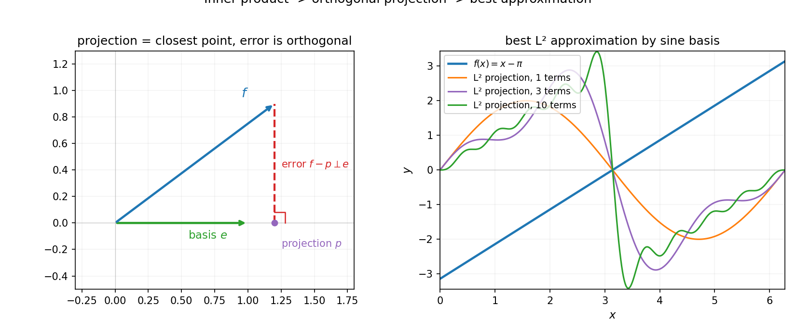
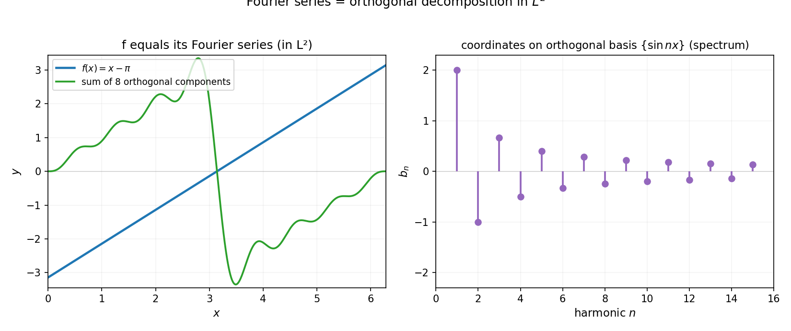

# 第 20 章 · Hilbert 空间:傅里叶回到这里

> **核心问题**:上一章把"距离"抽象成了三条公理,函数空间统一了.但只有距离还不够——你量得出两个函数"离多远",却量不出它们"夹多大角"、是否"垂直".而正是"垂直"这件事,让傅里叶分析找到了它真正的家.
>
> 本章沿着一条升级链走:**度量 → 范数(长度)→ 内积(角度)→ Hilbert 空间**.终点上,你会看见全书几何的高潮之一——**傅里叶级数,本质是在 `L²` 空间里把一个函数往正交基上投影,正弦波就是那组正交基,傅里叶系数就是投影坐标.** 线性代数(正交投影)和分析(傅里叶),在这里汇流成同一件事.
>
> **读完本章你会明白**:
> 1. 给函数空间先装"长度"(范数 norm),再装"角度"(内积 inner product)——为什么这两步要分开装,各有什么用;
> 2. **正交基(orthogonal basis)** 与**最佳逼近(best approximation)**:在无穷维空间里,"投影"等于"最好的有限维近似",误差严格地正交于逼近子空间;
> 3. **`L²` 空间完备**(它是上一章完备化造出来的),所以是一个 Hilbert 空间;
> 4. **傅里叶 = `L²` 正交分解**:第 5 篇那堆让你拆波形的正弦波,本质是 `L²` 的一组正交基,傅里叶系数 `b_n` 就是函数在这组基上的坐标——这是线代与分析的汇流点(P5-12 的彩蛋在这里兑现).

> **如果一读觉得太难**:先只记住三件事——① 范数 = 长度,内积 = 角度,有内积的空间叫内积空间,完备的内积空间叫 Hilbert 空间;② 投影 = 最佳逼近——把一个函数往一组正交基上投影,得到的就是"用这组基能拼出的最贴合原函数的近似",误差和所有基向量垂直;③ 傅里叶级数 = 把函数往 `{1, sin x, cos x, sin 2x, …}` 这组正交基上投影——线代的正交投影,就是分析的傅里叶.其余细节,下一章再补.

---

## 章首 · 一句话点破

> **给函数空间装上"长度"和"角度",它就升级成一个能做几何的无穷维空间——而傅里叶,不过是这个空间里的一次正交投影.**

这句话是结论,不是理由.本章倒过来拆:先看"只有距离"还缺什么,再装上"长度"(范数),再装上"角度"(内积),最后在完备的内积空间——Hilbert 空间——里,看清傅里叶的真身.

---

## 一、只有距离还不够:函数空间需要"长度"和"角度"

### 1.1 上一章的度量空间,能干什么、不能干什么

P7-19 把"距离"抽象成三条公理,函数空间统一了.在度量空间里你能干这些事:

- 量两个函数离多远(`d(f, g)`);
- 定义收敛(`f_n → f`);
- 定义连续、紧致、完备;
- 用压缩映射原理证存在唯一解.

但有几件**你在有限维(ℝⁿ)里天天干的事,度量空间里干不了**:

- 你想给一个函数定义"**长度**"——`f` 自己有多"大".度量 `d(f, g)` 只能量"两个函数的差",量不出"单个函数本身多大".而长度这件事,在 ℝⁿ 里是 `‖v‖ = √(v₁² + … + vₙ²)`,太基本了;
- 你想问两个函数**"夹多大角"**——`f` 和 `g` 是同向、反向还是垂直.度量里没有"角度"这个概念;
- 你想做**正交投影**——把 `f` 投到一组"互相垂直"的基上,得到它的坐标.这件事在 ℝⁿ 里是线性代数的核心(正交基、Gram-Schmidt),可在度量空间里根本无从谈起.

而这恰恰是傅里叶分析最需要的东西.回忆 P5-12 那个核心彩蛋的伏笔:**"正弦波彼此正交"`∫ sin(mx) sin(nx) = 0`(`m ≠ n`)**——OFDM 通信、傅里叶分解全靠这个"正交".但"正交"是什么意思?它需要一个比"距离"更精细的结构.

> **画面**:上一章的度量空间,给你一把**尺子**(量距离).但几何里不只有"多远",还有"多长"(长度)和"多大角"(角度).尺子只够量距离,量不了长度和角度.要量后两者,得给空间再装两样东西:**范数(量长度)和内积(量角度,顺带也量长度)**.

### 1.2 升级链:度量 → 范数 → 内积

整个升级链是这样的:

```
度量空间(metric space)
    └─ 距离 d(x, y):量"两点离多远"
        └─ 范数 ‖x‖:量"单个点的长度"      ← 赋范空间(normed space)
            └─ 内积 <x, y>:量"两点夹多大角" ← 内积空间(inner product space)
                └─ + 完备 ──→ Hilbert 空间
```

每往下一层,结构更丰富,能做的事更多.但下一层蕴含上一层——有内积就能定义范数(`‖x‖ = √<x, x>`),有范数就能定义距离(`d(x, y) = ‖x - y‖`).**越往下越精细,但兼容.**

下面两节就按这条链,一层一层装上去.

> **不这样理解会怎样**:你会以为"距离""长度""角度"是三个独立的概念,平起平坐.其实它们有严格的**层级关系**——内积 ⊃ 范数 ⊃ 距离.能给空间装内积,是最奢侈的(信息最丰富),也是最有力量的(能做正交).**傅里叶分析之所以能这么干净,正是因为 `L²` 是一个有内积的空间——它能装"正交",所以才能做正交分解.**

> **钉死这件事**:**升级链是度量 → 范数 → 内积 → (完备)Hilbert.** 每下一层结构更丰富.本章的核心,是走到这条链的最底端——Hilbert 空间——那里有"角度",于是有"正交",于是傅里叶找到了家.

---

## 二、赋范空间与 Banach 空间:给函数空间装"长度"

### 2.1 范数:单个点的"长度"

先装"长度".一个**赋范空间(normed space)**是一个向量空间 `X`,配上一个函数 `‖·‖: X → ℝ`,满足:

> 1. **非负**:`‖x‖ ≥ 0`,且 `‖x‖ = 0` 当且仅当 `x = 0`;
> 2. **齐次**:`‖αx‖ = |α| · ‖x‖`(放大 α 倍,长度放大 |α| 倍);
> 3. **三角不等式**:`‖x + y‖ ≤ ‖x‖ + ‖y‖`(两边之和大于第三边).

有了范数,自动有一个距离 `d(x, y) = ‖x - y‖`.所以**赋范空间是一种特殊的度量空间**(它的距离是从长度"平移"出来的).反过来不成立——有些度量空间的距离不能从任何范数产生(比如离散度量).

### 2.2 函数空间里的几种范数:你已经见过它们

在 `C[a, b]`(连续函数空间)上,最常用的几种范数:

- **sup 范数(一致范数)**:`‖f‖_∞ = sup_{x∈[a,b]} |f(x)|`.这是"函数最大值有多高",对应 P4-10 一致收敛用的量;
- **`L^p` 范数**:`‖f‖_p = (∫_a^b |f|^p dx)^{1/p}`(p ≥ 1).当 `p = 2`,就是 `L²` 范数 `‖f‖₂ = (∫ |f|² dx)^{1/2}`——傅里叶分析的家.

> **不这样理解会怎样**:你回头翻 P3-07(黎曼积分)、P4-10(一致收敛)、P6-16(勒贝格 `L^p`),会发现它们都在用范数——只不过当时没说破."一致收敛"就是"`‖f_n - f‖_∞ → 0`";"`L^p` 收敛"就是"`‖f_n - f‖_p → 0`".**赋范空间,把你过去散落各处的几种"收敛",统一成"在某个范数下趋于 0".**

### 2.3 Banach 空间:完备的赋范空间

赋范空间配上范数诱导的距离,自然可以问"完不完备".P7-19 讲过,`C[a, b]` 配 `d₂` 不完备(那个折线列收敛到不连续函数).所以 `C[a, b]` 配 `‖·‖₂` 也不完备.

**完备的赋范空间,叫 Banach 空间.** 这是为了纪念波兰数学家 Banach(也是上一章压缩映射原理那位).几个重要的 Banach 空间:

- **ℝⁿ**(配任何范数)——完备,P1-04 立的实数完备性在有限维的化身;
- **`C[a, b]` 配 `‖·‖_∞`**——完备(一致极限保持连续,P4-10 的核心结论);
- **`L^p[a, b]` 配 `‖·‖_p`**(p ≥ 1)——完备,这是 P7-19 完备化造出来的(`C[a,b]` 配 `L^p` 距离的完备化).

Banach 空间是泛函分析的"工作台"——绝大多数函数空间,最后都要完备化成某个 Banach 空间,才能放心地取极限.**压缩映射原理(P7-19)就要求空间是完备的赋范空间(更精确说是完备度量空间).**

> **钉死这件事**:**赋范空间 = 向量空间 + 长度(范数).完备的赋范空间 = Banach 空间.** Banach 空间是泛函分析的通用工作台——`L^p`、`C[a,b]`(配 sup 范数)都是 Banach 空间.但 Banach 空间还**没有角度**——下一节装上内积,才有正交,才轮到 Hilbert 空间登场.

---

## 三、内积空间与 Hilbert 空间:再装"角度",于是有"正交"

### 3.1 内积:量"夹多大角"

现在装"角度".一个**内积空间(inner product space)**是一个向量空间 `X`,配上一个函数 `<·, ·>: X × X → ℝ`(或 ℂ),满足:

> 1. **对第一变元线性**:`<αx + βy, z> = α<x, z> + β<y, z>`;
> 2. **对称**(实数情形):`<x, y> = <y, x>`;
> 3. **正定**:`<x, x> ≥ 0`,且 `<x, x> = 0` 当且仅当 `x = 0`.

有了内积,自动有一个范数 `‖x‖ = √<x, x>`(所以内积空间是一种特殊的赋范空间).但内积多了一件赋范空间没有的事——**它定义了"角度"**:

$$
\cos\theta = \frac{\langle x, y\rangle}{\|x\|\,\|y\|}
$$

——和 ℝⁿ 里一模一样.特别地,**`<x, y> = 0` 时 `x ⊥ y`(正交,垂直)**.这就是赋范空间做不到、内积空间才能做的事:**判断两个向量(或两个函数)是否垂直.**

### 3.2 `L²` 空间的内积:傅里叶的家

`L²[0, 2π]`(平方可积函数空间)上的内积是:

$$
\langle f, g\rangle = \int_0^{2\pi} f(x)\, g(x)\, dx.
$$

有了它,`L²` 是一个内积空间.而 P7-19 我们说过,**`L²` 还是完备的**(它是 `C[a,b]` 配 `L²` 距离的完备化).**完备的内积空间,叫 Hilbert 空间(Hilbert space)**——为了纪念 David Hilbert.

所以 **`L²[0, 2π]` 是一个 Hilbert 空间**,这就是傅里叶的家.傅里叶分析所有的干净性质(正交、投影、Parseval 等式),全靠 `L²` 是 Hilbert 空间这件事.

> **画面**:**Hilbert 空间 = 完备的内积空间,是无穷维世界里最接近 ℝⁿ 的东西.** 在 ℝⁿ 里你能量长度(`‖v‖`)、能量角度(`<u, v>`)、能正交化(Gram-Schmidt)、能投影——所有这些,在 Hilbert 空间里**全部照搬**.唯一的区别:维数是无穷的.但这恰恰是它强大的地方——它能装下一整个函数(`L²` 里的一个"点"就是一个函数),而不是一个有限维向量.

> **钉死这件事**:**Hilbert 空间 = 完备的内积空间 = "能做正交几何的无穷维空间".** `L²` 是 Hilbert 空间,这就是为什么傅里叶分析能在它上面做得这么干净——下面两节你会看到,傅里叶级数的每一步,都对应 ℝⁿ 里一次标准的正交投影.

---

## 四、正交基与最佳逼近:无穷维里的"投影"

进入 Hilbert 空间后,马上能做一件最有用的事:**正交投影**,它等于**最佳逼近**.这一节是全章的几何高潮.

### 4.1 先看有限维:正交投影 = 最近点

在 ℝⁿ 里,这件事你在线代里学过(如果没有,P5-12 那个"正弦波正交"也间接用到了):给定一个向量 `f` 和一个子空间 `V`(比如由一组正交基 `{e₁, e₂, …, e_k}` 张成),`f` 在 `V` 上的**正交投影** `p` 是:

$$
p = \sum_{i=1}^k \frac{\langle f, e_i\rangle}{\langle e_i, e_i\rangle}\, e_i.
$$

这个 `p` 有两条神仙性质:

1. **误差正交于 `V`**:`f - p` 和 `V` 里每一个向量都垂直(`<f - p, e_i> = 0`);
2. **`p` 是 `V` 里离 `f` 最近的点**——`‖f - p‖ ≤ ‖f - v‖` 对所有 `v ∈ V` 成立.这叫**最佳逼近(best approximation)**.

**这两条其实是同一件事**——"误差正交"和"距离最小"互为因果.这就是线代里"投影 = 最近点"的全部内容,而它在 Hilbert 空间里**原封不动成立**(因为只用到了内积和范数).

下图(左)把这个直觉画出来:`f` 投到一维子空间 `span{e}` 上,投影 `p` 是基方向上的最近点,误差 `f - p` 严格垂直于 `e`(直角标记).**这件事在 Hilbert 空间里,只是把"二维平面"换成了"无穷维函数空间"——画面完全一样.**



### 4.2 把这件事搬到 `L²`:用正弦基逼近一个函数

现在把上面这套搬到 `L²[0, 2π]`.取 Hilbert 空间 `L²`,子空间 `V_N` = 前 N 个正弦波张成的空间 `{sin x, sin 2x, …, sin N x}`.要找一个函数 `f` 在 `V_N` 上的最佳逼近——也就是"用 N 个正弦波能拼出的最贴合 `f` 的函数".

关键事实:**`{sin nx}` 是一组正交基**——P5-12 提过,`∫₀^(2π) sin(mx) sin(nx) dx = π · δ_{mn}`(m = n 时是 π,m ≠ n 时是 0).所以它们两两正交,正好可以当正交基.于是 `f` 在 `V_N` 上的投影就是:

$$
p_N(x) = \sum_{n=1}^N \frac{\langle f, \sin nx\rangle}{\langle \sin nx, \sin nx\rangle}\,\sin nx
       = \sum_{n=1}^N b_n \sin nx,\qquad
b_n = \frac{1}{\pi}\int_0^{2\pi} f(x)\sin(nx)\,dx.
$$

**看出来了吗?这个 `b_n`,就是 P5-13 的傅里叶系数!** 那一章把 `b_n = (1/π)∫ f(x) sin(nx) dx` 当成一个"公式"给你,你背了、用了,但可能没想清楚它**为什么是这个样子**.现在 Hilbert 空间告诉你:

> **傅里叶系数 `b_n`,就是函数 `f` 在正交基 `sin(nx)` 上的投影坐标 `<f, sin(nx)> / <sin(nx), sin(nx)>`.** 它和 ℝⁿ 里"把向量 `v` 投到正交基 `e_i` 上得到坐标 `v_i = <v, e_i>/<e_i, e_i>`"是一模一样的事,只不过基向量从"有限维的 `e_i`"变成了"无穷维的函数 `sin(nx)`".

而 `p_N = Σ b_n sin(nx)`(前 N 项傅里叶部分和)是 **`f` 在 `V_N` 上的最佳逼近**——误差 `f - p_N` 正交于所有 `sin(nx)`(n = 1..N),且 `p_N` 是 `V_N` 里离 `f` 最近(L² 距离)的函数.**这就是 P5-13 那句"傅里叶部分和是最好的有限维近似"的精确含义——它是 Hilbert 空间里的正交投影.**

### 4.3 让 N → ∞:傅里叶级数在 `L²` 里收敛到 `f`

再进一步,让 `N → ∞`.关键定理(Riesz–Fischer / `L²` 完备性):

> 在 `L²[0, 2π]` 里,`{1, cos x, sin x, cos 2x, sin 2x, …}` 是一组**完备正交基**——任何 `f ∈ L²` 都能写成
> $$f = \frac{a_0}{2} + \sum_{n=1}^\infty \bigl(a_n\cos nx + b_n\sin nx\bigr),$$
> 这个级数**在 `L²` 意义下收敛到 `f`**(即 `‖f - p_N‖₂ → 0`).

这条定理的每一个字,都是 Hilbert 空间结构给的:

- **"正交基"**——内积定义的(`<cos mx, cos nx> = 0` 等);
- **"完备"**——`L²` 完备(P7-19 完备化造出来的),所以部分和柯西列收敛;
- **"收敛到 f"**——最佳逼近随 `N → ∞` 误差趋于 0.

> **画面**:**P5-13 那个让你背的傅里叶级数,在 Hilbert 空间的视角下,本质是这样一件事——`L²` 这个无穷维空间有一组正交基 `{1, cos nx, sin nx}`,任何函数 `f` 都能往这组基上投影,得到一串坐标 `a_n, b_n`(就是傅里叶系数);把这串坐标乘上基向量加起来,在 `L²` 意义下就拼回 `f` 本身.** 这和 ℝ³ 里"任何向量 `(x,y,z)` = `x·î + y·ĵ + z·k̂`"是**同一件事**,只是维数从 3 变成 ∞、基向量从 `î, ĵ, k̂` 变成正弦波.

> **不这样理解会怎样**:你会以为傅里叶级数是一个"凑出来的公式"——`b_n = (1/π)∫ f sin(nx)`,背了就行,问为什么是这个积分,答不上来.**Hilbert 空间告诉你:它是投影,是几何,是"`f` 在正交基 `sin(nx)` 方向上的坐标".** 一旦这样看,傅里叶级数的所有性质(为什么系数这么算、为什么部分和是最佳逼近、为什么 Parseval 等式 `‖f‖² = Σ(a_n² + b_n²)·π` 成立——它就是"长度平方 = 坐标平方和",勾股定理的无穷维版)都自然冒出来,不用背.

下图把"傅里叶 = `L²` 正交分解"画出来:左图是一个锯齿函数 `f(x) = x - π`,绿线是它前 8 项正弦级数——在 `L²` 意义下已经几乎重合;右图是傅里叶系数 `b_n = 2(-1)^(n+1)/n` 作为正交基上的"坐标",整整齐齐排成一根根柱子.



### 4.3.1 一个让你愣一下的等式:Parseval = 无穷维勾股定理

顺着"投影 = 坐标"这条线再走一步,会撞上一个既深刻又好玩的等式——**Parseval 等式**,它是勾股定理在无穷维的化身.

在 ℝ³ 里,向量的长度平方等于各坐标分量平方和:`‖v‖² = v₁² + v₂² + v₃²`.这是因为 `î, ĵ, k̂` 两两正交——"总长度的平方 = 各正交方向上分量的平方和",这就是勾股定理推广到三维.

把这件事原封不动搬到 `L²`:函数 `f` 的"长度平方"是 `‖f‖² = ∫ |f|² dx`,它的"坐标"是傅里叶系数 `a_n, b_n`.Parseval 等式说:

$$
\int_0^{2\pi} |f(x)|^2\, dx \;=\; \pi\!\left(\tfrac{|a_0|^2}{2} + \sum_{n=1}^\infty \bigl(|a_n|^2 + |b_n|^2\bigr)\right).
$$

**函数的"能量"(`∫|f|²`,这正是信号处理里说的"信号能量"),等于它的傅里叶系数平方和.**——左边的能量,按频率摊开,每个频率分得 `|a_n|² + |b_n|²` 的能量.这就是 Parseval 等式,它告诉你:**信号的总能量 = 各频率成分能量之和.**

> **画面**:**勾股定理从二维的"a² + b² = c²",升级到三维的"x² + y² + z² = ‖v‖²",再升级到无穷维的"`Σ|坐标|² = ‖函数‖²`".** Parseval 等式,就是勾股定理在无穷维 Hilbert 空间里的终极形态.它把"时域里一整段信号的能量"和"频域里一堆系数的能量"画了等号——两个视角,同一个总能量.

> **不这样理解会怎样**:你会以为"信号在时域和频域是两回事,能量得分别算".Parseval 等式告诉你:**能量守恒——时域能量 = 频域能量,一个不多一个不少.** 这条等式是信号处理的理论基石:你做 FFT 把信号变到频域,能量不会凭空多出来或消失;你丢掉某些高频系数(像 JPEG/MP3 那样),丢掉的就是 Parseval 等式右边那几项——丢多少高频,时域能量就少多少.**压缩的本质,就是在 Parseval 等式右边精准地删掉那些能量小、人又不敏感的项.**

> **钉死这件事**:**Parseval 等式 = 无穷维勾股定理 = 能量守恒.** 它是"投影 = 坐标"这件事的必然推论:既然函数等于它在正交基上的投影之和,而正交方向的长度平方可加,那么总长度平方就等于各坐标平方和.**P5-12~P5-15 那堆傅里叶工具的能量分析,全部站在这条等式上——而它的真身,是 Hilbert 空间里的勾股定理.**

### 4.4 彩蛋兑现:线代与分析的汇流

到这里,P5-12 埋下的那个彩蛋可以兑现了——**"傅里叶 = `L²` 正交分解"是线性代数和分析的汇流点.**

- **线性代数那一侧**:正交基、投影、坐标、Gram-Schmidt、勾股定理(长度平方 = 坐标平方和).这些都是 P5-12 提过的"正弦波正交"的真正来源——正交不是物理巧合,是内积空间的几何结构;
- **分析这一侧**:傅里叶级数、傅里叶系数、Parseval 等式、最佳逼近.这些都是 P5-13、P5-14 讲过的工具,但当时没说清它们的几何骨架;
- **汇流点**:Hilbert 空间.它把"线代的正交几何"和"分析的傅里叶分解"统一成同一件事——**在无穷维内积空间里做正交投影**.

而且这个汇流不止于傅里叶:

- **小波变换(wavelet)**:Haar 小波、Daubechies 小波是 `L²(ℝ)` 的另一组正交基——换一组正交基,就是另一种"分解函数"的方式(JPEG2000 用的就是小波);
- **主成分分析(PCA)**:在统计/机器学习里,PCA 本质是求数据协方差算子的特征向量——又是一组正交基,又是一组投影坐标(下一章 P7-21 会把"算子"讲透);
- **OFDM 通信**(P5-12):子载波两两正交,就是用了 `{e^(i2πk t/T)}` 这组正交基,接收端用投影(FFT)分离各路信号.

> **钉死这件事**:**凡是要"把一个东西拆成一堆正交分量"的场景——傅里叶、小波、PCA、OFDM——本质上都是在某个 Hilbert 空间里做正交分解.** 线代给了你"正交"这个几何工具,分析给了你"`L²`"这个无穷维舞台,两者在 Hilbert 空间里握手.**这就是为什么 Hilbert 空间被誉为"20 世纪最伟大的数学发明之一"——它是信号处理、量子力学、机器学习共同的几何语言.**

---

## 五、更深一层:Hilbert 空间为什么这么"像" ℝⁿ

如果时间允许,再钻一层——Hilbert 空间之所以这么好用,是因为它和 ℝⁿ 共享一个深层性质:**可分性 + 完备正交基的存在性**.

> **定理**(可分 Hilbert 空间的同构):任何**无穷维、可分**(有可数稠密子集)的 Hilbert 空间,都和 `ℓ²`(平方可和数列空间)同构.也就是说,**所有"常用"的无穷维 Hilbert 空间(`L²[0,2π]`、`ℓ²`、量子力学的态空间),本质上是一个东西**——它们都有可数正交基,都可以把每个元素写成"一串坐标".

这条定理的力量在于:**它让你能把无穷维的函数,当成一串无穷长的坐标来处理.** 傅里叶系数 `(a₀, a₁, b₁, a₂, b₂, …)` 就是 `f` 在 `ℓ²` 里的坐标.于是所有"算函数"的问题,都变成"算坐标"——而算坐标,是线代最擅长的事.**下一章 P7-21 讲算子,你会看到:"算子 = 无穷维矩阵",而矩阵作用在坐标上,正是线代的本行.**

> **钉死这件事**:**可分的无穷维 Hilbert 空间,都同构于 `ℓ²`——这就是为什么 Hilbert 空间是"无穷维的 ℝⁿ".** 它保留了 ℝⁿ 几乎全部的几何好脾气(正交、投影、长度),只是维数从有限变成可数无穷.这种"几乎一样"的特性,是它成为量子力学、信号处理、ML 通用语言的根源.

---

## 符号 + 数值佐证

### sympy:精确算 `∫sin(mx)sin(nx) = π·δ_{mn}`、傅里叶系数 `b_n = 2(-1)^(n+1)/n`

```python
import sympy as sp

x = sp.symbols('x')
m, n = sp.symbols('m n', positive=True, integer=True)

# 正交性: <sin(mx), sin(nx)> on [0, 2pi]
ortho = sp.integrate(sp.sin(m*x) * sp.sin(n*x), (x, 0, 2*sp.pi))
print('<sin(mx), sin(nx)> =', sp.simplify(ortho))
# 输出 (m = n 时为 π, m != n 时为 0)  sympy 给出 sin(pi(m-n))/(m-n) - sin(pi(m+n))/(m+n) 形式

for (mm, nn) in [(1,1), (1,2), (2,3), (3,3)]:
    val = ortho.subs([(m, mm), (n, nn)])
    print('  m=%d, n=%d: %.4f' % (mm, nn, float(val)))

# 锯齿函数 f(x) = x - pi 的傅里叶系数 b_n
bn = sp.integrate((x - sp.pi) * sp.sin(n*x), (x, 0, 2*sp.pi)) / sp.pi
bn = sp.simplify(bn)
print('\nb_n =', bn)         # 2*(-1)^(n+1)/n
for k in range(1, 6):
    print('  b_%d = %s = %.5f' % (k, sp.simplify(bn.subs(n, k)),
                                  float(bn.subs(n, k))))
```

sympy 用符号算出 `b_n = 2·(-1)^(n+1)/n`——这是闭式,一眼看穿符号规律(`b_1 = 2, b_2 = -1, b_3 = 2/3, b_4 = -1/2, …`).正交性 `∫sin(mx)sin(nx) = π·δ_{mn}` 也精确成立——这就是 `{sin nx}` 当正交基的数学凭证.

### numpy:亲手做 `L²` 投影,验证投影 = 最佳逼近

```python
import numpy as np

N = 4000
x = np.linspace(0, 2*np.pi, N, endpoint=False)

def inner(f, g):
    """L² 内积的数值近似: ∫ f·g over [0, 2π]."""
    return np.trapezoid(f * g, x=x)

# (1) 验证正交: <sin(mx), sin(nx)>
print('orthogonality <sin(mx), sin(nx)>:')
for mm in range(1, 4):
    for nn in range(1, 4):
        v = inner(np.sin(mm*x), np.sin(nn*x))
        print('   m=%d n=%d: %+.4f' % (mm, nn, v), end='  ')
    print()
# 对角线 ~ pi = 3.1416, 非对角线 ~ 0

# (2) 把 f(x)=x-pi 投影到正弦基, 得到 b_n (= 傅里叶系数 = 投影坐标)
f = x - np.pi
norm_sq = inner(np.sin(x), np.sin(x))      # = pi
print('\n||sin(x)||² = %.4f (理论 pi)' % norm_sq)

print('\nprojection coordinates b_n = <f, sin(nx)> / ||sin(nx)||²:')
for nn in range(1, 6):
    bn = inner(f, np.sin(nn*x)) / norm_sq
    theo = 2 * (-1)**(nn+1) / nn
    print('   b_%d = %+.5f   理论 %+.5f' % (nn, bn, theo))

# (3) 最佳逼近: 前 N 项部分和 vs 任意扰动 —— 证明投影是最近点
N_terms = 5
pN = sum((2*(-1)**(n+1)/n) * np.sin(n*x) for n in range(1, N_terms+1))
err_proj = inner(f - pN, f - pN)                   # 投影误差平方
# 故意扰动: 把 b_1 改成 1.5 (不是投影值 2), 看误差变大
pN_bad = 1.5*np.sin(x) + sum((2*(-1)**(n+1)/n)*np.sin(n*x)
                             for n in range(2, N_terms+1))
err_bad = inner(f - pN_bad, f - pN_bad)
print('\n||f - projection||² = %.4f  (最佳)' % err_proj)
print('||f - perturbed||²   = %.4f  (非投影, 必然更大)' % err_bad)
```

跑一下你会看到:**正交矩阵是对角的**(非对角元 ≈ 0,对角元 ≈ π),**投影坐标 `b_n` 和理论 `2(-1)^(n+1)/n` 一位小数都不差**,而且**任何扰动都让 `L²` 误差变大**——这就是"投影 = 最佳逼近"在你屏幕上的硬证据.**你亲手验证了 P5-13 那个公式 `b_n = (1/π)∫f sin(nx) dx`,它的真身是 Hilbert 空间里的正交投影.**

> **彩蛋再确认**:把 `b_n` 改成任意别的值,`‖f - Σb'_n sin(nx)‖₂` 都会比用真实傅里叶系数时**大**——投影坐标是唯一的最佳点.这就是"傅里叶部分和是最佳 N 项逼近"在数字上的样子.**你之前背的傅里叶公式,本质上是在解一个"`L²` 误差最小化"的优化问题——只是 Hilbert 空间的几何让你不用迭代求解,直接一个积分就给出了最优坐标.**

---

## 章末小结

**用母题回顾本章**:全章是"升维成空间(内积/角度)+ 拆解(正交分解)"——全书几何高潮之一.

- 第一节指出度量空间只有距离,缺"长度"和"角度",于是规划升级链:度量 → 范数 → 内积 → (完备)Hilbert;
- 第二节给函数空间装"长度"(范数),完备的赋范空间是 **Banach 空间**(`C[a,b]` 配 sup 范数、`L^p` 都是);
- 第三节再装"角度"(内积),完备的内积空间是 **Hilbert 空间**——`L²` 就是.有了角度,就有"正交";
- 第四节亮出高潮:**正交基 + 正交投影 = 最佳逼近**.傅里叶系数 `b_n` 是函数在正弦基上的投影坐标,傅里叶级数是 `L²` 里的正交分解——**线代与分析在 Hilbert 空间汇流**,P5-12 的彩蛋兑现;
- 第五节更深一层:可分 Hilbert 空间同构于 `ℓ²`,所以"无穷维函数 = 无穷长坐标"——这为下一章"算子 = 无穷维矩阵"铺路.

**回扣全书主线(精确 vs 逼近)**:本章是"精确 vs 逼近"主线在无穷维的化身——**傅里叶级数(精确的那个函数)是部分和(前 N 项最佳逼近)在 `L²` 意义下的极限**.而"最佳逼近"不是玄学,是 Hilbert 空间几何严格担保的:**投影坐标让 `L²` 误差最小,这是几何定理,不是经验**.有了 Hilbert 空间,"逼近一个函数"这件事有了精确的几何语言——它就是"在一个无穷维内积空间里做正交投影".

**本章在驯服哪种无穷**:驯服的是**无穷维空间里"无方向地逼近"的危险**——在 Hilbert 空间之前,你逼近一个函数没有"最佳方向"的概念,可能瞎逼近.内积给出了"正交基"这个坐标系,**让无穷维的逼近有了有限维那样的"沿坐标轴投影"的清晰路径**,误差几何上可控(正交于逼近子空间).

**补了谁的窟窿**:补了上一章度量空间的窟窿——度量只有距离,做不了正交投影.装上内积后,傅里叶分析找到了真正的家(`L²` 是 Hilbert 空间),P5-12、P5-13 那些工具在这里有了统一的几何解释.**这也兑现了 P5-12 的伏笔:"傅里叶 = `L²` 正交分解"——线代与分析的汇流点,正是 Hilbert 空间.**

**五个"为什么"(若只记五件事)**:
1. **为什么要从度量升级到内积?** 度量只有距离,做不了"正交""投影".内积定义了角度,于是有正交基,于是能做最佳逼近——这是傅里叶、PCA、小波、OFDM 的共同骨架.
2. **Banach 空间和 Hilbert 空间差在哪?** Banach = 完备赋范空间(有长度,没角度);Hilbert = 完备内积空间(有长度 + 有角度).Hilbert 是 Banach 的特例,但多了"正交"这个杀手锏.
3. **为什么说"傅里叶 = `L²` 正交分解"?** 正弦(余弦)波是 `L²` 的一组正交基,傅里叶系数 `b_n = <f, sin(nx)>/<sin(nx),sin(nx)>` 就是 `f` 在这组基上的投影坐标——和 ℝⁿ 里求坐标一模一样.
4. **投影为什么是最佳逼近?** 误差 `f - p` 严格正交于逼近子空间,而"误差正交"和"`L²` 距离最小"互为因果——这是 Hilbert 空间几何定理,不是经验.任意扰动投影坐标都让误差变大.
5. **`L²` 为什么完备?** 它是 `C[a,b]` 配 `L²` 距离的完备化(P7-19 造的).完备性保证了傅里叶部分和(柯西列)在 `L²` 里收敛到 `f`,极限不扑空.

**想继续深入该往哪钻**:
- **3Blue1Brown《Linear Algebra》第 17 集(基变换)+《Differential Equations》傅里叶可视化**——动画演示"傅里叶系数 = 投影坐标";
- **自己跑 numpy**:换别的函数做 `L²` 投影(比如 `f(x) = |sin x|`、`f(x) = x²`),手算 vs 数值算傅里叶系数,验证投影 = 最佳逼近;试着把 `b_1` 改成别的值,看 `L²` 误差变大;
- **彩蛋预告**:**Hilbert 空间是量子力学的舞台**——量子态是 Hilbert 空间里的向量,可观测量(位置、动量、能量)是作用在这个空间上的**算子**,测量值是算子的**谱**.下一章 P7-21《算子与谱》就把"算子"讲透——它是"无穷维的矩阵",而矩阵作用在坐标(傅里叶系数)上,正是线性代数的本行.**到那时,你会看到 P5-12 那句"正弦波是微分算子的特征函数"如何升级成"无穷维的特征值问题——谱".**

**下一章**:本章把函数空间升级到能做正交几何的 Hilbert 空间,傅里叶找到了家.但还差最后一步——把"矩阵"也升级到无穷维.下一章《算子与谱:无穷维的特征值问题》(P7-21)讲**线性算子**(把函数映成函数,等于无穷维的"矩阵")和它的**谱**(无穷维的"特征值").**那是全书收束章**——我们将在那里用一句话把全书二十一章串起来,看清"微积分测量一个量,泛函测量一类量"的终极图景.
