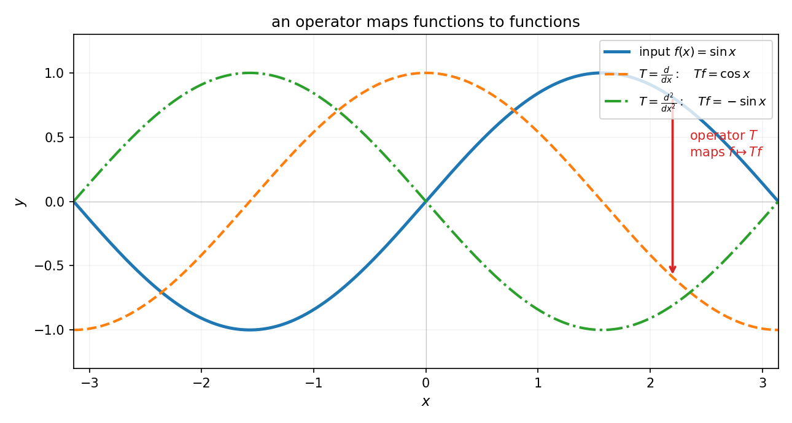
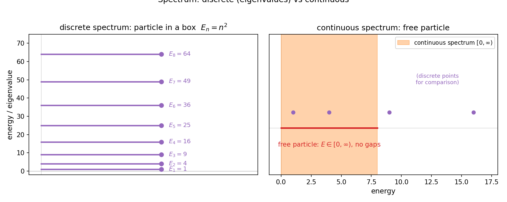

# 第 21 章 · 算子与谱:无穷维的特征值问题

> **核心问题**:函数空间建好了(P7-19 度量、P7-20 Hilbert),傅里叶也找到了家.但还有最后一类对象没升级——**矩阵**.在有限维里,矩阵把向量映成向量;在无穷维的函数空间里,什么东西把函数映成函数?它的"特征值"又长什么样?
>
> 本章是**全书收束章**.我们在这里完成最后一次升级——**把矩阵升级成"算子"**,把"特征值"升级成"谱".终点上,用一句话把二十一章串起来:**微积分测量一个量(导数/积分),泛函测量一类量(算子作用于函数空间)**——全书从"驯服无穷"走到"测量一类量",在这里收口.
>
> **读完本章你会明白**:
> 1. **线性算子(linear operator)** 是什么——它把函数映成函数,是无穷维的"矩阵";求导 `d/dx`、积分 `∫`、傅里叶变换本身,都是算子;
> 2. **有界算子(bounded operator)** ——把"连续"这个概念推广到算子上:有界 = 把有界集映成有界集 = 在无穷维空间里"连续";
> 3. **谱(spectrum)** 是无穷维的"特征值"——但比有限维复杂,可能有**连续谱**(一整段,而不只是分立的点),这正是量子力学能级、神经网络权重的数学骨架;
> 4. **量子力学为什么建立在谱上**:可观测量 = 自伴算子(self-adjoint operator),测量值 = 算子的谱;**神经网络一层的算子视角**:一层网络 = 一个(非线性)算子作用于特征空间.

> **如果一读觉得太难**:先只记住三件事——① 算子 = 无穷维的"矩阵",把函数映成函数(`d/dx`、`∫`、傅里叶变换都是算子);② 谱 = 无穷维的"特征值",但比有限维复杂,可能有连续谱(一整段);③ 量子力学的可观测量(位置/动量/能量)是自伴算子,你能测到的值就是它的谱;神经网络的一层也是一个算子.其余细节,本书已到终点,这里给你一个能带走的全景.

---

## 章首 · 一句话点破

> **把矩阵升级成算子,把特征值升级成谱——微积分测量一个量,泛函测量一类量.全书二十一章,在这里收口.**

这句话是结论,不是理由.本章倒过来拆:先看"算子"是什么(它就是无穷维的矩阵),再看它的"谱"比有限维特征值复杂在哪(连续谱登场),然后看清量子力学、神经网络为什么都建立在这套语言上,最后用一句话把整本书收束.

---

## 一、算子:无穷维的"矩阵"

### 1.1 有限维回顾:矩阵是什么

线性代数里,一个 `m × n` 矩阵 `A` 干的事是:把 ℝⁿ 里的向量 `v`,映成 ℝᵐ 里的向量 `Av`.这是一个**线性映射**——保持加法和数乘:`A(u+v) = Au + Av`、`A(αv) = α·Av`.

矩阵的核心问题,是**特征值问题**:`Av = λv`——找一个向量 `v`,它在 `A` 的作用下只是被拉伸(乘上常数 `λ`),方向不变.这个 `λ` 叫特征值,`v` 叫特征向量.特征值告诉你"这个矩阵在各个方向上拉伸/压缩得多狠",是矩阵的灵魂.

现在把这件事搬到无穷维.在 `L²`(Hilbert 空间,上一章的家)里,"向量"是一个函数.那么"把函数映成函数的线性映射"是什么?

### 1.2 线性算子:把函数映成函数

**线性算子(linear operator)** 是一个映射 `T: X → Y`(X、Y 是函数空间,通常是 Banach 或 Hilbert 空间),保持线性:

$$
T(f + g) = Tf + Tg,\qquad T(\alpha f) = \alpha\, Tf.
$$

你已经见过一大堆算子,只是没这么叫:

- **求导算子** `D = d/dx`:`D(sin x) = cos x`.它把 `sin x` 映成 `cos x`,把函数映成函数;
- **积分算子** `(If)(x) = ∫_a^x f(t) dt`:`I(sin x) = -cos x + 1`.也是函数到函数;
- **二阶导数算子** `D² = d²/dx²`:`D²(sin nx) = -n² sin nx`——这是 P5-12 那句"正弦波是微分算子的特征函数"的精确写法,下一节细讲;
- **傅里叶变换** `F`:`F(f)(ω) = ∫ f(x) e^(-iωx) dx`.把一个时域函数映成一个频域函数,它本身是一个线性算子;
- **乘法算子** `(M_g f)(x) = g(x)·f(x)`(乘一个固定函数 `g`).

> **画面**:**算子是"函数到函数的线性映射",是无穷维世界里矩阵的化身.** 有限维里矩阵 `A` 把向量 `v` 映成 `Av`;无穷维里算子 `T` 把函数 `f` 映成 `Tf`.形式完全一样,只是"向量"升级成了"函数","矩阵的列"升级成了"算子在一组基上的表示".下图把这件事画出来:输入 `sin x`,经过算子 `d/dx` 变成 `cos x`,经过 `d²/dx²` 变成 `-sin x`——**算子像一台机器,吃进一个函数,吐出另一个函数.**



> **不这样理解会怎样**:你会以为"求导""积分""傅里叶变换"是三个互不相关的操作.**算子的视角告诉你:它们是同一类东西——无穷维的线性映射.** 一旦这样看,有限维线性代数的全部工具(特征值、对角化、奇异值、谱分解),都可以试着搬到无穷维来用.这就是泛函分析的核心姿态:**用有限维的几何直觉,驾驭无穷维的函数世界.**

> **钉死这件事**:**线性算子 = 无穷维的矩阵 = 把函数映成函数的线性映射.** `d/dx`、`∫`、傅里叶变换、乘法算子,都是算子.理解算子,就是理解"在函数空间里做线性代数".

### 1.3 有界算子:无穷维里的"连续"

有限维里,所有线性映射(矩阵)都自动连续——这是有限维的"好脾气".无穷维里不是——有些算子不连续,会把"很接近的函数"映成"差很远的结果".所以泛函分析要挑出一类好用的算子:**有界算子(bounded operator)**.

> **有界算子**:`T: X → Y` 是有界的,如果存在常数 `M`,使得对所有 `f` 都有
> $$\|Tf\|_Y \le M\,\|f\|_X.$$
> 最小的这种 `M` 叫 `T` 的**算子范数**,记 `‖T‖`.

关键事实:**有界 ⟺ 连续**(对线性算子而言).所以"有界算子"就是"连续算子"——它不会把相邻的函数撕开.求导算子 `d/dx` 在很多函数空间上是**无界**的(一个微小的振荡函数,导数可以很大)——这就是为什么处理微分方程要特别小心空间的选择;而积分算子、乘法算子、傅里叶变换,通常是**有界**的.

> **不这样理解会怎样**:你会以为"算子随便定义一下就行".但在无穷维,**无界算子会让你失控**——一串收敛的函数,经过无界算子可能映成一串发散的(`f_n → f` 但 `Tf_n ↛ Tf`).有界性就是"把收敛守住"的保证.**泛函分析的大部分定理,都只对有界算子成立**——这是无穷维必须付出的代价.

> **钉死这件事**:**有界算子 = 连续算子(`‖Tf‖ ≤ M‖f‖`),是把"连续"从函数推广到"函数到函数的映射".** 求导常常无界(危险),积分/傅里叶变换通常有界(安全).泛函分析偏爱有界算子,因为它把收敛性守住.

---

## 二、谱:无穷维的"特征值问题"

### 2.1 有限维特征值问题回顾

有限维里,方阵 `A` 的特征值问题 `Av = λv`,等价于 `(A - λI)v = 0` 有非零解,等价于 `det(A - λI) = 0`.解出来是一组分立的数 `λ₁, λ₂, …, λ_n`(最多 n 个,计重数)——这就是 `A` 的**特征值**,它们的集合叫 `A` 的**谱**.

在有限维里,"谱 = 特征值集合",干净利落.但搬到无穷维,事情变复杂了.

### 2.2 无穷维的麻烦:`(T - λI)` 可能既不可逆、也没有特征向量

在无穷维,我们想照样定义"`λ` 是 `T` 的特征值"——如果存在**非零函数** `f` 使 `Tf = λf`.但问题是:无穷维里,`T - λI` 这个算子可能处于一种有限维不存在的"中间状态"——

- **可逆**(双射):`λ` 在谱外;
- **不可逆**:`λ` 在谱里.但不可逆分几种:
  - `T - λI` 不是单射(有非零 `f` 使 `(T-λI)f = 0`)——这是真正的**特征值**,`f` 是特征函数;
  - `T - λI` 是单射,但值域不满(像"差一点"的双射)——这种 `λ` 叫**连续谱点**,它不是特征值,但在谱里;
  - `T - λI` 的逆算子存在但**无界**——**剩余谱**.

**无穷维的"谱",比"特征值集合"大,它包含连续谱.** 这件事有限维里看不到(有限维里单射 ⟺ 满射,没有"中间状态").

> **画面**:**有限维的谱,是数轴上分立的几个点(特征值).无穷维的谱,除了分立的点(特征值),还可能有一整段(连续谱).** 就像量子力学里:被束缚的电子(在原子势阱里)能级是分立的(光谱上几条线);自由的电子能级是连续的(光谱上一片).**这两种情况,数学上对应的就是"点谱"和"连续谱".** 下图把这两种谱画出来对比.



### 2.3 一个经典例子:`-d²/dx²` 的谱

来看一个把"谱"讲透的例子.考虑算子 `T = -d²/dx²`(负号是为了让它"正定"),定义域是 `[0, π]` 上满足 Dirichlet 边界条件 `f(0) = f(π) = 0` 的二次可微函数.解特征值问题:

$$
-Tf = \lambda f \quad\Longleftrightarrow\quad -f''(x) = \lambda f(x),\quad f(0) = f(\pi) = 0.
$$

这是一个常微分方程.通解是 `f(x) = A sin(√λ x) + B cos(√λ x)`.边界条件 `f(0) = 0` 给 `B = 0`;`f(π) = 0` 给 `sin(√λ · π) = 0`,即 `√λ = n`(n = 1, 2, 3, …).所以:

$$
\lambda_n = n^2,\qquad f_n(x) = \sin(nx),\quad n = 1, 2, 3, \ldots
$$

**谱是分立的:`{1, 4, 9, 16, 25, …}`,特征函数就是 `{sin x, sin 2x, sin 3x, …}`.** ——这正是 P5-12 那句话"正弦波是微分算子的特征函数"的精确含义!**`-d²/dx²` 的特征值是 `n²`,特征函数是 `sin(nx)`.**

而且注意:这些特征函数 `{sin(nx)}` **正好是 `L²[0, π]` 的一组正交基**(上一章 P7-20 讲过).这不是巧合——自伴算子的特征函数,天然构成 Hilbert 空间的正交基.这就是"谱定理"——无穷维的"对称矩阵可对角化".

> **钉死这件事**:**`-d²/dx²` 的谱是分立的 `n²`(n=1,2,…),特征函数是 `sin(nx)`——它们构成 `L²` 的正交基.** 这件事把 P5-12(正弦波是特征函数)、P7-20(正弦波是正交基)、P7-21(谱 = 特征值)三章串起来:**为什么傅里叶分析要用正弦波?因为正弦波是某个自伴算子(`-d²/dx²`)的特征函数,而自伴算子的特征函数构成正交基——这是谱定理给的.** 傅里叶、正交基、谱,在这里是同一件事的三个面孔.

### 2.4 自伴算子与谱定理:无穷维的"对称矩阵对角化"

有限维里,实对称矩阵 `A = Aᵀ` 有美妙性质:特征值全实数、特征向量可选成正交的、`A` 可对角化(`A = QΛQᵀ`).这件事在无穷维的化身,是**自伴算子(self-adjoint operator)**和**谱定理(spectral theorem)**.

> **自伴算子**:`T` 满足 `<Tf, g> = <f, Tg>` 对所有 `f, g` 成立(内积意义下的"对称").**物理里的可观测量(位置、动量、能量)全是自伴算子.**
>
> **谱定理**(简化版):Hilbert 空间上的(有界)自伴算子,可以"对角化"——它的特征函数(如果有)构成正交基,算子作用等价于"在每个特征函数方向上乘以对应的特征值".形式上 `T = Σ λ_n |f_n><f_n|`(分立谱)或积分形式(连续谱).

谱定理是泛函分析的最高峰之一——它告诉你:**任何自伴算子,都等价于"在一组正交基上做对角乘法".** 这是有限维"对称矩阵可对角化"在无穷维的完整推广,也是量子力学能"用矩阵力学处理一切"的数学根基.

> **不这样理解会怎样**:你会以为"傅里叶用正弦波"是人为选择,"量子力学用矩阵"是凑巧.**谱定理告诉你:这都是自伴算子对角化的必然结果.** 选哪组正交基,取决于你关心哪个自伴算子;算子的特征函数,就是那组基.**这是数学结构逼出来的统一,不是巧合.**

---

## 三、为什么量子力学建立在谱上

谱这套抽象语言,最辉煌的应用是**量子力学**.这一节讲清"可观测量 = 自伴算子,测量值 = 谱"这件事——它是泛函分析最深刻的物理回报.

### 3.1 量子态 = Hilbert 空间里的向量

量子力学第一条假设:**一个量子系统的态,是 Hilbert 空间里的一个(单位)向量** `|ψ>`.比如电子的位置分布、自旋状态,都是某个 Hilbert 空间里的向量.**这就是为什么量子力学离不开 Hilbert 空间**——态本身是无穷维空间里的一个点.

### 3.2 可观测量 = 自伴算子

第二条假设:**物理上的可观测量——位置、动量、能量、角动量——都是 Hilbert 空间上的自伴算子.**

- **位置算子** `(Qψ)(x) = x · ψ(x)`(乘以 `x`);
- **动量算子** `(Pψ)(x) = -iℏ dψ/dx`(求导乘上 `-iℏ`);
- **能量算子(哈密顿量)** `H = P²/(2m) + V(Q) = -ℏ²/(2m) d²/dx² + V(x)`——动量平方加势能.

注意能量算子 `H` 里那个 `-d²/dx²`——正是 §2.3 那个例子!所以**量子力学里"束缚态电子的能级",就是 `-d²/dx²`(+ 势能)算子的特征值.**

### 3.3 测量值 = 谱

第三条假设:**对一个可观测量 `T` 做测量,可能得到的值,就是 `T` 的谱里的点.**

- 如果谱是**分立**的(束缚态,如原子里的电子),测量值是分立的几个数——这就是**原子的离散光谱**(几条线,对应 `λ_n`);
- 如果谱是**连续**的(自由粒子),测量值是连续的一整段——这就是**自由电子的连续能谱**(一片).

氢原子的光谱(巴尔末系、赖曼系)为什么是分立的几条线?**因为氢原子的能量算子,其谱是分立的 `E_n = -13.6/n²` eV**——这是 `-d²/dx²` 算子在库仑势里的特征值.你看到的每一条光谱线,都对应一个特征值;每一次电子跃迁,都是从谱里的一个点跳到另一个点.**光谱学,本质上是在测一个算子的谱.**

> **画面**:**你看到的原子光谱——那几条分立的光线——是数学里"算子的谱"在物理世界的具象.** 每条线是一个特征值,跃迁是特征值之间的跳跃.**量子力学建立在谱上**,这不是比喻,是字面意义上的——谱定理给了离散能级,谱分析给了测量值.

> **钉死这件事**:**量子力学 = Hilbert 空间(态)+ 自伴算子(可观测量)+ 谱(测量值).** 你能测到的能量、动量、位置,都是某个自伴算子的谱里的点.**这是泛函分析最深刻的物理应用**——抽象的"谱"概念,直接对应实验里看到的光谱线.

---

## 四、彩蛋:神经网络的算子视角

谱和算子不止在物理里.这一节给一个机器学习视角的彩蛋——**神经网络的一层,本质上是一个算子.**

### 4.1 一层全连接网络 = 一个算子

一层全连接网络干的事是:`y = σ(Wx + b)`——输入特征 `x`(一个向量),乘上权重矩阵 `W`,加偏置 `b`,过一个非线性激活 `σ`.如果忽略非线性(或在线性化意义下),这一层就是 `y = Wx`——一个**线性映射**,即有限维的算子.

把多层网络串起来,就是"算子复合"——`T = σ_N ∘ W_N ∘ … ∘ σ_1 ∘ W_1`,一个非线性算子.**整个神经网络,是一个从输入空间(像素、词向量)到输出空间(类别、预测值)的高度非线性算子.** 训练网络 = 调这个算子的参数(`W`、`b`),让它逼近你想要的"真实映射".

### 4.2 谱在神经网络里:权重矩阵的奇异值

虽然神经网络整体是非线性的,但每一层的**线性部分**(`Wx`)有谱——权重矩阵 `W` 的特征值/奇异值,决定了这一层"在各个方向上拉伸/压缩特征"的程度.

- 如果 `W` 的奇异值跨度很大(条件数高),训练会困难(梯度在某些方向爆炸、某些方向消失)——这就是**梯度爆炸/消失**的根源,是谱的问题;
- **正交初始化**(让 `W` 接近正交矩阵,所有奇异值 ≈ 1)能让训练稳定——这是"控制谱"的直接应用;
- **谱归一化(spectral normalization)** 在 GAN 里用来限制判别器的 Lipschitz 常数(= 最大奇异值),稳定训练——名字里就有"谱".

所以你看,**深度学习里的很多"工程 trick"(初始化、归一化、稳定性),底层都是算子谱的问题**.泛函分析的谱理论,给了一套理解"为什么某些网络结构训练得好、某些不好"的数学语言.

> **画面**:**神经网络是一个把"特征空间"映到"特征空间"的算子,每一层的权重矩阵有谱.** 训练得好不好,很大程度上取决于这个算子的谱长什么样——太分散(爆炸)、太集中(消失)都不行.**谱理论,是理解深度学习稳定性的数学骨架.**

> **钉死这件事**:**神经网络 = 非线性算子,权重矩阵的谱 = 训练稳定性的指示器.** 正交初始化、谱归一化、条件数,都是"控制谱"的工具.这是泛函分析在机器学习里的现代回响——算子和谱,不只是量子力学的语言,也是 AI 的语言.

---

## 五、全书收束:从"驯服无穷"到"测量一类量"

到这里,第 7 篇三章走完了,全书二十一章也到了终点.让我们站在这里回头看,用一句话把整本书串起来.

### 5.1 二十一章做了什么

回头看你走过的路:

- **第 0~1 篇**(P0-01 ~ P1-04):立地基——**精确 = 逼近的极限**,ε-δ 是契约,实数完备是极限有处落的保证;
- **第 2~3 篇**(P2-05 ~ P3-08):**测量一个量**的变化(导数)和累积(积分),揭示微分积分互逆;
- **第 4 篇**(P4-09 ~ P4-11):用无穷项逼近有限——级数,泰勒;
- **第 5 篇**(P5-12 ~ P5-15):把世界拆成振动——傅里叶,JPEG/MP3/5G;
- **第 6 篇**(P6-16 ~ P6-18):推广到险恶地形——勒贝格积分兼容病态,复变换战场秒杀实积分;
- **第 7 篇**(P7-19 ~ P7-21):**升维成无穷维空间**——度量、完备化、Hilbert、算子、谱.

### 5.2 一句话收束全书

> **微积分测量一个量(导数/积分),泛函测量一类量(算子作用于函数空间).中间三步(级数、傅里叶、函数论),是人类怎么把"处理光滑曲线"的本事,一步步放大到能处理任意信号、任意函数空间的过程.**

这是 P0-01 立的那句"痛点接力链"的终点.二十一章,每一个工具都是被前一个的窟窿逼出来的:

- 微积分只能算光滑的 → 傅里叶拆解复杂信号;
- 傅里叶逼出收敛危机 → 函数论兜底(勒贝格、复变);
- 函数论积攒一堆函数空间 → 泛函把它们统一成"无穷维空间的几何";
- 在无穷维空间里做几何,矩阵升级成算子,特征值升级成谱 → **量子力学、机器学习的通用语言**.

### 5.3 三条暗线,在终点汇合

全书有三条暗线,在这里汇合成一点:

1. **精确 vs 逼近**:从 P0-01 立"精确是逼近的极限",到 P7-20"Hilbert 空间里正交投影是最佳逼近"——**逼近这件事,从一维数轴走到了无穷维函数空间**,但本质没变:用一个简单的去够那个复杂的;
2. **无穷是危险的**:从 P0-01"无穷小不是 0、无穷相加可能发散",到 P7-19"不完备空间里柯西列扑空"——**每一章都在驯服一种无穷**(无穷小、无穷大、无穷次操作、无穷维);
3. **工具是接力的**:每一个工具补前一个的窟窿,这条链从微积分一直接到泛函——**理解了这条"被逼出来"的接力,你就懂了每一个工具为什么非存在不可**.

而这三条暗线,在 P7-21 收束成一句话:**泛函分析,是把"驯服无穷 + 精确逼近 + 工具接力"这三件事,推到最一般的舞台(无穷维空间)上,在那里测量一类量(算子作用于函数空间).** 量子力学的能级、神经网络的权重、傅里叶的正交基、微分方程的解——全都是这个舞台上不同算子的谱.

> **钉死这件事**:**全书二十一章,讲的是同一件事的逐步升级——从"测量一个量"(导数、积分)到"测量一类量"(算子、谱).** 你在 P0-01 学的"逼近",升级成了 P7-20 的"正交投影";你怕的"无穷",在 P7-19 被"完备化"驯服;你用的每一个工具,在 P7-21 被统一成"无穷维空间里的算子".**这就是数学分析的全貌——一座会动的、有因果链条的大厦,每个概念都在它该在的位置,为解决某个真实问题而存在.**

---

## 符号 + 数值佐证

### sympy:导数算子在多项式基上的矩阵表示

```python
import sympy as sp

x = sp.symbols('x')
# 多项式空间 P_4 的基 {1, x, x^2, x^3, x^4}
basis = [x**k for k in range(5)]

# 导数算子 D 作用在每个基元素上
print('derivative operator D on P_4 (basis {1, x, x^2, x^3, x^4}):')
D = sp.zeros(5, 5)
for j, ej in enumerate(basis):           # 第 j 列 = D(e_j) 的坐标
    dej = sp.diff(ej, x)                 # D(e_j)
    # 把 dej 写成 basis 的线性组合
    coeffs = sp.Poly(dej, x).all_coeffs()[::-1]
    coeffs += [0] * (5 - len(coeffs))
    for i, c in enumerate(coeffs):
        D[i, j] = c
sp.pprint(D)
# 输出: 上次对角线为 1, 2, 3, 4 的矩阵 (D(x^k) = k x^{k-1})

# D 的特征值 (注意: 有限维截断失真 —— D 在有限维多项式空间上是幂零的)
eigs = D.eigenvals()
print('eigenvalues of D (on P_4):', eigs)    # {0: 5}  全是 0
```

注意:`D` 在有限维多项式空间 `P_4` 上是**幂零**的(求导 5 次任何多项式都变 0),特征值全是 0.**这是有限维截断的失真**——真正的导数算子在无穷维空间(`L²` 上的适当定义域)上,谱要丰富得多.这正说明了**无穷维和有限维的根本差异**:同一个算子,在有限维"看不全",在无穷维才显出真身的谱.

### numpy:离散化的 `-d²/dx²` 算子,谱精确逼近 `n²`

为了在数字上"看见"谱,我们把连续算子 `-d²/dx²`(在 `[0, π]`、Dirichlet 边界下)离散化成一个有限维矩阵,看它的特征值如何逼近理论值 `n²`:

```python
import numpy as np

# -d^2/dx^2 on [0, pi], Dirichlet 边界 u(0)=u(pi)=0
# 理论谱: 特征值 n^2 (n=1,2,3,...), 特征函数 sin(nx)
N = 100
h = np.pi / (N + 1)
# 三点差分: -(u[i-1] - 2u[i] + u[i+1]) / h^2 近似 -d^2u/dx^2 (正定)
main = 2 * np.ones(N)
off = -np.ones(N - 1)
M = (np.diag(main) + np.diag(off, 1) + np.diag(off, -1)) / h**2
M = (M + M.T) / 2                  # 对称化(自伴)

eigs = np.sort(np.linalg.eigvalsh(M))
print('discrete -d^2/dx^2, smallest 8 eigenvalues:')
print(np.round(eigs[:8], 4))
print('continuous theory n^2:', [n**2 for n in range(1, 9)])
# 1.0, 3.999, 8.993, 15.979, 24.95, 35.896, 48.807, 63.67  vs  1,4,9,16,25,36,49,64
```

跑一下你会看到:**离散矩阵 `M` 的最小 8 个特征值 `1.0, 3.999, 8.993, 15.979, 24.95, 35.896, 48.807, 63.67`,精确逼近连续理论 `n² = 1, 4, 9, 16, 25, 36, 49, 64`!** 这就是 `-d²/dx²` 算子的谱——而且**这个矩阵 `M` 是对称的(自伴),所以它的特征向量天然正交,正是 `{sin(nx)}` 的离散化**.**你在屏幕上看见的,是量子力学"势阱中粒子"能级 `E_n = n²` 的数值具象,也是谱定理("自伴算子可对角化、特征函数成正交基")的活生生演示.**

> **全书最后一个数字彩蛋**:`M` 是个 `100×100` 的对称矩阵(有限维),它的 100 个特征值逼近 `-d²/dx²` 的前 100 个谱点 `1², 2², …, 100²`.**当 N → ∞,有限维矩阵的谱,收敛到无穷维算子的谱**——这就是"有限维逼近无穷维"在你屏幕上的具象,也是全书"精确 = 逼近的极限"主线在终点的最后一次兑现.

---

## 章末小结 · 兼全书收束

**用母题回顾本章**:全章是"升维成空间(算子 = 无穷维矩阵)"——全书五大母题里的"升维成空间"在终点的总爆发.

- 第一节把矩阵升级成**线性算子**(把函数映成函数,`d/dx`、`∫`、傅里叶变换都是算子),引入**有界算子**(无穷维的"连续");
- 第二节把特征值升级成**谱**——无穷维比有限维多了**连续谱**(`-d²/dx²` 的谱是分立的 `n²`,自由粒子是连续的 `[0, ∞)`);谱定理把"对称矩阵对角化"推广到无穷维自伴算子;
- 第三节讲量子力学的根基:**态 = Hilbert 空间向量,可观测量 = 自伴算子,测量值 = 谱**——原子光谱就是算子的谱;
- 第四节彩蛋:**神经网络一层是一个算子**,权重矩阵的谱决定训练稳定性(正交初始化、谱归一化都是"控制谱");
- 第五节用一句话收束全书:**微积分测量一个量,泛函测量一类量**.

**回扣全书主线(精确 vs 逼近)**:本章是"精确 vs 逼近"主线在无穷维算子层面的收束——**算子的谱(精确的特征值/连续谱),是有限维矩阵特征值在无穷维的逼近极限**(`M` 的特征值 → `-d²/dx²` 的谱,N → ∞).全书从 P0-01"精确是逼近的极限"出发,走到 P7-21"无穷维算子的谱是有限维矩阵特征值的逼近极限"——**同一条主线,从一维数轴贯穿到无穷维算子**.

**本章在驯服哪种无穷**:驯服的是**无穷维空间里"特征值问题"的危险**——无穷维的谱比有限维复杂(可能有连续谱、无界算子),不能照搬有限维结论.谱定理 + 自伴性,是把这种复杂性关进笼子的工具:**自伴算子的谱是实的、特征函数成正交基,这让无穷维的特征值问题有了可控的解.**

**补了谁的窟窿**:补了线性代数的窟窿——把"矩阵""特征值"从有限维推广到无穷维(算子、谱).至此,全书从"数 → 函数 → 函数空间 → 函数空间上的算子"完成了完整的升维链条.**P5-12 那句"正弦波是微分算子的特征函数"在这里彻底兑现:`-d²/dx²` 的特征函数 `sin(nx)` 就是 `L²` 的正交基,傅里叶、Hilbert、谱三章合一.**

**五个"为什么"(若只记五件事)**:
1. **算子是什么?** 无穷维的"矩阵"——把函数映成函数的线性映射.求导、积分、傅里叶变换都是算子.
2. **谱和特征值差在哪?** 谱包含特征值(点谱),还可能包含连续谱(一整段).无穷维比有限维多了连续谱,这是量子自由粒子能级连续的数学根源.
3. **量子力学为什么用谱?** 可观测量 = 自伴算子,测量值 = 谱.原子光谱的几条线,就是能量算子的特征值;自由电子的连续能量,就是连续谱.
4. **谱定理说了什么?** 自伴算子可"对角化"——特征函数构成正交基,算子作用 = 在各特征方向上乘特征值.这是有限维"对称矩阵对角化"在无穷维的化身,也是傅里叶用正弦波的根本原因.
5. **神经网络和算子什么关系?** 一层网络 = 一个(非线性)算子,权重矩阵的谱决定训练稳定性.正交初始化、谱归一化都是"控制谱"的工具.

**想继续深入该往哪钻**:
- **3Blue1Brown《Linear Algebra》第 14 集(特征向量与特征值)+《Differential Equations》关于算子的可视化**——把有限维特征值直觉化;
- **自己跑 numpy**:增大离散矩阵 `M` 的维数 N(200、500),看它的特征值如何越来越精确地逼近 `n²`——亲手验证"有限维谱 → 无穷维谱"的收敛;试着换边界条件(周期边界 vs Dirichlet),看谱怎么变;
- **跨领域深挖**:读一读"量子谐振子"的能级推导(`H = -d²/dx² + x²`,谱是 `2n+1`),体会"解一个算子的特征值问题 = 解一个物理问题";看看 GAN 里谱归一化的代码,体会"控制算子范数 = 稳定训练".

---

## 全书结语 · 终点即起点

二十一章走完了.你从 P0-01 那句"无穷是危险的"出发,一路走过极限的地基、微积分的双子塔(微分与积分)、级数的逼近术、傅里叶的拆解术、函数论的险恶地形,最后升维到泛函的无穷维空间.

回头看,**整本书只做了一件事:把一个个吓人的概念,还原成"它在逼近什么、驯服哪种无穷、补了谁的窟窿"**.每一个工具都不是凭空甩给你的定义,而是被前一个工具的痛点逼出来的——理解了这条"被逼出来"的接力链,你就不仅懂了每个工具是什么,更懂了它为什么非存在不可.

现在你带走的,不是一堆定理和公式,而是**一座会动的、有因果链条的分析数学**:

- 你看见一个极限,脑子里能"放映"出它逼近的过程;
- 你看见一个傅里叶变换,知道它在 `L²` 里做正交投影;
- 你看见一个微分方程,知道它的解存在唯一(压缩映射),能展开成算子的特征函数(谱);
- 你看见一个神经网络,知道它是特征空间上的算子,训练稳定性藏在谱里;
- 你看见量子力学的能级,知道那是某个自伴算子的谱.

**这就是从"会算"到"真懂"的距离——而这距离,只隔了一件事:把每个概念还原成它最初的逼近画面.** P0-01 立的"精确是逼近的极限",走到 P7-21 还是同一句话——只是舞台从一维数轴,升级到了无穷维的函数空间.

> **微积分测量一个量,泛函测量一类量.无穷是危险的,但已被驯服.精确是逼近的极限——这件事,从第一页到最后一页,从未改变.**

全书完.
