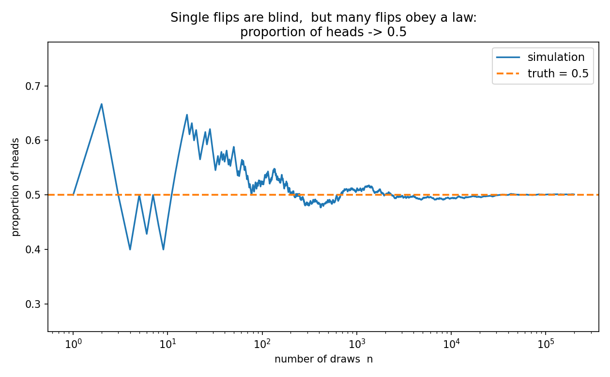
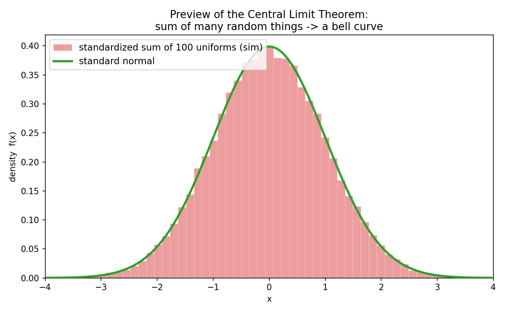

# 第 1 章 · 第一性原理:概率,到底在量什么

> **核心问题**:概率论到底在研究什么?我们背了那么多"期望""方差""贝叶斯""正态分布""p 值",可这些冰冷的公式和查表,到底在描述世界里的什么?
>
> 这一章我们不背任何公式、不查任何表。只问一件事:**如果先把概率论那些公式全撤掉,底下藏着的那个"问题"到底是什么?为什么"概率"非得用一个 0 到 1 的数来记?**
>
> **读完本章你会明白**:
> - 概率论研究的不是"数",而是**不确定性**——如何用数字,把"可能"和"确定"说清楚。
> - "概率"到底在量什么,有**三种讲得通的理解**(古典 / 频率 / 主观),各有道理、各有短板,没有哪个能独占"概率"这个词。
> - 全书最根本的一个惊奇:**单次随机完全不可预测,但大量随机却服从铁律。**
> - 以及一个最重要的承诺:这本书后面所有吓人的名词——条件概率、期望、方差、分布、大数定律、中心极限、贝叶斯、交叉熵——**全都是"驯服随机性"的工具**。把"驯服随机性"这个词钉死,后面没有什么是看不懂的。

---

## 章首·一句话点破

如果用一句话回答"概率论在干嘛",那就是:

> **概率论,是一门研究"如何在不确定性里用数字说话"的学问。概率,就是把"这件事有多可能",量化成一个 0 到 1 之间的数。**

但这句话是**结论**,不是**理由**。这一章要倒过来——先把"概率"这两个字从你脑子里彻底清空,从最朴素的"随机"问起:

- 什么叫"随机"?它和"我算错了""我不知道"是一回事吗?
- "扔一次硬币正面朝上的概率是 1/2"——这句再普通不过的话,你真知道它在说什么吗?(提示:它至少有三种互相打架的意思。)
- 为什么"单次"完全不可预测,可"大量"却极度规律?

我们一块一块拆。

---

## 一、先把"随机"看清楚:什么叫"不确定"

要懂概率,先得懂它研究的对象——**随机(randomness)**。

生活里到处是随机:扔硬币、掷骰子、明天的天气、下一个收到的邮件是不是垃圾、这支股票明天涨还是跌。它们有个共同点:**在事情发生之前,你无法确切知道结果。**

> **比喻一下(只用一次,点破就撤)**:确定性,像"1+1 必然等于 2"——结果铁定。随机,像"扔骰子"——结果在落定前是"悬着"的,有好几种可能,你事先挑不准哪一种。

这里有个极其重要、却常被混淆的区分:

> **"随机"不等于"你无知"。**

随机有两类,长得一样,本质不同:

- **本质随机**:像放射性原子何时衰变——连物理定律都告诉你,单次不可预测(量子力学的根)。这是世界骨子里的不确定。
- **信息不足的随机**:像扔骰子——原则上,如果你知道骰子的初始位置、受力、空气阻力……你是能算出它几点朝上的。它不是"本质随机",只是**你掌握的信息不够、算不起**,只好当成随机。

> **钉死这件事**:概率论**不区分**这两类。它不问"你为什么不确定",只问"既然不确定,我该怎么用数字描述它"。一个扔骰子(信息不足),一个原子衰变(本质随机),在概率论眼里**是同一回事**——都是"结果事先不定"。**这本书,就是教你在这种"不定"里,如何精确地用数字说话。**

---

## 二、核心:概率到底在量什么(三种理解)

现在到全章最该停下来想的地方了。

"扔一次硬币,正面朝上的概率是 1/2。"——这句话你从小听到大。可它**到底在说什么**?说来你可能不信,数学家为这句话吵了两百多年,吵出**三种完全不同的理解**。我们把三种摆出来,你会发现它们各有道理、各有罩门。

### 第一种:古典派——"等可能结果的占比"

概率论是从**赌博**里长出来的(没错,最早琢磨它的人,是一群想赢钱的赌徒)。赌徒眼里的概率,是最朴素的一种:

> **古典概率**:把所有"等可能"的结果数清楚,看你关心的事件占几份。

扔一颗骰子,6 个面"等可能"。掷出"偶数"的事件 = {2,4,6},共 3 个结果。所以:

```
   P(偶数) = 关心的结果数 / 总结果数 = 3 / 6 = 1/2
```

扑克、彩票、抽奖,全用这套。它直觉、好算。

> **不这样理解会怎样**:如果你没有"等可能"这个直觉,你就答不出最简单的概率题。比如"扔两颗骰子,点数和为 7 的概率",你得先把 36 种等可能的结果列出来,数出和为 7 的有 6 种,得 6/36=1/6。"等可能占比"就是这套算法的灵魂。

**但古典派有个致命罩门**:

- 它死循环。"等可能"是什么意思?"每个结果机会均等。"可"机会均等"不就是说"概率相等"吗?你**用概率定义概率**了。
- 它只管得了"对称"的情景(骰子均匀、扑克洗匀)。可现实里大量事情**根本不"等可能"**——明天下雨和不下雨,哪来的"两个等可能的结果"?

所以古典派是个**漂亮的特例**,不是概率的全貌。

### 第二种:频率派——"长期重复后的稳定频率"

第二种理解,是程序员最亲切的:

> **频率派概率**:把实验重复很多很多次,某个结果**出现的比例(频率)会稳定**到一个数,这个数就是它的概率。

扔 10 次硬币,正面可能 6 次(频率 0.6)、可能 3 次(0.3),抖来抖去。但扔 1 万次、10 万次……正面频率会越来越贴近 **0.5**。这个"贴到的数",就是频率派说的概率。

> 下图就是把这件事跑出来的样子(全书会反复用这种"扔很多次"的图)。横轴是扔的次数,纵轴是正面频率。**看左边:扔前几十次,频率在 0.3 到 0.8 之间疯跳,完全不可预测;看右边:扔到十万次,频率死死贴住 0.5 那条虚线。单次盲,大量稳——这就是概率论的全部魅力,浓缩在一张图里。**



这套理解的好处是**客观、可验证**:你说这枚硬币正面概率 0.5?扔十万次给我看,频率贴 0.5 就信你。所谓**蒙特卡洛方法**(扔随机数算概率),根就在这里——程序员算不出来的概率,扔它十万次,频率告诉你答案。

**但频率派也有罩门**:

- 它要求**能重复**。可有些事**没法重复**——"明天这场地震会不会发生""这支球队今晚赢不赢""这个病人能不能治好",都是**一次性事件**。你不能让"明天"重来十万次去测频率。对一次性事件,"长期频率"这个词根本说不通。

### 第三种:主观派(贝叶斯)——"信念的程度"

第三种理解,是最反直觉、却越来越主流的:

> **主观派(贝叶斯)概率**:概率是**你对某件事有多相信的程度**,一个 0 到 1 的数;而且它能**随着证据不断更新**。

"明天下雨的概率是 70%",不是"明天重复十万次有 70% 在下雨"(明天只有一次),而是**"我目前相信会下雨的程度是 70%"**。看到乌云密布,你把它上调到 90%;看到卫星云图说晴,你下调到 20%。**概率,是会随证据生长的认知。**

> **不这样理解会怎样**:如果你只认频率派,你就无法对"明天天气""这场官司谁赢""这段代码有没有 bug"这类**一次性、不可重复**的事谈概率——而这些恰恰是生活和工作里最常要判断的。主观派把概率从"只能描述可重复实验"解放出来,变成"任何不确定的事,都能用一个数表达你的判断"。

**它的罩门**:主观?两个人对同一件事,可以给不同概率?那概率岂不是"因人而异"?

> **但贝叶斯派会说**:这恰恰是**"学习"的本质**。不同人有不同信息,所以信念不同;拿到同样的证据后,他们**按同一套规则(贝叶斯公式,第 4 章)更新**,信念会逐步趋近。**概率不是世界固有的属性,而是你在证据面前不断修正的认知。** 这套思想,是今天机器学习、人工智能、统计推断的地基。

### 三派不是你死我活,是分工

讲完三种,你可能要问:到底哪个对?

**都对,只是各管一摊**:

- 研究**对称的游戏**(骰子、扑克)→ 用**古典派**最省事。
- 验证**可重复的过程**(产品良率、点击率)→ 用**频率派**最客观。
- 判断**一次性事件**(明天的天气、模型的预测)→ 用**主观派**(贝叶斯)最实在。

现代概率论(下一节彩蛋会讲)**用一组公理把它们统一起来**:只要满足那几条公理,都叫合法的概率。三派,是同一套数学的三种**解释**。

---

## 三、全书最根本的惊奇:单次盲,大量稳

三种理解讲完,我们把目光从"概率怎么定义"抬起来,看清概率论**最震撼**的一个事实:

> **单个随机事件,完全不可预测;但大量随机事件加在一起,却服从铁一般的规律。**

这是真的反直觉。扔一次硬币,你我说不准正反。可扔一万次,正面次数几乎一定接近五千。一个学生考试发挥是随机的,可一万名学生平均下来,稳定得像机器。

更进一步——不光是"比例稳定",连**形状**都稳:

> 下图是个预告(正式定理在第 14 章)。我把 100 个"完全随机"的数(均匀分布,扔出来啥样啥样)加起来,重复 5 万次,画出和的分布。**明明加的是一坨毫无规律的随机数,加出来的结果,却是一座对称、光滑的钟形山丘(正态分布)。** 随机性在"单个"上胡作非为,在"大量"上却乖乖排成钟形——这就是**中心极限定理**的影子,概率论最美的结论之一。



> **钉死全书的灵魂**:随机 vs 规律,这一对张力,贯穿全书。**单次随机是盲的,大量随机是稳的。** 概率论的全部本事,就是教你**在单次的盲里,看见大量的稳**——用概率描述可能、用期望刻画平均、用方差度量波动、用分布看清长相、用大数定律和中心极限定理抓住铁律。后面每一个概念,都在服务这一件事。

---

## 四、所以这本书要做什么:驯服随机性

把前面三节收束成一句承诺:

> **这本书从头到尾,只做一件事——教你用一套工具,把"随机性"这个看起来不可捉摸的东西,一层一层驯服,变成你能计算、能模拟、能用来预测和决策的数字。**

每个概念,都是驯服随机性的一步:

- **概率空间**(第 2 章)= 把所有可能结果数清楚,给每块"领地"标个概率。
- **条件概率 / 贝叶斯**(第 3、4 章)= 有了新证据,修正可能性。这是"学习"。
- **随机变量**(第 5 章)= 把随机结果变成可计算的数字。
- **期望**(第 6 章)= 刻画长期的**平均水平**(重心)。
- **方差**(第 7 章)= 刻画**波动有多大**。
- **常见分布**(第 8~10 章)= 随机性的几种**经典长相**(二项、泊松、正态、指数…)。
- **协方差 / 相关**(第 12 章)= 多个随机变量**多同步**(顺带破掉"相关 ≠ 因果")。
- **大数定律**(第 13 章)= 扔多了,**平均会稳定**。
- **中心极限定理**(第 14 章)= 大量求和,**趋向钟形**。
- **MLE / 检验 / 贝叶斯推断**(第 15~17 章)= 从数据**反推**世界。
- **信息熵 / 逻辑回归 / 生成模型**(第 18~20 章)= 用概率**做机器学习**,建模世界。

你看,**没有一个名词是孤立的**。它们全是"驯服随机性"这出戏的不同镜头。后面任何一章你卡住了,回来问一句"这跟驯服随机性有什么关系",多半就通了。

---

## 五、彩蛋:三派吵了两百年,被三条公理统一(本章最深)

这一节,我们兑现"越深越好"的承诺,讲清一个你可能从没想过的故事。

前面说古典、频率、主观三派吵了两百年,谁也说服不了谁。直到 **1933 年,苏联数学家柯尔莫哥洛夫(Andrey Kolmogorov)** 干了一件天才的事:

> **他不问"概率是什么",只规定"概率必须满足哪几条规矩"。只要一个函数满足这三条,它就是合法的概率。**

这三条规矩(概率公理)极简:

1. **非负**:任何事件的概率 ≥ 0。(不可能比"绝不可能"还不可能。)
2. **规范**:"所有可能结果加在一起"这个必然事件的概率 = 1。(总的可能份额是 100%。)
3. **可加**:互不相干(互斥)的事件,它们"至少发生一个"的概率 = 各自概率之和。

> **钉死这个统一的优美**:柯尔莫哥洛夫压根**没说概率"是什么"**(占比?频率?信念?他不管)。他只说**"它得守这三条规矩"**。结果你发现:古典的占比守这三条、频率的极限守这三条、主观的信念只要守这三条也合法——**三派全成了同一套公理下的合法公民**。吵了两百年的"概率是什么",被一招"我不定义它是什么、只规定它守什么规矩"化解。**这就是数学抽象的力量:不去纠缠名词,只抓本质结构。**

> **再深一点(尝一口,后面不会常用)**:现代概率论把这套公理,用**测度论(measure theory)** 重新奠基——"概率"就是一种特殊的"测度"(量"大小"的工具),"事件"就是"可测集","期望"就是"积分"。于是概率论被并入了**分析学**的版图,和微积分成了亲戚。你中学求的"连续分布下的面积 = 概率",其实就是积分——测度论把它说穿了。本书不展开测度论(那是研究生的事),但你会反复感觉到:概率论的深处,站着积分。

---

## 模拟佐证:拿 Python,亲手把概率"跑"出来

概率论最爽的地方——**它的结论你不用信书,自己扔随机数就能验证**。这一节,我们用三段代码,把本章的核心(古典占比、频率收敛、大量求和趋钟形)全部跑一遍。

### 1. 古典占比:扔骰子,偶数的概率

6 面"等可能",偶数 {2,4,6} 占 3 份:

```
   P(偶数) = 3/6 = 0.5
```

### 2. 频率派:扔十万次硬币,看频率趋近 0.5

```python
import numpy as np
rng = np.random.default_rng(42)
flips = rng.integers(0, 2, 100_000)        # 0=反, 1=正, 扔十万次
print(np.cumsum(flips)[-1] / 100_000)      # 正面频率 -> 约 0.501
```

扔 10 次频率可能疯跳,扔十万次几乎贴 0.5。**这就是图 1.1 的来历,也是频率派"概率 = 长期频率"的字面演示。** 你改改种子、改改次数,亲眼盯它收敛——这是理解概率最直接的肌肉记忆。

### 3. 中心极限预告:一百个随机数加起来,是钟形

```python
rng = np.random.default_rng(7)
trials, n = 50_000, 100
sums = rng.uniform(0, 1, (trials, n)).sum(axis=1)   # 每次把100个均匀随机数相加
z = (sums - sums.mean()) / sums.std()                # 标准化
print(z.mean(), z.std())                             # -> 约 0.0 和 1.0
# 把 z 画成直方图, 会看到一座对称的钟形山丘(图 1.2)
```

明明加的是一堆"扁平、无规律"的均匀随机数,和的分布却**鼓成一座钟**。**随机性,在大量求和里,自动长出了规律。** 第 14 章我们会正式讲清这件事(中心极限定理);现在你只需要被它震撼一次。

> 这三段代码,你十分钟就能全跑一遍。跑完你会发现:**教材里那些冷冰冰的定义和公式,每一条都能从"扔很多次"里长出来。** 这正是本书的承诺——公式,是直觉的副产品;而概率论的直觉,你可以亲手模拟。

---

## 章末小结

### 用一个场景回顾本章

想象你站在一张赌桌前(概率论的出生地)。骰子还没落地,结果"悬着"——这就是**随机**(第一节)。你想用数字描述"几点朝上有多可能",于是有了**概率**(第二节)。可"概率"到底指什么?是占比(古典)、是长期频率(频率派)、还是你的信念(贝叶斯)?三种都对,被柯尔莫哥洛夫的三条公理统一(彩蛋)。

而当你扔的不是一次,是十万次,疯狂的单次突然贴成一条稳定的线;当你加的不是一颗骰子,是一百个随机数,胡来的随机突然鼓成一座钟——**单次盲,大量稳**,这是概率论的灵魂(第三节),也是后面所有工具要服务的目标:驯服随机性(第四节)。

### 本章在全书主线中的位置

记住本书的主线:**一切概率概念,都是"驯服随机性"的工具。**

这一章,我们把**"随机是什么、概率在量什么"**这个地基立住了。后面每一章,你要做的只是不断回到这两块基石,问一句:"这个概念,在驯服随机性的哪一步?"

- **期望 / 方差** = 描述大量随机的**平均**和**波动**。
- **分布** = 描绘随机性的**整体长相**。
- **大数定律 / 中心极限** = 大量随机的两条**铁律**。
- **MLE / 贝叶斯** = 从数据**反推**那个不确定的世界。
- **熵 / 逻辑回归 / 生成模型** = 用概率**做机器学习**。

### 五个"为什么"清单

如果你只能记五件事,记这五件:

1. **概率论研究什么**:不是"数",是**不确定性**——如何在随机里用数字说话。
2. **概率在量什么(三种理解)**:古典(等可能占比)、频率(长期频率)、主观/贝叶斯(信念程度)。都对,各管一摊。
3. **全书灵魂**:单次随机不可预测,但大量随机服从铁律。**在单次的盲里看见大量的稳。**
4. **三派如何统一**:柯尔莫哥洛夫三条公理(非负、规范、可加)——只要守这三条,就是合法概率,不管你怎么解释它。
5. **全书承诺**:后面所有名词(期望、分布、大数、中心极限、贝叶斯、熵…),全是**驯服随机性**的工具。卡住就问"它在驯服哪一步"。

### 想继续深入,该往哪钻

- **亲手扔**:上面的三段 Python 代码,改种子、改次数、改成扔骰子(`rng.integers(1,7)`),盯频率收敛和钟形成型。**改一晚上,你对概率的直觉会脱胎换骨。**
- **看可视化**:Brown 大学的 **Seeing Theory**(seeing-theory.brown.edu,中文版有)是一个交互式概率论网站,把"频率→概率""和→钟形"做成了可拖动的动画。本章的两张图,在那里能玩起来。
- **看动画**:3Blue1Brown 的概率相关视频(尤其是关于二项分布、中心极限的),和本书同源——几何 + 直觉。

---

> 第一性原理立住了:概率论研究不确定性,概率把"可能"量化成 0 到 1 的数,三派理解被公理统一,而单次的盲与大量的稳,是贯穿全书的张力。可要把这套语言用起来,我们得先学会把"一次随机"的所有结果,一个不漏地数清楚,并给每块"领地"标上概率。翻开 **第 2 章 · 概率空间:样本空间、事件与概率**——你会发现,所谓"概率",不过是"把所有可能铺成一张地图,看每块占多大份额"。
