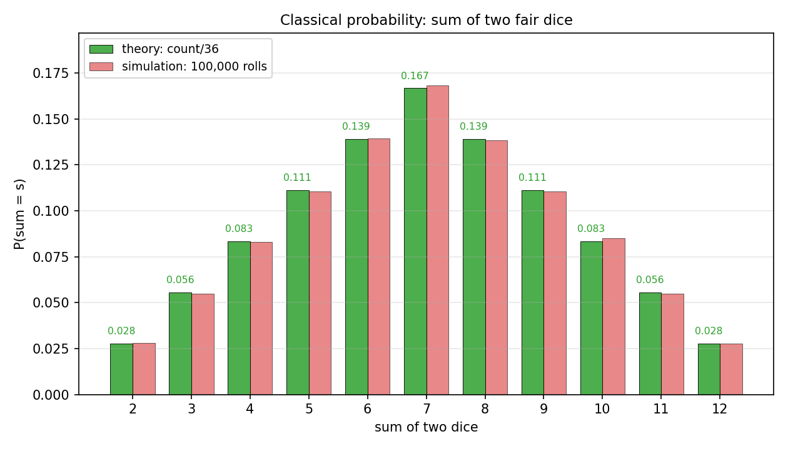
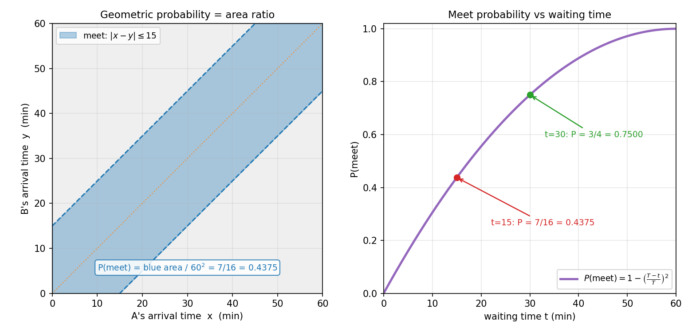

# 第 2 章 · 概率空间:把所有可能铺成一张地图

> **核心问题**:上一章我们说清了"概率在量什么"——它把"可能"量化成一个 0 到 1 的数。可这一句话还留着一个大窟窿:**到底要把什么"数清楚",才能开始算概率?那个 0.3、那个 1/6,究竟是怎么从现实里挤出来的?**
>
> 这一章我们就把这个窟窿补上。**所谓算概率,本质只做三件事:把一个随机现象的"所有可能结果"一个不漏地铺开、把关心的"那件事"圈出来、再看它占多大份额。** 把这三步钉死,你就拿到了概率论全部计算的地基。
>
> **读完本章你会明白**:
> - 为什么算概率的第一步永远是"**列出样本空间**"——漏掉一个可能结果,后面全错。
> - "**事件**"不是一句话,是一个**集合**(样本空间的一块"领地");"概率"就是给这块领地标一个份额。
> - **古典概率**(数等可能结果的占比)和**几何概率**(量面积/体积之比)是同一套思想的两种长相,前者数"个数",后者量"长短/面积"。
> - 为什么柯尔莫哥洛夫的三条公理(上一章尝了一口)值得正式展开——以及一个反直觉的深洞:**连续世界里,单个点的概率是 0**,可它依然能发生。

---

上一章末尾,我们留了这么一句话:

> 把"一次随机"的所有结果,一个不漏地数清楚,并给每块"领地"标上概率——翻开第 2 章。

这句话就是这一章的全部任务。我们从最朴素的一个动作开始:**数清楚"可能有哪些"**。

---

## 章首·一句话点破

如果用一句话概括这一章,那就是:

> **概率空间 = 一张"所有可能"的地图 + 一份"每块占多大份额"的清单。算概率,就是在这张地图上量你关心的那块领地有多大。**

这句话是结论,不是理由。本章倒过来拆:先看"地图"是怎么画的(样本空间),再看"领地"是怎么圈的(事件),最后看"份额"是怎么标的(概率),并在末尾钻进一个反直觉的深洞——为什么"地图上每个点的份额都是 0",可世界照样运转。

---

## 一、样本空间:先把"所有可能"一个不漏地铺开

### 提出问题

扔一颗骰子,问你"掷出偶数的概率是多少"。你张口就是 1/2。**可在你说出 1/2 之前,你的大脑其实已经悄悄做了一件事——它把"骰子可能掷出的所有结果"列了出来:`{1,2,3,4,5,6}`。** 没有这个清单,你根本算不出 1/2。

这一步太理所当然,以致你从没意识到它有多要紧。可它恰恰是概率论最容易翻车的地方:**只要漏掉一个可能结果、或者把"不可能"当成"可能",后面所有的概率全错。**

我们把这张"所有可能结果的清单",正式给它一个名字。

> **直觉**:**样本空间(sample space),记作 Ω(Omega),就是一个随机现象所有可能结果凑成的全集。** 它是"可能性的地图",是你算任何概率之前必须先画好的那张底图。

- 扔一颗骰子:Ω = {1,2,3,4,5,6}。
- 扔一枚硬币:Ω = {正, 反}。
- 明天的天气:Ω = {晴, 阴, 雨, 雪, …}(取决于你分多细)。
- 一台服务器下一秒收到的请求数:Ω = {0,1,2,3,…}(非负整数,可能很大,但是离散的)。
- 明天某只股票的收盘价:Ω = 所有正实数(连续的一大片)。

### 不这样会怎样

> **不这样看会怎样**:如果你不先固定样本空间,你连"概率"都没法谈。来看一个坑坏过无数人的经典陷阱。

> **一道坑题**:一个家庭有两个孩子。已知"至少有一个是男孩",问"两个都是男孩"的概率是多少?

直觉上你可能会想:已知有一个男孩,那另一个不是男就是女,各一半,所以是 1/2。**这是错的。** 错在哪?错在你没有先把样本空间老老实实铺开。

两个孩子的性别组合(按出生顺序,男= B,女= G),样本空间是:

```
   Ω = { BB,  BG,  GB,  GG }      # 四种等可能的结果
```

"至少一个男孩"这个条件,排除了 GG,剩下 `{BB, BG, GB}` 三种等可能的结果。其中"两个都是男孩"只有 BB 一种。所以概率是 **1/3**,不是 1/2。

> **钉死这件事**:**样本空间不是个形式,它是算概率的地基。** 地基画错了——多画一个不可能的结果、漏掉一个可能的结果、或者没区分"B G"和"G B"是两件事——上面盖的房子(算出来的概率)全是歪的。**养成一个条件反射:动笔算任何概率之前,先把 Ω 一个不漏地写出来。**

### 所以这样看:离散还是连续,先分清

样本空间有两种长相,后面整本书都在它们之间切换,这里先认个脸:

- **离散样本空间**:结果是"一个一个"的,能数出来(扔骰子、抛硬币、请求数)。对应**古典概率**(数占比)。
- **连续样本空间**:结果是"连成一片"的,落在一个区间/区域里(到达时刻、身高、价格)。对应**几何概率**(量面积)。

这两种长相,算概率的手法完全不同——前者"数个数",后者"量面积"。但你会发现,它们的灵魂是同一个:**看你关心的那块"领地",在整张地图里占多大份额。**

---

## 二、事件:把"你关心的那件事"圈成一块领地

### 提出问题

光有样本空间还不够。我问你"扔一颗骰子,掷出偶数的概率",你不会去算"掷出 2 的概率"——虽然 2 是偶数,但"偶数"是 {2,4,6} **三个**结果凑在一起的事。**"偶数"不是一个单独的结果,而是一组结果。**

概率论把这种"一组结果"也给了个正式名字。

> **直觉**:**事件(event)就是样本空间的一个子集——你从 Ω 里圈出来的"一块领地"。** 当随机现象落定的结果落在这块领地里,我们就说"这个事件发生了"。

- 扔一颗骰子,事件 A = "掷出偶数" = {2,4,6} ⊂ Ω。
- 事件 B = "掷出大于 4" = {5,6}。
- 事件 C = "掷出 7" = ∅(空集)——Ω 里没有 7,所以这是**不可能事件**,概率 = 0。
- 事件 D = "掷出 1 到 6 之间" = Ω 本身——这必然发生,叫**必然事件**,概率 = 1。

> **钉死这件事**:**"事件"不是一句话,是一个集合。** "明天下雨"是个事件 = Ω 里所有"下雨"的结果凑成的那块;"股价超过 100 元"是个事件 = 所有大于 100 的价格凑成的区间。**一旦你把事件看成集合,所有的概率计算就变成了集合的运算**——这后面有大用。

### 不这样会怎样:集合运算就是"逻辑运算"

> **不这样看会怎样**:如果你不会把事件当集合,你就处理不了"既…又…""或…或…""不…"这类复合事件。而这些恰恰是现实里最常遇到的——"明天要么下雨要么下雪""既不涨停也不跌停""至少有两个 bug"。

把事件当集合,逻辑运算就有了对应的集合运算(这是概率论最优雅的一笔):

| 你想说的 | 逻辑符号 | 集合运算 | 含义 |
|---------|---------|---------|------|
| "A 或 B 发生"(至少一个) | A ∨ B | A ∪ B(并集) | 结果落在 A 或 B 任一块 |
| "A 且 B 都发生" | A ∧ B | A ∩ B(交集) | 结果同时落在两块 |
| "A 不发生" | ¬A | Aᶜ(补集) | 结果落在 A 之外 |
| "A、B 不可能同时" | A、B 互斥 | A ∩ B = ∅ | 两块领地不重叠 |

> **钉死这件事**:**你中学背的"概率加法公式 P(A∪B) = P(A)+P(B)−P(A∩B)",说白了就是"两块领地合起来有多大,要把重叠那块扣掉,免得数两遍"。** 把事件当集合,所有那些干巴巴的公式(加法、乘法、全概率)突然都有了脸——它们都是在玩"领地拼合"的游戏。

### 所以这样看:一个反直觉的细节(为后面铺路)

这里有个小细节,先种下,到本章最深一节会爆炸:**"事件"是样本空间的子集,但不是样本空间的任意子集都能当事件**(在连续世界里)。这个坑我们先记着,第五节正式点破。

现在,地图(Ω)画好了,领地(事件)也圈好了。最后一步:**给每块领地标份额。**

---

## 三、概率:给每块领地标一个"份额"

### 提出问题

现在到全章的正题了。地图铺好了,领地圈好了,**怎么给一块领地标"它有多大可能"?** 这就要回到上一章讲的那个 0 到 1 的数。我们正式给它一个定义。

> **直觉**:**概率(probability),记作 P,是一个"给事件打分"的函数**——你喂给它一个事件(一块领地),它吐给你一个 0 到 1 的数,表示"这块领地占整张地图多大份额"。份额越大,这件事越可能。

- 扔一颗均匀骰子,P(偶数) = P({2,4,6}) = 3/6 = 1/2。
- P(掷出 6) = 1/6。
- P(掷出 7) = P(∅) = 0(不可能事件)。
- P(掷出 1~6) = P(Ω) = 1(必然事件)。

注意这里 P 不是对"一个数"打分,而是对"一个集合"打分。**P 是从"事件的集合"到"[0,1] 区间的数"的一个映射。** 这个视角,是现代概率论的命根子(第五节会讲它通向哪里)。

### 不这样会怎样:三派还是吵,公理来收场

> **不这样看会怎样**:上一章讲过,"概率"到底是占比(古典)、频率(频率派)、还是信念(贝叶斯),三派吵了两百年。如果你死守一派的定义,你就处理不了另一派擅长的问题——用古典派算不了天气,用频率派算不了一次性事件。

怎么收场?上一章彩蛋里尝过一口的**柯尔莫哥洛夫三条公理**,这里正式展开。他的天才一招是:**我不定义"概率是什么",我只规定"概率这个函数必须守哪几条规矩"。** 只要守这三条,你管它叫占比、叫频率、叫信念,都是合法的概率。

> **所以这样看 · 柯尔莫哥洛夫三条公理(正式版)**:
>
> 设 P 是定义在事件上的函数。要叫"概率",它必须守:
>
> 1. **非负性**:对任何事件 A,P(A) ≥ 0。(**份额不能是负的。**)
> 2. **规范性**:P(Ω) = 1。(**整张地图的总份额是 100%。**)
> 3. **可列可加性(σ-可加)**:若事件 A₁, A₂, … 两两互斥(任意两块领地不重叠),则它们"至少发生一个"的概率等于各自概率之和:
>    P(A₁ ∪ A₂ ∪ …) = P(A₁) + P(A₂) + …

三条规矩,朴素到像废话——份额不能负、加起来是 1、不重叠的能加。可就这三条,撑起了整个概率论的摩天大楼。

> **钉死这件事 · 为什么是这三条**:
> - **非负**:你不会说"这件事的可能是 −0.3"。可能性只有"没有"(0)到"铁定"(1),中间是渐变,不可能是负的。
> - **规范 = 1**:所有可能加在一起,必须是个完整的"100%"。如果总份额是 1.2,说明你多算了;是 0.8,说明你漏了。
> - **可加**:互斥(不重叠)的事件,份额能直接相加——这是"领地拼合"的直觉。扔骰子,"掷出 2"和"掷出 3"互斥,那"掷出 2 或 3"的概率就是 1/6 + 1/6 = 1/3。

> **注意第三条的一个隐藏威力**:"可加"要求事件**互斥**(不重叠)。如果两块领地**重叠**了(比如 A=偶数={2,4,6},B={4,5,6},它们共享 4 和 6),那就不能直接 P(A)+P(B),得扣掉重叠——这就是**加法公式** P(A∪B)=P(A)+P(B)−P(A∩B) 的来历。**重叠要扣,互斥才能直加。** 这条铁律,后面每一章都在用。

有了样本空间、事件、概率三件套,我们终于可以正式定义本章的主角了:

> **概率空间(probability space)= (Ω, F, P)**:一个三元组。
> - **Ω**:样本空间(所有可能结果)。
> - **F**:事件族(Ω 的某些子集凑成的家族,这些子集"能被赋予概率")。
> - **P**:概率函数(给 F 里每个事件标一个 [0,1] 的份额,守三条公理)。

三个字母,概率论的全部地基。后面所有的"期望""方差""分布""大数定律",都长在这三个字母上。

---

## 四、古典概率:数等可能结果的占比

### 提出问题

公理虽然优美,但它是"规矩",不是"算法"——它告诉你 P 必须守什么,却没告诉你**具体怎么算出一个 P(A)**。算的方法,要看样本空间是离散还是连续。先看离散的、最古典的这一种。

> **直觉 · 古典概率(classical probability)**:当样本空间 Ω 是**有限个、且每个结果等可能**(比如均匀的骰子、洗匀的扑克),那么:
>
> ```
>    P(A) = A 包含的结果数 / Ω 的总结果数
> ```
>
> 一句话:**数你关心的那块领地里有几个结果,除以总结果数。** 这就是上一章讲的"古典派"——赌徒、彩票、抽奖的那套算法。

它的灵魂是"**等可能**"。每个结果机会均等,所以谁也不偏袒,数个数就行。

### 不这样会怎样:你得会"列",还得会"数"

> **不这样看会怎样**:古典概率看着简单(就是个除法),可它的难点不在除,在**数**——当结果很多时,你得有本事把"关心的结果数"和"总结果数"数对。这正是组合数学(counting)在概率论里到处出现的原因。

来看本章的招牌例子——**两颗骰子**。这是古典概率最能展示"数对结果有多重要"的题。

> **小例子 · 两颗骰子的点数和**:扔两颗均匀骰子,问"点数和 = 7"的概率。

**坑(无数人栽过)**:如果你只看"和可能是 2 到 12,共 11 种",然后说"和=7 是其中一种,所以 1/11"——**错得离谱。** 错在哪?错在"和=7"和"和=2"**不是等可能的**。和=2 只有一种掷法(1+1),和=7 有六种掷法(1+6, 2+5, 3+4, 4+3, 5+2, 6+1)。**你把不等可能的当成等可能了。**

正确的做法:**先把真正等可能的结果铺开**——两颗骰子,每颗 6 面,共 6×6=**36 种等可能**的结果(要区分"第一颗 1、第二颗 6"和"第一颗 6、第二颗 1",它们是两个不同的结果)。然后数:和=7 的有 6 种。

```
   P(和=7) = 6/36 = 1/6 ≈ 0.1667
```

而和=2 只有 1 种,P(和=2)=1/36。这就是为什么"和=7"最常见——它对称、组合最多。

> **钉死这件事**:**古典概率的命门,是确认"你数的结果真的是等可能的"。** 骰子的 6 个面等可能,可"两颗骰子的和"那 11 个值**不**等可能。**永远回到最细的、真正等可能的"原子结果"去数**,别在"和"这种合成结果上数——这是古典概率不翻车的唯一秘诀。

下图把这件事画得明明白白:理论柱(绿)是 36 种等可能结果数出来的占比,模拟柱(红)是扔十万次的真实频率。**两者严丝合缝**——和=7 那根柱子最高(1/6≈0.167),两边对称地矮下去,到和=2 和=12 最矮(1/36≈0.028)。



你看,这就是"等可能结果数占比"跑出来的样子——一座对称的**三角山**。和=7 是峰,因为它组合最多。**这其实已经是第 8 章要讲的某个分布的雏形了**(两个均匀分布求和,会鼓成三角;求和更多次,就鼓成正态——中心极限定理的伏笔,第 14 章)。

### 所以这样看:古典概率的边界

古典概率漂亮、好算,可它有个上一章就点过的**致命罩门**:**它只管得了"等可能"的情景。** 骰子均匀、扑克洗匀、彩票公平,它能算。可现实里大量事情根本不"等可能"——明天下雨和不下雨,哪来的"两个等可能结果"?服务器每秒收到 0 个请求和 1000 个请求,显然不等可能。

对这种"不等可能"的离散情形,古典概率就力不从心了——你得用**频率**(长期重复测占比,上一章频率派)或者**主观信念**(贝叶斯,第 4 章)来标份额。

而更彻底的麻烦,来自**连续**的世界:当结果是"一个时刻""一个价格""一段长度"时,样本空间里有**无穷多个**结果——你根本没法"数个数"。这时候,得换一套工具。

---

## 五、几何概率:量面积,而不是数个数

### 提出问题

现在把目光从骰子挪开,看一个完全不同的随机现象:**两个约好的朋友,各自在一段随机时间到达。** 问"他们能碰上面"的概率。

你看,这里的"结果"不是"掷出几点",而是"两人各自的到达时刻"——是一对连续的数 `(x, y)`,落在一个正方形区域里。**这种结果有无穷多个,你没法"数"它有几个。** 古典概率那套"数占比"直接哑火。

那怎么办?**改"数个数"为"量面积"。**

> **直觉 · 几何概率(geometric probability)**:当样本空间 Ω 是一个连续区域(线段、平面、立体),且"机会均等"意味着"落在任意等大小的子区域里概率相同",那么:
>
> ```
>    P(A) = A 的"大小"(长度/面积/体积) / Ω 的"大小"
> ```
>
> 一句话:**概率 = 你关心的那块区域的面积,除以总面积。** 古典是"数个数",几何是"量面积",灵魂完全一样——都是"看你那块领地占多大份额"。

### 不这样会怎样:约会问题,一根线救活一道题

> **不这样看会怎样**:如果你硬要用古典概率去"数"连续的到达时刻,你会发现"结果有无穷多个,每个的占比是 1/∞ = 0"——根本算不下去。**几何概率的绝活,是把"数不清的连续结果"转化成"画得出的一块面积",然后量面积。**

来看那道经典的**约会问题(meeting problem)**:

> **小例子 · 约会问题**:甲乙两人约好中午 12:00 到 1:00 之间在某地见面。两人各自在这 60 分钟内**随机到达**(均匀分布),每个人到了之后**最多等 15 分钟**,等不到就走。问"两人能碰上"的概率是多少?

**直觉铺垫**:设甲在 x 分钟到,乙在 y 分钟到,x、y 都在 [0,60] 里均匀随机。两人碰上的条件是:**到达时刻相差不超过 15 分钟**,即 |x − y| ≤ 15。

现在把这件事画成图——这就是几何概率最爽的一刻:**所有可能的 (x, y) 组合,铺成一张 60×60 的正方形地图**(总面积 3600)。两人碰上,当且仅当这个点落在"两条对角线之间的带状区域"里。

```
   相遇面积 = 总面积 − 两个角落的"错过"三角形
            = 60² − 2 × (½ × 45 × 45)
            = 3600 − 2025
            = 1575

   P(相遇) = 1575 / 3600 = 7/16 = 0.4375
```

或者更优雅地看:**错过**当且仅当 |x−y| > 15,即两人到达时刻相差超过 15 分钟。这对应正方形里**右上角和左下角**两个直角三角形(腰长 45)。每个面积 = ½×45×45=1012.5,两个加起来 2025。

```
   P(错过) = 2025 / 3600 = 9/16
   P(相遇) = 1 − 9/16 = 7/16 ≈ 0.4375
```

下图左边把这块"相遇带"画出来(蓝色),右边画出"等待时间 t 越长,相遇概率越高"的曲线。**注意看 t=15 那个点:正好对应 7/16;若两人都肯等满 30 分钟(一半时间),相遇概率跳到 3/4=0.75。**



> **钉死这件事**:**几何概率把"概率"从"数离散的个数"推广到了"量连续的面积"。** 它揭示了一件事——**当结果是连续的,概率不再是"几个结果占几份",而是"一块区域占整张地图多大比例"。** 这个视角,是第 5 章(连续随机变量)和第 9 章(均匀/正态分布)的全部地基。**记住:连续世界里,概率 = 面积,不是个数。**

### 一个彩蛋:用扔针量出 π(蒲丰投针)

几何概率有个传奇应用——**蒲丰投针(Buffon's needle)**,1777 年法国博物学家蒲丰提出的一个实验:

> 在地上画一组间距为 d 的平行线。拿一根长度为 L(L ≤ d)的针,随机往地上一扔。问:针压到线的概率是多少?

用几何概率一算(L=1, d=2 为例):针压线,当且仅当"针中点到最近线的距离 y"小于"针在垂直线方向上的投影 L·sinθ/2"。画出来又是一个"面积比":

```
   P(压线) = (2L) / (π·d)
```

注意分母里冒出了 **π**!因为 θ 的范围牵涉到圆周。于是,如果你扔很多次针,数压线的频率,就能**反推出 π**:

```
   π ≈ (2L) / (d × 压线频率)
```

扔 20 万次针(本章模拟,种子 42),压线频率约 0.319,反推出的 π ≈ **3.135**——已经相当接近真值 3.1416。**用一根针和一张画线的纸,量出了圆周率。** 这就是几何概率的魔力:它把"概率"和"几何测量(π)"直接焊在了一起。**这也是蒙特卡洛方法的鼻祖之一——用随机实验去估算一个确定的常数,第 13 章会正式讲这套思想。**

---

## 六、模拟佐证:用 Python,把份额"数"出来

概率论最痛快的地方——**它的结论你不用信书,自己扔随机数就能验证**。这一节,我们把古典(数占比)、几何(量面积)两种算法,全部跑一遍。

### 1. 古典:扔两颗骰子十万次,看"和=7"的频率趋近 1/6

理论:36 种等可能结果里,和=7 的有 6 种,P = 6/36 = **1/6 ≈ 0.1667**。

```python
import numpy as np
rng = np.random.default_rng(42)
N = 100_000
rolls = rng.integers(1, 7, size=(N, 2))     # 两颗骰子, 扔十万次
sums = rolls.sum(axis=1)
print((sums == 7).mean())                    # -> 约 0.1683 (理论 1/6 ≈ 0.1667)
```

跑出来约 0.1683,和理论 1/6 吻合(十万次的蒙特卡洛误差大约在千分之几)。**改 N 到一千万,会更贴。** 这就是图 2.1 里红柱(模拟)和绿柱(理论)严丝合缝的来历。

### 2. 几何:约会问题,扔五十万个随机点,数落在"相遇带"里的比例

理论:P(|x−y|≤15) = 1−(45/60)² = **7/16 = 0.4375**。

```python
rng = np.random.default_rng(42)
x = rng.uniform(0, 60, 500_000)
y = rng.uniform(0, 60, 500_000)
print((abs(x - y) <= 15).mean())             # -> 约 0.4374 (理论 7/16 = 0.4375)
```

跑出来约 0.4374,几乎就是 7/16。**几何概率的"面积比",被"扔点数比例"完美复现**——这就是蒙特卡洛方法量面积的本质(第 13 章大数定律会讲清它为什么收敛)。

### 3. 蒲丰投针:扔二十万根针,反推 π

理论:P(压线) = 2L/(πd),取 L=1、d=2,则 P = 1/π,故 π ≈ 1/频率。

```python
rng = np.random.default_rng(42)
L, d, N = 1.0, 2.0, 200_000
theta = rng.uniform(0, np.pi/2, N)           # 针与线方向的夹角
y = rng.uniform(0, d/2, N)                   # 针中点到最近线的距离
cross = (y < (L/2) * np.sin(theta))          # 投影 > 距离, 则压线
freq = cross.mean()
print(2*L / (d*freq))                        # -> 约 3.135 (真值 π ≈ 3.1416)
```

跑出来约 3.135,离 π 只差千分之二。**把随机针变成量圆周率的尺子——这就是几何概率最浪漫的一幕。** 扔更多次(比如一千万),会更准,但也更慢;蒙特卡洛的误差收敛速度是 O(1/√N)(第 13 章细讲)——想把精度提高一位,得多扔 100 倍。

> 这三段代码,你十分钟就能跑完。跑完你会发现:**古典的"数占比"、几何的"量面积"、还有那三条公理,全都能从"扔很多次随机数"里长出来。** 公式不是天上掉下来的,它们是你亲手扔出来的频率,在大量重复里,贴上了理论那条线。

---

## 七、彩蛋(本章最深):连续世界里,单点的概率是 0

这一节,我们兑现"越深越好"的承诺,钻进一个会让很多人世界观动摇的事实——**也是为第 5 章(连续随机变量)和第 9 章(连续分布)铺的最重要的路。**

### 提出问题

回到约会问题。我问你一个怪问题:**"甲恰好在 12:00:00.000(精确到毫秒)到达"的概率是多少?**

按几何概率的算法,这是 x = 0 这"一个点"。一个点的"面积"是多少?**是 0。** 所以:

```
   P(甲恰好在某个精确时刻到达) = 0
```

可这怎么可能?甲**确实**在某个时刻到达了啊!他到达的时刻是一个**真实发生**了的结果,可这个结果的概率居然是 **0**?

> **直觉 · 这就是连续世界的反直觉之处**:**在连续样本空间里,任何一个单独的"点"的概率都是 0,可世界照样运转——因为概率量的是"一块区域的面积",不是"一个点的份额"。** 点没有面积,所以单个点的概率是 0;但点能落在一个有面积的区间里,所以事件照样能发生。

### 不这样会怎样:为什么必须接受"概率 0 ≠ 不可能"

> **不这样看会怎样**:如果你坚持"P(A)=0 就意味着 A 不可能发生",你就会在连续世界里陷入悖论——**每个具体结果都"概率为 0",可总有一个结果会发生**,这不是自相矛盾吗?

解开这个悖论的关键,是分清两个概念:

- **不可能事件(impossible)**:样本空间里**根本没有**这个结果。比如扔骰子掷出 7,P=0,且**真的不可能**。
- **概率为 0 的事件(probability zero)**:样本空间里**有**这个结果,但它"太细"(一个点、一条线),份额测出来是 0。比如"股票恰好收盘在 100.0000…元",P=0,但**可能发生**(收盘价总得是某个数)。

> **钉死这件事**:**在连续世界里,"概率为 0"不等于"不可能发生"。** 这是连续与离散最深刻的区别,也是无数人学正态分布时卡壳的根源(第 9、10 章)。**记住这个区分:概率 0 ≠ 不可能;概率 1 ≠ 必然。** 连续世界里,概率 1 的事件(比如"股价是某个正实数")也可能"不发生"——只是这种"不发生"的集合测度是 0。

### 所以这样看:为什么"不是任意子集都能当事件"

这个单点概率为 0 的事实,牵出一个更深的问题——**既然单个点的概率是 0,那"所有单个点凑成的任意子集",概率也该是 0 吗?** 如果是,那概率函数就太"扁平"了,根本区分不出不同的子集。

这正是现代概率论(测度论)要解决的麻烦:**样本空间的任意子集,不一定能被赋予一个合理的概率。** 有些子集太"野",硬要给它标概率,会破坏柯尔莫哥洛夫第三条公理(可列可加性)。

所以,概率论做了个技术处理:**只对一部分"乖"的子集(叫"可测集")赋予概率,这些子集凑成的家族就是概率空间三元组里的 F(事件族/σ-代数)。** 上一节末尾埋的那个伏笔,在这里点破:**"事件"是样本空间的子集,但只有"可测"的那些子集才能当事件。**

> **尝一口 Vitali 不可测集(懂个意思就行)**:1905 年,意大利数学家 Vitali 构造出一个实数轴上的子集,它**没法用"长度"去量**——你要是硬给它一个长度,就会推出矛盾(把区间平移拼来拼去,总长度既该是 0 又该是无穷)。这个"量不了长度"的集合,就是"不可测集"。**概率论里"概率"是"测度"的一种,所以同样存在"量不了概率"的子集**——这些就排除在事件族 F 之外。
>
> 本书不展开证明(那是测度论的研究生内容),你只需要知道:**"给子集标概率"这件事,在连续世界里不是想标就能标的,得守规矩。** 这个规矩,就是 σ-代数。

> **钉死这件事 · 本章最深的一句**:**离散世界里,你几乎可以把样本空间的任意子集当事件(每个子集都有明确的概率);连续世界里不行——"事件"被限制在"可测"的子集里,而单个点(以及某些病态子集)的概率是 0 或无定义。** 这不是数学家钻牛角尖,而是为了让概率的三条公理(尤其可加性)在无穷的世界里不崩塌。**记住这个味道:连续逼出了测度论,测度论让概率论在无穷上站稳了脚跟。**

---

## 章末小结

### 用一个场景回顾本章

想象你是个调度员,要算"明天早高峰,某路口发生拥堵的概率"。

第一步,你**画出地图**:这个路口明天可能出现的所有车流状态,凑成样本空间 Ω(第一节)。第二步,你**圈出领地**:把"车流量超过某个阈值"的那些状态圈成一个事件 A = "拥堵"(第二节)。第三步,你**标份额**:如果车流是离散的(按辆数),你数 A 占 Ω 多大比例(古典,第四节);如果车流是连续的(按速率),你量 A 那块区域的面积比(几何,第五节)。而这一切之所以成立,是因为"份额"守着柯尔莫哥洛夫那三条铁律——非负、规范、可加(第三节)。

末了,你钻进一个深洞:明早车流速率"恰好等于某个精确小数"的概率是 0,可它照样会发生(第七节)——**这就是连续世界与离散世界最深的分水岭,也是测度论登场的理由。**

### 本章在全书主线中的位置

记住本书的主线:**一切概率概念,都是"驯服随机性"的工具。**

这一章,我们完成了驯服随机性的**第一步**:**把"一个随机现象"的所有可能结果数清楚、给每块"领地"标上概率——量化单个事件的可能性。** 有了样本空间、事件、概率这三件套,你才拿到了后面所有工具(条件概率、期望、分布、极限定理)的入场券。

- 下一章(第 3 章·条件概率)会在这张地图上加一个"已知……"的滤镜——**缩小样本空间**,在更小的地图上重新标份额。
- 第 4 章(贝叶斯)会把"标份额"变成一个**随证据滚动更新**的过程。
- 第 5 章(随机变量)会给地图上的每块领地**贴一个数字**,让随机结果变成可运算的数。
- 第 9、10 章(连续分布、正态)会把你这里尝到的的"概率 = 面积"用到极致——正态分布那条钟形曲线下的面积,就是概率。

### 五个"为什么"清单

如果你只能记五件事,记这五件:

1. **概率空间三件套**:**Ω(样本空间,所有可能)+ F(事件族,你圈的领地)+ P(概率,标份额,守三条公理)**。算任何概率,先画地图、再圈领地、最后标份额。
2. **古典概率** = 数等可能结果的占比;**几何概率** = 量面积/体积之比。灵魂都是"看你那块领地占多大份额",只是一个数个数、一个量面积。
3. **古典概率的命门**:确认你数的"原子结果"是**真正等可能**的(两颗骰子的"和"不等可能,得回到 36 种等可能掷法去数)。
4. **柯尔莫哥洛夫三公理**:非负(P≥0)、规范(P(Ω)=1)、可列可加(互斥可加)。这三条撑起整个概率论,且统一了古典/频率/贝叶斯三派。
5. **连续世界的深洞**:单点概率为 0,但可能发生(**概率 0 ≠ 不可能**);所以连续样本空间的"任意子集"不一定能当事件——这逼出了测度论和 σ-代数。

### 想继续深入,该往哪钻

- **亲手扔**:把本章的三段 Python(两颗骰子、约会问题、蒲丰投针)全跑一遍,改种子、改次数、改等待时间,盯频率贴理论。**特别推荐改约会问题的等待时间 t,看 P(t) 曲线怎么从 0 爬到 1——那是图 2.2 右边那条紫线,你能亲手让它长出来。**
- **蒲丰投针进阶**:把投针次数从 20 万加到一千万,看 π 的估算精度怎么提升(提示:误差按 1/√N 收敛,第 13 章细讲)。再试试 L > d 的情形(针比线距长,公式会变)。
- **看可视化**:Brown 大学的 **Seeing Theory**(seeing-theory.brown.edu)有"概率空间"的交互模块,能拖动事件、看面积比怎么变成概率。
- **钻测度论(可选,硬核)**:想知道"为什么不是任意子集都能当事件""σ-代数到底长什么样",可以翻任何一本概率论的测度论前奏章(如 Casella & Berger《Statistical Inference》附录,或 Durrett《Probability: Theory and Examples》第一章)。**Vitali 不可测集的构造**,是数学系本科到研究生的经典内容。

---

> 地图画好了,领地圈好了,份额也标上了——你终于能把"一个事件有多可能"算成一个精确的数。可现实里,我们几乎从不在"一无所知"的状态下谈概率:**你总会先知道点什么。** "已知今天乌云密布""已知这个病人是老年人""已知这封邮件里有'免费'两个字"——**有了证据,概率就该变。** 翻开 **第 3 章 · 条件概率与独立性**——你会发现,所谓"条件概率",不过是**把样本空间缩小到"已知发生的那块领地"里,重新标一次份额**。而"独立",则是说这个证据压根没改变份额。这两件工具,是贝叶斯思想(第 4 章)的全部地基。
