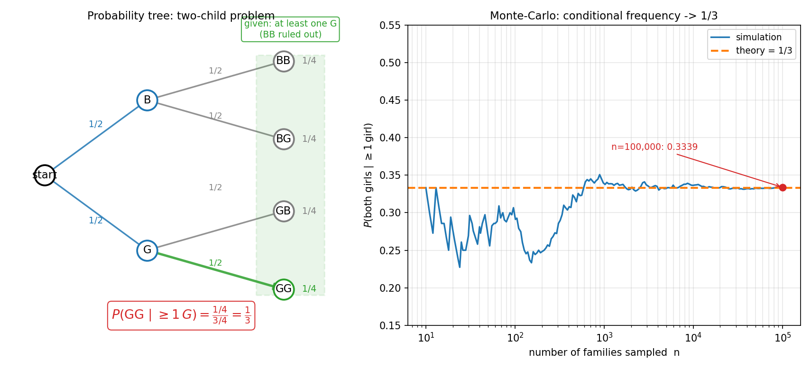
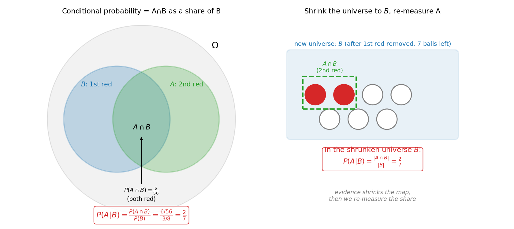

# 第 3 章 · 条件概率与独立性

> **核心问题**:上一章我们把"一个随机现象"的所有可能铺成一张地图、给每块领地标了概率。可现实里,我们几乎从不在"一无所知"的状态下谈概率——**你手里总会先攥着一条证据**。"已知今天乌云密布,下雨概率是多少?""已知这封邮件里有'免费'两个字,是垃圾邮件的概率是多少?""已知第一次摸出来的是红球,袋里第二次还摸得到红球的概率是多少?"**有了证据,那张概率地图就该重画。** 这一章讲清三件事:证据来了,概率怎么变(条件概率)、两件事怎么算"一起发生"(乘法公式,像接龙)、以及什么情况下证据压根没用(独立性);最后给你一把拆解复杂问题的瑞士军刀——全概率公式。
>
> **读完本章你会明白**:
> - 所谓"条件概率",不过是**把样本空间缩小到"已知发生的那块领地"里,重新标一次份额**。一句话,证据缩小了地图,份额自然要重算。
> - "A 和 B 一起发生"的概率,为什么是 `P(A)·P(B|A)`——它是一条**接龙**:先算 A,再在 A 已经发生的前提下算 B,一环扣一环。
> - **独立性**的精确定义是 `P(B|A) = P(B)`:证据 A 完全没改变 B 的份额。而且要破一个最常见的混淆——**独立 ≠ 互斥**,互斥反而最不独立(一个发生,另一个必不发生)。
> - **全概率公式**是把一个复杂事件,按某个变量"切片"成几类、分别算、再加起来——本质就是**分情况讨论的精炼**。
> - 为什么这三件工具,是下一章贝叶斯思想的全部地基:贝叶斯公式 = 条件概率 + 全概率的合体。

> **如果一读觉得太难**:先只记住三件事——① 条件概率就是把地图缩小到"已知那块",重新标份额;② 独立 = 证据不影响概率;③ 全概率 = 分情况讨论再相加。把这三句钉死,本章就拿到了。

---

上一章末尾,我们留了这么一句话:

> 你总会先知道点什么……有了证据,概率就该变。翻开第 3 章——所谓"条件概率",不过是**把样本空间缩小到"已知发生的那块领地"里,重新标一次份额**。

这句话就是这一章的钥匙。我们从最朴素的一个问题开始:**当你知道了一件事已经发生,另一件事的概率凭什么要变?**

---

## 章首·一句话点破

如果用一句话概括这一章,那就是:

> **条件概率 = 缩小地图,重新标份额;乘法公式 = 条件概率的接龙;独立性 = 证据不改变份额;全概率公式 = 分情况讨论的利器。**

这句话是结论,不是理由。本章倒过来拆:先看"证据凭什么改变概率"(第一节),再看"两件事一起发生怎么算"(第二节),接着问"什么时候证据等于白给"(第三节,独立性),最后给你一把把复杂问题拆解的刀(第四节,全概率公式)。每一件工具,都是在上一章那张"地图 + 领地 + 份额"的地基上加东西——地图没变,只是你学会了**缩小它、接龙它、无视它、切分它**。

---

## 一、条件概率:证据缩小了地图,份额要重算

### 提出问题

袋里有 3 个红球、5 个白球,你闭眼摸一个,**不放回**,再摸一个。问:

> **第二次摸到红球的概率是多少?**

直觉上你可能会想:袋里 3 红 5 白,共 8 个,红球占 3/8,所以第二次摸到红的概率是 3/8。**这在"不放回"的规则下是错的**——错在哪?错在你**没有考虑到第一次摸走了什么**。如果第一次摸走了一个红球,袋里只剩 2 个红、5 个白,第二次摸到红的概率就掉到了 2/7;如果第一次摸走的是白球,袋里剩 3 红 4 白,第二次摸到红的概率反而升到了 3/7。**第一次的结果,改变了第二次的地图。**

这就是条件概率要回答的问题:**当一件事已经发生(已知第一次摸走的是什么),另一件事的概率该怎么重新标?**

> **直觉 · 条件概率(conditional probability)**:你已经知道 B 发生了,那么 A 发生的概率——记作 `P(A|B)`,读作"在 B 发生的条件下,A 的概率"——就是把样本空间**缩小到 B 那块领地里**,看 A 在这块更小的地图上占多大份额。

### 不这样会怎样:两孩问题,你答错过吗

> **不这样看会怎样**:如果你不"缩小地图",你就会栽进一个坑坏过无数人的经典陷阱。这道题上一章当过坑题,这里我们正式用它来演示"条件概率"的全部威力。

> **小例子 · 两孩问题**:一个家庭有两个孩子。**已知"至少有一个是女孩"**,问"两个都是女孩"的概率是多少?

直觉上(错误的直觉)你会想:已知有一个女孩,那另一个不是男就是女,各一半,所以是 1/2。**错。** 错在哪?错在你没有先老老实实把"至少一个女孩"这个证据**如何缩小了样本空间**想清楚。

两个孩子的性别组合(按出生顺序,男 B、女 G),**原始**样本空间是:

```
   Ω = { BB,  BG,  GB,  GG }      # 四种等可能的结果, 各占 1/4
```

现在证据来了:**"至少一个女孩"**。这个证据排除了 BB(因为 BB 里没有女孩),把样本空间**缩小**成:

```
   新 Ω' = { BG,  GB,  GG }       # 只剩三种等可能的结果, 各占 1/3
```

在这块更小的地图上,"两个都是女孩"对应 GG 这一种,占 1/3。所以:

```
   P(两个都是女 | 至少一个女) = 1/3
```

不是 1/2。**证据把地图从 4 格缩成了 3 格,你要在新地图上重新数份额。** 这就是条件概率的全部秘密。下图把这件事画了个明白:左边是条件概率树,四个叶子 `{BB, BG, GB, GG}` 各占 1/4;"至少一个女孩"这个证据把 BB 那一支划掉了(绿框),剩下 `{BG, GB, GG}` 三支各 1/4,在其中 GG 占 1/3。右边是十万次模拟的收敛曲线:随着采样家庭数从 10 涨到十万,条件频率从剧烈抖动,死死贴住 1/3 那条橙色虚线。



### 所以这样看:条件概率的定义

把上面这个过程提炼成一条公式。设 A、B 是两个事件,且 `P(B) > 0`(B 不能是不可能事件,否则没法当"证据"):

> **条件概率的定义**:
>
> ```
>    P(A | B) = P(A ∩ B) / P(B)
> ```
>
> 读法:**"在 B 发生的条件下,A 发生的概率" = "A 和 B 同时发生"的概率,除以"B 发生"的概率**。

这条公式看着抽象,回到文氏图就秒懂。看下图左边:大圆 Ω 是全集,圆 B(第一次红)和圆 A(第二次红)相交出一块 `A∩B`(两次都红)。**条件概率 `P(A|B)` 在问什么?** 它在问:**如果把目光只锁定在圆 B 这块里(因为 B 已经发生了),那么 A∩B 这块占 B 多大份额?** 数学上就是 `(A∩B 的面积) / (B 的面积)`,也就是 `P(A∩B) / P(B)`。



看图右边:把这件事再翻译回摸球。袋里 3 红 5 白,第一次摸走红球后,袋里只剩 **2 红 5 白,共 7 个球**——这就是被证据缩小后的新地图 B。在这块新地图上,"第二次摸到红球"对应那 2 个红球,占 2/7。所以 `P(第二次红 | 第一次红) = 2/7`。**证据搬走了地图上的一部分(第一次摸走的那个红球),剩下的地图里,红球的份额自然就变了。**

> **钉死这件事 · 条件概率的本质**:**条件概率不是新发明的东西,它就是"换一个样本空间算概率"。** 原来你对 Ω 算 `P(A)`;现在你知道 B 发生了,就把 Ω 缩小成 B,对 B 算 `P(A)`——因为分母从 `P(Ω)=1` 缩成了 `P(B)`,所以同样的 A∩B 这块,份额被"放大"了(除以了一个小于 1 的 `P(B)`)。**一句话:证据缩小了地图,同一块领地的份额就要重算。** 这句话,是本章所有公式的源头。

### 三个值,别混了

学条件概率,最容易混的就是 `P(A∩B)`、`P(A)`、`P(A|B)` 这三个值。用摸球例子钉死它们:

- `P(A) = P(第二次红) = 3/8`:**什么都不看**时,第二次摸到红球的概率(就是原始份额)。
- `P(A∩B) = P(第一次红且第二次红) = 3/8 × 2/7 = 6/56 ≈ 0.107`:**两次都摸到红球**的概率(交集那块的绝对份额)。
- `P(A|B) = P(第二次红 | 第一次红) = (6/56)/(3/8) = 2/7 ≈ 0.286`:**已知第一次是红球后**,第二次还是红球的概率(在新地图 B 上的份额)。

三个值是**不同**的,而且 `P(A|B)` 一般**不等于** `P(A)`——这就是"证据改变了概率"的数学表述。`P(A|B) < P(A)`,说明证据 B 让 A **更不容易**了(第一次摸走红球,第二次红球的概率从 3/8 掉到 2/7);`P(A|B) > P(A)`,说明证据 B 让 A **更容易**了(第一次摸走白球,第二次红球的概率从 3/8 升到 3/7)。**证据让概率变大还是变小,全看 B 和 A 是"相助"还是"相克"。**

> **一个反直觉的点(为下一章贝叶斯铺路)**:`P(A|B)` 和 `P(B|A)` 是**不同**的两件事。"已知是垃圾邮件,里面有'免费'的概率" `P(免费 | 垃圾)`,和"已知里面有'免费',是垃圾邮件的概率" `P(垃圾 | 免费)`——这俩完全不一样,但人们常把它们搞反。**下一章贝叶斯公式,就是教你从 `P(B|A)` 反推出 `P(A|B)`**——这是从症状(免费字样)反推病因(是不是垃圾邮件)的核心技能。

---

## 二、乘法公式:条件概率的"接龙"

### 提出问题

上一节我们解决的是"已知 B,求 A"——`P(A|B)`。现在反过来问:**A 和 B 一起发生的概率 `P(A∩B)`,怎么算?** 这在现实里极其常见:

- "明天既下雨又堵车"的概率。
- "这个用户既点击了广告又买了东西"的概率。
- "连扔三次硬币都是正面"的概率。

这些"既…又…"的事,都对应样本空间里 `A∩B`(或者多个事件的交集)那块。怎么算它的份额?

> **直觉 · 乘法公式(multiplication rule)**:把条件概率的定义 `P(A|B) = P(A∩B)/P(B)` 反过来写,就得到:
>
> ```
>    P(A ∩ B) = P(B) · P(A | B)
> ```
>
> 读法:**"A 和 B 一起发生" = "B 先发生"的概率,乘以"B 发生后,A 再发生"的概率**。

这条公式的灵魂,是**接龙**。它把"A 和 B 一起发生"这件复杂的事,拆成**两步、一环扣一环**:

1. 先算 B 单独发生的概率 `P(B)`。
2. 再算"B 已经发生后,A 还能发生"的概率 `P(A|B)`。
3. 两个相乘,就是两步都走通的概率。

### 不这样会怎样:不放回摸球的接龙

> **不这样看会怎样**:如果你不会接龙,你就处理不了"分步发生"的事件——而现实里大部分"一起发生"的事,都是分步的。

回到摸球。袋里 3 红 5 白,**不放回**连摸两次。"两次都摸到红球"的概率,按接龙:

1. 第一次摸到红球的概率 `P(第一次红) = 3/8`。
2. **已知第一次是红球后**(袋里只剩 2 红 5 白),第二次还是红球的概率 `P(第二次红 | 第一次红) = 2/7`。
3. 接龙:`P(两次都红) = 3/8 × 2/7 = 6/56 ≈ 0.107`。

你看,接龙的每一步,都用到了前一步的"结果"——第一次摸走红球,改变了第二次的地图,所以第二步要用条件概率 `2/7`,而不是原始的 `3/8`。**这正是"不放回"的本质:每一步都改变了下一步的地图。**

### 所以这样看:接龙可以延长到任意步

乘法公式不止两步,它可以无限接龙:

> **一般乘法公式**:
>
> ```
>    P(A₁ ∩ A₂ ∩ A₃ ∩ … ∩ Aₙ)
>    = P(A₁) · P(A₂|A₁) · P(A₃|A₁∩A₂) · … · P(Aₙ|A₁∩A₂∩…∩A_{n-1})
> ```

读法:**n 件事依次发生的概率,等于"第一件发生"的概率,乘以"第一件发生后第二件发生"的概率,乘以"前两件发生后第三件发生"的概率……一环扣一环,直到第 n 件。**

举个具体的:**袋里 3 红 5 白,不放回连摸三次,问三次都是红球的概率**。按接龙:

1. 第一次红:`3/8`(袋里 8 个,3 个红)。
2. 第二次红(已知第一次红,袋里剩 2 红 5 白):`2/7`。
3. 第三次红(已知前两次红,袋里剩 1 红 5 白):`1/6`。
4. 接龙:`3/8 × 2/7 × 1/6 = 6/336 = 1/56 ≈ 0.0179`。

每摸走一个红球,袋里红球少一个、总数也少一个,所以下一步的条件概率一路变小(3/8 → 2/7 → 1/6)。**接龙把这种"步步相依"的复杂事件,拆成了 n 个可单独计算的小概率,再乘起来。**

> **钉死这件事 · 乘法公式的本质**:**乘法公式是条件概率的"接龙版"——它把"多件事一起发生"这件看似一坨的事,拆成一连串"在前一步已经发生的前提下,这一步还能发生"的条件概率,逐个相乘。** 一环扣一环,扣到最后就是全部发生的概率。这就是为什么"不放回抽样"必须用乘法公式——每一步都在改变下一步的地图,你没法偷懒说"每一步都一样"。**而如果每一步的地图都不变(放回抽样),那接龙就退化成了下面要讲的——独立性。**

---

## 三、独立性:证据等于白给

### 提出问题

上一节末尾埋了个伏笔:"如果每一步的地图都不变,接龙就退化成独立性。"这一节我们正式讲清它。

先看一个对比鲜明的例子。同样是"连摸两次,求两次都红":

- **不放回**:第一次摸走红球,袋里红球少一个,第二次红球的概率从 3/8 掉到 2/7。**第一次的结果改变了第二次的地图。**
- **放回**:第一次摸完看一眼,放回去,摇匀再摸。袋里始终是 3 红 5 白,第二次红球的概率**永远是 3/8**,跟第一次是什么毫无关系。**第一次的结果没改变第二次的地图。**

第二种情况——"一件事的发生,完全不影响另一件事的概率"——就是**独立性**。

> **直觉 · 独立(independence)**:如果事件 B 发生与否,**完全不改变**事件 A 的概率(即 `P(A|B) = P(A)`),就说 A、B **独立**。直觉上:**B 这个证据对 A 是白给的——知道 B 等于不知道 B。**

扔两次硬币、掷两次骰子、有放回地摸球——这些都是独立的典型:第一次怎么扔、第一次摸到什么,对第二次毫无影响,因为场景被"重置"了。

### 不这样会怎样:独立把乘法公式退化成最简形式

> **不这样看会怎样**:独立的精确定义是 `P(A|B) = P(A)`。把它代回乘法公式 `P(A∩B) = P(B)·P(A|B)`,立刻得到:

> **独立事件的乘法公式**:
>
> ```
>    若 A、B 独立, 则 P(A ∩ B) = P(A) · P(B)
> ```
>
> 两个独立事件"一起发生"的概率,就是各自概率的**乘积**。条件概率那一环被消掉了——因为证据 B 对 A 是白给的,`P(A|B)` 直接等于 `P(A)`。

这就是为什么"扔三次硬币都是正面"的概率那么好算:`1/2 × 1/2 × 1/2 = 1/8`。每一次都是独立的(第一次怎么扔不影响第二次),所以三次的概率直接乘起来。**独立性是一个超级省事的假设——它让你不用算条件概率,直接把各步概率相乘就行。**

### 所以这样看:独立 ≠ 互斥(本章最该破的混淆)

讲完独立,我们必须破一个概率论里**最常见的混淆**——很多人把"独立"和"互斥"当成一回事,觉得"两件事互不影响"就是"两件事不会同时发生"。**这是完全错误的,而且恰好相反。**

先回顾两个定义(上一章讲过互斥):

- **互斥(mutually exclusive)**:`A ∩ B = ∅`——两件事**不可能同时发生**(两块领地不重叠)。比如扔一颗骰子,"掷出 2"和"掷出 3"互斥(不可能同时是 2 又是 3)。
- **独立(independent)**:`P(A|B) = P(A)`——一件事发生**不改变**另一件事的概率。

这两个概念**天差地别**,甚至**方向相反**:

> **钉死这件事 · 互斥反而最不独立**:**如果 A、B 互斥(且都有正概率),那它们一定不独立——而且是最强的不独立。** 为什么?因为互斥意味着 `A∩B = ∅`,所以 `P(A∩B) = 0`。代回条件概率:`P(A|B) = P(A∩B)/P(B) = 0/P(B) = 0`。也就是说,**一旦 B 发生了,A 发生的概率直接掉到 0**——B 用最强的方式影响了 A(把 A 彻底否决了)。这哪是"互不影响"?这是"一个发生,另一个必不发生"。

举个对比例子:

| 场景 | A、B 关系 | 独立? 互斥? |
|------|-----------|--------------|
| 扔一颗骰子,A=掷出 2,B=掷出 3 | 不可能同时 | **互斥,但不独立**(`P(A\|B)=0 ≠ P(A)=1/6`) |
| 扔两颗骰子,A=第一颗是 2,B=第二颗是 3 | 各管各的 | **独立,但不互斥**(可以同时:第一颗 2、第二颗 3) |
| 扔一颗骰子,A=掷出偶数,B=掷出 2 | B 发生必导致 A 发生 | **既不独立也不互斥**(`P(A\|B)=1`) |

你看,**独立和互斥几乎是正交的概念**:独立说的是"概率互不影响",互斥说的是"能不能同时发生"。互斥的两个事件,B 发生直接把 A 否决了,是**最强的影响**,所以互斥一定不独立(除非有一个概率是 0,那是退化情形)。**记住这句话:独立 ≠ 互斥;互斥反而最不独立。** 程序员尤其要小心——很多人写代码算联合概率时,把"互斥的事件概率相加"和"独立的事件概率相乘"搞混,结果整个模型全错。

> **再深一点 · 多个事件的独立,比两两独立更严**:两个事件独立,定义是 `P(A∩B) = P(A)P(B)`。但**三个或更多事件**的独立,光"两两独立"还不够——还要满足"任意三个、四个……的交集概率等于各自概率的乘积"。比如三个事件 A、B、C 独立,要求 `P(A∩B)=P(A)P(B)`、`P(A∩C)=P(A)P(C)`、`P(B∩C)=P(B)P(C)`,**且** `P(A∩B∩C)=P(A)P(B)P(C)`——四条都得成立。存在"两两独立但三个一起不独立"的病态例子(经典的:扔两颗骰子,A=第一颗偶数,B=第二颗偶数,C=两颗和为偶数)。所以严格讲独立,要写"相互独立",而不是"两两独立"。这是机器学习里"特征独立假设"(朴素贝叶斯,第 20 章)的根——它假设所有特征相互独立,这是个强到常常不成立、却依然好用的假设。

---

## 四、全概率公式:分情况讨论的利器

### 提出问题

前两节讲的是"已知原因,算结果"——已知第一次摸走红球,算第二次红球;已知 B,算 A。可现实里更常见的是**反过来**:**手里有一堆杂七杂八的结果,想算某个总概率**。

举个例子。一家工厂有三条产线生产同一种零件:

- 产线 1 占总产量的 50%,次品率 2%。
- 产线 2 占总产量的 30%,次品率 4%。
- 产线 3 占总产量的 20%,次品率 5%。

你从总仓库里**随机抽一个零件**,问:**它是次品的概率是多少?**

你看,这个零件可能来自三条产线中的任意一条,而每条产线的次品率不同。**你不能直接说"次品率是 2%、4% 还是 5%"——得看它来自哪条线。** 但你又不知道它来自哪条线(随机抽的)。怎么办?

> **直觉 · 全概率公式(law of total probability)**:把一个复杂事件,按某个变量"切片"成几类互斥的情况,**分别算每一类下的概率,再加起来**。

这就是中学解题最常用的"分情况讨论":一条产线一条产线地算,再把结果合起来。形式化一点:

> **全概率公式**:
>
> 设 `B₁, B₂, …, Bₙ` 是一组**两两互斥、且并起来等于全集**的事件(叫做样本空间的一个**划分 / partition**),那么对任意事件 A:
>
> ```
>    P(A) = P(A|B₁)·P(B₁) + P(A|B₂)·P(B₂) + … + P(A|Bₙ)·P(Bₙ)
>         = Σ P(A|Bᵢ) · P(Bᵢ)
> ```

读法:**A 的概率 = 在每种情况下 A 的条件概率,按那种情况发生的概率加权,再加起来**。

### 不这样会怎样:为什么它叫"全"概率

> **不这样看会怎样**:如果你不分情况,你就算不出"从总仓库随机抽一个次品"的概率——因为你不知道它来自哪条线。全概率公式的绝活,就是**把"不知道来自哪条线"这个麻烦,转化成"按各条线的占比加权"**。

回到工厂例子。把"产线 1/2/3"作为划分(`B₁, B₂, B₃`),它们互斥(一个零件只来自一条线)且并起来是全集(总产量全在这三条线上)。`P(次品 | 产线 i)` 就是各条线的次品率:

```
   P(次品) = P(次品|产线1)·P(产线1) + P(次品|产线2)·P(产线2) + P(次品|产线3)·P(产线3)
           = 0.02 × 0.50 + 0.04 × 0.30 + 0.05 × 0.20
           = 0.010 + 0.012 + 0.010
           = 0.032
```

所以从总仓库随机抽一个零件,是次品的概率是 **3.2%**。这个数不是任何一条线的次品率,而是**按各线占比加权平均**的结果——产线 1 产得多但次品率低,产线 3 产得少但次品率高,综合下来 3.2%。

**为什么叫"全"概率?** 因为它把 A 这个事件,**穷尽了所有可能的"来源情况"**(B₁ 到 Bₙ 划分了整个样本空间),一个不漏地加起来。这就是中学解题时那句"按情况分类讨论,再把结果合并"的数学化、精确化。**全概率公式 = 分情况讨论的利器。**

### 所以这样看:它就是期望的影子(彩蛋)

如果你已经看过或即将看第 6 章(期望),这里有个会让你恍然大悟的联系——**全概率公式,其实就是"条件期望"的一种长相**。

把每一项 `P(A|Bᵢ)·P(Bᵢ)` 看成:"在情况 Bᵢ 下,A 的概率"乘以"情况 Bᵢ 发生的概率"。这和期望 `E[X] = Σ xᵢ · P(X=xᵢ)` 的结构**完全一样**——都是一个"值"乘以它"对应的概率",再加起来。区别只是:

- 期望里,那个"值"是随机变量取的数 `xᵢ`。
- 全概率里,那个"值"是条件概率 `P(A|Bᵢ)`。

所以全概率公式可以写成 `P(A) = E[ P(A|B) ]`——**A 的概率,等于"在随机情况 B 下 A 的条件概率"的期望**。这个视角,是贝叶斯推断(第 17 章)和概率图模型(第 20 章)的核心工具。**你看到的全概率公式,不只是中学的分情况讨论,它是"用期望重述概率"的伏笔。** 现在你只需要记住它的操作版:**按一个变量切片,每片算条件概率,按片的占比加权,加起来。**

> **钉死这件事 · 全概率公式的本质**:**它把一个"看起来没法直接算"的概率,拆成"按某个变量分类、每类下好算"的若干条件概率,再加权求和。** 关键是选对那个"分类变量"——它必须 (1) 把样本空间划分干净(互斥且并起来是全集),(2) 在它的每一类下,你要算的事件 A 的条件概率**好算**。工厂例子选"产线"作为分类变量,因为在每条产线下,次品率是已知的。**这就是建模的艺术:选一个好的切片,把难题拆成简单题。**

---

## 五、模拟佐证:用 Python,把条件、独立、全概率全跑一遍

概率论最痛快的地方——**它的结论你不用信书,自己扔随机数就能验证**。这一节,我们把本章四个核心(条件概率、乘法公式、独立性、全概率公式)全部跑一遍,亲手看"模拟频率贴上理论值"。

### 1. 条件概率:两孩问题,已知至少一女,求两个都是女

理论:样本空间 `{BB, BG, GB, GG}`,排除 BB 后剩 `{BG, GB, GG}`,其中 GG 占 **1/3 ≈ 0.3333**。

```python
import numpy as np
rng = np.random.default_rng(42)
N = 200_000
kids = rng.integers(0, 2, size=(N, 2))        # 0=男, 1=女
at_least_one_girl = (kids.sum(axis=1) >= 1)
both_girls = (kids.sum(axis=1) == 2)
# 条件频率: 在"至少一女"的家庭里, "两个都是女"的占比
print(both_girls[at_least_one_girl].mean())  # -> 约 0.3322 (理论 1/3)
```

跑出来约 0.3322,几乎就是 1/3。**条件概率 = "在缩小后的样本空间里数频率"——这就是它的全部操作含义。** 图 3.2 右边那条蓝线,把这个收敛过程画了出来:随着采样家庭数从 10 增到十万,条件频率从剧烈抖动,死死贴住 1/3 那条橙色虚线。

### 2. 乘法公式:不放回摸球,两次都红

理论:`P(第一次红) × P(第二次红 | 第一次红) = 3/8 × 2/7 = 6/56 ≈ 0.1071`。

```python
rng = np.random.default_rng(42)
bag = np.array([1,1,1, 0,0,0,0,0])    # 1=红, 0=白, 共 3 红 5 白
N = 200_000
both_red = 0
for _ in range(N):
    draws = rng.permutation(8)[:2]     # 不放回摸两次
    if bag[draws[0]] == 1 and bag[draws[1]] == 1:
        both_red += 1
print(both_red / N)                     # -> 约 0.1073 (理论 6/56)
```

跑出来约 0.1073,几乎就是 6/56。**接龙公式 `P(A∩B) = P(B)·P(A|B)` 的每一步,都被频率忠实地复现了。** 你也可以分两步验证:`P(第一次红) ≈ 3/8`,`P(第二次红|第一次红) ≈ 2/7`,乘起来正好是 0.107。

### 3. 独立性:扔两次硬币,第二次的概率不随第一次变

理论:两次独立,`P(第二次正 | 第一次正) = P(第二次正 | 第一次反) = 1/2`。

```python
rng = np.random.default_rng(42)
N = 200_000
c1 = rng.integers(0, 2, size=N)         # 第一次
c2 = rng.integers(0, 2, size=N)         # 第二次(完全独立)
print(c2[c1 == 1].mean(), c2[c1 == 0].mean())
# -> 约 0.5008, 0.4964 (都接近 0.5, 说明第二次不随第一次变)
```

两个条件频率都贴 0.5,而且几乎相等——**这就是独立的操作含义:不管第一次是正是反,第二次的概率纹丝不动。** 对比摸球(不放回),第一次摸走红球后第二次红球的概率从 3/8 掉到 2/7,那叫**不独立**;扔硬币两次概率不变,那叫**独立**。**独立 vs 不独立,完全体现在"条件概率等不等于无条件概率"。**

### 4. 全概率公式:三工厂的次品率

理论:`P(次品) = 0.02×0.5 + 0.04×0.3 + 0.05×0.2 = 0.032`。

```python
rng = np.random.default_rng(42)
N = 200_000
fac = rng.choice([1, 2, 3], size=N, p=[0.5, 0.3, 0.2])  # 按占比抽产线
rates = {1: 0.02, 2: 0.04, 3: 0.05}
defect = np.array([rng.random() < rates[f] for f in fac])  # 该产线下是否次品
print(defect.mean())                    # -> 约 0.0313 (理论 0.032)
```

跑出来约 0.0313,几乎就是 0.032。**全概率公式 = "按分类变量抽情况、再抽结果"——模拟就是这么朴素地把分情况讨论复现出来。** 你可以试试改三条线的占比或次品率,看总次品率怎么跟着变——那就是"加权平均"在动。

> 这四段代码,你十五分钟就能跑完。跑完你会发现:**条件概率、乘法公式、独立性、全概率公式,没有一个是天上掉下来的——它们全是你扔随机数时,频率自动长出来的规律。** 这就是"公式是直觉的副产品"在本章的兑现。

---

## 六、彩蛋(本章最深):条件概率统一了概率论的语言

这一节,我们兑现"越深越好"的承诺,讲清一个你可能没意识到的事——**条件概率不是概率论里一个孤立的章节,它是整个概率论"语言"的底色。**

### 条件概率是更"基本"的概率

仔细想想:`P(A)` 这个无条件概率,其实是一个**特殊情况**——它是"条件为全集 Ω"时的条件概率:`P(A) = P(A | Ω)`。换句话说,**世界上没有真正的"无条件概率",所有的概率都是"在某些背景知识下的条件概率"**——只不过当你把背景知识当成"理所当然"时,就省略了那个条件。

扔骰子说"P(掷出 6) = 1/6",前提是你**已经知道**"这是一颗均匀的六面骰子、正常掷出、没有作弊"——这些就是被你隐去的条件。如果换一颗灌了铅的骰子,这个 1/6 立刻就不对了。所以**严格地写,所有概率都该带个条件**:`P(掷出 6 | 均匀骰子、正常掷) = 1/6`。我们平时省略条件,是因为默认它不变。

这个视角是**贝叶斯学派**的核心信条:**概率从来不是孤立的,它是"在已有信息下的信念程度"。** 信息变了,概率就变——这就是条件概率,也就是下一章贝叶斯公式的全部哲学。**贝叶斯公式,不过是把"信息更新"这件事,写成了一个可以反复迭代的算式。**

### 条件概率定义了独立、定义了乘法、定义了全概率

把这一章的四件工具串起来,你会发现它们全**长在条件概率这一棵树上**:

- **乘法公式**:`P(A∩B) = P(B)·P(A|B)`——条件概率的"接龙",直接由定义变形而来。
- **独立性**:`P(A|B) = P(A)`——条件概率的一种**特殊情形**(条件不影响结果)。
- **全概率公式**:`P(A) = Σ P(A|Bᵢ)·P(Bᵢ)`——条件概率的**加权平均**(按划分加权)。
- **(下一章)贝叶斯公式**:`P(A|B) = P(B|A)·P(A)/P(B)`——条件概率的**反向求解**(从 `P(B|A)` 倒推 `P(A|B)`,分母用全概率展开)。

**整个第 1 篇(概率的语言),就是一棵以条件概率为根的树。** 你抓住"条件概率 = 缩小地图重新标份额"这一句,乘法、独立、全概率、贝叶斯,全都是它的枝叶。这就是为什么本章是全书最重要的地基之一——后面所有章节(期望、分布、贝叶斯推断、机器学习)都在这套语言里说话。

> **尝一口测度论视角(懂个意思就行)**:在测度论里(上一章彩蛋尝过),条件概率被推广成**条件期望(conditional expectation)**——给定一个 σ-代数(也就是"你已知的信息")后,随机变量的"最佳预测"。这是概率论最深刻的概念之一,也是现代概率论(鞅论、随机过程)的基石。**你今天学的 `P(A|B)`,是测度论里条件期望的一个最简单的特例**——但它的灵魂("用已知信息修正未知")是一脉相承的。第 17 章贝叶斯推断,会让你看到这个灵魂怎么变成"用数据持续更新参数"的算式。

---

## 章末小结

### 用一个场景回顾本章

想象你是个质检员,要从总仓库抽一个零件,判断它是不是次品。

你**手里攥着证据**:"这家工厂有三条产线,占比和次品率各不同。"——这就是条件概率的舞台(第一节):如果你**额外知道**这个零件来自产线 3(次品率 5%),那它是次品的概率就是 `P(次品|产线3) = 0.05`,地图被缩小到了产线 3 那一块。

但你**不知道**它来自哪条线(随机抽的)——这时候全概率公式登场(第四节):按产线切片,每片算条件概率,按片的占比加权,加起来,得到总的 `P(次品) = 0.032`。**这就是分情况讨论的利器。**

如果你想算"连抽两个都是次品"——用乘法公式接龙(第二节):第一次抽走一个次品后,袋里次品少了,第二次的条件概率要重算,一环扣一环乘起来。

而如果**抽完放回去**(放回抽样)——那就是独立(第三节):第一次抽什么完全不影响第二次,两次的概率直接相乘,条件概率那一环被消掉。**独立 = 证据白给;互斥反而最不独立(一个发生另一个必不发生)。**

最后你钻进一个深洞(彩蛋):原来所有概率都是"条件概率"——`P(A)` 不过是 `P(A|Ω)` 的简写,我们只是把"理所当然"的背景知识省略了。**条件概率,是整个概率论语言的底色。**

### 本章在全书主线中的位置

记住本书的主线:**一切概率概念,都是"驯服随机性"的工具。**

这一章,我们完成了驯服随机性的**第二步**:**当手里多了一条"证据",如何把可能性修正得更准。** 上一章我们学会了在"一无所知"时给事件标概率;这一章我们学会了"知道点什么之后"如何重算——**缩小地图,重新标份额**。这是"用证据修正可能性"这一步的全部内容,也是下一章贝叶斯思想的直接地基。

- 下一章(第 4 章·贝叶斯)会把"条件概率 + 全概率"焊在一起,变成一个可以**反复迭代更新**的算式——用证据持续修正你对世界的信念。
- 第 17 章(贝叶斯推断)会把这套思想推到极致:把参数当随机变量,用数据持续更新它的分布。
- 第 20 章(朴素贝叶斯)会用"特征独立假设"——本章第三节讲的独立性——做垃圾邮件分类、文本分类。
- 全书所有"用数据修正认知"的工具(MLE、假设检验、贝叶斯推断),根都在本章。

**驯服随机性的旅程,在"用证据修正"这一步上,迈出了最关键的一脚。**

### 五个"为什么"清单

如果你只能记五件事,记这五件:

1. **条件概率的本质**:`P(A|B) = P(A∩B)/P(B)`——**把样本空间缩小到 B,在 B 里重新标 A 的份额**。证据缩小了地图,同一块领地的份额要重算。
2. **乘法公式是接龙**:`P(A∩B) = P(B)·P(A|B)`——"多件事一起发生"拆成"前一步发生的前提下,这一步还能发生"的条件概率,逐个相乘。不放回抽样必须用接龙,因为每步都在改变下一步的地图。
3. **独立 = 证据白给**:`P(A|B) = P(A)`——B 的发生不改变 A 的概率。独立时 `P(A∩B) = P(A)·P(B)`,条件概率那一环被消掉。**独立 ≠ 互斥,互斥反而最不独立**(B 发生直接把 A 否决,`P(A|B)=0`)。
4. **全概率公式 = 分情况讨论**:`P(A) = Σ P(A|Bᵢ)·P(Bᵢ)`——把复杂事件按一个变量切片成互斥的几类,每类算条件概率,按类的占比加权,加起来。选对分类变量是建模的艺术。
5. **条件概率是概率论的底色**:所有概率都是"在某些背景知识下的条件概率"——`P(A)` 不过是 `P(A|Ω)` 的简写。乘法、独立、全概率、贝叶斯,全长在条件概率这一棵树上。

### 想继续深入,该往哪钻

- **亲手扔**:把本章四段 Python(两孩问题、不放回摸球、两次硬币、三工厂次品)全跑一遍,改种子、改次数、改摸球数量(试试 5 红 7 白),盯模拟频率贴理论值。**特别推荐:把两孩问题改成"已知**老大**是女孩**,再算"两个都是女孩"的概率——你会得到 1/2,而不是 1/3,想想为什么(提示:证据缩小地图的方式不同了)。**
- **试一个反直觉题**:著名的"蒙提霍尔问题(Monty Hall)"——三扇门后一辆车两只羊,你选一扇,主持人打开另一扇有羊的门,问你要不要换。用条件概率算一下,换门赢车的概率是 2/3,不换是 1/3。写个模拟验证,看频率贴不贴 2/3。**这是条件概率最经典的反直觉题,也是下一章贝叶斯的好引子。**
- **看可视化**:Brown 大学的 **Seeing Theory**(seeing-theory.brown.edu)有"条件概率"的交互模块,能拖动事件、看条件概率怎么变。3Blue1Brown 的概率视频里,也有讲两孩问题和蒙提霍尔的精彩动画。
- **钻条件期望(可选,硬核)**:想知道测度论里"条件概率"怎么推广成"条件期望",可以翻 Durrett《Probability: Theory and Examples》第 4 章,或 Williams《Probability with Martingales》。"给定 σ-代数下的条件期望"是现代概率论的命根子,也是鞅论、随机过程的基石。

---

> 地图会缩小了,接龙会算了,独立和互斥也分清了,全概率公式也握在手——你已经掌握了"用证据修正可能性"的全部基础工具。可有一种修正,**方向是反的**:你不是"已知原因算结果",而是**"已知结果(症状/数据),反推原因(病因/参数)"**。"已知是垃圾邮件,里面有'免费'的概率"(好算)反过来,变成"已知里面有'免费',是垃圾邮件的概率"(难算,但才是你真正想知道的)——这个反向求解,就是**贝叶斯公式**。翻开 **第 4 章 · 贝叶斯思想:用证据更新信念**——你会发现,贝叶斯公式不过是把本章的条件概率 + 全概率焊在一起,变成一个能**反复迭代、持续学习**的算式。它不只是个公式,它是"学习"这件事的数学本质,也是今天机器学习、人工智能的地基。
