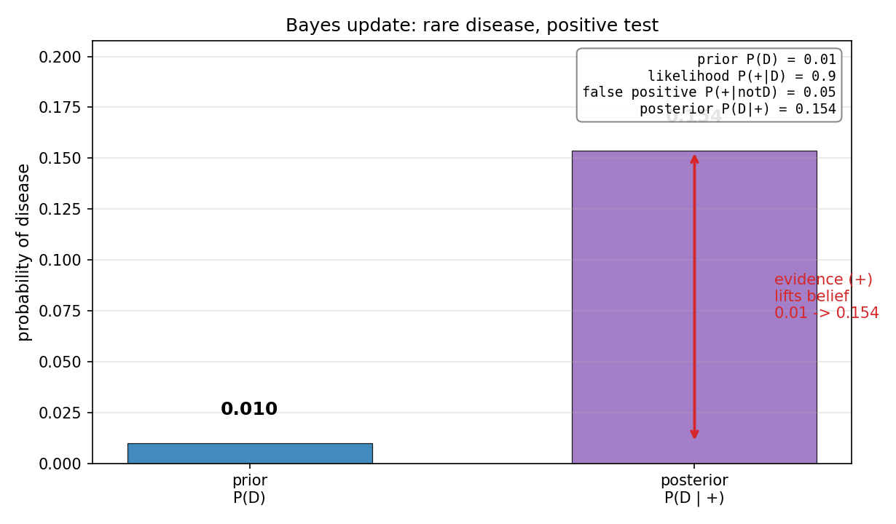
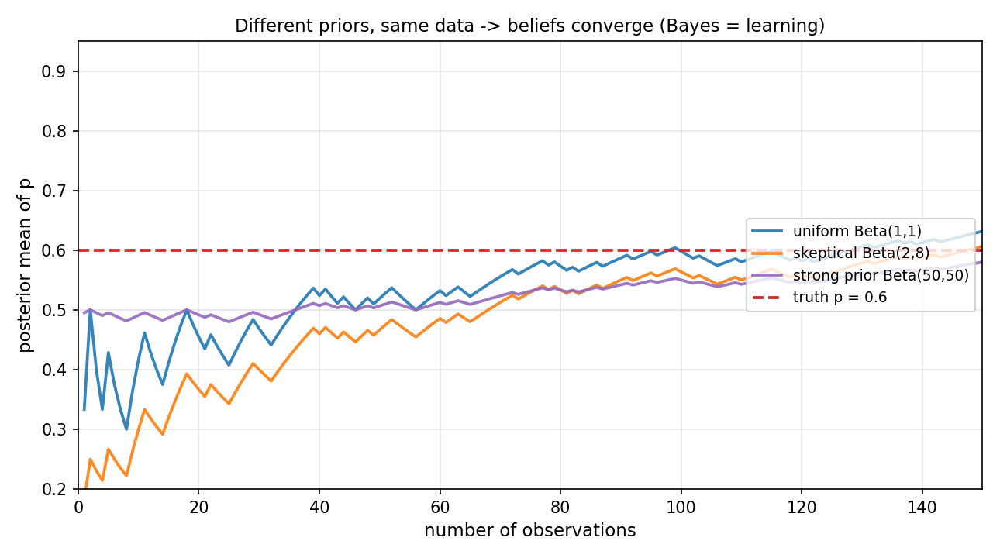

# 第 4 章 · 贝叶斯思想:用证据更新信念

> **核心问题**:上一章你学会了"已知原因算结果"——已知第一次摸走红球,第二次红球的概率怎么变。可生活里几乎全是**反过来**的问题:**你手里只有结果(症状 / 数据 / 阳性报告),却要反推原因(有没有病 / 是不是垃圾邮件 / 模型参数是多少)**。"体检阳性了,我到底有没有得那种罕见病?"——你心里发慌,可你算出来的概率,**经常和你直觉以为的差出一个数量级**。这一章讲清三件事:贝叶斯公式怎么把"已知结果反推原因"变成一个可算的算式(它不过是上一章条件概率 + 全概率的合体);为什么人的直觉在这件事上**系统性犯错**(基础率忽视);以及为什么贝叶斯思想是"**学习**"这件事的数学化身——不同先验的人,拿到同样的证据,信念会逐步趋近。
>
> **读完本章你会明白**:
> - 贝叶斯公式的直觉是一句话:**后验 = 先验 × 似然**——拿到证据后,新的信念 = 原来的信念 × 这个证据有多支持你。它不是新东西,是上一章条件概率 `P(A|B)` 与全概率公式的合体。
> - 为什么体检阳性了,真得罕见病的概率仍然可能只有 **15%**(不是你直觉以为的 90%):罕见病的"基础率 / 先验"压倒了"似然"——你的直觉错在只盯着证据,忘了"原来有多可能"。
> - 为什么贝叶斯是"**学习**"的本质:不同的人(不同先验),只要按同一套规则用证据更新,信念就会**趋近同一个值**——这是第 1 章讲过的"主观派"被很多人质疑的罩门("两个人概率不一样,那还叫概率吗?")的正式回应。
> - 贝叶斯派与频率派的**哲学之分**:一个把概率当"信念",一个把概率当"客观频率"。这事吵了两百年,本书第 17 章正式对比,这里你先尝一口。

> **如果一读觉得太难**:先只记住三件事——① 后验 = 先验 × 似然(拿到证据,把原来的信念按"证据支持度"放大或缩小);② 体检阳性不等于真得病,要先看这种病**有多罕见**(基础率);③ 贝叶斯 = 用证据持续更新信念 = 学习的数学化身。把这三句钉死,本章就拿到了。

---

上一章末尾,我们留了这么一段话当钩子:

> 有一种修正,**方向是反的**:你不是"已知原因算结果",而是**"已知结果(症状 / 数据),反推原因(病因 / 参数)"**。"已知是垃圾邮件,里面有'免费'的概率"(好算)反过来,变成"已知里面有'免费',是垃圾邮件的概率"(难算,但才是你真正想知道的)——这个反向求解,就是**贝叶斯公式**。

这一章,我们就把这只"反向求解"的动物彻底拆开。你会发现,它没有半点新东西——它只是把上一章的两件工具(条件概率 + 全概率公式)**焊在一起**,却变成了整个机器学习、人工智能、统计推断的地基。

---

## 章首·一句话点破

如果用一句话概括这一章,那就是:

> **贝叶斯公式 = 用证据更新信念;后验 = 先验 × 似然。它不是新公式,是上一章条件概率 + 全概率的合体;但它把"修正一次概率"升级成"可以反复迭代的'学习'算式",是驯服随机性里"用证据持续学习"这一步的全部内容。**

这句话是结论,不是理由。本章倒过来拆:先看"为什么反推这么难、直觉为什么错"(第一节,基础率忽视),再把贝叶斯公式从上一章的两件工具里推出来(第二节),然后用它看清"信念如何被证据反复更新"(第三节,贝叶斯 = 学习),最后尝一口它和频率派的哲学之争(彩蛋)。

---

## 一、反推为什么难:基础率忽视(你直觉错在哪)

### 提出问题

先做一个题。不要急着算,**先用直觉答**:

> **小例子 · 体检假阳性**:某种罕见病,人群发病率 **1%**。体检很准:
> - 真有病的人,**90%** 会查出阳性(`P(+|病) = 0.90`,这叫**灵敏度 sensitivity**)。
> - 没病的人,也有 **5%** 会被误报成阳性(`P(+|无病) = 0.05`,这叫**假阳性率 false positive rate**)。
>
> 现在**你体检阳性了**。问你:**你真的得了这种病的概率是多少?**

绝大多数人(包括不少医生,这是哈佛医学院反复做过的研究)会答 **85%、90%** 左右——他们的直觉是:"检查这么准,90% 嘛,那阳性了就有九成把握真得病。"

**错。正确答案大约是 15%。** 不是 90%,是 15%。差了将近六倍。

你的直觉为什么错得这么离谱?错在你**只盯着证据(阳性),忘了"原来有多可能得病"(基础率 1%)**。这一节,我们就把"为什么是 15%"算清楚,顺便点破人类直觉在这件事上**系统性**的毛病——它有个名字,叫**基础率忽视(base rate neglect)**。

### 不这样会怎样:为什么"检查准"不等于"阳性就准"

> **不这样看会怎样**:你只记住了"灵敏度 90%",觉得"阳性≈九成得病"。但你漏算了两件事:
>
> 1. **这种病很罕见**(发病率 1%)——绝大多数(99%)体检的人**根本没病**。
> 2. **没病的人也会被误报**(假阳性率 5%)——而这群"没病的人"基数太大,即便只有 5% 误报,**误报的人数也远超真病人的人数**。

我们用上一章的**全概率公式**把这件事算明白。把"有病 D"和"无病"作为划分(互斥且并起来是全集),"阳性"这个事件来自两个来源:真病人查出阳性,和健康人被误报阳性。**阳性的总概率**(不管有没有病),按全概率公式拆开:

```
   P(+) = P(+|病)·P(病) + P(+|无病)·P(无病)
        = 0.90 × 0.01  +  0.05 × 0.99
        = 0.009        +  0.0495
        = 0.0585
```

你看,**1000 个人里**,真病人查出阳性的有 `0.009 × 1000 = 9` 个,而**健康人被误报阳性的有 `0.0495 × 1000 ≈ 49.5` 个**——误报的健康人是真病人的 **5 倍多**。阳性这个信号,被"健康人的汪洋大海"稀释了。

所以你拿到阳性,你真正想知道的是 `P(病 | +)`——**在所有阳性的人里,真有病的占多少**?这就是上一章的**条件概率**:

```
   P(病 | +) = P(病 ∩ +) / P(+)
             = P(+|病)·P(病) / P(+)
             = 0.009 / 0.0585
             ≈ 0.154
```

**约 15.4%**。不是 90%,是 15.4%。每 100 个拿到阳性报告的人里,只有大约 15 个真有病,**其余 85 个都是被误报的健康人**。下图把这次更新画了出来:左边那根蓝柱是你的**先验**(患病 1%),右边那根紫柱是拿到阳性证据后的**后验**(约 15.4%)——证据确实把你的信念从 1% 抬到了 15%,抬了 15 倍,但离"九成得病"还差得远。



> **钉死这件事 · 基础率忽视**:**罕见病的"基础率"(发病率)极低,这个低先验会压倒"似然"(检查灵敏度)。** 你的直觉错在只看了"似然"(阳性在病人里多常见),忘了乘上"先验"(病人在人群里多罕见),更忘了除以"阳性的总概率"(健康人也会阳性)。**贝叶斯公式,就是逼你把这三件事一件不漏地乘除清楚。**

### 所以这样看:人为什么爱犯这个错

这不是你一个人粗心——**这是人类大脑出厂设置的 bug**。心理学里专门有个名字:**基础率忽视(base rate neglect)**,Kahneman 和 Tversky 在 1970 年代反复验证过。人特别容易被**鲜活的、具体的证据**(一张阳性报告)抓住,而**忽略抽象的、统计的背景**(这种病有多罕见)。

更扎心的是,这个 bug 在**程序员**身上尤其常见——因为我们天天处理"证据"(日志、报错、测试结果),很容易把"测试失败了"直接当成"代码有 bug",却忘了想"这种 bug 在我们代码库里**原本有多常见**"(基础率)。下次你看到一个报警,先别急着改代码,先问一句:**这个报警的假阳性率多少?这种故障原本有多罕见?**——这就是贝叶斯思想在工程里的日常用法。

> **不这样看会怎样(反面教材)**:把"灵敏度 90%"当"阳性后得病概率 90%",会导致灾难性的医疗决策——病人被吓得睡不着觉、做一堆不必要的创伤性检查,而其实 85% 的概率他根本没病。**这是为什么所有体检报告都该标"阳性预测值 PPV = P(病|+)",而不是只标灵敏度。** PPV 才是病人真正关心的数,而 PPV 必须用贝叶斯算。

---

## 二、贝叶斯公式:把条件概率 + 全概率焊在一起

### 提出问题

上一节我们已经把 `P(病|+)` 算出来了,用的全是上一章的工具:条件概率的定义 + 全概率公式。这一节我们把这个过程**提炼成一条公式**,起个名字,然后你会发现它简单得惊人。

把上一节的算法抽象一下。我们关心的是 `P(A|B)`——"已知 B 发生,A 的概率"。但很多时候,**`P(A|B)` 不好直接算,反而 `P(B|A)` 好算**。体检就是典型:`P(+|病)`(灵敏度,实验室测得出来)好算,`P(病|+)`(阳性后真得病,病人关心的)难算。怎么从前者反推后者?

> **直觉 · 贝叶斯公式(Bayes' theorem)**:把条件概率的定义 `P(A|B) = P(A∩B)/P(B)` 和它的"镜像"`P(B|A) = P(A∩B)/P(A)` 联立,消掉 `P(A∩B)`,再用全概率公式把分母 `P(B)` 展开,就得到:
>
> ```
>    P(A | B) = P(B | A) · P(A) / P(B)
> ```
>
> 读法:**"已知 B 后 A 的概率" = "已知 A 后 B 的概率" × "A 原本的概率",再除以"B 的总概率"**。

它没有引入任何新东西。分子 `P(B|A)·P(A)` 是乘法公式 `P(A∩B) = P(A)·P(B|A)` 换个写法;分母 `P(B)` 用全概率公式展开成 `Σ P(B|Aᵢ)·P(Aᵢ)`(把 A 的各种可能取值作为划分)。**贝叶斯公式 = 条件概率 + 乘法公式 + 全概率公式,三件上一章的工具,焊成了一条。**

### 不这样会怎样:从"原因"反推"原因的来源"

> **不这样看会怎样**:没有贝叶斯公式,你处理不了"手里有结果、要反推原因"的问题——而这恰恰是生活和工作里**最常见**的一类问题。

回到第 3 章那个工厂的例子(全概率公式那节),我们换个问法:**你从总仓库随机抽一个零件,发现是次品。问:它来自产线 3 的概率是多少?**

这是典型的反推。已知信息:

- 三条产线占比:`P(线1)=0.5, P(线2)=0.3, P(线3)=0.2`(这是**先验**,没看到次品之前,各线"原本有多可能"是零件来源)。
- 各线次品率:`P(次品|线1)=0.02, P(次品|线2)=0.04, P(次品|线3)=0.05`(这是**似然**,在每条线下,观测到"次品"这个证据的概率)。
- 第 3 章算过:`P(次品) = 0.032`(全概率,这是**证据的总概率**)。

现在用贝叶斯公式反推"它来自线 3":

```
   P(线3 | 次品) = P(次品|线3) · P(线3) / P(次品)
                 = 0.05 × 0.20 / 0.032
                 = 0.010 / 0.032
                 ≈ 0.3125
```

**约 31.25%**。你顺手可以三条线全算一遍:

```
   P(线1 | 次品) = 0.02 × 0.5 / 0.032 = 0.3125
   P(线2 | 次品) = 0.04 × 0.3 / 0.032 = 0.375
   P(线3 | 次品) = 0.05 × 0.2 / 0.032 = 0.3125
```

三个加起来正好是 1(因为一个次品一定来自三条线之一)。**有意思的是**:产线 3 虽然产得少(占比 20%),但次品率高(5%);产线 1 产得多(50%)但次品率低(2%)——拿到一个次品,它来自产线 2 的概率最大(37.5%),而不是来自产得最多的产线 1,也不是来自次品率最高的产线 3。**贝叶斯公式同时考虑了"原本有多可能"(先验)和"这条线下证据多支持"(似然),给出一个平衡的判断。** 这就是"反推原因来源"的标准操作,医疗诊断、故障定位、垃圾邮件分类,全是这套。

### 所以这样看:贝叶斯的灵魂——后验 = 先验 × 似然

把贝叶斯公式 `P(A|B) = P(B|A)·P(A)/P(B)` 重新组织一下,你会看见它最深刻的一副面孔:

> **后验 ∝ 先验 × 似然**
>
> ```
>    P(A | B) ∝ P(A) · P(B | A)
>      后验     先验     似然
> ```
>
> (符号 ∝ 表示"成正比";分母 P(B) 只是个归一化常数,保证后验加起来等于 1。)

这副面孔是贝叶斯思想的灵魂,记住它:

- **先验 P(A)**:没看到证据之前,你对 A 的信念。"得病概率 1%""这邮件是垃圾的概率 20%"——你**原有的**判断。
- **似然 P(B|A)**:如果 A 是真的,看到证据 B 有多合理。"真有病的人 90% 会阳性""真是垃圾邮件的话,里面出现'免费'的概率很高"——证据**对 A 的支持度**。
- **后验 P(A|B)**:看到证据之后,你对 A 的**新**信念。先验被似然"放大"或"缩小"后的结果。

**一句话:拿到证据,把原来的信念,按"证据有多支持你"放大或缩小——这就是贝叶斯。** 这句话,是整个机器学习、统计推断、人工智能的地基。第 17 章贝叶斯推断,会把"参数"当 A、"数据"当 B,用这条公式持续更新参数的分布;第 19 章逻辑回归,本质也是"用数据更新模型对类别的信念";第 20 章朴素贝叶斯分类器,更是这条公式的直接应用。

> **钉死这件事 · 贝叶斯的灵魂**:**后验 = 先验 × 似然。** 你不需要背 `P(A|B) = P(B|A)P(A)/P(B)` 这条长长的公式,你只需要记住:**新信念 = 原信念 × 证据支持度**。先验管"原来有多相信",似然管"这个证据多支持你",乘起来(归一化)就是更新后的信念。**整个贝叶斯学派的世界观,浓缩在这三个词里:先验、似然、后验。**

---

## 三、贝叶斯 = 学习的本质(本章最深,也最重要)

### 提出问题

到这里你可能觉得,贝叶斯公式就是个"反推概率"的工具,算算体检、算算次品来源,完了。**不是。** 这一节我们要把贝叶斯公式升级一个维度——它会变成**"学习"这件事的数学化身**。这一节是本章的灵魂,也是它配得上"重点章"的原因。

回到第 1 章埋下的一个钩子。当时讲"主观派(贝叶斯)"概率,提到它的罩门:

> "主观?两个人对同一件事,可以给不同概率?那概率岂不是因人而异?"

当时我们留了半句话:"贝叶斯派会说,这恰恰是学习的本质……拿到同样的证据后,他们按同一套规则更新,信念会逐步趋近。"——这半句话,我们现在正式兑现。

### 不这样会怎样:两个人信念不同,谁对?

想象三个程序员,对一个有偏硬币(不知道正面概率 `p` 是多少,但**真实** `p=0.6`)发表看法:

- **A**:一无所知,认为 `p` 在 0 到 1 之间**均匀分布**(啥都可能)。先验是均匀的 `Beta(1,1)`,均值 0.5。
- **B**:是个怀疑论,觉得"硬币大概率是均匀或偏反",先验偏小,`Beta(2,8)`,均值 0.2。
- **C**:之前玩过很多硬币,强信念认为硬币都比较公平,先验很尖,`Beta(50,50)`,均值 0.5。

三个人先验完全不同——A 觉得 0.5、B 觉得 0.2、C 死咬 0.5。**谁是"对的"?贝叶斯学派会说:先验没有对错,它是你出发前带的行李;真正决定你最后到哪的,是你走多少路(看多少数据),以及你用什么方法走(贝叶斯更新)。**

现在三个人开始**扔同一枚硬币**,每扔一次(每次观测),各自用贝叶斯公式更新自己对 `p` 的后验(把 `p` 当 A,把"这次是正面 / 反面"当证据 B;连续扔、连续更新)。下图(图 4.2)就是这件事的轨迹:横轴是观测次数(0 到 150 次),纵轴是三个人各自后验的均值,红色虚线是真实 `p=0.6`。



看图:**一开始三条线各奔东西**(A 从 0.5 起、B 从 0.2 起、C 从 0.5 起),B 因为先验偏低,前 20 次还在低位徘徊,C 因为先验太强(相当于"已经看过 100 次"),前 50 次都纹丝不动。**但随着数据越积越多,三条线全部被拉向同一个数:0.6(真实值)。** 到 150 次观测时,A 约 0.60,B 约 0.59,C 约 0.58——三个人从完全不同的起点出发,**被同样的证据拉到了同一个地方**。

> **钉死这件事 · 贝叶斯 = 学习的本质**:**不同的人有不同的先验(出发点不同),但只要他们都老老实实用贝叶斯公式更新,证据会逐步把他们拉到同一个后验——真相。** 先验的差异,会被足够多的数据"洗掉"。**这就是"学习"的数学定义:用证据,把不确定的信念,逐步收敛到真相。** 这件事,叫做**先验被数据淹没(prior is washed out by data)**。

### 所以这样看:为什么这件事重要

这件"信念会趋同"的事,解决了主观派最被质疑的罩门——"两个人概率不一样,那还叫概率吗?":

> **贝叶斯派的回答**:概率确实因人而异(先验不同),但这只是**暂时的**。只要两个人都愿意用证据更新自己(贝叶斯),**足够多的数据之后,他们的信念会趋于一致**。所以"因人而异"不是概率的缺陷,而是**学习过程的起点**——它承认"我们出发时知道的不一样",但承诺"我们会在真相前会合"。

这是**机器学习的根本信念**:不管你模型初始化成什么样(先验),只要你用数据(证据)按正确的方法(贝叶斯 / 极大似然 / 梯度下降)更新,最终都会收敛到**能解释数据的那个参数**(真相)。**训练模型,本质就是贝叶斯更新的一种计算化**——你给模型一堆数据,它从一个随机初始化(先验)出发,一步步把参数推向能解释数据的值(后验)。第 17 章贝叶斯推断、第 19 章逻辑回归,全是这个套路。

> **再深一点 · 先验什么时候重要**:你可能会问:"既然数据多了先验会被淹没,那先验还重要吗?" **重要——在数据少的时候。** 看图 4.2 的前 30 次:A、B、C 三条线差得最远,这时候**先验主导**判断。医疗诊断(每个病人数据极少)、罕见事件预测、冷启动推荐(新用户没历史),全是"数据少、先验重要"的场景——这时候一个好的先验(领域知识、历史经验)能救命。**数据多,先验被淹没;数据少,先验定生死。** 这是贝叶斯实践里最重要的权衡,也是为什么"如何选先验"本身是一门学问(第 17 章会讲无信息先验、共轭先验)。

---

## 四、模拟佐证:用 Python,把贝叶斯跑出来

概率论最痛快的地方——**它的结论你不用信书,自己扔随机数就能验证**。这一节,我们用两段代码,把本章的核心(体检假阳性的后验、不同先验的收敛)跑一遍。

### 1. 体检假阳性:十万次虚拟体检,数"阳性里真病人的占比"

理论:`P(病|+) = 0.90×0.01 / (0.90×0.01 + 0.05×0.99) ≈ 0.1538`。

```python
import numpy as np
rng = np.random.default_rng(42)
N = 1_000_000                      # 一百万次虚拟体检
prev, sens, fp = 0.01, 0.90, 0.05
diseased = rng.random(N) < prev                # 谁真有病(1%)
positive = np.where(diseased,
                    rng.random(N) < sens,      # 真病人: 90% 阳性
                    rng.random(N) < fp)        # 健康人: 5% 误报
print(diseased[positive].mean())               # -> 约 0.1533 (理论 0.1538)
```

跑出来约 **0.1533**,几乎就是理论的 0.1538。**这就是图 4.1 右边那根紫柱的来历——一百万次虚拟体检,阳性报告里真病人的占比,忠实地复现了贝叶斯公式的预测。** 你可以改改发病率(把 prev 改成 0.001,看后验掉到多低)、改改假阳性率,亲手感受"基础率"和"似然"怎么此消彼长——这是理解基础率忽视最直接的肌肉记忆。

### 2. 不同先验收敛:三个人扔同一枚硬币,后验均值逐步趋近 0.6

理论:三个人先验不同(`Beta(1,1)`、`Beta(2,8)`、`Beta(50,50)`),每观测一次正面就让后验的 `a+=1`,反面就 `b+=1`,均值 `a/(a+b)`。数据多了三个人趋近真实 `p=0.6`。

```python
rng = np.random.default_rng(42)
true_p = 0.6
flips = rng.random(150) < true_p          # 150 次观测
priors = {"uniform Beta(1,1)": (1, 1),
          "skeptical Beta(2,8)": (2, 8),
          "strong Beta(50,50)": (50, 50)}
for name, (a, b) in priors.items():
    aa, bb = a, b
    for obs in flips:
        if obs: aa += 1
        else:   bb += 1
    print(f"{name}: 先验均值 {a/(a+b):.3f} -> 150 次后后验均值 {aa/(aa+bb):.3f}")
# -> uniform:        0.500 -> 0.632
# -> skeptical:      0.200 -> 0.606
# -> strong:         0.500 -> 0.580   (强先验收敛慢, 但也在逼近 0.6)
```

跑出来三个人最后都在 **0.58~0.63** 之间,全部被拉向真实值 0.6。**这就是图 4.2 的来历——三条线从不同起点出发,被同样的数据拉到了同一个地方。** 强先验(C)收敛最慢(因为它相当于"已经看过 100 次数据",150 次新数据还不足以完全推翻它),但它也在**逼近** 0.6。**这就是"先验被数据淹没"的可视化——贝叶斯 = 学习。**

> 这两段代码,你十分钟就能跑完。跑完你会发现:**贝叶斯公式不是天上掉下来的玄学,它就是你扔随机数时,频率自动长出来的规律**——阳性里真病人的占比,忠实地等于贝叶斯算出来的后验;不同先验的人,被同样的数据拉到同一个地方。这就是"公式是直觉的副产品"在本章的兑现。

---

## 五、彩蛋(本章最深):贝叶斯 vs 频率派,一场两百年的哲学之争

这一节,我们兑现"越深越好"的承诺,讲清一个你可能从没意识到的事——**贝叶斯公式不只是一条算式,它背后是一整套世界观,而且这套世界观和"正统统计"的世界观,吵了两百年还没吵完。**

### 两派对"概率"的根本分歧

还记得第 1 章讲过的概率三派吗?其中两派——**频率派**和**主观派(贝叶斯)**——对"概率到底是什么"有根本分歧:

- **频率派(正统统计)**:概率是**客观的、长期重复的频率**。"这枚硬币正面概率 0.5"的意思是"扔无数次,正面比例趋近 0.5"。概率是**世界固有的属性**,和人怎么看无关。参数(比如硬币的 `p`)是**固定的、确定的未知数**,不是随机变量——你只是不知道它,但它有个确定的值。
- **贝叶斯派**:概率是**你对某件事的信念程度**。概率**不是世界固有的,而是观察者的认知状态**。参数(比如硬币的 `p`)本身就可以是**随机变量**——你对它有一个先验分布,用数据更新成后验分布。两个人先验不同,对同一个参数的概率判断可以不同。

这两派对**同一批数据**,会用**完全不同的方法**做推断:

| 问题 | 频率派怎么做 | 贝叶斯派怎么做 |
|------|--------------|----------------|
| 估计硬币的 `p` | **极大似然估计(MLE)**:找让数据出现概率最大的 `p`(第 15 章)。`p` 是个固定值,给一个点估计。 | **贝叶斯推断**:给 `p` 一个先验,用数据更新成后验分布(第 17 章)。`p` 是个分布,给一个完整的信念。 |
| 表达不确定性 | **置信区间**:重复实验很多次,有 95% 的区间会覆盖真值。注意——**真值是固定的,区间是随机的**。 | **可信区间**:给定这批数据,`p` 有 95% 的概率落在这个区间里。注意——**区间是固定的,参数是随机的**。 |
| 检验假设 | **p 值**:在零假设下,数据有多极端(第 16 章)。 | **后验 odds**:给定数据,两个假设哪个更可能。 |
| 处理一次性事件 | **做不到**——频率派要求"可重复",一次性事件(明天会不会地震)没法谈频率。 | **天然适用**——贝叶斯派把任何不确定的事都能赋予一个信念。 |

### 谁对?(剧透:都对,各管一摊)

吵了两百年,现在的共识是:**两派都对,只是建模哲学不同,各管一摊**:

- **数据多、可重复、要客观** → 频率派(MLE、p 值、置信区间)。这是 20 世纪正统统计的主流,也是大多数统计软件的默认。
- **数据少、要融入先验知识、要处理一次性事件** → 贝叶斯派。这是近 30 年机器学习、人工智能崛起后,重新火起来的方向——因为 ML 里几乎全是"用数据更新模型信念",贝叶斯天然契合。

> **钉死这件事 · 两派的真正分歧**:**不在数学(贝叶斯公式两派都认),而在"参数是不是随机变量"。** 频率派说"参数是固定的未知数,我用数据估计它";贝叶斯派说"参数是随机变量,我用数据更新对它的分布"。这个哲学分歧,导致两派对"置信区间"和"可信区间"的**解释完全不同**(虽然数值常常很接近)——频率派的 95% 置信区间说的是"重复实验的覆盖频率",贝叶斯的 95% 可信区间说的是"给定这批数据,参数落在这里的概率"。**前者是关于方法的保证,后者是关于参数的信念**——这两个解释不可互换,是初学者最常踩的坑。第 17 章我们会正式把两派摆在一起对比,这里你先尝一口。

> **再深一点 · 贝叶斯为什么"重新"火起来**:贝叶斯思想其实在 18 世纪(Thomas Bayes, 拉普拉斯)就有了,20 世纪被频率派压下去,因为**算不动**——后验分布的归一化常数(分母 P(B))在高维参数空间里是个噩梦般的积分。直到 1990 年代 **MCMC(马尔可夫链蒙特卡洛)** 算法成熟,贝叶斯方法才从"理论漂亮、算不动"变成"能实战"。今天深度学习里的**贝叶斯神经网络**(给权重加先验、量化预测不确定性)、**变分推断**,全是这套思想的现代延续。**你今天学的 `P(A|B) = P(B|A)P(A)/P(B)`,是整个 AI 不确定性建模的根。**

---

## 章末小结

### 用一个场景回顾本章

想象你收到一份体检报告,上面写着"阳性"。你心里咯噔一下——

**第一节**:你别急着慌。先问三个数——这种病**有多罕见**(基础率 / 先验 1%)、检查的**灵敏度**(真病人阳性率 90%)、**假阳性率**(健康人误报率 5%)。然后用贝叶斯公式一算,**真得病的概率只有 15%**——不是你直觉以为的 90%。**你的直觉错在只盯着证据,忘了基础率。** 这就是基础率忽视,人类出厂设置的 bug,贝叶斯公式逼你把它乘除清楚。

**第二节**:贝叶斯公式不是新东西,它是上一章条件概率 + 全概率的合体。它的灵魂是三个词——**后验 = 先验 × 似然**。拿到证据,把原来的信念按"证据支持度"放大或缩小,就是全部。医疗诊断、垃圾邮件过滤、次品溯源,全是这套。

**第三节**:但贝叶斯不止是"算一次"。把"拿到证据、更新信念"这件事**反复迭代**,它就变成了**学习**。三个先验完全不同的人(A 觉得 0.5、B 觉得 0.2、C 死咬 0.5),扔同一枚硬币 150 次,**全部被数据拉到真实值 0.6 附近**。先验的差异被数据淹没——**这就是"学习"的数学定义:用证据,把信念收敛到真相。** 这回答了第 1 章主观派的罩门("两人概率不同,那还叫概率吗?"):不同只是暂时的,真相前会会合。

**彩蛋**:贝叶斯背后是一整套世界观——概率是**信念**,参数是**随机变量**,这和频率派(概率是**频率**,参数是**固定值**)吵了两百年。两派都对,各管一摊:数据多用频率派,数据少要融入先验用贝叶斯。现代机器学习,几乎全是贝叶斯的天下。

### 本章在全书主线中的位置

记住本书的主线:**一切概率概念,都是"驯服随机性"的工具。**

这一章,我们完成了**第 1 篇(概率的语言)的收官**。从第 2 章(概率空间,把所有可能铺成地图)到第 3 章(条件概率,有了证据缩小地图、重新标份额),再到这一章(贝叶斯,把"修正一次"升级成"持续学习的算式")——**驯服随机性的"用证据学习"这一步,地基打完了。** 贝叶斯把"概率"从一个静态的数,变成了一个**会随证据生长的认知**——这是从"会算"到"真懂"最关键的一跃。

- 下一篇(第 2 篇·随机变量)会把"结果"变成可计算的数字,引入期望、方差——但**贝叶斯思想会贯穿后半本**:第 15 章 MLE(频率派的反推)、第 16 章假设检验、第 17 章贝叶斯推断(把参数当随机变量,用数据持续更新)、第 20 章朴素贝叶斯分类器,全是这一章的延伸。
- **驯服随机性的旅程,在"用证据持续学习"这一步上,立起了最关键的支柱。** 后面所有"用数据反推世界""用概率做机器学习"的工具,都长在这根支柱上。

### 五个"为什么"清单

如果你只能记五件事,记这五件:

1. **贝叶斯公式的灵魂**:**后验 = 先验 × 似然**(`P(A|B) = P(B|A)·P(A)/P(B)`)。拿到证据,把原来的信念按"证据支持度"放大或缩小。它不是新公式,是上一章条件概率 + 全概率的合体。
2. **基础率忽视**:体检阳性不等于真得病——**罕见病的低先验会压倒检查的灵敏度**。P(病|+)≈15%,不是 90%。你的直觉错在只盯着证据,忘了乘上先验、除以证据总概率。
3. **贝叶斯 = 学习的本质**:不同先验的人,按贝叶斯用同样的数据更新,信念会**趋近同一个真相**(先验被数据淹没)。这解决了"两人概率不同"的质疑——不同只是暂时的,真相前会会合。
4. **数据少,先验重要;数据多,先验被淹没**。医疗诊断、冷启动推荐、罕见事件,全是"先验定生死"的场景。这也是为什么"如何选先验"是一门学问。
5. **贝叶斯派 vs 频率派**:根本分歧在"参数是不是随机变量"——贝叶斯说"是,我用数据更新它的分布";频率派说"不是,它是固定未知数,我估计它"。两派都对,数据多用频率派,数据少要融入先验用贝叶斯。现代 ML 偏贝叶斯。

### 想继续深入,该往哪钻

- **亲手扔**:把本章两段 Python(体检假阳性、不同先验收敛)全跑一遍。**强烈推荐**:改发病率 `prev`(试 0.001,看后验掉到多低——这就是为什么癌症筛查对低风险人群的"假阳性灾难"那么严重);改先验(试 `Beta(100,100)`,看它收敛得多慢);改真实 `p`(试 0.5,看三个人都收敛到 0.5)。**改一晚上,你对贝叶斯的直觉会脱胎换骨。**
- **玩一个经典题**:**蒙提霍尔问题(Monty Hall)**——三扇门后一辆车两只羊,你选一扇,主持人(知道车在哪)打开另一扇有羊的门,问你要不要换。用贝叶斯算一下,换门赢车的概率是 **2/3**,不换是 1/3。写个模拟验证(上一章末尾推荐过,这里用贝叶斯视角再想一遍:主持人的"开门"行为是一条**证据**,它把后验从均匀的 1/3 更新成了 2/3)。**这是贝叶斯思想最经典的反直觉题。**
- **看可视化**:Brown 大学的 **Seeing Theory**(seeing-theory.brown.edu)有"贝叶斯推断"的交互模块,能拖动先验、看后验怎么变。3Blue1Brown 有一期讲贝叶斯(关于新冠检测假阳性)的视频,把基础率忽视讲得极透。
- **钻共轭先验(可选,硬核)**:为什么上面用 `Beta` 分布当硬币 `p` 的先验?因为 `Beta` 是伯努利/二项分布的**共轭先验(conjugate prior)**——先验和后验是同一种分布,只是参数变了,算起来特别方便。这是贝叶斯推断的工程基石,第 17 章会正式讲。想先尝,可以查"conjugate prior table"(高斯-高斯、Beta-伯努利、Dirichlet-多项式,几对经典组合)。

---

> 第 1 篇收官了。你已经学会了概率论的**语言**:概率(把"可能"量化成 0 到 1)、条件概率(有了证据缩小地图、重新标份额)、贝叶斯(用证据持续更新信念 = 学习)。**但到目前为止,我们谈的都是"事件"——摸到红球、得病、阳性、垃圾邮件——这些"事件"还没变成能加减乘除的数字。** 想算"平均""方差""分布",想机器学习里的"特征",你得把"结果"变成"数"。翻开 **第 5 章 · 随机变量与分布**——你会发现,所谓随机变量,不过是**给每个随机结果贴一个数字标签**;而分布,就是**这些数字的长相**。一旦把结果变成数,期望、方差、大数定律、中心极限,全都会从这些数里长出来——驯服随机性的旅程,进入了"量化"的新篇章。
