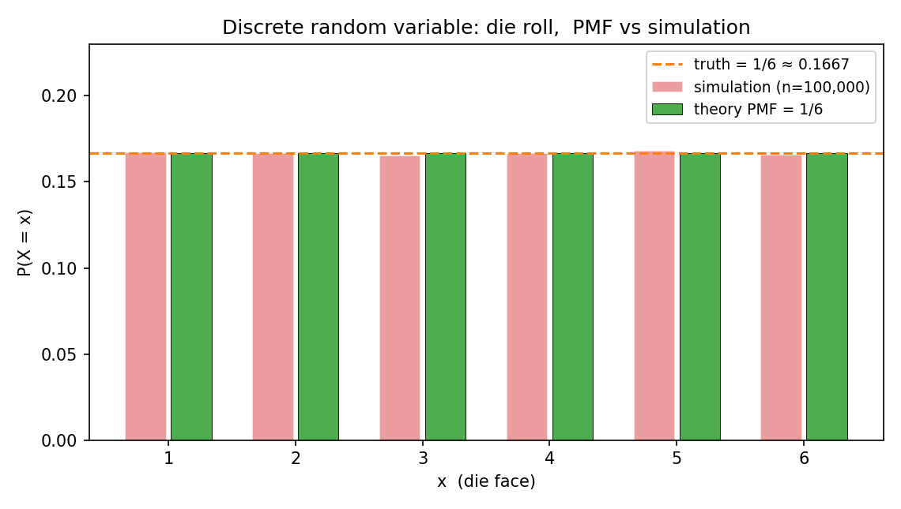
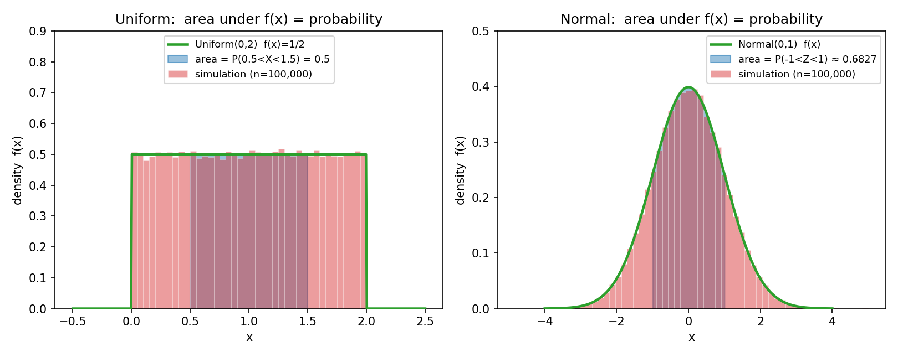
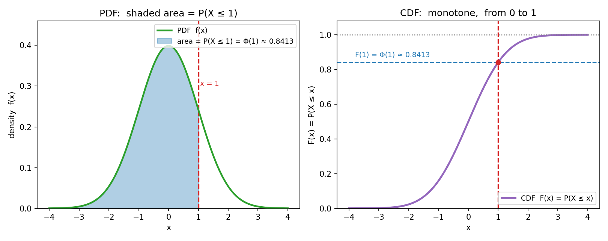

# 第 5 章 · 随机变量与分布

> **核心问题**:前面四章,我们学会了用概率、条件概率、贝叶斯去描述"事件"。可现实里的随机,往往不是一个抽象的"事件",而是一个**会变成数字的结果**——扔骰子掷出几点、抽到的产品重多少克、下一条请求延迟几毫秒、明天的气温几度。我们怎么把这种"随机结果"变成可以加减乘除、可以画图、可以算平均的**数字**?又怎么描述这个数字"取各个值的规律"?
>
> 这一章,是全书第 2 篇的开端,也是"把随机结果变成数字"的第一步。我们要立三件工具——**随机变量、PMF/PDF、CDF**——它们是你后面所有章节(期望、方差、大数定律、中心极限、MLE)的计算地基。
>
> **读完本章你会明白**:
> - 什么是**随机变量**:它不是"变量",而是"把每个随机结果贴上一个数字"的那张**贴标签的规则**。
> - 离散型怎么描述取值规律:用 **PMF**(概率质量函数),一根根柱子告诉你"取到每个值的概率"。
> - 连续型怎么描述取值规律:用 **PDF**(概率密度函数)和 **CDF**(累积分布函数),而且要接受一个反直觉的事实——**连续随机变量取任一确定值的概率等于 0,只有区间才有概率**。
> - 为什么"PDF 曲线下的面积 = 概率",以及这件事背后藏着的统一:离散求和与连续积分,在测度论里是同一件事。

---

## 章首·一句话点破

如果用一句话概括本章,那就是:

> **随机变量,是把每个随机结果翻译成一个数字的"翻译规则";PMF 和 PDF,分别描述这个数字在离散和连续情形下"取各个值的规律";而 PDF 曲线下的面积,才是概率。**

这句话是**结论**,不是**理由**。这一章要倒过来拆:先问"为什么非得把结果变成数字",再问"变成数字后怎么描述它的规律",最后撞上连续型那个最反直觉的坑——**一个数,概率怎么可能是 0?**

> **如果一读觉得太难**:先只记住三件事——① 随机变量 = "给结果贴数字"的规则;② 离散用 PMF(柱子高度=概率),连续用 PDF(曲线下面积=概率);③ 连续型取单点的概率是 0,但区间有概率。这三件,够你读懂后面所有章节。

---

## 引子:从"事件"到"数字"

第 1 篇我们花了三章,把概率的语言搭起来了:样本空间、事件、条件概率、贝叶斯。可你注意没有——从头到尾,我们谈论的对象都是**抽象的事件**:"正面朝上""抽到红球""病人真的有病"。

现实里的随机,几乎从来都自带一个**数字**:

- 扔一颗骰子,掷出的**点数**是 1 到 6 里的一个数。
- 抽一个人量身高,量出来的**厘米数**是 160 到 190 之间的某个数。
- 一个网站下一条请求的**延迟**,是几十到几百毫秒的某个数。
- 代码评审里下一个月发现的 **bug 数**,是 0、1、2……里的一个数。

这些数字有个共同特点:**事先不确定,落地是个数**。我们管这种"会变成数字的随机结果"叫**随机变量(random variable)**。它之所以重要,是因为一旦结果变成了数字,你就能对它做一切数字能做的事——加、减、乘、平均、画图、积分、跑机器学习模型。整本概率论从这一章开始,才真正"算"起来。

> **钉死衔接**:第 1 篇教我们"看见随机"(事件有没有发生),第 2 篇教我们"量化随机"(结果变成了多大的数)。本章是这条旅程的第一站。

---

## 一、随机变量:给每个结果贴个数字

### 提问:为什么非得"变成数字"?

先想一个最朴素的问题:我们已经能用概率描述事件了,为什么还要多此一举,把结果变成数字?

来看一个真实场景。你是一家共享单车公司的数据分析师。每天每辆车的状态是随机的:有人骑、没人骑、被骑去哪、骑了多久。你想回答的业务问题是:

- **平均每辆车每天被骑多少分钟?**(要算平均——得先有"分钟数"这个数字)
- **延迟超过 30 分钟还车的比例有多大?**(要数"超过 30"的——得先有数字才能比大小)
- **预测明天总骑行时长**(要把一堆随机时长**加起来**——数字才能相加)

如果你只停留在"事件"层面(车 A 被骑了 / 没被骑),你连"平均骑行时长"这五个字都说不出口。**必须先把每个随机结果翻译成一个数字,后面的所有计算才有了对象。** 这就是随机变量存在的根本理由。

> **直觉**:随机变量,就是一张"给结果贴数字"的规则表。扔骰子——规则是"看几点朝上,就贴几"。量身高——规则是"看尺子读数,就贴那个厘米数"。它的本质是一个**函数**:输入是"随机结果",输出是一个数。

### 不这样理解会怎样?

如果你把随机变量当成"一个取值不确定的字母 X",你会卡在三件事上:

1. **算不出平均**。期望 `E[X]`、方差 `Var(X)` 这些后面要算的东西,前提是 X 是个数字。如果 X 还是"正面/反面"这种非数字结果,你连"平均"的定义都给不出。
2. **画不出图**。后面所有分布图(本章的 PMF/PDF),横轴都是 X 的取值。没有数字,横轴往哪标?
3. **做不了运算**。两个随机变量相加(比如"身高 + 体重"的某种合成指标)、一个随机变量乘以 2,都要求它是数。

教材往往一上来就写 `X: Ω → R`,然后立刻跳到 PMF。这个箭头 `→` 到底在干嘛,从没人讲。它其实就是在说:**X 是个函数,吃一个随机结果,吐一个数**。

### 所以这样看

**随机变量(random variable, RV)** 的正式定义,就是把上面那段直觉写成一句话:

> **随机变量 X,是一个从样本空间 Ω 到实数 R 的函数:`X: Ω → R`。它把每个可能的结果 ω,贴上一个实数 X(ω)。**

注意三件事:

- **X 是函数,不是"一个数"**。它的"取值"是随机的,是因为"哪个 ω 会发生"是随机的;一旦 ω 落定了,X(ω) 就是个确定的数。
- **同一次实验,可以定义很多个随机变量**。扔两颗骰子,我可以定义 `X = 两颗点数之和`,也可以定义 `Y = 两颗点数之积`,还可以定义 `Z = 第一颗是不是 6(是=1,否=0)`。**贴数字的规则不同,就是不同的随机变量。**
- **随机变量分两大类**:取值能一个一个数清楚的(骰子点数、bug 数),叫**离散型(discrete)**;取值密密麻麻连成一片的(身高、延迟、温度),叫**连续型(continuous)**。这一区分不是凑出来的,它决定了你下面用 PMF 还是 PDF,是本章最关键的分叉。

> **钉死这件事**:随机变量 = 函数 `Ω → R` = 一套"给结果贴数字"的规则。它把抽象的随机结果,变成可以计算、画图、平均的数字。从这一章起,概率论的主角从"事件"换成了"随机变量"。

---

## 二、离散型:PMF——"取到每个值的概率"

### 提问:变成数字后,怎么描述它的规律?

随机变量 X 把结果变成了数字。可光知道"它是个数字"还不够,我得知道**这个数字取各个值的可能性有多大**。比如扔骰子,我知道 X 取 1 到 6,但它是每个值都 1/6,还是 4 特别多?描述这件事的工具,叫 **PMF**。

> **直觉**:**概率质量函数(probability mass function, PMF)** 告诉你:X 取每一个具体值的概率是多少。对骰子,PMF 就是六根一样高的柱子,每根 1/6;对一颗做了手脚的骰子(4 那面特别重),4 那根柱子就比别的高。

为什么叫"质量(mass)"而不直接叫"概率"?——这是和连续型的"密度(density)"对着叫的(见第四节彩蛋)。离散型的概率是"集中"在取值点上的,像一团一团的"质量";连续型的概率是"摊"在一条线上的,只能谈"密度"。记住这个对照,你后面就不会把 PMF 和 PDF 搞混。

### 不这样理解会怎样?

如果你不知道 PMF 这件工具,你想描述"扔一颗骰子,点数 X 的规律",只能说一大段话:

> "X 取 1 的概率是 1/6,取 2 的概率是 1/6,取 3 的概率是 1/6,取 4 的概率是 1/6,取 5 的概率是 1/6,取 6 的概率是 1/6。"

六个值还能这么说,可要是你描述"一个呼叫中心一小时内接到的电话数 X",X 可能取 0, 1, 2, …一直到一两百,你打算说两百多句话吗?PMF 把这件事压成一个**函数**:`p(x) = P(X = x)`,查哪个 x 给哪个概率,干净利落。

> **不这样(用 PMF)会怎样**:你会陷入"逐个值列陈述句"的泥潭,既没法画图(横轴一堆值,纵轴一堆孤立的概率,你得一根根画柱子),也没法做运算(后面算期望 `Σ x·p(x)`,没有 `p(x)` 这个函数你怎么求和?)。

### 所以这样看

设 X 是离散随机变量,它的 **PMF** 定义为:

```
   p(x) = P(X = x)
```

读作"X 等于 x 的概率"。它满足两条性质(对应第 1 章 Kolmogorov 公理里的非负和规范):

1. **非负**:`p(x) ≥ 0`,对任何 x。(概率不能是负的。)
2. **求和为 1**:`Σ p(x) = 1`,求和遍历 X 所有可能取值。(所有可能性加起来是 100%。)

第二条尤其重要——**所有柱子的高度加起来必须等于 1**。这是你检查一个 PMF 写得对不对的最快办法。你写了个 PMF,六根柱子加起来 1.2?那肯定算错了。

来看图。下图把扔骰子的 PMF(绿色理论柱)和扔十万次的模拟频率(半透明红柱)叠在一起——**模拟的柱子死死贴住理论的 1/6≈0.1667 那条虚线**。这就是第 1 章那句"扔很多次,频率趋近概率"在 PMF 上的体现:你扔得够多,经验频率就会长成 PMF 的样子。



> **钉死这件事**:离散随机变量的规律,由 PMF `p(x)=P(X=x)` 一根根柱子说清楚。柱子高度 = 取到该值的概率,所有柱子加起来 = 1。想知道"X 落在某区间(比如 2 到 4)的概率"?把那几根柱子的高度加起来——`P(2≤X≤4) = p(2)+p(3)+p(4)`。**离散型的概率,是加出来的。**

---

## 三、连续型:PDF——"密度不是概率,面积才是"

这一节是全章最深、最容易翻车的地方。慢慢来。

### 提问:身高是连续的,怎么描述它的规律?

现在换个场景:量一个人的身高 H(厘米)。H 可能是 170,也可能是 172.3,也可能是 171.82……**理论上,在 160 到 190 之间,有无限多个可能的取值**(任意两位小数、三位小数……都行)。

这时候你想描述 H 的规律,直接套 PMF 那套(给每个值一根柱子)就崩了——因为取值有**无限多个**,每个值分到的概率……是 0(下面会严格讲为什么)。总不能画无限多根高度为 0 的柱子吧?

连续型的规律,得换一套工具来描述。

> **直觉**:既然每个具体值的概率都是 0、没法一根根柱子画,那就改问一个更合理的问题——**"X 落在某段小区间里的可能性有多稠密?"** 这个"稠密程度",就是**概率密度函数(probability density function, PDF)** `f(x)`。它不是概率本身,而是"概率在这个点附近有多密集"。把密度乘上一段小区间的长度(近似),得到那段区间的概率。

打个比方(只用一次,点破就撤):PMF 像把一堆质量**一团团**摆在离散点上(每团质量 = 概率);PDF 像把一条铁丝**均匀或不均匀**地摊在数轴上,某个点本身没有"质量"(一个点的长度是 0,分不到铁丝),但你切一段区间下来,这段铁丝的**总质量** = 那段区间的概率。**密度 × 长度 = 质量**,对应到概率论就是 **`f(x) × 区间 ≈ 概率`**,精确化就是**积分**。

### 不这样理解会怎样?(本章最该停下来想的地方)

如果你硬要给连续随机变量套 PMF,你会撞上概率论里最反直觉的一个结论:

> **连续随机变量取任一确定值的概率,等于 0。**

也就是 `P(H = 172.000…) = 0`。不是说"身高不可能正好 172"——当然可能量出来;是说"在无限多个等可能精细的取值里,正好踩中 172.000…那一个点"的概率,被稀释成了 0。

这件事可以用"区间概率 = 密度 × 长度"来体会。对均匀分布在 [a, b] 上的连续变量,密度 `f = 1/(b-a)`。落在区间 `[c, d]` 的概率 = `f × (d-c)`。把这个区间越缩越窄,让 d 无限靠近 c(区间长度 → 0),概率就 → 0。**一个点,就是长度为 0 的区间,概率自然为 0。**

> **不这样(把连续取值的概率当成密度)理解会怎样**:你会问出根本回答不了的问题——"身高正好 172 的概率是多少?"你以为答案是某个正的小数,可数学告诉你**是 0**。于是你慌了:那 0 概率的事件不是"不可能事件"吗?可身高 172 明明可能发生啊!

这就戳到了"概率为 0"和"不可能"的区别——**这两个不是一回事**。在连续型里,**概率为 0 ≠ 不可能发生**。一个点概率是 0,但它仍然可能发生(你能量出 172);只是它发生的"可能性密度"被无穷多取值稀释,在测度上贡献为 0。同样,**概率为 1 ≠ 必然发生**。这是连续型最该破的一个执念,也是后面(第 13 章大数定律"几乎必然"vs"依概率收敛")要用的概念基础。

> **钉死这件事(本章最深)**:连续随机变量取单点的概率 = 0,但**区间**有概率。所以连续型从不问"P(X = x)",只问"P(a < X < b)"。描述区间的概率,靠 PDF 在那段区间下的**面积**(积分)。

### 所以这样看

设 X 是连续随机变量,它的 **PDF** `f(x)` 满足:

1. **非负**:`f(x) ≥ 0`。注意——和 PMF 不同,这里**不要求 `f(x) ≤ 1`**!因为 f 是密度不是概率,密度完全可以大于 1(只要积分起来不超过 1)。这是初学者最容易卡的地方。
2. **积分为 1**:`∫ f(x) dx = 1`,积分遍历整个取值范围。**整条 PDF 曲线下的总面积 = 1**。

**区间概率**则用 PDF 的积分:

```
   P(a < X < b) = ∫_{a}^{b} f(x) dx
```

读作"X 落在 a 到 b 之间的概率,等于 PDF 从 a 到 b 这段曲线下的面积"。**这就是那句被反复念叨的"PDF 曲线下的面积 = 概率"的字面意思。**

来看图。下图左边是均匀分布 U(0,2)(密度恒为 1/2),右边是标准正态 N(0,1)——蓝色阴影面积就是区间概率。注意均匀分布那段阴影:`P(0.5 < X < 1.5) = 1/2 × (1.5−0.5) = 0.5`,正好是那块矩形的面积。正态那段 `P(−1 < Z < 1) ≈ 0.6827`,是钟形曲线下从 −1 到 1 的面积。模拟十万次,直方图(红)死死贴住理论 PDF(绿)。



> **钉死这件事**:连续型的概率,是**积出来的**(曲线下的面积),不是加出来的(像 PMF 那样一根根柱子)。密度 `f(x)` 可以大于 1,但整条曲线下的总面积必须等于 1。**单点概率恒为 0,区间才有概率。**

---

## 四、CDF:把离散和连续统一成"累积到 x"

### 提问:有没有一件工具,离散连续都能用?

PMF 管离散,PDF 管连续,听起来分得挺干净。可麻烦来了——你想写一段代码,既处理骰子(离散),又处理身高(连续),难道得分两套逻辑?有没有一个统一工具?

有,它叫 **CDF**。

> **直觉**:**累积分布函数(cumulative distribution function, CDF)** 回答一个朴素的问题:**"X 不超过某个数 x 的概率是多少?"** 不管 X 是离散还是连续,这个问题都问得通,答案也都是一个 0 到 1 之间的数。CDF 就是这个答案随 x 变化的函数。

`F(x) = P(X ≤ x)`——就这么一个式子,离散连续通吃。

### 不这样理解会怎样?

如果你不用 CDF,只靠 PMF/PDF,你会发现以下场景都很难处理:

1. **求分位数**。保险公司想知道"身高前 95% 的人到哪截止",也就是求 x 使得 `P(H ≤ x) = 0.95`。这在 PDF 上得反解积分,在 CDF 上直接读 `F(x)=0.95` 对应的 x——干净利落。
2. **比较两个分布**。两个分布的 PMF/PDF 形状可能很不一样,但 CDF 都是从 0 单调升到 1 的 S 形或阶梯形曲线,叠在一起一眼能看出谁偏大、谁更集中。
3. **算区间概率**。`P(a < X < b) = F(b) − F(a)`,一个减法搞定,不用重新求和或积分。**这是 CDF 最实用的性质。**

> **不这样(用 CDF 统一)会怎样**:离散的 PMF 和连续的 PDF 是两套语言,你没法用一套公式同时表达"骰子 ≤ 3 的概率"和"身高 ≤ 170 的概率"。CDF 把它们都写成 `F(x) = P(X ≤ x)`,一统江湖。

### 所以这样看

**CDF** 定义为:

```
   F(x) = P(X ≤ x)
```

它有三条关键性质(无论离散连续都成立):

1. **单调不减**:x 越大,`P(X ≤ x)` 越大(或相等),F 只升不降。
2. **两端**:`F(−∞) = 0`,`F(+∞) = 1`。最左边什么都没累积到,最右边全累积完了。
3. **区间概率**:`P(a < X ≤ b) = F(b) − F(a)`。

离散和连续的差别,只体现在 F 的**形状**上:

- **离散型**:F 是一条**阶梯函数**,在 X 能取到的每个值处"跳"一下(跳的高度 = 那个点的 PMF)。
- **连续型**:F 是一条**光滑曲线**,且 `F(x) = ∫_{−∞}^{x} f(t) dt`(PDF 的变上限积分);反过来,`f(x) = F'(x)`(PDF 是 CDF 的导数)。

来看图。下图以标准正态为例:左边 PDF 上,蓝色阴影是从 −∞ 到 1 的面积 = `P(X ≤ 1) = Φ(1) ≈ 0.8413`;右边 CDF 在 x=1 处的高度,正好就是这个 0.8413。**PDF 的"面积"和 CDF 的"高度",是同一件事的两种长相。**



> **钉死这件事**:CDF 是离散连续通用的工具,`F(x) = P(X ≤ x)`。它单调上升到 1,区间概率 `P(a < X ≤ b) = F(b) − F(a)`。对连续型,`f(x) = F'(x)`——PDF 和 CDF 互为微积分关系。**想算分位数、比较分布、统一离散连续,都靠它。**

---

## 五、彩蛋:PMF 求和 = PDF 积分,测度论的统一(本章最深)

这一节兑现"越深越好"的承诺。如果你只读到上一节就满足,你已经够用了;但如果你想知道"离散的求和和连续的积分,凭什么是同一件事",往下看。

我们把两件事并排放:

- 离散:`Σ p(x) = 1`,`P(X∈A) = Σ_{x∈A} p(x)`。
- 连续:`∫ f(x) dx = 1`,`P(X∈A) = ∫_{A} f(x) dx`。

它们长得太像了——一个是**求和**,一个是**积分**;一个是"概率质量",一个是"概率密度"。这难道只是巧合?

> **不是巧合,是同一件事的两种特例。** 现代概率论(第 1 章彩蛋提到的柯尔莫哥洛夫公理化)用**测度论(measure theory)** 把它们统一了:概率就是一种特殊的"测度"(量"大小"的工具),随机变量把样本空间上的概率测度"推"到实数轴上,得到一个**概率分布**。而求和与积分,在测度论里都是同一个东西——**对概率测度的积分**(Lebesgue 积分)。离散分布对应"计数测度"(数点数),连续分布对应"Lebesgue 测度"(量长度),它们是测度的两种选择。

所以那句"PDF 曲线下的面积 = 概率",不是物理直觉的类比,而是测度论里**积分 = 测度**的字面陈述。你中学求的"分布函数下的面积",和研究生数学里讲的"对概率测度积分",是同一件事的不同说法。

> **钉死这个统一的优美**:离散的 `Σ` 和连续的 `∫`,在测度论里被同一个符号 `∫` 吸收(Lebesgue 积分)。`P(X∈A) = ∫_A dP`——一个式子,既涵盖骰子(数出来),也涵盖身高(积出来)。**概率论的最高抽象,是把所有分布都看成"实数轴上的一个测度",把所有概率都看成"对这个测度的积分"。** 这套抽象不为装高深,它换来的好处是:后面所有定理(期望、大数定律、中心极限)都只需证一次,离散连续自动成立。本书不展开测度论细节,但你会在第 6 章(期望的统一 `E[X]=∫ X dP`)、第 11 章(联合分布)、第 13 章(大数定律)反复摸到这条暗线。

---

## 模拟佐证:拿 Python,亲手把分布"跑"出来

本章的三件工具(PMF、PDF、CDF),全部可以扔随机数验证。下面三段代码,对应本章三张图的来历。

### 1. 离散 PMF:扔十万次骰子,频率趋近 1/6

```python
import numpy as np
rng = np.random.default_rng(42)
rolls = rng.integers(1, 7, 100_000)            # 扔十万次骰子
xs = np.arange(1, 7)
freq = np.array([(rolls == i).mean() for i in xs])
print(np.round(freq, 4))      # -> [0.167 0.1669 0.1652 0.1669 0.1681 0.1659]
print(1/6)                    # -> 0.1667  (理论 PMF)
```

六根模拟柱全部贴近 0.1667。**这就是图 5.1 的来历,也是"PMF = 长期频率"的字面演示。** 想象你不知道骰子均不均匀——扔十万次,频率自己把 PMF 画出来了。

### 2. 连续 PDF:均匀分布的"单点概率 = 0"

```python
rng = np.random.default_rng(42)
x = rng.uniform(0, 2, 100_000)                  # U(0,2) 十万个样本
# "恰好等于 1.0000" 的概率 —— 样本里一个都没有
print((x == 1.0).mean())                        # -> 0.0
# 但 [0.5, 1.5] 区间的概率 ≈ 0.5
print(((x > 0.5) & (x < 1.5)).mean())           # -> 0.5007
# 密度 f = 1/(b-a) = 0.5  (可以小于 1!)
print(1 / (2 - 0))                              # -> 0.5
```

`(x == 1.0)` 永远是 0——**连续型取单点概率为 0,用代码也能亲眼看出来**。但 `[0.5, 1.5]` 这段区间的比例 ≈ 0.5,正好是密度 0.5 × 区间长度 1。**点没有概率,区间才有。**

### 3. CDF:从样本经验分布函数看累积

```python
from scipy import stats
# 理论 CDF 在 x=1 处的值
print(stats.norm.cdf(1))                        # -> 0.8413  (Φ(1))
# 经验 CDF:样本里 ≤ 1 的比例(扔十万次标准正态)
z = rng.standard_normal(100_000)
print((z <= 1).mean())                          # -> 0.8411
# 区间概率 = F(b) - F(a)
print(stats.norm.cdf(1) - stats.norm.cdf(-1))   # -> 0.6827  (P(-1<Z<1))
```

经验 CDF(样本里 ≤1 的比例)≈ 0.8411,贴住理论 0.8413。**CDF 就是"数样本里有多少不超过 x",扔多了它自己逼近真值。**

> 这三段代码你十分钟就能全跑一遍。跑完你会发现:PMF、PDF、CDF 不是教材里冷冰冰的定义,而是**你扔十万次随机数,自己就能长出来的形状**。这正是本书一以贯之的承诺——公式是直觉的副产品,而概率论的直觉,你可以亲手模拟。

---

## 章末小结

### 用一个场景回顾本章

想象你是个数据分析师,刚拿到一份共享单车的骑行日志(第 1 篇你学会了用概率描述"每辆车今天被骑没被骑"这种事件)。可你想算"平均骑行时长""延迟超过半小时的比例""预测明天的总时长"——这些都需要把每次骑行的结果,变成一个**数字**。于是你定义了随机变量 X = "每次骑行的分钟数"(第一节)。

X 是连续的(分钟数可以无限精细),你不能一根根柱子画 PMF,只能用 **PDF** 描述它的密度(第二节);你惊觉"X 恰好等于 30.00 分钟的概率是 0"——但这不影响业务,因为业务问的是"P(X > 30)"这种**区间概率**(第三节)。最后你想知道"前 95% 的骑行时长截止到几分钟",用 **CDF** 一查分位数就出来(第四节)。背后,测度论把离散的求和和连续的积分,统一成同一件事(彩蛋)。

### 本章在全书主线中的位置

记住本书主线:**一切概率概念,都是"驯服随机性"的工具。**

这一章,我们完成了驯服随机性的**"数字化"一步**:把抽象的随机结果(事件),映射成可计算、可画图、可平均的**数字(随机变量)**,并用 PMF / PDF / CDF 三件工具,把这个数字"取各个值的规律"描绘清楚。从这一章起,概率论的主角从"事件"换成了"随机变量",后面所有章节都在这个新地基上展开:

- **第 6 章 · 期望** = 用 PMF/PDF 算"随机变量的长期平均"。
- **第 7 章 · 方差** = 用 PMF/PDF 算"随机变量的波动"。
- **第 8~10 章 · 常见分布** = 几种反复出现的经典 PMF/PDF 长相。
- **第 13 章 · 大数定律** = 样本均值(随机变量的函数)收敛到期望。
- **第 11 章 · 联合分布** = 把 PMF/PDF 推广到两个随机变量一起看。

**没有这一章立的"随机变量 = 数字 + PMF/PDF/CDF 描述规律",后面的一切都无从谈起。**

### 五个"为什么"清单

如果你只能记五件事,记这五件:

1. **随机变量是什么**:不是"一个变量",是 `Ω → R` 的函数——一套"给随机结果贴数字"的规则。贴法不同,就是不同的随机变量。
2. **离散用 PMF,连续用 PDF/CDF**:PMF 一根根柱子,高度 = 取值概率,加起来 = 1;PDF 是密度曲线,**曲线下面积 = 概率**,总面积 = 1。
3. **本章最深的一句**:连续随机变量取任一单点的概率 = 0(因为一个点区间长度为 0),**只有区间才有概率**;所以连续型从不问 `P(X=x)`,只问 `P(a<X<b)`。
4. **密度不是概率**:`f(x)` 可以大于 1(它乘长度才变概率),但 `∫f(x)dx=1`。别被"`f(x)>1` 还合法"吓到。
5. **CDF 统一离散连续**:`F(x)=P(X≤x)` 单调升到 1,区间概率 `P(a<X≤b)=F(b)−F(a)`,连续型下 `f(x)=F'(x)`。想算分位数、比较分布、写一套代码通吃离散连续,都用它。

### 想继续深入,该往哪钻

- **亲手扔**:把上面三段 Python 跑一遍,改种子、改分布(试试 `rng.poisson(3)` 看离散 PMF、`rng.exponential(2)` 看连续 PDF),盯模拟直方图怎么长成理论曲线。**改一晚上,PMF/PDF/CDF 在你脑子里就活了。**
- **啃测度论的一口**:搜 "probability measure" + "Lebesgue integral",看一个 10 分钟的视频,理解"`Σ` 和 `∫` 在测度论里是同一个积分"。不用学深,知道这层统一就够你受用全书。
- **看可视化**:Brown 大学的 **Seeing Theory**(seeing-theory.brown.edu)里"随机变量""分布"两个模块,可拖动地展示 PMF 柱子、PDF 曲线、CDF 阶梯——本章三张图,在那里能玩起来。

---

> 随机变量立住了:它把随机结果变成数字,PMF/PDF/CDF 描绘这个数字取值的规律。可"规律"只是描绘,**我还想知道这个数字的"典型值"——它平均起来是多少?波动有多大?** 这是驯服随机性的下一步:从"描绘长相"到"提炼两个核心数字"。翻开 **第 6 章 · 期望:长期平均的"重心"**——你会发现,所谓"期望",不过是"扔很多次,平均会稳定到的那个数",它就是大数定律的化身。
