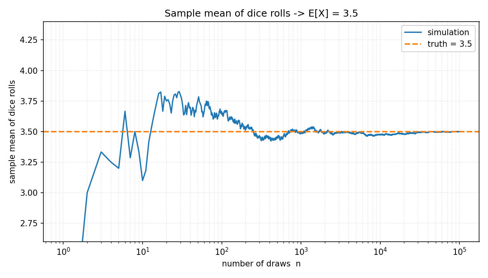
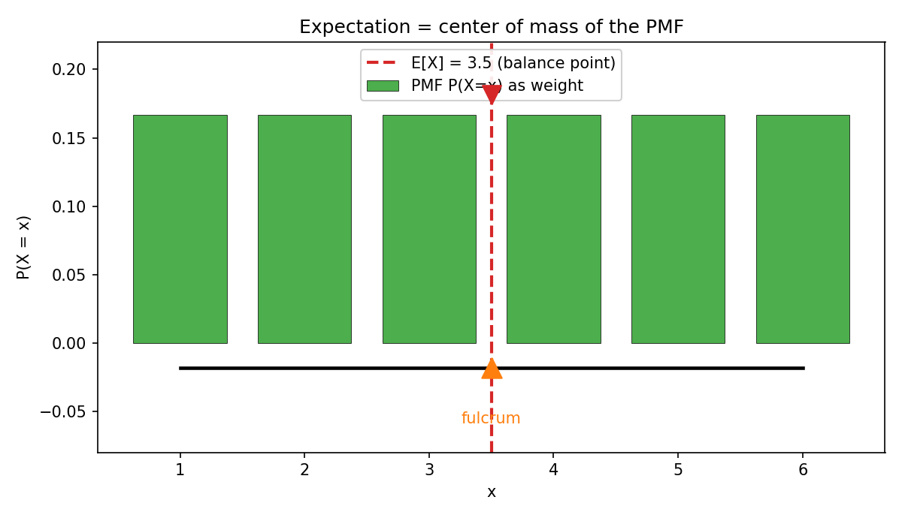

# 第 6 章 · 期望:长期平均的"重心"

> **核心问题**:上一章我们立了随机变量,并用 PMF / PDF 把它"取各个值的规律"描绘得清清楚楚。可"规律"是整张图,很多时候我只想知道**一个数**——这个随机变量"平均起来会是多少"?扔一次骰子,它平均几点?买一张彩票,它平均回报多少钱?下一年的保险该定什么价?我们需要一个数字,把整张分布**浓缩成一个"典型值"**。这个数字,就是**期望(expectation)**。
>
> 这一章,是"把随机结果变成数字"之后的下一步:从"描绘长相"到"提炼一个代表长期平均的数字"。我们要讲清三件事——期望的定义与直觉(它就是大数定律的化身);一个强到反直觉的计算工具(线性性);以及期望最深的陷阱(它可能根本不存在,比如圣彼得堡悖论)。
>
> **读完本章你会明白**:
> - **期望到底是什么**:它不是"最可能取到的值",而是"扔无数次后,平均会稳定到的那个数"——大数定律的化身,分布的"重心"。
> - 为什么期望的公式长成 `Σ x·p(x)` 或 `∫ x·f(x)dx`:这是"用概率当砝码,求平衡点"的自然结果,不是天上掉下来的。
> - **线性性 `E[aX+bY]=aE[X]+bE[Y]`** 是一个强到反直觉的工具——算两个随机变量之和的期望,**居然不需要知道它们怎么联动**(联合分布)。
> - **期望会失效**:圣彼得堡悖论里,一个期望为无穷大的赌博,却没人肯付天价去玩——说明"期望无穷"时大数定律失效,期望并非总能指导决策。

---

## 章首·一句话点破

如果用一句话概括本章,那就是:

> **期望,就是"扔无数次,平均会稳定到的那个数"——它把整张分布浓缩成一个代表长期平均的数字,是分布的"重心",也是大数定律的化身。**

这句话是**结论**,不是**理由**。这一章要倒过来拆:先问"为什么需要一个代表平均的数",再问"这个数怎么自然地长成那个公式",然后撞上一个强到不讲道理的工具(线性性),最后掉进期望最深的坑(它可能根本不存在)。

> **如果一读觉得太难**:先只记住三件事——① 期望 = 长期平均会稳定到的数(大数定律的化身);② 线性性 `E[aX+bY]=aE[X]+bE[Y]` 算和的期望不用知道联合分布,极其好用;③ 期望不一定存在(圣彼得堡悖论期望 = ∞),那时它不指导决策。这三件,够你读懂后面所有章节。

---

## 引子:从"描绘长相"到"提炼一个数"

上一章的结尾,我们留了一句 teaser:

> 随机变量立住了,PMF / PDF / CDF 把它取值的规律描绘清楚了。可"规律"只是描绘,**我还想知道这个数字的"典型值"——它平均起来是多少?波动有多大?**

这一章,我们就来回答前半句:**它平均起来是多少?**

这件事在生活中太常见了。你不会每次赌博都把整张概率分布背下来,你心里只有一个数——"长期玩下去,我每局平均赢多少或亏多少"。你给保险定价,不会给客户画一张损失分布图,你只用一个数——"平均每个客户会索赔多少"。你评估一个机器学习模型的预测误差,最终要汇报的也只是一个数——"平均误差有多大"。**整张分布信息最全,但决策时,人需要一个浓缩的数字。** 期望,就是这个浓缩。

> **钉死衔接**:第 5 章立了"随机变量 + PMF/PDF/CDF",描绘了分布的"整体长相";本章从"描绘长相"往下走一步,提炼出**一个代表长期平均的数字**——期望。下一章(方差)再提炼**一个代表波动的数字**。这三步连起来,就是把一张分布图,压成两个你能记一辈子的数。

---

## 一、期望:长期平均会稳定到的那个数

### 提问:为什么需要"一个代表平均的数"?

想象你是一家保险公司的精算师。每个客户一年内会不会出险、出险赔多少,都是随机的。你手上有这张损失的 PMF/PDF(上一章学会了),信息全在里头。可老板问你一句话:**"平均每个客户一年要赔多少?"**

你不能把整张图甩给老板。老板要的是一个**数字**——比如"平均 320 元"。有了这个数,你就能定价:保费定在 320 元以上,长期才不亏。这个"平均每个客户要赔多少"的数字,就是损失这个随机变量的**期望**。

不光保险。赌场想知道"每局赌客平均下多少注才不亏本";广告平台想知道"每个用户平均点击多少次才好报价";你写代码想知道"这个函数平均跑多少毫秒"。**只要涉及"长期、重复、平均",期望就是你要的那个数。**

### 先把直觉立住:期望 = 长期平均

在讲公式之前,先把期望的**面孔**认清楚。这件事比公式重要十倍。

> **直觉**:期望,就是你**把这个随机实验重复无数次,然后把所有结果取平均**——这个平均会**稳定到一个数**,那个数就是期望。**期望这个词的字面意思,就是"你期望长期看到的均值"。**

扔一颗均匀骰子。扔一次,你完全不知道是几点。可扔十万次,把十万次的点数加起来除以十万——这个均值会**死死贴住 3.5**。3.5 就是骰子点数的期望。注意:3.5 不是骰子能掷出的某个点数(骰子没有 3.5 这一面),它是**长期平均稳定到的位置**。

> 下图就是把这件事跑出来的样子。横轴是扔的次数(对数刻度),纵轴是"前 n 次的样本均值"。看左边:扔前几十次,均值在 1 到 6 之间疯跳,完全不可预测;看右边:扔到十万次,均值死死贴住 3.5 那条橙色虚线。**单次的盲,在大量重复里,收敛成了一个稳如磐石的平均——这个平均,就是期望。**



> **钉死这件事(本章灵魂)**:期望 = 长期重复实验后,样本均值稳定到的位置。**这就是大数定律的字面意思**(第 13 章正式讲)。所以期望不是教材里一个孤零零的定义,它天生就和"扔很多次,平均会稳"绑在一起——期望,就是大数定律的化身。**蒙特卡洛模拟为什么能算期望?根就在这里:扔十万次,取均值,它就贴近期望。**

### 不这样理解会怎样?

如果你不知道"期望 = 长期平均"这副面孔,只记得公式 `E[X] = Σ x·p(x)`,你会卡在三件事上:

1. **你不知道期望在描述什么**。背得出公式,却说不清"3.5 这个数到底意味着什么"。是骰子最常掷出的点数吗?不是(骰子每个点数概率相等)。是中位数吗?凑巧是,但换了分布就不一定。**只有"长期平均会稳定到的位置"这个解释,才一以贯之。**
2. **你无法用模拟验证**。算出一个期望,你怎么知道对不对?如果你知道"期望 = 扔十万的均值",你扔十万次取均值,对一下就知道。不知道这层,你只能死信公式。
3. **你会误把"期望"当成"最可能的取值"**。这是初学者最普遍的坑。期望 3.5 的骰子,你下次掷它,得到 3.5 的概率是 0(根本没这面)。期望是**长期平均的化身**,不是"单次最可能取到的值"。两者经常差很远——彩票的期望回报是负的,可你买一张,要么中大奖要么血本无归,没有任何一张彩票"恰好亏 1 元"。

> **不这样(把期望当成长期平均)理解会怎样**:你会把期望当成一个"算出来的、和现实脱节的数",背了公式却不知道它在说什么。而一旦你看见"期望 = 长期平均会稳定到的位置",公式就变成了这个直觉的速记——你自己都能把它推出来。

### 所以这样看:公式是直觉的速记

现在,让公式从直觉里长出来。还是骰子的例子。扔无数次,样本均值稳定到 3.5。3.5 怎么来的?把每个取值,按它**出现的频率**(也就是概率)加权平均:

- 1 出现的概率 1/6,贡献 `1 × 1/6`
- 2 出现的概率 1/6,贡献 `2 × 1/6`
- ……
- 6 出现的概率 1/6,贡献 `6 × 1/6`

加起来:`(1+2+3+4+5+6) × 1/6 = 21/6 = 3.5`。**每个取值乘以它出现的概率,再加总**——这就是期望的公式。

对一般离散随机变量 X,它的**期望(expectation, expected value)** 定义为:

```
   E[X] = Σ x · p(x)
```

求和遍历 X 所有可能取值。读作"每个取值 × 它的概率,全加起来"。

> **直觉(物理"重心")**:把 PMF 想象成一根跷跷板——每个取值点 x 上,放一个"砝码",砝码的重量就是它的概率 p(x)。期望,就是这根跷跷板的**平衡点(center of mass)**。均匀骰子六个砝码一样重,平衡点在正中间 3.5;如果一颗做了手脚的骰子,6 那面特别重(p(6) 大),平衡点就会往 6 那边偏,期望变大。**期望,就是分布的"重心"。**

下图把这个"重心"直觉画出来:六根绿色柱子是骰子的 PMF(概率当砝码,每根 1/6),红色虚线在 3.5 处——那就是整根跷跷板的平衡点(橙色三角支点)。



连续型呢?上一章说过,连续型的"加总"换成"积分"。所以连续随机变量 X 的期望是:

```
   E[X] = ∫ x · f(x) dx
```

积分遍历整个取值范围。读作"每个 x × 它的密度,沿曲线下面积分"。物理直觉不变——把 PDF 想成一条密度不均的铁丝,期望就是它的重心位置。

> **钉死这件事**:期望的公式 `Σ x·p(x)`(离散)和 `∫ x·f(x)dx`(连续),不是天上掉下来的,是"长期平均会稳定到哪"这个直觉的**速记**。它的物理面孔是"重心"——用概率当砝码,找平衡点。**记住这副面孔,公式你自己就能推出来,而且永远不会把期望误当成"最可能的取值"。**

---

## 二、两个纸笔例子:赌博与彩票(期望的第一次实战)

光有公式不够,得动手算两个最经典的例子——它们也是后面讲"期望陷阱"的铺垫。

### 例子 1:一场"看起来公平"的赌博

有人邀你玩个游戏:扔一颗均匀骰子,掷出 6 你赢 6 元,否则输 1 元。你该玩吗?

直觉上很多人会犹豫——"赢能赢 6 块,输只输 1 块,好像划算?"可别凭直觉,算期望。设 X 为你每局的收益:

- X = 6,概率 1/6(掷出 6)
- X = −1,概率 5/6(掷出别的)

```
   E[X] = 6 × (1/6) + (−1) × (5/6) = 1 − 5/6 = 1/6 ≈ 0.167
```

期望是正的(约 0.17 元/局),所以**长期玩,你平均每局净赚 0.17 元**——划算。但注意"长期"二字:玩一局,你大概率(5/6)是输 1 元的;只有玩成百上千局,这个微薄的正期望才会累积成可见的盈利。**期望描述的是长期平均,不保证单次。**

### 例子 2:彩票的期望(为什么庄家永远赚)

一张彩票 2 元,中奖 1000 元,中奖概率 1/1000。买一张,期望净收益多少?

设 Y 为净收益(奖金减成本):

- 中奖:Y = 1000 − 2 = 998,概率 1/1000
- 不中:Y = 0 − 2 = −2,概率 999/1000

```
   E[Y] = 998 × (1/1000) + (−2) × (999/1000)
        = 0.998 − 1.998
        = −1.0
```

**期望净收益 = −1 元。** 意思是:长期买这种彩票,平均每张净亏 1 元。这就是彩票的设计原理——**期望永远是负的**,庄家(发行方)靠这个负期望稳赚。你偶尔中一次大奖的狂喜,掩盖不了长期平均的稳定亏损。**期望,就是揭穿"看起来诱人"的赌博/彩票/理财产品的那把尺。**

> **钉死这件事**:算期望,就是把"每个可能结果的收益 × 它的概率"加总。正期望的赌局长期赚,负期望的长期亏。**赌场、彩票、保险,全靠"玩家的期望为负、庄家的期望为正"这门生意。** 下一节你会发现,正因为期望是线性的,庄家算"一类玩家整体的期望"特别省事。

---

## 三、线性性:强到反直觉的计算工具

到本章最该停下来想的地方了。我们要讲一个性质,它看起来平平无奇,却是期望**最强**的工具——强到让初学者觉得"这不可能吧"。

### 提问:两个随机变量加起来,期望怎么算?

回到保险的场景。你有两类客户:车险(随机变量 X,平均索赔 E[X])和家财险(随机变量 Y,平均索赔 E[Y])。老板问:**"两类客户合起来,平均每个客户索赔多少?"** 也就是问 E[X + Y]。

直觉上你会慌:"两类客户出险是不是有关联?暴雨天车险和家财险索赔会不会一起涨?我得知道它们怎么联动(联合分布)才能算吧?"

**不用。** 这就是线性性的魔力。

### 不这样理解会怎样?

如果你不知道线性性,你想算 E[X + Y],你得:

1. 先搞清 X 和 Y 的**联合分布**(两个随机变量一起取各个值的概率,第 11 章讲)。
2. 把"X + Y"这个新随机变量的分布求出来。
3. 再对这个新分布求期望。

光第一步就难倒一大片——联合分布在现实里极难估计。如果每次算"两个随机变量之和的期望"都得先估联合分布,那期望这个工具根本用不起来。

### 所以这样看:线性性

期望有一条极其强大的性质,叫**线性性(linearity)**:

> **E[aX + bY] = a·E[X] + b·E[Y]**,对任何常数 a, b 和任何随机变量 X, Y 成立。

特别地,`E[X + Y] = E[X] + E[Y]`。

注意这个式子里**完全没有 X 和 Y 的联合分布**。你只需要各自的期望 E[X] 和 E[Y],加起来就是和的期望。**不管 X 和 Y 是高度联动、还是毫无关系,这条都成立。**

> **不这样(用线性性)理解会怎样**:你会在不该难的地方卡死。比如"100 个客户的总索赔期望"——如果没有线性性,你得算 100 个随机变量的联合分布,这是天文数字的难度。有了线性性,`E[X₁+X₂+…+X₁₀₀] = E[X₁]+E[X₂]+…+E[X₁₀₀] = 100·E[X]`,一个乘法搞定。**整个保险业、整个风险理论,都建在这条性质上。**

为什么线性性成立?因为它就是"长期平均"的属性。扔无数次,X 的平均稳定到 E[X],Y 的平均稳定到 E[Y],那么 (X+Y) 的平均必然稳定到 E[X]+E[Y]——**和的平均 = 平均的和**,这跟"两家店总营业额的平均 = 两家各自营业额平均之和"是一回事。常数也照搬:`E[3X+2] = 3·E[X]+2`,因为"每个值乘 3 再加 2,平均起来"当然等于"平均乘 3 再加 2"。线性性,就是平均运算的天然属性。

> **钉死这件事**:线性性 `E[aX+bY] = aE[X]+bE[Y]` 是期望**最强**的工具——算和的期望,无需联合分布,只把各自的期望加起来。它为什么这么强?因为期望本质是"平均",而"和的平均 = 平均的和"是天经地义的。**这一条,撑起了后面从大数定律到机器学习的半边天。** 记住它,你会反复用到。

---

## 四、彩蛋(本章最深):期望不存在的陷阱——圣彼得堡悖论

这一节兑现"越深越好"。如果你只读到线性性就满足,你已经够用了;但如果你想知道"期望什么时候会失效、为什么会失效",往下看。这一节会动摇你对"期望万能"的信心,也正是这种动摇,让你真正懂期望。

### 一个期望 = ∞ 的赌博

18 世纪,数学家尼古拉·伯努利(Nikolaus Bernoulli)提出了一个困扰了整个概率论界的游戏,史称**圣彼得堡悖论(St. Petersburg paradox)**:

> 你扔一枚均匀硬币,一直扔,直到**第一次出现正面**为止。
> - 如果第 1 次就是正面,奖金 2 元;
> - 如果第 2 次才是正面,奖金 4 元;
> - 如果第 k 次才出现正面,奖金 2^k 元。
>
> 问:你愿意付多少钱,玩一次这个游戏?

先算期望。第 k 次才出现正面的概率是 `(1/2)^k`(前 k−1 次都是反面,概率 `(1/2)^(k−1)`,第 k 次正面 1/2,相乘)。奖金是 `2^k`。所以第 k 种情况的贡献是:

```
   2^k × (1/2)^k = 1
```

**不管 k 是多少,这一项恒等于 1。** 期望就是把所有 k 的贡献加起来:

```
   E[奖金] = 1 + 1 + 1 + … = ∞
```

**期望是无穷大。** 按照前面"正期望的赌局就该玩"的逻辑,你应该愿意付**任意大的价钱**去玩这个游戏——付 100 万也值,因为期望是 ∞,比 100 万大。

### 可是没人愿意付天价

现实里,你问任何人"愿意付多少钱玩这个游戏",答案通常是几块到几十块,绝没人肯付百万。**数学说你该付无穷,你的直觉说几十块顶天——这就是悖论。**

问题出在哪?**出在期望无穷大时,大数定律失效了。** 还记得期望的定义吗——"扔无数次,平均稳定到的位置"。可对这个游戏,"平均"**根本不稳定**!我们用模拟验证:

```python
import numpy as np
rng = np.random.default_rng(42)

def play_once(rng):
    k = 0
    while True:
        k += 1
        if rng.random() < 0.5:    # 正面
            return 2 ** k
        # 反面则继续

for n in [1000, 10000, 100000]:
    pays = np.array([play_once(rng) for _ in range(n)])
    print(f"n={n}: 样本均值={pays.mean():.2f}, 最大单局={pays.max()}")
```

跑出来的结果(固定种子):n=1000 时样本均值约 9.25,n=10000 时约 13.74,n=100000 时约 16.87。**样本均值不收敛**——它随着 n 变大而缓慢攀升,而且每次跑因为那偶尔出现的巨额奖金(2^20 以上),结果剧烈跳动。

> **钉死这件事(本章最深)**:当期望是无穷大(或不存在)时,**样本均值不会稳定**——大数定律的前提(期望有限)被破坏了。期望的定义"扔无数次,平均稳定到的位置"在这里**落空**:没有"稳定到的位置",因为平均一直在漂移。**所以期望无穷大,不代表"你应该付天价"——它代表"期望这个工具,在这里失灵了"。**

这就是为什么"期望"看似万能,实则有个隐含前提:**期望必须有限,才有指导意义**。圣彼得堡悖论戳破的,正是这个前提。后来(第 13 章大数定律)我们会严格看到:大数定律要求 `E[|X|] < ∞`,否则结论不成立。**期望,不是总能定义、总能指导决策的。**

### (可选)尝一口:连续情形的期望是积分

前面离散用 `Σ x·p(x)`,连续用 `∫ x·f(x)dx`。这两个式子长得像,不是巧合——第 5 章彩蛋说过,在测度论里它们是同一件事(对概率测度的 Lebesgue 积分)。期望的统一形式是:

```
   E[X] = ∫ X dP
```

一个式子,既涵盖骰子(数出来),也涵盖身高(积出来)。这就是为什么后面所有关于期望的定理(线性性、大数定律、詹森不等式),都只需证一次,离散连续自动成立。**这套统一不为装高深,它换来的是:你证一次,全宇宙的分布都跟着成立。** 本书不展开测度论,但你已经摸到了概率论最深的那条暗线。

---

## 模拟佐证:拿 Python,亲手把期望"跑"出来

概率论最爽的地方——**期望的结论你不用信书,自己扔随机数就能验证**。这一节,我们把本章的核心(期望 = 长期平均、线性性、圣彼得堡不收敛)全部跑一遍。

### 1. 骰子的期望:扔十万次,均值贴住 3.5

```python
import numpy as np
rng = np.random.default_rng(42)
rolls = rng.integers(1, 7, 100_000)
print(rolls.mean())                       # -> 3.4998
print((1 + 2 + 3 + 4 + 5 + 6) / 6)        # -> 3.5  (理论期望)
```

扔十万次,样本均值 3.4998,死死贴住理论期望 3.5。**这就是图 6.1 的来历,也是"期望 = 长期平均会稳定到的位置"的字面演示。** 改种子、改次数,盯它怎么从剧烈抖动收敛到 3.5——这是理解期望最直接的肌肉记忆。

### 2. 线性性:两颗骰子之和的期望,不用联合分布

```python
rng = np.random.default_rng(42)
d1 = rng.integers(1, 7, 100_000)
d2 = rng.integers(1, 7, 100_000)
print((d1 + d2).mean())                   # -> 6.9999  (E[X+Y] 的模拟)
print(d1.mean() + d2.mean())              # -> 6.9999  (E[X]+E[Y] 的模拟)
# 理论: E[X]=E[Y]=3.5, 所以 E[X+Y]=7
```

两种算法——直接算 (d1+d2) 的均值,和分别算 d1、d2 的均值再相加——**结果完全一样**,都贴住 7。这就是线性性的实证:`E[X+Y] = E[X]+E[Y]`,你完全不需要两颗骰子的联合分布(虽然这里它们独立,但就算它们联动,这条也成立)。**改一改,让 d2 = d1(完全联动),你会发现线性性照样成立——它是无条件成立的。**

### 3. 圣彼得堡悖论:样本均值不收敛

```python
rng = np.random.default_rng(42)

def st_petersburg(rng):
    k = 0
    while True:
        k += 1
        if rng.random() < 0.5:
            return 2 ** k

for n in [1000, 10000, 100000]:
    pays = np.array([st_petersburg(rng) for _ in range(n)])
    print(f"n={n}: 均值={pays.mean():.2f}, 最大单局={pays.max()}")
# n=1000:    均值=9.25, 最大单局=512
# n=10000:   均值=13.74, 最大单局=4096
# n=100000:  均值=16.87, 最大单局=131072
```

对比骰子(扔越多越贴 3.5),这个游戏的样本均值**根本不收敛**——n 从 1000 涨到 100000,均值从 9.25 漂到 16.87,而且每次跑因为偶尔冒出的巨额奖金(131072、甚至更大),结果剧烈跳动。**期望无穷大时,"平均会稳定到的位置"不存在,大数定律失效。** 这就是为什么没人肯付天价玩——你的直觉比"期望 = ∞ 所以该付 ∞"这个推论更靠谱。

> 这三段代码你十分钟就能全跑一遍。跑完你会发现:期望不是教材里一个孤立的定义,而是**你扔十万次随机数,自己就能逼近(或不逼近,如圣彼得堡)的数字**。这正是本书一以贯之的承诺——公式是直觉的副产品,而概率论的直觉,你可以亲手模拟。

---

## 章末小结

### 用一个场景回顾本章

想象你又坐回了那张赌桌前(第 1 章的概率论出生地)。骰子还没落地,你心里不再只想着"几点朝上的概率是多少"(那是第 1~5 章的事),你想的是一个更实用的数:**"长期玩下去,我平均每局赢多少?"**(第一节)。

你算了一下收益的期望——把每个可能结果乘以它的概率加总,发现这场赌局期望是正的、那张彩票期望是负的(第二节)。正期望的长期赚,负期望的长期亏,**赌场和彩票全靠这个差价吃饭**。你想算"一百个赌客的总期望",本以为要搞定他们的联合分布,结果一个线性性 `E[X+Y]=E[X]+E[Y]` 就把事办了——强到反直觉,却是平均运算的天然属性(第三节)。

可就在你以为期望万能时,圣彼得堡悖论给你当头一棒:一个期望为无穷大的游戏,却没人肯付天价玩。你这才明白——**期望有个隐含前提:它必须有限,大数定律才成立,"平均会稳定到的位置"才存在**。期望无穷大,不代表"该付无穷",而代表"期望这个工具在这里失灵"(第四节)。

### 本章在全书主线中的位置

记住本书主线:**一切概率概念,都是"驯服随机性"的工具。**

这一章,我们完成了驯服随机性的**"平均重心"一步**:从上一章"描绘分布的整体长相"(PMF/PDF/CDF),往下走一步,把整张分布**浓缩成一个代表长期平均的数字**——期望。它是分布的"重心",也是大数定律的化身(扔无数次,平均稳定到的位置)。

- **第 5 章** 把随机结果变成数字,描绘分布长相。
- **本章** 从分布里提炼出"平均"这个数字(期望)。
- **第 7 章 · 方差** 将从分布里提炼出另一个数字——"波动有多大"。
- **第 13 章 · 大数定律** 会严格证明:样本均值收敛到期望——本章这副"期望 = 长期平均"的面孔,届时得到定理级的背书。
- **第 14 章 · 中心极限** 会用期望 + 方差,刻画"大量求和趋钟形"的中心和宽度。

**期望和方差(下一章),是压在分布图上的两个最重要的数字。抓住这两个,你就抓住了分布的"重心"和"胖瘦"。**

### 五个"为什么"清单

如果你只能记五件事,记这五件:

1. **期望是什么**:不是"最可能取到的值",而是**"扔无数次,平均会稳定到的那个数"**——大数定律的化身,分布的"重心"(用概率当砝码,找平衡点)。
2. **公式从直觉来**:`E[X]=Σ x·p(x)`(离散)/ `∫ x·f(x)dx`(连续)不是天上掉的,是"每个取值 × 概率,加总"——长期平均的速记。记住"重心"这副面孔,公式你自己能推。
3. **线性性强到反直觉**:`E[aX+bY]=aE[X]+bE[Y]`,算和的期望**不需要联合分布**,只把各自期望加起来。撑起了保险、风险理论、大数定律的半边天。
4. **正期望长期赚,负期望长期亏**:赌场、彩票、保险,全靠"玩家期望为负、庄家期望为正"。期望是揭穿"看起来诱人"的赌博/理财的那把尺。
5. **期望不一定存在**:圣彼得堡悖论期望 = ∞,样本均值不收敛,大数定律失效——期望有个隐含前提(必须有限),无穷大的期望不指导决策。**期望不是万能的。**

### 想继续深入,该往哪钻

- **亲手扔**:把上面三段 Python 跑一遍。重点改两处:① 骰子那段,把 `n` 从 10、100、1000 一路加到十万,盯样本均值怎么从疯跳到贴 3.5(肌肉记忆"期望 = 长期平均");② 圣彼得堡那段,多跑几次(换种子),看每次的"均值"怎么剧烈跳动——**亲眼看见"不收敛",比读十遍定义都管用**。
- **钻线性性的边界**:试试让两个随机变量**高度联动**(比如 `d2 = d1`),再算 `E[d1+d2]` 和 `E[d1]+E[d2]`,验证线性性在联动时也成立。再想一个反例:线性性对**方差**成立吗?(提示:不成立,需要加"独立"条件——下一章会讲。)
- **尝一口测度论**:搜 "expectation as Lebesgue integral",看一个 10 分钟视频,理解"离散的 `Σ` 和连续的 `∫` 在期望里是同一个积分"。不用学深,知道这层统一,第 13 章大数定律你会觉得顺理成章。
- **看可视化**:Brown 大学的 **Seeing Theory**(seeing-theory.brown.edu)里"期望"模块,可拖动地展示"概率当砝码、平衡点 = 期望"——本章的重心直觉,在那里能玩起来。

---

> 期望立住了:它是分布的"重心",是"扔无数次平均稳定到的位置",是正负赌局的分水岭。可光知道"平均是多少"还不够——**一个平均 50 的随机变量,可能是每次都稳在 50,也可能是 0 和 100 各一半(波动巨大)**。决策时,你还得知道它**偏离平均有多厉害**。翻开 **第 7 章 · 方差与标准差:波动有多大**——你会发现,所谓"方差",不过是"每个取值偏离期望的平方,再加权平均",它和期望是一对搭档,共同把一张分布图压成两个你能记一辈子的数。
