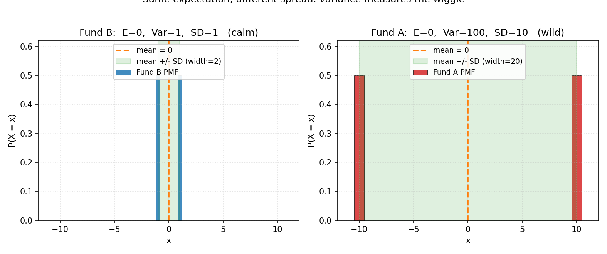
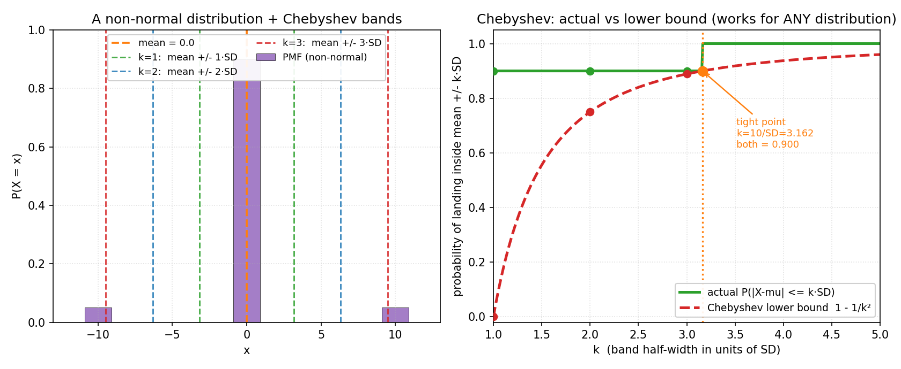

# 第 7 章 · 方差与标准差:波动有多大

> **核心问题**:上一章我们立了期望——它把整张分布浓缩成一个代表长期平均的数字。可光知道"平均是多少"远远不够。一只基金平均年化 0 元,可能是每天都稳稳贴着 0(稳如磐石),也可能是今天暴赚 10 万、明天暴亏 10 万来回撕扯(心脏骤停)——**两者的期望都是 0,可你绝不敢用同样的钱去投第二只**。所以,我们还缺一个数字:**这个随机变量,偏离它的期望有多厉害?波动有多大?** 这个数字,就是**方差(variance)**和它的平方根**标准差(standard deviation)**。
>
> 这一章,我们完成"把分布压成两个数"的后一半:期望管"重心在哪",方差管"分布有多散"。我们会讲清四件事——方差为什么是"先平方再平均"(为什么不是直接平均偏差?平方到底在干什么);标准差为什么比方差更"好懂"(因为它和原始数据同一个量纲);**标准化(Z 分数)**怎么把任何分布变成"以标准差为单位"(为正态的 68-95-99.7、中心极限铺路);以及方差最有用的"硬保证"——**切比雪夫不等式**(只要知道期望和方差,就能给任意分布的尾部概率划下界,这是"方差到底有什么用"的终极回答)。
>
> **读完本章你会明白**:
> - **方差到底是什么**:它是"每个取值偏离期望的程度的平方,再加权平均"——衡量分布有多"散"。**为什么先平方?** 因为直接平均偏差会让正负抵消归零(看不出散),平方既消除正负号、又放大离群点。
> - **标准差**为什么往往比方差更好用:它和原始数据同一个单位(元、米、分),能直接读出"波动大概多大";方差是"平方的",数值上不好直观。
> - **标准化 Z 分数** `Z=(X−μ)/σ` 的意义:把任何分布拉伸/压缩到"以标准差为单位",让身高、考试成绩、股票收益这些量纲不同的东西**变得可比**——这是通往正态分布和中心极限的钥匙。
> - **切比雪夫不等式**:只知道 μ 和 σ,就能断言"任意分布"落在 μ±kσ 内的概率 ≥ 1−1/k²。这是方差最硬核的用途——一个**不依赖分布形状**的普适保证,告诉你"方差到底有什么用"。

---

## 章首·一句话点破

如果用一句话概括本章,那就是:

> **方差,度量一个随机变量"偏离期望的平均剧烈程度";标准差是它的平方根,和原始数据同量纲、更好读。而切比雪夫不等式告诉你——只要知道这两个数,你就能对任意分布的尾部概率下个硬保证。**

这句话是**结论**,不是**理由**。这一章倒过来拆:先问"为什么光有期望不够",再问"刻画'散'为什么非要平方",然后学会用标准差把不同分布拉到同一把尺上(Z 分数),最后用切比雪夫兑现"方差到底有什么用"。

> **如果一读觉得太难**:先只记住三件事——① 方差 = 偏离期望的"平方平均"(`Var(X)=E[(X−μ)²]`),标准差 = `√Var`,和原数据同单位更好读;② 标准化 `Z=(X−μ)/σ` 把任何分布变成"以标准差为单位",跨分布可比;③ 切比雪夫不等式:对**任意**分布,`P(|X−μ| ≥ kσ) ≤ 1/k²`,即落在 μ±kσ 内 ≥ `1−1/k²`——方差最有用的硬保证。这三件,够你读懂后面所有章节。

---

## 引子:光知道平均,会被坑死

上一章的结尾,我们留了一句 teaser:

> 期望立住了,它是分布的"重心"。可光知道"平均是多少"还不够——一个平均 50 的随机变量,可能是每次都稳在 50,也可能是 0 和 100 各一半(波动巨大)。决策时,你还得知道它**偏离平均有多厉害**。

这一章,我们就来回答这后半句:**它偏离平均有多厉害?**

这件事,任何投过资、考过试、做过工程的人都有切肤之痛。两只基金,过去十年的平均年化都是 8%。你闭眼选一只就行了吗?**绝对不行。** 一只每年都稳稳落在 6%~10% 之间,你晚上睡得着觉;另一只大年涨 60%、小年跌 40%,平均下来也是 8%,可你能扛得住某一年亏掉一半本金吗?**期望一模一样,体验天差地别——差别就在"波动"。**

考试也一样。两个学生五次测验的平均分都是 75。一个是 73、74、75、76、77(稳);另一个是 50、60、75、90、100(飘)。老师看平均分会说"两人差不多",可谁都看得出第二个状态极不稳定。**平均抹平了波动,而决策时,波动往往比平均更要命。**

> **钉死衔接**:第 6 章把分布浓缩成"期望"这一个数(重心);本章从分布里再提炼**另一个数——波动有多大**。期望 + 方差,共同把一张分布图压成两个你能记一辈子的数:**重心在哪,有多散。**

---

## 一、方差:偏离期望的"平方平均"

### 提问:怎么把"偏离有多厉害"浓缩成一个数?

现在你信了"光有期望不够,还得知道波动"。那问下一个问题:**"波动"这个抽象感觉,怎么变成一个能算的数字?**

最朴素的念头是:把每个取值和期望的差距取出来,然后求平均。差距 = `X − μ`(μ 是期望)。比如骰子的期望 μ=3.5,掷出 6 偏差是 +2.5,掷出 1 偏差是 −2.5。把所有偏差加起来取平均,不就刻画了"平均偏离多少"吗?

**这个念头对了一半,但有个致命漏洞。**

### 不这样(直接平均偏差)会怎样?

> **直觉**:我想知道"平均每次偏离期望多远"。那就把每个取值的偏差 `X − μ` 取出来,按概率加权平均,得到 `E[X − μ]`。

听起来天衣无缝。可你算一下:`E[X − μ] = E[X] − μ = μ − μ = 0`。**永远是 0。**

为什么?因为正负偏差会**互相抵消**。骰子掷出 6(+2.5)和掷出 1(−2.5)正好抵消,加起来归零。可"偏离有多厉害"明明是有大小的——+2.5 和 −2.5 都偏离了 2.5,你不能因为一正一负就说"偏离为 0"。**直接平均偏差,等于把正负方向当成"互相消灭"了,而波动是无论正负都要算的。**

> **不这样(直接平均偏差)理解会怎样**:你会得到一个永远为 0 的"波动度量"——这等于把波动彻底抹掉了。一只稳如磐石的基金(偏差恒为 0)和一只暴涨暴跌的基金(偏差忽正忽负),算出来都是 0,完全分不开。**这说明"直接平均偏差"这条路堵死了,必须想办法把正负号消掉,但保留偏离的"大小"。**

### 所以这样看:先平方,再平均

消掉正负号、又保留大小,最自然的办法是什么?**平方。** 任何数的平方都是非负的:`(+2.5)² = 6.25`,`(−2.5)² = 6.25`,正负偏差一平方就合流了,而且大小被忠实地保留下来。

所以方差的定义是:

> **Var(X) = E[(X − μ)²]**,其中 μ = E[X]。

读作"每个取值偏离期望的程度的平方,按概率加权平均"。对离散型展开就是 `Σ (x−μ)²·p(x)`,连续型是 `∫ (x−μ)²·f(x)dx`。

> **钉死这件事(本章灵魂之一)**:方差 = 偏离期望的"平方的平均"。**为什么是平方,而不是绝对值?** 因为平方有两个好处:① 它把正负号消掉(无论 +2.5 还是 −2.5,平方后都是 6.25),避免直接平均归零的灾难;② **它放大离群点**——偏离 1 平方后是 1,偏离 2 平方后是 4,偏离 3 平方后是 9。离期望越远的取值,被平方"加权"得越狠。这恰恰是我们想要的:波动大,主要是被那些极端取值拽出来的,平方让它们更显眼。**方差不是凭空这么定义的,它是"消正负 + 放大离群"这两个需求逼出来的自然结果。**

#### 拿骰子算一遍(纸笔)

骰子 μ=3.5。每个面的偏差和平方偏差:

| x | 偏差 x−3.5 | (x−3.5)² |
|---|---|---|
| 1 | −2.5 | 6.25 |
| 2 | −1.5 | 2.25 |
| 3 | −0.5 | 0.25 |
| 4 | +0.5 | 0.25 |
| 5 | +1.5 | 2.25 |
| 6 | +2.5 | 6.25 |

每个面概率 1/6,所以方差:

```
   Var(骰子) = (6.25 + 2.25 + 0.25 + 0.25 + 2.25 + 6.25) / 6
             = 17.5 / 6
             ≈ 2.917
```

骰子的方差约 2.917。**这个数告诉你:骰子每次掷出去,偏离期望 3.5 的"平方平均剧烈程度"是 2.917。** 后面会看到,它的标准差是 √2.917 ≈ 1.708——意思是"骰子点数典型地偏离期望 1.7 左右",这个数就好读多了。

#### 一个等价的计算公式(为什么教材常写 Var(X)=E[X²]−(E[X])²)

直接用 `E[(X−μ)²]` 算方差,每次都得先减 μ 再平方,烦。展开一下:

```
   Var(X) = E[(X − μ)²]
          = E[X² − 2μX + μ²]
          = E[X²] − 2μ·E[X] + μ²        (用期望的线性性,E[aX+b]=aE[X]+b)
          = E[X²] − 2μ² + μ²             (因为 E[X] = μ)
          = E[X²] − μ²
```

所以方差的另一个常用形式是 **Var(X) = E[X²] − (E[X])²**——"平方的期望,减去期望的平方"。这个式子算起来快:`E[X²]` 就是把每个 x² 按概率加权平均,`(E[X])²` 是期望的平方,一减就行。骰子:`E[X²] = (1+4+9+16+25+36)/6 = 91/6 ≈ 15.167`,减 `3.5²=12.25`,得 2.917——和上面一致。

> **钉死这件事**:两个公式 `Var(X)=E[(X−μ)²]` 和 `Var(X)=E[X²]−(E[X])²` 完全等价。前者是**直觉**(偏离期望的平方平均),后者是**算起来快的版本**。理解用前者,手算用后者。

#### 为什么不用"平均绝对偏差"?

讲到这里,敏锐的读者会问:消正负号,为什么一定要用平方?**绝对值** 不也行吗?`|+2.5| = 2.5`,`|−2.5| = 2.5`,正负号消掉了,大小也保留了,而且不"放大离群"——看起来更温和、更直觉啊。

没错。`E[|X − μ|`(叫**平均绝对偏差**,MAD)确实是个合法的波动度量,而且对离群点没那么敏感(不会因为一个极端值就把数值平方放大)。那为什么概率论和统计学几乎一边倒地用方差、不用 MAD?

> **直觉(为什么数学家偏爱平方)**:平方之所以胜出,根本原因是它**数学上极其友好**。
>
> 1. **平方处处可导**。`x²` 在任何点都可导,导数是 `2x`,光滑得很;而 `|x|` 在 0 处不可导(有个尖角)。可导意味着能用微积分全套工具——求极值、做优化、泰勒展开……统计学和机器学习里大量的算法(最小二乘、高斯分布、卡尔曼滤波、方差分析),都靠"平方可导"这一条才能跑起来。
>
> 2. **平方和"距离""能量"同构**。平面上两点 `(a,b)` 和 `(c,d)` 的欧氏距离是 `√((a−c)²+(b−d)²)`——你看,距离的平方,就是各坐标偏差平方之和。方差,本质上是"随机变量到它的期望的'距离平方'的期望"。**平方,让概率论和几何挂上了钩**(第 12 章讲协方差矩阵时,你会看到方差就是距离平方的推广)。
>
> 3. **平方有优美的代数性质**。比如 `Var(aX+b) = a²·Var(X)`(伸缩 a 倍,方差变 a² 倍)、独立随机变量之和的方差等于方差之和 `Var(X+Y)=Var(X)+Var(Y)`(第 11~12 章会讲)——这些性质对 MAD 不成立或难看得多。**整个概率论的代数结构,都建在平方上。**

> **钉死这件事(本章最深之一)**:方差用平方、不用绝对值,**不是因为它更"直觉"(其实绝对值更直觉),而是因为它数学上更乖——可导、和距离/能量同构、代数性质优美**。数学家选工具,不光看它好不好懂,更看它能不能和整套数学无缝咬合。平方胜出,是因为它把概率论接入了微积分、几何、线性代数的主干道。**这一选择,后面会反复兑现红利**(正态分布的钟形、最小二乘、中心极限、马氏距离……全靠平方撑着)。

---

## 二、标准差:把方差"开根号"回原单位

### 提问:方差有了,为什么还要标准差?

> **直觉**:方差是"平方的平均",所以它的单位被平方了——原始数据的单位若是"元",方差就是"元的平方";若是"点",方差就是"点的平方"。这个"平方单位"人脑根本读不懂,我想要一个能直接和原始数据对齐的波动度量。

方差算出来了,骰子是 2.917。可你拿到这个数,会犯嘀咕:**2.917 是什么单位?** 骰子点数的单位是"点",可方差是"点的平方"——一个谁也说不清的怪单位。

这就是方差最大的毛病:**它的单位是原始单位的平方**。原始数据是元,方差是"元的平方";原始是米,方差是"米的平方";原始是分数,方差是"分数的平方"。这些"平方单位"在直觉上完全没法读——你跟我说"这只基金年化收益的方差是 400 元²",我脑子里一片空白。

### 不这样(只看方差)会怎样?

如果你只盯着方差做决策,你会遇到两件抓瞎的事:

1. **数值没法直观比较**。基金 A 方差 100,基金 B 方差 1。哪个波动大?A 大——可大多少?是"100 倍"吗?直觉上你想说"A 波动是 B 的 10 倍",但方差告诉你的是"100 倍"(因为方差是平方过的)。**平方扭曲了你对"倍数"的直觉。**
2. **单位和原始数据对不上**。你跟老板汇报"这只股票年化收益的标准差……哦不,方差是 0.04(年化收益²)",老板听不懂。他想听的是"年化收益典型地波动 ±20%"——一个能直接和"收益"挂钩的数。

### 所以这样看:标准差 = √方差

把方差开个根号,单位就回来了:

> **SD(X) = √Var(X)**,或记 σ。

骰子方差 2.917,标准差 √2.917 ≈ **1.708**。这个数的单位是"点"——和原始骰子点数同一个单位。它的意思是:**骰子每次掷出去,典型地偏离期望 3.5 大约 1.7 个点。** 这句话你立刻就能在脑子里放映出来:掷出 2(偏离 1.5)或 5(偏离 1.5)是"典型"的,掷出 1 或 6(偏离 2.5)是"稍远"的。**标准差,就是把方差从"平方的怪单位"拉回"原始单位"的桥梁,让人能直观读懂波动有多大。**

回到两只基金:A 方差 100、B 方差 1,标准差分别是 10 和 1。**现在你能直觉地说:A 的波动是 B 的 10 倍**(标准差 10 vs 1)。开根号,把被平方扭曲的"倍数感"还原回来了——方差是 100 倍,标准差是 10 倍,后者才匹配你的直觉。

> **钉死这件事**:方差和标准差是同一个东西的两副面孔——**方差用于数学推导**(平方可导、代数优美),**标准差用于直观读数**(和原始数据同单位)。你看教材和论文,公式里写的是方差 `Var`、`σ²`;你看财经新闻和工程报告,说的是标准差 `SD`、`σ`、波动率(volatility)。**记住:σ² 是给数学用的,σ 是给人用的。**

#### 两只"基金"的直观对比

我们用最极端的例子把"同期望、不同方差"这件事看穿。设想两只基金:

- **基金 B(稳)**:一半概率赚 1 元,一半概率亏 1 元。期望 `E[B]=0`,方差 `Var(B)=(1−0)²·0.5+(−1−0)²·0.5=1`,标准差 `SD=1`。
- **基金 A(狂)**:一半概率赚 10 元,一半概率亏 10 元。期望 `E[A]=0`,方差 `Var(A)=100`,标准差 `SD=10`。

**两只基金期望完全一样,都是 0**——长期玩下去,平均不赚不亏。可你看下图:基金 B 的取值只在 ±1 之间小幅摆动,基金 A 在 ±10 之间暴冲。**期望骗了你,方差揭穿了真相。** 标准差 1 vs 10,直接告诉你:A 的波动是 B 的 10 倍。这就是为什么买基金不能只看历史平均收益,**必须看波动率(标准差)**。



> **钉死这件事**:决策时,**期望和标准差缺一不可**。期望告诉你"长期平均往哪走",标准差告诉你"路上有多颠簸"。这就是金融里"风险-收益"框架的数学根——收益看期望,风险看标准差。**夏普比率(Sharpe ratio)这类核心指标,本质就是"期望收益 / 标准差"——单位波动换来的收益。**

---

## 三、标准化 Z 分数:把任何分布拉到同一把尺上

到本章第二个该停下来想的地方。我们要讲一个看似简单、实则铺开了概率论半边天的操作——**标准化(standardization)**。

### 提问:身高和体重,怎么比?

> **直觉**:同一个"180 cm",在"平均 175、波动 ±5"的群体里算偏高,在"平均 175、波动 ±20"的群体里根本不起眼。**评价一个数"偏离平均多远",不能光看绝对差距,得看它占了"几个标准差"。** 这就是标准化的念头。

你想知道"小明身高 180 cm,在他的群体里算多高"。可"180 cm"这个数字本身没法直接判断——如果群体平均 175 cm、大家波动 ±5 cm,那 180 就算偏高;如果群体平均 175 cm、但波动 ±20 cm(方差极大),那 180 根本不算啥。**同一个"180",在不同的分布里,位置天差地别。**

考试也一样。数学考 85,语文考 78。哪科考得相对更好?你不能直接比 85 和 78——两科难度不同、波动不同。数学平均 70、标准差 5(85 比平均高 3 个标准差);语文平均 70、标准差 10(78 比平均高 0.8 个标准差)。**在各自的分布里,数学 85 远比语文 78 更"出挑"。**

**核心矛盾**:不同分布,单位(量纲)不同、中心(期望)不同、波动(标准差)不同——它们的原始数值没法直接比。**我们需要一把统一的尺。**

### 不这样(标准化)会怎样?

如果你不标准化,你会卡在两件事上:

1. **跨分布比不了**。身高 180、体重 75、IQ 130——这三个数谁更"偏离平均"?它们单位完全不同(cm、kg、智商分),直接比毫无意义。
2. **正态分布的 68-95-99.7 法则用不起来**。下一章(第 9、10 章)你会学到:正态分布里,约 68% 的数据落在 μ±σ 内,95% 落在 μ±2σ 内。可这条法则**前提是你已经标准化了**——它说的"σ",就是标准化后的单位。不标准化,这条黄金法则根本套不上。

### 所以这样看:Z 分数 = (X−μ)/σ

把"偏离了多少"用"标准差的倍数"来表达:

> **Z = (X − μ) / σ**,叫 **Z 分数(Z-score)** 或**标准分**。

读作"X 偏离期望多少个标准差"。Z=0 表示正好在期望处;Z=+2 表示比期望高 2 个标准差;Z=−1.5 表示比期望低 1.5 个标准差。**Z 分数把任何分布,都拉伸/压缩到"以标准差为单位"的同一把尺上。**

回到例子:数学 85,Z=(85−70)/5=**+3**;语文 78,Z=(78−70)/10=**+0.8**。现在能比了——**数学的 85,在自己的分布里远比语文的 78 更出挑**(3 个标准差 vs 0.8 个标准差)。

> **钉死这件事(标准化是概率论的"度量衡统一")**:Z 分数 `(X−μ)/σ` 把任何分布变成"以标准差为单位"。它的两个性质特别重要:① **平移不变**(减 μ 把中心搬到 0);② **尺度归一**(除 σ 把波动缩到 1)。标准化后,`E[Z]=0`、`Var(Z)=1`——所有分布被拉到同一张"标准尺"上比高低。**这是通往正态分布(第 10 章)和中心极限定理(第 14 章)的钥匙**——那两个铁律,都是先把随机变量标准化后才显现出来的。现在记住这个操作,后面你会反复用到。

#### 用模拟验证:标准化后 E[Z]=0、Var(Z)=1

```python
import numpy as np
rng = np.random.default_rng(42)
# 一个量纲很"怪"的分布: 身高, 平均 170 cm, 标准差 8 cm
heights = rng.normal(170, 8, 100_000)
z = (heights - 170) / 8
print(z.mean(), z.var())     # -> 约 0.0 和 1.0
```

跑出来 `z.mean() ≈ 0`、`z.var() ≈ 1`——标准化后,无论原始分布的期望和标准差是多少,都被拉成了"中心 0、波动 1"的标准形态。**这就是 Z 分数"统一度量衡"的字面验证。**

---

## 四、彩蛋(本章最深):切比雪夫不等式——方差到底有什么用?

到本章的高潮。前面三节,我们讲清了"方差是什么、怎么算、怎么用"。可有一个最尖锐的问题一直悬着:

> **方差这个数,到底有什么"硬用途"?** 我知道骰子方差 2.917、基金 A 方差 100——然后呢?这些数除了让我有个"波动大小"的感觉,还能不能给出**可量化的保证**?

这个问题,俄国数学家**切比雪夫(Pafnuty Chebyshev)**在 1867 年用一个极简的不等式回答了。这个不等式是方差最有用的"兑现券"——它告诉你:**只要知道期望和方差,你就能对任意分布的尾部概率,下一个不依赖分布形状的硬保证。**

### 提问:只知道 μ 和 σ,能对未知分布说什么?

> **直觉**:我知道这只股票的平均收益 μ 和标准差 σ,但完全不知道它的收益分布长什么形状(不是正态、不是均匀,啥都不是)。即便如此,我是不是也能对"亏损超过 3 倍标准差"这种极端事件的概率,说点硬话?直觉上觉得"没形状就没法说",但切比雪夫说:能说,而且说得斩钉截铁。

设想你是个风控官。你不知道某只股票收益的确切分布形状(不是正态、不是均匀、啥都不是,你只知道它的历史平均 μ 和历史标准差 σ)。老板问你:**"这只股票明年亏损超过 3 倍标准差的概率,最大能到多少?"**

你手里只有 μ 和 σ 两个数,**完全不知道分布长什么样**。你能给老板一个上界吗?

直觉上你会觉得"不知道形状,啥也说不出来"。**错了。** 切比雪夫说:能说,而且说得斩钉截铁。

### 不这样(用切比雪夫)会怎样?

如果你不知道切比雪夫,面对"只知道 μ 和 σ 的未知分布",你会陷入两种极端:

1. **悲观派**:啥也说不出来,只能去估整张分布(可分布极难估准,尤其尾部)。
2. **乐观派**:假设它是正态分布,套 68-95-99.7 法则——亏损超过 3σ 的概率约 0.3%。**可万一它根本不是正态呢?** 真实世界的金融收益、保险损失、网络流量,常常是"厚尾"的(极端事件比正态预测的多得多)。盲套正态,会严重低估尾部风险——这正是 2008 年金融危机的数学病灶之一。

切比雪夫给的是**第三条路**:**不假设分布形状,只靠 μ 和 σ,给一个普适的(虽然松一点的)保证。**

### 所以这样看:切比雪夫不等式

> **切比雪夫不等式**:对**任何**期望为 μ、方差为 σ² 的随机变量 X(不管它什么形状),对任意 k > 0:
>
> **P(|X − μ| ≥ kσ) ≤ 1 / k²**
>
> 等价地写成"落在带内的概率至少是多少":
>
> **P(|X − μ| < kσ) > 1 − 1/k²**

读作"偏离期望超过 k 个标准差的概率,最多是 1/k²"。

代入几个 k:

| k | 尾部上界 P(|X−μ| ≥ kσ) ≤ | 落在 μ±kσ 内 ≥ |
|---|---|---|
| 1 | 1.0(=100%,没信息) | 0(没保证) |
| √2 ≈ 1.41 | 1/2 | 1/2 |
| 2 | 1/4 | **3/4 = 75%** |
| 3 | 1/9 | **8/9 ≈ 88.9%** |
| 4 | 1/16 | 15/16 ≈ 93.8% |

**这些数字是"硬下界"——对任何分布都成立。** 你不需要知道分布是正态、均匀、还是奇形怪状;只要它能算出 μ 和 σ,这两个数就成立。

> **钉死这件事(本章灵魂之二)**:切比雪夫不等式 `P(|X−μ| ≥ kσ) ≤ 1/k²` 是方差**最有用的兑现**。它回答了"方差到底有什么用"——**方差不只是个描述波动大小的数,它能转化成对尾部概率的可量化保证**。知道 σ,你就知道"偏离 k 个标准差"这种事最多有多大概率发生。**而这个保证,不依赖任何分布假设**——普适到令人不安。这就是为什么风控、质检、信号处理里,切比雪夫是"最坏情况分析"的看家工具:**当你说不清分布形状时,它给你兜底。**

#### 拿一个非正态分布验证(纸笔 + 模拟)

切比雪夫最妙的地方,是它对**任意**分布成立。我们用一个故意"非正态"的分布来演示——一个三点分布:

> **X 的分布**:P(X=0)=0.9,P(X=+10)=0.05,P(X=−10)=0.05。

先算 μ 和 σ:

```
   μ  = 0·0.9 + 10·0.05 + (−10)·0.05 = 0
   σ² = (0−0)²·0.9 + (10−0)²·0.05 + (−10−0)²·0.05
      = 0 + 5 + 5 = 10
   σ  = √10 ≈ 3.162
```

现在看不同 k 下,实际落界比例 vs 切比雪夫下界:

| k | μ±kσ 的范围 | 实际 P(落内) | 切比雪夫下界 ≥ |
|---|---|---|---|
| 1 | ±3.162 | 0.9(只有 0 落内,±10 在外) | 0(没保证) |
| 2 | ±6.324 | 0.9(±10 仍在 ±6.324 外) | 0.75 |
| 3 | ±9.487 | 0.9(±10 仍在 ±9.487 外) | 0.889 |
| √10≈3.162 | ±10 | **0.9**(±10 刚好在内) | **0.9**(=1−1/10) |

看最后一行——**k=√10 时,实际落界 0.9,切比雪夫下界也是 0.9,两者完全相等!** 这不是巧合:切比雪夫不等式是**紧的(tight)**——存在分布(就像我们这个三点分布),让等号严格成立。**这意味着 1/k² 这个上界,已经不可能再改进了**——任何想给更紧上界的尝试,都会被这个反例打脸。切比雪夫虽然"松",但它松到了极限。

下图把这件事画出来。左图是这个三点分布的 PMF(紫色柱),叠加 k=1、2、3 三组 μ±kσ 的带;右图是"实际落界比例(绿线)vs 切比雪夫下界(红虚线)"随 k 的变化——**绿线永远在红虚线之上**(切比雪夫是下界,必须被满足),而橙色的紧致点 k=√10≈3.162 处,两条线正好相切。



#### 蒙特卡洛核对(十万次)

```python
import numpy as np
rng = np.random.default_rng(42)
vals  = np.array([0.0, 10.0, -10.0])
probs = np.array([0.90, 0.05, 0.05])
mu, sigma = 0.0, np.sqrt(10)            # ≈ 3.1623
samp = rng.choice(vals, p=probs, size=100_000)
for k in [1, 1.5, 2, 3]:
    in_band = np.mean(np.abs(samp - mu) <= k * sigma)
    bound   = max(0.0, 1 - 1 / k**2)
    print(f"k={k}: 模拟落界={in_band:.4f}, 切比雪夫下界={bound:.4f}")
# k=1:   模拟=0.8996, 下界=0.0000
# k=1.5: 模拟=0.8996, 下界=0.5556
# k=2:   模拟=0.8996, 下界=0.7500
# k=3:   模拟=0.8996, 下界=0.8889
```

模拟值 0.8996 贴住理论 0.9,且在每个 k 下都**严格大于**切比雪夫下界——下界被满足,普适性坐实。

> **钉死这件事**:切比雪夫不等式 `P(|X−μ|≥kσ)≤1/k²` 对**任意**分布成立,而且这个 1/k² 是**最优的普适上界**(存在分布让它取等)。它松——正态分布在 k=3 时尾部才 0.3%,切比雪夫给的 1/9≈11.1% 比这松得多。**但它的价值不在"紧",在"普适"**:当你不知道分布形状、又必须给个兜底保证时,它是你唯一能仰仗的东西。**方差到底有什么用?切比雪夫回答:能把"波动大小"翻译成"尾部概率的硬上界"。**

---

## 五、彩蛋中的小彩蛋:样本方差为什么除以 n−1?

最后尝一口,回答一个几乎所有学过统计的人都困惑过、却很少有人讲清的问题。

你手上有一组样本数据 `x₁, x₂, …, xₙ`,想估总体的方差 σ²。最直觉的做法:

```
   样本方差(直觉版)= (1/n) · Σ (xᵢ − x̄)²      # x̄ 是样本均值
```

**可教材告诉你:要除以 n−1,不是 n。** 为什么?多出来的那个"−1"到底是干嘛的?

> **直觉(为什么除以 n 会偏小)**:问题出在 `x̄`(样本均值)上。**样本均值 x̄ 不是总体均值 μ,它是从同一批数据里算出来的**。而这批数据,天然地"靠近它们自己的均值 x̄"——比靠近真正的 μ 更近(因为 x̄ 就是它们的最优中心,任何一组数据到自己的均值距离之和最小)。
>
> 所以 `Σ(xᵢ − x̄)²` 系统性地**偏小**——你用 x̄ 当中心,距离平方和被低估了。除以 n,得到的样本方差**平均下来**比真实的 σ² 小。
>
> 数学上,可以证明:`E[ (1/n)·Σ(xᵢ−x̄)² ] = (n−1)/n · σ²`——期望是 `(n−1)/n` 倍的真值。要纠正这个系统性低估,乘以 `n/(n−1)`,也就是**改成除以 n−1**。

这就是**无偏性(unbiasedness)**:我们希望一个估计量,长期平均下来恰好等于真值。除以 n 的样本方差是**有偏的**(系统性偏小),除以 n−1 的才是**无偏的**。

用模拟验证(从标准正态 σ²=1 抽样,样本量 n=5,重复两万次):

```python
import numpy as np
rng = np.random.default_rng(0)
biased, unbiased = [], []
for _ in range(20000):
    s = rng.standard_normal(5)              # 真实 σ²=1
    biased.append(s.var(ddof=0))            # 除以 n
    unbiased.append(s.var(ddof=1))          # 除以 n-1
print(np.mean(biased), np.mean(unbiased))
# -> 0.8011  1.0014
```

**除以 n 的平均是 0.80,系统性偏小(真值是 1);除以 n−1 的平均是 1.00,正好贴住真值。** 这就是那个"−1"的价值——它纠正了用样本均值代替总体均值带来的系统性低估。

> **钉死这件事**:样本方差除以 n−1,是为了**无偏**。直觉是:样本均值 x̄ 离样本自己太近,让平方和系统性偏小,除以 n−1 把它放大回来。**注意**:n 很大时,n 和 n−1 几乎没差(除以 1000 还是 999,差 0.1%),所以大数据场景下除以谁都行;但 n 小时(比如只抽了 5 个样本),这个区别很关键。第 15 章(MLE)我们会看到:MLE 角度除以 n 才对(它是有偏的极大似然估计),而统计学为了无偏性宁愿除以 n−1——**两种哲学的取舍**。

---

## 模拟佐证:拿 Python,亲手把方差"跑"出来

概率论最爽的地方——**方差的结论你不用信书,自己扔随机数就能验证**。这一节,我们把本章的核心(方差 = 平方平均、标准差回单位、切比雪夫普适、样本方差无偏)全部跑一遍。

### 1. 骰子的方差:理论 vs 模拟

```python
import numpy as np
rng = np.random.default_rng(42)
rolls = rng.integers(1, 7, 100_000)
mu = 3.5
# 理论方差(手算)
var_theory = sum((x - mu)**2 for x in range(1, 7)) / 6     # = 2.9167
# 模拟方差(扔十万次)
var_sim = rolls.var()                                       # 默认 ddof=0, 除以 n
print(var_theory, var_sim, np.sqrt(var_theory), np.sqrt(var_sim))
# -> 2.9167  2.9155  1.7078  1.7075
```

理论 2.9167、模拟 2.9155,几乎贴死;标准差 √2.9167 ≈ 1.708。**扔十万次,方差自己就浮出来了——这就是"方差 = 长期平方平均"的字面验证。**

### 2. 两只基金的波动:同期望、差 100 倍方差

```python
rng = np.random.default_rng(42)
A = rng.choice([-10, 10], 100_000)     # 高波动基金
B = rng.choice([-1, 1], 100_000)       # 低波动基金
print("A:", A.mean(), A.var(), A.std())   # -> 0  100  10
print("B:", B.mean(), B.var(), B.std())   # -> 0  1  1
```

两只期望都是 0,可 A 的方差 100、B 的方差 1——**差 100 倍**。标准差 10 vs 1,差 10 倍。**期望骗不了你,方差一眼看穿波动。** 改一改:把 A 换成 `rng.choice([-100, 100])`,看方差怎么平方放大——这就是"平方放大离群"的字面感觉。

### 3. 切比雪夫不等式:对任意分布,下界被满足

见上一节"蒙特卡洛核对"那段代码——三点分布(故意非正态),每个 k 下模拟落界都严格大于切比雪夫下界 1−1/k²。**换任何分布(均匀、指数、甚至你自己捏的怪分布),这条都成立**——这就是"普适"的实证。建议你把 `vals` 和 `probs` 换成别的,亲眼盯下界永远被满足。

### 4. 样本方差:除以 n 偏小,除以 n−1 无偏

见上一节"彩蛋中的小彩蛋"那段代码——两万次重复实验,除以 n 的平均 0.80(偏小),除以 n−1 的平均 1.00(贴真值)。**那个"−1"的价值,被数字钉死了。**

> 这四段代码你十分钟就能全跑一遍。跑完你会发现:方差不是教材里一个孤立的定义,而是**你扔十万次随机数,自己就能逼近(且能用切比雪夫兜底)的数字**。这正是本书的承诺——公式是直觉的副产品,而概率论的直觉,你可以亲手模拟。

---

## 章末小结

### 用一个场景回顾本章

想象你是个投资人,桌上摆着两只基金的招募书(第 6 章的那张赌桌,换成了交易台)。**你不再只盯着"平均年化多少"了**(那是期望,上一章的事)——你知道两只平均都是 0 元,可一只稳在 ±1,一只暴冲 ±10(第一节)。你算了一下方差:100 vs 1,标准差 10 vs 1——**期望骗不了你,方差一眼看穿谁是过山车**。

你看不懂"方差 100"这种平方单位,于是开个根号,标准差 10——单位回到"元",能直觉地读出"典型波动 ±10"(第二节)。你想横向比较身高、分数、收益这些量纲不同的东西,于是做标准化 `Z=(X−μ)/σ`,把它们都拉到"以标准差为单位"的同一把尺上(第三节)。

可你心里还嘀咕:"方差这个数,除了让我有个波动大小的感觉,还能不能给个保证?"这时候切比雪夫登场——他告诉你,不管这只基金的收益是什么怪分布,**亏损超过 3 倍标准差的概率最多 1/9≈11.1%**。一个不依赖分布形状的硬下界(第四节)。你这才彻底明白:**方差不只是描述波动的数,它是能翻译成尾部概率保证的工具。** 最后你顺手学了样本方差为什么除以 n−1——为了无偏(第五节)。

### 本章在全书主线中的位置

记住本书主线:**一切概率概念,都是"驯服随机性"的工具。**

这一章,我们完成了驯服随机性的**"度量波动"一步**:上一章用期望抓住了分布的"重心"(平均在哪),本章用方差抓住分布的"胖瘦"(波动多大)。**期望和方差,是压在分布图上的两个最重要的数字。抓住这两个,你就抓住了分布的"重心"和"散度"。**

更关键的是,切比雪夫不等式把"方差"这个看似只是描述性的数,**变成了一个可量化的保证**——只要知道 μ 和 σ,就能对任意分布的尾部概率下界。**这是驯服随机性的一大步**:我们不光"描述"波动,还能用它"约束"随机性的逃逸范围。

- **第 5 章** 把随机结果变成数字,描绘分布长相。
- **第 6 章** 从分布里提炼出"重心"(期望)。
- **本章** 从分布里提炼出"散度"(方差/标准差),并用切比雪夫把它变成可量化的尾部保证;顺带立了标准化(Z 分数)这把统一的尺。
- **第 8~10 章** 会用期望和方差,刻画几种经典分布的长相(二项、泊松、正态)——尤其正态,完全由 μ 和 σ 两个数决定。
- **第 14 章 · 中心极限定理** 会用标准化后的随机变量,证明"大量求和趋向钟形"——那把尺,本章已经备好。

**期望管重心,方差管胖瘦;切比雪夫把胖瘦翻译成保证,Z 分数把所有分布拉到同一把尺。这四件,是第 2 篇的收官。**

### 五个"为什么"清单

如果你只能记五件事,记这五件:

1. **方差是什么**:偏离期望的"平方的平均",`Var(X)=E[(X−μ)²]=E[X²]−(E[X])²`。**为什么平方?** 消正负(直接平均会归零)、放大离群(偏离越远权重越重)。它不是凭空定义的,是这两个需求逼出来的。
2. **标准差 = √方差**,和原始数据同单位、更好读。方差是给数学用的(平方可导、代数优美),标准差是给人用的(单位直觉)。决策时,期望管"往哪走",标准差管"多颠簸"。
3. **标准化 Z=(X−μ)/σ**:把任何分布拉到"以标准差为单位"的同一把尺,Z=0 在期望处,Z=+2 比期望高 2 个标准差。这是跨分布比较、通往正态和中心极限的钥匙。
4. **切比雪夫不等式 `P(|X−μ|≥kσ)≤1/k²`**:对**任意**分布成立(不假设形状),是最优的普适上界(存在分布让它取等,所以不能再改进)。它回答了"方差到底有什么用"——把波动翻译成尾部概率的硬保证。风控、质检的看家工具。
5. **样本方差除以 n−1**:为了无偏。样本均值 x̄ 离样本自己太近,让平方和系统性偏小,除以 n−1 把它放大回来。n 大时无所谓,n 小时关键。

### 想继续深入,该往哪钻

- **亲手扔**:把上面四段 Python 跑一遍。重点改两处:① 两只基金那段,把 A 的取值换成 `[-100, 100]`、`[-1000, 1000]`,看方差怎么平方放大(直观感受"平方惩罚离群");② 切比雪夫那段,把 `vals` 和 `probs` 换成均匀分布、指数分布、甚至你自己捏的怪分布,验证**下界永远被满足**——这种"换什么分布都不破"的鲁棒性,是切比雪夫最迷人的地方。
- **钻切比雪夫的证明**:切比雪夫的证明只有三行,用的是**马尔可夫不等式**(Markov's inequality)——一个更基础的工具:`P(X≥a) ≤ E[X]/a`(对非负 X)。切比雪夫就是"把马尔可夫套到 `(X−μ)²` 上"得到的。搜 "proof of Chebyshev's inequality",看一个 5 分钟视频,你会发现这条看似神的不等式,根基极其朴素。
- **尝一口高阶**:切比雪夫是"二阶矩"(只用方差)能给的最好保证。如果分布有更多已知矩(比如已知三阶矩、四阶矩),可以给更紧的尾部界——这通向 **Cantelli 不等式**(单尾)、**高阶矩不等式**、最终通向**大偏差理论**(large deviations)。这是概率论研究生方向,现在知道有这条路就行。
- **看可视化**:Brown 大学的 **Seeing Theory**(seeing-theory.brown.edu)里"期望与方差"模块,可拖动地展示"两个同期望不同方差的分布怎么长得不一样"——本章两只基金的直觉,在那里能玩起来。

---

> 第 2 篇收官了:随机变量立起来了(第 5 章),期望抓住了重心(第 6 章),方差与标准差抓住了胖瘦,切比雪夫把它变成了保证,Z 分数备好了统一的尺(本章)。**现在我们手里有两件最锋利的工具:μ 和 σ。** 可光有这两件,还不够看清随机性的"长相"——同一对 μ 和 σ,可以对应截然不同的分布形状(正态的钟、均匀的平、指数的滑)。下一篇,我们走进随机性的"画廊",认识几种反复出现的**经典长相**:伯努利、二项、泊松(离散三剑客),以及均匀、指数、正态(连续主力)。翻开 **第 8 章 · 离散三剑客:伯努利、二项、泊松**——你会发现,世间大部分"数次数"的随机现象,都被这三种分布包圆了。
