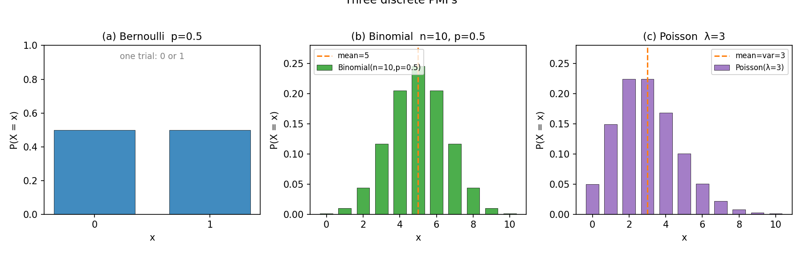
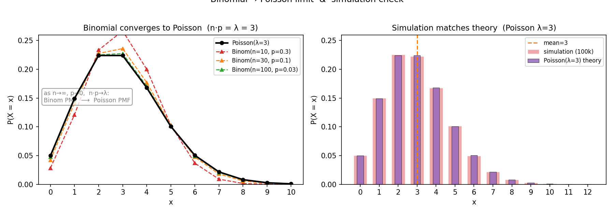

# 第 8 章 · 离散三剑客:伯努利、二项、泊松

> **核心问题**:前两篇我们认识了随机变量,也会用期望、方差去刻画它的"平均"和"波动"。可现实里的随机现象千千万——一次抛币、一批质检、一通电话——它们的长相难道每次都要从头画一遍?
>
> 这一章我们发现:**离散世界的随机性,翻来覆去就那么几张"经典脸"**。你见过一次伯努利、二项、泊松,以后遇到任何"计数""成败""稀有事件",都能直接对号入座。
>
> **读完本章你会明白**:
> - **伯努利**描述"一次试验的成败"(抛一次硬币、一次点击是否转化),它是所有离散分布的**原子**。
> - **二项**描述"重复 n 次伯努利、数出来几个成功"(扔 n 次硬币数正面、质检 n 件数次品)——它是伯努利**摞起来**的结果。
> - **泊松**描述"一段时间内某稀有事件发生几次"(电话呼入数、代码 bug 数),它是二项在 **n 大 p 小**时的极限长相。
> - 为什么泊松的**均值 = 方差 = λ**(平均多少,波动就多大)——稀有事件计数最美的性质。

---

## 引子:随机性不是一坨混沌

上一篇我们立起了两根柱子:期望(随机变量的平均重心)、方差(它有多晃)。可手里有了尺子,还得有"被量的东西"——也就是各种随机现象的**长相**。

随机性乍看是一坨乱七八糟的混沌。可你要是把同类现象的 PMF(概率质量函数,上一篇 P2-05 立的工具)画出来看,会发现它们**翻来覆去就长几张固定的脸**。就像人脸千千万,可归类起来无非"国字脸、瓜子脸、圆脸"——记住几张模板,街上扫一眼就能归类。

离散世界最常露脸的,有三位"常客":

- **伯努利**——管"一次"的成败(抛一次币、点一次广告)。
- **二项**——管"一串"伯努利数出来的成功数(扔 n 次币、质检一批货)。
- **泊松**——管"一段时间里稀有事件发生几次"(电话呼入、bug 数)。

这三位,就是离散世界的"三剑客"。这一章我们一个一个见真容,最后还揭开一个秘密——**它们其实是一家人**,二项是伯努利的累加,泊松又是二项的极限。

> 本章把 PMF 当**已知工具**直接用(它是什么,第 5 章已立)。我们这里只管:每种分布**描述什么场景**、PMF **长什么样**、**三者怎么串起来**。

---

## 章首·一句话点破

> **离散随机现象,翻来覆去就三种长相:伯努利(一次成败)、二项(多次成败的计数)、泊松(稀有事件的计数)。见到"成败",认伯努利;见到"数成功次数",认二项;见到"数稀有事件",认泊松——三位一体,二项是桥。**

这是结论。下面倒过来拆:从最简单的一次成败,一路搭到泊松那个最反直觉的"均值=方差"。

---

## 一、伯努利:所有离散分布的"原子"

### 提问:最小最小的随机,长什么样

把随机变量想成乐高积木。要搭出任何复杂的离散分布,你需要最小的、不可再分的**那块积木**是什么?

答案:一次只有两种结果的试验。抛一次硬币(正/反)、掷一次骰子看点数大不大(≥4 / <4)、用户点一次广告(转化/不转化)、病人做一次检测(阳性/阴性)——把它们抽象掉具体内容,只剩骨架:**这次试验,要么"成功",要么"失败"**。

这就是**伯努利分布(Bernoulli distribution)**。

> **直觉**:伯努利就是"一次抛币"。它只关心一件事——这一次,是不是"成功"(记作 1)。成功概率是 p,失败概率是 1−p。随机变量 X 只能取 0 或 1,就两种取值。

PMF 一行就能写完:

```
   P(X = 1) = p,     P(X = 0) = 1 − p
```

画出来,就是两根柱子:一根在 0,高度 1−p;一根在 1,高度 p。p=0.5 时两根一般高(图 8.1(a))。

### 不这样理解会怎样

你可能觉得"这么简单的东西也配叫分布?"——但它是整个离散世界的地基。

> **不这样理解会怎样**:如果你脑子里没有"伯努利"这个原子,你就**没法系统理解**任何更复杂的离散现象。扔 n 次硬币数正面(二项),其实就是**把 n 个伯努利加起来**。泊松,又是二项的极限。逻辑回归(第 19 章)直接把标签建模成"每个样本是一个伯努利试验"。**抓不住原子,就抓不住整座大厦。**

### 所以这样看

伯努利虽小,五脏俱全。它也有期望、方差(用上一篇的公式):

- **期望**:E[X] = 0·(1−p) + 1·p = **p**。(长期平均下来,成功的比例就是 p。)
- **方差**:Var(X) = E[X²] − (E[X])² = p − p² = **p(1−p)**。

> **钉死这件事**:伯努利的期望就是 p 本身。这不是巧合——p 的含义本来就是"成功的概率",长期重复,成功比例趋近 p(大数定律,第 13 章)。**公式 = 直觉**,在这里严丝合缝。

还有个细节值得记住:**方差 p(1−p) 在 p=0.5 时最大**(=0.25),往两边(都成功或都失败)变小。直觉:p=0.5 时最"拿不准",波动最大;p 接近 0 或 1 时几乎确定,波动趋零。**不确定性,在五五开时最浓。**

> **真实场景**:互联网公司天天算"转化率"——每点一次广告,是一次伯努利试验(p = 转化率)。一万个用户点进来,就是一万个伯努利。"转化率"这个词,本质就是个伯努利的 p。

---

## 二、二项:把伯努利摞起来,数成功

### 提问:扔 n 次硬币,正面几次

伯努利只管一次。可现实里我们更关心**多次**:

- 扔 10 次硬币,有几次正面?
- 质检抽 20 件,有几件次品?
- 一万用户里,有多少人转化?

这些问题的共同点:**重复做了 n 次独立的伯努利试验(每次成功概率都是 p),数出来一共成功了几次**。这个"成功的次数",就是一个新的随机变量,它服从**二项分布(Binomial distribution)**,记作 X ~ Binomial(n, p)。

> **直觉**:二项 = n 个独立同分布的伯努利**加起来**。X = B₁ + B₂ + … + Bₙ,每个 Bᵢ 都是伯努利(p)。所以 X 的取值范围是 0 到 n 的整数——最少一次都没成功,最多全成功。

### 不这样理解会怎样

> **不这样理解会怎样**:如果你没建立"二项 = 伯努利之和"这层联系,二项的 PMF 公式在你眼里就是一串天书:

```
   P(X = k) = C(n, k) · p^k · (1−p)^(n−k)        其中 C(n,k) = n! / (k! (n−k)!)
```

这个组合数 C(n,k)、p 的 k 次方、(1−p) 的 n−k 次方,单看像凭空冒出来的。可一旦你用"伯努利之和"的视角,它自己就**长出来**了——下面"模拟佐证"里我们拆给你看。

### 所以这样看:把公式拆成三块直觉

P(X = k) 这条公式,其实是三个直觉拼起来的:

**第一块:选定哪 k 次成功。** n 次试验里,要恰有 k 次成功、n−k 次失败。先问:**哪 k 次**成功?从 n 个位置里挑 k 个,挑法有 C(n,k) 种。比如扔 3 次币恰好 2 次正面,可以是(正正反)、(正反正)、(反正正),共 C(3,2)=3 种排列。

**第二块:这 k 次都成功。** 每次成功概率 p,要 k 次独立地都成功,概率相乘:p × p × … × p = p^k。

**第三块:剩下 n−k 次都失败。** 每次失败概率 1−p,共 n−k 次:(1−p)^(n−k)。

三块相乘(独立性让概率相乘,第 3 章):

```
   P(恰 k 次成功) = C(n,k) · p^k · (1−p)^(n−k)
```

> **钉死这件事**:二项 PMF 不是天上掉下来的公式。它是"**选哪些位置成功 × 这些位置成功 × 剩下位置失败**"三件事乘起来。记住这三块,公式你自己写得出来。

**期望和方差**(用上一篇的线性性,极易推):X 是 n 个伯努利之和,每个期望 p、方差 p(1−p),独立相加——

- E[X] = **np**(n 次试验,每次成功概率 p,长期平均成功 np 次。直觉得不能再直觉。)
- Var(X) = **np(1−p)**(独立方差相加。)

n=10、p=0.5 时,E[X]=5,Var(X)=2.5。也就是说,扔 10 次硬币,**平均 5 次正面,标准差约 √2.5 ≈ 1.58**——大多数时候正面次数在 5 ± 3 之间晃。看图 8.1(b),那座钟形小山丘的峰,正落在 x=5。

> **真实场景**:一家厂次品率 p=2%。抽 100 件质检,X = 次品数 ~ Binomial(100, 0.02)。E[X]=2,所以"平均两件次品"是基准。如果某次抽到 8 件次品(离均值 2 有 4 个标准差),你就该怀疑——是不是这批货出了问题?(第 16 章假设检验的伏笔。)

---

## 三、泊松:稀有事件的计数器

### 提问:一小时里,电话响几次

到本章最反直觉的一位了。

呼叫中心记录"每小时电话呼入数"、运维记录"每天服务器宕机次数"、测试团队记录"每千行代码 bug 数"、路口记录"每周交通事故数"——这些问题的共同点是什么?

> **直觉**:它们都在数"**一段时间(或一块区域)里,某件事发生了几次**"。而且,这件事是**稀有的**(一小时也就响几十次电话,不是几万次)、**单次发生概率极小**(任意一秒里来电话的概率微乎其微)、但**总机会很多**(一小时有 3600 秒)。

这种"很多次极小概率的独立机会,数最后发生了几次"的随机变量,服从**泊松分布(Poisson distribution)**,记作 X ~ Poisson(λ)。λ(读 lambda)是它唯一的参数,含义是:**这段时间里,平均发生几次**。

PMF:

```
   P(X = k) = (λ^k · e^(-λ)) / k!        k = 0, 1, 2, ...
```

e ≈ 2.718 是自然常数,k! 是 k 的阶乘。λ=3 时,P(X=0)=0.0498,P(X=2)=P(X=3)=0.2240,峰在 2、3 之间(图 8.1(c))。

### 不这样理解会怎样

> **不这样理解会怎样**:这条 PMF 看起来更吓人——e 的负 λ 次方、λ 的 k 次方、阶乘,这都什么跟什么。可它的来历其实极其自然:它就是**二项分布在 n 大 p 小时的极限长相**(下一节展开)。如果不懂这个来历,你只会背"电话数服从泊松",却说不清**为什么**电话数偏偏服从这么个古怪公式。概率论里"会背不懂"的人,九成卡在这一步。

### 所以这样看:泊松描述的是"密度",不是"概率"

换一个更顺的理解角度。泊松真正刻画的,是**事件的"发生率"λ**:

> **钉死这件事**:参数 λ 就是"单位时间(或单位面积、单位体积)内事件发生的**平均次数**"。一条热线一小时平均接 3 通电话 → λ=3;一段代码平均每千行 0.5 个 bug → λ=0.5。**给定 λ,整张分布的形状就被钉死了。**

为什么 PMF 长这样?后面"二项→泊松极限"那一节会从二项严格推出来。这里先给个直觉:把一小时切成 3600 个"1 秒"的小格,每个小格要么来一通电话(概率极小)、要么不来。这是个 Binomial(n=3600, p=λ/3600)——n 巨大、p 微小、np=λ 固定。这种"巨量微概率"的极限,就是泊松。

**所以泊松本质上是二项的"瘦版"**:当试验次数多到无穷、每次成功概率小到无穷、但乘积 np 稳定在 λ 时,二项就塌缩成泊松。这个塌缩过程,是本章最该看清楚的一幕。

> **真实场景(泊松的三大主场)**:
> - **呼叫中心 / 客服**:每小时呼入电话数。
> - **可靠性 / 运维**:设备单位时间故障次数、网站每天 503 错误数。
> - **质量控制 / 生物**:单位体积里的细菌数、单位面积里的缺陷数、每页书的错别字数。
>
> 共同点:都是在数"稀有但频繁有机会发生"的事件。见到"计数 + 稀有",第一反应就应该是泊松。

---

## 四、最深的一节:二项怎样逼近泊松

这是本章的"深落点",也是三剑客之所以"三位一体"的关键。读懂这一节,你对泊松就**真懂**了,不再只是背公式。

### 提问:电话数为什么是泊松,不是二项

回到电话那个例子。你说"一小时电话呼入数"是泊松(λ=3)。可它明明也可以用二项想啊:把一小时切成 3600 个 1 秒,每秒要么来电话(成功)要么不来,X ~ Binomial(3600, λ/3600)。**那它到底服从二项还是泊松?**

答案:**两个都对,而且当 n 越来越大,二项的答案越来越接近泊松的答案。** 泊松就是二项在"n→∞, p→0, np→λ"这个极限下的长相。

### 不这样理解会怎样

> **不这样理解会怎样**:如果你不掌握这个极限,你会面临两个尴尬。第一,算 Binomial(3600, 0.000833) 的 PMF,那个 C(3600, k) 的组合数大得离谱(3600 的阶乘!),手算和计算机都难受;可泊松的 PMF 只用 λ=3,几行就算完。**泊松是二项的"省事替身"。** 第二,你解释不了"为什么电话数偏偏长这个形状"——它不是天上掉的,它是二项被推到极限**自然塌缩**出来的。

### 所以这样看:固定 np=λ,看二项怎样塌成泊松

我们做一件你马上能用 Python 复现的事:**固定 np = λ = 3,让 n 越来越大、p 越来越小,看二项的 PMF 怎么一步步贴上泊松**。

| n | p | np | P(X=0) 二项 | P(X=0) 泊松 | P(X=3) 二项 | P(X=3) 泊松 |
|---|---|---|---|---|---|---|
| 10 | 0.30 | 3 | 0.0282 | 0.0498 | 0.2668 | 0.2240 |
| 30 | 0.10 | 3 | 0.0424 | 0.0498 | 0.2361 | 0.2240 |
| 100 | 0.03 | 3 | 0.0476 | 0.0498 | 0.2275 | 0.2240 |
| 300 | 0.01 | 3 | 0.0490 | 0.0498 | 0.2252 | 0.2240 |

看那张表的走势:**n 从 10 涨到 300,二项的 PMF 一步步向泊松靠拢**。到 n=300,两者在小数点后第三位才分得开。再大下去,几乎完全重合(图 8.2 左)。

> **钉死这件事(本章最该带走的一句话)**:当试验次数 n 很大、每次成功概率 p 很小、而乘积 **np 稳定在一个常数 λ** 时,**Binomial(n, p) 的 PMF 趋近于 Poisson(λ) 的 PMF**。这就是"二项逼近泊松"。直觉上:**"很多次独立试验,每次极小概率成功" → "稀有事件的计数"**,二项自然演变成泊松。

### 为什么会这样(尝一口推导)

这个极限不是魔法,可以拆开看。二项 PMF:

```
   P(X=k) = C(n,k) p^k (1−p)^(n−k)
```

把 p 换成 λ/n(n 大 p 小,np=λ),做一点代数(用到 (1−λ/n)^n → e^(−λ) 这个经典极限):

```
   C(n,k) (λ/n)^k (1−λ/n)^(n−k)
   = [n(n−1)...(n−k+1) / k!] · (λ/n)^k · (1−λ/n)^(n−k)
   →  (λ^k / k!) · e^(−λ)        当 n→∞
```

最后一步用到的两个极限:(n(n−1)…(n−k+1))/n^k → 1(因为 k 固定,n 大时每一项都接近 n),(1−λ/n)^n → e^(−λ)(自然常数 e 的定义之一)。于是二项 PMF 在极限下,**恰好**变成泊松 PMF。

> 这个推导不要求你背,但**看一遍**你会发现:泊松那条吓人的公式,从头到尾就是二项被推到极限的自然结果。它不是新东西,它是老朋友换了身衣服。

### 配图:一眼看清这个塌缩

下图左边把这件事画给你看:固定 np=λ=3,泊松(黑色圆点连线)是目标,二项(n=10/30/100)是逼近者。n 越大,二项的三角越贴近泊松的圆点。下图右边则是模拟佐证——扔十万次 Poisson(3),模拟直方图(红)和理论 PMF(紫)严丝合缝。





---

## 五、彩蛋:泊松的均值 = 方差 = λ(为什么"平均多少,波动就多大")

兑现"越深越好"。泊松有一个极其优美的性质,也是它最反直觉的地方:

> **钉死这件事**:若 X ~ Poisson(λ),则 **E[X] = λ,且 Var(X) = λ**。均值和方差**相等**,都等于 λ。

直觉上:**平均一小时来 3 通电话,标准差就是 √3 ≈ 1.73 通**。平均来 100 通,标准差就 √100=10 通。**平均越多,绝对波动越大,但相对波动(标准差/均值 = 1/√λ)反而越小**——这和上一篇方差讲的"波动随规模增大"是一致的。

### 为什么会这样

从二项的极限一眼就看穿。Binomial(n, p) 的均值是 np、方差是 np(1−p)。当 np=λ 且 p→0 时:

- 均值 np → λ。
- 方差 np(1−p) = λ(1−p) → λ(因为 p→0,1−p→1)。

**均值和方差在极限下都被"挤"到同一个值 λ。** 这就是泊松均值=方差的根——它继承了二项的"np"这个均值,但 p 趋零把方差的(1−p)因子抹平了。

> **不这样理解会怎样**:如果你只背"泊松均值=方差=λ",你会觉得这是巧合。可一旦从二项极限看,它是**必然**——稀有事件计数的"平均"和"波动"绑在了一起,**平均多少,波动就多大**。这个性质在排队论、保险精算、可靠性工程里天天用:设计呼叫中心坐席数,既要照顾平均呼入(λ),也要照顾波动(√λ),一个数同时管两件事,省心。

> **再深一点(排队论的伏笔)**:泊松过程(Poisson process)是"事件以速率 λ 随机发生"的数学模型,电话呼入、原子衰变、地震发生都常用它建模。泊松过程的两个灵魂性质:① 任意一段时间内事件数服从 Poisson(λ·t);② 相邻两次事件的**间隔**服从指数分布(下一篇 P3-09 的主角之一)。**泊松(计数)和指数(间隔)是一枚硬币的两面**——这个暗线,下一篇会接上。

---

## 模拟佐证:拿 Python,把三剑客跑一遍

概率论的招牌——结论你别信书,自己扔随机数验证。这一节用三段代码,把伯努利、二项、泊松、以及二项→泊松极限,全部跑出来。

### 纸笔例子 1:二项 PMF 自己长出来

扔 3 次硬币,恰好 2 次正面的概率。用"三块直觉"拆:

- 选哪 2 次正面:C(3,2) = 3 种(正正反、正反正、反正正)。
- 这 2 次都正面:p² = 0.25。
- 剩下 1 次反面:(1−p)¹ = 0.5。

P(X=2) = 3 × 0.25 × 0.5 = **0.375**。用 scipy 核对:`binom.pmf(2, 3, 0.5)` = 0.375。严丝合缝。

### 纸笔例子 2:泊松的"3 通电话"

呼叫中心 λ=3,P(X=0)(一小时一通都没有) = e^(−3) ≈ **0.0498**。也就是说,**大约每 20 个小时里,有 1 个小时一通电话都没有**——比你以为的少。P(X≥5)(一小时来 5 通以上)= 1 − P(≤4) ≈ **0.185**。每 5 个多小时就有一次"忙不过来"。

### 蒙特卡洛 1:二项模拟,均值趋近理论

```python
import numpy as np
from scipy.stats import binom
rng = np.random.default_rng(42)

# 扔十万次 Binomial(10, 0.5)
s = rng.binomial(10, 0.5, 100_000)
print(s.mean(), s.var())      # -> 5.002, 2.503   理论 5.0, 2.5
```

扔十万次,模拟均值 5.002、方差 2.503,死死贴住理论的 5.0 和 2.5。**这就是上一篇期望、方差的定义,在二项上的一次实战。**

### 蒙特卡洛 2:泊松模拟,均值=方差=λ

```python
from scipy.stats import poisson
s = rng.poisson(3, 100_000)   # 十万次 Poisson(3)
print(s.mean(), s.var())      # -> 2.989, 2.992   理论 3.0, 3.0
```

模拟均值 2.989、方差 2.992,**两个数几乎相等,都贴 3**。这就是"泊松均值=方差=λ"的字面验证——你不用背公式,扔十万次它自己告诉你。

### 蒙特卡洛 3:二项→泊松极限,亲眼看塌缩

```python
lam = 3
for n in [10, 30, 100, 300]:
    p = lam / n
    # 比较 二项 vs 泊松 在 k=0,3,6 三点的 PMF
    b = [binom.pmf(k, n, p) for k in (0, 3, 6)]
    q = [poisson.pmf(k, lam) for k in (0, 3, 6)]
    print(f"n={n:4d} p={p:.3f}  binom={b}  poisson={q}")
```

跑出来你会看到:n=10 时两者差不少,n=300 时几乎重合。**亲眼盯它塌缩,比读十遍公式都管用。** 这就是图 8.2 左半的来历。

> 三段代码,你十分钟跑完。跑完你会发现:**三剑客不是三个孤立的公式,而是一条从"一次成败"长到"稀有计数"的链**——伯努利是原子,二项是累加,泊松是极限。整条链,你都能用 `rng` 亲手摸到。

---

## 章末小结

### 用一个场景回顾本章

想象你管一家小公司的客服(概率论的典型主场)。

每一个打进来的电话,是一次**伯努利**吗?不——伯努利是"一次试验的成败"。更贴切地说,每个用户**是否转化**(下单/没下单)是一次伯努利(p = 转化率)。一万用户就是一万个伯努利,**数出来多少人转化**,那是**二项** Binomial(10000, p)。

至于**每小时电话呼入几次**——单次概率极小(任意一秒来电话的概率微乎其微)、机会巨多(一小时 3600 秒)、数最后来几次——这是**泊松** Poisson(λ=平均每小时几通)。而它之所以是泊松,是因为它本质是 Binomial(3600, λ/3600) 在 n 大 p 小时的极限长相。

三剑客,就这样在一家小公司里同框出现:**伯努利(单次成败)→ 二项(多次成败的计数)→ 泊松(稀有事件的计数)**。它们不是三个无关的公式,是**一条链**。

### 本章在驯服随机性的哪一步

回到全书主线:**一切概率概念,都是驯服随机性的工具。**

前两篇我们有了"量化随机"的尺子(期望、方差)。这一篇(第 3 篇)开始**认识随机性的长相**——给离散随机现象归类。这一章,你给离散世界立了三块模板:见到"一次成败",认伯努利;见到"数成功次数",认二项;见到"稀有事件计数",认泊松。以后再碰到任何离散现象,**不用从头画 PMF,直接对号入座**——这就是"认识经典长相"的意义。

而最深的收获,是看清**三剑客其实是一家人**:二项 = 伯努利之和,泊松 = 二项之极限。**离散世界的随机性,从最简单的一次抛币,一路长到电话呼入,共用同一条数学血脉。** 这是"单次盲,大量稳"主线的又一个侧面——单次是伯努利(盲),累加成二项、极限成泊松(大量,于是有了稳定的形状和参数)。

### 五个"为什么"清单

如果你只能记五件事,记这五件:

1. **伯努利**:一次试验的成败,X∈{0,1},P(X=1)=p。它是所有离散分布的原子;期望=p,方差=p(1−p)。
2. **二项**:n 次独立伯努利的成功次数,X ~ Binomial(n,p)。PMF = C(n,k)p^k(1−p)^(n−k) = "选位置 × 成功 × 失败"三块相乘;期望=np,方差=np(1−p)。
3. **泊松**:一段时间内稀有事件发生次数,X ~ Poisson(λ)。λ = 平均发生几次。**计数 + 稀有** → 第一反应泊松。
4. **二项→泊松极限**:n 大、p 小、np=λ 时,Binomial(n,p) ⟶ Poisson(λ)。电话数是泊松,因为它本质是 Binomial(3600, λ/3600) 的极限。
5. **泊松均值=方差=λ**:平均多少,波动就多大(标准差 √λ)。从二项极限一眼看穿——均值 np→λ,方差 np(1−p)→λ。

### 想继续深入,该往哪钻

- **亲手扔**:上面三段蒙特卡洛代码,改 n、改 p、改 λ,盯二项均值趋近 np、盯泊松均值方差双双贴 λ、盯二项 PMF 塌缩成泊松。**改一晚上,三剑客就是你的肌肉记忆。**
- **看极限动画**:把 `n` 从 10 滑到 1000(np 始终=3),画一族二项 PMF 逐步覆盖泊松——这就是图 8.2 左的动态版,自己写个循环 + `plot_pmf` 就能做。
- **排队论伏笔**:泊松过程——事件以速率 λ 发生,任意时长 t 内事件数 ~ Poisson(λt),相邻事件间隔 ~ 指数分布。下一篇 P3-09 会接上指数分布,你会看到泊松和指数是一枚硬币的两面。
- **进阶**:泊松的"可加性"(独立泊松之和仍是泊松,参数相加)在排队论、保险理赔总额建模里是基石;泊松回归(广义线性模型)是计数数据的标准工具,第 19 章逻辑回归的近亲。

---

> 三剑客见面了:伯努利是一次成败的原子,二项是它累加后的计数,泊松是二项在"巨量微概率"下的极限长相。离散随机性的几种经典脸,你认全了。可现实里还有一类随机变量不是"数几次",而是"量大小"——身高、等待时间、测量误差——它们取值连续,长相是光滑的曲线。翻开 **第 9 章 · 连续主力:均匀、指数、正态**——你会发现,连续世界也有三张反复出现的脸,而其中的正态,就是上一篇第 1 章预告过的那座钟形山丘的真身。
