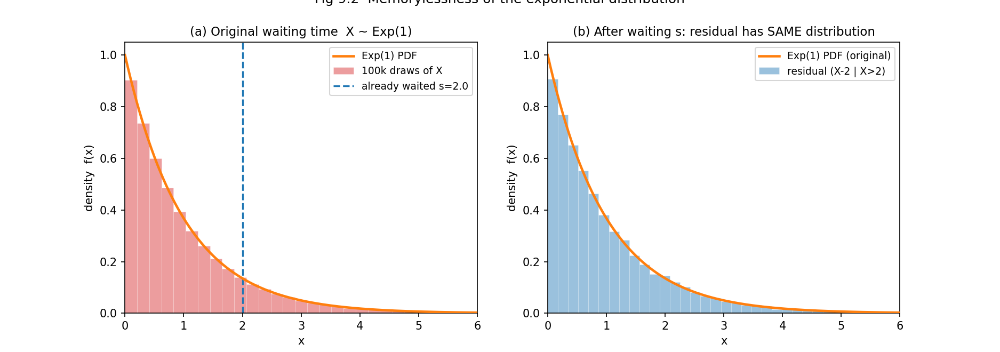
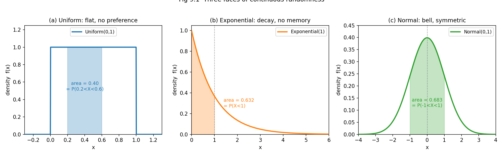

# 第 9 章 · 连续主力:均匀、指数、正态

> **核心问题**:上一章我们认识了离散世界的"三剑客"——伯努利、二项、泊松。可现实里一大半随机现象根本不是"数几次",而是"量大小":一个人的身高、等公交的时间、一次测量的误差、一锅水的温度读数。它们的取值不是 0、1、2、3 这样的整数,而是一条**连续的实数轴**——长相是光滑的曲线,不是离散的柱子。
>
> 这一章我们问:连续世界里的随机性,是不是也有几张反复出现的"经典脸"?
>
> 答案是:有,而且翻来覆去也就三种——**均匀(无偏好)、指数(无记忆)、正态(钟形)**。认识这三位,你就认识了大半连续世界。
>
> **读完本章你会明白**:
> - **均匀分布**描述"完全无偏好"的随机——随机到一点、舍入误差、掷飞镖扎到哪。它的密度是一条**扁平的直线**。
> - **指数分布**有一个反直觉到让人发笑的性质——**无记忆性**:等了 10 分钟的公交车,接下来"还要等多久"的分布,跟一开始一模一样。它是"等待时间""元件寿命"的标准模型。
> - **正态分布**是连续世界的**绝对主角**,身高、误差、噪声几乎都钟形对称——本章只给直觉和长相,真正深挖它**为什么**处处出现,留给第 10 章。
> - 一条暗线:**泊松过程里相邻两次事件的间隔,服从指数分布**(呼应上一章 P3-08)——计数和间隔,是一枚硬币的两面。

---

## 引子:从"数几次"到"量大小"

上一章结尾我们留了一句话:离散三剑客管的是"计数"——电话响几次、硬币正面几次、bug 出几个。可现实里更多随机现象是**量大小**:

- 你随手在数轴上 0 到 1 之间点一个点,落在哪?(连续)
- 你等下一班公交,等多久?(连续,以分钟计,不是几次)
- 你量一个人的身高,1.70、1.723、1.7238…小数位可以无限细化。(连续)
- 温度计读数、电压波动、GPS 定位误差……全是连续的实数。

这些"量大小"的随机变量,**取值铺满一段区间**(甚至整条实数轴),而不是离散地蹦出几个整数。上一篇 P2-05 我们已经立了工具:连续随机变量用**概率密度函数 PDF** 描述——曲线本身不是概率,**曲线下的面积才是概率**。本章就拿这个工具,把连续世界最常见的三张脸**一一见真容**。

> 本章把 PDF、CDF、积分当**已知工具**(第 5 章已立)。我们这里只管:每种连续分布**描述什么场景**、PDF **长什么样**、**为什么**长这样。

---

## 章首·一句话点破

> **连续随机现象,翻来覆去也就三种长相:均匀(无偏好的扁平直线)、指数(衰减的无记忆曲线)、正态(对称的钟形山丘)。见到"完全随机到点 / 舍入误差",认均匀;见到"等待时间 / 元件寿命",认指数;见到"误差 / 聚合量",认正态。其中正态是主角,但它的深挖留给第 10 章——本章先认脸。**

这是结论。下面倒过来拆:从最朴素的"无偏好"开始,一路走到那座钟形山丘;中间那座指数曲线,藏着本章最深、也最反直觉的一个秘密——**无记忆性**。

---

## 一、均匀分布:随机性的"无偏好"

### 提问:什么叫"完全随机地落在一个区间里"

最简单的连续随机,是什么样?

闭上眼,在 0 到 1 之间**随手点一个点**。落在哪里?你没有任何理由偏向任何一处——0.3 比 0.7 不更可能,0.5 也不比 0.5001 特殊。这种"在区间里完全无偏好"的随机,就是最朴素的连续分布:**均匀分布(Uniform distribution)**,记作 X ~ Uniform(a, b)。

> **直觉**:均匀分布就是"在区间 [a, b] 里随便撒一个点,每一点机会均等"。它的 PDF 是一条**扁平的水平线**——从 a 到 b,密度处处相等;区间外,密度为零(落不出去)。

PDF 长这样:

```
              1 / (b − a)     当 a ≤ x ≤ b
   f(x) =
              0               其他
```

为什么密度是 `1/(b−a)` 这么个值?因为**整条曲线下的面积必须 = 1**(第 5 章:总面积是 100% 的概率)。区间宽 (b−a),高度 h,矩形面积 = (b−a)·h = 1,所以 h = 1/(b−a)。**密度被"总面积 = 1"这一条规矩钉死了**,不是随便选的。

画出来,就是一条横线,下面填一个矩形(图 9.1(a))。最标准的 Uniform(0,1),密度在 [0,1] 上恒等于 1。

### 不这样理解会怎样

> **不这样理解会怎样**:均匀看起来简单得可笑,可它是**所有数值计算里随机性的源头**。`numpy.random`、`rand()`、几乎所有编程语言的"随机数"函数,底层吐出的都是 Uniform(0,1)。你要模拟任何别的分布(指数、正态、二项…),根上都得先要一个均匀随机数。**均匀是连续随机世界的发电机。** 不懂均匀,你就读不懂任何模拟代码的第一行。

### 所以这样看:面积就是概率

均匀分布最美的一点:**概率 = 区间长度占比**。要算 X 落在某段 [c, d] ⊂ [a, b] 的概率,不用积分,直接算**那段区间占整段的比例**:

```
   P(c ≤ X ≤ d) = (d − c) / (b − a)
```

Uniform(0,1) 里,P(0.2 < X < 0.6) = (0.6 − 0.2) / 1 = **0.40**。看图 9.1(a) 那块填色的小矩形——它的面积,正好是 0.40。**几何 = 概率**,在均匀上被推到了极致。

期望和方差也好算(均匀的"重心"在中点):

- **期望** E[X] = **(a + b) / 2**(区间中点。直觉:对称分布的重心在中央。)
- **方差** Var(X) = **(b − a)² / 12**(区间越宽,波动越大;分母 12 来自 `∫(x−中点)² dx`,均匀分布的标志数字。)

Uniform(0,1):E[X] = 0.5,Var(X) = 1/12 ≈ 0.0833,标准差 ≈ 0.289。Uniform(170, 180)(假设身高"在这个范围内均匀"):E[X] = 175,标准差 ≈ 2.89 cm。

> **真实场景(均匀的三大主场)**:
> - **随机到点**:程序里 `rng.random()` 吐出的就是 Uniform(0,1);蒙特卡洛积分、随机采样、密码学,全靠它当源头。
> - **舍入误差**:把 1.7238 截到两位小数 1.72,舍掉了 0.0038——这种"截断/四舍五入丢掉的那一点",工程上常假设成 Uniform(−0.5, 0.5)×精度,方差正好是 `精度²/12`(这就是"12"的来历之一,数字信号处理里的招牌数字)。
> - **完全无知时的先验**(贝叶斯):你对参数一无所知,先给个均匀分布("哪个值都不偏袒")——这是"无信息先验"的最朴素形态(第 17 章会 revisit)。

> **钉死这件事**:均匀 = 无偏好。见到"在一段区间里随机落点、每处机会均等",认均匀。它是连续随机的**发电机**和**默认假设**——没别的信息时,就假设均匀。

---

## 二、指数分布:无记忆的等待

均匀太"扁"了,没起伏。我们来看一张**有形状**的曲线——而且这张曲线藏着一个本章最深、最反直觉的秘密。

### 提问:等下一班公交,等多久

公交站牌写着"平均每 10 分钟一班",可车从来不会**准时**到——有时 2 分钟就来,有时你等了 25 分钟还在风中。这种"等待时间"长什么样?

类似的场景遍布生活与工程:

- 元件**寿命**:一颗灯泡平均用 1000 小时,可它**什么时候坏**?
- 服务器**两次故障间隔**:这台机器上次宕机到现在多久,下次什么时候挂?
- 地震、原子衰变、客服来电**两次事件之间的间隔**;
- 你打客服电话,**多久才轮到你**。

这些问题的共同点:**在等一件"随时可能发生、但你不知道具体何时"的事**。这种"等待时间"的分布,几乎总是**指数分布(Exponential distribution)**,记作 X ~ Exponential(λ) 或 Exp(rate=λ)。

> **直觉**:指数分布描述"下一次事件什么时候来"。它的 PDF 是一条**从高处急速衰减**的曲线——短时间发生的概率大(车马上来),越拖概率越小(等很久的概率很低),但永远不会到零(理论上等再久都有可能)。λ 叫**速率(rate)**:单位时间里平均发生几次。λ 越大,衰减越快,平均等待越短。

PDF:

```
   f(x) = λ · e^(−λx)        当 x ≥ 0
```

e ≈ 2.718 是自然常数。λ=1(单位时间平均发生 1 次)时,曲线在 x=0 处取到最高值 1,然后以 e 的负次方衰减——x=1 时密度掉到 0.368,x=2 时 0.135,x=3 时 0.050,像滑梯一样越滑越缓(图 9.1(b) 那条橙色衰减曲线)。

> **参数怎么读**:工程里更常用"平均等待时间"而不是"速率"。若平均等 10 分钟一班公交,那 λ = 1/10(每分钟来 0.1 班),scipy 里写 `expon(scale=10)`——scale 就是平均等待。**λ 是"多快发生",scale 是"平均等多久",互为倒数。** 这两种写法在不同书里混用,记住它们是一回事就行。

期望方差(指数分布的招牌数字):

- **期望** E[X] = **1/λ** = scale(平均等多久。直觉得不能再直觉。)
- **方差** Var(X) = **1/λ²** = scale²(标准差 = 期望。这条很反直觉,下面会讲。)

Exp(1):E[X] = 1,标准差 = 1。公交平均 10 分钟一班(Exp(scale=10)):E[X] = 10 分钟,标准差**也是** 10 分钟——也就是说,等 0 分钟和等 20 分钟,离均值一样远。**等待时间的波动,和等待本身一样大。**

### 不这样理解会怎样:无记忆性——本章最反直觉的秘密

到本章最深的地方了。指数分布藏着一个会让你笑出声的性质,叫**无记忆性(memorylessness)**:

> **钉死这件事(本章最该带走的一句话之一)**:对指数分布,P(X > s + t | X > s) = P(X > t)。翻译成人话:**你已经等了 s 分钟,接下来"还要等多久"的分布,和你一开始就站在那儿等的分布,一模一样。**

这是什么意思?拿公交来说。你刚到站,平均等 10 分钟。可你已经等了 10 分钟还没来——按理说"应该快了吧"?**不。** 指数分布告诉你:已经等了 10 分钟之后,你"接下来还要等"的平均时间,**仍然是 10 分钟**。等了 20 分钟没来?接下来还是平均再等 10 分钟。**等待的时间从来不会"积累",公交车从来不会"因为你等得久就更该来了"。**

这听起来荒谬——可它恰恰是"完全随机"的标志。我们用一张图把它钉死:



看图 9.2:左边是原始的 Exp(1) 分布 + 十万次模拟的直方图;右边是"已经等过 s=2 之后,剩余等待时间"的分布(把原始样本里 >2 的那些减去 2)。**两张图,曲线重合、直方图重合——剩余等待的形状,和一开始完全一样。** 模拟数据也证实:E[X] ≈ 0.999,而 E[X−2 | X>2] ≈ 1.004,两个数几乎相等。

> **不这样理解会怎样**:无记忆性极度反直觉,因为我们的生活经验是"东西用久了就该坏"(老化)、"等久了就快来了"(进度)。可**指数分布描述的是"完全无老化"的系统**——元件不会因为用得久就更容易坏(它永远像新的),公交不会因为你等得久就更该来(每一次发车和上一次独立)。如果你不懂无记忆性,你会**错误地**用指数分布去建模会老化的东西(人、机械轴承、电池)——那会得出荒唐的结论(比如"80 岁的人和 20 岁的人预期寿命一样")。**指数只适合"无老化、纯随机"的等待和寿命。**

### 所以这样看:无记忆性是指数的"身份证"

反过来——无记忆性不只是指数的一个性质,它是指数的**定义特征**。这句话值得单独拎出来:

> **钉死这件事**:在所有**连续**分布里,**只有指数分布**满足无记忆性。(离散世界里对应的,是几何分布——"扔多少次才出第一个正面",也是无记忆的:前面扔了 10 次没出正面,接下来还要扔几次的分布不变。)

这是"唯一性定理":你只要假定"剩余寿命和已用时长无关"(纯随机、无老化),数学上**必然**推出指数分布。所以指数不是某个数学家拍脑袋发明的公式,它是"无记忆"这个直觉的**唯一数学化身**。**想建模无老化的等待/寿命,你没有别的选择,只能用指数。**

(尝一口为什么:P(X>t) 这种"超过 t 还没发生"的概率叫**生存函数**。指数的生存函数是 `e^(−λt)`。无记忆性要求 `P(X>s+t | X>s) = P(X>s+t)/P(X>s) = P(X>t)`,即 `e^(−λ(s+t))/e^(−λs) = e^(−λt)`——一约分就成立。**只有指数函数有这种"乘除变加减"的本事**,所以只有 `e^(−λt)` 这种形式的生存函数能满足无记忆性。)

### 一条暗线:泊松过程的间隔 = 指数(呼应 P3-08)

还记得上一章的泊松分布吗?它数"一段时间内稀有事件发生几次"。这里有个**同一枚硬币的两面**:

> **钉死这件事(暗线收口)**:如果事件以速率 λ 随机发生(泊松过程),那么——
> - 任意一段时间 t 内,**事件发生几次** ~ Poisson(λt)(上一章的计数面);
> - 相邻两次事件的**间隔时间** ~ Exponential(λ)(本章的等待面)。

电话呼入:一小时内来几通,是 Poisson(λ·1);两通电话之间隔多久,是 Exponential(λ)。原子衰变:一段时间衰变几个,是 Poisson;两次衰变间隔多久,是 Exponential。**计数(Poisson)和间隔(Exponential),是同一个随机过程的两副面孔**——上一章数"几次",这一章量"隔多久"。这条暗线,把离散和连续两大主力焊在了一起。

> **真实场景(指数的三大主场)**:
> - **等待时间**:公交、电梯、客服电话排队(只要"随机到达、无调度偏好")。
> - **寿命/可靠性**:电子元件、灯泡、服务器宕机(只要"无老化",用旧了和新的没区别)。**注意:会老化的东西(人、机械、电池)不该用指数**,要用 Weibull 分布(本章不展开,彩蛋会点一句)。
> - **两次事件间隔**:地震、衰变、来电、保险理赔之间的时间(泊松过程的间隔面)。

---

## 三、正态分布:钟形的主角

最后一位,是连续世界的**绝对主角**——出场频率高到离谱。

### 提问:为什么身高、误差、噪声都长一个样

量一万个人的身高,画成直方图;测一万次同一个零件的长度,画成直方图;采集一万次传感器噪声,画成直方图——你会看到**同一张脸**:一座**对称、单峰、像钟一样**的山丘。中间最高(均值附近最密集),两边对称地衰减,远处几乎为零。

这种"钟形山丘",就是**正态分布(Normal distribution)**,也叫**高斯分布(Gaussian distribution)**,记作 X ~ Normal(μ, σ²) 或 N(μ, σ²)。

> **直觉**:正态分布是"误差的默认长相"。两个参数钉死它的全部形状:
> - **μ(均值)**:钟形的**中心**在哪。钟形山丘的最高峰,正落在 x = μ。
> - **σ(标准差)**:钟形**有多胖**。σ 小,山丘又高又窄(数据集中);σ 大,山丘又矮又宽(数据散开)。

PDF(这个公式看着吓人,但**它只是钟形曲线的数学化身**,本章不要求记住,第 10 章会拆):

```
   f(x) = (1 / (σ√(2π))) · e^(−(x − μ)² / (2σ²))
```

关键不是公式,是**形状**:对称、单峰、由 μ 和 σ 两个数完全决定。换 μ,钟形左右平移;换 σ,钟形胖瘦伸缩(但不改变总面积,永远 = 1)。

### 不这样理解会怎样

> **不这样理解会怎样**:正态分布的 PDF 公式是全书最吓人的之一——e 的负平方、2π、σ√…一坨。如果你只背公式,你会觉得"这是个数学家凭空捏的怪物"。可一旦你抓住"它是**误差聚合后的默认长相**"这层直觉,公式就成了副产品。**正态不是被发明的,是被发现的——它是大量随机叠加后,自然界"长出来"的形状。** 这个"为什么"非常深,是第 14 章中心极限定理的核心,也是第 10 章正态深挖的主线。本章你只需要记住:**见到对称钟形,认正态;两个参数 μ 和 σ 钉死它。**

### 所以这样看:先认脸,深挖留后

本章对正态,**只给直觉和长相**,不展开(第 10 章专门深挖)。三件事先钉死:

**第一,标准化(Z 分数)**。任何正态 N(μ, σ²),都能通过 `Z = (X − μ) / σ` 变成**标准正态** N(0, 1)——所有正态都是"标准正态平移 + 拉伸"出来的。所以查表、算概率,只需要一张标准正态表。这是第 10 章的主角,本章点一句。

**第二,68-95-99.7 法则**。对任何正态:

- 约 **68%** 的数据落在 μ ± σ 内(图 9.1(c) 那块绿色填色,面积 ≈ 0.683);
- 约 **95%** 落在 μ ± 2σ 内;
- 约 **99.7%** 落在 μ ± 3σ 内。

身高 N(171, 7²):约 68% 的人在 164 ~ 178 cm,95% 在 157 ~ 185 cm。P(身高 > 185) ≈ 2.3%(用 scipy 核对:`norm(171,7).sf(185)` = 0.0228)——每 44 个人里大约有一个高于 185,和直觉吻合。

**第三,正态的"反常之处"——它到处都是**。身高、误差、噪声、考试成绩、零件尺寸、血压读数……几乎任何"由许多小因素叠加而成"的量,都钟形。这不是巧合,是中心极限定理的必然(第 14 章)。**正态是随机性在"大量聚合"后的默认归宿。**

> **真实场景(正态的三大主场,本章只点,深挖 P3-10)**:
> - **生物测量**:身高、血压、考试成绩(大量基因/环境因素叠加)。
> - **测量误差**:物理实验、传感器噪声(许多小误差叠加 → 钟形)。
> - **聚合统计量**:样本均值、平均点击率(中心极限定理,第 14 章)。

> 本章只让正态**露个脸**——它是钟形、对称、由 μ 和 σ 决定。至于**它为什么处处都是**(中心极限)、**怎么查表算概率**(标准化)、**68-95-99.7 怎么精确推导**,全部留给第 10 章。这里你只需要"认脸":见到钟形山丘,心里默念"正态,两个参数"。

---

## 四、配图:三种 PDF 长什么样

下图把三种连续主力的长相并排放出来,每个 PDF 都 fill 了一段区间,直观显示"曲线下的面积 = 概率"。



看图说话:

- **(a) 均匀**:一条**扁平的直线**。任何等长区间的概率都一样——这就是"无偏好"。fill 的 [0.2, 0.6] 占整段 40%,面积正好 0.40。
- **(b) 指数**:一条**急速衰减的曲线**,从 x=0 的高点滑下去。fill 的 [0, 1] 面积 ≈ 0.632——平均发生速率 1 的事,**63% 在第一个单位时间内就发生了**,但剩下的 37% 可能拖很久(无记忆,拖再久都不"该来")。
- **(c) 正态**:一座**对称的钟形山丘**,峰在 μ=0。fill 的 [−1, 1] 面积 ≈ 0.683——68% 的数据落在均值 ± 1 个标准差内,这就是 68-95-99.7 法则的第一档。

**三种长相,三种性格**:扁平(无偏好)、衰减(无记忆)、钟形(聚合)。记住这三张脸,以后见到任何连续随机现象,先问"它像哪张脸"——对号入座,你就抓住了它的本质。

---

## 五、彩蛋:无记忆性的唯一性(本章最深)

兑现"越深越好"。这一节我们把这个反直觉的秘密,钉到数学的根上。

### 无记忆性不是指数的"性质",是它的"定义"

前面说了:在连续分布里,**只有指数满足无记忆性**。这是**唯一性定理**。怎么理解这种"唯一"?

> **钉死这件事**:无记忆性是一个**等式约束**——它要求"剩余寿命的分布"和"原始分布"完全一样。这个约束**强到只允许一个解**,那就是指数。换句话说:**你只要假定"系统无老化",数学就把你逼到指数分布,别无选择。**

这不是巧合,是数学的刚性。我们来尝一口为什么。

### 一行半的证明(尝一口)

设生存函数 S(t) = P(X > t)。无记忆性说:`S(s + t) / S(s) = S(t)`,即 `S(s+t) = S(s)·S(t)`。这是一个**函数方程**:函数在"加法"上表现得像"乘法"。

什么样的函数满足 `f(s+t) = f(s)·f(t)`?数学上能证明(用一点连续性假设),**只有指数函数** `f(t) = e^(ct)` 满足它。所以 S(t) = e^(ct);又因为 S 必须递减(越等越不可能还没发生),所以 c < 0,令 c = −λ:

```
   S(t) = e^(−λt)        →  这就是指数分布的生存函数
```

从生存函数反推 PDF:f(x) = −S'(x) = λ·e^(−λx)——正好是指数分布的 PDF。**从头到尾,我们没有"假设"指数分布,是"无记忆"这个直觉把指数分布逼出来了。**

> **再深一点**:离散世界的"无记忆"对应**几何分布**(扔多少次硬币才出第一个正面)。几何是"离散版的指数",指数是"连续版的几何"——它们是同一族"无记忆分布"的离散/连续双胞胎。这条暗线,把第 8 章的几何和第 9 章的指数,悄悄连在了一起。

### 不这样理解会怎样:建模的陷阱

> **不这样理解会怎样**:如果你不懂无记忆性是指数的**唯一身份证**,你会犯两类错。第一,**用指数建模会老化的东西**——人、机械、电池。指数分布会告诉你"80 岁老人的剩余预期寿命和 20 岁一样"(因为无记忆)——这和现实完全对不上:人越老越脆弱,预期寿命会随年龄缩短。会老化的系统,该用 **Weibull 分布**(它的"失效率"会随时间变化,能建模老化和磨合期)。第二,**见到等待时间就用指数**——只有"纯随机、无老化、无调度"的等待才该用指数。公交如果按时刻表发(有调度),间隔更接近均匀或正态,不是指数。**指数是"完全随机"的标志,不是"所有等待"的万能钥匙。**

---

## 模拟佐证:拿 Python,把三位主力跑一遍

概率论的招牌——结论你别信书,自己扔随机数验证。这一节用代码,把均匀、指数、正态的 PDF,以及指数的无记忆性,全部跑出来。

### 纸笔例子 1:均匀的概率 = 长度比

Uniform(2, 6),P(3 < X < 5) = (5 − 3) / (6 − 2) = 2/4 = **0.5**。用 scipy 核对:`uniform(loc=2, scale=4).cdf(5) − uniform(loc=2, scale=4).cdf(3)` = 0.5。严丝合缝——**面积就是长度比**。

E[X] = (2+6)/2 = 4,Var(X) = (6−2)²/12 = 16/12 ≈ 1.333。

### 纸笔例子 2:指数的中位数 = ln2 / λ

Exp(1) 的中位数 m 满足 P(X < m) = 0.5,即 1 − e^(−m) = 0.5,e^(−m) = 0.5,m = ln2 ≈ **0.693**。也就是说,虽然平均等 1 个单位时间,但**超过一半的情况,等不到 0.693 就发生了**——这是因为分布右偏(长尾),少数"等很久"的把均值拉高了。中位数 0.693 < 均值 1.0,**这是右偏分布的标志**。

### 纸笔例子 3:正态的 68-95-99.7

身高 N(171, 7²)。P(身高 > 185) = P(Z > (185−171)/7) = P(Z > 2) = 1 − 0.9772 = **0.0228**。每 44 人中大约 1 人高于 185 cm。scipy 核对:`norm(171, 7).sf(185)` = 0.0228。

### 蒙特卡洛 1:三种分布,模拟直方图趋近 PDF

```python
import numpy as np
from scipy.stats import uniform, expon, norm
rng = np.random.default_rng(42)

N = 100_000
u = rng.uniform(0, 1, N)        # Uniform(0,1)
e = rng.exponential(scale=1, N) # Exp(1)  (scale = 平均等待 = 1/λ)
z = rng.normal(0, 1, N)         # N(0,1)

print("uniform  mean,var:", round(u.mean(),4), round(u.var(),4), "  theory 0.5, 0.0833")
print("expon    mean,var:", round(e.mean(),4), round(e.var(),4), "  theory 1.0, 1.0")
print("normal   mean,var:", round(z.mean(),4), round(z.var(),4), "  theory 0.0, 1.0")
```

扔十万次,模拟均值方差死死贴住理论值。**这就是三种 PDF 的来历——你不用信书,扔出来它自己长出来。**

### 蒙特卡洛 2:指数无记忆性,亲眼看"等过没用"

```python
s = 2.0  # 假设你已经等了 2 个单位时间
raw = rng.exponential(scale=1.0, size=200_000)
cond = raw[raw > s] - s   # 已等 s 后, 剩余等待

print("E[X]           =", round(raw.mean(), 4), "  (theory 1.0)")
print("E[X-s | X>s]   =", round(cond.mean(), 4), "  (should ALSO be ~1.0)")
print("P(X > 3)       =", round(np.mean(raw > 3), 5))
print("P(X-s > 3|X>s) =", round(np.mean(cond > 3), 5), "  (should match)")
```

跑出来你会看到:E[X] ≈ 0.999,E[X−2 | X>2] ≈ 1.004——**两个数几乎相等**。P(X>3) 和 P(X−2>3 | X>2) 也几乎一样。**等了 2 个单位时间之后,剩余等待的均值还是 1;等了也没用——这就是无记忆性的字面验证。** 这就是图 9.2 的来历。

> 两段代码,你十分钟跑完。跑完你会发现:**三种连续主力的 PDF,不是数学家画的,是十万次随机扔出来的形状;无记忆性不是玄学,是两个均值数字严丝合缝地相等。** 公式 = 直觉,在模拟里被钉死。

---

## 章末小结

### 用一个场景回顾本章

想象你早高峰出门上班(概率论的生活主场)。

出家门前你看一眼 App,发现下一班公交"平均 10 分钟一班"——**可它从来不准**。这种"平均速率已知、但具体何时来完全随机"的等待,服从**指数分布** Exp(λ=1/10)。它有个让你笑出声的性质:**你已经等了 10 分钟没来,接下来还要平均等 10 分钟**——无记忆性。因为公交的每一次发车和上一次独立,等再久也不"该来"。

到了公司,你测一个零件的长度,反复测一万次,画成直方图——**一座对称的钟形山丘**,峰在标称尺寸处。这是**正态分布** N(μ, σ²),由均值 μ(中心)和标准差 σ(胖瘦)决定。68% 的测量落在 μ ± σ 内。**误差聚合后的默认长相,就是钟形。**

中午你写一段代码,要 `rng.random()` 生成"完全随机"的数——它在 0 到 1 之间**无偏好地**撒,每一点机会均等。这是**均匀分布** Uniform(0,1),一条扁平的直线。**它是所有模拟的发电机。**

三位主力,就这样在一个工作日里同框:**均匀(无偏好的扁平)、指数(衰减的无记忆)、正态(对称的钟形)**。它们不是三个孤立的公式,是连续随机现象翻来覆去的三张经典脸。

### 本章在驯服随机性的哪一步

回到全书主线:**一切概率概念,都是驯服随机性的工具。**

上一篇(第 8 章)你给**离散**随机现象立了三块模板——伯努利、二项、泊松。这一章(第 9 章)你给**连续**随机现象也立了三块模板——均匀、指数、正态。以后再碰到任何连续现象,**不用从头画 PDF,先问"它像哪张脸"**:

- 见到"区间内无偏好撒点、舍入误差、完全随机" → **均匀**。
- 见到"等待时间、元件寿命、两次事件间隔(无老化)" → **指数**,牢记无记忆。
- 见到"误差、聚合量、对称钟形" → **正态**,认脸即可,深挖看第 10 章。

而最深的收获,是两条暗线被接上:**① 泊松(计数)和指数(间隔)是一枚硬币的两面**——上一章数"几次",这一章量"隔多久",同一个泊松过程的两种视角;**② 无记忆性是指数的唯一身份证**——"无老化"这个直觉,在数学上只能推出指数,别无选择。**连续世界的随机性,也有自己的血脉——从无偏好的扁平,到无记忆的衰减,到聚合的钟形,每一种长相都对应一种"随机性的性格"。**

### 五个"为什么"清单

如果你只能记五件事,记这五件:

1. **均匀**:区间 [a,b] 内无偏好撒点,PDF 是扁平直线 `1/(b−a)`。概率 = 区间长度比。期望 = (a+b)/2,方差 = (b−a)²/12。**它是所有随机数生成的源头。**
2. **指数**:等待时间/寿命(无老化),PDF = λe^(−λx),从高处急速衰减。期望 = 1/λ = scale,方差 = 1/λ²(标准差 = 期望)。**见到"等待/寿命 + 无老化",认指数。**
3. **无记忆性(本章最该带走)**:P(X>s+t | X>s) = P(X>t)。已等 s 后,剩余等待分布**和原始分布完全一样**。连续世界里**只有指数**满足(离散版是几何)。"等过没用"是"完全随机"的标志。
4. **正态**:钟形对称,由 μ(中心)和 σ(胖瘦)决定。68-95-99.7 法则(±1σ/±2σ/±3σ)。**它是误差和聚合量的默认长相**,深挖(为什么处处是它)留第 10 章。
5. **泊松–指数暗线**:泊松过程里,事件**计数** ~ Poisson(λt),相邻事件**间隔** ~ Exponential(λ)。计数和间隔是一枚硬币的两面。

### 想继续深入,该往哪钻

- **亲手扔**:上面的两段蒙特卡洛代码,改 λ、改 μ 和 σ,盯三种直方图贴上 PDF 曲线,盯指数的无记忆性两个均值相等。**改一晚上,三位主力就是你的肌肉记忆。**
- **无记忆性动画**:把"已等 s"的 s 从 0 滑到 5,画一族剩余等待的直方图——你会发现它们**全部重合**。这是图 9.2 的动态版,自己写个循环就能做。
- **Weibull 对比**:会老化的系统(电池、轴承)用 Weibull——它的失效率随时间变化(磨合期下降、老化期上升)。和指数的"失效率恒定"对比着看,你就懂了"什么时候该用指数、什么时候不该"。
- **正态深挖(P3-10)**:为什么身高、误差、噪声都钟形?中心极限定理(第 14 章)会给你答案。标准化、Z 分数、查表、68-95-99.7 的精确推导,下一章全部展开。
- **排队论**:指数分布是排队论(M/M/1 等模型)的地基——顾客到达间隔、服务时间都假设指数。无记忆性让排队论的数学大幅简化(马尔可夫性)。这是运筹学、计算机系统设计的主场。

---

> 三位主力见面了:均匀是无偏好的扁平直线,指数是无记忆的衰减曲线,正态是聚合的钟形山丘。连续随机世界的经典脸,你认全了,也看清了泊松(计数)与指数(间隔)是一枚硬币的两面。可那张钟形脸——它为什么这么常见?身高、误差、噪声,为什么都长成它?这背后藏着概率论最美的定理之一。翻开 **第 10 章 · 正态深挖:为什么处处是它**——你会看到钟形曲线的真身,以及那个让"大量随机自动长出规律"的中心极限定理的伏笔。
