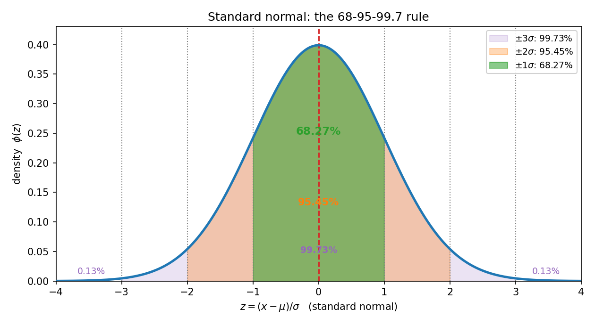
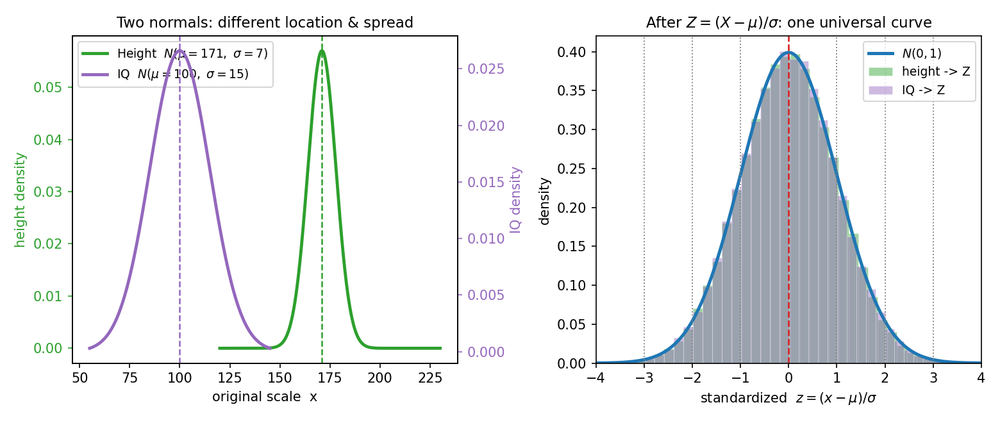
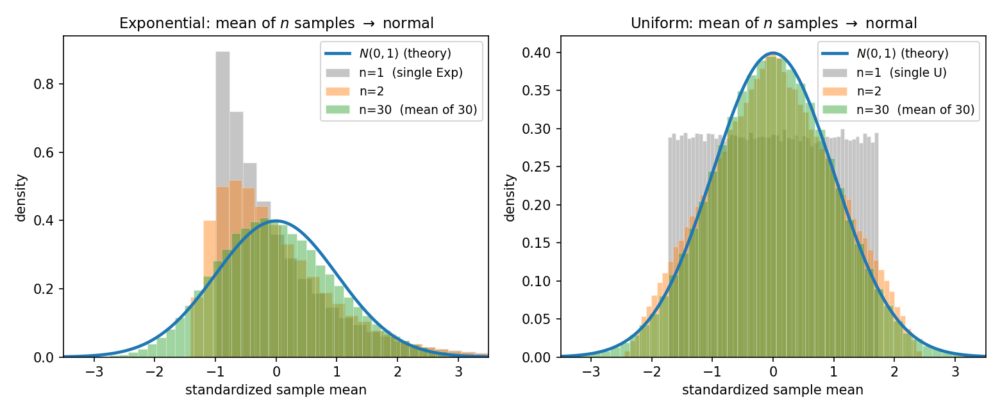

# 第 10 章 · 正态深挖:为什么处处是它

> **核心问题**:上一章你给正态"认了脸"——钟形、对称、由 μ 和 σ 决定,然后我把所有真问题都留到了这一章:它那张吓人的 PDF 公式到底在描述什么?为什么身高、考试分数、测量误差、传感器噪声……千差万别的量,画出来都是同一座钟形山丘?又凭什么用一个 `Z = (X−μ)/σ` 就能把所有正态问题,化成同一张可查的表?
>
> 这一章我们把这位连续世界的绝对主角**彻底吃透**:它为什么是"自然界的默认分布"、怎么用标准化把它变成通用工具、以及它和"大量稳"铁律之间那条最深的暗线。
>
> **读完本章你会明白**:
> - **68-95-99.7 法则**从哪来:它不是背下来的口诀,是"钟形 ± 几个 σ"对应的面积,精确值我用 scipy 核对给你看。
> - **标准化(Z 分数)**为什么是正态的万能钥匙:任何正态 `N(μ, σ²)` 经 `Z = (X−μ)/σ` 都变成同一条标准正态 `N(0,1)`——所以全天下只需要一张表。
> - **为什么处处是正态**:身高、误差、噪声都钟形,不是巧合,是"许多小因素加起来"的必然。这是**中心极限定理**的伏笔(正式定理在第 14 章),也是 P0-01 那张"100 个均匀随机数求和变钟形"预告图的真身。
> - 一个进阶视角:**在只知均值和方差的全部分布里,正态是熵最大的**——它最"不预设",所以也是无知时的默认选择。这呼应 P6-18 信息熵。

> **如果一读觉得太难**:先只记住三件事——① 见到钟形,认正态,两个参数 μ(中心)、σ(胖瘦)钉死它;② `Z = (X−μ)/σ` 把任何正态变成标准正态,查表/比较都靠它;③ **68-95-99.7**:±1σ 装 68%,±2σ 装 95%,±3σ 装 99.7%。其余的"为什么处处是它""最大熵"都是锦上添花,读不懂先放放。

---

## 引子:从"认脸"到"破案"

上一章结尾我说:正态你先**认脸**就行——它钟形、对称、两个参数 μ 和 σ 决定;至于它**为什么处处都是**、**怎么查表算概率**、**68-95-99.7 怎么精确推导**,全部留到第 10 章。现在就是这一章。

我们手上的线索其实早就埋好了,只是上一章没拆:

- P0-01 那张震撼过你的预告图——"100 个完全随机的均匀数加起来,画出钟形"。我们当时只说"中心极限定理的影子",没解释。
- P3-09 那句"见到误差/聚合量/对称钟形,认正态",也只是"对号入座",没说**凭什么**。
- 连 P3-09 给出的 68-95-99.7,也只是**结论**——为什么偏偏是 68%、95%、99.7% 这三个数?

这一章要破的,就是这三桩案子:**68-95-99.7 从哪来**、**标准化为什么是万能钥匙**、**正态为什么处处都是**。破到最后你会发现,三桩案子其实是同一桩——它们都指向"大量随机自动长出规律"这一件事。

---

## 章首·一句话点破

> **正态分布,是"许多独立小扰动加起来"必然长出的形状。所以它才处处都是——身高是无数基因环境的叠加、误差是无数微小扰动的叠加、噪声是无数热运动的叠加。而标准化 `Z=(X−μ)/σ` 把这些形形色色的钟形,全部翻译成同一条标准钟形,于是全天下只需要一张正态表。68-95-99.7,就是这条标准钟形在 ±1σ、±2σ、±3σ 三道门里的固定面积。**

这是结论。下面倒过来拆:先从最具体的"68-95-99.7 这三个数到底怎么来的"入手,再讲标准化这把万能钥匙,最后破"为什么处处是它"这桩最大的案子,结尾尝一口最大熵。

---

## 一、68-95-99.7:三个数,不是口诀,是面积

### 提问:为什么偏偏是 68、95、99.7 这三个数

上一章你记住了一条法则:对任何正态 `N(μ, σ²)`,数据落进 μ±σ 的约占 68%,μ±2σ 约占 95%,μ±3σ 约占 99.7%。你大概当口诀背了。可这三个数**到底怎么来的**?它们精确值是多少?为什么不是 70%、90%、99% 这种整数?

要拆这桩案子,先得回到上一章立过的一块基石:**连续分布的概率,等于 PDF 曲线下的面积**(P2-05)。所以"落在 μ±σ 内的概率",就是把标准正态 PDF 在 [−1, 1] 之间那块面积,积分出来。

> **直觉**:标准正态的 PDF 是一座对称钟形,峰在 0,两边快速衰减。"±1σ 以内的面积",就是钟肚子最鼓那一段下面的面积;"±2σ"把翅膀也吃进来一截;"±3σ"几乎把整座钟都罩住了,只剩极细的两条尾巴。这三个面积,就是 68.27%、95.45%、99.73%。

把这三档面积一层一层叠起来,就是本章的招牌图——



看图说话:最深那块绿色(±1σ 内)装了 68.27% 的概率;把它再往外推一档到 ±2σ,橙色多出来一截翅膀,合计 95.45%;推到 ±3σ,紫色几乎罩住整座钟,只剩两条细到看不见的尾巴,合计 99.73%。**这三个数,就是这条标准钟形在 ±1σ、±2σ、±3σ 三道门里的固定面积——换个 μ、换个 σ,钟形会平移拉伸,但门里装多少面积,永远不变。**

### 不这样理解会怎样

> **不这样理解会怎样**:如果你只把 68-95-99.7 当口诀背,你会卡在两件事上。第一,你不知道**它对所有正态都成立**——你以为"身高 N(171,7²) 落在 164~178 占 68%"是身高的特殊性质,其实那是 ±1σ 面积的普适数字,智商 N(100,15²) 落在 85~115 也是同样的 68%。第二,你算不出**中间地带**——比如"身高落在 160~180 内的概率"既不是 68% 也不是 95%,你只会查表的人能算,只会背口诀的人抓瞎。

精确值我用 scipy 给你核对一遍(别凭印象记数字):

```
   P(|Z| < 1σ) = Φ(1) − Φ(−1) = 0.682689…  ≈ 68.27%
   P(|Z| < 2σ) = Φ(2) − Φ(−2) = 0.954500…  ≈ 95.45%
   P(|Z| < 3σ) = Φ(3) − Φ(−3) = 0.997300…  ≈ 99.73%
```

(`Φ` 是标准正态的累积分布函数 CDF,P0-01 之后的 P2-05 立过:它把"小于等于某值"的概率一次性算出来。)

还有几个**衍生**数,常被一起记,你顺手记住:

- 超出 ±2σ 的概率 ≈ 4.55%(双侧合计),**单侧** ≈ 2.28%——这就是 P3-09 那句"每 44 个人里大约有 1 人高于 185 cm"的来历(身高 N(171,7²),185 = μ+2σ,单侧 2.28%)。
- 超出 ±3σ ≈ 0.27%,单侧仅 0.13%——这就是工业上"**3σ 原则**"的来历:一个稳定的正态过程,产品落到 ±3σ 之外的概率只有千分之三,所以质量管控常用 3σ 当预警线(现代六西格玛还要更严)。
- 95% 对应的**精确**边界不是 ±2σ,而是 **±1.96σ**——统计课本里到处是 1.96 这个怪数字,根就在这:`Φ(1.96) = 0.975`,所以 [−1.96, 1.96] 区间面积 = 0.95,正好。第 16 章假设检验、置信区间,1.96 会反复出场。

### 所以这样看:68-95-99.7 是面积的速记

> **所以这样看**:68-95-99.7 不是玄学口诀,它是"标准钟形 ±kσ 这道门里装多少面积"的速记。要精确就算积分(或查 Φ 表),要快估就用这三档。记住 1.96 这个精确分位点(95% 的双侧重合点),你后面学统计会顺手很多。

> **钉死这件事**:对**任何**正态 `N(μ, σ²)`,无论 μ 是 171 还是 100,σ 是 7 还是 15,"μ±σ / μ±2σ / μ±3σ"这三道门里装的面积,永远是 68.27% / 95.45% / 99.73%。这就是"68-95-99.7 法则"普适的真正原因——它刻在**标准钟形**的形状里,与 μ、σ 无关。

---

## 二、标准化:一把万能钥匙

### 提问:天下的正态有无数个,凭什么只背一张表

到此有个工程上极其要命的问题。正态 `N(μ, σ²)` 由两个参数 μ 和 σ 决定——μ 任取、σ 任取,组合起来是**无穷多个**不同的正态分布。身高是 N(171, 7²),智商是 N(100, 15²),某传感器噪声是 N(0, 0.01²)……每一个都要算概率,难道每个都要画一张表、背一张表?

数学家当然不会这么傻。他们发现了一件漂亮的事:**所有正态,本质上都是同一个正态的"平移 + 拉伸"**。

> **直觉**:把标准正态 `N(0, 1)` 这条钟形拿在手里。给它**乘个 σ**,钟形横向被拉伸(或压缩)成胖或瘦;再给它**加个 μ**,钟形整体平移到中心 μ。任何 `N(μ, σ²)` 都能从 `N(0, 1)` 这样"拉伸 + 平移"造出来。**反过来说,任何 `N(μ, σ²)`,都能通过"先减 μ、再除 σ",还原成同一条标准正态。**

这个"先减 μ、再除 σ"的操作,叫**标准化(standardization)**,造出来的新变量叫 **Z 分数(Z-score)**:

```
   Z = (X − μ) / σ        若 X ~ N(μ, σ²), 则 Z ~ N(0, 1)
```

它的几何含义一目了然——看下图:



左边是原始空间:身高钟形瘦(σ=7)、峰在 171;智商钟形胖(σ=15)、峰在 100——两条曲线位置、胖瘦全不一样。右边是标准化之后:身高的样本经 `(h−171)/7`、智商的样本经 `(q−100)/15`,**两座钟形山丘塌缩成同一条 N(0,1) 曲线**,直方图完全重合。**这就是标准化的威力:它把"无穷多个不同的正态",统统翻译成同一种语言。**

### 不这样理解会怎样

> **不这样理解会怎样**:如果你不会标准化,你每碰到一个新正态,都得重新算一遍积分、重新做一张表——而那张积分表的值,你手算不出来(正态 PDF 没有初等原函数,只能数值积分)。于是你被卡死在"每个正态都要查它专属的表"的窘境里,而这样的表有无数张。标准化让你**只需要一张标准正态表**(Φ 值表),天下所有正态的概率都从它换算。

而且标准化不止"省事",它还给你一把**比较的尺子**。看两个真实场景:

**场景一:跨尺度比较"谁更极端"**。一个学生数学考 85(全国 N(72, 8²)),英语考 92(N(80, 6²))。哪科更拔尖?原始分没法比(92 > 85,但英语平均也高)。**标准化**:

```
   数学 Z = (85 − 72) / 8 = +1.625
   英语 Z = (92 − 80) / 6 = +2.000
```

英语 Z 更大,**英语更拔尖**——它比全国平均高 2 个标准差,数学只高 1.625 个。**Z 分数把"原始分"翻译成"离均值几个标准差",跨尺度可比。** 这就是为什么 IQ 分数、SAT 分数、标准化考试都爱用"百分位"和"标准分"——本质都是 Z。

**场景二:质量控制判异常**。某零件标称长 50 mm,工艺标准差 0.02 mm。质检员测到一个 50.07 mm,要不要报警?算 Z:`(50.07−50)/0.02 = 3.5`——**离均值 3.5 个标准差**!对照 68-95-99.7,±3σ 之外的概率才千分之三,3.5σ 更稀罕,基本可以断定**工艺跑偏或测量出错**。这就是六西格玛质量管控的逻辑:用 Z 分数给"偏离程度"定一个普适标尺。

### 所以这样看:标准化 = 翻译成通用语言

> **所以这样看**:标准化不是技巧,是**正态的通用语**。任何正态问题,三步走完:① 把 X 化成 `Z = (X−μ)/σ`;② 在标准正态表上查 `Φ(Z)`;③ 把答案翻译回原问题。整个过程就像货币换算——天下货币无数种,先换成美元(标准正态),再比较、再算,最后想换回哪种都行。

> **钉死这件事**:Z 分数的意义有双重——**计算上**,它把任何正态变成标准正态,天下只需一张表;**解释上**,它直接告诉你"这个值离均值几个标准差",是一个**无量纲的、跨场景可比**的偏离度。这是统计学几乎所有方法(z 检验、t 检验、置信区间、p 值)的地基,第 16 章你会反复用。

(尝一口:标准化不改"分布族",只做线性变换 `aX+b`。一个有趣的事实——**正态分布是唯一在线性变换下保持正态的分布**(严格说是在"两个独立同分布之和仍属同族"意义上正态是稳定分布 stable distribution)。所以 `Z = (X−μ)/σ` 这个操作格外自然:它把正态映射成正态,而不是别的什么。)

---

## 三、为什么处处是它:中心极限定理的伏笔

现在破最大那桩案子——为什么身高、误差、噪声、考试分数都钟形?这件事深到足以单开一章(第 14 章中心极限定理),但这一节我先把直觉和伏笔给你,让你**先看见真相的轮廓**,正式证明留到 P4-14。

### 提问:为什么千差万别的量,长同一座钟

把不同领域的钟形摆在一起,你会觉得诡异:

- **身高**:由几百个基因位点 + 营养 + 童年健康 + …无数因素共同决定;
- **测量误差**:温度漂移、振动、读数偏差、仪器噪声……几十种小扰动叠加;
- **传感器噪声**:无数电子热运动的合力;
- **考试成绩**:大量题目的对错 + 临场发挥 + 知识点掌握……加起来的总分。

这些量**风马牛不相及**——基因、物理扰动、热运动、考试分数,它们的"底层机制"完全不同。可它们画出来,都是同一座对称钟形。这不是巧合能解释的。**一定有一个比"身高基因""测量原理"更深的、跨领域的共同原因。**

### 不这样会怎样:如果不是正态,世界会多混乱

> **不这样(理解)会怎样**:如果"大量因素叠加"不必然产生钟形,那统计学会坍塌。你想——样本均值是最常用的统计量,如果它没有"必然趋向某个固定分布"的性质,你今天抽样算出一个分布形状、明天又算出另一个,根本没法做推断。正因为"大量叠加趋向正态"是铁律,我们才敢用一张正态表,去处理身高、误差、点击率、血压……所有"聚合量"的概率问题。**正态的普遍性,撑起了统计学的半边天。**

### 所以这样看:把误差看成"很多小误差之和"

真相藏在一个极简的观察里:**任何"由许多独立、微小因素加起来"的量,其分布都趋向正态**。这就是**中心极限定理(Central Limit Theorem, CLT)**的口语版。

> **直觉(把误差拆开看)**:拿测量误差举例。一次测量的总误差,可以看成很多个独立的小误差之和——
> ```
>   总误差 = 温度漂移 + 振动 + 读数偏差 + 视差 + 仪器标定误差 + …
> ```
> 每个小误差自己是什么分布,我们**根本不知道**,也不重要。重要的是它们**独立**(互不影响)、**微小**(没有哪个独大)、**加在一起**。中心极限定理说:**只要满足这三条,和的分布,在大量叠加后,几乎不可避免地趋向正态。**
>
> 身高同理:它是几百个基因位点效应 + 营养 + 环境……的**和**。每一项独立、微小,叠加起来就是钟形。考试成绩同理:它是大量题目得分之和,也钟形。

这张直觉图,P0-01 你已经见过预告版了——把 100 个"完全随机、毫无规律"的均匀数加起来,重复 5 万次,画出和的分布,得到钟形。这里我们再看一张更狠的——**连明显不对称的分布,求平均后也趋向钟形**:



看图说话:左边是**指数分布**(明显右偏、有长尾,长得很不像正态),右边是**均匀分布**(扁平,也完全不像正态)。**n=1** 时(单抽一个),直方图就是原始分布的样子——指数右偏、均匀扁平。**n=2** 时(两个样本求平均),形状开始往中间收。**n=30** 时(30 个样本求平均),标准化后的直方图**死死贴住标准正态曲线**——不管底层是右偏的指数还是扁平的均匀,平均 30 次之后,统统长成钟形。**这就是中心极限定理的力量:它不在乎你从什么分布出发,只要你"求和/求平均"足够多次,钟形就必然长出来。**

> **钉死这件事(本章最该带走的一条)**:正态处处都是,不是因为它"好看",而是因为现实里**几乎所有可观测的量,都是许多独立小因素叠加的结果**——而"独立小因素之和"在数学上**必然**趋向正态。这条铁律叫**中心极限定理**,正式表述和证明在第 14 章。本章你只需要被它的力量震撼一次:**钟形,是随机性在"大量叠加"后自动长出的形状。**

(为什么"和"趋向正态,而不是趋向均匀、趋向指数?P4-14 会用特征函数严格证。这里给一个直觉钩子:正态是少数"由两个数(均值、方差)就能完全决定"的分布之一,而"求和"这种操作天然**只保留均值和方差的累加**——求和把高阶细节磨平了,只剩均值和方差,于是结果落进"只由均值方差决定"的那个分布,那就是正态。这个"磨平高阶、只剩二阶"的直觉,会在第 14 章变成严格证明。)

### 一条暗线:正态 = "大量稳"的化身

回扣全书主线——**单次盲,大量稳**(P0-01 立的灵魂)。中心极限定理,正是这条铁律最华丽的化身:

- **单次盲**:一次测量、一个人的身高、一次抽样的均值——具体值不可预测,可能偏离很远;
- **大量稳**:把许多独立小因素**加起来**,或把许多次抽样**平均起来**——结果**不再乱跑**,而是稳稳地、几乎确定地,落进一座对称钟形山丘里,99.7% 都困在 ±3σ 之内。

**正态分布,就是"大量稳"这件事在连续世界里的固定长相。** 你在第 9 章见到的钟形山丘,不是某个数学家的发明,是"随机性经大量叠加后必然凝结出的形状"。这也是为什么本书把正态当主角深挖——它是"驯服随机性"旅程里,你手里最趁手的那把"看到规律"的望远镜。

> 这条暗线还接上 P0-01 的两张图:**频率趋 0.5**(扔硬币的大数定律)+ **和趋钟形**(中心极限),是"大量稳"的两副面孔。大数定律说"平均会稳定到一个数"(第 13 章),中心极限说"在这个数附近的波动,是钟形的"(第 14 章)。两条铁律,一个灵魂。

---

## 四、彩蛋:最大熵视角——为什么无知时默认正态

兑现"越深越好"。这一节我们换一个完全不同的角度,再回答一次"为什么处处是正态"——这次不靠"求和",靠**信息熵**。

### 提问:只知道均值和方差,你该怎么猜这个分布

设想一个反推场景(P5 统计推断的预演):你手里**只有**一组数据的均值 μ 和方差 σ²,**别的什么都不知道**(不知道形状、不知道有没有偏、不知道取值范围)。现在让你**猜一个最合理的分布**来描述这批数据,你该猜什么?

直觉上你该猜"**最不预设额外信息**的那个分布"——既然只知道均值和方差,你就不该额外假定"它偏左""它有双峰""它有界"。**在所有均值=μ、方差=σ² 的连续分布里,哪一个"最不预设",也就是信息熵最大的那一个?**

答案是——**正态分布**。

> **直觉**:信息熵(P6-18 会正式讲)度量一个分布"有多不确定/有多不预设"。熵越大,分布越"散漫"、越不把概率集中到某些点上。数学上可以证明一个让人拍案的结果:**在所有均值和方差固定的连续分布里,正态分布的微分熵最大。** 换句话说,**正态是最"中庸"、最不偏不倚**的那个——它没做任何"额外的假设"。

我用 scipy 把"同样均值方差下,几种分布的熵"算出来给你看(均值=0、方差=1):

```
   正态     N(0,1)                   熵 = 1.4189  ← 最大
   拉普拉斯  Laplace(0, 1/√2)         熵 = 1.3466
   均匀     Uniform(−√3, √3)         熵 = 1.2425
```

看——同样"中心在 0、波动为 1",正态的熵(1.4189)比拉普拉斯高、比均匀更高。**正态是最不预设的那个。** 均匀虽然看着"最公平"(到处一样平),但它在方差固定时被限制在 [−√3, √3] 这个有界区间里,等于**偷偷假设了"取值有界"**——而正态没做这个假设(它的尾巴无限长),所以熵更大、更不预设。

### 不这样理解会怎样

> **不这样理解会怎样**:如果你不知道最大熵原理,你会对"为什么误差用正态建模"这件事只停留在"经验上它钟形"。最大熵给了你**第二个独立的理由**——当你对误差的机制一无所知、只知道它的平均幅度(方差),正态是你**最不主观**的选择。**这不是经验,是逻辑:在无知的状态下,正态是唯一不自作主张的分布。**

这条视角在机器学习里极其重要。P6-18 信息熵、P6-20 生成模型,都会回到"最大熵原理"——**当你对世界所知有限,应该选熵最大的那个模型,因为它最少地"硬塞"你没验证过的假设。** 这是贝叶斯派和频率派都接受的、一条跨领域的建模原则(叫 Jaynes 的最大熵原理)。

### 历史钩沉:高斯怎么用正态建模误差

最大熵是现代视角。历史上,正态的"默认"地位,最早是**高斯(Carl Friedrich Gauss)** 在 1809 年用另一条路立起来的。他研究天文观测的误差,问了一个天才的问题:

> **什么样的误差分布,能让"样本均值"成为真实位置的最佳估计?**

他反推出:这个误差分布必须长成 `e^(−(x−μ)²/(2σ²))` 这种钟形——**正是正态**。换句话说:**只要你认同"取多次观测的平均是最靠谱的估计",误差的分布就必须是正态。** 这是从"估计原则"反推出"分布形状",和最大熵的"从无知推出分布"是两条殊途同归的路,都指向同一个钟形。

> **钉死这件事(彩蛋收口)**:正态之所以是"自然界的默认分布",有**三条独立的理由**——
> 1. **求和(中心极限)**:大量独立小扰动加起来,必然趋向正态(P4-14);
> 2. **最大熵**:只知均值方差时,正态是最不预设、最中庸的选择(P6-18);
> 3. **估计原则(高斯)**:认同"取平均最靠谱",误差分布就必为正态。
>
> 三条路,同一座钟。这就是为什么"见到误差/聚合量/无知先验",几乎可以条件反射地认正态——它从多个独立方向,都被逼到了同一个形状。

---

## 模拟佐证:拿 Python,把钟形跑出来

概率论的招牌——结论你别信书,自己扔随机数验证。这一节用代码,把 68-95-99.7、标准化、中心极限伏笔全部跑出来。

### 纸笔例子 1:68-95-99.7 的精确值

标准正态 `Z ~ N(0,1)`:

```
   P(|Z| < 1) = Φ(1) − Φ(−1) = 0.8413 − 0.1587 = 0.6827  ≈ 68.27%
   P(|Z| < 2) = Φ(2) − Φ(−2) = 0.9772 − 0.0228 = 0.9545  ≈ 95.45%
   P(|Z| < 3) = Φ(3) − Φ(−3) = 0.9987 − 0.0013 = 0.9973  ≈ 99.73%
```

scipy 核对:`norm.cdf(1) − norm.cdf(−1)` = 0.682689,严丝合缝。**这三个数不是口诀,是积分面积。**

### 纸笔例子 2:身高的极端值(标准化实战)

全国成年男性身高 `N(171, 7²)`。"高于 185 cm"和"高于 192 cm"各占多少?

先标准化:185 = μ + 2σ,192 = μ + 3σ。所以:

```
   P(身高 > 185) = P(Z > 2)  = 1 − Φ(2) = 0.0228       约 2.3%, 每 44 人一个
   P(身高 > 192) = P(Z > 3)  = 1 − Φ(3) = 0.00135      约 0.13%, 每 740 人一个
```

scipy 核对:`norm(171, 7).sf(185)` = 0.0228,`norm(171, 7).sf(192)` = 0.00135。(`sf` 是 survival function = 1 − cdf,算"大于某值"最直接。) **不用画整张身高分布图,标准化之后,全靠标准正态这一张表。**

### 纸笔例子 3:智商的跨尺度比较

智商 `N(100, 15²)`。IQ=130 算多聪明?标准化:`(130−100)/15 = 2.0`——离均值 **2 个标准差**,只有 2.28% 的人更高。IQ=145 呢?`(145−100)/15 = 3.0`——3σ,只有 0.13% 的人更高,约千分之一的水平(所谓"天才线"的统计含义)。**Z 分数让"130""145"这些原始分,变成可感可比的"几个标准差"。**

### 蒙特卡洛 1:十万次正态样本,验证 68-95-99.7

```python
import numpy as np
from scipy.stats import norm
rng = np.random.default_rng(42)

N = 200_000
z = rng.normal(0, 1, N)                       # 标准正态, 扔二十万次

print("sim  P(|Z|<1) =", round(np.mean(np.abs(z) < 1), 4), "  theory 0.6827")
print("sim  P(|Z|<2) =", round(np.mean(np.abs(z) < 2), 4), "  theory 0.9545")
print("sim  P(|Z|<3) =", round(np.mean(np.abs(z) < 3), 4), "  theory 0.9973")
print("sim  mean,std  =", round(z.mean(), 4), round(z.std(), 4), "  theory 0, 1")
```

跑出来你会看到:sim P(|Z|<1) ≈ 0.6818,P(|Z|<2) ≈ 0.9537,P(|Z|<3) ≈ 0.9972,均值 ≈ −0.0008,标准差 ≈ 1.003——**模拟死死贴住理论**。这就是图 10.1 的来历:那条钟形曲线和三个面积,不是画的,是二十万次随机扔出来的。

### 蒙特卡洛 2:标准化,把两个不同正态变成同一条曲线

```python
rng = np.random.default_rng(42)
height = rng.normal(171, 7, 100_000)          # 身高 N(171, 7^2)
iq     = rng.normal(100, 15, 100_000)         # 智商 N(100, 15^2)

zh = (height - 171) / 7                        # 标准化
zi = (iq     - 100) / 15

print("height -> Z:  mean,std =", round(zh.mean(), 4), round(zh.std(), 4))
print("iq     -> Z:  mean,std =", round(zi.mean(), 4), round(zi.std(), 4))
print("both P(|Z|<1):", round(np.mean(np.abs(zh)<1), 4), round(np.mean(np.abs(zi)<1), 4))
```

两个本来风马牛不相及的正态,标准化后,均值都 ≈ 0、标准差都 ≈ 1,`P(|Z|<1)` 都 ≈ 0.68。**这就是图 10.2 的来历——无穷多个正态,翻译成同一种语言。**

### 蒙特卡洛 3:中心极限伏笔——不对称分布求平均后变钟形

```python
rng = np.random.default_rng(42)

for n in [1, 2, 30]:
    means = rng.exponential(scale=1.0, size=(200_000, n)).mean(axis=1)
    z = (means - means.mean()) / means.std()   # 标准化便于对比形状
    print(f"Exp  n={n:>2}:  P(|Z|<1)={np.mean(np.abs(z)<1):.4f}  P(|Z|<2)={np.mean(np.abs(z)<2):.4f}")
```

你会看到:n=1 时 P(|Z|<1) 远偏离 0.68(指数右偏,形状不对);n=2 时开始接近;n=30 时几乎贴住 0.68 / 0.95——**指数这种明显不对称的分布,平均 30 次后,也长成了钟形。** 这就是图 10.3 的来历,也是 P0-01 那张 CLT 预告图的真身。

> 一段话总结:三段代码,把本章三桩案子全部跑通——**68-95-99.7 是二十万次扔出来的面积**,**标准化把身高和智商翻译成同一条曲线**,**求和/求平均把不对称分布逼成钟形**。公式 = 直觉,在模拟里被钉死。

---

## 章末小结

### 用一个场景回顾本章

想象你在一家零件厂当质检工程师(概率论的工业主场)。

你测一个标称 50 mm 的零件,反复测一万次,画成直方图——**一座对称的钟形山丘**,峰在 50,68% 的读数落在 50±σ 内。这是**正态分布**。你不需要重新为这个零件造一张表——**标准化** `Z = (X−50)/σ`,任何读数都能换算成"离标称几个标准差",直接对照**全天下通用**的标准正态表。一个 50.07 mm 的读数,Z = 3.5,你立刻警觉:千分之三之外的事,工艺跑偏了——这就是 **68-95-99.7 法则**和**3σ 质量管控**的日常用法。

可你心里一直有个疑问:**为什么偏偏是钟形?** 这章给了你答案。不是因为"正态好看",而是因为每次测量的总误差,是**温度漂移、振动、读数偏差、仪器噪声**等许多**独立、微小**的扰动**加起来**的——而"独立小扰动之和"在数学上**必然**趋向正态。这是**中心极限定理**(第 14 章正式证)。换个角度:当你对误差机制一无所知、只知道它的平均幅度,**正态是最不预设、最中庸的选择**(最大熵)——高斯两百年前就靠"取平均最靠谱"反推出了它。**求和、最大熵、估计原则,三条独立的路,都把误差逼成了同一个钟形。**

所以你不用纠结"我的零件误差到底该用什么分布建模"——只要它是"许多小因素叠加"的结果(几乎所有工程量都是),用正态就对了。**正态,是随机性在"大量叠加"后自动凝结出的形状,是"大量稳"在连续世界里的固定长相。**

### 本章在驯服随机性的哪一步

回到全书主线:**一切概率概念,都是"驯服随机性"的工具。**

第 8、9 章你给随机现象立了"经典长相"的模板——离散三剑客(伯努利、二项、泊松)、连续三主力(均匀、指数、正态)。这一章,你把其中**出场频率最高、最该吃透**的那位——正态——彻底拆透了:

- **68-95-99.7 法则**给了你一把**快估**的尺子(±几个 σ 装多少面积),不用查表就能粗判;
- **标准化(Z 分数)**给了你一把**精确算**的钥匙,任何正态化成标准正态,一张表走天下;
- **"为什么处处是正态"**给了你**建模的底气**——见到误差、聚合量、无知先验,放心用正态,因为"大量叠加趋向钟形"是铁律(中心极限定理的伏笔),也因为"无知时正态最不预设"(最大熵)。

**正态,是"大量稳"这条铁律在连续世界里最华丽的化身**——单次测量盲(可能偏离很远),但大量测量稳(几乎确定困在 ±3σ 之内,且整体长成钟形)。它把第 9 章"认脸"的直觉,升级成了"知其然且知其所以然"的工程能力。

### 五个"为什么"清单

如果你只能记五件事,记这五件:

1. **68-95-99.7**:对**任何**正态,μ±σ / μ±2σ / μ±3σ 三道门里的面积,固定是 68.27% / 95.45% / 99.73%(scipy 核对过)。95% 的精确双侧重合点是 ±1.96σ——记住 1.96 这个数,统计里到处是它。3σ 之外只有千分之三,这就是 3σ 质量管控的来历。
2. **标准化 `Z = (X−μ)/σ`**:任何 `N(μ, σ²)` 经此变换变成标准正态 `N(0,1)`。**计算上**天下只需一张表;**解释上** Z 直接是"离均值几个标准差",跨尺度可比(数学 85 vs 英语 92 谁更拔尖,比 Z 就行)。
3. **为什么处处是正态(本章最该带走)**:身高、误差、噪声都钟形,因为它们都是**许多独立、微小因素之和**——而"独立小扰动之和"**必然**趋向正态(中心极限定理,正式版第 14 章)。**钟形是随机性经大量叠加后自动长出的形状。**
4. **正态 = "大量稳"的化身**:单次测量盲,大量测量稳(几乎确定困在 ±3σ 内,且整体钟形)。它把第 9 章的"认脸",升级成"知其所以然"的建模底气。
5. **最大熵(彩蛋)**:在所有均值方差固定的连续分布里,正态熵最大、最不预设。所以"对机制一无所知、只知道均值方差"时,正态是最不自作主张的选择。这是和"求和"独立的、第二条"为什么默认正态"的理由(呼应 P6-18 信息熵)。

### 想继续深入,该往哪钻

- **亲手扔**:三段蒙特卡洛代码,改 μ、σ,改 n(中心极限里求和的项数),盯 68-95-99.7 贴住理论、盯标准化让两正态重合、盯 n 增大时不对称分布变钟形。**改一晚上,正态就是你的肌肉记忆。**
- **查表练手**:找一张标准正态 Φ 表(或用 `scipy.stats.norm.cdf`),算几个分位数——身高前 5% 在哪(`norm(171,7).ppf(0.95)` = 182.5)?智商前 1% 呢(`norm(100,15).ppf(0.99)` = 134.9)?**把"查表"变成"调一行 scipy"**,你以后再不怕正态题。
- **正态的"反例"**:正态不是万能钥匙。**重尾分布**(金融收益、互联网流量)用正态会严重低估极端事件——正态说 ±5σ 之外概率千万分之一,真实股市里一周跌 5σ 的事隔几年就来一次。这类该用 **t 分布、Cauchy 分布、幂律**。懂了正态的"默认",也要懂它的"边界"。
- **中心极限定理(P4-14)**:本章只是伏笔。第 14 章会正式给你定理表述、用特征函数严格证明"为什么和趋向正态"、并讲清"独立性""同分布""有限方差"这几个条件的边界(什么时候 CLT 失效)。这是本书最美的定理之一。
- **最大熵原理(P6-18)**:本章只尝了一口。第 18 章会正式讲信息熵、KL 散度、交叉熵,并揭示"最大熵 = 极大似然"的对偶关系——为什么训练分类器都用交叉熵,根就在最大熵。这是机器学习的地基。
- **历史**:读读高斯 1809 年《天体运动论》里怎么从"取平均最靠谱"反推正态误差分布——这是统计学诞生的关键时刻之一。Stigler 的《统计学史》有精彩讲述。

---

> 钟形主角吃透了:68-95-99.7 是面积(不是口诀),标准化是万能钥匙(一张表走天下),而它之所以处处都是,是因为"独立小扰动之和必然趋向正态"——正态是"大量稳"在连续世界的固定长相。可到此为止,我们一直只盯**一个**随机变量:一个身高、一次误差、一个 IQ。现实里随机变量从不止一个——身高和体重一起变、特征和标签一起变、两支股票一起涨跌。要驯服这种"多个随机变量一起舞"的世界,我们得把"分布"从一维升到二维、从单变量升到多变量。翻开 **第 11 章 · 联合分布与边缘分布**——你会发现,所谓"两个随机变量一起看",不过是把一座钟形山丘,变成一张二维的热力地图;而"边缘分布",就是从这张地图里把另一个维度"加掉",退回我们熟悉的一维长相。
