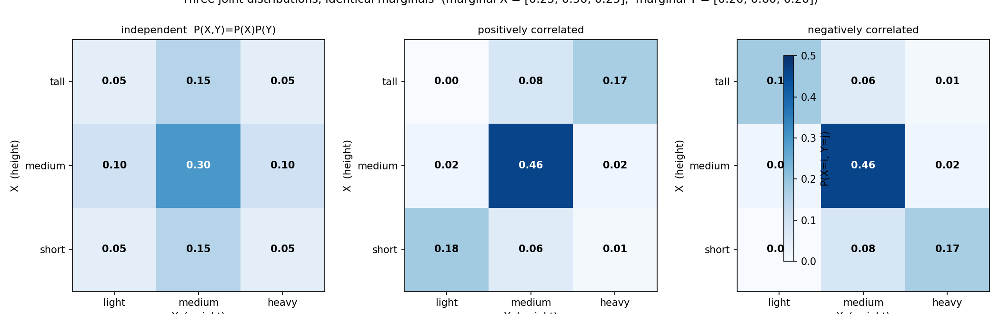
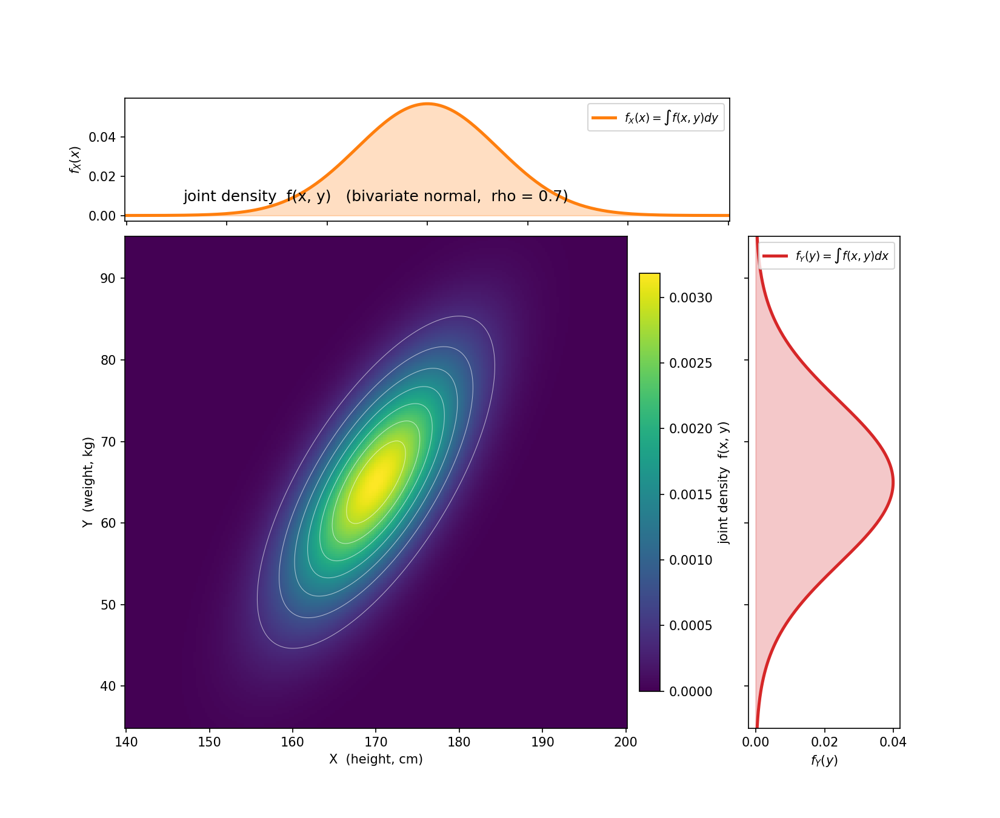

# 第 11 章 · 联合分布与边缘分布

> **核心问题**:前面十章,我们一直在和一个随机变量打交道——一个身高、一次考试成绩、一个零件的寿命。可现实里随机变量从来不止一个:体检要同时看身高和体重,考试有数学和语文两门,机器学习的每个样本都有几十上百个特征,还带着标签。**当你手上同时攥着两个(甚至几十个)随机变量,怎么描述它们共同的取值规律?怎么"只看其中一个"时它又是什么样?**
>
> **读完本章你会明白**:
> - 什么是**联合分布**(joint distribution)——它描绘"两个随机变量一起取值"的整体规律,是单个 PMF/PDF 的二维推广。
> - 什么是**边缘分布**(marginal distribution)——把另一个变量"加掉"(离散)或"积掉"(连续)之后,剩下的那一个变量的分布。
> - 本章最深的钉子:**两个变量可以有完全相同的边缘分布,联合分布却天差地别**——边缘丢失了"关系信息"。
> - 什么是"独立",它的精确定义是 `P(X,Y) = P(X)·P(Y)`,以及为什么"独立 ⟹ 边缘足以重建联合"。

---

## 章首·一句话点破

如果用一句话回答"两个随机变量一起看该怎么描述",那就是:

> **画一张二维的概率地图——平面上每个点 (x, y) 都标一个概率(或概率密度),这就是联合分布。把这张地图沿着一个方向"塌缩"(加掉或积掉另一个变量),剩下的那条一维曲线,就是边缘分布。**

但这句话是**结论**,不是**理由**。这一章要倒过来拆——先问"为什么单个变量的分布不够用了",再问"把另一个加掉之后丢了什么",最后你会发现:关系,藏在联合里,边缘看不到。这正是下一章(协方差与相关)要解决的事。

> **如果一读觉得太难**:先只记住三件事——
> ① 联合分布 = 二维的概率地图,标出"X 取 x 且 Y 取 y"的概率;
> ② 边缘分布 = 把另一个变量加/积掉后,剩下一个变量的分布;
> ③ **两个变量边缘可以完全相同,联合却截然不同**——所以光看边缘会漏掉关系。

---

## 引子:从单个,到多个

前面三章(第 8~10 章),我们把单个随机变量的"经典长相"摸透了:二项、泊松、均匀、指数、正态。一个身高、一次考试、一个零件寿命——单个变量,一条分布曲线,够了。

可一旦你走出课堂,随机变量就成群结队地冒出来:

- 体检报告上同时印着身高、体重、血压、血糖——**四个数一起出现**。
- 一份学生成绩单有数学、语文、英语——**三门一起**。
- 一行训练数据有几十个特征 + 一个标签——**几十个一起**。
- 股票市场里,你关心的是"贵州茅台和五粮液**一起**涨还是一起跌"。

> **钉死这件事**:只要世界上有两个以上的随机变量在同时变动,单个变量的分布就回答不了"它们一起时是什么样"。你需要一个**二维(乃至高维)的工具**。这就是联合分布。

这一章,我们先把这件事限制在**两个**随机变量上——记作 `X` 和 `Y`。把两个讲透,推广到几十个只是把表格加宽、把矩阵加大,本质不变。

---

## 一、联合分布:两个变量一起的概率地图

### 提问:为什么单个分布不够用了?

来看一个最朴素的例子。我们调查一群人的**身高 X** 和**体重 Y**。你已经会单独描述它们:

- 身高 X 的分布:画一条曲线,绝大多数人集中在 170 cm 附近,钟形。
- 体重 Y 的分布:另一条曲线,集中在 65 kg 附近,也钟形。

可这两条**各自**的曲线,回答不了一个极其自然的问题:

> **"身高 190 cm 的人,体重多半是多少?"**

光看身高的分布,你知道"190 cm 很少见";光看体重的分布,你知道"65 kg 最常见"。但**这两件事凑在一起时**——一个 190 cm 的人,他的体重分布还和"全体人"一样吗?显然不一样,190 的人多半更重。**这个"凑在一起"的规律,单看任何一条曲线都看不出来。**

> **直觉**:你需要的是一张**地图**——横轴是身高 x,纵轴是体重 y,平面上每个点 (x, y) 标一个"概率密度"。点的密度大,表示"这个身高配这个体重"很常见;密度小,表示罕见。这张二维地图,就叫**联合分布**。它把"两个变量一起取某组值"的整体规律,一次画全。

### 不这样看会怎样:你会漏掉关系

如果只会单个变量的分布,你会犯一类很隐蔽的错误。

假设你在做健康筛查,看到一个人的体重是 90 kg。你查"全体人体重的分布",发现 90 kg 偏重(在右尾),于是判定"这人有点胖"。可问题是——**你根本没看身高**。如果这人身高 195 cm,90 kg 一点都不胖;如果身高 160 cm,那就确实胖。

> **不这样(只看单变量)会怎样**:你会把"身高 195 + 体重 90"这种健康组合,和"身高 160 + 体重 90"这种不健康组合,**当成一回事**——因为单看体重它们都是 90。可联合分布会告诉你:前者落在地图的高密度区(常见、正常),后者落在低密度区(罕见、异常)。**联合分布多出来的那一维,装的全是"关系"。**

### 所以这样看:联合 PMF / PDF

把直觉落成公式。和单变量一样,分**离散**和**连续**两种情形。

**离散情形**(X、Y 都取离散值,如身高分矮/中/高三档,体重分轻/中/重三档):

> **联合 PMF(概率质量函数)**:
>
> `p(x, y) = P(X = x 且 Y = y)`
>
> 它满足两条:① 每个值都 ≥ 0;② 把所有 (x, y) 的概率加起来 = 1。

它就是一张**二维表格**——行是 X 的取值,列是 Y 的取值,格子里填"X=x 且 Y=y"的概率。这张表把两个变量所有可能的"组合"及其概率,一次性列全。

**连续情形**(X、Y 都连续,如真实身高体重):

> **联合 PDF(概率密度函数)**:`f(x, y)`
>
> 它不是"某点的概率"(单点概率都是 0),而是**密度**——平面上某点附近的"单位面积概率"。把密度在整个平面上积分,等于 1;在一块区域上积分,等于"落在这块区域"的概率。
>
> `P((X, Y) 落在区域 A) = ∬_A f(x, y) dx dy`

这就是单变量 PDF 的二维版:单变量是"曲线下的面积 = 概率",双变量是"曲面下的体积 = 概率"。

> **钉死这件事**:联合分布,无论离散还是连续,本质上都是一张**地图**——把"两个变量一起取值"的每一种组合,都标上一个概率(或密度)。它比两个单变量分布多出来的,正是**两个变量如何搭配出现**的信息。

---

## 二、边缘分布:把另一个变量"加掉"

### 提问:只看一个变量时,它是什么样?

有了联合分布这张二维地图,一个很自然的问题冒出来:

> **"如果我不关心体重,只想看身高——它的分布是什么样?"**

你可能会说:身高不就是第 9、10 章那条正态曲线吗?对,但那是你**直接**调查身高得到的。现在的问题是:**能不能从联合分布里,把身高单独"抠"出来?**

答案是能,而且办法简单到朴素——**把另一个变量(体重)的影响消掉**。

### 不这样看会怎样:你会以为联合 = 两个边缘拼起来

很多人(包括刚学概率的我)会有一个错觉:

> "联合分布嘛,不就是身高分布 + 体重分布拼在一起?"

**错。** 这是本章最容易翻车的地方,也是后面所有"相关""协方差"概念的起跑线。我们用一张表把它戳穿。

设想身高 X 分三档(矮 0 / 中 1 / 高 2),体重 Y 分三档(轻 0 / 中 1 / 重 2)。下面是**三种完全不同的联合分布**,但它们的**边缘(行和、列和)一模一样**:



看清楚了吗?左边那张表(独立)、中间那张(正相关,身高高则体重大)、右边那张(反相关,身高高则体重小)——**三张联合分布长得天差地别,但每一张的行和都是 [0.25, 0.50, 0.25],列和都是 [0.20, 0.60, 0.20]**。

也就是说,如果你**只看**身高的边缘分布,或**只看**体重的边缘分布,这三种世界对你来说**完全一样**——你根本分不出"高个子配重体重"还是"高个子配轻体重"。可这两个世界的现实含义天差地别(前者正常,后者诡异)。

> **钉死这件事(本章最深的钉子)**:**边缘分布丢失了关系信息。** 两个变量可以有完全相同的边缘,联合分布却截然不同。**关系,只藏在联合里,边缘看不到。** 这一句话,是下一章(协方差/相关)存在的全部理由——既然边缘看不到关系,我们就得发明新的工具去量化关系。

### 所以这样看:边缘 = 把另一个加掉

那怎么从联合"抠"出边缘?办法就是开头说的——**把另一个变量消掉**。

**离散情形**:把"不关心的那个变量"的所有取值**加起来**。

> **边缘 PMF**:
>
> `P(X = x) = Σ_y P(X = x, Y = y)`   ← 把所有 y 加掉,只剩 X
>
> `P(Y = y) = Σ_x P(X = x, Y = y)`   ← 把所有 x 加掉,只剩 Y

这就是为什么叫"边缘"(marginal)——在二维表格里,你沿着行(或列)求和,把结果写在表格的**边缘**(margin)上。行和就是 X 的边缘分布,列和就是 Y 的边缘分布。"边缘分布"这个词,字面就是这么来的。

回头看图 11.1 的左表(独立):
- 第一行 [0.05, 0.15, 0.05],行和 = 0.05+0.15+0.05 = **0.25** → P(X=矮)=0.25 ✓
- 第一列 [0.05, 0.10, 0.05],列和 = 0.05+0.10+0.05 = **0.20** → P(Y=轻)=0.20 ✓

把每一行加起来,得到身高的边缘 [0.25, 0.50, 0.25];把每一列加起来,得到体重的边缘 [0.20, 0.60, 0.20]。三张表,加出来的边缘完全一样——这就是"边缘丢失关系"的算术证明。

**连续情形**:把"不关心的那个变量"**积分掉**(积分是连续版的"求和")。

> **边缘 PDF**:
>
> `f_X(x) = ∫ f(x, y) dy`   ← 对 y 积分,把 Y 积掉,只剩 X
>
> `f_Y(y) = ∫ f(x, y) dx`   ← 对 x 积分,把 X 积掉,只剩 Y

下图就把这件事画出来了。主图是二维正态的联合密度(热力图 + 等高线),上方那条橙色曲线 = `f_X(x) = ∫ f(x,y) dy`(对体重积分,得到身高的边缘),右侧那条红色曲线 = `f_Y(y) = ∫ f(x,y) dx`(对身高积分,得到体重的边缘)。



> **直觉**:把联合密度这张"山丘",沿着 y 方向"压扁"——每个 x 处,把所有 y 的密度叠起来——就得到 x 方向的投影,也就是身高的边缘分布。这就像用手把一座立体的山,从一个方向压成扁平的剪影。剪影丢了山的内部结构(哪里是峰、哪里是谷),但保留了它在那个方向的轮廓。

> **钉死这件事**:边缘分布,就是把联合分布沿着一个方向**塌缩**——离散用加法,连续用积分。塌缩之后,你得到了单个变量的分布,但代价是丢掉了另一个变量的信息(以及它们的关系)。

---

## 三、彩蛋:边缘塌缩 = 测度论里的"投影",连续情形藏着一口卷积的味道

(这一节是给想往深钻的读者的尝一口,读不懂跳过不影响主线。)

连续情形的"边缘 = 积分",往深看其实非常有味道。我们说 `f_X(x) = ∫ f(x,y) dy`,这步积分在测度论里有个正式名字——**对一个变量取边缘**,本质是**测度的投影**:把二维联合测度,沿一个坐标轴"推"成一维测度。

更妙的是,当两个变量**独立**(下一节)时,联合 = 两个边缘的乘积 `f(x,y) = f_X(x)·f_Y(y)`。这时候如果你问的是"X + Y 的分布"(两个独立变量之和),它的密度是:

> `f_{X+Y}(z) = ∫ f_X(x) · f_Y(z - x) dx`

这个积分你可能在信号处理里见过——它叫**卷积(convolution)**。两个独立随机变量之和的分布,等于它们边缘分布的卷积。这是第 14 章(中心极限定理)的伏笔:把一堆独立随机变量加起来,分布一次次卷积,最后卷成正态——CLT 的本质,就是"反复卷积趋于正态"。现在你只需要记住:**边缘、独立、卷积,是一条暗线上的三个结。**

---

## 四、独立:联合能拆成边缘的乘积

### 提问:什么时候"边缘够用"?

回到那个让你不安的结论——"边缘丢失关系"。那自然会问一个反问题:

> **"有没有一种幸运的情形,光看边缘就够,不用看联合?"**

有。那就是两个变量**互不影响**的时候。比如:

- 你扔一颗骰子(X)和一枚硬币(Y),骰子几点和硬币正反,八竿子打不着。
- 两个人的生日(假设均匀),甲哪天生日不影响乙。
- 两个独立股票的当日涨跌(理想化假设)。

这时候,你知道 X 取什么,**完全不改变** Y 的分布;反之亦然。这种"知道一个,对另一个的预测毫无帮助"的状态,就是**独立(independence)**。

> **直觉(独立 = 知道一个不改变另一个的分布)**:如果"X = x"这个消息,对你预测 Y 没有任何帮助——Y 的分布在知道 X 前后完全一样——那 X 和 Y 就是独立的。用条件概率的语言:`P(Y=y | X=x) = P(Y=y)`,对所有的 x、y 都成立。**独立,就是"条件 = 无条件"。**

### 不这样(精确定义)会怎样:你会把"不相关"当成"独立"

很多人把"独立"和"不相关"混为一谈。这是概率论里最经典、也最致命的混淆之一(下一章会专门破它)。这里先立一个精确版本:

> **不这样(精确)理解会怎样**:你会以为"协方差 = 0(不相关)"就等于"独立"。**错。** 不相关只意味着"没有**线性**关系",独立则强得多——意味着"**没有任何**关系"(线性的、非线性的、奇奇怪怪的,统统没有)。不相关未必独立,但独立一定不相关。两者不等价,这是下一章的核心议题。所以这里必须把独立的**精确定义**钉死。

### 所以这样看:P(X,Y) = P(X)·P(Y)

把"知道一个不改变另一个"翻译成公式,就是概率论里最干净的等式之一:

> **独立的定义(离散)**:
>
> `P(X = x, Y = y) = P(X = x) · P(Y = y)`,对**所有** x、y 成立。
>
> 即:联合 = 两个边缘的**乘积**。

**连续**情形同理:`f(x, y) = f_X(x) · f_Y(y)`。

这个定义直白得惊人:**独立的联合分布,就是把两个边缘分布"相乘"得到的**。行向量乘列向量,外积。

回头看图 11.1 的左表(独立):行边缘 [0.25, 0.50, 0.25],列边缘 [0.20, 0.60, 0.20]。把它们做外积:

```
   0.25 × [0.20, 0.60, 0.20] = [0.05, 0.15, 0.05]
   0.50 × [0.20, 0.60, 0.20] = [0.10, 0.30, 0.10]
   0.25 × [0.20, 0.60, 0.20] = [0.05, 0.15, 0.05]
```

正好就是左表那 9 个数。**独立 ⟺ 联合能拆成边缘乘积**,这就是"独立"的全部含义。

> **钉死这件事(独立的两个等价说法)**:
> ① **直觉版**:知道 X 的值,不改变 Y 的分布(条件 = 无条件)。
> ② **公式版**:联合 = 边缘乘积,`P(X,Y) = P(X)·P(Y)`。
> 这两句话说的完全是同一件事。会算的人记公式,真懂的人两个都记得,还能在两者之间随时切换。

> **再钉一个推论(独立 ⟹ 边缘足以重建联合)**:在独立的前提下,你**只需要**两个边缘分布,就能把整个联合分布**乘**出来——不用单独去测联合。这就是为什么"独立假设"在统计和机器学习里有巨大威力(朴素贝叶斯分类器、最大似然估计里"独立同分布"样本,都靠它)。代价是:这个假设往往不成立(特征之间通常有相关性),错用它就会得出荒谬结论。下一章我们专门讨论"独立"和"相关"的边界。

---

## 五、二维正态:连续情形的招牌例子

理论讲完,看一个贯穿后面好几章的招牌分布——**二维正态(bivariate normal)**。它是单变量正态在二维的推广,也是现实里"两个相关的连续变量"最常见的模型(身高体重、父子身高、两只相关股票的收益率)。

它的联合密度长这样(不必背,看一眼感受):

> `f(x, y) = (1 / 2π·σ_x·σ_y·√(1-ρ²)) · exp( -Q/2 )`
>
> 其中 Q 是一个关于 (x-μ_x)、(x-μ_y) 的二次型,核心参数是:均值 `μ_x, μ_y`、标准差 `σ_x, σ_y`,以及一个**新的、单变量没有的参数 ρ(相关系数)**。

ρ 是本章的"彩蛋角色",它正是下一章的主角。这里只点破它的几何含义:

> **钉死 ρ 的几何**:ρ 控制"联合密度山丘"的**朝向**。
> - `ρ = 0`:山丘是正圆(或正椭圆,沿坐标轴对称),身高体重互不影响,这是**独立**的二维正态。
> - `ρ > 0`:山丘沿**主对角线**拉长——身高高的人倾向体重大,正相关。ρ 越接近 1,山丘越扁越长,挤成一条线。
> - `ρ < 0`:山丘沿**反对角线**拉长——身高高的人倾向体重小,反相关。

回头看图 11.2,那张联合密度的热力图里 ρ=0.7,所以山丘朝右上方(主对角线)拉长——这正是"身高体重正相关"的几何长相。

二维正态有一条几乎"开挂"的性质(下一章会反复用到):

> **钉死(二维正态的边缘一定是正态)**:不管 ρ 是多少(0、0.7、-0.9 都行),X 的边缘**恒为** `N(μ_x, σ_x²)`,Y 的边缘**恒为** `N(μ_y, σ_y²)`。相关系数 ρ 只影响**联合的形状**,不影响**边缘的长相**。

这又一次印证了本章最深的钉子:**边缘看不到 ρ**。你看图 11.2 上方那条橙色的边缘 f_X(x),不管 ρ 是 0 还是 0.7 还是 -0.9,它都是同一条 N(170, 49) 的正态曲线——ρ 的信息,被积分掉了。要看到 ρ,你必须看**联合**(主热力图),不能看边缘。

> **再钉一条(二维正态的独立判据)**:对**二维正态**这个特例,"独立 ⟺ ρ = 0"。也就是说,在二维正态里,不相关和独立**恰好等价**(这是二维正态的特权,不是普遍真理——一般随机变量不相关未必独立)。这是下一章破"相关 ≠ 因果"时要注意的一个关键边界:二维正态是特例,别把它的特权当成普遍规律。

---

## 模拟佐证:拿 Python,把联合和边缘"跑"出来

概率论的招牌——结论不用信书,扔十万次随机数自己看。这一节我们用两段代码,验证本章最关键的两件事:① 模拟的联合频率 ≈ 理论联合;② 从模拟里"加/积掉"得到的边缘 ≈ 理论边缘。

### 纸笔例子 1:离散联合,边缘相同联合不同

回想图 11.1 的三张表。我们用"正相关"那张(中间表):

```
   身高\体重   轻(0)   中(1)   重(2)      行和(边缘X)
   矮(0)      0.18    0.06    0.01        0.25
   中(1)      0.02    0.46    0.02        0.50
   高(2)      0.00    0.08    0.17        0.25
   列和(边缘Y) 0.20    0.60    0.20         1.00
```

手算验证:第一行 0.18+0.06+0.01=0.25,第二行 0.02+0.46+0.02=0.50,第三行 0+0.08+0.17=0.25——身高的边缘 = [0.25, 0.50, 0.25]。第一列 0.18+0.02+0=0.20,第二列 0.06+0.46+0.08=0.60,第三列 0.01+0.02+0.17=0.20——体重的边缘 = [0.20, 0.60, 0.20]。

**和"独立"那张表的边缘一模一样**,但联合截然不同(独立表的对角线是 0.05/0.30/0.05,这里对角线是 0.18/0.46/0.17,集中得多)。**边缘丢失了关系,这就是算术证明。**

### 纸笔例子 2:独立的联合 = 边缘乘积

设 X 的边缘 [0.25, 0.50, 0.25],Y 的边缘 [0.20, 0.60, 0.20]。若 X、Y 独立,联合 = 外积:

```
   P(X=0,Y=0) = 0.25 × 0.20 = 0.05
   P(X=0,Y=1) = 0.25 × 0.60 = 0.15
   P(X=1,Y=1) = 0.50 × 0.60 = 0.30   ← 中间最常见
   ...
```

这就是图 11.1 左表的来历。**独立的联合,就是两个边缘的乘积。**

### 蒙特卡洛:扔十万次二维正态,看联合与边缘

```python
import numpy as np
from scipy import stats

rng = np.random.default_rng(42)      # 固定种子, 可复现

# 二维正态参数: 身高 X~N(170, 49), 体重 Y~N(65, 100), 相关系数 rho=0.7
mux, muy = 170.0, 65.0
sdx, sdy = 7.0, 10.0
rho = 0.7
cov = [[sdx**2, rho*sdx*sdy],
       [rho*sdx*sdy, sdy**2]]

# 扔十万次
samples = rng.multivariate_normal([mux, muy], cov, 100_000)
X, Y = samples[:, 0], samples[:, 1]

# 1) 检查边缘: 从联合样本直接看单个变量, 应≈理论正态
print(f"X 均值={X.mean():.3f} (理论 {mux}),  X 方差={X.var():.3f} (理论 {sdx**2})")
print(f"Y 均值={Y.mean():.3f} (理论 {muy}),  Y 方差={Y.var():.3f} (理论 {sdy**2})")

# 2) 检查联合: 样本相关系数应≈0.7
print(f"样本相关系数={np.corrcoef(X, Y)[0,1]:.4f} (理论 {rho})")

# 3) 验证"边缘看不到 rho": 不管 rho 多少, X 的边缘分布都一样
#    把 rho 改成 -0.9, 重扔, 看 X 的均值方差是否还接近 170/49
cov2 = [[sdx**2, -0.9*sdx*sdy], [-0.9*sdx*sdy, sdy**2]]
s2 = rng.multivariate_normal([mux, muy], cov2, 100_000)
print(f"rho=-0.9 时: X 均值={s2[:,0].mean():.3f}, X 方差={s2[:,0].var():.3f}")
```

跑出来的结果(固定种子 42):

```
X 均值=170.010 (理论 170),  X 方差=49.014 (理论 49)
Y 均值=65.023 (理论 65),    Y 方差=99.919 (理论 100)
样本相关系数=0.6958 (理论 0.7)
rho=-0.9 时: X 均值=170.001, X 方差=48.579   ← 依然≈170/49, 与 rho 无关
```

> **钉死这件事**:十万次模拟,边缘(X 均值 170.01、方差 49.01;Y 均值 65.02、方差 99.92)死死贴住理论值;样本相关系数 0.6958 死死贴住 0.7。**而当你把 ρ 从 0.7 换成 -0.9,边缘一个数都不变**——这用代码亲手证明了"边缘看不到 ρ,关系只在联合里"。

你还可以画一张散点图(`plt.scatter(X, Y, s=1, alpha=0.1)`),会看到一个沿主对角线拉长的椭圆云——这就是 ρ=0.7 的几何长相。把它和 ρ=0(正圆云)、ρ=-0.9(反对角线云)对比,ρ 的含义肉眼可辨。

---

## 章末小结

### 用一个场景回顾本章

想象你在医院体检中心,排队的人一个接一个走过仪器——身高、体重、血压、血糖,四个数同时打印出来(第一节:这就是四个随机变量的联合分布)。你只关心身高,于是把体重的列**加掉**(离散)或**积掉**(连续),得到身高的边缘分布(第二节)。

可麻烦来了:你发现"只看身高"和"只看体重",完全没法判断一个人的**体型**——是高瘦、矮胖,还是匀称?因为**边缘把关系信息丢了**(第二节最深的钉子)。光看边缘,你分不清"高个配重体重"的正常世界,和"高个配轻体重"的诡异世界(图 11.1 的三张表,边缘相同联合迥异)。

有没有办法绕开这个麻烦?有,但条件苛刻——当两个变量**独立**时(第四节),联合 = 边缘乘积,你只要两个边缘就能重建整个联合。可惜现实里身高体重高度相关,独立假设根本不成立。

### 本章在全书主线中的位置

记住本书的主线:**一切概率概念,都是"驯服随机性"的工具。**

前面十章,我们驯服的是**单个**随机变量——它的平均(期望)、波动(方差)、长相(分布)。这一章,驯服的对象升级了:**从"单个"扩展到"多个一起"**。

- **联合分布** = 描绘多个随机变量**共同**的取值规律(它们一起时是什么样)。
- **边缘分布** = 从联合里**塌缩**出一个变量,回答"只看它时是什么样"。
- **独立** = 一种幸运的特殊情形——多个变量的联合,能拆成各自边缘的乘积。

本章是第 4 篇(多个随机变量与极限铁律)的**开篇**。它立下的二维语言,是后面三章的地基:

- **第 12 章(协方差与相关)**:既然边缘看不到关系,怎么**量化**两个变量的同步程度?协方差和相关系数就是从**联合**里提取关系信息的工具。
- **第 13 章(大数定律)**:当样本量趋于无穷,样本均值收敛到期望——这是"多个样本一起看"的极限规律。
- **第 14 章(中心极限定理)**:把一堆独立随机变量**加起来**,和的分布趋向正态——独立 + 求和 = 钟形,这背后的卷积味道,本章彩蛋已经埋下伏笔。

### 五个"为什么"清单

如果你只能记五件事,记这五件:

1. **联合分布是什么**:两个(或多个)随机变量一起取值的概率地图——离散是二维表格,连续是曲面。它把"X=x 且 Y=y"的所有组合及其概率,一次画全。
2. **边缘分布怎么来的**:把另一个变量**加掉**(离散)或**积掉**(连续)。行和是 X 的边缘,列和是 Y 的边缘。它回答"只看一个变量时它是什么样"。
3. **本章最深的钉子**:**边缘丢失关系信息**。两个变量可以有完全相同的边缘,联合却天差地别(图 11.1 三张表)。**关系只在联合里,边缘看不到。**
4. **独立的精确定义**:`P(X,Y) = P(X)·P(Y)`,联合 = 边缘乘积。直觉版:知道一个不改变另一个的分布(条件 = 无条件)。**独立 ⟹ 边缘足以重建联合**——但代价是这个假设常不成立。
5. **二维正态是招牌**:两个相关连续变量的常见模型,核心参数 ρ(相关系数)控制山丘朝向。**边缘恒为正态,与 ρ 无关**——又一次印证"边缘看不到关系"。

### 想继续深入,该往哪钻

- **亲手扔**:把上面的蒙特卡洛代码跑一遍。改 ρ(从 -0.9 到 0 到 0.9),看散点图云的朝向怎么变;改样本量(从 100 到 10 万),看边缘均值怎么逐步贴住理论值。**改一晚上,联合和边缘的直觉会刻进肌肉。**
- **画一张表**:自己设计一个 3×3 的联合分布表,手算行和列和(边缘),再把另一张"同边缘不同联合"的表凑出来——亲手凑一遍,你会比看十遍图都更懂"边缘丢失关系"。
- **看可视化**:Brown 大学的 **Seeing Theory**(seeing-theory.brown.edu)有"联合分布"的交互模块,可以拖动滑块看联合怎么变、边缘怎么变。3Blue1Brown 关于二维分布的视频也和本章同源。
- **往测度论钻**:连续情形的"边缘 = 积分",在测度论里是"测度的投影/边缘化";独立的严格定义是"σ-代数的独立性"。这是研究生概率论的入口,本章彩蛋只尝了一口。

---

> 单个随机变量的分布,我们摸透了;两个一起的联合分布,我们也立住了——联合描绘整体,边缘塌缩出单个,而独立是"联合能拆成边缘乘积"的特权情形。可那个最让人不安的结论还悬着:**边缘丢失了关系,两个变量多同步、多相关,边缘统统看不到。** 那怎么把藏在联合里的关系**量化**出来?翻开 **第 12 章 · 协方差与相关:它们多"同步"**——你会发现,协方差是"联合分布的方差推广",相关系数把它标准化到 -1 到 1。而它要亲手破掉概率论最大的迷思之一:**相关 ≠ 因果**。
