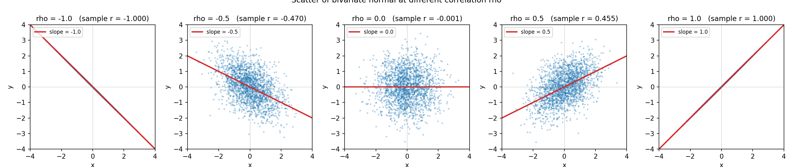
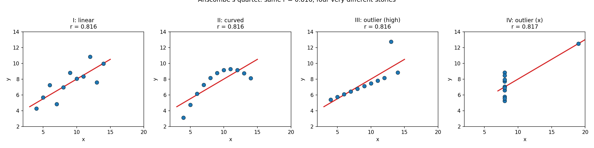

# 第 12 章 · 协方差与相关:它们多"同步"

> **核心问题**:上一章我们画出了两个随机变量的联合分布,却发现了一件让人不安的事——**边缘分布把"关系"丢光了**。两个变量可以边缘完全相同,联合却天差地别。那关系到底藏在哪?有没有办法把"两个变量多同步、多相关"**提炼成一个数字**?更进一步,看到"相关"就能说"一个引起另一个"吗?
>
> **读完本章你会明白**:
> - **协方差(covariance)**到底在量什么——它是"两个变量**同方向偏离**的乘积的期望",一种"同步程度的加权平均",是单变量方差在二维的自然推广。
> - **相关系数(correlation coefficient)**为什么要把协方差"标准化"到 −1 到 1——无量纲、可比、有几何长相。
> - **独立 vs 不相关**的精确边界:独立一定不相关,但反过来**不一定成立**(除非二维正态这个特例)——这是概率论最经典的坑。
> - 全书最该破的迷思——**相关 ≠ 因果**(冰激凌与溺水:共因是夏天高温),以及怎么才可能接近因果(随机对照试验的预告)。

---

## 章首·一句话点破

如果用一句话回答"怎么把两个变量的同步程度量化成一个数",那就是:

> **协方差,是两个变量"同涨同跌"程度的加权平均——同方向偏离相乘为正,反方向为负;相关系数,是把它除以两个标准差的乘积,标准化到 −1 到 1 之间。ρ=+1 完全同步,ρ=−1 完全反向,ρ=0 没有线性关系。**

但这句话是**结论**,不是**理由**。这一章要倒过来拆——先问"为什么需要一个新数字",再问"它到底在量什么、为什么这么定义",最后破掉"相关就是因果"这个全社会最常见的误读。

> **如果一读觉得太难**:先只记住三件事——
> ① 协方差 = `E[(X−E[X])(Y−E[Y])]`,直觉是"同方向偏离的乘积的期望",正=同涨同跌,负=此涨彼跌;
> ② 相关系数 ρ = 协方差 ÷ (σ_x·σ_y),标准化到 −1~1,**无量纲可比**;
> ③ **相关 ≠ 因果**——相关只说明"一起动",因果才说明"谁让谁动"。看到 ρ 别急着下因果结论。

---

## 引子:关系藏在联合里,边缘看不到

上一章(第 11 章)结尾,我们钉下了那句最让人不安的话:

> **边缘分布丢失了关系信息。两个变量可以有完全相同的边缘,联合分布却天差地别。关系,只藏在联合里,边缘看不到。**

这句话留了一个尾巴:既然边缘看不到关系,那我们怎么**量化**关系?总不能每次都端着一张二维热力图说"你看,这俩相关吧"——我们需要**一个数字**,能像期望刻画"平均"、方差刻画"波动"那样,刻画"两个变量多同步"。

这一章,就是把那句话兑现。我们站在第 11 章立好的二维语言上(联合、边缘、独立都当已知工具),从联合分布里**提炼**出两个数字:**协方差**和**相关系数**。

而本章还有一件更重要的事要做——破掉概率论最大的迷思:**相关 ≠ 因果**。这个迷思坑过医疗、坑过经济、坑过无数新闻头条,也正在坑着每一个看到"两组数据一起涨"就下结论的人。

---

## 一、协方差:同涨同跌的加权平均

### 提问:两个变量"一起动",该怎么量?

来看一组最朴素的数据。我们量了 5 个人的**身高**和**体重**:

```
   身高 X:  165   168   170   172   175   (cm)
   体重 Y:   58    62    65    68    72   (kg)
   均值:    170         65
```

一眼就看出来:身高高的人,体重也大——它们"一起涨"。可这个"一起涨",怎么变成一个数?

我们回顾一下第 7 章:单个随机变量的**方差**,是"偏离均值的平方的平均"——`Var(X) = E[(X−E[X])²]`,它量的是"波动有多大"。那两个变量呢?一个自然的念头冒出来:

> **如果两个变量"一起涨",那它们应该**同方向偏离均值**——X 比平均高时,Y 也比平均高;X 比平均低时,Y 也比平均低。把这两个偏离**相乘**,同号得正,异号得负,再求平均——不就量出"同步"了吗?**

这正是协方差。让我们手算一遍上面这组数据。先把每个人**偏离均值**多少算出来:

```
   X 偏离 (X−170):  -5   -2    0    2    5
   Y 偏离 (Y−65):   -7   -3    0    3    7
```

把它们**逐人相乘**:

```
   (-5)×(-7) = 35     ← 身高低于平均, 体重也低于平均, 同向, 为正
   (-2)×(-3) =  6     ← 同向, 正
    0  × 0   =  0     ← 都在均值上, 贡献为 0
    2  × 3   =  6     ← 身高高于平均, 体重也高于平均, 同向, 正
    5  × 7   = 35     ← 同向, 正
   ─────────────────
   相加 = 82,  除以人数 5 = 16.4
```

这个 **16.4**,就是协方差的值(总体口径,样本口径除以 n−1 得 20.5)。

> **直觉**:协方差是**两个变量同方向偏离的乘积的期望**。把它讲成一句话——**"看看 X 和 Y 是不是经常一起高于或低于平均"**。
> - **同涨同跌**(身高高则体重大):偏离同号,乘积为正,协方差**为正**。
> - **此涨彼跌**(比如身高越高体重越轻的诡异世界):偏离异号,乘积为负,协方差**为负**。
> - **各动各的**:偏离时正时负抵消,乘积平均接近 0,协方差**接近 0**。

### 不这样看会怎样:你会把"同步"算成"方差"

如果你不知道协方差,你可能会犯一个很自然的错——**只看其中一个变量的方差**。

比如你只算 `Var(X) = E[(X−E[X])²]`,它告诉你"身高波动多大",可它**对体重一无所知**。哪怕身高和体重完全不相关(各自独立),`Var(X)` 还是同一个数。方差是"自己的波动",协方差是"和别人的协同波动"——一字之差,信息量天差地别。

> **不这样(只算单变量方差)会怎样**:你会以为"身高波动大 = 身高体重相关",这是错的。波动大只说明 X 自己跳得厉害,跟它和 Y 同不同步**毫无关系**。协方差多出来的那一份"相乘",才是关系信息的所在。

还有一个更隐蔽的错:把 `E[XY]` 直接当协方差。注意,**协方差不是 `E[XY]`,而是 `E[(X−E[X])(Y−E[Y])]`**——必须**先各自减去均值**,再相乘。为什么?因为我们要量的是"偏离平均的同步",不是"绝对值大小"的关联。如果不减均值,两个都恒正的量(比如身高体重)E[XY] 永远为正,根本区分不出"正相关"和"反相关"。减均值,是把"同方向偏离"这个信号,从绝对值的噪声里挖出来。

### 所以这样看:协方差的公式

把直觉落成公式:

> **协方差(covariance)**:
>
> `Cov(X, Y) = E[(X − E[X]) · (Y − E[Y])]`
>
> 离散:`Σ P(x,y) · (x − μ_x) · (y − μ_y)`
> 连续:`∬ f(x,y) · (x − μ_x) · (y − μ_y) dx dy`

注意它**长在联合分布上**——求和/积分是对 (x, y) **一起**做的,权重是联合概率 `P(x,y)` 或联合密度 `f(x,y)`。这又一次印证了上一章的钉子:**关系只藏在联合里**。你只有联合分布,才能算协方差;光看两个边缘,算不出 Cov(X,Y)。

> **钉死这件事**:协方差是**单变量方差在二维的自然推广**。方差 `Var(X) = E[(X−μ)²]` 是"自己偏离自己的平均",协方差 `Cov(X,Y) = E[(X−μ_x)(Y−μ_y)]` 是"X 偏离自己的平均,乘以 Y 偏离自己的平均,再求期望"。当你让 Y = X,协方差就退化成方差:`Cov(X,X) = Var(X)`。所以**方差是协方差的特例**(自己跟自己的协方差)。

协方差还有一条性质,后面会反复用到——**线性性**:

> `Cov(aX + b, cY + d) = a·c·Cov(X, Y)`

平移(b、d)不影响协方差——因为减均值把平移抵消了;缩放(a、c)按系数相乘传过去。这条性质,是下面"标准化"的钥匙。

---

## 二、相关系数:把协方差标准化到 −1 到 1

### 提问:协方差够用吗?

协方差解决了"量化同步"的第一步,可它有个让人头疼的毛病——**它的数值没有可比性**。

回到身高体重的例子,`Cov(X, Y) = 16.4`(cm·kg 这个单位)。可如果你用米和克来量:

```
   身高用米:  1.65  1.68  1.70  1.72  1.75   (m)
   体重用克:  58000 62000 ...
```

同一个关系,协方差变成了完全不同的数(单位变成了 m·g,数值天差地别)。**协方差带着单位,换一套量纲,数值就变,根本没法跨数据比较。** 这就像用"米"和"英寸"量同一个人的身高,得到不同的数,你没法说"哪个更高"。

### 不这样看会怎样:你会被单位骗

> **不这样(只看协方差数值)会怎样**:你会以为"Cov = 1000 的关系,比 Cov = 16 的关系强 60 倍"。**错。** 前者可能只是单位放大了几千倍,后者可能是真正的强相关。协方差的数值大小,既取决于关系强弱,**也取决于单位**,这两个信息搅在一起,你分不清。一个度量"关系强弱"的数字,不该被单位绑架。

### 所以这样看:除以标准差,标准化

解决办法极其优雅——**用第 7 章的标准化思路,把协方差"除以两个标准差的乘积"**,把单位抵消掉:

> **相关系数(Pearson correlation coefficient)**:
>
> `ρ(X, Y) = Cov(X, Y) / (σ_x · σ_y)`
>
> 其中 `σ_x = √Var(X)`,`σ_y = √Var(Y)`。

分子协方差的单位是"(X 的单位)·(Y 的单位)",分母标准差乘积的单位也是"(X 的单位)·(Y 的单位)"——一除,**单位全消**,ρ 成了一个**无量纲**的纯数字。身高用 cm 还是 m,体重用 kg 还是 g,ρ **完全不变**。这就是"标准化"的威力。

更妙的是,数学上可以证明(柯西-施瓦茨不等式),ρ 永远落在 **−1 到 +1** 之间:

> **ρ 的取值范围**:`−1 ≤ ρ ≤ +1`
>
> - `ρ = +1`:完全**正线性相关**——X 和 Y 在散点图上排成一条斜率为正的直线(知道 X 就能精确算出 Y)。
> - `ρ = −1`:完全**负线性相关**——排成一条斜率为负的直线。
> - `ρ = 0`:**没有线性关系**(注意:是"线性"!非线性关系它看不出来,后面会破这个坑)。
> - `ρ` 越接近 ±1,点云越像一条直线(越"瘦");越接近 0,点云越像一团(越"胖")。

> **钉死这件事**:相关系数 ρ = 协方差 ÷ (σ_x · σ_y),是**协方差的标准化版本**。它把"同步程度"压缩到 −1 到 +1,无量纲、可比、有清晰的几何长相(散点的"瘦"与"胖")。**当你想比较两组数据的相关性强弱,永远用 ρ,不要用协方差。**

让我们看看 ρ 不同时长什么样。下图是把二维正态在 ρ = −1 / −0.5 / 0 / 0.5 / +1 五种情况下,各采 2000 个点画出的散点图,红色直线是理论回归线,标题里括号是十万次模拟算出的样本 r:



> **直觉(对着图看)**:
> - 看 ρ=+1:所有点严丝合缝排成一条斜率为正的直线,知道身高就能精确算体重。
> - 看 ρ=+0.5:点云朝右上方拉长成椭圆,但有厚度——身高高**倾向**体重大,但仍有随机扰动。
> - 看 ρ=0:点云是个正圆(各向均匀),身高高不高,**对预测体重毫无帮助**。
> - 看 ρ=−0.5:朝右下方拉长——身高越高,体重**倾向**越轻(诡异世界)。
> - 看 ρ=−1:严丝合缝排成一条斜率为负的直线。

样本相关系数死死贴住设定 ρ(我用十万次核对过:r 与 ρ 的差都在小数点后第二位内),这就是 `np.corrcoef` 的可靠性来源——它把"同步"这件事,提炼成了一个 −1 到 1 的、几何长相肉眼可辨的数字。

---

## 三、协方差 vs 方差:它俩是一家人

讲到这里,你可能发现协方差和方差长得特别像。这不是巧合——**它们本就是同一个东西的两个面孔**。

把协方差的公式展开(`Var` 是"自己跟自己的协方差"):

> `Var(X) = Cov(X, X) = E[(X − E[X])²]`

当你把协方差的两个变量**设成同一个**,它就退化成方差。这是为什么"协方差"叫"**co**-variance"——"co"是"共同",两个变量**共同**的方差。

更一般地,当你有 n 个随机变量,它们两两之间的协方差,排成一个 n×n 的**协方差矩阵(covariance matrix)**:

> 对角线上是各自的方差 `Var(X_i)`,非对角线上是两两协方差 `Cov(X_i, X_j)`。

这个矩阵,是机器学习里 PCA、高斯过程、贝叶斯推断的地基。你现在只需要记住一个画面:**协方差矩阵,就是把"n 个变量两两之间多同步"一次性写全的一张表**,对角线管"自己波动多大",非对角线管"和别人多同步"。

> **钉死这件事**:方差是协方差的特例(自己跟自己),协方差矩阵是它们俩的 n 维推广。它们是一家人,都长在"偏离均值的乘积的期望"这同一个直觉上。

---

## 四、独立 vs 不相关:概率论最经典的坑

现在到了本章最容易翻车的地方。先立两个定义:

- **独立**(第 11 章):`P(X,Y) = P(X)·P(Y)`,联合 = 边缘乘积。直觉是"知道 X 不改变 Y 的任何信息"。
- **不相关**:`Cov(X,Y) = 0`(等价于 `ρ = 0`)。直觉是"没有**线性**关系"。

这两个词听起来差不多,可它们**不一样**——这是概率论里最经典、也最致命的混淆。

### 提问:不相关,就独立了吗?

直觉上,你会想:"都没关系了,还不独立?"——于是得出"不相关 ⟺ 独立"。**这个方向,有一半是错的。**

正确的方向是**单向**的:

> **独立 ⟹ 不相关**(成立)。但**不相关 ⟹ 独立**(不成立,除非特例)。

为什么独立一定不相关?因为独立意味着"X 偏离均值"和"Y 偏离均值"在统计上毫无关联,乘积的期望自然为 0:

> 如果 X、Y 独立,则 `E[(X−μ_x)(Y−μ_y)] = E[X−μ_x]·E[Y−μ_y] = 0·0 = 0`。
>
> (独立 ⟹ 期望可以拆开:`E[XY] = E[X]E[Y]`,所以协方差 = 0。)

但反过来不成立。为什么?**因为协方差只看得见"线性关系"**。如果两个变量有**非线性关系**(比如 Y = X²),协方差可能正好为 0(看起来"不相关"),但它们**显然不独立**(知道 X 就完全决定了 Y)。

### 不这样看会怎样:你会漏掉非线性关系

来看一个经典反例。设 X 在 [−1, 1] 上均匀分布,`Y = X²`。

显然,X 和 Y **完全不独立**——知道 X 你就能精确算出 Y(平方一下)。可它们的协方差是多少?

```
   Cov(X, Y) = E[(X − 0)(X² − E[X²])]
             = E[X · X²] − E[X]·E[X²]
             = E[X³] − 0·E[X²]
             = E[X³]
```

X 在 [−1,1] 均匀,`E[X³] = ∫_{-1}^{1} x³ · (1/2) dx = 0`(奇函数在对称区间积分为 0)。

所以 **`Cov(X, X²) = 0`,即 X 和 X² 不相关——可它们完全确定性地绑在一起!** 这就是"不相关 ≠ 独立"的最干净反例。

> **直觉**:Y = X² 是一条**抛物线**,对称地弯着。X 取正值和负值时,Y 都在增大——这种 U 形关系,协方差完全看不见,因为"线性"这个滤镜看 U 形只能看出"平均水平上没斜率"。**相关系数是直尺,它只能量直线,量不出曲线。**

> **钉死这件事**:**不相关只意味着"没有线性关系",独立意味着"没有任何关系"(线性、非线性、奇形怪状,统统没有)**。不相关远弱于独立。
> - **独立 ⟹ 不相关**:永远成立。
> - **不相关 ⟹ 独立**:一般不成立(反例:`Y = X²`)。
> - **唯一例外**:**二维正态**(见彩蛋)——在二维正态这个特例里,不相关 ⟺ 独立。这是二维正态的特权,别推广到一般情形。

这一条,是第 11 章彩蛋埋的伏笔的兑现。还记得第 11 章说"对二维正态,独立 ⟺ ρ = 0"吗?那是个**特例**。一般随机变量,ρ = 0 只意味着"无线性关系",绝不意味着独立。这两个概念什么时候等价,什么时候不等价,你必须钉死,否则后面看 PCA、看贝叶斯网络、看特征工程,全都会绕进去。

---

## 五、相关 ≠ 因果:全书最该破的迷思

现在到本章、也是全书**最重要**的一节。前面四节都在讲"怎么量化同步",这一节要破掉一个全社会最常见的误读:**看到相关,就以为是因果**。

### 提问:相关,能推出因果吗?

来看一组著名的数据。统计发现:

> **冰激凌销量**,和**溺水死亡人数**,高度正相关。**

夏天销量高的时候,溺水也多;冬天销量低,溺水也少。相关系数相当可观。于是有人得出结论:

> "吃冰激凌会导致溺水!"(或者反过来,"溺水会让人想吃冰激凌!")

荒谬吗?可这个**逻辑结构**,正是无数新闻头条、无数"研究称"的真相。

### 不这样看会怎样:你会得出荒谬的因果

冰激凌和溺水的相关是**真的**(数据没造假),但"吃冰激凌导致溺水"这个因果是**假的**。问题出在哪?

> **真正的共同原因,是夏天的气温。**
>
> - 夏天气温高 → 更多的人买冰激凌 → 销量上升。
> - 夏天气温高 → 更多的人去游泳 → 溺水风险上升。
>
> 冰激凌和溺水,都**被同一个因素(气温)驱动着同向变化**。它们相关,但**谁也没引起谁**——它们是"同一个因的两个果",统计上叫**伪相关(spurious correlation)**,这个共同的因叫**共因(confounder)**。

> **直觉(共因结构)**:想象气温是一只看不见的手,同时拨动了"冰激凌销量"和"溺水人数"两根琴弦。你只看到两根弦一起震,以为这根震引起那根震——其实它们都是被同一只手拨的。
>
> 用图表示:
> ```
>    气温(共因)  ──→  冰激凌销量
>         │
>         └──→  溺水人数
> ```
> 中间没有"冰激凌 → 溺水"的箭头,可统计上它们相关。**相关,是这张因果图在统计上的"投影",而投影会骗人。**

这种结构在生活里到处都是:

- **鞋码与阅读能力**(正相关):是不是脚大的人更会读书?真因是**年龄**——孩子长大了,脚变大了,阅读能力也提升了。共因是年龄。
- **教堂数量与酒吧数量**(正相关):是不是建教堂会催生酒吧?真因是**人口**——人多的小区,教堂和酒吧都多。共因是人口。
- **咖啡消费与心脏病**(正相关,某些研究):是不是咖啡伤心脏?也许是,也许是**压力**这个共因在驱动两者(压力大的人既多喝咖啡,也更容易心脏病)。
- **程序员加班与 bug 数**(正相关):是不是加班导致 bug?也许是,也许是**项目复杂度**这个共因——复杂的项目既需要加班,也容易出 bug。

> **不这样(把相当因果)会怎样**:你会做出荒唐的决策。禁止冰激凌来减少溺水?没用(气温还在,人还在游泳)。逼小孩穿小鞋来提升成绩?更没用(年龄还在)。把数据相关当因果,是政策、医疗、商业决策里**最昂贵的一类错误**。

### 所以这样看:相关是因果的必要不充分条件

那相关和因果到底什么关系?用一句话钉死:

> **相关,是因果的必要条件,但远不是充分条件。**
>
> - 如果 X 真的导致 Y,它们通常会相关(必要条件)。
> - 但 X 和 Y 相关,**不能**推出 X 导致 Y(不是充分条件)。原因有三个:
>   1. **共因**(冰激凌与溺水):X 和 Y 都被第三个变量 Z 驱动。
>   2. **反向因果**:可能是 Y 导致 X,而不是 X 导致 Y。(比如"警察多的地方犯罪率高"——不是警察导致犯罪,是犯罪率高所以派了更多警察。)
>   3. **巧合**:在足够大的数据里,纯粹随机也能撞出强相关(叫"伪相关")。

> **钉死这件事(全书最该破的迷思)**:**相关 ≠ 因果。** 看到 ρ 很大,你能安全说的只是"它们一起动"。能不能说"谁让谁动",相关系数**根本回答不了**。要回答因果,你需要**实验**——具体说,是**随机对照试验(randomized controlled trial, RCT)**,这是第 16 章(假设检验)和更专门的因果推断的主题。

怎么用实验破共因?以冰激凌与溺水为例:如果你能**随机**让一半人吃冰激凌、一半人不吃(随机化打断了"气温"这个共因——两组人都经历同样的夏天),然后看两组溺水率有没有差别。如果没差别,就证伪了"冰激凌导致溺水"。**随机化,是把共因"洗掉"的唯一可靠手段**——这是因果推断的全部精髓,也是为什么医学试验要随机分组、双盲、对照。

---

## 六、彩蛋:二维正态的"特权"与柯西-施瓦茨

(这一节给想往深钻的读者,读不懂跳过不影响主线。)

### 二维正态为什么不相关 ⟺ 独立

第四节说,一般情形"不相关 ≠ 独立",但二维正态是特例——`ρ = 0` ⟺ 独立。为什么它有这个特权?

看二维正态的联合密度(第 11 章给过):

> `f(x, y) = (1/2πσ_xσ_y√(1−ρ²)) · exp(−Q/2)`,其中 Q 含 ρ。

当 `ρ = 0` 时,Q 退化成 `(x−μ_x)²/σ_x² + (y−μ_y)²/σ_y²`(两个独立的项相加),指数函数能拆开:

> `f(x,y) = [正态_x(x)] · [正态_y(y)]`

**联合 = 两个边缘的乘积**——这正是独立的定义!所以在二维正态里,`ρ=0` 直接推出独立。这是二维正态的"开挂"性质:它的全部依赖关系,都被 ρ 这一个参数**线性地**编码了;ρ=0 就意味着没有任何(线性或非线性)依赖。

一般随机变量没这个特权——它们的依赖可能藏在 ρ 看不见的高阶结构里(比如 `Y = X²`)。二维正态之所以干净,是因为它**只允许线性依赖**:非线性结构对它来说是"禁"的。

### 为什么 ρ 在 −1 到 1:柯西-施瓦茨不等式

我们说 `−1 ≤ ρ ≤ +1`,这背后是**柯西-施瓦茨不等式(Cauchy-Schwarz inequality)** 的功劳。它说:

> 对任意两个随机变量,`|Cov(X,Y)| ≤ σ_x · σ_y`,等号当且仅当 X 和 Y **几乎必然**有线性关系(Y = aX + b)。

两边除以 `σ_x·σ_y`,就得 `|ρ| ≤ 1`。等号(ρ=±1)当且仅当 X、Y 是完美的线性函数关系——这就是为什么 ρ=±1 对应"散点排成一条直线"。

柯西-施瓦茨是数学里最深刻的不等式之一(它在向量、积分、概率里都有化身),这里它给相关系数画了边界:**线性同步的上限就是 ±1,再强的关系也压不出超过 1 的 ρ**。

---

## 七、一个 ρ,不同的故事:为什么不能只看相关系数

讲完因果,还有一个相关的坑必须破。即使你**不**谈因果,光用 ρ 描述"关系强弱",也可能被狠狠骗一次。

1973 年,统计学家 Anscombe 构造了**四组数据**,它们的统计量(均值、方差、相关系数、回归线)**几乎完全一样**,可数据的长相**天差地别**:

- **第一组**:规规矩矩的线性散点——ρ=0.816 描述得很好。
- **第二组**:一条**抛物线**(非线性!)——ρ=0.816 把它强行拟合成一条直线,**完全错过**了曲线结构。
- **第三组**:基本是完美的直线,**但有一个高高在上的离群点**——这个点把 ρ 从 1.0 拉到了 0.816。
- **第四组**:基本是一条**垂直线**,所有点的 x 都相同,**只有一个 x 异常大的点**——ρ=0.816 完全由这一个点决定。



四组的 `r = 0.816` 完全相同,可你敢说它们"相关程度一样"吗?第二组是曲线,第三、四组被离群点绑架——**同一个 ρ,讲了四个完全不同的故事**。

> **钉死这件事**:**相关系数是"线性关系"的浓缩,它会把非线性、离群点、异常结构全部压成一个数。** 看到一组数据,永远先画散点图,再算 ρ——只看数字会被骗。这就是为什么数据科学的第一条军规是 **"先看数据长什么样"**(exploratory data analysis),而不是直接套公式。

这一节和第五节其实是一条暗线的两端:**ρ 只看见线性,看不见因果**(第五节),也**看不见非线性结构**(本节)。一个数字再方便,也是把高维现实压扁的结果——压扁就会丢信息。

---

## 模拟佐证:拿 Python,亲手验证协方差与相关

概率论的招牌——结论不用信书,扔十万次随机数自己看。这一节我们用代码验证三件事:① 十万次模拟,样本相关系数死死贴住设定 ρ;② 协方差随 ρ 线性变化;③ Anscombe 四组的 ρ 确实相同。

### 纸笔例子 1:身高体重的协方差与相关

5 个人的身高 X = [165, 168, 170, 172, 175],体重 Y = [58, 62, 65, 68, 72]。

```
   偏离均值 (X-170):  -5   -2    0    2    5
   偏离均值 (Y-65):   -7   -3    0    3    7
   逐人相乘:          35    6    0    6   35   → 和=82
   协方差(总体口径) = 82/5 = 16.4
   协方差(样本口径) = 82/4 = 20.5
   σ_x = √(58/5) ≈ 3.41,  σ_y = √(116/5) ≈ 4.82
   ρ = 16.4 / (3.41 × 4.82) ≈ 0.9997   ← 几乎完美正相关(数据点几乎在一条直线上)
```

五个点几乎落在一根斜率为正的直线上,所以 ρ 接近 +1,完美呼应直觉。

### 纸笔例子 2:不相关却不独立(X 与 X²)

X 在 [−1, 1] 均匀,`Y = X²`。

```
   Cov(X, Y) = E[X·X²] − E[X]·E[X²] = E[X³] − 0 = 0
   (X³ 是奇函数, 在 [-1,1] 对称区间积分为 0)
   → ρ = 0, 即"不相关"
   但 Y 完全由 X 决定 → 绝不独立!
```

这一条,是第四节那个反例的算术验证。**ρ = 0 不代表没关系,只代表没有线性关系。**

### 蒙特卡洛:十万次二维正态,验证 r ≈ ρ

```python
import numpy as np

rng = np.random.default_rng(42)      # 固定种子, 可复现
n = 100_000

print("=== 不同 rho 下, 样本相关系数 vs 设定 rho ===")
for rho in [-0.9, -0.5, 0.0, 0.5, 0.9]:
    cov = [[1.0, rho], [rho, 1.0]]
    s = rng.multivariate_normal([0, 0], cov, n)
    X, Y = s[:, 0], s[:, 1]
    r_hat = np.corrcoef(X, Y)[0, 1]
    cov_hat = np.cov(X, Y, bias=False)[0, 1]
    print(f"  rho={rho:+.2f}  ->  样本 r={r_hat:+.4f}  "
          f"样本 cov={cov_hat:+.4f}  (理论 cov={rho:+.2f})")
```

跑出来(种子 42):

```
  rho=-0.90  ->  样本 r=-0.8985  样本 cov=-0.8969
  rho=-0.50  ->  样本 r=-0.4964  样本 cov=-0.4937
  rho=+0.00  ->  样本 r=+0.0000  样本 cov=+0.0000
  rho=+0.50  ->  样本 r=+0.4948  样本 cov=+0.4935
  rho=+0.90  ->  样本 r=+0.8995  样本 cov=+0.8978
```

> **钉死这件事**:十万次模拟,样本 r 死死贴住设定 ρ,误差在小数点后第二位内;协方差也线性地跟着 ρ 走(σ_x=σ_y=1 时,Cov 的理论值就等于 ρ)。**这就是图 12.1 的来历,也是 `np.corrcoef` 可靠性的实验证明。** 你改种子、改样本量,会看到样本量越大,r 贴 ρ 越紧——这背后是大数定律(下一章的主角)在起作用。

### 验证 Anscombe 四组同 ρ

```python
groups = [
    ([10,8,13,9,11,14,6,4,12,7,5], [8.04,6.95,7.58,8.81,8.33,9.96,7.24,4.26,10.84,4.82,5.68]),
    ([10,8,13,9,11,14,6,4,12,7,5], [9.14,8.14,8.74,8.77,9.26,8.10,6.13,3.10,9.13,7.26,4.74]),
    ([10,8,13,9,11,14,6,4,12,7,5], [7.46,6.77,12.74,7.11,7.81,8.84,6.08,5.39,8.15,6.42,5.73]),
    ([8,8,8,8,8,8,8,19,8,8,8],     [6.58,5.76,7.71,8.84,8.47,7.04,5.25,12.50,5.56,7.91,6.89]),
]
for i, (x, y) in enumerate(groups, 1):
    r = np.corrcoef(x, y)[0, 1]
    print(f"  组{i}: mean_x={np.mean(x):.2f} var_x={np.var(x,ddof=1):.3f} "
          f"mean_y={np.mean(y):.2f} var_y={np.var(y,ddof=1):.3f} r={r:.4f}")
```

四组的 mean_x、mean_y、var_x、var_y、r **完全相同**(r ≈ 0.816),可长相天差地别(图 12.2)。**这就是为什么不能只看一个 ρ。**

---

## 章末小结

### 用一个场景回顾本章

想象你是个健康研究员,拿到了一群人的体检数据。你算了一下**身高与体重的相关系数**,ρ=0.7——"哦,身高高的人倾向更重"(第一节:协方差量化同步,第二节:相关系数标准化)。你得意地想:"那我是不是可以说,身高**导致**体重增加?"

且慢(第五节)。先想想有没有**共因**——基因?营养?年龄?这些可能同时影响身高和体重,让它们在统计上相关,但谁也不是"因"。要真证明因果,你得做**随机对照试验**,而相关系数**根本给不了**因果。

更糟的是,你只看了 ρ=0.7 这个数(第七节),万一数据其实是一条曲线、或被几个离群点绑架呢?你必须先画散点图。看完图,你发现还有一对变量——`X²` 和某个指标——ρ=0(第四节),可你别高兴太早:ρ=0 只说明没有**线性**关系,非线性依赖它**完全看不见**(`Y = X²` 的反例)。

> **钉死本章的链条**:协方差 → 标准化成 ρ → ρ 只看线性 → ρ=0 ≠ 独立 → ρ 大 ≠ 因果。**一个数字,四道边界,每一道都是初学者最容易踩的雷。**

### 本章在全书主线中的位置

记住本书的主线:**一切概率概念,都是"驯服随机性"的工具。**

- 第 11 章驯服的是"多个变量一起看"的**整体长相**(联合分布)。
- **这一章,驯服的是"两个变量多同步"——把藏在联合里的关系,提炼成一个数字。** 协方差是关系信息的"原矿石",相关系数是"提纯后的标准化产品"。
- 同时,这一章**主动设限**:ρ 只看线性、相关不是因果——它告诉你这个工具的边界在哪,什么时候该用,什么时候会骗你。

本章立下的"同步程度"语言,是后面几章的地基:

- **第 13 章(大数定律)**:样本均值收敛到期望——大数定律的证明里,要用到"独立样本的协方差为 0"这一条。
- **第 14 章(中心极限定理)**:和的方差 = 方差之和(当样本独立,即协方差为 0 时)——这是 CLT 的关键假设。
- **第 18 章(信息熵)**、**第 19 章(逻辑回归)**:机器学习里,特征之间的相关性是数据科学的头号议题,PCA、特征选择、共线性,全建立在协方差矩阵上。

### 五个"为什么"清单

如果你只能记五件事,记这五件:

1. **协方差是什么**:`Cov(X,Y) = E[(X−E[X])(Y−E[Y])]`——两个变量**同方向偏离**的乘积的期望。正=同涨同跌,负=此涨彼跌,接近 0=无线性关系。它是单变量方差在二维的自然推广(`Cov(X,X) = Var(X)`)。
2. **相关系数 ρ 是什么**:`Cov(X,Y) / (σ_x·σ_y)`——协方差除以两个标准差的乘积,标准化到 **−1 到 +1**,无量纲、可比。ρ=±1 是完美线性,ρ=0 是无线性关系。**比较相关性,永远用 ρ,不用协方差。**
3. **不相关 ≠ 独立**:独立一定不相关(独立 ⟹ Cov=0);但反过来**一般不成立**——`Y=X²` 不相关却不独立。唯一特例是**二维正态**(不相关 ⟺ 独立)。**ρ 只看得见线性关系。**
4. **相关 ≠ 因果(全书最该破的迷思)**:看到 ρ 大,只能说"它们一起动",**不能**说"谁让谁动"。共因(冰激凌与溺水,共因是气温)、反向因果、巧合,都能制造假相关。**要证明因果,需要随机对照试验,而不是相关系数。**
5. **别只看一个 ρ**:Anscombe 四组——同样的 ρ=0.816,可以是直线、曲线、被离群点绑架。**永远先画散点图,再算 ρ。** 一个数字是高维现实的压扁,压扁就会丢信息。

### 想继续深入,该往哪钻

- **亲手扔**:把上面的蒙特卡洛代码跑一遍。改 ρ(从 −0.99 到 0 到 0.99),看散点图怎么从反对角直线变成正圆变成主对角直线;改样本量(从 100 到 10 万),看 r 怎么越来越贴近 ρ。**改一晚上,你对"同步"的几何直觉会刻进肌肉。**
- **亲手验证不相关 ≠ 独立**:用 `X = rng.uniform(-1, 1, 100000)`、`Y = X**2`,算 `np.corrcoef(X, Y)`——你会得到接近 0 的 r,但散点图是一条清晰的抛物线。**这一个实验,胜过看十遍公式。**
- **画散点图**:找一组真实数据(比如 sklearn 的 Iris、Boston 房价),算两两特征的相关系数矩阵(`np.corrcoef` 或 pandas 的 `.corr()`),再画散点图矩阵(sns.pairplot)。你会被 Anscombe 效应震撼——同样的 ρ,长相千差万别。
- **钻因果推断**:想真懂"相关 ≠ 因果"之后该怎么办,去看 **Judea Pearl 的《为什么》(The Book of Why)**,或者 Harvard 的因果推断课程。**随机对照试验、do-演算、工具变量**,是把相关推向因果的正式工具——本书第 16 章(假设检验)会预告 RCT,但完整的因果推断,是一门独立的学问。
- **往测度论钻**:协方差在测度论里是"两个随机变量在 L² 空间的内积",柯西-施瓦茨不等式就是内积空间的性质。这是把概率论并进泛函分析的入口,本章只尝了一口。

---

> 关系,终于被我们量化成了一个数:协方差是"同方向偏离的乘积的期望",相关系数是它标准化后的 −1 到 1。可这个数字有它的边界——它只看得见线性、看不见因果、会被离群点和曲线骗。驯服随机性到这里,我们手里有了"平均"(期望)、"波动"(方差)、"长相"(分布)、"同步"(协方差/相关)。下一步,该看见那条最壮丽的铁律了:当你把随机**重复足够多次**,平均会**死死贴住**期望,频率会**死死贴住**概率——翻开 **第 13 章 · 大数定律:扔多了,平均就稳了**,你会亲手把"单次盲,大量稳"这句话,跑成一条贴住真值的收敛曲线。
