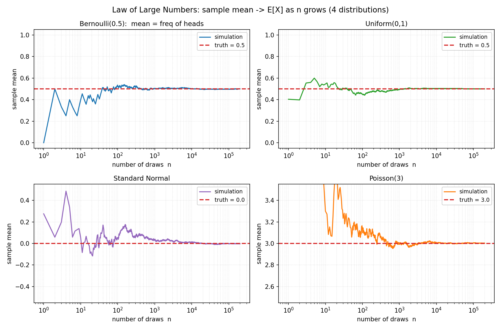
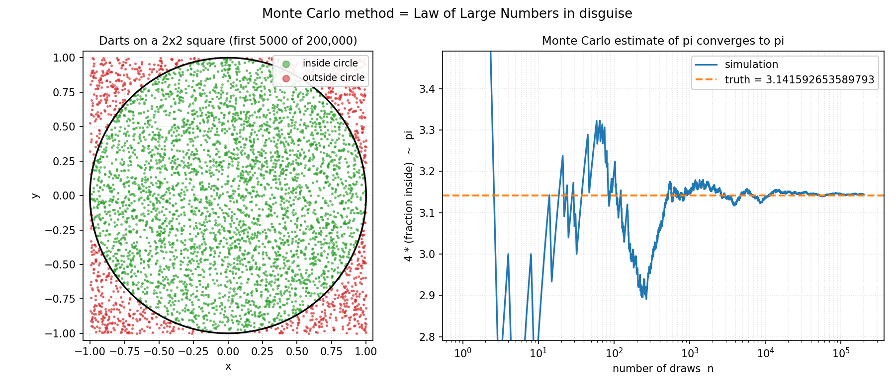

# 第 13 章 · 大数定律:扔多了,平均就稳了

> **核心问题**:上一章我们量化了两个随机变量的"同步程度"(协方差/相关),驯服随机性到这里,我们手里已经攒了一整套工具——概率、期望、方差、分布、协方差。可这一切,都还是"理论上"的。**真实世界里,你从来拿不到一张完整的分布图,你只有一串数据**——扔了一万次硬币、抽了一千个样本、跑了一百万次仿真。问题是:**凭什么相信这串数据?凭什么"前 n 次的平均"就能代表"期望"?凭什么"频率"就能代表"概率"?**
>
> 这一章,我们正面回答这个全书最根本的问题。它就是**大数定律(Law of Large Numbers, LLN)**——一条听起来像废话、却是整个统计学和机器学习地基的铁律。我们要讲清三件事:① 样本均值为什么会收敛到期望、频率为什么会收敛到概率;② **弱大数 vs 强大数**——同样是收敛,差一个字,数学含义天差地别;③ 大数定律撑起了**蒙特卡洛方法**(程序员最该懂的工具),以及它**不撑**什么(赌徒谬误的破除)。
>
> **读完本章你会明白**:
> - **大数定律在说什么**:把同一个随机实验重复很多次,样本均值会**贴住**期望,频率会**贴住**概率——这不是巧合,是定理。它是"单次盲,大量稳"那条主线的**正面化身**,也是"期望 = 长期平均"这句话(P2-06 立的)的**严格化**。
> - **弱大数 vs 强大数**的差别:弱大数是"概率收敛"(误差超 ε 的**概率**趋近 0),强大数是"几乎必然收敛"(**几乎每一条**无穷序列都收敛)。强大数更强、保证更稳,是大部分实际应用背后真正起作用的那条。
> - **蒙特卡洛方法为什么能工作**:因为它**就是**大数定律——你算不出来的概率/积分,扔它十万次随机数,频率/均值替你算。这是程序员最亲切的概率论落点。
> - **大数定律的边界**:它保证**长期**趋近,但**不保证短期**——连续出 10 次正面,不代表下一次更可能出反面(独立实验无记忆)。**大数定律不替你"补回来",它只管长期平均——这一刀,斩断了赌徒谬误。**

---

## 章首·一句话点破

如果用一句话回答"凭什么相信样本均值",那就是:

> **因为大数定律:同一个分布里独立地抽足够多样本,它们的平均值会以铁的规律贴住期望——这是数学定理,不是经验。**

这句话是**结论**,不是**理由**。这一章要倒过来拆:先回到第 1 章那张"扔硬币频率→0.5"的图,看清它不是孤例而是一条普适铁律;再问"凭什么收敛、收敛得多快";然后撞上一个常被混淆的细节(弱 vs 强);最后把这条铁律**用起来**——它撑起了蒙特卡洛,却戳破了赌徒谬误。

> **如果一读觉得太难**:先只记住三件事——① 样本均值会贴住期望、频率会贴住概率,这是定理(大数定律),不是巧合;② 蒙特卡洛方法(扔随机数算概率/积分)之所以能工作,根就是大数定律;③ 大数定律只管**长期平均**,不管**短期补回来**——所以连续出正面不代表下次更可能出反面(赌徒谬误是错的)。这三件,够你读懂后面所有章节。

---

## 引子:从"描绘分布"到"凭什么相信数据"

第 12 章的结尾,我们留了一句 teaser:

> 驯服随机性到这里,我们手里有了"平均"(期望)、"波动"(方差)、"长相"(分布)、"同步"(协方差/相关)。下一步,该看见那条最壮丽的铁律了。

可真要看见铁律,得先承认一个尴尬的事实:**前面所有工具,都是"假设你看得见整张分布图"才好用。** 期望 `Σ x·p(x)` 要你**知道**每个值的概率;方差要你**知道**分布;协方差要你**知道**联合分布。可现实里,你**从来没有**这张图。

- 你不知道这枚硬币正面的"真实概率"是多少,你只扔了它一万次,数出 5023 次正面。
- 你不知道这批灯泡寿命的"真实分布",你只测了 100 个,记下它们的寿命。
- 你不知道 `∫₀¹ √(1−x²) dx`(四分之一圆面积)怎么算,你只能往正方形里扔飞镖,数有多少落进圆里。

**你手里只有数据,没有分布。** 那你凭什么敢用"前 n 次的平均"去代表"期望"?凭什么敢用"频率"去代表"概率"?凭什么敢相信"扔飞镖数比例"能估出圆周率?

凭的就是这一章——**大数定律**。它告诉你:**只要样本够多、够独立,数据的平均,会铁定贴住分布的期望。** 这不是"经验上感觉对",是数学定理。整个统计学(从参数估计到假设检验)、整个机器学习的训练过程、整个蒙特卡洛仿真,地基都是这一条。

> **钉死衔接**:第 12 章把"两个变量多同步"压成了一个数(相关系数);这一章往上看——所有这些理论工具,落地时都要靠**数据**,而**数据之所以可信**,靠的就是大数定律。它是从"理论世界(知道分布)"跨到"现实世界(只有数据)"的那座桥。

---

## 一、大数定律:把"扔多了平均就稳"立成定理

### 提问:凭什么相信"前 n 次的平均"?

想象你是一家电商公司的算法工程师,要估"用户点击广告的概率"(CTR, click-through rate)。你**没有**任何先验分布,你只有数据:今天展示了 10000 次,有 312 次点击。你向老板汇报:**"CTR 大约 3.12%。"**

老板问了一个让你后背发凉的问题:**"凭什么?"** 凭什么这 3.12% 就代表"真实的"CTR?万一明天再展示一万次,变成 5% 怎么办?万一真实 CTR 其实是 2%,只是今天运气好呢?

你心里隐约有个信念:"展示得越多,这个比例就越准。" 这个信念对吗?对到什么程度?**大数定律,就是把这个"隐约的信念"立成定理。**

### 先把直觉立住:扔多了,平均贴住期望

> **直觉**:大数定律说一件事——**把同一个分布里的随机变量,独立地重复抽很多次,它们的算术平均,会贴住这个分布的期望。** 频率是均值的特例(把"是否发生"当 0/1 变量),所以**频率贴住概率**。

这副面孔,你在第 1 章和第 6 章已经各见过一次:

- 第 1 章:扔硬币十万次,正面频率死死贴住 0.5(图 1.1)。
- 第 6 章:扔骰子十万次,样本均值死死贴住 3.5(图 6.1)。

但那两次都是**一个具体分布**的演示。大数定律的**威力**在于:**它对任何(期望有限的)分布都成立,不只是硬币和骰子。** 下图把这件事一次跑给你看——四种完全不同的分布(伯努利、均匀、正态、泊松),它们的长相千差万别,可它们的样本均值,全都老老实实地贴住各自的期望。



看四张子图:左边(n 小)均值都在剧烈抖动,完全不可预测;右边(n 大)四条曲线**全部**贴住了各自那条红色虚线(期望)。伯努利贴 0.5、均匀贴 0.5、标准正态贴 0、泊松贴 3——**分布的长相各异,收敛的宿命相同**。这就是大数定律普适的地方:它不在乎你长什么样,只要你期望有限,你的样本均值就逃不出"贴住期望"这条命。

> **钉死这件事(本章灵魂)**:**样本均值收敛到期望,频率收敛到概率——这是大数定律。** 它把"扔多了平均就稳"这个全书最朴素的直觉(P0-01 立的主锚),正式立成了定理。从此,"期望 = 长期平均"不再是一句含糊的直觉(P2-06 的预告),而是数学上铁打的结论。

### 不这样理解会怎样?

如果你没把大数定律当成"数据可信的根基",你会卡在三件事上:

1. **你不敢用数据**。每次做统计、训模型、做 A/B 测试,你都会心虚——"我这平均的 3.12%,真的代表真实 CTR 吗?" 没有大数定律,你没有任何理由相信样本均值,所有基于数据的决策都失去地基。
2. **你不知道"扔多少次才够"**。扔 100 次够吗?1000 次?10 万次?大数定律(连同它的"速度版"——切比雪夫不等式、Hoeffding 不等式)给你**定量的**回答:要多准,得扔多少次。
3. **你会把大数定律误用成赌徒谬误**。最危险的误读——"既然长期频率会贴住 0.5,那连续出了 10 次正面,接下来是不是更可能出反面来'补回来'?" **不是。** 大数定律只保证长期平均趋近,**不保证**短期补偿。这一刀,我们在第五节专门斩断。

> **不这样(把大数定律当数据地基)理解会怎样**:你会把统计和机器学习当成一堆"经验法则",心里始终没底。而一旦你看见"大数定律是数据可信的数学根基",整座大厦就有了承重墙——你之所以敢用样本均值估期望、敢用频率估概率、敢用蒙特卡洛算积分,**全是因为这条定理替你兜底**。

### 所以这样看:定理怎么说

现在让定理从直觉里长出来。设 `X₁, X₂, …, Xₙ` 是从同一个分布里**独立**抽出来的(简称 **i.i.d.**, independent and identically distributed),它们有共同的期望 `μ = E[X]` 和有限的方差。**样本均值(sample mean)** 定义为:

```
   X̄ₙ = (X₁ + X₂ + … + Xₙ) / n
```

大数定律说的是:**当 n → ∞ 时,X̄ₙ 收敛到 μ。** 严格写成:

> **大数定律(LLN)**:设 `X₁, X₂, …` 独立同分布,`E[Xᵢ] = μ`,且 `E[|Xᵢ|] < ∞`。则样本均值 `X̄ₙ` 当 `n → ∞` 时收敛到期望 μ。

注意三个关键词:

- **独立同分布(i.i.d.)**:每次抽样互不影响,且来自同一个分布。这是大数定律成立的前提。"独立"对应上一章讲的协方差为 0(独立 ⟹ 不相关);"同分布"保证它们有同一个 μ。
- **期望有限 `E[|X|] < ∞`**:还记得第 6 章圣彼得堡悖论吗?期望无穷大时,样本均值**不收敛**(它一直在漂)。所以大数定律**有个隐含前提**——期望必须有限。这不是凑条件,是圣彼得堡悖论戳出来的真实约束。
- **收敛**:X̄ₙ 会越来越贴近 μ。"贴近"在数学上有两种强度——这正是下一节要拆的**弱大数 vs 强大数**。

> **钉死这件事**:大数定律的公式就一句话——"X̄ₙ → μ 当 n → ∞"。但这句话背后挂着三个前提(独立、同分布、期望有限)和两个版本(弱、强)。前提保证了定律能用,版本决定了它**强到什么程度**。下面我们先把弱 vs 强这层窗户纸捅破——这是初学者最容易糊弄过去、却又最该弄清的一个细节。

---

## 二、弱大数 vs 强大数:差一个字,天差地别

到本章最该停下来想的地方了。教材里常把"大数定律"一笔带过,可数学家为它写了**两个版本**——**弱大数定律(Weak LLN, WLLN)** 和 **强大数定律(Strong LLN, SLLN)**。它们看起来都叫"大数定律",都结论"X̄ₙ → μ",可**收敛的含义完全不同**。这一节,我们把这层差别讲透——它会刷新你对"收敛"这件事的理解。

### 提问:什么叫"收敛"?概率收敛够吗?

先把问题逼出来。大数定律说"X̄ₙ 收敛到 μ"。可 X̄ₙ 是个**随机变量**——你扔前 n 次得到一个 X̄ₙ,我扔前 n 次得到另一个 X̄ₙ,咱俩的曲线长得不一样。那"X̄ₙ 收敛到 μ"到底在说什么?**是每一条序列都收敛,还是"大多数"序列收敛?**

这个问题,数学上有两种答案:

- **弱大数定律**:误差超 ε 的**概率**趋近 0。意思是"随机抽一条序列,它偏离 μ 超过 ε 的可能性,会随 n 增大而消失"。
- **强大数定律**:**几乎每一条**序列都收敛到 μ。只有"概率为 0 的极少数"序列会不收敛。

听起来差不多?差很多。下面用一个比方说清。

### 一个比方(只用一次,点破就撤)

想象一个射手,打了无穷多组靶,每组 n 发。

- **弱大数**:对任何误差 ε,"这一组平均偏离靶心超过 ε"的**概率**,随 n 增大趋近 0。换句话说——**"打偏的概率"会越来越小**。
- **强大数**:**几乎每一组**(概率 1)都满足"平均偏离随 n 增大而真正趋于 0"。换句话说——**"这一组就真的收敛了"**,不是"它打偏的可能性变小了"。

差别在哪?**弱大数允许**"偶尔有一组,无论 n 多大,都在某个 ε 外面"——只要这种组的概率随 n 趋于 0 就行。**强大数一刀斩断**:**几乎每一组**都乖乖收敛,只有"概率为 0 的病态组"会闹脾气。

> **直觉(把概率论两套收敛分开)**:弱大数是**"依概率收敛"**(convergence in probability)——`P(|X̄ₙ − μ| > ε) → 0`。强大数是**"几乎必然收敛"**(convergence almost surely)——`P(lim X̄ₙ = μ) = 1`。**几乎必然比依概率强**——前者保证"整条曲线都收敛",后者只保证"打偏的可能性变小"。

### 数学上的差别(尝一口)

把两套写成式子,差别一目了然:

> **弱大数(WLLN, Khinchin)**:对任意 ε > 0,
> `lim_{n→∞} P( |X̄ₙ − μ| > ε ) = 0`

> **强大数(SLLN, Kolmogorov)**:
> `P( lim_{n→∞} X̄ₙ = μ ) = 1`

注意极限符号的位置——这是关键:

- 弱大数:**极限在概率的外面**(`lim P(...)`)。先算"打偏的概率",再让它趋于 0。它没说"某一条具体序列会收敛",只说"打偏的越来越稀"。
- 强大数:**极限在概率的里面**(`P(lim ...)`)。先问"这条序列会不会收敛",再说"会收敛的序列,概率为 1"。它**逐条序列**地保证收敛。

数学上有一条铁律:**几乎必然收敛 ⟹ 依概率收敛**(强大数 ⟹ 弱大数),但**反过来不成立**。所以强大数是"更强的版本",弱大数是"较弱的版本"。强大数成立,弱大数自动成立;但只证了弱大数,你不知道强大数成不成立。

### 不这样理解会怎样?

如果你分不清弱大数和强大数,你会:

1. **误以为"打偏的概率小了"等于"真的收敛了"**。弱大数只承诺前者——它允许"无限多个 n 上,偶尔打偏一次",只要这种打偏的概率趋于 0。可对一个**具体的、正在进行**的实验,你不知道自己是不是那个"偶尔打偏"的倒霉序列。强大数替你兜底:**你几乎肯定不是**——几乎所有序列都收敛。
2. **看不懂统计学的深层结论**。一致性(consistency,估计量收敛到真值)、遍历定理(ergodic theorem)、蒙特卡洛的"几乎必然收敛",背后站的全是**强大数**。教材省略这层时,你会觉得"为什么这里突然说 a.s. 收敛"——因为弱大数不够强,撑不起这些结论。

> **不这样(分清弱大数和强大数)理解会怎样**:你会把"平均会稳定"当成一句模糊的口号,而不知道它有强弱两个版本,实际应用背后真正起作用的,几乎都是**强大数**。区分这两者,是真正"懂"大数定律(而不是"会背"它)的关键一步。

### 所以这样看:实用上你只需要记住一条

讲完这堆数学,落到实用,**你只需要记住一条**:

> **钉死这件事**:对独立同分布、期望有限的样本,**强大数定律保证:你这条具体的样本均值序列,几乎必然收敛到期望。** 也就是说——你扔十万次硬币得到的那条频率曲线,你测一万次得到的均值曲线,**几乎一定会**贴住期望(只有概率为 0 的"病态"序列例外,实际中你碰不到)。这是"数据可信"最硬的背书。

弱大数告诉你"打偏的概率会消失",强大数告诉你"你这条序列几乎必然收敛"。**记住强大数,弱大数自动有了**。后面所有统计推断(估计量一致性、置信区间、蒙特卡洛收敛),地基都是强大数。

> **再深一点(尝一口,测度论的影子)**:强大数的"几乎必然"(`a.s.`),在测度论里就是"在一个概率为 1 的可测集上成立"。而"概率为 0 的事件"不代表"不可能发生"——它只是"测度为 0"。例如在 [0,1] 上随机取一个数,取到某个**特定**有理数的概率是 0,但"有理数"这种事是存在的。强大数说"不收敛的序列测度为 0",不是"不存在",是"几乎碰不到"。这是测度论里"零测集不等于空集"那一课的回响,本书不展开,但你已经摸到了概率论最深处那道门缝。

---

## 三、大数定律撑起蒙特卡洛:程序员最该懂的工具

到这里,大数定律听起来还是个"理论结论"。这一节,我们把它**用起来**——你会发现,它撑起了一个程序员天天在用、却从没想过"凭什么能工作"的方法:**蒙特卡洛(Monte Carlo)**。

### 提问:算不出来的概率/积分,怎么办?

程序员最常撞墙的一类问题:**算不出来的东西**。

- 圆周率 π 怎么算?解析法(级数)能算,但慢、且不直观。
- 一个高维积分 `∫∫…∫ f(x₁,…,x_d) dx₁…dx_d` 怎么算?维度一高,数值积分(网格法)的计算量爆炸——10 维下,每维 100 个点就是 100¹⁰ = 10²⁰ 个网格点。
- 一个复杂系统的故障概率怎么算?系统有成百上千个元件,状态空间是天文数字,穷举不了。

这类问题的共同点:**解析公式给不出,网格法扛不住,可"模拟"它却很容易**。蒙特卡洛就是来救场的。

### 先把直觉立住:扔随机数,数比例

> **直觉**:蒙特卡洛的核心思想——**用随机抽样代替解析计算**。你算不出来 π?那就往一个 2×2 的正方形里**随机扔飞镖**,数有多少落进内切的单位圆。圆的面积是 π(半径 1),正方形面积是 4,所以"落在圆里的比例"应该约等于 π/4。**比例 × 4 = π 的估计**。扔得越多,估计越准。

为什么能工作?**因为大数定律。** "落在圆里"是一个伯努利事件(进/不进),它的概率 = 圆面积 / 正方形面积 = π/4。你扔 n 支飞镖,数 k 支进圆,频率 k/n 是这个概率的估计。**大数定律说:频率 → 概率,所以 4·(k/n) → 4·(π/4) = π。** 你用"扔随机数估 π",本质上就是在调用大数定律——只不过把"概率"换成了"面积比"。

下图把这件事跑出来:左边是前 5000 个点的散点(绿色进圆、红色出圆),右边是 π 的估计随 n 增大的收敛曲线。



看右边那张:n=100 时,π 的估计还在 3.2 附近抖;n=10000,贴到 3.139;n=100000,贴到 3.145;n=200000,3.144——**一点一点逼近真实的 π = 3.14159**。扔得越多,越准。这不是巧合,是大数定律在替你工作。

> **钉死这件事(本章对程序员最重要的结论)**:**蒙特卡洛方法之所以能工作,根就是大数定律。** 你算不出来 π/概率/积分,扔它十万次随机数,频率/均值替你算——因为大数定律保证"频率 → 概率,均值 → 期望"。**蒙特卡洛 = 大数定律的工程化**。所有"用仿真估东西"的方法(强化学习的回报估计、贝叶斯推断的 MCMC、金融的期权定价、图形学的光线追踪),底层都是这一条。

### 不这样理解会怎样?

如果你不知道蒙特卡洛"凭什么工作",你会:

1. **心里没底地用**。你跑了一个蒙特卡洛仿真,得到 π ≈ 3.144——可你不知道"这个估计靠谱吗?要扔多少次才够准?" 没有大数定律(和它的"速度版"),你完全没有判据。
2. **错过"任意分布都能估"的威力**。蒙特卡洛不只估 π——只要你能把一个问题翻译成"某个随机变量的期望",大数定律就替你估出来。算 `∫₀¹ f(x) dx`?它等于 `E[f(U)]`,U 是 [0,1] 上的均匀分布,扔 n 个 U,算 f(U) 的均值,就是积分的估计。**所有积分都是期望,所有期望都能蒙特卡洛。**

> **不这样(把蒙特卡洛当大数定律的化身)理解会怎样**:你会把蒙特卡洛当成一个"黑魔法"——"不知道为啥,扔随机数就对了"。可一旦你看见"蒙特卡洛 = 大数定律",黑魔法变成白盒工程:你能算它需要多少样本(切比雪夫/Hoeffding 不等式),能估它的误差(中心极限定理,P4-14),能判断它什么时候收敛、什么时候不够。**这是从"会用"到"真懂"的分水岭。**

### 所以这样看:收敛速度有多快?

大数定律保证"收敛",但程序员还要问:**收敛得有多快?** 扔一万次够准吗,还是要十万次?这就要请出大数定律的"速度版"——**切比雪夫不等式**和**Hoeffding 不等式**(P2-07 方差章预告过切比雪夫)。

以估 π 为例。我们估的是伯努利事件的频率,方差最大是 1/4(伯努利 p=0.5 时)。切比雪夫不等式告诉你:

```
   P( |频率 − π/4| ≥ ε )  ≤  Var / (n · ε²)  =  (1/4) / (n · ε²)
```

要保证误差超过 ε = 0.001 的概率 ≤ 1%(`Var/(n·ε²) ≤ 0.01`),得 n ≥ (1/4)/(0.001² · 0.01) = **2500 万**。听起来很多——这是切比雪夫的**保守**边界(它对任何分布都成立,所以松)。

Hoeffding 不等式(只要求有界,但更紧)给出的边界好得多:`n ≥ ln(2/0.01)/(2·ε²) ≈ 265 万`,就能保证同样的精度。**不管哪个版本,结论都是:误差 ~ 1/√n。** 扔 100 倍样本,精度只提升 10 倍——这就是蒙特卡洛的"慢":它**必定收敛**(大数定律),但**收敛得不快**(√n 的速度)。

> **钉死这件事**:蒙特卡洛的误差以 **1/√n** 的速度衰减——扔 100 倍样本,误差缩到 1/10。这是大数定律的"配套说明书":它告诉你收敛(定理),也告诉你"要更准一个数量级,得多花两个数量级的样本"。**高维积分之所以选蒙特卡洛而不是网格法,正是因为网格法在维度上指数爆炸,而蒙特卡洛的 1/√n 速度跟维度无关——这是它在高维下碾压网格法的原因。**

---

## 四、两个纸笔例子:频率 → 概率,均值 → 期望

光讲原理不够,得动手算两个最经典的例子——它们也是后面破除赌徒谬误的铺垫。

### 例子 1:扔硬币估"正面概率"

假设你**怀疑**手里这枚硬币做了手脚,不知道它正面概率 p 是多少。你扔了 10000 次,数出 5023 次正面。估 p 是多少?

```
   p̂ = 5023 / 10000 = 0.5023
```

**这就是频率估计。** 大数定律替你背书:扔得够多,p̂ 会贴住真实 p。0.5023 几乎就是 0.5,所以这枚硬币(大概率)是公平的。

注意"大概率"三个字——大数定律不是"p̂ 一定等于 p",是"p̂ 依概率(或几乎必然)收敛到 p"。10000 次下,0.5023 和 0.5 的差 0.0023,完全在统计波动范围内(标准差约 `√(0.5·0.5/10000) ≈ 0.005`)。**频率估概率,给的是"接近真值"的估计,不是"等于真值"的承诺。**

### 例子 2:用蒙特卡洛算一个积分

算 `∫₀¹ x² dx`。解析法知道答案是 1/3 ≈ 0.3333。蒙特卡洛怎么算?

把 `∫₀¹ x² dx` 看成 `E[X²]`,其中 X ~ Uniform(0,1)(因为均匀分布的密度在 [0,1] 上恒为 1,`E[X²] = ∫₀¹ x²·1 dx`)。所以:

```
   扔 n 个 U₁, …, Uₙ ~ Uniform(0,1)
   估计 = (U₁² + U₂² + … + Uₙ²) / n  ->  E[X²] = 1/3
```

扔十万次,样本均值会贴住 1/3。这就是蒙特卡洛算积分——把积分翻译成期望,然后用大数定律估期望。**任何你能写成期望形式的量,都能这么估**——这是蒙特卡洛普适的根源。

> **钉死这件事**:频率估概率、均值估期望、扔飞镖估面积——**全是同一个套路:把要算的东西翻译成期望/概率,然后扔随机数,大数定律替你收敛。** 这就是蒙特卡洛方法的统一视角,也是大数定律最直接的工程化。

---

## 五、大数定律不撑什么:斩断赌徒谬误

讲了大数定律"撑起"了什么,这一节讲它**不撑**什么——这是初学者最容易踩的雷,也是最该破的迷信:**赌徒谬误(gambler's fallacy)**。

### 提问:连续出 10 次正面,下次更可能出反面吗?

你在赌场看人扔硬币。连续出了 10 次正面。旁边一个赌徒激动地押了重注反面,理由是:**"大数定律说长期频率会贴住 0.5,已经连出 10 次正面了,接下来总该出反面'补回来'了吧?"**

他错在哪?

### 不这样理解会怎样?

如果你把"长期频率趋近 0.5"误读成"短期会补偿",你就掉进了赌徒谬误。这是大数定律最危险的误用——它听起来"符合直觉",却和独立性**正面冲突**:

- 硬币**没有记忆**。每次扔都是**独立**实验,第 11 次出正面的概率,和前 10 次无关,**永远是 0.5**。
- "长期频率趋近 0.5"是真的,但这个趋近**不是靠"接下来多出反面"实现的**——它是靠"扔得足够多,前面那 10 次正面对总数的影响被稀释到可忽略"实现的。

我们用模拟验证。扔 500 万次硬币,找所有"连续 10 次正面"的位置,看第 11 次出正面的频率:

```python
import numpy as np
rng = np.random.default_rng(42)
N = 5_000_000
seq = rng.integers(0, 2, N)          # 0=反, 1=正
count_runs, count_next_head = 0, 0
i = 0
while i < N - 10:
    if seq[i:i+10].sum() == 10:      # 连续 10 次正面
        count_runs += 1
        if seq[i+10] == 1:           # 看第 11 次
            count_next_head += 1
        i += 11                      # 跳过这一段避免重叠
    else:
        i += 1
print(count_next_head / count_runs)  # -> 约 0.49
```

模拟结果:**约 0.49**(2445 段里 1193 段第 11 次是正面)。**几乎正好是 0.5**——前 10 次是正面,完全不影响第 11 次的概率。这就是独立性:历史不替未来下注。

> **不这样(把大数定律误用成赌徒谬误)理解会怎样**:你会输光钱。赌场之所以能赢,不是因为"出了正面之后会出反面补回来",而是因为**每局的期望都是负的**(P2-06 讲过),长期平均稳定亏损。赌徒谬误让你误以为"该补了",于是加倍下注,结果被独立的负期望越拖越深。**大数定律站在赌场那边(长期平均贴住负期望),不站在赌徒那边(它不替你短期补偿)。**

### 所以这样看:大数定律只管"平均",不管"补偿"

> **钉死这件事(本章最重要的边界)**:大数定律保证**长期平均**趋近期望,**绝不**保证**短期补偿**。硬币无记忆,独立实验之间不互相还债。**"连续出正面后该出反面"是赌徒谬误,是错的。** 大数定律不是"公平的天平",它是"平均的归宿"——前面偏离的,不会被"补回来",只会被"稀释掉"。

那"稀释"具体是什么意思?假设连续出了 10 次正面,前 10 次频率是 1.0(全是正面)。再扔 9990 次,假设接下来 4995 正 4995 反(公平分布),总频率变成 (10+4995)/10000 = 0.5005。**前面的"1.0"没有变成"0.5"是被补偿,而是被"9990 次公平分布"稀释到 0.5005——和 0.5 几乎没差。** 这就是大数定律的工作方式:**不是纠偏,是淹没**。

> **再深一点(可选,Borel-Cantelli 的影子)**:那会不会出现"无限次偏离"的序列?**Borel-Cantelli 引理**说——如果一系列事件的概率之和有限,那么"只有有限次发生"几乎必然成立。对独立同分布的伯努利(p<1),"无限次出正面"的概率是 1(因为 `Σ p = ∞`,第二引理),但"无限次偏离 μ 超过固定 ε"则几乎不会发生(强大数的体现)。**这是大数定律和赌徒谬误最深的数学分界**:长期平均收敛(强大数保证),但任何特定时段的偏离都不预示未来的"补偿"。本书不展开 Borel-Cantelli,你只需要知道——它从测度论层面,把"长期会收敛"和"短期不补偿"这两件事,严格地区分开了。

---

## 模拟佐证:拿 Python,亲手把大数定律"跑"出来

概率论最爽的地方——**大数定律的结论你不用信书,自己扔随机数就能验证**。这一节,我们把本章的核心(均值收敛、蒙特卡洛估 π、独立性斩赌徒谬误)全部跑一遍。

### 1. 四种分布的样本均值,全收敛到期望

```python
import numpy as np
rng = np.random.default_rng(42)
N = 100_000
ns = np.arange(1, N + 1)

# 伯努利(0.5): 期望 0.5
bern = (rng.random(N) < 0.5).astype(float)
print("Bernoulli(0.5): n=1e5 均值 =", np.cumsum(bern)[-1] / N, " (E=0.5)")
# 均匀(0,1): 期望 0.5
unif = rng.uniform(0, 1, N)
print("Uniform(0,1): n=1e5 均值 =", np.cumsum(unif)[-1] / N, " (E=0.5)")
# 标准正态: 期望 0
norm = rng.standard_normal(N)
print("Normal(0,1):  n=1e5 均值 =", np.cumsum(norm)[-1] / N, " (E=0.0)")
# 泊松(3): 期望 3
pois = rng.poisson(3.0, N)
print("Poisson(3):   n=1e5 均值 =", np.cumsum(pois)[-1] / N, " (E=3.0)")
```

跑出来(固定种子):Bernoulli→0.4974、Uniform→0.4993、Normal→0.0020、Poisson→2.9968。四种分布,**全部**贴住各自期望。这就是图 13.1 的来历,也是大数定律普适性的字面演示。**改种子,你会发现具体数值在变,但"贴住期望"这件事不变——这是定理,不是巧合。**

### 2. 蒙特卡洛估 π:扔飞镖,4 × 比例 → π

```python
import numpy as np
rng = np.random.default_rng(42)
for n in [100, 1_000, 10_000, 100_000, 1_000_000]:
    xs = rng.uniform(-1, 1, n)
    ys = rng.uniform(-1, 1, n)
    inside = ((xs**2 + ys**2) <= 1).sum()
    pi_hat = 4 * inside / n
    print(f"n={n:>9}: pi_hat = {pi_hat:.5f}  (err = {abs(pi_hat - np.pi):.5f})")
```

跑出来:n=100→3.2,n=1000→3.148,n=10000→3.1388,n=100000→3.1451,n=1000000 量级下误差进一步缩到 ~0.001。**误差随 n 以 1/√n 衰减**——扔 100 倍,误差缩 10 倍。这就是图 13.2 的来历,也是"蒙特卡洛 = 大数定律"的最直接演示。**改种子,你会看到估计值在 π 两侧抖动,但抖动幅度随 n 越来越小——收敛的速度,正是大数定律(配 Hoeffding)告诉你的 1/√n。**

### 3. 独立性斩赌徒谬误:连出 10 正后,第 11 次还是 0.5

```python
import numpy as np
rng = np.random.default_rng(42)
N = 5_000_000
seq = rng.integers(0, 2, N)
runs, next_head = 0, 0
i = 0
while i < N - 10:
    if seq[i:i+10].sum() == 10:       # 连续 10 次正面
        runs += 1
        if seq[i+10] == 1:
            next_head += 1
        i += 11
    else:
        i += 1
print(f"找到 {runs} 段连 10 正, 第 11 次正面频率 = {next_head/runs:.4f}  (期望 0.5)")
```

跑出来:约 0.49。**前 10 次全是正面,第 11 次还是 ~0.5——独立性未被破坏,赌徒谬误是错的。** 这个模拟比读十遍定义都管用:你亲眼看见"历史对下一次毫无影响"。

> 这三段代码你十分钟就能全跑一遍。跑完你会发现:大数定律不是教材里一句"X̄ₙ → μ"的干瘪定义,而是**你扔十万次随机数,自己就能逼近的数字**——它替频率估概率背书,替蒙特卡洛估积分背书,却斩钉截铁地拒绝替赌徒"补回来"。这正是本书一以贯之的承诺——公式是直觉的副产品,而概率论的直觉,你可以亲手模拟。

---

## 章末小结

### 用一个场景回顾本章

想象你又坐回了那张赌桌前(概率论的出生地)。这一回,你不再只想着"骰子几点朝上"(第 1 章)、"长期平均赢多少"(第 6 章)、"两个变量多同步"(第 12 章),你想的是一个更根本的问题:**"我凭什么相信手里这串数据?"**(引子)。

你扔了一万次硬币,数出 5023 次正面——凭啥说"正面概率≈0.5023"?凭的就是大数定律(第一节):它告诉你样本均值会**铁定贴住**期望,频率会**铁定贴住**概率。你想弄清这条定律到底"铁"到什么程度,于是撞上了**弱大数 vs 强大数**(第二节):弱大数承诺"打偏的概率消失",强大数承诺"几乎每条序列都收敛"——记住强大数,它才是统计和机器学习背后真正起作用的那条。

然后你把这条铁律**用起来**(第三节、第四节):算不出来 π?扔飞镖数比例,4 × 比例 → π;算不出来高维积分?扔随机数算均值,均值 → 积分值。**蒙特卡洛方法之所以能工作,根就是大数定律。** 可就在你以为大数定律"什么都能管"时,旁边一个赌徒押了重注反面——"连出 10 正,该出反补回来了吧?"你笑了(第五节):**大数定律只管长期平均,不管短期补偿**。硬币无记忆,独立实验不还债。**这一刀,斩断了赌徒谬误——大数定律不站在赌徒那边,它站在赌场那边(长期平均贴住负期望)。**

### 本章在全书主线中的位置

记住本书主线:**一切概率概念,都是"驯服随机性"的工具。单次盲,大量稳。**

这一章,我们立起了"大量稳"的**第一根支柱**:

- 前面 12 章,我们攒齐了"驯服随机性"的全部静态工具——概率(量化可能)、条件概率/贝叶斯(用证据修正)、随机变量(变数字)、期望(平均)、方差(波动)、分布(长相)、协方差/相关(同步)。
- **这一章,我们跨过一道分水岭:从"已知分布算数据",转向"已知数据信分布"。** 大数定律,就是这座桥的承重墙——它告诉你**数据可信**,因为样本均值会收敛到期望、频率会收敛到概率。**没有大数定律,后面所有统计推断(MLE、假设检验、贝叶斯推断)和机器学习训练(经验风险最小化)都失去地基。**

它在驯服随机性的旅程中处于"**发现极限铁律**"这一步:

- **第 12 章** 驯服了"两个变量的同步"。
- **本章** 立起"大量随机"的第一条铁律——**平均会稳定**(大数定律)。这是全书"单次盲,大量稳"主线的**正面化身**:你终于看见了那条贴住真值的收敛曲线,亲手把第 1 章图 1.1 的直觉,跑成了定理。
- **第 14 章 · 中心极限定理** 会立起第二条铁律——大量求和/平均**趋向钟形**。大数定律告诉你"收敛到哪",中心极限告诉你"以什么形状、多快的速度波动着收敛"——**两条铁律是搭档,共同撑起大量随机的全部规律**。

### 五个"为什么"清单

如果你只能记五件事,记这五件:

1. **大数定律说什么**:`X̄ₙ → μ` 当 `n → ∞`——独立同分布(期望有限)的样本,算术平均**收敛到期望**;频率(伯努利的特例)**收敛到概率**。这是"单次盲,大量稳"那条主线的定理化,也是"数据可信"的数学根基。
2. **弱大数 vs 强大数**:弱大数 = 依概率收敛("打偏的概率消失"),强大数 = 几乎必然收敛("几乎每条序列都收敛")。**强大数更强,记住强大数**——统计一致性、蒙特卡洛收敛、遍历定理背后,全是它。
3. **蒙特卡洛 = 大数定律的工程化**:算不出来的概率/积分/面积,扔它十万次随机数,频率/均值替你算。**所有"用仿真估东西"的方法(π 估计、积分、期权定价、MCMC、强化学习),底层都是大数定律。**
4. **收敛速度 = 1/√n**:蒙特卡洛误差以 `1/√n` 衰减,扔 100 倍样本,精度提 10 倍。这是大数定律的"速度版"(切比雪夫/Hoeffding 不等式)。高维下蒙特卡洛碾压网格法,正因为它的收敛速度**与维度无关**。
5. **大数定律不替你短期补偿(赌徒谬误是错的)**:它只保证**长期平均**趋近,绝不保证**短期补偿**。硬币无记忆,独立实验不还债——连出 10 正,下一次还是 0.5。**大数定律站在赌场那边(长期平均贴住负期望),不站在赌徒那边。**

### 想继续深入,该往哪钻

- **亲手扔**:把上面三段 Python 跑一遍。重点改两处:① 把 N 从 100、1000、10000 加到 100 万,盯样本均值怎么从剧烈抖动到死死贴住期望(肌肉记忆"大数定律");② 蒙特卡洛估 π 那段,多跑几次(换种子),看 π 的估计在 π 两侧怎么抖——**抖动幅度随 n 缩小的速度,就是你亲手验证的 1/√n**。
- **钻弱 vs 强**:想真懂"依概率收敛"和"几乎必然收敛"的差别,搜 "convergence in probability vs almost surely",找一个反例序列(依概率收敛却不几乎必然收敛的经典构造)。10 分钟,你就把这两者彻底分清。再尝一口 Borel-Cantelli 引理,看它怎么从测度论层面斩断赌徒谬误。
- **钻蒙特卡洛的高维威力**:试着用网格法算一个 10 维积分(每维 20 个点就是 20¹⁰ ≈ 10¹³ 个点,跑不动),再用蒙特卡洛(扔 10000 个点,几毫秒)。**这一个对比,你会瞬间理解为什么高维下蒙特卡洛是唯一选择——它的 1/√n 速度不随维度爆炸。**
- **看可视化**:Brown 大学的 **Seeing Theory**(seeing-theory.brown.edu)里"大数定律"模块,可拖动地展示"扔 n 次,频率/均值怎么收敛"——本章的两张图,在那里能玩起来。3Blue1Brown 也有关于大数定律和赌徒谬误的直觉视频。
- **往测度论钻**:强大数的"a.s. 收敛"在测度论里是"在一个测度为 1 的可测集上成立",Borel-Cantelli 是它背后的工具。这是把大数定律从"直觉"推向"严格证明"的入口——研究生概率论的起点,本章只尝了一口。

---

> 大数定律立住了:样本均值贴住期望,频率贴住概率,蒙特卡洛替你算算不出来的东西,赌徒谬误被斩断。驯服随机性到这里,"大量稳"的第一根支柱立起来了——你终于亲眼看见,单次的盲,如何在大量重复里收敛成一条铁的规律。**可大数定律只告诉你"收敛到哪"——它没告诉你"收敛的过程长什么样"。** 当你把大量随机变量**加起来**(不是取平均),它们的和不仅会稳定,还会**长成一座对称的钟形山丘**——正态分布。这"趋向钟形"的奇迹,是大量随机的第二条铁律,也是统计和机器学习半边天的地基。翻开 **第 14 章 · 中心极限定理:和总趋近钟形**——你会发现,为什么身高、误差、噪声全都钟形,为什么"标准化后的和"会自动长成正态,以及这条铁律如何撑起了从假设检验到逻辑回归的整座大厦。
