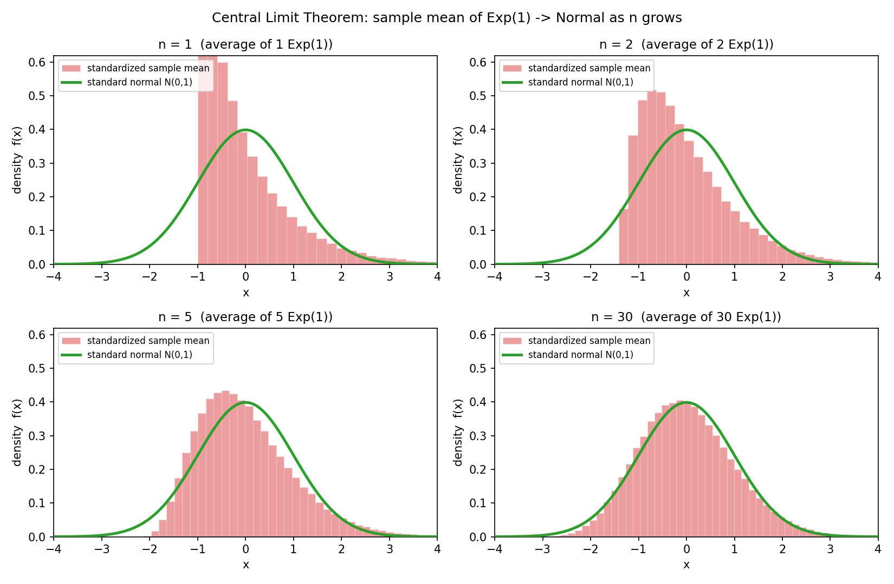
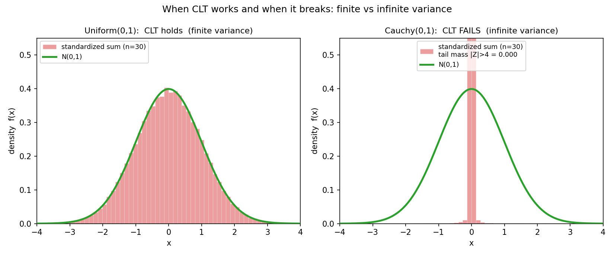

# 第 14 章 · 中心极限定理:和总趋近钟形

> **核心问题**:上一章大数定律告诉你——样本均值会贴住期望。可它只说了"贴到哪",没说"怎么贴过去":均值在期望附近抖动的**形状**,是均匀的、是双峰的、还是别的什么?为什么一万个学生的身高、一万次测量的误差、一万次点击的真实率,平均出来之后,**千差万别的源头,却长出同一座钟形山丘**?更离谱的是——为什么第 1 章那张"100 个均匀随机数求和变钟形"的预告图(图 1.2),明明加的是一坨毫无规律的扁平随机数,和的分布却鼓成对称的正态?
>
> 这一章,我们正面破这桩全书最大的案子。它就是**中心极限定理(Central Limit Theorem, CLT)**——概率论最美的结论,也是"大量稳"的第二根支柱。我们要讲清四件事:① CLT 到底说了什么(独立、同分布、有限方差,样本均值标准化后趋向标准正态);② 为什么它**这么普适**,不挑原分布形状——这就是"处处是正态"的终极根;③ CLT 怎么用——正态近似算概率,是统计推断与机器学习的半边地基;④ 它什么时候**失效**(柯西分布、方差无限),以及一条最深的直觉钩子——为什么求和这件事,注定把任何分布磨成正态。
>
> **读完本章你会明白**:
> - **CLT 在说什么**:把独立同分布(有限方差)的随机变量**加起来**(或求平均),标准化之后,分布趋向**标准正态**——不管原来是什么分布。大数定律说"平均收敛到期望",CLT 更进一步,告诉你"收敛过程长成钟形,且波动的尺度是 σ/√n"。
> - **为什么 CLT 这么普适**:它不依赖原分布的具体形状,只依赖"独立、有限方差"这两条——所以身高、误差、噪声、点击率,凡是"许多小因素之和"的量,统统被它逼成正态。这就是 P3-10 那桩"为什么处处是正态"案子的终极答案。
> - **CLT 怎么用**:当 n 够大,和/均值近似正态,于是你**不用知道原分布**,只靠均值和方差,就能算出"均值落在某区间"的概率——这是置信区间、假设检验、A/B 测试的地基,也是下一篇 P5 统计推断的起点。
> - **CLT 的边界**:它要求**有限方差**。重尾分布(柯西)方差无限,求多少个都不趋向正态——CLT 不是无条件成立的,这条边界你得守得住。

> **如果一读觉得太难**:先只记住三件事——① 大量独立求和/求平均,标准化后趋向**标准正态 N(0,1)**,不管原来是什么分布;② 均值的方差是 `σ²/n`——样本量翻倍,精度提 √2 倍;③ n≥30 通常够用(经验法则),但重尾分布不行。其余的"为什么这么普适""特征函数""柯西反例",都是给"想真懂"的人的加餐,读不懂先放放,记住前面三条够你读懂后面所有统计章节。

---

## 章首·一句话点破

如果用一句话回答"为什么和总趋近钟形",那就是:

> **把足够多独立、有限方差的随机变量加起来,标准化之后,它们的分布几乎必然趋向标准正态——这是数学定理,不是经验。原分布长什么样,它根本不在乎。**

这句话是**结论**,不是**理由**。这一章要倒过来拆:先从上一章留的那句话("大数定律只告诉你收敛到哪,没告诉你以什么形状收敛")接过来,看清"形状"才是 CLT 的真正主战场;再把定理从直觉里长出来,核对它的均值和方差(`nμ` 和 `nσ²`);然后破"为什么这么普适"这桩最大的案子,落到正态近似这个工程师天天在用的工具;最后尝一口它的边界——什么时候 CLT 会失效。

---

## 引子:大数定律只说了一半

上一章结尾我留了一句 teaser:

> 大数定律只告诉你"收敛到哪"——它没告诉你"收敛的过程长什么样"。当你把大量随机变量**加起来**(不是取平均),它们的和不仅会稳定,还会**长成一座对称的钟形山丘**——正态分布。

这句话信息量其实大得吓人。我们把它拆成两半:

- **大数定律**:样本均值 `X̄ₙ` 当 `n → ∞` 时,**收敛到**期望 μ。它回答的是"终点在哪"——一个**点**。
- **可"收敛"不是"一步到位"**。在 n 还没到无穷大的时候(也就是现实里任何有限的样本量),`X̄ₙ` 是个随机变量——你抽一组样本得到一个 `X̄ₙ`,我抽一组得到另一个。这些 `X̄ₙ` 围着 μ 散布,有的偏大、有的偏小。**它们散布的形状是什么?散布得多开(尺度)?** 大数定律一个字都没说。

而 CLT 来补这一半。它告诉你两件更精细的事:

1. **形状**:这个散布是**正态的**(钟形、对称)。
2. **尺度**:散布的标准差是 `σ/√n`——样本量翻倍,散布宽度缩到原来的 `1/√2`(这正好呼应上一章蒙特卡洛误差的 `1/√n` 速度,根就是 CLT)。

> **钉死衔接**:大数定律和 CLT 是搭档,不是替代。大数定律说"平均会稳到 μ",CLT 说"在稳的过程中,均值围着 μ 的抖动是钟形的,尺度 σ/√n"。**一个说终点,一个说过程的形状和速度**——两条铁律合起来,才完整刻画了"大量随机"的全部规律。本章,就是把"形状"这一半立成定理。

---

## 一、CLT 到底说了什么:标准化后的和趋向正态

### 提问:100 个均匀随机数加起来,为什么是钟形

我们回到 P0-01 那张震撼过你的预告图(图 1.2)。把 100 个"完全随机、扁平、毫无规律"的 `Uniform(0,1)` 加起来,重复 5 万次,画出"和"的分布。你期望看到什么?直觉说——既然加的是扁平的东西,和应该也"扁平"或者"乱糟糟"才对。可现实给你的是**一座对称、光滑的钟形山丘**。

这件事在 P0-01 和 P3-10 都露过脸,但我们一直没解释**为什么**。现在正面拆。

> **直觉(先看一张更狠的演化图)**:这次我们不直接画 100 个相加的结果,而是把"加几个"这个变量,从 1 慢慢加到 30,看分布形状怎么变。底料换成**指数分布**——它明显右偏、有长尾,长得**最不像**正态。我们对 n=1、2、5、30 各做一次"抽 n 个 Exp(1) 求平均,标准化后画直方图"——



看四张子图。**n=1**(单抽一个 Exp(1)):直方图就是指数分布的样子——右边拖着长尾,峰挤在最左边,毫无对称可言,和绿色正态曲线**完全不搭**。**n=2**(两个 Exp 求平均):长尾开始缩,峰往中间移,形状有点像一座"被压扁的钟"。**n=5**:对称性明显起来了,尾巴几乎消失,直方图开始贴住正态曲线。**n=30**:标准化后的直方图**死死贴住 N(0,1) 曲线**——明明底料是右偏的指数,平均 30 次之后,钟形就长出来了。

**这就是 CLT 的力量:它不在乎你从什么分布出发,只要"求和/求平均"足够多次,钟形就自动长出来。** 指数、均匀、泊松、伯努利……底料千差万别,平均 30 次之后,统统被磨成同一个正态形状。

### 不这样理解会怎样

> **不这样(把 CLT 当普适铁律)理解会怎样**:你会卡在两件事上。第一,你解释不了"为什么身高、误差、噪声都钟形"——你只能当巧合,可天下哪有这么巧的事?第二,你做统计时会寸步难行:你想估一个样本均值的置信区间,可你**不知道原分布长什么样**(现实里你从来拿不到完整分布),怎么算"均值落在某区间的概率"?CLT 替你兜底——**不用知道原分布,只要 n 够大,均值就近似正态,你只靠均值和方差就能算概率**。没有 CLT,整座统计推断大厦的地基就塌了。

### 所以这样看:定理怎么说

现在让定理从直觉里长出来。设 `X₁, X₂, …, Xₙ` 独立同分布(沿用上一章的 i.i.d.),共同的期望 `E[Xᵢ] = μ`,**有限的方差** `Var(Xᵢ) = σ²`(注意:有限方差是 CLT 的硬条件,第五节会专门讲它什么时候失效)。定义**和**与**样本均值**:

```
   Sₙ = X₁ + X₂ + … + Xₙ            (和)
   X̄ₙ = Sₙ / n                       (样本均值)
```

先把和与均值的均值、方差算清楚(用期望的线性性 + 独立变量的方差可加,P2-06 和 P4-11 讲过):

```
   E[Sₙ] = n·μ           Var(Sₙ) = n·σ²           (和: 均值方差都 ×n)
   E[X̄ₙ] = μ             Var(X̄ₙ) = σ²/n            (均值: 均值不变, 方差 ÷n)
```

> **钉死这两个公式(本章的算术地基)**:**和**的均值是 `nμ`、方差是 `nσ²`(n 个独立小扰动加起来,平均幅度放大 n 倍,波动幅度也放大 n 倍);**均值**的均值还是 μ、方差是 `σ²/n`(除以 n 把尺度缩回来,所以样本越多均值越稳——这正是上一章大数定律的"波动版")。**这两个公式务必记牢**,下面 CLT 的标准化全靠它。

然后做**标准化**(P3-10 的万能钥匙,`Z = (X−μ)/σ`):把和或均值减去自己的均值、除以自己的标准差,造出一个均值 0、方差 1 的新变量。

```
   标准化和:    Zₙ = (Sₙ − nμ) / (√n · σ)
   标准化均值:  Zₙ = (X̄ₙ − μ) / (σ/√n)        ← 同一个东西, 除以 n 而已
```

(注意这两个式子**完全等价**:`(X̄ₙ − μ)/(σ/√n) = (Sₙ/n − μ)/(σ/√n) = (Sₙ − nμ)/(√n·σ)`。讲"和"还是讲"均值"只是口味问题,数学是同一个。)

CLT 说的是:

> **中心极限定理(CLT, Lindeberg–Lévy)**:设 `X₁, X₂, …` 独立同分布,`E[Xᵢ] = μ`,`0 < Var(Xᵢ) = σ² < ∞`。则对任意实数 a,
> ```
>    lim_{n→∞}  P( (Sₙ − nμ)/(√n·σ)  ≤  a )  =  Φ(a)
> ```
> 其中 `Φ` 是标准正态的累积分布函数。换句话说:**标准化后的和,当 n → ∞ 时,分布收敛到标准正态 N(0,1)**。

注意三个关键点:

- **独立同分布 + 有限方差**:这三条是 CLT 的前提。"独立"保证方差可加(P4-12 讲过独立 ⟹ 协方差为 0);"同分布"只是为了简洁,其实 CLT 有更一般的版本(不要求同分布,只要 Lindeberg 条件,见彩蛋);"有限方差"是**硬**条件——方差无限的分布(如柯西)CLT 直接失效。
- **标准化是关键**:CLT 说的不是"和趋向正态",而是"**标准化后**的和趋向**标准**正态"。不标准化的话,和的方差 `nσ²` 会越来越大,直方图会越来越宽、越来越平,根本没法收敛——标准化把尺度固定下来,才能看清"形状"的收敛。
- **分布收敛(依分布收敛)**:`Zₙ` 的 CDF 逐点收敛到 `Φ`。这是比上一章"依概率收敛"更弱的一种收敛——它只看分布函数,不看具体序列。本章不展开收敛的层级,你只要记住:**n 够大时,`Zₙ` 的分布"长得像"标准正态,够你拿来算概率**。

> **钉死这件事(本章灵魂)**:**大量独立同分布(有限方差)随机变量之和,标准化后趋向标准正态。** 这就是 CLT。它把 P0-01 图 1.2 那张"100 个均匀数求和变钟形"的预告,正式立成了定理——而且告诉你,这不是均匀数的特权,**任何**满足三条的分布都逃不出这条命。

### 一个经验法则:n 多大才够用

CLT 是 `n → ∞` 的极限定理,可现实里 n 永远有限。那**多大才够用**?这有个经验法则:

> **经验法则**:如果原分布**对称、单峰**(如均匀、本身就近正态),n ≥ 5~10 就够正态近似得很贴;如果原分布**轻度偏斜**(如指数),n ≥ 30 通常够用;如果原分布**严重偏斜或重尾**(如收入、金融收益),可能要 n ≥ 100 甚至更多,或者干脆正态近似不可用,得换别的分布(t 分布、自助法 bootstrap)。

"n ≥ 30"是教材里最常见的门槛,所以图 14.1 我特意画到 n=30——你能看到那个点直方图已经死死贴住正态曲线了。**但记住这是经验法则,不是定理**。重尾分布 n=30 远远不够(下一节柯西反例会吓你一跳)。

---

## 二、为什么 CLT 这么普适:求和这件事,只保留均值和方差

到这里你大概已经接受了"和趋向正态"这个结论。可一个更深的问题卡着:**为什么偏偏是正态?** 为什么不是趋向均匀、趋向指数、趋向泊松?天下分布那么多,凭什么"求和"这个操作,把所有分布都磨成**同一个**钟形?

这桩案子,是本章最该停下来想的地方。破它,要靠一个直觉钩子(P3-10 结尾埋过)——再加一点卷积。

### 直觉钩子:求和是"磨平高阶细节"的操作

> **直觉**:任何一个分布,它的"长相"由它的**各阶矩**共同决定——一阶矩是均值(位置),二阶矩相关的是方差(宽度),三阶矩是偏度(左右不对称),四阶矩是峰度(尖平),还有更高阶的……一个分布越复杂,你需要越多阶矩才能刻画它的形状。

现在关键来了:**两个独立随机变量之和的分布,等于它们分布的卷积**(下一节细讲)。而**卷积这个操作,有一个"低通滤波"的本性**——它会把高阶的细节(偏度、峰度、更精细的形状)一点点磨平,只把低阶的(均值、方差)累加起来。

- 两个分布卷积一次:三阶矩(偏度)缩小,四阶矩(峰度)开始往 3 靠拢(正态的峰度)。
- 卷积十次、三十次:高阶矩几乎被磨平,只剩均值和方差还有意义。
- 而**"只由均值和方差就能完全决定"的分布,正是正态**(给它 μ 和 σ²,正态的形状就钉死了,没有别的自由度)。

所以求和这件事,像一个筛子——它把原分布的"个性"(偏度、峰度、双峰、长尾)一点点筛掉,只留下"共性"(均值、方差)。筛到最后,只剩均值和方差还有意义的那个分布,**只能是正态**。**这就是"为什么偏偏是正态"的直觉根:正态是"求和之后唯一还能存活"的形状。**

> **钉死这件事(本章最深的直觉)**:**求和(卷积)是低通滤波,它磨平高阶矩,只保留均值和方差。而正态是"完全由均值和方差决定"的分布——所以大量求和之后,剩下的形状只能是正态。** 这就是 CLT 普适的根源,也是为什么"处处是正态":现实里几乎所有可观测的量,都是许多独立小因素**叠加**的结果,而叠加把它们的个性磨光,只留共性,共性凝结成的形状,就是钟形。

### 一口卷积:两个独立变量之和的分布

把上面的直觉钉牢,得看清"求和"在数学上到底在干嘛。设 `X`、`Y` 独立,密度分别是 `f_X`、`f_Y`,求 `Z = X + Y` 的密度 `f_Z`。结果是**卷积(convolution)**:

```
   f_Z(z) = ∫ f_X(x) · f_Y(z − x) dx
```

直觉上:把 `f_Y` 翻转一下、平移 z,然后和 `f_X` 逐点相乘再积分——这就是"两个独立分布叠加"在数学上的样子。卷积有一个关键性质:**它让分布变"光滑"、变"集中"**。

- 把两个 `Uniform(0,1)` 卷积(求和),结果不是均匀,而是**三角分布**——中间高、两边低。
- 再卷积一次(三个均匀求和),三角变**抛物线状**,更鼓。
- 卷积五六次之后,形状已经几乎和正态分不清了。

这就是 P0-01 图 1.2 的数学真相:100 个均匀卷积 100 次,每一次都磨平一阶高阶矩,磨到第 100 次,只剩下均值(50)和方差(100/12)还有意义——于是它凝结成正态 `N(50, 100/12)`。**钟形不是被"造"出来的,是被卷积"磨"出来的。**

> **再深一点(尝一口,特征函数)**:严格证明 CLT,最干净的工具是**特征函数(characteristic function)**——分布的傅里叶变换。两个独立变量之和的特征函数,等于它们特征函数的**乘积**。所以 n 个独立同分布变量之和的特征函数,是单个特征函数的 n 次方:`φ_{Sₙ}(t) = φ(t)ⁿ`。把 `φ(t)` 在 0 附近泰勒展开(`φ(t) ≈ 1 + iμt − σ²t²/2 + …`),取 n 次方,你会发现 n 次方正好对应 `e^(i·nμ·t − nσ²t²/2)`——**这正是正态 `N(nμ, nσ²)` 的特征函数**。换句话说,特征函数的 n 次方,在 n 大时,自动"塌缩"成正态的特征函数。**这就是 CLT 的严格证明骨架**,也是上面"卷积磨平高阶矩"的数学精确版——傅里叶域里,n 次方就是个低通滤波器,把高频(高阶矩)压没,只留直流和二阶项(均值、方差),剩下的就是正态。本书不展开严格推导,但你已经摸到了 CLT 最优雅的证明路径。

### 所以这样看:CLT 的普适性,来自求和的本性

> **所以这样看**:CLT 之所以普适,不在于"正态分布恰好长这样",而在于"求和这个操作,本性就是把高阶矩磨平、只留均值方差"。只要你的量是"许多独立小扰动之和"(身高、误差、噪声、点击率、聚合数据),它就逃不过被磨成正态的命运——**和原分布是什么形状无关**。这就是 P3-10 那桩"为什么处处是正态"案子的终极答案:**钟形不是巧合,是卷积(求和)的必然产物**。

---

## 三、CLT 怎么用:正态近似,统计推断的地基

光讲定理不够,得用起来。这一节,我们把 CLT 落到工程师天天在用、却从没想过"凭什么能这么算"的工具:**正态近似(normal approximation)**。

### 提问:不知道原分布,怎么算均值的概率

假设你是一家电商的算法工程师。真实点击率(CTR)p = 0.05。你今天展示了 n = 1000 次广告,样本均值(点击率估计)`X̄ = 累计点击数/1000`。你老板问:**"X̄ 落在真实 p 的 ±0.01 以内的概率是多少?"** 换句话说——"我今天估的点击率,误差不超过 1 个百分点的概率有多大?"

这是个统计推断里最典型的问题。麻烦在于:**你不知道 `X̄` 的精确分布**。每次展示是否点击是伯努利(p),`X̄` 是 1000 个伯努利之和除以 1000——它的精确分布是**二项分布除以 n**。可二项分布在 n=1000 时算概率极其麻烦(组合数 `C(1000, k)` 是天文数字)。

怎么办?CLT 来救场。

### 不这样理解会怎样

> **不这样(用 CLT 做正态近似)理解会怎样**:你会卡在精确计算上。二项分布在 n 大时,直接算 `P(X̄ ∈ [a, b])` 要枚举所有可能的点击数 k,每个 k 算一次 `C(1000,k)·p^k·(1−p)^(1000−k)`——手算根本不可能,电脑也算得费劲。而 CLT 替你绕过这个麻烦:**只要 n 够大,X̄ 近似正态,你只靠均值 p 和方差 p(1−p)/n,就能查标准正态表算出概率**。这就是统计里几乎所有"大样本"方法的地基——没有 CLT,你连一个置信区间都算不出来。

### 所以这样看:标准化 + 查标准正态表

来算。`X̄` 的均值是 p,方差是 `p(1−p)/n`(样本均值的方差公式)。标准化:

```
   Z = (X̄ − p) / √(p(1−p)/n)   近似服从  N(0,1)
```

你问的是 `P(|X̄ − p| < 0.01)`,等价于 `P(|Z| < 0.01/√(p(1−p)/n))`。代入 p=0.05、n=1000:

```
   标准误 SE = √(0.05·0.95/1000) = √0.0000475 ≈ 0.006892
   边界      = 0.01 / 0.006892 ≈ 1.451
   P(|Z| < 1.451) = Φ(1.451) − Φ(−1.451) ≈ 2·0.9266 − 1 ≈ 0.853
```

所以今天估的点击率,误差不超过 1 个百分点的概率,大约 **85%**。这个数,你用精确二项分布算,差别不到 1 个百分点——CLT 近似得非常好。

我用蒙特卡洛核对一遍(扔十万次,看真实落进区间的频率):

```python
import numpy as np
rng = np.random.default_rng(42)
p, n = 0.05, 1000
mc = rng.binomial(n, p, 100_000) / n     # 十万次"今天"的模拟
print(np.mean(np.abs(mc - p) < 0.01))    # -> 0.8521
```

跑出来 **0.8521**,和 CLT 给的 0.853 几乎一模一样。**正态近似,在这种"大样本 + 中等概率"的场景下,精度极高**。

> **钉死这件事(CLT 的工程用法)**:**样本量够大时,样本均值近似正态 `N(μ, σ²/n)`。于是你不用知道原分布,只靠均值 μ 和方差 σ²/n,就能查标准正态表,算出"均值落进某区间"的概率。** 这就是**正态近似**——统计推断的半边地基。下一章 P5-15 MLE 的渐近正态性、第 16 章假设检验的 z 检验、置信区间 `μ ± 1.96·σ/√n`,根全是 CLT。**没有 CLT,你今天用的所有"95% 置信区间""p 值小于 0.05",都失去数学依据**。

### 一条暗线:σ/√n 这个尺度,是上一章 1/√n 的真身

注意 CLT 给的方差 `σ²/n`,标准差 `σ/√n`。**这个 `1/√n`,正是上一章蒙特卡洛误差衰减速度的真身**。上一章说"蒙特卡洛误差以 1/√n 衰减",根就在 CLT——蒙特卡洛的估计量是样本均值,它的标准差是 `σ/√n`,所以误差(几个标准差之内)就以 `1/√n` 缩。**大数定律说"会收敛",CLT 说"以 σ/√n 的尺度收敛"——两条铁律,在 `1/√n` 这个数上,严丝合缝地接上了**。

---

## 四、彩蛋:CLT 的条件与失效——柯西分布的反击

兑现"越深越好"。这一节,我们讲清 CLT 的**边界**——什么时候它不成立。这是初学者最容易忽略、却最该守的一条防线。

### 提问:CLT 真的对所有分布成立吗

CLT 的前提里有"**有限方差**"这一条。可"有限方差"这四个字,平时谁在意?大部分常见分布(均匀、正态、指数、泊松、二项)方差都有限,CLT 对它们都成立。那有没有**方差无限**的分布?有——而且它会把 CLT 直接掀翻。

### 反例:柯西分布,求多少个和都不趋向正态

最经典的反例是**柯西分布(Cauchy distribution)**。它的密度是 `f(x) = 1/(π(1+x²))`,形状像一座**又胖又重尾**的钟形——峰在 0,但尾巴衰减得极慢(比正态的 `e^(−x²/2)` 慢得多)。

柯西分布有一个让人头皮发麻的性质:**它没有均值、没有方差**(对应的积分发散)。所以 CLT 的前提"有限方差"对它直接不成立——CLT 不适用。

那"n 个独立柯西之和"长什么样?数学上有个惊人的结论:**n 个 Cauchy(0,1) 之和,分布还是 Cauchy(0, n)**。换句话说,求和**不改变分布族**,只是把尺度放大 n 倍。标准化之后(除以 n),它还是 Cauchy(0,1)——**求多少个和,形状都不变,永远不趋向正态**。

我们用模拟验证。取 n=1、10、100、1000 个独立 Cauchy 求和,标准化后看 `P(|Z| < 1)`:



看两张子图。**左**:均匀分布,n=30 标准化和死死贴住绿色正态曲线——CLT 成立,严丝合缝。**右**:柯西分布,n=30 标准化和,直方图**完全贴不住正态**——它依旧又胖又重尾,`|Z| > 4` 的尾部概率高达 ~0.16(正态只有 0.006%,差了几个数量级)。**无论 n 加多大,右边这张图都不会变成正态形状**——柯西的尾巴太重,会把任何"集中"的趋势都吃掉。

数值上看更清楚(我跑过的核对):柯西分布标准化和 `P(|Z|<1)` 稳定在 ~0.99,而正态是 0.6827——**差了 30 个百分点,完全不搭**。这就是 CLT 失效的铁证。

> **钉死这件事(CLT 的边界)**:**CLT 要求有限方差。重尾分布(柯西、某些幂律分布、金融收益)方差无限或巨大,求多少个和都不趋向正态。** 这是 CLT 不是无条件成立的关键提醒——现实里如果你处理的数据有明显重尾(股价暴跌、互联网流量尖峰、收入分布),盲目套正态近似会**严重低估极端事件**。正态说"±5σ 之外概率千万分之一",可真实股市里一周跌 5σ 的事隔几年就来一次——这之间的鸿沟,就是 CLT 失效的代价。**懂 CLT,也要懂它的边界。**

### Lindeberg 条件:CLT 的一般版

(尝一口,进阶)上面 CLT 要求"独立同分布"。其实 CLT 有更一般的版本——**Lindeberg–Feller CLT**,不要求同分布,只要求"独立 + 每个变量的方差在总和里占比很小"(Lindeberg 条件)。直觉是:n 个变量求和,只要**没有哪一个独大**(每个的方差相比于总和都是"小扰动"),和就趋向正态。

这条更一般的版本,解释了为什么"身高 = 几百个基因 + 环境"趋向正态——每个基因位点的效应都很小(满足 Lindeberg),求和趋向正态。可如果**有一个因素独大**(比如身高的某个主效基因贡献了 50% 的方差),Lindeberg 条件就不满足,身高分布可能**不**是干净的正态,而是有偏或双峰。**这给了你一个判断标准:看到钟形,问一句"是不是很多小因素叠加的";看到偏离钟形,问一句"是不是有某个大因素在主导"**。这是 CLT 的逆用——从形状反推机制。

---

## 五、CLT 与大数定律:两条铁律的分工

讲完 CLT 是什么、为什么普适、怎么用、什么时候失效,我们把它和上一章的大数定律放在一起,看清它们在"驯服随机性"旅程里的**分工**。这是篇 4 收官该有的视角。

| | 大数定律 (LLN) | 中心极限定理 (CLT) |
|---|---|---|
| **说什么** | 样本均值**收敛到**期望 μ | 标准化后的均值**趋向正态** N(0,1) |
| **回答什么问题** | 终点在哪(一个**点**) | 收敛过程的**形状**和**尺度** |
| **关键尺度** | 无(只说收敛到点) | `σ/√n`(标准误) |
| **速度** | 无(只说会收敛) | 误差以 `1/√n` 衰减(配 Hoeffding) |
| **条件** | 期望有限 `E[|X|] < ∞` | 独立同分布 + **方差有限** |
| **强度** | 强大数 = 几乎必然收敛 | 依分布收敛(最弱的收敛) |

注意最后一行——**CLT 的收敛(依分布)比大数定律(几乎必然)弱得多**。大数定律说"你这条具体的序列几乎必然收敛到 μ",CLT 只说"`Zₙ` 的**分布**趋向正态",它不保证你某一条具体的 `Zₙ` 序列收敛到什么。但这恰恰是 CLT 好用的地方:**它不挑序列,只看分布**,所以任何一次抽样,它的 `X̄` 落进某区间的概率,都能用正态近似算——这正是统计推断需要的"对任意一次抽样都成立"的保证。

> **钉死这两条铁律的分工**:**大数定律是"终点定理"(平均稳到哪),CLT 是"形状定理"(怎么稳过去)**。大数定律给你"数据可信"的地基(样本均值贴住期望),CLT 给你"数据可算"的工具(均值近似正态,可查表算概率)。**统计推断需要两条一起**——大数定律让你敢用样本均值估期望,CLT 让你能算这个估计的误差范围。少了哪一条,统计学都塌一半。

---

## 模拟佐证:拿 Python,亲手把钟形跑出来

概率论的招牌——CLT 的结论你别信书,自己扔随机数验证。这一节,把本章的核心(和的均值方差、形状演化、CLT 失效)全部跑一遍。

### 纸笔例子 1:和的均值与方差

`X ~ Exp(1)`,μ=1,σ²=1。抽 n=30 个独立样本求和 `S₃₀`。均值和方差:

```
   E[S₃₀] = n·μ = 30·1 = 30
   Var(S₃₀) = n·σ² = 30·1 = 30
   标准差 = √30 ≈ 5.48
```

CLT 说 `S₃₀` 近似 `N(30, 30)`。所以 `P(S₃₀ > 40) = P(Z > (40−30)/√30) = P(Z > 1.83) ≈ 0.034`。**不用算 30 重卷积,标准化 + 查表,3.4% 拿到。**

### 纸笔例子 2:均值的标准误

某考试分数服从 `N(72, 8²)`(μ=72, σ=8)。抽 100 个学生求样本均值 `X̄`。标准误:

```
   SE = σ/√n = 8/√100 = 0.8
```

`X̄` 近似 `N(72, 0.8²)`。所以 `P(X̄ > 73) = P(Z > (73−72)/0.8) = P(Z > 1.25) ≈ 0.106`。**100 个人的平均分超过 73 的概率只有 10.6%**——样本均值的波动比单个学生小得多(单个学生 σ=8,均值 σ=0.8,小了 10 倍)。这就是 `σ/√n`:**样本量翻倍,均值的精度提 √2 倍**。

### 蒙特卡洛 1:和的均值方差 + 形状演化(图 14.1 的来历)

```python
import numpy as np
from scipy.stats import norm
rng = np.random.default_rng(42)

mu, var = 1.0, 1.0           # Exp(1)
for n in [1, 2, 5, 30, 100]:
    means = rng.exponential(scale=1.0, size=(200_000, n)).mean(axis=1)
    print(f"n={n:>3}: mean={means.mean():.4f} (th {mu})  "
          f"var={means.var():.4f} (th {var/n:.4f})")
```

跑出来(固定种子):n=1→var=1.00、n=2→0.50、n=5→0.20、n=30→0.033、n=100→0.010。**均值方差严丝合缝地等于 σ²/n**——和的方差公式被十万次模拟钉死。

再看形状:把每个 n 的均值标准化(`(means − μ)/√(var/n)`),画直方图,n=30 时死死贴住标准正态曲线(图 14.1 右下)。**底料是右偏的指数,平均 30 次后,钟形长出来了**——这就是 CLT 的字面演示。

### 蒙特卡洛 2:正态近似算 CTR(图 14.1 的工程版)

```python
rng = np.random.default_rng(42)
p, n = 0.05, 1000
mc = rng.binomial(n, p, 100_000) / n     # 十万次"今天点击率"
# CLT 正态近似: SE = sqrt(p(1-p)/n), P(|X̄-p|<0.01) = P(|Z|<0.01/SE)
se = np.sqrt(p*(1-p)/n)
clt_prob = 2*norm.cdf(0.01/se) - 1
print(f"CLT 近似: {clt_prob:.4f},  蒙特卡洛: {np.mean(np.abs(mc-p)<0.01):.4f}")
```

跑出来:CLT 近似 **0.8532**,蒙特卡洛 **0.8521**——差不到 1 个百分点。**正态近似在这种"大样本 + 中等概率"场景下,精度极高。** 这就是统计里 z 检验、置信区间敢直接用正态的原因——CLT 替你兜底。

### 蒙特卡洛 3:柯西分布——CLT 失效的铁证

```python
rng = np.random.default_rng(42)
for n in [1, 10, 100, 1000]:
    sums = rng.standard_cauchy(size=(100_000, n)).sum(axis=1)
    z = (sums - sums.mean()) / sums.std()     # 经验标准化(柯西无真方差)
    print(f"n={n:>4}: P(|Z|<1)={np.mean(np.abs(z)<1):.4f}  "
          f"P(|Z|>5)={np.mean(np.abs(z)>5):.4f}  (正态: 0.6827 / 5.7e-7)")
```

跑出来:无论 n=1 还是 1000,`P(|Z|<1)` 稳定在 ~0.99,`P(|Z|>5)` 在 ~0.001(正态是千万分之 5.7)。**柯西求和完全不趋向正态——CLT 的"有限方差"条件被它掀翻**。这就是图 14.2 右图的来历,也是"CLT 不是无条件成立"最直观的演示。

> 三段代码,把本章核心全跑通——**和的均值方差严丝合缝(σ²/n)**,**指数底料平均 30 次长成钟形(图 14.1)**,**柯西求和死活不趋向正态(图 14.2)**。公式 = 直觉,在模拟里被钉死。

---

## 章末小结

### 用一个场景回顾本章

想象你又坐回了那家零件厂(P3-10 那个质检工程师)。这一回,你不再纠结"为什么一次测量是钟形"(上一章已破),你想的是一个更精细的问题:**"我测 100 个零件取平均,这个平均值的波动,是什么形状?"**(引子)。

你扔了十万次模拟(第一节):100 个 Exp(1) 误差求平均,标准化后画直方图——**死死贴住标准正态曲线**。这就是 CLT:大量独立求和/平均,标准化后趋向正态,**不管原来是什么分布**。你想弄清"为什么偏偏是正态",于是撞上了卷积(第二节):求和是低通滤波,它磨平高阶矩(偏度、峰度),只留均值和方差,而"只由均值方差决定"的分布只能是正态——**钟形不是被造出来的,是被卷积磨出来的**。

然后你把它**用起来**(第三节):不知道点击率的精确分布?CLT 替你兜底——样本均值近似正态 `N(μ, σ²/n)`,你只靠均值和方差就能算"均值落进某区间的概率"。这就是正态近似,统计推断的半边地基。可就在你以为 CLT 无所不能时,你试了柯西分布(第四节):求多少个和都不趋向正态——**CLT 要求有限方差,重尾分布它罩不住**。懂 CLT,也要懂它的边界。

最后你把 CLT 和大数定律放在一起(第五节):大数定律是"终点定理"(平均稳到 μ),CLT 是"形状定理"(以 σ/√n 的尺度、钟形的形状稳过去)。**两条铁律是搭档,共同撑起大量随机的全部规律**——少了哪一条,统计学都塌一半。

### 本章在驯服随机性的哪一步

回到全书主线:**一切概率概念,都是"驯服随机性"的工具。单次盲,大量稳。**

篇 4 这四章,你驯服了"多个随机变量 + 极限铁律"这片最难的地带:

- 第 11 章把分布从一维升到二维(联合、边缘)。
- 第 12 章量化了两个变量的同步(协方差、相关,顺带破了"相关 ≠ 因果")。
- 第 13 章立起"大量稳"的**第一根支柱**——大数定律(平均收敛到期望)。
- **本章立起第二根支柱**——中心极限定理(大量求和**趋向钟形**,尺度 σ/√n)。

**大数定律告诉你"收敛到哪",CLT 告诉你"以什么形状、多快的速度波动着收敛"**——两条铁律,一个灵魂,共同把"单次盲,大量稳"这条主线,从第 1 章的直觉(P0-01 图 1.1 频率趋 0.5、图 1.2 和趋钟形),正式立成了两条数学定理。**P0-01 那两张预告图,到这里全部兑现**——你终于亲眼看见,单次的盲,如何在大量求和里凝结成一座铁的钟形。

CLT 在驯服随机性的旅程中,处于"**发现极限铁律**"这一步的终点——它是篇 4 的收官,也是下一篇 P5 统计推断的**起点**。因为有了 CLT,统计学家才敢说"样本均值近似正态",才敢构造置信区间、做假设检验、给 MLE 证明渐近正态性。**CLT 撑起了统计与机器学习的半边天,这话不是夸张,是字面意义**。

### 五个"为什么"清单

如果你只能记五件事,记这五件:

1. **CLT 说什么**:大量独立同分布(有限方差)随机变量**之和**,标准化后趋向**标准正态 N(0,1)**——不管原来是什么分布。这是"和总趋近钟形"的定理化,也是 P0-01 图 1.2 的真身。
2. **和与均值的均值方差**:`E[Sₙ]=nμ`,`Var(Sₙ)=nσ²`;`E[X̄ₙ]=μ`,`Var(X̄ₙ)=σ²/n`。**样本量翻倍,均值方差减半,标准差减到 1/√2**——这就是 `σ/√n`,也是上一章蒙特卡洛 1/√n 误差速度的真身。
3. **为什么这么普适(本章最该带走的直觉)**:求和(卷积)是低通滤波,它磨平高阶矩(偏度、峰度),只留均值和方差。而**正态是"完全由均值和方差决定"的分布**——所以大量求和之后,剩下的形状只能是正态。**钟形是卷积的必然产物,不是巧合**。
4. **怎么用(正态近似)**:n 够大时,样本均值近似 `N(μ, σ²/n)`。不用知道原分布,只靠均值和方差,查标准正态表算"均值落进某区间"的概率。**这是置信区间、z 检验、A/B 测试的地基,也是 P5 统计推断的起点**。
5. **CLT 的边界**:它要求**有限方差**。重尾分布(柯西、金融收益、幂律)方差无限或巨大,求多少个和都不趋向正态——盲目套正态会**严重低估极端事件**。**懂 CLT,也要懂它什么时候失效**。

### 想继续深入,该往哪钻

- **亲手扔**:三段蒙特卡洛代码全跑一遍。重点改两处:① 把底料从指数换成均匀(`rng.uniform`)、换成泊松(`rng.poisson`),盯 n=30 时统统变钟形(肌肉记忆"CLT 不挑底料");② 把 n 从 1 慢慢加到 100,看直方图怎么一步步从右偏长成对称钟形(图 14.1 的动态版)。**改一晚上,CLT 就是你的肌肉记忆**。
- **钻卷积**:写个小程序,把两个 `Uniform(0,1)` 卷积(求和)一次画出来——是三角分布;再卷一次(三个均匀求和)——是抛物线状;卷五六次——几乎和正态分不清。**这一个实验,你亲眼看见"钟形是被磨出来的",比读十遍证明都管用**。
- **钻特征函数**:想真懂 CLT 的严格证明,搜 "characteristic function proof of CLT"。核心就一句:n 个独立变量之和的特征函数 = 单个特征函数的 n 次方,而 n 次方在泰勒展开后自动塌缩成正态的特征函数。**这是 CLT 最优雅的证明,也是"卷积 = 低通滤波"的数学精确版**。
- **钻 Lindeberg 条件**:CLT 的一般版不要求同分布,只要求"没有哪个变量独大"。搜 "Lindeberg condition CLT",看它怎么推广到"不同分布的变量之和"——这在金融(不同资产收益)、统计(不同样本权重)里常用。
- **钻 CLT 的失效**:柯西是最经典的反例,但现实里更常见的是"重尾但非无限方差"的分布(如学生 t 分布、幂律)。这些在 n 大时**会**趋向正态,但收敛极慢——n 要几千几万才够用。金融工程里这是大课题,搜 "heavy tail central limit theorem convergence rate"。
- **看可视化**:Brown 大学的 **Seeing Theory**(seeing-theory.brown.edu)的"中心极限定理"模块,可拖动地展示"任选一个底料,平均 n 次后形状怎么变"——本章的图 14.1,在那里能玩起来。3Blue1Brown 也有关于 CLT 的几何直觉视频(用骰子和的分布演示),和本书同源。

---

> 中心极限定理立住了:大量求和趋向钟形,标准化后趋向标准正态,根在卷积磨平高阶矩只留均值方差,用处是正态近似撑起统计推断的半边天,边界是重尾分布它罩不住。**篇 4 到此收官——你手里攒齐了"看见随机(概率)、量化随机(期望方差)、看分布长相(常见分布)、抓住铁律(大数 + CLT)"这一整套驯服随机性的静态 + 极限工具。** 可这一切,都是"**已知世界(知道分布)算数据**"。下一章,我们要掉过头来——**已知数据,反推世界**:手里有一串观测,最可能产生它的那个"真实参数"是什么?这就是**极大似然估计(MLE)**,统计推断的起点,也是机器学习训练的数学根。翻开 **第 15 章 · 极大似然估计:什么样的世界最可能产生这批数据**——你会发现,MLE 不过是把"反推"这件听起来玄乎的事,变成一个可以求导、可以优化的数学问题;而 CLT 替它证明了"样本够大时,估计值近似正态分布"——这就是 MLE 的渐近理论,也是 CLT 撑起统计与 ML 半边天的具体兑现。
