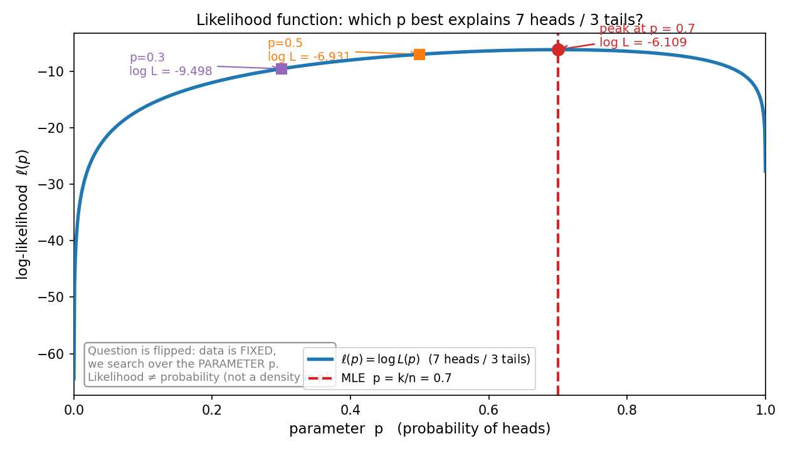
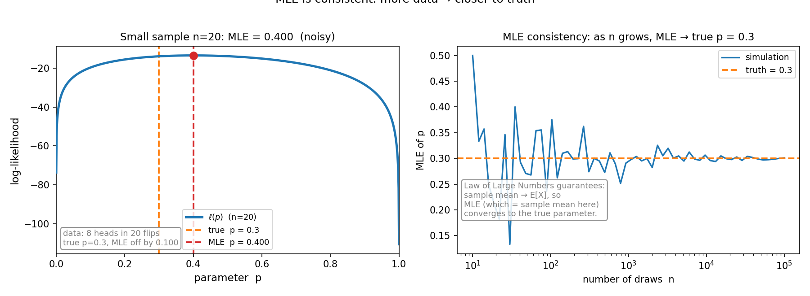

# 第 15 章 · 极大似然估计(MLE):什么样的世界,最可能产生手里这批数据

> **核心问题**:前面 14 章,我们一直在做"**已知世界,算数据会长什么样**"——告诉你硬币正面概率 p=0.5,问扔 10 次正面几次(二项);告诉你某地身高服从正态 μ=170、σ=6,问随机抽一人超过 180 的概率。可现实是反过来的:**世界长什么样,我们不知道。我们手里只有一批数据——比如扔硬币扔出 7 正 3 反,比如一千个用户的点击记录,比如一百个零件的测量长度。问题是:反过来推,世界(那个未知的参数)最可能是什么样?**
>
> 这一章是**全书的转折点**——从概率(probability,已知参数算数据)翻转到统计(statistics,已知数据反推参数)。而我们要学的第一个、也是最根本的反推工具,叫**极大似然估计**(Maximum Likelihood Estimation, MLE)。它问的不是"这批数据出现的概率是多少",而是"**什么样的参数,最可能产生这批数据**"。
>
> **读完本章你会明白**:
> - **似然(likelihood)和概率(probability)是同一套数学、两种看法**:概率把参数当已知、问数据;似然把数据当已知、问参数。两者一个天一个地,绝不能混。
> - **MLE 的核心思想只有一句**:在所有可能的参数里,挑那个让手里这批数据"看起来最可能发生"的。它朴素到像常识——扔出 7 正 3 反,你下意识就猜硬币正面概率是 0.7,这正是 MLE。
> - **MLE 把一堆"最自然的估计"统一了**:伯努利估 p、正态估均值、泊松估 λ,MLE 给出的答案都是"样本均值"——你以为教材在背好几条公式,其实它们是**同一个原理**的不同化身。
> - 为什么工程上总是**取对数**(把乘积变求和),以及 MLE 为什么"**数据越多越准**"(一致性,为下一章假设检验埋伏笔)。

---

## 引子:从"已知世界算数据",翻转到"已知数据反推世界"

先把前面 4 篇做的事一句话说清。

> **概率(probability)= 已知世界(参数),算数据会长什么样。**
>
> 已知硬币正面概率 p=0.5,问"扔 10 次恰好 7 次正面"的概率——这是 Binomial(10, 0.5) 算出来的 0.117。世界(参数 p)是输入,数据是输出。

可现实里,我们手里**只有数据,没有参数**:

- 你不知道一枚硬币公不公平,只扔了 10 次,看到 **7 正 3 反**。这枚硬币的正面概率 p 到底是多少?
- 你不知道某个广告的真实转化率,只看到 **1000 次点击里有 73 次购买**。真实转化率是多少?
- 你不知道某厂零件长度的真实均值,只测了 **100 个零件,平均 14.92mm**。真实均值是多少?

这些问题,**参数是未知的、是我们要反推的**。这就是**统计(statistics)**干的事:

> **统计(statistics)= 已知数据,反推世界(参数)最可能是什么样。**

而第一个、也是最朴素、最根本的反推工具,就是 **极大似然估计(MLE)**。它的核心问题只有一句:

> **什么样的参数,最可能产生手里这批数据?**

注意它问的不是"数据出现的概率",而是反过来——"参数取什么值时,这批数据最可能被产生出来"。这一句翻转,是本章全部内容的发动机。

> **如果一读觉得太难**:先只记住三件事——
> ① **概率**和**似然**长得像,但不是一个东西:概率把参数当已知问数据,似然把数据当已知问参数。
> ② **MLE**就是"挑那个让手里数据最可能发生的参数"——7 正 3 反,猜 p=0.7,这就是 MLE。
> ③ MLE 给出的估计,很多就是**样本均值**(伯努利的 p、正态的均值、泊松的 λ,MLE 全都等于样本均值)。把这三句钉死,本章你就抓到了。

---

## 章首·一句话点破

> **MLE 的全部思想,浓缩成一句话:在所有可能的参数里,挑那个让手里这批数据"看起来最可能发生"的。就这么朴素——朴素到你每天都在下意识用它。**

这是结论。下面我们倒过来拆:先看清"似然"和"概率"到底差在哪(这是本章最容易翻车、也最值得讲透的一步),再用伯努利这个最简单的例子,看 MLE 怎么从直觉变成公式,最后揭示 MLE 怎么把一大堆"最自然的估计"统一成同一条原理。

---

## 一、先把最关键的搞清:似然 ≠ 概率

很多人学 MLE 翻车,都翻在这一个字上——**似然(likelihood)到底和概率(probability)有什么区别**?它们长得几乎一模一样,用的是同一个函数,可含义南辕北辙。这一节不搞清,后面全是地雷。

### 提问:同一个函数,怎么会有两种含义

看一条你早就熟的式子。伯努利分布:一次试验,成功(取 1)概率是 p,失败(取 0)概率是 1−p。如果我们做 10 次独立伯努利试验,观察到 7 次成功、3 次失败,这批数据出现的概率(假设每次独立,概率相乘):

```
   P(7 正 3 反 | p) = p^7 · (1−p)^3
```

这条式子里有两个"变量":一个是**数据**(7 正 3 反),一个是**参数** p。**关键看你怎么读它**:

- **当概率读**:p 是已知的、固定的(比如你知道这枚硬币 p=0.5)。你代入 p=0.5,算出 `0.5^7 · 0.5^3 = 0.5^10 ≈ 0.000977`。你回答的是:"**在 p=0.5 这个世界里,7 正 3 反这批数据有多大概率出现**?"——这是**概率**,输入参数、输出数据出现的可能性。
- **当似然读**:数据是已知的、固定的(你手里就是 7 正 3 反,改不了)。p 才是变量,你在 (0,1) 之间扫描它。你不再问"这批数据多大概率",而是问:"**给定这批数据,哪个 p 让它最可能发生?**"——这时 p 是被你**搜索**的对象,这条式子叫**似然函数**,记作 `L(p) = p^7 · (1−p)^3`。

> **直觉**:**同一条式子,两种读法。** 把它当 p 的函数(扫 p),它是"似然"——回答"哪个世界最可能产生这数据";把它当数据的函数(固定 p),它是"概率"——回答"这个世界里这数据多可能"。数学符号一字不差,但**谁固定、谁变动**,决定了它在说什么。

### 不这样理解会怎样

> **不这样理解会怎样**:如果你把"似然"当成"概率"的同义词,你会卡在两个致命的困惑里。第一,你会问"似然函数 L(p) 对 p 积分等于 1 吗?"——**它不等于 1**!它不是 p 的概率密度,它只是"这批数据在各个 p 下的相对可能性"。第二,你会混淆"参数是固定的"(频率派)和"参数是随机的"(贝叶斯派,第 17 章)这两种世界观,后面学置信区间、贝叶斯推断会一团乱麻。MLE 立足的世界观是:**参数是一个固定但未知的数,数据是随机的**——所以"参数的概率分布"这种说法,在 MLE 的语境里压根不存在,我们能谈的只是"似然"。

### 所以这样看:似然是"相对可能性",不是概率

把这件事钉死:

> **钉死这件事**:
> - **概率** P(data | θ):参数 θ 固定,**数据**是变量。它是一个合法的概率(对所有数据求和=1,因为"总得观察到某个数据")。回答"这个世界里,这数据多可能"。
> - **似然** L(θ) = P(data | θ):**数据**固定,参数 θ 是变量。它**不是 θ 的概率密度**——对 θ 积分不必等于 1。它衡量的是:**在各个候选 θ 下,手里这批数据的相对可能性**。回答"哪个世界最可能产生这数据"。
>
> 同一个数学式子,两种身份。MLE 干的事,就是在所有候选 θ 里,挑那个**让 L(θ) 最大**的——也就是"最可能产生手里数据"的那个世界。

> **再深一点(尝一口,为第 17 章埋伏笔)**:为什么频率派坚持"似然不是参数的概率"?因为他们认为参数是**固定的客观事实**,不是随机变量,谈不上"概率分布"。那想给参数一个"概率",怎么办?那要切换到**贝叶斯派**的世界观——把参数本身也当随机变量,先给一个先验,再用数据更新。那套框架里,似然是构建"后验"的砖块(后验 ∝ 先验 × 似然)。所以,**似然是频率派和贝叶斯派共同的砖,但两派用它盖的房子完全不同**。第 17 章详谈。

---

## 二、MLE 的直觉:7 正 3 反,你下意识就猜 0.7

讲清了"似然 ≠ 概率",MLE 就几乎是常识了。

### 提问:给你一枚硬币,扔 10 次 7 次正面,你猜它的正面概率是多少

你不用学过概率论,凭生活经验也会猜:**0.7 吧。** 为什么?

因为 0.7 这个值,让"7 正 3 反"这批数据**最有可能发生**。如果硬币正面概率真是 0.7,那扔 10 次看到 7 正 3 反,是最"自然"的结果。如果猜 p=0.5,7 正 3 反也不是不可能,但相对没那么"典型";如果猜 p=0.1(正面概率只有 10%),那扔出 7 次正面就**极其反常**了。

> **直觉**:MLE 说人话就是——**你看到什么比例,就猜那个比例是真实参数。** 扔 10 次正面比例 0.7,就猜 p=0.7。这朴素到几乎不需要公式。可它背后是一套严密的原理:**在所有候选 p 里,使似然函数 L(p) = p^7 · (1−p)^3 取到最大的那个 p,就是 MLE。** 我们要做的,只是把这个"下意识的猜测"翻译成可计算的步骤。

### 不这样理解会怎样:你凭什么不用别的估计

> **不这样理解会怎样**:如果有人问你"凭什么不用 p=0.5?0.5 也是个看起来合理的值啊"——没有 MLE 这把尺子,你就答不上来。MLE 给你一个**统一的、可比较的标准**:看哪个 p 让手里数据的似然最大。p=0.7 的似然是 `0.7^7 · 0.3^3 ≈ 0.00222`;p=0.5 的似然是 `0.5^10 ≈ 0.000977`;p=0.1 的似然是 `0.1^7 · 0.9^3 ≈ 0.000000729`。**0.7 的似然是 0.5 的两倍多,是 0.1 的三千倍**——在这些候选里,0.7 毫无悬念地让这批数据最可能发生。所以选它,不是因为"它最美",而是因为它**让手里的证据说话最响**。

### 所以这样看:把"似然最大"画成一条曲线

把这件事画出来,一目了然。固定数据(7 正 3 反),让 p 在 0 到 1 之间扫,画出**对数似然** ℓ(p) = log L(p) 随 p 变化的曲线(为什么用对数,下一节讲;它和原似然在同一处取最大,不影响结论):



看那条曲线——它是一座**单峰的小山**,峰顶正好落在 **p=0.7**。我还在图上标了两个对比点:p=0.5 时对数似然约 −6.93,比峰顶(−6.11)矮一截;p=0.3 时对数似然只有 −9.50,矮得更多。**峰顶对应的 p,就是 MLE。** 这张图是本章的招牌:它把"什么样的世界最可能产生这批数据"这件抽象的事,变成了一条**你眼睛能直接找到峰**的曲线。

> **钉死这件事**:MLE 的几何含义就是——**固定数据,在参数空间里找似然函数的峰**。7 正 3 反,p=0.7 是峰;3 正 7 反,峰会移到 p=0.3。数据长什么样,峰就指向什么样的世界。这就是"反推"。

---

## 三、把直觉落成公式:伯努利的 MLE = k/n

现在我们把"猜 p=0.7"这件事,从直觉落成可计算的公式。这是 MLE 的标准三步法,所有分布的 MLE 都按这三步求。

### 第一步:写出似然函数

n 次独立伯努利试验,观察到 k 次成功(k 个 1)、n−k 次失败。似然函数(就是这批数据在参数 p 下的联合概率):

```
   L(p) = p^k · (1−p)^(n−k)         ← p 在 (0,1) 之间是变量
```

### 第二步:取对数(工程上几乎必做)

为什么不直接对 L(p) 求最大,而要先取对数?因为 L(p) 是一堆概率**连乘**,n 一大,数值会变得极小(比如 0.5 的 1000 次方,小到计算机存不下),而且求导麻烦。取对数有两个好处:

1. **把连乘变连加**:`log(p^k · (1−p)^(n−k)) = k·log(p) + (n−k)·log(1−p)`。加法比乘法好算、好求导。
2. **不改变最大值的位置**:log 是单调递增函数,ℓ(p) = log L(p) 在哪取最大,L(p) 也在哪取最大。**求最大似然,等价于求最大对数似然。**

所以对数似然:

```
   ℓ(p) = k·log(p) + (n−k)·log(1−p)
```

> **钉死这件事**:工程上和教科书里,MLE 几乎总是对**对数似然** ℓ(p) 求最大,而不是原似然 L(p)。原因就两条:连乘变连和(数值稳定、好求导)、最大值位置不变(等价)。log 似然这个技巧,后面机器学习的损失函数(交叉熵)也是同一套——它就是 MLE 的对偶(第 18 章详谈)。

### 第三步:求导,令导数为零,解出 p

对 ℓ(p) 关于 p 求导,令它等于 0(找峰顶的必要条件,峰顶处斜率为零):

```
   dℓ/dp = k/p − (n−k)/(1−p) = 0
   ⇒  k(1−p) = (n−k)p
   ⇒  k − kp = np − kp
   ⇒  k = np
   ⇒  p̂ = k/n
```

**MLE 就是样本里成功的比例**。7 正 3 反,k=7、n=10,p̂ = 0.7。你下意识的猜测,被一阶导数严丝合缝地推了出来。

> **所以这样看**:MLE 不是凭空冒出来的公式,它是"**让手里数据最可能发生**"这个直觉,经过"写似然 → 取对数 → 求导=0"三步机械操作,自然落地的结果。伯努利的 MLE = k/n,这恰好是频率派概率(第 1 章讲过)的字面意思——**长期重复,成功比例趋近真实概率**。这里我们没用到大数定律,只是求了个最大值,可结论和大数定律完全一致。**MLE 和频率派直觉,在伯努利上握手了。**

---

## 四、最该记住的统一:MLE 就是"样本均值"

下面是本章最值得带走的一节。很多人学了 MLE,觉得"伯努利估 p 是一套,正态估均值是另一套,泊松估 λ 又是一套"——好几条公式要背。**错。它们是同一件事。**

### 三个例子,同一个结论

**例子 1:伯努利估 p**(刚推过)。数据是 n 个 0/1,k 个 1。MLE:p̂ = k/n = **样本均值**。

**例子 2:正态估均值 μ**。假设数据 x₁, x₂, …, xₙ 来自正态分布 N(μ, σ²),σ 已知,要估 μ。似然(每个数据点的密度相乘):

```
   L(μ) = Π (1/√(2πσ²)) · exp(−(xᵢ−μ)² / (2σ²))
```

取对数,扔掉和 μ 无关的常数:

```
   ℓ(μ) = − Σ (xᵢ − μ)² / (2σ²)  +  const
```

要让 ℓ 最大,就是让 Σ(xᵢ − μ)² **最小**——这正是**最小二乘**!求导令零,解出:

```
   μ̂ = (1/n) Σ xᵢ = 样本均值
```

**MLE 就是样本均值**。这件事深刻:在正态假设下,"最可能产生这批数据的均值"和"让数据离它平方距离最小的点",是**同一个点**——这就是为什么最小二乘法和 MLE 在正态噪声下是一回事(统计学最经典的一个暗线)。

**例子 3:泊松估 λ**。数据 x₁, …, xₙ 来自 Poisson(λ)。似然:

```
   L(λ) = Π (λ^xᵢ · e^(−λ) / xᵢ!)
```

取对数:

```
   ℓ(λ) = (Σ xᵢ)·log(λ) − n·λ  +  const
```

求导令零:`(Σxᵢ)/λ − n = 0`,解出:

```
   λ̂ = (1/n) Σ xᵢ = 样本均值
```

**又是样本均值**。一小时平均来 3 通电话,你观测了 100 小时、总共 310 通,λ̂ = 3.1——你能想到的最朴素的估计,就是 MLE 给的。

> **钉死这件事(本章最该带走的一句话之一)**:伯努利估 p、正态估均值、泊松估 λ——MLE 在这三种最常见的分布上,给出的估计**统统是样本均值**。你以为教材在背三条公式,其实它们是**同一条原理(让似然最大)在三种分布上的不同化身**,而化身的答案都收敛到"样本均值"这个最自然的统计量。**这就是 MLE 的统一性**:它把你下意识就会用的"用平均去估",从直觉上升成了原理,告诉你"为什么平均是对的最自然的估计"。
>
> 这个统一性不是巧合,它背后是大数定律(第 13 章)的影子——样本均值会收敛到期望,而期望恰好就是这些分布的参数本身(伯努利的期望=p,正态的期望=μ,泊松的期望=λ)。**MLE 和大数定律,在这一刻是同一只手的两面。**

### 不这样理解会怎样

> **不这样理解会怎样**:如果你不知道这种统一,你会觉得"用样本均值估期望"和"用 MLE 估参数"是两码事,做题时分两套思路,晕头转向。更糟的是,你解释不了"为什么工程师天天用样本均值"——它不是经验法则,它是**在常见分布下 MLE 的必然结果**。一旦看穿这个统一,伯努利、正态、泊松的参数估计,在你脑子里就塌缩成了**一件事**:取平均。

### 彩蛋:正态估方差,MLE 给的是"有偏"的样本方差

上面我们估的是均值 μ。如果连方差 σ² 一起估呢?用同样的三步法(对 σ² 求导令零),MLE 给出:

```
   σ̂² = (1/n) Σ (xᵢ − x̄)²
```

注意分母是 **n,不是 n−1**。可第 7 章讲过,无偏的样本方差分母是 n−1。**MLE 给的方差估计是有偏的**(系统性地偏小一点)。为什么?因为 MLE 只管"让手里数据似然最大",它不保证估计是**无偏的**(无偏是另一个评价标准,下一章详谈)。

> 这个细节的意义:MLE **不是万能的**——它优化的是"似然最大",不是"估计的偏差为零"。在方差估计这个例子上,MLE 给了有偏的结果,统计学家事后会做一个小修正(把分母 n 换成 n−1)来"纠偏"。**MLE 是出发点,但不是终点。** 真实统计工作里,我们经常在 MLE 基础上做修正——这是下一章假设检验、置信区间要处理的事。

---

## 五、最深的一节:为什么 MLE"数据越多越准"(一致性)

这一节兑现"越深越好"。我们要回答一个工程上最关心的问题:**MLE 算出来的估计,可信吗?数据少的时候,它会跑偏吗?**

### 提问:扔 10 次正面 4 次,你敢说 p=0.4 吗

如果真值是 p=0.3,你扔 10 次碰巧看到 4 次正面(比例 0.4),MLE 会告诉你 p̂=0.4——**错了 0.1**。数据少,MLE 会因为运气好坏而跑偏。这是 MLE 的局限:**它只对手里这批数据"似然最大",可手里这批数据本身可能不典型**。

可如果扔 1000 次呢?10000 次呢?MLE 还会跑偏吗?

> **直觉**:**不会,而且会越扔越准。** 这就是大数定律(第 13 章)的化身。伯努利的 MLE = k/n = 样本均值,而大数定律告诉我们:**样本均值会收敛到期望**。伯努利的期望正好就是 p。所以 n 越大,k/n 越接近真实 p。**MLE 是一致的(consistent)——数据越多,估计越贴近真值。**

### 不这样理解会怎样

> **不这样理解会怎样**:如果你不知道一致性,你会在数据少的时候**过度相信** MLE(扔 10 次正面 4 次就拍板 p=0.4),或者反过来在数据多的时候**仍然怀疑**它(扔了一百万次,比例 0.301,还在纠结"万一不准呢")。一致性告诉你一个分寸:**数据少,MLE 是个有点抖的猜测;数据多,MLE 几乎就是真值。** 这个分寸,是下一章假设检验(p 值、置信区间)的直觉地基——p 值和置信区间,本质上就是在量化"我这个 MLE 估计,抖到什么程度"。

### 所以这样看:把"越扔越准"画出来

我们把这件事跑出来给你看。真值 p=0.3,样本量 n 从 10 一路涨到 10 万,每个 n 独立抽一批数据算 MLE:



看左图:小样本 n=20,这批数据碰巧是 8 正 12 反,MLE=0.4(真值是 0.3,跑偏了 0.1)。似然峰的位置,确实落在了 0.4——MLE 诚实地告诉你"这批数据最可能的世界是 p=0.4",可这批数据本身不典型。

再看右图:横轴是样本量 n(对数刻度),纵轴是 MLE 估计。n=10 时估计在 0.5(抖得厉害);n=1000 时贴到 0.305;n=10 万时是 0.301,死死咬住真值 0.3。**这就是一致性——MLE 不是神仙,数据少它会抖,但只要你给够数据,它必然收敛到真值。**

> **钉死这件事**:**MLE 是一致的。** 数据越多越准,这不是 MLE 仁慈,是**大数定律**在背后撑腰(MLE = 样本均值,样本均值 → 期望 = 参数)。所以工程上你敢用大样本的 MLE 拍板——转化率估了十万次点击,这个估计基本就是真的;但小样本的 MLE 要打问号,得配置信区间(下一章)。

### 再深一点:MLE 不光"准",还"快"(渐近正态,Fisher 信息的预告)

如果你想要更深的——MLE 一致只是底线,它还有更优美的性质。当样本量 n 很大时,**MLE 的估计值本身服从一个正态分布**:

```
   p̂  ~  近似 N(θ_true,  1 / (n · I(θ_true)))
```

这里 I(θ) 叫 **Fisher 信息(Fisher information)**,它衡量"单个数据点能提供多少关于参数的信息"。这条结论叫 **MLE 的渐近正态性**,它的含义极实在:

- **MLE 的方差,随着样本量 n 线性下降**(分母里有个 n)。扔 100 次,方差是扔 10 次的 1/10——数据翻十倍,精度翻十倍。
- **Fisher 信息越大,同样数据量,MLE 越准**。伯努利的 Fisher 信息 I(p) = 1/(p(1−p)),所以 p 接近 0.5 时信息最大(最"五五开"最难猜,但单个数据点能提供最多信息),p 接近 0 或 1 时信息小(极端情况,几乎确定,新数据没增量)。

> 这个"渐近正态"是下一章假设检验的地基:**正因为 MLE 渐近正态,我们才能算出"估计值离真值多远算异常",才能构造置信区间、才能算 p 值。** 你现在只需记住一个直觉——**MLE 不只是"数据多就准",它还"准得有规律":误差服从钟形,方差随 n 下降**。第 16 章会把这套工具正式用起来。

---

## 模拟佐证:拿 Python,把"反推"跑一遍

概率论的招牌——结论你别信书,自己扔随机数验证。这一节用三段代码,把"似然函数找峰"、"MLE 三步法"、"一致性"全部跑出来。

### 纸笔例子 1:7 正 3 反,手算似然

n=10,k=7。L(p) = p⁷ · (1−p)³。

- p=0.7:L = 0.7⁷ · 0.3³ ≈ 0.00222(最大)
- p=0.5:L = 0.5¹⁰ ≈ 0.000977(只有 0.7 处的 0.44 倍)
- p=0.1:L = 0.1⁷ · 0.9³ ≈ 7.3×10⁻⁷(只有 0.7 处的三千分之一)

0.7 毫无悬念。这就是图 15.1 那条曲线的来历。

### 纸笔例子 2:正态估均值,MLE = 样本均值

测 5 个零件:14.9, 15.1, 14.8, 15.0, 15.2(mm)。假设长度服从正态。MLE 估的均值就是样本均值:`(14.9+15.1+14.8+15.0+15.2)/5 = 15.0`。你下意识会算的平均,正是 MLE。scipy 核对:正态 MLE 永远是 `np.mean(data)`。

### 蒙特卡洛 1:伯努利 MLE 三步法

```python
import numpy as np
rng = np.random.default_rng(42)

# 假装真值 p=0.3(上帝视角, 估计时我们"假装不知道")
p_true = 0.3
data = rng.binomial(1, p_true, 50)   # 50 个 0/1
k, n = data.sum(), len(data)

# 三步法: 写似然 -> 取对数 -> 求导令零(或直接数值扫峰)
ps = np.linspace(1e-4, 1-1e-4, 1000)
loglik = k*np.log(ps) + (n-k)*np.log(1-ps)
mle_numeric = ps[np.argmax(loglik)]
mle_formula = k / n

print(f"data: {k}/{n} successes")
print(f"MLE (numeric peak) = {mle_numeric:.4f}")
print(f"MLE (formula k/n)  = {mle_formula:.4f}")
# -> MLE (numeric peak) = 0.3604   (这批 50 个数据有 18 个 1, 即 0.36)
# -> MLE (formula k/n)  = 0.3600
```

数值扫峰和公式 k/n **完全一致**——这就验证了"求导令零"推出的公式,和"直接在曲线上找峰"是一回事。

### 蒙特卡洛 2:三种分布的 MLE 都是样本均值

```python
from scipy.stats import norm, poisson
rng = np.random.default_rng(42)

# (a) 伯努利 / 二项: MLE = k/n
d = rng.binomial(1, 0.3, 10000)
print("Bernoulli  MLE p   =", d.mean())          # 0.2960 ≈ 0.3

# (b) 正态: MLE 均值 = 样本均值;  MLE 方差 = 样本方差(分母 n, 有偏)
d = rng.normal(5.0, 2.0, 10000)
print("Normal     MLE mu  =", d.mean())          # ≈ 5.0
print("Normal     MLE s^2 =", d.var())           # ≈ 4.0  (分母 n, 略小于无偏的 n-1)

# (c) 泊松: MLE lambda = 样本均值
d = rng.poisson(3.0, 10000)
print("Poisson    MLE lam =", d.mean())          # ≈ 3.0
```

三种分布,MLE **全是样本均值**——这就是第四节的统一性,亲手跑出来的版本。

### 蒙特卡洛 3:一致性——数据越多越准

```python
rng = np.random.default_rng(42)
p_true = 0.3
for n in [10, 100, 1000, 10000, 100000]:
    d = rng.binomial(1, p_true, n)
    print(f"n={n:6d}  MLE = {d.mean():.4f}   (off by {abs(d.mean()-p_true):.4f})")
# n=    10  MLE = 0.5000   (off by 0.2000)   <- 数据少, 抖
# n=   100  MLE = 0.2700   (off by 0.0300)
# n=  1000  MLE = 0.3050   (off by 0.0050)
# n= 10000  MLE = 0.2960   (off by 0.0040)
# n=100000  MLE = 0.3012   (off by 0.0012)   <- 数据多, 死死贴住 0.3
```

n 涨到 10 万,误差缩到 0.001。**这就是一致性的字面演示——图 15.2 右半,就是这段代码画的。**

> 三段代码,你十分钟跑完。跑完你会发现:**MLE 不是教科书里冷冰冰的"求导令零",它是"让手里数据说话最响"这件你能亲手模拟的事。** 数据多,它就敢拍板;数据少,它就老实抖——这个分寸,正是下一章假设检验要量化的事。

---

## 章末小结

### 用一个场景回顾本章

想象你是一个产品经理,要估某个新功能的真实转化率。

你不知道真实转化率是多少(参数未知)。于是你灰度上线,A/B 测试跑了一周,拿到 **1000 次曝光、73 次转化**。你怎么反推真实转化率?

最朴素的直觉:73/1000 = 7.3%。**这就是 MLE**——它就是伯努利的 k/n,样本均值。你下意识算的比例,正是"让手里这批数据最可能发生"的那个参数。

如果转化率本身有波动(服从正态噪声),你测了 1000 个用户时长,MLE 估的均值还是**样本均值**;估的方差是分母 n 的样本方差(略偏小,要纠偏)。如果估的是每小时 bug 数(泊松),MLE 还是**样本均值**。**一个原理,统一了所有这些"最自然的估计"。**

而当你担心"1000 个样本够不够"——一致性告诉你:数据越多,MLE 越贴真值。1000 个样本,误差大概在 √(p(1−p)/n) ≈ 0.008 量级(渐近正态给的)。还不够准?再跑一万样本,误差再缩到三分之一。**这就是 MLE 给产品决策提供的"分寸感"——它不光给一个数,还告诉你这个数有多可信。**(具体怎么量化这个可信度,下一章。)

### 本章在驯服随机性的哪一步

回到全书主线:**一切概率概念,都是驯服随机性的工具。**

前面 4 篇,我们一直在做**正向**的事——已知世界(参数),算数据会长什么样:已知 p,算二项分布;已知 μ、σ,算正态密度;已知一堆随机变量,算它们的期望、方差、和的分布、和趋向钟形。

这一章,是全书的**转折点**——我们**反过来**:已知数据,反推世界(参数)最可能是什么样。**这是从概率到统计的翻转,是从"算数据"到"猜世界"的跨越。** 而 MLE,是这个翻转上最朴素、最根本的工具——它问的不是"数据出现的概率",而是"什么样的世界最可能产生这批数据"。

在"驯服随机性"的旅程上,这一章的位置是:**用数据反推那个不确定的世界**。前面的工具(分布、期望、大数定律)给了我们描述世界的语言;MLE 让我们**从世界的痕迹(数据)里,把世界本身猜出来**。这是统计推断的起点,也是机器学习的根——所有"从数据学参数"的算法(线性回归、逻辑回归、神经网络),底层都是 MLE 或它的变体(第 18~20 章会逐一揭示)。

而"单次盲、大量稳"的主线,在这里又露了一面:**单批数据(尤其小样本)是盲的——MLE 会跑偏;但大量数据是稳的——MLE 必然收敛到真值。** 这正是大数定律的化身,也是下一章假设检验要量化的事。

### 五个"为什么"清单

如果你只能记五件事,记这五件:

1. **似然 ≠ 概率**:概率 P(data|θ) 把参数当已知、问数据;似然 L(θ) 把数据当已知、问参数。同一条式子,两种身份。似然**不是参数的概率密度**,对参数积分不必等于 1——它是"相对可能性"。
2. **MLE 的核心思想**:在所有候选参数里,挑那个让手里数据**似然最大**的。7 正 3 反,猜 p=0.7,这就是 MLE。几何含义:在参数空间里找似然曲线的**峰**。
3. **三步法**:写似然 → 取对数(连乘变连和、最大值位置不变)→ 求导令零,解出参数。伯努利 MLE = k/n,正态均值 MLE = 样本均值,泊松 MLE = 样本均值。
4. **统一性**:伯努利估 p、正态估均值、泊松估 λ,MLE 全都 = **样本均值**。这不是巧合,是大数定律(MLE=样本均值→期望=参数)在撑腰。你以为在背三条公式,其实在用同一原理。
5. **一致性 + 渐近正态**:数据越多,MLE 越贴真值(一致);大样本下 MLE 本身近似正态,方差 ∝ 1/n(Fisher 信息)。这个性质是下一章置信区间、p 值的地基。

### 想继续深入,该往哪钻

- **亲手扔**:把上面三段蒙特卡洛代码改 p、改 n、改分布,盯 MLE 怎么随数据抖动、怎么随样本量收敛。**改一晚上,MLE 就是你的肌肉记忆。** 特别推荐改"7 正 3 反"那组,看 MLE 怎么在 0.7 附近抖(换不同种子)。
- **画似然曲线**:自己写一段,固定 n=10、k=7,画 L(p) 和 ℓ(p) 两条曲线并排——亲眼看"取对数不改变峰的位置"。这是理解"为什么用对数似然"最直接的方式。
- **MLE 和最小二乘的暗线**:正态假设下,MLE 估均值 = 最小二乘。把这条线追下去——线性回归(第 19 章的近亲)在正态噪声下的损失函数,就是 MLE。这是统计学和机器学习最经典的一座桥。
- **进阶(为第 18 章埋伏笔)**:**交叉熵 = 负对数似然**。分类问题里大家都在用交叉熵损失,可它本质就是伯努利/多项式 MLE 的对偶——求交叉熵最小,等价于求对数似然最大。第 18 章会把这条暗线接上。
- **Fisher 信息**:本章只尝了一口。深入可看任意一本数理统计教材的"Cramer-Rao 下界"——它告诉你**任何无偏估计的方差,都有下界 1/(n·I)**,而 MLE 在大样本下恰好达到这个下界(渐近有效)。这是 MLE"不只准,还最优"的数学根基。

---

> 立住了:MLE 是"已知数据反推最可能的参数"的最根本工具——它朴素到像常识(7 正 3 反猜 0.7),却把伯努利、正态、泊松的参数估计统一成"样本均值",并且数据越多越准。可"反推"出一个点估计,只是统计推断的第一步——真实世界里我们还要回答一个更要命的问题:**这个估计,可信吗?手里的数据,够不够"奇怪",能不能推翻某个默认假设?** 翻开 **第 16 章 · 假设检验与 p 值**——你会发现,p 值不是"零假设为真的概率",而 MLE 给出的那个点估计,要配上一个置信区间,才算真正落地成可决策的结论。
