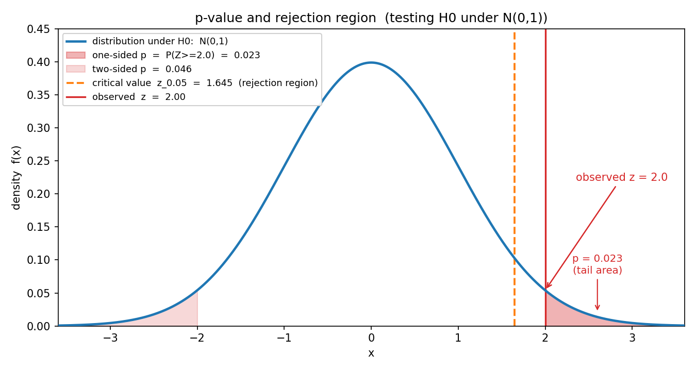
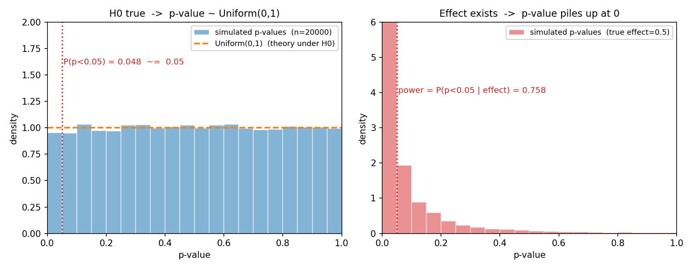
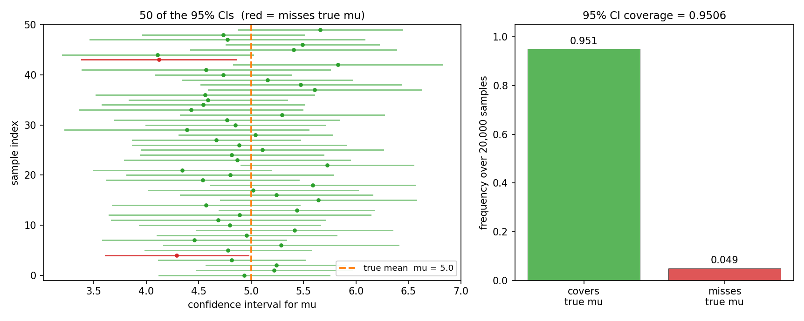

# 第 16 章 · 假设检验与 p 值:这批数据,够不够"奇怪"到推翻默认假设

> **核心问题**:上一章 MLE 教我们从数据反推一个参数的"最佳猜测"——可真实世界做决策时,光给一个点估计远远不够。新药到底有没有效?这枚硬币是不是作弊?这批零件合格率到底达标没有?我们要的是一个**判断**:能不能推翻"默认没事"的那个假设?而做这个判断,绕不开一个被全人类误读最多的数字——**p 值**。它到底是什么意思?它**不是**什么意思?以及那个和它形影不离的"95% 置信区间",到底在说什么?
>
> 这一章是全书的**最难章之一**,因为它要破除读者脑子里根深蒂固的误读。我们会用三个真实场景(硬币是否作弊、新药是否有效、零件合格率是否达标),把假设检验、p 值、两类错误、功效、置信区间,一个一个从直觉讲到能落地。
>
> **读完本章你会明白**:
> - **假设检验在回答什么**:不是"参数是多少",而是"这批数据够不够奇怪,敢不敢推翻那个默认的世界假设(零假设)"。这是统计推断里"做判断"的那一步。
> - **p 值到底是什么**(以及它**不是**什么):它是在**零假设为真**的前提下,观察到"像这样或更极端"数据的概率。它**不是**"零假设为真的概率",也**不是**"效应为真的概率"——这两个误读,是科学界最大的坑。
> - **两类错误与功效**:假阳性(α,第一类错误)和假阴性(β,第二类错误)是跷跷板的两端,压低一个就抬高另一个;**功效 = 1 − β**,是"效应真存在时我们能发现它"的概率。
> - **置信区间的频率派解释**:95% 置信区间**不是**"真值落在这个区间的概率是 95%"——那是贝叶斯的"可信区间"。频率派的置信区间说的是"**重复抽样,95% 的区间会套住真值**"。一字之差,哲学天壤。

---

## 引子:从"反推参数",走到"做判断"

上一章我们干了一件大事——**从数据反推世界**。扔硬币 7 正 3 反,MLE 告诉你 p̂ = 0.7;1000 个用户的点击数据,MLE 告诉你真实转化率约 7.3%。MLE 给的是一个**点估计**:一个最可能的数。

可真实工作里,光给一个数,常常不够。你是一个质检工程师,规定零件合格率不得低于 95%。你抽了 100 个,合格 91 个——MLE 给的合格率估计是 91%。**问题来了:这批零件到底合不合格?**

注意这和上一章问的不是一回事。上一章问"合格率是多少"(估参数),这一章问"**这批零件的合格率,是不是真的低于 95%?**"(做判断)。91% 看着低于 95%,可抽样本就有运气成分——也许真实合格率就是 95%,你只是手气差抽到了 91 个合格的呢?**你怎么判断"91/100"这个结果,是真低于标准,还是纯属倒霉?**

这就是假设检验要回答的问题。它要做的,是**在随机性的噪声里,判断一个观察到的结果够不够"反常",反常到我们敢推翻那个"默认没事"的假设**。这是驯服随机性旅程上,继"反推参数"之后的下一步——**反推完参数,还要做判断**。

> **如果一读觉得太难**:先只记住三件事——
> ① **p 值**是"假设零假设(默认没事)为真的前提下,观察到像这样或更极端数据的概率"。它**不是**"零假设为真的概率"。
> ② **p 值小**,只说明"数据在零假设下挺反常",**不直接等于**"你的新药/你的效应是真的"。
> ③ **95% 置信区间**说的是"重复抽样,95% 的区间会套住真值",**不是**"真值有 95% 的概率在这个区间里"。把这三句钉死,本章的核心你就抓到了。

---

## 章首·一句话点破

如果用一句话点破假设检验的本质,那就是:

> **假设检验,就是先竖一个"默认没事"的靶子(零假设),再问:手里这批数据,在零假设下够不够反常?反常到(尾部面积足够小),我们就开枪推翻它。**

这是结论。下面我们倒过来拆:先看清"零假设"和"备择假设"到底在干什么(为什么一定要先竖个靶子),再彻底讲清 p 值(以及破除两个最致命的误读),然后讲两类错误和功效的权衡,最后把置信区间接上——它是 p 值的"姊妹",把判断从"推翻/不推翻"升级成"效应大概多大"。

---

## 一、先竖个靶子:零假设与备择假设

做判断,先得有判断的对象。假设检验的第一步,是把"默认的世界假设"和"想证明的相反假设"两个靶子竖起来。

### 提问:为什么不能直接问"新药有没有效"

你是制药公司的统计师。新药做了临床试验,100 个病人吃了药,平均降压 2.7 mmHg;100 个病人吃安慰剂,平均降压 0.3 mmHg。药效看起来是 2.7 − 0.3 = 2.4 mmHg。

你能不能直接宣布"新药有效,降压 2.4 mmHg"?

**不能。** 因为这个 2.4 里,可能掺着随机噪声。人体血压本就有波动,两组人哪怕吃一样的药,均值也会有差异。你得回答一个更要命的问题:**这个 2.4 的差异,是真有药效,还是纯属两组人运气不同碰出来的?**

要回答这个问题,你得用一个聪明的策略——**先假定药没用**,看在这个假定下,2.4 这么大的差异有多反常。如果"药没用"这个假定下,出现 2.4 这么大差异的概率很低(比如不到 5%),那我们就**推翻**"药没用"这个假定,宣布"药有效"。

> **直觉**:这套策略叫**反证法的概率版本**。普通的反证法是"假设结论不成立,推出矛盾,所以结论成立"。假设检验是"**假设默认没事(零假设),算出观察到这么极端结果的概率,概率太小就推翻它**"。先竖一个靶子(H0:药没用),再用数据去打它——打中了(数据够反常)就推翻,打不中(数据不算反常)就只能保留靶子。这套思路,和法庭上"无罪推定"一模一样:被告默认无罪(零假设),除非证据反常到无法用"无罪"解释,否则不能定罪。

### 零假设与备择假设

把这套策略形式化,两个假设:

> **零假设(null hypothesis, H0)**:**默认的那个"没事、没差异、没效应"的假设**。它是我们要打的靶子。
> - 新药试验:H0 = 药效 = 0(药和安慰剂没区别)。
> - 抛硬币:H0 = 正面概率 p = 0.5(硬币公平)。
> - 质检:H0 = 合格率 ≥ 95%(这批零件达标)。
>
> **备择假设(alternative hypothesis, H1 或 Ha)**:**我们想证明的那个"有事、有差异、有效应"的假设**,是零假设的反面。
> - 新药试验:H1 = 药效 ≠ 0(或药效 > 0)。
> - 抛硬币:H1 = p ≠ 0.5(硬币不公平)。
> - 质检:H1 = 合格率 < 95%(不达标)。

注意一个关键的不对称:**我们从来不"证明"零假设,只能"拒绝"或"不拒绝"它**。这就像法庭——证据不足以定罪,不等于"证明被告无罪",只是"证据不够,暂时放人"。统计里这一条铁律,后面会反复用到:**p 值大,只说明"没找到足够反常的证据",不等于"证明了零假设为真"**。

### 不这样理解会怎样

> **不这样理解会怎样**:如果你跳过"竖零假设"这一步,直接看"降压了 2.4 mmHg 就宣布有效",你会犯一个工程上最常见的错误——**把噪声当信号**。任何两组随机数,均值都几乎不可能完全相等(扔两组骰子,平均点数总差一点)。没有零假设这个基准,你就没有判断"2.4 算大不算大"的尺子。零假设的作用,就是提供这把尺子:**"如果世界真像默认那样(没效应),2.4 这么大差异有多反常?"** 反常到一定程度,才敢说"这不是噪声,是真效应"。

---

## 二、p 值到底是什么(以及它不是什么)

竖好了靶子,现在到了全章最容易翻车、也最该停下来想透的一步——**p 值到底什么意思**。

### 先看 p 值的正确定义

先给定义,再讲为什么。在零假设为真的前提下,观察到"像这样或更极端"数据的概率,就是 p 值:

> **p 值(p-value)的正确定义**:在**零假设 H0 为真**的世界里,出现"**像手里这样、或比手里更极端**"的数据的概率。
>
> 用符号:`p = P(像这样或更极端的数据 | H0 为真)`

三个要素,一个都不能漏:
1. **"在 H0 为真的前提下"**——p 值算的是"假设零假设成立"这个虚构世界里的概率,**不是**"H0 为真的概率"。
2. **"像这样或更极端"**——不是单算"恰好这批数据"的概率,而是把所有"同等或更偏离 H0"的结果累加起来。这个"更极端"的方向,由备择假设 H1 决定。
3. 它是一个**条件概率**,条件是 H0。

### 用硬币的例子把它走一遍

把这套话,落在一个最简单的例子上。你怀疑一枚硬币作弊,扔了 100 次,60 次正面。零假设 H0:p = 0.5(硬币公平)。备择 H1:p > 0.5(偏向正面,单尾)。

按定义,p 值 = "假设硬币真是公平的(p=0.5),扔 100 次出现 60 次或更多正面"的概率。这相当于算:在公平硬币下,正面次数 ≥ 60 的概率。

怎么算?第 14 章讲过,扔 100 次硬币数正面,近似服从正态 N(np, np(1−p)) = N(50, 25),标准差是 5。把 60 标准化:z = (60 − 50) / 5 = **2.0**。所以 p 值就是"标准正态下 Z ≥ 2.0"的概率——也就是那条钟形曲线右尾、从 2.0 往右的面积。



看图 16.1。蓝色钟形曲线是零假设下的分布(标准化后是 N(0,1))。观测到的统计量 z=2.0(红色竖线)。**z=2.0 右边那块红色阴影面积,就是单尾 p 值**——用 scipy 算出来是 0.023:

```
   p = P(Z >= 2.0 | H0)  =  1 - Φ(2.0)  ≈  0.0228
```

也就是说:**假设硬币真是公平的,扔 100 次出现 60 次或更多正面,只有约 2.3% 的概率**。这个 2.3%,就是 p 值。

注意它回答的是哪个问题。它回答的是"**在公平硬币下,这数据有多反常**",**不是**"这枚硬币公平的概率是多少"。这一字之差,是 p 值全部误读的根源。

### 误读一:p 值不是"零假设为真的概率"

这是最普遍、也最致命的误读。无数人(包括发了论文的科研工作者)把"p = 0.023"理解成"零假设为真的概率是 2.3%,所以零假设大概率是假的,药/硬币/差异是真的"。

**这是错的。**

p 值是一个**条件概率**,条件是"假设 H0 为真"。它算的是 `P(数据 | H0)`,**不是** `P(H0 | 数据)`。这两个东西,差了一个贝叶斯公式。

> **不这样理解会怎样**:如果你把 p = 0.023 当成"H0 为真的概率 2.3%",你会严重高估自己的结论。举个戳破它的例子:假设某种罕见病发病率只有万分之一,你做一个准确率 99% 的检测,结果阳性。用 p 值的思路——"假设你没病(零假设),检测出阳性的概率只有 1%(= 假阳性率)"——这看着很像 p 值,可你能据此说"你真的有病的概率是 99%"吗?**不能**。实际上用贝叶斯算一下,你真有病的概率只有约 1%(因为基础率太低,绝大多数阳性都是假阳性)。**p 值给的"P(数据 | H0)"和你想要的"P(H0 | 数据)",中间隔着一个先验概率**。混淆这两个,就是基础率忽视,第 4 章贝叶斯讲过。
>
> 更尖锐地说:**频率派的整个框架里,"H0 为真的概率"这个说法根本不存在**——因为频率派认为参数(这里"是否成立")是固定的客观事实,不是随机变量,谈不上"概率"。你能算的只有"假设它成立时数据多反常"。想算"它成立的概率",得切到贝叶斯派,给个先验,用数据更新——那是第 17 章。

### 误读二:p 值不是"效应为真/效应有多大的概率"

第二个普遍误读:p 值小,就被当成"效应是真的""新药一定有效""差异显著所以重要"。

**也不对。** p 值小,只说明一件事:**在零假设(没效应)下,这批数据挺反常**。它**没有**告诉你:

- **效应是不是真的**:p 值小可能是因为效应真存在,也可能是因为样本量大到一点小差异都"显著",也可能是数据有问题(选择偏差、p-hacking,后面讲)。
- **效应有多大**:p 值**不衡量效应大小**。一个 10 万人试验,p=0.001 可能对应只有 0.01 mmHg 的微小降压——统计上显著,临床上毫无意义。"显著"和"重要"是两个词。

> **钉死这件事**:p 值小,只回答了一个问题——**"在没效应的世界里,这数据有多反常"**。它**不**回答"效应是不是真的""效应多大""零假设是不是假的"。这三个问题,要靠效应大小、置信区间、重复实验、领域知识一起来回答。**p 值是一把窄尺子,只量"反常程度"这一件事**——把它当万能尺,就是科学界滥用 p 值的根源。

### 为什么是"像这样或更极端"

定义里"或更极端"这几个字,容易被忽略,可它是 p 值的灵魂。为什么不直接算"恰好 60 次正面"的概率,而要算"60 次或更多"?

因为"恰好 60"这个概率太小了(任何特定次数的概率都很小),没法当尺子。换个角度:如果你是为了判断"硬币偏向正面",那么 61、62……100 次正面,每一项都是**比 60 更强的偏向正面的证据**——它们都应该算进"反常"的阵营。所以 p 值把这些"同等方向、同等或更强"的结果,全加起来。

> **所以这样看**:p 值量的不是"这批数据出现的概率",而是"**在零假设下,出现像这样或更偏离零假设的数据的总概率**"。它是分布的**尾部面积**——偏离 H0 的方向上,所有更极端结果的累积概率。这就是为什么图 16.1 里,p 值是 z=2.0 右边那一整块面积,而不是 z=2.0 处曲线的高度。

---

## 三、显著性水平 α 与拒绝域:什么时候开枪

定义了 p 值,下一个问题:**p 值多小,才算"够反常,可以推翻 H0"?**

### 提问:2.3% 算反常吗

回到硬币的例子,p = 0.023。这算反常吗?算的话我们就说硬币作弊,不算的话就说"证据不足"。

这个"算不算"的分界线,需要事先定一个阈值——**显著性水平(significance level),记作 α**。最常见的 α = 0.05(也有用 0.01、0.1 的)。

> **直觉**:α 是你**事先**给自己定的"容忍假阳性的上限"。你接受"最多有 5% 的概率,在 H0 其实为真时,因为运气不好误判它为假"。p 值小于这个 α,你就**拒绝 H0**,说"差异**统计显著**(statistically significant)";p 值大于 α,就**不拒绝 H0**,说"证据不足"。

### 拒绝域:另一种等价的看法

拒绝 H0 的规则,可以换一种完全等价的说法——**拒绝域(rejection region)**。

> **拒绝域**:在零假设的分布里,事先划出"够极端"的那块区域(尾部)。如果观测到的统计量落进这块区域,就拒绝 H0;否则不拒绝。

单尾 α=0.05 的拒绝域,就是标准正态分布右尾面积等于 0.05 的那段——从 z = 1.645 往右(图 16.1 里那条橙色虚线)。意思是:**在公平硬币下,z 超过 1.645 的概率正好是 5%**。所以 1.645 叫**临界值(critical value)**。

```
   z_{0.05}  =  Φ^{-1}(0.95)  =  1.645     (单尾 alpha=0.05)
   z_{0.025} =  Φ^{-1}(0.975) =  1.96      (双尾 alpha=0.05, 每尾 0.025)
   z_{0.005} =  Φ^{-1}(0.995) =  2.576     (双尾 alpha=0.01)
```

(这些值,scipy 的 `stats.norm.ppf` 一行就核对:`stats.norm.ppf(0.95)` = 1.6449,`stats.norm.ppf(0.975)` = 1.96。)

回到 z = 2.0 的硬币:它**超过了** 1.645 这条线,落进了拒绝域——所以拒绝 H0,宣布硬币偏向正面(p = 0.023 < 0.05)。两套说法(比 p 值 vs 比 z 值)是**完全等价**的:

```
   p < α   等价于   |z_obs| > z_临界
```

> **钉死这件事**:**拒绝 H0 有两种等价的判据**——要么"p 值 < α"(比较尾部面积),要么"统计量落入拒绝域"(比较位置)。两者是同一件事的两种说法。临界值 z_临界 就是"拒绝域的边界",它的尾部面积正好等于 α。

### 单尾 vs 双尾

刚才那个例子用了**单尾检验**:备择假设 H1 是"p > 0.5"(只关心偏向正面)。如果你只是怀疑硬币不公平,不分偏向哪边(H1: p ≠ 0.5),就要用**双尾检验**——把"反常"分到左右两个尾巴,每个尾巴分 α/2 = 0.025。

双尾检验的拒绝域:z > 1.96 或 z < −1.96。硬币 z=2.0 超过了 1.96,**仍然拒绝** H0,但双尾 p 值是 0.046(= 2 × 0.023),比单尾的 0.023 大一倍。图 16.1 里浅红的那块左尾面积,就是双尾检验的另一半。

什么时候用单尾、双尾?**看你事先关心哪个方向**。如果你只关心"药有没有降压"(不关心会不会升压),用双尾;如果你事先就断定"药只可能降压不可能升压",可以用单尾(更宽松)。但**绝不能看了数据再回头选单尾**——那是作弊(相当于看了答案再定规则),是 p-hacking 的一种。

---

## 四、两类错误与功效:假阳性 vs 假阴性

定 α=0.05,意味着你接受"最多 5% 的概率,在 H0 真的时候误判它假"。这种"误判真 H0 为假"的错误,有专门的名字。

### 提问:做判断,会犯什么错

任何判断都可能错。假设检验的判断结果,有四种可能:

|  | H0 其实为真 | H0 其实为假 |
|---|---|---|
| **拒绝 H0** | **第一类错误(Type I)**  假阳性  概率 = α | **正确发现**  概率 = 1 − β = **power(功效)** |
| **不拒绝 H0** | **正确不拒绝**  概率 = 1 − α | **第二类错误(Type II)**  假阴性  概率 = β |

两种错误,对应两种代价,在现实里常常不对等:

> **直觉**:
> - **第一类错误(α,假阳性)**:把"没效应"误判成"有效应"。新药试验里,这就是**让无效药上市**——代价是病人白吃、浪费钱、甚至有副作用。法庭上,这就是**冤枉好人**。这种代价通常很重,所以 α 卡得严(0.05、0.01)。
> - **第二类错误(β,假阴性)**:把"有效应"误判成"没效应"。新药试验里,这就是**错杀一个真有效的好药**——代价是病人失去治疗机会、药企白费投入。法庭上,这就是**放走真凶**。

### α 和 β 是跷跷板

关键的事:**α 和 β 是跷跷板,你不可能同时把它们都压到零**(除非数据量无限)。

为什么?因为拒绝域划得越宽(α 越大),越容易拒绝 H0——抓住真效应的概率(功效)上去了,可误杀真 H0 的概率(α)也上去了;拒绝域划得越窄(α 越小),越保守——少冤枉好人,可也容易放过真凶(β 上升,功效下降)。

> **不这样理解会怎样**:如果你不知道这个权衡,你会犯两种极端错误。一是**只盯 α**:死卡 p<0.05,以为"显著就万事大吉",却忽略了一个样本量小的试验即使有效应也检测不出来(功效低,β 大)——你"严谨"地放过了真效应。二是**只盯 p 值显著就宣布有效**:α 没卡严(或者做了多次检验没校正),假阳性满天飞。**科研界长期的可重复性危机,根子之一就是只盯 α、忽略功效**——很多 p<0.05 的发现,换个样本就复现不出来。

### 功效:效应真存在时,你能发现它吗

把 β 反过来,就是**功效(power)**:

> **功效 = 1 − β = P(正确拒绝 H0 | H0 为假)**

它的含义极实在:**效应真的存在时,你的检验能发现它(拒绝 H0)的概率**。功效 0.8,意味着"如果药真有效,你做这个试验,有 80% 的概率能检测出来;还有 20% 的概率会漏掉(假阴性)"。

功效受三个因素影响:
1. **样本量 n**:n 越大,标准误越小,信号越容易从噪声里冒出来,功效越高。这是**最可控**的因素——做试验前先算"要达到 80% 功效,需要多少样本",叫**功效分析(sample size calculation)**。
2. **效应大小**:效应越大,越容易被发现,功效越高。检测一个 0.5 mmHg 的微小降压,比检测 5 mmHg 的降压,需要多得多的样本。
3. **α**:α 越严(越小),拒绝域越窄,功效越低(代价就是 β 上升)。

> **钉死这件事**:**报告一个假设检验的结果,不能只给 p 值,还要给效应大小和功效(或样本量)。** 只给 p<0.05,读者无法判断"这个显著是真是假、效应多大、有多少可能漏掉了"。今天的好期刊,都要求报告效应大小、置信区间、功效——光甩一个 p 值的时代,正在过去。

---

## 五、把 p 值"跑"出来:H0 下 p 值是均匀的

这是本章最该跑的模拟。它直接验证"p 值到底是什么"——**在零假设为真的前提下,反复做检验,p 值会服从均匀分布 Uniform(0, 1)**。

### 提问:H0 为真时,p 值长什么样

如果 H0 真的为真(比如真去检验一个公平硬币,或者真去检验均值为零的数据),你反复做检验,得到的 p 值会是什么分布?

直觉上:p 值是"在 H0 下,数据有多反常的概率"。如果 H0 真,那数据不该特别反常——p 值不该特别小。但也不该特别大(数据偏离 H0 是随机的)。**所以 p 值应该均匀分布在 0 到 1 之间**。

> **所以这样看**:这个性质有个极其重要的推论——**即使 H0 为真,你也有 α 的概率得到 p < α**(从而错误地拒绝 H0)。α=0.05,意味着每 20 次检验,纯粹靠运气就有大约 1 次 p<0.05。**这就是假阳性的来源,也是"多重检验问题"的根源**:你做 20 个无关的检验,即使全都没效应,也几乎必然有一个 p<0.05。

我们把这件事跑出来。



看图 16.2 左:**H0 为真时,2 万次检验的 p 值,确实近似均匀分布在 0 到 1**(那条蓝色直方图,基本贴着橙色虚线 1.0)。其中 p<0.05 的比例是 0.048——非常接近 α=0.05。**这就是假阳性的频率:即使 H0 真,你也会在 5% 的情况下错误地拒绝它**。

再看图 16.2 右:**当效应真存在**(这里数据来自均值 0.5 而不是 0),p 值的分布完全变了——大量堆积向 0(那条红色直方图,左边柱子高得离谱)。p<0.05 的比例是 0.751,这就是**功效**:效应真存在时,这个检验能发现它的概率。

> **钉死这件事**:**H0 为真时,p 值均匀;H0 为假时,p 值堆积向 0。** 这两张图,是 p 值"是什么"的最好注解——它不是一个"零假设为真的概率",而是一个"在零假设下,数据有多反常"的量。H0 真的时候它该均匀(数据有时反常有时不反常);H0 假的时候它该小(数据经常反常)。

---

## 六、置信区间:把"推翻/不推翻"升级成"效应大概多大"

p 值只回答了"能不能推翻 H0"(一个二值判断)。可现实里我们更想知道:**效应到底多大?这个估计有多准?** 这就轮到**置信区间(confidence interval, CI)**出场了。

### 提问:光给一个点估计,够吗

上一章 MLE 给了你一个点估计:降压 2.4 mmHg。可这个 2.4 是基于 200 个病人算的——再抽 200 个,均值可能变成 2.1 或 2.7。点估计是会抖的。

你需要的是一个**区间**,而且这个区间要告诉你"真值大概在这个范围里"。95% 置信区间,就是最常用的这么一个区间。

### 置信区间的构造(以正态均值为例)

假设数据来自正态 N(μ, σ²),σ 已知,样本均值 x̄ 服从 N(μ, σ²/n)。标准化:

```
   Z = (x̄ − μ) / (σ/√n)  ~  N(0, 1)
```

所以:

```
   P(−1.96 ≤ Z ≤ 1.96) = 0.95
   ⇒  P(x̄ − 1.96·σ/√n  ≤  μ  ≤  x̄ + 1.96·σ/√n) = 0.95
```

把 x̄ 代入样本值,就得到 95% 置信区间:`(x̄ − 1.96·σ/√n, x̄ + 1.96·σ/√n)`。

> **所以这样看**:置信区间的中心是点估计 x̄,宽度由**标准误 σ/√n** 决定——样本量越大,标准误越小,区间越窄,估计越精确。这正是一致性(上一章)的另一种表达:**数据越多,置信区间越窄,真值越被"夹紧"**。σ 未知时用样本标准差 s 代替,分位数从正态换成 t 分布(t 检验就是这么来的),自由度 n−1。

### 频率派的解释:95% 的区间会套住真值

到了全章最容易翻车的地方——**95% 置信区间到底是什么意思**。

正确的(频率派)解释:

> **95% 置信区间的频率派解释**:如果你**重复抽样很多次**,每次算一个 95% 置信区间,**那么这些区间里,大约有 95% 会套住真值 μ**。不是"这一次的区间有 95% 的概率套住 μ"——这一次的区间,要么套住了,要么没套住,没有概率可言(μ 是固定的,区间也算出来了,是确定的事)。95% 是**方法**的性质,不是**单次区间**的性质。

这个解释,大多数人听完觉得反直觉——"我都算出一个具体区间了,凭什么不能说'真值有 95% 的概率在里面'?"

> **不这样理解会怎样**:这个反直觉的根源,是频率派的哲学:**参数 μ 是固定的、客观的、不是随机变量**,所以"μ 落在某区间的概率"这个说法,在频率派框架里**根本不成立**——固定的东西没有概率分布。随机的是**区间**(因为它由随机样本算出来),不是 μ。所以正确的说法是"95% 的**区间**会套住 μ",而不是"μ 有 95% 的概率在**这个区间**里"。
>
> 你想要的"真值有 95% 的概率在这个区间里",是**贝叶斯派**的**可信区间(credible interval)**——那要先把 μ 当成随机变量,给它一个先验分布,用数据更新出后验,再从后验里取 95% 概率的区间。两套哲学,长得几乎一样,含义天壤之别。第 17 章详谈。

### 把"95% 的区间会套住真值"跑出来

这件事,也必须亲手模拟才信。我们抽 2 万次样本,每次算一个 95% CI,看有多少比例套住真值。



看图 16.3 左:50 条 95% 置信区间,大部分(绿色)套住了真值 μ=5(那条橙色虚线),只有 2 条(红色)漏掉了——真值落在区间外。看右图:抽 2 万次,95.1% 的区间套住了真值,4.9% 漏掉——**非常接近 95% 这个理论值**。这就是置信区间"95% 覆盖率"的字面演示。

> **钉死这件事**:**95% 置信区间,说的是"方法"——重复抽样,95% 的区间套住真值**。它**不是**"真值有 95% 的概率落在这个具体区间里"。一旦你把"方法的长期性质"和"单次的概率陈述"混起来,就会掉进贝叶斯/频率派最经典的坑。这个坑,第 17 章贝叶斯推断会正面踩一遍。

### 置信区间和假设检验是同一件事

最后,把置信区间和 p 值接上——它们其实是同一件事的两种说法。

> **钉死这件事**:**95% 置信区间,等价于一个 α=0.05 的双尾检验**。如果 H0 的值(比如 μ=0)落在 95% CI **外面**,那么双尾 p < 0.05,拒绝 H0;如果落在 CI **里面**,p > 0.05,不拒绝 H0。两者完全等价。
>
> 这就是为什么现代统计报告越来越偏爱置信区间——它不光告诉你"能不能拒绝 H0"(像 p 值那样),还告诉你"效应大概多大、估计有多准"。**一个置信区间,同时承载了"显著性"和"效应大小"两层信息**,比一个孤零零的 p 值信息量大得多。

---

## 模拟佐证:拿 Python,把"判断"跑一遍

这一章的招牌模拟,是上面那三张图的来历。把"硬币检验"、"p 值分布"、"置信区间覆盖率"全部跑出来。

### 纸笔例子 1:100 次抛硬币 60 次正面,手算 p 值

n=100,k=60,H0:p=0.5。标准误 = √(0.5·0.5/100) = 0.05。z = (0.6 − 0.5)/0.05 = 2.0。

- 单尾 p = P(Z ≥ 2.0) = 1 − Φ(2.0) ≈ **0.0228**
- 双尾 p = 2 × 0.0228 ≈ **0.0455**

scipy 核对:`1 - stats.norm.cdf(2.0)` = 0.0228,`2*(1-stats.norm.cdf(abs(2.0)))` = 0.0455。和手算一致。(注:用精确的二项检验 `stats.binomtest(60,100,0.5).pvalue` 算双尾 p 是 0.0569——正态近似略有偏差,小样本时尤其要注意,大样本近似才准。这是连续分布近似离散分布的固有误差。)

### 纸笔例子 2:t 检验,新药降血压

30 个病人吃药,降压均值 x̄ = 2.67 mmHg,样本标准差 s = 7.77。H0:μ = 0。

- 标准误 = s/√n = 7.77/√30 = 1.418
- t = 2.67 / 1.418 = **1.88**
- 自由度 df = 29,t 临界值(α=0.05 双尾)= 2.045

|t| = 1.88 < 2.045,**不拒绝 H0**。双尾 p ≈ 0.07 > 0.05。scipy 核对:`stats.ttest_1samp(data, 0).pvalue` = 0.07。**这个药,在 0.05 显著性水平下,证据不足以宣布有效**——尽管均值看着降了 2.67。

### 蒙特卡洛 1:H0 为真时,p 值均匀

```python
import numpy as np
from scipy import stats
rng = np.random.default_rng(42)

N = 20000
pvals = np.empty(N)
for i in range(N):
    d = rng.normal(0, 1, 30)          # H0: mu=0 为真
    _, p = stats.ttest_1samp(d, 0)
    pvals[i] = p

print("p 值均值 (应约 0.5)      =", round(pvals.mean(), 4))
print("P(p<0.05) (应约 0.05)   =", round((pvals < 0.05).mean(), 4))
print("P(p<0.10) (应约 0.10)   =", round((pvals < 0.10).mean(), 4))
# -> p 值均值 = 0.5021
# -> P(p<0.05) = 0.0476
# -> P(p<0.10) = 0.0952
```

p 值均值 0.502(应 0.5),P(p<0.05)=0.0476(应 0.05),P(p<0.10)=0.0952(应 0.10)。**H0 为真时,p 值确实近似均匀**。这就是图 16.2 左半的来历,也是"假阳性频率 = α"的直接验证。

### 蒙特卡洛 2:有效应时,功效是多少

```python
rng = np.random.default_rng(42)
pvals_H1 = np.empty(N)
for i in range(N):
    d = rng.normal(0.5, 1, 30)        # 真实效应 mu=0.5
    _, p = stats.ttest_1samp(d, 0)
    pvals_H1[i] = p

power = (pvals_H1 < 0.05).mean()
print("power (效应存在时检测到的概率) =", round(power, 4))
# -> power = 0.7507
```

效应真存在(μ=0.5),n=30 时,这个检验的功效是 0.751——**有 25% 的概率会漏掉真效应**(假阴性)。这就是图 16.2 右半的来历。要提升功效,要么加大 n,要么效应本身更大。

### 蒙特卡洛 3:95% 置信区间的覆盖率

```python
rng = np.random.default_rng(42)
mu_true, sigma, n = 5.0, 2.0, 20
cov = 0
for i in range(20000):
    d = rng.normal(mu_true, sigma, n)
    m, s = d.mean(), d.std(ddof=1)
    half = stats.t.ppf(0.975, n - 1) * s / np.sqrt(n)   # t 分位数
    if (m - half) <= mu_true <= (m + half):
        cov += 1
print("95% CI 覆盖率 (应约 0.95) =", round(cov / 20000, 4))
# -> 覆盖率 = 0.9507
```

2 万次抽样,95.07% 的置信区间套住了真值。**这就是频率派"95% 置信"的字面意思——方法的长期覆盖率,不是单次的概率**。图 16.3 就是这段代码画的。

> 三段代码,你十分钟跑完。跑完你会发现:**p 值、置信区间,这些吓人的概念,全都能从"扔随机数"里长出来**。H0 真,p 值均匀(5% 假阳性);有效应,p 值堆积向 0(功效);95% CI,2 万次里 95% 套住真值。**判断,从来不是黑箱——它就是你亲手模拟出来的这套频率。**

---

## 彩蛋:p 值滥用与可重复性危机(本章最深)

这一节,我们兑现"越深越好"。把 p 值放在真实的科研生态里看,你会发现一个让人不安的事实:**p < 0.05 这个阈值,正在系统性地制造假发现**。

### 提问:为什么那么多 p<0.05 的研究,复现不出来

2011 年,拜耳制药复查了 67 篇顶尖期刊的癌症研究,只有约 25% 能复现。2015 年,一个 270 人的大合作试图复现 100 篇心理学顶刊论文,只有约 36% 复现成功。**这就是"可重复性危机(replication crisis)"**。

为什么 p<0.05 的发现这么不靠谱?根子有几条,全和 p 值的滥用有关:

1. **p-hacking(数据挖掘)**:研究者做了很多检验(不同的子样本、不同的因变量、不同的控制变量),最后只报告 p<0.05 的那个。**回顾刚才的模拟——H0 全真时,20 个检验里平均就有 1 个 p<0.05**。所以只挑显著的报告,几乎必然能"发现"根本不存在的效应。
2. **发表偏差(publication bias)**:期刊偏爱"显著"的结果,不显著的难发表。所以文献里几乎全是 p<0.05 的发现,沉默的大多数(p>0.05)被埋了。你看到的"显著",是被筛选过的幸存者。
3. **把 p 值当"效应为真的概率"**:误读二(见第二节)。p=0.04 不等于"效应有 96% 的概率为真"——它只意味着"在没效应的世界里,这数据有 4% 的反常"。
4. **忽略功效**:功效低的试验,即使 p<0.05,真效应也常常小得没意义(低功效下显著的发现,效应大小被系统性夸大,这叫"赢家诅咒")。

> **钉死这件事**:**p 值本身没错,错在"把 p<0.05 当成发现真理的标准",并且事后挑数据**。今天统计学界正在反思——APA(美国心理学会)2015 年开始建议报告效应大小、置信区间、功效,弱化"显著/不显著"的二分。2019 年,800 多位统计学家联名呼吁**废弃 p<0.05 这个阈值**,改用更细致的报告。p 值是一把窄尺子,把它当真理判定器,系统就会产出噪声。

### 再深一点:贝叶斯学派怎么看

如果你想要更深——贝叶斯学派对频率派假设检验的批评,直击要害。频率派的 p 值只算"P(数据 | H0)",可你真正想知道的是"P(H0 | 数据)"或"P(H1 | 数据)"——**哪个假设更可能**。要从前者得到后者,得用贝叶斯公式:

```
   P(H0 | 数据)  ∝  P(数据 | H0) · P(H0)
```

右边多出来的 `P(H0)` 是**先验**——H0 在你看到数据前有多大可能成立。如果 H0 本身就极不可能(比如"超能力不存在"这种,先验很低),那即使 p 值小,后验也不一定支持 H0;反过来,如果 H0 是"默认没事"这种高先验(比如罕见病、远因效应),即使 p=0.04,真效应的后验概率也可能不高。

> 这就是为什么贝叶斯学派认为:**p 值严重高估了"证据反对 H0"的强度**。一个 p=0.05 的结果,换成贝叶斯因子算,可能只是"弱证据",甚至"没证据"。第 17 章我们会正面建立贝叶斯推断——把参数当随机变量,用数据持续更新信念,然后你会发现,"可信区间"那种你一直想要的"真值有 95% 概率在这个区间"的直觉,在贝叶斯框架里是**合法**的。

---

## 章末小结

### 用一个场景回顾本章

想象你是一个临床统计师,要判断一款新药能不能上市。

你设计了一个试验,200 个病人,药组均值降压 2.7,安慰剂组 0.3,差 2.4 mmHg。光看这个差值,你不能拍板——人体血压本就有噪声,你得判断:**2.4 是真药效,还是两组运气不同?**

于是你竖起零假设 H0:药效 = 0(第一节)。在这个假设下,你算"两组差异这么大或更大"的概率——那就是 p 值(第二节)。p=0.07,超过你定的 α=0.05,落不进拒绝域(第三节)。**所以你不拒绝 H0——证据不足以宣布药效。** 注意这**不是**"证明药无效",只是"证据不够,暂时不放行"。

可这个判断会犯错:可能是假阳性(α,冤枉无效药)或假阴性(β,错杀有效药),两者是跷跷板(第四节)。你算了一下功效,只有 60%——样本不够大,即使药真有效,也有 40% 概率漏掉。所以你不光报告 p=0.07,还报告效应大小 2.4、95% 置信区间 (−0.2, 5.0)、功效——**一个完整的判断,不能只甩一个 p 值**(第五节)。

最后那个置信区间 (−0.2, 5.0) 跨过了 0,说明"药效可能是负的"也在区间内——这和"不拒绝 H0"完全一致。**95% CI 等价于双尾 α=0.05 的检验**。而且,这个 95% 是"方法的长期覆盖率",不是"真值有 95% 概率在这"——后者是贝叶斯的可信区间,下一章(彩蛋节)。

### 本章在驯服随机性的哪一步

回到全书主线:**一切概率概念,都是驯服随机性的工具。**

上一章 MLE,是从数据**反推一个参数的点估计**。这一章,是反推之后的下一步——**做判断**:这批数据,够不够"奇怪",敢不敢推翻那个默认的世界假设?

在"驯服随机性"的旅程上,这一章的位置是:**在随机噪声里,判断"信号"够不够强**。零假设是"默认的世界(没事、没效应)",p 值是"在这个默认世界里,数据有多反常",拒绝域是"事先定好的、开枪的阈值"。整套机制,就是在用频率(在 H0 下尾部有多大面积)来驯服"这一次的观察到底可不可信"这个不确定性。

而"单次盲、大量稳"的主线,在这一章又露了一面:**单次判断(p<0.05 这一次)是盲的——可能是假阳性;大量重复(20 次检验、多次复现)是稳的——假阳性的频率稳定在 α,真效应的检出率稳定在功效**。这就是为什么统计学家永远强调"重复实验"——一次 p<0.05 不算数,多次复现才算。

### 五个"为什么"清单

如果你只能记五件事,记这五件:

1. **假设检验在回答什么**:不是"参数是多少",而是"这批数据够不够反常,敢不敢推翻默认的零假设"。先竖靶子(H0),再用数据打它——打中(够反常)就拒绝,打不中就保留。
2. **p 值的正确定义**:在**零假设 H0 为真**的前提下,观察到"像这样或更极端"数据的概率。`p = P(数据 | H0)`。它是尾部面积,不是曲线高度。
3. **p 值不是什么**:不是"H0 为真的概率"(那是 `P(H0 | 数据)`,要贝叶斯),不是"效应为真的概率",不衡量效应大小。p 值小只说明"在 H0 下数据反常",**仅此而已**。这两个误读是科学界最大的坑。
4. **两类错误与功效**:假阳性(α,Type I)和假阴性(β,Type II)是跷跷板;功效 = 1 − β。报告检验结果不能只给 p 值,还要给效应大小、置信区间、功效。
5. **置信区间的频率派解释**:95% CI 说的是"重复抽样,95% 的区间会套住真值"——**不是**"真值有 95% 的概率在这个区间里"(那是贝叶斯的可信区间)。95% CI 和 α=0.05 双尾检验等价:H0 的值落在 CI 外就拒绝 H0。

### 想继续深入,该往哪钻

- **亲手扔**:把上面三段蒙特卡洛代码改 α(改临界值)、改 n(看功效怎么变)、改效应大小(看 p 值分布怎么偏)。**特别推荐**:把 n 从 30 改到 300,看同样 μ=0.5 的效应,功效怎么从 0.76 飙升到接近 1.0——你会瞬间理解"为什么大样本更容易显著"。
- **多重检验校正**:本章只点了"20 个检验平均有 1 个假阳性"。深入可以学 **Bonferroni 校正**(α 除以检验次数)和 **Benjamini-Hochberg 程序**(控制假发现率 FDR)——这是今天高通量数据(基因组学、A/B 测试多指标)必用的工具。
- **效应大小**:p 值不衡量效应大小,Cohen's d 才是。深入学**效应大小的度量**(Cohen's d、Pearson r、odds ratio),理解"统计显著 ≠ 实际重要"。
- **可重复性危机**:推荐读 Wasserstein & Lazar (2016) 的 ASA 声明《Statement on p-Values》,以及 Colquhoun 的《An investigation of the false discovery rate and the misinterpretation of p-values》。这是理解"为什么不能只信 p<0.05"的必读。
- **贝叶斯因子**:本章彩蛋只尝了一口。深入可学**贝叶斯因子(Bayes factor)**——它直接量化"数据支持 H0 还是 H1",是贝叶斯版的"假设检验"。第 17 章会用这套视角重新看参数推断。

---

> 立住了:假设检验是在随机噪声里做判断——竖一个"默认没事"的零假设,用 p 值量"在这假设下数据有多反常",反常到尾部面积小于 α 就推翻它。可 p 值被全人类误读最深:它不是"零假设为真的概率",不是"效应为真的概率",只是"在零假设下数据有多反常"。而 95% 置信区间,说的是"方法的长期覆盖率",不是"真值有 95% 的概率在这个区间里"。这一章,我们驯服了"做判断"这一步——可它留下一个根本的不满:**频率派连"参数为真的概率"都不让谈,这太别扭了**。翻开 **第 17 章 · 贝叶斯推断:用数据持续更新**——你会发现,把参数当随机变量、给它一个先验、用数据持续更新,你一直想要的"真值有 95% 概率在这个区间"的直觉,在贝叶斯框架里不仅合法,而且是"学习"这件事最自然的数学表达。
