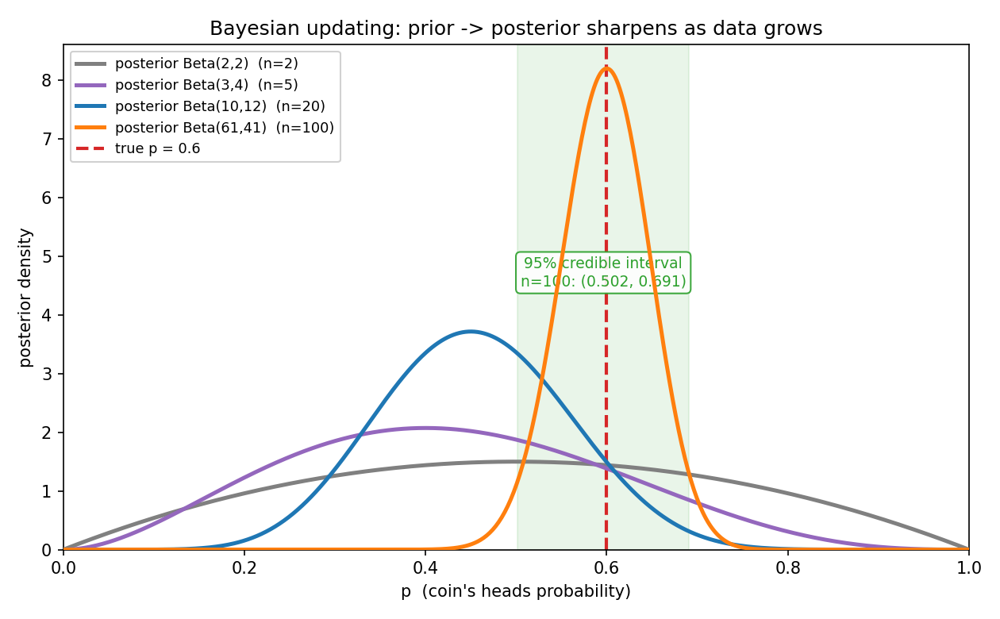
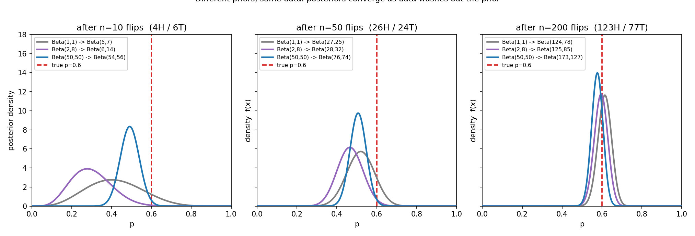

# 第 17 章 · 贝叶斯推断:用数据持续更新

> **核心问题**:第 4 章你学会了贝叶斯公式——拿到一份证据(一份体检报告、一封邮件),更新一次信念。可真实世界不是"更新一次就完"。你怀疑一枚硬币作弊,会**一次一次地抛**,每抛一次就重新掂量一次;你上线一个 A/B 测试,会**一天一天地看数据**,转化率估计越来越有底;医生给病人下诊断,会**一项一项地加检查**,概率判断越来越聚焦。这种"对一个未知参数,用源源不断的数据持续更新"的事,第 4 章只点了一句,本章正式把它立起来——它叫**贝叶斯推断(Bayesian inference)**。而它和频率派(MLE、置信区间、p 值)的**根本分歧**,不在公式,在一个哲学问题:**参数到底是不是随机变量?**
>
> **读完本章你会明白**:
> - **贝叶斯推断的升级在哪**:第 4 章是"对一次性事件更新一次信念",本章是"对一个未知参数持续更新它的**分布**"。每来一批数据,后验就收紧一点,数据越多越聚焦真值——这就是把"学习"做成了一条**可迭代的流水线**。
> - **为什么把参数当随机变量是根本性的翻转**:频率派说参数是固定的未知数(第 15、16 章),贝叶斯说参数有分布、代表我们对它的信念。这一个分歧,导致"区间估计"在两派里**长得几乎一样、含义却天壤之别**。
> - **可信区间(credible interval)到底说什么**:它**正是你以为"置信区间"在说的那个意思**——"真值有 95% 的概率落在这个区间里"。频率派的置信区间**不是**这个意思(第 16 章),可信区间才是。这一字之差,是初学者最深的坑。
> - **先验的争议与"被冲刷"**:数据少时先验主导,数据多时先验被似然淹没——这也是为什么不同先验的人最终会趋同(回扣第 4 章)。再加上一口**共轭先验**(为什么用 Beta 当硬币的先验这么方便),和本书对两派之争的收束。

> **如果一读觉得太难**:先只记住三件事——
> ① 贝叶斯推断 = 给参数一个先验分布,每来一批数据就把它更新成后验分布,数据越多后验越聚焦真值。**这是"持续学习"的数学流水线。**
> ② 把参数当随机变量(贝叶斯)vs 当固定未知数(频率派),是两派的根本分歧——它决定了"区间"到底是"真值有 95% 概率在这"(可信区间)还是"95% 的区间会套住真值"(置信区间)。
> ③ 伯努利/二项的共轭先验是 Beta:先验 `Beta(a,b)`,看到 k 正 n−k 反,后验直接是 `Beta(a+k, b+n−k)`——参数加一加就行,不用算积分。把这三句钉死,本章的骨架你就拿到了。

---

上一章末尾,我们留下了一个"别扭"——频率派连"参数为真的概率"都不让谈:

> 95% 置信区间说的是"重复抽样,95% 的区间会套住真值",**不是**"真值有 95% 的概率落在这个区间里"。后者是贝叶斯的**可信区间**——那要先把参数当成随机变量,给它一个先验,用数据更新出后验。两套哲学,长得几乎一样,含义天壤之别。第 17 章详谈。

这一章,我们就来兑现这笔账。你会看到,频率派那个"别扭"的根源,是它死咬着"参数是固定的客观事实"不放;而贝叶斯派做了件听起来离经叛道、实际上极自然的事——**把参数本身也当成一个随机变量,给它一个分布,然后用数据一寸一寸地把这个分布收紧**。这件事一旦做顺,你一直想要的"真值有 95% 概率在这"的直觉,不仅合法,而且就是"学习"这件事最直接的数学表达。

---

## 章首·一句话点破

如果用一句话概括这一章,那就是:

> **贝叶斯推断 = 把未知参数当成一个有分布的随机变量,给它一个先验,然后用数据持续把后验收紧——每来一批数据,信念就聚焦一分。它把第 4 章"更新一次事件"升级成"持续推断参数",并最终回答了你从第 16 章带过来的那个别扭:想谈"参数为真的概率",就得把参数当随机变量。**

这句话是结论,不是理由。本章倒过来拆:先把"从一次性事件升级到持续推断参数"这件事看清(第一节),再揭示把参数当随机变量带来的真正威力——后验是一个会随数据收紧的**分布**,而不只是一个数(第二节);然后正面踩那个最深的坑——可信区间 vs 置信区间(第三节);最后尝一口共轭先验的便利,并对两派之争给出本书的收束(彩蛋)。

---

## 一、从"更新一次事件"升级到"持续推断参数"

### 提出问题:第 4 章的贝叶斯,够用了吗

回忆第 4 章干了什么。你拿到一份体检**阳性**报告,用贝叶斯公式 `P(病|+) = P(+|病)·P(病)/P(+)` 算出真得病概率约 15%——**更新了一次信念,结束**。那里被更新的对象,是一个**事件**(有没有病,是/否两态)。

可现实里的大量推断,对象不是"事件",而是**参数**——一个连续的、可以取很多值的未知数:

- 一枚硬币的正面概率 `p`,是 0 到 1 之间某个数。
- 一个广告的真实转化率 `θ`,是 0 到 1 之间某个数。
- 一种零件长度的真实均值 `μ`,是实数轴上某个点。

对这种"连续参数",你**不会只更新一次**。你怀疑硬币作弊,会一次一次地抛:抛 10 次看到 7 正 3 反,你对 `p` 的判断变了一点;再抛 90 次累计 60 正 40 反,判断又收紧了;抛到 1000 次,你几乎敢拍板。**每一次新数据,都让你的信念比上一次更聚焦。** 这种"对同一个参数、用源源不断的数据、反复更新"的事,第 4 章只点了一句"贝叶斯 = 学习",本章要把它正式做成一套**可迭代的推断流水线**。

### 不这样理解会怎样:把参数当"待估的数",会丢掉什么

> **不这样看会怎样**:如果你沿用频率派的思路(第 15 章),把 `p` 当成一个**固定的未知数**,你每次只能给一个**点估计**——抛 10 次 7 正,MLE 给 `p̂=0.7`;再抛到 100 次累计 60 正,MLE 改成 `p̂=0.6`。点估计会跳,但它**不告诉你"我这次有多确定"**。抛 10 次的 0.7 和抛 1000 次的 0.7,在你看来是同一个数,可你心里清楚前者是瞎猜、后者几乎是铁案——**点估计丢掉了"不确定性"这一整层信息**。

贝叶斯派的做法,就是把这一层"不确定性"堂堂正正地表达出来:**不要只给参数一个数,要给它一个分布**。

> **所以这样看**:贝叶斯推断的核心动作只有一个——**维护一个关于参数的分布,并用数据不断更新它**。
>
> - 出发前,你对参数有一个**先验分布** `P(θ)`(第 4 章讲过,代表"没有数据时你对它的信念")。
> - 每来一批数据 `D`,用贝叶斯公式把先验更新成**后验分布**:
>
> ```
>    P(θ | D)  =  P(D | θ) · P(θ) / P(D)
>       后验       似然     先验    证据
> ```
>
> (这条公式第 4 章推过,不重复。只记住灵魂一句:**后验 = 先验 × 似然**,再归一化。)
> - 然后**把后验当成新的先验**,等下一批数据来了,再更新一次。**如此反复,参数的分布一寸一寸地收紧。**

这套循环的妙处在于:**它输出的不是一个数,而是一整条曲线**——告诉你"参数取每一个值的可能性"。抛 10 次时这条曲线又矮又宽(不确定性大);抛 1000 次时它又高又尖(几乎钉死在真值上)。**这条会收紧的曲线,就是"我对参数的信念随数据生长"的完整画像。** 点估计只能给你峰顶的位置,贝叶斯把整座山都给你。

> **钉死这件事 · 贝叶斯推断的升级**:第 4 章是"对一次性事件更新一次信念",本章是"对一个未知参数持续更新它的**分布**"。每来一批数据,后验就收紧一点。**数据越多,后验越聚焦真值——这就是把"学习"做成了一条可迭代的流水线。** 而这条流水线输出的,不是一个干瘪的点估计,而是一整条"信念分布"的曲线。

---

## 二、后验是一个会收紧的分布:把这件事画出来

光说"后验收紧"太抽象。这一节我们用最经典的例子——**抛硬币推断正面概率 `p`**——把它彻底跑出来给你看。这也是本章的招牌图。

### 提出问题:先验该长什么样,后验又怎么更新

你怀疑一枚硬币作弊(真实 `p=0.6`,但你推断时"假装不知道")。出发前,你对 `p` 一无所知,觉得 0 到 1 之间任何值都同样可能——这就给一个**均匀分布**当先验。均匀分布是 0 到 1 上的"平地",在贝叶斯里它有个名字叫 `Beta(1,1)`(为什么叫 Beta、为什么是 1 和 1,下一节彩蛋讲共轭先验时说透,这里你先当成"0 到 1 上的均匀分布"用)。

现在开始抛,用贝叶斯公式更新。这里有个**极其方便的事实**(下一节正式讲为什么):对于抛硬币这种伯努利/二项数据,如果先验是 `Beta(a, b)`,那么看到 k 次正面、n−k 次反面后,后验**直接就是 `Beta(a+k, b+n−k)`**——两个参数各加上观测到的正反面次数,完事。不用算积分,不用求归一化常数,加一加就行。

所以均匀先验 `Beta(1,1)`,抛硬币更新轨迹是:

```
   先验:           Beta(1, 1)      ← 0 到 1 上的平地, 啥都可能
   抛 2 次 (1正1反): Beta(2, 2)      ← 中间隆起一点, 但还是宽
   抛 5 次 (2正3反): Beta(3, 4)      ← 峰往左挪了点(2/5=0.4), 仍宽
   抛 20 次(9正11反):Beta(10, 12)    ← 峰在 0.45 附近, 比之前尖
   抛 100次(60正40反):Beta(61, 41)   ← 峰死死对准 0.6, 又高又尖
```

(这些数字是我用固定种子 `np.random.default_rng(42)` 跑出来的真实轨迹,你可以用本章配图脚本复现。)

### 把"收紧"画出来

把上面这条轨迹画成图,就是本章的招牌——**先验→后验,曲线族随数据收紧**:



看图 17.1。横轴是参数 `p`(硬币正面概率),纵轴是密度。**最底下那条灰色的水平线,就是先验 `Beta(1,1)`**——0 到 1 之间处处相等,一马平川,代表"我对 `p` 一无所知"。然后数据开始累积:

- **抛 2 次(1 正 1 反)**:后验 `Beta(2,2)`,那条紫色曲线——中间隆起一个小包,两端压低,但还是很宽。你只知道 `p` 大概不在 0 或 1 附近,别的还说不好。
- **抛 5 次、20 次**:曲线越来越尖(蓝色、橙色),峰的位置随观测到的正面比例而摆动——5 次里 2 正,峰偏左一点(0.4 附近);20 次里 9 正,峰回到 0.45。
- **抛 100 次(60 正 40 反)**:那条最高的绿色曲线——`Beta(61,41)`,峰死死对准 **0.6**,又高又尖。绿色阴影标出了它的 95% 可信区间:**(0.50, 0.69)**,宽度只剩 0.19。

红色虚线是真实 `p=0.6`。**你看到的那座越来越尖的山,正一步步把真值夹紧。** 这就是贝叶斯推断的视觉签名:**数据把一马平川的先验,揉成一座对准真值的尖峰。**

> **钉死这件事 · 后验收紧的几何**:先验是"平地"(无知),后验是"山峰"(有知)。数据越多,山越高越尖,山脚下的"可信区间"越窄。**这条会收紧的曲线,就是"我对参数的信念随数据生长"的完整画像**——它不光告诉你"我猜 `p` 是多少"(峰顶位置),还告诉你"我有多确定"(山的宽窄)。点估计给不了你后者,贝叶斯给。

### 不这样理解会怎样:点估计的"虚假自信"

> **不这样看会怎样**:如果你只用频率派的点估计(第 15 章 MLE),抛 10 次 7 正你报 `p̂=0.7`,抛 1000 次 700 正你也报 `p̂=0.7`——**两个 0.7 长得一样,可信度却差了一个数量级**。点估计不区分"瞎猜的 0.7"和"铁案的 0.7"。而贝叶斯的后验分布天然区分:前者是一条又矮又宽的曲线(啥都可能),后者是一条又高又尖的曲线(几乎钉死)。**这一层"可信度"的信息,是贝叶斯相对点估计最大的增量,也是它为什么在"数据少、要量化不确定性"的场景(医疗诊断、冷启动推荐、风险建模)里不可替代。**

---

## 三、最深的坑:可信区间 vs 置信区间

现在到全章最该停下来想透的一步。这也是第 16 章末尾留给我们的钩子——频率派的 95% 置信区间,**到底和你想要的"真值有 95% 概率在这"差在哪**?

### 提出问题:你一直想要的那个解释,为什么频率派给不了

回到第 16 章那个让人别扭的解释。你算出一个 95% 置信区间 `(0.50, 0.69)`,你想说的是:"真值有 95% 的概率落在这个区间里。"——这听起来天经地义,可频率派**不让你这么说**。它逼你改成:"重复抽样很多次,95% 的**区间**会套住真值。" 真值是固定的,区间是随机的,95% 是**方法**的性质,不是**这一次区间**的性质。

为什么这么别扭?因为频率派死咬着一个哲学:**参数是固定的客观事实,不是随机变量,所以"参数落某区间的概率"这句话根本不成立**——固定的东西没有概率分布。

> **不这样看会怎样**:这个别扭不是数学上的洁癖,它是**实操上的坑**。无数科研工作者、数据分析师、记者,看到"95% 置信区间"就理解成"真值有 95% 概率在这",然后基于这个误解做决策。频率派会用一整节来纠正这个误读(第 16 章我们干过),可问题是——**人脑就是这么想的**。你看到一个具体的区间,你天然就想说"真值多半在这"。频率派说你错了,可它给你的替代解释("95% 的区间会套住真值")又反直觉到没人真用。这是一个**输给了人类直觉**的哲学。

### 所以这样看:贝叶斯的可信区间,正是你以为置信区间在说的意思

贝叶斯派的解法简单粗暴:**既然你想说"真值有 95% 概率在这",那就把参数当随机变量,让这句话合法**。

> **可信区间(credible interval)的贝叶斯解释**:给定这批数据,参数 `θ` 的后验分布里,有 95% 概率质量落在某个区间 `[L, U]` 内——即:
>
> ```
>    P(L ≤ θ ≤ U | 数据) = 0.95
> ```
>
> 读法:**"给定我看到的这批数据,我有 95% 的把握,真值落在这个区间里。"** 这正是你以为"置信区间"在说的那句话——在贝叶斯框架里,它合法。

这件事的实现极其自然。你已经有了一条后验分布(图 17.1 那座山),想取 95% 可信区间,就是把后验曲线下 95% 的面积圈出来——最常见的是取"中间 95%"(左右各切掉 2.5%),即后验的 2.5% 和 97.5% 分位数。比如图 17.1 里抛 100 次的后验 `Beta(61,41)`,它的 2.5% 和 97.5% 分位数(scipy 的 `stats.beta.ppf` 算)就是 **0.50 和 0.69**——所以 95% 可信区间是 `(0.50, 0.69)`,意思是"给定这 100 次数据,`p` 有 95% 的概率在 0.50 到 0.69 之间"。

> **钉死这件事 · 可信 vs 置信,一字之差,哲学天壤**:
>
> | | 频率派 95% **置信**区间 | 贝叶斯派 95% **可信**区间 |
> |---|---|---|
> | **谁随机** | 区间(由随机样本算出)随机;参数固定 | 参数随机(有后验分布);这批数据下区间固定 |
> | **95% 说什么** | "重复抽样,95% 的**区间**会套住真值" | "给定这批数据,真值有 95% **概率**在这个区间里" |
> | **能谈"真值落某区间的概率"吗** | **不能**——参数固定,无概率可言 | **能**——这就是它的定义 |
> | **数值** | Wald 区间 `(0.50, 0.70)`(n=100,k=60) | Beta(1,1) 先验下 `(0.50, 0.69)` |
>
> 你会惊讶地发现:**数值几乎一样**(都是 0.50 到 0.69 附近)。因为在均匀先验下,贝叶斯和频率派给出的区间宽度几乎相同。**真正的差别不在数字,在解释**——同一段区间,频率派只能说"95% 的方法会套住真值",贝叶斯能说"真值有 95% 的概率在这"。前者是关于方法的保证,后者是关于参数的信念。**这两个解释不可互换,是初学者最常踩的坑。**

### 不这样理解会怎样:为什么数值会"几乎一样"

你可能会问:既然两派哲学差这么多,为什么区间数值几乎相同?

> **所以这样看**:因为在**无信息先验**(均匀、或很弱的先验)下,后验 `P(θ|D) ∝ 似然 P(D|θ) × 先验 P(θ)`,而先验是常数,所以后验**正比于似然**。而频率派的 MLE 也是在似然上找峰(第 15 章)——两者用的几乎是同一块砖(似然),只是贝叶斯多乘了个先验、多归一化成了概率。**数据多、先验弱时,两者给出的中心和宽度几乎重合。** 真正的差别出现在**先验强、或者数据少**的时候——这时候贝叶斯的区间会被先验往它的方向拉,频率派则完全不理先验。下一节我们就看这个差别有多大。

---

## 四、先验的争议与"被冲刷":数据多了,先验还重要吗

贝叶斯最被质疑的罩门,从第 1 章到第 4 章一直被点:**先验是主观的,两个人先验不同,结论不就不同了吗?** 这一节我们正面回答——**会不同,但只是暂时的;数据多了,先验会被冲刷掉(prior is washed out by data)**。

### 提出问题:三个先验不同的人,谁对

还是那枚硬币(真实 `p=0.6`)。三个人出发前的信念完全不同:

- **A(均匀派)**:`Beta(1,1)`,0 到 1 平地,均值 0.5,"我啥都不知道"。
- **B(怀疑论)**:`Beta(2,8)`,均值 0.2,"我赌硬币偏反面"。
- **C(强先验派)**:`Beta(50,50)`,均值 0.5,但**极尖**——"我之前玩过很多硬币,几乎都公平,`p` 一定在 0.5 附近,你别想轻易说服我"。这个先验的"强度"相当于已经看过 100 次数据(50 正 50 反)。

三个人看同一批 200 次抛硬币数据,各自更新。下图(图 17.2)是三个时间快照(n=10、50、200)下,三个人后验曲线的样子:



看图 17.2 的三个子图:

- **n=10(左)**:三条曲线**差得最远**。A(灰)的峰在 0.4 附近,又矮又宽;B(紫)被它的低先验拽着,峰还在 0.3 附近——B 的怀疑论还没被 10 次数据推翻;C(蓝)因为先验太强(相当于已经看过 100 次),10 次新数据根本撼不动它,峰死死咬在 0.5。**这时候先验主导判断。**
- **n=50(中)**:三条线开始靠拢。A 和 B 的峰都挪到了 0.5 附近,C 也开始松动,峰从 0.5 微微右移。
- **n=200(右)**:三条曲线**几乎挤成一团**,全部对准 0.6 附近。我用 scipy 算了 n=200 时三个人后验的均值和 95% 可信区间:

```
   A (先验 Beta(1,1)):   均值 0.614,  95% CI (0.546, 0.680), 宽 0.134
   B (先验 Beta(2,8)):   均值 0.595,  95% CI (0.528, 0.661), 宽 0.132
   C (先验 Beta(50,50)): 均值 0.577,  95% CI (0.520, 0.632), 宽 0.112
```

**三个人从完全不同的起点出发,被同一批数据拉到了 0.58~0.61 这个窄带里。** C(强先验)收敛最慢(它还在 0.577,离真值 0.6 差一点),但它也在**逼近**。这就是第 4 章那句"先验被数据淹没"的力度展示——**数据足够多,先验的偏见会被洗掉**。

### 不这样理解会怎样:数据少时,先验定生死

> **不这样看会怎样**:如果你只看 n=10 那张图就下结论,你会以为"贝叶斯太主观了,三个人结论天差地别"。可你把时间拉长到 n=200,偏见就被冲刷掉了。**先验的重要性,是和数据量成反比的**——这是一条极其重要的实践规律:
>
> - **数据少,先验主导**。n=10 时,A、B、C 差得最远——这时候一个好的先验(领域知识、历史经验)能救命,一个坏的先验会带偏你。医疗诊断(每个病人数据极少)、罕见事件预测、推荐系统的冷启动(新用户没历史),全是"先验定生死"的场景。**这就是为什么"如何选先验"本身是一门学问。**
> - **数据多,先验被冲刷**。n=200 时三个人趋同——这时候先验几乎不重要,似然(数据)说了算。这也是为什么大样本下,贝叶斯和频率派给出的数值几乎一样(上一节):数据多到先验被稀释,两派殊途同归。

> **钉死这件事 · 先验被冲刷的机制**:为什么先验会被冲刷?看后验参数 `Beta(a+k, b+n−k)`——先验的 `a,b` 是固定的"出发行李",而 `k, n−k`(观测到的正反面次数)随数据线性增长。n=10 时,先验 `Beta(50,50)` 的 50/50 比观测的几个数据重得多,所以它主导;n=200 时,观测的 120 个数据把先验的 50 稀释成了 1/3,后验被数据拉走。**先验的"权重"是固定的,数据的"权重"随 n 线性增长——n 足够大,数据必然压倒先验。** 这是"学习"会收敛的数学根,也是为什么不同先验的人最终会趋同(回扣第 4 章"贝叶斯 = 学习")。

---

## 五、模拟佐证:拿 Python,把"持续更新"跑一遍

概率论的招牌——结论你别信书,自己扔随机数验证。这一节用三段代码,把"后验收紧"、"不同先验收敛"、"可信区间 vs 置信区间"全跑出来。

### 纸笔例子 1:抛 100 次 60 正,手算后验

先验 `Beta(1,1)`,看到 k=60 正、n−k=40 反。后验 `Beta(1+60, 1+40) = Beta(61, 41)`。

- **后验均值** = `a/(a+b) = 61/102 ≈ 0.598`(注意:它和 MLE 的 0.6 略有不同,因为先验 `Beta(1,1)` 等价于"额外看过 1 正 1 反",把估计微微拉向 0.5)。
- **后验众数** = `(a−1)/(a+b−2) = 60/100 = 0.6`(恰好等于 MLE!因为众数扣掉了先验的 1/1 偏移)。
- **95% 可信区间**:scipy 的 `stats.beta.ppf([0.025, 0.975], 61, 41)` = `(0.502, 0.691)`。

scipy 核对(你可以在 Python 里跑):

```python
from scipy import stats
lo, hi = stats.beta.ppf([0.025, 0.975], 61, 41)
print(f"95% credible interval: ({lo:.4f}, {hi:.4f})")  # (0.5017, 0.6907)
print(f"posterior mean: {61/102:.4f}")                 # 0.5980
print(f"posterior mode: {60/100:.4f}")                 # 0.6000
```

### 纸笔例子 2:可信区间 vs 置信区间(数值对照)

同一批数据 n=100, k=60:

- **频率派 Wald 95% 置信区间**:`p̂ ± 1.96·√(p̂(1−p̂)/n) = 0.6 ± 1.96·√(0.24/100) = 0.6 ± 0.096 = (0.504, 0.696)`,宽 0.192。
- **贝叶斯 Beta(1,1) 先验 95% 可信区间**:`(0.502, 0.691)`,宽 0.189。
- **贝叶斯 Beta(50,50) 强先验 95% 可信区间**:后验 `Beta(110, 90)`,区间 `(0.481, 0.618)`,宽 0.137——**明显更窄、且被先验拉向 0.5**。

你看:**无信息先验下,两派数值几乎一样**(0.192 vs 0.189);**强先验下,贝叶斯区间明显不同**(被先验塑形)。这就是"数据多先验被冲刷、数据少先验主导"在区间宽度上的体现。

### 蒙特卡洛 1:后验随数据收紧

从真实 `p=0.6` 生成数据,贝叶斯后验随数据量增大逐步聚焦真值:

```python
import numpy as np
from scipy import stats
rng = np.random.default_rng(42)
true_p = 0.6
obs = (rng.random(200) < true_p).astype(int)

a0, b0 = 1, 1                  # 均匀先验 Beta(1,1)
cum_h = 0
print(f"{'n':>5} {'heads':>6} {'Beta(a,b)':>16} {'mean':>8} {'95% CI':>22} {'width':>7}")
for i, x in enumerate(obs):
    cum_h += x
    n = i + 1
    if n in [2, 5, 20, 50, 100, 200]:
        a, b = a0 + cum_h, b0 + (n - cum_h)
        lo, hi = stats.beta.ppf([0.025, 0.975], a, b)
        print(f"{n:5d} {cum_h:6d}  Beta({a},{b}){' '*(8-len(str(a))-len(str(b)))} "
              f"{a/(a+b):8.4f}  ({lo:.4f}, {hi:.4f})  {hi-lo:.4f}")
#  n=2:   Beta(2,2)     均值 0.5000  CI (0.094, 0.906)  宽 0.811   <- 又矮又宽
#  n=5:   Beta(3,4)     均值 0.4286  CI (0.118, 0.777)  宽 0.659
#  n=20:  Beta(10,12)   均值 0.4545  CI (0.257, 0.660)  宽 0.403
#  n=50:  Beta(27,25)   均值 0.5192  CI (0.385, 0.653)  宽 0.268
#  n=100: Beta(61,41)   均值 0.5980  CI (0.502, 0.691)  宽 0.189   <- 对准真值 0.6
#  n=200: Beta(124,78)  均值 0.6139  CI (0.546, 0.680)  宽 0.134   <- 死死夹住
```

可信区间宽度从 **0.81 一路收到 0.13**——这就是图 17.1 那座山从平地长成尖峰的字面演示。**数据把一马平川的先验,揉成了一座对准真值的尖峰。**

### 蒙特卡洛 2:三个不同先验,看同一批数据

```python
rng = np.random.default_rng(42)
obs = (rng.random(200) < 0.6).astype(int)
priors = {"uniform Beta(1,1)":   (1, 1),
          "skeptical Beta(2,8)": (2, 8),
          "strong Beta(50,50)": (50, 50)}
for name, (a0, b0) in priors.items():
    h = obs.sum()
    a, b = a0 + h, b0 + (200 - h)
    lo, hi = stats.beta.ppf([0.025, 0.975], a, b)
    print(f"{name:25s}: 先验均值 {a0/(a0+b0):.3f} -> 200次后 均值 {a/(a+b):.4f}, "
          f"95% CI ({lo:.4f}, {hi:.4f}), 宽 {hi-lo:.4f}")
# uniform:    0.500 -> 均值 0.6139, CI (0.546, 0.680), 宽 0.134
# skeptical:  0.200 -> 均值 0.5952, CI (0.528, 0.661), 宽 0.132
# strong:     0.500 -> 均值 0.5767, CI (0.520, 0.632), 宽 0.112   (强先验收敛慢, 仍在逼近)
```

三个人从 0.5、0.2、0.5 三个完全不同的起点出发,200 次后全部被拉到 **0.58~0.61** 这个窄带。**这就是图 17.2 的来历——先验被数据冲刷,信念趋同。**

### 蒙特卡洛 3:可信区间的"覆盖率"(对应频率派的覆盖率)

频率派的 95% 置信区间,我们用 2 万次抽样验证过"95% 的区间套住真值"(第 16 章)。贝叶斯的 95% 可信区间呢?它的承诺不同——它不说"95% 的区间套住真值",它说"每一次,真值都有 95% 的概率在这个区间里"。如果先验**包含了真值**(比如均匀先验,真值 0.6 在 0 到 1 之间),那么反复抽样、每次算可信区间,套住真值的**频率**也会接近 95%——但这是"先验正确"时的副产品,不是可信区间的定义:

```python
rng = np.random.default_rng(42)
true_p = 0.6
covered = 0
N = 20000
for _ in range(N):
    k = rng.binomial(100, true_p)          # 抛 100 次, k 个正面
    a, b = 1 + k, 1 + (100 - k)            # 均匀先验 -> 后验 Beta(1+k, 1+100-k)
    lo, hi = stats.beta.ppf([0.025, 0.975], a, b)
    if lo <= true_p <= hi:
        covered += 1
print(f"均匀先验下, 可信区间套住真值的频率 = {covered/N:.4f}")  # 约 0.95
```

跑出来约 **0.95**。注意这和频率派置信区间的覆盖率数值相同,但**解释不同**:频率派说"这是方法的长期性质",贝叶斯说"这是每一次我都有的 95% 信念,刚好在均匀先验下也表现为 95% 的长期覆盖率"。**数值相同,哲学不同**——这就是本章最该带走的那一字之差。

> 三段代码,你十分钟跑完。跑完你会发现:**贝叶斯推断不是玄学,它就是你扔随机数时,后验分布自动收紧、自动聚焦真值的规律**。数据越多,山越尖;先验不同,终会被冲刷;可信区间,数值上和置信区间几乎一样,但允许你说出那句你一直想说的话。**这就是"持续学习"的数学流水线,亲手跑出来的版本。**

---

## 六、彩蛋(本章最深):共轭先验,以及两派之争的收束

这一节兑现"越深越好"。先尝一口让前面所有计算如此顺手的"作弊技巧"——**共轭先验**;再对吵了两百年的贝叶斯 vs 频率派之争,给出本书的收束。

### 共轭先验:为什么用 Beta 当硬币的先验这么方便

你可能一直在纳闷:为什么前面抛硬币的例子,先验都爱用 `Beta(a, b)`?因为 `Beta` 是伯努利/二项分布的**共轭先验(conjugate prior)**——一个极其方便的性质。

> **共轭先验(conjugate prior)**:如果先验和后验**属于同一种分布族**(只是参数变了),那这个先验就叫该似然的共轭先验。对于伯努利/二项似然(抛硬币),`Beta` 分布是共轭先验——先验 `Beta(a, b)`,看到 k 正 n−k 反,后验直接是 `Beta(a+k, b+n−k)`,**不用算积分,不用求归一化常数,两个参数各加一下就行**。

这就是为什么本章所有计算都这么顺:先验是 Beta,后验也是 Beta,只是 `a, b` 变大了。每次更新,就是 `a += 正面次数, b += 反面次数`——**后验变成下一轮的先验,无缝衔接**。这种"同族更新"的便利,让贝叶斯推断在共轭情形下变成简单的加减法,完全不用碰那个噩梦般的归一化积分 `P(D)`。

几对经典的共轭组合(工程上够用):

| 似然(数据模型) | 共轭先验 | 后验参数怎么变 |
|---|---|---|
| 伯努利/二项(抛硬币) | **Beta** | `Beta(a+k, b+n−k)` |
| 正态(估均值,方差已知) | **正态** | 均值和方差有闭合公式(精度相加) |
| 泊松(计数) | **Gamma** | `Gamma(a+Σx, b+n)` |
| 多项式(骰子/分类) | **Dirichlet** | Dirichlet 参数各加观测计数 |

> **钉死这件事 · 共轭先验的代价**:共轭先验是**计算上的便利,不是物理上的必然**。现实里你的真实信念未必恰好长成 Beta/正态/Gamma 的样子。可为了算得动,我们经常选一个"足够接近真实信念"的共轭先验——这是工程上的妥协。**当模型复杂到没有共轭先验时(比如深度学习的权重),贝叶斯推断就得靠 MCMC(马尔可夫链蒙特卡洛)或变分推断来数值求解**——那是第 4 章彩蛋提过的、让贝叶斯在 1990 年代重新火起来的计算革命。共轭先验是"能解析求解"的美好特例,MCMC 是"算不动也得算"的通用武器。

### 两派之争的收束:都是工具,看场景选

吵了两百年,本书的立场很朴素——**两派都对,各管一摊,它们是互补的工具,不是你死我活的信仰**。

| 场景 | 该用谁 | 为什么 |
|---|---|---|
| 大样本、可重复、要客观可复现的科研 | **频率派**(MLE、p 值、置信区间) | 数据多到先验被冲刷,两派数值几乎一样,频率派不需要拍脑袋选先验,更"客观" |
| 小样本、要融入领域知识、要量化不确定性 | **贝叶斯派** | 数据少时先验救命,后验分布天然表达"我有多确定",医疗诊断/风险建模/A/B 测试早期必用 |
| 一次性事件(明天地震吗、这段代码有 bug 吗) | **贝叶斯派** | 频率派要求"可重复",一次性事件根本没法谈频率,贝叶斯给任何不确定的事都能赋予信念 |
| 机器学习(训练模型、量化预测不确定性) | **贝叶斯派**(或其变体) | ML 里几乎全是"用数据更新模型信念",贝叶斯天然契合;贝叶斯神经网络、变分推断是现代 AI 不确定性建模的根 |

> **钉死这件事 · 两派的真正分歧,不在公式,在哲学**:**参数到底是不是随机变量?** 频率派说"不是,它是固定未知数,我用数据估它";贝叶斯说"是,我用数据更新它的分布"。这一个分歧,导致"区间"在两派里长得几乎一样、含义天壤之别(置信 vs 可信)。**两派用的砖几乎相同(都是似然),盖的房子不同**——频率派盖的是"关于方法的长期保证",贝叶斯盖的是"关于参数的当下信念"。理解了这一层,你就不会再纠结"谁对谁错",而是会问"我这个场景,要的是哪种保证"。

> **再深一点 · 贝叶斯为什么"重新"火起来**(接第 4 章彩蛋):贝叶斯思想 18 世纪就有了,20 世纪被频率派压下去,根子是**算不动**——后验的归一化常数 `P(D)` 在高维参数空间里是个噩梦般的积分。直到 1990 年代 **MCMC**(马尔可夫链蒙特卡洛,Markov Chain Monte Carlo)成熟,贝叶斯才从"理论漂亮、算不动"变成"能实战"。今天深度学习里的**贝叶斯神经网络**(给权重加先验、量化预测不确定性)、**变分推断**(用优化代替采样)、**高斯过程**,全是这套思想的现代延续。**你今天学的"后验 = 先验 × 似然",是整个 AI 不确定性建模的根。**

---

## 章末小结

### 用一个场景回顾本章

想象你是一个产品经理,刚上线一个新功能,要估它的真实转化率 `θ`。

你**不知道** `θ` 是多少(参数未知)。出发前,你给它一个先验——基于同类功能的历史经验,你觉得转化率大概在 5% 附近,给个 `Beta(5, 95)`(均值 0.05)。**这是你的出发行李**(第一节)。

然后数据来了。第一天 1000 次曝光、48 次转化——后验 `Beta(5+48, 95+952) = Beta(53, 1047)`,均值 0.048,95% 可信区间 `(0.036, 0.062)`。**你不用等数据攒够才下判断,每来一批就更新一次,后验一寸一寸收紧**(第二节)。一周后累计 10000 次曝光、510 次转化——后验 `Beta(515, 9485)`,可信区间窄到 `(0.046, 0.054)`。**这条会收紧的曲线,就是"我对转化率的信念随数据生长"的完整画像。**

而当你向老板汇报"95% 可信区间是 (0.046, 0.054)"时,你可以**堂堂正正**地说:"真实转化率有 95% 的概率在这个区间里。"(第三节)——这正是你从第 16 章带过来的那个别扭:频率派的置信区间**不让你**这么说,可信区间**让你**这么说。一字之差,哲学天壤。

要是你和同事的先验不同(你基于历史给 5%,同事觉得新产品可能更高给 8%)——别急,数据多了你们会趋同(第四节)。一周的数据,就能把你们俩的后验拉到几乎重合。**这就是"先验被冲刷"——数据多了,出发时的偏见会被洗掉,这是"学习"会收敛的根。**

### 本章在驯服随机性的哪一步

回到全书主线:**一切概率概念,都是"驯服随机性"的工具。**

这一章是**第 5 篇(统计推断)的收官**。从第 15 章(MLE,反推一个点估计),到第 16 章(假设检验,做判断),再到这一章(贝叶斯推断,持续更新参数的分布)——**"从数据反推世界"的三件套凑齐了**。而贝叶斯这一件,有个频率派给不了的独特视角:**它不光反推参数,还把"我对参数有多确定"这一整层不确定性,堂堂正正地表达成一条会收紧的分布**。

在"驯服随机性"的旅程上,这一章的位置是:**把参数当随机变量,用数据持续更新信念,这是"持续学习"的数学化身**。第 4 章的贝叶斯是"更新一次事件",本章是"持续推断参数"——从"修正一次"升级成"可迭代的流水线"。**贝叶斯把不确定性,量化成了一个可更新的分布**——每来一批数据,这个分布就更聚焦一分。这是驯服随机性里"持续学习"这一步的全部内容,也是为什么机器学习(下一章信息熵、再后面逻辑回归)天然长在贝叶斯的根上。

而"单次盲、大量稳"的主线,在这一章又露了一面:**单批数据(尤其小样本)是盲的——后验又矮又宽,先验主导;大量数据是稳的——后验又高又尖,死死夹住真值,先验被冲刷**。这正是大数定律的贝叶斯化身——数据越多,后验收敛到真值,和频率派的 MLE 一致殊途同归。

### 五个"为什么"清单

如果你只能记五件事,记这五件:

1. **贝叶斯推断的升级**:从第 4 章"对一次性事件更新一次信念",升级到"对一个未知参数持续更新它的**分布**"。每来一批数据,后验就收紧一点。**输出不是一个数,而是一条会收紧的曲线——既告诉你'我猜多少',又告诉你'我有多确定'。**
2. **把参数当随机变量,是根本性的翻转**:频率派说参数是固定未知数(第 15、16 章),贝叶斯说参数有分布、代表信念。这一个分歧,导致"区间"在两派里长得几乎一样、含义天壤之别。
3. **可信区间 vs 置信区间**:可信区间说"给定数据,真值有 95% 概率在这"(贝叶斯,合法);置信区间说"重复抽样,95% 的区间套住真值"(频率派,关于方法的保证)。**数值几乎相同,解释不可互换**——这是初学者最深的坑,也是第 16 章别扭的解药。
4. **先验被冲刷**:数据少,先验主导(医疗诊断、冷启动推荐、罕见事件);数据多,先验被似然淹没,不同先验的人趋同(回扣第 4 章"贝叶斯 = 学习")。先验权重固定,数据权重随 n 线性增长——n 足够大,数据必然压倒先验。
5. **共轭先验的便利**:Beta 是伯努利/二项的共轭先验——先验 `Beta(a,b)`,看到 k 正 n−k 反,后验直接 `Beta(a+k, b+n−k)`,不用算积分。这是"能解析求解"的美好特例;模型复杂时(深度学习),贝叶斯靠 MCMC / 变分推断数值求解。

### 想继续深入,该往哪钻

- **亲手扔**:把本章三段蒙特卡洛代码全跑一遍。**强烈推荐**:改先验(试 `Beta(100,100)`,看它收敛得多慢——强先验的"惯性"有多顽固);改真实 `p`(试 0.5,看三个人都收敛到 0.5);改数据量(把 200 改成 2000,看可信区间宽度怎么从 0.13 缩到 0.04)。**改一晚上,贝叶斯就是你的肌肉记忆。**
- **玩 A/B 测试的贝叶斯版**:本章产品经理那个场景,写个完整版——两个转化率 `θ_A`、`θ_B`,各给先验,各更新后验,然后用后验算 `P(θ_B > θ_A)`(B 比 A 好的概率)。**这是贝叶斯 A/B 测试的核心**,比频率派的 p 值直观得多——它直接告诉你"B 比 A 好的概率是 87%",而不是"在 B 不比 A 好的假设下数据有多反常"。
- **MCMC 与变分推断**:本章共轭先验是"能解析"的特例。深入学 **Metropolis-Hastings**、**Gibbs 采样**(MCMC 的经典算法),以及 **变分推断**(用优化代替采样,深度学习里常用)。推荐资源:PyMC3 / Pyro / NumPyro 的官方教程,以及《Bayesian Data Analysis》(Gelman)。
- **贝叶斯因子(Bayes factor)**:第 16 章彩蛋提过。它直接量化"数据支持 H0 还是 H1",是贝叶斯版的假设检验——比 p 值更贴近"哪个假设更可能"的直觉。
- **看可视化**:Brown 大学的 **Seeing Theory**(seeing-theory.brown.edu)有"贝叶斯推断"交互模块,能拖动先验、看后验随数据收紧。这是图 17.1、17.2 的可交互版本。

---

> 第 5 篇收官了。你已经凑齐了"从数据反推世界"的三件套——MLE(反推一个点估计)、假设检验(做判断)、贝叶斯推断(持续更新参数的分布)。**可这三件套,都在处理一件具体的事:从数据里把参数估出来、判断出来、更新出来。** 概率论还有最后一个、也是最深刻的视角——**度量"不确定性"本身**。一个分布有多不确定?两个分布差多远?为什么训练分类器都用"交叉熵"损失?翻开 **第 18 章 · 信息熵与交叉熵:度量不确定性**——你会发现,熵是把"不确定性"量化成一个数的工具,而交叉熵,正是 MLE 的对偶(第 15 章埋的钩子,这里兑现)。驯服随机性的旅程,进入最后也是最抽象的一步:**给不确定性本身,标一个价**。
