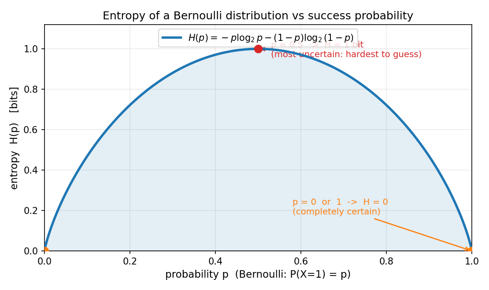
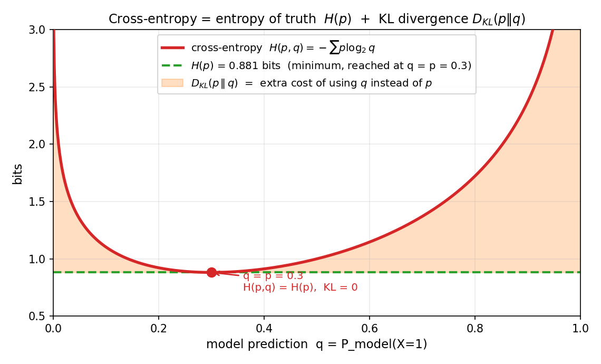
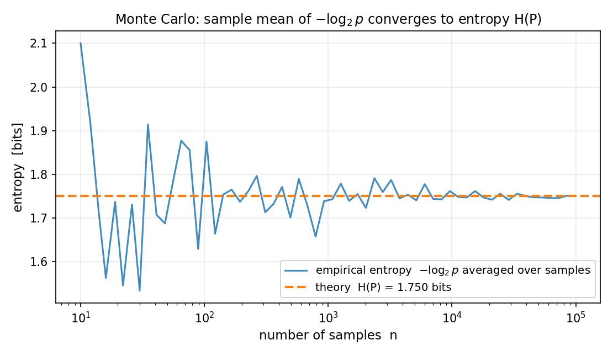

# 第 18 章 · 信息熵与交叉熵:度量不确定性本身

> **核心问题**:前面 5 篇,我们一直在用概率工具描述随机——概率量化单个事件、期望刻画平均、方差度量波动、分布画出整体长相。可有一个最根本的问题我们一直没碰:**一个概率分布,到底"有多不确定"?** 方差能说一部分,但它依附于"取值有数字"(身高、长度),如果一个分布没有自然的数值(比如"明天是晴/阴/雨"),方差就使不上劲了。我们需要一个**不依赖取值、只看概率本身**的度量。
>
> 这就是**信息熵(entropy)**——它把"一个分布有多不确定"量化成一个数。而从这个数,会自然长出两个 ML 里天天见的工具:**KL 散度**(两个分布差多远)和**交叉熵**(用一个分布去编码另一个分布的代价——也就是你训练分类器时用的损失函数)。
>
> **读完本章你会明白**:
> - **熵到底是什么**:它不是玄学,是"把一个分布的结果告诉别人,平均需要多少个 yes/no 问题"——等概率最难猜(熵最大),确定事件最好猜(熵为 0)。并亲手推出为什么公式是 `−Σ p log p`。
> - **KL 散度和交叉熵**:`KL(P||Q)` 度量"用 Q 代替 P 要多付出多少代价";交叉熵 `H(P,Q) = H(P) + KL(P||Q)`,是这套度量的工程落地。
> - **为什么训练分类器都用交叉熵**(本章最深、程序员最解渴的一条):**最小化交叉熵 ⟺ 极大似然**——你天天在用的那个 loss,根本就是第 15 章的 MLE 换了件衣服。
> - **最大熵原理**(尝一口):只知道部分信息时,最合理的猜测是熵最大的那个分布——这是正态分布"处处出现"的又一个理由。

---

> **如果一读觉得太难**:先只记住三件事——
> ① **熵** = 一个分布有多不确定,公式 `−Σ p log p`(以 2 为底单位是比特);等概率分布熵最大,确定事件熵为 0。
> ② **交叉熵** `H(P,Q)` = 用 Q 当模型去描述真实分布 P 的代价,`H(P,Q) = H(P) + KL(P||Q)`,所以**最小化交叉熵 ⟺ 把 KL 压到 0 ⟺ 让模型分布逼近真实分布**。
> ③ **交叉熵损失 = MLE 的对偶**:训练分类器最小化交叉熵,数学上等价于第 15 章的极大似然。把这三句钉死,本章你就抓到了。

---

## 引子:从"驯服随机性",到"给不确定性称重"

先把全书来路一句话说清。

> 前面 5 篇,我们把概率论的工具一层层建起来了:概率量化可能性、条件概率修正信念、随机变量把结果变成数字、期望方差刻画平均与波动、大数定律和中心极限抓住大量随机的铁律、MLE 和贝叶斯从数据反推世界。这些工具,都在回答"**这个随机世界长什么样**"。

可到了机器学习这一篇(P6),我们会撞上一个更根本的问题。训练一个分类器,本质是让模型的输出分布**逼近**数据的真实分布——比如真实标签是"猫 0.7、狗 0.2、鸟 0.1",你的模型也要尽量输出接近这个的概率。**怎么度量"两个分布有多接近"?** 两个数比大小可以用差的绝对值,两个分布比"接近程度",需要一把专门的尺子。

这把尺子,要从"不确定性"本身造起。**信息熵**,就是这把尺子的零刻度——它先告诉你"一个分布本身有多不确定";然后**KL 散度**告诉你"两个分布差多远";**交叉熵**告诉你"用一个分布去模仿另一个,要付出多少代价"。而代价最小的那一刻,就是你的模型学到了真实分布——也就是机器学习的目标。

这一章,是全书把概率落到机器学习的起点。

---

## 章首·一句话点破

> **信息熵,把"一个概率分布有多不确定"压缩成一个数。这个数不是拍脑袋定的——它是"平均要问多少个 yes/no 问题才能猜出结果"。等概率最难猜(熵最大),确定事件最好猜(熵为 0)。而交叉熵,就是这套度量在 ML 里的化身:训练分类器最小化交叉熵,本质就是第 15 章的极大似然换了件衣服。**

这是结论。下面我们倒过来拆:先从"猜词游戏"里把熵**推**出来(不是甩公式,是让你自己想出为什么是 `−Σ p log p`),再把它推广成 KL 散度和交叉熵,最后揭示交叉熵 = MLE 这条最深暗线。

---

## 一、从一个游戏开始:猜中结果,要问几个问题

理解熵最快的路,不是公式,是一个你小时候玩过的游戏——**20 问**(twenty questions)。

> **直觉**:我心里想一个东西,你只能问 yes/no 问题(它是活的吗?比猫大吗?),把我猜出来。**结果越不确定,你需要的问题越多;结果越确定,你几乎不用问。**

考虑几个场景:

- **场景 A**:我心里想的是"太阳"。你第一个问题"它是天体吗",我答 yes,你一秒钟就猜到了。**几乎不用问**——因为这个结果**完全确定**(谁都知道答案就那一个)。
- **场景 B**:我心里想的是抛一枚**公平硬币**的正面或反面。你能猜吗?**不能**。正反五五开,你问任何问题都只能砍掉一半,平均要问 **1 个** yes/no 问题(它是正面吗?对/错)。
- **场景 C**:我心里想的是 1 到 8 之间的一个整数(均匀分布)。你用"二分法"问(它大于 4 吗?大于 2 吗?),**平均要问 3 个**问题(log₂8 = 3)。

看出来了吗?**"要问几个 yes/no 问题",直接度量了"这个结果有多不确定"。** 太确定(Sun)→ 几乎不用问 → 不确定性 0;五五开(硬币)→ 问 1 个 → 不确定性中等;8 选 1 → 问 3 个 → 不确定性更大。

> **钉死这件事**:**一个 yes/no 问题,能区分 2 种可能性**。所以"区分 n 种等可能的结果",需要 log₂n 个 yes/no 问题(因为 2^(log₂n) = n)。**"不确定性"这件事,可以用"需要多少比特信息"来称重——这就是熵的字面含义。** 信息论里,把"一个 yes/no 答案"叫 **1 个比特(bit)**。熵的单位,就是比特。

### 不这样理解会怎样:等概率最难猜,确定事件最好猜

> **不这样理解会怎样**:如果你没有"熵 = 要多少信息才能消除不确定性"这把尺子,你就解释不了几个反直觉的事实。第一,为什么**等概率分布是最难猜的**?因为它没有任何"偏向",你问什么问题都只能砍一半,没法走捷径。第二,为什么**方差不能完全度量不确定性**?方差依赖取值的数字——"晴/阴/雨"没有数字,谈不上方差,但它明明有不确定性(三选一,比二选一更乱)。熵只看概率本身,不依赖取值,所以它能度量**任何**分布的不确定性,包括没有自然数值的那些。这是熵比方差更"根本"的地方。

### 所以这样看:伯努利分布的熵,画成一条曲线

把这件事画出来,一目了然。最简单的分布——**伯努利**(Bernoulli,第 8 章讲过):一次试验,成功概率 p,失败概率 1−p。它的"不确定性"随 p 怎么变?



看这条曲线——它是一座**对称的小山丘**,顶点正好在 **p=0.5**,高度 **1 bit**;两端 p=0 和 p=1 时,高度**塌到 0**。

- **p=0.5(正反五五开)**:最难猜。你问"是正面吗",答 yes 或 no,各砍一半,**必须问 1 个问题**。熵 = 1 bit,达到最大。**等概率 = 最不确定。**
- **p=0 或 p=1(完全确定)**:结果铁定(永远失败,或永远成功)。**不用问任何问题**,你早就知道答案。熵 = 0。**确定 = 没有不确定性。**
- **p=0.1 或 p=0.9(严重偏向)**:介于两者之间。熵 ≈ 0.469 bit——比 0.5 那种五五开好猜一些(因为你多半能猜对那个大概率的结果),但又不是 0(毕竟还有小概率翻转)。

> **钉死这件事(本章最该记住的一张图)**:**熵在 p=0.5 处最大,在两端为 0。** 这条曲线是本章的招牌——它把"不确定性随概率怎么变"这件事,压缩成了一条你眼睛能直接读懂的线。**越接近等概率,越不确定;越确定,熵越接近 0。** 后面所有概念(KL、交叉熵、最大熵),都从这条曲线长出来。

---

## 二、把直觉推成公式:为什么是 `−Σ p log p`

上一节我们用"要问几个问题"推出了**等概率**的熵(log₂n)。可现实里分布**几乎不等概率**——英文里字母 e 出现 12.7%,z 只有 0.07%;你训练的分类器,各类概率也天差地别。**不等概率的分布,熵怎么算?**

这一节,我们不甩公式,而是把香农(Claude Shannon)1948 年的推导**重新走一遍**——你会发现,那个吓人的 `−Σ p log p`,是"最少要问多少问题"这个直觉**唯一**的样子。

### 提问:一个结果出现的概率是 p,把它单独编码出来,需要多少比特

> **直觉**:如果一个结果**很罕见**(p 很小),你**很少**会遇到它,可一旦遇到,你要花**很多**比特才能把它和别的区分开(因为稀有,没有专属的短码)。反过来,一个**很常见**的结果(p 大),你天天遇到,值得给它配一个**短**编码,省总成本。

这就像摩斯电码:字母 E(最常见)用最短的一个点 `·`,字母 Q(罕见)用 `--·-`(四个符号)。**越常见的,编码越短;越罕见的,编码越长。**

香农证明了一个惊人的结论:**一个概率为 p 的结果,最优编码长度是 log₂(1/p) = −log₂ p 个比特。** 为什么是 log₂(1/p)?

- 一个比特区分 2 种,两个比特区分 4 种……k 个比特区分 2^k 种。
- 如果某个结果出现的概率是 p,它"等价于"从 1/p 个等可能结果里挑出一个(因为 p = 1 / (1/p))。
- 区分 1/p 种可能,需要 log₂(1/p) 个比特。

举例:一枚公平硬币(p=0.5),1/p=2,log₂2 = 1 bit;一颗公平 8 面骰(p=1/8),1/p=8,log₂8 = 3 bits;一个概率 p=0.1 的稀有结果,1/p=10,log₂10 ≈ 3.32 bits。**概率越小,编码越长,严格成反比。**

### 不这样理解会怎样:为什么是"期望"的形式

> **不这样理解会怎样**:如果你只记"单个结果要 −log p 比特",你还没有**整体的熵**——因为分布里有好多结果,概率各不相同。**整体的"平均不确定性"**,应该把每个结果的编码长度,按它**出现的概率**加权平均(因为常见的结果经常出现,对总成本影响大;罕见的结果很少出现,影响小)。**这就回到了期望**(第 6 章)。

把每个结果的"最优编码长度" −log₂p(x),按它出现的概率 p(x) 加权求和——

```
   H(P) = Σ_x  p(x) · (−log₂ p(x))  =  − Σ_x  p(x) log₂ p(x)
```

**这就是香农熵。** 它是"平均要问多少个 yes/no 问题"的精确量化——也就是"这个分布有多不确定"这个数。

- **为什么是 log**:因为"区分 k 种可能需要 log₂k 个比特",这是信息度量的根本(一个比特砍掉一半)。
- **为什么是负号**:概率 p ≤ 1,log p ≤ 0(以 2 为底,log₂0.5 = −1)。加个负号,让熵是非负的。
- **为什么按 p 加权**:因为常见结果对"平均成本"贡献大,要按出现概率加权——这正是期望的定义。

> **钉死这件事**:`H(P) = −Σ p(x) log p(x)` 不是天上掉下来的公式,它是"**最少平均要问多少个 yes/no 问题才能确定结果**"的唯一数学表达。香农 1948 年证明:任何满足几条朴素公理(连续、对称、可加)的"不确定性度量",**必然**长这个样子。所以熵是这个问题的**唯一解**,不是约定俗成。

### 纸笔核对:四面骰子,公平 vs 偏置

**公平四面骰**(每个面概率 1/4):

```
   H = −4 × (1/4) × log₂(1/4) = −4 × 0.25 × (−2) = 2.0 bits
```

正好等于 log₂4 = 2。**等概率分布的熵 = log₂(结果数)**,这是等概率情形的特例,也验证了上一节"区分 n 个等可能要 log₂n 个比特"。

**偏置四面骰**(概率 0.5, 0.25, 0.125, 0.125):

```
   H = −[0.5·log₂0.5 + 0.25·log₂0.25 + 0.125·log₂0.125 + 0.125·log₂0.125]
     = −[0.5·(−1) + 0.25·(−2) + 0.125·(−3) + 0.125·(−3)]
     = −[−0.5 − 0.5 − 0.375 − 0.375]
     = 1.75 bits
```

**偏置骰的熵(1.75)小于公平骰(2.0)**。这就是熵的核心性质:**越偏(越偏向某个结果),熵越小;完全公平,熵最大。** 因为偏置意味着"某个结果大概率出现,你猜它就行,不确定性低";公平意味着"谁都有可能,你必须老老实实区分,不确定性高"。

> **所以这样看**:熵度量的是"分布有多扁平/多尖锐"。**扁平(等概率)= 高熵 = 不确定;尖锐(集中在一个结果)= 低熵 = 几乎确定。** 这件事不依赖取值有没有数字——只看概率本身长什么样。所以熵是比方差更"纯粹"的不确定性度量。

---

## 三、KL 散度:两个分布差多远

熵度量**一个**分布的不确定性。可机器学习里,我们更常需要度量**两个**分布的关系——真实分布 P 和模型分布 Q,它们差多远?这把尺子,叫 **KL 散度**(Kullback-Leibler divergence),也叫相对熵。

### 提问:用错误的分布去编码,要多花多少比特

> **直觉**:假设真实分布是 P(比如真实标签"猫 0.7、狗 0.2、鸟 0.1"),可你的模型 Q 把它估成了"猫 0.4、狗 0.4、鸟 0.2"。**用 Q 去编码实际来自 P 的数据,平均每个结果要花多少比特?** 如果你按 Q 的概率去配编码(给 Q 里概率大的配短码),可实际数据是按 P 出现的,你**配错了码本**,会浪费比特。**浪费的量,就是 KL 散度。**

用 Q 去编码来自 P 的数据,平均编码长度是 `Σ p(x) · (−log q(x))`——注意这里编码长度按 Q 算(−log q),但加权按 P(因为数据实际来自 P)。这个量,叫**交叉熵**(下一节细讲):

```
   H(P, Q) = − Σ_x  p(x) log q(x)
```

而你**本该**花的最低成本,是按 P 自己配编码,也就是熵 H(P)。**两者的差,就是你用错分布多付的代价:**

```
   D_KL(P || Q)  =  H(P, Q) − H(P)
                 =  Σ_x  p(x) log (p(x) / q(x))
```

这就是 **KL 散度**。它的字面含义:**用 Q 代替 P 描述数据,平均要多花多少比特**(或多付多少"信息代价")。

### 不这样理解会怎样:KL 是"代价",不是"距离"

> **不这样理解会怎样**:如果你把 KL 当成普通的"距离"(像欧氏距离那样),你会踩三个坑。**第一,KL 非负但不对称**——`D_KL(P||Q) ≠ D_KL(Q||P)`,它不是真正的距离度量(distance metric)。**第二,KL ≥ 0 恒成立,且只在 P=Q 时等于 0**——这是吉布斯不等式,含义很实在:用错的分布永远要付代价,只有完全猜对(P=Q)时代价为 0。**第三,KL 可以为无穷**——如果 P 里某个结果概率 > 0,可 Q 里它概率 = 0(你完全没料到这个结果会出现),那 `p·log(p/0) = ∞`,代价爆炸。这就是为什么训练分类器要避免"把真类预测成 0 概率"——一个错就毁掉整个 loss。

### 纸笔核对:KL 非对称,用真数字看

我们用一个真正非对称的例子(4 面骰那个对称例子会骗人)。P = (0.7, 0.2, 0.1),Q = (0.3, 0.5, 0.2)。

```
   D_KL(P||Q) = 0.7·log₂(0.7/0.3) + 0.2·log₂(0.2/0.5) + 0.1·log₂(0.1/0.2)
              ≈ 0.4913 bits

   D_KL(Q||P) = 0.3·log₂(0.3/0.7) + 0.5·log₂(0.5/0.2) + 0.2·log₂(0.2/0.1)
              ≈ 0.4942 bits
```

**两个方向不一样**。这就是 KL 非对称的字面演示——`D_KL(P||Q)` 问"用 Q 编码 P 的数据",`D_KL(Q||P)` 问"用 P 编码 Q 的数据",是两个不同的问题,答案当然不同。

> **钉死这件事**:**KL 散度 = 两个分布的差异,但它不是距离**(非对称、不满足三角不等式)。它是"**用一个分布代替另一个,要付出多少信息代价**"。在 ML 里,我们几乎总是用 `D_KL(真实||模型)`——因为我们关心的是"用模型去描述真实数据,要浪费多少"。而把这个 KL 压到 0,就是让模型完全等于真实分布,也就是机器学习的目标。

---

## 四、交叉熵:为什么训练分类器都用它

现在到本章工程上最重要的一节。你训练分类器(图像识别、文本分类、垃圾邮件过滤),损失函数几乎清一色是**交叉熵损失**(cross-entropy loss)。为什么是它?这一节给出答案——而且答案会把你带回第 15 章。

### 提问:交叉熵到底是什么

上一节我们已经见过交叉熵的定义:

```
   H(P, Q) = − Σ_x  p(x) log q(x)
```

它的含义:**用模型分布 Q 去编码真实分布 P 的数据,平均每个结果要花多少比特**。而它和熵、KL 的关系是:

```
   H(P, Q) = H(P) + D_KL(P || Q)
```

也就是:**交叉熵 = 真实分布自己的不确定性 + 用错模型的额外代价**。

这里有一个 ML 训练里**决定性**的观察:**H(P) 是固定的**(真实分布是数据决定的,你改不了)。所以——

> **最小化交叉熵 H(P, Q),等价于最小化 KL 散度 D_KL(P||Q),等价于让模型 Q 尽量逼近真实 P。**

这就是机器学习目标的数学表达。你训练一个分类器,损失函数设成交叉熵,梯度下降把 loss 往下压——压到最后,loss 的下界就是 H(P)(再低也低不过真实分布自己的不确定性),此时 D_KL = 0,Q = P,模型学到了真实分布。

### 不这样理解会怎样:为什么不用别的 loss

> **不这样理解会怎样**:如果你不知道交叉熵和"逼近真实分布"的关系,你会觉得"分类器的 loss 函数是随便选的——为什么不用均方误差(MSE)?为什么不用 0-1 损失?" 答案藏在三件事里。**第一,MSE 在分类上不好用**——它对概率的梯度在饱和区会消失(预测概率接近 0 或 1 时,梯度趋零,学不动),而交叉熵配 sigmoid/softmax 的梯度永远干净。**第二,0-1 损失不可导**,梯度下降没法用。**第三,也是最深的一条——交叉熵是 MLE 的对偶**(下一节展开),它不是"碰巧好用的 loss",它是"从概率原理推出"的唯一选择。

### 所以这样看:把交叉熵画出来

把交叉熵随模型预测 q 的变化画出来,你会直接看到"为什么 q 越接近真实 p,loss 越低"。



看这张图。真实分布 p=0.3(伯努利,正类概率 0.3)。横轴是模型对正类的预测 q,纵轴是交叉熵 H(p, q)。**红色曲线就是交叉熵——它在 q=0.3(p=q,模型猜对了真实分布)处达到最低点 0.881 bit**,正好等于 H(p)。绿色虚线是 H(p) 这个下限(模型再好也压不过它),橙色阴影是 KL——交叉熵高出 H(p) 的部分,就是用错模型的代价。

- **q=0.3(模型猜对)**:KL=0,交叉熵 = H(p) = 0.881,达到下限。
- **q=0.5(模型偷懒,五五开)**:KL≈0.119,交叉熵 = 1.0,比下限高一点。
- **q=0.7(模型猜反方向)**:KL≈0.489,交叉熵 = 1.37,高出不少——模型把大概率结果估反了,代价陡增。

> **钉死这件事**:**交叉熵 = H(P) + KL(P||Q)。** 因为 H(P) 固定,所以最小化交叉熵 ⟺ 最小化 KL ⟺ 让 Q 逼近 P。**这就是机器学习目标的数学骨架**——所有"让模型逼近数据分布"的训练,都可以翻译成"最小化交叉熵"。你天天在用的那个 loss,背后就是这一条等式。

---

## 五、最深的一节:交叉熵 = MLE 的对偶

现在兑现本章最深的承诺。这一节要把第 15 章(MLE)和本章(交叉熵)接起来——你会发现,它们是**同一件事**。

### 提问:训练一个二分类器,loss 到底在优化什么

假设你训练一个二分类器。n 个样本,真实标签 yᵢ ∈ {0, 1}(比如 y=1 是垃圾邮件)。模型对每个样本输出一个概率 qᵢ ∈ (0, 1)(它是垃圾邮件的概率)。**交叉熵损失**长这样(工程里天天写):

```
   Loss = − (1/n) Σᵢ [ yᵢ · log qᵢ + (1 − yᵢ) · log(1 − qᵢ) ]
```

这个公式看着眼熟吗?它就是**每个样本的交叉熵 H(pᵢ, qᵢ) 的平均**——其中 pᵢ 是样本 i 的真实分布(yᵢ=1 时 p=(1,0),yᵢ=0 时 p=(0,1)),qᵢ 是模型的预测分布。

现在,我们换一个角度,用**第 15 章的 MLE** 重新推这个 loss。假设真实标签服从伯努利(yᵢ=1 的概率就是某个真实的 p*,我们不知道)。**这批数据 {yᵢ} 出现的对数似然**(每个样本独立,概率相乘,取对数变相加):

```
   ℓ = log Πᵢ qᵢ^{yᵢ} (1 − qᵢ)^{1−yᵢ}
     = Σᵢ [ yᵢ · log qᵢ + (1 − yᵢ) · log(1 − qᵢ) ]
```

**MLE 要让 ℓ 最大**,也就是让 `−ℓ` 最小:

```
   −ℓ = − Σᵢ [ yᵢ · log qᵢ + (1 − yᵢ) · log(1 − qᵢ) ]
```

**这和交叉熵损失,一模一样(差一个常数因子 1/n)。**

> **钉死这件事(本章最深、程序员最该带走的一条)**:**最小化交叉熵损失 ⟺ 极大化对数似然 ⟺ MLE。** 你训练分类器时天天在用的那个 cross-entropy loss,**根本不是某个工程师拍脑袋选的损失函数,它是第 15 章极大似然估计的字面化身**——只不过把"让数据似然最大"翻了个负号,变成"让损失最小",好让梯度下降去压。**MLE 和交叉熵,是同一只手的两面**:MLE 是"统计视角"(找让数据最可能的参数),交叉熵是"信息论视角"(找让编码代价最小的模型),数学上完全等价。

### 这条等价意味着什么

这件事的意义,远不止"两个公式长得一样"。

**第一,它把 ML 的损失函数和概率原理焊死了。** 你不再需要问"为什么分类器用交叉熵"——因为它是从"数据服从伯努利 + 极大似然"这条最朴素的概率假设**唯一**推出来的。换不同的分布假设,就推得出不同的 loss:回归假设噪声是正态,推出来的就是**均方误差**(MSE,第 15 章埋过这条暗线——正态 MLE = 最小二乘);多分类假设是多项式分布(categorical),推出来的就是 **softmax + 交叉熵**(下一章详谈)。**所有常见的 loss,都是某种分布假设下的 MLE。**

**第二,它解释了交叉熵的"信息论"和"统计学"两张面孔。** 从信息论看,交叉熵 = "用模型编码真实数据的代价";从统计学看,交叉熵 = "负对数似然"。同一个数,两种讲法,对应信息论和统计推断这两大学科的深层统一——**信息就是负对数概率,概率就是 e 的负信息次方**。香农 1948 年和 Fisher 1920s 的工作,在这里握手。

> **再深一点(尝一口)**:这个等价还能往下挖一层。**KL 散度 = 期望的对数似然比** `D_KL(P||Q) = E_P[log(p/q)]`,它在统计学里叫"期望对数似然比",是假设检验(第 16 章)里区分两个分布的核心量——两个分布的 KL 越大,越容易被统计检验区分开。所以 KL 同时是"信息代价"和"统计可区分性"的度量,这是为什么它出现在从变分推断到 GAN 的所有现代 ML 里。第 20 章讲生成模型时会再碰到它。

---

## 六、彩蛋:最大熵原理——为什么正态"处处出现"

第 3 篇(P3-10)我们讲过正态分布"处处出现"——中心极限定理是其中一个理由(和趋向钟形)。这里给**第二个理由**,它和熵有关,而且可能更深刻。

> **最大熵原理(maximum entropy principle)**:当你对某个分布**只知道部分信息**(比如只知道它的均值和方差),不知道别的,最合理的猜测,是**在所有满足这些约束的分布里,熵最大的那一个**。

为什么是"熵最大"?因为**熵最大 = 最不偏倚 = 没有引入任何额外的假设**。如果你猜了一个低熵的分布(很尖锐、很确定),你等于在"赌"某个结果——可你手上的信息没告诉你这个,你是在编造。最大熵原则说:**别编,把不确定的部分老老实实留作不确定**。

- **只知道取值在 [a, b] 区间**(约束只有支撑集)→ 最大熵分布是**均匀分布**。你没别的信息,凭啥偏向哪个点?
- **只知道均值 μ 和方差 σ²**(约束是前两阶矩)→ 最大熵分布是**正态分布 N(μ, σ²)**。

**这就是正态分布"处处出现"的第二个理由**:它不是中心极限定理的专利,它还是"在只知均值方差时,最不偏不倚的那个分布"。现实里我们往往只知道均值和方差(身高平均 170、波动 6),剩下的一概不知——最大熵原理告诉你,**别瞎猜形状,用正态就对了,它是信息最少时最诚实的猜测**。这是正态分布在统计学和 ML 里被当成"默认分布"的深层原因。

> **钉死这件事**:**最大熵 = 最小假设**。在信息不全时,别编造结构,把不确定性如实保留。这条原则是统计建模、自然语言处理(最大熵分类器)、物理(统计力学里熵最大的分布就是热平衡态)的共同基石。它把"熵"从一个度量,提升成了**一条建模哲学**:诚实面对无知。

---

## 模拟佐证:拿 Python,把"不确定性"称出来

概率论的招牌——结论你别信书,自己扔随机数验证。这一节用三段代码,把"熵是 −log p 的期望"、"交叉熵 = log-loss = MLE"全部跑出来。

### 纸笔例子 1:伯努利熵,p=0.3

```
   H(0.3) = −[0.3·log₂0.3 + 0.7·log₂0.7]
          = −[0.3·(−1.737) + 0.7·(−0.515)]
          = −[−0.521 − 0.360]
          = 0.881 bits
```

scipy 核对:`entropy([0.3, 0.7], base=2)` = 0.8813。完全吻合。p=0.3 比 p=0.5(熵=1)低,因为 0.3 更偏(更容易猜对 0.7 那一边)。

### 纸笔例子 2:交叉熵随 q 变化(图 18.2 的来历)

真实 p=0.3。

- q=0.3(猜对):CE = H(0.3) = 0.881,KL = 0。
- q=0.5(偷懒):CE = −[0.3·log₂0.5 + 0.7·log₂0.5] = −log₂0.5 = 1.0,KL = 0.119。
- q=0.7(猜反):CE = −[0.3·log₂0.7 + 0.7·log₂0.3] = 1.370,KL = 0.489。

q 偏离 p 越远,CE 越高。**这就是梯度下降要把模型预测 q 往真实 p 推的动力。**

### 蒙特卡洛:用样本均值逼近熵

熵的定义是 `H(P) = E_P[−log p(X)]`——它是个**期望**(第 6 章)。期望可以用样本均值逼近(大数定律,第 13 章)。所以**采样后求 −log p 的平均,就能估出熵**:

```python
import numpy as np
from scipy.stats import entropy
rng = np.random.default_rng(42)

P = np.array([0.5, 0.25, 0.125, 0.125])   # 偏置 4 面骰
theory_H = entropy(P, base=2)             # = 1.75 bits
print(f"theory H(P) = {theory_H:.4f} bits")

for n in [100, 1000, 10000, 100000]:
    samples = rng.choice(4, size=n, p=P)          # 对 P 采样
    neglog = -np.log2(P[samples])                 # 每个样本的 -log p
    emp_H = neglog.mean()                         # 样本均值 -> 经验熵
    print(f"  n={n:6d}: empirical H = {emp_H:.4f}  (off by {abs(emp_H-theory_H):.4f})")
# n=   100: empirical H = 1.7000  (off by 0.0500)
# n=  1000: empirical H = 1.7590  (off by 0.0090)
# n= 10000: empirical H = 1.7464  (off by 0.0036)
# n=100000: empirical H = 1.7535  (off by 0.0035)
```

n 从 100 涨到 10 万,经验熵从偏差 0.05 收敛到 0.0035——**死死贴住理论值 1.75**。这就是图 18.3 的来历。它验证了一件事:**熵确实是个期望,而期望可以被蒙特卡洛采样逼近**。这是大数定律在信息论里的又一次显灵。



### 蒙特卡洛:交叉熵 = log-loss,在 q=p 时最小

```python
import numpy as np
rng = np.random.default_rng(7)

p_true = 0.3
y = rng.binomial(1, p_true, 10000)   # 10000 个真实标签, 来自伯努利(0.3)

for q in [0.1, 0.3, 0.5, 0.7]:
    # log-loss = 负对数似然 = 交叉熵(nats)
    ll = -(y*np.log(q) + (1-y)*np.log(1-q)).mean()
    print(f"q={q}: log-loss = {ll:.4f} nats")
# q=0.1: log-loss = 0.7685
# q=0.3: log-loss = 0.6124   <- 最小, 模型猜对了真实 p
# q=0.5: log-loss = 0.6931
# q=0.7: log-loss = 0.9483
```

**log-loss 在 q=p=0.3 时最小(0.6124 nats),正好等于 H(p)**。这同时验证了两件事:① 交叉熵就是负对数似然(MLE 的对偶);② 它的最小值在模型猜对真实分布时取得,且下界就是熵。**你训练分类器在做的,就是用梯度下降把 q 从 0.5/0.7 这种错位,推回到 0.3。**

> 三段代码,你十分钟跑完。跑完你会发现:**熵、KL、交叉熵这些吓人的名词,全是"扔很多次、求平均"就能验证的东西。** 公式是直觉的速记,而直觉,你可以亲手模拟。

---

## 章末小结

### 用一个场景回顾本章

想象你训练一个识别垃圾邮件的分类器(程序员最熟悉的场景)。

你手里有一批带标签的数据:10000 封邮件,3000 封是垃圾(y=1),7000 封正常(y=0)。真实分布是"垃圾 0.3、正常 0.7"——这就是 P,它有个**熵 H(P) ≈ 0.881 bit**,意思是"光看标签,每封邮件平均有 0.881 比特的不确定性"。你的模型 Q,对每封邮件输出"它是垃圾的概率 q"。

你用**交叉熵损失**训练它。训练在干嘛?在把 Q 一点一点往 P 推——每一步梯度下降,都在压低 `H(P, Q) = H(P) + D_KL(P||Q)` 里的 KL 项。KL 压到 0,Q 就等于 P,模型彻底学会了真实分布。**而这件事,数学上等价于极大似然**(第五节)——你不是在"调一个 loss 函数",你是在"找让手里这批标签最可能出现的参数",和第 15 章的 7 正 3 反猜 p=0.7,是同一件事。

如果你哪天换了任务——回归房价(连续值)——loss 换成 MSE。为什么?因为回归假设噪声是正态,MSE 是正态分布的 MLE(第 15 章的暗线)。**所有 loss 函数,都是某种分布假设下 MLE 的化身**。本章把这条暗线接上了:信息论(交叉熵)和统计推断(MLE),是同一套数学的两个名字。

### 本章在驯服随机性的哪一步

回到全书主线:**一切概率概念,都是驯服随机性的工具。**

前面 5 篇,我们用概率描述单个事件、用期望方差刻画平均波动、用分布画出整体长相、用大数定律和中心极限抓住铁律、用 MLE 和贝叶斯从数据反推世界。可有一个维度一直没碰——**"不确定性"本身,怎么量化?** 方差部分回答了(波动大 = 不确定),但它依赖取值有数字。这一章,我们造了一把**只看概率、不依赖取值**的尺子:**熵**。

- **熵** = 把"一个分布有多不确定"称成一个数。这是驯服随机性里"**给不确定性称重**"这一步——从此不确定性不再是一个模糊的感受,而是一个可比、可算、可优化的量。
- **KL 散度** = 两个分布差多远。这是"**度量差异**"的工具,机器学习里所有"让模型逼近数据"的训练,本质都在压低 KL。
- **交叉熵** = 用模型编码真实数据的代价 = MLE 的对偶。这是把信息论和统计推断**焊死**的那条暗线。

而"单次盲、大量稳"的主线,在这一章又露一面:**熵是个期望**(E[−log p]),期望可以被蒙特卡洛采样逼近——扔它十万次,经验熵死死贴住理论熵(图 18.3)。**不确定性本身,也是"扔很多次"能称出来的东西。** 这正是全书最根本直觉的又一次显灵。

### 五个"为什么"清单

如果你只能记五件事,记这五件:

1. **熵是什么**:`H(P) = −Σ p log p`(以 2 为底单位是比特),意思是"平均要问多少个 yes/no 问题才能确定结果"。**等概率分布熵最大(最难猜),确定事件熵为 0(不用问)。** 它是"不确定性"的唯一数学度量,不依赖取值有没有数字。
2. **为什么是 `−Σ p log p`**:log 来自"一个比特砍掉一半"(区分 k 种要 log₂k 个比特);负号让熵非负(p≤1 时 log p≤0);按 p 加权因为是期望(常见结果对平均成本影响大)。这是香农证明的唯一解,不是约定。
3. **KL 散度**:`D_KL(P||Q) = Σ p log(p/q)`,度量"用 Q 代替 P 的代价"。**非负、非对称、不是距离**,但 ≥ 0 且只在 P=Q 时为 0。ML 里用 `KL(真实||模型)`——把它压到 0 就是让模型学到真实分布。
4. **交叉熵 = H(P) + KL(P||Q)**:因为 H(P) 固定,**最小化交叉熵 ⟺ 最小化 KL ⟺ 让模型逼近真实**。这就是 ML 训练目标的数学骨架。
5. **交叉熵损失 = MLE 的对偶**(本章最深):最小化交叉熵 ⟺ 极大化对数似然。**你天天用的 cross-entropy loss,就是第 15 章的 MLE 换了件衣服。** 所有常见 loss(MSE、softmax 交叉熵)都是某种分布假设下 MLE 的化身。

### 想继续深入,该往哪钻

- **亲手扔**:把上面三段代码改 p、改 q、改分布,盯交叉熵怎么随 q 偏离 p 而上升。特别推荐改"伯努利熵曲线"(图 18.1),手动扫 p 从 0 到 1,亲眼看它在 0.5 处顶到 1。
- **画 KL 非对称**:自己写一段,固定 P=(0.7,0.2,0.1),扫 Q,同时画 `D_KL(P||Q)` 和 `D_KL(Q||P)` 两条曲线——亲眼看它们不一样。这是理解"KL 不是距离"最直接的方式。
- **交叉熵 = MLE 的暗线**:把第五节的推导,用代码同时算"交叉熵损失"和"负对数似然",确认两者数值完全相同。这是把第 15 章和本章焊死的实操。
- **进阶(为下一章埋伏笔)**:多分类的交叉熵长什么样?答案是 **softmax + 交叉熵**——它就是多项式分布(categorical)的 MLE。下一章(P6-19 逻辑回归)会把这条线接上:sigmoid 是二分类的 softmax,逻辑回归就是伯努利的 MLE。
- **最大熵的深处**:最大熵原理在统计力学(玻尔兹曼分布是熵最大的)、自然语言处理(最大熵分类器)、变分推断里都有化身。想钻可看 Cover & Thomas 的《Elements of Information Theory》——熵、KL、互信息的现代信息论圣经。

---

> 立住了:信息熵把"一个分布有多不确定"称成一个数(等概率最大、确定事件为 0),KL 散度度量两个分布的差距,交叉熵是用模型编码真实数据的代价——而**最小化交叉熵等价于极大似然**,这就是为什么训练分类器都用交叉熵损失。可光有损失函数还不够——我们要把一个"分数"(模型的原始输出)变成"概率",还要让多分类能算。怎么把任意实数分数压成 (0,1) 的概率?翻开 **第 19 章 · 逻辑回归的概率视角:用概率做分类**——你会发现,sigmoid 不过是把分数压进概率的一座桥,而 softmax 是它在多分类上的推广,逻辑回归从头到尾,就是伯努利(和多项式)分布的 MLE。
